# 10

# 高级动画混合

欢迎来到*第十章*！在前一章中，我们为实例添加了一些更多的*现实生活行为*。在简要概述了行为树之后，我们通过使用简单的有限状态机，以可视化的方式绘制实例的行为。在章节末尾，我们扩展了代码并实现了交互作为行为的一种附加形式。

在本章中，实例将更加栩栩如生。我们首先简要探索由形态目标动画制作的面部动画世界。然后我们将添加额外的功能，将形态网格加载到应用程序中，并能够控制实例的面部动画。接下来，我们将添加一个图节点，以便能够在节点树中使用面部动画。在章节末尾，我们将实现加法混合，使我们能够独立于骨骼和面部动画移动实例的头部。

在本章中，我们将涵盖以下主题：

+   如何动画面部表情

+   将面部动画添加到代码和 GPU 着色器中

+   在节点树中使用面部动画

+   实现加法混合

# 技术要求

示例代码位于`chapter10`文件夹中，在`01_opengl_morphanim`子文件夹中用于 OpenGL，在`02_vulkan_morphanim`子文件夹中用于 Vulkan。

# 如何动画面部表情

在*第九章*中实现行为后，我们虚拟世界中的生活变得更加生动。实例可以自己行走或奔跑，在随机时间执行简单任务，对与其他实例的碰撞做出反应，并且不会离开虚拟世界的无形边界。

但是，实例仍然显得有些单调和无生气。它们像机器人一样四处游荡，总是向前看，保持直面的表情。没有可见的情感，也没有对其他交互的反应，除了播放挥手动画。

因此，让我们通过添加面部表情来赋予实例展示情感的能力。为任何类型的*活生生*虚拟对象添加面部动画最常见的方式是**形态目标动画**。

为了了解形态目标动画的概念，这里有一个简单的例子。在*图 10.1*中，显示了形态目标动画的三个不同权重：

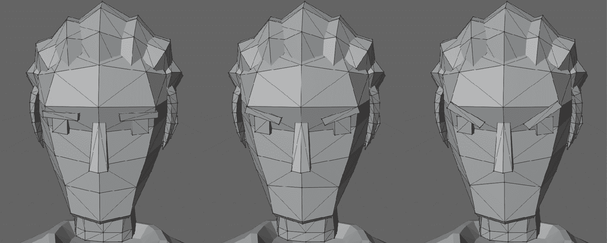

图 10.1：愤怒形态目标动画过程中的三个不同权重

左侧的面部应用了 0%的*愤怒*形态目标动画，只显示原始面部。中间的面部将形态目标应用于 50%，在原始面部和完整形态之间进行半混合，而对于右侧的面部，已经应用了完整的形态目标动画。

如您所见，眉毛已经旋转，嘴巴顶点在最终状态中略微向上移动，顶点位置仅在原始网格和最终网格之间进行插值。但这些微小的顶点位置变化为模型创造了一个完全不同的面部表情。

变形目标动画在你的工具中可能有不同的名称，例如**顶点动画**、**形状插值**、**形状键**或**混合形状**。所有这些名称都描述了相同的技巧：将多个变形版本的网格存储在关键帧中，而网格的动画是通过在关键帧的位置之间插值顶点位置来完成的。

当涉及到成本时，骨骼动画和变形目标动画之间存在一个重要的区别：骨骼动画仅影响模型节点的属性，而变形动画则替换了模型虚拟皮肤的整个网格，并且需要为模型应播放的每个变形动画复制网格，从而增加了模型在磁盘和内存中的整体大小。

模型有相当少的骨骼但有很多顶点用于皮肤，所以每帧重新计算大量顶点的位置会增加变形动画的计算成本。幸运的是，变形动画完全发生在顶点着色器中，并且只是两个保存为向量的位置之间的线性插值。因此，变形动画的额外计算负担在我们的示例代码中仍然是微不足道的。

在 Blender 中，可以通过**形状键**选项在**数据**标签页上控制变形目标动画。*图 10.2*显示了用于*图 10.1*右侧面的设置，**值**设置为`1.000`以应用 100%的**愤怒**变形：

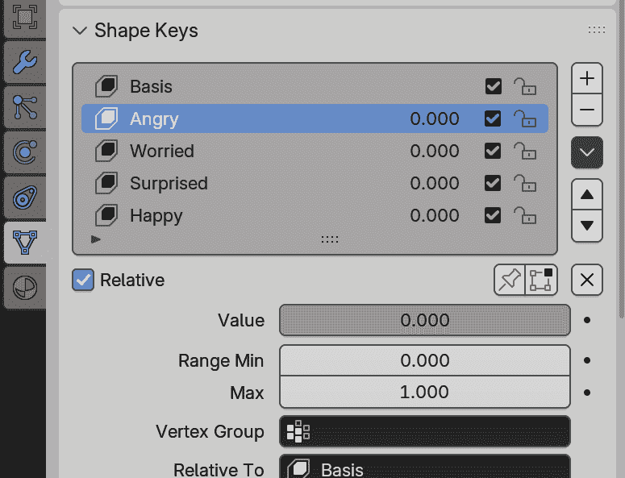

图 10.2：Blender 中控制变形目标动画的形状键

在 Blender 中创建和修改基于形状键的变形目标动画超出了本书的范围。Blender 有一些关于形状键的基本文档，链接包含在*附加资源*部分，并且有很多视频展示了如何在 Blender 中使用形状键。

如果你有一个包含变形目标动画的模型文件可用，比如*第十章*中`assets`文件夹中的两个模型，或者如果你在任何一个现有的模型中创建了你自己的一套变形动画，你就可以进行下一步：使用 Open Asset Importer 库导入这些额外的动画。

现在我们来学习如何将变形目标动画添加到我们的应用程序中。

# 将面部动画添加到代码和 GPU 着色器中

变形目标动画数据在 Assimp 模型文件中存储在两个地方。

变形动画数据的第一部分，即网格，位于`aiMesh`节点的`mAnimMeshes`数组中，网格的数量存储在`aiMesh`的`mNumAnimMeshes`变量中。`mAnimMeshes`数组的每个元素都包含与原始网格完全相同的顶点数，这使得我们能够在不同版本的网格之间插值顶点位置。

这种插值不仅限于在原始网格和形态目标网格之一之间混合。还可能混合两个形态目标网格，或者混合超过两个网格的位置。请注意，混合网格的结果可能并不总是像预期的那么好，因为形态目标动画的效果很大程度上取决于动画师的意图。

形态动画数据的第二部分，关键帧数据，位于`aiAnimation`节点的`mMorphMeshChannels`数组中，该数组中存储了关键帧的数量，在变量`mNumMorphMeshChannels`中。每个关键帧中的键包含特定关键的时间点，以及要使用的形态网格编号和线性插值中的形态网格权重。

我们将只使用网格数据在不同的面部表情之间进行插值，因此我们忽略了形态网格的动画数据。但很容易在本书的代码之上添加对形态目标动画的支持。

作为走向形态动画的第一步，我们将学习如何加载额外的网格数据并提取顶点。

## 加载形态网格

由于形态网格中的每个顶点都替换了原始网格中相同顶点的位置和法线，因此只需要替换顶点的子集数据。我们将在`opengl`文件夹中的`OGLRenderData.h`文件中创建一个名为`OGLMorphVertex`的轻量级顶点版本，只包含位置和法线：

```cpp
struct OGLMorphVertex {
  glm::vec4 position = glm::vec4(0.0f);
  glm::vec4 normal = glm::vec4(0.0f);
}; 
```

为了将替换的形态顶点收集到一个网格中，我们还创建了一个新的`struct`，名为`OGLMorphMesh`，它包含一个`std::vector`中的所有顶点：

```cpp
struct OGLMorphMesh {
  std::vector<OGLMorphVertex> morphVertices{};
}; 
```

由于所有形态网格都依赖于原始网格，我们在默认网格`struct` `OGLMesh`中添加了一个`OGLMorphMesh`向量：

```cpp
struct OGLMesh {
  ...
 **std::vector<OGLMorphMesh> morphMeshes{};**
}; 
```

对于 Vulkan，这两个新的`struct`分别命名为`VkMorphVertex`和`VkMorphMesh`，位于`vulkan`文件夹中的`VkRenderData.h`文件中。`VkMorphMesh`向量被添加到`VkMesh` `struct`中。

在`AssimpMesh`类的`processMesh()`方法结束前，我们添加了一个新的代码块来从模型文件中提取形态网格数据。首先，我们检查当前网格是否附加了任何形态网格：

```cpp
 int animMeshCount = mesh->mNumAnimMeshes;
  if (animMeshCount > 0) { 
```

如果我们找到了形态网格，我们将遍历所有形态网格，提取网格数据和顶点数：

```cpp
 for (unsigned int i = 0; i < animMeshCount; ++i) {
      aiAnimMesh* animMesh = mesh->mAnimMeshes[i];
      unsigned int mAninVertexCount =
        animMesh->mNumVertices; 
```

根据定义，形态网格中的顶点数必须与原始网格中的顶点数相匹配。在这里进行额外的检查并不会造成伤害，如果在检测到顶点数不匹配时跳过整个形态网格并打印错误信息：

```cpp
 if (animVertexCount != mVertexCount) {
        Logger::log(1, "%s error: morph mesh %i vertex
          count does not match (orig mesh has %i vertices,
          morph mesh %i)\n",
      __  FUNCTION__, i, mVertexCount, animVertexCount);
        continue;
      } 
```

接下来，我们检查形态网格是否包含位置数据，如果检查成功，则创建一个临时的`OGLMorphMesh`：

```cpp
 if (animMesh->HasPositions()) {
        OGLMorphMesh newMorphMesh{}; 
```

检查形态网格是否有顶点位置可能听起来很愚蠢，但形态网格也可以覆盖其他数据，例如法线、颜色或纹理位置。可能会遇到没有位置数据的形态网格。

然后，我们遍历所有顶点并提取顶点位置：

```cpp
 for (unsigned int i = 0; i < animVertexCount; ++i) {
          OGLMorphVertex vertex;
          vertex.position.x = animMesh->mVertices[i].x;
          vertex.position.y = animMesh->mVertices[i].y;
          vertex.position.z = animMesh->mVertices[i].z; 
```

如果形态网格中也存储了法线数据，我们提取法线。如果没有法线数据，我们将顶点法线设置为零：

```cpp
 if (animMesh->HasNormals()) {
            vertex.normal.x = animMesh->mNormals[i].x;
            vertex.normal.y = animMesh->mNormals[i].y;
            vertex.normal.z = animMesh->mNormals[i].z;
          } else {
            vertex.normal = glm::vec4(0.0f);
          } 
```

最后，我们将顶点放入临时的`OGLMorphMesh`中，处理完所有顶点后，将`OGLMorphMesh`添加到`OGLMesh`对象的`morphMeshes`向量中，对于这个`AssimpMesh`对象：

```cpp
 newMorphMesh.morphVertices.emplace_back(vertex);
        }
        mMesh.morphMeshes.emplace_back(newMorphMesh);
      }
    }
  } 
```

现在访问任何替代形态网格就像检查`morphMeshes`向量的大小是否大于零一样简单，如果我们有任何形态网格，我们可以提取顶点数据并在原始顶点的位置和法线与所选形态网格的顶点之间进行插值。

到目前为止，在模型文件中找到的所有有效形态网格都作为`AssimpMesh`网格数据的一部分可用。为了使用这些形态网格进行面部动画，我们必须在应用程序中添加一些代码和逻辑。

## 将所有形态网格存储在单个缓冲区中

要在着色器中使用形态网格的顶点，我们将所有形态网格的顶点数据存储到一个单独的 SSBO 中。使用单个 SSBO 是必要的，因为模型实例在屏幕上的实例化渲染需要我们始终能够访问所有网格的顶点数据——因为我们无法确定何时特定的模型实例会被绘制到屏幕上。根据选定的形态网格分割渲染也是可能的，但这将是一个相当昂贵的替代方案，因为我们必须在每次绘制调用中过滤实例。

形态网格 SSBO 和一些相关变量被添加到`AssimpModel`类中。首先，在`AssimpModel.h`头文件中添加了三个新的`private`变量：`mNumAnimatedMeshes`、`mAnimatedMeshVertexSize`和`mAnimMeshVerticesBuffer`：

```cpp
 unsigned int mNumAnimatedMeshes = 0;
    unsigned int mAnimatedMeshVertexSize = 0;
    ShaderStorageBuffer mAnimMeshVerticesBuffer{}; 
```

在`mNumAnimatedMeshes`中，我们存储该模型形态网格的数量。目前，代码只支持包含形态网格的单个网格，所以`mNumAnimatedMeshes`中的数字等于这个特定网格中形态网格的数量。

但由于我们只进行面部动画，单个网格的形态网格限制并不成问题。此外，在*实践课程*部分有一个任务，可以相应地扩展代码并添加对包含形态网格的多网格的支持。

`mAnimatedMeshVertexSize`中的值用于在 SSBO 中找到所选形态剪辑的顶点数据的起始位置。通过乘以网格顶点大小和形态剪辑的索引，我们可以直接跳转到形态剪辑的第一个顶点。

最后，所有顶点数据都存储在`mAnimMeshVerticesBuffer` SSBO 中。

我们还在`AssimpModel.cpp`类的实现文件中添加了两个名为`hasAnimMeshes()`和`getAnimMeshVertexSize()`的`public`方法。多亏了*描述性*的方法名称，不需要进一步解释。

在`AssimpModel`类的`loadModel()`方法中完成填充 SSBO。当所有网格都收集到`mModelMeshes`向量中时，我们可以遍历所有网格，将顶点数据添加到新的缓冲区：

```cpp
 for (const auto& mesh : mModelMeshes) {
    if (mesh.morphMeshes.size() == 0) {
      continue;
    } 
```

在`mAnimMeshVerticesBuffer` SSBO 中收集顶点的第一步是检查这个网格中是否有任何形态网格。如果没有额外的形态网格的网格，我们就简单地继续到下一个网格。

然后，我们创建一个临时的`OGLMorphMesh`，名为`animMesh`，以收集所有顶点并调整`animMesh`中的`morphVertices`向量的大小：

```cpp
 OGLMorphMesh animMesh;
    animMesh.morphVertices.resize(
      mesh.vertices.size() * mNumAnimatedMeshes); 
```

现在，我们可以将形态网格的所有顶点复制到`animMesh`中，使用顶点数来计算正确的位置：

```cpp
 for (unsigned int i = 0; i < mNumAnimatedMeshes; ++i) {
      unsigned int vertexOffset = mesh.vertices.size() * i;
      std::copy(mesh.morphMeshes[i].morphVertices.begin(),
        mesh.morphMeshes[i].morphVertices.end(),
        animMesh.morphVertices.begin() + vertexOffset);
      mAnimatedMeshVertexSize = mesh.vertices.size();
    } 
```

最后，我们将收集到的顶点上传到 SSBO：

```cpp
 mAnimMeshVerticesBuffer.uploadSsboData(
      animMesh.morphVertices);
  } 
```

现在我们需要这个模型的形态动画时，我们可以将缓冲区绑定到指定的着色器绑定点。这种绑定可以通过使用新的`public`方法`bindMorphAnimBuffer()`来实现：

```cpp
void AssimpModel::bindMorphAnimBuffer(int bindingPoint) {
  mAnimMeshVerticesBuffer.bind(bindingPoint);
} 
```

要在实例级别上使用面部动画，我们必须添加一些变量和方法，并扩展一些数据结构。

## 将面部形态设置添加到代码中

启用面部动画最重要的更改是名为`faceAnimation`的新`enum` `class`，它位于`Enums.h`文件中：

```cpp
enum class faceAnimation : uint8_t {
  none = 0,
  angry,
  worried,
  surprised,
  happy
}; 
```

所有支持的形态动画都存储在`faceAnimation` `enum`中，与动作或节点类型相同。我们不会使用模型文件中的形态动画，而只会在代码中使用一组固定的面部动画。

与其他数据类型类似，我们添加了一个从`enum`值到字符串的映射。在代码中使用`enum`值并显示用户友好的字符串在 UI 中要容易得多。新的映射名为`micFaceAnimationNameMap`，将被添加到`ModelInstanceCamData.h`文件中的`ModelInstanceCamData` `struct`：

```cpp
 std::unordered_map<faceAnimation, std::string>
    micFaceAnimationNameMap{}; 
```

在渲染器类文件`OGLRenderer.cpp`或`VkRenderer.cpp`的`init()`方法中填充映射，最佳位置是现有映射代码旁边。

固定形态映射与从模型动态加载

在`faceAnimation` `enum`和`micFaceAnimationNameMap`中硬编码所有形态目标动画剪辑的原因是为了保持代码简单。

从模型文件中填充形态目标剪辑列表很容易，但在 UI 中维护动态列表变得相当复杂。例如，向节点树中添加选择形态剪辑的代码将创建树与单个模型之间的硬依赖 - 使用相同的树为其他模型将变得不可能。

为了避免模型树依赖，将只使用预定义的形态动画集。任何模型都可以支持所有形态动画，没有任何动画，或者部分剪辑与匹配的索引，用空形态动画填充任何空白。

对于实例部分，我们向`InstanceSettings` `struct`中添加了两个新变量，名为`isFaceAnimType`和`isFaceAnimWeight`：

```cpp
 faceAnimation isFaceAnimType = faceAnimation::none;
  float isFaceAnimWeight = 0.0f; 
```

在 `isFaceAnimType` 中，我们存储当前的 facial animation 裁剪。由于 `faceAnimation` 枚举中存在额外的 `none` 值，我们不需要另一个布尔值来切换 facial animations 的开关。默认 facial 网格和 facial animation 之间的插值权重可以通过 `isFaceAnimWeight` 控制，其中 `0.0f` 表示仅显示默认网格，而 `1.0f` 表示变形网格。

`is` 代表 “InstanceSettings”，而不是 “it is”

再次提出旁注，并避免混淆：`InstanceSettings` 变量名中的 `is` 只是 `struct` 名称的缩写，而不是定义状态的东西。因此，`isFaceAnimType` 代表 “Instance Settings Face Animation Type”，而不是控制 facial animation 是否启用的布尔值。

我们还需要为每个实例的渲染器提供有关 facial animations 的信息。让我们在下一步扩展渲染器。

## 在渲染器中填充每个实例的缓冲区数据

至于所有其他与着色器相关的数据，我们需要一个 SSBO 来将数据传递给 GPU。要填充 SSBO，需要一个某种数据类型的 `std::vector`。因此，渲染器类头文件 `OGLRenderer.h` 将获得两个新的 `private` 变量，分别称为 `mFaceAnimPerInstanceData` 和 `mFaceAnimPerInstanceDataBuffer`：

```cpp
 std::vector<glm::vec4> mFaceAnimPerInstanceData{};
    ShaderStorageBuffer mFaceAnimPerInstanceDataBuffer{}; 
```

对于 Vulkan 渲染器，缓冲区的数据类型不同。我们需要在 `VkRenderer.h` 文件中添加以下行：

```cpp
std::vector<glm::vec4> mFaceAnimPerInstanceData{};
VkShaderStorageBufferData mFaceAnimPerInstanceDataBuffer{}; 
```

即使我们需要仅三个值，我们也会在这里使用 `glm::vec4` 来处理可能的数据对齐问题。你应该尽量避免使用三元素向量 (`glm::vec3`) 通过 SSBO 将数据传输到 GPU，因为您可能会在 CPU 侧的向量或结构体和 GPU 侧的缓冲区之间得到不匹配。

每个实例的 facial animation SSBO 将添加到渲染器类文件 `OGLRenderer.cpp` 或 `VkRenderer.cpp` 中的 `draw()` 调用，更具体地说是在遍历模型实例的循环中：

```cpp
 for (const auto& model : mModelInstCamData.micModelList) {
  ...
 **mFaceAnimPerInstanceData.****resize****(numberOfInstances);**
      ...
      for (size_t i = 0; i < numberOfInstances; ++i) { 
```

我们还在循环之前添加了包含变形数据的向量的调整大小；请参阅前一个代码片段中的高亮部分。

由于我们已经在循环中提取了当前实例的 `InstanceSettings` 结构体，因此添加 facial animation 只需要几行代码。

首先，我们添加一个名为 `morphData` 的空 `glm::vec4`，并检查实例是否设置了 facial animation：

```cpp
 glm::vec4 morphData = glm::vec4(0.0f);
    if (instSettings.isFaceAnimType !=
      faceAnimation::none)  { 
```

如果我们应该对实例的 facial 进行动画处理，我们填充 `morphData` 的三个元素：

```cpp
 morphData.x = instSettings.isFaceAnimWeight;
      morphData.y =
        static_cast<int>(instSettings.isFaceAnimType) – 1;
      morphData.z = model->getAnimMeshVertexSize(); 
```

现在，我们设置 facial animation 的权重，clip 数量减一以尊重 `faceAnimation` 枚举中的 `none` 元素，以及两个变形网格之间跳过的顶点数。

当前着色器代码使用顶点数和 clip 数来计算所需变形动画的第一个顶点，但这里也可以使用绝对值。如果计划扩展代码以支持具有变形目标动画的多个网格，绝对值可能会很有用（参见 *实践课程* 部分）。

最后，我们将`morphData`存储在用于填充 SSBO 的向量中：

```cpp
 }
    mFaceAnimPerInstanceData.at(i) = morphData; 
```

作为面部动画的最后一步，顶点着色器必须知道新的缓冲区。

## 扩展着色器以绘制面部动画

由于变形目标动画仅更改顶点数据，我们需要在顶点着色器中添加新的 SSBO 和一些逻辑。不需要触摸计算或片段着色器，这大大简化了面部动画的实现。

为了防止没有面部动画的模型出现扭曲，我们将使用一组单独的着色器来绘制包含变形动画的网格。首先，我们在渲染器头文件`OGLRenderer.h`中添加两个新的`private`着色器变量：

```cpp
 Shader mAssimpSkinningMorphShader{};
    Shader mAssimpSkinningMorphSelectionShader{}; 
```

对于 Vulkan 渲染器，这里需要做更多的工作，因为着色器是管线的一部分。我们需要在`VkRenderData.h`文件中添加两个`VkPipelineLayout`句柄、两个`VkPipeline`句柄、两个`VkDescriptorSetLayout`句柄和两个`VkDescriptorSet`句柄：

```cpp
VkPipelineLayout rdAssimpSkinningMorphPipelineLayout;
VkPipelineLayout
  rdAssimpSkinningMorphSelectionPipelineLayout;
VkPipeline rdAssimpSkinningMorphPipeline;
VkPipeline rdAssimpSkinningMorphSelectionPipeline;
VkDescriptorSetLayout
  rdAssimpSkinningMorphSelectionDescriptorLayout;
VkDescriptorSetLayout
  rdAssimpSkinningMorphPerModelDescriptorLayout;
VkDescriptorSet rdAssimpSkinningMorphDescriptorSet;
VkDescriptorSet
  rdAssimpSkinningMorphSelectionDescriptorSet; 
```

使用这些句柄，创建了两个新的 Vulkan 管线，用于绘制带有和没有特殊选择处理的模型。有关进一步的 Vulkan 实现细节，请查看`VkRenderer.cpp`文件。

我们需要调整选择顶点着色器以在选择缓冲区中绘制变形的面部网格。如果没有选择着色器，实例的头部将无法通过点击鼠标按钮进行选择。

对于着色器代码本身，我们可以重用和扩展现有的文件。将以下四个文件复制到新的文件名中：

+   将`assimp_skinning.vert`重命名为`assimp_skinning_morph.vert`

+   将`assimp_skinning.frag`重命名为`assimp_skinning_morph.frag`

+   将`assimp_skinning_selection.vert`重命名为`assimp_skinning_morph_selection.vert`

+   将`assimp_skinning_selection.frag`重命名为`assimp_skinning_morph_selection.frag`

带有`.frag`扩展名的片段着色器将不会更改，但为了进一步的更改或调试，始终最好为新的着色器使用单独的文件。

在以`.vert`结尾的两个顶点着色器文件中，添加以下行以定义新的`MorphVertex` `struct`，与在`opengl`文件夹中的`OGLRenderData.h`文件中定义的`OGLMorphVertex` `struct`相匹配：

```cpp
struct MorphVertex {
  vec4 position;
  vec4 normal;
}; 
```

对于 Vulkan，原始`struct`的名称是`VkMorphVertex`，在`vulkan`文件夹中的`VkRenderData.h`文件中定义。

然后，在绑定点四和五上添加两个新的 SSBO（Shader Storage Buffer Objects），分别命名为`AnimMorphBuffer`和`AnimMorphData`：

```cpp
layout (std430, binding = 4) readonly restrict
    buffer AnimMorphBuffer {
  MorphVertex morphVertices[];
};
layout (std430, binding = 5) readonly restrict
    buffer AnimMorphData {
  vec4 vertsPerMorphAnim[];
}; 
```

第一个缓冲区`AnimMorphBuffer`包含所有可用的变形动画的顶点。在第二个缓冲区`AnimMorphData`中，所有实例设置从 CPU 传递到 GPU。

在顶点着色器的`main()`方法内部，我们通过乘以每个实例的顶点数和面部动画剪辑的索引来计算所需面部动画的顶点偏移量：

```cpp
 int morphAnimIndex =
    int(vertsPerMorphAnim[gl_InstanceID].y *
        vertsPerMorphAnim[gl_InstanceID].z); 
```

在这里将 `float` 类型的值转换为 `int` 没有问题，这样可以避免使用一个包含单独整数和浮点值的不同结构体，并使用 `glm::vec4` 作为“传输对象”。第一个由浮点数表示的不准确整数将是 2²⁴+1，这个值足够大，即使是带有许多面动画的大网格（2²⁴+1 将是 ~16 MiB 的顶点数据）。

然后我们通过使用 `gl_VertexID` 内部着色器变量（对于 Vulkan 是 `gl_VertexIndex`）从变形网格中提取顶点：

```cpp
 vec4 origVertex = vec4(aPos.x, aPos.y, aPos.z, 1.0);
  vec4 morphVertex = vec4(morphVertices[gl_VertexID +
    morphAnimOffset].position.xyz, 1.0) 
```

现在我们可以根据权重因子混合原始顶点和从变形网格中替换的顶点的位置：

```cpp
 gl_Position = projection * view * worldPosSkinMat *
    mix(origVertex, morphVertex,
    vertsPerMorphAnim[gl_InstanceID].x); 
```

由于顶点的位置变化也可能影响顶点所在的三角形的法线，因此我们对顶点法线也进行相同的提取和计算工作：

```cpp
 vec4 origNormal =
    vec4(aNormal.x, aNormal.y, aNormal.z, 1.0);
  vec4 morphNormal =
    vec4(morphVertices[gl_VertexID +
    morphAnimOffset].normal.xyz, 1.0);
  normal = transpose(inverse(worldPosSkinMat)) *
    mix(origNormal, morphNormal,
    vertsPerMorphAnim[gl_InstanceID].x); 
```

为了更好地选择带有和没有变形动画的网格，我们还需要在 `AssimpModel` 类和渲染器中进行一些小的更改。

## 完成面部动画代码

在 `AssimpModel` 类中，添加了两个新的绘制方法：

```cpp
 void drawInstancedNoMorphAnims(int instanceCount);
    void drawInstancedMorphAnims(int instanceCount); 
```

方法名说明了它们的功能：`drawInstancedNoMorphAnims()` 绘制所有没有变形动画的网格，而 `drawInstancedMorphAnims()` 仅绘制带有变形动画的网格。

为了在两种方法中过滤网格，我们使用了一个相当简单的检查 - 我们遍历所有网格，查看网格内部 `morphMeshes` 向量的大小。对于仅绘制非变形网格的 `drawInstancedNoMorphAnims()` 方法，我们简单地跳过没有额外变形网格的网格：

```cpp
 for (unsigned int i = 0; i < mModelMeshes.size(); ++i) {
    if (mModelMeshes.at(i).morphMeshes.size() > 0) {
      continue;
    }
    OGLMesh& mesh = mModelMeshes.at(i);
    drawInstanced(mesh, i, instanceCount);
  } 
```

对于仅变形网格的版本，我们反转检查：

```cpp
 ...
    if (mModelMeshes.at(i).morphMeshes.size() == 0) {
      continue;
    ...
    } 
```

使用两个单独的方法的原因在于渲染器类文件 `OGLRenderer.cpp` 或 `VkRenderer.cpp` 中的 `draw()` 方法。在那里，我们将动画模型的正常实例绘制调用替换为无变形版本：

```cpp
**model->****drawInstancedNoMorphAnims****(numberOfInstances);** 
```

在检查模型是否包含任何变形网格后，绘制带有变形动画的网格，如下面的 OpenGL 渲染器的代码所示：

```cpp
 if (model->hasAnimMeshes()) {
        mAssimpSkinningMorphShader.use();
        ...
        model->bindMorphAnimBuffer(4);
        mFaceAnimPerInstanceDataBuffer.uploadSsboData(
          mFaceAnimPerInstanceData, 5);
        model->drawInstancedMorphAnims(numberOfInstances);
      } 
```

在这种情况下，我们使用新的变形着色器，绑定包含顶点数据和实例设置的 SSBO，并使用仅绘制带有变形动画的网格的绘制调用。

对于简单的测试，你可以在渲染器中将 `morphData` 值设置为一些固定值，并检查实例是否在愤怒或微笑地四处移动。但要完全控制新的设置，我们还将添加一个组合框和滑块到 UI 中。

## 添加 UI 元素以控制面部动画

对于 UI，代码量很小。我们只需要一个组合框，将 `InstanceSettings` 的 `isFaceAnimType` 值映射到 `micFaceAnimationNameMap` 中的字符串，以及一个与 `isFaceAnimWeight` 链接的浮点滑块。对于没有面部动画的模型，我们简单地禁用组合框和滑块。

*图 10.3* 显示了扩展的组合框，包含四个面部动画以及禁用面部动画的 `None` 设置：

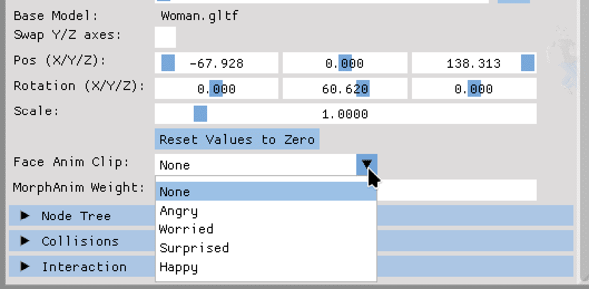

图 10.3：控制实例面部动画的 UI 设置

我们现在可以选择面部动画剪辑，并通过使用权重滑块来控制面部动画形态的使用量。

作为面部动画实现的最后一步，我们将介绍如何将新设置添加到 YAML 配置文件中。

## 保存和加载新的实例设置

幸运的是，当前 YAML 解析器和发射器代码的状态允许我们几乎不费吹灰之力地添加面部动画。由于面部动画设置是按实例设置的，我们需要扩展`tools`文件夹中`YamlParser.cpp`文件中的`InstanceSettings`的 YAML 发射器输出操作符。

在可选节点树设置输出之后，我们检查是否配置了面部动画，如果设置了剪辑，则输出实例设置：

```cpp
 if (settings.isFaceAnimType != faceAnimation::none) {
    out << YAML::Key << "face-anim-index";
    out << YAML::Value << settings.isFaceAnimType;
    out << YAML::Key << "face-anim-weight";
    out << YAML::Value << settings.isFaceAnimWeight;
  } 
```

为了输出`faceAnimation` `enum`，我们还需要为新数据类型定义输出操作符：

```cpp
YAML::Emitter& operator<<(YAML::Emitter& out,
    const faceAnimation& faceAnim) {
  out << YAML::Flow;
  out << static_cast<int>(faceAnim);
  return out;
} 
```

在`YamlParserTypes.h`文件中，我们还需要为新的`faceAnimation`数据类型提供一个简单的`decode()`方法：

```cpp
template<>
struct convert<faceAnimation> {
  static bool decode(const Node& node, faceAnimation& rhs) {
      rhs = static_cast<faceAnimation>(node.as<int>());
      return true;
    }
  }; 
```

`encode()`方法在这里没有展示，它本质上与所有其他`enum` `encode()`方法做的是一样的事情：将节点数据转换为`int`。

最后，我们只需扩展`ExtendedInstanceSettings`的`decode()`方法，添加两个新值：

```cpp
 if (node["face-anim"]) {
        rhs.isFaceAnimType =
          node["face-anim"].as<faceAnimation>();
        rhs.isFaceAnimWeight =
          node["face-anim-weight"].as<float>();
      } 
```

`encode()`方法扩展也非常简单：

```cpp
 if (rhs.isFaceAnimType != faceAnimation::none) {
        node["face-anim"] = rhs.isFaceAnimType;
        node["face-anim-weight"] = rhs.isFaceAnimWeight;
      } 
```

确保提高配置文件的版本，因为我们向其中添加了新数据。在这种情况下，更改文件版本不太关键，因为前几章的解析器版本根本不知道新的设置。

就这样！现在当你选择一个实例时，你可以改变面部表情的类型和强度，如图 10.4 所示：

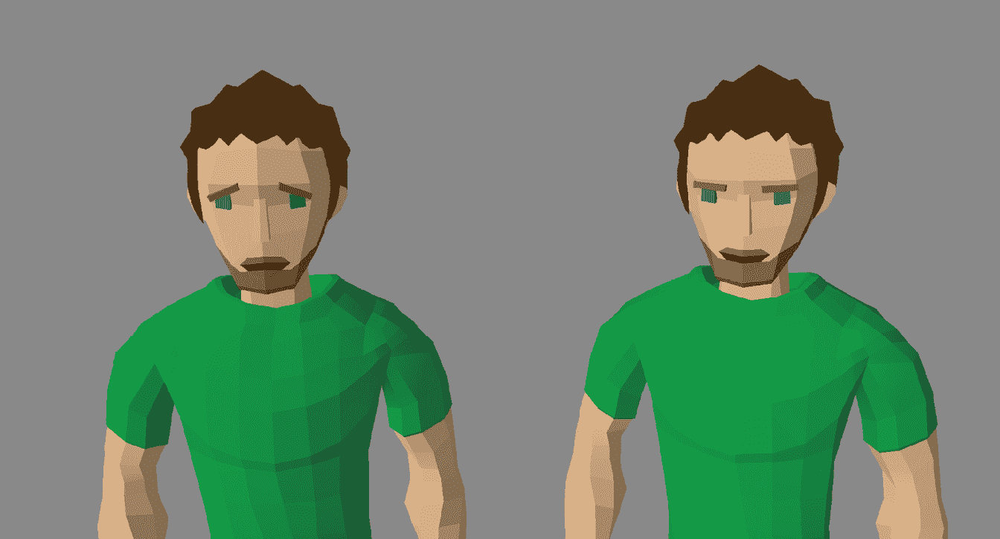

图 10.4：一个“担忧”的实例在默认面部网格旁边

面部动画可以控制每个实例，一个实例的变化不会影响其他实例。是否想让实例显得愤怒、担忧、快乐，甚至惊讶，以及这种表情显示的程度，完全取决于你。

向应用程序添加更多形态剪辑也很容易。对于新剪辑来说，最复杂的事情可能是使用 Blender 等工具中的顶点动画。在代码中，只需向`faceAnimation` `enum` `class`添加一个新值，并在`ModelInstanceCamData` `struct`的`micFaceAnimationNameMap`变量中添加一个新的字符串映射即可。

要能够在节点树中使用新的面部动画，我们需要创建一个新的节点类型，允许我们控制所需的形态目标动画的动画剪辑和权重。所以，让我们添加全新的**FaceAnim**节点。

# 在节点树中使用面部动画

创建新的节点类型很简单。首先，我们在 `graphnodes` 文件夹中添加一个新的类，`FaceAnimNode`，由 `FaceAnimNode.h` 头文件和实现文件 `FaceAnimNode.cpp` 组成。我们可以从 WaitNode 中借用大部分实现，添加 ImGui 元素和一些逻辑来控制执行时间内的面部动画。*图 10.5* 显示了 FaceAnim 节点的最终布局：

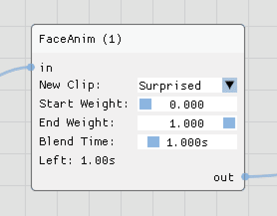

图 10.5：新的 FaceAnim 节点

该节点允许我们选择一个面部动画剪辑，包括 `None` 设置以禁用实例上的面部动画，动画在两个播放方向上的起始和结束权重，以及一个计时器来控制动画重放将持续多长时间。

在我们能够添加新的 `FaceAnim` 节点之前，我们必须扩展包含节点类型和图节点工厂类的 `enum`：

## 调整新 FaceAnim 节点的代码

与 WaitNode 类似，`FaceAnim` 节点延迟控制流，直到计时器达到零，并在动画重放结束后通知父节点。

在添加两个新文件之后，创建新的节点类型需要额外两个步骤。

首先，我们必须在 `Enums.h` 文件中扩展 `graphNodeType` `enum`：

```cpp
enum class graphNodeType : int8_t {
  ...
 **faceAnim,**
  NUM
}; 
```

接下来，`GraphNodeFactory` 类的构造函数和 `makeNode()` 方法必须知道新的节点。在构造函数中，我们将节点标题字符串添加到 `mGraphNodeTypeMap`：

```cpp
 mGraphNodeTypeMap[graphNodeType::faceAnim] = "FaceAnim"; 
```

在 `makeNode()` 中，我们为新的节点类型添加一个情况块：

```cpp
 case graphNodeType::faceAnim:
      newNode = std::make_shared<FaceAnimNode>(nodeId);
      break; 
```

现在我们可以调整新 `FaceAnimNode` 类的实现。

## 添加 FaceAnim 节点

由于我们将手动在两个权重值之间混合，一旦节点激活，我们将在 `update()` 方法中将混合时间映射到零到一的范围：

```cpp
 float morphTimeDiff = 1.0f;
  if (mFaceAnimBlendTime != 0.0f) {
    morphTimeDiff = std::clamp(mCurrentTime /
      mFaceAnimBlendTime, 0.0f, 1.0f);
  } 
```

通过一个简单的除法，周围带有避免除以零的检查，`morphTimeDiff` 中的时间差将从一变为零。

然后我们通过时间差和权重差的乘积来插值最终的权重：

```cpp
 float morphWeightDiff =
    mFaceAnimEndWeight – mFaceAnimStartWeight;
  float currentWeight =
    mFaceAnimEndWeight - morphWeightDiff * morphTimeDiff; 
```

在每次 `update()` 方法的运行中，我们通过 `fireNodeOutputCallback` 持续发送新的权重到渲染器：

```cpp
 instanceUpdateType updateType =
    instanceUpdateType::faceAnimWeight;
  nodeCallbackVariant result;
  bool extra = false;
  result = currentWeight;
  fireNodeActionCallback(getNodeType(), updateType,
    result, extra); 
```

在进行权重更新之前，我们在 `activate()` 方法中发送所需的动画剪辑索引：

```cpp
 instanceUpdateType updateType =
    instanceUpdateType::faceAnimIndex;
  nodeCallbackVariant result;
  bool extra = false;
  result = mFaceAnim;
  fireNodeActionCallback(getNodeType(), updateType,
    result, extra); 
```

为了将面部动画值信号传递给渲染器，需要通过两个新值 `faceAnimIndex` 和 `faceAnimWeight` 扩展 `instanceUpdateType` `enum`：

```cpp
enum class instanceUpdateType : uint8_t {
  ...
 **faceAnimIndex,**
 **faceAnimWeight**
}; 
```

我们还需要在 `nodeCallbackVariant` 变体中添加 `faceAnimation` 类型，以便在类之间的回调中使用新的数据类型：

```cpp
using nodeCallbackVariant = std::variant<float, moveState, moveDirection, **faceAnimation**>; 
```

由于我们在节点中使用了 `fireNodeOutputCallback`，因此需要扩展 `GraphEditor` 和 `SingleInstanceBehavior` 类：

在 `graphnodes` 文件夹中的 `GraphEditor.cpp` 文件中，必须在 `createNodeEditorWindow()` 方法中添加 `faceAnim` 节点类型，以将节点动作回调绑定到新创建的 `faceAnim` 节点：

```cpp
 if (nodeType == graphNodeType::instance ||
            nodeType == graphNodeType::action **||**
 **nodeType == graphNodeType::faceAnim** {
          newNode->setNodeActionCallback(
            behavior->bdNodeActionCallbackFunction);
        } 
```

在`SingleInstanceBehavior`复制构造函数中存在类似的检查；我们还需要在这里添加`faceAnim`节点类型以绑定节点动作回调：

```cpp
 if (node->getNodeType() == graphNodeType::instance ||
        node->getNodeType() == graphNodeType::action **||**
 **node->****getNodeType****() == graphNodeType::faceAnim** {
      newNode->setNodeActionCallback(
        mBehaviorData->bdNodeActionCallbackFunction);
    } 
```

除了在更改面部动画设置时操作`InstanceSettings`变量之外，我们还向`AssimpInstance`类添加了两个新的设置器，以简化对新的`InstanceSettings`变量的访问。

## 启用实例和渲染器对面部动画更改做出反应

如果我们需要调整多个值，通过先读取所有数据然后在最后写回所有数据来更新`InstanceSettings`是好的。对于单个更改，单独的设置器更容易使用。我们向`AssimpInstance`类添加了两个新的`public`方法`setFaceAnim()`和`setFaceAnimWeight()`：

```cpp
 void setFaceAnim(faceAnimation faceAnim);
    void setFaceAnimWeight(float weight); 
```

两种方法都会更新实例的`InstanceSettings`数据中的两个值，以及一些额外的逻辑来处理`faceAnimation` `enum`的`none`值。

作为新节点的最后一步，渲染器类的`updateInstanceSettings()`方法（`OGLRenderer.cpp`或`VkRenderer.cpp`）需要知道当实例想要更改面部动画设置时应该做什么。

为了做到这一点，在节点类型的`switch`块中，必须添加一个新的`case`块来处理新的`faceAnim`节点类型：

```cpp
 switch (nodeType) {
    ...
**case** **graphNodeType::faceAnim:** 
```

然后，我们检查收到的面部动画更新类型。由于我们需要对面部动画剪辑索引和剪辑权重的变化做出反应，因此添加了一个新的`switch`/`case`语句，包含两种更新类型：

```cpp
 switch (updateType) {
        case instanceUpdateType::faceAnimIndex:
          instance->setFaceAnim(
            std::get<faceAnimation>(data));
          break;
        case instanceUpdateType::faceAnimWeight:
          instance->setFaceAnimWeight(
            std::get<float>(data));
          break;
        default:
          break; 
```

我们还需要关闭`faceAnim`节点类型的`case`块：

```cpp
 }
      break; 
```

对于两种新的更新类型`faceAnimIndex`和`faceAnimWeight`，`AssimpInstance`类中新增的方法将使用`nodeCallbackVariant`变体中的数据作为参数被调用。

这最后一步完成了从新节点到渲染器的链路，使我们能够在节点编辑器中使用面部动画。可以将 FaceAnim 节点添加到男人的模型节点树中，以将所有实例的波浪动画更改为带有微笑的面部波浪，如图*图 10.6*所示：

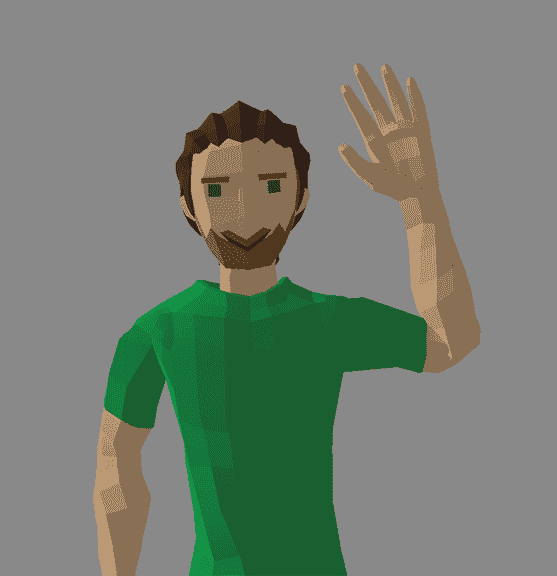

图 10.6：节点树中结合“波浪”动作和“笑脸”动画

节点树中还可以添加更多内容。你可以在打或踢之前让模型生气，或者在播放拾取动画之前惊讶，以模拟实例在地面上看到了某物。而且，随着骨骼和面部动画剪辑的增多，可以创造出更多有趣和疯狂的组合。

能够从一个人的面部表情中看到他们的情绪有助于我们人类评估可能的下一步行动，将面部表情引入应用程序使得与实例的交互方式更加广泛。通过使用形变目标动画，即使是我们的基本低多边形模型也展现出更多的个性。

但是，形变目标动画有三个严重的限制，我们将在下一节讨论。

## 形变目标动画的限制

在使用变形目标动画时，我们必须注意这三个限制：

+   网格中的顶点数必须在所有动画和帧中相同。在帧内或动画过程中无法添加或删除顶点，也不能更改顶点分配到三角形的分配。你只能移动顶点。

+   模型的变形部分整个网格必须在动画中的每个变形键中复制。对于模型身体的小部分，这可能没问题，但身体的高细节部分在内存中多次出现可能会造成明显的开销。

+   只支持顶点位置的变化，变形通常通过简单的线性插值来完成。小旋转可以通过位置变化来模拟，但通过大旋转或缩放移动顶点，例如转动头部或移动手部，将在插值过程中产生视觉扭曲。

你可以在 Blender 中自己测试第三个限制。为此，添加一个基于变形目标的头部旋转，你将看到旋转也影响了头部的体积。旋转角度越大，动画中的扭曲就越大。

*图 10.7* 展示了大约 50%的头部旋转 180 度的结果：

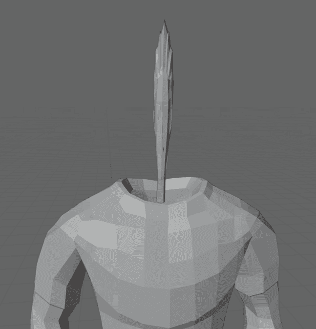

图 10.7：使用变形目标动画旋转头部时的扭曲体积

在对模型进行动画时，必须仔细创建和测试变形目标动画。它们是动画的有价值补充，但仍然存在一些缺点。

我们如何创建可能需要旋转的高级动画，而不使用变形目标动画，例如一个复杂的头部运动动画，让模型在虚拟世界中四处张望？

随着我们深入探讨加法混合，这就是我们将要学习的内容。

# 实现加法混合

加法混合是动画混合的另一种方法。虽然 *正常* 动画混合用于在两个骨骼动画剪辑之间进行插值，而变形目标动画则是改变网格的顶点位置，但加法混合 *堆叠* 两种不同的骨骼动画。

加法混合的技术部分惊人地简单，但通过组合两种不同的骨骼动画所达到的效果，使得 3D 模型的外观更加自然。

让我们探讨加法混合和我们已经知道的动画混合方法之间的相似之处和不同之处。

## 加法混合是如何工作的

加法混合的基本思想源于将模型动画分割成多个，尤其是独立部分的需求。

骨骼动画通常为整个模型提供动画，使模型能够奔跑、行走、出拳或跳跃。在骨骼动画之间进行混合将平滑这两个剪辑之间的过渡，但不会添加新的动作。因此，有两种不同的方法：分割骨骼或堆叠动画。

将骨骼分割成两个或更多动画域，并为骨骼的每个部分播放不同的剪辑，这被称为**分层混合**。分层混合是一种简单且成本效益高的混合动画方法，因为骨骼的每个节点只受单个动画剪辑的变换影响，只是对于节点来说，动画剪辑是不同的。

但是，将模型骨骼分割成多个部分，每个部分播放不同的骨骼动画，可能会导致在全身同步剪辑时需要额外的努力。在分割骨骼动画上的同步回放失败可能会导致视觉伪影，想想不同回放速度的剪辑。

我们在书中没有处理分层混合，但在*实践环节*部分有一个任务可以实现模型的分层动画混合。相比之下，加性混合允许在另一个骨骼动画之上*叠加*骨骼动画。当基本骨骼动画创建的基本动作正常应用时，一个或更多其他骨骼动画的属性变化被添加到模型的节点上，从而创建一个与基本动画提供的动作连接的运动。与分层混合相比，加性混合的计算成本更高，因为我们需要计算多个动画，并且我们还需要混合所有动画。例如，这种简单的属性变化添加允许我们向正常骨骼动画中添加头部运动。模型将能够从骨骼动画中跑步、行走、出拳或跳跃，并且同时移动头部。作为额外的好处，面部动画不受加性混合的影响，因此模型可以行走、向右看并微笑，所有三个动画都在并行运行。

在技术实现部分，通过将当前姿态与参考姿态之间的节点变换差异添加到另一个骨骼动画中，来完成加性动画。

让我们用另一个例子来解释技术方面。*图 10.8*显示了仅将模型头部节点向右旋转（从模型的角度看），而所有其他节点保持 T 形姿态的动画的第一个和最后一个关键帧：

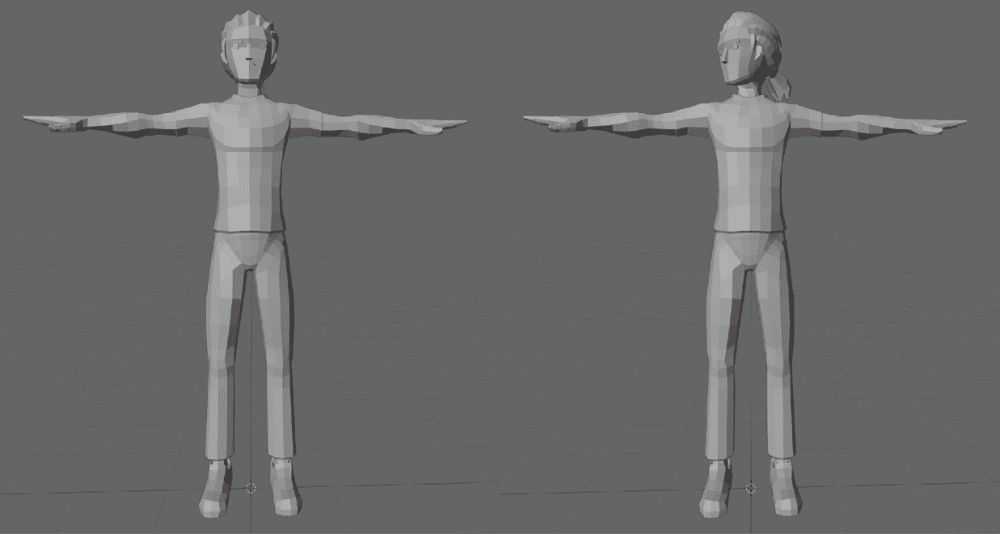

图 10.8：加性动画“头部向右看”的起始和结束姿态

作为参考姿态，我们使用第一个关键帧，整个模型处于 T 形姿态。为了计算加性动画的值，我们取所需的关键帧，并简单地从目标姿态中减去参考姿态的平移、旋转和缩放值。

如果模型保持 T 形姿态，加性动画的所有值都将为零。并且不会向正在运行的骨骼动画中添加任何内容，例如，行走周期。

当我们在*图 10.8*的动画片段中进一步前进时，头部的旋转会导致当前姿态和参考姿态之间头部节点旋转值的差异更大。但我们将只得到头部节点的差异，所有其他节点的变换仍然与参考姿态相同。

将头部节点旋转的差异添加到当前正在运行的骨骼动画剪辑中很容易。由于我们收集了所有节点的变换属性，两个骨骼动画的组合只是简单地按节点添加平移和缩放值，以及旋转值的四元数乘法。

这种添加只更改了与参考姿态相比在添加动画剪辑的动画剪辑中发生变化的节点值。在添加动画中没有变化的节点将在骨骼动画中保持不变。

如何创建合适的动画

创建用于添加混合的动画超出了本书的范围，类似于创建面部动画。您可以使用像 Blender 这样的工具，或者使用*第十章*中的人模型，该模型已经包含四个额外的动画，仅改变头部。

如果您自己创建额外的动画，请确保在剪辑名称前加上一些常见的标识，例如下划线，或者字母*ZZZ_*，以将它们分组在一起。至少 Blender 在导出时会按名称排序剪辑，而且我们根据剪辑在 YAML 配置文件中的索引号存储了多个剪辑映射，将新剪辑添加到现有剪辑的开始或中间会导致配置文件损坏。

在我们的应用程序中实现添加动画也非常简单。

## 扩展代码以支持添加动画

为了将附加数据带到 GPU 上，我们在`opengl`文件夹中的`OGLRenderData.h`文件中为`struct` `PerInstanceAnimData`添加了四个新变量：

```cpp
struct PerInstanceAnimData {
  ...
**unsigned****int** **headLeftRightAnimClipNum;**
**unsigned****int** **headUpDownAnimClipNum;**
  ...
**float** **headLeftRightReplayTimestamp;**
**float** **headUpDownReplayTimestamp**;
}; 
```

对于 Vulkan，文件名为`VkRenderData.h`，位于`vulkan`文件夹中。

我们将头部动画分为两部分，并使用单独的变量来控制头部的左右动画和上下动画。同时向左和向右移动头部是不可能的，因此我们可以将这两个方向组合成一个控制变量。对于向上和向下移动头部也是如此。

然后，我们在渲染器类文件`OGLRanderer.cpp`中创建了一个新的`private`计算着色器，名为`mAssimpTransformHeadMoveComputeShader`：

```cpp
 Shader mAssimpTransformHeadMoveComputeShader{}; 
```

对于 Vulkan，我们在`VkRenderData.h`文件中添加了一个新的`VkPipeline`句柄，名为`rdAssimpComputeHeadMoveTransformPipeline`：

```cpp
 VkPipeline rdAssimpComputeHeadMoveTransformPipeline; 
```

由于并非所有模型都可能具有加法头部动画，如果没有设置头部动画，我们可以跳过额外的计算。我们还将在`PerInstanceAnimData` `struct`中添加新变量到计算着色器文件`assimp_instance_transform.comp`。新的头部动画变量将被忽略，但我们需要在两个着色器中将结构体扩展到相同的大小。

接下来，我们将`assimp_instance_transform.comp`文件复制到`assimp_instance_headmove_transform.comp`，并在`OGLRenderer.cpp`的`init()`方法中加载新文件到新的`mAssimpTransformHeadMoveComputeShader`计算着色器。对于 Vulkan，我们在`VkRenderer.cpp`的`createPipelines()`方法中创建新的渲染管线，加载头部变换计算着色器。

在新的着色器文件中，大部分新增内容只是复制粘贴的工作。我们必须在扩展的计算着色器中执行以下步骤，以左侧/右侧头部运动的旋转部分的代码为例：

1.  提取两个头部动画的动画剪辑编号：

    ```cpp
     uint headLeftRightClip =
        instAnimData[instance].headLeftRightAnimClipNum; 
    ```

1.  提取两个头部动画的逆缩放因子：

    ```cpp
     float headLeftRightRotInvScaleFactor =
        lookupData[headLeftRightClip * clipOffset +
          node * boneOffset + lookupWidth].x; 
    ```

1.  计算访问头部动画查找数据的索引值：

    ```cpp
     int headLeftRightRotLookupIndex =
        clamp(int(instAnimData[instance]
          .headLeftRightReplayTimestamp *
          headLeftRightRotInvScaleFactor) + 1, 0,
          lookupWidth - 1); 
    ```

1.  获取参考姿态在第一个查找位置和所需头部动画剪辑时间戳的平移、旋转和缩放值：

    ```cpp
     vec4 headLeftRightBaseRotation =
         lookupData[headLeftRightClip * clipOffset + node *
         boneOffset + lookupWidth + 1];
    ...
      vec4 headLeftRightRotation =
        lookupData[headLeftRightClip * clipOffset + node *
        boneOffset + lookupWidth +
        HeadLeftRightRotLookupIndex]; 
    ```

1.  使用四元数乘法计算当前姿态变换值与参考姿态变换值之间的差异：

    ```cpp
     vec4 headLeftRightRotationDiff =
        qMult(qInverse(headLeftRightBaseRotation),
          headLeftRightRotation); 
    ```

1.  将两个头部动画的平移、旋转和缩放差异累加到每个变换的单个值中：

    ```cpp
     vec4 headRotationDiff =
        qMult(headUpDownRotationDiff,
        headLeftRightRotationDiff); 
    ```

1.  将累加的差异添加到第一个和第二个剪辑变换中，再次使用四元数乘法进行旋转：

    ```cpp
     vec4 finalRotation =
        slerp(qMult(headRotationDiff, firstRotation),
        qMult(headRotationDiff, secondRotation), blendFactor); 
    ```

实例还需要携带有关头部运动的信息，因此我们在`InstanceSettings.h`文件中的`InstanceSettings` `struct`中添加了两个新变量`isHeadLeftRightMove`和`isHeadUpDownMove`：

```cpp
**float** **isHeadLeftRightMove =** **0.0f****;**
**float** **isHeadUpDownMove =** **0.0f****;** 
```

我们将`0.0f`到`1.0f`之间的正范围映射到向左和向上的头部运动，将`0.0f`到`-1.0f`的负范围映射到向右或向下的头部运动。移动值为零时将使用两个动画的参考姿态的值，导致没有任何头部运动。

在`OGLRenderer`或`VKRenderer`类的`draw()`调用中填充`PerInstanceAnimData` `struct`中的新数据，这部分代码与面部动画相同。按照之前解释的映射方法，选择剪辑编号的操作如下所示：

```cpp
if (instSettings.isHeadLeftRightMove > 0.0f) {
  animData.headLeftRightAnimClipNum =
    modSettings.msHeadMoveClipMappings[
    headMoveDirection::left];
} else {
  animData.headLeftRightAnimClipNum =
   modSettings.msHeadMoveClipMappings[
   headMoveDirection::right];
} 
```

对于头部运动，我们使用时间戳的绝对值：

```cpp
animData.headLeftRightReplayTimestamp =
  std::fabs(instSettings.isHeadLeftRightMove) *
    model->getMaxClipDuration(); 
```

在代码中硬编码剪辑编号是一个坏主意，因为不同的模型在这些新的动画上可能有不同的剪辑索引，或者根本没有。让我们添加另一个映射，这次是在加法混合剪辑编号和头部可能移动的四个方向之间。

## 为新的头部动画创建映射

对于剪辑和头部动画之间的映射，在 `Enums.h` 文件中创建了一个新的 `enum` `class` 叫做 `headMoveDirection`：

```cpp
enum class headMoveDirection : uint8_t {
  left = 0,
  right,
  up,
  down,
  NUM
}; 
```

对应的字符串映射 `micHeadMoveAnimationNameMap` 用于在 UI 中显示名称，被添加到 `ModelInstanceCamData` `结构体`：

```cpp
 std::unordered_map<headMoveDirection, std::string>
    micHeadMoveAnimationNameMap{}; 
```

由于映射与模型相关，新的 `msHeadMoveClipMappings` 映射被添加到 `ModelSettings.h` 文件中的 `ModelSettings` `结构体`：

```cpp
 std::map<headMoveDirection, int> msHeadMoveClipMappings{}; 
```

`AssimpModel` 类也获得了一个新的 `public` 方法来检查 `msHeadMoveClipMappings` 中的所有映射是否都处于活动状态：

```cpp
 bool hasHeadMovementAnimationsMapped(); 
```

如果找不到至少一个头部动画，会导致添加式头部动画被禁用。

在 `OGLRenderer.cpp` 文件的 `draw()` 调用中，我们根据所有头部动画映射的可用性切换计算着色器：

```cpp
 if (model->hasHeadMovementAnimationsMapped()) {
          mAssimpTransformHeadMoveComputeShader.use();
        } else {
          mAssimpTransformComputeShader.use();
        } 
```

对于 Vulkan，我们在 `VkRenderr.cpp` 文件的 `runComputeShaders()` 方法中使用头部移动动画的可用性来选择绑定到计算着色器的管道：

```cpp
if (model->hasHeadMovementAnimationsMapped()) {
  vkCmdBindPipeline(mRenderData.rdComputeCommandBuffer,
    VK_PIPELINE_BIND_POINT_COMPUTE,
    mRenderData.rdAssimpComputeHeadMoveTransformPipeline);
} else {
  vkCmdBindPipeline(mRenderData.rdComputeCommandBuffer,
    VK_PIPELINE_BIND_POINT_COMPUTE,
    mRenderData.rdAssimpComputeTransformPipeline);
 } 
```

头部动画的 UI 部分可以主要从 `UserInterface` 类中的其他部分复制代码。一个用于选择剪辑的组合框，一个遍历 `headMoveDirection` `enum` 中所有四个值的循环，两个按钮和两个滑块来测试动画，这些都是我们创建一个新 UI 部分（如图 10.9 所示）所需的所有内容：

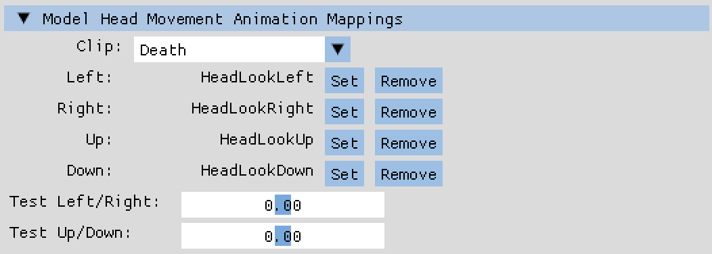

图 10.9：头部运动/动画剪辑映射的 UI 控制

裁剪映射和裁剪来自当前选定实例的模型，这使得为所有模型配置添加式头部动画变得容易。

要在节点树中使用头部动画，还需要另一个新的节点类型。

## 添加头部动画节点

多亏了之前的 `FaceAnimNode` 节点，添加新的 `HeadAnimNode` 只需几分钟。你可以按照 *使用节点树中的面部动画* 部分的步骤创建新节点，因为你必须执行与 `FaceAnimNode` 相同的操作。只需要进行一些小的更改，比如 `enum` `class` 条目的名称。

对于新节点的 UI 部分，你可以重用 `FaceAnimNode` 类代码进行控制，并将代码从 `InstanceNode` 类代码复制到切换两个部分的开或关。

在节点树中使用的最终 **头部动画** 节点看起来像 *图 10.10*：

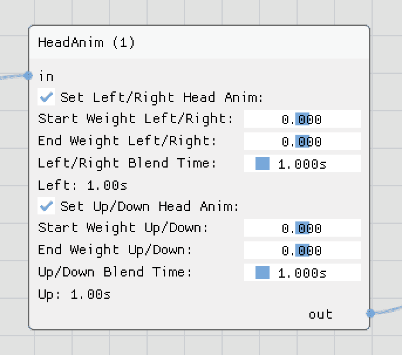

图 10.10：头部动画节点

与实例节点一样，我们可以控制我们想要更改的头部动画值，并且对于每个动画，我们可以调整起始和结束权重以及两个权重值之间混合所需的时间。并且像 `FaceAnimNode` 节点一样，`HeadAnim` 节点延迟控制流直到两个计时器都过期，并向父节点发出执行结束的信号。

我们以保存和加载添加式头部动画设置所需的变化来结束本章。

## 保存和加载头部动画设置

与新的树节点类似，实现 YAML 配置文件更改以保存和加载头部动画设置只需几分钟。

对于`YamlParser.cpp`文件中的`ModelSettings` YAML 发射器输出，如果所有四个剪辑都配置了，我们直接从映射中添加剪辑映射。我们还需要为`headMoveDirection` `enum`添加一个新的发射器输出，将值转换为`int`：

```cpp
YAML::Emitter& operator<<(YAML::Emitter& out,
    const headMoveDirection& moveDir) {
  out << YAML::Flow;
  out << static_cast<int>(moveDir);
  return out;
} 
```

要加载映射回，我们在`YamlParserTypes.h`文件中的`ModelSettings`的`decode()`方法中添加了一个部分，逐个读取映射值。这里还需要一个新的`decode()`方法用于`headMoveDirection` `enum`：

```cpp
 static bool decode(const Node& node, headMoveDirection& rhs) {
        rhs = static_cast<headMoveDirection>(node.as<int>());
    } 
```

对于实例设置，`InstanceSettings`中的`isHeadLeftRightMove`和`isHeadUpDownMove`存储的两个`float`值被添加到`YamlParser.cpp`中的发射器中：

```cpp
 if (settings.isHeadLeftRightMove != 0.0f) {
    out << YAML::Key << "head-anim-left-right-timestamp";
    out << YAML::Value << settings.isHeadLeftRightMove;
  }
  if (settings.isHeadUpDownMove != 0.0f) {
    out << YAML::Key << "head-anim-up-down-timestamp";
    out << YAML::Value << settings.isHeadUpDownMove;
  } 
```

这两个值也被添加到`YamlParserTypes.h`文件中`ExtendedInstanceSettings`数据类型的`decode()`方法中：

```cpp
 if (node["head-anim-left-right-timestamp"]) {
    rhs.isHeadLeftRightMove =
     node["head-anim-left-right-timestamp"].as<float>();
  }
  if (node["head-anim-up-down-timestamp"]) {
    rhs.isHeadUpDownMove =
      node["head-anim-up-down-timestamp"].as<float>();
  } 
```

在所有这些添加之后，你可以在男人的模型节点树中添加一些 HeadAnim 节点，创建如图*图 10.11*所示的动画：

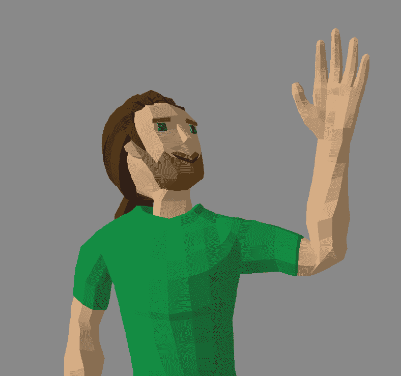

图 10.11：实例在挥手和微笑时抬头

现在实例可以以自然的方式在任何时候转动头部，我们只需要将新的 HeadAnim 节点添加到控制流程中。如果你回到*图 10.6*，你会看到像头部运动这样的小添加对实例外观的影响是巨大的。

你可以让你的想象力在新的头部运动上自由发挥。你希望头部跟随相机或任何其他附近的实例吗？你希望点头表示*是*，如果问题的答案是*否*，则轻微摇动头部吗？你希望让玩家向上或向下看，以将玩家的兴趣点移动到天空或地板吗？如果你想要扩展代码，*实践课程*部分中列出了一些想法。

# 摘要

在本章中，我们将面部表情和单独的头部动画添加到实例中。我们首先对面部动画进行了简要探索。然后，我们将面部动画以形态目标动画的形式实现到代码和着色器中，使实例能够微笑或愤怒。接下来，我们为面部动画添加了一个树节点，使我们能够在节点树中使用新的面部表情。最后，我们研究了加法动画混合，并使用加法混合添加了头部运动，包括一个新的树节点和 UI 控件。

在下一章中，我们将暂时放下动画控制，通过向虚拟世界添加关卡数据（如游戏关卡）来让实例真正有一个生活空间。我们首先检查 Open Assimp 导入库支持的格式，并搜索可用的关卡文件。然后，我们探讨为什么我们应该将关卡数据从模型和实例中分离出来。最后，我们从文件中加载关卡数据，并将与关卡相关的数据添加到应用程序和渲染器中。

# 实践环节

这里是一些你可以添加到代码中的内容：

+   添加对包含形态目标动画的多个网格的支持。

+   目前，一个模型只能有一个网格具有形态目标动画。对于简单的头部动画，这个限制是可以的。但如果你想要控制脸部超过一个部分，使用多个形态目标可能会有所帮助。

+   在两个形态目标之间添加混合。为了更好的自然面部表情，两个形态目标之间的直接混合会很棒。不再需要通过中性位置绕道，愤怒和担忧之间的直接路径现在可用。

+   添加更多的形态目标。

+   你可以尝试让模型*说话*。你可以为不同的元音和辅音添加表情，包括从上一个任务中直接混合。有了这样的动画，你可以在交互时模仿实例对你说话。

+   添加分层/遮罩动画。

与附加动画混合不同，分层混合使用不同的骨骼动画剪辑来处理模型虚拟身体的各个部分。例如，除了右臂之外的所有部分都使用跑步动画，只有右臂播放挥动手臂的动画。正如在*如何实现附加混合*部分中提到的，分层动画可能需要额外的努力来同步两个动画剪辑。你需要添加一些逻辑来遮罩模型骨骼的某些部分。

+   让实例在交互时将头转向你。这是许多游戏的一个特性：如果你开始与一个实例交互，它们会转身直接朝向你。

+   让附近的实例*评判*你。这就像之前的任务：你也可以为靠近你的实例添加附加的头部转向动画。还要添加一个随机的面部表情，让实例在经过你附近时表现出某种情绪。

+   让实例对经过的最近实例微笑和挥手。

这是前两个任务的组合和扩展：使用交互逻辑找到虚拟世界中每个实例的最近实例，然后将头部移动向那个实例。播放微笑的形态动画和只有右臂挥动的新的附加动画。你可能想在这里为手臂使用分层动画。

+   添加更多的附加混合动画。

转动头部是一个好的开始，但如果是制作一个人四处张望的整个动画呢？尝试添加更多层的叠加混合动画，使实例在交互中做出手势。

+   优化 C++和着色器代码以获得更好的性能。

当前在 CPU 和 GPU 上的 C++和 GLSL 着色器代码以及数据结构是为了解释和探索我们在这里添加的功能，如形变目标动画和面部表情。在 CPU 和 GPU 上都有很大的优化空间。例如，你可以尝试从应用程序中挤出更多的每秒帧数，通过优化发送到 GPU 的数据类型，将更多的工作转移到计算着色器，或者通过在 Vulkan 上移除对着色器结果的忙碌等待。你也可以检查数据压缩对帧时间是否有积极或消极的影响。为了便于比较，可以在 UI 中添加一个复选框来在默认代码和优化版本之间切换。

# 其他资源

+   在虚幻引擎中的分层动画：[`dev.epicgames.com/documentation/en-us/unreal-engine/using-layered-animations-in-unreal-engine`](https://dev.epicgames.com/documentation/en-us/unreal-engine/using-layered-animations-in-unreal-engine)

+   虚幻引擎中的叠加动画：[`dev.epicgames.com/documentation/en-us/unreal-engine/additive-vs.-full-body?application_version=4.27`](https://dev.epicgames.com/documentation/en-us/unreal-engine/additive-vs.-full-body?application_version=4.27)

+   Unity 动画层：[`docs.unity3d.com/Manual/AnimationLayers.html`](https://docs.unity3d.com/Manual/AnimationLayers.html)

+   Godot 动画树：[`docs.godotengine.org/en/latest/tutorials/animation/animation_tree.html`](https://docs.godotengine.org/en/latest/tutorials/animation/animation_tree.html)

+   Blender: [`www.blender.org`](https://www.blender.org)

+   Blender 形状键：[`docs.blender.org/manual/en/latest/animation/shape_keys/introduction.html`](https://docs.blender.org/manual/en/latest/animation/shape_keys/introduction.html)
