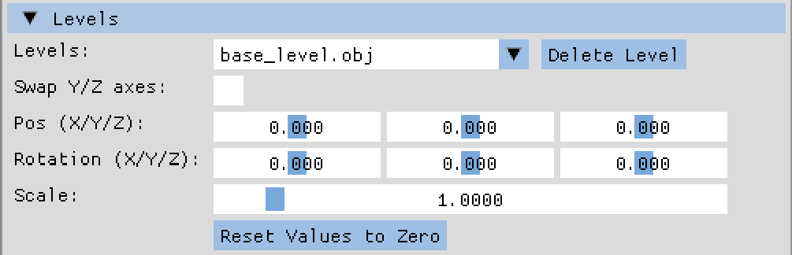
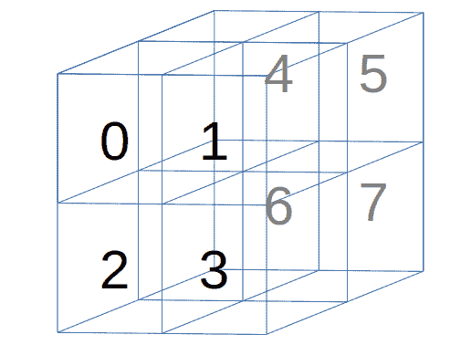
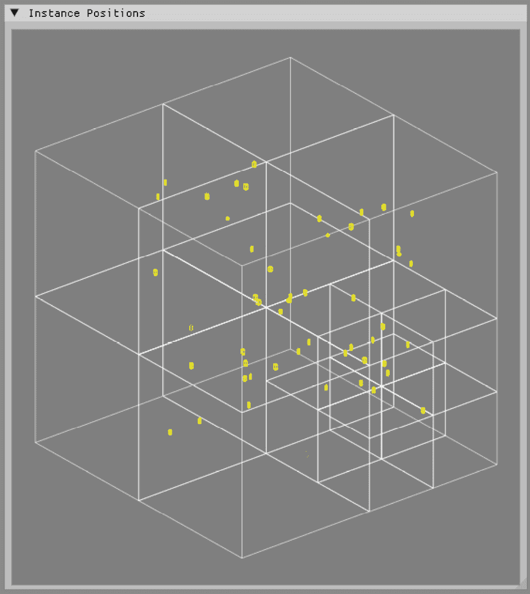

# 第十一章：加载游戏地图

欢迎来到**第十一章**！在前一章中，我们为实例添加了面部表情。在简要介绍了形态目标动画之后，我们将应用扩展到加载形态网格，并为控制实例的面部动画添加了 UI 元素。此外，还添加了一种新的图节点类型，允许在节点树中使用面部动画。最后，我们实现了加法混合，以便独立于任何骨骼和面部动画移动实例的头。

在本章中，我们将暂时从角色控制中休息一下，并将游戏级别和级别资产添加到虚拟世界中。我们将首先探讨为什么级别数据应该与模型和实例的处理方式不同；此外，我们还将查看使用 Open Asset Importer Library 导入级别数据的合适文件格式以及在哪里可以找到游戏级别。然后，我们将从文件中加载级别数据和资产到应用程序中，并更新四叉树以成为八叉树。作为最后一步，我们将添加与级别相关的数据到渲染器中，以便将游戏地图绘制到屏幕上，让我们对虚拟世界居民的家有一个概念。在本章中，我们将涵盖以下主题：

+   地图数据与模型数据之间的差异

+   为地图选择文件格式

+   导入游戏地图

+   将地图数据发送到 GPU

# 技术要求

本章的示例代码位于`chapter11`文件夹中，在`01_opengl_level`子文件夹中为 OpenGL，在`02_vulkan_level`子文件夹中为 Vulkan。

# 地图数据与模型数据之间的差异

在处理模型和级别数据之间存在一些有趣的差异，使我们能够在数据处理中应用优化。在本书的代码中，我们将在加载级别数据后进行这些优化。对于较大的级别，在级别创建期间进行预计算是更好的方法。

让我们更详细地看看一些差异。

## 级别数据不会移动

模型和级别之间最显著的区别很简单：虽然模型实例的属性可以改变，例如位置、旋转和速度，并且它们播放动画、对事件做出反应等，但级别的架构通常保持不变。

级别中不可移动和不可动画的多边形具有一个很大的优势：一些数据可以在创建时或在加载时预先计算，例如用于碰撞检测或照明。在运行时，只需要查找预先计算的数据。此外，我们不需要在每一帧都将数据上传到 GPU。所有三角形都可以在加载时处理，然后一次性上传到 GPU 内存中，直到用户可能从应用程序中删除级别数据。

那么，门、按钮、电梯或任何在级别中移动的东西怎么办？

水平面的可移动部分，如滑动门、旋转门、电梯、按钮和开关、储物柜门、机械平台等，简而言之，任何可以在水平面内移动的东西，通常都是用动画模型来建模和使用，而不是静态水平数据。

只需将旋转门想象成一个门的三维模型，门轴上有一个单独的节点。在交互时，模型围绕门轴旋转。或者，对于滑动门，门模型向一侧移动特定距离，打开通往另一个房间的通道。与这些门相比，一个水平面上的静态墙壁或静态地板永远不会移动或旋转。

对静态数据进行分割碰撞检测也有助于我们提高性能。

## 使用单独的碰撞检测来处理水平数据

对于碰撞检测，我们可以添加一个仅包含水平数据的四叉树或八叉树。当加载水平面时，必须重新创建此树，并且在运行时可以保持只读状态，跳过添加和删除实例的昂贵操作。然后我们使用实例的 AABB 来检查水平数据树，以确定实例是否与水平几何体发生碰撞。使用不同的树结构来处理实例和水平数据也允许我们根据特定需求配置树。由于地图中有许多三角形，水平八叉树可能需要完全不同的最大深度和每个节点的三角形数量，而在虚拟世界中运行的实例却只有几个。除了对静态数据的改进之外，游戏水平面可能还包含其他不需要用于模型的数据。

## 水平数据可能包含额外的数据

在运行时，CPU 和 GPU 时间都是稀缺资源，任何可以放在查找表或通过着色器计算的数据都可以在创建下一帧时节省宝贵的时间。我们在*第二章*中将动画计算的部分移动到计算着色器中看到了这种效果，同样在*第七章*中添加动画查找表到 GPU 内存后也看到了这种效果。在这两章中，屏幕上相同数量的实例都实现了显著的帧时间提升。

对于水平数据，也可以进行类似的加速。以下是一些此类附加数据的例子：空间划分、光照贴图、导航网格和层次细节级别。让我们简要地看看这些额外数据类型。更详细的信息可以在本章末尾的*附加资源*部分找到。

### 空间划分

当我们在*第八章*中深入讨论碰撞检测时，我们讨论了水平面的空间划分。将空间划分数据保存到水平文件中是必要的，以避免在加载时或游戏运行时进行相同的计算。

创建**二叉空间划分**（**BSP**）树或将虚拟世界划分为八叉树可能需要很长时间，这取决于一个级别中的三角形数量以及整个级别的复杂性。这种计算可以移至级别创建时间，只需在最终级别文件中添加一个优化的查找版本即可。

### 光照贴图

尽管光照贴图的原则在**id Software**的**Quake**中近三十年前就已经提出，但这种技术至今仍在使用。在级别创建过程中，静态光源的光照效果被“烘焙”到纹理中，明亮的像素表示静态光源的光照到表面的级别几何形状的部分，而暗像素表示级别表面上的阴影。

然后将光照贴图纹理作为二级纹理添加，使那些来自光源的光无法到达级别几何形状的区域变暗，并模拟出阴影。使用光照贴图可以通过保持合理的视觉效果来显著加快光照计算，因为需要的每像素计算成本较低。

### 导航网格

**导航网格**，或**导航网格**，是为敌人、NPC 或任何其他由计算机控制的对象添加的附加功能。级别几何形状将被覆盖在一个额外的三角形或其他多边形组成的网格上，但仅限于计算机控制对象能够移动的地方。导航网格可以加速对象的路径查找，并且当放置正确时，可以帮助防止碰撞检查。

我们将在*第十三章*中回到导航网格，当我们向实例添加简单的导航时。

### 分层细节级别

模型文件可以包括所谓的细节级别网格。当绘制远离摄像机的模型时，网格复杂性可以降低，而不会影响视觉质量，因为模型将只覆盖屏幕上的一小部分像素。通过使用不同的网格分辨率，绘制模型所需的三角形总数可以减少。

级别数据可以利用细节级别网格更多，用更简单的表示替换对象组。例如，而不是在远处绘制大量视觉上无法区分的岩石，同一区域的**分层细节级别**（**HLOD**）版本可以合并到一个带有调整纹理的单个网格中，以较少的多边形和纹理提供类似的视觉质量。

## 级别数据可能是不完整或不完整的。

您的精美动画 3D 模型应该始终完全可用，而不仅仅是模型的一半，甚至更少。但对于关卡数据来说，一个关卡的大小可能对 PC 或游戏机来说一次性处理过于庞大，尤其是在考虑额外的关卡数据时，如光照、导航或碰撞检测。此外，纹理大小和质量，或者计算机控制角色的数量和分布，总体上会增加内存需求。此外，当前加载的关卡部分可能具有更多细节，使用可用资源绘制可见区域，而不是在内存中保留不可见和未使用的数据。

保持玩家的沉浸感是关卡设计的一部分。关卡可能隐藏在蜿蜒的通道后面，其中两个关卡部分都不可见，允许游戏引擎丢弃玩家来自的区域，并加载他们前往的部分。另一个广泛使用的关卡切换示例是使用电梯，并在建筑、宇宙飞船或类似结构的下一层加载新的关卡数据。

通过明智地使用预计算数据，可以将渲染单个帧的时间减少，从而为玩家提供更丰富的体验。或者，可以使用现在未使用的 CPU 功率调整视觉细节，允许在屏幕上显示更多对象，或者更详细的对象，同时仍然保持相同的帧时间。

在地图和实例之间的差异变得清晰之后，让我们看看哪些文件格式主要用于关卡数据，以及如何获取游戏地图。

# 选择地图的文件格式

Open Asset Importer 库了解多种旧的和新的 3D 角色模型格式，但遗憾的是，对关卡数据的支持相当有限。

我们将首先探索互联网上最常见的关卡文件格式，然后如果现有格式不符合我们的需求，我们将考虑替代方案。

## 使用由 Assimp 支持的文件格式的关卡

几种文件格式用于创建游戏关卡数据，无论是从头开始创建数据还是使用其他游戏中的建筑和景观作为模板。

如果您想获取一些游戏地图进行导入，应该查看这些网站：

+   **Sketchfab**: [`sketchfab.com/`](https://sketchfab.com/)

+   **Free3D**: [`free3d.com`](https://free3d.com)

在这两个网站上，可以搜索和下载大量免费和付费的动画和非动画模型、关卡和资产。一些模型附带 Creative Commons 许可证，允许您在免费项目甚至商业项目中使用模型。

通常，您会发现以下格式的关卡：

+   Khronos Group glTF (`.gltf`/`.glb`): 开源 glTF 格式不仅可以用于我们章节中使用的动画`女性`和`男性`模型，还可以将整个关卡导出为 glTF 文件。

+   Collada（`.dae`）：Collada 是一个老式的但完全基于 XML 的文件格式。Collada 也由 Khronos Group 管理，甚至已经为该文件格式创建了一个 ISO 标准。

+   Wavefront（`.obj` + `.mtl`）：许多关卡都可以在 Wavefront 文件格式中找到。Wavefront 格式的文件是纯文本（没有二进制组件）且格式有很好的文档记录和广泛的支持。

+   通用场景描述（`.usd`/`.usdz`）：与其它文件格式相比，**通用场景描述**（**USD**）格式相当新。USD 也是开源的，并且有很好的文档记录，但由于文件格式的复杂性，Assimp 中的支持仍然是实验性的。

+   Autodesk FBX（`.fbx`）：“Filmbox”格式是专有的且大部分未记录，但 Blender 和 Assimp 等工具可以读取和写入此文件格式。使用 FBX 的风险自负，因为它可能只有特定版本才能按预期工作。

如果这些模型中没有一种符合你的需求，你可能需要扩展文件格式，甚至构建一个自定义文件格式。

## 扩展现有格式或创建自定义格式

从头创建新的游戏关卡或修改现有游戏关卡可能需要一些原始文件格式中不包含的额外信息，例如内嵌的光照贴图、树木数据、导航网格或细节级别数据。有关更多信息，请参阅*关卡数据可能包含额外数据*部分。

类似于 glTF 这样的文件格式具有内置的创建扩展的能力，而其他文件格式可能很难或无法扩展而不破坏现有的导入器。在这种情况下，你可以从头开始创建自己的文件格式，或者使用标准文件格式之一来存储关卡数据，并添加一个自定义格式来存储额外数据。

在本书的*添加 YAML 解析器*部分中，之前已经创建了一个自定义文件格式：用于存储模型、实例、相机、碰撞检测和节点树的所有设置的 YAML 配置文件。尽管我们依赖于标准文本格式来在磁盘上存储数据，但文件内容是根据我们示例应用程序的需求定制的。以二进制格式存储相同的数据也是可能的，例如，当解码文本信息需要花费太多时间时。

但创建全新的文件格式应该是最后的手段，因为你将不得不编写所有读取和写入数据的代码，在读写操作中跟踪文件格式的不同版本，甚至可能还需要支持不同的操作系统和硬件架构。维护这样一个自然生长的文件格式可能会变得非常困难。

一个更好的方法是使用标准格式并将所有文件打包到一个存档中，例如 ZIP 文件。当关卡分发到玩家或其他开发者时，你不必担心缺失的文件，但与此同时，你也不需要通过创建一个新的、全面的文件格式来重新发明轮子。

这样的存档比你想象的要常见。例如，DOOM 原始版本中的 WAD 格式和 Quake 系列中的 PAK/PK2/PK3 格式都是为了将所有游戏数据收集到一个文件中而创建的，这些文件类型甚至支持补丁，因为新存档中的同名文件会替换旧存档中的同名文件。

构建你自己的关卡

如果你在互联网上找不到合适的游戏关卡地图，你仍然可以选择自己创建一个小地图，例如使用 Blender。创建地图超出了本书的范围，但你可以在互联网上找到合适的教程和视频。你可以在*附加资源*部分找到两个示例视频的链接。

在我们探讨了为什么在应用程序中分离模型和关卡数据的原因之后，我们现在将实现加载和处理关卡数据的新代码。

# 导入游戏地图

作为加载关卡的第一步，我们将添加一个名为`AssimpLevel`的新 C++类。你可以将`AssimpLevel`类视为`AssimpModel`和`AssimpInstance`两个类的混合体，包含模型类的静态顶点数据以及实例类的动态属性，如位置、旋转或缩放。

`AssimpLevel`类由两个新文件组成，`AssimpLevel.h`和`AssimpLevel.cpp`。这两个文件都在`model`文件夹中，但我们将借用`AssimpModel`和`AssimpInstance`两个类的大多数方法和成员。

让我们简要地浏览一下`AssimpLevel`类。

## 添加一个 C++类来存储关卡数据

由于关卡和模型/实例数据非常相似，我们可以重用`AssimpModel`和`AssimpInstance`类中已有的功能的一部分，例如加载模型文件或执行矩阵运算。

对于静态数据，我们可以从`AssimpModel`类复制以下方法和成员，将名称中的`model`部分替换为`level`以与类名保持一致：

+   `loadModel()`方法，但不包括骨骼、动画和查找表创建

+   `processNode()`方法，再次不包括骨骼特定的部分

+   整个`draw()`方法

+   `getTriangleCount()`、`getModelFileName()`和`getModelFileNamePath()`方法

+   `setModelSettings()`和`getModelSettings()`方法

+   `mTriangleCount`和`mVertexCount`成员变量

+   用于存储有效关卡数据的`mRootNode`、`mNodeList`、`mRootTransformMatrix`、`mModelMeshes`、`mVertexBuffers`和`mModelSettings`成员变量

+   `mTextures`和`mPlaceholderTexture`成员变量用于纹理

对于动态数据，以下方法和成员可以从`AssimpInstance`类中复制，再次在名称中将`model`替换为`level`：

+   `updateModelRootMatrix()`和`getWorldTransformMatrix()`方法

+   成员变量`mLocalTranslationMatrix`、`mLocalRotationMatrix`、`mLocalScaleMatrix`、`mLocalSwapAxisMatrix`、`mLocalTransformMatrix`和`mModelRootMatrix`

为了将所有变量级别数据集中在一个位置，我们在`model`文件夹中创建了`LevelSettings.h`文件，其中包含`LevelSettings` `struct`：

```cpp
struct LevelSettings {
  std::string lsLevelFilenamePath;
  std::string lsLevelFilename;
  glm::vec3 lsWorldPosition = glm::vec3(0.0f);
  glm::vec3 lsWorldRotation = glm::vec3(0.0f);
  float lsScale = 1.0f;
  bool lsSwapYZAxis = false;
}; 
```

如您所见，这些级别设置也是部分从模型设置（文件名）和实例设置（位置、旋转、缩放、轴交换）中取出的混合。`LevelSettings`数据类型将被用于简化用户界面中的级别设置以及保存和加载与级别相关的数据。

我们还通过添加名为`micLevels`的`AssimpLevel`共享指针向量和名为`micSelectedlevel`的整数，后者保存当前从向量中选择的级别，将加载的级别数据提供给应用程序的其他部分：

```cpp
 std::vector<std::shared_ptr<AssimpLevel>> micLevels{};
  int micSelectedLevel = 0; 
```

管理在`micLevels`向量中的`AssimpLevel`对象的主要工作将由渲染器类处理，因此我们作为第二步添加方法和回调。

## 添加回调和渲染器代码

新的级别功能与现有模型函数之间的相似性也体现在回调中。必须将三个新的回调定义`levelCheckCallback`、`levelAddCallback`和`levelDeleteCallback`添加到`Callbacks.h`文件中：

```cpp
using levelCheckCallback = std::function<bool(std::string)>;
using levelAddCallback = std::function<bool(std::string)>;
using levelDeleteCallback =
  std::function<void(std::string)>; 
```

对于模型，我们有一组相同的回调函数。第一个回调函数`levelCheckCallback`用于检查是否存在同名级别的文件，而其他两个回调函数`levelAddCallback`和`levelDeleteCallback`则用于从文件中加载新的级别并删除现有的级别对象。

对于大多数回调函数，我们也将函数在`ModelInstanceCamData.h`中的`ModelInstanceCamData`结构体中可用：

```cpp
 levelCheckCallback micLevelCheckCallbackFunction;
  levelAddCallback micLevelAddCallbackFunction;
  levelDeleteCallback micLevelDeleteCallbackFunction; 
```

在渲染器类中，添加了四个新方法来处理级别管理。同样，新方法`hasLevel()`、`getLevel()`、`addLevel()`和`deleteLevel()`主要复制自等效模型方法：

```cpp
 bool hasLevel(std::string levelFileName);
    std::shared_ptr<AssimpLevel> getLevel(std::string
      levelFileName);
    bool addLevel(std::string levelFileName);
    void deleteLevel(std::string levelFileName); 
```

当`hasLevel()`正在检查`micLevels`向量以查看是否已加载同名级别的文件时，`getLevel()`返回现有`AssimpLevel`对象的共享指针，如果不存在请求的文件名对应的级别，则返回`nullptr`。

如其名称所示，`addLevel()`将尝试从本地存储加载级别数据文件并将新的`AssimpLevel`对象添加到`micLevels`中，而`deleteLevel()`如果存在，将从`micLevels`中删除请求的级别。

我们还添加了一个`null`级别以防止`micLevels`为空：

```cpp
void OGLRenderer::addNullLevel() {
  std::shared_ptr<AssimpLevel> nullLevel =
    std::make_shared<AssimpLevel>();
  mModelInstCamData.micLevels.emplace_back(nullLevel);
} 
```

在渲染器的 `init()` 方法中创建三个新回调与 `hasLevel()`、`addLevel()` 和 `deleteLevel()` 方法的连接，使我们能够在 `UserInterface` 类中使用级别调用。

因此，让我们继续第三步，在级别数据管理的路径上添加新的用户界面元素。

## 使用级别属性控件扩展 UI

就像对 `AssimpLevel` 类一样，我们可以简单地从 `UserInterface` 类的 `createSettingsWindow()` 方法的其他部分复制并调整现有的控制元素，以创建名为 **Levels** 的新 **CollapsingHeader**。

在 *图 11.1* 中，显示了级别数据的用户界面部分的结果：



图 11.1：级别数据的用户界面控件

**Levels** 组合框从 `ModelInstanceCamData` 结构体中的 `micLevels` 向量内的级别文件名称填充。级别数据的 **删除级别** 按钮与 UI 的 **模型** 部分的 **删除模型** 按钮具有相同的功能，删除当前选定的级别，并且轴交换、位置、旋转和缩放的控制来自 **实例** UI 部分，以及 **重置值到零** 按钮以将所有控件设置为默认值。

除了新的控制元素外，还创建了一个名为 **Levels** 的新主菜单项。*图 11.2* 显示了此时主菜单的所有元素：


图 11.2：新的 Levels 主菜单项

点击 **加载级别...** 将打开著名的基于 ImGui 的文件对话框，配置了支持级别数据的文件格式列表。有关过滤器中的扩展名，请参阅 *选择地图的文件格式* 部分。

**删除模型** 和 **加载级别...** UI 元素使用回调函数从应用程序中添加和删除一个 `AssimpLevel` 对象，当向虚拟世界添加级别数据时，为用户创建了一个无缝的工作流程。

在用户体验方面，级别数据和模型实例之间的显著区别是缺少对级别数据的视觉选择和修改功能。由于您将调整级别数据几次，直到对位置、旋转和缩放满意，因此用于像实例一样连续移动级别数据的额外代码将只使用一次或两次。如果当期望的实例因像素偏差而错过时选择级别数据，视觉选择甚至更有可能损害工作流程。

作为级别数据管理的最后一步，我们将加载的级别文件名称和每级设置添加到 YAML 配置文件中。

## 保存和加载级别配置

将加载的级别和级别设置存储在 YAM 配置文件中既快又简单。

在为 `LevelSettings` 数据类型添加了 Emitter 输出操作符重载之后，我们可以复制并调整 `tools` 文件夹中 `YamlParser` 类的 `createConfigFile()` 方法中用于模型或相机的发射代码块，以保存级别数据。此外，我们还必须在配置文件的 `settings` 映射中发射所选的级别编号。

此外，还向 `YamlParser` 类添加了两个名为 `getLevelConfigs()` 和 `getSelectedLevelNum()` 的新方法：

```cpp
 std::vector<LevelSettings> getLevelConfigs();
    int getSelectedLevelNum(); 
```

这两种方法遵循与模型和相机类似的过程。第一种方法 `getLevelConfigs()` 尝试从 YAML 文件中加载级别数据，而 `getSelectedLevelNum()` 返回在保存配置时所选级别的索引。

在 `YamlParserTypes.h` 文件中，必须为 `LevelSettings` 数据类型添加一对简单的 `encode()` 和 `decode()` 方法，以便从 YAML 文件中读取数据。我们还应该增加 `mYamlConfigFileVersion` 的值，因为配置结构已更改。

现在，我们可以从文件中添加级别数据，将级别放置在虚拟世界中，并存储和重新加载配置。将级别数据添加到撤销/重做堆栈的工作留给你作为练习，但基本原理级别的撤销/重做与模型的撤销/重做功能相同。

由于级别数据可能包含重叠的元素，例如桥梁、隧道或建筑物的多层，实例可能在二维空间中的同一位置。即使实例在级别中行走的高度不同，现有的碰撞检测也会被触发，导致对不存在的碰撞产生错误反应。

我们必须将四叉树扩展为八叉树以支持三维空间中的碰撞检测。让我们看看如何升级四叉树。

## 将四叉树转换为八叉树

将四叉树更新为八叉树非常简单，大部分工作可以通过使用 IDE 的重构功能中的 `Rename` 函数来触发。为了简洁，我们在这里只简要说明所需更改。请检查 `chapter11` 文件夹内的子文件夹中的示例代码，以获取完整的八叉树代码。

首先，我们将 `quadtree` 文件夹的名称更改为 `octree`。在 `CMakeLists.txt` 文件中，必须将两个 `quadtree` 的出现也重命名为 `octree` 以匹配文件夹名称。然后我们将 `QuadTree` 类重命名为 `Octree`，并将 `BoundingBox2D` 改为 `BoundingBox3D`。

接下来，我们通过使用八个而不是四个子节点来扩展 `Octree` 类。*图 11.3* 展示了八叉树的象限 ID：



图 11.3：八叉树中的象限 ID

四个现有的子象限 ID，0 到 3，将用于四个面向前方的八分体，而四个面向后方的八分体将接收新的 ID 4 到 7。将四个新的八分体移动到八叉树立方体的后面，使我们能够保留大部分来自四叉树的逻辑。添加新的逻辑以找到正确的八分体只是一个复制和粘贴代码的行为，同时考虑到面向前和面向后的八分体。

然后，我们将代码中所有与`QuadTree`相关的`include`语句、类和方法调用更新为`Octree`，并将所有`BoundingBox2D`出现更改为`BoundingBox3D`。边界框升级包括将旧`BoundingBox2D`参数的所有`glm::vec2`类型更改为使用`glm::vec3`。我们还更改了`getTopLeft()`的名称为`getFrontTopLeft()`，并添加了`getBack()`方法以反映第三维度的可用性。

最后，代码中所有回调函数类型将从`quadTree`重命名为`octree`，以反映代码中其他所有位置的函数变化。

现在我们可以使用八叉树来检测三维中的碰撞。遗憾的是，**实例位置**窗口仍然显示实例的俯视图，我们无法看到是否有实例放置在不同的高度。我们必须调整包含实例的迷你窗口的渲染，以便我们可以看到放置在不同高度的任何实例。

## 创建交互式八叉树视图

新的八叉树视图创建分为三个步骤：

1.  为了更好地了解八叉树和实例，可以使用鼠标进行缩放、旋转和平移来调整新的视图。可能还需要一些额外的旋转来使八叉树与相机视图对齐，但由于正交显示和八叉树的对称性，这很难做到。淡出八叉树远处的部分或突出显示包含相机的八分体可能有助于集中注意当前感兴趣的区域。另一方面，使用透视投影的八叉树可能更容易找到正确的对齐，但透视会扭曲实例之间的距离，我们只是创建了一个主要级别渲染的副本。

1.  八叉树象限和实例的线条收集到一个临时数据结构中。我们将在这里使用`OGLLineMesh`，因为这个数据类型只包含最基本的内容；我们需要绘制 ImGui 线条。

1.  为了达到期望的视图，必须将八叉树象限的所有点和实例边界框通过第一步中的缩放、旋转和平移进行变换。这种变换与我们对相机和实例所做的方式相同：为每个点创建一个矩阵和一个矩阵-向量乘法。矩阵运算中不应有任何意外；可能只有平移需要解释。

让我们先逐步了解交互部分。

### 添加交互性

为了能够通过鼠标按钮和鼠标移动来更改八叉树视图，我们需要在 `UserInterface` 类中添加三个新的私有变量，分别命名为 `mOctreeZoomFactor`、`mOctreeRotation` 和 `mOctreeTranslation`：

```cpp
 float mOctreeZoomFactor = 1.0f;
    glm::vec3 mOctreeRotation = glm::vec3(0.0f);
    glm::vec3 mOctreeTranslation = glm::vec3(0.0f); 
```

变量的名称是自解释的，因此我们不需要深入细节。

在 `UserInterface` 类的 `createPositionsWindow()` 方法中创建 **实例位置** 窗口后，我们添加一个检查以查看当前窗口是否被悬停：

```cpp
 if (ImGui::IsWindowHovered(
      ImGuiHoveredFlags_RootAndChildWindows)) { 
```

没有检查，鼠标按钮和动作会在所有窗口中触发八叉树视图变化，导致不希望的结果。

然后，我们获取 ImGui 内部 `io` 结构的引用：

```cpp
 ImGuiIO& io = ImGui::GetIO();
    mOctreeZoomFactor += 0.025f * io.MouseWheel;
    mOctreeZoomFactor = std::clamp(mOctreeZoomFactor,
      0.1f, 5.0f); 
```

在 ImGui 的 `io` 结构中，有许多内部状态可用，如鼠标滚轮或鼠标位置所做的更改。

我们在这里使用鼠标滚轮来调整八叉树视图的缩放因子。为缩放因子设置上下限有助于避免失去整体概览。

接下来，我们检查是否按下了右鼠标按钮，并在右鼠标按钮仍然按下的同时根据鼠标移动旋转视图：

```cpp
 if (ImGui::IsMouseDown(ImGuiMouseButton_Right)) {
      mOctreeRotation.y += io.MouseDelta.x;
      mOctreeRotation.x += io.MouseDelta.y;
    } 
```

使用右鼠标按钮来更改旋转也用于相机，因此这种视图变化应该从与应用程序一起工作时了解。

最后，我们检查中间鼠标按钮，通过鼠标移动移动八叉树：

```cpp
 if (ImGui::IsMouseDown(ImGuiMouseButton_Middle)) {
      mOctreeTranslation.x += io.MouseDelta.x;
      mOctreeTranslation.y += io.MouseDelta.y;
    }
  } 
```

如果你想知道为什么这里不使用左鼠标按钮：在 ImGui 窗口上方按下左鼠标按钮会激活内部窗口移动。我们只剩下右键和中间鼠标按钮来实现两种不同的视图变化。

一旦我们得到了想要看到的变换，我们就可以从八叉树和实例中获取线条。

### 收集线条

为了在绘制之前存储线条，我们在 `UserInterface` 类中添加一个名为 `mOctreeLines` 的 `private` 变量：

```cpp
 OGLLineMesh mOctreeLines{}; 
```

在清除 `mOctreeLines` 内部的顶点向量后，我们得到八叉树线：

```cpp
 mOctreeLines.vertices.clear();
  const auto treeBoxes =
    modInstCamData.micOctreeGetBoxesCallback(); 
```

对于每个八叉树象限，我们获取一个 `BoundingBox3D` 对象，包含最小和最大点位置。将其转换为 AABB 是简单的：

```cpp
 AABB boxAABB{};
    boxAABB.create(box.getFrontTopLeft());
    boxAABB.addPoint(box.getFrontTopLeft() +
      box.getSize()); 
```

然后，我们使用 `getAABBLines()` 方法创建所有 AABB 线作为 `OGLLineMesh`，并将线条添加到 `mOctreeLines` 网格中：

```cpp
 std::shared_ptr<OGLLineMesh> instanceLines =
      boxAABB.getAABBLines(white);
    mOctreeLines.vertices.insert(
      mOctreeLines.vertices.end(),
      instanceLines->vertices.begin(),
      instanceLines->vertices.end()); 
```

接下来，我们为每个实例获取 AABB 线，将碰撞的实例着色为红色，其他所有实例着色为黄色。当前选中的实例还会额外获得一个绿色边框，以便能够轻松停止实例。

在对八分体和实例的循环结束后，`mOctreeLines` 包含了应该绘制到 ImGui 窗口的所有线的顶点。我们现在需要将这些顶点转换以匹配所选的缩放、旋转和平移。

### 计算视图和绘制线条

由于存储中间结果比在每一帧中为八叉树线分配和计算新的变换矩阵要快，我们添加了三个名为 `mScaleMat`、`mRotationMat` 和 `mOctreeViewMat` 的 `private` 成员变量：

```cpp
 glm::mat3 mOctreeViewMat = glm::mat3(1.0f);
    glm::mat4 mRotationMat = glm::mat4(1.0f);
    glm::mat4 mScaleMat = glm::mat4(1.0f); 
```

然后，应用缩放和两个旋转以创建最终的视图矩阵：

```cpp
 mScaleMat = glm::scale(glm::mat4(1.0f),
    glm::vec3(mOctreeZoomFactor));
  mRotationMat = glm::rotate(mScaleMat,
    glm::radians(mOctreeRotation.x),
    glm::vec3(1.0f, 0.0f, 0.0f));
  mOctreeViewMat = glm::rotate(mRotationMat,
    glm::radians(mOctreeRotation.y),
    glm::vec3(0.0f, 1.0f, 0.0f)); 
```

现在我们以两组为单位遍历 `mOctreeLines` 中的顶点，因为每条线需要一个起点和终点：

```cpp
for (int i = 0; i < mOctreeLines.vertices.size(); i += 2) { 
```

在循环内部，我们提取每条线的顶点对，并通过与 `mOctreeViewMat` 相乘来变换顶点位置：

```cpp
 OGLLineVertex startVert = mOctreeLines.vertices.at(i);
    OGLLineVertex endVert = mOctreeLines.vertices.at(i+1);
    glm::vec3 startPos = mOctreeViewMat *
      startVert.position;
    glm::vec3 endPos = mOctreeViewMat * endVert.position; 
```

接下来，我们将点坐标添加到绘制中心，并添加平移部分：

```cpp
 ImVec2 pointStart =
     ImVec2(drawAreaCenter.x + startPos.x +
       mOctreeTranslation.x,
       drawAreaCenter.y + startPos.z +
       mOctreeTranslation.y);
    ImVec2 pointEnd =
      ImVec2(drawAreaCenter.x + endPos.x +
        mOctreeTranslation.x,
        drawAreaCenter.y + endPos.z +
        mOctreeTranslation.y) 
```

我们在这里不需要单独的平移矩阵，因为八叉树线的移动仅与 ImGui 窗口有关，而不是三维中顶点的位置。

在循环结束时，我们使用线的颜色和固定的 alpha 值，从起点到终点绘制一个 ImGui 线：

```cpp
 drawList->AddLine(pointStart, pointEnd,
    ImColor(startVert.color.r, startVert.color.g,
      startVert.color.b, 0.6f)); 
```

如果在这些更改之后启动应用程序，可以通过按下鼠标右键旋转八叉树视图，通过按下鼠标中键移动，以及使用鼠标滚轮进行缩放和缩小：

*图 11.4* 展示了在 **实例位置** 窗口中的八叉树视图：



图 11.4：一个旋转的八叉树，包含实例和两个细分级别

你可以看到所有实例在三维空间中的边界框。碰撞实例用红色绘制，所有其他实例用黄色（与 AABB 调试线的颜色相同），当前选定的实例有额外的绿色轮廓。

另一个需要看到的重要事实是八叉树的细分级别。在八叉树的根级别，一次细分被分成八个八分体——这是由于实例数量的原因。在远右下角的八分体中，需要另一个细分来限制每个八分体的实例数量。

当应用程序运行时，可以实时看到实例的移动和八叉树细分的更改。并且可以更改视图以聚焦于八叉树的任何有趣区域。

默认八叉树实现的一个缺点是不断增长的额外开销。细分可能会产生许多空节点，特别是如果每个节点的阈值较小且树深度较高时。对于我们的实现，每次将八叉树细分到八个八分体时，都会在内存使用上增加大约一千字节的开销，即使我们只需要在其中一个子八分体中存储一个或两个实例的 AABB。

此外，每次细分都会增加遍历成本的一个步骤。尽管遍历复杂度仅以对数为基础增长，但在较大级别中，内存和遍历时间上的开销可能会变得显著。在这种情况下，可以使用诸如稀疏体素八叉树之类的数据结构。在 *附加资源* 部分提供了一个描述稀疏体素八叉树原理的论文链接。

当前级别加载的一个缺点是缺少对加载的级别数据尺寸的“感觉”。如果级别不是平的，而是包含不同高度的区域，那么想象级别数据的边缘是很困难的。

为了获得更好的方向，我们还将为级别数据添加一个 AABB。

## 为级别数据构建 AABB

轴对齐边界框是避免估计或猜测对象尺寸的一个很好的工具。我们使用模型实例 AABB 作为解决方案，通过允许应用程序比较两个实例的最大范围来检测碰撞。

虽然实例顶点和边界框之间的未使用区域在碰撞检测的速度和复杂性之间是一个权衡，但对于级别数据来说，情况是不同的。AABB 线将帮助我们看到级别在所有三个维度上的最大范围，特别是当级别数据有大量未使用区域时。

创建 AABB 的过程既快又简单。首先，我们在 `AssimpLevel.h` 文件中添加一个新的私有成员变量 `mLevelAABB` 来存储 AABB：

```cpp
 AABB mLevelAABB{}; 
```

为了生成和检索边界框数据，我们添加了两个新的公共方法，`generateAABB()` 和 `getAABB()`：

```cpp
 void generateAABB();
    AABB getAABB(); 
```

将 AABB 数据的生成与检索分开是一个巧妙的主意，因为级别可能包含大量的网格和顶点。只有在调整级别属性（如缩放或位置）时才需要重新计算，因为级别数据本身不会移动或改变其他属性。

我们已经有了级别数据的变换矩阵，因此计算 `generateAABB()` 中级别的边界框只需要遍历所有网格的所有顶点：

```cpp
 updateLevelRootMatrix();
  mLevelAABB.clear();
  for (const auto& mesh : mLevelMeshes) {
    for (const auto& vertex : mesh.vertices) {
      mLevelAABB.addPoint(mLevelRootMatrix *
        glm::vec4(glm::vec3(vertex.position), 1.0f));
    }
  } 
```

在这里的一个关键步骤是改变顶点位置中的 `w` 元素。我们使用位置的最后元素来传输一个纹理坐标到着色器。为了正确的矩阵乘法，我们必须将位置的最后元素设置为 `1.0f`。

为了在级别属性变化时触发级别 AABB 的自动更新，我们在 `Callbacks.h` 中添加了一个简单的回调：

```cpp
using levelGenerateAABBCallback = std::function<void(void)>; 
```

在 `ModelInstanceCamData` 结构体中，添加了另一个回调函数：

```cpp
 levelGenerateAABBCallback
    micLevelGenerateAABBCallbackFunction; 
```

我们在渲染器的 `init()` 方法中将 `micLevelGenerateAABBCallbackFunction` 回调绑定到 `generateLevelAABB()` 方法，以及其他级别数据回调。

为了在用户界面中获得良好的交互式显示，我们在 **Levels** 部分添加了一个名为 `settingChangedForAABB` 的布尔值。在每次滑块或复选框更改时，或者在按下 **重置值到零** 按钮时，我们触发级别 AABB 的重新计算。

那其他静态级别元素呢？这些对象被称为 **assets**，并且可以被添加到级别中。资产也需要碰撞检查以防止实例直接穿过彼此，但资产大多数情况下不是动画化的；它们保持在级别设计师意图的位置。

我们在这里将使用快捷方式，并利用非动画模型来模拟静态级别资产。对于动态资产，如按钮或门，可以使用动画模型；请参阅*级别数据不会移动*部分以获得简要说明。在*实际操作*部分，有一个将动态资产添加到虚拟世界的任务。

那么，让我们看看非动画模型需要哪些更改。

## 使用非动画模型作为资产

为了避免添加一个与大多数非动画模型具有相同功能的新`AssimpAsset`类，我们将稍微扩展当前的`AssimpModel`类和渲染器。

对于模型类，我们将`getAABB()`方法改为返回具有动画的模型的动态 AABB 或没有动画的模型的静态 AABB：

```cpp
AABB AssimpModel::getAABB(InstanceSettings instSettings) {
  if (mNumAnimatedMeshes > 0) {
    return getAnimatedAABB(instSettings);
  } else {
    return getNonAnimatedAABB(instSettings);
  }
} 
```

新的`getAnimatedAABB()`方法只是旧`getAABB()`方法的新名称，它仍然像以前一样从查找数据中计算 AABB。另一个新方法`getNonAnimatedAABB()`主要是`AssimpInstance`类中的`updateModelRootMatrix()`方法。

首先，我们计算一个用于缩放、旋转、轴交换和平移的单独矩阵：

```cpp
 glm::mat4 localScaleMatrix = glm::scale(glm::mat4(1.0f),
    glm::vec3(instSettings.isScale));
  glm::mat4 localSwapAxisMatrix;
  if (instSettings.isSwapYZAxis) {
    glm::mat4 flipMatrix = glm::rotate(glm::mat4(1.0f),
      glm::radians(-90.0f), glm::vec3(0.0f, 0.0f, 1.0f));
    localSwapAxisMatrix = glm::rotate(flipMatrix,
      glm::radians(-90.0f), glm::vec3(0.0f, 1.0f, 0.0f));
  } else {
    localSwapAxisMatrix = glm::mat4(1.0f);
  }
  glm::mat4 localRotationMatrix = glm::mat4_cast(
    glm::quat(glm::radians(instSettings.isWorldRotation)));
  glm::mat4 localTranslationMatrix =
    glm::translate(glm::mat4(1.0f),
    instSettings.isWorldPosition); 
```

然后，将模型文件中的变换矩阵和根变换矩阵组合成一个单一的变换矩阵：

```cpp
 glm::mat4 localTransformMatrix =
    localTranslationMatrix * localRotationMatrix *
    localSwapAxisMatrix * localScaleMatrix *
    mRootTransformMatrix; 
```

要创建边界框数据，将模型网格的所有顶点转换到新位置，并将位置添加到名为`modelAABB`的局部变量中：

```cpp
 AABB modelAABB{};
  for (const auto& mesh : mModelMeshes) {
    for (const auto& vertex : mesh.vertices) {
      modelAABB.addPoint(localTransformMatrix *
        glm::vec4(glm::vec3(vertex.position), 1.0f));
    }
  } 
```

对于顶点位置中的`w`元素，需要与级别数据 AABB 相同的调整。通过将最后一个值设置为`1.0f`，我们确保在计算最终位置时进行正确的矩阵乘法。

使用得到的 AABB，非动画实例顶点的范围能够检测与动画模型的 AABB 碰撞并绘制调试线。

资产 AABB 的性能考虑

目前，非动画实例的 AABB 在每一帧的每个实例上都会计算，就像动画实例的 AABB 一样。如果计算成为瓶颈，例如，如果虚拟世界中放置了大量的静态资产，可以在 UI 属性更改时轻松地仅更改 AABB 计算。

一旦级别数据被加载和处理，AABB 被计算，我们就准备好将级别三角形绘制到屏幕上。

让我们扩展渲染器以将级别数据添加到渲染过程中。

# 将级别数据发送到 GPU

随着新功能的不断增加，在应用程序中重用代码变得更加简单。在级别数据的情况下，网格数据封装在`AssimpLevel`类中，并且可以通过遍历所有加载的级别的小循环来绘制级别的三角形。

作为第一步，我们创建一个新的着色器来绘制级别数据。

## 创建一个新的着色器

由于我们只需要绘制等级三角形一次，因此为等级数据使用单独的着色器是一个巧妙的主意。将名为 `mAssimpLevelShader` 的 `private` 着色器添加到渲染器类的头文件中：

```cpp
 Shader mAssimpLevelShader{}; 
```

着色器将使用两个新文件，`assimp_level.vert` 用于顶点着色器，`assimp_level.frag` 用于片段着色器。我们在渲染器的 `init()` 方法中加载这些文件以及其他着色器：

```cpp
 if (!mAssimpLevelShader.loadShaders(
      "shader/assimp_level.vert",
      "shader/assimp_level.frag")) {
    return false;
  } 
```

片段着色器文件 `assimp_level.frag` 只是 `assimp.frag` 文件的副本，没有任何更改。对于顶点着色器文件 `assimp_level.vert`，我们可以复制 `assimp.vert` 文件，并保留 `in` 和 `out` 布局部分以及 `Matrices` 通用缓冲区。

由于等级数据尚未实现视觉选择，我们不需要选择缓冲区，并且可以将绑定点 `1` 的缓冲区更改为仅包含单个 4x4 矩阵：

```cpp
layout (std430, binding = 1) readonly restrict
    buffer WorldTransformMatrix {
  mat4 worldTransformMat;
}; 
```

仅将小型数据元素，如单个矩阵，上传到 GPU 上的统一缓冲区并不是最佳方案，因为每次上传都可能给帧添加一小段延迟。对于真正的游戏或游戏引擎，世界变换矩阵将是更大缓冲区的一部分，但为了简单起见，我们在这里只进行单次上传。

在顶点着色器的 `main()` 方法中，我们使用 `worldTransformMat` 将位置和法线顶点变换到由等级属性创建的矩阵给出的最终位置：

```cpp
void main() {
  gl_Position = projection * view * worldTransformMat *
    vec4(aPos.x, aPos.y, aPos.z, 1.0);
  color = aColor;
  normal = transpose(inverse(worldTransformMat)) *
    vec4(aNormal.x, aNormal.y, aNormal.z, 1.0);
  texCoord = vec2(aPos.w, aNormal.w);
} 
```

然后，在渲染器的 `draw()` 方法中，我们遍历所有等级，并通过检查是否存在任何三角形来跳过空等级：

```cpp
 for (const auto& level : mModelInstCamData.micLevels) {
    if (level->getTriangleCount() == 0) {
      continue;
    } 
```

在等级显示过程的最后一步，触发顶点绘制：

```cpp
 mAssimpLevelShader.use();
    mShaderModelRootMatrixBuffer.uploadSsboData(
      level->getWorldTransformMatrix(), 1);
    level->draw();
  } 
```

我们使用新的 `mAssimpLevelShader`，将等级的变换矩阵上传到着色器，并调用 `AssimpLevel` 对象的 `draw()` 方法。

在屏幕上绘制等级 AABB 需要在渲染器中添加更多方法和成员变量。

## 绘制等级 AABB

等级 AABB 顶点存储在渲染器类中的一个名为 `mAllLevelAABB` 的新 `private` 成员变量中：

```cpp
 AABB mAllLevelAABB{}; 
```

此外，还向渲染器类中添加了两个名为 `generateLevelAABB()` 和 `drawLevelAABB()` 的新私有方法：

```cpp
 void generateLevelAABB();
    void drawLevelAABB(glm::vec4 aabbColor); 
```

我们在这里也将生成和绘制 AABB 线分开，以避免在每帧绘制时进行昂贵的计算。

在 `generateLevelAABB()` 中生成等级 AABB 是通过一个简单的循环完成的。在清除等级 AABB 数据后，我们遍历所有已加载的等级：

```cpp
 mAllLevelAABB.clear();
  for (const auto& level : mModelInstCamData.micLevels) {
    if (level->getTriangleCount() == 0) {
      continue;
    } 
```

检查没有三角形的等级会跳过空等级，因为屏幕上没有东西可以绘制。然后，我们为每个等级生成 AABB 并将每个等级的最小和最大范围添加到 `mAllLevelAABB`：

```cpp
 level->generateAABB();
    mAllLevelAABB.addPoint(level->getAABB().getMinPos());
    mAllLevelAABB.addPoint(level->getAABB().getMaxPos());
  } 
```

生成的 AABB 包含所有已加载等级的所有等级数据。如果您想为每个等级单独拥有 AABB，则可以使用 AABB 向量而不是单个 AABB。

在 `drawLevelAABB()` 方法中绘制等级 AABB 需要很少的解释：

```cpp
 mAABBMesh = mAllLevelAABB.getAABBLines(aabbColor);
  mLineVertexBuffer.uploadData(*mAABBMesh);
  mLineShader.use();
  mLineVertexBuffer.bindAndDraw(GL_LINES, 0,
    mAABBMesh->vertices.size()); 
```

我们使用 AABB 的 `getAABBLines()` 方法创建线数据，将线上传到 `mLineVertexBuffer`，在 `LineShader` 上调用 `use()`，然后对 `mLineVertexBuffer` 对象调用 `bindAndDraw()` 以绘制级别数据的轴对齐边界框。

然后，在渲染器的 `draw()` 方法中，当 `rdDrawLevelAABB` 设置为 `true` 时，我们调用 `drawLevelAABB()`：

```cpp
 if (mRenderData.rdDrawLevelAABB) {
    glm::vec4 levelAABBColor =
      glm::vec4(0.0f, 1.0f, 0.5, 0.5f);
    drawLevelAABB(levelAABBColor);
  } 
```

颜色是随机选择的，你可以更改颜色值，甚至可以向 UI 添加一个 3 元素浮点滑块来控制颜色值。

在屏幕上显示级别 AABB 线是通过在 `OGLRenderData.h` 文件中的 `OGLRenderData` `struct` 中的新布尔变量 `rdDrawLevelAABB` 实现的：

```cpp
 bool rdDrawLevelAABB = false; 
```

对于代码的 Vulkan 版本，该变量将在 `VkRenderData.h` 文件中的 `VKRenderData` `struct` 中创建。

在 `UserInterface` 类中，我们在 `createSettingsWindow()` 方法的 `Levels` 部分添加了一个复选框 `rdDrawLevelAABB`，允许我们切换级别的 AABB 线。

就这些！在 *图 11.5* 中，一个来自 Sketchfab 的示例地图被加载在女性模型旁边，并且激活了级别的 AABB：


图 11.5：示例地图（未缩放）和女性模型的实例（来源：Counter Strike 1.6 地图“de_dust”由 Zarudko 制作，链接：https://skfb.ly/6QYJw）

作为一名玩家，你可能知道这个地图：它是 Counter Strike 1.6 中的“de_dust”。这个地图在 Sketchfab 上有多个版本和格式，以及其他流行的游戏地图。

围绕级别数据的边界框帮助我们看到级别的尺寸。特别是对于如图 11.5 前右部所示的未使用区域，没有 AABB 线，很难找到级别数据边界。

你还会注意到地图实例之间不寻常的大小比例。地图和模型已经使用它们的默认缩放值加载，大小值是由文件作者任意选择的。由于模型和级别数据的缩放滑块，调整一个或两个对象的大小很容易，但要从不同来源和艺术家那里获取合理的级别、模型和其他对象的比例可能具有挑战性。

为了创建一个合理的虚拟世界，游戏角色模型的大小必须与家具、建筑、环境对象等的大小相匹配。即使不同对象的比例有微小的不匹配，当比较游戏角色和现实世界中的对象时，也会变得明显。调整不同元素的一个好方法是使用一个已知大小的固定大小对象，例如一个边长为一米的 Minecraft 块，或者虚拟世界中一个定义长度的简单线条。通过将所有对象调整到与已知对象的真实世界大小相比，来自不同来源的模型可以在视觉上匹配。

# 摘要

在本章中，我们将静态层级数据添加到虚拟世界中。在探索了层级图和模型之间的差异后，我们研究了适合层级数据的文件格式以及如何找到酷炫的游戏地图。然后，我们将对层级数据的支持添加到应用程序中，并用八叉树替换四叉树以支持三维碰撞检测。最后，我们将新的层级数据和层级 AABB 添加到渲染器中。在接下来的两个章节中，我们将扩展层级数据，以创建一个实例可以自由漫游的虚拟世界。

在下一章中，我们将继续从*第八章*的碰撞检测。首先，我们将扩展现有代码以支持实例和层级几何之间的碰撞。为了确保实例始终在地面，我们将在虚拟世界中引入重力。作为最后一步，我们将逆运动学添加到实例的腿部，允许模型以自然运动爬楼梯或斜坡。

# 实践课程

这里是一些你可以添加到代码中的改进：

+   向层级中添加一个门或按钮。

由于动画层级数据更像是放置在层级固定位置的动画角色模型，而不是静态层级数据，你可以尝试在层级中添加门、开关或按钮，并且在与交互时，按钮可以播放“按下”动画，门可以绕着铰链旋转或向一侧滑动。

+   添加动态层级加载。

你可以使用关于可玩角色当前位置的信息来决定何时加载或卸载层级的一部分。也许可以添加一个新的坐标映射，其中指定加载层级数据文件，另一个坐标用于从应用程序中移除层级数据。如果你已经从第一个任务中添加了动画层级对象到动态层级部分，确保在卸载时保存这些对象的状态，并在重新加载层级数据时恢复状态。玩家可以打开门或激活开关，当返回到层级部分时，玩家可以看到对象处于他们离开时的确切状态。为了防止由于未完全加载或销毁的资产导致的崩溃或数据损坏，请使用原子操作或互斥锁等锁定机制。此外，加载和层级数据以及资产可能需要同步以恢复所有元素的正确状态。

+   专家难度：异步加载动态层级部分。

加载层级文件、处理数据和添加顶点数据需要一些时间，导致应用程序中出现明显的卡顿。当满足加载条件时，例如玩家位于特定的世界位置时，使用`std::async`或完整的工人线程来触发加载。请注意，添加任何异步代码都需要采取额外措施以防止数据竞争。

# 补充资源

+   高效的稀疏体素八叉树：[`www.nvidia.com/docs/IO/88972/nvr-2010-001.pdf`](https://www.nvidia.com/docs/IO/88972/nvr-2010-001.pdf)

+   Blender 地图创建 1：[`www.youtube.com/watch?v=IKkOLeAuEHI`](https://www.youtube.com/watch?v=IKkOLeAuEHI)

+   Blender 地图创建 2：[`www.youtube.com/watch?v=hdyBgQ77Sdg`](https://www.youtube.com/watch?v=hdyBgQ77Sdg)

+   什么是光照贴图？：[`wiki.polycount.com/wiki/Light_map`](http://wiki.polycount.com/wiki/Light_map)

+   导航网格解释：[`medium.com/@mscansian/a-with-navigation-meshes-246fd9e72424`](https://medium.com/@mscansian/a-with-navigation-meshes-246fd9e72424)

+   HLOD：[`gamma.cs.unc.edu/HLOD/`](https://gamma.cs.unc.edu/HLOD/)

+   如何编写 glTF 自定义扩展：[`gltf-transform.dev/extensions`](https://gltf-transform.dev/extensions)

+   itch.io 资产：[`itch.io/game-assets`](https://itch.io/game-assets)

+   Sketchfab 用于模型、地图和资产：[`sketchfab.com`](https://sketchfab.com)

+   Free3D：[`free3d.com`](https://free3d.com)

+   Zarudko 制作的 Counter Strike 1.6 地图“de_dust”：[`skfb.ly/6QYJw`](https://skfb.ly/6QYJw)

# 加入我们的 Discord 社区

加入我们的社区 Discord 空间，与作者和其他读者进行讨论：[`packt.link/cppgameanimation`](https://packt.link/cppgameanimation)


