# 添加简单导航

欢迎来到 *第十三章*！在前一章中，我们创建了一个单独的八叉树来增强碰撞检测，使我们能够快速且计算成本低廉地检测实例与关卡几何之间的碰撞。然后我们向应用程序添加了简单的重力，以使实例保持在地图的地面上，最终导致实例在关卡地板和小山上行走。最后，我们使用逆运动学在实例的脚上，以保持两脚在爬坡或地图斜坡区域时都保持在地面。

在本章中，我们将添加路径查找和导航功能。我们首先简要概述计算机游戏中用于导航的方法，然后探索并实现 A* 路径查找算法。接下来，我们将导航目标添加到应用程序中，使得在虚拟世界中放置路径目的地变得简单。本章的最后，我们将实现向航点导航，使得实例能够向定义的目标行走或奔跑。

在本章中，我们将涵盖以下主题：

+   不同导航方式的概述

+   A* 路径查找算法

+   将导航目标添加到地图中

+   将实例导航到目标

# 技术要求

本章的示例代码位于 `chapter13` 文件夹中，对于 OpenGL 在 `01_opengl_navigation` 子文件夹中，对于 Vulkan 在 `02_vulkan_navigation` 子文件夹中。

# 不同导航方式的概述

路径查找和导航在视频游戏中被使用的时间比人们想象的要长。让我们探索几种导航方法。

## 基于距离的导航

使用简单算法来模拟敌人智能行为的最早游戏之一是 **Namco** 的 **Pac-Man**。四个幽灵（Blinky、Pinky、Inky 和 Clyde）中的每一个都有一种略有不同的“性格”，仅由幽灵移动的目标点创建。

当红色幽灵（Blinky）直接追逐 Pac-Man 时，粉红色幽灵（Pinky）和蓝色幽灵（Inky）会试图在 Pac-Man 前面，实际上是在试图包围玩家。第四个幽灵（橙色的 Clyde）有“自己的想法”，在追逐玩家和逃跑之间切换。

关于选择新路径的决定仅发生在游戏迷宫的交叉路口，并且完全基于交叉路口所有可能路径到目标格子的距离。游戏没有使用更高级的预览路径规划，有时会导致不良决策。*图 13.1* 展示了交叉路口的一个这样的决策情况：

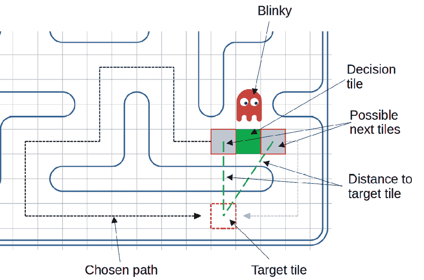

图 13.1：Pac-Man 中红色幽灵的导航决策

在*图 13.1*中，绿色方框是触发向左或向右决策的区域，两条虚线绿色线是到红色轮廓目标格子的直接距离。尽管右边的路径更短，但由于左边的决策距离更短，所以会选择左边的路径，从而产生幽灵的随机行为。在*附加资源*部分提供了一个链接，提供了关于幽灵导航内部深入信息的链接。

简单的基于距离的导航至今仍在游戏中使用，例如，根据两个实体的速度和方向，找到敌人可能拦截玩家的位置。然后使用基于图的导航算法规划到玩家的路径。

## 基于图的导航

在图中，搜索算法使用图的节点来描述游戏地图上的位置，使用边来描述节点之间的连接。通过构建地图的图，可以以有组织的方式找到两个位置之间的最短路径。

在导航中使用了多个图算法。最常见的是：

+   **深度优先搜索**（**DFS**）

+   **广度优先搜索**（**BFS**）

+   迪杰斯特拉算法

+   A*（发音为“A star”）

### DFS 和 BFS 算法

这两个都是简单的算法。虽然 DFS 遍历图“深度优先”，从起始节点到最远的节点，但 BFS 首先访问最近的节点，然后以“环”的形式前进到下一个节点。*图 13.2*显示了由六个节点 A 到 F 组成的示例图：

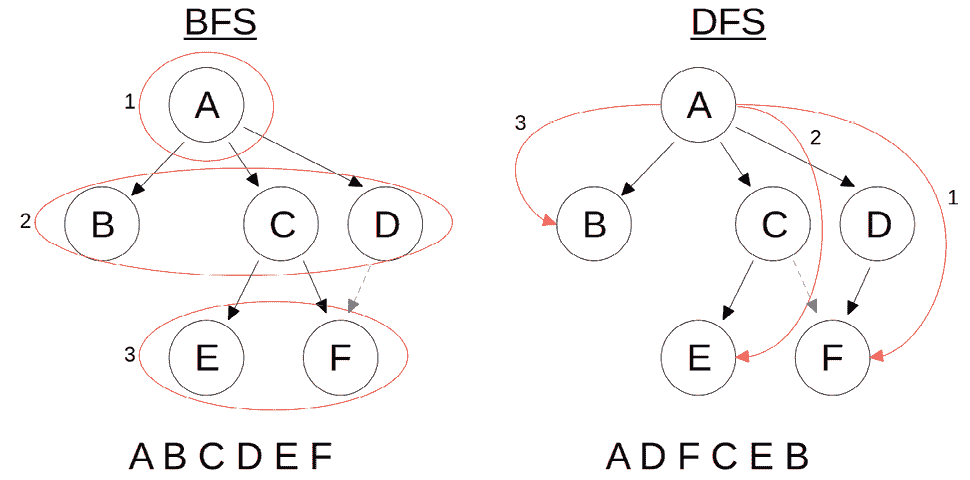

图 13.2：BFS 和 DFS

在*图 13.2*的左侧，BFS 算法从根节点（A）之后的最近节点（B、C 和 D）开始，然后遍历到节点 E 和 F。在*图 13.2*的右侧，DFS 算法首先遍历子节点 D 和 D 的子节点（F），然后前进到节点 C 和 E，最后到节点 B。

### 迪杰斯特拉算法

迪杰斯特拉算法为图的边添加权重。权重可以看作是从一个节点到另一个节点的成本或距离，具体取决于要解决的问题。迪杰斯特拉算法遍历整个图，构建一个包含从起始节点到图中所有其他节点的最短路径的表。

*图 13.3*显示了算法所有步骤后的起始图和结果：

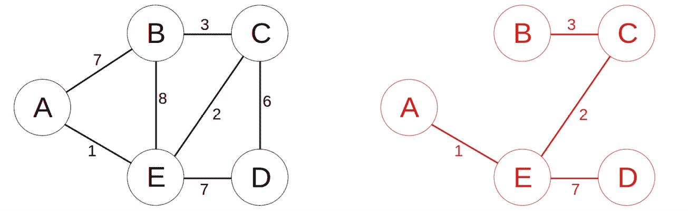

图 13.3：一个图和从 A 到所有其他节点的最短距离

通过使用迪杰斯特拉算法，任何加权图都可以遍历以找到从节点到所有其他节点的最低成本（或距离）路径，但算法必须为每个起始节点重新运行。关于算法的完整描述，在*附加资源*部分提供了一个链接，展示了在*图 13.3*中找到图的最短距离的步骤。

### A*算法

A*算法以迪杰斯特拉算法为基础，但增加了两个改进：

+   每个节点都添加了一个所谓的**启发式**，表示从每个节点到目标节点的估计距离。

+   算法从起始节点搜索到指定的目标节点，通常在目标节点被到达时终止。

通过结合从起始节点到节点的距离和从同一节点到目标节点的估计距离，并在遍历到下一个节点时使用最短总和，A*进行有向搜索以到达目标节点。因此，与 BFS 或 DFS 这样的无向搜索不同，A*始终朝向目标节点的方向前进。我们将在*A*路径查找算法*部分深入讨论 A*。

本节算法的一个缺点是，如果目标是动态的，它们必须重新创建整个路径。对于动态目标，LPA*、D*或 D*-Lite 等算法可能能提供更好的结果。此外，自 A*算法引入以来，还创建了其他几种路径查找算法，旨在针对特殊环境，如机器人技术，或进一步优化路径查找过程，如 Theta*。

在探索 A*之前，让我们看看视频游戏中另一种流行的导航类型，使用三角形或其他多边形来描述机器人和 NPC 的可行走区域，并简要了解一下机器学习作为创建导航数据的替代版本。

## 网格导航

简单的游戏，如 Pac-Man 和许多策略游戏，通过将世界划分为网格（通常由矩形或六边形结构构建）来使用基于距离的导航。但三维游戏（如开放世界）或第一人称和第三人称探索和战斗游戏的需求不同。由于虚拟世界的重叠部分，需要一个三维结构来引导计算机控制的角色通过地图。

大多数使用三维地图的游戏要么使用导航网格，要么使用区域感知，或者两者结合使用。

### 导航网格

**导航网格**（也称为**NavMeshes**）大约在 2000 年左右在游戏中被引入。导航网格是由多边形（大多数实现中为三角形）组成的一个附加数据结构，覆盖在关卡几何之上。导航网格中的多边形标记了关卡的可行走区域，省略了计算机控制的角色可能与之碰撞的任何对象和结构。

通过使用导航网格，机器人或 NPC 可以在虚拟世界中行走，如果角色保持在导航网格上，则无需进行昂贵的与静态关卡几何的碰撞检查。只有当角色可以离开导航网格时，才需要进行碰撞检查。与基于图的算法（如 A*）结合使用时，可以实现计算机控制角色的精细行为控制。在*附加资源*部分中有一个关于使用导航网格进行路径查找的全面介绍链接。*图 13.4*展示了简单的一个例子：

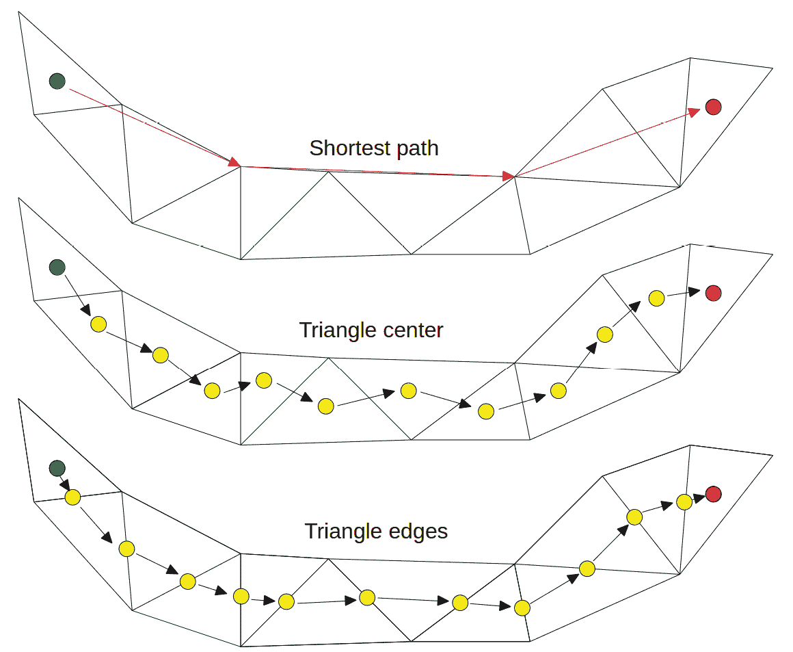

图 13.4：带有起点（绿色）、目标（红色）和从起点到目标路径的导航网格

在*图 13.4*中，顶部图片显示了从起始三角形（绿色）到目标三角形（红色）的最短路径，该路径通过使用视线中的下一个顶点到网格下一个尖锐角的下一点。

相比之下，中间图片中的路径使用三角形中心作为路径查找算法的图节点，而底部图片使用内部三角形边作为图节点。

路径的质量取决于网格以及将用于图节点的是三角形的哪一部分或几部分。*图 13.4*中所示方法的组合是可能的，因此三角形的中心和边的中点都可以用作图节点。生成的路径还可以通过跳到下一个直接可见的节点和使用样条曲线进行平滑处理。

注意，如果边缘导航网格在狭窄通道的墙壁或边界附近太近，实例可能会与墙壁碰撞，产生额外的运动校正，或者导致网格的一部分无法通行。层级中的静态障碍物也应保持在安全距离之外。

按照经验法则，使用实例的边缘和轴对齐边界框中心之间的距离作为导航网格边缘和相邻层级几何之间的最小距离。通过在任何时候将实例远离墙壁，可以在正常导航期间避免碰撞。

从层级数据生成导航网格

通常，导航网格会手动创建并添加到层级数据中。但我们需要一个解决方案来处理在互联网上找到的层级，因此我们将在代码中采取捷径，并使用与检测实例是否与层级地面碰撞时相同的向上三角形作为“可能可通行地面”。

结合所有地面三角形之间的相邻关系，可以估算出层级中的可通行区域。在*实践课程*部分中，有几个用于地面区域创建代码的改进作为任务提供。

通过使用导航网格，可以实现两种类型的导航：在虚拟世界中自由漫游和在路点之间巡逻。

#### 自由导航

在自由导航中，地图上的任何一点都可以作为起点和目的地的目标点。从一个层级的一部分移动到另一部分可能需要计算成本；在最坏的情况下，必须在路径查找过程中检查整个网格。此外，根据起点和目标的确切位置，两次路径规划之间的角色路径可能完全不同。

#### 路点导航

对于基于网格的导航，更好的方法是在导航网格上定义彼此可见的航点。例如，每个房间组中的每扇门都会是一个航点，或者每条道路的每个分叉点。当一个机器人穿过虚拟世界时，在达到期望的航点后，将设置航点作为下一个目标。如果玩家被发现然后失踪，机器人可以返回到最近的航点。通过确保计算机控制的角色总能“看到”至少一个航点，到下一个航点的路径规划变得便宜且易于计算。

### 区域感知系统

1999 年，**id Software**在**Quake III Arena**中使用了名为**区域感知**的系统。它不是使用二维图表，而是创建了一个简化的三维水平表示，其中包含有关水平结构、其他机器人和玩家的所有信息。

机器人不仅可以通过行走、跳跃或游泳穿越感知区域，还可以使用传送门、跳跃垫，甚至火箭跳跃。有了这样丰富的动作库，机器人可以轻松地跟随玩家在水平中移动，或者试图切断玩家的路径。

在*附加资源*部分的 PDF 文档链接中可以找到区域感知系统的完整描述。

## 使用机器学习生成导航数据

为计算机控制的角色创建导航数据的一种更近的方法是机器学习，主要是所谓的**强化学习**。在强化学习过程中，代表角色的代理在大量“尝试错误”风格的回合中自行探索虚拟世界，但会因完成定义的任务而获得奖励，或因未能完成任务而受到惩罚。

这样的任务可能类似于“以最大健康值到达定义的目标点”，“不要从水平掉落”，或者“以最短时间完成水平”。通过考虑先前探索的奖励和惩罚，代理优化其行为以最大化奖励并最小化惩罚。当这些代理生成数据用于游戏时，敌人可以利用机器学习中的策略，在虚拟世界中移动时显得更加自然。

机器学习的两个挑战是使使用时间成本高昂：

+   目标、奖励和惩罚必须在计算过程中明确定义和调整。即使我们认为目标和奖励已经定义得很好，机器学习算法也可能找到意想不到的方式来最大化奖励。设置失败可能会导致丢弃数据，并重新启动整个机器学习周期。

+   由于机器学习是通过试错探索虚拟世界，因此其进展是非确定性的，并且可能只以微不足道的数量发生。即使是简单的任务，在游戏运行期间也必须玩数千轮游戏才能达到期望的结果。创建一个探索游戏大级别的复杂 AI 可能需要大量的计算资源，从而导致过高的开发成本。

尽管基于机器学习的导航可能比基于算法的导航产生更好的结果，但建议检查可能改进和额外成本之间的权衡。在*附加资源*部分有一个视频展示了让机器学习如何驾驶汽车的进展。

在简要回顾了导航方法之后，让我们接下来深入探讨 A*算法。

# A*路径查找算法

A*算法是在 1968 年计算机的早期阶段发表的。A*算法是针对一个名为**Shakey**的由人工智能控制的移动机器人的路径规划的结果。该机器人是在斯坦福研究学院开发的。其软件包括计算机视觉和自然语言处理，并且它能够执行简单的任务，比如在没有提前描述每个单独动作的情况下，自己驾驶到实验室的某个地方。在*附加资源*部分有一个链接，提供了更多关于项目和机器人的详细信息。

但是什么让 A*算法与迪杰斯特拉算法（Dijkstra’s algorithm）不同呢？

## 估算目标距离

虽然迪杰斯特拉算法只使用节点之间的权重，但 A*算法给每个节点添加一个启发式值。启发式函数计算从每个节点到所选目标的最低成本路径的估计成本。在许多情况下，例如对于大型世界和许多节点，计算每对节点之间的最小成本是计算上昂贵的，因此对成本的“有根据的猜测”更容易计算，并且也足够好。

对于启发式函数，可以使用任何距离计算函数。在大多数情况下，要么使用所谓的**L1 范数**，也称为**曼哈顿距离**，要么使用**L2 范数**，也称为**欧几里得距离**。*图 13.5*展示了这两种距离计算背后的思想：

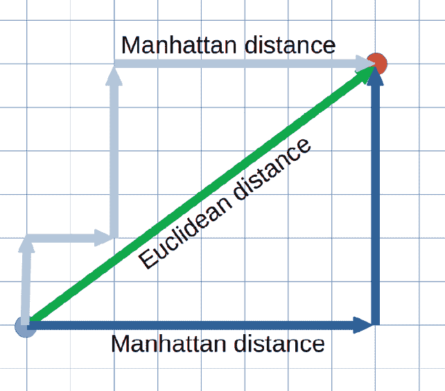

图 13.5：从起点到目标的曼哈顿和欧几里得距离

曼哈顿距离是模仿曼哈顿的出租车路线。街道组织成平行的线条，以 90 度角相交。就像曼哈顿的出租车一样，*图 13.5*中的蓝色路径只能使用起点和目标之间的网格线。我们使用直线、直接线条，如深蓝色路径，或者楼梯式版本，如浅蓝色路径，都没有关系；两条路径的距离是相同的。

相比之下，*图 13.5*中绿色路径的欧几里得距离是通过使用勾股定理计算的。这意味着将两个方向上距离的长度的平方相加，然后计算总和的平方根。

对于 A*算法的启发式函数，是使用曼哈顿距离、欧几里得距离还是其他距离计算，这严重取决于应用的需求。例如，在游戏地图中，可能需要考虑障碍物、丘陵或敌人来估计距离。找到最佳函数的一种直观方法是绘制每个启发式函数以及起始节点和目标节点的一组组合路径，并比较结果。

通过使用目标节点的启发式值，A*算法试图在每次迭代中使到达目标节点的路径成本最小化。

## 最小化路径成本

在每次迭代中，A*算法使用从起始节点到当前节点所有邻居的已知路径成本和估计成本的总和来计算到达目标节点的最小成本。然后，算法选择具有最小成本的邻居节点，将该邻居节点设为当前节点，并开始下一次迭代。

此外，如果从起始节点到目标节点的总成本在所有邻居节点中是最小的，A*算法会在每个访问的邻居节点中保存当前节点的引用。在节点中存储父节点允许在到达目标节点后回溯到从目标到源的最佳路径。

为了可视化算法，让我们逐步通过一个小例子。

## 探索 A*算法

*图 13.6*显示了一个包含节点 A、B、C 和 D 的图，以及从每个节点到目标节点 D 的启发式表。在这个例子中，起始节点是节点 A。

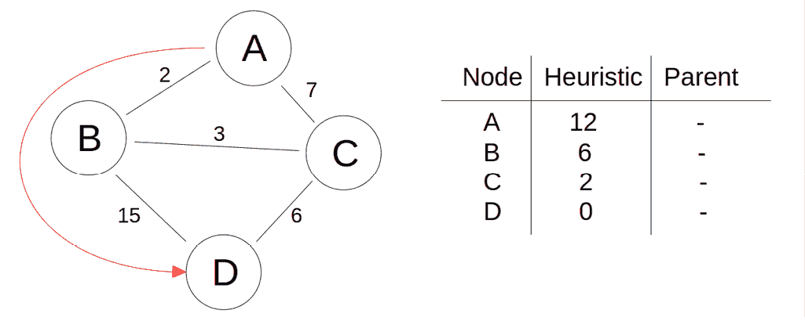

图 13.6：用于遍历的图以及到目标节点 D 的估计距离

我们可以立即看到从节点 A 到节点 D 的最短路径：ABCD。但对于计算机来说，A*算法必须遍历节点来找到这条路径。

对于第一次迭代，我们访问节点 A 的邻居，如图*图 13.7*所示：

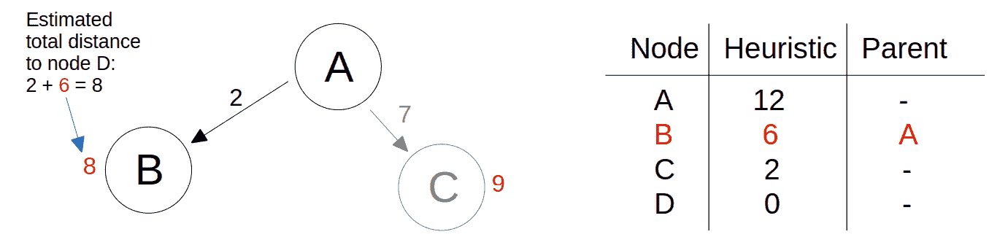

图 13.7：访问节点 B 和 C

在这里，我们计算估计距离为从 A 到已知的距离加上每个节点的启发式值。节点 B 的总和较低，所以我们继续到节点 B。我们还记录了 B 的父节点，因为 A 是 B 的直接前驱。

然后，我们查看节点 B 的所有邻居，如图*图 13.8*所示：

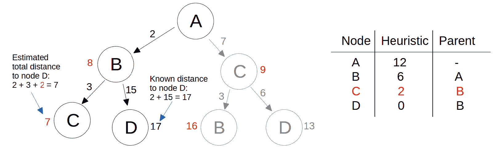

图 13.8：访问节点 C 和 D

我们对节点 C 进行相同的计算，并将从 A 到 B、B 到 C 的成本以及从 C 到 D 的启发式值相加。在 A*算法的优化版本中，我们的搜索可能已经结束，因为我们已经到达了目标节点 D。

但我们在这里继续检查节点 D 的剩余邻居，以防有更短的路径可用。因此，我们更新了节点 C 和 D 的父节点，并访问节点 C 作为节点 D 的最后一个未访问的邻居，如图 *图 13.9* 所示：

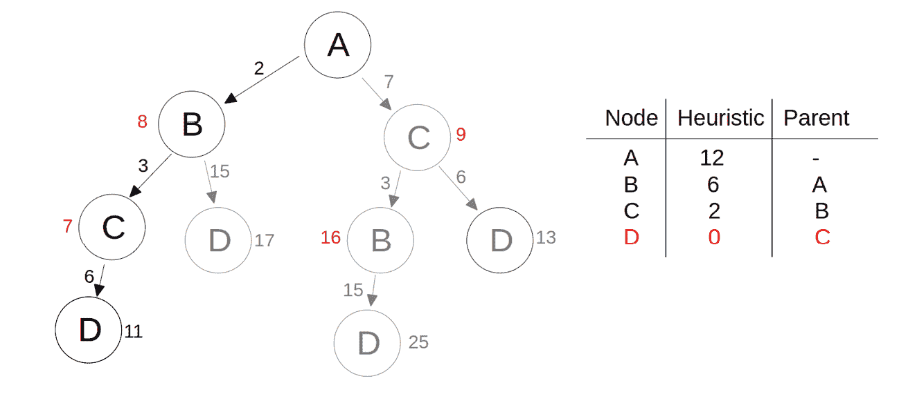

图 13.9：从 A 到 D 的最短路径是 ABCD

事实上，通过节点 B 和 C 到节点 D 的路径比通过 B 的路径要短得多。因此，我们将节点 C 设置为节点 D 的新父节点。在访问了目标节点 D 的所有相邻节点之后，A* 已经完成了从节点 A 到节点 D 的路径查找工作。

通过回溯父节点，我们得到从目标到起点的路径。通过反转节点顺序，我们现在有了从起点到目标的最近路径：ABCD。

如您所见，即使在这样一个非常简单的例子中，A* 在选择要处理的节点时，也会关注到达目标的总估计成本。如果在处理节点时算法了解到更短的路径，则用于回溯最佳路径的父节点也会更新。在 *附加资源* 部分中，有一个链接到深入探讨 A* 的网站。

在概述了算法之后，让我们添加路径查找代码。

## 实现基于 A* 的导航

由于我们的大多数地图中都不会有简单的二维地形，因此不能使用二维网格进行导航。相反，我们将使用导航网格在虚拟世界中从源对象到目标对象查找路径。

如 *导航网格* 部分所述，创建网格至少是部分手动工作，这取决于用于创建游戏地图的编辑器。一些编辑器可以根据地图元素创建导航网格，但在大多数情况下，生成的网格必须手动进行修正。导航网格必须存储在包含其余关卡数据的同一张地图上或在单独的数据文件中。

为了支持地图内和独立的导航网格，当涉及到可通行地面网格时，路径查找类保持模块化。例如，如果您的导航网格在地图文件中以特殊名称保存，则可以将导航多边形及其相邻属性导入路径查找类。您还必须将导航三角形导入一个单独的三角形八叉树，并进行额外的光线到三角形的交点检测，以找到地面级别的三角形和导航网格三角形。A* 路径查找算法也已作为单独的方法实现，允许您轻松添加其他算法或不同的启发式函数。

在本章的示例代码中，我们将使用与地面检测相同的思想，并使用每个网格三角形的法线来判断它是否可通行。这种方法会导致导航网格中所有朝上的三角形，即使这些三角形可能无法通过任何实例到达。但为了展示在游戏地图中路径查找和导航的一般思想，从地图的地面三角形创建导航网格是足够的，并且可以得到合理的结果。

我们将使用欧几里得距离来计算节点之间的距离，以及用于启发式函数，因为地图中的三角形最可能不是按矩形网格排列的。为了加快距离计算，我们将扩展网格三角形数据结构。

## 准备网格三角形

`MeshTriangle`结构体定义在`OGLRenderData.h`文件中，用于 OpenGL，在`VkRenderData.h`文件中，用于 Vulkan。在`MeshTriangle`结构体的末尾，我们添加了两个新的数组，`edges`和`edgeLengths`：

```cpp
struct MeshTriangle {
 **std::array<glm::vec3, 3> edges{};**
 **std::array<****float****, 3> edgeLengths{};**
}; 
```

在`edges`数组中，我们存储每个三角形的三个边。我们按照与原始三角形相同的顺序来排序边。由于在计算任何相邻三角形时我们需要边的长度，因此我们将每条边的长度存储在相应的`edgeLengths`元素中。

现在我们可以直接进入路径查找类的实现。

## 添加路径查找类

路径查找类（命名为`PathFinder`）将驻留在`tools`文件夹中，其中存储了之前章节中创建的所有其他辅助类，如`AABB`或`IKSolver`。为了保持命名的一致性，头文件命名为`PathFinder.h`，实现将放入`PathFinder.cpp`文件中。

在`PathFinder.h`头文件中，在所有`#include`指令之后，我们添加了两个`struct`条目。第一个新的结构体命名为`NavTriangle`：

```cpp
struct NavTriangle {
  int index;
  std::array<glm::vec3, 3> points{};
  glm::vec3 center{};
  glm::vec3 normal{};
  std::unordered_set<int> neighborTris{};
}; 
```

我们在这里不重用`MeshTriangle`，因为我们需要几个不同的变量。虽然`index`、`points`数组和`normal`向量是相同的，但我们还需要在`center`变量中存储每个三角形的中心的世界位置，以及在`neighborTris`中存储周围的三角形。实例将从三角形中心导航到下一个三角形，而存储在`neighborTris`中的三角形用于找到距离目标最近的三角形。

对于相邻三角形，我们选择使用`std::unordered_set`而不是普通的`std::vector`，以便自动删除重复条目。

第二个结构体称为`NavData`，包含 A*算法的数据：

```cpp
struct NavData {
  int triIndex;
  int prevTriIndex;
  float distanceFromSource;
  float heuristicToDest;
  float distanceToDest;
}; 
```

在`triIndex`变量中，我们存储对应`NavTriangle`的三角形索引。通过使用索引，我们可以进行简单的查找以找到三角形数据，如位置或相邻三角形。一旦我们访问到三角形的相邻节点，我们就将迄今为止最短路径的三角形索引添加到`prevTriIndex`中，这样我们就可以在路径查找运行结束时回溯最短路径。

剩余的三个变量（`distanceFromSource`、`heuristicToDest`和`distanceToDest`）是 A*算法的功臣。在这里，我们存储从源到当前节点的聚合距离，当前节点和目标之间启发式函数的结果，以及这两个距离的总和。通过比较所有相邻节点的`distanceToDest`值，A*选择向目标节点移动的下一个节点。

在两个新的结构体之后，声明了`PathFinder`类，从两个公共方法`generateGroundTriangles()`和`findPath()`开始：

```cpp
 void generateGroundTriangles(OGLRenderData& renderData,
      std::shared_ptr<TriangleOctree> octree,
      BoundingBox3D worldbox);
    std::vector<int> findPath(int startTriIndex,
      int targetTriIndex); 
```

通过调用`generateGroundTriangles()`，在三角形八叉树中找到所有向上面对的三角形，并为每个“可通行”三角形创建相邻信息。一旦地面数据准备就绪，就可以使用`findPath()`从起始三角形找到目标三角形。`findPath()`的结果是 A*找到的路径，以三角形索引的向量形式表示，按从起始三角形到目标三角形的顺序排列，或者如果不存在有效路径，则为空向量。

在`PathFinder`类中还有一个名为`mNavTriangles`的`private`成员：

```cpp
 std::unordered_map<int, NavTriangle> mNavTriangles{}; 
```

我们将计算出的地面三角形存储在`mNavTriangles`映射中。通过使用三角形索引（也作为`NavData`元素的一部分存储）进行索引和三角形数据的映射，以实现快速访问。

让我们接下来逐步分析地面三角形生成代码。

## 生成地面三角形

地面三角形是通过利用渲染器生成的三角形八叉树生成的。由于我们将对三角形八叉树进行大量请求，它将作为`generateGroundTriangles()`方法的第二个参数提供。

在清除之前生成的任何导航三角形后，我们通过使用作为第三个参数提供的世界边界进行查询，从八叉树中获取所有三角形：

```cpp
 mNavTriangles.clear();
  std::vector<MeshTriangle> levelTris =
    octree->query(worldbox); 
```

然后我们遍历所有级别三角形以找到向上面对的三角形子集：

```cpp
 std::vector<MeshTriangle> groundTris{};
  NavTriangle navTri;
  for (const auto& tri: levelTris) {
    if (glm::dot(tri.normal,
     glm::vec3(0.0f, 1.0f, 0.0f)) >=
      std::cos(glm::radians(
      renderData.rdMaxLevelGroundSlopeAngle))) {
        groundTris.emplace_back(tri); 
```

通过比较三角形法向量和向上面对向量的点积与`rdMaxLevelGroundSlopeAngle`值的余弦，我们可以从*第十二章*中的碰撞检测中得知。如果当前三角形满足检查条件，我们就将其添加到`groundTris`向量中。

在`groundTris`中的地面三角形旁边，我们用最少的数据填充名为`navTri`的`NavTriangle`，并将`navTri`添加到`mNavTriangles`映射中：

```cpp
 navTri.points = tri.points;
      navTri.normal = tri.normal;
      navTri.index = tri.index;
      navTri.center = (tri.points.at(0) +
        tri.points.at(1) + tri.points.at(2)) / 3.0f;
      mNavTriangles.insert(std::make_pair(tri.index,
        navTri))
    }
  } 
```

在这里，我们在`groundTris`向量和`mNavTriangles`映射中使用不同的数据集，因为对三角形八叉树的查询返回一个`MeshTriangles`向量，但我们维护一个更适合地面三角形的`NavTriangles`映射。

现在，我们可以遍历所有地面三角形，并查询该级别的三角形八叉树以获取所有碰撞的三角形：

```cpp
 for (const auto& tri : groundTris) {
    std::vector<MeshTriangle> nearbyTris =
      octree->query(tri.boundingBox); 
```

这个查询工作得很好，因为在*第十二章*中，我们不得不将渲染类`OGLRenderer`或`VkRenderer`的`generateLevelOctree()`方法中每个三角形的边界框稍微放大，以避免三个维度中的任何一个尺寸为零。通过这种最小尺寸的变化，级别数据中相邻三角形的边界框现在发生了碰撞，三角形八叉树返回所有相邻三角形。

然后我们获取`mNavTriangles`映射中相同地面三角形的引用，并遍历八叉树查询报告的所有三角形：

```cpp
 NavTriangle& navTri = mNavTriangles.at(tri.index);
    for (const auto& peer : nearbyTris) { 
```

使用地面三角形的引用很重要，因为我们将在映射中的`NavTriangle`对象上直接更新相邻三角形。

尽管这两个嵌套循环看起来很糟糕，但整体计算时间仍然很小，因为八叉树查询只报告少量相邻三角形。我们甚至可以通过简单的检查排除更多的三角形：

```cpp
 if (tri.index == peer.index) {
        continue;
      }
      if (glm::dot(peer.normal,
        glm::vec3(0.0f, 1.0f, 0.0f)) <
          std::cos(glm::radians(
          renderData.rdMaxLevelGroundSlopeAngle))) {
        continue;
      } 
```

查询碰撞三角形时，也可能报告我们目前正在检查的地面三角形，因此如果我们发现它在结果中，我们将立即返回。我们还从可能的邻居列表中删除所有不面向上方的三角形，因为我们只对相邻地面三角形感兴趣。

在`Assimp`生成的三角剖分错误的情况下，我们还需要检查相邻三角形是否在`mNavTriangles`中：

```cpp
 if (mNavTriangles.count(peer.index) == 0) {
        continue;
      } 
```

如果我们找到一个有效的相邻三角形，我们就从`mNavTriangles`映射中获取相邻三角形：

```cpp
 NavTriangle peerNavTri =
        mNavTriangles.at(peer.index); 
```

最后，我们可以遍历两个三角形的所有三个顶点来检查相邻性：

```cpp
 for (int i = 0; i < 3; ++i) {
        for (int j = 0; j < 3; ++j) { 
```

在循环内部，我们计算每个顶点到另一个三角形边的距离：

```cpp
 glm::vec3 pointToPeerLine =
            glm::cross(tri.points.at(j) -
            peer. points.at(i), tri.points.at(j) -
            peer.points.at((i + 1) % 3));
          float pointDistance =
            glm::length(pointToPeerLine) /
            peer.edgeLengths.at(i);
          glm::vec3 peerPointToTriLine =
            glm::cross(peer.points.at(j) -
            tri. points.at(i), peer.points.at(j) -
            tri.points.at((i + 1) % 3));
          float peerPointDistance =
            glm::length(peerPointToTriLine) /
            tri.edgeLengths.at(i); 
```

通过计算所有顶点到另一个三角形每条边的距离，我们可以检测三角形是否共享一个顶点或一条边，或者一个三角形的顶点是否位于另一个三角形的边上。

如果距离足够小，我们将当前检查的地面三角形的索引添加到该地面三角形的相邻三角形集合中：

```cpp
 if ((pointDistance < 0.01f ||
              peerPointDistance < 0.01f)) {
            navTri.neighborTris.insert(peerNavTri.index);
          } 
```

在`generateGroundTriangles()`方法完成计算后，`mNavTriangles`映射包含所有可能“可通行”的地面三角形，并且对于每个三角形，都有一个至少共享一条边或一个顶点的三角形列表。

关于导航网格质量的说明

生成的地面三角形网格的质量很大程度上取决于地图：由于地图中向上的三角形可能不会形成一个完美的三角形网格，这些三角形之间共享顶点，因此在`mNavTriangles`映射中生成的地面三角形可能比单独的导航网格有更多的邻居。在级别中通常更多的三角形也会带来更好的质量。

在手头有地面三角形导航网格后，我们可以进行 A*算法。

## 在两个地面三角形之间寻找路径

`findPath()`方法的实现遵循 A*算法，应该容易理解。

### 准备数据

我们首先提取目标和起点的中心点：

```cpp
 NavTriangle targetTri = mNavTriangles.at(targetTriIndex);
  glm::vec3 targetPoint = targetTri.center;
  NavTriangle startTri = mNavTriangles.at(startTriIndex);
  glm::vec3 startPoint = startTri.center; 
```

我们需要中心点来计算节点之间的距离。

接下来，我们创建两个集合`navOpenList`和`navClosedList`以及一个名为`navPoints`的映射：

```cpp
 std::unordered_set<int> navOpenList{};
  std::unordered_set<int> navClosedList{};
  std::unordered_map<int, NavData> navPoints{}; 
```

在`navOpenList`变量中，我们存储所有候选节点的邻居，在`navClosedList`中保存所有已经完全探索的节点。`navPoints`映射包含有关所有已知节点的数据，如距离和父节点。

在 A*算法的第一次迭代之前，我们将`currentIndex`变量设置为起点三角形，并为起点三角形创建导航数据：

```cpp
 int currentIndex = startTriIndex;
  NavData navStartPoint{};
  navStartPoint.triIndex = startTriIndex;
  navStartPoint.prevTriIndex = -1;
  navStartPoint.distanceFromSource = 0;
  navStartPoint.heuristicToDest =
    glm::distance(startPoint, targetPoint);
  navStartPoint.distanceToDest =
    navStartPoint.distanceFromSource +
    navStartPoint.heuristicToDest;
  navPoints.emplace(std::make_pair(startTriIndex,
    navStartPoint));
  navOpenList.insert(startTriIndex); 
```

目标点的距离通过调用`glm::distance`计算为欧几里得距离，而起点到起点的距离设置为零，因为我们仍然处于起点。我们还将起点节点添加到开放节点列表和包含导航数据的映射中。

### 运行主循环

对于 A*算法的主循环，我们启动一个`while`循环，该循环在遇到目标三角形时结束。循环不保证在某个时间点结束（例如，如果目标三角形位于可到达的网格之外），因此我们需要在循环末尾添加一个退出条件：

```cpp
 while (currentIndex != targetTriIndex) {
    NavTriangle currentTri = mNavTriangles.at(currentIndex);
    glm::vec3 currentTriPoint = currentTri.center;
    std::unordered_set<int> neighborTris =
      currentTri.neighborTris; 
```

对于每次循环迭代，我们从`mNavTriangles`映射中提取当前三角形，并获取世界坐标中的中心点和相邻三角形。

接下来，我们遍历所有相邻的三角形，并提取三角形的中心点：

```cpp
 for (const auto& navTriIndex : neighborTris) {
      NavTriangle navTri = mNavTriangles.at(navTriIndex);
      glm::vec3 navTriPoint = navTri.center; 
```

如果相邻的节点尚未完全探索甚至尚未访问，我们继续在两个`if`条件内部，并将该节点添加到开放列表中：

```cpp
 if (navClosedList.count(navTriIndex) == 0) {
        if (navOpenList.count(navTriIndex) == 0) {
          navOpenList.insert(navTriIndex); 
```

作为提醒，关闭列表包含所有已完全探索的节点，开放列表包含所有已知邻居但尚未完全探索的任何节点的所有邻居（即使是已经关闭的节点）。在此阶段，我们知道这是一个新的要访问的节点，因此我们创建新的导航数据：

```cpp
 NavData navPoint{};
          navPoint.triIndex = navTriIndex;
          navPoint.prevTriIndex = currentIndex; 
```

对于距离计算，我们从当前索引（我们的父节点）获取距离，并将两个节点之间的距离添加到源距离中：

```cpp
 NavData prevNavPoint =
            navPoints.at(navPoint.prevTriIndex);
          navPoint.distanceFromSource =
            prevNavPoint.distanceFromSource +
            glm::distance(currentTriPoint, navTriPoint);
          navPoint.heuristicToDest =
            glm::distance(navTriPoint, targetPoint);
          navPoint.distanceToDest =
            navPoint.distanceFromSource +
            navPoint.heuristicToDest;
          navPoints.emplace(
            std::make_pair(navTriIndex, navPoint));
        } 
```

作为代码块的最后一个步骤，我们将新的导航数据添加到包含有关所有当前已知节点的`navPoints`映射中。

如果相邻节点已经在开放节点的列表中，我们检查是否需要更新现有的导航数据：

```cpp
 } else {
          NavData& navPoint = navPoints.at(navTriIndex); 
```

在这里，我们获取导航数据的引用，以便能够就地更新信息。对于现有的导航点，我们计算从已知距离到源点和到目标点的启发式值的新估计距离：

```cpp
 NavData possibleNewPrevNavPoint =
             navPoints.at(currentIndex);
          float newDistanceFromSource =
            possibleNewPrevNavPoint.distanceFromSource +
            glm::distance(currentTriPoint, navTriPoint);
          float newDistanceToDest = newDistanceFromSource +
            navPoint.heuristicToDest; 
```

如果通过此节点的新路径比之前已知路径短，我们更新导航数据以反映新的、较短的路径：

```cpp
 if (newDistanceToDest < navPoint.distanceToDest) {
            navPoint.prevTriIndex = currentIndex;
            navPoint.distanceFromSource =
              newDistanceFromSource;
            navPoint.distanceToDest = newDistanceToDest;
          } 
```

在检查完所有相邻节点之后，我们将当前节点添加到封闭列表中，并标记为已完全探索：

```cpp
 navClosedList.insert(currentIndex); 
```

如果我们的开放列表变为空，我们返回一个空向量：

```cpp
 if (navOpenList.empty()) {
      return std::vector<int>{};
    } 
```

在进行下一步之前，我们检查开放列表是否为空，因为下一步涉及到遍历开放列表的所有元素。

### 提取最佳节点

一旦收集了所有新节点并更新了所有现有节点的距离，我们需要找到从起点到目标的最短组合距离的节点。在这里，我们将使用优先队列来最小化访问具有最小距离的节点的成本。优先队列将根据比较函数将所有节点排序成树结构，并允许访问最大或最小节点作为最顶层元素。

首先，我们为优先队列创建比较函数：

```cpp
 auto cmp = [](NavData left, NavData right) {
    return left.distanceToDest > right.distanceToDest;
  }; 
```

默认情况下，优先队列使用`std::less`作为比较函数，导致最大值作为顶层元素。但通过使用`cmp`函数，我们将具有最小距离到目的地的元素作为顶层元素。

现在我们可以通过将开放列表中的所有三角形推入队列来填充队列：

```cpp
 std::priority_queue<NavData, std::vector<NavData>,
      decltype(cmp)> naviDataQueue(cmp);
    for (const auto& navTriIndex : navOpenList) {
      NavData navPoint = navPoints.at(navTriIndex);
      naviDataQueue.push(navPoint);
    } 
```

接下来，我们声明一个空的导航数据变量，并通过调用`top()`从队列中提取具有最小距离的索引：

```cpp
 NavData nextPointToDest{};
      nextPointToDest = naviDataQueue.top();
      currentIndex = nextPointToDest.triIndex; 
```

新的三角形索引将用于下一个`while`循环的迭代，循环直到找到目标三角形作为具有最小距离的三角形。

作为 A*算法的最终步骤，我们从开放列表中删除该节点：

```cpp
 navOpenList.erase(currentIndex);
    } 
```

一旦找到目标三角形，外部的`while`循环结束，我们可以收集并返回最短路径

### 追溯最短路径

由于我们已经为每个三角形在导航数据中保存了到目前为止具有最短距离的父节点，我们只需沿着父节点链追踪，从目标节点开始，直到遇到起始节点。起始节点由父节点`-1`标记，因此我们知道何时停止。

首先，我们创建一个名为`foundPath`的新向量，并将`currentIndex`存储在其中：

```cpp
 std::vector<int> foundPath{};
  foundPath.emplace_back(currentIndex); 
```

当`currentIndex`与请求的`targetIndex`相同，主要的`while`循环结束，因此我们可以使用这两个变量中的任何一个。

然后，我们获取当前三角形的导航数据，并遍历所有父节点，直到遇到起始三角形：

```cpp
 NavData navPoint = navPoints.at(currentIndex);
  while (navPoint.prevTriIndex != -1) {
    foundPath.emplace_back(navPoint.prevTriIndex);
    navPoint = navPoints.at(navPoint.prevTriIndex);
  } 
```

由于我们从目标三角形开始回溯，并在起始三角形结束，因此`foundPath`中三角形的顺序也是从目标到起始。为了修正顺序，我们反转了向量：

```cpp
 std::reverse(foundPath.begin(), foundPath.end()); 
```

最后，我们返回反转的路径：

```cpp
 return foundPath; 
```

现在，我们可以使用任何组合的起始和目标三角形调用`findPath()`，如果存在这样的路径，则会返回一条路径。如果没有从起始点到目标点的路径，`findPath()`通过检查空开放列表返回一个空向量。

路径查找的起点是已知的；它是实例。但目标呢？让我们在虚拟世界中添加一些可配置的导航目标。

# 向地图添加导航目标

在我们开始之前，让我们想象一下可能的导航目标必须具备哪些属性：

+   它可以以任何形状和数量出现。

+   它应该容易选择和移动。

+   它可以放置在地面上任何位置。

+   理想情况下，它应该能够自行移动。

因此，我们的理想目标是模型实例！既然我们已经有这个列表的所有成分，实现导航目标就变得容易了。

## 调整模型和实例

首先，我们在`ModelSettings`结构体中添加了一个名为`msUseAsNavigationTarget`的新布尔变量：

```cpp
 bool msUseAsNavigationTarget = false; 
```

`AssimpModel`类也需要两个简单的`public`方法，名为`setAsNavigationTarget()`和`isNavigationTarget()`，用于设置和查询新变量：

```cpp
 void setAsNavigationTarget(bool value);
    bool isNavigationTarget(); 
```

在`UserInterface`类中，将添加一个复选框，通过简单的鼠标点击设置模型的状态。*图 13.10*显示了带有新复选框的**模型**布局：

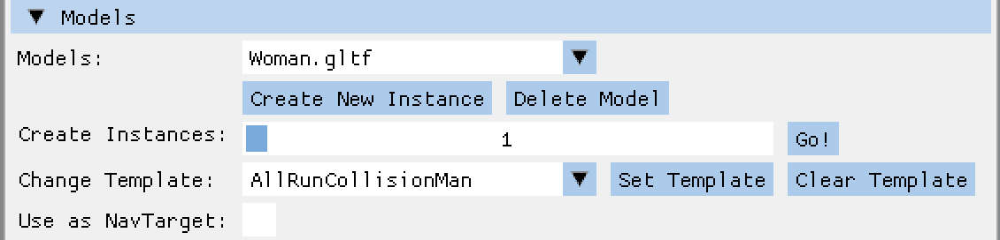

图 13.10：UI 的模型部分，带有新的导航目标复选框

通过在*图 13.10*中设置**用作导航目标**复选框，我们可以控制模型是否应该用作导航目标。

对于实例，我们将五个变量添加到`InstanceSettings`结构体中：

```cpp
 bool isNavigationEnabled = false;
  int isPathTargetInstance = -1;
  int isPathStartTriangleIndex = -1;
  int isPathTargetTriangleIndex = -1;
  std::vector<int> isPathToTarget{}; 
```

为了按实例控制导航，使用`isNavigationEnabled`。两个变量`isPathTargetInstance`和`isPathToTarget`不需要解释；它们的名称说明了它们的作用。在`isPathStartTriangleIndex`中，保存了实例当前所在的三角形的索引，而`isPathTargetTriangleIndex`则填充了目标实例的三角形索引。

在`AssimpInstance`类中，添加了新变量的简单`public`设置器和获取器方法：

```cpp
 void setPathStartTriIndex(int index);
    void setPathTargetTriIndex(int index);
    int getPathTargetTriIndex();
    void setPathTargetInstanceId(int instanceId);
    void setPathToTarget(std::vector<int> indices);
    std::vector<int> getPathToTarget(); 
```

在`UserInterface`类的**实例**折叠标题中，也添加了一些新的控件：

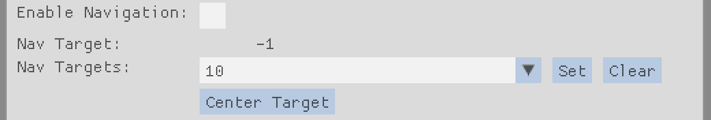

图 13.11：实例的新导航控件

当检查 **启用导航** 复选框时，导航控制的其余部分被启用。如果存在任何导航目标模型，**导航目标** 组合框将填充实例的索引，允许我们设置要使用的实例编号作为目标。如果已设置目标，**导航目标** 将显示当前目标的索引，或如果未选择任何目标，则显示 `-1`。要找到目标而无需切换实例，可以按 `Center Target`，将目标居中在屏幕中间。

对于具有导航目标的组合框，将在 `Callbacks.h` 文件中添加一个名为 `getNavTargetsCallback` 的回调：

```cpp
using getNavTargetsCallback = std::function<std::vector<int>(void)>; 
```

在渲染类文件 `OGLRenderer.cpp` 和 `VkRenderer.cpp` 中的对应方法称为 `getNavTargets()`，并收集所有启用为导航目标的模型的索引：

```cpp
 std::vector<int> targets;
 for (const auto& model : mModelInstCamData.micModelList) {
   if (!model->isNavigationTarget()) {
     continue;
   } 
```

我们遍历所有模型，如果模型不是导航目标，则继续下一个模型。如果模型标记为导航目标，我们将所有索引存储在一个名为 `targets` 的向量中，并返回该向量：

```cpp
 std::string modelName = model->getModelFileName();
    for (auto& instance : mModelInstCamData.
        micAssimpInstancesPerModel[modelName]) {
      InstanceSettings settings =
        instance->getInstanceSettings();
      targets.emplace_back(
        settings.isInstanceIndexPosition);
    }
  }
  return targets; 
```

为了将目标放置在地面上，我们还需要应用重力。

## 为非动画实例添加重力

由于我们需要动画实例保持在地面进行碰撞检测和逆运动学，因此重力目前仅影响任何动画实例。由于动画和非动画模型的代码保持大部分相似，因此为非动画实例添加重力只需进行几个小的更改。

首先，复制包含 `mLevelCollisionTimer.start()` 和 `mLevelCollisionTimer()` 调用的整个代码块，并将其放置在将当前实例添加到实例八叉树调用下方，如下面的代码块所示：

```cpp
 mOctree->add(
            instSettings.isInstanceIndexPosition);
 **mLevelCollisionTimer.****start****();**
 **...**
 **mRenderData.rdLevelCollisionTime +=**
 **mLevelCollisionTimer.****stop****();** 
```

然后，在新代码下方添加对 `updateInstancePosition()` 的调用：

```cpp
 **instances.****at****(i)->****updateInstancePosition****(**
 **deltaTime);** 
```

最后，将包含世界变换矩阵的检索从实例位置更新后的代码块开始处移动：

```cpp
 mWorldPosMatrices.at(i) =
            instances.at(i)->getWorldTransformMatrix(); 
```

那就结束了！

现在重力和非动画实例的地面碰撞也被计算，实例位置被更新，最近的世界变换被收集并添加到 `mWorldPosMatrices` 数组中，然后上传到着色器存储缓冲区对象。

## 保存和加载新的模型和实例数据

将新值存储在 YAML 配置文件中并恢复设置无需进一步解释。使用模型作为导航目标的布尔值存储在 `ModelSettings` 结构体中，所有新的路径查找和导航变量存储在 `InstanceSettings` 结构体中。将新值添加到 YAML 发射器和解析器中只需复制粘贴即可。YAML 配置版本也应更新，以反映新值。

我们有地面三角形、路径查找算法以及路径的起始和目标点。剩下的就是让实例跟随路径的逻辑。所以，现在让我们添加最后一部分。

# 将实例导航到目标

为了计算或更新到达目标实例的路径，我们需要向渲染器添加更多代码。我们首先添加从实例到目标位置的路径计算代码。

## 计算到达目标路径

路径更新代码的最佳位置是在渲染类`OGLRenderer.cpp`或`VKRenderer.cpp`的`draw()`调用中所有动画实例的循环中，紧接在为非动画实例复制的地面和碰撞检测代码之后。我们有实例的最终世界位置可用，包括任何重力更新，并可以使用这个位置作为路径查找算法的起点。

首先，我们检查实例是否启用了导航，并获取目标实例的索引：

```cpp
 if (instSettings.isNavigationEnabled) {
        int pathTargetInstance =
          instSettings.isPathTargetInstance; 
```

然后，我们对目标实例进行合理性检查，以避免在访问`micAssimpInstances`向量时崩溃：

```cpp
 if (pathTargetInstance >=
           mModelInstCamData.micAssimpInstances.size()) {
         pathTargetInstance = -1;
         instances.at(i)->setPathTargetInstanceId(
           pathTargetInstance);
       } 
```

接下来，提取目标当前所在三角形的索引以及目标的世界位置：

```cpp
 int pathTargetInstanceTriIndex = -1;
        glm::vec3 pathTargetWorldPos = glm::vec3(0.0f);
        if (pathTargetInstance != -1) {
          std::shared_ptr<AssimpInstance>
            targetInstance =
            mModelInstCamData.micAssimpInstances.at(
            pathTargetInstance);
          pathTargetInstanceTriIndex =
            targetInstance->
              getCurrentGroundTriangleIndex();
          pathTargetWorldPos =
            targetInstance->getWorldPosition();
        } 
```

由于目标实例可能自行移动或被用户移动，必须在每次路径更新之前检索目标三角形索引。这个三角形索引更新确保实例在跟随目标，无论目标是一个静态的航标点还是在该级别周围游荡的另一个实例。

现在我们检查当前实例和目标实例是否都有一个有效的地面三角形，以及我们或目标是否已经远离了保存的三角形。只有当所有条件都满足时，我们才重新计算路径，避免在源或目标没有变化时进行昂贵的计算：

```cpp
 if ((instSettings.isCurrentGroundTriangleIndex > -1 &&
        pathTargetInstanceTriIndex > -1) &&
        (instSettings.isCurrentGroundTriangleIndex !=
        instSettings.isPathStartTriangleIndex ||
        pathTargetInstanceTriIndex !=
        instSettings.isPathTargetTriangleIndex)) {
        instances.at(i)->setPathStartTriIndex(
      instSettings.isCurrentGroundTriangleIndex);
      instances.at(i)->setPathTargetTriIndex(
        pathTargetInstanceTriIndex); 
```

在任何变化的情况下，我们调整当前实例的起始和目标三角形。有了三角形的最最新数据，我们可以调用`findPath()`：

```cpp
 std::vector<int> pathToTarget =
        mPathFinder.findPath(
        instSettings.isCurrentGroundTriangleIndex,
        pathTargetInstanceTriIndex); 
```

如果没有找到有效的路径，结果可能为空。在这种情况下，我们禁用实例的导航，并通过将其设置为`-1`使目标实例无效：

```cpp
 if (pathToTarget.size() == 0) {
        instances.at(i)->setNavigationEnabled(false);
        instances.at(i)->setPathTargetInstanceId(-1);
      } else {
        instances.at(i)->setPathToTarget(pathToTarget);
      } 
```

如果路径有效，我们在实例中设置路径索引。

由于路径仅在变化时更新，我们现在获取实例保存的或刚刚更新的路径：

```cpp
 std::vector<int> pathToTarget =
      instances.at(i)->getPathToTarget(); 
```

为了避免在开始或结束路径到目标时出现尴尬的运动，我们从实例路径中删除起始和目标三角形：

```cpp
 if (pathToTarget.size() > 1) {
      pathToTarget.pop_back();
    }
    if (pathToTarget.size() > 0) {
      pathToTarget.erase(pathToTarget.begin());
    } 
```

路径是在实例当前站立的地形三角形的中心与目标所在的地形三角形之间创建的。如果实例已经比三角形中心更近，路径将指向后方，实例可能永远不会离开当前的地形三角形。我们也可以从`PathFinder`类中删除元素，但如果我们要在其他地方使用`findPath()`生成的数据，可能需要三角形。因此，我们在这里截断三角形索引。

作为路径查找的最后一步，我们将实例旋转到下一个路径点或目标，具体取决于我们是否在`pathToTarget`中还有路径：

```cpp
 if (pathToTarget.size() > 0) {
      int nextTarget = pathToTarget.at(0);
      glm::vec3 destPos =
        mPathFinder.getTriangleCenter(nextTarget);
      instances.at(i)->rotateTo(destPos, deltaTime);
    } else {
      instances.at(i)->rotateTo(pathTargetWorldPos,
        deltaTime);
    } 
```

`PathFinder`类的`getTriangleCenter()`调用返回请求三角形在世界坐标中的中心。然后，这个中心点被输入到实例的`rotateTo()`方法中，所以接下来让我们看看旋转方法的实现。

## 将实例旋转到目标位置

必须在`AssimpInstance`类中添加一个名为`rotateTo()`的新`public`方法。

首先，我们检查实例现在是否在行走或奔跑。如果实例在地面静止时旋转，可能会显得很奇怪：

```cpp
 if (mInstanceSettings.isMoveState != moveState::walk &&
      mInstanceSettings.isMoveState != moveState::run) {
    return;
  } 
```

然后，我们获取当前实例的旋转向量和从我们的位置指向目标位置的向量：

```cpp
 glm::vec3 myRotation = get2DRotationVector();
  glm::vec3 twoDimWorldPos =
    glm::vec3(mInstanceSettings.isWorldPosition.x,
     0.0f, mInstanceSettings.isWorldPosition.z);
  glm::vec3 toTarget = glm::normalize(glm::vec3(
    targetPos.x, 0.0f, targetPos.z) - twoDimWorldPos); 
```

我们只对围绕 Y 轴的旋转感兴趣，因此我们使用实例的二维旋转向量，并将向量减少到目标和 X、Z 维度的值。

通过使用两个向量`myRotation`和`toTarget`，我们可以通过点积计算出两个向量之间的角度：

```cpp
 float angleDiff = glm::degrees(std::acos(
    glm::dot(myRotation, toTarget))); 
```

最后，我们计算包含两个向量之间旋转的四元数，提取欧拉角，并使用角度的`y`元素来旋转实例：

```cpp
 if (angleDiff > 6.0f) {
    glm::quat destRoation =
      glm::rotation(toTarget, myRotation);
    glm::vec3 angles = glm::eulerAngles(destRoation);
    rotateInstance(glm::degrees(angles.y) *
      deltaTime * 2.0f);
  } 
```

与`deltaTime`的乘法使得实例旋转变得平滑，因为每一帧的角度都很小。`angleDiff`值的初始比较确保我们留下一个小“死区”，如果路径几乎直线，则会导致旋转次数减少，并避免旋转过度时的振荡。

如果目标在关卡中移动，当路径实例被重新创建时，死区也会减少校正次数。通过仔细调整过度转向量和死区角度，追逐实例的行为将更加自然，因为这两个参数都可以在跟随目标时减少方向变化次数。

为了使计算出的路径可见，我们还应该为渲染器添加一个可视化输出。

## 为路径添加调试线条

将路径绘制到屏幕上非常简单。除了在`OGLRenderData`结构体中添加一个名为`rdDrawInstancePaths`的控制布尔值，对于 OpenGL，相应地，在`VkRenderData`结构体中添加一个新行网格在渲染器中，以及在`UserInterface`类中添加一个复选框，创建所有路径点之间的线条很容易。新代码的最佳位置是在*计算到达目标路径*部分添加的代码之后。

首先，我们检查是否需要创建线条，以及是否有有效的目标：

```cpp
 if (mRenderData.rdDrawInstancePaths &&
      pathTargetInstance > -1) { 
```

然后，我们为路径设置所需的颜色和高度偏移，并创建一个顶点来绘制线条：

```cpp
 glm::vec3 pathColor = glm::vec3(0.4f, 1.0f, 0.4f);
      glm::vec3 pathYOffset = glm::vec3(0.0f, 1.0f, 0.0f);
      OGLLineVertex vert;
      vert.color = pathColor; 
```

接下来，我们将当前实例的世界位置作为线条的起始点：

```cpp
 vert.position = instSettings.isWorldPosition +
        pathYOffset;
      mInstancePathMesh->vertices.emplace_back(vert); 
```

如果我们有有效的路径，我们将提取路径的第一个三角形中心的世界位置作为第一条线的第二个点。由于我们已经移除了起始三角形，因此线条将绘制到路径中的下一个三角形：

```cpp
 if (pathToTarget.size() > 0) {
        vert.position = mPathFinder.getTriangleCenter(
          pathToTarget.at(0)) + pathYOffset;
        mInstancePathMesh->vertices.emplace_back(vert); 
```

然后，我们创建一个新的临时线网格，并通过调用`PathFinder`类的`getAsLineMesh()`方法检索路径段的多边形顶点：

```cpp
 std::shared_ptr<OGLLineMesh> pathMesh =
          mPathFinder.getAsLineMesh(pathToTarget,
          pathColor, pathYOffset);
        mInstancePathMesh->vertices.insert(
        mInstancePathMesh->vertices.end(),
          pathMesh->vertices.begin(),
          pathMesh->vertices.end()); 
```

辅助方法`getAsLineMesh()`仅提取路径上地面三角形的中点，将所需的偏移量添加到顶点的世界位置，并从顶点创建线条。

现在，我们将最后一个位置添加为最后一条线的可能起始点：

```cpp
 vert.position = mPathFinder.getTriangleCenter(
          pathToTarget.at(pathToTarget.size() - 1)) +
          pathYOffset;
        mInstancePathMesh->vertices.emplace_back(vert);
      } 
```

作为创建线条的最后一步，我们添加目标的世界位置：

```cpp
 vert.position = pathTargetWorldPos + pathYOffset;
      mInstancePathMesh->vertices.emplace_back(vert); 
```

如果在移除第一个和/或最后一个元素后路径为空，我们将跳过`if`条件内的代码，并只从我们的位置画到目标的一条线。这仅在我们有一个有效的目标，并且起始和目标三角形直接相邻时发生。如果在路径寻找过程中发生错误且路径为空，我们将重置目标实例，并且不再绘制线条。

要绘制创建的线条，在渲染器类`OGLRendere.cpp`或`VkRender.cpp`中创建一个新的`private`方法`drawInstancePaths()`，该方法仅将线条发送到着色器。通过在**导航**标题下启用**启用导航**复选框以及在**级别**标题下启用**绘制实例路径**复选框来启用导航调试绘制后，实例的导航路径将以绿色线条绘制，类似于*图 13.12*：

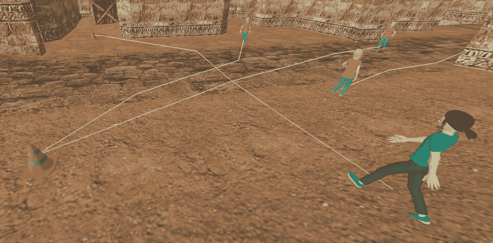

图 13.12：显示实例路径的调试线条

在*图 13.12*中，添加了交通锥体的模型并将其标记为导航目标。然后，指示实例走向它们的目标。

实例和目标之间锯齿状的路径是所选级别地图中大型地面三角形的结果。由于实例是从三角形中心移动到三角形中心，因此随着中心点之间距离的增大，路径的角度也更大。具有较小地面三角形的级别将为实例提供更平滑的路径。

# 摘要

在本章中，我们实现了一种简单的路径寻找导航。在概述了允许计算机控制的实例在游戏地图中导航的方法之后，我们探讨了并实现了 A*路径寻找算法，该算法由自定义导航网格创建支持。然后，我们修改了模型，以便在虚拟世界中将其用作导航目标，并使实例能够使用特殊模型的实例作为路径目标。作为最后一步，我们为实例添加了导航功能，允许它们走向或跑向一个随机目标。

在本书的下一章和最后一章中，我们将从实现方面退后一步，看看不同的方法来增强沉浸感和视觉质量。我们将从可听方面开始，讨论向应用程序添加音效和音乐的方法和工具。然后，我们将探讨使世界充满更多生命力的想法，接着讨论增强虚拟世界视觉效果的创意。我们将研究任务和实例之间的交互，最后探索白天和天气变化的影响。

# 实践课程

这里是一些你可以添加到代码中的内容：

+   即使是大型地面三角形，也要平滑路径。

通过查找接下来的几个路径段，可能可以创建这些段落的平均值。对于更尖锐的转弯，可以通过使用样条曲线来平滑三角形之间的过渡。

+   清理生成的三角形邻接列表。

目前，相邻三角形的列表相当大。这一点可以在激活级别邻接网格调试绘图时看到。尝试找到一种解决方案，只包括共享部分边界的三角形。

+   在墙壁和路径线之间添加最小距离。

对于生成的地面三角形，一些中心位置可能非常接近墙壁，以至于在跟随路径时实例会发生碰撞。在某些情况下，当三角形被视为相邻时，路径甚至会穿过水平几何体的边缘。在创建地面三角形时，尝试找到网格的轮廓，并通过可配置的数量减小其大小。

+   使用实例 AABB 来检测狭窄的通道。

一些地图可能有需要精确导航的通道。在没有真实导航网格的情况下，你可以尝试使用沿路径的实例边界框来寻找可能的碰撞，并调整路径以避免与级别结构发生碰撞。

+   高级难度：在一个编辑器中创建导航网格并将其加载。

如果你熟悉像 Blender 这样的工具，你可以尝试创建一个作为级别单独网格的导航网格，甚至作为一个单独的文件，保存在级别文件旁边。然后，将导航网格加载到 `PathFinder` 类中，以便为实例提供一个无碰撞的地面。

# 其他资源

+   Pac-Man 中的幽灵导航：[`gameinternals.com/understanding-pac-man-ghost-behavior`](https://gameinternals.com/understanding-pac-man-ghost-behavior)

+   Dijkstra 算法：[`graphicmaths.com/computer-science/graph-theory/dijkstras-algorithm/`](https://graphicmaths.com/computer-science/graph-theory/dijkstras-algorithm/)

+   Quake III Arena 的区域感知系统：[`www.kbs.twi.tudelft.nl/docs/MSc/2001/Waveren_Jean-Paul_van/thesis.pdf`](http://www.kbs.twi.tudelft.nl/docs/MSc/2001/Waveren_Jean-Paul_van/thesis.pdf)

+   导航网格：[`www.gamedev.net/tutorials/programming/artificial-intelligence/navigation-meshes-and-pathfinding-r4880/`](https://www.gamedev.net/tutorials/programming/artificial-intelligence/navigation-meshes-and-pathfinding-r4880/)

+   Shakey 机器人：[`www.sri.com/hoi/shakey-the-robot/`](https://www.sri.com/hoi/shakey-the-robot/)

+   A* 简介：[`www.redblobgames.com/pathfinding/a-star/introduction.html`](https://www.redblobgames.com/pathfinding/a-star/introduction.html)

+   使用 A* 与导航网格：[`medium.com/@mscansian/a-with-navigation-meshes-246fd9e72424`](https://medium.com/@mscansian/a-with-navigation-meshes-246fd9e72424)

+   Unreal Engine 中的导航网格：[`dev.epicgames.com/documentation/en-us/unreal-engine/basic-navigation-in-unreal-engine`](https://dev.epicgames.com/documentation/en-us/unreal-engine/basic-navigation-in-unreal-engine)

+   在 Unreal Engine 项目中实现 A*：[`www.youtube.com/watch?v=xakl29fupCA`](https://www.youtube.com/watch?v=xakl29fupCA)

+   在 Trackmania 中训练无敌的 AI：[`www.youtube.com/watch?v=Dw3BZ6O_8LY`](https://www.youtube.com/watch?v=Dw3BZ6O_8LY)

+   Recast Navigation：[`github.com/recastnavigation/recastnavigation`](https://github.com/recastnavigation/recastnavigation)

+   平滑路径优化：[`www.gameaipro.com/GameAIPro3/GameAIPro3_Chapter20_Optimization_for_Smooth_Paths.pdf`](https://www.gameaipro.com/GameAIPro3/GameAIPro3_Chapter20_Optimization_for_Smooth_Paths.pdf)

+   向更真实的寻路方法迈进：[`www.gamedeveloper.com/programming/toward-more-realistic-pathfinding`](https://www.gamedeveloper.com/programming/toward-more-realistic-pathfinding)

# 加入我们的 Discord 社区

加入我们社区的 Discord 空间，与作者和其他读者进行讨论：[`packt.link/cppgameanimation`](https://packt.link/cppgameanimation)


