# 创建沉浸式交互式世界

欢迎来到**第十四章**！在前一章中，我们为实例添加了路径寻找和导航。我们从一个关于计算机游戏中导航方法的简要概述开始。然后我们探讨了并实现了 A*算法，以在实例位置和虚拟世界中的一个点之间找到路径。接下来，我们增强了模型以作为导航目标，并扩展了实例以找到通往其中一个目标的路。在本章的结尾，我们添加了实例能够跟随路径并达到期望目标的能力。

在本章中，我们将探讨不同的想法来增强示例代码，以实现更多的沉浸感和视觉质量。我们将查看可听部分，寻找添加声音效果和音乐到应用程序的工具和方法。此外，我们将实现一个简单的音频管理类来播放声音和背景音乐。为了取悦耳朵和眼睛，我们还将收集一些关于如何增强视觉外观的想法，并实现应用程序的两个图形增强。我们将通过查看白天和天气变化对虚拟世界的影响，并在应用程序中添加基本的日夜循环来结束本书。

在本章中，我们将涵盖以下主题：

+   添加声音效果和背景音乐

+   提升视觉效果

+   通过日夜和天气增强沉浸感

# 技术要求

本章的示例代码位于`chapter14`文件夹中：OpenGL 的`01_opengl_ideas`子文件夹和 Vulkan 的`02_vulkan_ideas`子文件夹。

# 添加声音效果和背景音乐

从*第十三章*中的示例代码运行提供了许多功能，例如面部动画、关卡加载、碰撞检测以及路径寻找和导航。但遗憾的是，屏幕上的所有动画都在无声中进行。没有哔哔声或嘟嘟声，没有声音，也没有音乐。只有寂静。

但声音和音乐是游戏的重要组成部分，原因非常充分。无论是你在享受 Minecraft 的宁静草地或深邃洞穴，随着超级马里奥系列中欢快的音乐摇摆，听着我们行动的声学反馈音效，还是偏好漫游在《死亡空间》或《寂静岭》系列中那些令人毛骨悚然的世界上，仔细聆听环境声音以了解你的周围环境，或者在《极品飞车》系列等赛车游戏中驾驶汽车，听着节奏强劲的音乐和低沉的声音——没有音乐和声音，游戏就无法为玩家提供同样的体验。

要添加声音输出，我们可以包含一个免费可用的声音库，使我们能够轻松地播放声音效果或音乐。让我们首先看看一些库。

## 使用音频库

大多数音频库是用 C 编写的，但可以找到 C++ 的绑定，以面向对象的方式封装操作系统特定的低级函数调用。仅使用 C 函数并构建自定义抽象也是可能的，类似于 GLFW、OpenGL 和 Vulkan。

### Simple DirectMedia Layer

**Simple DirectMedia Layer** (**SDL**) 是一个跨平台库，用于计算机的多媒体硬件组件。SDL 管理音频，可以作为窗口功能、图形上下文和输入处理的框架，如 GLFW。此外，还有几个官方库提供对导入和导出图像、自定义网络和字体渲染以在屏幕上显示文本的支持。

### OpenAL

**OpenAL** 是一个专注于多通道、三维音频的跨平台库。通过使用三维音频，可以将声音建模为在玩家前方或后方，而不仅仅是左右，从而加深沉浸感。

### PortAudio

**PortAudio** 是另一个跨平台音频库。它针对实时音频播放和录制。如果 SDL 和 OpenAL 的范围对于项目来说太大，可以使用 PortAudio，目标是仅仅播放一些音频。

### FMOD

虽然 **FMOD** 是一个专有音效引擎，但由于存在非商业许可，它可以被列入免费可用的库列表，允许我们免费使用 FMOD。只有当最终的应用程序或游戏将商业分发时，才需要付费的 FMOD 许可证。FMOD 支持如 Unreal 和 Unity 这样的 3D 引擎，所以如果你在某个时间点正在制作游戏，甚至可能会接触到 FMOD。

在探索了可以包含哪些软件用于声音和音乐回放之后，让我们来看看可以播放以及应该播放的内容。

## 播放音效

由于声音在我们的生活中扮演着关键角色，我们会对在游戏或模拟中应该听到的内容有所期望。未能满足这些期望可能会损害沉浸感。

### 游戏角色的脚步声

可能玩家最想听到的最重要的音效是角色在地面上行走的声音。通过调整与地面材料和角色速度相关的声音，向玩家提供关于环境的即时反馈。在无声地穿过草地或在地面上奔跑之间有显著的区别，玩家应该意识到角色的“响度”，并且通过使用碰撞检测和地面三角形发现，如*第十二章*中的*在关卡数据中查找地面三角形*部分所述，可以轻松找到地面三角形的材质类型。

### 其他角色声音

角色会发出更多的声音，不仅仅是脚步声。跳跃和着陆、爬梯子、游泳或被敌人角色伤害也应该给玩家提供可听见的反馈，以提供关于虚拟世界中角色发生情况的额外信息。

### 本地声音源

不仅玩家控制的角色需要声音效果，虚拟世界中的计算机控制的角色和静止物体也应该播放音频效果。听到门开关的声音、铁匠的锤击声，或鸟儿的鸣叫，以及听到壁炉的噼啪声、瀑布声或世界高处风的声音，将极大地增强沉浸感。

### 环境声音

环境声音是由来自遥远地点的不同声音和频率混合而成，在传递到听者过程中会丢失一些信息。一大群人、森林中的风，或者几米外的街道都会产生我们熟知的声响，这些声响应该被添加到虚拟世界的相应位置。

### 天气效果

如果世界上存在某种天气系统，那么相应的声音和效果也应该被添加。远处的雷暴或雪后地面的寂静都可以改变玩家对虚拟世界的感知。

但声音效果不仅有助于沉浸感；播放音乐也有助于保持玩家的注意力。

## 播放音乐

自从计算机游戏早期开始，音乐就被添加到游戏中以保持玩家的兴趣。因此，当我们看到游戏标题时，我们可能仍然记得游戏的音乐，而不是游戏玩法或游戏角色的细节。

### 菜单音乐

玩家启动应用程序后看到的第一个屏幕很可能是某种主菜单。直接将玩家投入战斗，而无法首先配置虚拟角色的控制、视觉效果或音量，可能不是最好的选择。当玩家在菜单中探索选项时，音乐可以帮助防止玩家立即感到迷茫或无聊。

### 环境音乐

与环境声音类似，环境音乐有助于防止游戏中的死寂。完全不播放声音可能是为了建立紧张感，但长时间在寂静中玩游戏可能会变得无聊。添加一个风格和节奏适合游戏玩法的音乐曲目，可以帮助玩家享受游戏的缓慢段落。

### 自适应音乐播放

当玩家进入开放世界中的不同区域，或进入具有不同风格的场景，或另一个房间时，改变音乐以匹配新地方是一个好主意。进入房间时著名的“听到 Boss 音乐”的时刻，结合门锁的声音，将为玩家创造难忘的体验。

### 允许自定义音乐

音乐选择的一个有趣选项是让玩家将本地音乐添加到游戏中播放的曲目列表中，甚至完全替换音乐。看到游戏角色在听一些喜欢的音乐曲目时探索虚拟世界，可能会为玩家增添乐趣。

为了体验音频回放可以带来的差异，我们将添加一个 C++类来管理声音效果和音乐回放。

## 实践：实现音频管理器

音频管理类由两个不同的部分组成。一方面，我们需要音频管理器和渲染器以及其他类之间的高层接口。另一方面，封装的底层接口将音频管理器功能与操作系统的音频库链接起来，这将允许我们用另一个变体替换音频库。

我们将首先简要概述高层接口，然后深入到底层实现。

### 定义高层接口

新的`AudioManager`类，包括`AudioManager.h`头文件和`AudioManager.cpp`实现文件，将被添加到`tools`文件夹中。我们将添加通常音乐/声音播放器应具备的基本功能：

+   初始化和清理音频库

+   从文件系统上的文件加载音乐曲目

+   从文件系统上的文件加载音效

+   播放和停止音乐和音效

+   暂停、恢复和跳转到下一首和上一首音乐曲目

+   获取、随机播放和清除当前播放列表

+   改变音乐和音效的音量

例如，向`AudioManager`类中添加了`public`的`setMusicVolume()`和`getMusicVolume()`方法来控制音乐音量：

```cpp
 void setMusicVolume(int volume);
    int getMusicVolume(); 
```

此外，名为`mMusicVolume`的`private`成员变量用于存储当前的音乐音量：

```cpp
 int mMusicVolume = 64; 
```

对于功能列表中剩余的功能，创建了`public`方法和`private`成员变量。请查看`AudioManager.h`文件以了解`AudioManager`类中可用的方法和成员变量的完整数量。

现在，我们必须将`AudioManager`类的对象成员变量以及音频功能的初始化和清理调用添加到应用程序代码中。为了仅保留视频部分的渲染器，`AudioManager`成员变量和方法将被添加到`Window`类中。

#### 将`AudioManager`类添加到`Window`类中

将音频功能添加到`Window`类的两个主要步骤与其他所有类相同：在`Window.h`头文件的顶部包含`AudioManager.h`头文件，并声明名为`mAudioManager`的`private`成员变量：

```cpp
**#****include****"****AudioManager.h"**
...
 **AudioManager mAudioManager{};** 
```

然后，在`Window.cpp`文件中`Window`类的`init()`方法中，我们尝试初始化`AudioManager`对象：

```cpp
 if (!mAudioManager.init()) {
    Logger::log(1, "%s error: unable to init audio,
      skipping\n", __FUNCTION__);
  } 
```

注意，我们使用`Logger`类来打印错误信息，但如果`AudioManager`初始化失败，我们不会结束窗口初始化。音频回放应保持可选，我们将继续进行，而不是在音乐和声音回放失败时终止应用程序启动过程。

在初始化调用后立即将音乐曲目加载到`AudioManager`中：

```cpp
 if (mAudioManager.isInitialized()) {
    mAudioManager.loadMusicFromFolder("assets/music", "mp3"));
  } 
```

这里，我们尝试在初始化成功的情况下将 `assets/music` 文件夹中的所有 MP3 文件加载到 `AudioManager` 中。同样，如果在资产文件夹中没有找到音乐文件，我们不会失败。

将音乐曲目添加到播放列表

在 `AudioManager` 类中，已经实现了从本地文件夹 `assets/music` 加载 MP3 和 OGG 文件到播放列表的支持。您可以将自己的音乐添加到 `assets/music` 文件夹中，因为当应用程序启动时播放列表将被填充。在 *实践课程* 部分中，有一个任务可以添加一个 **刷新** 按钮到 UI 中，允许您在应用程序运行时添加或删除音乐曲目。

最后，我们需要在关闭应用程序时清理 `AudioManager`。因此，我们将对 `Window` 类的 `cleanup()` 方法添加对 `AudioManager` 的 `cleanup()` 方法的调用：

```cpp
void Window::cleanup() {
  mRenderer->cleanup();
 **mAudioManager.****cleanup****();**
...
} 
```

由于我们在 `Window` 类中创建了 `AudioManager`，我们需要创建回调函数以从渲染器或用户界面访问音乐和音效函数。

#### 使用回调使 AudioManager 类在所有地方可用

通过使用这些回调函数，可以从代码的任何地方更改音乐曲目或播放脚步声。作为一个例子，我们将在这里使用播放特定音乐曲目的功能，给定曲目名称作为参数。

首先，我们将名为 `playMusicTitleCallback` 的回调函数签名添加到 `Callbacks.h` 文件中：

```cpp
using playMusicTitleCallback =
  std::function<void(std::string)>; 
```

接下来，我们在 `ModelInstanceCamData.h` 文件中为 `ModelInstanceCamData` `struct` 创建一个名为 `micPlayMusicTitleCallbackFunction` 的变量：

```cpp
 playMusicTitleCallback micPlayMusicTitleCallbackFunction; 
```

我们使用 `ModelInstanceCamData` `struct` 来避免在代码中到处传播回调函数。

然后，回调变量将被绑定到 `Window` 类的 `init()` 方法中对应的 `AudioManager` 函数：

```cpp
 ModelInstanceCamData& rendererMICData =
    mRenderer->getModInstCamData();
    RendererMICData.micPlayMusicTitleCallbackFunction =
    this {
      mAudioManager.playTitle(title);
    }; 
```

这里，我们获取渲染器类中包含 `ModelInstanceCamData` `struct` 的变量的引用，并使用 lambda 函数分配 `AudioManager` 类的 `playTitle()` 方法。

创建回调函数签名、将变量添加到 `ModelInstanceCamData` `struct` 以及将回调函数绑定到 `AudioManger` 类的方法这三个相同的步骤必须为渲染器中应可用的每个音频方法重复执行。

现在，让我们看看音频管理器低级部分的实现。我们将使用 SDL，因为音频函数易于使用。

### 在低级层使用 SDL

虽然 SDL 可以处理比音频更多的功能，但仍然可以使用 SDL 库提供的函数子集。因此，我们不会使用 SDL 来处理窗口和键盘，这由应用程序中的 GLFW 完成，我们只会使用 SDL 的声音回放和混音功能。

要使用 SDL 进行音频回放，我们需要核心 SDL 库以及名为 `SDL_mixer` 的单独混音库。

#### 在 Windows 上安装 SDL 和 SDL_mixer

对于 Windows，GitHub 上提供了 SDL 和 `SDL_mixer` 的预编译版本。访问以下两个 URL 的发布页面，下载最新的稳定开发 zip 文件，文件名中包含 `devel` 和 `VC`，用于 Visual Studio。例如，当前 Visual Studio 的主 SDL 库开发包名为 `SDL2-devel-2.30.9-VC.zip`。以下是 URL：

+   SDL: [`github.com/libsdl-org/SDL/releases`](https://github.com/libsdl-org/SDL/releases)

+   `SDL_mixer`: [`github.com/libsdl-org/SDL_mixer/releases`](https://github.com/libsdl-org/)

现在，将两个 zip 文件解压到您的计算机上，但请注意避免在路径名称中使用空格和特殊字符，如德语的重音符号，以避免问题，因为即使在 2024 年，许多工具仍然在路径中的特殊字符上存在问题。

接下来，添加两个 **环境变量** 以帮助 CMake 搜索脚本找到头文件和库：

+   第一个变量名为 `SDL2DIR`，必须指向主 SDL 库解压的文件夹。

+   第二个变量名为 `SDL2MIXERDIR`，必须指向 `SDL_mixer` 库的文件夹。

*图 14.1* 展示了环境变量的示例：

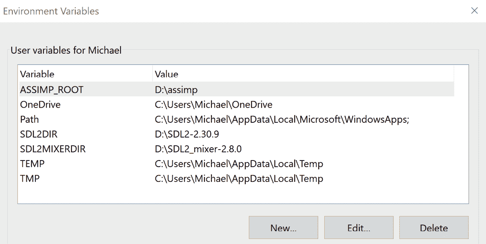

图 14.1：SDL 的示例环境变量

安装两个库并添加环境变量后，可以编译本章的代码。CMake 构建脚本负责将两个 DLL 文件放置在可执行文件旁边。

#### 在 Linux 上安装 SDL 和 SDL_mixer

在 Linux 上，可以通过集成软件包管理器添加 SDL 库。在 Ubuntu 或 Debian 上，您可以使用 `apt` 软件包管理器通过以下命令安装主 SDL 库、`SDL_mixer` 库以及所有开发头文件和库：

```cpp
sudo apt install libsdl2-dev libsdl2-mixer-dev 
```

对于基于 Arch 的发行版，使用 `pacman` 软件包管理器通过以下命令将两个库添加到系统中：

```cpp
sudo pacman –S sdl2 sdl2_mixer 
```

为了将 SDL 和 `SDL_mixer` 添加到 `AudioManager` 类中以便使用 SDL 函数，我们必须在 `AudioManager.h` 头文件中现有的 `#include` 指令之后包含两个 SDL 头文件：

```cpp
#include <SDL.h>
#include <`SDL_mixer`.h> 
```

由于 SDL 是一个 C 库，所有结构只使用原始指针。音频管理器是您将在代码中找到带有原始指针变量的地方之一：

```cpp
std::unordered_map<std::string, Mix_Music*> mMusicTitles{};
Mix_Chunk* mWalkFootsteps; 
```

`mMusicTitles` 变量是一个包含多个 SDL 音乐对象的映射，可以通过轨道名称作为映射的键访问。每个轨道都保存在名为 `Mix_Music` 的变量中，前缀 Mix 表示这是一个由 `SDL_mixer` 库使用的变量。

在 `mWalkFootsteps` 变量中，存储了一个所谓的音频块（使用 SDL 的术语）。可以通过调用相应音效的回放函数来播放 `SDL_mixer` 音频块。

在播放音效或音乐之前，SDL 的音频部分必须正确初始化，并在应用程序结束时结束音频功能。

#### 初始化和关闭 SDL 及 SDL_mixer

作为 `AudioManager` 类的 `init()` 方法的第一步，我们尝试初始化 SDL 的音频部分：

```cpp
 if (SDL_Init(SDL_INIT_AUDIO) < 0) {
    return false;
  } 
```

`SDL_Init()` 和 `SDL_INIT_AUDIO` 标志的 `SDL` 前缀表示我们正在使用 SDL 的核心功能。如果我们无法初始化 SDL 的音频部分，我们将在这里停止 `AudioManager` 的初始化。请注意，音频设备的初始化可能会因各种原因而失败，例如，如果音频设备被另一个应用程序使用并禁止共享该设备。

接下来，我们尝试通过调用 `Mix_OpenAudio()` 来设置音频设备的参数：

```cpp
if (Mix_OpenAudio(44100, MIX_DEFAULT_FORMAT, 2, 8192) < 0) {  return false;
} 
```

现在，我们进入了 `SDL_mixer` 的领域，这在 `Mix_OpenAudio` 的 `Mix` 前缀中可见。`Mix_OpenAudio` 的第一个参数是重放频率（Hz）。我们使用由索尼的 **光盘** 规范引入的知名值 44.1 kHz。作为第二个参数，配置了内部音频格式。`MIX_DEFAULT_FORMAT` 代表 16 位有符号整数值，这在音频领域也是一个常见值。

第三个参数是要使用的输出通道数。一个输出通道使用单声道重放，初始化调用中的两个通道用于立体声输出。根据音频硬件和驱动程序支持，对于 7.1 系统来说，可能最多有八个输出通道。

通过第四个和最后一个参数，配置了 `SDL_mixer` 库中的内部音频缓冲区。如果 CPU 负载过高而填充缓冲区时，较小的缓冲区值可能会导致音频中断，而较大的缓冲区会导致延迟，因为缓冲区需要被填充后才能播放样本。缓冲区参数的单位是“样本帧”，因此我们配置 `SDL_mixer` 为保留 2,048 个帧的空间，每个帧包含两个 16 位有符号整数，每个输出通道一个。

在应用程序的终止时间，`Window` 类的 `cleanup()` 方法会调用 `AudioManager` 的 `cleanup()` 方法。在 `AudioManager` 类的 `cleanup()` 方法内部，我们关闭音频设备，并通知 `SDL_mixer` 和 SDL 运行它们各自的清理代码：

```cpp
 Mix_CloseAudio();
  Mix_Quit();
  SDL_Quit(); 
```

注意，我们在 `init()` 方法中没有调用 `Mix_Init()`，但我们必须在这里调用 `Mix_Quit()`。SDL 在没有显式调用 `Mix_Init()` 的情况下为我们管理混音初始化。

现在我们准备播放音乐和音效。让我们先看看音乐重放代码。

### 控制音乐重放

通过调用带有 C 风格字符数组作为参数的 `Mix_LoadMUS()` 来加载音乐曲目：

```cpp
 Mix_Music* music = Mix_LoadMUS(fileName.c_str()); 
```

`SDL_mixer` 支持多种音乐格式，如 WAV、MP3 和 OGG。`Mix_LoadMUS()` 的返回值是指向 `Mix_Music` `struct` 的指针。

要清理加载的音乐曲目，必须使用指向上述 `Mix_Music` `struct` 的指针调用 `Mix_FreeMusic()`：

```cpp
 Mix_FreeMusic(music); 
```

一条音乐曲目可以通过调用带有两个参数的 `Mix_PlayMusic()` 来播放：

```cpp
 Mix_PlayMusic(music, 0); 
```

第一个参数是指向有效 `Mix_Music` `结构体` 的指针，而第二个参数告诉 `SDL_mixer` 要播放的循环次数。循环值为 `0` 将禁用循环，而值为 `-1` 将无限循环音乐。

通过调用 `Mix_HaltMusic()` 来停止音乐：

```cpp
 Mix_HaltMusic(); 
```

由于一次只播放一个音乐曲目，因此不需要参数，并且如果当前曲目应该暂停或恢复，则有两个 `Mix_PauseMusic()` 和 `Mix_ResumeMusic()` 调用可用：

```cpp
 Mix_PauseMusic();
  Mix_ResumeMusic(); 
```

最后，通过 `Mix_VolumeMusic()` 控制音乐音量：

```cpp
 Mix_VolumeMusic(volume); 
```

`Mix_VolumeMusic()` 的参数是一个介于 `0` 和 `128` 之间的 `int` 值，用于设置新的音量，或者值为 `-1` 用于查询音乐的当前音量。

通过使用默认的 `SDL_mixer` 调用，我们只能播放一个音乐曲目一次或使用无限循环。如果需要动态音乐系统，则需要手动实现，甚至可能需要考虑不同的声音重放 API。对于在曲目结束时简单前进到播放列表中下一个曲目的简单能力，我们只需要实现一个回调。

### 添加用于连续音乐播放的回调

`SDL_mixer` 支持一个回调，用于通知应用程序当前音乐曲目已完成指定次数的循环。在这个回调中，我们可以简单地转发到播放列表中的下一个曲目。

很遗憾，`SDL_mixer` 是一个 C 音频库，回调必须满足 C 风格的调用约定。C++ 调用约定与 C 调用约定不兼容，并且只允许调用 `AudioManager` 类的静态成员函数。我们需要添加一个小技巧，以便能够调用具有访问播放列表和播放列表当前位置的 `AudioManager` 类的非静态方法。

首先，我们声明一个名为 `mCurrentManager` 的原始指针作为 `private` 成员变量，加上用于 C 风格回调的 `private` 静态 `staticMuscFinishedCallback()` 成员方法和用于翻译回调的 `private` 非静态成员 `musicFinishedCallback()`：

```cpp
 static AudioManager* mCurrentManager;
    static void staticMusicFinshedCallback();
    void musicFinishedCallback(); 
```

在 `AudioManager` 类的 `init()` 方法中，我们将 `mCurrentManager` 指针设置为当前实例，并使用静态回调方法调用回调钩子设置方法 `Mix_HookMusicFinished()`：

```cpp
 mCurrentManager = this;
  Mix_HookMusicFinished(staticMusicFinshedCallback); 
```

现在，每当音乐曲目结束时，`SDL_mixer` 会调用 `staticMusicFinishedCallback()`。要将回调转换为 C++，我们使用存储在 `mCurrentManager` 中的当前 `AudioManager` 实例的指针来调用非静态回调 `musicFinishedCallback()` 方法：

```cpp
 if (mCurrentManager)  {
    mCurrentManager->musicFinishedCallback();
  } 
```

在 `musicFinishedCallback()` 内部，我们现在可以添加代码以在播放列表中前进一个曲目，从而实现所有曲目的连续重放：

```cpp
 if (mMusicPlaying) {
    playNextTitle();
  } 
```

在音乐重放实现后，让我们转到声音效果重放代码。

### 播放声音效果

与播放音乐相比，使用`SDL_mixer`播放音效有一些细微的差别。主要区别是默认情况下可以同时播放八个音效，因为`SDL_mixer`为音效输出分配了八个内部音效通道。

注意，这些内部音效通道与我们初始化音频设备时配置的两个输出音效通道不同。

可以通过调用`Mix_AllocateChannels()`并传入期望的通道数作为参数来分配更多或更少的这八个音效通道：

```cpp
 Mix_AllocateChannels(1); 
```

目前我们将在`AudioManager`中仅使用一个通道，以便简单实现脚步声回放的功能。

由于`SDL_mixer`目前只有一个通道可用，如果另一个音效仍在播放，则无法播放第二个音效。因此，通过将通道数限制为只有一个，我们可以避免在示例实现中创建一个复杂的系统来在行走和跑步脚步声之间切换。

从文件系统中加载音文件的过程与音乐加载过程类似。我们通过调用`Mix_LoadWav()`并传入文件名的 C 风格字符数组来加载音文件，并将返回的结果存储在`Mix_Chunk`结构体中：

```cpp
 Mix_Chunk* mWalkFootsteps;
  mWalkFootsteps = Mix_LoadWAV(fileName.c_str()); 
```

通过调用`Mix_FreeChunk()`来清理音效：

```cpp
Mix_FreeChunk(mWalkFootsteps); 
```

播放和停止音效回放的方式与播放或停止音乐类似。通过使用`Mix_PlayChannel()`来播放音效：

```cpp
 mSoundChannel = Mix_PlayChannel(-1, mRunFootsteps, 0); 
```

`Mix_PlayChannel()`的第一个参数是要使用的音效通道。特殊值`-1`将使用下一个可用的音效通道进行音效回放。第二个参数是播放的`Mix_Chunk`结构体的指针，第三个参数是循环次数。

作为`Mix_PlayChannel()`的返回参数，我们得到播放此音效的音效通道号。我们将通道号保存在`mSoundChannel`成员变量中，以便能够通过`Mix_HaltChannel()`停止回放：

```cpp
 Mix_HaltChannel(mSoundChannel); 
```

就像音乐一样，我们可以通过调用`Mix_Volume()`并传入通道号和期望的音量作为参数来控制音效通道的音量：

```cpp
 Mix_Volume(mSoundChannel, volume); 
```

在我们知道如何播放音效之后，我们需要在渲染器中添加一些代码，以便在实例行走或跑步时播放脚步声。

### 在渲染器中使用脚步声效果

脚步声回放的实现将是最基本的，以展示如何以及在哪里添加音效的回调函数。一个功能齐全的音效回放系统需要更多的工作，并且超出了本书的范围。

要添加脚步声，需要在渲染器的`handleMovementKeys()`方法中添加以下代码片段，紧接在通过调用`setNextInstanceState()`设置实例的下一个状态之后。此时，我们已经拥有了实例当前运动状态的所有数据。

首先，我们检索当前实例的当前动画状态，并检查实例是否处于空闲/行走/跑步循环：

```cpp
 if (currentInstance->getAnimState() ==
    animationState::playIdleWalkRun) { 
```

我们只想在行走和跑步动画回放的同时添加音效。

然后我们检查实例的运动状态，并调用适当的状态回调：

```cpp
 switch (state) {
    case moveState::run:
      mModelInstCamData.
        micPlayRunFootstepCallbackFunction();
      break;
    case moveState::walk:
      mModelInstCamData.
        micPlayWalkFootstepCallbackFunction();
      break; 
```

当实例处于运行状态时，我们播放跑步脚步声音效。如果实例处于行走状态，则播放行走脚步声。

如果实例既不运行也不行走，我们停止脚步声音效：

```cpp
 default:
      mModelInstCamData.
        micStopFootstepCallbackFunction();
      break;
    } 
```

如果实例不在空闲/行走/跑步循环中，我们也会停止任何声音。这样，我们可以捕捉到所有尚未提供音效的动作，如跳跃或出拳：

```cpp
 } else {
    mModelInstCamData.
      micStopFootstepCallbackFunction();
  } 
```

要听到脚步声，需要执行以下步骤：

1.  启动应用程序并加载具有动画映射的配置。

1.  选择（或创建）一个第一人称或第三人称相机。

1.  在 UI 的**控制**窗口的**相机**部分中，选择实例并通过点击**使用所选实例**来设置实例。

1.  按`F10`键切换到查看模式。

如果你现在通过使用鼠标和*W*/*A*/*S*/*D*键移动受控实例，你应该听到两种不同的脚步声，这取决于实例在虚拟世界中行走或跑步。

### 扩展音频管理器类

为了概述`AudioManager`类可能的扩展，以支持更多通道以实现更类似游戏的声音管理，我们需要跟踪`Mix_PlayChannel()`调用返回的播放脚步声音通道。通过为本地脚步声保留一个专用通道，我们可以实现相同的行为，但我们将能够同时播放更多音效。

通过创建一个声音通道池并向`Mix_ChannelFinished()` SDL 函数添加回调，可以实现对多个音效的处理，类似于`Mix_HookMusicFinished()`。SDL 在通道完成当前音剪辑或调用`Mix_HaltChannel()`时触发`Mix_ChannelFinished()`回调，并在回调中传递完成的声音通道编号。

当播放音效和音效回放完成后，可以更新声音通道池。通过使用产生音效的对象的距离并使用`Mix_Volume()`或`Mix_SetDistance()`缩小通道音量，可以模拟不同源的距离。此外，可以使用`Mix_SetPanning()`调整声音源的位置到左右。

在“实际操作”部分中，有几个任务可用于从当前状态演变声音回放。

作为如何使用`UserInterface`类的`AudioManager`回调的示例，一个简单的音乐重放控制已被添加到用户界面中。在**控制**窗口的**音乐与音效**部分，您将找到一个组合框和一些按钮，可以播放从`assets/music`文件夹创建的播放列表中的音乐。

### 在 UI 中使用音乐播放器

将音乐重放功能添加到`UserInterface`类是一个快速且简单的工作。通过使用对`AudioManager`类的回调，仅用几个代码块就实现了基本的音乐播放器。

在*图 14.2*中，展示了使用`AudioManager`类的基本音乐播放器的 ImGui 部分：

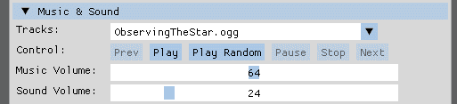

图 14.2：添加到用户界面的基于 AudioManager 的音乐播放器

可以通过使用**曲目**组合框来选择要播放的音乐曲目，通过按下**播放**按钮播放当前曲目，或者通过按下**播放随机**按钮从随机播放列表中选择一个曲目。其他四个按钮，**上一曲**、**暂停**、**停止**和**下一曲**，正好执行标签上所指示的操作，并且通过使用滑块，可以将音乐和音效的音量设置为介于`0`（静音）和`128`之间的值。

## 不同的声音管理器实现

应用程序中使用的`AudioManager`类采用了一种简单的实现方式，通过 C++回调函数直接控制。对于高级声音系统，可以使用基于事件或消息的实现。这种实现可以使用游戏中已有的事件管理代码，并且事件或消息还可以将音效重放与请求重放音效或更改音乐的代码解耦。

在虚拟世界中有了声音和音乐之后，应用程序图形的更新也可能出现在待办事项列表中。现在让我们探索一些视觉增强功能。

# 增强视觉效果

示例代码中的 OpenGL 和 Vulkan 渲染器仅支持最小功能集，以将图像渲染到屏幕上：两个渲染器都只能绘制纹理三角形和彩色线条。添加以下增强功能之一将极大地提升图像质量。

## 通过使用基于物理的渲染为世界带来色彩

目前，我们只使用 Assimp 对象的纹理来将模型实例和关卡几何渲染到屏幕上。通过使用**基于物理的渲染**，简称**PBR**，我们还可以以材料的形式模拟表面属性。使用这种 PBR 材料，可以轻松创建具有金属光泽和反射性的表面，或者使混凝土或砖块等表面看起来更加自然。

*图 14.3*展示了 Sascha Willems（代码可在[`github.com/SaschaWillems/Vulkan/tree/master/examples/pbribl`](https://github.com/SaschaWillems/Vulkan/tree/master/examples/pbribl)）的 Vulkan PBR 示例代码绘制的球体：

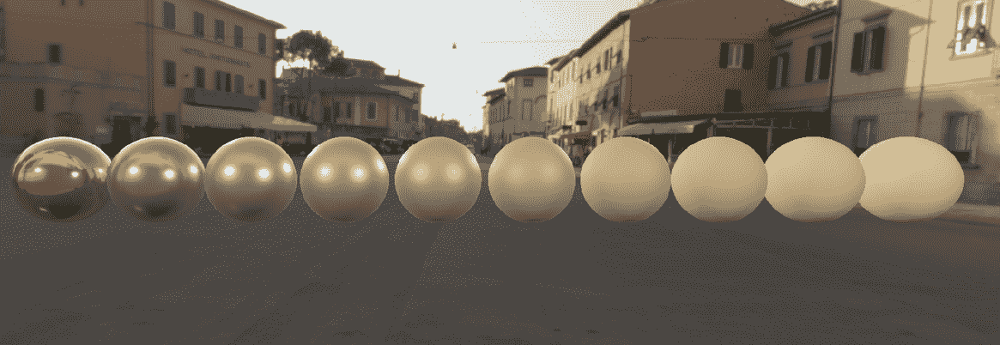

图 14.3：不同的 PBR 材质

在*图 14.3*的左侧，环境的反光性被设置为高值，结果产生了一个金色球体。在球体之间，反射设置逐渐变化，在右侧则完全没有设置反光性。

PBR 渲染和其他示例的源代码链接可在*附加资源*部分找到。

## 添加透明度

在现实世界中，我们周围充满了透明物体，因此一个没有窗户和由透明材料制成的物体的虚拟世界可能会感觉有点奇怪。然而，由于光线在通过多个透明物体时颜色变化背后的物理原理，渲染透明度是复杂的。这需要在同一屏幕位置从后向前绘制多个透明像素，以计算像素的正确最终颜色。

存在两种不同的方法，称为有序透明度和无序透明度。有序透明度要求所有透明物体从后向前排序，而无序透明度会自动重新排列要绘制的像素以进入正确的顺序。两种方法都有优缺点，因此最好的选择是测试两种版本。

*图 14.4*展示了 LearnOpenGL（[`learnopengl.com/`](https://learnopengl.com/)）中 Joey de Vries（[`x.com/JoeyDeVriez`](https://x.com/JoeyDeVriez)）提供的两个透明度示例：

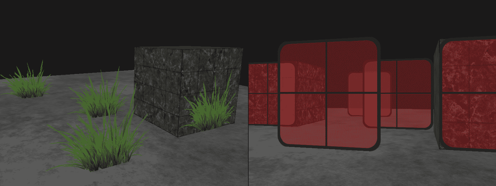

图 14.4：透明植物（左侧）和半透明红色玻璃（右侧）

在*图 14.4*的左侧，展示了部分透明的植物。通过丢弃纹理中的空白区域像素，可以实现对植物的逼真渲染。在*图 14.4*的右侧，渲染了彩色玻璃。通过使用透明纹理来模仿窗户和其他半透明物体，有助于创建更逼真的现实世界复制品。

## 仰望美丽的天空

如果你启动了使用本书示例代码创建的虚拟世界，并加载一个部分设计在建筑之外的关卡，你将看不到某种天空，而只是默认的背景颜色。向场景添加美丽的天空不仅需要简单的天空纹理，还需要所谓的立方体贴图和扭曲的天空纹理。

立方体贴图是一种特殊的渲染对象，它表示立方体的六个面，天空纹理被投影到立方体贴图上。生成的天空盒将创建一个无缝的背景，跟随虚拟摄像机的视角，将关卡几何体和实例放置在逼真的环境中。

*图 14.5*展示了由 Joey de Vries 使用 LearnOpenGL（[`learnopengl.com/`](https://learnopengl.com/)）代码创建的木箱周围的天空盒环境，[Joey de Vries](https://x.com/JoeyDeVriez)：

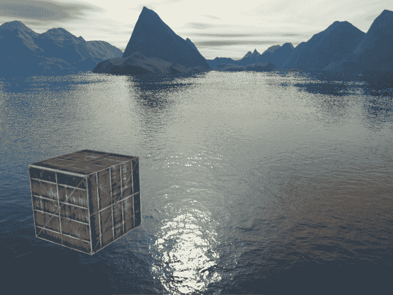

图 14.5：以天空盒为背景的木箱

当移动视图时，可以看到使用天空盒的效果。在静态图片如*图 14.5*中，可以看到木质盒子与天空盒之间的区别。

我们将在本节结束时在我们的虚拟世界中实现一个天空盒。

## 玩转光与阴影

当前的顶点着色器正在使用一个硬编码的光源作为虚拟太阳，从固定位置向世界发射白光。这种基本照明有助于识别关卡几何形状和实例的尺寸，即使只使用平面着色也能做到。通过向虚拟世界添加更多灯光，可以以更逼真的方式模拟其他发光物体，例如灯具、灯笼、火焰或火炬。在黑暗的地方，火焰的闪烁灯光可以用来创造各种类型的紧张感，因为它可能意味着一个可以过夜的安心地方或敌人的位置。

*图 14.6*中的场景由几千种不同颜色的光源照亮：

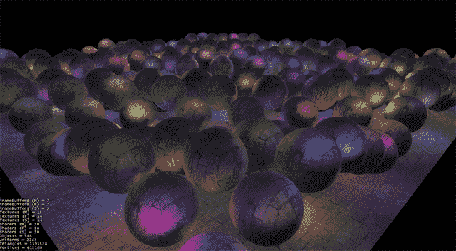

图 14.6：虚拟世界中的多光源（图片由汉内斯·内瓦莱宁提供）

*图 14.6*中的图像是由汉内斯·内瓦莱宁制作的 jMonkeyEngine 技术演示，可以看到许多单独灯光的效果。完整的视频可在*附加资源*部分查看。

当添加灯光时，也应该实现阴影。作为一个简单的开始，可以通过所谓的阴影映射将虚拟太阳投射出的物体阴影投影到地面上，从而产生从现实世界获取的光影效果。也可以为其他灯光添加阴影，尽管实现起来更复杂。但视觉效果将弥补这种努力，因为只有将窗户的亮部投射到地面的灯会为程序员带来大大的微笑。

*图 14.7*是由萨沙·威尔伦斯制作的 Vulkan 示例代码创建的，代码可在[`github.com/SaschaWillems/Vulkan/tree/master/examples/pbribl`](https://github.com/SaschaWillems/Vulkan/tree/master/examples/pbribl)找到)，展示了使用级联阴影映射创建的树木阴影：

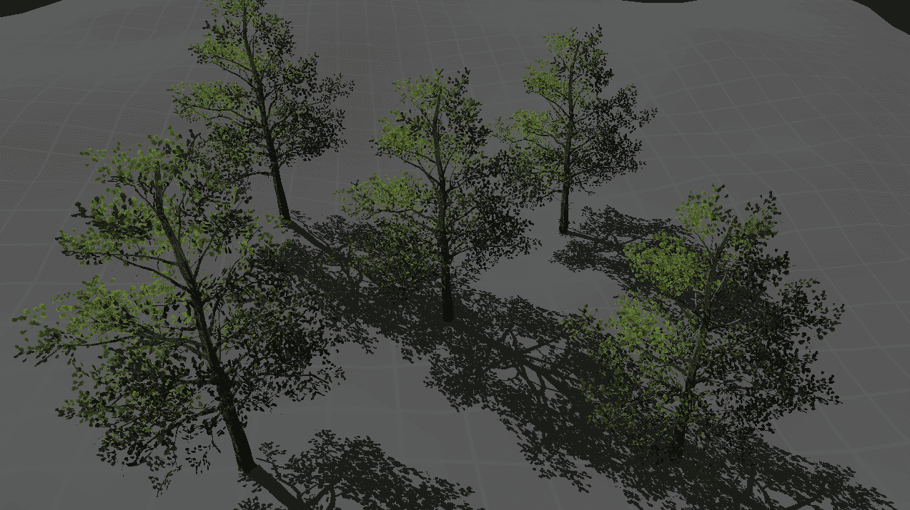

图 14.7：树木的级联阴影映射

与天空盒类似，当光、物体和/或相机移动时，使用阴影映射的效果可以看得更清楚。如图 14.7 所示的阴影是虚拟世界的一个很好的补充。

## 在逼真的水中游泳

如果将水作为扩展关卡环境的一部分添加，也应该检查并增强其视觉外观。虽然使用简单的静态透明水纹理可能对第一次实现来说足够好，但最终可能会产生创建更好水的需求。

通过使用反射、折射和虚拟水面受到的光线扭曲的组合，可以创建逼真的水，如果玩家应该能够潜入水中，可以利用不同类型的扭曲来创造水下错觉。

*图 14.8* 展示了由 Evan Wallace（代码可在[`github.com/evanw/webgl-water/blob/master/index.html`](https://github.com/evanw/webgl-water/blob/master/index.html)获取）使用 WebGL 制作的水模拟：

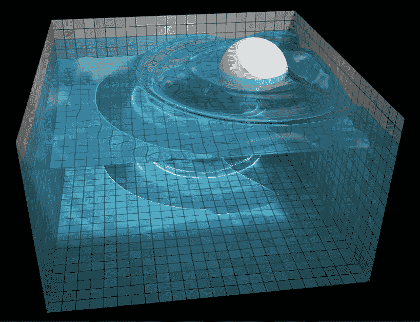

图 14.8：带有波浪和水下全息图的逼真水（由 Evan Wallace 提供）

在*图 14.8*中，可以看到球体落入水中的波浪。此外，水造成的墙壁折射和池底的光线折射都清晰可见。

## 添加令人惊叹的后处理效果

为了在虚拟世界中获得更多的现实主义，可以在渲染器中添加后处理效果。可能的效果列表很长，所以这里只简要列出了一些可以在创建出色视觉效果的同时快速实施的想法：

+   镜头光晕以模拟通过相机看的效果

+   光束：当直接看到太阳被阻挡时，在雾中的可见光线

+   模拟发光物体的光晕效果

+   移动模糊在视图移动时模糊图像

+   景深模糊使尖锐中心周围的场景模糊

+   屏幕空间环境光遮蔽使缝隙和边缘变暗

+   屏幕空间反射，一种创建反射表面的廉价方法

所有这些效果都是通过使用着色器创建的，并且有不同的性能影响。尽管如此，即使这里列出的效果中的一小部分也会极大地提升视觉效果。

*图 14.9*展示了两个后处理效果，光晕和**屏幕空间环境光遮蔽**（**SSAO**）。光晕效果是用 Joey de Vries 从 LearnOpenGL（[`learnopengl.com/`](https://learnopengl.com/)）的代码创建的，SSAO 图片是用 Sascha Willems 的 Vulkan 示例中的代码制作的（代码可在[`github.com/SaschaWillems/Vulkan/tree/master/examples/pbribl`](https://github.com/SaschaWillems/Vulkan/tree/master/examples/pbribl)获取）：

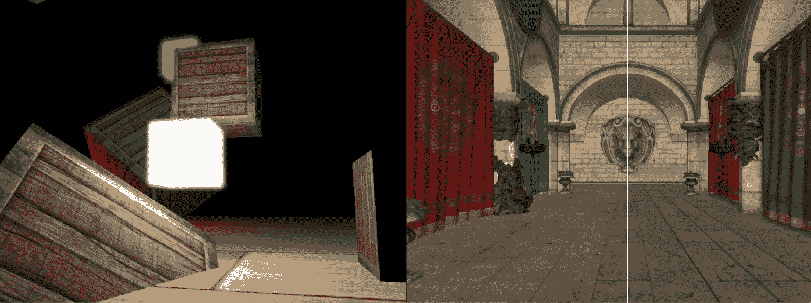

图 14.9：光晕（左）和 SSAO（右）

在*图 14.9*的左侧，展示了光晕效果。光晕效果的特征是光源周围的光环效果。对于绿色光源，光线甚至重叠在木箱的左上角。

在*图 14.9*的右侧，展示了 SSAO（屏幕空间环境光遮蔽）。SSAO 效果可能很微妙，但它是可见的：看看白色线条右侧窗帘下面的地板。阴影创造出窗帘后面更暗房间的错觉。

## 升级到光线追踪

作为向现实主义的下一步，可以添加光线追踪作为可选增强。

光线追踪使用从相机发出的虚拟光线，通过追踪光线与虚拟世界中对象的碰撞来计算结果像素颜色。而不是仅仅使用对象颜色，虚拟光线遵循物理规则并跟随，直到添加的光量低于阈值。

使用光线追踪，可以实现诸如全局光照、由物体反射的光照亮暗区，或逼真的反射等效果。想象一下在满是镜子的房间里奔跑，看到你的角色多次以正确的方式绘制出来。

*图 14.10*展示了由 Sascha Willems 的 Vulkan 代码中的光线追踪示例创建的场景（代码可在[`github.com/SaschaWillems/Vulkan/tree/master/examples/pbribl`](https://github.com/SaschaWillems/Vulkan/tree/master/examples/pbribl)找到）：

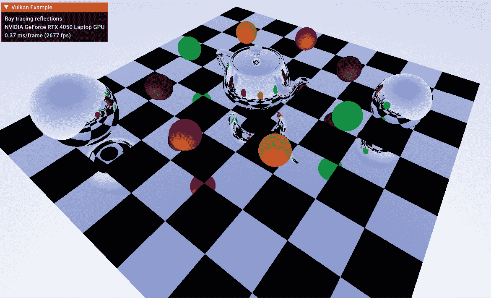

图 14.10：实时光线追踪场景

在*图 14.10*中，地板、球体和茶壶上的反射是通过在 Nvidia RTX 4000 系列 GPU 上使用 Vulkan API 进行光线追踪实时计算的。

包含了 FPS 计数器以显示当前 GPU 代绀创建光线追踪图像的速度。仅仅几十年前，同一张图片的一帧渲染就需要几天时间。

光线追踪应该是可选的

注意，光线追踪的计算需要大量的计算能力，实时创建复杂场景需要 GPU 和支持光线追踪的图形 API。目前，只有 Vulkan 和 DirectX 12 能够使用现代 GPU 的光线追踪功能。在切换到启用光线追踪的图形管线之前，需要检查硬件和软件支持的情况。

## 潜入虚拟现实

尽管虚拟现实（VR）仍然是一个小众领域，但实现 VR 支持可以是一个向前迈出的一大步，以增强沉浸感。不仅能够看到虚拟世界在平面屏幕上，而且能够站在世界的正中央，这可以成为玩家难忘的时刻。使用头部追踪将虚拟摄像头同时移动到玩家的头部，并为 VR 控制器添加虚拟手，为交互创造了大量新机会。

*图 14.11*展示了 Godot XR 工具演示中的一个场景（代码可在[`github.com/GodotVR/godot-xr-template`](https://github.com/GodotVR/godot-xr-template)找到）：

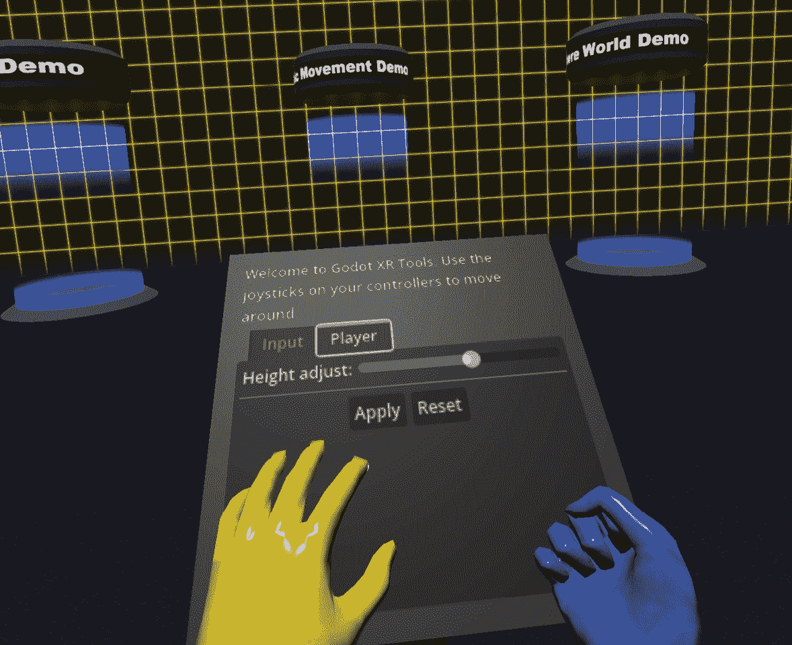

图 14.11：Godot XR 工具演示

*图 14.11*最引人注目的细节是两只虚拟手。通过使用 Valve Index®控制器的集成传感器，不仅可以推断出控制器在所有 6 个自由度中的位置，还可以跟踪每个手指，以允许根据手指的位置进行手势或动作。

在本节的理沦部分之后，我们现在将向应用程序添加一个天空盒，作为全局背景。

## 实践：将天空盒添加到虚拟世界

虚拟天空是虚拟世界的一个很好的补充，尤其是在任何开阔区域上方，如图 14.5 所示。

### 探索技术细节

从技术角度来看，天空盒是从应用于单位立方体内部的纹理绘制的。图 14.12 显示了立方体和放置在立方体中心虚拟相机周围的坐标：

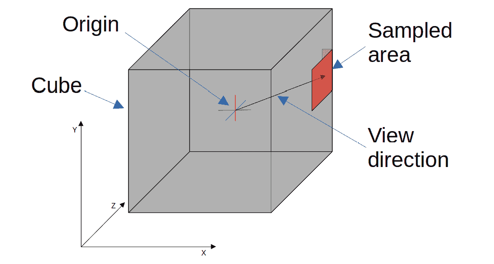

图 14.12：从立方体贴图内部采样的区域

在图 14.1 中，立方体的红色区域将被采样以创建当前帧的背景。请注意，该区域在立方体的角落处环绕，但这不是什么值得担心的事情。两个图形库都处理这类边缘情况（有意为之），并将采样两个受影响立方体贴图面的相应区域。

立方体贴图通常存储为六张单独的图像或作为一张单图，其中立方体的侧面位于图像中的特定位置。图 14.13 显示了由 Jockum Skoglund（又名 hipshot – [`opengameart.org/content/stormy-days-skybox`](https://opengameart.org/content/stormy-days-skybox)）制作的常见格式天空盒纹理以及立方体贴图面：

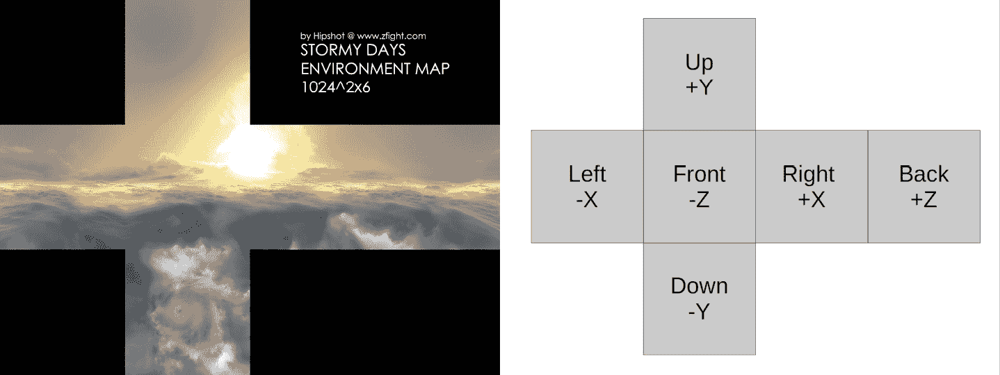

图 14.13：立方体贴图纹理和每张图片的立方体贴图面

在图 14.13 左侧，显示了用于天空图的示例立方体贴图纹理。你将找到许多这种类型的交叉立方体贴图纹理。在图 14.13 右侧，列出了立方体贴图纹理中每个较小子图像的立方体贴图面。请记住，OpenGL 和 Vulkan 使用反转视口时，负 Z 轴指向虚拟世界，因此前图像为`-Z`。

另一个值得注意的细节是立方体贴图图像的畸变。由于立方体贴图纹理应用于立方体，但围绕我们的虚拟天空可以看作是一个球体，因此立方体贴图纹理的像素必须调整，以使其看起来像是从球体内部拍摄的图像。图 14.14 显示了立方体内部和球体内部的投影差异：

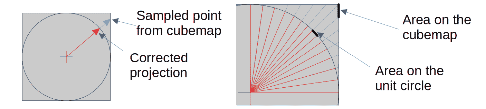

图 14.14：立方体的采样点与球体校正投影的比较

如图 14.14 左侧所示，从立方体贴图取样的采样点与球体表面的位置差异随着我们接近立方体贴图一侧的边缘而增大。在图 14.14 右侧，从立方体贴图采样的区域和投影到球体表面的所需区域以黑色条带突出显示。你可以看到这两个区域的尺寸和角度都不同。在为天空盒构建立方体贴图纹理时，必须对每个立方体贴图面的图像应用球形畸变，以创建一个合理的天空。

### 实现天空盒

将天空盒添加到代码中只需要几个组件：

+   新的顶点和网格类型

+   新的顶点缓冲区

+   包含面坐标的单位立方体模型。

+   新的着色器

+   从文件中加载立方体贴图纹理

我们在`opengl`文件夹中的`OGLRenderData.h`文件中创建一个新的顶点类型`OGLSkyboxVertex`和一个新的网格类型`OGLSkyboxMesh`：

```cpp
struct OGLSkyboxVertex {
  glm::vec4 position = glm::vec4(0.0f);
};
 struct OGLSkyboxMesh {
  std::vector<OGLSkyboxVertex> vertices{};
}; 
```

对于 Vulkan，必须将两个新的`struct`元素添加到`vulkan`文件夹中的`VkRenderData.h`文件中。有关 Vulkan 实现的详细信息，请查看渲染器类文件`VkRenderer.cpp`。

尽管我们可以重用模型的顶点缓冲区，但这样做会浪费大量资源，因为立方体只需要顶点的位置数据。新的顶点缓冲区类`SkyboxBuffer`仅使用新顶点的`position`元素，`struct` `OGLSkyboxVertex`：

```cpp
 glVertexAttribPointer(0, 4, GL_FLOAT, GL_FALSE,
    sizeof(OGLSkyboxVertex),
   (void*) offsetof(OGLSkyboxVertex, position));
  glEnableVertexAttribArray(0); 
```

对于立方体模型，我们创建一个名为`SkyboxModel`的类，返回一个由 36 个顶点组成的`OGLSkyboxMesh`，每个侧面使用两个三角形。在所有三个轴上，模型坐标要么是`1.0`要么是`-1.0`，定义了一个单位立方体。

新的顶点着色器`skybox.vert`输出一个包含三维纹理坐标的`vec3`。在这里我们需要三维坐标，因为我们处于一个立方体内部：

```cpp
layout (location = 0) out vec3 texCoord; 
```

在顶点着色器的`main()`方法中，我们首先反转投影矩阵并转置视图矩阵：

```cpp
 mat4 inverseProjection = inverse(projection);
  mat3 inverseView = transpose(mat3(view)); 
```

对于视图矩阵，我们可以使用更便宜的转置操作而不是取逆矩阵，因为我们需要去除平移部分以停止立方体随摄像机移动。

通过将逆矩阵与立方体的传入点位置相乘，我们计算世界空间中的纹理坐标：

```cpp
 texCoord = inverseView * (inverseProjection * aPos).xyz; 
```

现在，要采样的纹理坐标来自立方体的内部，如图*14.12*所示。

作为顶点着色器的最后一步，我们将 GLSL 内部变量`gl_Position`设置为传入的顶点位置：

```cpp
 gl_Position = aPos.xyww; 
```

通过将`gl_Position`的`z`分量设置为`w`分量的值，我们确保在远-Z 平面上绘制立方体贴图的像素，从而创建一个不会被其他像素覆盖的背景。

新的片段着色器`skybox.frag`使用传入的纹理坐标在立方体贴图中查找纹理数据：

```cpp
layout (location = 0) in vec3 texCoord;
layout (location = 0) out vec4 FragColor;
uniform samplerCube tex;
void main() {
  FragColor = texture(tex, texCoord);
} 
```

请注意，纹理`tex`的类型是`samplerCube`而不是其他片段着色器中的`sampler2D`。

立方体贴图纹理的加载在`Texture`类中完成。在新的`loadCubemapTexture()`方法中，我们加载如图*14.1*3 所示的图像并提取六个图像。由于纹理映射侧面定义的值是按升序排列的，我们可以直接使用第一个侧面定义`GL_TEXTURE_CUBE_MAP_POSITIVE_X`并为剩余的侧面添加整数值以上传：

```cpp
 glTexImage2D(GL_TEXTURE_CUBE_MAP_POSITIVE_X + face, 0, GL_SRGB8_ALPHA8, cubeFaceWidth, cubeFaceHeight, 0, GL_RGBA, GL_UNSIGNED_BYTE, subImage.data()); 
```

对于立方体贴图纹理加载的完整实现，请查看`Texture`类的详细信息。

### 绘制天空盒

将天空盒显示在屏幕上现在分为两个步骤。首先，我们在`OGLRenderer.cpp`渲染类文件的`init()`方法中将单位立方体模型数据上传到顶点缓冲区：

```cpp
 mSkyboxModel.init();
  OGLSkyboxMesh skyboxMesh = mSkyboxModel.getVertexData();
  mSkyboxBuffer.uploadData(skyboxMesh.vertices); 
```

然后，在绘制级别数据之前，我们使用新的着色器绘制天空盒，绑定纹理并从顶点缓冲区绘制立方体：

```cpp
 mSkyboxShader.use();
  mSkyboxTexture.bindCubemap();
  mSkyboxBuffer.bindAndDraw();
  mSkyboxTexture.unbindCubemap(); 
```

对于 Vulkan，我们也在`VkRenderData.cpp`文件的`init()`方法中上传天空盒模型和纹理，绑定天空盒管线，并在`draw()`方法中绘制级别数据之前绘制天空盒模型。

对于 OpenGL 和 Vulkan 渲染器，在绘制天空盒作为第一个对象时，应进行简单的更改：禁用深度测试功能。没有深度测试，天空盒纹理将覆盖先前颜色缓冲区中的所有值，作为剩余对象（如级别数据和实例）的全局背景。就这样。

如果一切添加正确，可以在*图 14.15*中看到级别上方的新鲜和壮丽的天空（该图像由 Zarudko 使用 glTF 级别创建，[`skfb.ly/6QYJw`](https://skfb.ly/6QYJw)，使用 Jockum Skoglund（又名 hipshot）创建的纹理作为天空盒）：

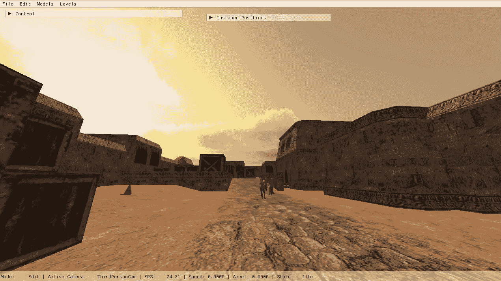

图 14.15：激活了天空盒的示例级别

如*图 14.15*所示，天空盒为开放区域级别的场景带来了真实世界的感受。由于立方体在视图变化时不会像级别数据那样移动，因此创造了一种无限远的天空幻觉。

即使有出色的图形和酷炫的声音效果和音乐，仍有改进的空间。虚拟世界的环境仍然有些静态，所以让我们给世界本身添加一些变化。

# 通过白天和天气增强沉浸感

虽然昼夜交替、天气效果和不同季节在我们的生活中是自然现象，但在计算机游戏中这些方面很少被使用。但所有这些都可以极大地增强游戏的沉浸感。根据内部时钟对虚拟世界进行轻微的变化，可能有助于创造一个玩家愿意长时间停留以体验完整周期的环境。

## 添加白天/黑夜循环

白天/黑夜循环为游戏增添了一种熟悉感。看到太阳升起或欣赏绚丽的日落，观察中午或深夜周围世界的变换……每一个细节都会让玩家感觉自己身处一个更加真实的世界。如果不仅光线发生变化，其他角色和动物也会对一天中的时间做出反应，那么沉浸感会越来越好。例如，可能只在夜间看到某些动物，只在早晨看到孩子们，某些角色可能在某个时间出现在工作场所，下午则去酒吧。

游戏中的时间可能比真实时间快得多，将整整一天缩短为几分钟。这种加速可以帮助如果需要的事件只在一天中的特定时间发生。

白天/夜晚循环中最受欢迎的例子之一是 Minecraft。Minecraft 中的默认一天持续 20 分钟，分为 10 分钟的白天和 10 分钟的夜晚。由于光照水平的变化，敌人在白天和夜晚的生成、食物和树木的生长行为完全不同。

*图 14.16* 展示了我们的应用程序中午和夜晚的同一地点：

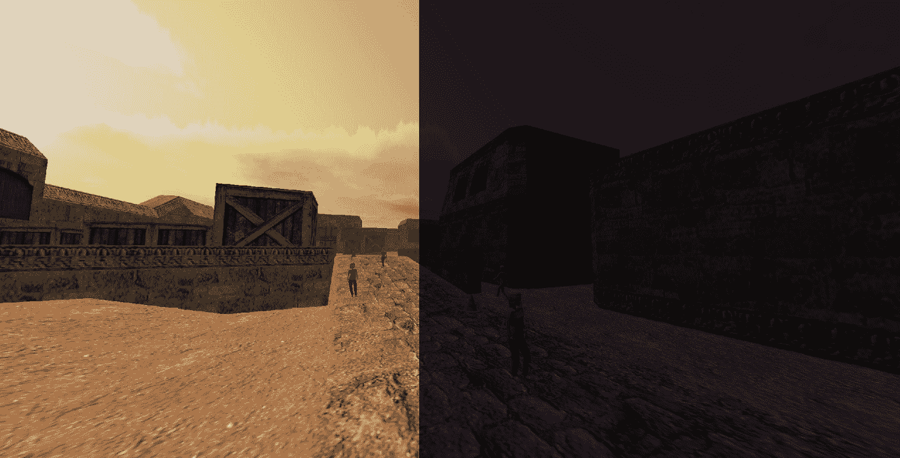

图 14.16：示例代码中第十四章的白天和夜晚

如您在 *图 14.16* 中所见，虚拟世界的整体亮度的一个简单变化就能产生巨大的差异。根据一天中的时间改变世界的更多属性将为玩家带来更多的沉浸感。

## 允许向前时间旅行

当处理时间时，一个事实不应被低估：等待事件发生的时间可能会很无聊，而且过得很慢。与其让玩家等待一整天或整夜过去，不如添加特殊的“时间旅行”事件，例如整夜睡觉，或者在壁炉旁等待时间流逝，让游戏快进游戏时间。

## 实时游戏

在游戏中思考时间，将虚拟世界中的时间与真实世界的时间同步的想法可以是一个有趣的选择。只有少数游戏利用了这样的功能。此外，如果任务或任务与一天中的特定时间绑定，解决它们可能会更加复杂。但在游戏中“现在”可能会很有趣。

## 崇拜天气之神

不仅白天的时间可以改变世界，天气的变化也可以极大地影响人物、动物和环境。在雷雨天气中，最好的建议是待在室内，大雨可能如此响亮，以至于其他声音永远不会传到玩家的耳朵里，而新鲜的白雪也会吸收噪音。因此，在不同的天气状态下漫游可以给同一个世界带来完全不同的印象。

环境变化，如雾的添加，也会改变虚拟世界的感知。

*图 14.17* 展示了我们应用程序中不同类型的雾：

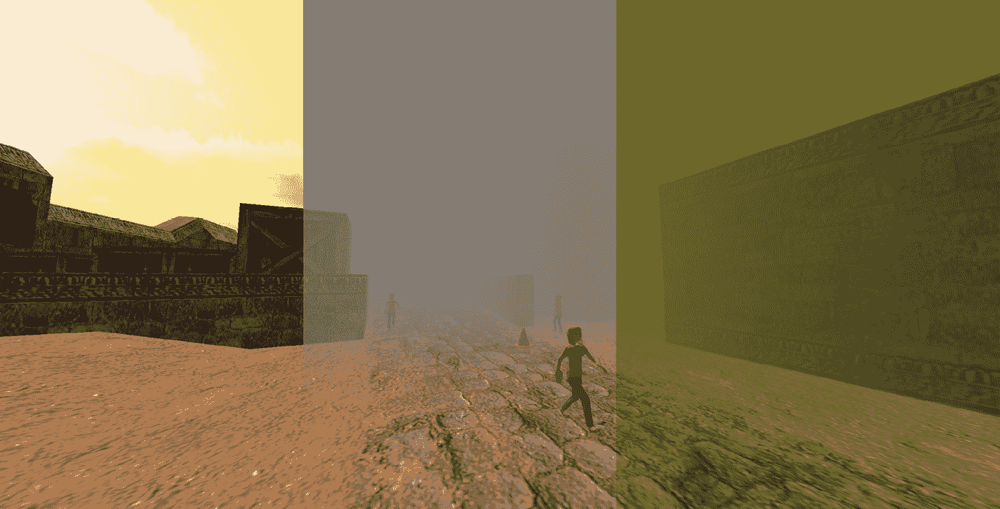

图 14.17：示例代码中第十四章中雾的效果

在 *图 14.17* 的左侧，虚拟世界完全没有雾，显示了一个晴朗的白天。在 *图 14.17* 的中间，添加了浓雾，导致世界在短距离后变得模糊。在早期游戏引擎的渲染限制下，雾被用于隐藏由于渲染限制而出现的物体和消失的物体。最后，在 *图 14.17* 的右侧，调整了光线的颜色，创造出地图街道上有毒雾的错觉。

## 倾听季节的先知

在昼夜循环和天气之后，下一个进化步骤是实现四个季节。春、夏、秋、冬之间的旋转是带来更多现实感的绝佳机会，因为角色的行为或动物的外观将在一年中发生变化。

就像游戏中的白天长度一样，一个虚拟年应该缩短到合理的时间量，或者如果当前季节的所有任务都已经完成，应该允许向前时间旅行功能。让玩家无理由地等待将会扼杀他们的热情。

一个根据季节变化世界属性的好例子是任天堂为 GameBoy Color 开发的《塞尔达传说：时之笛》。尽管游戏年代久远，但季节的变化已经以极大的细节实现，允许玩家仅在特定季节进入世界的某些区域。例如，河流在冬季会结冰，雪地会抬高景观的部分，而只有在夏季，花朵的卷须才能让林克攀爬墙壁。

在 Eric Barone 的《星露谷物语》中，季节也是游戏玩法的关键元素。每个季节都会影响游戏的不同部分，如作物生长。一个季节是 28 个游戏日，通过加速时间，星露谷的一年将在 26 个小时的游戏时间内流逝。

对于应用程序，我们将创建简单的昼夜光线变化和雾作为示例。让我们从昼夜变化开始。

## 亲身体验：添加昼夜变化

改变光源的颜色和位置很容易。大多数片段着色器已经包含一个固定的光源定义，以便更好地可视化实例和关卡数据。

### 实现光线控制

作为第一步，我们在所有存在`Matrices`的顶点和片段着色器中的`Matrices``uniform`中添加了两个新变量，分别称为`lightPos`和`lightColor`：

```cpp
layout (std140, binding = 0) uniform Matrices {
  ...
**vec4** **lightPos;**
**vec4** **lightColor;**
}; 
```

在`lightPos`中，我们将传递光源的当前位置，使我们能够模拟虚拟世界中太阳或月亮的位置，而在`lightColor`中，我们将光源的颜色传输到 GPU，使我们能够模拟日出、正午、日落等。

由于我们在 CPU 上定义了包含视图和投影矩阵的统一缓冲区，并使用`glm::mat4`作为数据类型，我们必须添加两个`glm::vec4`向量作为`glm::mat4`的前两个元素，这些元素将在绘制帧之前上传到 GPU：

```cpp
 glm::mat4 lightMatrix = glm::mat4(lightPos, lightColor,
    glm::vec4(), glm::vec4());
  matrixData.emplace_back(lightMatrix); 
```

现在所有包含光源定义的片段着色器都可以通过更好的表面光线控制进行调整。

我们在`main()`方法中开始编写新的着色器代码，通过定义环境光级别来启动：

```cpp
 float ambientStrength = 0.1;
  vec3 ambient = ambientStrength * max(vec3(lightColor),
    vec3(0.05, 0.05, 0.05)); 
```

环境光水平用于模拟来自其他表面的光散射，使虚拟世界中能够实现某种最小光照。通过限制最小环境光，我们还可以防止生成的图片变成漆黑一片。

接下来，我们通过使用三角形法线与光源方向之间的角度来计算漫反射部分：

```cpp
 vec3 norm = normalize(vec3(normal));
  vec3 lightDir = normalize(vec3(lightPos));
  float diff = max(dot(norm, lightDir), 0.0);
  vec3 diffuse = diff * vec3(lightColor); 
```

表面的漫反射光照随着表面与光源之间角度的变化而变化。由于两个归一化向量的点积等于两个向量之间角度的余弦值，我们可以直接将`dot()`调用的结果用作光源颜色的乘数。

作为片段着色器代码更改的最后一步，我们将环境光和漫反射光照相加，并将结果光照值乘以纹理数据和顶点颜色：

```cpp
 FragColor = vec4(min(ambient + diffuse, vec3(1.0)), 1.0)*
    texture(tex, texCoord) * color; 
```

现在，我们可以从应用程序中控制光源的位置和颜色，通过发送球面位置和颜色，可以模拟一天中的不同时间。

### 添加 UI 控件

为了控制光照值，将创建一个新的 UI 部分，允许对所有与光照相关的值进行精细设置。*图 14.18*显示了`UserInterface`类中的新**环境**部分：

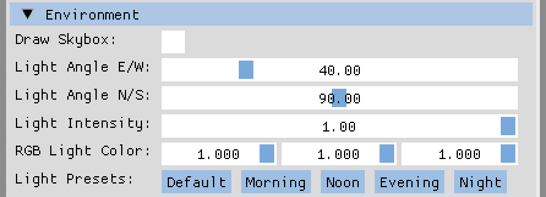

图 14.18：光参数和天空盒的 UI 控件

通过将光照角度分为东西和南北，我们可以将光照移动到虚拟天空的任何位置。光照强度可以用来降低整体亮度，而无需手动调整颜色值。

使用单独的光颜色值，我们可以调整光照以匹配太阳或月亮的自然颜色，至少在可用的颜色空间限制内，通过使用一组预定义的颜色值，我们可以立即将光照颜色、强度和位置设置为一天中的特定时间。

*图 14.19*显示了虚拟世界的三种不同光照设置（此图像使用 Zarudko 的地图创建[`skfb.ly/6QYJw`](https://skfb.ly/6QYJw)，天空盒图像由 Jockum Skoglund（又名 hipshot）提供[`opengameart.org/content/stormy-days-skybox`](https://opengameart.org/content/stormy-days-skybox)）：

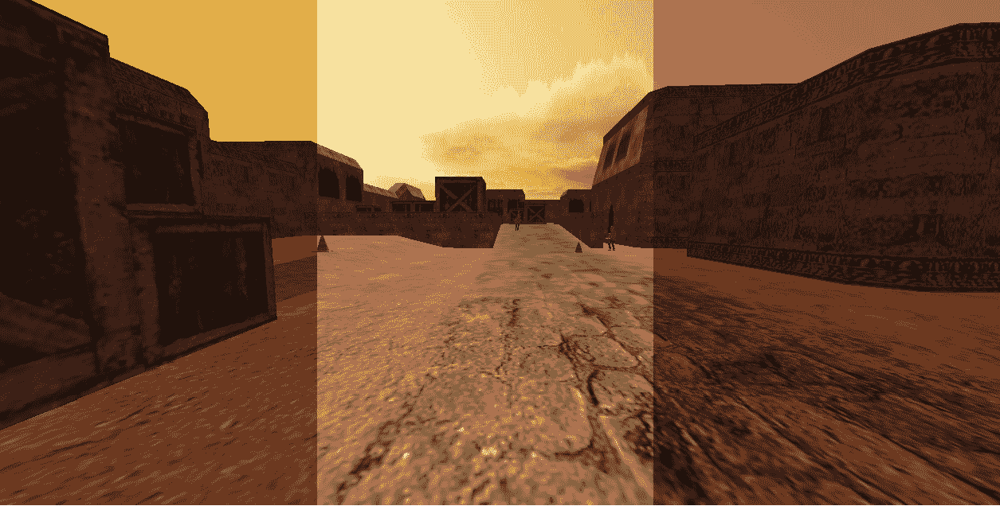

图 14.19：早晨、中午和傍晚的虚拟世界

您可以在*图 14.19*中看到，只需改变光源的颜色，就可以在虚拟世界中创造出完全不同的氛围。结合*增强视觉效果*部分中的天空盒，您已经可以创建真正沉浸式的世界。

# 摘要

在本章中，我们探讨了想法和工具，展示了如何将当前的动画编辑器升级为一个具有内置编辑器的小型游戏引擎。

首先，我们探讨了几个音频库以及何时在游戏中播放音效和音乐。音效和音乐是玩家体验的重要组成部分，它们创造了一种基本的沉浸感，因为现实世界的体验将被转移到虚拟世界中。

然后，我们探讨了应用程序图形的视觉增强。通过扩展基本渲染器以实现透明度、天空盒、动态光影、逼真的水面以及后处理效果，如上帝射线和运动模糊，将视觉提升到下一个水平。尽管由于目标群体有限，添加对光线追踪和 VR 的支持是可选的，但这两个功能在视觉质量和沉浸感方面都是一大步，因此可能成为可行的选项。

作为最后一步，我们探讨了日/夜循环、天气和季节作为改变虚拟世界环境元素。仅仅是一个简单的日循环就为虚拟世界增加了许多有趣的机会，例如在一天中的特定时间只遇到计算机控制的角色或动物，或者只在夜间出现的敌人。天气效果和季节也增加了根据当前环境改变行为的选择。

那么...接下来该做什么呢？嗯，这完全取决于你！

你可以从学习如何使用**Blender**来创建自己的动画角色、动物、物体和关卡开始。创建的资产不必达到最近游戏的品质；即使是低多边形世界也很迷人，并且拥有许多粉丝。有许多书籍、教程和视频可供选择，涵盖了虚拟世界中的许多不同艺术风格。

关于添加更多物体？车辆和动物将丰富虚拟世界，门和按钮将带来更多与世界互动的方式。为了更好的重力，你甚至可能需要向应用程序中添加物理引擎，使物体之间的碰撞产生力分布等酷炫功能。

你还可以通过使用具有正交投影的相机来探索世界。以等距投影或仅从侧面观察玩家、其他角色和环境可以开辟新的表达故事的方式。由于等距投影和侧面视图只是三维世界的不同视角，因此本章中提到的所有选项在使用正交投影时也适用。

另一个想法可能是为玩家创建故事情节和任务。强迫玩家在各个地点之间移动并与不同角色互动以解锁更多任务、物品或门，或者只是接收关于任务的心理谜题的下一部分，这可以让玩家在你的游戏中停留更长时间。

或者你可以深入研究 SDL 的网络部分，创建一个小的网络服务器，让你能够与朋友一起探索虚拟世界。作为团队在各个关卡中漫游和解决任务既令人满意，也为任务系统带来了新的复杂性，因为你可以选择是否允许玩家在长距离内使用他们对任务的共同知识。

但这是最重要的下一步：保持好奇心并尝试实验代码。

# 实践课程

这里是一些你可以添加到代码中的改进：

+   添加一个按钮从资源文件夹重新加载音乐音轨。

一个很棒的功能是动态添加或删除音轨。

+   为实例添加更多声音效果。

你可以将声音剪辑映射到实例的每个动作，在控制所选实例时创建更逼真的效果。

+   根据地板材质播放脚步声。

在这里，你需要为行走和跑步加载多对脚步声。可以通过使用地面三角形的网格类型作为索引来选择合适的音效。

+   为附近的实例添加声音。

`SDL_mixer`库允许我们为每个通道设置音量和平衡。可以使用周围实例的距离和角度来计算声音的有效音量和方向。

+   在地图的特殊位置播放环境声音。

与航点模型类似，你可以使用小型模型作为标记来播放环境声音。并且像附近实例的声音一样，环境声音的音量和平衡可以根据预期进行调整。

+   为音乐变化添加标记。

这个任务与环境声音密切相关。你可以使用模型和/或节点在控制实例进入地图的特定区域或与其他实例交互时切换音乐。

+   根据关卡位置调整关卡颜色和雾气。

不仅在漫游关卡时可以更改音乐；还可以调整光线和雾气设置。例如，进入洞穴时，环境光线可以降低，雾密度可以增加。

# 其他资源

+   SDL：[`www.libsdl.org`](https://www.libsdl.org%0D%0A)

+   OpenAL Soft：[`github.com/kcat/openal-soft`](https://github.com/kcat/openal-soft%0D%0A)

+   PortAudio：[`www.portaudio.com`](https://www.portaudio.com%0D%0A)

+   FMOD：[`www.fmod.com`](https://www.fmod.com%0D%0A)

+   由 Ian Millington 所著，CRC Press 出版的《*游戏物理引擎开发*》：ISBN 978-0123819765

+   由 Morgan Kaufmann 出版的 David H. Eberly 所著的《*游戏物理*》：ISBN 978-0123749031

+   开源物理引擎：[`www.tapirgames.com/blog/open-source-physics-engines`](https://www.tapirgames.com/blog/open-source-physics_engines%0D%0A)

+   Sascha Willems 的 Vulkan 示例：[`github.com/SaschaWillems/Vulkan`](https://github.com/SaschaWillems/Vulkan%0D%0A)

+   有序透明度：[`learnopengl.com/Advanced-OpenGL/Blending`](https://learnopengl.com/Advanced-OpenGL/Blending%0D%0A)

+   无序透明度：[`github.com/nvpro-samples/vk_order_independent_transparency`](https://github.com/nvpro-samples/vk_order_independent_transparency%0D%0A)

+   OpenGL 天空盒：[`learnopengl.com/Advanced-OpenGL/Cubemaps`](https://learnopengl.com/Advanced-OpenGL/Cubemaps%0D%0A)

+   如何创建立方体贴图：[`paulbourke.net/panorama/cubemaps/`](https://paulbourke.net/panorama/cubemaps/%0D%0A)

+   OpenGL 多光源：[`learnopengl.com/Lighting/Multiple-lights`](https://learnopengl.com/Lighting/Multiple-lights%0D%0A)

+   汉斯·内瓦莱宁的多光源演示：[`www.youtube.com/watch?v=vooznqE-XMM`](https://www.youtube.com/watch?v=vooznqE-XMM%0D%0A)

+   OpenGL 阴影贴图：[`learnopengl.com/Guest-Articles/2021/CSM`](https://learnopengl.com/Guest-Articles/2021/CSM)

+   WebGL 水模拟：[`madebyevan.com/webgl-water/`](https://madebyevan.com/webgl-water/%0D%0A)

+   OpenGL 真实水渲染：[`medium.com/@vincehnguyen/simplest-way-to-render-pretty-water-in-opengl-7bce40cbefbe`](https://medium.com/@vincehnguyen/simplest-way-to-render-pretty-water-in-opengl-7bce40cbefbe%0D%0A)

+   OpenGL 水衍射：[`medium.com/@martinRenou/real-time-rendering-of-water-caustics-59cda1d74aa`](https://medium.com/@martinRenou/real-time-rendering-of-water-caustics-59cda1d74aa%0D%0A)

+   OpenGL 镜头光晕：[`john-chapman.github.io/2017/11/05/pseudo-lens-flare.html`](https://john-chapman.github.io/2017/11/05/pseudo-lens-flare.html%0D%0A)

+   OpenGL 上帝射线：[`github.com/math-araujo/screen-space-godrays`](https://github.com/math-araujo/screen-space-godrays%0D%0A)

+   OpenGL 光晕效果：[`learnopengl.com/Advanced-Lighting/Bloom`](https://learnopengl.com/Advanced-Lighting/Bloom%0D%0A)

+   OpenGL 运动模糊：[`www.nvidia.com/docs/io/8230/gdc2003_openglshadertricks.pdf`](https://www.nvidia.com/docs/io/8230/gdc2003_openglshadertricks.pdf%0D%0A)

+   OpenGL 景深：[`lettier.github.io/3d-game-shaders-for-beginners/depth-of-field.html`](https://lettier.github.io/3d-game-shaders-for-beginners/depth-of-field.html%0D%0A)

+   OpenGL SSAO：[`lettier.github.io/3d-game-shaders-for-beginners/ssao.html`](https://lettier.github.io/3d-game-shaders-for-beginners/ssao.html%0D%0A)

+   OpenGL SSR：[`lettier.github.io/3d-game-shaders-for-beginners/screen-space-reflection.html`](https://lettier.github.io/3d-game-shaders-for-beginners/screen-space-reflection.html%0D%0A)

+   Vulkan 光线追踪：[`nvpro-samples.github.io/vk_raytracing_tutorial_KHR/`](https://nvpro-samples.github.io/vk_raytracing_tutorial_KHR/%0D%0A)

+   OpenXR：[`www.khronos.org/openxr/`](https://www.khronos.org/openxr/%0D%0A)

+   Godot XR 演示模板：[`github.com/GodotVR/godot-xr-template`](https://github.com/GodotVR/godot-xr-template%0D%0A)

+   Blender：[`www.blender.org`](https://www.blender.org%0D%0A)

+   开放游戏艺术资源：[`opengameart.org/`](https://opengameart.org/%0D%0A)

# 加入我们的 Discord 社区

加入我们的社区 Discord 空间，与作者和其他读者进行讨论：[`packt.link/cppgameanimation`](https://packt.link/cppgameanimation%0D%0A)


