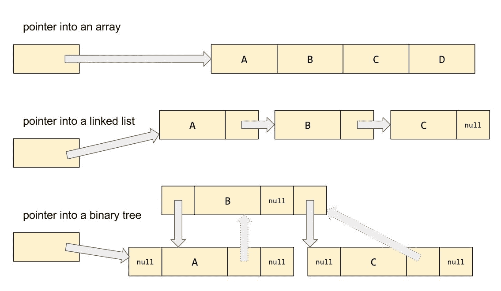

# 第二章：迭代器和范围

在上一章中，我们实现了几个在容器上操作的泛型算法，但效率不高。在这一章中，你将学习：

+   C++ 如何以及为什么将指针的概念泛化以创建 *迭代器* 概念

+   C++ 中 *范围* 的重要性，以及将半开范围表示为迭代器对的标准方法

+   如何编写自己的坚如磐石、const-正确的迭代器类型

+   如何编写在迭代器对上操作的泛型算法

+   标准迭代器层次结构及其算法重要性

# 整数索引的问题

在上一章中，我们实现了几个在容器上操作的泛型算法。再次考虑这些算法之一：

```cpp
    template<typename Container>
    void double_each_element(Container& arr) 
    {
      for (int i=0; i < arr.size(); ++i) {
        arr.at(i) *= 2;
      }
    }
```

此算法是用较低级别的操作 `.size()` 和 `.at()` 定义的。这对于容器类型，如 `array_of_ints` 或 `std::vector`，效果相当不错，但对于，比如说，上一章的 `list_of_ints` 这样的链表，效果就差多了：

```cpp
    class list_of_ints {
      struct node {
        int data;
        node *next;
      };
      node *head_ = nullptr;
      node *tail_ = nullptr;
      int size_ = 0;
    public:
      int size() const { return size_; }
      int& at(int i) {
        if (i >= size_) throw std::out_of_range("at");
        node *p = head_;
        for (int j=0; j < i; ++j) {
          p = p->next;
        }
        return p->data;
      }
      void push_back(int value) {
        node *new_tail = new node{value, nullptr};
        if (tail_) {
          tail_->next = new_tail;
        } else {
          head_ = new_tail;
        }
        tail_ = new_tail;
        size_ += 1;
      }
      ~list_of_ints() {
        for (node *next, *p = head_; p != nullptr; p = next) {
          next = p->next;
          delete p;
        }
      }
    };
```

`list_of_ints::at()` 的实现是 O(*n*)，即列表的长度——列表越长，`at()` 越慢。特别是，当我们的 `count_if` 函数遍历列表的每个元素时，它会调用那个 `at()` 函数 *n* 次，这使得我们的泛型算法的运行时间为 O(*n*²)——对于一个本应 O(*n*) 的简单计数操作！

结果表明，使用 `.at()` 进行整数索引并不是构建算法城堡的良好基础。我们应该选择一个更接近计算机实际操作数据的原始操作。

# 超越指针

在没有任何抽象的情况下，一个人通常如何识别数组、链表或树中的元素？最直接的方法是使用指向元素内存地址的 *指针*。以下是一些指向各种数据结构元素的指针示例：



要遍历一个 *数组*，我们只需要那个指针；我们可以通过从指向第一个元素的指针开始，简单地递增该指针直到它达到最后一个元素来处理数组中的所有元素。在 C 语言中：

```cpp
    for (node *p = lst.head_; p != nullptr; p = p->next) {
      if (pred(p->data)) {
        sum += 1;
      }
   }
```

但是，为了有效地遍历一个 *链表*，我们需要的不仅仅是原始指针；递增 `node*` 类型的指针几乎不可能产生指向列表中下一个节点的指针！在这种情况下，我们需要某种类似于指针的东西——特别是，我们应该能够解引用它来检索或修改指向的元素——但与增量这一抽象概念相关联的特殊、容器特定的行为。

在 C++ 中，鉴于我们已经在语言中内置了操作符重载，当我说“将特殊行为与增量概念关联”时，你应该想到“让我们重载 `++` 操作符。”确实，这正是我们将要做的：

```cpp
    struct list_node {
      int data;
      list_node *next;
    };

    class list_of_ints_iterator {
      list_node *ptr_;

      friend class list_of_ints;
      explicit list_of_ints_iterator(list_node *p) : ptr_(p) {}
    public:
      int& operator*() const { return ptr_->data; }
      list_of_ints_iterator& operator++() { ptr_ = ptr_->next; return *this; }
      list_of_ints_iterator operator++(int) { auto it = *this; ++*this; return it; }
      bool operator==(const list_of_ints_iterator& rhs) const
        { return ptr_ == rhs.ptr_; }
      bool operator!=(const list_of_ints_iterator& rhs) const
        { return ptr_ != rhs.ptr_; }
    };

    class list_of_ints {
      list_node *head_ = nullptr;
      list_node *tail_ = nullptr;
      // ...
    public:
      using iterator = list_of_ints_iterator;
      iterator begin() { return iterator{head_}; }
      iterator end() { return iterator{nullptr}; }
    }; 

    template<class Container, class Predicate>
    int count_if(Container& ctr, Predicate pred)
    {
      int sum = 0;
      for (auto it = ctr.begin(); it != ctr.end(); ++it) {
        if (pred(*it)) {
            sum += 1;
        }
      }
      return sum;
   }
```

注意，我们还重载了单目`*`运算符（用于解引用）和`==`和`!=`运算符；我们的`count_if`模板要求所有这些操作对循环控制变量`it`都有效。（好吧，好吧，技术上我们的`count_if`不需要`==`操作；但如果你要重载一个比较运算符，你应该也重载另一个。）

# 常量迭代器

在我们放弃这个列表迭代器例子之前，还有一个问题需要考虑。请注意，我悄悄地改变了我们的`count_if`函数模板，使其接受`Container&`而不是`const Container&`！这是因为我们提供的`begin()`和`end()`成员函数是非 const 成员函数；而且是因为它们返回的迭代器的`operator*`返回对列表元素的 non-const 引用。我们希望我们的列表类型（及其迭代器）完全符合 const 的正确性--也就是说，我们希望你能定义并使用`const list_of_ints`类型的变量，但防止你修改`const`列表的元素。

标准库通常通过为每个标准容器提供两种不同类型的迭代器来处理这个问题：`bag::iterator`和`bag::const_iterator`。非 const 成员函数`bag::begin()`返回一个`iterator`，而`bag::begin() const`成员函数返回一个`const_iterator`。下划线非常重要！请注意，`bag::begin() const`并不返回一个普通的`const iterator`；如果返回的对象是`const`的，我们就不能对它进行`++`操作。（这反过来会使遍历`const bag`变得非常困难！）不，`bag::begin() const`返回的是一个更微妙的东西：一个非 const 的`const_iterator`对象，其`operator*`恰好返回一个*const*引用到其元素。

可能一个例子会有所帮助。让我们继续为我们的`list_of_ints`容器实现`const_iterator`。

由于`const_iterator`类型的代码大部分将与`iterator`类型的代码完全相同，我们的第一反应可能是剪切和粘贴。但这是 C++！当我这么说“大部分代码将与另一部分代码完全相同”时，你应该在想“让我们将公共部分变成一个模板。”确实，这就是我们将要做的：

```cpp
    struct list_node {
      int data;
      list_node *next;
    };

    template<bool Const>
    class list_of_ints_iterator {
      friend class list_of_ints;
      friend class list_of_ints_iterator<!Const>;

      using node_pointer = std::conditional_t<Const, const list_node*, list_node*>;
      using reference = std::conditional_t<Const, const int&, int&>;

      node_pointer ptr_;

      explicit list_of_ints_iterator(node_pointer p) : ptr_(p) {}
    public:
      reference operator*() const { return ptr_->data; }
      auto& operator++() { ptr_ = ptr_->next; return *this; }
      auto operator++(int) { auto result = *this; ++*this; return result; }

      // Support comparison between iterator and const_iterator types
      template<bool R>
      bool operator==(const list_of_ints_iterator<R>& rhs) const
        { return ptr_ == rhs.ptr_; }

      template<bool R>
      bool operator!=(const list_of_ints_iterator<R>& rhs) const
        { return ptr_ != rhs.ptr_; }

      // Support implicit conversion of iterator to const_iterator
      // (but not vice versa)
      operator list_of_ints_iterator<true>() const
        { return list_of_ints_iterator<true>{ptr_}; }
    };

    class list_of_ints {
      list_node *head_ = nullptr;
      list_node *tail_ = nullptr;
      // ...
    public:
      using const_iterator = list_of_ints_iterator<true>;
      using iterator = list_of_ints_iterator<false>;

      iterator begin() { return iterator{head_}; }
      iterator end() { return iterator{nullptr}; }
      const_iterator begin() const { return const_iterator{head_}; }
      const_iterator end() const { return const_iterator{nullptr}; }
    };
```

上述代码实现了对`list_of_ints`完全符合 const 的迭代器类型。

# 一对迭代器定义了一个范围

现在我们已经理解了迭代器的根本概念，让我们将其应用于一些实际用途。我们已经看到，如果你有一个由`begin()`和`end()`返回的迭代器对，你可以使用 for 循环遍历底层容器的所有元素。但更强大的是，你可以使用一对迭代器来遍历容器元素中的任何子范围！比如说，你只想查看向量的前半部分：

```cpp
    template<class Iterator>
    void double_each_element(Iterator begin, Iterator end) 
    {
      for (auto it = begin; it != end; ++it) {
        *it *= 2;
      } 
    }

    int main() 
    {
      std::vector<int> v {1, 2, 3, 4, 5, 6};
      double_each_element(v.begin(), v.end());
        // double each element in the entire vector
      double_each_element(v.begin(), v.begin()+3);
        // double each element in the first half of the vector
      double_each_element(&v[0], &v[3]);
        // double each element in the first half of the vector
    }
```

注意，在 `main()` 的第一个和第二个测试用例中，我们传递了从 `v.begin()` 派生的迭代器对；也就是说，两个 `std::vector::iterator` 类型的值。在第三个测试用例中，我们传递了两个 `int*` 类型的值。由于在这种情况下 `int*` 满足迭代器类型的所有要求——即它是可增量的、可比较的和可解引用的——我们的代码即使与指针一起使用也能正常工作！这个例子展示了迭代器对模型的灵活性。（然而，一般来说，如果你使用的是像 `std::vector` 这样的容器，它提供了适当的 `iterator` 类型，你应该避免与原始指针打交道。请使用从 `begin()` 和 `end()` 派生的迭代器。）

我们可以说，一对迭代器隐式地定义了一个数据元素的范围。对于大量令人惊讶的算法，这已经足够了！我们不需要访问 *容器* 就能执行某些搜索或转换；我们只需要访问正在搜索或转换的特定 *范围* 的元素。沿着这条思路进一步思考最终将引导我们到 *非拥有视图* 的概念（这类似于 C++ 引用对单个变量的关系），但视图和范围仍然是更现代的概念，在我们讨论那些事情之前，我们应该先完成 1998 年风格的 STL。

在之前的代码示例中，我们看到了第一个真正的 STL 风格泛型算法的例子。诚然，`double_each_element` 并不是一个在实现我们可能在其他程序中希望重用的行为方面的非常泛型算法；但这个函数版本的泛型性现在在仅操作 `Iterators` 对（其中 `Iterator` 可以是任何实现了增量、比较和解引用能力的类型）方面是完美的。（我们将在本书的下一章中看到这个算法在这个意义上的一个更泛型的版本，当我们讨论 `std::transform` 时。）

# 迭代器类别

让我们重新回顾一下我们在之前代码示例中介绍的 `count` 和 `count_if` 函数。

第一章，*经典多态和泛型编程*。比较这个下一个示例中的函数模板定义与该章节中类似的代码；你会发现除了用一对 `Iterators`（即隐式定义的范围）替换了 `Container&` 参数——以及我将第一个函数的名称从 `count` 改为 `distance` 之外，它们是相同的。这是因为你可以在标准模板库中几乎以这里描述的完全相同的方式找到这个函数，命名为 `std::distance`，你可以在 `std::count_if` 的名称下找到第二个函数：

```cpp
    template<typename Iterator>
    int distance(Iterator begin, Iterator end) 
    {
      int sum = 0;
      for (auto it = begin; it != end; ++it) {
        sum += 1;
      }
      return sum;
    }

    template<typename Iterator, typename Predicate>
    int count_if(Iterator begin, Iterator end, Predicate pred) 
    {
      int sum = 0;
      for (auto it = begin; it != end; ++it) {
        if (pred(*it)) {
            sum += 1;
        }
      }
      return sum; 
    }

    void test() 
    {
      std::vector<int> v = {3, 1, 4, 1, 5, 9, 2, 6};

      int number_above = count_if(v.begin(), v.end(), [](int e) { return e > 5; });
      int number_below = count_if(v.begin(), v.end(), [](int e) { return e < 5; });

      int total = distance(v.begin(), v.end()); // DUBIOUS 

      assert(number_above == 2);
      assert(number_below == 5);
      assert(total == 8);
    }
```

但让我们考虑那个例子中标记为`DUBIOUS`的行。在这里，我们通过反复递增一个迭代器直到它达到另一个迭代器来计算两个迭代器之间的距离。这种方法有多高效？对于某些类型的迭代器——例如，`list_of_ints::iterator`——我们可能无法做得比这更好。但对于迭代连续数据的`vector::iterator`或`int*`，当我们可以在 O(1)时间内通过简单的指针减法完成相同的事情时，使用循环和 O(n)算法就显得有些愚蠢。也就是说，我们希望标准库版本的`std::distance`包含一个类似于以下的模板特殊化：

```cpp
    template<typename Iterator>
    int distance(Iterator begin, Iterator end)
    {
      int sum = 0;
      for (auto it = begin; it != end; ++it) {
        sum += 1;
      }
      return sum;
    }

    template<> 
    int distance(int *begin, int *end) 
    {
      return end - begin;
    }
```

但我们不想让这种专业化只存在于`int*`和`std::vector::iterator`上。我们希望标准库中的`std::distance`对所有支持这种特定操作的迭代器类型都有效。也就是说，我们开始有了这样的直觉：存在（至少）两种不同的迭代器：一种是可递增、可比较和可解引用的；然后还有一种是可递增、可比较、可解引用，*并且还可以进行减法操作!* 事实证明，对于任何可以进行操作`i = p - q`的迭代器类型，其逆操作`q = p + i`也是有意义的。支持减法和加法的迭代器被称为*随机访问迭代器*。

因此，标准库中的`std::distance`应该对随机访问迭代器和其他类型的迭代器都有效。为了使提供这些模板的部分特殊化更容易，标准库引入了迭代器种类层次的概念。例如，支持加法和减法的`int*`迭代器被称为随机访问迭代器。我们将说它们满足`RandomAccessIterator`的概念。

比随机访问迭代器稍微弱一些的迭代器可能不支持任意距离的加法和减法，但它们至少支持使用`++p`和`--p`进行递增和递减。这种性质的迭代器被称为`BidirectionalIterator`。所有`RandomAccessIterator`都是`BidirectionalIterator`，但反之不一定成立。在某种意义上，我们可以将`RandomAccessIterator`想象成是相对于`BidirectionalIterator`的子类或子概念；我们可以说`BidirectionalIterator`是一个*更弱的概念*，它提出了更少的要求，相对于`RandomAccessIterator`。

一种更弱的概念是那些甚至不支持递减的迭代器。例如，我们的`list_of_ints::iterator`类型不支持递减，因为我们的链表没有前向指针；一旦你得到了指向列表中某个元素的迭代器，你只能向前移动到后面的元素，而不能向后移动到前面的元素。支持`++p`但不支持`--p`的迭代器被称为`ForwardIterator`。`ForwardIterator`是一个比`BidirectionalIterator`更弱的概念。

# 输入和输出迭代器

我们甚至可以想象比 `ForwardIterator` 更弱的概念！例如，你可以用 `ForwardIterator` 做的一件有用的事情是复制它，保存这个副本，然后使用它对相同的数据进行两次迭代。操作迭代器（或其副本）根本不会影响底层的数据范围。但我们可以发明一个像下面片段中的迭代器，其中根本没有底层数据，甚至复制迭代器都没有意义：

```cpp
    class getc_iterator {
      char ch;
    public:
      getc_iterator() : ch(getc(stdin)) {}
      char operator*() const { return ch; }
      auto& operator++() { ch = getc(stdin); return *this; }
      auto operator++(int) { auto result(*this); ++*this; return result; }
      bool operator==(const getc_iterator&) const { return false; }
      bool operator!=(const getc_iterator&) const { return true; }
    };
```

（实际上，标准库包含一些与这个非常相似的迭代器类型；我们将在第九章*iostreams*中讨论这种类型，即 `std::istream_iterator`。）这种迭代器，不可有意义地复制，并且不在任何有意义的意义上指向数据元素，被称为 `InputIterator` 类型。

反映这种情况也是可能的。考虑以下发明的迭代器类型：

```cpp
    class putc_iterator {
      struct proxy {
        void operator= (char ch) { putc(ch, stdout); }
      };
    public:
      proxy operator*() const { return proxy{}; }
      auto& operator++() { return *this; }
      auto& operator++(int) { return *this; }
      bool operator==(const putc_iterator&) const { return false; }
      bool operator!=(const putc_iterator&) const { return true; }
    };

    void test()
    {
      putc_iterator it;
      for (char ch : {'h', 'e', 'l', 'l', 'o', '\n'}) {
        *it++ = ch;
      }
    }
```

（同样，标准库包含一些与这个非常相似的迭代器类型；我们将在第三章*迭代器对算法*中讨论 `std::back_insert_iterator`，在第九章*iostreams*中讨论 `std::ostream_iterator`。）这种迭代器，不可有意义地复制，可写入但不可读出，被称为 `OutputIterator` 类型。

C++ 中的每个迭代器类型至少属于以下五个类别之一：

+   `InputIterator`

+   `OutputIterator`

+   `ForwardIterator`

+   `BidirectionalIterator`，和/或

+   `RandomAccessIterator`

注意，虽然编译时很容易确定一个特定的迭代器类型是否符合 `BidirectionalIterator` 或 `RandomAccessIterator` 的要求，但仅从它支持的语法操作中，我们无法确定我们是在处理 `InputIterator`、`OutputIterator` 还是 `ForwardIterator`。在我们刚才的例子中，考虑一下：`getc_iterator`、`putc_iterator` 和 `list_of_ints::iterator` 支持完全相同的语法操作——使用 `*it` 解引用，使用 `++it` 增量，以及使用 `it != it` 进行比较。这三个类仅在语义层面上有所不同。那么，标准库如何区分它们呢？

事实上，标准库需要从每个新迭代器的实现者那里得到一点帮助。标准库的算法仅与定义了名为 `iterator_category` 的 *成员类型别名* 的迭代器类一起工作。也就是说：

```cpp
    class getc_iterator {
      char ch;
    public:
      using iterator_category = std::input_iterator_tag;

      // ...
    };

    class putc_iterator {
      struct proxy {
        void operator= (char ch) { putc(ch, stdout); }
      };
    public:
      using iterator_category = std::output_iterator_tag;

      // ...
    };

    template<bool Const>
    class list_of_ints_iterator {
      using node_pointer = std::conditional_t<Const, const list_node*,
       list_node*>;
      node_pointer ptr_;

    public:
      using iterator_category = std::forward_iterator_tag;

      // ...
    };
```

然后，任何想要根据其模板类型参数的迭代器类别来定制其行为的标准（或者，天哪，非标准）算法都可以通过检查这些类型的 `iterator_category` 来简单地完成这种定制。

前一段中描述的迭代器类别对应于在 `<iterator>` 头文件中定义的以下五个标准标记类型：

```cpp
    struct input_iterator_tag { };
    struct output_iterator_tag { };
    struct forward_iterator_tag : public input_iterator_tag { };
    struct bidirectional_iterator_tag : public forward_iterator_tag { };
    struct random_access_iterator_tag : public bidirectional_iterator_tag
    { };
```

注意`random_access_iterator_tag`实际上（在经典面向对象、多态类层次结构的意义上）从`bidirectional_iterator_tag`派生，依此类推：迭代器种类的*概念层次结构*反映在`iterator_category`标签类的*类层次结构*中。这最终在模板元编程中很有用，当你进行标签分派时；但为了使用标准库的目的，你需要知道的是，如果你想要将一个`iterator_category`传递给一个函数，一个类型为`random_access_iterator_tag`的标签将匹配一个期望参数类型为`bidirectional_iterator_tag`的函数：

```cpp
    void foo(std::bidirectional_iterator_tag t [[maybe_unused]])
    {
      puts("std::vector's iterators are indeed bidirectional..."); 
    }

    void bar(std::random_access_iterator_tag)
    {
      puts("...and random-access, too!");
    }

    void bar(std::forward_iterator_tag)
    {
      puts("forward_iterator_tag is not as good a match");
    }

    void test()
    {
      using It = std::vector<int>::iterator;
      foo(It::iterator_category{});
      bar(It::iterator_category{});
    }
```

到目前为止，你可能正在想：“但是关于`int*`怎么办？我们如何为根本不是类类型的原始标量类型提供一个成员类型定义？标量类型不能有成员类型定义。”好吧，就像软件工程中的大多数问题一样，这个问题可以通过添加一层间接引用来解决。标准算法总是小心地直接引用`T::iterator_category`，而不是`std::iterator_traits<T>::iterator_category`。当`T`是一个指针类型时，类模板`std::iterator_traits<T>`会相应地专门化。

此外，`std::iterator_traits<T>`证明是一个方便的地方来挂载其他成员类型定义。如果`T`本身提供了所有五个（或者如果`T`是一个指针类型），则它提供了以下五个成员类型定义：`iterator_category`、`difference_type`、`value_type`、`pointer`和`reference`。

# 将所有这些综合起来

将本章所学的一切综合起来，我们现在可以编写如下示例代码。在这个例子中，我们正在实现自己的`list_of_ints`，包括我们自己的迭代器类（包括一个正确的`const_iterator`版本）；并且我们通过提供五个至关重要的成员类型定义，使其能够与标准库一起工作。

```cpp
    struct list_node {
      int data;
      list_node *next;
    };

    template<bool Const>
    class list_of_ints_iterator {
      friend class list_of_ints;
      friend class list_of_ints_iterator<!Const>;

      using node_pointer = std::conditional_t<Const, const list_node*,
        list_node*>;
      node_pointer ptr_;

      explicit list_of_ints_iterator(node_pointer p) : ptr_(p) {}
    public:
      // Member typedefs required by std::iterator_traits
      using difference_type = std::ptrdiff_t;
      using value_type = int;
      using pointer = std::conditional_t<Const, const int*, int*>;
      using reference = std::conditional_t<Const, const int&, int&>;
      using iterator_category = std::forward_iterator_tag;

      reference operator*() const { return ptr_->data; }
      auto& operator++() { ptr_ = ptr_->next; return *this; }
      auto operator++(int) { auto result = *this; ++*this; return result; }

      // Support comparison between iterator and const_iterator types
      template<bool R>
      bool operator==(const list_of_ints_iterator<R>& rhs) const
        { return ptr_ == rhs.ptr_; }

      template<bool R>
      bool operator!=(const list_of_ints_iterator<R>& rhs) const
        { return ptr_ != rhs.ptr_; }

      // Support implicit conversion of iterator to const_iterator
      // (but not vice versa)
      operator list_of_ints_iterator<true>() const { return 
        list_of_ints_iterator<true>{ptr_}; }
    };

    class list_of_ints {
      list_node *head_ = nullptr;
      list_node *tail_ = nullptr;
      int size_ = 0;
    public:
      using const_iterator = list_of_ints_iterator<true>;
      using iterator = list_of_ints_iterator<false>;

      // Begin and end member functions
      iterator begin() { return iterator{head_}; }
      iterator end() { return iterator{nullptr}; }
      const_iterator begin() const { return const_iterator{head_}; }
      const_iterator end() const { return const_iterator{nullptr}; }

      // Other member operations
      int size() const { return size_; }
      void push_back(int value) {
        list_node *new_tail = new list_node{value, nullptr};
        if (tail_) {
          tail_->next = new_tail;
        } else {
          head_ = new_tail;
        }
        tail_ = new_tail;
        size_ += 1;
      }
      ~list_of_ints() {
        for (list_node *next, *p = head_; p != nullptr; p = next) {
          next = p->next;
          delete p;
        }
      }
    };
```

然后，为了表明我们理解标准库如何实现泛型算法，我们将按照 C++17 标准库的实现方式，精确地实现函数模板`distance`和`count_if`。

注意在`distance`中使用 C++17 的新`if constexpr`语法。在这本书中，我们不会过多地讨论 C++17 的核心语言特性，但可以说，你可以使用`if constexpr`来消除与 C++14 相比需要编写的许多尴尬的样板代码。

```cpp
    template<typename Iterator>
    auto distance(Iterator begin, Iterator end)
    {
      using Traits = std::iterator_traits<Iterator>;
      if constexpr (std::is_base_of_v<std::random_access_iterator_tag,
        typename Traits::iterator_category>) {
          return (end - begin);
        } else {
         auto result = typename Traits::difference_type{};
         for (auto it = begin; it != end; ++it) {
           ++result;
         }
         return result;
      }
    }

    template<typename Iterator, typename Predicate>
    auto count_if(Iterator begin, Iterator end, Predicate pred) 
    {
      using Traits = std::iterator_traits<Iterator>;
      auto sum = typename Traits::difference_type{};
      for (auto it = begin; it != end; ++it) {
        if (pred(*it)) {
          ++sum;
        }
      }
      return sum;
    }

    void test()
    {
       list_of_ints lst;
       lst.push_back(1);
       lst.push_back(2);
       lst.push_back(3);
       int s = count_if(lst.begin(), lst.end(), [](int i){
          return i >= 2;
       });
       assert(s == 2);
       int d = distance(lst.begin(), lst.end());
       assert(d == 3);
    }
```

在下一章中，我们将停止从头实现我们自己的许多函数模板，而是开始遍历标准模板库提供的函数模板。但在我们离开对迭代器的深入讨论之前，还有一件事我想谈谈。

# 已弃用的 std::iterator

你可能会想：“我实现的每个迭代器类都需要提供相同的五个成员类型定义。这有很多样板代码——很多我希望能抽象出来的打字工作。”难道没有一种方法可以消除所有这些样板代码吗？

好吧，在 C++98 以及直到 C++17，标准库包含了一个辅助类模板来做到这一点。它的名字是 `std::iterator`，它接受五个模板类型参数，这些参数对应于 `std::iterator_traits` 所需的五个成员类型定义。其中三个参数有“合理的默认值”，这意味着最简单的用例得到了很好的覆盖：

```cpp
    namespace std {
      template<
        class Category,
        class T,
        class Distance = std::ptrdiff_t,
        class Pointer = T*,
        class Reference = T&
      > struct iterator {
        using iterator_category = Category;
        using value_type = T;
        using difference_type = Distance;
        using pointer = Pointer;
        using reference = Reference;
      };
    }

    class list_of_ints_iterator :
      public std::iterator<std::forward_iterator_tag, int>
    {
       // ...
    };
```

然而，对于 `std::iterator` 来说，现实生活并没有那么简单；`std::iterator` 在 C++17 被废弃，原因我们即将讨论。

正如我们在 *常量迭代器* 部分所看到的，常量正确性要求我们为每个“非常量迭代器”类型提供相应的常量迭代器类型。因此，按照那个例子，我们最终得到的代码是这样的：

```cpp
    template<
      bool Const,
      class Base = std::iterator<
        std::forward_iterator_tag,
        int,
        std::ptrdiff_t,
        std::conditional_t<Const, const int*, int*>,
        std::conditional_t<Const, const int&, int&>
      >
    >
    class list_of_ints_iterator : public Base
    {
      using typename Base::reference; // Awkward!

      using node_pointer = std::conditional_t<Const, const list_node*,
        list_node*>;
      node_pointer ptr_;

    public:
      reference operator*() const { return ptr_->data; }
      // ...
    };
```

上述代码与没有使用 `std::iterator` 的版本相比，在可读性和可写性上并没有任何优势；此外，按照预期的方式使用 `std::iterator` 会使我们的代码复杂化，引入了 *公有继承*，也就是说，看起来非常像经典面向对象类层次结构。一个初学者可能会被诱惑在编写像这样的函数时使用那个类层次结构：

```cpp
    template<typename... Ts, typename Predicate>
    int count_if(const std::iterator<Ts...>& begin,
                 const std::iterator<Ts...>& end,
                 Predicate pred);
```

这看起来表面上类似于我们来自 第一章 的“多态编程”示例，*经典多态和泛型编程*，一个通过接受基类引用类型的参数来实现不同行为的函数。但在 `std::iterator` 的情况下，这种相似性纯粹是偶然的，并且具有误导性；从 `std::iterator` 继承并不会给我们一个多态类层次结构，并且从我们的函数中引用那个“基类”永远不是正确的事情！

因此，C++17 标准废弃了 `std::iterator`，目的是在 2020 年或之后的某个标准中完全删除它。你不应该在编写的代码中使用 `std::iterator`。

然而，如果你在你的代码库中使用 Boost，你可能想查看 `std::iterator` 的 Boost 等价物，它被拼写为 `boost::iterator_facade`。与 `std::iterator` 不同，`boost::iterator_facade` 基类为一些令人烦恼的成员函数提供了默认功能，例如 `operator++(int)` 和 `operator!=`，否则这些功能将是繁琐的样板代码。要使用 `iterator_facade`，只需从它继承并定义一些原始成员函数，例如 `dereference`、`increment` 和 `equal`。（由于我们的列表迭代器是 `ForwardIterator`，这就足够了。对于 `BidirectionalIterator`，你还需要提供一个 `decrement` 成员函数，依此类推。）

由于这些原始成员函数是 `private` 的，我们通过声明 `friend class boost::iterator_core_access;` 授予 Boost 对它们的访问权限：

```cpp
    #include <boost/iterator/iterator_facade.hpp>

    template<bool Const>
    class list_of_ints_iterator : public boost::iterator_facade<
      list_of_ints_iterator<Const>,
      std::conditional_t<Const, const int, int>,
      std::forward_iterator_tag
    >
    {
      friend class boost::iterator_core_access;
      friend class list_of_ints;
      friend class list_of_ints_iterator<!Const>;

      using node_pointer = std::conditional_t<Const, const list_node*,
        list_node*>;
      node_pointer ptr_;

      explicit list_of_ints_iterator(node_pointer p) : ptr_(p) {} 

      auto& dereference() const { return ptr_->data; }
      void increment() { ptr_ = ptr_->next; }

      // Support comparison between iterator and const_iterator types
      template<bool R>
      bool equal(const list_of_ints_iterator<R>& rhs) const {
        return ptr_ == rhs.ptr_;}

    public:
      // Support implicit conversion of iterator to const_iterator
      // (but not vice versa)
      operator list_of_ints_iterator<true>() const { return
        list_of_ints_iterator<true>{ptr_}; }
    };
```

注意到`boost::iterator_facade`的第一个模板类型参数始终是你正在编写的类的定义：这是奇特重复的模板模式，我们将在第六章“智能指针”中再次看到。

使用`boost::iterator_facade`的此列表迭代器代码比上一节中的相同代码要短得多；节省主要来自于不必重复关系运算符。因为我们的列表迭代器是一个`ForwardIterator`，所以我们只有两个关系运算符；但如果它是一个`RandomAccessIterator`，那么`iterator_facade`将生成基于单个原始成员函数`distance_to`的运算符 `-`、`<`、`>`、`<=` 和 `>=` 的默认实现。

# 摘要

在本章中，我们了解到遍历是你可以对数据结构做的最基本的事情之一。然而，仅使用原始指针不足以遍历复杂结构：对原始指针应用`++`操作通常不会以预期的“移动到下一个项目”的方式进行。

C++标准模板库提供了*迭代器*的概念，它是原始指针的泛化。两个迭代器定义了一个*范围*的数据。这个范围可能是容器内容的一部分；或者它可能根本不依赖于任何内存，就像我们在`getc_iterator`和`putc_iterator`中看到的那样。迭代器类型的某些属性编码在其迭代器类别中--输入、输出、前向、双向或随机访问--以利于可以使用更快算法的某些迭代器类别的函数模板。

如果你正在定义自己的容器类型，你还需要定义自己的迭代器类型--包括 const 和非 const 版本。模板是做这件事的便捷方式。在实现自己的迭代器类型时，避免使用已弃用的`std::iterator`，但可以考虑使用`boost::iterator_facade`。
