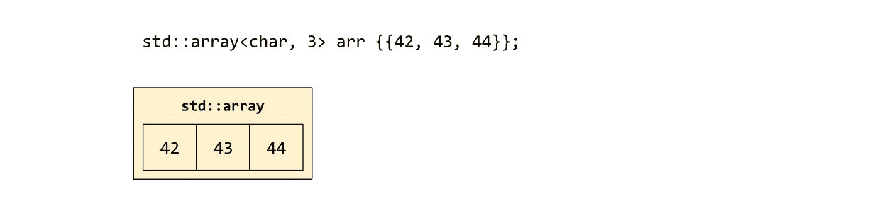
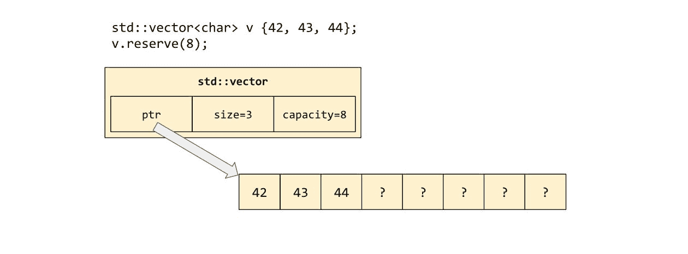
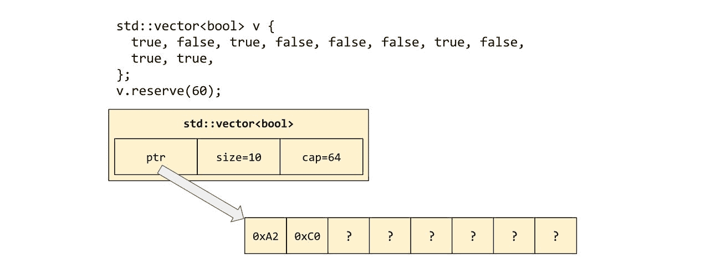
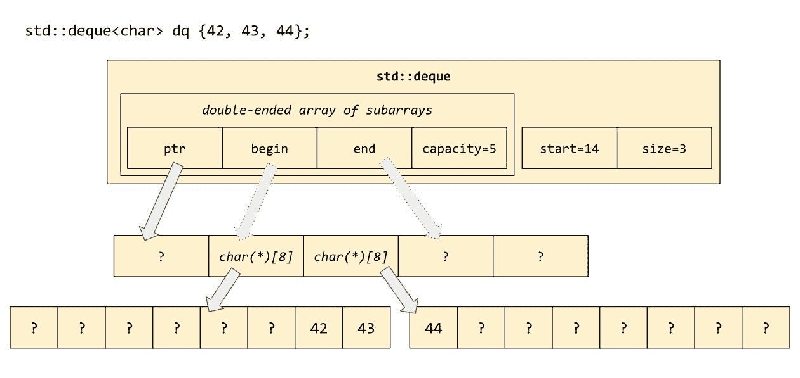
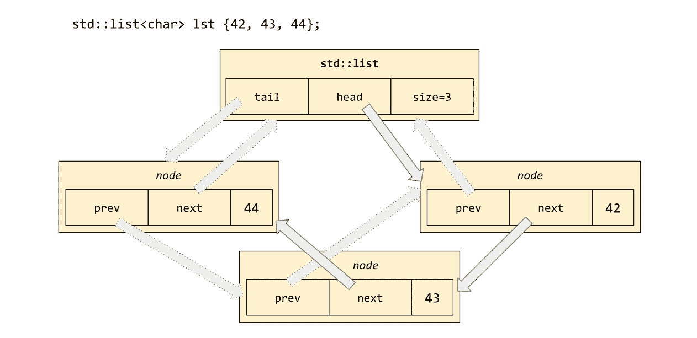
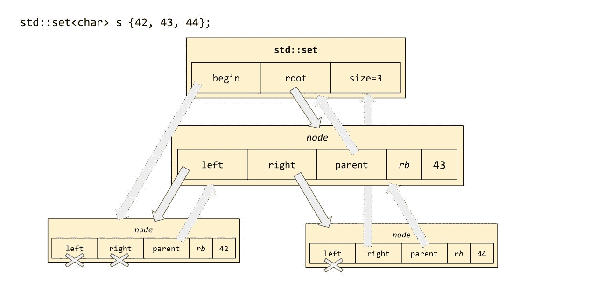
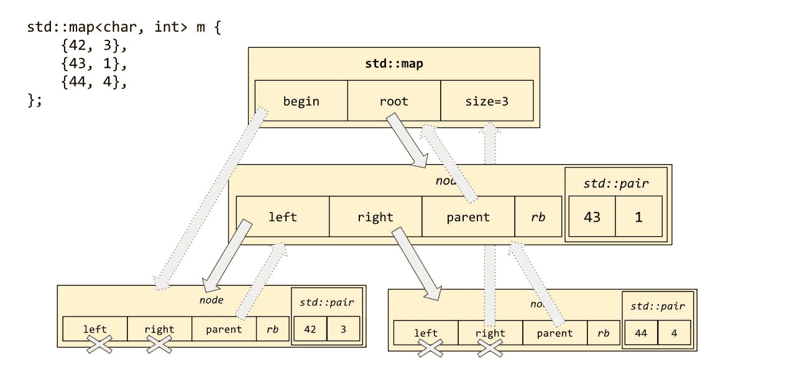
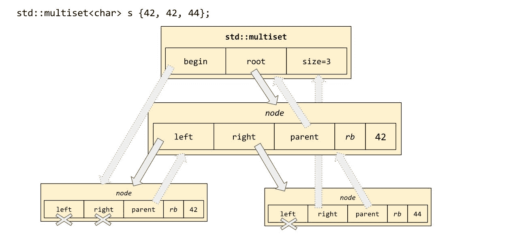
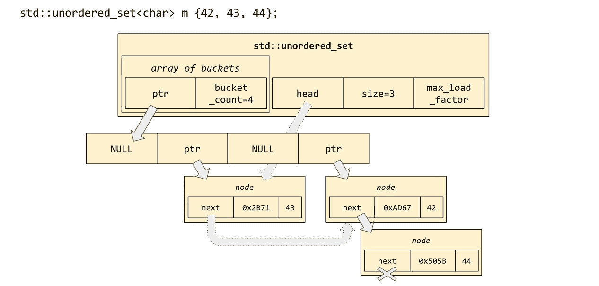
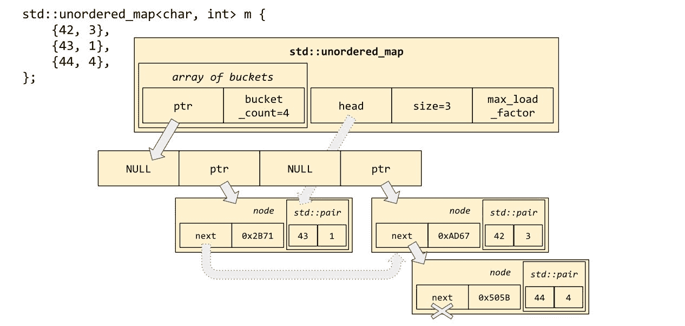

# 第四章：容器动物园

在前两章中，我们介绍了 *迭代器* 和 *范围* 的概念（第二章，*迭代器和范围*）以及操作由这些迭代器定义的数据元素范围的庞大标准 *泛型算法* 库（第三章，*迭代器对算法*）。在本章中，我们将探讨这些数据元素本身是如何分配和存储的。也就是说，现在我们已经了解了如何迭代，问题变得紧迫：我们是在迭代 *什么*？

在标准模板库中，对这个问题的回答通常是：我们正在迭代一个 *容器* 中包含的元素的一些子范围。容器简单地是一个 C++ 类（或类模板），根据其本质，*包含*（或*拥有*）一组同质的数据元素，并通过泛型算法公开该范围以进行迭代。

本章我们将涵盖的主题是：

+   一个对象 *拥有* 另一个对象的概念（这是 *容器* 和 *范围* 之间的本质区别）

+   序列容器（`array`、`vector`、`list` 和 `forward_list`）

+   迭代器无效化和引用无效化的陷阱

+   容器适配器（`stack`、`queue` 和 `priority_queue`）

+   关联容器（`set`、`map` 和相关容器）

+   当提供 *比较器*、*哈希函数*、*等价比较器* 或 *分配器* 作为额外的模板类型参数是合适的时候

# 拥有权的概念

当我们说对象 `A` *拥有* 对象 `B` 时，我们的意思是对象 `A` 管理对象 `B` 的生命周期--即 `A` 控制对象 `B` 的构造、复制、移动和销毁。对象 `A` 的用户可以（并且应该）“忘记”管理 `B`（例如，通过显式调用 `delete B`、`fclose(B)` 等）。

对象 `A` “拥有”对象 `B` 的最简单方式是让 `B` 成为 `A` 的成员变量。例如：

```cpp
    struct owning_A {
      B b_;
    };

    struct non_owning_A {
      B& b_;
    };

    void test()
    {
      B b;

      // a1 takes ownership of [a copy of] b.
      owning_A a1 { b };

      // a2 merely holds a reference to b;
      // a2 doesn't own b.
      non_owning_A a2 { b };
    }
```

另一种方式是让 `A` 持有对 `B` 的指针，并在 `~A()`（以及必要时在 `A` 的复制和移动操作中）中编写适当的代码来清理与该指针关联的资源：

```cpp
    struct owning_A {
      B *b_;

      explicit owning_A(B *b) : b_(b) {}

      owning_A(owning_A&& other) : b_(other.b_) {
        other.b_ = nullptr;
      }

      owning_A& operator= (owning_A&& other) {
        delete b_;
        b_ = other.b_;
        other.b_ = nullptr;
        return *this;
      }

      ~owning_A() {
        delete b_;
      }
    };

    struct non_owning_A {
      B *b_;
    };

    void test()
    {
      B *b = new B;

      // a1 takes ownership of *b.
      owning_A a1 { b };

      // a2 merely holds a pointer to *b;
      // a2 doesn't own *b.
      non_owning_A a2 { b };
    }
```

拥有权的概念与 C++ 特有的口号 **资源分配是初始化** 紧密相关，这个口号通常缩写为 **RAII**。（这个繁琐的缩写本应更像是“资源释放是销毁”，但那个缩写已被占用。）

标准的 *容器类* 的目标是提供对特定的一组数据对象 `B` 的访问，同时确保这些对象的 *所有权* 总是清晰的——也就是说，容器总是拥有其数据元素的所有权。（相反，*迭代器* 或定义 *范围* 的迭代器对，永远不会拥有其数据元素；我们在 第三章，*迭代器对算法* 中看到，标准的基于迭代器的算法，如 `std::remove_if`，实际上从未真正释放任何元素，而是简单地以各种方式重新排列元素值。）

在本章的剩余部分，我们将探讨各种标准容器类。

# 最简单的容器：std::array<T, N>

最简单的标准容器类是 `std::array<T, N>`，它的行为就像内置的（“C 风格”）数组。`std::array` 的第一个模板参数指示数组元素的类型，第二个模板参数指示数组中的元素数量。这是标准库中非常少数几个模板参数是整数值而不是类型名称的地方。



正常的 C 风格数组，作为核心语言的一部分（并且是追溯到 1970 年代的那一部分！），不提供任何会以线性时间运行的内置操作。C 风格数组允许你使用 `operator[]` 来索引它们，并比较它们的地址，因为这些操作可以在常数时间内完成；但如果你想要将一个 C 风格数组的全部内容赋值给另一个，或者比较两个数组的全部内容，你会发现你不能直接这样做。你必须使用我们在 第三章，*迭代器对算法* 中讨论的一些标准算法，例如 `std::copy` 或 `std::equal`（函数模板 `std::swap` 已经是一个“算法”，*确实* 可以用于 C 风格数组。如果它不起作用，那就太遗憾了）： 

```cpp
    std::string c_style[4] = {
      "the", "quick", "brown", "fox"
    };
    assert(c_style[2] == "brown");
    assert(std::size(c_style) == 4);
    assert(std::distance(std::begin(c_style), std::end(c_style)) == 4);

    // Copying via operator= isn't supported.
    std::string other[4]; 
    std::copy(std::begin(c_style), std::end(c_style), std::begin(other));

    // Swapping IS supported... in linear time, of course.
    using std::swap;
    swap(c_style, other);

    // Comparison isn't supported; you have to use a standard algorithm.
    // Worse, operator== does the "wrong" thing: address comparison!
    assert(c_style != other);
    assert(std::equal(
      c_style, c_style + 4,
      other, other + 4 
    ));
    assert(!std::lexicographical_compare(
      c_style, c_style + 4,
      other, other + 4
   ));
```

`std::array` 的行为就像 C 风格数组，但提供了更多的语法糖。它提供了 `.begin()` 和 `.end()` 成员函数；并且它重载了 `=`, `==`, 和 `<` 运算符以执行自然的事情。所有这些操作仍然需要与数组大小成线性时间的开销，因为它们必须遍历数组，逐个复制（或交换或比较）每个单独的元素。

对于 `std::array` 有一点抱怨，你会在这些标准容器类中看到，那就是当你使用花括号内的初始化列表构造一个 `std::array` 时，你实际上需要写 *两组* 花括号。这是为 `std::array<T, N>` 类型的“外部对象”写的一组，以及为 `T[N]` 类型的“内部数据成员”写的一组。一开始这有点烦人，但一旦你使用了几次，双花括号语法会很快成为第二本能：

```cpp
    std::array<std::string, 4> arr = {{
      "the", "quick", "brown", "fox"
    }};
    assert(arr[2] == "brown");

    // .begin(), .end(), and .size() are all provided.
    assert(arr.size() == 4);
    assert(std::distance(arr.begin(), arr.end()) == 4);

    // Copying via operator= is supported... in linear time.
    std::array<std::string, 4> other;
    other = arr;

    // Swapping is also supported... in linear time.
    using std::swap;
    swap(arr, other);

    // operator== does the natural thing: value comparison!
    assert(&arr != &other); // The arrays have different addresses... 
    assert(arr == other); // ...but still compare lexicographically equal.
    assert(arr >= other); // Relational operators are also supported.
```

`std::array` 的另一个好处是你可以从函数中返回一个，这是你不能用 C 风格数组做到的：

```cpp
    // You can't return a C-style array from a function.
    // auto cross_product(const int (&a)[3], const int (&b)[3]) -> int[3];

    // But you can return a std::array.
    auto cross_product(const std::array<int, 3>& a,
     const std::array<int, 3>& b) -> std::array<int, 3>
    {
      return {{
        a[1] * b[2] - a[2] * b[1],
        a[2] * b[0] - a[0] * b[2],
        a[0] * b[1] - a[1] * b[0],
      }};
    }
```

因为 `std::array` 有拷贝构造函数和拷贝赋值运算符，你还可以将它们存储在容器中：例如，`std::vector<std::array<int, 3>>` 是可以的，而 `std::vector<int[3]>` 则不行。

然而，如果你发现自己经常从函数中返回数组或将数组存储在容器中，你应该考虑“数组”是否真的是你目的的正确抽象。将那个数组封装成某种类类型可能更合适吗？

在我们的 `cross_product` 示例中，将我们的“三个整数的数组”封装成一个类类型是一个非常极好的主意。这不仅允许我们命名成员（`x`、`y` 和 `z`），而且我们可以更容易地初始化 `Vec3` 类类型的对象（不需要第二对花括号！）并且也许最重要的是，为了我们未来的理智，我们可以避免定义比较运算符，如 `operator<`，这些运算符实际上对我们数学领域没有意义。使用 `std::array`，我们必须处理这样一个事实，即数组 `{1, 2, 3}` 与数组 `{1, 3, -9}` 相比是“小于”的——但当我们定义自己的 `class Vec3` 时，我们可以简单地省略对 `operator<` 的任何提及，从而确保没有人会意外地在数学环境中误用它：

```cpp
    struct Vec3 {
      int x, y, z;
      Vec3(int x, int y, int z) : x(x), y(y), z(z) {}
    };

    bool operator==(const Vec3& a, const Vec3& b) {
      return std::tie(a.x, a.y, a.z) ==
         std::tie(b.x, b.y, b.z);
    }

    bool operator!=(const Vec3& a, const Vec3& b) {
      return !(a == b);
    }

    // Operators < <= > >= don't make sense for Vec3

    Vec3 cross_product(const Vec3& a, const Vec3& b) {
      return {
        a.y * b.z - a.z * b.y,
        a.z * b.x - a.x * b.z,
        a.x * b.y - a.y * b.x,
      };
    }
```

`std::array` 在其内部持有其元素。因此，`sizeof (std::array<int, 100>)` 等于 `sizeof (int[100])`，等于 `100 * sizeof (int)`。不要犯试图将巨大的数组作为局部变量放在栈上的错误！

```cpp
    void dont_do_this()
    {
      // This variable takes up 4 megabytes of stack space ---
      // enough to blow your stack and cause a segmentation fault!
      int arr[1'000'000];
    }

    void dont_do_this_either()
    {
      // Changing it into a C++ std::array doesn't fix the problem.
      std::array<int, 1'000'000> arr;
    }
```

与“巨大的数组”打交道是我们列表中下一个容器的工作：`std::vector`。

# 工作马：`std::vector<T>`

`std::vector` 表示一个数据元素的字节连续数组，但分配在堆上而不是栈上。这比 `std::array` 有两个改进：首先，它允许我们创建一个非常大的数组而不会耗尽栈空间。其次，它允许我们动态地调整底层数组的大小——与 `std::array<int, 3>` 不同，其中数组的大小是类型不可变的一部分，一个 `std::vector<int>` 没有固有的大小。向量的 `.size()` 方法实际上提供了关于向量当前状态的 useful 信息。

`std::vector` 有另一个显著的属性：其 *容量*。向量的容量始终不小于其大小，表示向量当前 *可以* 持有的元素数量，在它需要重新分配其底层数组之前：



除了可调整大小之外，`vector` 的行为与 `array` 类似。像数组一样，向量是可复制的（在线性时间内复制所有数据元素）并且可比较的（`std::vector<T>::operator<` 将通过委托给 `T::operator<` 报告操作数的字典序）。

一般而言，`std::vector`是整个标准库中最常用的容器。每次你需要存储“大量”元素（或“我不确定我有多少元素”）时，你的第一个想法应该是使用`vector`。为什么？因为`vector`提供了可调整大小容器的所有灵活性，同时具有连续数组的简单性和效率。

连续数组是最有效的数据结构（在典型硬件上），因为它们提供了良好的**局部性**，也称为`缓存友好性`。当你按顺序从`.begin()`到`.end()`遍历向量时，你也在按顺序遍历**内存**，这意味着计算机的硬件可以非常准确地预测你将要查看的下一块内存。将此与链表进行比较，其中从`.begin()`到`.end()`的遍历可能涉及在整个地址空间中跟随指针，并且按无序的方式访问内存位置。在链表中，几乎每个你访问的地址都与前一个地址无关，因此它们都不会在 CPU 的缓存中。在向量（或数组）中，情况正好相反：你访问的每个地址都将与前一个地址通过简单的线性关系相关联，CPU 将能够在你需要时准备好所有这些值。

即使你的数据比简单的值列表“更有结构”，你通常也可以使用`vector`来存储它。我们将在本章末尾看到如何使用`vector`来模拟栈或优先队列。

# 调整`std::vector`的大小

`std::vector`有一系列成员函数，用于添加和删除元素。这些成员函数在`std::array`中不存在，因为`std::array`是不可调整大小的；但它们在其他我们将要讨论的容器中大多数都存在。因此，现在熟悉它们是个好主意。

让我们从针对`vector`本身的两个基本操作开始：`.resize()`和`.reserve()`。

`vec.reserve(c)`更新向量的容量——它“预留”了足够的空间来存储多达`c`个元素（总计）。如果`c <= vec.capacity()`，则不会发生任何操作；但如果`c > vec.capacity()`，则向量将不得不重新分配其基本数组。重新分配遵循以下等效算法：

```cpp
    template<typename T>
    inline void destroy_n_elements(T *p, size_t n)
    {
      for (size_t i = 0; i < n; ++i) {
        p[i].~T();
      }
    }

    template<typename T>
    class vector {
      T *ptr_ = nullptr;
      size_t size_ = 0;
      size_t capacity_ = 0;

      public:
      // ...

      void reserve(size_t c) {
        if (capacity_ >= c) {
          // do nothing
          return;
        }

        // For now, we'll ignore the problem of
        // "What if malloc fails?"
        T *new_ptr = (T *)malloc(c * sizeof (T));

        for (size_t i=0; i < size_; ++i) {
          if constexpr (std::is_nothrow_move_constructible_v<T>) {
            // If the elements can be moved without risking
            // an exception, then we'll move the elements.
            ::new (&new_ptr[i]) T(std::move(ptr_[i]));
          } else {
            // If moving the elements might throw an exception,
            // then moving isn't safe. Make a copy of the elements
            // until we're sure that we've succeeded; then destroy
            // the old elements.
            try {
              ::new (&new_ptr[i]) T(ptr_[i]);
            } catch (...) {
              destroy_n_elements(new_ptr, i);
              free(new_ptr);
              throw;
            }
          }
        }
        // Having successfully moved or copied the elements,
        // destroy the old array and point ptr_ at the new one.
        destroy_n_elements(ptr_, size_);
        free(ptr_);
        ptr_ = new_ptr;
        capacity_ = c;
      }

      ~vector() {
        destroy_n_elements(ptr_, size_);
        free(ptr_);
      }
    };
```

如果你按顺序阅读这本书，你可能会认出这个`.reserve()`函数中的关键 for 循环与第三章中`std::uninitialized_copy(a,b,c)`的实现非常相似，*迭代器对算法*。实际上，如果你在一个非分配器感知的容器上实现`.reserve()`（见第八章，*分配器*），你可能重用那个标准算法：

```cpp
    // If the elements can be moved without risking
    // an exception, then we'll move the elements.
    std::conditional_t<
      std::is_nothrow_move_constructible_v<T>,
      std::move_iterator<T*>,
      T*
      > first(ptr_);

    try {
      // Move or copy the elements via a standard algorithm.
      std::uninitialized_copy(first, first + size_, new_ptr);
    } catch (...) {
      free(new_ptr);
      throw;
    }

    // Having successfully moved or copied the elements,
    // destroy the old array and point ptr_ at the new one.
    std::destroy(ptr_, ptr_ + size_);
    free(ptr_);
    ptr_ = new_ptr;
    capacity_ = c;
```

`vec.resize(s)`改变向量的大小——它从向量末尾切掉元素（在这个过程中调用它们的析构函数），或者向向量中添加额外的元素（默认构造它们），直到向量的大小等于`s`。如果`s > vec.capacity()`，则向量将不得不像在`.reserve()`情况下一样重新分配其底层数组。

你可能已经注意到，当一个向量重新分配其底层数组时，元素地址会发生变化：重新分配前`vec[0]`的地址与重新分配后`vec[0]`的地址不同。任何指向向量旧元素的指针都变成了“悬垂指针”。由于`std::vector::iterator`本质上也是一个指针，因此任何指向向量旧元素的迭代器也变得无效。这种现象被称为*迭代器失效*，它是 C++代码中 bug 的主要来源。当你同时处理迭代器和调整向量大小时要小心！

这里有一些经典的迭代器失效案例：

```cpp
    std::vector<int> v = {3, 1, 4};

    auto iter = v.begin();
    v.reserve(6); // iter is invalidated!

    // This might look like a way to produce the result
    // {3, 1, 4, 3, 1, 4}; but if the first insertion
    // triggers reallocation, then the next insertion
    // will be reading garbage from a dangling iterator!
    v = std::vector{3, 1, 4};
    std::copy(
      v.begin(),
      v.end(),
      std::back_inserter(v)
    );
```

这里还有一个案例，这在许多其他编程语言中也很常见，即在迭代容器的同时删除元素会产生微妙的 bug：

```cpp
    auto end = v.end();
    for (auto it = v.begin(); it != end; ++it) {
      if (*it == 4) {
        v.erase(it); // WRONG!
      }
    }

    // Asking the vector for its .end() each time
    // through the loop does fix the bug...
    for (auto it = v.begin(); it != v.end(); ) {
      if (*it == 4) {
        it = v.erase(it);
      } else {
        ++it;
      }
    }

    // ...But it's much more efficient to use the
    // erase-remove idiom.
    v.erase(
      std::remove_if(v.begin(), v.end(), [](auto&& elt) {
        return elt == 4;
      }),
      v.end()
    );
```

# 在 std::vector 中插入和删除

`vec.push_back(t)`向向量的末尾添加一个项目。没有对应的`.push_front()`成员函数，因为正如本节开头所示，没有一种有效的方法可以将任何东西推送到向量的*前端*。

`vec.emplace_back(args...)`是一个完美前向变长函数模板，其行为就像`.push_back(t)`一样，除了它不是在向量的末尾放置`t`的副本，而是放置一个`T`对象，就像通过`T(args...)`构造一样。

`push_back`和`emplace_back`都有所谓的“摊销常数时间”性能。要了解这意味着什么，考虑如果你连续调用`v.emplace_back()`一百次会发生什么。每次调用，向量都需要稍微变大；因此它重新分配其底层数组并将所有`v.size()`个元素从旧数组移动到新数组。很快，你花费在复制旧数据上的时间就会比实际“推回”新数据的时间多！幸运的是，`std::vector`足够聪明，可以避免这个陷阱。每当像`v.emplace_back()`这样的操作导致重新分配时，向量不会只为`capacity() + 1`个元素在新数组中留出空间；它将为`k * capacity()`个元素留出空间（其中`k`对于 libc++和 libstdc++是 2，对于 Visual Studio 大约是 1.5）。因此，尽管随着向量的增长重新分配变得越来越昂贵，但每次`push_back`的重新分配次数越来越少——因此单个`push_back`的成本在平均上是常数。这个技巧被称为*几何扩展*。

`vec.insert(it, t)`将一个项目插入到向量的中间，位置由迭代器`it`指示。如果`it == vec.end()`，则这相当于`push_back`；如果`it == vec.begin()`，则这是一个简化的`push_front`版本。请注意，如果你不在向量的末尾插入，那么在插入点之后的底层数组中的所有元素都将被移位以腾出空间；这可能会很昂贵。

`.insert()`有几个不同的重载。一般来说，这些都不会对你有用，但你可能想了解它们，以便解释当你错误地提供`.insert()`的参数时出现的神秘错误消息（或神秘的运行时错误）；如果重载解析最终选择的是你期望之外的这些中的一个：

```cpp
    std::vector<int> v = {1, 2};
    std::vector<int> w = {5, 6};

    // Insert a single element.
    v.insert(v.begin() + 1, 3);
    assert((v == std::vector{1, 3, 2}));

    // Insert n copies of a single element.
    v.insert(v.end() - 1, 3, 4);
    assert((v == std::vector{1, 3, 4, 4, 4, 2}));

    // Insert a whole range of elements.
    v.insert(v.begin() + 3, w.begin(), w.end());
    assert((v == std::vector{1, 3, 4, 5, 6, 4, 4, 2}));

    // Insert a braced list of elements.
    v.insert(v.begin(), {7, 8});
    assert((v == std::vector{7, 8, 1, 3, 4, 5, 6, 4, 4, 2}));
```

`vec.emplace(it, args...)`与`insert`的关系类似于`emplace_back`与`push_back`的关系：它是 C++03 函数的一个完美转发版本。当可能时，优先使用`emplace`和`emplace_back`而不是`insert`和`push_back`。

`vec.erase(it)`从向量的中间位置删除单个项目，位置由迭代器`it`指示。还有一个两个迭代器的版本，`vec.erase(it, it)`，用于删除一系列连续的项目。请注意，这个两个迭代器的版本与我们在上一章中使用的*erase-remove 习语*是相同的。

要从向量中删除最后一个元素，你可以使用`vec.erase(vec.end()-1)`或`vec.erase(vec.end()-1, vec.end())`；但由于这是一个常见的操作，标准库提供了一个同义词，形式为`vec.pop_back()`。你可以仅使用`std::vector`的`push_back()`和`pop_back()`方法来实现一个动态增长的*栈*。

# 向量<bool>的陷阱

`std::vector`模板有一个特殊情况：`std::vector<bool>`。由于`bool`数据类型只有两个可能的值，八个`bool`的值可以打包到一个字节中。`std::vector<bool>`使用这种优化，这意味着它使用的堆分配内存比预期的少八倍。



这种打包的缺点是`vector<bool>::operator[]`的返回类型不能是`bool&`，因为向量没有在任何地方存储实际的`bool`对象。因此，`operator[]`返回一个定制的类类型，`std::vector<bool>::reference`，它可以转换为`bool`，但它本身不是`bool`（这种类型的类型通常被称为“代理类型”或“代理引用”）。

`operator[] const`的结果类型“官方上”是`bool`，但在实践中，一些库（特别是 libc++）为`operator[] const`返回一个代理类型。这意味着使用`vector<bool>`的代码不仅微妙，有时甚至不可移植；如果你可以的话，我建议避免使用`vector<bool>`：

```cpp
    std::vector<bool> vb = {true, false, true, false};

    // vector<bool>::reference has one public member function:
    vb[3].flip();
    assert(vb[3] == true);

    // The following line won't compile!
    // bool& oops = vb[0];

    auto ref = vb[0];
    assert((!std::is_same_v<decltype(ref), bool>));
    assert(sizeof vb[0] > sizeof (bool));

    if (sizeof std::as_const(vb)[0] == sizeof (bool)) {
      puts("Your library vendor is libstdc++ or Visual Studio");
    } else {
      puts("Your library vendor is libc++");
    }
```

# 非 noexcept 移动构造函数的陷阱

回想一下在 *Resizing a std::vector* 部分中 `vector::resize()` 的实现。当向量调整大小时，它会重新分配其底层数组并将元素移动到新数组中——除非元素类型不是“nothrow move-constructible”，在这种情况下它会*复制*其元素！这意味着，除非你特意指定你的移动构造函数是 `noexcept`，否则调整你自己的类类型向量的大小将会是不必要的“最优化”。

考虑以下类定义：

```cpp
    struct Bad {
      int x = 0;
      Bad() = default;
      Bad(const Bad&) { puts("copy Bad"); }
      Bad(Bad&&) { puts("move Bad"); }
    };

    struct Good {
      int x = 0;
      Good() = default;
      Good(const Good&) { puts("copy Good"); }
      Good(Good&&) noexcept { puts("move Good"); }
    };

    class ImplicitlyGood {
      std::string x;
      Good y;
    };

    class ImplicitlyBad {
      std::string x;
      Bad y;
    };
```

我们可以使用以下测试框架等单独测试这些类的行为。运行 `test()` 将打印 "copy Bad--move Good--copy Bad--move Good。"多么恰当的咒语！

```cpp
    template<class T>
    void test_resizing()
    {
      std::vector<T> vec(1);
      // Force a reallocation on the vector.
      vec.resize(vec.capacity() + 1);
    }

    void test()
    {
      test_resizing<Good>();
      test_resizing<Bad>();
      test_resizing<ImplicitlyGood>();
      test_resizing<ImplicitlyBad>();
    }
```

这是一个微妙且晦涩的观点，但它可能会对你在实践中 C++ 代码的效率产生重大影响。一个很好的经验法则是：无论何时声明你自己的移动构造函数或交换函数，确保你声明它为 `noexcept`。

# 快速混合型：std::deque<T>

与 `std::vector` 类似，`std::deque` 提供了连续数组的接口——它是随机访问的，并且其元素以连续块的形式存储，以便于缓存友好。但与 `vector` 不同，其元素只是“块状”连续的。一个 deque 由任意数量的“块”组成，每个块包含固定数量的元素。在容器的两端插入更多元素的成本较低；在中间插入元素的成本仍然较高。在内存中它看起来像这样：



`std::deque<T>` 展示了与 `std::vector<T>` 相同的所有成员函数，包括重载的 `operator[]`。除了向量的 `push_back` 和 `pop_back` 方法外，`deque` 还暴露了一个高效的 `push_front` 和 `pop_front`。

注意，当你反复向向量中 `push_back` 时，你最终会触发底层数组的重新分配，并使所有迭代器以及容器内元素的指针和引用无效。在 `deque` 中，迭代器失效仍然会发生，但除非你在 deque 的中间插入或删除元素（在这种情况下，deque 的一个端点或另一个端点将不得不向外移动以腾出空间，或者向内移动以填补空隙），否则单个元素永远不会改变它们的地址：

```cpp
    std::vector<int> vec = {1, 2, 3, 4};
    std::deque<int> deq = {1, 2, 3, 4};
    int *vec_p = &vec[2];
    int *deq_p = &deq[2];
    for (int i=0; i < 1000; ++i) {
      vec.push_back(i);
      deq.push_back(i);
    }
    assert(vec_p != &vec[2]);
    assert(deq_p == &deq[2]);
```

`std::deque<T>` 的另一个优点是，没有为 `std::deque<bool>` 进行特殊化；无论 `T` 是什么，容器都提供了一个统一的公共接口。

`std::deque<T>` 的缺点在于其迭代器的递增和解引用操作要显著昂贵，因为它们必须导航到以下图中所示的指针数组。这是一个相当大的缺点，以至于坚持使用 `vector` 是有意义的，除非你恰好需要在容器的两端快速插入和删除。

# 特定的技能集：std::list<T>

容器 `std::list<T>` 在内存中代表一个链表。示意图如下：



注意，列表中的每个节点都包含对其“下一个”和“上一个”节点的指针，因此这是一个双向链表。双向链表的优点是它的迭代器可以向前和向后遍历列表--也就是说，`std::list<T>::iterator` 是一个**双向迭代器**（但它不是**随机访问**；到达列表的第 *n* 个元素仍然需要 O(*n*) 的时间）。

`std::list` 支持与 `std::vector` 相同的许多操作，但除了那些需要随机访问的操作（例如 `operator[]`）。由于从列表的前端进行推入和弹出不需要昂贵的移动操作，因此它可以添加用于从列表前端推入和弹出的成员函数。

通常，`std::list` 的性能远低于 `std::vector` 或 `std::deque` 这样的连续数据结构，因为跟踪“随机”分配的地址比跟踪内存连续块中的指针要困难得多。因此，你应该将 `std::list` 视为一个通常**不推荐**的容器；你应该只在绝对需要它做得比 `vector` 更好的事情时才从工具箱中取出它。

# `std::list` 有哪些特殊技能？

首先，对于列表没有**迭代器失效**！`lst.push_back(v)` 和 `lst.push_front(v)` 总是常数时间操作，并且永远不需要“调整大小”或“移动”任何数据。

其次，在 `vector` 上成本高昂或在行外存储（“临时空间”）中需要存储的许多修改操作，对于链表来说变得便宜。以下是一些例子：

`lst.splice(it, otherlst)` “拼接”整个 `otherlst` 到 `lst` 中，就像通过重复调用 `lst.insert(it++, other_elt)`；但是“插入”的节点实际上是偷自右侧的 `otherlst`。整个拼接操作只需几个指针交换即可完成。在此操作之后，`otherlst.size() == 0`。

`lst.merge(otherlst)` 类似地仅使用指针交换将 `otherlst` 清空到 `lst` 中，但具有“合并排序列表”的效果。例如：

```cpp
    std::list<int> a = {3, 6};
    std::list<int> b = {1, 2, 3, 5, 6};

    a.merge(b);
    assert(b.empty());
    assert((a == std::list{1, 2, 3, 3, 5, 6, 6}));
```

与涉及比较的 STL 操作一样，有一个接受比较器的版本：`lst.merge(otherlst, less)`。

另一个只能通过指针交换来完成的操作是在原地反转列表：`lst.reverse()` 切换所有“下一个”和“上一个”链接，使得列表的头部现在是尾部，反之亦然。

注意，所有这些操作都会**原地修改列表**，并且通常返回 `void`。

另一种在链表上（但在连续容器上不是）成本低廉的操作是删除元素。回想一下第三章，*迭代器对算法*，STL 提供了 `std::remove_if` 和 `std::unique` 等算法，用于与连续容器一起使用；这些算法将“已删除”的元素洗牌到容器的末尾，以便可以在单个 `erase()` 中取下。对于 `std::list`，洗牌元素比简单地就地删除它们更昂贵。因此，`std::list` 提供了以下成员函数，不幸的是，它们的名称与非删除 STL 算法相似：

+   `lst.remove(v)` 移除并删除所有等于 `v` 的元素。

+   `lst.remove_if(p)` 移除并删除所有满足一元谓词 `p(e)` 的元素 `e`。

+   `lst.unique()` 移除并删除每个“连续相等元素序列”中除了第一个元素之外的所有元素。像往常一样，与涉及比较的 STL 操作一样，有一个接受比较器的版本：`lst.unique(eq)` 当 `p(e1, e2)` 成立时移除并删除 `e2`。

+   `lst.sort()` 在原地排序列表。这特别有用，因为排列算法 `std::sort(ctr.begin(), ctr.end())` 不能在非随机访问的 `std::list::iterator` 上工作。

很奇怪，`lst.sort()` 只能对整个容器进行排序，而不是像 `std::sort` 那样接受一个子范围。但如果你只想对 `lst` 的子范围进行排序，你可以通过——跟我一起说——仅仅几个指针交换来实现！

```cpp
    std::list<int> lst = {3, 1, 4, 1, 5, 9, 2, 6, 5};
    auto begin = std::next(lst.begin(), 2);
    auto end = std::next(lst.end(), -2);

    // Sort just the range begin, end)
    std::list<int> sub; 
    sub.splice(sub.begin(), lst, begin, end);
    sub.sort();
    lst.splice(end, sub);
    assert(sub.empty());

    assert((lst == std::list{3, 1, 1, 2, 4, 5, 9, 6, 5}));
```

# 使用 std::forward_list<T> 进行简化

标准容器 `std::forward_list<T>` 与 `std::list` 类似，但功能较少——无法获取其大小，无法向后迭代。在内存中它看起来与 `std::list<T>` 类似，但节点更小：

![尽管如此，`std::forward_list` 保留了 `std::list` 几乎所有的“特殊技能”。它无法执行的操作只有 `splice`（因为这涉及到在给定迭代器之前插入）和 `push_back`（因为这涉及到在常数时间内找到列表的末尾）。`forward_list` 用 `_after` 版本替换了这些缺失的成员函数：+   `flst.erase_after(it)` 删除给定位置之后的元素+   `flst.insert_after(it, v)` 在给定位置之后插入一个新元素+   `flst.splice_after(it, otherflst)` 在给定位置之后插入 `otherflst` 的元素与 `std::list` 一样，除非你需要它特定的技能集，否则应尽量避免使用 `forward_list`。# 使用 std::stack<T> 和 std::queue<T> 进行抽象我们现在已经看到了三个不同的标准容器，它们具有 `push_back()` 和 `pop_back()` 成员函数（尽管我们没有提到，但 `back()` 用于获取容器最后一个元素的引用）。如果我们想要实现一个栈数据结构，我们需要这些操作。标准库提供了一个方便的方式来抽象栈的概念，容器被称为（还能是什么？）`std::stack`。然而，与迄今为止我们所看到的容器不同，`std::stack` 需要一个额外的模板参数。`std::stack<T, Ctr>` 表示一个类型为 `T` 的元素栈，其底层存储由容器类型 `Ctr` 的一个实例管理。例如，`stack<T, vector<T>>` 使用向量来管理其元素；`stack<T, list<T>>` 使用列表；等等。模板参数 `Ctr` 的默认值实际上是 `std::deque<T>`；你可能还记得，`deque` 比向量占用更多内存，但它的好处是永远不需要重新分配其底层数组或移动插入后的元素。要与 `std::stack<T, Ctr>` 交互，你必须限制自己只使用 `push` 操作（对应于底层容器上的 `push_back`），`pop` 操作（对应于 `pop_back`），`top` 操作（对应于 `back`），以及一些其他访问器，如 `size` 和 `empty`：```cpp    std::stack<int> stk;    stk.push(3); stk.push(1); stk.push(4);    assert(stk.top() == 4);    stk.pop();    assert(stk.top() == 1);    stk.pop();    assert(stk.top() == 3);````std::stack` 的一个奇特特性是它支持比较运算符 `==`、`!=`、`<`、`<=`、`>` 和 `>=`；并且这些运算符通过比较底层容器（使用底层容器类型定义的任何语义）来工作。由于底层容器类型通常通过字典序比较，结果是比较两个栈时是“从下往上”进行字典序比较的。```cpp    std::stack<int> a, b;    a.push(3); a.push(1); a.push(4);    b.push(2); b.push(7);    assert(a != b);    assert(a.top() < b.top()); // that is, 4 < 7    assert(a > b); // because 3 > 2```如果你只使用 `==` 和 `!=`，或者依赖于 `operator<` 为 `std::set` 或 `std::map` 生成一致排序，那么这没问题；但当你第一次看到它时，这确实会让人感到惊讶！标准库还提供了一个“队列”的抽象。`std::queue<T, Ctr>` 提供了 `push_back` 和 `pop_front` 方法（对应于底层容器上的 `push_back` 和 `pop_front`），以及一些其他访问器，如 `front`、`back`、`size` 和 `empty`。知道容器必须尽可能高效地支持这些基本操作，你应该能够猜出 `Ctr` 的 *默认* 值。是的，它是 `std::deque<T>`，这是一个低开销的双端队列。注意，如果你从头开始使用 `std::deque<T>` 实现队列，你可以选择是在双端队列的前端入队并在后端出队，或者是在后端入队并在前端出队。标准的 `std::queue<T, std::deque<T>>` 特意选择在后端入队并在前端出队，如果你考虑现实世界中的“队列”，这很容易记住。当你排队在售票窗口或午餐队伍中时，你会在队伍的后面加入，当你到达前面时才会被服务——永远不会反过来！选择技术术语（如 `queue`、`front` 和 `back`）的艺术是很有用的，这些术语的技术含义是它们现实世界对应物的准确反映。# 有用的适配器：std::priority_queue<T>在第三章，“迭代器对算法”中，我们介绍了“堆”算法系列：`make_heap`、`push_heap` 和 `pop_heap`。您可以使用这些算法给一系列元素赋予最大堆属性。如果您将最大堆属性作为数据的不变性来维护，您将得到一个通常称为**优先队列**的数据结构。在数据结构教科书中，优先队列通常被描绘为一种**二叉树**，但正如我们在第三章，“迭代器对算法”中看到的，最大堆属性并没有要求显式地使用基于指针的树结构。标准容器 `std::priority_queue<T, Ctr, Cmp>` 表示一个优先队列，内部表示为一个 `Ctr` 的实例，其中 `Ctr` 的元素始终按照最大堆顺序排列（由比较器类型 `Cmp` 的实例确定）。在这种情况下，`Ctr` 的默认值是 `std::vector<T>`。记住，`vector` 是最有效的容器；`std::stack` 和 `std::queue` 选择 `deque` 作为它们的默认值，唯一的原因是它们不想在插入元素后移动元素。但是，对于优先队列，元素始终在移动，随着其他元素的插入或删除，在最大堆中上下移动。因此，使用 `deque` 作为底层容器没有特别的优点；因此，标准库遵循了我一直在重复的相同规则——除非有特定的原因需要其他东西，否则使用 `std::vector`！`Cmp` 的默认值是标准库类型 `std::less<T>`，它表示 `operator<`。换句话说，`std::priority_queue` 容器默认使用与第三章，“迭代器对算法”中的 `std::push_heap` 和 `std::pop_heap` 算法相同的比较器。`std::priority_queue<T, Ctr>` 暴露的成员函数是 `push`、`pop` 和 `top`。从概念上讲，底层容器前面的项目位于堆的“顶部”。要记住的一件事是，在最大堆中，“顶部”的项目是**最大的**项目——想象一下这些项目像玩山丘之王，最大的项目获胜并最终位于堆的顶部。+   `pq.push(v)` 将新项目插入到优先队列中，就像在底层容器上执行 `std::push_heap()` 一样+   `pq.top()` 返回对优先队列顶部元素的引用，就像在底层容器上调用 `ctr.front()` 一样+   `pq.pop()` 从优先队列中移除最大元素并更新堆，就像在底层容器上执行 `std::pop_heap()` 一样要获得**最小堆**而不是最大堆，只需简单地反转提供给 `priority_queue` 模板的比较器的意义：```cpp    std::priority_queue<int> pq1;    std::priority_queue<int, std::vector<int>, std::greater<>> pq2;    for (int v : {3, 1, 4, 1, 5, 9}) {      pq1.push(v);      pq2.push(v);    }    assert(pq1.top() == 9); // max-heap by default    assert(pq2.top() == 1); // min-heap by choice```# 树：`std::set<T>` 和 `std::map<K, V>`类模板 `std::set<T>` 为任何实现 `operator<` 的 `T` 提供了“唯一集合”的接口。与涉及比较的 STL 操作一样，有一个接受比较器的版本：`std::set<T, Cmp>` 使用 `Cmp(a,b)` 而不是 `(a < b)` 来排序数据元素。一个 `std::set` 在概念上是一个二叉搜索树，类似于 Java 的 `TreeSet`。在所有流行的实现中，它特别是一个 *红黑树*，这是一种特定的自平衡二叉搜索树：即使你不断地从树中插入和删除项目，它也不会变得 *太不平衡*，这意味着 `insert` 和 `find` 在平均情况下总是以 O(log *n*) 的时间复杂度运行。注意其内存布局中涉及的指针数量：

由于二叉搜索树的定义是元素按排序顺序（从小到大）存储，因此 `std::set` 提供成员函数 `push_front` 或 `push_back` 没有意义。相反，为了向集合中添加元素 `v`，你使用 `s.insert(v)`；要删除元素，则使用 `s.erase(v)` 或 `s.erase(it)`：

```cpp
    std::set<int> s;
    for (int i : {3, 1, 4, 1, 5}) {
      s.insert(i);
    }

    // A set's items are stored sorted and deduplicated.
    assert((s == std::set{1, 3, 4, 5}));

    auto it = s.begin();
    assert(*it == 1);
    s.erase(4);
    s.erase(it); // erase *it, which is 1

    assert((s == std::set{3, 5}));
```

`s.insert(v)` 的返回值很有趣。当我们向一个向量 `insert` 时，只有两种可能的结果：要么值成功添加到向量中（并返回一个指向新插入元素的迭代器），要么插入失败并抛出异常。当我们向一个集合 `insert` 时，还有一种可能的结果：可能由于集合中已经存在 `v` 的副本而没有发生插入！这并不是一个值得异常控制流的“失败”，但仍然是一些调用者可能想要了解的事情。因此，`s.insert(v)` 总是返回一个 `pair` 的返回值：`ret.first` 是数据结构中 `v` 的副本的常规迭代器（无论它是否刚刚插入），而 `ret.second` 如果指向的 `v` 是刚刚插入的则为 `true`，如果指向的 `v` 最初就在集合中则为 `false`：

```cpp
    std::set<int> s;
    auto [it1, b1] = s.insert(1);
    assert(*it1 == 1 && b1 == true);

    auto [it2, b2] = s.insert(2);
    assert(*it2 == 2 && b2 == true);

    auto [it3, b3] = s.insert(1); // again
    assert(*it3 == 1 && b3 == false);
```

前一个片段中使用的方括号变量定义正在使用 C++17 *结构化绑定*。

正如之前的示例所示，集合的元素是有序存储的——不仅概念上，而且在可见性上，`*s.begin()` 将是集合中的最小元素，而 `*std::prev(s.end())` 将是最大的元素。使用标准算法或范围 `for` 循环遍历集合将按升序（记住，“升序”的含义由你的比较器选择决定——类模板 `set` 的 `Cmp` 参数）给出集合的元素。

`set` 的基于树的结构意味着一些标准算法，如 `std::find` 和 `std::lower_bound` (第三章，*迭代器对算法*) 仍然可以工作，但效率低下——算法的迭代器将在树的丘陵上花费大量时间上下爬升，而如果我们能够访问树结构本身，我们可以直接从树的根开始下降，并快速找到给定元素的位置。因此，`std::set` 提供了可以作为低效算法替代的成员函数：

+   对于 `std::find(s.begin(), s.end(), v)`，使用 `s.find(v)`

+   对于 `std::lower_bound(s.begin(), s.end(), v)`，使用 `s.lower_bound(v)`

+   对于 `std::upper_bound(s.begin(), s.end(), v)`，使用 `s.upper_bound(v)`

+   对于 `std::count(s.begin(), s.end(), v)`，使用 `s.count(v)`

+   对于 `std::equal_range(s.begin(), s.end(), v)`，使用 `s.equal_range(v)`

注意，`s.count(v)` 只会返回 0 或 1，因为集合的元素是去重的。这使得 `s.count(v)` 成为一个方便的同义词，用于集合成员操作——Python 会称之为 `v in s` 或 Java 会称之为 `s.contains(v)`。

`std::map<K, V>` 就像 `std::set<K>`，只不过每个键 `K` 都可以有一个与之关联的值 `V`；这使得数据结构类似于 Java 的 `TreeMap` 或 Python 的 `dict`。始终如一，如果你需要与自然 `K::operator<` 不同的键排序顺序，那么有 `std::map<K, V, Cmp>`。虽然你不会经常将 `std::map` 视为“只是一个围绕 `std::set` 对对的薄包装”，但在内存中它确实是这样：



`std::map` 支持使用 `operator[]` 进行索引，但有一个令人惊讶的转折。当你用 `vec[42]` 对大小为零的向量进行索引时，你会得到未定义的行为。当你用 `m[42]` 对大小为零的 *映射* 进行索引时，映射会友好地插入键值对 `{42, {}}` 到它自己中，并返回该对第二个元素的引用！

这种古怪的行为实际上对编写易于阅读的代码很有帮助：

```cpp
    std::map<std::string, std::string> m;
    m["hello"] = "world";
    m["quick"] = "brown";
    m["hello"] = "dolly";
    assert(m.size() == 2);
```

但如果你不注意，可能会导致混淆：

```cpp
    assert(m["literally"] == "");
    assert(m.size() == 3);
```

你会注意到，对于映射没有 `operator[] const`，因为 `operator[]` 总是保留将新的键值对插入到 `*this` 中的可能性。如果你有一个常量映射——或者你真的现在不想插入的映射——那么查询它的非突变方式是使用 `m.find(k)`。避免 `operator[]` 的另一个原因是如果你的映射的值类型 `V` 不是默认可构造的，在这种情况下，`operator[]` 简单地无法编译。在这种情况下（实话实说：在任何情况下）你应该使用 `m.insert(kv)` 或 `m.emplace(k, v)` 来插入新的键值对，而不是为了再次赋值而默认构造一个值。以下是一个例子：

```cpp
    // Confusingly, "value_type" refers to a whole key-value pair.
    // The types K and V are called "key_type" and "mapped_type",
    // respectively.
    using Pair = decltype(m)::value_type;

    if (m.find("hello") == m.end()) {
      m.insert(Pair{"hello", "dolly"});

      // ...or equivalently...
      m.emplace("hello", "dolly");
    }
```

在 C++11 之后的世界里，人们普遍认为基于指针树的 `std::map` 和 `std::set` 由于对缓存不友好，应该默认避免使用，而应该首选使用 `std::unordered_map` 和 `std::unordered_set`。

# 关于透明比较器的说明

在最后一个代码示例中，我写的是 `m.find("hello")`。请注意，`"hello"` 是类型为 `const char[6]` 的值，而 `decltype(m)::key_type` 是 `std::string`，并且（因为我们没有指定任何特殊的东西）`decltype(m)::key_compare` 是 `std::less<std::string>`。这意味着当我们调用 `m.find("hello")` 时，我们调用的是一个第一个参数类型为 `std::string` 的函数--因此我们隐式地构造了 `std::string("hello")` 来作为 `find` 的参数。一般来说，`m.find` 的参数将被隐式转换为 `decltype(m)::key_type`，这可能会是一个昂贵的转换。

如果我们的 `operator<` 行为正常，我们可以通过将 `m` 的比较器更改为具有 *异构* `operator()` 的某个类，并定义成员类型定义 `is_transparent` 来避免这种开销，如下所示：

```cpp
    struct MagicLess {
      using is_transparent = std::true_type;

      template<class T, class U>
      bool operator()(T&& t, U&& u) const {
        return std::forward<T>(t) < std::forward<U>(u);
      }
    };

    void test()
    {
      std::map<std::string, std::string, MagicLess> m;

      // The STL provides std::less<> as a synonym for MagicLess.
      std::map<std::string, std::string, std::less<>> m2;

      // Now 'find' no longer constructs a std::string!
      auto it = m2.find("hello");
    }
```

这里的“魔法”全部发生在库对 `std::map` 的实现中；`find` 成员函数特别检查成员 `is_transparent` 并相应地改变其行为。成员函数 `count`、`lower_bound`、`upper_bound` 和 `equal_range` 也都改变了它们的行为。但奇怪的是，成员函数 `erase` 并没有！这可能是由于区分有意为之的 `m.erase(v)` 和有意为之的 `m.erase(it)` 对于重载解析来说太难了。无论如何，如果你想在删除时进行异构比较，你可以分两步实现：

```cpp
    auto [begin, end] = m.equal_range("hello");
    m.erase(begin, end);
```

# 奇异物：`std::multiset<T>` 和 `std::multimap<K, V>`

在 STL 术语中，“set” 是一个有序且去重的元素集合。因此，一个“multiset”自然是一个有序且非去重的元素集合！它的内存布局与 `std::set` 的布局完全相同；只是它的不变量不同。注意以下图中 `std::multiset` 允许两个值为 `42` 的元素：



`std::multiset<T, Cmp>` 的行为与 `std::set<T, Cmp>` 类似，不同之处在于它可以存储重复元素。对于 `std::multimap<K, V, Cmp>` 也是如此：

```cpp
    std::multimap<std::string, std::string> mm;
    mm.emplace("hello", "world");
    mm.emplace("quick", "brown");
    mm.emplace("hello", "dolly");
    assert(mm.size() == 3);

    // Key-value pairs are stored in sorted order.
    // Pairs with identical keys are guaranteed to be
    // stored in the order in which they were inserted.
    auto it = mm.begin();
    using Pair = decltype(mm)::value_type;
    assert(*(it++) == Pair("hello", "world"));
    assert(*(it++) == Pair("hello", "dolly"));
    assert(*(it++) == Pair("quick", "brown"));
```

在 multiset 或 multimap 中，`mm.find(v)` 返回一个指向 *某个* 与 `v` 匹配的元素（或键值对）的迭代器（或键值对），不一定是迭代顺序中的第一个。`mm.erase(v)` 删除所有键等于 `v` 的元素（或键值对）。而 `mm[v]` 不存在。例如：

```cpp
    std::multimap<std::string, std::string> mm = {
      {"hello", "world"},
      {"quick", "brown"},
      {"hello", "dolly"},
    };
    assert(mm.count("hello") == 2);
    mm.erase("hello");
    assert(mm.count("hello") == 0);
```

# 不移动元素而移动元素

回想一下，使用 `std::list`，我们能够通过使用 `std::list` 的“特定技能”将列表拼接在一起，从一个列表移动元素到另一个列表，等等。从 C++17 开始，基于树的容器也获得了类似的技能！

合并两个集合或映射（或多重集合或多重映射）的语法与合并排序的 `std::list` 的语法具有欺骗性的相似性：

```cpp
    std::map<std::string, std::string> m = {
      {"hello", "world"},
      {"quick", "brown"},
    };
    std::map<std::string, std::string> otherm = {
      {"hello", "dolly"},
      {"sad", "clown"},
    };

    // This should look familiar!
    m.merge(otherm);

    assert((otherm == decltype(m){
      {"hello", "dolly"},
    }));

    assert((m == decltype(m){
      {"hello", "world"},
      {"quick", "brown"},
      {"sad", "clown"},
    }));
```

然而，请注意，当存在重复项时会发生什么！重复的元素*不会*被传输；它们被留在右侧映射中！如果你来自像 Python 这样的语言，这与你预期的正好相反，在 Python 中 `d.update(otherd)` 将右侧字典中的所有映射插入到左侧字典中，覆盖任何已经存在的内容。

C++ 中 `d.update(otherd)` 的等价操作是 `m.insert(otherm.begin(), otherm.end())`。唯一有意义的用例是，如果你知道你不想覆盖重复项，*并且*你接受丢弃 `otherm` 的旧值（例如，如果它是一个即将超出作用域的临时变量）。

在基于树的容器之间传输元素的另一种方法是使用成员函数 `extract` 和 `insert` 来传输单个元素：

```cpp
    std::map<std::string, std::string> m = {
      {"hello", "world"},
      {"quick", "brown"},
    };
    std::map<std::string, std::string> otherm = {
      {"hello", "dolly"},
      {"sad", "clown"},
    };

    using Pair = decltype(m)::value_type;

    // Insertion may succeed...
    auto nh1 = otherm.extract("sad");
    assert(nh1.key() == "sad" && nh1.mapped() == "clown");
    auto [it2, inserted2, nh2] = m.insert(std::move(nh1));
    assert(*it2 == Pair("sad", "clown") && inserted2 == true && nh2.empty());

    // ...or be blocked by an existing element.
    auto nh3 = otherm.extract("hello");
    assert(nh3.key() == "hello" && nh3.mapped() == "dolly");
    auto [it4, inserted4, nh4] = m.insert(std::move(nh3));
    assert(*it4 == Pair("hello", "world") && inserted4 == false && !nh4.empty());

    // Overwriting an existing element is a pain.
    m.insert_or_assign(nh4.key(), nh4.mapped());

    // It is often easiest just to delete the element that's
    // blocking our desired insertion.
    m.erase(it4);
    m.insert(std::move(nh4));
```

`extract` 返回的对象类型被称为“节点句柄”——本质上是指向数据结构内部的指针。你可以使用访问器方法 `nh.key()` 和 `nh.mapped()` 来操作 `std::map`（或 `std::set` 元素中的单个数据项的 `nh.value()`）中的条目。因此，你可以提取、操作并重新插入一个键，而无需复制或移动其实际数据！在下面的代码示例中，“操作”包括对 `std::transform` 的调用：

```cpp
    std::map<std::string, std::string> m = {
      {"hello", "world"},
      {"quick", "brown"},
    };
    assert(m.begin()->first == "hello");
    assert(std::next(m.begin())->first == "quick");

    // Upper-case the {"quick", "brown"} mapping, with
    // absolutely no memory allocations anywhere.
    auto nh = m.extract("quick");
    std::transform(nh.key().begin(), nh.key().end(), nh.key().begin(), ::toupper);
    m.insert(std::move(nh));

    assert(m.begin()->first == "QUICK");
    assert(std::next(m.begin())->first == "hello");
```

如您所见，此功能的接口不如 `lst.splice(it, otherlst)` 整洁；接口的微妙之处是它直到 C++17 才被纳入标准库的原因之一。不过，有一个巧妙的点需要注意：假设你从一个集合中 `extract` 一个节点，然后在将其插入到目标集合之前抛出一个异常。这个孤立的节点会发生什么——它会泄漏吗？事实证明，库的设计者考虑到了这种可能性；如果一个节点句柄的析构函数在节点句柄被插入到其新家之前被调用，析构函数将正确清理与节点关联的内存。因此，仅 `extract`（没有 `insert`）的行为就像 `erase`！

# 散列：`std::unordered_set<T>` 和 `std::unordered_map<K, V>`

`std::unordered_set` 类模板表示一个链表散列表——也就是说，一个固定大小的“桶”数组，每个桶包含一个数据元素的单链表。当新数据元素被添加到容器中时，每个元素都被放置在与其值“散列”相关联的链表中。这与 Java 的 `HashSet` 几乎完全相同。在内存中它看起来像这样：



关于哈希表的文献非常丰富，`std::unordered_set` 并不代表当前技术的最前沿；但因为它消除了某些指针追踪，所以通常比基于树的 `std::set` 表现得更好。

为了消除其余的指针，你需要用一种称为“开放寻址”的技术来替换链表，但这超出了本书的范围；但如果 `std::unordered_set` 对于你的用例来说太慢，那么查找它是有价值的。

`std::unordered_set` 是为了替代 `std::set` 而设计的，因此它提供了我们已见过的相同接口：`insert` 和 `erase`，以及使用 `begin` 和 `end` 进行迭代。然而，与 `std::set` 不同，`std::unordered_set` 中的元素不是按顺序存储的（它是无序的，明白吗？）并且它只提供前向迭代器，而不是 `std::set` 提供的双向迭代器。（查看前面的插图——有“下一个”指针但没有“上一个”指针，所以在 `std::unordered_set` 中反向迭代是不可能的。）

`std::unordered_map<K, V>` 相对于 `std::unordered_set<T>`，就像 `std::map<K, V>` 相对于 `std::set<T>`。也就是说，在内存中看起来完全一样，只是它存储的是键值对而不是仅仅是键：



类似于 `set` 和 `map`，它们可以接受一个可选的比较器参数，`unordered_set` 和 `unordered_map` 也可以接受一些可选参数。这两个可选参数是 `Hash`（默认为 `std::hash<K>`）和 `KeyEqual`（默认为 `std::equal_to<K>`，也就是说，`operator==`）。传递不同的哈希函数或不同的键比较函数会导致哈希表使用这些函数而不是默认值。如果你正在与某些不支持值语义或 `operator==` 的旧式 C++ 类类型进行交互，这可能是有用的：

```cpp
    class Widget {
    public:
      virtual bool IsEqualTo(Widget const *b) const;
      virtual int GetHashValue() const;
    };

    struct myhash {
      size_t operator()(const Widget *w) const {
        return w->GetHashValue();
      }
    };

    struct myequal {
      bool operator()(const Widget *a, const Widget *b) const {
        return a->IsEqualTo(b);
      }
    };

    std::unordered_set<Widget *, myhash, myequal> s;
```

# 负载因子和桶列表

类似于 Java 的 `HashSet`，`std::unordered_set` 揭示了其桶的所有管理细节。你可能永远不需要与这些管理函数交互！

+   `s.bucket_count()` 返回数组中当前桶的数量。

+   `s.bucket(v)` 返回你将在其中找到元素 `v` 的桶的索引 *i*。

    如果在这个 `unordered_set` 中存在元素 `v`。

+   `s.bucket_size(i)` 返回第 *i* 个桶中的元素数量。注意，总是 `s.count(v) <= s.bucket_size(s.bucket(v))`。

+   `s.load_factor()` 返回 `s.size() / s.bucket_count()` 作为 `float` 值。

+   `s.rehash(n)` 将桶数组的尺寸精确增加到 `n`。

你可能已经注意到 `load_factor` 似乎有些不合适；`s.size() / s.bucket_count()` 有什么重要之处，以至于它有自己的成员函数？嗯，这是 `unordered_set` 随着元素数量的增长而扩展的机制。每个 `unordered_set` 对象 `s` 都有一个值 `s.max_load_factor()`，它精确地表示 `s.load_factor()` 允许达到的大小。如果一个插入操作会将 `s.load_factor()` 推过顶点，那么 `s` 将重新分配其桶数组，并重新散列其元素，以保持 `s.load_factor()` 小于 `s.max_load_factor()`。

`s.max_load_factor()` 默认值为 `1.0`。您可以通过使用单参数重载 `s.max_load_factor(k)` 将其设置为不同的值 `k`。然而，这基本上从未必要，也不是一个好主意。

一个有意义的行政操作是 `s.reserve(k)`。类似于 `vec.reserve(k)` 对于向量，这个 `reserve` 成员函数意味着“我计划进行插入操作，这将使这个容器的大小达到 `k` 附近。请现在就为这些 `k` 个元素预分配足够的空间。”在 `vector` 的情况下，这意味着分配一个包含 `k` 个元素的数组。在 `unordered_set` 的情况下，这意味着分配一个包含 `k / max_load_factor()` 个指针的桶数组，这样即使插入 `k` 个元素（预期会有一定数量的冲突），负载因子仍然只会是 `max_load_factor()`。

# 内存从哪里来？

在整个本章中，我实际上一直在对你撒谎！本章中描述的每个容器——除了 `std::array` 之外——都多了一个可选的模板类型参数。这个参数被称为*分配器*，它表示“reallocating the underlying array”或“allocating a new node on the linked list”等操作所需的内存来源。`std::array`不需要分配器，因为它在其内部持有所有内存；但每个其他容器类型都需要知道从哪里获取其分配。

这个模板参数的默认值是标准库类型 `std::allocator<T>`，这对于大多数用户来说肯定足够好了。我们将在第八章分配器中更多地讨论分配器。

# 摘要

在本章中，我们学习了以下内容：*容器*管理一组元素的*所有权*。STL 容器始终是类模板，参数化元素类型，有时也参数化其他相关参数。除了 `std::array<T, N>` 之外，每个容器都可以通过一个*分配器*类型进行参数化，以指定其分配和释放内存的方式。使用比较的容器可以由一个*比较器*类型进行参数化。考虑使用透明比较器类型，如 `std::less<>` 而不是同质比较器。

当使用 `std::vector` 时，请注意重新分配和地址无效化。当使用大多数容器类型时，请注意迭代器无效化。

标准库的哲学是支持没有自然低效操作（例如 `vector::push_front`）；并支持任何自然高效的操作（例如 `list::splice`）。如果你能想到某个特定操作的效率实现，那么很可能是 STL 已经以某个名称实现了它；你只需要弄清楚它的拼写。

如果不确定，请使用 `std::vector`。只有在你需要特定容器类型的功能时才使用其他容器类型。具体来说，除非你需要它们的特殊功能（维护排序顺序；提取、合并和拼接），否则请避免使用基于指针的容器（`set`、`map`、`list`）。

在线参考资料，如 [cppreference.com](http://cppreference.com)，是解决这些问题的最佳资源。
