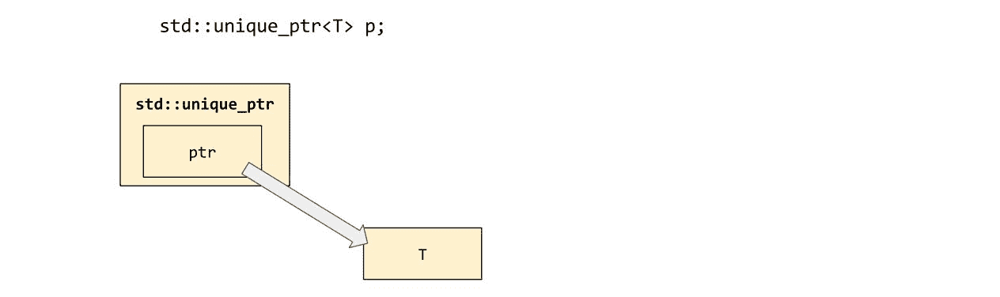
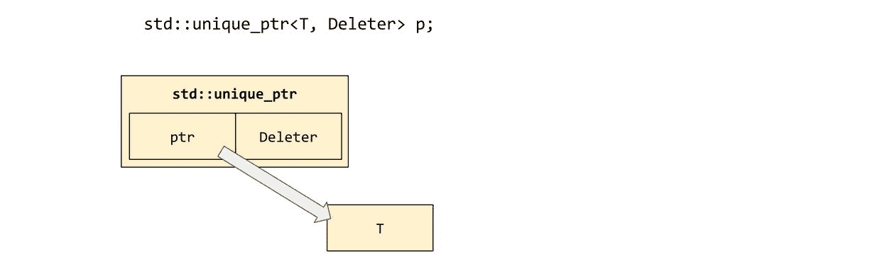
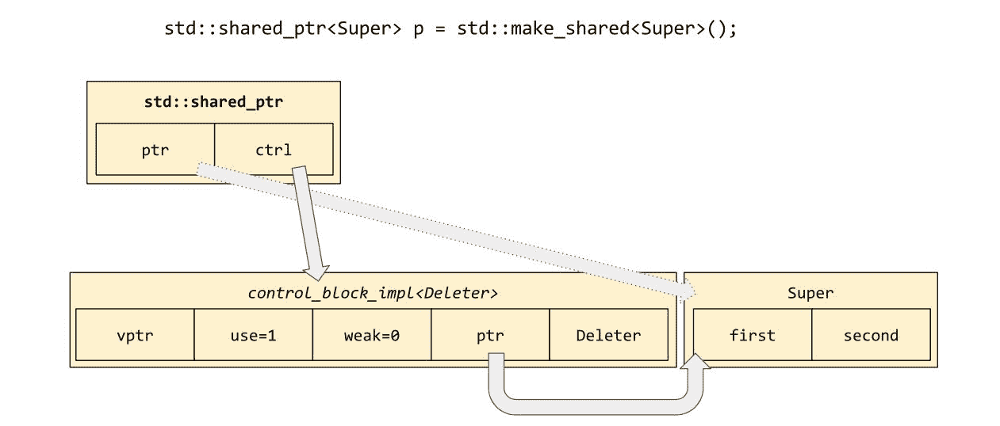
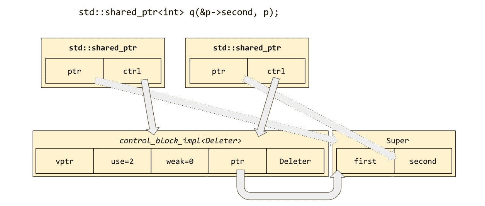
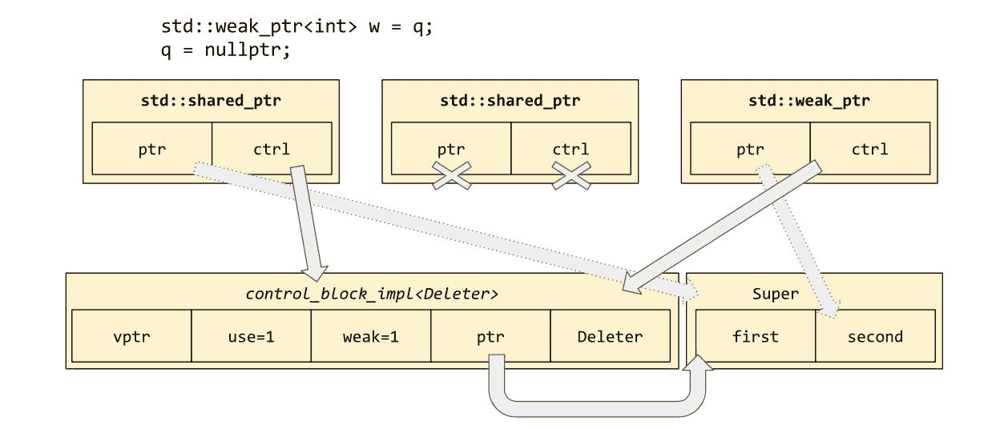
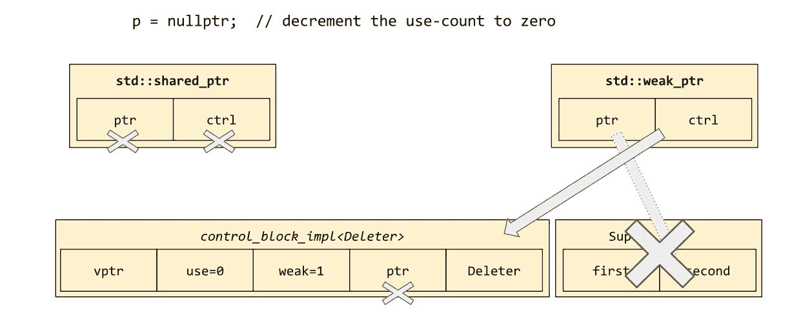

# 智能指针

C++凭借其性能——编写良好的 C++代码比其他任何东西都要快——几乎可以说是定义性的，因为 C++给了程序员几乎完全控制最终由编译器生成的代码。

低级、高性能代码的一个经典特性是使用*原始指针*（`Foo*`）。然而，原始指针伴随着许多陷阱，例如内存泄漏和悬垂指针。C++11 库的“智能指针”类型可以帮助你在几乎不花费任何代价的情况下避免这些陷阱。

在本章中，我们将学习以下内容：

+   “智能指针”的定义以及如何编写你自己的

+   `std::unique_ptr<T>`在防止所有类型的资源泄漏（不仅仅是内存泄漏）中的有用性

+   `std::shared_ptr<T>`的实现方式及其对内存使用的含义

+   奇怪重复模板模式（Curiously Recurring Template Pattern）的意义和用途

# 智能指针的起源

原始指针在 C 语言中有许多用途：

+   作为对调用方拥有的对象的一种便宜的非复制视图

+   作为被调用方修改调用方拥有的对象的一种方式

+   作为指针/长度对的一半，用于数组

+   作为可选参数（一个有效的指针*或*空指针）

+   作为管理堆内存的一种方式

在 C++中，我们有原生引用（`const Foo&`和`Foo&`）来处理前两点；此外，移动语义使得调用方在大多数情况下通过值传递复杂数据给被调用方变得非常便宜，从而完全避免了别名问题。在 C++17 中，我们可以使用`std::string_view`来解决一些第一点和第三点的问题。我们已经在第五章，“词汇类型”中看到，传递一个`optional<T>`——或者可能使用一个`optional<reference_wrapper<T>>`来变得复杂——足以处理第四点。

本章将关注第五点。

在 C 语言中，堆分配带来了一系列问题，并且所有这些问题（以及更多！）在 2011 年之前的 C++中都得到了应用。然而，从 C++11 开始，几乎所有这些问题都消失了。让我们列举一下：

+   **内存泄漏**：你可能在堆上分配了一块内存或一个对象，但意外地忘记编写释放它的代码。

+   **内存泄漏**：你可能已经编写了那段代码，但由于早期返回或抛出异常，代码从未运行，内存仍然未被释放！

+   **使用后释放**：你复制了一个指向堆上对象的指针，然后通过原始指针释放了该对象。复制指针的持有者没有意识到他们的指针已经不再有效。

+   **通过指针算术导致的堆损坏**：你在堆上以地址 *A* 分配了一个数组。拥有一个指向数组的原始指针会诱使你进行指针算术，最终你意外地释放了指向地址 *A*+*k* 的指针。当 *k*=0（正如墨菲定律确保的那样，在测试中）时没有问题；当 *k*=1 时，你会损坏你的堆并导致崩溃。

前两个问题由于堆分配在语义上允许失败--`malloc` 可以返回空，`operator new` 可以抛出 `std::bad_alloc`--而加剧，这意味着如果你正在编写预 C++11 代码来分配内存，你可能会编写大量的清理代码来处理分配失败。（在 C++中，无论你是否意识到，你都在“编写”这些代码，因为由于异常处理而产生的控制流路径是存在的，即使你没有有意识地思考它们。）所有这些的结果是，在 C++中管理堆分配的内存是 *困难的*。

除非你使用智能指针！

# 智能指针永远不会忘记

“智能指针”类型的概念（不要与“花哨指针”类型混淆，我们将在第八章（part0129.html#3R0OI0-2fdac365b8984feebddfbb9250eaf20d）*分配器*中介绍）是它是一个类--通常是类模板--它在语法上表现得就像一个指针，但其特殊成员函数（构造、析构和复制/移动）有额外的簿记来确保某些不变性。例如，我们可能确保以下内容：

+   指针的析构函数也会释放其指向的对象--有助于解决内存泄漏问题

+   可能指针不能被复制--有助于解决使用后释放

+   或者指针 *可以*被复制，但它知道存在多少个副本，并且只有在最后一个指向它的指针被销毁后才会释放指向的对象

+   或者指针可以被复制，你可以释放指向的对象，但如果你这样做，指向它的所有其他指针都会神奇地变为空

+   或者指针没有内置的 `operator+`--有助于

    解决由于指针算术引起的损坏

+   或者你可能允许以算术方式调整指针的值，但算术“指向哪个对象”的管理与“要释放哪个对象”的标识是分开的

标准智能指针类型是 `std::unique_ptr<T>`, `std::shared_ptr<T>`, 以及（虽然不是一个真正的指针类型，但我们将它们放在一起）`std::weak_ptr<T>`。在本章中，我们将介绍这三种类型，以及一种可能对你有用的非标准智能指针，它可能在未来的 C++标准中成为标准智能指针类型！

# 使用 std::unique_ptr<T> 自动管理内存

智能指针类型的根本属性很简单：它应该支持 `operator*`，并且它应该重载特殊成员函数以保持其类的不变性，无论这些是什么。

`std::unique_ptr<T>` 支持与 `T*` 相同的接口，但具有类不变性，即一旦构造了一个指向给定堆分配对象的 `unique_ptr`，当调用析构函数 `unique_ptr` 时，该对象 *将会* 被释放。让我们编写一些支持该 `T*` 接口的代码：

```cpp
    template<typename T>
    class unique_ptr {
      T *m_ptr = nullptr;
    public:
      constexpr unique_ptr() noexcept = default;
      constexpr unique_ptr(T *p) noexcept : m_ptr(p) {}

      T *get() const noexcept { return m_ptr; }
      operator bool() const noexcept { return bool(get()); }
      T& operator*() const noexcept { return *get(); }
      T* operator->() const noexcept { return get(); }
```

如果我们在这里停止——只提供了从 `T*` 构造指针对象的方法以及再次获取指针的方法——我们将得到本章末尾讨论的 `observer_ptr<T>`。但我们会继续前进。我们将添加 `release` 和 `reset` 方法：

```cpp
      void reset(T *p = nullptr) noexcept {
        T *old_p = std::exchange(m_ptr, p);
        delete old_p;
      }

      T *release() noexcept {
        return std::exchange(m_ptr, nullptr);
      }
```

`p.release()` 就像 `p.get()`，但除了返回原始原始指针的副本外，它还会将 `p` 的内容置为空（当然，不会释放原始指针，因为我们的调用者可能想要拥有它）。

`p.reset(q)` *确实* 释放了 `p` 的当前内容，然后将原始指针 `q` 放在其位置。

注意，我们已经用标准算法 `std::exchange` 实现了这两个成员函数，我们在 第三章 “迭代器对算法” 中没有介绍过。它有点像是返回值的 `std::swap`：传入一个新值，得到旧值。

最后，使用这两个基本操作，我们可以实现 `std::unique_ptr<T>` 的特殊成员函数，以保持我们的不变性——再次强调，这是：一旦原始指针被 `unique_ptr` 对象获取，只要 `unique_ptr` 对象具有相同的值，它就会保持有效，当不再是这样时——当 `unique_ptr` 调整以指向其他地方或被销毁时——原始指针将被正确释放。以下是特殊成员函数：

```cpp
      unique_ptr(unique_ptr&& rhs) noexcept {
        this->reset(rhs.release());
      }

      unique_ptr& operator=(unique_ptr&& rhs) noexcept {
        reset(rhs.release());
        return *this;
      }

      ~unique_ptr() {
        reset();
      }
    };
```

在内存中，我们的 `std::unique_ptr<T>` 将看起来像这样：



我们还需要一个额外的辅助函数，以确保我们永远不用手动接触原始指针：

```cpp
    template<typename T, typename... Args>
    unique_ptr<T> make_unique(Args&&... args)
    {
      return unique_ptr<T>(new T(std::forward<Args>(args)...));
    }
```

在我们的工具箱中有 `unique_ptr` 后，我们可以替换旧式代码，如下所示：

```cpp
    struct Widget {
      virtual ~Widget();
    };
    struct WidgetImpl : Widget {
      WidgetImpl(int size);
    };
    struct WidgetHolder {
      void take_ownership_of(Widget *) noexcept;
    };
    void use(WidgetHolder&);

    void test() {
      Widget *w = new WidgetImpl(30);
      WidgetHolder *wh;
      try {
        wh = new WidgetHolder();
      } catch (...) {
        delete w;
        throw;
      }
      wh->take_ownership_of(w);
      try {
        use(*wh);
      } catch (...) {
        delete wh;
        throw;
      }
      delete wh;
    }
```

它可以用现代 C++17 代码替换，如下所示：

```cpp
    void test() {
      auto w = std::make_unique<WidgetImpl>(30);
      auto wh = std::make_unique<WidgetHolder>();
      wh->take_ownership_of(w.release());
      use(*wh);
    }
```

注意，`unique_ptr<T>` 是 **RAII** 的另一个应用——在这种情况下，非常直接。尽管“有趣”的操作（底层原始指针的释放）仍然发生在销毁（`unique_ptr`）期间，但你想要充分利用 `unique_ptr` 的唯一方法是在你 *分配* 资源时，也 *初始化* 一个 `unique_ptr` 来管理它。上一节中展示的 `std::make_unique<T>()` 函数（以及 C++14 中引入标准库）是现代 C++ 中安全内存管理的关键。

虽然 *可能* 在不使用 `make_unique` 的情况下使用 `unique_ptr`，但你不应这样做：

```cpp
    std::unique_ptr<Widget> bad(new WidgetImpl(30));
    bad.reset(new WidgetImpl(40));

    std::unique_ptr<Widget> good = std::make_unique<WidgetImpl>(30);
    good = std::make_unique<WidgetImpl>(40);
```

# 为什么 C++ 没有 finally 关键字

再次考虑上一节“现代”代码示例中的这段代码：

```cpp
    try {
      use(*wh);
    } catch (...) {
      delete wh;
      throw;
    }
    delete wh;
```

在其他语言，如 Java 和 Python 中，这些语义可能更紧凑地使用 `finally` 关键字来表示：

```cpp
    try {
      use(*wh);
    } finally {
      delete wh;
    }
```

C++没有`finally`关键字，也没有迹象表明它将进入这个语言。这仅仅是由于 C++与其他语言之间的哲学差异：C++的哲学是，如果你关心*强制某些不变性*——例如“指针必须在块的末尾释放，无论我们如何到达那里”——那么你不应该编写*显式代码*，因为这样总有可能写错，然后你会遇到错误。

如果你有一些*不变性*想要强制执行，那么强制执行它的正确地方是在*类型系统*中，使用构造函数、析构函数和其他特殊成员函数——RAII 的工具。然后，你可以确保*任何可能的*使用你的新类型都保留了其不变性——例如“当不再由该类型对象持有时，应释放底层指针”——当你编写业务逻辑时，你不需要编写任何显式的内容；代码看起来简单，而且总是——可证明地——具有正确的行为。

所以，如果你发现自己编写的代码看起来像前面的例子，或者如果你发现自己希望能直接写`finally`，那就停下来想想：“我应该为这个使用`unique_ptr`吗？”或者“我应该为这个编写一个 RAII 类类型吗？”

# 自定义删除回调

说到自定义 RAII 类型，你可能想知道是否可以使用`std::unique_ptr`与自定义的删除回调一起使用：例如，你可能会想将底层指针传递给`free()`而不是`delete`。是的，你可以！

`std::unique_ptr<T,D>`有一个第二个模板类型参数：一个*删除回调类型*。参数`D`默认为`std::default_delete<T>`，它只是调用`operator delete`，但你可以传递任何你想要的类型——通常是具有重载`operator()`的用户定义类类型：

```cpp
    struct fcloser {
      void operator()(FILE *fp) const {
        fclose(fp);
      }

      static auto open(const char *name, const char *mode) {
        return std::unique_ptr<FILE, fcloser>(fopen(name, mode));
      }
    };

    void use(FILE *);

    void test() {
      auto f = fcloser::open("test.txt", "r");
      use(f.get());
      // f will be closed even if use() throws
    }
```

顺便提一下，注意`std::unique_ptr`的析构函数被精心编写，以确保它永远不会用空指针调用你的回调。这在前面的例子中是绝对关键的，因为`fclose(NULL)`是一个特殊情况，意味着“关闭当前进程中的所有打开的文件句柄”——这绝对不是你想要的！

注意到`std::make_unique<T>()`只接受一个模板类型参数；没有`std::make_unique<T,D>()`。但避免用手直接触摸原始指针的规则仍然是一个好规则；这就是为什么我们前面的例子将`fopen`和`unique_ptr`构造封装在一个小的可重用辅助函数`fcloser::open`中，而不是将`fopen`的调用内联到`test`的作用域中。

你的自定义删除器的空间将在`std::unique_ptr<T,D>`对象本身的作用域中分配，这意味着如果`D`有任何成员数据，`sizeof(unique_ptr<T,D>)`可能大于`sizeof(unique_ptr<T>)`：



# 使用 std::unique_ptr<T[]>管理数组

另一个`delete p`不是释放原始指针适当方式的情况是，如果`p`是指向数组第一个元素的指针；在这种情况下，应该使用`delete [] p`。幸运的是，从 C++14 开始，存在`std::unique_ptr<T[]>`，在这种情况下它会做正确的事情（由于`std::default_delete<T[]>`也存在并且做正确的事情，即调用`operator delete[]`）。

对于数组类型，确实存在`std::make_unique`的重载，但请注意——它为其参数赋予了不同的含义！`std::make_unique<T[]>(n)`本质上调用`new T[n]()`，其中末尾的括号表示它将初始化所有元素；也就是说，它将为原始类型清零。在极少数情况下，如果你不希望这种行为，你必须自己调用`new`，并将返回值包裹在`std::unique_ptr<T[]>`中，最好使用我们在上一节示例中使用的辅助函数（在那里我们使用了`fcloser::open`）。

# 使用 std::shared_ptr<T>进行引用计数

完全解决了内存泄漏的问题后，我们现在着手解决使用后释放（use-after-free）错误的问题。这里需要解决的基本问题是关于给定资源或内存块的所有权不明确——或者说更确切地说是`共享所有权`。这个内存块可能在不同时间被多个人查看，可能来自不同的数据结构或来自不同的线程，我们想要确保所有这些利益相关者都参与决定何时释放它。底层内存块的所有权应该是*共享的*。

为了实现这一点，标准提供了`std::shared_ptr<T>`。它的接口看起来与`std::unique_ptr<T>`非常相似；所有差异都隐藏在底层，在特殊成员函数的实现中。

`std::shared_ptr<T>`提供了一种内存管理方法，通常被称为*引用计数*。每个由`shared_ptr`管理的对象都会记录系统中对其的引用数量——也就是说，有多少利益相关者现在关心它——一旦这个数字降到零，对象就知道是时候清理自己了。当然，实际上并不是“对象”在清理自己；知道如何计数引用和清理事物的实体是一个小的包装器，或称为“控制块”，每次你将对象的所有权转移到`shared_ptr`时，都会在堆上创建它。控制块由库无形地处理，但如果我们查看其在内存中的布局，它可能看起来像这样：



正如 `unique_ptr` 有 `make_unique` 一样，标准库为 `shared_ptr` 提供了 `make_shared`，这样你永远不需要用手去触碰原始指针。使用 `std::make_shared<T>(args)` 分配共享对象的另一个优点是，将所有权转移到 `shared_ptr` 需要为控制块分配额外的内存。当你调用 `make_shared` 时，库被允许分配一个足够大的内存块，足以容纳控制块和你的 `T` 对象，在一个分配中完成。（这在前面的图中通过 `control_block_impl` 和 `Super` 的矩形物理位置得到了说明。）

复制 `shared_ptr` 会增加其相关控制块的使用计数；销毁 `shared_ptr` 会减少其使用计数。将 `shared_ptr` 的值赋给另一个值会减少旧值的使用计数（如果有的话），并增加新值的使用计数。以下是一些玩转 `shared_ptr` 的例子：

```cpp
    std::shared_ptr<X> pa, pb, pc;

    pa = std::make_shared<X>();
    // use-count always starts at 1

    pb = pa;
    // make a copy of the pointer; use-count is now 2

    pc = std::move(pa);
    assert(pa == nullptr);
    // moving the pointer keeps the use-count at 2

    pb = nullptr;
    // decrement the use-count back to 1
    assert(pc.use_count() == 1);
```

下面的图示说明了 `shared_ptr` 的一个有趣且偶尔有用的特性：两个 `shared_ptr` 实例可以引用同一个控制块，但指向由该控制块管理的不同内存块：



在前面的图中使用的构造函数，它也用于 `get_second()` 函数中，通常被称为 `shared_ptr` 的“别名构造函数”。它接受任何类型的现有非空 `shared_ptr` 对象，其控制块将由新构造的对象共享。在下面的代码示例中，直到“访问 `Super::second`”的消息之后，才会打印出“销毁 `Super`”的消息：

```cpp
    struct Super {
      int first, second;
      Super(int a, int b) : first(a), second(b) {}
      ~Super() { puts("destroying Super"); }
    };

    auto get_second() {
      auto p = std::make_shared<Super>(4, 2);
      return std::shared_ptr<int>(p, &p->second);
    }

    void test() {
      std::shared_ptr<int> q = get_second();
      puts("accessing Super::second");
      assert(*q == 2);
    }
```

正如你所见，一旦所有权被转移到 `shared_ptr` 系统中，记住如何释放管理资源的责任就完全落在控制块上。你的代码不需要处理 `shared_ptr<T>`，仅仅因为底层管理对象恰好是类型 `T`。

# 不要双重管理！

虽然 `shared_ptr<T>` 有潜力从你的指针代码中消除讨厌的双重释放错误，但遗憾的是，对于缺乏经验的程序员来说，仅仅通过过度使用接受原始指针参数的构造函数，就使用 `shared_ptr` 编写相同的错误是非常常见的。以下是一个例子：

```cpp
    std::shared_ptr<X> pa, pb, pc;

    pa = std::make_shared<X>();
      // use-count always starts at 1

    pb = pa;
      // make a copy of the pointer; use-count is now 2

    pc = std::shared_ptr<X>(pb.get()); // WRONG!
      // give the same pointer to shared_ptr again,
      // which tells shared_ptr to manage it -- twice!
    assert(pb.use_count() == 2);
    assert(pc.use_count() == 1);

    pc = nullptr;
      // pc's use-count drops to zero and shared_ptr
      // calls "delete" on the X object

    *pb; // accessing the freed object yields undefined behavior
```

记住，你的目标应该是永远不要用手去触碰原始指针！这段代码出错的地方就是它第一次调用 `pb.get()` 从 `shared_ptr` 中获取原始指针的时候。

在这里调用别名构造函数是正确的，`pc = std::shared_ptr<X>(pb, pb.get())`，但这会产生与简单赋值`pc = pb`相同的效果。因此，我们可以提出另一条通用规则：如果你在代码中必须显式使用`shared_ptr`这个词，那么你正在做一些非同寻常的事情——也许还有危险。*不*在代码中命名`shared_ptr`，你仍然可以分配和管理堆对象（使用`std::make_shared`），并通过创建和销毁指针副本来操作托管对象的使用计数（使用`auto`声明变量，按需使用）。这条规则肯定不适用的情况是，当你有时需要声明一个类型为`shared_ptr<T>`的类数据成员时；你通常不能不写出类型的名称来做到这一点！

# 使用`weak_ptr`持有可空句柄

你可能已经注意到了之前的图中，控制块中标记为“弱计数”的未解释数据成员。现在是时候解释它是什么了。

有时——这种情况很少见，但有时——我们使用`shared_ptr`来管理共享对象的所有权，并且我们希望保留一个对象的指针，而不实际上表达对该对象的所有权。当然，我们可以使用原始指针、引用或`observer_ptr<T>`来表示“非拥有引用”，但危险在于，实际拥有引用对象的拥有者可能会决定释放它，然后当我们尝试取消引用我们的非拥有指针时，我们会访问一个已释放的对象并得到未定义的行为。以下代码示例中的`DangerousWatcher`说明了这种危险行为：

```cpp
    struct DangerousWatcher {
      int *m_ptr = nullptr;

      void watch(const std::shared_ptr<int>& p) {
        m_ptr = p.get();
      }
      int current_value() const {
        // By now, *m_ptr might have been deallocated!
        return *m_ptr;
      }
    };
```

我们也可以使用`shared_ptr`来表示“引用”的概念，但当然这会给我们一个拥有引用，使我们更像是一个`Participant`而不是一个`Watcher`：

```cpp
    struct NotReallyAWatcher {
      std::shared_ptr<int> m_ptr;

      void watch(const std::shared_ptr<int>& p) {
        m_ptr = p;
      }
      int current_value() const {
        // Now *m_ptr cannot ever be deallocated; our
        // mere existence is keeping *m_ptr alive!
        return *m_ptr;
      }
    };
```

我们真正想要的是一个非拥有引用，但它仍然对管理内存的`shared_ptr`系统有所了解，并且能够查询控制块以确定引用的对象是否仍然存在。但当我们发现对象存在并尝试访问它时，它可能已经被其他线程释放了！因此，我们需要的基本操作是“如果存在，原子地获取引用对象的拥有引用（`shared_ptr`），否则指示失败。”也就是说，我们不想一个*非拥有引用*；我们想要的是一个*可以在将来某个日期兑换为拥有引用的票据*。

标准库在名称`std::weak_ptr<T>`下提供了这个“`shared_ptr`的票据”。（它被称为“弱”以区别于`shared_ptr`的“强”拥有引用。）以下是如何使用`weak_ptr`解决我们的`Watcher`问题的示例：

```cpp
    struct CorrectWatcher {
      std::weak_ptr<int> m_ptr;

      void watch(const std::shared_ptr<int>& p) {
        m_ptr = std::weak_ptr<int>(p);
      }
      int current_value() const {
        // Now we can safely ask whether *m_ptr has been
        // deallocated or not.
        if (auto p = m_ptr.lock()) {
            return *p;
        } else {
          throw "It has no value; it's been deallocated!";
        }
      }
    };
```

你需要知道的关于 `weak_ptr` 的唯一两个操作是，你可以从 `shared_ptr<T>` 构造一个 `weak_ptr<T>`（通过调用构造函数，如 `watch()` 函数中所示），并且你可以通过调用 `wptr.lock()` 尝试从 `weak_ptr<T>` 构造一个 `shared_ptr<T>`。如果 `weak_ptr` 已过期，你会得到一个空的 `shared_ptr`。

此外，还有一个成员函数 `wptr.expired()`，它可以告诉你相关的 `weak_ptr` 是否已经过期；但请注意，它基本上是无用的，因为即使它现在返回 `false`，它也可能在几微秒后返回 `true`。

下面的图表通过从 `q` 创建 `weak_ptr` 并然后将其 `shared_ptr` 置为空来继续前一个图表开始的故事：



复制一个 `weak_ptr` 会增加与引用对象的控制块关联的弱引用计数，而销毁一个 `weak_ptr` 会减少弱引用计数。当使用计数达到零时，系统知道可以安全地重新分配受控对象；但控制块本身将不会重新分配，直到弱引用计数达到零，这时我们知道没有更多的 `weak_ptr` 对象指向这个控制块：



你可能已经注意到 `shared_ptr` 在其 `Deleter` 上使用了与我们在第五章[第 26I9K0-2fdac365b8984feebddfbb9250eaf20d]节中提到的 `std::any` 和 `std::function` 上下文中的相同技巧——它使用了 *类型擦除*。而且，就像 `std::any` 和 `std::function` 一样，`std::shared_ptr` 提供了一个“去钓鱼”函数——`std::get_deleter<Deleter>(p)`——来检索原始的删除对象。这个信息在你的工作中将完全无用；我提到它只是为了强调类型擦除在现代 C++ 中的重要性。甚至 `shared_ptr`，其表面目的与擦除类型无关，也在其功能的一个小角落中依赖于类型擦除。

# 使用 `std::enable_shared_from_this` 来谈论自己

我们还应该讨论 `shared_ptr` 生态系统中的最后一个部分。我们已经提到了通过创建多个控制块来“双重管理”指针的危险。因此，我们可能需要一个方法来询问，给定一个堆分配对象的指针，现在究竟是谁在管理它。

这个特性的最常见用例是在面向对象编程中，其中方法 `A::foo()` 想要调用某个外部函数 `bar()`，而 `bar()` 需要一个指向 `A` 对象的指针。如果我们不担心生命周期管理，这会很简单；`A::foo()` 会简单地调用 `bar(this)`。但假设我们的 `A` 正在被 `shared_ptr` 管理，假设 `bar()` 很可能将 `this` 指针的副本存储在其内部——也许我们正在注册一个稍后调用的回调，或者也许我们正在创建一个将在 `A::foo()` 完成并返回调用者时并发运行的线程。因此，我们需要某种方法在 `bar()` 运行期间保持 `A` 的存活。

显然，`bar()` 应该接受一个类型为 `std::shared_ptr<A>` 的参数；这将保持我们的 `A` 对象存活。但在 `A::foo()` 中，我们从哪里获得那个 `shared_ptr` 呢？我们可以给 `A` 一个类型为 `std::shared_ptr<A>` 的成员变量，但这样 `A` 就会保持*自己*的存活——它永远不会死亡！这显然不是我们想要的！

一个初步的解决方案是，`A` 应该保留一个指向自己的类型为 `std::weak_ptr<A>` 的成员变量，并在调用 `bar` 时使用 `bar(this->m_wptr.lock())`。这确实有一些语法开销，而且不清楚指针 `m_wptr` 应该如何初始化。因此，C++ 将这个想法直接构建到了标准库中！

```cpp
    template<class T>
    class enable_shared_from_this {
      weak_ptr<T> m_weak;
    public:
      enable_shared_from_this(const enable_shared_from_this&) {}
      enable_shared_from_this& operator=(const enable_shared_from_this&) {}
      shared_ptr<T> shared_from_this() const {
        return shared_ptr<T>(m_weak);
      }
    };
```

`std::enable_shared_from_this<A>` 类持有我们的类型为 `std::weak_ptr<A>` 的成员变量，并以 `x.shared_from_this()` 的名称公开“获取指向自己的 `shared_ptr`”操作。在前面的代码中，有几个有趣的细节需要注意：首先，如果你尝试在一个当前没有被 `shared_ptr` 系统管理的对象上调用 `x.shared_from_this()`，你会得到一个类型为 `std::bad_weak_ptr` 的异常。其次，注意空的拷贝构造函数和拷贝赋值运算符。在这种情况下，空的大括号*不是*与 `=default` 相同！如果我们使用 `=default` 来使拷贝操作默认化，它们将执行成员-wise 拷贝。每次你复制一个受管理的对象时，新对象都会收到原始对象的 `m_weak` 的一个副本；这在这里根本不是我们想要的。C++ 对象的 `enable_shared_from_this` 部分的“身份”与其*内存位置*相关联，因此它（并且不应该）遵循我们通常努力追求的拷贝和值语义规则。

最后一个问题是要回答：成员 `m_weak`（记住它是一个 *私有* 成员；我们使用 `m_weak` 这个名字纯粹是为了说明）最初是如何初始化的？答案是 `shared_ptr` 的构造函数包含一些代码来检测 `T` 是否公开继承自 `enable_shared_from_this<T>`，如果是的话，将通过一些隐藏的后门设置其 `m_weak` 成员。请注意，继承必须是 *公开* 和 *明确的*，因为就 C++ 的规则而言，`shared_ptr` 的构造函数只是一个用户定义的函数；它不能打开你的类来找到其私有基类，或者在不同副本之间进行歧义消除。

这些限制意味着你应该只公开继承自 `enable_shared_from_this`；一旦一个类继承自 `enable_shared_from_this`，你应该只公开继承自 *它*；为了保持简单，你可能只应该在继承层次结构的叶子节点处继承 `enable_shared_from_this`。当然，如果你一开始就没有构建深层继承层次结构，遵循这些规则将会相对容易！

让我们把关于 `enable_shared_from_this` 的所有知识都集中在一个示例中：

```cpp
    struct Widget : std::enable_shared_from_this<Widget> {
      template<class F>
      void call_on_me(const F& f) {
        f(this->shared_from_this());
      }
    };

    void test() {
      auto sa = std::make_shared<Widget>();

      assert(sa.use_count() == 1);
      sa->call_on_me([](auto sb) {
        assert(sb.use_count() == 2);
      });

      Widget w;
      try {
        w.call_on_me([](auto) {});
      } catch (const std::bad_weak_ptr&) {
        puts("Caught!");
      }
    }
```

# Curiously Recurring Template Pattern

你可能已经注意到了，但尤其是在看到前面的代码示例之后，应该很明显，每次你继承自 `enable_shared_from_this` 时，*你的类* 的名称总是出现在其基类模板参数列表中！这种“`X` 继承自 `A<X>`”的模式被称为 **Curiously Recurring Template Pattern**，或简称 **CRTP**。当基类的一些方面依赖于其派生类时，这种情况很常见。例如，在我们的情况下，派生类的名称被纳入 `shared_from_this` 方法的返回类型中。

CRTP 另一个常见的应用场景是，当派生类的一些 *行为* 被纳入基类提供的行为中时。例如，使用 CRTP，我们可以编写一个基类模板，为任何实现 `operator+=` 和复制构造的派生类提供一个返回值的 `operator+`。注意所需的 `static_cast` 从 `addable<Derived>` 到 `Derived`，这样我们调用的是 `Derived` 的复制构造函数，而不是基类 `addable<Derived>` 的复制构造函数：

```cpp
    template<class Derived>
    class addable {
    public:
      auto operator+(const Derived& rhs) const {
        Derived lhs = static_cast<const Derived&>(*this);
        lhs += rhs;
        return lhs;
      }
    };
```

事实上，这几乎就是 Boost 运算符库中 `boost::addable` 提供的服务；只不过 `boost::addable` 使用所谓的“Barton-Nackman 技巧”使其 `operator+` 成为一个非成员的友元函数，而不是成员函数：

```cpp
    template<class Derived>
    class addable {
    public:
      friend auto operator+(Derived lhs, const Derived& rhs) {
        lhs += rhs;
        return lhs;
      }
    };
```

即使你从未在你的代码库中使用 `enable_shared_from_this`，你也应该了解 Curiously Recurring Template Pattern，并且能够在需要将派生类行为“注入”到基类方法时从你的工具箱中取出它。

# 最后的警告

`shared_ptr`、`weak_ptr` 和 `enable_shared_from_this` 的迷你生态系统是现代 C++ 中最酷的部分之一；它可以为你的代码提供垃圾回收语言的安全性，同时保留 C++ 始终具有的速度和确定性销毁特性。然而，请注意不要滥用 `shared_ptr`！大多数 C++ 代码根本不应该使用 `shared_ptr`，因为你不应该共享堆分配对象的拥有权。你的首选应该始终是避免堆分配（通过使用值语义）；其次，你应该确保每个堆分配的对象都有一个唯一的所有者（通过使用 `std::unique_ptr<T>`）；只有在两者都真的不可能的情况下，才考虑使用共享拥有权和 `std::shared_ptr<T>`。

# 使用 `observer_ptr<T>` 表示非特殊化

我们现在已经看到了两种或三种不同的智能指针类型（这取决于你是否将 `weak_ptr` 作为独立的指针类型，或者更像是 `shared_ptr` 的入场券）。这些类型中的每一个都携带一些关于生命周期管理的有用源级信息。例如，仅从这两个 C++ 函数的函数签名中，我们能说些什么关于它们的语义？

```cpp
    void remusnoc(std::unique_ptr<Widget> p);

    std::unique_ptr<Widget> recudorp();
```

我们看到 `remusnoc` 通过值接收一个 `unique_ptr`，这意味着控制对象的拥有权被转移到了 `remusnoc`。当我们调用这个函数时，我们必须拥有一个 `Widget` 的唯一拥有权，并且在调用这个函数之后，我们将无法再访问那个 `Widget`。我们不知道 `remusnoc` 是否会销毁 `Widget`、保留它，或者将其附加到其他对象或线程上；但它明确不再是我们的关注点。`remusnoc` 函数是 widgets 的消费者。

更微妙的是，我们还可以说，当我们调用 `remusnoc` 时，我们必须拥有一个使用 `new` 分配的 `Widget` 的唯一拥有权，并且可以安全地 `delete` 它！

反之：当我调用 `recudorp` 时，我知道我们接收到的任何 `Widget` 都将唯一归我所有。它不是指向其他人 `Widget` 的引用；它也不是指向某些静态数据的指针。它明确是一个由我独自拥有的堆分配的 `Widget`。即使我处理返回值的第一件事是在它上面调用 `.release()` 并将原始指针放入某个“前现代”结构中，我也可以确信这样做是安全的，因为我肯定是返回值的唯一所有者。

我们能说些什么关于这个 C++ 函数的语义？

```cpp
    void suougibma(Widget *p);
```

这是不明确的。也许这个函数将接管传递的指针的所有权；也许它不会。我们可以从`suougibma`的文档中（我们希望如此）或从我们代码库中的某些风格约定（例如，“一个原始指针永远不会表示所有权”，这是一个合理的约定）中得知，但我们不能仅从签名中得知。另一种表达这种区别的方法是说，`unique_ptr<T>`是表示所有权转移的词汇类型，而`T*`根本不是任何事物的词汇类型；它是 C++中无意义词汇或罗夏墨迹的等价物，因为在任何两个人之间，对它的含义都不一定有共识。

因此，如果你在代码库中发现自己传递了大量的非拥有指针，你可能需要一个*词汇类型*来表示非拥有指针的概念。（你的第一步应该是尽可能传递引用而不是指针，但假设你已经用尽了这条路。）这样的词汇类型确实存在，尽管它目前还没有包含在 C++标准库中：由于沃尔特·布朗，它被称为“世界上最愚蠢的智能指针”，它仅仅是一个围绕原始非拥有指针的类形状包装器：

```cpp
    template<typename T>
    class observer_ptr {
      T *m_ptr = nullptr;
      public:
      constexpr observer_ptr() noexcept = default;
      constexpr observer_ptr(T *p) noexcept : m_ptr(p) {}

      T *get() const noexcept { return m_ptr; }
      operator bool() const noexcept { return bool(get()); }
      T& operator*() const noexcept { return *get(); }
      T* operator->() const noexcept { return get(); }
    };

    void revresbo(observer_ptr<Widget> p);
```

在我们的工具箱中有`observer_ptr`后，变得非常清楚，`revresbo`仅仅*观察*其参数；它绝对没有接管它的所有权。实际上，我们可以假设它甚至没有保留传入指针的副本，因为该指针的有效性将取决于受控对象的生命周期，而`revresbo`明确表示它对该对象的生命周期没有任何利益。如果它想要对受控对象的生命周期有利益，它将通过从其调用者那里请求`unique_ptr`或`shared_ptr`来明确请求那个利益。通过请求`observer_ptr`，`revresbo`“退出”了整个所有权辩论。

正如我说的，`observer_ptr`不是 C++17 标准的一部分。阻止它进入标准的主要反对意见之一是其糟糕的名称（因为它与“观察者模式”没有任何关系）。还有许多知识渊博的人会说，`T*`应该是“非拥有指针”的词汇类型，并且所有使用`T*`进行所有权转移的旧代码都应该重写或至少用诸如`owner<T*>`之类的结构重新注释。这是目前 C++核心指南编辑，包括 C++发明者 Bjarne Stroustrup 推荐的方法。尽管如此，有一点是确定的：*永远不要使用原始指针进行所有权转移！*

# 摘要

在本章中，我们了解了一些关于智能指针的知识。

`std::unique_ptr<T>`是表示所有权的词汇类型，也是表示所有权转移的词汇类型；优先考虑它而不是原始的`T*`。考虑在所有权明确*不是*被转移的情况下，或者原始`T*`可能对读者来说模糊不清的情况下使用`observer_ptr`。

`std::shared_ptr<T>` 是处理共享所有权的优秀（且标准）工具，其中许多不同的实体都是单个受控对象生命周期的利益相关者。`std::weak_ptr<T>` 是一个“`shared_ptr`的入场券”；它提供`.lock()`而不是`operator*`。如果你的类需要获取自身`shared_ptr`的能力，则从`std::enable_shared_from_this<T>`继承。请记住公开继承，并且一般来说，仅在继承图的最底层进行继承。并且不要在绝对不要求共享所有权的情况下过度使用这些功能！

千万不要手动触摸原始指针：使用`make_unique`和`make_shared`来创建堆分配的对象，并一次性管理它们。并且每当你需要将派生类行为“注入”到由你的基类提供的函数中时，记得使用“奇特重复的模板模式”。

在下一章中，我们将讨论另一种类型的“共享”：在多线程编程中出现的共享。
