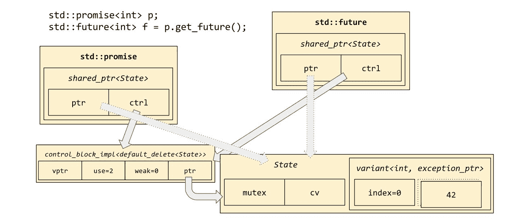

# 并发

在上一章中，我们讨论了`std::shared_ptr<T>`如何实现引用计数内存管理，以便对象的生存期可以由可能彼此不了解的利益相关者共同控制——例如，利益相关者可能生活在不同的线程中。在 C++11 之前，这会立即成为一个障碍：如果一个利益相关者在减少引用计数的同时，另一个线程中的利益相关者正在减少引用计数的进程中，那么我们不是有*数据竞争*和因此是未定义的行为吗？

在 C++11 之前，答案通常是“是的。”（事实上，C++11 之前的 C++没有“线程”的标准概念，所以另一个合理的答案可能是这个问题本身就不相关。）然而，自 2011 年以来，C++有一个标准内存模型，它考虑了诸如“线程”和“线程安全”等概念，因此这个问题是有意义的，答案是明确地“不！”对`std::shared_ptr`的引用计数的访问保证不会相互竞争；在本章中，我们将向您展示如何使用标准库提供的工具实现类似的线程安全构造。

在本章中，我们将涵盖以下主题：

+   `volatile T`和`std::atomic<T>`之间的区别

+   `std::mutex`、`std::lock_guard<M>`和`std::unique_lock<M>`

+   `std::recursive_mutex`和`std::shared_mutex`

+   `std::condition_variable`和`std::condition_variable_any`

+   `std::promise<T>`和`std::future<T>`

+   `std::thread`和`std::async`

+   `std::async`的危险以及如何构建线程池来替代它

# 不稳定的**问题**

如果你过去十年一直生活在山洞里——或者如果你来自旧式的 C 语言——你可能会问：“`volatile`关键字有什么问题？当我想要确保某些访问真正触达内存时，我会确保它是`volatile`的。”

`volatile`的官方语义是，volatile 访问将严格根据抽象机的规则进行评估，这意味着，或多或少，编译器不允许重新排序它们或将多个访问组合成一个。例如，编译器不能假设在这两次加载之间`x`的值保持不变；它必须生成执行两个加载的机器代码，一个在存储到`y`之前，一个在之后：

```cpp
    volatile int& x = memory_mapped_register_x();
    volatile bool& y = memory_mapped_register_y();
    int stack;

    stack = x; // load
    y = true; // store 
    stack += x; // load
```

如果`x`不是`volatile`，那么编译器完全有权像这样重新排序代码：

```cpp
    stack = 2*x; // load
    y = true; // store
```

如果`x`不是`volatile`，编译器可以这样做（因为写入`bool`变量`y`不可能影响`int`变量`x`的值）。然而，由于`x`是`volatile`，这种重新排序优化是不允许的。

```cpp
x is a view onto some hardware buffer, and the store to memory location y is the signal for the hardware to load the next four bytes of data into the x register. It might help to view the situation as an operator overloading, but in hardware. And if "operator overloading, but in hardware" sounds crazy to you, then you probably have zero reason to use volatile in your programs!
```

那就是`volatile`的作用。但为什么我们不能使用`volatile`来使我们的程序线程安全呢？本质上，`volatile`的问题在于它太老了。自从我们从 C 语言分离出来，C++就包含了这个关键字，而它在 1989 年的原始标准中就已经存在了。当时，对多线程的关注非常少，编译器也更简单，这意味着一些可能存在问题的优化还没有被想到。到了 1990 年代末和 2000 年代初，当 C++缺乏线程感知的内存模型开始成为一个真正的问题时，已经太晚了，无法让`volatile`完成线程安全内存访问所需的全部工作，因为每个供应商都已经实现了`volatile`并详细记录了它所做的一切。在那个时刻改变规则将会破坏很多人的代码——而且会被破坏的代码将是低级硬件接口代码，这种代码你真的不希望出现错误。

这里有一些我们需要确保的保证类型，以便获得线程安全的内存访问：

```cpp
    // Global variables:
    int64_t x = 0;
    bool y = false;

    void thread_A() {
      x = 0x42'00000042;
      y = true;
    }

    void thread_B() {
      if (x) {
        assert(x == 0x42'00000042);
      }
    }

    void thread_C() {
      if (y) {
        assert(x == 0x42'00000042);
      }
    }
```

假设`thread_A`、`thread_B`和`thread_C`都在不同的线程中并发运行。这段代码可能会出错吗？嗯，`thread_B`正在检查`x`始终保持正好是零或`0x42'00000042`。然而，在 32 位计算机上，可能无法做出这样的保证；编译器可能不得不将`thread_A`中的赋值实现为两个赋值：“将`x`的高半部分设置为 42；将`x`的低半部分设置为 42。”如果`thread_B`中的测试恰好（错误地）在正确的时间运行，它最终可能会看到`x`为`0x42'00000000`。将`x`声明为`volatile`并不能解决这个问题；事实上，什么都不能，因为我们的 32 位硬件根本不支持这个操作！如果编译器能够检测到我们正在尝试进行原子 64 位赋值，并且如果它知道我们的目标是不可实现的，就会给出编译时错误。换句话说，`volatile`访问并不保证是原子的。在实践中，它们通常是原子的——非`volatile`访问也是如此，但它们并不保证是原子的，有时你必须下降到机器代码级别才能确定你是否得到了预期的代码。我们希望有一种方法可以保证访问将是原子的（或者如果这是不可能的，我们希望编译器报错）。

现在考虑`thread_C`。它在检查，如果`y`的值是可见的为真，那么`x`的值必须已经设置为它的最终值。换句话说，它正在检查对`x`的写入“发生在”对`y`的写入之前。从`thread_A`的角度来看，这绝对是正确的，至少如果`x`和`y`都是易失性的，因为我们已经看到编译器不允许重新排序易失性访问。然而，从`thread_C`的角度来看，这并不一定正确！如果`thread_C`在不同的物理 CPU 上运行，有自己的数据缓存，那么它可能会在不同的时间意识到`x`和`y`的更新值，这取决于它何时刷新各自的缓存行。我们希望有一种方式来说明，当编译器从`y`加载时，它必须确保其整个缓存是最新的--它永远不会读取一个“过时”的`x`值。然而，在某些处理器架构上，这需要特殊的指令或额外的内存屏障逻辑。编译器不会为“旧式”的易失性访问生成这些指令，因为当`volatile`被发明时，线程并不是一个关注点；并且编译器不能被*强制*生成这些指令，因为这会不必要地减慢速度，甚至可能破坏所有使用旧式`volatile`进行旧式意义访问的现有底层代码。因此，我们面临的问题是，尽管从它们自己的线程的角度来看，易失性访问是按顺序发生的，但它们可能从另一个线程的角度来看以不同的顺序出现。换句话说，易失性访问不能保证是*顺序一致的*。我们希望有一种方式来保证访问将与其他访问顺序一致。

解决我们两个问题的方案在 2011 年被添加到 C++中。这个方案是`std::atomic`。

# 使用`std::atomic<T>`进行线程安全的访问

在 C++11 及以后版本中，`<atomic>`头文件包含了类模板`std::atomic<T>`的定义。你可以从两种不同的方式来考虑`std::atomic`：你可以将其视为一个类模板，就像`std::vector`一样，它重载了操作符，这些操作符恰好实现了线程安全的操作；或者你可以将其视为一个神奇的内建类型家族，其名称恰好包含尖括号。后一种思考方式实际上非常有用，因为它正确地表明`std::atomic`部分是内建到编译器中的，因此编译器通常会为原子操作生成最优代码。后一种还表明了`atomic`与`vector`的不同之处：在`std::vector<T>`中，`T`可以是几乎任何你想要的东西。在`std::atomic<T>`中，`T`可以是任何你想要的东西，但在实践中，使用不属于一小组*原子友好*类型的任何`T`都是不明智的。关于这个话题的更多内容，稍后讨论。

原子友好的类型是整数类型（至少，那些不超过机器寄存器大小的类型）和指针类型。一般来说，在常见的平台上，你会发现对这些类型的 `std::atomic` 对象的操作会正好满足你的需求：

```cpp
    // Global variables:
    std::atomic<int64_t> x = 0;
    std::atomic<bool> y = false;

    void thread_A() {
      x = 0x42'00000042; // atomic!
      y = true; // atomic!
    }

    void thread_B() {
      if (x) {
        // The assignment to x happens atomically.
        assert(x == 0x42'00000042);
      }
    }

    void thread_C() {
      if (y) {
        // The assignment to x "happens before" the
        // assignment to y, even from another thread's
        // point of view.
        assert(x == 0x42'00000042);
      }
    }
```

`std::atomic<T>` 重载了赋值运算符以执行原子、线程安全的赋值；同样地，它的 `++`、`--`、`+=` 和 `-=` 运算符；对于整数类型，还包括 `&=`、`|=` 和 `^=` 运算符。

重要的是要记住 `std::atomic<T>` 类型（在概念上生活在内存“那里”）和类型 `T` 的短暂值（在概念上生活在“这里”，手头附近；例如，在 CPU 寄存器中）之间的区别。因此，例如，`std::atomic<int>` 没有复制赋值运算符：

```cpp
    std::atomic<int> a, b;
    a = b; // DOES NOT COMPILE!
```

没有复制赋值运算符（也没有移动赋值运算符），因为这没有明确的含义：程序员的意思是计算机应该将 `b` 的值加载到一个寄存器中，然后将该寄存器的值存储到 `a` 中吗？这听起来像是两个不同的原子操作，而不是一个操作！或者程序员可能意味着计算机应该在单个原子操作中将 `b` 的值复制到 `a` 中；但这涉及到在单个原子操作中触及两个不同的内存位置，而这超出了大多数计算机硬件的能力。因此，C++ 要求你明确写出你的意图：从对象 `b` 到寄存器（在 C++ 中由非原子栈变量表示）的单个原子加载，然后是到对象 `a` 的单个原子存储：

```cpp
    int shortlived = b; // atomic load
    a = shortlived; // atomic store
```

`std::atomic<T>` 提供了 `.load()` 和 `.store(v)` 成员函数，以方便那些喜欢在每一步都看到他们所做事情的程序员。使用它们是可选的：

```cpp
    int shortlived = b.load(); // atomic load
    a.store(shortlived); // atomic store
```

事实上，通过使用这些成员函数，你*可以*将赋值操作写在一行代码中，例如 `b.store(a.load())`；但我强烈建议你不要这样做。在一行代码中写上两个函数调用*并不意味着*它们会在时间上“更接近”，当然也不意味着它们会“原子性地”发生（正如我们刚才看到的，在大多数硬件上这是不可能的），但将两个函数调用写在一行代码中可能会让你误以为这些调用是“同时”发生的。

当你一次只做一件事时，处理线程代码已经足够困难了。如果你开始变得聪明，同时做几件事，在一行代码中，错误的可能性会急剧增加。坚持每行源代码一个原子操作；你会发现这会澄清你的思考过程，并且意外地使你的代码更容易阅读。

# 原子性地执行复杂操作

你可能已经注意到，操作符 `*=`, `/=`, `%=`, `<<=`, 和 `>>=` 在上一节中省略了重载操作符的列表。这些操作符被 `std::atomic<int>` 和所有其他整型原子类型删除，因为它们被认为在任何实际硬件上难以高效实现。然而，即使在 `std::atomic<int>` 中包含的操作中，大多数也需要一个稍微昂贵的实现技巧。

假设我们的硬件没有“原子乘法”指令，但我们仍然想实现 `operator*=`。我们该如何做？诀窍是使用一种原始的原子操作，称为“比较并交换”，或者在 C++ 中称为“比较交换”。

```cpp
    std::atomic<int> a = 6;

    a *= 9; // This isn't allowed.

    // But this is:

    int expected, desired;
    do {
      expected = a.load();
      desired = expected * 9;
    } while (!a.compare_exchange_weak(expected, desired));

    // At the end of this loop, a's value will
    // have been "atomically" multiplied by 9.
```

`a.compare_exchange_weak(expected, desired)` 的含义是处理器应该查看 `a`；并且 *如果* 它的当前值是 `expected`，则将其值设置为 `desired`；否则不设置。如果 `a` 被设置为 `desired`，则函数调用返回 `true`，否则返回 `false`。

但它还有另一个功能。注意，每次通过前面的循环时，我们都会将 `a` 的值加载到 `expected` 中；但比较交换函数也会加载 `a` 的值以便与 `expected` 进行比较。当我们第二次通过循环时，我们更希望不要再次加载 `a`；我们更希望直接将 `expected` 设置为比较交换函数看到的值。幸运的是，`a.compare_exchange_weak(expected, desired)` 预见了我们的这个愿望，并且如果它将返回 `false`，则会预先更新 `expected` 为它看到的值。也就是说，每次我们使用 `compare_exchange_weak` 时，我们必须提供一个可修改的 `expected` 值，因为函数是通过引用来获取它的。

因此，我们实际上应该这样编写我们的示例：

```cpp
    int expected = a.load();
    while (!a.compare_exchange_weak(expected, expected * 9)) {
      // continue looping
    }
```

`desired` 变量实际上并不是必需的，除非它有助于澄清代码。

`std::atomic` 的一个不为人知的秘密是，大多数的复合赋值操作实际上都是通过类似于这样的比较交换循环来实现的。在 RISC 处理器上，这几乎是始终如此。在 x86 处理器上，这种情况只在你想要使用操作符的返回值时才会发生，例如 `x = (a += b)`。

当原子变量 `a` 不是被其他线程频繁修改时，进行比较交换循环是没有害处的。但当 `a` 被频繁修改——当它高度 *竞争* 时——我们可能会看到循环多次尝试才能成功。在绝对病态的情况下，我们甚至可能会看到循环线程的饥饿；它可能只是无限循环，直到竞争减弱。然而，请注意，每次我们的比较交换返回 `false` 并再次循环时，都是因为内存中 `a` 的值已经改变；这意味着其他线程必须已经取得了一点点进展。比较交换循环本身永远不会导致程序进入一个没有人取得进展的状态（技术上称为“活锁”）。

前一段文字可能听起来比它应该的更可怕。通常没有必要担心这种病态行为，因为它只在高度竞争的情况下才会出现，即使那样也不会真正造成任何严重问题。你应该从这个部分学到的真正要点是如何使用比较交换循环在 `atomic<T>` 对象上实现复杂的、非内置的“原子”操作。只需记住 `a.compare_exchange_weak(expected, desired)` 参数的顺序，通过记住它对 `a` 做了什么：“如果 `a` 有预期的值，就给它想要的值。”

# 大原子操作

编译器会识别并生成针对 `std::atomic<T>` 的最佳代码，当 `T` 是整数类型（包括 `bool`）或 `T` 是指针类型，如 `void *` 时。但如果 `T` 是更大的类型，例如 `int[100]` 呢？在这种情况下，编译器通常会调用 C++ 运行时库中的一个例程，该例程将在一个 *互斥锁* 下执行赋值操作。（我们稍后会讨论互斥锁。）由于赋值操作是在一个不知道如何复制任意用户定义类型的库中执行的，C++17 标准将 `std::atomic<T>` 限制为只能与那些可以 *简单复制* 的类型一起工作，也就是说，它们可以使用 `memcpy` 安全地复制。因此，如果你想要 `std::atomic<std::string>`，那很遗憾——你必须自己编写它。

使用大（简单可复制）类型与 `std::atomic` 时的另一个问题是，相关的 C++ 运行时例程通常位于 C++ 标准库的其他地方。在某些平台上，你可能需要在链接器命令行中添加 `-latomic`。但这只在你实际上使用大类型与 `std::atomic` 一起使用时才是问题。因为你实际上不应该这样做，所以通常没有必要担心。

现在我们来看看如何编写那个原子字符串类！

# 与 std::mutex 交替使用

假设我们想要编写一个类类型，其行为基本上类似于如果存在`std::atomic<std::string>`会有的行为。也就是说，我们希望它支持原子、线程安全的加载和存储，这样如果两个线程正在并发访问`std::string`，则任何一个都不会观察到它处于“半分配”状态，就像我们在上一节“`volatile`的问题”中的代码示例中观察到的“半分配”`int64_t`一样。

编写此类最佳方式是使用一个名为 `std::mutex` 的标准库类型。在技术领域，“mutex”这个名字非常常见，以至于如今它基本上就是其自身的代名词，但最初它的名字来源于“*mut*ual *ex*clusion”（互斥）。这是因为互斥锁充当了一种确保一次只允许一个线程进入特定代码段（或一组代码段）的方式——也就是说，确保“线程 A 正在执行此代码”和“线程 B 正在执行此代码”是互斥的可能性。

在这样一个关键段的开始，为了表明我们不希望被任何其他线程打扰，我们会在相关的互斥锁上*加锁*。当我们离开关键段时，我们*释放锁*。库会负责确保没有两个线程可以在同一时间对同一个互斥锁持有锁。具体来说，这意味着如果线程 B 在线程 A 已经持有锁的情况下进入，线程 B 必须*等待*直到线程 A 离开关键段并释放锁。只要线程 A 持有锁，线程 B 的进度就会被*阻塞*；因此，这种现象被称为*等待*或*阻塞*，可以互换使用。

“在互斥锁上加锁”通常简称为“锁定互斥锁”，“释放锁”简称为“解锁互斥锁”。

有时（尽管很少见）测试一个互斥锁是否当前被锁定是有用的。为此目的，`std::mutex`不仅公开了成员函数`.lock()`和`.unlock()`，还公开了成员函数`.try_lock()`，如果它能够获取互斥锁的锁（在这种情况下，互斥锁将被锁定），则返回`true`，如果互斥锁已经被某个线程锁定，则返回`false`。

在某些语言中，例如 Java，每个对象都携带自己的互斥锁；这就是 Java 实现其`synchronized`块的方式。在 C++中，互斥锁是其自己的对象类型；当你想要使用互斥锁来控制代码段时，你需要考虑互斥锁对象的生存期语义。你可以在哪里放置互斥锁，以便只有一个对希望使用它的每个人可见的互斥锁对象？有时，如果只有一个需要保护的关键段，你可以在函数作用域的静态变量中放置互斥锁：

```cpp
    void log(const char *message)
    {
      static std::mutex m;
      m.lock(); // avoid interleaving messages on stdout
      puts(message);
      m.unlock();
    }
```

这里的 `static` 关键字非常重要！如果我们省略了它，那么 `m` 就会是一个普通的栈变量，每个进入 `log` 的线程都会收到 `m` 的一个独特副本。这不会帮助我们实现目标，因为库仅仅确保一次不会有两个线程锁定同一个互斥量对象。如果每个线程都在锁定和解锁它自己的独特互斥量对象，那么库就没有什么可做的；没有任何互斥量正在被*竞争*。

如果我们想要确保两个不同的函数彼此互斥，即在任何给定时间只允许一个线程进入 `log1` 或 `log2`，我们必须将互斥量对象放在两个关键部分都能看到的地方：

```cpp
    static std::mutex m;

    void log1(const char *message) {
      m.lock();
      printf("LOG1: %s\n", message);
      m.unlock();
    }

    void log2(const char *message) {
      m.lock();
      printf("LOG2: %s\n", message);
      m.unlock();
    }
```

通常，如果你发现自己需要这样做，你应该尝试通过创建一个类类型并使互斥量对象成为该类的成员变量来消除全局变量，如下所示：

```cpp
    struct Logger {
      std::mutex m_mtx;

      void log1(const char *message) {
        m_mtx.lock();
        printf("LOG1: %s\n", message);
        m_mtx.unlock();
      }

      void log2(const char *message) {
        m_mtx.lock();
        printf("LOG2: %s\n", message);
        m_mtx.unlock();
      }
    };
```

现在由一个 `Logger` 打印的消息可能会与另一个 `Logger` 打印的消息交织在一起，但同时对同一个 `Logger` 对象的并发访问将会锁定在同一个 `m_mtx` 上，这意味着它们将互相阻塞并很好地轮流进入关键函数 `log1` 和 `log2`，一次一个。

# “正确地获取锁”

回想一下 第六章，*智能指针*，C 和“旧式”C++ 编写的程序的一个主要问题是存在指针错误--内存泄漏、双重释放和堆损坏--以及我们从“新式”C++ 程序中消除这些错误的方法是通过使用 RAII 类型，如 `std::unique_ptr<T>`。使用原始互斥量的多线程编程具有与使用原始指针进行堆编程的故障模式类似：

+   **锁泄漏**：你可能会锁定特定的互斥量，并意外忘记编写释放它的代码。

+   **锁泄漏**：你可能已经编写了那段代码，但由于早期返回或抛出异常，代码从未运行，互斥量仍然被锁定！

+   **锁外使用**：因为原始互斥量只是另一个变量，它与它“保护”的变量在物理上是分离的。你可能会在没有先获取锁的情况下意外访问这些变量之一。

+   **死锁**：假设线程 A 锁定了互斥量 1，而线程 B 锁定了互斥量 2。然后，线程 A 尝试获取互斥量 2 的锁（并阻塞）；而在线程 A 仍然阻塞的同时，线程 B 尝试获取互斥量 1 的锁（并阻塞）。现在两个线程都处于阻塞状态，并且将永远不会再次取得进展。

这并不是并发陷阱的详尽列表；例如，我们已经在与 `std::atomic<T>` 相关的上下文中简要提到了“活锁”。对于并发错误及其避免方法的彻底处理，请参阅关于多线程或并发编程的书籍。

C++ 标准库有一些工具可以帮助我们从多线程程序中消除这些错误。与内存管理的情况不同，在这种情况下，标准库的解决方案并不能保证 100%修复你的问题--多线程编程比单线程编程要复杂得多，实际上，如果你能避免的话，一个好的经验法则是*不要做*。但是，如果你必须进行并发编程，标准库可以在一定程度上帮助你。

正如 第六章 中所提到的 *智能指针*，我们可以通过谨慎使用 RAII 来消除与“锁泄漏”相关的错误。你可能已经注意到，我一直在一致地使用“在互斥锁上获取锁”这个短语，而不是“锁定互斥锁”；现在我们将看到为什么。在短语“锁定互斥锁”中，“锁定”是一个*动词*；这种说法与 C++ 代码 `mtx.lock()` 完全对应。但在短语“在互斥锁上获取锁”中，“锁定”是一个*名词*。让我们发明一个类型，将“锁定”的概念具体化；也就是说，将其变成一个名词（一个 RAII 类）而不是动词（一个非 RAII 类的方法）：

```cpp
    template<typename M>
    class unique_lock {
      M *m_mtx = nullptr;
      bool m_locked = false;
    public:
      constexpr unique_lock() noexcept = default;
      constexpr unique_lock(M *p) noexcept : m_mtx(p) {}

      M *mutex() const noexcept { return m_mtx; }
      bool owns_lock() const noexcept { return m_locked; }

      void lock() { m_mtx->lock(); m_locked = true; }
      void unlock() { m_mtx->unlock(); m_locked = false; }

      unique_lock(unique_lock&& rhs) noexcept {
        m_mtx = std::exchange(rhs.m_mtx, nullptr);
        m_locked = std::exchange(rhs.m_locked, false);
      }

      unique_lock& operator=(unique_lock&& rhs) {
        if (m_locked) {
            unlock();
        }
        m_mtx = std::exchange(rhs.m_mtx, nullptr);
        m_locked = std::exchange(rhs.m_locked, false);
        return *this;
      }

      ~unique_lock() {
        if (m_locked) {
            unlock();
        }
      }
    };
```

如其名所示，`std::unique_lock<M>` 是一个“唯一所有权”RAII 类，在精神上类似于 `std::unique_ptr<T>`。如果你坚持使用名词 `unique_ptr` 而不是动词 `new` 和 `delete`，你就永远不会忘记释放指针；同样，如果你坚持使用名词 `unique_lock` 而不是动词 `lock` 和 `unlock`，你就永远不会忘记释放互斥锁。

`std::unique_lock<M>` 确实公开了成员函数 `.lock()` 和 `.unlock()`，但通常你不需要使用这些。如果需要在代码块中间获取或释放锁，远离 `unique_lock` 对象的自然销毁点，它们可能是有用的。我们将在下一节中看到一个接受已锁定 `unique_lock` 作为参数的函数，该函数在功能的一部分中解锁并重新锁定。

注意，因为 `unique_lock` 是可移动的，它必须有一个“null”或“empty”状态，就像 `unique_ptr` 一样。在大多数情况下，你不需要移动你的锁；你只需在某个作用域的开始无条件地获取锁，并在作用域的末尾无条件地释放它。对于这种用例，有 `std::lock_guard<M>`。`lock_guard` 与 `unique_lock` 很相似，但它不可移动，也没有 `.lock()` 和 `.unlock()` 成员函数。因此，它不需要携带 `m_locked` 成员，并且它的析构函数可以在没有任何额外测试的情况下无条件地解锁它所保护的互斥锁。

在这两种情况（`unique_lock`和`lock_guard`）中，类模板是根据被锁定的互斥锁的类型进行参数化的。（我们将在下一分钟查看更多种类的互斥锁，但几乎总是，你将想要使用`std::mutex`。）C++17 有一个新的语言特性叫做*类模板参数推导*，在大多数情况下，它允许你省略模板参数：例如，简单地写`std::unique_lock`而不是`std::unique_lock<std::mutex>`。这是我个人会推荐依赖类模板参数推导的极少数情况之一，因为写出参数类型`std::mutex`对读者来说真的增加了很少的信息。

让我们看看`std::lock_guard`的一些示例，包括带有和不带有类模板参数推导的情况：

```cpp
    struct Lockbox {
      std::mutex m_mtx;
      int m_value = 0;

      void locked_increment() {
        std::lock_guard<std::mutex> lk(m_mtx);
        m_value += 1;
      }

      void locked_decrement() {
        std::lock_guard lk(m_mtx); // C++17 only
        m_value -= 1;
      }
    };
```

在我们能够看到`std::unique_lock`的类似实际示例之前，我们首先需要解释为什么最初要使用`std::unique_lock`。

# 总是将与受控数据关联的互斥锁

考虑以下线程安全的`StreamingAverage`类的草图。这里有一个 bug；你能找到它吗？

```cpp
    class StreamingAverage {
      double m_sum = 0;
      int m_count = 0;
      double m_last_average = 0;
      std::mutex m_mtx;
    public:
      // Called from the single producer thread
      void add_value(double x) {
        std::lock_guard lk(m_mtx);
        m_sum += x;
        m_count += 1; // A
      }

      // Called from the single consumer thread
      double get_current_average() {
        std::lock_guard lk(m_mtx);
        m_last_average = m_sum / m_count; // B
        return m_last_average;
      }

      // Called from the single consumer thread
      double get_last_average() const {
        return m_last_average; // C
      }

      // Called from the single consumer thread
      double get_current_count() const {
        return m_count; // D
      }
    };
```

bug 是行`A`，在生产者线程中写入`this->m_count`，与行`D`在消费者线程中读取`this->m_count`发生竞争。行`A`在写入之前正确地锁定`this->m_mtx`，但行`D`未能采取类似的锁定，这意味着它将愉快地闯入并尝试读取`m_count`，即使行`A`正在写入它。

行`B`和`C`表面上看起来很相似，这可能是 bug 最初悄悄进入的原因。行`C`不需要加锁；为什么行`D`必须加锁呢？好吧，行`C`只被消费者线程调用，而这个线程与在行`B`上写入`m_last_average`的线程是同一个。由于行`B`和`C`只由单个消费者线程执行，它们不能同时执行--至少在程序的其他部分遵守注释的情况下是这样！（让我们假设代码注释是正确的。在实践中，这通常很遗憾地不正确，但为了这个例子，让我们假设它是正确的。）

我们在这里有一个混淆的配方：当接触`m_sum`或`m_count`时需要锁定`m_mtx`，但当接触`m_last_average`时则不需要。如果这个类变得更加复杂，它甚至可能涉及多个互斥锁（尽管在那个阶段，它显然违反了单一职责原则，并且可能从重构为更小的组件中受益）。因此，在处理互斥锁时，一个非常好的实践是将互斥锁放置在与它“保护”的变量最紧密的关系中。一种方法是通过仔细命名来实现这一点：

```cpp
    class StreamingAverage {
      double m_sum = 0;
      int m_count = 0;
      double m_last_average = 0;
      std::mutex m_sum_count_mtx;

      // ...
    };
```

一个更好的方法是使用嵌套结构定义：

```cpp
    class StreamingAverage {
      struct {
        double sum = 0;
        int count = 0;
        std::mutex mtx;
      } m_guarded_sc;
      double m_last_average = 0;

      // ...
    };
```

上述希望是，当程序员被迫编写`this->m_guarded_sc.sum`时，它会提醒他确保他已经获取了`this->m_guarded_sc.mtx`的锁。我们可以使用 GNU 的“匿名结构成员”扩展来避免在我们的代码中重复输入`m_guarded_sc`；但这样会违背这种方法的目的，即确保每个访问数据的地方都必须使用“guarded”这个词，提醒程序员在`this->m_guarded_sc.mtx`上获取那个锁。

一种更加牢不可破但相对不灵活的方法是将互斥锁放在一个类中，该类仅在互斥锁被锁定时允许访问其私有成员，通过返回一个 RAII 句柄。返回句柄的类看起来大致如下：

```cpp
    template<class Data>
    class Guarded {
      std::mutex m_mtx;
      Data m_data;

      class Handle {
        std::unique_lock<std::mutex> m_lk;
        Data *m_ptr;
      public:
        Handle(std::unique_lock<std::mutex> lk, Data *p) :
          m_lk(std::move(lk)), m_ptr(p) {}
        auto operator->() const { return m_ptr; }
      };
    public:
      Handle lock() {
        std::unique_lock lk(m_mtx);
        return Handle{std::move(lk), &m_data};
      }
    };
```

我们的`StreamingAverage`类可以这样使用它：

```cpp
    class StreamingAverage {
      struct Guts {
        double m_sum = 0;
        int m_count = 0;
      };
      Guarded<Guts> m_sc;
      double m_last_average = 0;

      // ...

      double get_current_average() {
        auto h = m_sc.lock();
        m_last_average = h->m_sum / h->m_count;
        return m_last_average;
      }
    };
impossible for any member function of StreamingAverage to access m_sum without owning a lock on m_mtx; access to the guarded m_sum is possible only via the RAII Handle type.
```

这种模式包含在 Facebook 的 Folly 库中，名为`folly::Synchronized<T>`，Ansel Sermersheim 和 Barbara Geller 的“libGuarded”模板库中还有更多基于它的变体。

注意到在`Handle`类中使用了`std::unique_lock<std::mutex>`！我们在这里使用`unique_lock`而不是`lock_guard`，因为我们希望有传递这个锁、从函数返回它等功能，因此它需要是可移动的。这就是你会在工具箱里找到`unique_lock`的主要原因。

请注意，这种模式并不能解决所有与锁相关的错误——它只解决了最简单的“忘记锁定互斥锁”的情况——并且可能会鼓励导致更多其他类型并发错误的编程模式。例如，考虑以下对`StreamingAverage::get_current_average`的重新编写：

```cpp
    double get_sum() {
      return m_sc.lock()->m_sum; 
    }

    int get_count() {
      return m_sc.lock()->m_count;
    }

    double get_current_average() {
      return get_sum() / get_count();
    }
```

由于有两个`m_sc.lock()`调用，`m_sum`的读取和`m_count`的读取之间存在一个间隙。如果生产线程在这个间隙期间调用`add_value`，我们将计算出一个错误的平均值（比实际低一个`1 / m_count`的因子）。如果我们尝试通过在整个计算周围获取锁来“修复”这个错误，我们会发现自己陷入了死锁：

```cpp
    double get_sum() {
      return m_sc.lock()->m_sum; // LOCK 2
    }

    int get_count() {
      return m_sc.lock()->m_count;
    }

    double get_current_average() {
      auto h = m_sc.lock(); // LOCK 1
      return get_sum() / get_count();
    }
```

标记为`LOCK 1`的行会导致互斥锁被锁定；然后，在标记为`LOCK 2`的行上，我们尝试再次锁定互斥锁。关于互斥锁的一般规则是，如果你试图锁定一个已经锁定的互斥锁，你必须*阻塞*并等待它解锁。所以我们的线程会阻塞并等待互斥锁解锁——但这是不可能发生的，因为锁是由我们自己的线程持有的！

这个问题（自死锁）通常应该通过仔细的编程来解决——也就是说，你应该尽量避免获取你已经持有的锁！但如果以这种方式获取锁不可避免地成为你设计的一部分，那么标准库会支持你，所以让我们来谈谈`recursive_mutex`。

# 特殊用途的互斥锁类型

回想一下，`std::lock_guard<M>`和`std::unique_lock<M>`是根据互斥锁类型参数化的。到目前为止，我们只看到了`std::mutex`。然而，标准库确实包含了一些其他互斥锁类型，在特殊情况下可能很有用。

`std::recursive_mutex` 类似于 `std::mutex`，但它会记住 *哪个* 线程已经锁定了它。如果该特定线程尝试再次锁定它，递归互斥锁将仅增加内部引用计数“我已被锁定的次数”。如果其他线程尝试锁定递归互斥锁，该线程将阻塞，直到原始线程已适当地解锁互斥锁。

`std::timed_mutex` 类似于 `std::mutex`，但它能够感知时间的流逝。它不仅具有常用的 `.try_lock()` 成员函数，还有 `.try_lock_for()` 和 `.try_lock_until()` 成员函数，这些函数与标准 `<chrono>` 库交互。下面是 `try_lock_for` 的一个示例：

```cpp
    std::timed_mutex m;
    std::atomic<bool> ready = false;

    std::thread thread_b([&]() {
      std::lock_guard lk(m);
      puts("Thread B got the lock.");
      ready = true;
      std::this_thread::sleep_for(100ms);
    });

    while (!ready) {
      puts("Thread A is waiting for thread B to launch.");
      std::this_thread::sleep_for(10ms);
    }

    while (!m.try_lock_for(10ms)) {
      puts("Thread A spent 10ms trying to get the lock and failed.");
    }

    puts("Thread A finally got the lock!");
    m.unlock();
```

下面是 `try_lock_until` 的一个示例：

```cpp
    std::timed_mutex m1, m2;
    std::atomic<bool> ready = false;

    std::thread thread_b([&]() {
      std::unique_lock lk1(m1);
      std::unique_lock lk2(m2);
      puts("Thread B got the locks.");
      ready = true;
      std::this_thread::sleep_for(50ms);
      lk1.unlock();
      std::this_thread::sleep_for(50ms);
    });

    while (!ready) {
      std::this_thread::sleep_for(10ms); 
    }

    auto start_time = std::chrono::system_clock::now();
    auto deadline = start_time + 100ms;

    bool got_m1 = m1.try_lock_until(deadline);
    auto elapsed_m1 = std::chrono::system_clock::now() - start_time;

    bool got_m2 = m2.try_lock_until(deadline);
    auto elapsed_m2 = std::chrono::system_clock::now() - start_time;

    if (got_m1) {
      printf("Thread A got the first lock after %dms.\n",
      count_ms(elapsed_m1));
      m1.unlock();
    }
    if (got_m2) {
      printf("Thread A got the second lock after %dms.\n",
      count_ms(elapsed_m2));
      m2.unlock();
    }  
```

顺便提一下，这里使用的 `count_ms` 函数只是一个提取了一些 `<chrono>` 常用模板代码的小型 lambda 表达式：

```cpp
    auto count_ms = [](auto&& d) -> int {
      using namespace std::chrono;
      return duration_cast<milliseconds>(d).count();
    };
```

在上述两个示例中，请注意我们使用 `std::atomic<bool>` 来同步线程 `A` 和 `B` 的方式。我们只需将原子变量初始化为 `false`，然后循环直到它变为 `true`。轮询循环的主体是调用 `std::this_thread::sleep_for`，这足以向编译器暗示原子变量的值可能会改变。务必注意永远不要编写不包含睡眠的轮询循环，因为在这种情况下，编译器有权将所有连续的 `ready` 加载合并为单个加载和一个（必然是无限期的）循环。

`std::recursive_timed_mutex` 就像是将 `recursive_mutex` 和 `timed_mutex` 合并在一起；它提供了 `recursive_mutex` 的“计数”语义，*加上* `timed_mutex` 的 `try_lock_for` 和 `try_lock_until` 方法。

`std::shared_mutex` 的命名可能不太恰当。它实现的行为在大多数并发教科书中被称为 *读写锁*（也称为 *rwlock* 或 *readers-writer lock*）。读写锁或 `shared_mutex` 的定义特征是它可以以两种不同的方式“锁定”。你可以通过调用 `sm.lock()` 来获取一个普通的排他性（“写入”）锁，或者你可以通过调用 `sm.lock_shared()` 来获取一个非排他性（“读取”）锁。许多不同的线程可以同时获取读取锁；但如果 *任何人* 正在读取，那么 *任何人* 都不能写入；如果 *任何人* 正在写入，那么 *任何人* 都不能进行其他操作（既不能读取也不能写入）。这些恰好是定义 C++ 内存模型中“竞态条件”的基本规则：如果有两个线程同时从同一个对象读取，这是可以的，只要没有线程同时写入。`std::shared_mutex` 增加的是安全性：它确保如果有人 *确实* 尝试写入（至少如果他们表现得很好，首先在 `std::shared_mutex` 上获取写入锁），他们将阻塞，直到所有读取者都已退出并且安全写入。

`std::unique_lock<std::shared_mutex>` 是对应于 `std::shared_mutex` 上的独占（“写”）锁的名词。正如你所期望的，标准库也提供了 `std::shared_lock<std::shared_mutex>` 来具体化 `std::shared_mutex` 上的非独占（“读”）锁的概念。

# 升级读写锁

假设你有一个 `shared_mutex` 的读锁（也就是说，你有一个 `std::shared_lock<std::shared_mutex> lk`，使得 `lk.owns_lock()`），并且你想要获取写锁。你能“升级”你的锁吗？

不可以。考虑一下，如果线程 `A` 和 `B` 都持有读锁，并且同时尝试升级到写锁而不先释放它们的读锁会发生什么。它们两个都无法获取写锁，因此它们会相互死锁。

有第三方库试图解决这个问题，例如 `boost::thread::upgrade_lock`，它与 `boost::thread::shared_mutex` 一起工作；但它们超出了本书的范围。标准的解决方案是，如果你持有读锁并想要写锁，你必须释放你的读锁，然后和其他人一样排队等待写锁：

```cpp
    template<class M> 
    std::unique_lock<M> upgrade(std::shared_lock<M> lk)
    {
      lk.unlock();
      // Some other writer might sneak in here.
      return std::unique_lock<M>(*lk.mutex());
    }
```

# 降级读写锁

假设你有一个 `shared_mutex` 的独占写锁，并且你想要获取读锁。你能“降级”你的锁吗？

原则上答案是肯定的，应该可以降级写锁到读锁；但在标准 C++17 中，答案是不了，你不能直接这样做。与升级的情况一样，你可以使用 `boost::thread::shared_mutex`。标准的解决方案是，如果你持有写锁并想要读锁，你必须释放你的写锁，然后和其他人一样排队等待读锁：

```cpp
    template<class M>
    std::shared_lock<M> downgrade(std::unique_lock<M> lk)
    {
      lk.unlock();
      // Some other writer might sneak in here.
      return std::shared_lock<M>(*lk.mutex()); 
    }
```

如这些示例所示，C++17 的 `std::shared_mutex` 目前有些半成品。如果你的架构设计需要读写锁，我强烈建议使用类似 `boost::thread::shared_mutex` 的东西，它“电池组”齐全。

你可能已经注意到，由于在持有读锁的同时可能会有新的读者加入，但不会有新的写者，因此一个潜在的写者线程可能会因为连续的潜在读者流而“饿死”，除非实现者特意提供强有力的“无饿死”保证。`boost::thread::shared_mutex` 提供了这样的保证（至少，它避免了饿死，如果底层操作系统的调度器这样做的话）。`std::shared_mutex` 的标准措辞没有提供这样的保证，尽管任何在实践中允许饿死的实现都会被认为是非常差的。实际上，你会发现你的标准库供应商对 `shared_mutex` 的实现非常接近 Boost 的实现，除了缺少升级/降级功能。

# 等待条件

在标题为“专用互斥锁类型”的部分，我们在一个单独的线程中启动了一个任务，然后需要在继续之前等待某些初始化完成。在那个情况下，我们使用了一个围绕`std::atomic<bool>`的轮询循环。但还有更好的等待方式！

我们 50 毫秒的轮询循环的问题在于它**从未**在睡眠中花费正确的时间。有时我们的线程会醒来，但它等待的条件还没有满足，所以它会再次入睡——这意味着我们第一次没有睡够。有时我们的线程会醒来，看到它等待的条件在过去 50 毫秒中的某个时刻已经满足，但我们不知道具体是多久以前——这意味着我们平均超睡大约 25 毫秒。无论发生什么，我们恰好睡够正确时间的几率几乎为零。

因此，如果我们不想浪费时间，正确的做法是避免轮询循环。标准库提供了一种等待恰好正确时间的方法；它被称为`std::condition_variable`。

给定一个类型为`std::condition_variable`的变量`cv`，我们的线程可以通过调用`cv.wait(lk)`来“等待”`cv`；这将使我们的线程进入睡眠状态。调用`cv.notify_one()`或`cv.notify_all()`会唤醒一个或所有当前正在等待`cv`的线程。然而，这不是唤醒那些线程的唯一方式！可能来自外部的中断（例如 POSIX 信号）可能会在没有任何人调用`notify_one`的情况下将你的线程唤醒。这种现象被称为**虚假唤醒**。防止虚假唤醒的常用方法是醒来时检查你的条件。例如，如果你正在等待某个输入到达缓冲区`b`，那么当你醒来时，你应该检查`b.empty()`，如果它是空的，就回去等待。

根据定义，其他线程将会把数据放入`b`中；因此，当你读取`b.empty()`时，你最好在某种类型的互斥锁下进行。这意味着当你醒来时，你首先会锁定那个互斥锁，当你再次入睡时，你最后会释放对那个互斥锁的锁定。（实际上，你需要原子性地在入睡操作中释放那个互斥锁，这样就没有人可以在你成功入睡之前溜进来，修改`b`并调用`cv.notify_one()`。）这个逻辑链引导我们理解为什么`cv.wait(lk)`需要那个参数`lk`——它是一个`std::unique_lock<std::mutex>`，在入睡时会释放，在醒来时会重新获得！

这里是一个等待某些条件满足的例子。首先是一个简单的但低效的轮询循环，针对一个`std::atomic`变量：

```cpp
    std::atomic<bool> ready = false;

    std::thread thread_b([&]() {
      prep_work();
      ready = true;
      main_work();
    });

    // Wait for thread B to be ready.
    while (!ready) {
      std::this_thread::sleep_for(10ms); 
    }
    // Now thread B has completed its prep work.
```

现在是更受欢迎且更高效的`condition_variable`实现：

```cpp
    bool ready = false; // not atomic!
    std::mutex ready_mutex;
    std::condition_variable cv;

    std::thread thread_b([&]() {
      prep_work();
      {
        std::lock_guard lk(ready_mutex);
        ready = true;
      }
      cv.notify_one();
      main_work();
    });

    // Wait for thread B to be ready.
    {
      std::unique_lock lk(ready_mutex);
      while (!ready) {
        cv.wait(lk);
      }
    }
    // Now thread B has completed its prep work.
```

如果我们正在等待从受读写锁保护的结构中读取（即，一个`std::shared_mutex`），那么我们不想传递一个`std::unique_lock<std::mutex>`；我们希望传递一个`std::shared_lock<std::shared_mutex>`。如果我们提前计划并定义我们的条件变量为`std::condition_variable_any`类型而不是`std::condition_variable`类型，我们可以这样做（但遗憾的是，只有在这种情况下才能做到）。实际上，`std::condition_variable_any`和`std::condition_variable`之间可能没有任何性能差异，这意味着你应该根据你的程序需求来选择它们，或者，如果两者都可以满足需求，那么根据代码的清晰度来选择。一般来说，这意味着节省四个字符并使用`std::condition_variable`。然而，请注意，由于`std::shared_lock`提供的隔离抽象层，在读写锁下等待`cv`的实际代码几乎与在普通互斥锁下等待`cv`的代码相同。以下是读写锁版本的代码：

```cpp
    bool ready = false;
    std::shared_mutex ready_rwlock;
    std::condition_variable_any cv;
    std::thread thread_b([&]() {
      prep_work();
      {
        std::lock_guard lk(ready_rwlock);
        ready = true;
      }
      cv.notify_one();
      main_work();
    });

    // Wait for thread B to be ready.
    {
      std::shared_lock lk(ready_rwlock);
      while (!ready) {
        cv.wait(lk);
      }
    }
    // Now thread B has completed its prep work.
```

这是一段完全正确且尽可能高效的代码。然而，手动操作互斥锁和条件变量几乎和直接操作原始互斥锁或原始指针一样危险。我们可以做得更好！更好的解决方案是我们下一节的主题。

# 关于未来的承诺

如果你之前没有遇到过并发编程主题，那么最后几个部分可能越来越具有挑战性。互斥锁相对容易理解，因为它们模拟了日常生活中熟悉的概念：通过加锁来获取对某些资源的独占访问。读写锁（`shared_mutex`）也不难理解。然而，我们随后在神秘性方面迈出了重大的一步，条件变量很难掌握，部分原因在于它们似乎模拟的不是名词（如“挂锁”），而是一种介词动词短语：“直到……但也要……唤醒。”它们晦涩的名字也没有多大帮助。

现在我们继续我们的并发编程之旅，探讨一个即使你已修过并行编程本科课程可能也感到陌生的主题：*承诺*和*未来*。

在 C++11 中，`std::promise<T>`和`std::future<T>`类型总是成对出现。来自 Go 语言的人可能会把承诺-未来对看作是一种*通道*，即如果一个线程将一个值（类型为`T`）推入这对的“承诺”一侧，那么这个值最终会在“未来”一侧出现（那时通常在另一个线程中）。然而，承诺-未来对也像不稳定的时间隧道：一旦你将一个值推过这个隧道，它就会立即坍塌。

我们可以说，promise-future 对就像一个有方向的、可携带的、一次性的虫洞。它是有方向的，因为您只能将数据推入“promise”端，并通过“future”端检索数据。它是可携带的，因为如果您拥有虫洞的一端，您可以移动该端，甚至在不同线程之间移动它；您不会破坏两端之间的隧道。而且它是一次性的，因为一旦您将一块数据推入“promise”端，您就不能再推入更多。

对于这对的另一个隐喻是由它们的名称所提出的：`std::future<T>`实际上不是类型`T`的值，但在某种意义上它是一个未来的值——它将在未来的某个时刻为您提供访问`T`的权限，但“尚未”。（以这种方式，它也类似于线程安全的`optional<T>`。）同时，`std::promise<T>`对象就像一个未履行的承诺，或者一个 I-O-U。承诺对象的所有者承诺在某个时刻将类型`T`的值放入其中；如果他从未放入值，那么他就“违背了他的承诺”。

通常来说，您首先创建一个`std::promise<T>`，其中`T`是您计划通过它发送的数据类型；然后通过调用`p.get_future()`创建虫洞的“future”端。当您准备好履行承诺时，您调用`p.set_value(v)`。同时，在另一个线程中，当您准备好检索值时，您调用`f.get()`。如果线程在承诺得到履行之前调用`f.get()`，那么该线程将阻塞，直到承诺得到履行且值准备好检索。另一方面，当持有承诺的线程调用`p.set_value(v)`时，如果没有人在等待，那也无所谓；`set_value`只需将值`v`记录在内存中，以便任何人通过`f.get()`请求时都能准备好并等待。

让我们看看`promise`和`future`的实际应用！

```cpp
    std::promise<int> p1, p2;
    std::future<int> f1 = p1.get_future();
    std::future<int> f2 = p2.get_future();

      // If the promise is satisfied first,
      // then f.get() will not block.
    p1.set_value(42);
    assert(f1.get() == 42);

      // If f.get() is called first, then it
      // will block until set_value() is called
      // from some other thread.
    std::thread t([&](){
      std::this_thread::sleep_for(100ms);
      p2.set_value(43);
    });
    auto start_time = std::chrono::system_clock::now();
    assert(f2.get() == 43);
    auto elapsed = std::chrono::system_clock::now() - start_time;
    printf("f2.get() took %dms.\n", count_ms(elapsed));
    t.join();
```

（有关`count_ms`的定义，请参阅上一节，*专用互斥类型*。）

关于标准库的`std::promise`的一个不错的细节是，它为`void`类型有一个特化。`std::future<void>`的想法一开始可能看起来有点愚蠢——如果唯一可以推入虫洞的数据类型是没有值的类型，那么虫洞有什么用？但事实上`future<void>`非常有用，无论我们是否关心接收到的*值*，而是关心是否收到了信号。例如，我们可以使用`std::future<void>`来实现我们“等待线程 B 启动”代码的第三个版本：

```cpp
    std::promise<void> ready_p;
    std::future<void> ready_f = ready_p.get_future();

    std::thread thread_b([&]() {
      prep_work();
      ready_p.set_value();
      main_work();
    });

      // Wait for thread B to be ready.
    ready_f.wait();
      // Now thread B has completed its prep work.
```

将此版本与标题为“等待条件”的章节中的代码示例进行比较。这个版本要干净得多！实际上没有冗余，没有任何样板代码。"信号 B 的就绪"和"等待 B 的就绪"操作都只需要一行代码。因此，从语法清洁度的角度来看，这绝对是单对线程之间进行信号的最佳方式。至于从单个线程向一组线程发送信号的第四种方式，请参阅本章标题为“识别单个线程和当前线程”的小节。

尽管 `std::future` 有其代价。这个代价是动态内存分配。你看，`promise` 和 `future` 都需要访问一个共享存储位置，这样当你将 `42` 存储在 `promise` 一侧时，你将能够从 `future` 一侧取出它。（这个共享存储位置还包含了线程间同步所需的互斥锁和条件变量。互斥锁和条件变量并没有从我们的代码中消失；它们只是向下移动了一层抽象层，这样我们就不必担心它们了。）因此，`promise` 和 `future` 都充当了这种共享状态的“句柄”；但它们都是可移动类型，所以它们都不能作为成员持有共享状态。它们需要在堆上分配共享状态，并持有其指针；由于共享状态不应该在两个句柄都被销毁之前释放，我们谈论的是通过类似 `shared_ptr`（见第六章 Chapter 6，*智能指针*）的东西进行共享所有权。从图示上看，`promise` 和 `future` 看起来是这样的：



此图中的共享状态将使用 `operator new` 分配，除非你使用特殊的“分配器感知”版本的构造函数 `std::promise`。要使用你选择的分配器与 `std::promise` 和 `std::future` 一起使用，你应该编写以下代码：

```cpp
    MyAllocator myalloc{};
    std::promise<int> p(std::allocator_arg, myalloc);
    std::future<int> f = p.get_future();
```

`std::allocator_arg` 在 `<memory>` 头文件中定义。有关 `MyAllocator` 的详细信息，请参阅第八章 Chapter 8，*分配器*。

# 将任务打包以供稍后使用

关于前面图表的另一个需要注意的事项是，共享状态不仅仅包含一个`optional<T>`；实际上它包含一个`variant<T, exception_ptr>`（关于`variant`和`optional`，请参阅第五章，*词汇类型*）。这意味着你不仅可以将类型为`T`的数据通过虫洞传递；你还可以传递*异常*。这特别方便且对称，因为它允许`std::future<T>`表示调用具有签名`T()`的函数的所有可能结果。也许它会返回一个`T`；也许它会抛出异常；当然，也许它根本不会返回。同样，调用`f.get()`可能会返回一个`T`；或者抛出异常；或者（如果持有承诺的线程无限循环）可能根本不会返回。为了通过虫洞传递异常，你会使用`p.set_exception(ex)`方法，其中`ex`是`std::exception_ptr`类型的对象，这种对象可能来自 catch 处理程序中的`std::current_exception()`。

让我们拿一个签名为`T()`的函数，并将其封装在类型为`std::future<T>`的未来中：

```cpp
    template<class T>
    class simple_packaged_task {
      std::function<T()> m_func;
      std::promise<T> m_promise;
    public:
      template<class F>
      simple_packaged_task(const F& f) : m_func(f) {}

      auto get_future() { return m_promise.get_future(); }

      void operator()() {
        try {
          T result = m_func();
          m_promise.set_value(result);
        } catch (...) {
          m_promise.set_exception(std::current_exception());
        }
      }
    };
```

这个类在表面上类似于标准库类型`std::packaged_task<R(A...)>`；区别在于标准库类型接受参数，并使用额外的间接层来确保它可以持有甚至只移动的函数类型。回到第五章，*词汇类型*，我们向你展示了`std::function`不能持有只移动函数类型的一些解决方案；幸运的是，当处理`std::packaged_task`时，这些解决方案是不必要的。另一方面，你可能一生中都不需要处理`std::packaged_task`。它主要作为一个例子，展示了如何将承诺、未来和函数组合成用户友好的类类型，同时具有非常简单的接口。考虑一下：上面的`simple_packaged_task`类在`std::function`中使用类型擦除，然后有一个`std::promise`成员，该成员通过`std::shared_ptr`实现，它执行引用计数；那个引用计数的指针指向的共享状态包含一个互斥锁和一个条件变量。这相当多的想法和技术被压缩在一个非常小的体积中！然而，`simple_packaged_task`的接口确实很简单：用某种函数或 lambda 表达式构造它，然后调用`pt.get_future()`以获取一个你可以调用`f.get()`的未来；同时调用`pt()`（可能来自其他线程）以实际执行存储的函数并将结果通过虫洞传递到`f.get()`。

如果存储函数抛出异常，那么`packaged_task`将捕获该异常（在持有承诺的线程中）并将其推入虫洞。然后，无论何时其他线程调用`f.get()`（或者它可能已经调用了，并且现在正阻塞在`f.get()`中），`f.get()`都会将异常抛出到持有未来的线程。换句话说，通过使用承诺和未来，我们实际上可以在线程之间“传送”异常。这种传送的确切机制`std::exception_ptr`，不幸的是超出了本书的范围。如果你在一个使用大量异常的代码库中进行库编程，那么熟悉`std::exception_ptr`绝对是值得的。

# 未来的未来

与`std::shared_mutex`一样，标准库自己的`std::future`版本只是半成品。一个更完整、更有用的`future`版本可能出现在 C++20 中，并且有许多第三方库结合了即将推出的版本的最佳特性。其中最好的库包括`boost::future`和 Facebook 的`folly::Future`。

`std::future`的主要问题是它需要在多步计算中的每一步之后“降落”到线程中。考虑这种对`std::future`的病态使用：

```cpp
    template<class T>
    auto pf() {
      std::promise<T> p;
      std::future<T> f = p.get_future();
      return std::make_pair(std::move(p), std::move(f));
    }

    void test() {
      auto [p1, f1] = pf<Connection>();
      auto [p2, f2] = pf<Data>();
      auto [p3, f3] = pf<Data>();

      auto t1 = std::thread([p1 = std::move(p1)]() mutable {
        Connection conn = slowly_open_connection();
        p1.set_value(conn);
        // DANGER: what if slowly_open_connection throws?
      });
      auto t2 = std::thread([p2 = std::move(p2)]() mutable {
        Data data = slowly_get_data_from_disk();
        p2.set_value(data);
      });
      auto t3 = std::thread(
      [p3 = std::move(p3), f1 = std::move(f1)]() mutable {
        Data data = slowly_get_data_from_connection(f1.get());
        p3.set_value(data);
      });
      bool success = (f2.get() == f3.get());

      assert(success);
    }
```

注意标记为`DANGER`的行：三个线程体中每个都存在相同的错误，即它们在抛出异常时未能捕获并调用`.set_exception()`。解决方案是一个`try...catch`块，就像我们在前一个部分中使用的`simple_packaged_task`一样；但由于每次都要写出来会变得很繁琐，标准库提供了一个整洁的包装函数`std::async()`，它负责创建承诺-未来对并创建一个新的线程。使用`std::async()`，我们有了这样更干净看起来更好的代码：

```cpp
    void test() {
      auto f1 = std::async(slowly_open_connection);
      auto f2 = std::async(slowly_get_data_from_disk);
      auto f3 = std::async([f1 = std::move(f1)]() mutable {
        return slowly_get_data_from_connection(f1.get());
        // No more danger.
      });
      bool success = (f2.get() == f3.get());

      assert(success);
    }
```

然而，这段代码在美学上更干净，但它对你的代码库的性能和健壮性同样糟糕。这是**糟糕**的代码！

每次你在代码中看到`.get()`时，你应该想，“多么浪费上下文切换啊！”每次你看到线程被创建（无论是显式还是通过`async`），你应该想，“操作系统可能耗尽内核线程，我的程序可能从`std::thread`的构造函数开始抛出意外异常的可能性有多大！”我们宁愿不写前面的任何一种代码，而是写一些可能看起来熟悉 JavaScript 程序员的代码：

```cpp
    void test() {
      auto f1 = my::async(slowly_open_connection);
      auto f2 = my::async(slowly_get_data_from_disk);
      auto f3 = f1.then([](Connection conn) {
        return slowly_get_data_from_connection(conn);
      });
      bool success = f2.get() == f3.get();

      assert(success);
    }
```

在这里，除了在最后什么也不做只是等待最终答案时调用 `.get()` 之外，没有其他调用；并且产生的线程数量少了一个。相反，在 `f1` 完成任务之前，我们将其附加到一个“延续”上，这样当 `f1` 完成时，持有承诺的线程可以立即过渡到继续任务（如果 `f1` 的原始任务抛出异常，我们根本不会进入这个延续。库应该提供一个对称的方法，`f1.on_error(continuation)`，来处理异常代码路径）。

类似的东西在 Boost 中已经可用；Facebook 的 Folly 库包含一个特别健壮且功能齐全的实现，甚至比 Boost 的还要好。在我们等待 C++20 改善这种情况的同时，我的建议是，如果你能承担将其集成到你的构建系统中的认知开销，就使用 Folly。`std::future` 的单一优势在于它是标准的；你几乎可以在任何平台上使用它，而无需担心下载、包含路径或许可条款。

# 说到线程...

在整个这一章中，我们一直在使用“线程”这个词，而没有明确地定义我们所说的“线程”是什么；你可能已经注意到，我们许多多线程代码示例都使用了 `std::thread` 类类型和 `std::this_thread` 命名空间，而没有太多解释。我们一直专注于*如何*在不同执行线程之间同步行为，但到目前为止，我们一直忽略了*谁*在执行！

换个说法：当执行到达表达式 `mtx.lock()`，其中 `mtx` 是一个已锁定的互斥量时，`std::mutex` 的语义表明当前执行线程应该阻塞并等待。当这个线程阻塞时，发生了什么？我们的 C++ 程序仍然“负责”正在发生的事情，但显然*这个特定的 C++ 代码*不再执行；那么*谁*在执行？答案是：另一个线程。我们通过使用标准库类 `std::thread` 来指定其他线程的存在以及我们希望它们执行的操作，该类定义在 `<thread>` 头文件中。

要创建一个新的执行线程，只需构造一个 `std::thread` 类型的对象，并将单个参数传递给构造函数：一个 lambda 或函数，它告诉你你希望在新的线程中运行的代码。技术上，你可以传递多个参数；所有第一个参数之后的参数都将经过 `reference_wrapper` 衰减（如第五章[26I9K0-2fdac365b8984feebddfbb9250eaf20d]中所述，*词汇类型*），然后作为*它的*函数参数传递。从 C++11 开始，lambdas 使得 `thread` 构造函数的额外参数变得不必要，甚至可能出错；我建议避免使用它们。）

新线程将立即开始运行；如果你想让它“启动时暂停”，你必须自己使用“等待条件”部分中展示的同步技巧之一或“识别单个线程和当前线程”中展示的替代技巧来构建该功能。

新线程将执行它所提供的代码，当它到达你提供的 lambda 表达式或函数的末尾时，它将“变为可连接”。这个想法与 `std::future` 在“变为就绪”时发生的情况非常相似：线程已经完成了其计算，并准备好将计算结果传递给你。就像 `std::future<void>` 一样，该计算的结果是“无值的”；但计算 *已经完成* 的这一事实仍然非常有价值——不是字面意义上的！

与 `std::future<void>` 不同，不允许在未获取无值结果的情况下销毁 `std::thread` 对象。默认情况下，如果你不处理任何新线程的结果就销毁它，析构函数将调用 `std::terminate`，也就是说，它会直接杀死你的程序。避免这种命运的方法是通过调用成员函数 `t.join()` 来向线程表明你看到了并承认了它的完成——“干得好，线程，做得好！”——或者，如果你不期望线程完成（例如，如果它是一个运行无限循环的后台线程）或者不关心它的结果（例如，如果它代表一些短暂的“点火并忘记”任务），你可以将其发送到后台——“走开，线程，我不想再听到你的消息！”——通过 `t.detach()`。

下面是一些使用 `std::thread` 的完整示例：

```cpp
    using namespace std::literals; // for "ms"

    std::thread a([](){
      puts("Thread A says hello ~0ms");
      std::this_thread::sleep_for(10ms);
      puts("Thread A says goodbye ~10ms");
    });

    std::thread b([](){
      puts("Thread B says hello ~0ms");
      std::this_thread::sleep_for(20ms);
      puts("Thread B says goodbye ~20ms");
    });

    puts("The main thread says hello ~0ms");
    a.join(); // waits for thread A
    b.detach(); // doesn't wait for thread B
    puts("The main thread says goodbye ~10ms");
```

# 识别单个线程和当前线程

类型为 `std::thread` 的对象，就像本章中描述的每一种其他类型一样，不支持 `operator==`。你不能直接询问“这两个线程对象是否相同？”这也意味着你不能将 `std::thread` 对象用作关联容器（如 `std::map` 或 `std::unordered_map`）中的键。然而，你可以通过一个称为 *thread-ids* 的特性间接地询问相等性。

成员函数 `t.get_id()` 返回一个唯一的标识符，类型为 `std::thread::id`，尽管它技术上是一个类类型，但它的行为非常类似于整数类型。你可以使用 `<` 和 `==` 操作符比较线程标识符；并且你可以将线程标识符用作关联容器的键。线程标识符对象的一个宝贵特性是它们可以被 *复制*，而 `std::thread` 对象本身只能移动。记住，每个 `std::thread` 对象代表一个实际的执行线程；如果你可以复制 `thread` 对象，你就是在“复制”执行线程，这没有太多意义——而且肯定会引发一些有趣的错误！

`std::thread::id` 的第三个有价值的特性是，可以获取当前线程的线程 ID，甚至主线程的线程 ID。在某个线程内部，没有方法可以说“请给我管理这个线程的 `std::thread` 对象。”（这会是一个类似于第六章中 `std::enable_shared_from_this<T>` 的技巧；但正如我们所看到的，这样的技巧需要来自创建管理资源的库部分的支持——在这个例子中，将是 `std::thread` 的构造函数。）主线程，即 `main` 开始执行的那个线程，根本就没有对应的 `std::thread` 对象。但仍然有一个线程 ID！

最后，线程 ID 可以通过某种实现定义的方式转换为字符串表示，这保证了其唯一性——也就是说，`to_string(id1) == to_string(id2)` 当且仅当 `id1 == id2`。不幸的是，这个字符串表示只通过流操作符公开（见第九章，*Iostreams*）；如果你想使用 `to_string(id1)` 语法，你需要编写一个简单的包装函数：

```cpp
    std::string to_string(std::thread::id id)
    {
      std::ostringstream o;
      o << id;
      return o.str();
    }
```

你可以通过调用免费函数 `std::this_thread::get_id()` 来获取当前线程的线程 ID（包括主线程，如果它恰好是当前线程的话）。仔细看看语法！`std::thread` 是一个类的名字，但 `std::this_thread` 是一个**命名空间**的名字。在这个命名空间中存在一些免费函数（与任何 C++类实例无关），它们操作当前线程。`get_id()` 是其中之一。它的名字被选择为让人联想到 `std::thread::get_id()`，但实际上它是一个完全不同的函数：`thread::get_id()` 是一个成员函数，而 `this_thread::get_id()` 是一个免费函数。

使用两个线程 ID，你可以找出，例如，现有的线程列表中哪个代表了你的当前线程：

```cpp
    std::mutex ready;
    std::unique_lock lk(ready);
    std::vector<std::thread> threads;

    auto task = [&](){
        // Block here until the main thread is ready.
      (void)std::lock_guard(ready);
        // Now go. Find my thread-id in the vector.
      auto my_id = std::this_thread::get_id();
      auto iter = std::find_if(
        threads.begin(), threads.end(),
        = {
          return t.get_id() == my_id;
         }
      );
      printf("Thread %s %s in the list.\n",
        to_string(my_id).c_str(),
        iter != threads.end() ? "is" : "is not");
    };

    std::vector<std::thread> others;
    for (int i = 0; i < 10; ++i) {
      std::thread t(task);
      if (i % 2) {
        threads.push_back(std::move(t));
      } else {
        others.push_back(std::move(t));
      }
    }

      // Let all the threads run.
    ready.unlock();

      // Join all the threads.
    for (std::thread& t : threads) t.join();
    for (std::thread& t : others) t.join();
```

你永远不能做的是反过来；你不能从给定的 `std::thread::id` 重建对应的 `std::thread` 对象。因为如果你能这样做，你的程序中就会有代表那个执行线程的两个不同的对象：原始的 `std::thread` 无论它在何处，以及你刚刚从其线程 ID 重建的那个。你永远不能有两个 `std::thread` 对象控制同一个线程。

`std::this_thread` 命名空间中的另外两个免费函数是 `std::this_thread::sleep_for(duration)`，你在这章中已经看到我广泛地使用了它，以及 `std::this_thread::yield()`，这基本上等同于 `sleep_for(0ms)`：它告诉运行时现在切换到另一个线程是个好主意，但并不表示当前线程有任何特定的**时间延迟**。

# 线程耗尽和 `std::async`

在本章的 *未来的未来* 节中，我们介绍了 `std::async`，它是一个围绕线程构造函数的简单包装器，结果被捕获到 `std::future` 中。它的实现看起来大致如下：

```cpp
    template<class F>
    auto async(F&& func) {
      using ResultType = std::invoke_result_t<std::decay_t<F>>;
      using PromiseType = std::promise<ResultType>;
      using FutureType = std::future<ResultType>;

      PromiseType promise;
      FutureType future = promise.get_future();
      auto t = std::thread([
        func = std::forward<F>(func),
        promise = std::move(promise)
      ]() mutable {
        try {
          ResultType result = func();
           promise.set_value(result);
        } catch (...) {
          promise.set_exception(std::current_exception());
        }
      });
      // This special behavior is not implementable
      // outside of the library, but async does do it.
      // future.on_destruction([t = std::move(t)]() {
      //  t.join();
      // });
      return future;
    }
```

注意被注释掉的行，它们指示了从 `std::async` 返回的 `std::future` 的特殊行为 "在销毁时"。这是标准库中 `std::async` 实现的一个奇怪且尴尬的行为，也是避免或在自己的代码中重新实现 `std::async` 的好理由：`std::async` 返回的未来具有调用其底层线程的 `.join()` 的析构函数！这意味着它们的析构函数可能会阻塞，而且任务肯定不会像你自然期望的那样“在后台执行”。如果你调用 `std::async` 而不将返回的未来分配给变量，返回值将立即被销毁，这从讽刺的角度来看意味着只包含对 `std::async` 调用的行实际上会同步执行指定的函数：

```cpp
    template<class F>
    void fire_and_forget_wrong(const F& f) {
      // WRONG! Runs f in another thread, but blocks anyway.
      std::async(f);
    }

    template<class F>
    void fire_and_forget_better(const F& f) {
      // BETTER! Launches f in another thread without blocking.
      std::thread(f).detach();
    }
```

这种限制的原由似乎是出于对如果 `std::async` 以通常的方式启动后台线程，可能会导致人们过度使用 `std::async` 并可能引入悬垂引用错误的担忧，就像这个例子中那样：

```cpp
    int test() {
      int i = 0;
      auto future = std::async([&]() {
        i += 1;
      });
      // suppose we do not call f.wait() here
      return i;
    }
```

如果我们没有等待这个未来的结果，函数 `test()` 可能会在新线程有机会运行之前就返回给调用者；然后，当新线程最终运行并尝试增加 `i` 时，它会访问一个不再存在的栈变量。因此，为了避免人们编写这样的有缺陷的代码，标准委员会决定 `std::async` 应该返回具有特殊、“魔法”析构函数的未来，这些析构函数会自动连接它们的线程。

无论如何，过度使用 `std::async` 也有其他问题。最大的原因是，在所有流行的操作系统上，`std::thread` 代表一个 *内核线程*——一个调度受操作系统内核控制的线程。因为操作系统只有有限的资源来跟踪这些线程，所以任何进程可用的线程数量相当有限：通常只有几万。如果你将 `std::async` 作为你的线程管理器，每次有另一个可能从并发中受益的任务时都创建一个新的 `std::thread`，你很快就会发现自己没有足够的内核线程可用。当这种情况发生时，`std::thread` 的构造函数将开始抛出 `std::system_error` 类型的异常，通常带有文本 `Resource temporarily unavailable`。

# 构建自己的线程池

如果你每次有新任务时都使用`std::async`来启动一个线程，你可能会耗尽内核为你进程提供的线程数量。运行任务的一种更好的方式是使用*线程池*——一小部分“工作线程”，它们唯一的任务是运行程序员提供的任务。如果有比工作者更多的任务，额外的任务将被放置在*工作队列*中。每当一个工作者完成一个任务时，它会检查工作队列中是否有新任务。

这是一个众所周知的思想，但截至 C++17 标准库还没有采用。然而，你可以结合本章中展示的思想来创建自己的生产级线程池。我将在这里介绍一个简单的例子；从性能的角度来看，它不是“生产级”的，但它*确实是*正确线程安全的，并且在其所有功能上都是正确的。在浏览结束时将讨论一些性能调整。

我们将从成员数据开始。请注意，我们使用的是规则，即所有由互斥锁控制的数据都应该位于单个视觉命名空间下；在这种情况下，一个嵌套的结构定义。我们还将使用`std::packaged_task<void()>`作为我们的移动函数类型；如果你的代码库已经有一个移动函数类型，你可能想使用那个类型。如果你还没有移动函数类型，考虑采用 Folly 的`folly::Function`或 Denis Blank 的`fu2::unique_function`：

```cpp
    class ThreadPool {
      using UniqueFunction = std::packaged_task<void()>;
      struct {
        std::mutex mtx;
        std::queue<UniqueFunction> work_queue;
        bool aborting = false;
      } m_state;
      std::vector<std::thread> m_workers;
      std::condition_variable m_cv;
```

`work_queue`变量将保存传入的任务。成员变量`m_state.aborting`将在所有工作者停止工作并“回家休息”时设置为`true`。`m_workers`保存工作线程本身；而`m_state.mtx`和`m_cv`只是用于同步。（当没有工作要做时，工作者将花费大部分时间处于睡眠状态。当有新任务进来并且我们需要唤醒一些工作者时，我们将通知`m_cv`。）

`ThreadPool`的构造函数会启动工作线程并填充`m_workers`向量。每个工作线程将运行成员函数`this->worker_loop()`，我们将在下一分钟看到：

```cpp
    public:
      ThreadPool(int size) {
        for (int i=0; i < size; ++i) {
          m_workers.emplace_back([this]() { worker_loop(); });
        }
      }
```

如承诺的那样，析构函数将`m_state.aborting`设置为`true`，然后等待所有工作线程注意到这个变化并终止。请注意，当我们接触`m_state.aborting`时，它只在`m_state.mtx`的锁下；我们正在遵循良好的卫生习惯，以避免错误！

```cpp
      ~ThreadPool() {
        if (std::lock_guard lk(m_state.mtx); true) {
          m_state.aborting = true;
        }
        m_cv.notify_all();
        for (std::thread& t : m_workers) {
          t.join();
        }
      }
```

现在我们来看看如何将任务入队到工作队列中。（我们还没有看到工作者如何获取任务；我们将在`worker_loop`成员函数中看到这一点。）这非常简单；我们只需要确保只在互斥锁下访问`m_state`，并且一旦我们入队了任务，我们就调用`m_cv.notify_one()`，这样某个工作者就会醒来处理任务：

```cpp
      void enqueue_task(UniqueFunction task) {
        if (std::lock_guard lk(m_state.mtx); true) {
          m_state.work_queue.push(std::move(task));
        }
        m_cv.notify_one();
      }
```

最后，这里是工作循环。这是每个工作者运行的成员函数：

```cpp
    private:
      void worker_loop() {
        while (true) {
          std::unique_lock lk(m_state.mtx);
          while (m_state.work_queue.empty() && !m_state.aborting) {
            m_cv.wait(lk);
          }
          if (m_state.aborting) break;
          // Pop the next task, while still under the lock.
          assert(!m_state.work_queue.empty());
          UniqueFunction task = std::move(m_state.work_queue.front());
          m_state.work_queue.pop();

          lk.unlock();
          // Actually run the task. This might take a while.
          task();
          // When we're done with this task, go get another.
        }
      }
```

注意 `m_cv.wait(lk)` 附近的必然循环，并注意我们只在互斥锁下卫生地访问 `m_state`。此外，注意当我们实际调用 `task` 来执行任务时，我们首先释放互斥锁；这确保了我们不会在用户任务执行期间长时间持有锁。如果我们 *确实* 要长时间持有锁，那么就没有其他工作线程能够进入并获取其下一个任务--我们实际上会减少池的并发性。此外，如果我们要在 `task` 期间持有锁，并且如果 `task` 本身尝试在这个池中排队一个新任务（这需要自己获取锁），那么 `task` 将发生死锁，整个程序都会冻结。这是更一般规则的一个特殊情况，即永远不要在持有互斥锁的同时调用用户提供的回调：这通常会导致死锁。

最后，让我们通过实现 `async` 的安全版本来完善我们的 `ThreadPool` 类。我们的版本将允许对任何无参数可调用的 `f` 调用 `tp.async(f)`，就像 `std::async` 一样，我们将通过返回一个 `std::future` 来获取 `f` 的结果，一旦它准备好。与 `std::async` 返回的 `future` 不同，我们的 `future` 将是安全的：如果调用者最终决定他不想等待结果，任务将保持排队并最终执行，结果将被简单地忽略：

```cpp
    public:
      template<class F>
      auto async(F&& func) {
        using ResultType = std::invoke_result_t<std::decay_t<F>>;

        std::packaged_task<ResultType()> pt(std::forward<F>(func));
        std::future<ResultType> future = pt.get_future();

        UniqueFunction task(
           [pt = std::move(pt)]() mutable { pt(); }
        );

        enqueue_task(std::move(task));

        // Give the user a future for retrieving the result.
        return future;
      }
    }; // class ThreadPool
```

我们可以使用我们的 `ThreadPool` 类来编写如下函数，该函数创建了 60,000 个任务：

```cpp
    void test() {
      std::atomic<int> sum(0);
      ThreadPool tp(4);
      std::vector<std::future<int>> futures;
      for (int i=0; i < 60000; ++i) {
        auto f = tp.async([i, &sum](){
          sum += i;
          return i;
        });
        futures.push_back(std::move(f));
      }
      assert(futures[42].get() == 42);
      assert(903 <= sum && sum <= 1799970000);
    }
```

我们可以尝试用 `std::async` 做同样的事情，但当我们尝试创建 60,000 个内核线程时，我们可能会遇到线程耗尽的问题。前面的例子只使用了四个内核线程，正如 `ThreadPool` 构造函数的参数所示。

当你运行这段代码时，你会在标准输出中看到至少从 0 到 42 的数字，以某种顺序打印出来。我们知道 42 必须被打印出来，因为函数肯定在退出前等待 `futures[42]` 准备就绪，并且所有前面的数字都必须打印出来，因为它们的任务在任务编号 42 之前被放入工作队列。数字 43 到 59,999 可能会打印出来，也可能不会，这取决于调度器；因为一旦任务 42 完成，我们就退出 `test` 并因此销毁线程池。正如我们所见，线程池的析构函数会通知所有工作线程在完成当前任务后停止工作并回家。因此，我们可能会看到更多数字被打印出来，然后所有工作线程都会回家，剩余的任务将被简单地丢弃。

当然，如果您希望 `ThreadPool` 的析构函数阻塞，直到所有入队任务都完成，您可以通过更改析构函数的代码来实现这一点。然而，通常当您销毁线程池时，是因为您的程序（如 Web 服务器）正在退出，这是由于您收到了用户按下 *Ctrl* + *C* 等信号。在这种情况下，您可能希望尽快退出，而不是尝试清空队列。我个人更愿意添加一个成员函数 `tp.wait_for_all_enqueued_tasks()`，这样线程池的使用者就可以决定他们是要阻塞还是直接放弃所有任务。

# 提高我们的线程池性能

我们 `ThreadPool` 的最大性能瓶颈在于每个工作线程都在争夺同一个互斥锁，`this->m_state.mtx`。它们之所以争夺这个互斥锁，是因为这是保护 `this->m_state.work_queue` 的互斥锁，每个工作线程都需要接触这个队列以找出其下一个工作。因此，减少竞争并加快我们程序的一种方法就是找到一种将工作分配给工作线程的方法，而不涉及单一的中心工作队列。

最简单的解决方案是为每个工作线程提供自己的“待办事项列表”；也就是说，用整个 `std::vector<std::queue<Task>>` 替换我们单一的 `std::queue<Task>`，为每个工作线程提供一个条目。当然，我们还需要一个 `std::vector<std::mutex>`，以便为每个工作队列有一个互斥锁。`enqueue_task` 函数以轮询方式将任务分配给工作队列（使用 `std::atomic<int>` 计数器的原子递增来处理同时入队的情况）。

您还可以为每个入队线程使用一个 `thread_local` 计数器，如果您有幸在一个支持 C++11 的 `thread_local` 关键字的平台上工作。在 x86-64 POSIX 平台上，访问 `thread_local` 变量的速度大约与访问普通全局变量的速度相同；设置线程局部变量的所有复杂性都在幕后发生，并且仅在您创建新线程时才会出现。然而，由于这种复杂性确实存在并且需要运行时支持，许多平台尚未支持 `thread_local` 存储类指定符。（在那些支持的平台中，`thread_local int x` 与 `static int x` 基本上是同一回事，只是当您的代码通过名称访问 `x` 时，`x` 的实际内存地址将根据 `std::this_thread::get_id()` 而变化。原则上，在幕后有一个由线程 ID 索引的整个 `x` 数组，由 C++ 运行时在创建和销毁线程时填充。）

我们 `ThreadPool` 的下一个显著的性能改进将是“工作窃取”：现在每个工作线程都有自己的待办事项列表，可能会偶然或恶意地发生一个工作线程变得过度劳累，而所有其他工作线程都闲置。在这种情况下，我们希望空闲的工作线程扫描忙碌工作线程的队列，并在可能的情况下“窃取”任务。这再次在工作线程之间引入了锁竞争，但只有在任务分配不均已经产生了效率低下——我们希望通过工作窃取来纠正这种效率低下。

实现单独的工作队列和工作窃取作为练习留给读者；但我希望你在看到基本的 `ThreadPool` 实现如此简单之后，不会对修改它以包含这些额外功能感到过于畏惧。

当然，也存在专业编写的线程池类。例如，Boost.Asio 包含了一个，而且 Asio 正在朝着可能在 C++20 中成为标准库的方向发展。使用 Boost.Asio，我们的 `ThreadPool` 类将看起来像这样：

```cpp
    class ThreadPool {
      boost::thread_group m_workers;
      boost::asio::io_service m_io;
      boost::asio::io_service::work m_work;
    public:
      ThreadPool(int size) : m_work(m_io) {
        for (int i=0; i < size; ++i) {
          m_workers.create_thread([&](){ m_io.run(); });
        }
      }

      template<class F>
      void enqueue_task(F&& func) {
        m_io.post(std::forward<F>(func));
      }

      ~ThreadPool() {
        m_io.stop();
        m_workers.join_all();
      }
    };
```

Boost.Asio 的解释当然超出了本书的范围。

任何时候你使用线程池，都要小心确保你入队的任务不会在由同一线程池中的其他任务控制的条件下无限期地阻塞。一个经典的例子是任务 A 等待一个条件变量，期望稍后某个任务 B 会通知这个条件变量。如果你创建一个大小为 4 的 `ThreadPool` 并将四个任务 A 的副本和四个任务 B 的副本入队，你会发现任务 B 永远不会运行——你池中的四个工作线程都被四个任务 A 的副本占用，它们都在等待一个永远不会到来的信号！“处理”这种情况相当于编写自己的用户空间线程库；如果你不想涉足这一领域，那么唯一的明智答案是确保这种情况根本不会发生。

# 摘要

多线程是一个困难和微妙的话题，有许多只有在事后才会明显的问题。在本章中，我们学习了：

`volatile` 虽然对于直接处理硬件很有用，但不足以保证线程安全。对于标量 `T`（大小不超过机器寄存器），`std::atomic<T>` 是访问共享数据而不发生竞争和不使用锁的正确方式。最重要的原始原子操作是比较并交换，在 C++ 中表示为 `compare_exchange_weak`。

为了强制线程轮流访问共享的非原子数据，我们使用 `std::mutex`。始终通过 RAII 类如 `std::unique_lock<M>` 锁定互斥量。记住，尽管 C++17 类模板参数推导允许我们从这些模板的名称中省略 `<M>`，但这只是一个语法便利；它们仍然是模板类。

总是清楚地指出程序中每个互斥量控制的数据。一个很好的方法是使用嵌套的结构定义。

`std::condition_variable` 允许我们“等待直到”某个条件得到满足。如果条件只能满足一次，例如线程变为“就绪”状态，那么你可能想使用承诺-未来对而不是条件变量。如果条件可以反复满足，考虑是否可以将你的问题重新表述为 *工作队列* 模式。

`std::thread` 实现了执行线程的概念。当前线程不能直接作为一个 `std::thread` 对象来操作，但在 `std::this_thread` 命名空间中有一组有限的操作作为免费函数可用。其中最重要的操作是 `sleep_for` 和 `get_id`。每个 `std::thread` 在被销毁之前都必须始终加入或分离。分离对于你永远不会需要干净关闭的后台线程是有用的。

标准函数 `std::async` 接收一个用于在其他线程上执行的功能或 lambda 表达式，并在函数执行完毕时返回一个 `std::future` 对象。虽然 `std::async` 本身存在致命缺陷（析构函数中的 `join`；内核线程耗尽）因此不应在生产代码中使用，但通过 future 处理并发的总体思路是好的。最好使用支持 `.then` 方法的承诺和 future 的实现。Folly 的实现是最好的。

*多线程是一个困难和微妙的话题，其中许多陷阱只有在事后才会变得明显*。
