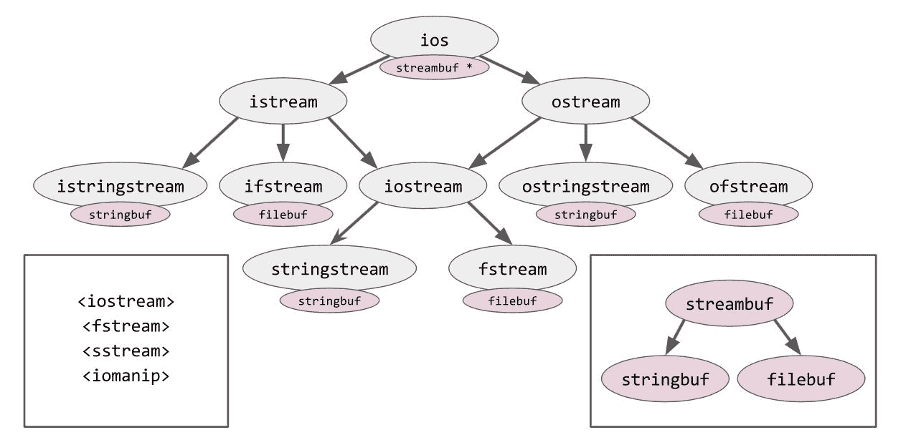

# Iostreams

到目前为止，我们只在标准库的几个地方看到了经典的泛型。我们刚刚在 第八章 的 *分配器* 中看到了经典的泛型 `std::pmr::memory_resource`；泛型在类型擦除类型 `std::any` 和 `std::function` 中被“幕后”使用，这在 第五章 的 *词汇类型* 中有详细说明。然而，总的来说，标准库没有使用经典的泛型。

然而，标准库中的两个地方大量使用了经典的泛型。一个是标准的异常层次结构--为了方便，标准库抛出的所有异常都是 `std::exception` 的子类。（我们在这本书中不介绍异常层次结构。）另一个是标准 `<iostream>` 头文件的内容，我们将在本章中介绍。然而，在我们到达那里之前，我们还有很多背景知识要介绍！

在本章中，我们将涵盖以下主题：

+   输出分为缓冲和格式化；输入分为缓冲、词法分析和解析

+   POSIX API 用于无格式文件 I/O

+   `<stdio.h>` 中的 "C" API，它增加了缓冲和格式化功能

+   经典的 `<iostream>` API 的优缺点

+   *locale-dependent* 格式的危险，以及可以帮助避免这些危险的新的 C++17 功能

+   将数字数据转换为字符串以及从字符串转换回数字的多种方法

# C++ 中 I/O 的问题

衡量一种编程语言易用性的一个常见指标是所谓的 **TTHW**--"**time to hello world**"。许多流行的编程语言具有非常低的 TTHW：在许多脚本语言中，如 Python 和 Perl，"hello world" 程序实际上只有一行：`print "hello world"`。

C++ 和其祖先 C 都是系统编程语言，这意味着它们的主要关注点是“力量”：对机器的控制、速度，以及在 C++ 的情况下，利用泛型算法的能力。这不是适合小型 "hello world" 程序的关注点组合。

C 中的标准 "hello world" 程序如下：

```cpp
    #include <stdio.h>

    int main()
    {
      puts("hello world");
    }
```

在 C++ 中，情况如下：

```cpp
    #include <iostream>

    int main()
    {
      std::cout << "hello world" << std::endl;
    }
```

标准的 C++ 源代码并不比标准的 C 源代码长多少，但它有更多的“参数”或“旋钮”可以调整--即使是新手用户也必须了解这些旋钮，即使他们不知道如何调整它们。例如，在 C 中，我们调用名为 `puts` 的函数（非正式地，一个“动词”），在 C++ 中，我们向名为 `std::cout` 的对象应用一个 *运算符*（因此，非正式地，我们既有“动词”又有“间接宾语”）。在 C++ 的例子中，我们还必须学习一个特殊的行结束（换行）字符的名称--`std::endl`--这是 C 的 `puts` 函数没有向我们隐藏的细节。

有时，这种复杂性会让 C++的新手望而却步，尤其是如果他们在学校学习 C++，也许他们根本不确定是否想学习它。然而，这是一个不幸的误解！你看，前面的“C”源代码（使用`puts`）也是完全有效的 C++，使用`<stdio.h>`头文件中的功能也没有什么问题。实际上，在本章中，我们将在介绍`<iostream>`功能之前解释`<stdio.h>`的功能。然而，我们将看到 C++14 和 C++17 引入了一些鲜为人知的新特性--在`<string>`和`<utility>`等头文件中--这些特性有助于一些常见的 I/O 任务。

关于头文件命名的说明：我一直在使用`<stdio.h>`这个名字来指代包含“C 风格”I/O 功能的头文件。自从 C++03 以来，就有一个类似的标准头文件名为`<cstdio>`。`<stdio.h>`和`<cstdio>`之间的唯一区别在于，在`<stdio.h>`中，所有的功能都保证在全局命名空间中（例如，`::printf`）并且可能或可能不在`std`命名空间中（例如，`std::printf`）；而在`<cstdio>`中，它们保证在`std`（例如，`std::printf`）中，但并不一定在全局命名空间中（例如，`::printf`）。实际上，两者之间没有任何区别，因为所有的主要供应商都将功能放在这两个命名空间中，无论你包含哪个头文件。我的建议只是选择一种风格并坚持下去。如果你的代码库使用了大量的 POSIX 头文件，如`<unistd.h>`，它只具有`.h`的名称；那么，坚持使用标准“C 风格”头文件的`.h`名称可能从美学上更可取。

# 缓冲区与格式化

如果你记住，在“输出”一些数据时（以及相应地，在“输入”一些数据时）至少有两件根本不同的事情在进行，这将有助于你理解“C 风格”I/O 和“iostream 风格”I/O。为了给它们起个名字，让我们称它们为*格式化*和*缓冲区*：

+   *格式化*是将一些强类型数据值从

    程序--整数、字符串、浮点数、用户定义的类类型--并将它们转换或序列化为“文本”。例如，当数字 42 以`"42"`（或`"+42"`或`"0x002A"`）的形式打印出来时，这就是*格式化*。通常，一个格式化库将拥有自己的“迷你语言”来描述你希望每个值如何格式化。

+   *缓冲*是将一串原始字节从程序发送到某个输出设备（在输出时），或者从某个输入设备收集数据并将其作为一串原始字节提供给程序的任务（在输入时）。与缓冲相关的库部分可能执行诸如“一次收集 4096 字节数据，然后刷新”的操作；或者它可能关注数据*去向*：文件系统中的文件、网络套接字，或者内存中的字节数组？

现在，我故意说“格式化”阶段的输出是“文本”，“缓冲”阶段的输入是“一串字节”。在合理的操作系统上，“文本”和“字节”是同一件事。然而，如果你使用的是那些奇怪的操作系统，其中换行符被编码为两个字节，或者文本文件的预期编码不是 UTF-8，那么在这些阶段之一或两个中，甚至更下游（例如在操作系统系统调用中将数据写入文件时），必须进行一些额外的处理。我们不会过多地讨论这类事情，因为我的希望是，你不会在实际生产中使用这种类型的操作系统（或区域设置）。在生产中，你应该*始终*使用 UTF-8 进行字符编码，使用 UTC 作为时区，以及使用`"C.UTF-8"`作为你的区域设置。因此，就我们的目的而言，我们可以假设“格式化”和“缓冲”是管道中我们需要关注的唯一部分。

当我们进行输入时，首先进行“缓冲”，从输入设备读取一些未格式化的字节；然后进行“格式化”，将字节转换为强类型的数据值。输入阶段的“格式化”可以进一步细分为*词法分析*（确定流中单个数据项的长度）和*解析*（从这些字节中确定项的实际值）。我们将在第十章“正则表达式”中更多地讨论词法分析。

# 使用 POSIX API

在我们讨论文件 I/O 时，最重要的是记住，C 和 C++中所有与 I/O 相关的都是建立在 POSIX 标准之上的。POSIX 是一个非常底层的规范，几乎与 Linux 系统调用处于同一级别，它与 C 和 C++的 I/O 标准有相当大的重叠；如果你不理解 POSIX 层的主旨，你将很难理解后续的概念。

请记住，从技术上来说，以下内容都不是标准的 C++！它实际上是符合*非 C++标准*的*有效*C++：POSIX 标准。在实践中，这意味着它将在除了 Windows 以外的任何操作系统上工作，甚至可能通过**Windows 子系统用于 Linux**（**WSL**）在现代 Windows 系统上工作。无论如何，所有标准 API（包括`<stdio.h>`和`<iostream>`）都是建立在上述模型之上的。

定义以下大部分内容的非标准头文件是`<unistd.h>`和`<fcntl.h>`。

在 POSIX 中，术语*文件*指的是磁盘上的实际文件（或者至少在某种*文件系统*中；如果偶尔用“磁盘”这个词来指代文件系统，请原谅我）。多个程序可以通过操作系统资源（称为*文件描述符*）并发地读取或写入同一文件。在 C 或 C++程序中，您永远不会看到文件描述符对象本身；您看到的是文件描述符的句柄（或指针）。这些句柄（或指针）不是以指针类型呈现，而是以小的整数形式呈现--实际上是`int`类型的值。（POSIX 背后的委员会并不像平均的 C++程序员那样痴迷于类型安全！）

要创建一个新的文件描述符并获取其整数句柄，您使用`open`函数；例如，`int fd = open("myfile.txt", O_RDONLY)`。第二个参数是一个掩码，可能包含以下任何一个位标志，或运算在一起：

+   **必需**：一个且仅有一个“访问模式”。可能的“访问模式”是`O_RDONLY`（只读）、`O_WRONLY`（只写）和`O_RDWR`（读写）。

+   **可选**：一些“打开时标志”，描述了在文件打开时系统要执行的操作。例如，`O_CREAT`表示“如果指定的文件不存在，请为我创建它”（与返回失败相反）；您甚至可以添加`O_EXCL`，这意味着“...如果指定的文件*确实*已经存在，那么*确实*返回失败。”另一个重要的打开时标志是`O_TRUNC`，表示“截断--清除、清空、重置--在打开文件后的文件。”

+   **可选**：一些“操作模式”，描述了 I/O 应该如何进行

    通过这个文件描述符完成。这里重要的是`O_APPEND`。

`O_APPEND`表示“追加模式”。当一个文件处于“追加模式”时，您可以像往常一样在其中进行搜索（您将在下一节看到），但每次您向文件写入时，您的写入都会隐式地先进行到文件末尾的搜索（这意味着在写入后，光标将位于文件末尾，即使您刚刚从不同的位置读取）。以追加模式打开文件描述符对于您使用它进行日志记录非常有用，尤其是如果您使用它从不同的线程进行日志记录。一些标准实用程序，如`logrotate`，在程序正确以“追加模式”打开其日志文件时工作得最好。简而言之，追加模式非常广泛地有用，我们将在每个高级 API 中一次又一次地看到它。

现在来解释“光标”和“定位”。每个 POSIX 文件描述符都有一些相关数据——基本上是其“成员变量”。这些相关数据之一是描述符的当前操作模式；另一个是描述符的当前*文件位置指示器*，以下简称“光标”。就像文本编辑器中的光标一样，这个光标指向底层文件中下一次读取或写入将发生的位置。在描述符上使用`read`或`write`会移动其光标。而且，如前一段所述，在“追加模式”下对文件描述符使用`write`将重置光标到文件的末尾。请注意，每个文件描述符只有一个光标！如果你使用`O_RDWR`打开文件描述符，你不会得到一个读取光标和一个写入光标；你只会得到一个单一的、通过读取和写入都会移动的光标。

+   `read(fd, buffer, count)`: 这将从底层文件读取原始字节并将它们存储在给定的缓冲区中——最多`count`字节，或者直到遇到某种临时或永久错误（例如，如果我们需要在网络连接上等待更多数据，或者如果在读取过程中卸载了底层文件系统）。它返回读取的字节数；并且记住，它将光标向前移动。

+   `write(fd, buffer, count)`: 这将从给定的缓冲区将原始字节写入底层文件——最多`count`字节，或者直到遇到某种临时或永久错误。它返回写入的字节数；并且记住，它将光标向前移动。（并且在写入任何数据之前，如果文件描述符处于追加模式，它将定位到文件的末尾。）

+   `lseek(fd, offset, SEEK_SET)`: 这将（即移动光标）定位到文件开头的给定偏移量，并返回该偏移量（如果操作失败，例如超出文件末尾，则返回`-1`）。

+   `lseek(fd, offset, SEEK_CUR)`: 这将定位到相对于当前光标的给定偏移量。这种相对移动通常并不重要，但`lseek(fd, 0, SEEK_CUR)`的特殊情况非常重要，因为这是找出光标当前位置的方法！

+   `lseek(fd, offset, SEEK_END)`: 这将定位到文件末尾的给定偏移量。同样，当`offset`为零时，这个版本最为有用。

顺便说一下，没有方法可以“复制构造”一个 POSIX 文件描述符，以便你可以获得指向同一文件的第二个光标。如果你想有两个光标，你需要将文件打开两次。令人困惑的是，确实有一个名为`dup`的 POSIX 函数，它接受一个整数文件描述符句柄并返回一个不同的整数，该整数可以用作第二个句柄来访问*相同的*描述符；这是一种原始的引用计数。

当你完成文件描述符的使用后，你可以调用`close(fd)`来释放你的句柄；如果这是对描述符的最后一个句柄（也就是说，在此期间没有人调用`dup`），那么文件描述符本身将被操作系统回收——也就是说，底层的文件将被“关闭”。

将所有这些放在一起，我们可以使用 POSIX API 编写一个简单的程序来打开、读取、写入、定位和关闭文件描述符：

```cpp
    #include <cassert>
    #include <string>
    #include <unistd.h>
    #include <fcntl.h>

    int main()
    {
      int fdw = open("myfile.txt", O_WRONLY | O_CREAT | O_TRUNC);
      int fdr = open("myfile.txt", O_RDONLY);
      if (fdw == -1 || fdr == -1)
        return EXIT_FAILURE;

      write(fdw, "hello world", 11);
      lseek(fdw, 6, SEEK_SET);
      write(fdw, "neighbor", 8);

      std::string buffer(14, '\0');
      int b = read(fdr, buffer.data(), 14);
      assert(b == 14);
      assert(buffer == "hello neighbor");
      close(fdr);
      close(fdw);
    }
```

注意，POSIX API 不关心任何与*格式化*相关的事情。它只关心确保我们可以将原始字节从磁盘上的文件中读入和读出；也就是说，关于*缓冲*阶段的一半——“数据去向”的一半。POSIX 不关心“缓冲输出”；当你调用`write`时，你的数据将被写入。也就是说，它可能仍然坐在操作系统级别、磁盘控制器级别或硬件中的缓冲区中，但对你程序来说，数据已经在路上了。任何进一步的输出延迟都不在你的控制范围内，也不是你的错。这反过来意味着，如果你需要使用 POSIX API 高效地写入大量数据，你的程序必须负责将数据写入缓冲区，然后一次性将整个缓冲区发送到`write`。单个 4096 字节的`write`将比 4,096 个单字节`write`快得多！

或者，你不必编写自己的缓冲区管理代码，可以提升一个抽象级别，使用 C API。

# 使用标准 C API

这个描述必然和我们在前面讨论 POSIX 时一样简短且不完整。要完整描述`<stdio.h>`中的功能，你必须查阅其他资料，例如[cppreference.com](https://cppreference.com)或你本地的`man`页面。

在“C 风格”API 中，POSIX 的*文件描述符*被赋予了一个新名字：对应文件描述符的东西被称为`FILE`，对应整数文件描述符句柄的东西（自然地）被称为`FILE*`。尽管如此，就像在 POSIX API 中一样，你永远不会自己构造`FILE`的实例。

要创建一个新的`FILE`对象并获取其指针，你使用`fopen`函数；例如，`FILE *fp = fopen("myfile.txt", "r")`。第二个参数是一个字符串（即指向以空字符终止的字符数组的指针——通常，你只需使用一个字符串字面量，就像我这里所做的那样），它必须是以下之一：

+   `"r"`：这相当于 POSIX 的`O_RDONLY`。以读取方式打开。如果文件不存在，则失败（即返回`nullptr`）。

+   `"w"`：这相当于 POSIX 的`O_WRONLY | O_CREAT | O_TRUNC`。以写入方式打开。如果文件不存在，则创建文件。无论如何，在继续之前将文件清空。

+   `"r+"`：这相当于 POSIX 的`O_RDWR | O_CREAT`。以读取和写入方式打开。如果文件不存在，则创建一个空文件。

+   `"w+"`：这相当于 POSIX 的`O_RDWR | O_CREAT | O_TRUNC`。

    以读写方式打开。如果文件不存在，则创建文件。无论如何，在继续之前将文件清空。

+   `"a"`：这等价于 POSIX 的 `O_WRONLY | O_CREAT | O_APPEND`。以写入方式打开。如果文件不存在，则创建一个空文件。进入追加模式。

+   `"a+"`：这等价于 POSIX 的 `O_RDWR | O_CREAT | O_APPEND`。以读写方式打开。如果文件不存在，则创建文件。无论如何，在继续之前将文件清空。

注意，前面的字符串有一些模式——带有 `'+'` 的字符串始终映射到 `O_RDWR`，带有 `'w'` 的字符串始终映射到 `O_TRUNC`，带有 `'a'` 的字符串始终映射到 `O_APPEND`；然而，没有完美的规则可以描述从 `fopen` 模式字符串到 POSIX `open` 标志的映射。

一些平台支持在模式字符串中附加额外的字符；例如，在 POSIX 平台上，常见的扩展是添加 `'x'` 表示 `O_EXCL`；在 GNU 平台上，添加 `'e'` 表示 `O_CLOEXEC`；在 Windows 上，可以通过添加大写 `'N'` 获得类似的行为。

任何平台上都可以附加到模式字符串上的一个字符（即，C++标准保证它在任何地方都可用）是 `'b'`，表示“二进制”。这仅在 Windows 上才有意义，如果你没有指定这个字符，库会自动将你输出的每个 `'\n'` 字节转换为 Windows 行结束符序列，`'\r', '\n'`。如果你在 Windows 上运行时确实需要这种转换，一个有用的约定是在模式字符串中添加 `'t'`。所有供应商的库都会识别并忽略这个字符；它仅仅作为对人类读者的指示，表明你确实打算以“文本”模式打开文件，而不是不小心遗漏了预期的 `'b'`。

当你完成文件的使用时，你必须调用 `fclose(fp)`，这相当于在底层文件描述符句柄上调用 `close(fd)`。

为了处理 C 风格 `FILE` 指针的簿记，你可能想使用来自第五章，“词汇类型”的 RAII 智能指针。你可以这样写一个“唯一的 `FILE` 指针”：

```cpp
    struct fcloser {
      void operator()(FILE *fp) const {
        fclose(fp);
      }

      static auto open(const char *name, const char *mode) {
        return std::unique_ptr<FILE, fcloser>(fopen(name, mode));
      }
    };

    void test() {
      auto f = fcloser::open("test.txt", "w");
      fprintf(f.get(), "hello world\n");
        // f will be closed automatically
    }
```

此外，记住，如果你想具有引用计数，“最后一个人离开房间关灯”的语义，你总是可以将 `unique_ptr` 移动到 `shared_ptr`：

```cpp
    auto f = fcloser::open("test.txt", "w");
    std::shared_ptr<FILE> g1 = std::move(f);
      // now f is empty and g1's use-count is 1
    if (true) {
      std::shared_ptr<FILE> g2 = g1;
        // g1's use-count is now 2
      fprintf(g2.get(), "hello ");
        // g1's use-count drops back to 1
    }
    fprintf(g1.get(), "world\n");
      // g1's use-count drops to 0; the file is closed
```

# 标准 C API 中的缓冲区

标准 C API 提供了一组看起来与 POSIX 函数相似的函数，

但在前面加上字母 `f`。

`fread(buffer, 1, count, fp)` 方法从底层文件读取原始字节并将它们存储在给定的缓冲区中——最多 `count` 个字节，或者直到遇到某种永久错误（例如，如果在读取过程中有人卸载了底层文件系统）。它返回读取的字节数并前进光标。

那个调用中的字面量 `1` 并非错误！技术上，函数签名是 `fread(buffer, k, count, fp)`。它读取最多 `k * count` 个字节，或者直到遇到永久性错误并返回读取的字节数除以 `k`。然而，在你的代码中，`k` 应始终是字面量 `1`；使用其他任何值都是错误，至少有两个原因。首先，因为返回值总是除以 `k`，如果 `k` 不是 `1`，你将丢失信息。例如，如果 `k` 是 8，返回值 3 表示“在 24 到 31 个字节之间”读取并存储到缓冲区中，但 `buffer[3]` 可能现在包含一个部分写入的值——也就是说，垃圾数据——而你无法检测到这一点。其次，由于库内部会乘以 `k * count`，传递除 `1` 以外的任何 `k` 都会存在溢出和计算错误缓冲区长度的风险。没有流行的实现会检查乘法是否溢出；这如果不是为了性能原因，至少也是出于其他原因。如果每个程序员都知道永远不要为 `k` 传递除 `1` 以外的任何值，那么在昂贵的除法操作上花费 CPU 时间是没有意义的！

`fwrite(buffer, 1, count, fp)` 方法将给定缓冲区中的原始字节写入底层文件——最多 `count` 个字节，或者直到遇到某种永久性错误。它返回写入的字节数，并前进光标。（并且*在写入任何数据之前，如果文件描述符处于追加模式，它将移动到文件的末尾。）

`fseek(fp, offset, SEEK_SET)` 方法将光标（即移动光标）移动到文件开头的给定偏移量；`fseek(fp, offset, SEEK_CUR)` 将光标移动到相对于当前光标的给定偏移量；而 `fseek(fp, offset, SEEK_END)` 将光标移动到相对于文件末尾的给定偏移量。与 POSIX 的 `lseek` 不同，标准的 C 版本 `fseek` 并不返回当前光标的位置；它仅在成功时返回 `0` 或在失败时返回 `-1`。

`ftell(fp)` 方法返回当前光标的位置；也就是说，它与底层 POSIX 调用 `lseek(fd, 0, SEEK_CUR)` 等效。

说到底层的 POSIX 调用：如果你在一个 POSIX 平台上，并且需要使用 POSIX 文件描述符执行与标准 C `FILE *` 相关的非可移植操作，你总是可以通过调用 `fileno(fp)` 来检索文件描述符。因此，例如，我们可以将 `ftell` 表达如下：

```cpp
    long ftell(FILE *fp)
    {
      int fd = fileno(fp);
      return lseek(fd, 0, SEEK_CUR);
    }
```

使用`fread`和`fwrite`是可能的，但并不是使用 C API 的最常见方式。许多程序更愿意以字符或字节为单位处理输入和输出，而不是处理大量数据。原始的“Unix 哲学”倾向于小型简单的命令行工具，这些工具读取并转换字节流；这些小型面向流的程序被称为“过滤器”，当与 Unix shell 的管道链接在一起时，它们表现得尤为出色。例如，这里有一个小程序，它使用`<stdio.h>` API 打开一个文件，并计算该文件中的字节数、空格分隔的“单词”数和行数：

```cpp
    struct LWC {
      int lines, words, chars;
    };

    LWC word_count(FILE *fp)
    {
      LWC r {};
      bool in_space = true;
      while (true) {
        int ch = getc(fp);
        if (ch == EOF) break;
        r.lines += (ch == '\n');
        r.words += (in_space && !isspace(ch));
        r.chars += 1;
        in_space = isspace(ch);
      }
      return r;
    }

    int main(int argc, const char **argv)
    {
      FILE *fp = (argc < 2) ? stdin : fopen(argv[1], "r");
      auto [lines, words, chars] = word_count(fp);
      printf("%8d %7d %7d\n", lines, words, chars);
    }
```

（你认出它了吗？这是命令行工具`wc`。）

这个程序引入了两个新想法（除了标准保证在程序退出时所有`FILE`对象都隐式关闭，这样我们就可以省略`fclose`的记录并在这个例子中节省几行之外）。第一个是*标准流*的概念。在 C 和 C++中有三个标准流：`stdin`、`stdout`和`stderr`。在我们的单词计数程序中，我们遵循规则，如果命令行用户没有明确告诉我们要读取的任何文件名，我们将从`stdin`，即*标准输入流*读取，这通常等同于控制台（或终端或键盘——也就是说，是坐在那里打字的人）。操作系统和命令行 shell 中的各种机制可以用来*重定向*标准输入流到其他输入；这些机制（如在 shell 提示符下键入`wc <myfile.txt`）远远超出了本书的范围。关于这三个标准流的主要事情是要记住，它们可以通过名称自动供您使用，而无需`fopen`它们；并且关闭它们中的任何一个都是错误的。

在我们的单词计数程序中引入的第二个新想法是`getc`函数。`getc(fp)`函数从给定的`FILE *`读取一个字节，并返回它所读取的字节。如果发生错误，或者（更可能的是）如果遇到文件末尾，它将返回一个特殊值，称为`EOF`。`EOF`的数值通常是`-1`，但关于它的保证是，它与任何可能的*有效*字节都完全不同。因此，`getc(fp)`不将其返回值作为`char`返回；它将其作为`int`返回，这足以存储任何可能的`char`，并且，此外，足以存储与这些`char`值不同的值`EOF`（如果`char`在您的平台上是带符号的类型——在许多平台上都是这样——那么`getc`将在返回之前将其读取的`char`转换为`unsigned char`；这确保了如果输入文件中出现`0xFF`字节，它将被返回为`255`，这是一个与表示`EOF`的`-1`不同的整数值）。

现在，让我们来看看`fread`/`fwrite`和`read`/`write`之间的关键区别。

回想一下，POSIX API 并不会对输入或输出字节进行任何额外的缓冲；

当你调用 `read` 时，你实际上是在调用操作系统来检索

下一个输入字节的块。如果 `getc(fp)` 被实现为 `fread(&ch, 1, 1, fp)`，并且 `fread(buf, 1, count, fp)` 被实现为 `read(fileno(fp), buf, count)`，那么我们的单词计数程序将非常低效——读取一个百万字节的文件将导致一百万个系统调用！所以，当 C 库将文件描述符句柄包装在 `FILE` 对象中时，它还添加了一个额外的功能：**缓冲**。

`FILE` 流可以是“无缓冲”的（这意味着每个 `fread` 确实对应于 `read`，每个 `fwrite` 对应于 `write`）；“完全缓冲”的，也称为“块缓冲”（这意味着写入将累积到一个私有缓冲区中，只有当它填满时才会发送到底层的文件描述符，同样，读取也将从私有缓冲区中提供，只有当它为空时才会从底层的文件描述符中重新填充）；或者“行缓冲”的（这意味着有一个与之前情况相同的私有缓冲区，但写入 `'\n'` 会导致刷新，即使缓冲区还没有满）。当程序启动并打开其标准流时，`stdin` 和 `stdout` 将是行缓冲的，而 `stderr` 将是无缓冲的。你通过 `fopen` 打开的任何文件通常将是完全缓冲的，尽管操作系统也可能对此有所说法；例如，如果你打开的“文件”实际上是一个终端设备，它可能默认就是行缓冲的。

在非常罕见的情况下，如果你需要控制 `FILE` 流的缓冲模式，你可以通过标准的 `setvbuf` 函数来实现。你还可以使用 `setvbuf` 来提供自己的缓冲区，如下面的示例所示：

```cpp
FILE *fp = fopen("myfile.txt", "w");
    int fd = fileno(fp);
    char buffer[150];
    setvbuf(fp, buffer, _IOFBF, 150);
      // setvbuf returns 0 on success, or EOF on failure.

    std::string AAAA(160, 'A');
    int bytes_written = fwrite(AAAA.data(), 1, 160, fp);
      // This fills the buffer with 150 bytes, flushes it,
      // and writes 10 more bytes into the buffer.

    assert(bytes_written == 160);
    assert(lseek(fd, 0, SEEK_CUR) == 150);
    assert(ftell(fp) == 160);
```

注意到示例的最后一条中 `ftell(fp)` 和 `lseek(fd, 0, SEEK_CUR)` 之间的差异。在 `FILE` 的缓冲区中还有 10 个字节未被读取；因此 `FILE` 报告说你的光标目前位于偏移量 160，但实际上，底层的 POSIX 文件描述符的光标仍然位于偏移量 150，并且将保持在那里，直到 `FILE` 的缓冲区填满并第二次刷新——此时底层的 POSIX 文件描述符的光标将跳转到偏移量 300。这感觉有些不自然，但实际上这正是我们想要的！我们**想要**的是通过以大块写入底层文件描述符所带来的效率。（注意，在现实中 150 个字节并不算“大”。如果你根本不使用 `setvbuf`，典型的默认文件缓冲区大小可能更像是 4096 字节。）

在某些平台上，调用`ftell`可能会导致缓冲区作为副作用被刷新，因为这使得库的记账更容易；库不喜欢被抓住说谎。（调用`fseek`也可能是导致刷新的原因。）然而，在其他平台上，`ftell`甚至`fseek`并不总是刷新缓冲区。为了确保你的`FILE`流缓冲区确实已经刷新到底层文件，请使用`fflush`。让我们继续上一个示例，如下所示：

```cpp
    // Flush the FILE's buffer by force.
    fflush(fp);
    // Now, fd and fp agree about the state of the file.
    assert(lseek(fd, 0, SEEK_CUR) == 160);
```

将所有这些放在一起，我们可以像这样重写我们在*使用 POSIX API*部分中的简单程序，使用`<stdio.h>` API 来打开、读取、写入、定位、刷新和关闭文件流：

```cpp
    #include <cassert>
    #include <cstdio>
    #include <string>

    int main()
    {
      FILE *fpw = fopen("myfile.txt", "w");
      FILE *fpr = fopen("myfile.txt", "r");
      if (fpw == nullptr || fpr == nullptr)
        return EXIT_FAILURE;

      fwrite("hello world", 1, 11, fpw);
      fseek(fpw, 6, SEEK_SET);
      fwrite("neighbor", 1, 8, fpw);
      fflush(fpw);

      std::string buffer(14, '\0');
      int b = fread(buffer.data(), 1, 14, fpr);
      assert(b == 14 && buffer == "hello neighbor");
      fclose(fpr);
      fclose(fpw);
    }
```

这就结束了我们对标准`<stdio.h>` API 的*缓冲*能力的探索；现在，我们将继续考虑`<stdio.h>`如何处理*格式化*。

# 使用 printf 和 snprintf 进行格式化

在格式化阶段，我们开始于我们想要打印出的高级数据值；例如，我们可能想要打印芝加哥钢琴调音师的数量，我们的程序计算为 225。打印出*三字节字符串* `"225"`很容易；我们在前面的章节中已经解决了这个问题。*格式化*的任务是将数字 225（一个`int`，比如说）转换成那个三字节字符串`"225"`。

当打印数字时，我们有许多可能的问题：数字应该以 10 进制、16 进制、8 进制、2 进制或其他进制打印吗？如果数字是负数，我们可能需要在前面加上`-`；如果是正数，我们应该在前面加上`+`吗？我们应该使用千位分隔符吗？如果是这样，我们应该使用逗号、句号还是空格？关于小数点呢？一旦我们谈论到浮点数，我们应该打印小数点后多少位数字？或者我们应该使用科学记数法，如果是这样，我们应该保留多少有效数字？

然后，还有一些问题甚至涉及到非数值输入。打印的值是否应该在一个固定宽度的列中对齐，如果是的话，应该左对齐、右对齐，还是以某种其他巧妙的方式进行对齐？（我们该使用什么字符来填充未占用的列呢？）如果值不适合给定的列宽，应该左截断、右截断，还是直接超出列的边界？

类似地，当读取格式化输入（即*解析*）时，我们必须回答许多关于数字的相同问题：我们是否期望千位分隔符？科学记数法？前导`+`符号？我们期望什么数字进制？甚至对于非数字：我们是否期望前导空白？如果我们正在读取类型为“字符串”的值，除了`EOF`之外，什么表示值的结束？

标准 C API 提供了一系列以`printf`结尾的格式化函数，以及一系列以`scanf`结尾的匹配解析函数。这个系列中每个函数的共同点是它接受一个变长参数列表（使用 C 风格的变长参数，而不是 C++变长模板），并且在变长参数之前有一个单一的“格式字符串”，为要格式化的每个参数回答许多上述问题（但不是所有问题），并为整体消息提供一个“形状”，库将在这个形状中插入格式化的参数：

```cpp
    int tuners = 225;
    const char *where = "Chicago";
    printf("There are %d piano tuners in %s.\n", tuners, where);
```

此外还有`fprintf(fp, "format", args...)`，用于打印到任何任意流（不一定是`stdout`）；`snprintf(buf, n, "format", args...)`用于写入缓冲区，我们将在稍后讨论这个问题；还有一组`vprintf`、`vfprintf`和`vsnprintf`函数，这些函数在构建自己的 printf-like 函数时很有用。正如你可能在本章中学到的，C 风格格式字符串的完整处理超出了本书的范围。然而，C 风格的“格式字符串语言”即使在不是直接从 C 派生的语言中也被广泛使用；例如，在 Python 2 中，你可以这样写：

```cpp
    tuners = 225
    where = "Chicago"
    print "There are %d piano tuners in %s." % (tuners, where)
```

然而，C 和 Python 中发生的事情之间有重大差异！

最大的区别在于 Python 是动态类型的，所以如果你写`"%s tuners" % (tuners)`，它仍然能够正确执行。使用 C 风格的变长参数列表时，`tuners`的原始类型会丢失；如果你使用`"%s"`格式说明符（它期望一个`const char *`类型的参数）并传递一个`int`类型的参数，你最多会得到友好的编译器警告，最坏的情况下会有未定义的行为。也就是说，当你使用`<stdio.h>`格式化函数时，格式字符串承担双重职责：它不仅编码了如何格式化每个数据值，还编码了每个数据值的类型——如果你弄错了其中一个类型，比如当你想用`"%s"`时实际上应该用`"%d"`，那么你的程序就会出现错误。幸运的是，如今所有主要的编译器都可以检测并诊断这种不匹配，只要你的格式字符串是直接传递给`printf`或带有（非标准的）`format`属性的函数，就像我们将在接下来的代码示例中看到的那样。不幸的是，当你处理平台相关类型的`typedef`时，这些诊断可能不可靠；例如，一些 64 位编译器不会诊断尝试使用`"%llu"`格式说明符格式化`size_t`值的情况，尽管正确的可移植格式说明符应该是`"%zu"`。

另一个区别是，在 C 中，`printf` 实际上是直接写入标准输出流 `stdout`；数据的格式化与输出字节的缓冲是交织在一起的。在 Python 中，`"There are %d piano tuners in %s." % (tuners, where)` 结构实际上是一个 `str` 类型（字符串）的 *表达式*；所有的格式化都直接在那里完成，生成一个包含正确字节的单个字符串值，在我们决定将字符串打印到 `stdout` 之前。

要使用 `<stdio.h>` API 生成格式化的字符串，我们将使用 `snprintf`：

```cpp
    char buf[13];
    int needed = snprintf(
      buf, sizeof buf,
      "There are %d piano tuners in %s", tuners, where
    );
    assert(needed == 37);
    assert(std::string_view(buf) == "There are 22");
```

注意到 `snprintf` 总是会以空字符终止其缓冲区，即使这意味着不能将整个消息写入其中；它返回它 *想要* 写入的消息的 `strlen`。格式化任意长消息的常见方法是首先用 `nullptr` 调用 `snprintf`，以了解消息的最终大小；然后再次调用它，这次使用相应大小的缓冲区：

```cpp
    template<class... Args>
    std::string format(const char *fmt, const Args&... args)
    {
      int needed = snprintf(nullptr, 0, fmt, args...);
      std::string s(needed + 1, '\0');
      snprintf(s.data(), s.size(), fmt, args...);
      s.pop_back(); // remove the written '\0'
      return s;
    }

    void test()  
    {
      std::string s = format("There are %d piano tuners in %s", tuners, where);
      assert(s == "There are 225 piano tuners in Chicago"); 
    } 
```

之前 `format` 的实现使用了一个变长参数函数模板，这往往会产生大量类似的代码副本。一个更有效的实现（从编译时间和代码膨胀的角度来看）是使用一个单一的非模板函数，具有 C 风格的变长参数列表，并使用 `vsnprintf` 进行格式化。遗憾的是，关于 `va_list` 和 `vsnprintf` 的进一步讨论远远超出了本书的范围。

```cpp
    std::string better_format(const char *fmt, ...)
    {
      va_list ap;
      va_start(ap, fmt);
      int needed = vsnprintf(nullptr, 0, fmt, ap);
      va_end(ap);
      std::string s(needed + 1, '\0');
      va_start(ap, fmt);
      vsnprintf(s.data(), s.size(), fmt, ap);
      va_end(ap);
      s.pop_back(); // remove the written '\0'
      return s;
    }
```

我们将把对 `scanf` 格式字符串的讨论推迟到本章的 *食谱* 部分。关于 `scanf` 的完整介绍，请参考 [cppreference.com](https://cppreference.com) 或关于 C 标准库的书籍。

在了解了 `<stdio.h>` 环境中缓冲和格式化（至少是输出格式化）是如何工作的之后，我们现在转向标准 C++ `<iostream>` API。

# 经典的 iostreams 层次结构

`<stdio.h>` API 至少有三个问题。首先，格式化功能远非类型安全。其次，缓冲功能尴尬地分为 "将缓冲写入文件流"（`FILE *` 和 `fprintf`）和 "将缓冲写入字符缓冲区"（`snprintf`）。（好吧，技术上，GNU C 库提供了 `fopencookie` 来构建 `FILE *`，它可以缓冲到任何你想要的地方；但这相当不为人知，并且非常非标准。）第三，没有简单的方法来扩展用户定义类的格式化功能；我甚至不能 `printf` 一个 `std::string`，更不用说 `my::Widget` 了！

在 1980 年代中期 C++ 被开发时，设计者感到需要一个类型安全、可组合和可扩展的 I/O 库。因此诞生了被称为 "iostreams" 或简单地称为 "C++ streams"（不要与刚刚讨论过的 `<stdio.h>` streams 混淆）的功能。自 1980 年代中期以来，iostreams 的基本架构没有改变，这使得它与标准库中的其他任何东西都大不相同，可能唯一的例外是（无意中）`std::exception` 层次结构。

C++ 的 iostreams 库由两个主要部分组成：*streams*，它们关注格式化，以及 `streambufs`，它们关注缓冲。大多数 C++ 程序员永远不会与 `streambufs` 交互；只有与 `streams` 交互。然而，让我们快速解释一下什么是 `streambuf`。

`streambuf` 在 C API 中非常类似于 `FILE`。它告诉程序输入（以原始字节的形式）应该来自哪里，输出应该去哪里。它还维护一个字节缓冲区以减少到达这些目的地（如 POSIX 的 `read` 和 `write` 函数）的往返次数。为了允许具有相同接口的不同类型的 `streambuf` -- 嗯，记得我在本章中提到的承诺，我们会看到经典的多态吗？我们终于到达那里了！

`std::streambuf`（实际上是对 `std::basic_streambuf<char, char_traits<char>>` 的别称，但让我们不要使事情变得更复杂）是一个继承层次结构的基类，其派生类是 `std::filebuf` 和 `std::stringbuf`。`streambuf` 接口提供的虚拟方法太多，无法一一列出，但包括 `sb.setbuf(buf, n)`（对应于 `setvbuf(fp, buf, _IO_FBF, n)`），`sb.overflow()`（对应于 `fflush(fp)`），以及 `sb.seekpos(offset, whence)`（对应于 `fseek(fp, offset, whence)`）。当我说对应时，当然是指对应于 `std::filebuf`。这些方法在调用 `std::stringbuf` 时具有实现定义的（在实践中，不可移植的）行为。

任何由 `streambuf` 派生的类都必须支持一些原始操作来与其缓冲区交互（用于放入和取出字节）。这些原始操作不是供普通程序员使用的；它们是为封装此 `streambuf` 并提供更友好的程序员接口的 *stream* 对象使用的。

C++ 的 *stream* 封装了一个 `streambuf` 并限制了你可以对其执行的操作集。例如，请注意 `streambuf` 并没有“访问模式”的概念：你可以像取出字节（“读取”）一样容易地将其放入字节（“写入”）。然而，当我们用 `std::ostream` 封装那个 `streambuf` 时，`ostream` 对象只暴露了一个 `write` 方法；在 `ostream` 上没有 `read` 方法。

以下图表展示了 C++17 中流和流缓冲区的类层次结构，如标准 `<iostream>`、`<fstream>` 和/或 `<sstream>` 头文件中定义的那样。`streambuf`、`istream`、`ostream` 和 `iostream` 基类是“抽象的”：虽然它们没有纯虚方法，但只包含从 `ios` 继承的 `streambuf*` 成员变量。为了防止你意外构造这些“抽象的”类型的实例，标准库定义了它们的构造函数为 `protected`。相反，名称中包含 `stringstream` 和 `fstream` 的类实际上分别包含 `stringbuf` 和 `filebuf` 的实例，它们的构造函数初始化继承的 `streambuf*` 成员变量以指向这些实例。在本章的后续部分，在 *解决粘性操纵器问题* 节中，我们将看到如何构造一个 `ostream` 对象，其 `streambuf*` 成员变量指向一个不属于 `*this` 的流缓冲区实例：



流类公开了一系列方法，这些方法大致对应于我们之前两次看到过的函数。特别是，`fstream` 类封装了 `filebuf`，并且它们一起的行为与 C API 中的 `FILE` 非常相似：`filebuf` 有一个“游标”，你可以使用 `fstream` 的 `seekp` 方法来操作它。（`seekp` 的名称是从 `ostream` 类继承的。在 `ifstream` 上，该方法的名称是 `seekg`：“g”代表“获取”，“p”代表“放置。”在完整的 `fstream` 上，你可以使用 `seekg` 或 `seekp`；在这种情况下，它们是同义词。一如既往，记住，即使 iostreams API 在这种情况下有两个不同的 *名称*，但只有一个游标！）

`fstream` 构造函数接受一个由 `std::ios_base::in`、`out`、`app`（表示“追加模式”）、`trunc`、`ate` 和 `binary` 标志值组成的位掩码；然而，正如我们在 `fopen` 中所看到的，这些标志如何转换为 POSIX `open` 标志之间只有很少的韵律和逻辑关系：

+   `in`: 这与 `fopen("r")` 或 POSIX 的 `O_RDONLY` 等效。

+   `out`: 这与 `fopen("w")` 或 POSIX 的 `O_WRONLY | O_CREAT | O_TRUNC` 等效。（注意，即使没有传递 `trunc`，`out` 单独也意味着 `O_TRUNC`！）

+   `in|out`: 这与 `fopen("r+")` 或 POSIX 的 `O_RDWR | O_CREAT` 等效。

+   `in|out|trunc`: 这与 `fopen("w+")` 或 POSIX 的 `O_RDWR | O_CREAT | O_TRUNC` 等效。（注意，在这种情况下，iostreams 语法比 `fopen` 语法更有意义。）

+   `out|app`: 这与 `fopen("a")` 或 POSIX 的 `O_WRONLY | O_CREAT | O_APPEND` 等效。

+   `in|out|app`: 这与 `fopen("a+")` 或 POSIX 的 `O_RDWR | O_CREAT | O_APPEND` 等效。

将 `binary` 添加到位掩码中就像在 `fopen` 中添加 `"b"` 一样。添加 `ate` 告诉流从文件的末尾开始搜索，即使文件不是以 `O_APPEND` 模式打开。

传递一个不支持的标志集，例如 `app|trunc`，仍然会构建流对象，但将其置于“失败”状态，我们将在后面讨论。一般来说，你应该设计自己类的构造函数，以便通过异常来指示失败。这个规则在这里被打破，部分原因是因为这个类层次结构是在大约四十年前设计的，部分原因是因为我们无论如何都需要一个“失败”机制，以处理相对可能的情况，即无法打开指定的文件（例如，如果它不存在）。

将所有内容整合起来，我们可以用 `<fstream>` API 重写我们的简单程序，如下所示，使用该 API 打开、读取、写入、定位、刷新和关闭文件流：

```cpp
    #include <cassert>
    #include <fstream>
    #include <string>

    int main()
    {
      std::fstream fsw("myfile.txt", std::ios_base::out);
      std::fstream fsr("myfile.txt", std::ios_base::in);
      if (fsw.fail() || fsr.fail())
        return EXIT_FAILURE;

      fsw.write("hello world", 11);
      fsw.seekp(6, std::ios_base::beg);
      fsw.write("neighbor", 8);
      fsw.flush();

      std::string buffer(14, '\0');
      fsr.read(buffer.data(), 14);
      assert(fsr.gcount() == 14 && buffer == "hello neighbor");
    }
```

前一个例子中有一个奇怪的地方，那就是 `fsr.read(buffer.data(), 14)`

并不返回读取了多少字节的任何指示！相反，它将读取的字节数存储在一个成员变量中，你必须通过访问器 `fsr.gcount()` 函数自己检索这个计数。而且，`write` 方法甚至不允许你找出写入了多少字节。这看起来可能像是一个问题；但，一般来说，如果一个流在读取或写入时遇到错误，由于从底层文件描述符实际读取或写入的字节数不确定，以及应用程序程序和硬件之间的几个缓冲层，错误往往是“不可恢复”的。当遇到读取或写入错误时，我们基本上必须放弃了解那个流的状态——*除了*在输入遇到“文件末尾”的特殊情况之外。如果我们打算读取 100 个字节，但意外地遇到了“文件末尾”，那么询问“我们成功读取了多少字节？”是有意义的。然而，如果我们打算 *写入* 100 个字节，但收到了网络错误或磁盘错误，那么询问“我们成功写入了多少字节？”就没有那么有意义了。我们根本无法判断我们的“写入”字节是否成功到达了目的地。

如果我们请求读取 100 个字节，但在遇到文件末尾之前只读取了 99 个（或更少），那么不仅 `fs.gcount()` 会报告一个小于 100 的数字，而且流对象的状态上还会设置 *eof 指示器*。你可以使用访问器函数 `fs.good()`（是否一切顺利？），`fs.bad()`（底层流是否遇到了不可恢复的错误？），`fs.eof()`（最后的输入操作是否遇到了文件末尾？），和 `fs.fail()`（最后的操作是否由于任何原因而“失败”？）来询问任何流的状态。请注意，`fs.good()` 并不是 `fs.bad()` 的逆；一个流可能处于某种状态，例如 *eof*，即 `!good() && !bad()`。

我们现在已经看到了使用 `fstream` 流进行缓冲输入和输出的最简单、最原始的方法。然而，如果你像这样使用 C++ 流，你不妨直接使用 `FILE *`，甚至 POSIX API。C++ 流的“新且（有争议地）改进”之处在于它们处理 *格式化* 的方式。

# 流和操纵符

回想一下，使用 `printf` 时，原始参数类型会丢失，因此格式化字符串必须承担双重任务，不仅编码每个数据值的 *格式化* 方式，还要编码每个数据值的 *类型*。当我们使用 iostreams 时，这种缺点就消失了。使用 iostreams 的格式化看起来像这样：

```cpp
    int tuners = 225;
    const char *where = "Chicago";
    std::cout << "There are " << tuners << " piano tuners in " << where << "\n";
```

在这里，`std::cout` 是一个全局变量，类型为 `ostream`，对应于 `stdout` 或 POSIX 文件描述符 1。还有 `std::cerr`，对应于无缓冲的 `stderr` 或 POSIX 文件描述符 2；`std::clog`，再次对应于文件描述符 2，但这次是完全缓冲的；以及 `std::cin`，是一个全局变量，类型为 `istream`，对应于 `stdin` 或 POSIX 文件描述符 0。

标准的 `ostream` 类，再次强调，实际上是 `basic_ostream<char, char_traits<char>>`，但让我们忽略这一点）有大量的非成员重载的 `operator<<`。例如，这里是最简单的重载 `operator<<`：

```cpp
    namespace std {
      ostream& operator<< (ostream& os, const string& s)
      {
        os.write(s.data(), s.size());
        return os;
      }
    } // namespace std
```

由于这个函数返回了对它接收到的相同 `os` 的引用，我们可以将 `<<` 操作符链接在一起，就像前面的例子所示。这允许我们格式化复杂的信息。

不幸的是，我们简单的 `operator<<(ostream&, const string&)` 并不足以满足在 *Formatting with printf and snprintf* 部分描述的各种格式化关注点。假设我们想要在一个宽度为 7 的列中打印左对齐的字符串；我们该如何做呢？`operator<<` 语法不允许我们传递任何额外的“格式化选项”参数，这意味着我们**无法**进行复杂的格式化，除非格式化选项被携带在 `<<` 的左侧（`ostream` 对象本身）或右侧（要格式化的对象）。标准库使用了这两种方法的混合。一般来说，1980 年代和 1990 年代首次出现的功能将它们的格式化选项携带在 `ostream` 对象本身中；而后来添加的任何内容——由于不能在不破坏二进制兼容性的情况下向 `ostream` 添加新的成员变量——不得不通过调整 `<<` 操作符的右侧来凑合。以列内的对齐为例，这是 `std::string` 的 `operator<<` 的一个稍微更完整的版本：

```cpp
    void pad(std::ostream& os, size_t from, size_t to)
    {
      char ch = os.fill();
      for (auto i = from; i < to; ++i) {
        os.write(&ch, 1);
      }
    }

    std::ostream& operator<< (std::ostream& os, const std::string& s)
    {
      auto column_width = os.width();
      auto padding = os.flags() & std::ios_base::adjustfield;

      if (padding == std::ios_base::right) {
        pad(os, s.size(), column_width);
      }
      os.write(s.data(), s.size());
      if (padding == std::ios_base::left) {
        pad(os, s.size(), column_width);
      }
      os.width(0); // reset "column width" to 0
      return os;
    }
```

在这里，`os.width()`、`os.flags()` 和 `os.fill()` 都是 `std::ostream` 类的内置成员。

`std::ostream` 类。还有 `os.precision()` 用于浮点数，

`os.flags()` 可以指示某些数值类型的十进制、十六进制或八进制输出。您可以通过调用 `os.width(n)` 在流上设置“列宽”状态；然而，如果我们不得不在每次输出操作之前编写 `std::cout.width(10)`、`std::cout.setfill('.')` 等来设置，那将会非常痛苦（而且愚蠢！）所以，iostreams 库提供了一些标准 *流操作符*，可以用来获取这些成员函数的效果，但方式更加“流畅”。这些操作符通常定义在标准头文件 `<iomanip>` 中，而不是 `<iostream>` 本身。例如，这里有一个设置流列宽的操作符：

```cpp
    struct WidthSetter { int n; };

    auto& operator<< (std::ostream& os, WidthSetter w)
    {
      os.width(w.n);
      return os;
    }

    auto setw(int n) { return WidthSetter{n}; }
```

此外，这里还有两个更多的标准操作符，其中一个现在应该非常熟悉您。`std::endl` 操作符将换行符流到输出流，然后刷新它：

```cpp
    using Manip = std::ostream& (*)(std::ostream&);

    auto& operator<< (std::ostream& os, Manip f) {
      return f(os);
    }

    std::ostream& flush(std::ostream& os) {
      return os.flush();
    }

    std::ostream& endl(std::ostream& os) {
      return os << '\n' << flush; 
    }
```

一旦我们有了 `std::setw`；它的朋友 `std::left`、`std::right`、`std::hex`、`std::dec`、`std::oct`、`std::setfill` 和 `std::precision`；以及所有其余的——我说一旦我们有了所有这些操作符——我们就可以编写出看起来几乎自然的 iostreams 代码，尽管非常冗长。比较这些 `<stdio.h>` 和 `<iostream>` 片段：

```cpp
    printf("%-10s.%6x\n", where, tuners);
      // "Chicago . e1"

    std::cout << std::setw(8) << std::left << where << "."
              << std::setw(4) << std::right << std::hex
              << tuners << "\n";
      // "Chicago . e1"
```

请记住，每次我们使用这些操作符之一时，我们都在命令式地影响流对象的状态；这种影响可能持续的时间比当前输出语句更长。例如，我们前面的片段可能继续如下：

```cpp
    printf("%d\n", 42); // "42"

    std::cout << 42 << "\n"; // "2a" -- oops!
```

之前示例中的 `std::hex` 操作符将此流的模式设置为“数字的十六进制输出”，并且没有任何东西将其设置回“默认”的十进制模式。因此，现在我们无意中使程序后面的所有内容都打印为十六进制！这是 iostreams 库（以及状态式、命令式编程的一般缺点）的一个主要缺点。

# 流和包装

`std::ios_base` 提供的参数（`left`、`right`、`hex`、`width`、`precision` 等）是一个封闭集——一个在 1980 年代中期定义的集，自那时以来基本上没有改变。由于每个操作符都修改流状态中的一个参数，因此操作符集本质上也是封闭的。影响特定数据值格式的现代方法是将其包装在 *包装器* 中。例如，假设我们已经编写了一个通用的算法，用于在数据文件中引用值：

```cpp
    template<class InputIt, class OutputIt>
    OutputIt do_quote(InputIt begin, InputIt end,
      OutputIt dest)
    {
      *dest++ = '"';
      while (begin != end) {
        auto ch = *begin++;
        if (ch == '"') {
            *dest++ = '\\';
        }
        *dest++ = ch;
      }
      *dest++ = '"';
      return dest;
    }
```

（此算法不是标准库的一部分。）有了这个算法，我们可以轻松地构造一个包装类，其中包装类的 `operator<<` 将调用以下算法：

```cpp
    struct quoted {
      std::string_view m_view;
      quoted(const char *s) : m_view(s) {}
      quoted(const std::string& s) : m_view(s) {}
    };

    std::ostream& operator<< (std::ostream& os, const quoted& q)
    {
      do_quote(
        q.m_view.begin(),
        q.m_view.end(),
        std::ostreambuf_iterator<char>(os)
      );
      return os;
    }
```

（`std::ostreambuf_iterator<char>` 类型是标准库的一部分；它来自 `<iterator>` 头文件。我们将在本章后面看到它的朋友 `istream_iterator`。）然后，有了包装类，我们就能编写出非常合理的代码来将引号内的值打印到输出流中：

```cpp
    std::cout << quoted("I said \"hello\".");
```

我们刚刚发明的包装器与标准库 `<iomanip>` 头文件中找到的 `std::quoted` 包装函数有故意的相似之处。主要区别在于 `std::quoted` 不使用基于迭代器的算法来生成其输出；它在一个局部的 `std::string` 变量中构建整个输出，然后使用 `os << str` 一次性将其打印出来。这意味着 `std::quoted` 是*非分配器感知的*（见第八章，*分配器*），因此不适合禁止堆分配的环境。虽然在这个案例中细节可能处理不当，

使用包装函数或类调整数据值格式的根本思想是好的。你可以在像 Boost.Format 这样的库中看到它被推向极致，其中以下语法是合法的：

```cpp
    std::cout << boost::format("There are %d piano tuners in %s.") % tuners % where
              << std::endl;
```

更倾向于使用描述自包含格式化操作的包装器，而不是那些"粘性"地改变流状态的操纵器。在前面的代码中，我们看到了一个放置不当的 `std::hex` 如何给所有"下游"的人带来诅咒。现在，我们将探讨两种解决该问题的方法——以及随之出现的新问题！

# 解决粘性操作器问题

我们可以通过保存和恢复 `std::hex` 的状态来解决我们的"粘性 `std::hex`"问题

在每个复杂的输出操作周围使用 ostream，或者每次我们想要输出某些内容时创建一个新的 ostream。前者的一个例子如下：

```cpp
    void test() {
      std::ios old_state(nullptr);
      old_state.copyfmt(std::cout);
        std::cout << std::hex << 225; // "e1"
      std::cout.copyfmt(old_state);

      std::cout << 42; // "42"
    }
```

后者的一个例子如下：

```cpp
    void test() {
      std::ostream os(std::cout.rdbuf());
      os << std::hex << 225; // "e1"

      std::cout << 42; // "42"
    }
```

注意 iostreams 库如何将"streambuf"的概念与"stream"的概念分开；在前面的例子中，我们很容易通过提取其流 buf：`std::cout.rdbuf()`）来从流中剥离所有与格式化相关的字段，然后在同一流 buf 上叠加一个新的流（带有自己的与格式化相关的字段）。

然而，iostreams 格式化还有一个主要的缺点。我们意图中的每一条消息都会在相应的 `operator<<` 被达到时"急切"地输出——或者，如果你愿意，每一条意图中的消息只在其相应的 `operator<<` 被达到时"懒惰"地计算——因此我们有以下这段代码：

```cpp
    void test() {
      try {
        std::cout << "There are "
                  << computation_that_may_throw()
                  << "piano tuners here.\n";
      } catch (...) {
        std::cout << "An exception was thrown";
      }
    }
```

我们将看到前面那段代码的输出为 `There are An exception was thrown`。

此外，iostreams 格式化对国际化（"i18n"）来说非常令人不悦，因为整体消息的"形状"从未出现在源代码中。我们不是有一个代表完整思想的单个字符串字面量 `"There are %d piano tuners here.\n"`，它可以由人类翻译并存储在外部翻译消息文件中；我们有两个句子片段："There are " 和 `"piano tuners here.\n"`，它们都不能单独翻译。

由于所有这些原因，我强烈建议你不要尝试将 iostreams 作为你代码库的 *基础*。使用 `<stdio.h>` 或第三方库如 `fmt` 进行格式化是更好的选择。Boost.Format 也是一个选择，尽管与另外两种选择相比，它往往具有非常长的编译时间和较差的运行时性能。如果你发现自己一周内不止一次或两次输入 `<<`、`std::hex` 或 `os.rdbuf()`，那么你可能在做错事。

然而，iostreams 库仍然有一些可用甚至有用的功能！让我们看看其中之一。

# 使用 ostringstream 进行格式化

到目前为止，我们主要讨论了 `fstream`，它大致对应于 C API 中的 `fprintf` 和 `vfprintf` 格式化函数。还有一个 `stringstream`，它对应于 `snprintf` 和 `vsnprintf`。

`ostringstream` 就像 `ostream`，公开了所有常见的 `operator<<` 功能；然而，它背后是由 `stringbuf` 支持的，它不是写入文件描述符，而是写入可调整大小的字符缓冲区——在实践中，就是 `std::string`！你可以使用 `oss.str()` 方法来获取这个字符串的副本供自己使用。这导致了以下习惯用法，例如，“stringifying”任何类型 `T` 的对象：

```cpp
    template<class T>
    std::string to_string(T&& t)
    {
      std::ostringstream oss;
      oss << std::forward<T>(t);
      return oss.str();
    }
```

在 C++17 中，你甚至可以考虑 `to_string` 的多参数版本：

```cpp
    template<class... Ts>
    std::string to_string(Ts&&... ts)
    {
      std::ostringstream oss;
      (oss << ... << std::forward<Ts>(ts));
      return oss.str();
    }
```

使用这个版本，调用 `to_string(a, " ", b)` 或 `to_string(std::hex, 42)` 将具有适当的语义。

# 关于区域设置的一则笔记

无论何时使用 `printf` 或 `ostream` 进行字符串格式化（或字符串解析），都应小心一个潜在的陷阱。这个陷阱就是 *区域设置*。区域设置的全面处理超出了本书的范围；然而，简而言之，*区域设置* 是“用户环境的一个子集，它依赖于语言和文化惯例。”区域信息通过操作系统以编程方式公开，允许单个程序根据当前用户的偏好区域调整其行为，例如，控制“á”是否被视为字母字符，一周是否从星期日开始或星期一开始，日期是否打印为“23-01-2017”或“01-23-2017”，以及浮点数是否打印为“1234.56”或“1.234,56”。现在，21 世纪的程序员可能会看到所有这些例子，然后说，“这太疯狂了！我的意思是，这些都不是由一个 *标准* 指定的？这种情况似乎不可避免地会导致微妙的和痛苦的错误！”你的看法是正确的！

```cpp
    std::setlocale(LC_ALL, "C.UTF-8");
    std::locale::global(std::locale("C.UTF-8"));

    auto json = to_string('[', 3.14, ']');
    assert(json == "[3.14]"); // Success!

    std::setlocale(LC_ALL, "en_DK.UTF-8");
    std::locale::global(std::locale("en_DK.UTF-8"));

    json = to_string('[', 3.14, ']');
    assert(json == "[3,14]"); // Silent, abject failure!
```

通过将 *全局区域设置* 改为 `"en_DK.UTF-8"`，我们已经使得我们的 JSON 打印不再工作。不幸的用户如果尝试在任何不是 `"C.UTF-8"` 的区域设置中运行网络服务器或数据库，那可就糟了！

除了区域特定编程的正确性成本外，我们还必须应对性能成本。请注意，“当前区域”是一个 *全局变量*，这意味着每次访问它都必须由原子访问或——更糟糕的是——全局互斥锁来保护。此外，每次调用 `snprintf` 或 `operator<<(ostream&, double)` 都必须访问当前区域。这是一个巨大的性能成本，在特定场景中，这实际上可能是多线程代码的性能瓶颈。

作为应用程序程序员，对于具有一定复杂度的应用程序，你应该养成在 `main()` 的第一行写入 `std::locale::global(std::locale("C"))` 的习惯。（如果你只写 `setlocale(LC_ALL, "C")`，就像在 C 程序中那样，你会使 `<stdio.h>` 正确工作，但不会影响 `<iostream>` 使用的区域设置。换句话说，设置 C++ 库的“全局区域设置”也会修改 C 库的“全局区域设置”，但反之则不然。）

如果你甚至不信任你的用户使用 UTF-8，可能更喜欢 `"C.UTF-8"` 而不是仅仅 `"C"`；然而，请注意，`"C.UTF-8"` 的名称自 2015 年左右以来才出现，可能在较旧的系统上不可用。实际上，除了 `"C"` 以外的任何区域设置的可用性取决于用户。在这方面，区域设置类似于时区：世界上只有一个区域设置和一个时区是 *保证* 可在任何平台上使用的，而且不是巧合的是，它就是你应该始终使用的那个。

作为第三方库的程序员，你有两条可能的路径。较容易的路径是假设你的库将只会在将全局区域设置设置为 `"C"` 的应用程序中使用，因此你不需要担心区域设置；尽情地使用 `snprintf` 和 `operator<<` 吧。（然而，请注意，这并不能解决与区域感知编程相关的性能问题。那个全局互斥锁仍然存在，占用宝贵的周期。）较难的路径——之所以困难，是因为它要求对细微的指南进行负责任的遵守——是避免使用所有区域感知的格式化函数。这条路径直到 C++17 才真正可行，得益于一些最新的库功能，我们现在将转向这些功能。

# 将数字转换为字符串

考虑以下声明：

```cpp
    std::ostringstream oss;
    std::string str;
    char buffer[100];
    int intvalue = 42;
    float floatvalue = 3.14;
    std::to_chars_result r;
```

要将 `intvalue` 整数转换为数字字符串，C++17 给我们提供了以下选项：

```cpp
    snprintf(buffer, sizeof buffer, "%d", intvalue);
      // available in <stdio.h>
      // locale-independent (%d is unaffected by locales)
      // non-allocating
      // bases 8, 10, 16 only

    oss << intvalue;
    str = oss.str();
      // available in <sstream>
      // locale-problematic (thousands separator may be inserted)
      // allocating; allocator-aware
      // bases 8, 10, 16 only

    str = std::to_string(intvalue);
      // available since C++11 in <string>
      // locale-independent (equivalent to %d)
      // allocating; NOT allocator-aware
      // base 10 only

    r = std::to_chars(buffer, std::end(buffer), intvalue, 10);
    *r.ptr = '\0';
      // available since C++17 in <charconv>
      // locale-independent by design
      // non-allocating
      // bases 2 through 36
```

所有四种替代方案都有其优点。`std::to_string` 的主要优点是它方便地组合成高层代码中的更大消息：

```cpp
    std::string response =
      "Content-Length: " + std::to_string(body.size()) + "\r\n" +
      "\r\n" +
      body;
```

`std::to_chars` 的主要优点是它是区域无关的，并且它可以在底层代码中轻松组合：

```cpp
    char *write_string(char *p, char *end, const char *from)  
    {
      while (p != end && *from != '\0') *p++ = *from++;
      return p;
    }

    char *write_response_headers(char *p, char *end, std::string body)
    {
      p = write_string(p, end, "Content-Length: ");
      p = std::to_chars(p, end, body.size(), 10).ptr;
      p = write_string(p, end, "\r\n\r\n");
      return p;
    }
```

`std::to_chars` 的主要缺点是它是 C++17 的一个非常新的特性；截至本文撰写时，`<charconv>` 头文件尚未出现在任何主要标准库的实现中。

要将浮点数`floatvalue`转换为数字字符串，C++17 为我们提供了以下选项：

```cpp
    snprintf(buffer, sizeof buffer, "%.6e", floatvalue);
    snprintf(buffer, sizeof buffer, "%.6f", floatvalue);
    snprintf(buffer, sizeof buffer, "%.6g", floatvalue);
      // available in <stdio.h>
      // locale-problematic (decimal point)
      // non-allocating

    oss << floatvalue;
    str = oss.str();
      // available in <sstream>
      // locale-problematic (decimal point)
      // allocating; allocator-aware

    str = std::to_string(floatvalue);
      // available since C++11 in <string>
      // locale-problematic (equivalent to %f)
      // allocating; NOT allocator-aware
      // no way to adjust the formatting

    r = std::to_chars(buffer, std::end(buffer), floatvalue,
                      std::chars_format::scientific, 6);
    r = std::to_chars(buffer, std::end(buffer), floatvalue,
                      std::chars_format::fixed, 6);
    r = std::to_chars(buffer, std::end(buffer), floatvalue,
                      std::chars_format::general, 6);
    *r.ptr = '\0';
      // available since C++17 in <charconv>
      // locale-independent by design
      // non-allocating
```

注意，在打印浮点数时，除了`std::to_string`之外的所有方法都提供了调整格式的可能性；除了`std::to_chars`之外的所有方法都是区域感知的，因此在可移植代码中可能存在问题。所有这些方法都适用于`double`和`long double`数据类型，以及`float`。在任何情况下，整数格式化相同的相应优点和缺点都适用。

# 将字符串转换为数字

格式化数字以供输出的反向问题是解析用户输入中的数字。解析本质上比格式化更微妙和困难，因为我们必须考虑到错误的可能性。每个数字都可以合理地转换为一个数字字符串，但并非每个字符串（甚至每个数字字符串！）都可以合理地转换为一个数字。因此，任何声称可以解析数字的函数都必须有一种处理不表示有效数字的字符串的方法。

考虑以下声明：

```cpp
    std::istringstream iss;
    std::string str = "42";
    char buffer[] = "42";
    int intvalue;
    float floatvalue;
    int rc;
    char *endptr;
    size_t endidx;
    std::from_chars_result r;
```

要将`buffer`或`str`中的字符串转换为`intvalue`整数，C++17 为我们提供了以下选项：

```cpp
    intvalue = strtol(buffer, &endptr, 10);
      // saturates on overflow
      // sets global "errno" on most errors
      // sets endptr==buffer when input cannot be parsed
      // available in <stdlib.h>
      // locale-problematic, in theory
      // non-allocating
      // bases 0 and 2 through 36
      // always skips leading whitespace
      // skips leading 0x for base 16
      // recognizes upper and lower case

    rc = sscanf(buffer, "%d", &intvalue);
      // fails to detect overflow
      // returns 0 (instead of 1) when input cannot be parsed
      // available in <stdio.h>
      // locale-problematic (equivalent to strtol)
      // non-allocating
      // bases 0, 8, 10, 16 only
      // always skips leading whitespace
      // skips leading 0x for base 16
      // recognizes upper and lower case

    intvalue = std::stoi(str, &endidx, 10);
      // throws on overflow or error
      // available since C++11 in <string>
      // locale-problematic (equivalent to strtol)
      // NOT allocator-aware
      // bases 0 and 2 through 36
      // always skips leading whitespace
      // skips leading 0x for base 16
      // recognizes upper and lower case

    iss.str("42");
    iss >> intvalue;
      // saturates on overflow
      // sets iss.fail() on any error
      // available in <sstream>
      // locale-problematic
      // allocating; allocator-aware
      // bases 8, 10, 16 only
      // skips leading 0x for base 16
      // skips whitespace by default

    r = std::from_chars(buffer, buffer + 2, intvalue, 10);
      // sets r.ec != 0 on any error
      // available since C++17 in <charconv>
      // locale-independent by design
      // non-allocating
      // bases 2 through 36
      // always skips leading whitespace
      // recognizes lower case only
```

这里提供的解析方法比上一节中提供的格式化方法要多；这是因为 C 标准库本身就提供了三种不同的方法：`atoi`，这是最老的方法，也是唯一一个在无效输入上行为**实际上未定义**的方法，因此在生产代码中应避免使用；`strtol`，是`atoi`的标准替代品，它通过全局变量`errno`来传达溢出错误，这可能不适合线程或高性能代码）；以及`sscanf`，这是一个与`snprintf`同族的函数。

`std::stoi`是`atoi`在一次性解析用户输入时的一个非常好的替代品，但在高性能工作中则是一个很糟糕的选择。它能够很好地检测错误--`std::stoi("2147483648")`会抛出`std::out_of_range`，而`std::stoi("abc")`会抛出`std::invalid_argument`。(尽管`std::stoi("42abc")`会无声地返回 42，但`std::stoi("42abc", &endidx)`调用会将`endidx`设置为 2 而不是 5，这表明可能存在问题。) `std::stoi`的主要缺点是它只适用于精确的`std::string`类型--没有为`string_view`提供`std::stoi`的重载，也没有为`std::pmr::string`提供重载，当然也没有为`const char *`提供重载！

`std::from_chars`是最新且性能最优的解析整数选项。其主要优势在于，与其他任何竞争者不同，`from_chars`不需要其输入缓冲区以空字符终止--它通过一对`begin, end`指针来指示要解析的字符范围，并且永远不会读取超过`end`。它仍然存在一些不幸的限制--例如，它不能被教会不跳过空白字符，也不能被教会解析大写十六进制输入。测试`r.ec`是否出现错误的惯用方法在第十二章的开头部分展示，*文件系统*。

`strtol`、`sscanf`和`stoi`函数表明它们识别“基数 0”。这是库中的特殊案例语法，其中传递基数`0`（或者在`sscanf`的情况下，格式说明符为`"%i"`）告诉库将输入解析为 C 整数字面量：`0123`将被解析为十进制 83 的八进制表示，`0x123`将被解析为 291 的十六进制表示，`019`将被解析为整数 1 的八进制表示，字符`9`未被解析，因为它不是有效的八进制数字。对于计算机程序来说，“基数 0”永远不会是适当的行为，而`from_chars`明智地将它扔进了垃圾桶，那里才是它应该去的地方。

将字符串转换为浮点数`floatvalue`，C++17 提供了以下几种选择：

```cpp
    floatvalue = strtof(buffer, &endptr);
      // saturates on overflow
      // sets global "errno" on most errors
      // sets endptr==buffer when input cannot be parsed
      // available in <stdlib.h>
      // locale-problematic
      // non-allocating
      // base 10 or 16, auto-detected
      // always skips leading whitespace

    rc = sscanf(buffer, "%f", &floatvalue);
      // fails to detect overflow
      // returns 0 (instead of 1) when input cannot be parsed
      // available in <stdio.h>
      // locale-problematic (equivalent to strtof)
      // non-allocating
      // base 10 or 16, auto-detected
      // always skips leading whitespace

    floatvalue = std::stof(str, &endidx);
      // throws on overflow or error
      // available since C++11 in <string>
      // locale-problematic (equivalent to strtol)
      // NOT allocator-aware
      // base 10 or 16, auto-detected
      // always skips leading whitespace

    iss.str("3.14");
    iss >> floatvalue;
      // saturates on overflow
      // sets iss.fail() on any error
      // available in <sstream>
      // locale-problematic
      // allocating; allocator-aware
      // base 10 or 16, auto-detected
      // skips whitespace by default
      // non-portable behavior on trailing text

    r = std::from_chars(buffer, buffer + 2, floatvalue,
                        std::chars_format::general);
      // sets r.ec != 0 on any error
      // available since C++17 in <charconv>
      // locale-independent by design
      // non-allocating
      // base 10 or 16, auto-detected
      // always skips leading whitespace
```

所有这些解析器--甚至包括`std::from_chars`--都接受输入字符串`"Infinity"`和`"Nan"`（不区分大小写），并且也接受“十六进制浮点数”输入，例如，`"0x1.c"`将被解析为十进制数 1.75。除了`std::from_chars`之外，所有这些解析器都是区域感知的，因此在可移植代码中存在问题。在整数解析中遇到区域问题的理论性很大，但在实际应用中，广泛使用`.`不是小数分隔符的区域意味着，很容易遇到`std::stof`和`std::stod`不按预期工作的案例：

```cpp
    std::setlocale(LC_ALL, "C.UTF-8");
    assert(std::stod("3.14") == 3.14); // Success!
    std::setlocale(LC_ALL, "en_DK.UTF-8");
    assert(std::stod("3.14") == 3.00); // Silent, abject failure!
```

顺便提一下，与`istringstream`相关的“在尾部文本上的不可移植行为”。不同的库供应商对流输入的处理方式不同，并不总是清楚哪一种应该被认为是“正确的”：

```cpp
    double d = 17;
    std::istringstream iss("42abc");
    iss >> d;
    if (iss.good() && d == 42) {
      puts("Your library vendor is libstdc++");
    } else if (iss.fail() && d == 0) {
      puts("Your library vendor is libc++");
    }
```

由于这些可移植性问题--这是流输入在一般情况下微妙复杂性的症状--我建议您避免使用`istringstream`进行输入解析，尽管`ostringstream`有时可能是输出格式化的最佳选择。

另一个很好的经验法则是将输入的 *验证*（或 *词法分析*）与输入的 *解析* 分开。如果你可以在事先验证某个字符串包含所有数字，或者与有效浮点数的正则表达式语法匹配，那么你只需要选择一个可以检测溢出和/或尾随文本的解析方法；例如，`std::stof` 或 `std::from_chars`。有关使用正则表达式进行词法分析输入的更多信息，请参阅第十章，*正则表达式*。

# 逐行或逐词读取

从标准输入逐行读取是一个非常常见的简单脚本任务，大多数脚本语言都将其简化为一行代码。例如，在 Python 中：

```cpp
    for line in sys.stdin:
    # preserves trailing newlines
    process(line)
```

在 Perl 中：

```cpp
    while (<>) {
      # preserves trailing newlines
      process($_);
    }
```

在 C++ 中，这项任务几乎同样简单。请注意，与其它语言的惯用方法不同，C++ 的 `std::getline` 函数从它读取的每一行中移除了尾随的换行符（如果有的话）：

```cpp
    std::string line;  
    while (std::getline(std::cin, line)) {
      // automatically chomps trailing newlines
      process(line);
    }
```

在这些情况下，整个输入一次不会全部存储在内存中；我们确实是以一种有效的方式通过程序“流式传输”这些行。（并且 `std::getline` 函数是分配器感知的；如果我们绝对需要避免堆分配，我们可以将 `std::string line` 交换为 `std::pmr::string`。）`process` 函数可以取每一行，并使用正则表达式（见第十章，*正则表达式*）进行验证并将行分割成字段以进行进一步解析。

```cpp
isspace to separate words correctly, of course):
```

```cpp
    template<class T>
    struct streamer {
      std::istream& m_in;
      explicit streamer(std::istream& in) : m_in(in) {}
      auto begin() const
        { return std::istream_iterator<T>(m_in); }
      auto end() const
        { return std::istream_iterator<T>{}; }
    };

    int main()
    {
      for (auto word : streamer<std::string>(std::cin)) {
        process(word);
      }
    }
```

`std::istream_iterator<T>` 是一个标准库类型，定义在 `<iterator>` 头文件中，它封装了一个指向 `istream` 的指针。迭代器的 `operator++` 从 istream 中读取类型为 `T` 的值，就像通过 `operator>>` 一样，并且这个值由迭代器的 `operator*` 返回。将所有这些放在一起，这允许我们通过依赖于 `std::istream::operator>>(std::string&)` 读取单个空白分隔的单词的事实，从 `std::cin` 中读取一系列由空白分隔的单词。

我们可以重用我们的 `streamer` 类模板来从 `std::cin` 中读取一系列整数并对每个整数进行处理：

```cpp
    // Double every int the user gives us
    for (auto value : streamer<int>(std::cin)) {
      printf("%d\n", 2*value);
    }
```

虽然 C++ 的 I/O 功能确实非常复杂，正如其根源在 1980 年代的系统编程语言所应具备的那样，但我们从这些最后的几个例子中看到，仍然可以在抽象层下面隐藏这种复杂性，并最终得到几乎与 Python 一样简单的代码。

# 摘要

数据输出可以大致分为 *格式化* 和 *缓冲*。数据输入可以同样大致分为 *缓冲* 和 *解析*；尽管，如果你可以在前面加入一个 *词法分析* 步骤，解析步骤会更容易。（我们将在下一章中更多地讨论词法分析！）

经典的 iostreams API 是建立在 `<stdio.h>` 之上的，而 `<stdio.h>` 又是建立在 POSIX 文件描述符 API 之上的。如果不了解其下层的级别，就无法理解更高层的级别。特别是，`fopen` 模式字符串和 `fstream` 构造函数标志的混乱只能通过参考将它们映射到实际底层 POSIX `open` 标志的查找表来理解。

POSIX API 仅关注将数据块在文件描述符之间移动；它并不在直观意义上“缓冲”数据。`<stdio.h>` API 在 POSIX 之上添加了一层缓冲；C 的 `FILE` 可以是完全缓冲、行缓冲或无缓冲。此外，`<stdio.h>` 提供了性能良好的（但考虑地区设置的）格式化例程，其中最重要的是 `fprintf`、`snprintf` 和 `sscanf`。

`<iostream>` API 将“streambuf”（它标识原始字节的来源或目的地及其缓冲模式）与“stream”（它持有与格式化相关的状态）分开。不同类型的流（输入或输出？文件或字符串？）形成一个经典的泛型层次结构，具有复杂且有时不直观的继承关系。在生产代码中避免使用 `<iostream>` 是更好的选择，因为它与 `<stdio.h>` 或 POSIX 接口相比既慢又透明。无论如何，要小心地区依赖的格式化例程。

对于一次性快速任务，建议通过 `std::stoi` 解析数字，它会检测错误并抛出异常，并通过 `std::to_string` 或 `snprintf` 进行格式化。对于高性能情况，如果可以找到支持这些来自 `<charconv>` 头文件的新函数的库实现，则使用 `std::from_chars` 进行解析和 `std::to_chars` 进行格式化是更好的选择。
