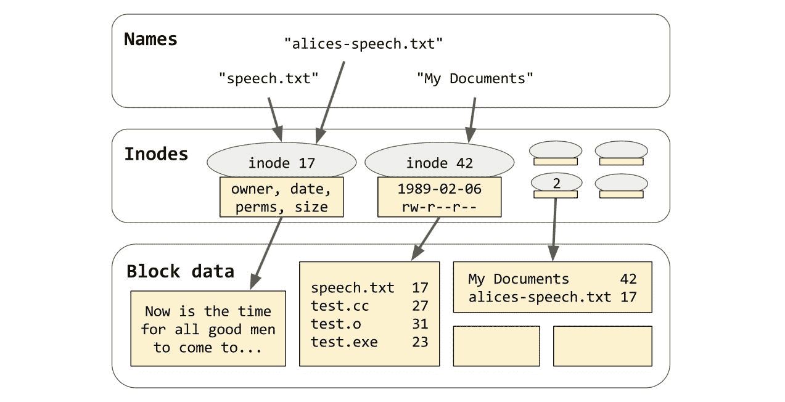

# 第十二章：文件系统

C++17 最大的新特性之一是其 `<filesystem>` 库。这个库，就像现代 C++ 的许多其他主要特性一样，起源于 Boost 项目。2015 年，它成为了一个标准技术规范以收集反馈，最终，根据这些反馈进行了一些修改后，被合并到 C++17 标准中。

在本章中，你将学习以下内容：

+   `<filesystem>` 如何返回动态类型错误而不抛出异常，以及你如何也能做到

+   *路径* 的格式，以及 POSIX 和 Windows 在这个问题上的根本不兼容立场

+   如何使用可移植的 C++17 来获取文件状态和遍历目录

+   如何创建、复制、重命名和删除文件和目录

+   如何获取文件系统的空闲空间

# 关于命名空间的一些说明

标准的 C++17 文件系统功能都包含在一个单独的头文件中，即 `<filesystem>`，并且该头文件中的所有内容都放置在其自己的命名空间中：`namespace std::filesystem`。这遵循了 C++11 的 `<chrono>` 头文件及其 `namespace std::chrono` 所设定的先例。（本书省略了对 `<chrono>` 的全面介绍。它与 `std::thread` 和 `std::timed_mutex` 的交互在 第七章，*并发* 中简要介绍。）

这种命名空间策略意味着当你使用 `<filesystem>` 功能时，你将使用诸如 `std::filesystem::directory_iterator` 和 `std::filesystem::temp_directory_path()` 这样的标识符。这些完全限定名称相当难以处理！但是，使用 `using` 声明将整个命名空间拉入当前上下文可能是一种过度行为，尤其是如果你需要在文件作用域中这样做。在过去十年中，我们都被告知永远不要写 `using namespace std`，而且无论标准库的命名空间嵌套有多深，这条建议都不会改变。考虑以下代码：

```cpp
    using namespace std::filesystem;

    void foo(path p)
    {
      remove(p); // What function is this?
    }
```

对于日常用途来说，更好的解决方案是在文件作用域（在`.cc`文件中）或命名空间作用域（在`.h`文件中）定义一个*命名空间别名*。命名空间别名允许你通过一个新名称来引用现有的命名空间，如下面的示例所示：

```cpp
    namespace fs = std::filesystem;

    void foo(fs::path p)
    {
      fs::remove(p); // Much clearer!
    }
```

在本章的剩余部分，我将使用命名空间别名 `fs` 来引用 `namespace std::filesystem`。当我提到 `fs::path` 时，我的意思是 `std::filesystem::path`。当我提到 `fs::remove` 时，我的意思是 `std::filesystem::remove`。

在某个全局位置定义一个命名空间别名 `fs` 也有另一个实用的好处。截至出版时，在所有主要的库供应商中，只有 Microsoft Visual Studio 声称已经实现了 C++17 `<filesystem>` 头文件。然而，`<filesystem>` 提供的功能与 `<experimental/filesystem>` 中由 libstdc++ 和 libc++ 提供的功能以及 Boost 中的 `<boost/filesystem.hpp>` 非常相似。因此，如果你始终通过自定义命名空间别名，如 `fs`，来引用这些功能，你将能够通过更改该别名的目标来从一家供应商的实现切换到另一家——只需一行更改，而不是在整个代码库上进行大量且容易出错的搜索和替换操作。这可以在以下示例中看到：

```cpp
    #if USE_CXX17
     #include <filesystem>
     namespace fs = std::filesystem;
    #elif USE_FILESYSTEM_TS
     #include <experimental/filesystem>
     namespace fs = std::experimental::filesystem;
    #elif USE_BOOST
     #include <boost/filesystem.hpp>
     namespace fs = boost::filesystem;
    #endif
```

# 关于错误报告的非常长的笔记

C++ 与错误报告有着爱恨交加的关系。在这里，“错误报告”指的是“当你无法完成所要求的事情时，应该怎么做”。在 C++ 中，报告这类“失望”的经典、典型且至今仍被视为最佳实践的方法是抛出一个异常。我们在前面的章节中看到，有时抛出异常是唯一合理的做法，因为没有其他方式可以返回调用者。例如，如果你的任务是构建一个对象，而构建失败，你无法返回；当构造函数失败时，唯一相同的行动就是抛出异常。然而，我们也已经看到（在第九章 Chapter 9*，Iostreams*），C++ 自身的 `<iostream>` 库并没有采取这种理智的行动！如果一个 `std::fstream` 对象的构建失败（因为无法打开指定的文件），你会得到一个异常；你将得到一个完全构建的 `fstream` 对象，其中 `f.fail() && !f.is_open()`。

我们在第九章[Chapter 9](https://cdp.packtpub.com/mastering_c___stl/wp-admin/post.php?post=64&action=edit#post_58)*，Iostreams* 中给出的理由是 `fstream` 的“不良”行为是“相对较高的文件无法打开的可能性”。每次文件无法打开时都抛出异常，这让人不舒服地接近使用异常进行控制流，这是我们被正确教导要避免的。因此，而不是强迫程序员在所有地方都编写 `try` 和 `catch` 块，库返回操作似乎已成功完成，但允许用户检查（使用正常的 `if`，而不是 `catch`）操作是否真的成功了。

也就是说，我们可以避免编写以下繁琐的代码：

```cpp
    try {
      f.open("hello.txt");
      // Opening succeeded.
    } catch (const std::ios_base::failure&) {
      // Opening failed.
    }
```

相反，我们可以简单地写这个：

```cpp
    f.open("hello.txt");
    if (f.is_open()) {
      // Opening succeeded.
    } else {
      // Opening failed.
    }
```

当操作的结果可以用一个重型的对象（如 `fstream`）描述，该对象具有自然的 *失败* 状态，或者在设计阶段可以添加这样的 *失败* 状态时，iostreams 方法工作得相当好。然而，它也有一些缺点，如果没有涉及重型的类型，则根本不能使用。我们在 第九章 的末尾看到了这种情况，*iostreams*，当时我们讨论了从字符串中解析整数的方法。如果我们不期望失败，或者不介意“使用异常进行控制流”的性能损失，那么我们使用 `std::stoi`：

```cpp
    // Exception-throwing approach.
    try {
      int i = std::stoi(s);
      // Parsing succeeded.
    } catch (...) {
      // Parsing failed.
    }
```

如果我们需要 C++03 的可移植性，我们使用 `strtol`，它通过线程局部全局变量 `errno` 报告错误，如以下代码所示：

```cpp
    char *endptr = nullptr;
    errno = 0;
    long i = strtol(s, &endptr, 10);
    if (endptr != s && !errno) {
      // Parsing succeeded.
    } else {
      // Parsing failed.
    }
```

而在 bleeding-edge C++17 风格中，我们使用 `std::from_chars`，它返回一个包含字符串结束指针和表示成功或失败的强枚举类型 `std::errc` 的轻量级结构体，如下所示：

```cpp
    int i = 0;
    auto [ptr, ec] = std::from_chars(s, end(s), i);
    if (ec != std::errc{}) {
      // Parsing succeeded.
    } else {
      // Parsing failed.
    }
```

`<filesystem>` 库在错误报告方面的容量大约与 `std::from_chars` 相同。几乎你可以在文件系统中进行的任何操作都可能因为系统上运行的其他进程的操作而失败；因此，每次失败时抛出异常（类似于 `std::stoi`）似乎与使用异常进行控制流非常接近。但是，将“错误结果”如 `ec` 在整个代码库中传递也可能很繁琐，并且（不是字面意义上的）容易出错。因此，标准库决定既要吃蛋糕又要吃蛋糕，为 `<filesystem>` 头文件中的几乎每个函数都提供了 *两个接口*！

例如，以下是在磁盘上确定文件大小的两个 `<filesystem>` 函数：

```cpp
    uintmax_t file_size(const fs::path& p);

    uintmax_t file_size(const fs::path& p,
       std::error_code& ec) noexcept;
```

前面的两个函数都接受一个 `fs::path`（我们将在本章后面进一步讨论），并返回一个 `uintmax_t`，表示以字节为单位命名的文件的大小。但如果文件不存在，或者文件存在，但当前用户账户没有查询其大小的权限呢？那么，第一个重载将简单地 *抛出一个异常*，类型为 `fs::filesystem_error`，指示出了什么问题。但第二个重载永远不会抛出（实际上，它被标记为 `noexcept`）。相反，它接受一个类型为 `std::error_code` 的输出参数，库将填充一个指示出错的指示（如果没有出错，则清除）。

比较一下 `fs::file_size` 和 `std::from_chars` 的签名，你可能会注意到 `from_chars` 处理的是 `std::errc`，而 `file_size` 处理的是 `std::error_code`。这两个类型虽然相关，但并不相同！要理解这种差异——以及非抛出 `<filesystem>` API 的整个设计——我们不得不快速浏览一下 C++11 标准库的另一个部分。

# 使用 `<system_error>`

`std::from_chars` 和 `fs::file_size` 的错误报告机制之间的区别在于它们固有的复杂性。`from_chars` 可以以两种方式失败——要么给定的字符串根本没有任何初始数字字符串，要么有太多的数字，以至于读取它们会导致溢出。在前一种情况下，报告错误的一个经典（但效率低下且通常危险的）方法是将 `errno` 设置为 `EINVAL`（并返回一些无用的值，如 `0`）。在后一种情况下，一个经典的方法是将 `errno` 设置为 `ERANGE`（并返回一些无用的值）。这大致上是（但远不如前者）`strtol` 所采取的方法。

突出的要点是，使用 `from_chars` 时，可能出错的两种情况是完全可以由 POSIX `<errno.h>` 提供的单个错误代码集来描述的。因此，为了将 1980 年代的 `strtol` 带入 21 世纪，我们只需要修复使其直接将错误代码返回给调用者，而不是通过线程局部 `errno` 间接返回。这就是标准库所做的一切。经典的 POSIX `<errno.h>` 值仍然通过 `<cerrno>` 作为宏提供，但自 C++11 以来，它们也通过 `<system_error>` 中的强类型枚举提供，如下面的代码所示：

```cpp
 namespace std {
   enum class errc {
     // implicitly, "0" means "no error"
     operation_not_permitted = EPERM,
     no_such_file_or_directory = ENOENT,
     no_such_process = ESRCH,
     // ...
     value_too_large = EOVERFLOW
   };
 } // namespace std
```

`std::from_chars` 通过返回一个包含类型为 `enum std::errc` 的成员变量的结构体（`struct from_chars_result`）来报告错误，该成员变量可以是 `0` 表示 *无错误*，或者两个可能的错误指示值之一。

那么，关于 `fs::file_size` 呢？`file_size` 可能遇到的一组错误要多得多——实际上，当你想到存在的操作系统的数量，以及每个操作系统支持的不同文件系统的数量，以及某些文件系统（如 NFS）分布在各种类型的 *网络* 上时，可能出现的错误集合看起来就像一个 *开集*。可能可以将它们全部归结为七十八个标准的 `sys::errc` 枚举器（每个 POSIX `errno` 值一个，除了 `EDQUOT`、`EMULTIHOP` 和 `ESTALE`），但这会丢失很多信息。实际上，至少缺失的 POSIX 枚举器之一（`ESTALE`）是 `fs::file_size` 的一个合法失败模式！当然，你的底层文件系统可能想要报告它自己的特定于文件系统的错误；例如，虽然有一个标准的 POSIX 错误代码用于 *名称过长*，但没有 POSIX 错误代码用于 *名称包含不允许的字符*（原因将在本章下一主要部分中看到）。文件系统可能想要报告那个错误，而不用担心 `fs::file_size` 会将其压缩到某种固定的枚举类型中。

这里基本的问题是，`fs::file_size`报告的错误可能并不都来自同一个*域*，因此，它们不能由一个固定的*类型*（例如，`std::errc`）来表示。C++异常处理优雅地解决了这个问题；程序的不同级别抛出不同类型的异常是正常且自然的。如果程序最低级别抛出`myfs::DisallowedCharacterInName`，则最高级别可以捕获它——无论是通过名称、基类还是通过`...`。如果我们遵循在程序中抛出的所有内容都应该从`std::exception`派生的通用规则，那么任何`catch`块都将能够使用`e.what()`，这样至少用户可以得到一些模糊上可读的问题指示，无论问题是什么。

标准库将多个错误域的概念具体化为基类`std::error_category`，如下面的代码所示：

```cpp
 namespace std {

 class error_category {
 public:
   virtual const char *name() const noexcept = 0;
   virtual std::string message(int err) const = 0;

   // other virtual methods not shown

   bool operator==(const std::error_category& rhs) const {
     return this == &rhs;
   }
 };

 } // namespace std
```

`error_category`的行为与第八章中提到的`memory_resource`非常相似，*分配器*；它定义了一个经典的多态接口，某些类型的库预期会从它派生。我们看到了，一些`memory_resource`的子类是全球单例，而另一些则不是。对于`error_category`，*每个*子类*必须*是一个全局单例，否则它将无法工作。

为了使内存资源有用，库为我们提供了*容器*（参见第四章，*容器动物园*）。在最基本层面上，一个容器是一个表示某些已分配内存的指针，以及一个指向*内存资源*的句柄，该资源知道如何释放该指针。（回想一下，指向内存资源的句柄被称为*分配器*。）

为了使`error_category`子类有用，库为我们提供了`std::error_code`。在最基本层面上（在这个例子中，这是*唯一*的层面），一个`error_code`是一个表示错误枚举的`int`值，以及一个指向`error_category`的句柄，该句柄知道如何解释该枚举。它看起来是这样的：

```cpp
    namespace std {

    class error_code {
      const std::error_category *m_cat;
      int m_err;
    public:
      const auto& category() const { return m_cat; }
      int value() const { return m_err; }
      std::string message() const { return m_cat->message(m_err); }
      explicit operator bool() const { return m_err != 0; }

      // other convenience methods not shown
    };

    } // namespace std
```

因此，要创建一个挑剔的文件系统库子系统，我们可以编写以下代码：

```cpp
    namespace FinickyFS {

    enum class Error : int {
      success = 0,
      forbidden_character = 1,
      forbidden_word = 2,
      too_many_characters = 3,
    };

    struct ErrorCategory : std::error_category
    {
      const char *name() const noexcept override {
        return "finicky filesystem";
      }

      std::string message(int err) const override {
        switch (err) {
          case 0: return "Success";
          case 1: return "Invalid filename";
          case 2: return "Bad word in filename";
          case 3: return "Filename too long";
        }
        throw Unreachable();
      }

      static ErrorCategory& instance() {
        static ErrorCategory instance;
        return instance;
      }
    };

    std::error_code make_error_code(Error err) noexcept
   {
      return std::error_code(int(err), ErrorCategory::instance());
    }

    } // namespace FinickyFS
```

上述代码定义了一个新的错误域，即`FinickyFS::Error`域，通过`FinickyFS::ErrorCategory::instance()`实例化。这允许我们通过如`make_error_code(FinickyFS::Error::forbidden_word)`这样的表达式创建`std::error_code`类型的对象。

注意，**依赖参数的查找**（**ADL**）将无需我们的任何帮助就找到`make_error_code`的正确重载。`make_error_code`与`swap`一样，是一个定制点：只需在枚举的命名空间中定义一个具有该名称的函数，它就会工作而无需任何额外的工作。

```cpp
    // An error fits comfortably in a statically typed
    // and value-semantic std::error_code object...
    std::error_code ec =    
      make_error_code(FinickyFS::Error::forbidden_word);

    // ...Yet its "what-string" remains just as
    // accessible as if it were a dynamically typed
    // exception!
    assert(ec.message() == "Bad word in filename");
```

现在我们有了一种方法，可以通过将它们包装在简单可复制的 `std::error_code` 对象中来无损地传递 `FinickyFS::Error` 代码——并在最高级别获取原始错误。当我那样说的时候，它听起来几乎像是魔法——就像没有异常的异常处理！但正如我们刚才看到的，实现起来非常简单。

# 错误代码和错误条件

注意到 `FinickyFS::Error` 不能隐式转换为 `std::error_code`；在最后一个例子中，我们使用了 `make_error_code(FinickyFS::Error::forbidden_word)` 语法来构造我们的初始 `error_code` 对象。如果我们告诉 `<system_error>` 启用从 `FinickyFS::Error` 到 `std::error_code` 的隐式转换，那么 `FinickyFS::Error` 对程序员来说会更加方便，如下所示：

```cpp
    namespace std {
    template<>
    struct is_error_code_enum<::FinickyFS::Error> : true_type {};
    } // namespace std
```

在重新打开 `std` 命名空间时要小心——记住，当你这样做的时候，你必须处于任何其他命名空间之外！否则，你将创建一个嵌套的命名空间，例如 `FinickyFS::std` 命名空间。在这种情况下，如果你出错，编译器会在你尝试特化不存在的 `FinickyFS::std::is_error_code_enum` 时友好地报错。只要你在特化模板时只重新打开 `std` 命名空间（并且只要你不搞砸模板特化语法），你就不必太担心任何 *静默* 失败。

一旦你为你的枚举类型特化了 `std::is_error_code_enum`，库就会处理其余部分，如下代码所示：

```cpp
    class error_code {
      // ...
      template<
        class E,
        class = enable_if_t<is_error_code_enum_v<E>>
      >
      error_code(E err) noexcept {
        *this = make_error_code(err);
      }
    };
```

之前代码中看到的隐式转换使得方便的语法变得可能，例如通过 `==` 进行直接比较，但由于每个 `std::error_code` 对象都携带其域，比较是强类型的。`error_code` 对象的值相等不仅取决于它们的 *整数* *值*，还取决于它们相关错误类别单例的 *地址*。

```cpp
    std::error_code ec = FinickyFS::Error::forbidden_character;

      // Comparisons are strongly typed.
    assert(ec == FinickyFS::Error::forbidden_character);
    assert(ec != std::io_errc::stream);
```

特化 `is_error_code_enum<X>` 对于你经常将 `X` 赋值给 `std::error_code` 类型的变量，或者从返回 `std::error_code` 的函数中返回 `X` 来说是有帮助的。换句话说，如果你的类型 `X` 真正代表 *错误的来源*——方程的抛出方，那么关于捕获方呢？假设你注意到你已经编写了这个函数，以及几个类似的函数：

```cpp
    bool is_malformed_name(std::error_code ec) {
      return (
        ec == FinickyFS::Error::forbidden_character ||
        ec == FinickyFS::Error::forbidden_word ||
        ec == std::errc::illegal_byte_sequence);
    }
```

前面的函数定义了一个在整个错误代码宇宙上的 *一元* *谓词*；就我们的 `FinickyFS` 库而言，它对任何与名称格式错误概念相关的错误代码返回 `true`。我们只需将此函数直接放入我们的库中作为 `FinickyFS::is_malformed_name()`——实际上，这正是我个人的推荐做法——但标准库还提供了另一种可能的方法。你可以定义一个 `error_condition` 而不是 `error_code`，如下所示：

```cpp
    namespace FinickyFS {

    enum class Condition : int {
      success = 0,
      malformed_name = 1,
    };

    struct ConditionCategory : std::error_category {
      const char *name() const noexcept override {
        return "finicky filesystem";
      }
      std::string message(int cond) const override {
        switch (cond) {
          case 0: return "Success";
          case 1: return "Malformed name";
        }
        throw Unreachable();
      }
      bool equivalent(const std::error_code& ec, int cond) const  
      noexcept override {
        switch (cond) {
          case 0: return !ec;
          case 1: return is_malformed_name(ec);
        }
        throw Unreachable();
      }
      static ConditionCategory& instance() {
        static ConditionCategory instance;
        return instance;
      }
    };
    std::error_condition make_error_condition(Condition cond) noexcept  
    {
      return std::error_condition(int(cond),  
      ConditionCategory::instance());
    }

    } // namespace FinickyFS

    namespace std {
    template<>
    struct is_error_condition_enum<::FinickyFS::Condition> : true_type  
    {};
    } // namespace std
```

一旦完成这些，你可以通过编写比较 `(ec == FinickyFS::Condition::malformed_name)` 来获得调用 `FinickyFS::is_malformed_name(ec)` 的效果，如下所示：

```cpp
    std::error_code ec = FinickyFS::Error::forbidden_word;

      // RHS is implicitly converted to error_code
    assert(ec == FinickyFS::Error::forbidden_word);

      // RHS is implicitly converted to error_condition
    assert(ec == FinickyFS::Condition::malformed_name);
```

然而，因为我们没有提供一个函数 `make_error_code(FinickyFS::Condition)`，将无法轻松构造一个包含这些条件的 `std::error_code` 对象。这是合适的；条件枚举是在捕获侧进行测试的，而不是在抛出侧转换为 `error_code`。

标准库提供了两种代码枚举类型（`std::future_errc` 和 `std::io_errc`），以及一种条件枚举类型（`std::errc`）。没错——POSIX 错误枚举 `std::errc` 实际上枚举的是 *条件*，而不是 *代码*！这意味着如果你试图将 POSIX 错误代码塞入一个 `std::error_code` 对象中，你做错了；它们是 *条件*，这意味着它们是在捕获侧 *测试* 的，而不是用于抛出的。遗憾的是，标准库至少在两个方面犯了错误。首先，正如我们所看到的，`std::from_chars` 会抛出一个 `std::errc` 类型的值（这很不方便；抛出一个 `std::error_code` 会更一致）。其次，存在一个函数 `std::make_error_code(std::errc)`，这会弄乱语义空间，而实际上只需要存在 `std::make_error_condition(std::errc)`（它确实存在）。

# 使用 std::system_error 抛出错误

到目前为止，我们考虑了 `std::error_code`，这是 C++ 异常处理的一个巧妙的非抛出替代方案。但有时，你需要在不同级别的系统中混合非抛出和抛出库。标准库为你解决了问题——至少是问题的一半。`std::system_error` 是从 `std::runtime_error` 派生出的具体异常类型，它有足够的空间存储单个 `error_code`。因此，如果你正在编写一个基于抛出而不是 `error_code` 的库 API，并且从系统较低级别收到表示失败的 `error_code`，将那个 `error_code` 包装在 `system_error` 对象中并向上抛出是完全合适的。

```cpp
    // The lower level is error_code-based.
    uintmax_t file_size(const fs::path& p,
        std::error_code& ec) noexcept;

    // My level is throw-based.
    uintmax_t file_size(const fs::path& p)
    {
      std::error_code ec;
      uintmax_t size = file_size(p, ec);
      if (ec) {
        throw std::system_error(ec);
      }
      return size;
    }
```

在相反的情况下——当你编写了非抛出异常的库 API，但你调用较低级别的可能抛出异常的代码时——标准库基本上没有提供帮助。但你可以自己轻松地编写一个 `error_code` 解包器：

```cpp
    // The lower level is throw-based.
    uintmax_t file_size(const fs::path& p);

    // My level is error_code-based.
    uintmax_t file_size(const fs::path& p,
        std::error_code& ec) noexcept
    {
      uintmax_t size = -1;
      try {
        size = file_size(p);
      } catch (...) {
        ec = current_exception_to_error_code();
      }
      return size;
    }
current_exception_to_error_code(), which is a non-standard function you can write yourself. I recommend something along these lines:
```

```cpp
 namespace detail {

 enum Error : int {
    success = 0,
    bad_alloc_thrown = 1,
    unknown_exception_thrown = 2,
 };
 struct ErrorCategory : std::error_category {
    const char *name() const noexcept override;
    std::string message(int err) const override;
    static ErrorCategory& instance();
 };
 std::error_code make_error_code(Error err) noexcept {
    return std::error_code(int(err), ErrorCategory::instance());
 }

 } // namespace detail

 std::error_code current_exception_to_error_code()
 {
    try {
        throw;
    } catch (const std::system_error& e) {
        // also catches std::ios_base::failure
        // and fs::filesystem_error
        return e.code();
    } catch (const std::future_error& e) {
        // catches the oddball
        return e.code();
    } catch (const std::bad_alloc&) {
        // bad_alloc is often of special interest
        return detail::bad_alloc_thrown;
    } catch (...) {
        return detail::unknown_exception_thrown;
    }
 }
```

这就结束了我们对 `<system_error>` 中混乱世界的离题讨论。我们现在回到你正在进行的常规 `<filesystem>`。

# 文件系统和路径

在 第九章 *Iostreams* 中，我们讨论了 POSIX 的文件描述符概念。

表示数据源或汇，可以通过 `read` 和/或 `write` 来定位；通常，但不总是，它对应于磁盘上的一个文件。（回想一下，文件描述符号 `1` 指的是 `stdout`，它通常连接到人类的屏幕。文件描述符还可以指网络套接字、例如 `/dev/random` 的设备等。）

此外，POSIX 文件描述符、`<stdio.h>` 和 `<iostream>` 都与磁盘上文件（或任何地方）的 *内容* 有关，具体来说，是与构成文件 *内容* 的字节序列有关。在 *文件系统* 意义上的文件有许多显著的属性，这些属性并未通过文件读取和写入 API 暴露出来。我们不能使用第九章的 API，即 *Iostreams*，来确定文件的所有权或其最后修改日期；也不能确定给定目录中的文件数量。《<filesystem>`的目的就是允许我们的 C++程序以可移植、跨平台的方式与这些 *文件系统* 属性交互。

让我们再次开始。什么是文件系统？文件系统是通过 *路径* 到 *文件* 的 *目录条目* 的抽象映射。如果你能以宽容的心态看待，也许一个图表会帮到你：



在前面图的最上方，我们有一个相对抽象的“名称”世界。我们有一个从那些名称（如 `speech.txt`）到 POSIX 称为 *inode* 的具体结构的映射。术语“inode”在 C++标准中并未使用——它使用通用术语“文件”——但当我需要精确时，我会尝试使用 inode 这个术语。每个 inode 包含一组完整的属性，描述磁盘上的单个文件：其所有者、其最后修改日期、其 *类型* 等。最重要的是，inode 还确切地说明了文件的大小，并提供了一个指向其实际内容的指针（类似于`std::vector`或`std::list`持有指向其内容的指针）。inode 和块在磁盘上的确切表示取决于你运行的是哪种类型的文件系统；一些常见文件系统的名称包括 ext4（在 Linux 上常见）、HFS+（在 OS X 上）和 NTFS（在 Windows 上）。

注意到图中的一些块包含的数据只是将 *名称* 映射到 *inode 编号* 的表格映射。这让我们回到了起点！一个 *目录* 只是一个具有特定 *类型* 的 inode，其内容是名称到 inode 编号的表格映射。每个文件系统都有一个特殊的、众所周知的 inode，称为其 *根目录*。

假设我们图中的 inode 标签为"`2`"的是*根目录*。那么我们可以明确地通过一系列从根目录到该文件的名称路径来识别包含"现在是时候..."的文件。例如，`/My Documents/speech.txt`就是这样一条路径：从根目录开始，`My Documents`映射到 inode 42，这是一个包含`speech.txt`映射到 inode 17 的目录，它是一个包含磁盘上内容为"现在是时候..."的普通文件。我们使用斜杠将这些单个名称组合成一个路径，并在前面加上一个斜杠以表示我们从根目录开始。（在 Windows 中，每个分区或驱动器都有一个独立的根目录。因此，我们可能写成`c:/My Documents/speech.txt`来表示我们从驱动器 C 的根目录开始。）

或者，"`/alices-speech.txt`" 是从根目录直接指向 inode 17 的路径。我们说这两个路径（"`/My Documents/speech.txt`" 和 "`/alices-speech.txt`"）都是对同一底层 inode 的*硬链接*，也就是说，对同一底层*文件*的链接。某些文件系统（例如许多 USB 闪存驱动器使用的 FAT 文件系统）不支持对同一文件有多个硬链接。当支持多个硬链接时，文件系统必须计算每个 inode 的引用次数，以便知道何时可以安全地删除和释放 inode--这个过程与我们在第六章中看到的`shared_ptr`引用计数过程完全类似，即*智能指针*。

当我们要求库函数（如`open`或`fopen`）"打开文件"时，这就是它在文件系统内部深处所经历的过程。它接受你给出的文件名并将其视为*路径*--在斜杠处将其拆分，并进入文件系统的目录结构，直到最终到达你请求的文件的 inode（或者直到它遇到死胡同）。请注意，一旦我们到达 inode，就不再有意义地问"这个文件的名称是什么？"，因为它至少有与它的硬链接一样多的名称。

# 在 C++ 中表示路径

在第九章的*Iostreams*中，每个期望参数为"文件名"（即路径）的函数都乐于接受这个路径作为一个简单的 const char `*`。但在`<filesystem>`库中，我们将因为 Windows 而使这个情况复杂化。

所有 POSIX 文件系统都将名称（如`speech.txt`）存储为简单的原始字节字符串。POSIX 中的唯一规则是，你的名称不能包含`'\0'`，并且你的名称不能包含`'/'`（因为这是我们将要分割的字符）。在 POSIX 中，`"\xC1.h"`是一个完全有效的文件名，尽管它**不是**有效的 UTF-8，**不是**有效的 ASCII，并且当你`ls .`时它在屏幕上的显示完全取决于你的当前区域设置和代码页。毕竟，它只是一个由三个字节组成的字符串，其中没有一个字节是`'/'`。

另一方面，Windows 的本地文件 API，例如`CreateFileW`，总是以 UTF-16 存储名称。这意味着，根据定义，Windows 中的路径始终是有效的 Unicode 字符串。这是 POSIX 和 NTFS 之间的一大哲学差异！让我再慢一点说一遍：在 POSIX 中，文件名是**字节字符串**。在 Windows 中，文件名是**Unicode 字符字符串**。

如果你遵循第九章中的一般原则第九章，即世界上所有东西都应该使用 UTF-8 编码，那么 POSIX 和 Windows 之间的差异将是可管理的——也许甚至可以忽略不计。但如果你需要在某个系统上调试具有奇怪名称的文件的问题，请记住：在 POSIX 中，文件名是字节字符串。在 Windows 中，文件名是字符字符串。

由于 Windows API 期望 UTF-16 字符串（`std::u16string`）和 POSIX API 期望字节字符串（`std::string`），这两种表示方法对于跨平台库来说都不是完全合适的。因此，`<filesystem>`发明了一个新的类型：`fs::path`。（回想一下，在本章中我们使用的是我们的命名空间别名。实际上，那就是`std::filesystem::path`。）`fs::path`看起来像这样：

```cpp
    class path {
    public:
      using value_type = std::conditional_t<
        IsWindows, wchar_t, char
      >;
      using string_type = std::basic_string<value_type>;

      const auto& native() const { return m_path; }
      operator string_type() const { return m_path; }
      auto c_str() const { return m_path.c_str(); }

      // many constructors and accessors omitted
    private:
      string_type m_path;
    };
```

注意，在 Windows 中`fs::path::value_type`是`wchar_t`，尽管 C++11 的 UTF-16 字符类型`char16_t`可能更合适。这仅仅是库历史根源在 Boost 中的体现，Boost 的历史可以追溯到 C++11 之前。在本章中，每当提到`wchar_t`时，你可以假设我们在谈论 UTF-16，反之亦然。

要编写可移植的代码，请注意你使用的任何将`fs::path`转换为字符串的函数的返回类型。例如，请注意`path.c_str()`的返回类型不是 const char `*`——它是 const value_type `*`！

```cpp
    fs::path p("/foo/bar");

    const fs::path::value_type *a = p.c_str();
      // Portable, for whatever that's worth.

    const char *b = p.c_str();
      // OK on POSIX; compilation error on Windows.

    std::string s = p.u8string();
    const char *c = s.c_str();
      // OK on both POSIX and Windows.
      // Performs 16-to-8 conversion on Windows.
```

上述示例，情况`c`，保证可以编译，但在两个平台上的行为不同：在 POSIX 平台上，它会给你想要的原始字节字符串，而在 Windows 上，它会昂贵地将`path.native()`从 UTF-16 转换为 UTF-8（这正是你要求的——但如果你找到了避免请求的方法，你的程序可能会更快）。

`fs::path` 有一个模板构造函数，可以从几乎任何参数构建一个 `path`。参数可以是任何字符类型的序列（`char`、`wchar_t`、`char16_t` 或 `char32_t`），并且该序列可以表示为指向空终止字符串的指针、空终止字符串的 *迭代器*、`basic_string`、`basic_string_view` 或迭代器对。像往常一样，我提到这种大量的重载不是因为你想要使用它们中的任何一个，而是让你知道如何避免它们。

标准还提供了一个自由函数 `fs::u8path("path")`，它是 `fs::path("path")` 的同义词，但可能作为提醒，你传递的字符串应该是 UTF-8 编码的。我建议忽略 `u8path`。

这一切可能听起来比实际情况要可怕。请记住，如果你坚持使用 ASCII 文件名，你就不必担心编码问题；如果你记得避免使用“本地”访问器方法，`path.native()` 和 `path.c_str()`，以及避免隐式转换为 `fs::path::string_type`，那么你就不必过于担心可移植性。

# 路径操作

```cpp
x (except path itself) represents the return value of the member function path.x():
```

```cpp
    assert(root_path == root_name / root_directory);
    assert(path == root_name / root_directory / relative_path);
    assert(path == root_path / relative_path);

    assert(path == parent_path / filename);
    assert(filename == stem + extension);

    assert(is_absolute == !is_relative);
    if (IsWindows) {
      assert(is_relative == (root_name.empty() ||  
    root_directory.empty()));
    } else {
      assert(is_relative == (root_name.empty() &&  
    root_directory.empty()));
    }
```

例如，给定路径 `p = "c:/foo/hello.txt"`，我们有 `p.root_name() == "c:"`，`p.root_directory() == "/"`，`p.relative_path() == "foo/hello.txt"`，`p.stem() == "hello"`，和 `p.extension() == ".txt"`。至少，在 Windows 上是这样的！请注意，在 Windows 上，绝对路径需要根名称和根目录（`"c:foo/hello.txt"` 或 `"/foo/hello.txt"` 都不是绝对路径），而在 POSIX 中，由于不存在根名称，绝对路径只需要根目录（`"/foo/hello.txt"` 是绝对路径，而 `"c:foo/hello.txt"` 是以奇怪目录名称 `"c:foo"` 开头的相对路径）。

```cpp
operator/ to concatenate paths. fs::path supports both operator/ and operator/= for this purpose, and they do almost exactly what you'd expect--concatenate two pieces of a path with a slash in between them. If you want to concatenate pieces of a path without adding that slash, use operator+=. Unfortunately, the C++17 standard library is missing operator+ for paths, but it's easy to add as a free function, as follows:
```

```cpp
    static fs::path operator+(fs::path a, const fs::path& b)
    {
      a += b;
      return a;
    }
```

路径还支持在令人困惑的成员函数名 `path.concat("foo")`（不带斜杠）和 `path.append("foo")`(带斜杠) 下进行带斜杠和不带斜杠的连接。请注意，这与你的预期正好相反！因此，我强烈建议永远不要使用命名成员函数；始终使用运算符（可能包括你在前面代码中描述的自定义定义的 `operator+`）。

关于 `fs::path` 的最后一个可能令人困惑的问题是，它提供了 `begin` 和 `end` 方法，就像 `std::string` 一样。但与 `std::string` 不同，迭代的单位不是单个字符——迭代的单位是 *名称*！这在以下示例中可以看到：

```cpp
    fs::path p = "/foo/bar/baz.txt";
    std::vector<fs::path> v(p.begin(), p.end());
    assert((v == std::vector<fs::path>{
      "/", "foo", "bar", "baz.txt"
    }));
```

在实际代码中，你永远不会有一个迭代绝对 `fs::path` 的理由。在 `p.relative_path().parent_path()` 上迭代——其中每个迭代的元素都保证是目录名称——在特殊情况下可能有一些价值。

# 使用 directory_entry 检查文件状态

警告！`directory_entry` 是 C++17 `<filesystem>` 库中最前沿的部分。我即将描述的内容既不是由 Boost 实现的，也不是由 `<experimental/filesystem>` 实现的。

从文件的 inode 中检索文件元数据是通过查询类型为`fs::directory_entry`的对象来完成的。如果你熟悉 POSIX 方法来检索元数据，想象一下`fs::directory_entry`包含一个`type fs::path`类型的成员和一个`type std::optional<struct stat>`类型的成员。调用`entry.refresh()`基本上等同于调用 POSIX 函数`stat()`；调用任何`accessor`方法，例如`entry.file_size()`，如果可选成员仍然未连接，则会隐式调用`stat()`；如果可选成员已经连接，则可能只是使用上次查询时缓存的值。仅仅构造一个`fs::directory_entry`实例并不会查询文件系统；库会在你提出具体问题之前保持等待。提出具体问题，例如`entry.file_size()`，可能会使库查询文件系统，或者（如果可选成员已经连接）它可能只是使用上次查询时缓存的值。

```cpp
    fs::path p = "/tmp/foo/bar.txt";
    fs::directory_entry entry(p);
      // Here, we still have not touched the filesystem.

    while (!entry.exists()) {
       std::cout << entry.path() << " does not exist yet\n";
       std::this_thread::sleep_for(100ms);
       entry.refresh();
         // Without refresh(), this would loop forever.
    }
      // If the file is deleted right now, the following
      // line might print stale cached values, or it
      // might try to refresh the cache and throw.
    std::cout << entry.path() << " has size "
          << entry.file_size() << "\n";
```

实现相同目标的一种较老的方法是使用`fs::status("path")`或`fs::symlink_status("path")`来检索`fs::file_status`类的实例，然后通过诸如`status.type() == fs::file_type::directory`之类的繁琐操作从`file_status`对象中提取信息。我建议你不要尝试使用`fs::file_status`；最好使用`entry.is_directory()`等。对于喜欢自虐的人，你仍然可以直接从`directory_entry`中检索`fs::file_status`实例：`entry.status()`等同于`fs::status(entry.path())`，而`entry.symlink_status()`等同于`fs::symlink_status(entry.path())`，这反过来又是一个稍微快一点的等效操作。

`fs::status(entry.is_symlink() ? fs::read_symlink(entry.path()) : entry.path())`.

顺便提一下，自由函数`fs::equivalent(p, q)`可以告诉你两个路径是否都硬链接到同一个 inode；而`entry.hard_link_count()`可以告诉你这个特定 inode 的总硬链接数。（确定那些硬链接的*名称*的唯一方法是在整个文件系统中进行遍历；即使如此，你的当前用户账户可能没有权限对这些路径进行`stat`操作。）

# 使用 directory_iterator 遍历目录

`fs::directory_iterator`正是其名字所暗示的。这种类型的对象允许你逐个条目地遍历单个目录的内容：

```cpp
    fs::path p = fs::current_path();
      // List the current directory.
    for (fs::directory_entry entry : fs::directory_iterator(p)) {
      std::cout << entry.path().string() << ": "
      << entry.file_size() << " bytes\n";
    }
```

顺便提一下，注意前面代码中 `entry.path().string()` 的使用。这是必需的，因为 `operator<<` 在路径对象上表现得非常奇怪——它总是输出为如果你已经写下了 `std::quoted(path.string())`。如果你想输出路径本身，没有任何额外的引号，你总是必须在输出之前将其转换为 `std::string`。（同样，`std::cin >> path` 也不能用来从用户那里获取路径，但这不是很讨厌，因为你根本不应该使用 `operator>>`。有关从用户那里解析输入的更多信息，请参阅第九章 Chapters 9，*Iostreams*，和第十章 Chapter 10，*Regular Expressions*）。)

# 递归目录遍历

要以 Python 的 `os.walk()` 风格递归地遍历整个目录树，你可以使用以下基于先前代码片段的递归函数：

```cpp
    template<class F>
    void walk_down(const fs::path& p, const F& callback)
    {
      for (auto entry : fs::directory_iterator(p)) {
        if (entry.is_directory()) {
          walk_down(entry.path(), callback);
        } else {
          callback(entry);
        }
      }
    }
```

或者，你可以简单地使用一个 `fs::recursive_directory_iterator`：

```cpp
    template<class F>
    void walk_down(const fs::path& p, const F& callback)
    {
      for (auto entry : fs::recursive_directory_iterator(p)) {
        callback(entry);
      }
    }
```

`fs::recursive_directory_iterator` 的构造函数可以接受一个额外的 `fs::directory_options` 类型的参数，它修改了递归的确切性质。例如，你可以传递 `fs::directory_options::follow_directory_symlink` 来跟随符号链接，尽管如果恶意用户创建了一个指向其自身父目录的符号链接，这可能会是一个导致无限循环的好方法。

# 修改文件系统

`<filesystem>` 头文件的大多数功能都涉及检查文件系统，而不是修改它。但其中隐藏着一些宝贵的功能。许多这些函数似乎是为了使经典的 POSIX 命令行工具的效果在可移植的 C++ 中可用而设计的：

+   `fs::copy_file(old_path, new_path)`：将位于 `old_path` 的文件复制到一个新的文件（即新的 inode）中，类似于 `cp -n`。如果 `new_path` 已经存在，则出错。

+   `fs::copy_file(old_path, new_path, fs::copy_options::overwrite_existing)`: 将 `old_path` 复制到 `new_path`。如果可能，覆盖 `new_path`。如果 `new_path` 已存在且不是常规文件，或者它与 `old_path` 相同，则出错。

+   `fs::copy_file(old_path, new_path, fs::copy_options::update_existing)`: 将 `old_path` 复制到 `new_path`。只有当 `new_path` 比位于 `old_path` 的文件旧时，才覆盖 `new_path`。

+   `fs::copy(old_path, new_path, fs::copy_options::recursive | fs::copy_options::copy_symlinks)`: 以 `cp -R` 的方式将整个目录从 `old_path` 复制到 `new_path`。

+   `fs::create_directory(new_path)`: 以 `mkdir` 的方式创建一个目录。

+   `fs::create_directories(new_path)`: 以 `mkdir -p` 的方式创建一个目录。

+   `fs::create_directory(new_path, old_path)`（注意参数的顺序反转！）：创建一个目录，但其属性来自 `old_path` 目录。

+   `fs::create_symlink(old_path, new_path)`: 从 `new_path` 创建指向 `old_path` 的符号链接。

+   `fs::remove(path)`: 以 `rm` 的方式删除文件或空目录。

+   `fs::remove_all(path)`: 以 `rm -r` 的方式删除文件或目录。

+   `fs::rename(old_path, new_path)`: 通过 `mv` 重命名文件或目录。

+   `fs::resize_file(path, new_size)`: 通过零扩展或截断常规文件。

# 报告磁盘使用情况

说到经典的命令行工具，我们可能还想要对文件系统做的一件事是询问它有多满。这是命令行工具 `df -h` 或 POSIX 库函数 `statvfs` 的领域。在 C++17 中，我们可以使用 `fs::space("path")` 来实现，它返回一个类型为 `fs::space_info` 的结构体：

```cpp
 struct space_info {
    uintmax_t capacity;
    uintmax_t free;
    uintmax_t available;
 };
```

每个这些字段都是以字节为单位的，我们应该有 `available <= free <= capacity`。`available` 和 `free` 之间的区别与用户限制有关：在一些文件系统中，一部分空闲空间可能被保留给 root 用户，而在其他系统中，可能会有每个用户账户的磁盘配额。

# 摘要

使用命名空间别名以节省输入，并允许使用替代实现

库命名空间，例如 Boost。

`std::error_code` 提供了一种非常巧妙的方式来向上传递整数错误代码，而不需要异常处理；如果你在一个不赞成异常处理的领域中工作，请考虑使用它。（在这种情况下，这可能是你从这个特定章节中能得到的唯一东西！`<filesystem>` 库提供了抛出异常和非抛出异常的 API；然而，两个 API 都使用堆分配（并且可能抛出 `fs::path` 作为词汇类型。使用非抛出 API 的唯一原因是在某些情况下消除“使用异常进行控制流”的情况。）

`std::error_condition` 只提供了“捕获”错误代码的语法糖；像瘟疫一样避免使用它。

一个 `path` 由一个 `root_name`、一个 `root_directory` 和一个 `relative_path` 组成；最后一个是由斜杠分隔的 `names`。对于 POSIX，一个 `name` 是一串原始字节；对于 Windows，一个 `name` 是一串 Unicode 字符。`fs::path` 类型试图为每个平台使用适当的字符串类型。为了避免可移植性问题，请注意 `path.c_str()` 和隐式转换为 `fs::path::string_type`。

目录存储从 `names` 到 `inodes` 的映射（C++ 标准将其称为“files”）。在 C++ 中，你可以通过 `fs::directory_iterator` 循环来检索 `fs::directory_entry` 对象；`fs::directory_entry` 上的方法允许你查询相应的 inode。重置 inode 就像调用 `entry.refresh()` 一样简单。

`<filesystem>` 提供了一系列用于创建、复制、重命名、删除和调整文件和目录大小的免费函数，以及一个用于获取文件系统总容量的最后函数。

本章讨论的大部分内容（至少是 `<filesystem>` 部分）都是 C++17 的前沿技术，截至出版时，任何编译器供应商都没有实现。使用这些新功能时请谨慎。
