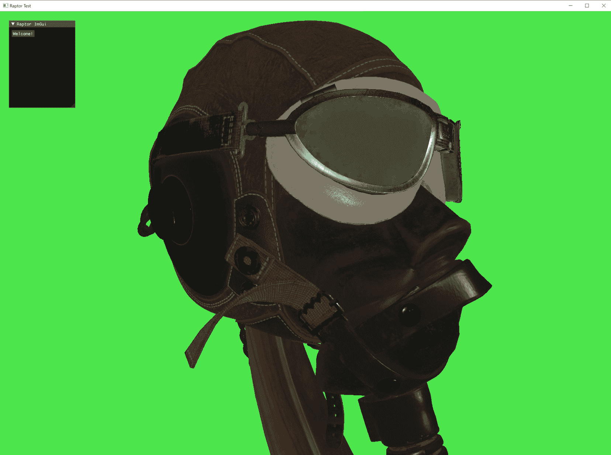
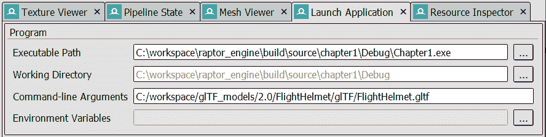
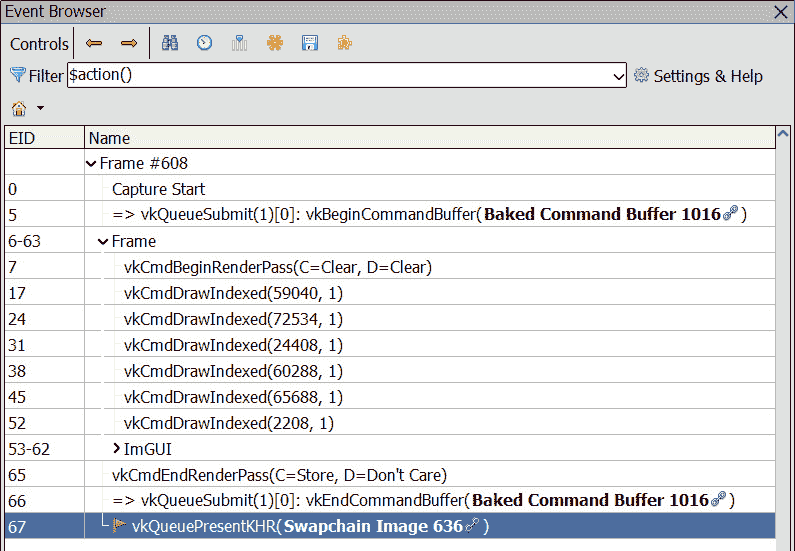
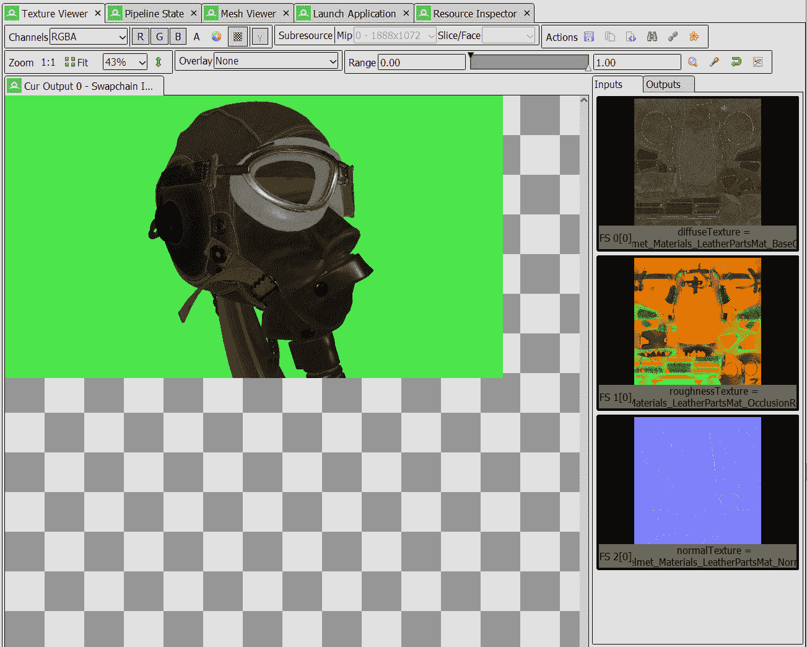

# 1

# 介绍 Raptor 引擎和 Hydra

当我们开始编写本书时，我们决定我们的目标是开始于一个传统的 Vulkan 教程可能结束的地方。无论是印刷品还是网络上的资源，都有很多很好的资源可以帮助初学者发现和理解 Vulkan API。

我们决定编写这本书，因为我们感觉到这些入门教程和更高级的材料之间存在差距。其中一些主题可能在文章和博客文章中有所涉及，但我们找不到一个资源能够将它们组织成一个单一和连贯的格式。

虽然我们假设您对 Vulkan 有一定的了解，但在本章中，我们有机会回顾一些我们将贯穿本书剩余部分的基本概念。我们将展示本书中使用的代码组织、类和库。

在本章中，我们将涵盖以下主要主题：

+   如何阅读本书

+   理解代码结构

+   理解 glTF 场景格式

+   物理渲染概述

+   关于 GPU 调试的一些建议

到本章结束时，您将熟悉 Raptor 引擎和本书中开发的渲染框架。您还将了解 glTF 模型格式的结构和物理渲染背后的基本概念。

# 技术要求

您需要一个至少支持 Vulkan 1.1 的 GPU。在本书编写时，Vulkan 1.3 刚刚发布，许多厂商，如 AMD 和 Nvidia，都提供了第一天支持。我们保留了较低的要求，以便尽可能多的人能够跟随学习。

一些后续章节将使用一些较老显卡可能不具备的硬件功能。 wherever possible, we will provide an alternative software solution. If it’s not feasible, we try to focus more on the generic aspects of the implementation and less on the API details.

本章的完整代码可在 GitHub 上找到，链接为 [`github.com/PacktPublishing/Mastering-Graphics-Programming-with-Vulkan/tree/main/source/chapter1`](https://github.com/PacktPublishing/Mastering-Graphics-Programming-with-Vulkan/tree/main/source/chapter1)。

## Windows

代码已在 Windows 系统上使用 Visual Studio 2019 16.11 和 Vulkan SDK 版本 1.2.198.1 进行了测试（在编写本书时，这可能会发生变化）。

要在 Windows 上安装 Vulkan SDK，您需要下载并运行以下可执行文件：

[`sdk.lunarg.com/sdk/download/1.2.198.1/windows/VulkanSDK-1.2.198.1-Installer.exe`](https://sdk.lunarg.com/sdk/download/1.2.198.1/windows/VulkanSDK-1.2.198.1-Installer.exe%0D)

在安装 Vulkan SDK 后，请确保您可以在`Bin`文件夹中运行 `vulkaninfoSDK.exe` 程序，以确认 SDK 已正确安装，并且您的图形驱动程序支持 Vulkan。

如果你需要关于安装过程的更多详细信息，请参考官方文档([`vulkan.lunarg.com/doc/sdk/latest/windows/getting_started.xhtml`](https://vulkan.lunarg.com/doc/sdk/latest/windows/getting_started.xhtml))。

我们提供了一个包含本书全部代码的 Visual Studio 解决方案，它允许你轻松地为每一章构建可执行文件。

一旦解决方案构建完成，将`Chapter1`项目设置为运行目标并运行程序。你应该看到以下内容：



图 1.1 – 渲染结果

## Linux

对于 Linux，我们使用了 Visual Studio Code、GCC 9 或更高版本以及 CMake 3.22.1。Vulkan SDK 的版本与 Windows 上的版本相匹配。我们在 Debian 11 和 Ubuntu 20.04 上进行了测试。

我们使用了 CMake 来支持不同的构建系统，但我们只测试了 Makefile。

要安装 Vulkan SDK，你需要下载此文件：[`sdk.lunarg.com/sdk/download/1.2.198.1/linux/vulkansdk-linux-x86_64-1.2.198.1.tar.gz`](https://sdk.lunarg.com/sdk/download/1.2.198.1/linux/vulkansdk-linux-x86_64-1.2.198.1.tar.gz)。

假设你已经将它下载到了`~/Downloads`文件夹中，通过运行以下命令来解压该包：

```cpp
$ tar -xvf vulkansdk-linux-x86_64-1.2.198.1.tar.gz
```

这将创建`1.2.198.1`顶级文件夹。

有两种方法可以使 SDK 可用于构建代码：

+   你可以将以下环境变量添加到你的`~/.bashrc`文件中（或者如果你不使用 Bash，那么是你的 shell 的主要配置文件）。请注意，你可能需要创建此文件：

    ```cpp
    export VULKAN_SDK=~/vulkan/1.2.198.1/x86_64
    ```

    ```cpp
    export PATH=$VULKAN_SDK/bin:$PATH
    ```

    ```cpp
    export LD_LIBRARY_PATH=$VULKAN_SDK/lib:
    ```

    ```cpp
    $LD_LIBRARY_PATH
    ```

    ```cpp
    export VK_LAYER_PATH=$VULKAN_SDK/etc/vulkan/
    ```

    ```cpp
    explicit_layer.d
    ```

+   另一种选择是将以下内容添加到你的`~/.bashrc`文件中：

    ```cpp
    source ~/Downloads/1.2.198.1/setup-env.sh
    ```

在你编辑了`~/.bashrc`文件之后，重启你的终端。现在你应该能够运行`vulkaninfo`了。如果不行，请再次尝试前面的步骤。如果你需要关于安装过程的更多详细信息，请参考官方 LunarG 指南([`vulkan.lunarg.com/doc/sdk/latest/linux/getting_started.xhtml`](https://vulkan.lunarg.com/doc/sdk/latest/linux/getting_started.xhtml))。

要生成构建文件，你需要运行以下命令：

```cpp
$ cmake -B build -DCMAKE_BUILD_TYPE=Debug
```

如果你想要创建一个发布版本，请运行以下命令：

```cpp
$ cmake -B build -DCMAKE_BUILD_TYPE=Release
```

这将在`build`文件夹中创建构建文件。当然，你也可以为文件夹使用不同的名称。

要为这一章构建代码，请运行以下命令：

```cpp
$ cmake --build build --target chapter1 -- -j 4
```

`-j`后面的数字告诉编译器使用多少线程并行编译代码。建议使用处理器核心数作为数值。

构建完成后，`Chapter1`可执行文件已经创建并准备好运行！

注意

在本书的编写过程中，我们的技术审查员和 Beta 读者对 Windows 和 Linux 的构建进行了测试，但可能有一些问题未被注意到。如果你有任何问题或想要报告问题，请打开 GitHub 问题或通过 Twitter 联系我们：`@marco_castorina`和`@GabrielSassone`。

## macOS

Vulkan 在 macOS 上不是原生可用的，但通过苹果开发的图形 API Metal 的转换层提供。这个转换层由 Vulkan SDK 和 MoltenVK 库提供。

由于这种间接性，并非所有功能和扩展都在 macOS 上可用。鉴于我们将在本书中使用一些高级功能，如光线追踪，我们不希望为 macOS 提供一个部分工作的代码版本。目前，这个平台不受支持。

# 如何阅读本书

我们已经组织了本书的内容，以便逐步构建更高级的功能。本书的高级章节将依赖于本书早期暴露的主题。因此，我们建议你按顺序阅读本书。

然而，关于光线追踪的一些后续章节可以按任何顺序阅读，因为它们涵盖了可以独立发展的主题。如果你已经在某个章节中对这个主题有所了解，我们仍然建议你快速浏览一下，因为你可能还会找到一些有价值的信息。

# 理解代码结构

在本节中，我们将深入探讨本书中使用的底层代码，并解释我们做出的一些决策背后的原因。

当我们开始考虑要使用的代码时，目标很明确：我们需要一个轻量级、简单且足够基础的代码，以便我们能够在此基础上进行构建。一个功能齐全的库会过于复杂。

此外，我们需要一些我们熟悉的东西来使开发过程更加顺利并增强我们的信心。

现在有多个优秀的库，例如 Sokol ([`github.com/floooh/sokol`](https://github.com/floooh/sokol)) 或 BGFX ([`github.com/bkaradzic/bgfx`](https://github.com/bkaradzic/bgfx))，以及其他一些库，但它们都有一些缺点，似乎存在问题。

例如，Sokol 虽然是一个优秀的库，但它不支持 Vulkan API，并且其接口仍然基于较旧的图形 API（如 OpenGL 和 D3D11）。

BGFX 是一个更完整的库，但它过于通用且功能丰富，以至于我们无法在此基础上进行构建。

经过一番研究，我们倾向于选择 Hydra 引擎——这是一个加布里埃尔在过去几年中开发，用于实验和撰写关于渲染文章的代码库。

以下是使用 Hydra 引擎（[`github.com/JorenJoestar/DataDrivenRendering`](https://github.com/JorenJoestar/DataDrivenRendering)）并逐步将其发展成为 Raptor 引擎的一些优势：

+   代码熟悉度

+   小巧简单的代码库

+   基于 Vulkan 的 API

+   没有高级功能，但强大的构建块

Hydra 引擎看起来完美，小巧但可用且熟悉。从 API 设计的角度来看，与其他两位作者过去使用的库相比，它具有明显的优势。

Gabriel 从头开始设计，通过本书演变代码时，对底层架构有全面了解。

从 Hydra 引擎开始，我们对一些代码进行了修改，使其更加专注于 Vulkan，因此诞生了 Raptor 引擎。在接下来的章节中，我们将简要地看一下代码架构，以便您熟悉将在所有章节中使用的构建块。

我们还将查看用于将网格、纹理和材料导入 Raptor 引擎的 glTF 数据格式。

## 代码层

Raptor 引擎是以基于层的思维方式创建的，其中一层只能与较低层交互。

这个选择是为了简化层之间的通信，简化 API 设计和最终用户期望的行为。

Raptor 有三个层：

+   基础

+   图形

+   应用

`source/raptor`。

每一章都有自己的`source/chapter1/graphics`实现。

在开发 Raptor 引擎时，我们根据所在的层强制执行通信方向，以便一层只能与同一层内的代码和底层交互。

在这种情况下，基础层只能与层内的其他代码交互，图形层可以与基础层交互，应用层与所有层交互。

可能会有需要从底层到上层进行通信的情况，解决这个问题的方法是，在上层创建代码来驱动底层之间的通信。

例如，`Camera`类定义在基础层，它是一个包含所有驱动渲染相机的数学代码的类。

如果我们需要用户输入来移动相机，比如用鼠标或游戏手柄，怎么办？

基于这个决定，我们在应用层创建了`GameCamera`，它包含输入代码，接收用户输入，并根据需要修改相机。

这种上层桥接将在代码的其他区域使用，并在需要时进行解释。

以下章节将为您概述主要层和一些基本代码，以便您熟悉将在整本书中使用的所有可用构建块。

### 基础层

基础层是一组不同的类，它们作为框架中所需一切的基本砖块。

这些类非常专业化，覆盖了不同的需求类型，但它们是构建本书中编写的渲染代码所必需的。它们包括数据结构、文件操作、日志记录和字符串处理。

虽然 C++标准库提供了类似的数据结构，但我们决定自己编写，因为在大多数情况下我们只需要功能子集。这也允许我们仔细控制和跟踪内存分配。

我们为了获得对内存生命周期更精细的控制和更好的编译时间，牺牲了一些舒适度（即自动释放内存）。这些至关重要的数据结构用于不同的需求，将在图形层中被大量使用。

我们将简要地回顾每个基础模块，以帮助您熟悉它们。

#### 内存管理

让我们从`source/raptor/foundation/memory.hpp`）开始。

在这里做出的一个关键 API 决策是采用显式分配模型，因此对于任何动态分配的内存，都需要一个分配器。这一点在代码库中的所有类中都有体现。

这个基础模块定义了不同分配器使用的主要分配器 API。

有`HeapAllocator`，基于`tlsf`分配器，一个固定大小的线性分配器，一个基于 malloc 的分配器，一个固定大小的栈分配器，以及一个固定大小的双栈分配器。

虽然我们不会在这里介绍内存管理技术，因为它与本书的目的不太相关，但您可以在代码库中窥见更专业的内存管理思维。

#### 数组

接下来，我们将查看`source/raptor/foundation/array.hpp`）。

可能是所有软件工程中最基本的数据结构，数组用于表示连续和动态分配的数据，其接口类似于更为人所知的`std::vector` ([`en.cppreference.com/w/cpp/container/vector`](https://en.cppreference.com/w/cpp/container/vector))。

与`std`实现相比，代码更简单，需要显式初始化分配器。

与`std::vector`相比，唯一的显著区别可能在于方法，例如`push_use()`，它扩展数组并返回新分配的元素以便填充，以及`delete_swap()`方法，它删除一个元素并将其与最后一个元素交换。

#### 哈希表

`source/raptor/foundation/hash_map.hpp`)是另一种基本的数据结构，因为它们提高了搜索操作的性能，并且在代码库中被广泛使用：每当需要根据一些简单的搜索标准（*按名称搜索纹理*）快速查找对象时，哈希表就是事实上的标准数据结构。

关于哈希表的信息量巨大，超出了本书的范围，但最近谷歌在其 Abseil 库中记录并共享了一个良好的哈希表全面实现（代码在此处可用：[`github.com/abseil/abseil-cpp`](https://github.com/abseil/abseil-cpp)）。

Abseil 哈希表是 SwissTable 哈希表的演变，每个条目存储一些额外的元数据以快速拒绝元素，使用线性探测插入元素，最后使用单指令多数据（SIMD）指令快速测试更多条目。

重要提示

对于了解 Abseil 哈希图实现背后的思想，有几篇很好的文章可以阅读。它们可以在以下位置找到：

**文章** **1**: [`gankra.github.io/blah/hashbrown-tldr/`](https://gankra.github.io/blah/hashbrown-tldr/%0D)

**文章** **2**: [`blog.waffles.space/2018/12/07/deep-dive-into-hashbrown/`](https://blog.waffles.space/2018/12/07/deep-dive-into-hashbrown/)

*文章 1*是关于这个主题的良好概述，而*文章 2*则对实现进行了更深入的探讨。

#### 文件操作

接下来，我们将查看`source/raptor/foundation/file.hpp`)。

在引擎中执行的一组常见操作是文件处理，例如，从硬盘读取纹理、着色器或文本文件。

这些操作遵循与 C 文件 API 类似的模式，例如`file_open`与`fopen`函数类似（[`www.cplusplus.com/reference/cstdio/fopen/`](https://www.cplusplus.com/reference/cstdio/fopen/)）。

在这个函数集里，也有一些用于创建和删除文件夹，或者一些如扩展文件名或路径扩展名的实用工具。

例如，要创建一个纹理，你首先需要在内存中打开纹理文件，然后将其发送到图形层以创建一个 Vulkan 表示，以便 GPU 能够正确使用。

#### 序列化

(`source/raptor/foundation/blob_serialization.hpp`)，将可读性文件转换为二进制对应物的过程也在这里。

这个主题非常广泛，信息并不像它应得的那么多，但一个好的起点是文章[`yave.handmade.network/blog/p/2723-how_media_molecule_does_serialization`](https://yave.handmade.network/blog/p/2723-how_media_molecule_does_serialization)，或者[`jorenjoestar.github.io/post/serialization_for_games`](https://jorenjoestar.github.io/post/serialization_for_games)。

我们将使用序列化来处理一些可读性文件（主要是 JSON 文件），并将它们转换为更定制的文件，以满足需要。

这个过程是为了加快文件加载速度，因为可读性格式非常适合表达事物并且可以修改，但可以创建二进制文件以满足应用程序的需求。

这是在任何游戏相关技术中的基本步骤，也称为**资源烘焙**。

为了本代码的目的，我们将使用最小化的序列化，但就像内存管理一样，这是设计任何高效代码时需要考虑的话题。

#### 日志

(`source/raptor/foundation/log.hpp`)是将一些用户定义的文本写入以帮助理解代码流程和调试应用程序的过程。

它可以用来写入系统的初始化步骤或报告一些带有附加信息的错误，以便用户可以使用。

代码中提供了一个简单的日志服务，提供添加用户定义的回调和拦截任何消息的选项。

日志使用的一个例子是 Vulkan 调试层，当需要时，它将任何警告或错误输出到日志服务，为用户提供关于应用程序行为的即时反馈。

#### 字符串处理

接下来，我们将查看`source/raptor/foundation/string.hpp`)。

字符串是用于存储文本的字符数组。在 Raptor 引擎中，需要干净地控制内存和简单的接口，这增加了编写自定义字符串代码的需求。

提供的主要类是`StringBuffer`类，它允许用户分配最大固定数量的内存，并在该内存中执行典型的字符串操作：连接、格式化和子字符串。

提供的第二种类型是`StringArray`类，它允许用户在连续的内存块中高效地存储和跟踪不同的字符串。

例如，当检索文件和文件夹列表时，这被使用。最后一个实用工具字符串类是`StringView`类，用于只读访问字符串。

#### 时间管理

接下来是`source/raptor/foundation/time.hpp`)）。

在开发自定义引擎时，时间管理非常重要，而拥有一些帮助计算不同时间间隔的函数正是时间管理函数的作用。

例如，任何应用程序都需要计算时间差，用于推进时间和各种方面的计算，通常被称为**delta time**。

这将在应用层手动计算，但使用时间函数来完成。它也可以用来测量 CPU 性能，例如，定位慢速代码或在执行某些操作时收集统计数据。

定时方法方便地允许用户以不同的单位计算时间间隔，从秒到毫秒。

#### 进程执行

最后一个实用工具区域是`source/raptor/foundation/process.hpp`)）——定义为在我们的代码中运行任何外部程序。

在 Raptor 引擎中，外部进程最重要的用途之一是执行 Vulkan 的着色器编译器，将 GLSL 着色器转换为 SPIR-V 格式，如[`www.khronos.org/registry/SPIR-V/specs/1.0/SPIRV.xhtml`](https://www.khronos.org/registry/SPIR-V/specs/1.0/SPIRV.xhtml)所示。Khronos 规范是着色器能够被 Vulkan 使用的必要条件。

我们已经介绍了所有不同的实用工具构建块（许多看似无关），它们涵盖了现代渲染引擎的基础。

这些基础本身与图形无关，但它们是构建一个允许最终用户完全控制所发生情况的图形应用程序所必需的，这代表了现代游戏引擎幕后所做工作的简化心态。

接下来，我们将介绍图形层，在那里可以看到一些基础组件的实际应用，并代表为本书开发的代码库中最重要的一部分。

### 图形层

最重要的架构层是图形层，这将是本书的主要焦点。图形将包括所有用于在屏幕上使用 GPU 绘制任何内容的 Vulkan 相关代码和抽象。

在源代码的组织中存在一个注意事项：由于本书分为不同的章节并且有一个 GitHub 仓库，因此需要对每个章节的图形代码进行快照；因此，图形代码将在每个章节的代码中重复并演变，贯穿整个游戏。

随着本书的进展，我们预计这个文件夹中的代码将增长，而不仅限于这里，因为我们还将开发着色器并使用其他数据资源，但了解我们从哪里开始或特定时间在书中的位置是基本的。

再次强调，API 设计来自 Hydra 如下：

+   使用包含所有必要参数的`creation`结构创建图形资源

+   资源作为句柄外部传递，因此它们易于复制并且安全传递

这一层的主要类是`GpuDevice`类，它负责以下内容：

+   Vulkan API 抽象和用法

+   图形资源的创建、销毁和更新

+   创建、销毁、调整大小和更新交换链

+   命令缓冲区请求和提交到 GPU

+   GPU 时间戳管理

+   GPU-CPU 同步

我们将图形资源定义为任何位于 GPU 上的东西，例如以下内容：

+   **纹理**：用于读取和写入的图像

+   **缓冲区**：同质或异质数据的数组

+   **采样器**：从原始 GPU 内存转换为着色器所需的任何内容

+   **着色器**：SPIR-V 编译的 GPU 可执行代码

+   **管线**：GPU 状态的几乎完整快照

图形资源的使用是任何类型渲染算法的核心。

因此，`GpuDevice` (`source/chapter1/graphics/gpu_device.hpp`) 是创建渲染算法的入口。

下面是`GpuDevice`接口资源的一个片段：

```cpp
struct GpuDevice {
  BufferHandle create_buffer( const BufferCreation& bc );
  TextureHandle create_texture( const TextureCreation& tc
  );
  ...
  void destroy_buffer( BufferHandle& handle );
  void destroy_texture( TextureHandle& handle );
```

下面是一个创建和销毁`VertexBuffer`的示例，取自 Raptor 的`ImGUI`（`source/chapter1/graphics/raptor_imgui.hpp`）后端：

```cpp
GpuDevice gpu;
// Create the main ImGUI vertex buffer
BufferCreation bc;
bc.set( VK_BUFFER_USAGE_VERTEX_BUFFER_BIT,
  ResourceUsageType::Dynamic, 65536 )
  .set_name( "VB_ImGui" );
BufferHandle imgui_vb = gpu.create(bc);
…
// Destroy the main ImGUI vertex buffer
gpu.destroy(imgui_vb);
```

在 Raptor Engine 中，图形资源（`source/chapter1/graphics/gpu_resources.hpp`）与 Vulkan 具有相同的粒度，但增强了以帮助用户编写更简单、更安全的代码。

让我们看看`Buffer`类：

```cpp
struct Buffer {
    VkBuffer                        vk_buffer;
    VmaAllocation                   vma_allocation;
    VkDeviceMemory                  vk_device_memory;
    VkDeviceSize                    vk_device_size;
    VkBufferUsageFlags              type_flags      = 0;
    u32                             size            = 0;
    u32                             global_offset   = 0;
    BufferHandle                    handle;
    BufferHandle                    parent_buffer;
    const char* name                = nullptr;
}; // struct Buffer
```

如我们所见，`Buffer`结构包含相当多的额外信息。

首先，`VkBuffer`是 API 中使用的 Vulkan 主要结构。然后有一些与 GPU 上内存分配相关的成员，例如设备内存和大小。

注意，在 Raptor Engine 中使用的实用类称为**虚拟内存分配器**（**VMA**）（[`github.com/GPUOpen-LibrariesAndSDKs/VulkanMemoryAllocator`](https://github.com/GPUOpen-LibrariesAndSDKs/VulkanMemoryAllocator)），这是编写 Vulkan 代码的事实上标准实用库。

这里，它体现在 `vma_allocation` 成员变量中。

此外，还有一些使用标志——大小和偏移量，以及全局偏移量——当前缓冲区句柄和父句柄（我们将在本书后面的章节中看到它们的用法），以及一个便于调试的易读字符串。这个 `Buffer` 可以被视为 Raptor 引擎中其他抽象创建的蓝图，以及它们如何帮助用户编写更简单、更安全的代码。

它们仍然尊重 Vulkan 的设计和哲学，但可以隐藏一些在用户关注渲染算法时可能不那么重要的实现细节。

我们对图形层进行了简要概述，这是本书代码中最重要的一部分。我们将在每一章之后更新其代码，并在整本书中深入探讨设计选择和实现细节。

接下来是应用层，它是用户与应用程序之间的最终步骤。

### 应用层

应用层负责处理引擎的实际应用方面——从基于操作系统的窗口创建和更新到从鼠标和键盘收集用户输入。

在这一层还包括一个非常实用的 ImGui 后端（[`github.com/ocornut/imgui`](https://github.com/ocornut/imgui)），这是一个设计 UI 的惊人库，可以增强用户与应用程序的交互，使其更容易控制其行为。

这里有一个应用类，它将成为本书中创建的任何演示应用程序的蓝图，以便用户可以更多地关注应用程序的图形方面。

基础层和应用层的代码位于 `source/raptor` 文件夹中。这本书中，这段代码几乎保持不变，但因为我们主要编写的是图形系统，所以它被放在所有章节之间的共享文件夹中。

在本节中，我们解释了代码的结构，并展示了 Raptor 引擎的三个主要层：基础层、图形层和应用层。对于这些层中的每一个，我们都突出了一些主要类，如何使用它们，以及我们做出选择背后的推理和灵感。

在下一节中，我们将介绍我们选择的文件格式，以及我们如何将其集成到引擎中。

# 理解 glTF 场景格式

这些年已经开发了许多 3D 文件格式，对于这本书，我们选择使用 glTF。近年来，它变得越来越受欢迎；它有一个开放的规范，并且默认支持基于物理的渲染（**PBR**）模型。

我们选择这个格式是因为它的开放规范和易于理解的结构。我们可以使用 Khronos 在 GitHub 上提供的几个模型来测试我们的实现，并将我们的结果与其他框架进行比较。

它是一个基于 JSON 的格式，我们为本书构建了一个自定义解析器。JSON 数据将被反序列化为一个 C++ 类，我们将使用它来驱动渲染。

我们现在概述 glTF 格式的主体部分。在其根目录下，我们有一个场景列表，每个场景可以有多个节点。您可以在以下代码中看到这一点：

```cpp
"scene": 0,
"scenes": [
    {
        "nodes": [
            0,
            1,
            2,
            3,
            4,
            5
        ]
    }
],
```

每个节点都包含一个在 `mesh` 数组中存在的索引：

```cpp
"nodes": [
    {
        "mesh": 0,
        "name": "Hose_low"
    },
]
```

场景的数据存储在一个或多个缓冲区中，每个缓冲区的部分由一个缓冲区视图描述：

```cpp
"buffers": [
    {
        "uri": "FlightHelmet.bin",
        "byteLength": 3227148
    }
],
"bufferViews": [
    {
        "buffer": 0,
        "byteLength": 568332,
        "name": "bufferViewScalar"
    },
]
```

每个缓冲区视图引用包含实际数据的缓冲区及其大小。访问器通过定义数据类型、偏移量和大小来指向缓冲区视图：

```cpp
"accessors": [
    {
        "bufferView": 1,
        "byteOffset": 125664,
        "componentType": 5126,
        "count": 10472,
        "type": "VEC3",
        "name": "accessorNormals"
    }
]
```

`mesh` 数组包含一个条目列表，每个条目由一个或多个网格原语组成。网格原语包含指向访问器数组的属性列表、索引访问器的索引以及材质的索引：

```cpp
"meshes": [
    {
        "primitives": [
            {
                "attributes": {
                    "POSITION": 1,
                    "TANGENT": 2,
                    "NORMAL": 3,
                    "TEXCOORD_0": 4
                },
                "indices": 0,
                "material": 0
            }
        ],
        "name": "Hose_low"
    }
]
```

`materials` 对象定义了哪些纹理被使用（漫反射颜色、法线贴图、粗糙度等）以及控制材质渲染的其他参数：

```cpp
"materials": [
    {
        "pbrMetallicRoughness": {
            "baseColorTexture": {
                "index": 2
            },
            "metallicRoughnessTexture": {
                "index": 1
            }
        },
        "normalTexture": {
            "index": 0
        },
        "occlusionTexture": {
            "index": 1
        },
        "doubleSided": true,
        "name": "HoseMat"
    }
]
```

每个纹理都指定为一个图像和一个采样器的组合：

```cpp
"textures": [
    {
        "sampler": 0,
        "source": 0,
        "name": "FlightHelmet_Materials_RubberWoodMat_Nor
                 mal.png"
    },
],
"images": [
    {
        "uri": "FlightHelmet_Materials_RubberWoodMat_Nor
                mal.png"
    },
],
"samplers": [
    {
        "magFilter": 9729,
        "minFilter": 9987
    }
]
```

glTF 格式可以指定许多其他细节，包括动画数据和相机。我们在这本书中使用的模型大多数不使用这些功能，但当我们使用这些功能时，我们将突出显示它们。

JSON 数据被反序列化为一个 C++ 类，然后用于渲染。我们省略了结果对象中的 glTF 扩展，因为它们在本书中未使用。我们现在正在通过一个代码示例来展示如何使用我们的解析器读取 glTF 文件。第一步是将文件加载到一个 `glTF` 对象中：

```cpp
char gltf_file[512]{ };
memcpy( gltf_file, argv[ 1 ], strlen( argv[ 1] ) );
file_name_from_path( gltf_file );
glTF::glTF scene = gltf_load_file( gltf_file );
```

现在我们已经将 glTF 模型加载到 `scene` 变量中。

下一步是将模型中作为渲染一部分的缓冲区、纹理和采样器上传到 GPU 进行渲染。我们首先处理纹理和采样器：

```cpp
Array<TextureResource> images;
images.init( allocator, scene.images_count );
for ( u32 image_index = 0; image_index
  < scene.images_count; ++image_index ) {
    glTF::Image& image = scene.images[ image_index ];
    TextureResource* tr = renderer.create_texture(
        image.uri.data, image.uri.data );
    images.push( *tr );
}
Array<SamplerResource> samplers;
samplers.init( allocator, scene.samplers_count );
for ( u32 sampler_index = 0; sampler_index
  < scene.samplers_count; ++sampler_index ) {
  glTF::Sampler& sampler = scene.samplers[ sampler_index ];
  SamplerCreation creation;
  creation.min_filter = sampler.min_filter == glTF::
      Sampler::Filter::LINEAR ? VK_FILTER_LINEAR :
          VK_FILTER_NEAREST;
  creation.mag_filter = sampler.mag_filter == glTF::
      Sampler::Filter::LINEAR ? VK_FILTER_LINEAR :
          VK_FILTER_NEAREST;
  SamplerResource* sr = renderer.create_sampler( creation
  );
  samplers.push( *sr );
}
```

每个资源都存储在一个数组中。我们遍历数组中的每个条目并创建相应的 GPU 资源。然后，我们将刚刚创建的资源存储在一个单独的数组中，该数组将在渲染循环中使用。

现在我们来看看我们如何处理缓冲区和缓冲区视图，如下所示：

```cpp
Array<void*> buffers_data;
buffers_data.init( allocator, scene.buffers_count );
for ( u32 buffer_index = 0; buffer_index
  < scene.buffers_count; ++buffer_index ) {
    glTF::Buffer& buffer = scene.buffers[ buffer_index ];
    FileReadResult buffer_data = file_read_binary(
        buffer.uri.data, allocator );
    buffers_data.push( buffer_data.data );
}
Array<BufferResource> buffers;
buffers.init( allocator, scene.buffer_views_count );
for ( u32 buffer_index = 0; buffer_index
  < scene.buffer_views_count; ++buffer_index ) {
    glTF::BufferView& buffer = scene.buffer_views[
        buffer_index ];
    u8* data = ( u8* )buffers_data[ buffer.buffer ] +
        buffer.byte_offset;
    VkBufferUsageFlags flags =
        VK_BUFFER_USAGE_VERTEX_BUFFER_BIT |
            VK_BUFFER_USAGE_INDEX_BUFFER_BIT;
    BufferResource* br = renderer.create_buffer( flags,
        ResourceUsageType::Immutable, buffer.byte_length,
            data, buffer.name.data );
    buffers.push( *br );
}
```

首先，我们将完整的缓冲区数据读入 CPU 内存。然后，我们遍历每个缓冲区视图并创建其对应的 GPU 资源。我们将新创建的资源存储在一个数组中，该数组将在渲染循环中使用。

最后，我们读取网格定义以创建其对应的绘制数据。以下代码提供了一个读取位置缓冲区的示例。请参阅 `chapter1/main.cpp` 中的代码以获取完整实现：

```cpp
for ( u32 mesh_index = 0; mesh_index < scene.meshes_count;
  ++mesh_index ) {
    glTF::Mesh& mesh = scene.meshes[ mesh_index ];
    glTF::MeshPrimitive& mesh_primitive = mesh.primitives[
        0 ];
    glTF::Accessor& position_accessor = scene.accessors[
        gltf_get_attribute_accessor_index(
        mesh_primitive.attributes, mesh_primitive.
        attribute_count, "POSITION" ) ];
    glTF::BufferView& position_buffer_view =
        scene.buffer_views[ position_accessor.buffer_view
        ];
    BufferResource& position_buffer_gpu = buffers[
        position_accessor.buffer_view ];
    MeshDraw mesh_draw{ };
    mesh_draw.position_buffer = position_buffer_gpu.handle;
    mesh_draw.position_offset = position_accessor.
                                byte_offset;
}
```

我们将渲染一个网格所需的全部 GPU 资源组合到一个 `MeshDraw` 数据结构中。我们检索由 `Accessor` 对象定义的缓冲区和纹理，并将它们存储在一个 `MeshDraw` 对象中，以便在渲染循环中使用。

在本章中，我们在应用程序开始时加载一个模型，并且它不会改变。得益于这个约束，我们可以在开始渲染之前只创建所有描述符集：

```cpp
DescriptorSetCreation rl_creation{};
rl_creation.set_layout( cube_rll ).buffer( cube_cb, 0 );
rl_creation.texture_sampler( diffuse_texture_gpu.handle,
    diffuse_sampler_gpu.handle, 1 );
rl_creation.texture_sampler( roughness_texture_gpu.handle,
    roughness_sampler_gpu.handle, 2 );
rl_creation.texture_sampler( normal_texture_gpu.handle,
    normal_sampler_gpu.handle, 3 );
rl_creation.texture_sampler( occlusion_texture_gpu.handle,
    occlusion_sampler_gpu.handle, 4 );
 mesh_draw.descriptor_set = gpu.create_descriptor_set(
     rl_creation );
```

对于每种资源类型，我们在`DescriptorSetCreation`对象上调用相对方法。此对象存储将要用于通过 Vulkan API 创建描述符集的数据。

我们已经定义了我们需要的所有渲染对象。在我们的渲染循环中，我们只需遍历所有网格，绑定每个网格缓冲区和描述符集，然后调用`draw`：

```cpp
for ( u32 mesh_index = 0; mesh_index < mesh_draws.size;
  ++mesh_index ) {
    MeshDraw mesh_draw = mesh_draws[ mesh_index ];
    gpu_commands->bind_vertex_buffer( sort_key++,
        mesh_draw.position_buffer, 0,
            mesh_draw.position_offset );
    gpu_commands->bind_vertex_buffer( sort_key++,
        mesh_draw.tangent_buffer, 1,
            mesh_draw.tangent_offset );
    gpu_commands->bind_vertex_buffer( sort_key++,
        mesh_draw.normal_buffer, 2,
            mesh_draw.normal_offset );
    gpu_commands->bind_vertex_buffer( sort_key++,
        mesh_draw.texcoord_buffer, 3,
            mesh_draw.texcoord_offset );
    gpu_commands->bind_index_buffer( sort_key++,
        mesh_draw.index_buffer, mesh_draw.index_offset );
    gpu_commands->bind_descriptor_set( sort_key++,
        &mesh_draw.descriptor_set, 1, nullptr, 0 );
    gpu_commands->draw_indexed( sort_key++,
        TopologyType::Triangle, mesh_draw.count, 1, 0, 0,
            0 );
}
```

我们将在本书的整个过程中逐步完善此代码，但这对您尝试加载不同的模型或实验着色器代码（下一节将详细介绍）已经是一个很好的起点。

在线有关于 glTF 格式的几个教程，其中一些链接在*进一步阅读*部分。glTF 规范也是一个很好的细节来源，并且易于理解。我们建议您在阅读书籍或代码时，如果对格式的某些内容不太清楚，可以参考它。

在本节中，我们分析了 glTF 格式，并展示了与我们渲染器最相关的 JSON 对象示例。然后我们演示了如何使用我们添加到框架中的 glTF 解析器，并展示了如何将几何和纹理数据上传到 GPU。最后，我们展示了如何使用这些数据绘制构成模型的网格。

在下一节中，我们将解释我们刚刚解析并上传到 GPU 的数据是如何用于使用基于物理的渲染实现来渲染我们的模型的。

# PBR 概述

PBR 是许多渲染引擎的核心。它最初是为离线渲染开发的，但得益于硬件能力的进步和图形社区的研究努力，现在也可以用于实时渲染。

如其名所示，这种技术旨在模拟光和物质的物理相互作用，并且在某些实现中，确保系统中的能量量保持不变。

有许多深入的资源可以详细描述 PBR。尽管如此，我们仍想简要概述我们的实现，供参考。我们遵循了 glTF 规范中提出的实现。

为了计算我们表面的最终颜色，我们必须确定漫反射和镜面反射成分。现实世界中镜面反射的量由表面的粗糙度决定。表面越光滑，反射的光量就越大。镜子（几乎）反射它接收到的所有光线。

表面粗糙度通过纹理进行建模。在 glTF 格式中，这个值与金属度和遮挡值打包在单个纹理中，以优化资源使用。我们在导体（或金属）和介电（非金属）表面之间区分材料。

金属材料只有镜面项，而非金属材料则同时具有漫反射和镜面项。为了模拟同时具有金属和非金属成分的材料，我们使用金属度项在两者之间进行插值。

由木材制成的物体可能具有金属度为 0，塑料将具有金属度和粗糙度的混合，而汽车的主体将由金属成分主导。

由于我们正在模拟材料的真实世界响应，我们需要一个函数，该函数接受视图和光方向，并返回反射的光量。这个函数被称为**双向分布函数**（**BRDF**）。

我们使用 Trowbridge-Reitz/GGX 分布来模拟镜面 BRDF，其实现如下：

```cpp
float NdotH = dot(N, H);
float alpha_squared = alpha * alpha;
float d_denom = ( NdotH * NdotH ) * ( alpha_squared - 1.0 )
    + 1.0;
float distribution = ( alpha_squared * heaviside( NdotH ) )
    / ( PI * d_denom * d_denom );
float NdotL = dot(N, L);
float NdotV = dot(N, V);
float HdotL = dot(H, L);
float HdotV = dot(H, V);
float visibility = ( heaviside( HdotL ) / ( abs( NdotL ) +
  sqrt( alpha_squared + ( 1.0 - alpha_squared ) *
  ( NdotL * NdotL ) ) ) ) * ( heaviside( HdotV ) /
  ( abs( NdotV ) + sqrt( alpha_squared +
  ( 1.0 - alpha_squared ) *
  ( NdotV * NdotV ) ) ) );
float specular_brdf = visibility * distribution;
```

首先，我们根据 glTF 规范中提供的公式计算分布和可见性项。然后，我们将它们相乘以获得镜面 BRDF 项。

还可以使用其他近似方法，我们鼓励你进行实验，用不同的方法替换我们的实现！

然后，我们按照以下方式计算漫反射 BDRF：

```cpp
vec3 diffuse_brdf = (1 / PI) * base_colour.rgb;
```

现在我们介绍菲涅耳项。它根据观察角度和材料的折射率确定反射的颜色。以下是 Schlick 近似法的实现，适用于金属和非介电成分：

```cpp
// f0 in the formula notation refers to the base colour
   here
vec3 conductor_fresnel = specular_brdf * ( base_colour.rgb
  + ( 1.0 - base_colour.rgb ) * pow( 1.0 - abs( HdotV ),
      5 ) );
// f0 in the formula notation refers to the value derived
   from ior = 1.5
float f0 = 0.04; // pow( ( 1 - ior ) / ( 1 + ior ), 2 )
float fr = f0 + ( 1 - f0 ) * pow(1 - abs( HdotV ), 5 );
vec3 fresnel_mix = mix( diffuse_brdf, vec3(
                        specular_brdf ), fr );
```

在这里，我们根据 glTF 规范中的公式计算导体和介电成分的菲涅耳项。

现在我们已经计算了模型的全部组件，我们将根据材料的金属度在它们之间进行插值，如下所示：

```cpp
vec3 material_colour = mix( resnel_mix,
                            conductor_fresnel, metalness );
```

遮挡项没有被使用，因为它只影响间接光，而我们还没有实现这一点。

我们意识到这只是一个非常简短的介绍，我们跳过了许多使这些近似方法生效的理论。然而，它应该为更深入的研究提供了一个良好的起点。

如果你想进行实验并修改我们的基本实现，我们在*进一步阅读*部分添加了一些链接。

在下一节中，我们将介绍一个调试工具，每当遇到非平凡的渲染问题时，我们都会依赖它。在撰写本书的过程中，它已经帮了我们很多次！

# 关于 GPU 调试的一些建议

无论你在图形编程方面有多少经验，总会有需要调试问题时的时候。当 GPU 执行你的程序时，理解 GPU 正在做什么并不像在 CPU 上那样直接。幸运的是，GPU 调试工具已经取得了长足的进步，帮助我们处理程序不符合预期的情况。

GPU 供应商提供了出色的工具来调试和性能分析你的着色器：Nvidia 开发了 Nsight 图形工具，AMD 则提供了一套包括 Radeon GPU 分析器和 Radeon GPU 分析器的工具集。

对于这本书，我们主要使用了 RenderDoc（可在[`renderdoc.org/`](https://renderdoc.org/)找到）。它是图形编程社区的标准工具，因为它允许你捕获帧并记录在该帧期间发出的所有 Vulkan API 调用。

使用 RenderDoc 非常简单。你首先提供应用程序的路径，如下所示：



图 1.2 – 在 RenderDoc 中设置应用程序路径

然后，通过点击**启动**来启动应用程序，你会注意到一个报告帧时间和渲染帧数的覆盖层。如果你按下*F12*，RenderDoc 将记录当前帧。现在你可以关闭你的应用程序，记录的帧将自动加载。

在左侧，你有 API 调用列表，这些调用按渲染通道分组。此视图还列出了**事件 ID**（**EID**），这是 RenderDoc 定义的递增数字。这对于比较多个帧中的事件很有用：



图 1.3 – 捕获帧的 Vulkan API 调用列表

在应用程序窗口的右侧，你有多个标签页，允许你在绘制调用时检查哪些纹理被绑定，缓冲区内容以及管道的状态。

下图显示了**纹理查看器**标签页。它显示了给定绘制后的渲染输出以及哪些输入纹理被绑定：



图 1.4 – RenderDoc 纹理查看器

如果你右键点击**纹理查看器**标签页中的一个像素，你可以检查该像素的历史记录以了解哪些绘制影响了它。

此外，还有一个调试功能，允许你逐步查看着色器代码并分析中间值。使用此功能时要小心，因为我们注意到这些值并不总是准确的。

这是对 RenderDoc 及其功能性的快速概述。你学习了如何在运行图形应用程序时在 RenderDoc 中捕获帧。我们展示了主要面板的分解、它们的功能以及如何使用它们来理解最终图像是如何渲染的。

我们鼓励你在 RenderDoc 下运行本章的代码，以更好地理解帧是如何构建的。

# 摘要

在本章中，我们为本书的其余部分奠定了基础。到现在为止，你应该熟悉代码的结构和使用方法。我们介绍了 Raptor 引擎，并提供了本书中将使用的主要类和库的概述。

我们介绍了 3D 模型的 glTF 格式以及如何将此格式解析成用于渲染的对象。我们简要介绍了 PBR 建模及其实现。最后，我们介绍了 RenderDoc 以及如何使用它来调试渲染问题或了解帧是如何构建的。

在下一章中，我们将探讨如何改进我们的资源管理！

# 进一步阅读

我们只是对所讨论的主题进行了初步探讨。在此，我们提供了您可以使用的资源链接，以获取本章中展示的概念的更多信息，这些信息将在整本书中都有用。

虽然我们已经编写了自己的标准库替代品，但如果您正在启动自己的项目，还有其他选择。我们强烈建议您考虑 EA 开发的[`github.com/electronicarts/EASTL`](https://github.com/electronicarts/EASTL)。

+   **Vulkan** **规范**：[`www.khronos.org/registry/vulkan/specs/1.3-extensions/html/vkspec.xhtml`](https://www.khronos.org/registry/vulkan/specs/1.3-extensions/html/vkspec.xhtml%0D)

+   **glTF** **格式**：

    +   [`www.khronos.org/registry/glTF/specs/2.0/glTF-2.0.xhtml`](https://www.khronos.org/registry/glTF/specs/2.0/glTF-2.0.xhtml)

    +   [`github.com/KhronosGroup/glTF-Sample-Viewer`](https://github.com/KhronosGroup/glTF-Sample-Viewer%0D)

+   **glTF 库**：出于教育目的，我们编写了自己的解析器。如果您正在启动自己的项目，我们建议评估以下库：

    +   [`github.com/jkuhlmann/cgltf`](https://github.com/jkuhlmann/cgltf)

    +   [`github.com/code4game/libgltf`](https://github.com/code4game/libgltf)

    +   [`github.com/syoyo/tinygltfloader`](https://github.com/syoyo/tinygltfloader)

+   **PBR** **资源**：

    +   [`google.github.io/filament/Filament.xhtml`](https://google.github.io/filament/Filament.xhtml)

    +   [`blog.selfshadow.com/publications/s2012-shading-course/`](https://blog.selfshadow.com/publications/s2012-shading-course/)

    +   [`pbr-book.org/`](https://pbr-book.org/)
