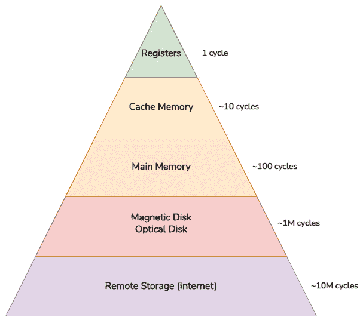

# 3

# 解锁多线程

在本章中，我们将讨论如何将多线程添加到 Raptor 引擎中。

这需要底层架构的巨大变化以及一些 Vulkan 特定的更改和同步工作，以便 CPU 和 GPU 的不同核心能够以最正确和最快的方式合作。

**多线程**渲染是一个多年来多次讨论的话题，也是自从多核架构时代爆发以来大多数游戏引擎都需要的功能。PlayStation 2 和 Sega Saturn 等游戏机已经提供了多线程支持，而后续的世代继续这一趋势，通过提供越来越多的核心供开发者利用。

游戏引擎中多线程渲染的首次痕迹可以追溯到 2008 年，当时克里斯蒂尔·埃里克森撰写了一篇博客文章([`realtimecollisiondetection.net/blog/?p=86`](https://realtimecollisiondetection.net/blog/?p=86))，并展示了并行化和优化用于在屏幕上渲染对象的命令生成的可能性。

较旧的 API，如 OpenGL 和 DirectX（直到版本 11），没有适当的并行多线程支持，尤其是因为它们是大型状态机，具有全局上下文，跟踪每个命令后的每个更改。尽管如此，不同对象之间的命令生成可能需要几毫秒，因此多线程在性能上已经是一个很大的提升。

幸运的是，Vulkan 原生支持多线程命令缓冲区，尤其是在`VkCommandBuffer`类的创建后，从 Vulkan API 的架构角度来看。

一直到如今，Raptor 引擎都是一个单线程应用程序，因此需要一些架构上的更改以完全支持多线程。在本章中，我们将看到这些更改，学习如何使用名为 enkiTS 的基于任务的并行多线程库，然后解锁异步资源加载和多线程命令记录。

在本章中，我们将涵盖以下主题：

+   如何使用基于任务的并行多线程库

+   如何异步加载资源

+   如何在并行线程中绘图

到本章结束时，我们将知道如何同时运行加载资源和在屏幕上绘制对象的并发任务。通过学习如何与基于任务的并行多线程系统进行推理，我们将在未来的章节中也能够执行其他并行任务。

# 技术要求

本章的代码可以在以下 URL 找到：[`github.com/PacktPublishing/Mastering-Graphics-Programming-with-Vulkan/tree/main/source/chapter3`](https://github.com/PacktPublishing/Mastering-Graphics-Programming-with-Vulkan/tree/main/source/chapter3).

# 使用 enkiTS 进行基于任务的并行多线程

为了实现并行处理，我们需要了解一些基本概念和选择，这些概念和选择导致了本章中开发的架构。首先，我们应该注意，当我们谈论软件工程中的并行处理时，我们指的是同时执行代码块的行为。

这是因为现代硬件有不同的可以独立操作的单元，操作系统有专门的执行单元称为**线程**。

实现并行的一种常见方式是通过任务进行推理——这些是小型的独立执行单元，可以在任何线程上运行。

## 为什么需要基于任务的并行处理？

多线程不是一个新主题，自从它在游戏引擎的早期年份被添加以来，就有不同的实现方式。游戏引擎是那些以最有效的方式使用所有可用硬件的软件组件，从而为更优化的软件架构铺平了道路。

因此，我们将从游戏引擎和与游戏相关的演示中汲取一些想法。最初的实现是通过添加一个执行单一任务的线程开始的——比如渲染单个线程，异步的**输入/输出**（**I/O**）线程等。

这有助于增加并行执行可以做的事情的粒度，对于只有两个核心的旧 CPU 来说，这是完美的，但很快它就变得有限了。

有必要以更无关的方式使用核心，以便几乎任何核心都可以完成任何类型的工作，并提高性能。这导致了两种新架构的出现：**基于任务**和**基于纤维**的架构。

基于任务的并行处理是通过为多个线程提供不同的任务并通过依赖关系来协调它们来实现的。任务本质上是平台无关的，并且不能被中断，这导致了对调度和组织与它们一起执行的代码的更直接的能力。

另一方面，纤维是类似于任务的软件结构，但它们严重依赖于调度器来中断它们的流程并在需要时恢复。这种主要区别使得编写合适的纤维系统变得困难，通常会导致许多微妙的错误。

由于使用任务而不是纤维的简单性以及实现基于任务并行处理的库的更大可用性，选择了 enkiTS 库来处理所有事情。对于那些对更深入的解释感兴趣的人，有一些关于这些架构的非常好的演示。

任务驱动引擎的一个很好的例子是《命运》系列游戏背后的引擎（你可以在[`www.gdcvault.com/play/1021926/Destiny-s-Multithreaded-Rendering`](https://www.gdcvault.com/play/1021926/Destiny-s-Multithreaded-Rendering)查看其深入架构），而基于纤程的引擎则被游戏工作室 Naughty Dog 用于他们的游戏（有关它的介绍可以在[`www.gdcvault.com/play/1022186/Parallelizing-the-Naughty-Dog-Engine`](https://www.gdcvault.com/play/1022186/Parallelizing-the-Naughty-Dog-Engine)找到）。

## 使用 enkiTS（任务调度器）库

基于任务的线程多线程是基于任务的概念，定义为“可以在 CPU 的任何核心上执行的独立工作单元”。

为了做到这一点，需要一个调度器来协调不同的任务并处理它们之间可能存在的依赖关系。任务的另一个有趣方面是，它可能有一个或多个依赖项，这样它就只能在某些任务执行完毕后才能调度运行。

这意味着任务可以在任何时候提交给调度器，并且通过适当的依赖关系，我们创建了一个基于图的引擎执行。如果做得正确，每个核心都可以充分利用，从而实现引擎的最佳性能。

调度器是所有任务背后的大脑：它检查依赖和优先级，根据需要调度或删除任务，并且它是添加到 Raptor 引擎中的新系统。

当初始化调度器时，库会生成一定数量的线程，每个线程都在等待执行一个任务。当向调度器添加任务时，它们会被插入到一个队列中。当调度器被告知执行挂起任务时，每个线程从队列中获取下一个可用的任务——根据依赖和优先级——并执行它。

需要注意的是，运行任务可以生成其他任务。这些任务将被添加到线程的本地队列中，但如果另一个线程空闲，它们也可以被抢占。这种实现被称为**工作窃取队列**。

初始化调度器就像创建一个配置并调用`Initialize`方法一样简单：

```cpp
enki::TaskSchedulerConfig config;
config.numTaskThreadsToCreate = 4;
enki::TaskScheduler task_scheduler;
task_scheduler.Initialize( config );
```

使用此代码，我们告诉任务调度器生成四个线程，它将使用这些线程来执行其任务。enkiTS 使用`TaskSet`类作为工作单元，并且它使用继承和 lambda 函数来驱动调度器中任务的执行：

```cpp
Struct ParallelTaskSet : enki::ItaskSet {
    void ExecuteRange(  enki::TaskSetPartition range_,
                        uint32_t threadnum_ ) override {
        // do something here, can issue tasks with
           task_scheduler
    }
};
int main(int argc, const char * argv[]) {
    enki::TaskScheduler task_scheduler;
    task_scheduler.Initialize( config );
    ParallelTaskSet task; // default constructor has a set
                             size of 1
    task_scheduler.AddTaskSetToPipe( &task );
    // wait for task set (running tasks if they exist)
    // since we've just added it and it has no range we'll
       likely run it.
    Task_scheduler.WaitforTask( &task );
    return 0;
}
```

在这个简单的代码片段中，我们看到如何创建一个空的`TaskSet`（正如其名所暗示的，一组任务），它定义了任务将如何执行代码，而将决定需要多少个任务以及哪个线程将被使用的任务留给了调度器。

之前代码的一个更简洁的版本使用了 lambda 函数：

```cpp
enki::TaskSet task( 1, []( enki::TaskSetPartition range_,
  uint32_t threadnum_  ) {
         // do something here
  }  );
task_scheduler.AddTaskSetToPipe( &task );
```

这个版本在阅读代码时可能更容易理解，因为它不会打断代码流，但它在功能上与上一个版本等效。

enkiTS 调度器的另一个特点是能够添加固定任务——这些特殊任务将被绑定到线程，并始终在那里执行。我们将在下一节中看到固定任务的使用，以执行异步 I/O 操作。

在本节中，我们简要介绍了不同类型的多线程，以便我们能够表达选择使用基于任务的线程的原因。然后我们展示了 enkiTS 库的一些简单示例及其用法，为 Raptor 引擎添加了多线程功能。

在下一节中，我们将最终看到在引擎中的真实用例，即资源的异步加载。

# 异步加载

资源的加载是任何框架中可以执行的最慢的操作之一（如果不是*最慢的*）。这是因为要加载的文件很大，它们可以来自不同的来源，例如光盘单元（DVD 和蓝光），硬盘，甚至网络。

这是一个很好的话题，但最重要的概念是要理解读取内存的内在速度：



图 3.1 – 内存层次结构

如前图所示，最快的内存是寄存器内存。在寄存器之后是缓存，具有不同的级别和访问速度：寄存器和缓存都直接在处理单元中（CPU 和 GPU 都有寄存器和缓存，尽管底层架构不同）。

主存储器指的是 RAM，这是通常填充应用程序使用的数据的区域。它的速度比缓存慢，但它是加载操作的目标，因为它是唯一可以从代码直接访问的。然后是磁盘（硬盘）和光盘驱动器——速度更慢，但容量更大。它们通常包含将要加载到主存储器中的资产数据。

最后的内存是在远程存储中，例如来自某些服务器，它是最慢的。我们在这里不会处理它，但可以在处理具有某种形式在线服务应用程序时使用，例如多人游戏。

为了优化应用程序中的读取访问，我们希望将所有需要的数据传输到主存储器，因为我们不能与缓存和寄存器交互。为了隐藏磁性和光盘驱动器的慢速，可以做的事情之一是将任何来自任何介质的资源的加载并行化，这样就不会减慢应用程序的流畅性。

做这件事最常见的方式，也是我们之前简要提到的线程专用架构的一个例子，是有一个单独的线程来处理资源的加载，并与其他系统交互以更新引擎中使用的资源。

在接下来的章节中，我们将讨论如何设置 enkiTS 并创建用于并行化 Raptor 引擎的任务，以及讨论 Vulkan 队列，这对于并行命令提交是必要的。最后，我们将深入探讨用于异步加载的实际代码。

## 创建 I/O 线程和任务

在 enkiTS 库中，有一个名为**固定任务**的功能，它将一个任务与一个特定的线程关联，以便它在那里持续运行，除非用户停止它或在该线程上调度了更高优先级的任务。

为了简化问题，我们将添加一个新线程并避免它被应用程序使用。这个线程将大部分时间处于空闲状态，因此上下文切换应该很低：

```cpp
config.numTaskThreadsToCreate = 4;
```

然后，我们创建一个固定任务并将其与一个线程 ID 关联：

```cpp
// Create IO threads at the end
RunPinnedTaskLoopTask run_pinned_task;
run_pinned_task.threadNum = task_scheduler.
                            GetNumTaskThreads() - 1;
task_scheduler.AddPinnedTask( &run_pinned_task );
```

在这一点上，我们可以创建实际负责异步加载的任务，将其与固定任务相同的线程关联：

```cpp
// Send async load task to external thread
AsynchronousLoadTask async_load_task;
async_load_task.threadNum = run_pinned_task.threadNum;
task_scheduler.AddPinnedTask( &async_load_task );
```

最后一个拼图是这两个任务的实际代码。首先，让我们看看第一个固定任务：

```cpp
struct RunPinnedTaskLoopTask : enki::IPinnedTask {
    void Execute() override {
        while ( task_scheduler->GetIsRunning() && execute )
         {
            task_scheduler->WaitForNewPinnedTasks();
            // this thread will 'sleep' until there are new
               pinned tasks
            task_scheduler->RunPinnedTasks();
        }
    }
    enki::TaskScheduler*task_scheduler;
    bool execute = true;
}; // struct RunPinnedTaskLoopTask
```

这个任务将等待任何其他固定任务，并在可能的情况下运行它们。我们已经添加了一个`execute`标志，以便在需要时停止执行，例如，当退出应用程序时，但它也可以在其他情况下（例如，当应用程序最小化时）用于暂停它。

另一个任务是使用`AsynchronousLoader`类执行异步加载：

```cpp
struct AsynchronousLoadTask : enki::IPinnedTask {
    void Execute() override {
        while ( execute ) {
            async_loader->update();
        }
    }
    AsynchronousLoader*async_loader;
    enki::TaskScheduler*task_scheduler;
    bool execute = true;
}; // struct AsynchronousLoadTask
```

这个任务背后的想法是始终保持活跃状态并等待资源加载的请求。`while`循环确保根固定任务永远不会在这个线程上调度其他任务，从而将其锁定到 I/O，达到预期效果。

在查看`AsynchronousLoader`类之前，我们需要查看 Vulkan 中的一个重要概念，即队列，以及为什么它们对于异步加载是一个很好的补充。

## Vulkan 队列和首次并行命令生成

*队列*的概念——可以定义为将记录在`VkCommandBuffers`中的命令提交到 GPU 的入口点——是 Vulkan 相对于 OpenGL 的一个新增功能，需要特别注意。

使用队列的提交是一个单线程操作，这是一个代价高昂的操作，成为 CPU 和 GPU 之间同步的一个点。通常，有一个主队列，在呈现帧之前，引擎将命令缓冲区提交到该队列。这将把工作发送到 GPU 并创建预期的渲染图像。

但是，有一个队列，可以有更多。为了增强并行执行，我们可以创建不同的*队列*——并在不同的线程中使用它们而不是主线程。

可以在[`github.com/KhronosGroup/Vulkan-Guide/blob/master/chapters/queues.adoc`](https://github.com/KhronosGroup/Vulkan-Guide/blob/master/chapters/queues.adoc)找到对队列的更深入探讨，但我们需要知道的是，每个队列可以提交某些类型的命令，这些命令可以通过队列的标志来查看：

+   `VK_QUEUE_GRAPHICS_BIT`可以提交所有`vkCmdDraw`命令

+   `VK_QUEUE_COMPUTE` 可以提交所有 `vkCmdDispatch` 和 `vkCmdTraceRays`（用于光线追踪）

+   `VK_QUEUE_TRANSFER` 可以提交复制命令，例如 `vkCmdCopyBuffer`、`vkCmdCopyBufferToImage` 和 `vkCmdCopyImageToBuffer`

每个可用的队列都通过队列家族公开。每个队列家族可以有多个功能，并可以公开多个队列。以下是一个澄清的例子：

```cpp
{
    "VkQueueFamilyProperties": {
        "queueFlags": [
            "VK_QUEUE_GRAPHICS_BIT",
            "VK_QUEUE_COMPUTE_BIT",
            "VK_QUEUE_TRANSFER_BIT",
            "VK_QUEUE_SPARSE_BINDING_BIT"
        ],
        "queueCount": 1,
    }
},
{
    "VkQueueFamilyProperties": {
        "queueFlags": [
            "VK_QUEUE_COMPUTE_BIT",
            "VK_QUEUE_TRANSFER_BIT",
            "VK_QUEUE_SPARSE_BINDING_BIT"
        ],
        "queueCount": 2,
    }
},
{
    "VkQueueFamilyProperties": {
        "queueFlags": [
            "VK_QUEUE_TRANSFER_BIT",
            "VK_QUEUE_SPARSE_BINDING_BIT"
        ],
        "queueCount": 2,
    }
}
```

第一个队列公开所有功能，而我们只有一个。下一个队列可用于计算和传输，第三个队列用于传输（我们现在将忽略稀疏功能）。我们为这些家族中的每个家族都有两个队列。

保证在 GPU 上始终至少有一个队列可以提交所有类型的命令，并且那将是我们的主队列。

然而，在某些 GPU 中，可能有专门的队列，它们只激活了 `VK_QUEUE_TRANSFER` 标志，这意味着它们可以使用 **直接内存访问**（**DMA**）来加速 CPU 和 GPU 之间数据传输的速度。

最后一点：Vulkan 逻辑设备负责创建和销毁队列——这是一个通常在应用程序启动/关闭时进行的操作。让我们简要地看看查询不同队列支持的代码：

```cpp
u32 queue_family_count = 0;
    vkGetPhysicalDeviceQueueFamilyProperties(
    vulkan_physical_device, &queue_family_count, nullptr );
    VkQueueFamilyProperties*queue_families = (
        VkQueueFamilyProperties* )ralloca( sizeof(
            VkQueueFamilyProperties ) * queue_family_count,
                temp_allocator );
        vkGetPhysicalDeviceQueueFamilyProperties(
            vulkan_physical_device, &queue_family_count,
                queue_families );
    u32 main_queue_index = u32_max, transfer_queue_index =
    u32_max;
    for ( u32 fi = 0; fi < queue_family_count; ++fi) {
        VkQueueFamilyProperties queue_family =
            queue_families[ fi ];
        if ( queue_family.queueCount == 0 ) {
            continue;
        }
        // Search for main queue that should be able to do
           all work (graphics, compute and transfer)
        if ( (queue_family.queueFlags & (
              VK_QUEUE_GRAPHICS_BIT | VK_QUEUE_COMPUTE_BIT |
              VK_QUEUE_TRANSFER_BIT )) == (
              VK_QUEUE_GRAPHICS_BIT | VK_QUEUE_COMPUTE_BIT |
              VK_QUEUE_TRANSFER_BIT ) ) {
                 main_queue_index = fi;
        }
        // Search for transfer queue
        if ( ( queue_family.queueFlags &
               VK_QUEUE_COMPUTE_BIT ) == 0 &&
               (queue_family.queueFlags &
               VK_QUEUE_TRANSFER_BIT) ) {
            transfer_queue_index = fi;
        }
    }
```

如前述代码所示，我们获取了所选 GPU 的所有队列列表，并检查了标识可以在此处执行命令类型的不同位。

在我们的情况下，我们将保存 *主队列* 和 *传输队列*（如果 GPU 上有），并将保存 *队列* 的索引以在设备创建后检索 `VkQueue`。某些设备不公开单独的传输队列。在这种情况下，我们将使用主队列来执行传输操作，并确保队列的访问在上传和图形提交时正确同步。

让我们看看如何创建 *队列*：

```cpp
// Queue creation
VkDeviceQueueCreateInfo queue_info[ 2 ] = {};
VkDeviceQueueCreateInfo& main_queue = queue_info[ 0 ];
main_queue.sType = VK_STRUCTURE_TYPE_DEVICE_QUEUE
                   _CREATE_INFO;
main_queue.queueFamilyIndex = main_queue_index;
main_queue.queueCount = 1;
main_queue.pQueuePriorities = queue_priority;
if ( vulkan_transfer_queue_family < queue_family_count ) {
    VkDeviceQueueCreateInfo& transfer_queue_info =
        queue_info[ 1 ];
    transfer_queue_info.sType = VK_STRUCTURE_TYPE
                                _DEVICE_QUEUE_CREATE_INFO;
    transfer_queue_info.queueFamilyIndex = transfer_queue
                                           _index;
transfer_queue_info.queueCount = 1;
transfer_queue_info.pQueuePriorities = queue_priority;
}
VkDeviceCreateInfo device_create_info {
    VK_STRUCTURE_TYPE_DEVICE_CREATE_INFO };
device_create_info.queueCreateInfoCount = vulkan_transfer
    _queue_family < queue_family_count ? 2 : 1;
device_create_info.pQueueCreateInfos = queue_info;
...
result = vkCreateDevice( vulkan_physical_device,
                         &device_create_info,
                         vulkan_allocation_callbacks,
                         &vulkan_device );
```

如前所述，`vkCreateDevice` 是通过在 `VkDeviceCreateInfo` 结构中添加 `pQueueCreateInfos` 来创建 *队列* 的命令。

设备创建后，我们可以查询所有队列，如下所示：

```cpp
// Queue retrieval
// Get main queue
vkGetDeviceQueue( vulkan_device, main_queue_index, 0,
                  &vulkan_main_queue );
// Get transfer queue if present
if ( vulkan_transfer_queue_family < queue_family_count ) {
    vkGetDeviceQueue( vulkan_device, transfer_queue_index,
                      0, &vulkan_transfer_queue );
}
```

到目前为止，我们已经准备好了主队列和传输队列，可以用来并行提交工作。

我们已经了解了如何提交并行工作以在 GPU 上复制内存，而不阻塞 GPU 或 CPU，并创建了一个特定的类来完成这项工作，`AsynchronousLoader`，我们将在下一节中介绍。

## 异步加载器类

在这里，我们将最终看到实现异步加载的类的代码。

`AsynchronousLoader` 类有以下职责：

+   处理来自文件的请求负载

+   处理 GPU 上传传输

+   管理一个阶段缓冲区以处理数据的复制

+   将带有复制命令的命令缓冲区入队

+   向渲染器发出信号，表示纹理已完成传输

在专注于上传数据到 GPU 的代码之前，有一些与命令池、传输队列和使用暂存缓冲区相关的特定于 Vulkan 的代码是重要的，需要理解。

### 为传输队列创建命令池

为了将命令提交到传输队列，我们需要创建与该队列链接的命令池：

```cpp
for ( u32 i = 0; i < GpuDevice::k_max_frames; ++i) {
VkCommandPoolCreateInfo cmd_pool_info = {
    VK_STRUCTURE_TYPE_COMMAND_POOL_CREATE_INFO, nullptr };
cmd_pool_info.queueFamilyIndex = gpu->vulkan
                                 _transfer_queue_family;
cmd_pool_info.flags = VK_COMMAND_POOL_CREATE_RESET
                      _COMMAND_BUFFER_BIT;
vkCreateCommandPool( gpu->vulkan_device, &cmd_pool_info,
                     gpu->vulkan_allocation_callbacks,
                     &command_pools[i]);
}
```

重要的是`queueFamilyIndex`，将`CommandPool`链接到传输队列，以便从这个池分配的每个命令缓冲区都可以正确提交到传输队列。

接下来，我们将简单地分配与新创建的池链接的命令缓冲区：

```cpp
for ( u32 i = 0; i < GpuDevice::k_max_frames; ++i) {
    VkCommandBufferAllocateInfo cmd = {
        VK_STRUCTURE_TYPE_COMMAND_BUFFER_ALLOCATE_INFO,
            nullptr };
       cmd.commandPool = command_pools[i];
cmd.level = VK_COMMAND_BUFFER_LEVEL_PRIMARY;
cmd.commandBufferCount = 1;
vkAllocateCommandBuffers( renderer->gpu->vulkan_device,
                          &cmd, &command_buffers[i].
                          vk_command_buffer );
```

使用这种设置，我们现在可以使用命令缓冲区提交命令到传输队列。

接下来，我们将查看暂存缓冲区——这是一个附加功能，以确保从 CPU 到 GPU 的传输尽可能快。

### 创建暂存缓冲区

为了在 CPU 和 GPU 之间最优地传输数据，需要创建一个可以用于发出与复制数据到 GPU 相关的命令的内存区域。

为了实现这一点，我们将创建一个暂存缓冲区，一个将为此目的服务的持久缓冲区。我们将看到用于创建持久暂存缓冲区的 Raptor 包装器和特定于 Vulkan 的代码。

在以下代码中，我们将分配一个 64MB 的持久映射缓冲区：

```cpp
BufferCreation bc;
bc.reset().set( VK_BUFFER_USAGE_TRANSFER_SRC_BIT,
                ResourceUsageType::Stream, rmega( 64 )
                ).set_name( "staging_buffer" ).
                set_persistent( true );
BufferHandle staging_buffer_handle = gpu->create_buffer
                                     ( bc );
```

这对应于以下代码：

```cpp
VkBufferCreateInfo buffer_info{
    VK_STRUCTURE_TYPE_BUFFER_CREATE_INFO };
buffer_info.usage = VK_BUFFER_USAGE_TRANSFER_SRC_BIT;
buffer_info.size = 64 * 1024 * 1024; // 64 MB
VmaAllocationCreateInfo allocation_create_info{};
allocation_create_info.flags = VMA_ALLOCATION_CREATE
_STRATEGY_BEST_FIT_BIT | VMA_ALLOCATION_CREATE_MAPPED_BIT;
VmaAllocationInfo allocation_info{};
check( vmaCreateBuffer( vma_allocator, &buffer_info,
       &allocation_create_info, &buffer->vk_buffer,
       &buffer->vma_allocation, &allocation_info ) );
```

这个缓冲区将是内存传输的来源，`VMA_ALLOCATION_CREATE_MAPPED_BIT`标志确保它始终被映射。

我们可以从`allocation_info`结构中检索并使用分配数据的指针，该结构由`vmaCreateBuffer`填充：

```cpp
buffer->mapped_data = static_cast<u8*>(allocation_info.
                                       pMappedData);
```

我们现在可以使用暂存缓冲区进行任何操作，将数据发送到 GPU，如果需要更大的分配，我们可以创建一个新的更大尺寸的暂存缓冲区。

接下来，我们需要查看创建用于提交和同步 CPU 和 GPU 命令执行的信号量和栅栏的代码。

### 为 GPU 同步创建信号量和栅栏

这里的代码很简单；唯一重要的一部分是创建一个已标记的栅栏，因为它将允许代码开始处理上传：

```cpp
VkSemaphoreCreateInfo semaphore_info{
    VK_STRUCTURE_TYPE_SEMAPHORE_CREATE_INFO };
vkCreateSemaphore( gpu->vulkan_device, &semaphore_info,
                   gpu->vulkan_allocation_callbacks,
                   &transfer_complete_semaphore );
VkFenceCreateInfo fence_info{
    VK_STRUCTURE_TYPE_FENCE_CREATE_INFO };
fence_info.flags = VK_FENCE_CREATE_SIGNALED_BIT;
vkCreateFence( gpu->vulkan_device, &fence_info,
               gpu->vulkan_allocation_callbacks,
               &transfer_fence );
```

最后，我们现在已经到达了处理请求的阶段。

### 处理文件请求

文件请求不是特定于 Vulkan 的，但了解它们是如何完成的是有用的。

我们使用 STB 图像库([`github.com/nothings/stb`](https://github.com/nothings/stb))将纹理加载到内存中，然后简单地将加载的内存和相关的纹理添加到创建上传请求。这将负责使用传输队列将数据从内存复制到 GPU：

```cpp
FileLoadRequest load_request = file_load_requests.back();
// Process request
int x, y, comp;
u8* texture_data = stbi_load( load_request.path, &x, &y,
                              &comp, 4 );
// Signal the loader that an upload data is ready to be
   transferred to the GPU
UploadRequest& upload_request = upload_requests.push_use();
upload_request.data = texture_data;
upload_request.texture = load_request.texture;
```

接下来，我们将看到如何处理上传请求。

### 处理上传请求

这是最终将数据上传到 GPU 的部分。首先，我们需要确保栅栏被标记为已信号，这就是为什么我们事先已经标记了它。

如果它已被信号，我们可以将其重置，以便在提交完成后让 API 对其进行信号：

```cpp
// Wait for transfer fence to be finished
if ( vkGetFenceStatus( gpu->vulkan_device, transfer_fence )
     != VK_SUCCESS ) {
return;
}
// Reset if file requests are present.
vkResetFences( gpu->vulkan_device, 1, &transfer_fence );
```

然后我们继续接收请求，从预演缓冲区分配内存，并使用命令缓冲区上传 GPU：

```cpp
// Get last request
UploadRequest request = upload_requests.back();
const sizet aligned_image_size = memory_align(
                                 texture->width *
                                 texture->height *
                                 k_texture_channels,
                                 k_texture_alignment );
// Request place in buffer
const sizet current_offset = staging_buffer_offset +
                             aligned_image_size;
CommandBuffer* cb = &command_buffers[ gpu->current_frame ;
cb->begin();
cb->upload_texture_data( texture->handle, request.data,
                         staging_buffer->handle,
                         current_offset );
free( request.data );
cb->end();
```

`upload_texture_data`方法负责上传数据和添加所需的屏障。这可能很棘手，所以我们包括了代码以展示如何完成。

首先，我们需要将数据复制到预演缓冲区：

```cpp
// Copy buffer_data to staging buffer
memcpy( staging_buffer->mapped_data +
        staging_buffer_offset, texture_data,
        static_cast< size_t >( image_size ) );
```

然后，我们可以准备一个复制，在这种情况下，从预演缓冲区到图像。在这里，指定预演缓冲区中的偏移量很重要：

```cpp
VkBufferImageCopy region = {};
region.bufferOffset = staging_buffer_offset;
region.bufferRowLength = 0;
region.bufferImageHeight = 0;
```

然后我们继续添加一个预复制内存屏障以执行布局转换，并指定数据正在使用传输队列。

这使用了 Khronos Group 提供的同步示例中建议的代码([`github.com/KhronosGroup/Vulkan-Docs/wiki/Synchronization-Examples`](https://github.com/KhronosGroup/Vulkan-Docs/wiki/Synchronization-Examples))。

再次展示经过一些实用函数简化的原始 Vulkan 代码，突出显示重要的行：

```cpp
// Pre copy memory barrier to perform layout transition
VkImageMemoryBarrier preCopyMemoryBarrier;
...
.srcAccessMask = 0,
.dstAccessMask = VK_ACCESS_TRANSFER_WRITE_BIT,
.oldLayout = VK_IMAGE_LAYOUT_UNDEFINED,
.newLayout = VK_IMAGE_LAYOUT_TRANSFER_DST_OPTIMAL,
.srcQueueFamilyIndex = VK_QUEUE_FAMILY_IGNORED,
.dstQueueFamilyIndex = VK_QUEUE_FAMILY_IGNORED,
.image = image,
.subresourceRange = ... };
...
```

纹理现在已准备好复制到 GPU：

```cpp
// Copy from the staging buffer to the image
vkCmdCopyBufferToImage( vk_command_buffer,
                        staging_buffer->vk_buffer,
                        texture->vk_image,
                        VK_IMAGE_LAYOUT_TRANSFER_DST
                        _OPTIMAL, 1, &region );
```

纹理现在已在 GPU 上，但它仍然不能从主队列中使用。

这就是为什么我们需要另一个内存屏障，它也将转移所有权：

```cpp
// Post copy memory barrier
VkImageMemoryBarrier postCopyTransferMemoryBarrier = {
...
.srcAccessMask = VK_ACCESS_TRANFER_WRITE_BIT,
.dstAccessMask = 0,
.oldLayout = VK_IMAGE_LAYOUT_TRANSFER_DST_OPTIMAL,
.newLayout = VK_IMAGE_LAYOUT_SHADER_READ_ONLY_OPTIMAL,
.srcQueueFamilyIndex = transferQueueFamilyIndex,
.dstQueueFamilyIndex = graphicsQueueFamilyIndex,
.image = image,
.subresourceRange = ... };
```

一旦所有权转移，需要一个最终的屏障来确保传输完成，并且纹理可以从着色器中读取，但这将由渲染器完成，因为它需要使用主队列。

### 通知渲染器传输完成

信号是通过简单地将纹理添加到要更新的互斥纹理列表中实现的，以确保线程安全。

在这一点上，我们需要为每个传输的纹理执行一个最终的屏障。我们选择在所有渲染完成后和当前步骤之前添加这些屏障，但也可以在帧的开始时进行。

如前所述，需要一个最后的屏障来指示新更新的图像已准备好由着色器读取，并且所有写入操作都已完成：

```cpp
VkImageMemoryBarrier postCopyGraphicsMemoryBarrier = {
...
.srcAccessMask = 0,
.dstAccessMask = VK_ACCESS_SHADER_READ_BIT,
.oldLayout = VK_IMAGE_LAYOUT_TRANSFER_DST_OPTIMAL,
.newLayout = VK_IMAGE_LAYOUT_SHADER_READ_ONLY_OPTIMAL,
.srcQueueFamilyIndex = transferQueueFamilyIndex,
.dstQueueFamilyIndex = graphicsQueueFamilyIndex,
.image = image,
.subresourceRange = ... };
```

现在，我们已准备好在着色器中使用 GPU 上的纹理，异步加载正在工作。为上传缓冲区创建了一条非常相似的路径，但将在书中省略，但在代码中存在。

在本节中，我们展示了如何通过使用传输队列和不同的命令缓冲区来解锁资源到 GPU 的异步加载。我们还展示了如何管理队列之间的所有权转移。然后，我们最终看到了使用任务调度器设置任务的初步步骤，该调度器用于向 Raptor 引擎添加多线程功能。

在下一节中，我们将使用所获得的知识来添加命令的并行记录，以在屏幕上绘制对象。

# 在多个线程上记录命令

要使用多个线程记录命令，必须使用不同的命令缓冲区，至少每个线程一个，以记录命令然后将它们提交到主队列。更精确地说，在 Vulkan 中，任何类型的池都需要由用户外部同步；因此，最佳选项是将线程与池关联起来。

在命令缓冲区的情况下，它们是从关联的池中分配的，并在其中注册了命令。池可以是`CommandPools`、`DescriptorSetPools`和`QueryPools`（用于时间和遮挡查询），一旦与线程关联，就可以在执行线程内部自由使用。

命令缓冲区的执行顺序基于提交到主队列的数组的顺序——因此，从 Vulkan 的角度来看，可以在命令缓冲区级别进行排序。

我们将看到命令缓冲区的分配策略有多么重要，以及一旦分配到位，并行绘制是多么容易。我们还将讨论不同类型的命令缓冲区，这是 Vulkan 的独特特性。

## 分配策略

并行记录命令的成功是通过考虑线程访问和帧访问来实现的。在创建命令池时，不仅每个线程需要一个唯一的池来分配命令缓冲区和命令，而且它还需要不在 GPU 上飞行。

一种简单的分配策略是决定将记录命令的最大线程数（我们将它们称为`T`）和可以飞行的最大帧数（我们将它们称为`F`），然后分配`F * T`的命令池。

对于每个想要渲染的任务，使用帧-线程 ID 对，我们将保证没有任何池会处于飞行状态或被另一个线程使用。

这是一个非常保守的方法，可能导致命令生成不平衡，但它可以是一个很好的起点，在我们的情况下，足以提供对 Raptor 引擎并行渲染的支持。

此外，我们将分配最多五个空命令缓冲区，两个主缓冲区和三个次级缓冲区，以便更多任务可以并行执行渲染的片段。

负责此功能的类是`CommandBufferManager`类，可以从设备访问，并且它通过`get_command_buffer`方法给用户提供了请求命令缓冲区的可能性。

在下一节中，我们将看到主命令缓冲区和次级命令缓冲区之间的区别，这对于决定并行绘制帧的任务粒度是必要的。

## 命令缓冲区回收

与分配策略相关的是缓冲区的回收。当一个缓冲区已被执行后，它可以被重新用于记录新的命令，而不是总是分配新的缓冲区。

多亏了我们选择的分配策略，我们将固定数量的`CommandPools`与每个帧关联起来，因此为了重用命令缓冲区，我们将重置其对应的`CommandPool`而不是手动释放缓冲区：这在 CPU 时间上已被证明效率更高。

注意，我们并没有释放与缓冲区关联的内存，而是给`CommandPool`自由使用在将被记录的命令缓冲区之间分配的总内存，并且它会将其所有命令缓冲区的所有状态重置到初始状态。

在每一帧的开始，我们调用一个简单的方法来重置池：

```cpp
void CommandBufferManager::reset_pools( u32 frame_index ) {
    for ( u32 i = 0; i < num_pools_per_frame; i++ ) {
        const u32 pool_index = pool_from_indices(
                               frame_index, i );
        vkResetCommandPool( gpu->vulkan_device,
                            vulkan_command_pools[
                            pool_index ], 0 );
    }
}
```

基于线程和帧，有一个计算池索引的实用方法。

在重置池之后，我们可以重用命令缓冲区来记录命令，而无需为每个命令显式地这样做。

我们最终可以查看不同类型的命令缓冲区。

## 主命令缓冲区与辅助命令缓冲区的比较

Vulkan API 在命令缓冲区可以做什么方面有一个独特差异：命令缓冲区可以是主缓冲区或辅助缓冲区。

主命令缓冲区是最常用的，可以执行任何命令——绘图、计算或复制命令，但它们的粒度相当粗糙——至少必须使用一个渲染通道，并且没有通道可以进一步并行化。

辅助命令缓冲区功能更加有限——它们实际上只能在渲染通道内执行绘图命令——但它们可以用来并行化包含许多绘图调用（如 G-Buffer 渲染通道）的渲染通道的渲染。

因此，做出关于任务粒度的明智决策至关重要，特别是理解何时使用主缓冲区或辅助缓冲区进行记录尤为重要。

在*第四章* *实现帧图*中，我们将看到帧图如何提供足够的信息来决定使用哪种类型的命令缓冲区以及在一个任务中应该使用多少对象和渲染通道。

在下一节中，我们将看到如何使用主命令缓冲区和辅助命令缓冲区。

## 使用主命令缓冲区进行绘图

使用主命令缓冲区进行绘图是使用 Vulkan 最常见的方式，也是最简单的方式。正如之前所述，主命令缓冲区可以无限制地执行任何类型的命令，并且是唯一可以提交到队列以在 GPU 上执行的一个。

创建一个主命令缓冲区只需在传递给`vkAllocateCommandBuffers`函数的`VkCommandBufferAllocateInfo`结构中使用`VK_COMMAND_BUFFER_LEVEL_PRIMARY`即可。

一旦创建，在任何时候，我们都可以开始命令记录（使用`vkBeginCommandBuffer`函数），绑定通道和管线，并发出绘图命令、复制命令和计算命令。

一旦记录完成，必须使用`vkEndCommandBuffer`函数来表示记录结束并准备缓冲区以便提交到队列：

```cpp
VkSubmitInfo submit_info = {
    VK_STRUCTURE_TYPE_SUBMIT_INFO };
submit_info.commandBufferCount = num_queued_command
                                 _buffers;
submit_info.pCommandBuffers = enqueued_command_buffers;
...
vkQueueSubmit( vulkan_main_queue, 1, &submit_info,
               *render_complete_fence );
```

为了并行记录命令，记录线程必须遵守以下两个条件：

+   在同一`CommandPool`上同时记录是禁止的

+   与`RenderPass`相关的命令只能在单个线程中执行

如果一个传递（例如，典型的前向或 G-Buffer 传递）包含大量的绘制调用，从而需要并行渲染，会发生什么？这就是次级命令缓冲区可以发挥作用的地方。

## 使用次级命令缓冲区进行绘制

次级命令缓冲区有一组非常具体的条件需要使用——它们只能记录与一个渲染传递相关的命令。

这就是为什么允许用户记录多个次级命令缓冲区很重要：可能需要多个传递的每传递并行性，因此可能需要多个次级命令缓冲区。

次级缓冲区始终需要一个主缓冲区，并且不能直接提交到任何队列：它们必须被复制到主缓冲区，并且仅在开始记录命令时继承`RenderPass`和`FrameBuffers`。

让我们看看涉及次级命令缓冲区使用的不同步骤。首先，我们需要有一个主命令缓冲区，该缓冲区需要设置一个渲染传递和要渲染的帧缓冲区，因为这是绝对必要的，因为没有次级命令缓冲区可以提交到队列或设置`RenderPass`或`FrameBuffer`。

这些将是唯一从主命令缓冲区继承的状态，因此，即使在开始记录命令时，视口和模板状态也必须重新设置。

让我们先展示一个主命令缓冲区的设置：

```cpp
VkClearValue clearValues[2];
VkRenderPassBeginInfo renderPassBeginInfo {};
renderPassBeginInfo.renderPass = renderPass;
renderPassBeginInfo.framebuffer = frameBuffer;
vkBeginCommandBuffer(primaryCommandBuffer, &cmdBufInfo);
```

当开始一个将被分配给一个或多个次级命令缓冲区的渲染传递时，我们需要添加`VK_SUBPASS_CONTENTS_SECONDARY_COMMAND_BUFFERS`标志：

```cpp
vkCmdBeginRenderPass(primaryCommandBuffer, &renderPassBeginInfo, VK_SUBPASS_CONTENTS_SECONDARY_COMMAND_BUFFERS);
```

然后，我们可以将`inheritanceInfo`结构体传递给次级缓冲区：

```cpp
VkCommandBufferInheritanceInfo inheritanceInfo {};
inheritanceInfo.renderPass = renderPass;
inheritanceInfo.framebuffer = frameBuffer;
```

然后我们可以开始次级命令缓冲区：

```cpp
VkCommandBufferBeginInfo commandBufferBeginInfo {};
commandBufferBeginInfo.flags =
VK_COMMAND_BUFFER_USAGE_RENDER_PASS_CONTINUE_BIT;
commandBufferBeginInfo.pInheritanceInfo = &inheritanceInfo;
VkBeginCommandBuffer(secondaryCommandBuffer,
                     &commandBufferBeginInfo);
```

次级命令缓冲区现在已准备好开始发出绘制命令：

```cpp
vkCmdSetViewport(secondaryCommandBuffers.background, 0, 1,
                 &viewport);
vkCmdSetScissor(secondaryCommandBuffers.background, 0, 1,
                &scissor);
vkCmdBindPipeline(secondaryCommandBuffers.background,
                  VK_PIPELINE_BIND_POINT_GRAPHICS,
                  pipelines.starsphere);
VkDrawIndexed(…)
```

注意，必须在开始时设置裁剪和视口，因为没有状态在边界渲染传递和帧缓冲区之外被继承。

一旦我们完成命令的记录，我们可以调用`VkEndCommandBuffer`函数并将缓冲区放入主命令缓冲区中的可复制状态。为了将次级命令缓冲区复制到主缓冲区，需要调用一个特定的函数，即`vkCmdExecuteCommands`。

```cpp
vkCmdExecuteCommands(primaryCommandBuffer,
                     commandBuffers.size(),
                     commandBuffers.data());
```

此函数接受一个次级命令缓冲区的数组，这些缓冲区将被顺序复制到主缓冲区中。

为了确保记录的命令的正确顺序，多线程（因为线程可以以任何顺序完成）不能保证，我们可以给每个命令缓冲区一个执行索引，将它们全部放入一个数组中，排序它们，然后使用这个排序后的数组在`vkCmdExecuteCommands`函数中。

在这一点上，主命令缓冲区可以记录其他命令或提交到队列中，因为它包含了从辅助命令缓冲区复制过来的所有命令。

## 启动多个任务以记录命令缓冲区

最后一步是创建多个任务以并行记录命令缓冲区。我们决定将多个网格分组到每个命令缓冲区作为一个例子，但通常，你会在每个渲染通道中记录单独的命令缓冲区。

让我们来看看代码：

```cpp
SecondaryDrawTask secondary_tasks[ parallel_recordings ]{ };
u32 start = 0;
for ( u32 secondary_index = 0;
      secondary_index < parallel_recordings;
      ++secondary_index ) {
    SecondaryDrawTask& task = secondary_tasks[
                              secondary_index ];
    task.init( scene, renderer, gpu_commands, start,
               start + draws_per_secondary );
    start += draws_per_secondary;
    task_scheduler->AddTaskSetToPipe( &task );
}
```

我们为每个网格组添加一个任务到调度器中。每个任务将记录一系列网格的命令缓冲区。

一旦我们添加了所有任务，我们必须等待它们完成，然后才能添加辅助命令缓冲区以在主命令缓冲区上执行：

```cpp
for ( u32 secondary_index = 0;
      secondary_index < parallel_recordings;
      ++secondary_index ) {
    SecondaryDrawTask& task = secondary_tasks[
                              secondary_index ];
    task_scheduler->WaitforTask( &task );
    vkCmdExecuteCommands( gpu_commands->vk_command_buffer,
                          1, &task.cb->vk_command_buffer );
}
```

我们建议阅读本章的代码以获取更多关于实现的详细信息。

在本节中，我们描述了如何并行记录多个命令缓冲区以优化 CPU 上的此操作。我们详细说明了命令缓冲区的分配策略以及它们如何在帧间重用。

我们已经突出了主缓冲区和辅助缓冲区之间的差异，以及它们在我们渲染器中的使用方式。最后，我们展示了如何并行记录多个命令缓冲区。

在下一章中，我们将介绍帧图，这是一个允许我们定义多个渲染通道并可以利用我们描述的任务系统来并行记录每个渲染通道命令缓冲区的系统。

# 摘要

在本章中，我们学习了基于任务并行性的概念，并看到了如何使用如 enkiTS 之类的库快速将多线程能力添加到 Raptor 引擎中。

然后，我们学习了如何使用异步加载器将数据从文件加载到 GPU 上。我们还专注于与 Vulkan 相关的代码，以拥有一个可以与负责绘制的队列并行运行的第二个执行队列。我们看到了主命令缓冲区和辅助命令缓冲区之间的区别。

我们讨论了缓冲区分配策略的重要性，以确保在并行记录命令时的安全性，特别是考虑到帧间命令的重用。

最后，我们逐步展示了如何使用两种类型的命令缓冲区，这应该足以向任何决定使用 Vulkan 作为其图形 API 的应用程序添加所需的并行级别。

在下一章中，我们将处理一个名为**帧图**的数据结构，这将为我们提供足够的信息来自动化一些记录过程，包括屏障，并简化关于执行并行渲染的任务粒度的决策。

# 进一步阅读

基于任务的系统已经使用了多年。[`www.gdcvault.com/play/1012321/Task-based-Multithreading-How-to`](https://www.gdcvault.com/play/1012321/Task-based-Multithreading-How-to) 提供了一个很好的概述。

可以在 [`blog.molecular-matters.com/2015/09/08/job-system-2-0-lock-free-work-stealing-part-2-a-specialized-allocator/`](https://blog.molecular-matters.com/2015/09/08/job-system-2-0-lock-free-work-stealing-part-2-a-specialized-allocator/) 找到许多关于工作窃取队列的文章，这些文章是该主题的良好起点。

PlayStation 3 和 Xbox 360 使用 IBM 的 Cell 处理器，通过多个核心为开发者提供更多性能。特别是 PlayStation 3 有几个**协同处理器单元**（**SPUs**），开发者可以使用它们从主处理器卸载工作。

有许多演示文稿和文章详细介绍了开发者如何巧妙地使用这些处理器，例如，[`www.gdcvault.com/play/1331/The-PlayStation-3-s-SPU`](https://www.gdcvault.com/play/1331/The-PlayStation-3-s-SPU) 和 [`gdcvault.com/play/1014356/Practical-Occlusion-Culling-on`](https://gdcvault.com/play/1014356/Practical-Occlusion-Culling-on)。
