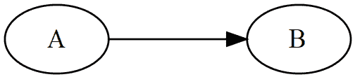
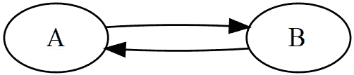
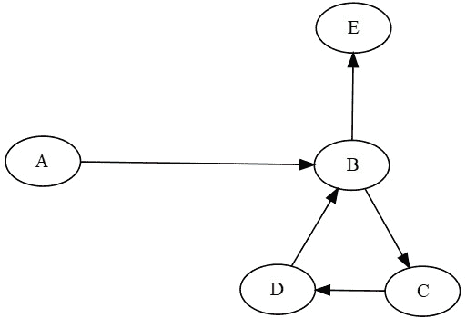
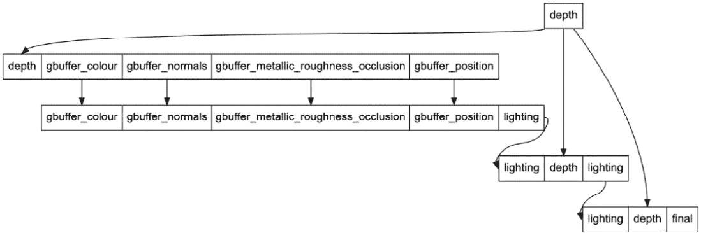
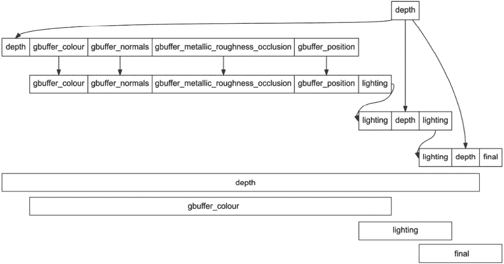

# 实现帧图

在本章中，我们介绍了**帧图**，这是一种新的系统，用于控制给定帧的渲染步骤。正如其名所示，我们将组织渲染帧所需的步骤（通道）在一个**有向无环图**（**DAG**）中。这将使我们能够确定每个通道的执行顺序以及哪些通道可以并行执行。

拥有一个图也为我们提供了许多其他好处，例如以下内容：

+   它允许我们自动化渲染通道和帧缓冲区的创建和管理，因为每个通道定义了它将从中读取的输入资源以及它将写入的资源。

+   它帮助我们通过一种称为**内存别名**的技术减少帧所需的内存。我们可以通过分析图来确定资源将使用多长时间。在资源不再需要后，我们可以将其内存重新用于新的资源。

+   最后，我们将在执行过程中让图来管理内存屏障和布局转换的插入。每个输入和输出资源定义了它将被如何使用（例如，纹理与附加），我们可以根据这些信息推断出其下一个布局。

总结来说，在本章中，我们将涵盖以下主要主题：

+   理解帧图的结构和我们的实现细节

+   实现拓扑排序以确保通道按正确顺序执行

+   使用图驱动渲染和自动化资源管理和布局转换

# 技术要求

本章的代码可以在以下 URL 找到：[`github.com/PacktPublishing/Mastering-Graphics-Programming-with-Vulkan/tree/main/source/chapter4`](https://github.com/PacktPublishing/Mastering-Graphics-Programming-with-Vulkan/tree/main/source/chapter4)。

# 理解帧图

到目前为止，Raptor 引擎中的渲染只包含一个通道。虽然这种方法在我们所涵盖的主题中表现良好，但它无法扩展到一些后续章节。更重要的是，它不会代表现代渲染引擎组织工作的方式。一些游戏和引擎实现了数百个通道，手动管理它们可能会变得繁琐且容易出错。

因此，我们决定在本书中介绍帧图是合适的时间。在本节中，我们将展示我们图的架构以及如何在代码中操作它的主要接口。

让我们从图的基本概念开始。

## 构建图

在我们介绍帧图的解决方案和实现之前，我们希望提供一些我们将贯穿本章使用的构建块。如果您熟悉帧图或一般图，请随意浏览本节。

图由两个元素定义：**节点**（或顶点）和**边**。每个节点可以连接到一个或多个节点，每个连接由一条边定义。



图 4.1 – 从节点 A 到 B 的边

在本章的介绍中，我们提到帧图是一个有向无环图（DAG）。我们的帧图具有这些属性非常重要，否则我们无法执行它：

+   **有向**：这意味着边有方向。例如，如果我们定义一个从节点 *A* 到节点 *B* 的边，我们不能使用相同的边从 *B* 到 *A*。我们需要一个不同的边从 *B* 到 *A*。



图 4.2 – 有向图中从 A 连接到 B 和从 B 连接到 A

+   **无环**：这意味着图中不能有任何环。当我们沿着从一个子节点开始的路径返回到给定的节点时，就会引入一个环。如果发生这种情况，我们的帧图将进入无限循环。



图 4.3 – 包含环的图的示例

在帧图的情况下，每个节点代表一个渲染过程：深度预扫描、g-缓冲区、光照等。我们不显式地定义边。相反，每个节点将定义多个输出，如果需要，还可以定义多个输入。当给定过程的输出被用作另一个过程的输入时，就隐含了一个边。



图 4.4 – 全帧图的示例

这两个概念，节点和边，就是理解帧图所需的所有内容。接下来，我们将展示我们如何决定编码这个数据结构。

## 数据驱动方法

一些引擎只提供代码接口来构建帧图，而其他引擎允许开发者以人类可读的格式（例如 JSON）指定图，这样更改图就不一定需要代码更改。

经过一些考虑，我们决定在 JSON 中定义我们的图，并实现一个解析器来实例化所需的类。我们选择这种方法有几个原因：

+   这允许我们在不重新编译代码的情况下对图进行一些更改。例如，如果我们想更改渲染目标的尺寸或格式，我们只需要在图的 JSON 定义中进行更改，然后重新运行程序。

+   我们还可以重新组织图，并删除其中的一些节点，而无需更改代码。

+   理解图的流程更容易。根据实现方式，代码中对图的定义可能分布在不同的代码位置，甚至不同的文件中。这使得确定图结构变得更加困难。

+   对于非技术贡献者来说，更改更容易。图定义也可以通过可视化工具完成，并将其转换为 JSON。如果图定义完全在代码中完成，这种方法是不可行的。

现在，我们可以看看我们的帧图中的一个节点：

```cpp
{
    "inputs":
    [
        {
            "type": "attachment",
            "name": "depth"
        }
    ],
    "name": "gbuffer_pass",
    "outputs":
    [
        {
            "type": "attachment",
            "name": "gbuffer_colour",
            "format": "VK_FORMAT_B8G8R8A8_UNORM",
            "resolution": [ 1280, 800 ],
            "op": "VK_ATTACHMENT_LOAD_OP_CLEAR"
        },
        {
            "type": "attachment",
            "name": "gbuffer_normals",
            "format": "VK_FORMAT_R16G16B16A16_SFLOAT",
            "resolution": [ 1280, 800 ],
            "op": "VK_ATTACHMENT_LOAD_OP_CLEAR"
        },
        ...
    ]
}
```

节点由三个变量定义：

+   `name`: 这有助于我们在执行期间识别节点，同时也为其他元素提供了有意义的名称，例如，与该节点关联的渲染通道。

+   `inputs`: 这列出了该节点的输入。这些是其他节点产生的资源。请注意，在图中定义一个未由其他节点产生的输入将是一个错误。唯一的例外是外部资源，这些资源在渲染图中外部管理，并且用户必须在运行时将它们提供给图。

+   `outputs`: 这些是由给定节点产生的资源。

我们根据其用途定义了四种不同类型的资源：

+   `attachment`: 附件列表用于确定给定节点的渲染通道和帧缓冲区组成。正如你在前面的示例中注意到的，附件可以定义在输入和输出中。这是在多个节点上继续处理资源所必需的。例如，在运行深度预通道之后，我们希望加载深度数据并在 g 缓冲区通道中使用它，以避免为隐藏在其他物体后面的物体着色像素。

+   `texture`: 这种类型用于区分图像和附件。附件必须是节点渲染通道和帧缓冲区定义的一部分，而纹理在通道期间读取，是着色器数据定义的一部分。

这种区分对于确定哪些图像需要过渡到不同的布局并需要图像屏障也很重要。我们将在本章后面更详细地介绍这一点。

我们在这里不需要指定纹理的大小和格式，因为我们已经在第一次定义资源为输出时这样做过了。

+   `buffer`: 这种类型表示我们可以写入或读取的存储缓冲区。与纹理一样，我们需要插入内存屏障以确保在另一个通道访问缓冲区数据之前完成上一个通道的写入。

+   `reference`: 这种类型仅用于确保在节点之间计算正确的边缘，而不创建新的资源。

所有类型都很直观，但我们认为引用类型需要举例说明，以便更好地理解为什么我们需要这种类型：

```cpp
{
    "inputs":
    [
        {
            "type": "attachment",
            "name": "lighting"
        },
        {
            "type": "attachment",
            "name": "depth"
        }
    ],
    "name": "transparent_pass",
    "outputs":
    [
        {
            "type": "reference",
            "name": "lighting"
        }
    ]
}
```

在这种情况下，光照是`attachment`类型的输入资源。在处理图时，我们将正确地将产生光照资源的节点链接到这个节点。然而，我们还需要确保使用光照资源的下一个节点创建到这个节点的连接，否则，节点顺序将是不正确的。

因此，我们在透明通道的输出中添加了对光照资源的引用。我们在这里不能使用`attachment`类型，否则，在创建渲染通道和帧缓冲区时，我们会重复计算光照资源。

现在你已经很好地理解了帧图结构，是时候看看一些代码了！

## 实现帧图

在本节中，我们将定义将在本章中使用的整个数据结构，即资源和节点。接下来，我们将解析图的 JSON 定义以创建用于后续步骤的资源节点。

让我们从我们数据结构的定义开始。

### 资源

**资源**定义了一个节点的输入或输出。它们决定了给定节点对资源的使用，并且正如我们稍后将要解释的，它们用于定义帧图节点之间的边。资源结构如下：

```cpp
struct FrameGraphResource {
    FrameGraphResourceType type;
    FrameGraphResourceInfo resource_info;
    FrameGraphNodeHandle producer;
    FrameGraphResourceHandle output_handle;
    i32 ref_count = 0;
    const char* name = nullptr;
};
```

资源可以是节点的输入或输出。以下列表中的每个字段都值得仔细研究：

+   `type`：定义了我们是否在处理图像或缓冲区。

+   `resource_info`：包含基于`type`的资源详细信息（例如大小、格式等）。

+   `producer`：存储输出资源的节点的引用。这将用于确定图的边。

+   `output_handle`：存储父资源。稍后我们将更清楚地了解为什么需要这个字段。

+   `ref_count`：在计算哪些资源可以被别名化时使用。别名化是一种允许多个资源共享相同内存的技术。我们将在本章稍后提供更多关于它是如何工作的详细信息。

+   `name`：包含资源在 JSON 中定义的名称。这对于调试和通过名称检索资源非常有用。

接下来，我们将查看一个图节点：

```cpp
struct FrameGraphNode {
    RenderPassHandle render_pass;
    FramebufferHandle framebuffer;
    FrameGraphRenderPass* graph_render_pass;
    Array<FrameGraphResourceHandle> inputs;
    Array<FrameGraphResourceHandle> outputs;
    Array<FrameGraphNodeHandle> edges;
    const char* name = nullptr;
};
```

节点存储了它在执行期间将使用的输入列表和它将产生的输出。每个输入和输出都是`FrameGraphResource`的不同实例。`output_handle`字段用于将输入与其输出资源链接起来。我们需要单独的资源，因为它们的类型可能不同；一个图像可能被用作输出附件，然后用作输入纹理。这是一个重要的细节，将被用于自动化内存屏障放置。

节点还存储了一个列表，列出了它连接到的节点、它的名称、根据其输入和输出的定义创建的帧缓冲区和渲染通道。像资源一样，节点也存储了在 JSON 中定义的名称。

最后，一个节点包含指向渲染实现的指针。我们将在稍后讨论如何将节点与其渲染通道链接起来。

这些是我们用来定义帧图的主要数据结构。我们还创建了一个`FrameGraphBuilder`辅助类，该类将被`FrameGraph`类使用。`FrameGraphBuilder`辅助类包含创建节点和资源的功能。

让我们看看这些构建块是如何用来定义我们的帧图的！

### 解析图

现在我们已经定义了构成我们图的数据结构，我们需要解析图的 JSON 定义来填充这些结构并创建我们的帧图定义。以下是执行解析帧图所需的步骤：

1.  我们首先初始化一个`FrameGraphBuilder`和`FrameGraph`类：

    ```cpp
    FrameGraphBuilder frame_graph_builder;
    ```

    ```cpp
    frame_graph_builder.init( &gpu );
    ```

    ```cpp
    FrameGraph frame_graph;
    ```

    ```cpp
    frame_graph.init( &frame_graph_builder );
    ```

1.  接下来，我们调用`parse`方法来读取图的 JSON 定义，并为其创建资源和节点：

    ```cpp
    frame_graph.parse( frame_graph_path,
    ```

    ```cpp
                       &scratch_allocator );
    ```

1.  一旦我们有了图定义，我们就有了编译步骤：

    ```cpp
    frame_graph.compile();
    ```

这一步是魔法发生的地方。我们分析图以计算节点之间的边，为每个类创建帧缓冲区和渲染过程，并确定哪些资源可以被别名化。我们将在下一节中详细解释这些步骤。

1.  一旦我们编译了我们的图，我们需要注册我们的渲染过程：

    ```cpp
    frame_graph->builder->register_render_pass(
    ```

    ```cpp
        "depth_pre_pass", &depth_pre_pass );
    ```

    ```cpp
    frame_graph->builder->register_render_pass(
    ```

    ```cpp
        "gbuffer_pass", &gbuffer_pass );
    ```

    ```cpp
    frame_graph->builder->register_render_pass(
    ```

    ```cpp
        "lighting_pass", &light_pass );
    ```

    ```cpp
    frame_graph->builder->register_render_pass(
    ```

    ```cpp
        "transparent_pass", &transparent_pass );
    ```

    ```cpp
    frame_graph->builder->register_render_pass(
    ```

    ```cpp
        "depth_of_field_pass", &dof_pass );
    ```

这允许我们通过简单地交换为给定过程注册的类来测试每个过程的不同实现。甚至可以在运行时交换这些过程。

1.  最后，我们准备好渲染我们的场景：

    ```cpp
    frame_graph->render( gpu_commands, scene );
    ```

现在我们将详细查看`compile`和`render`方法。

## 实现拓扑排序

正如我们在前一节中提到的，帧图实现中最有趣的部分在`compile`方法中。为了清晰起见，我们在以下章节中简化了一些代码。

请参阅章节中提到的*技术要求*部分的 GitHub 链接以获取完整的实现。

下面是我们用来计算节点之间边的算法的分解：

1.  我们执行的第一步是创建节点之间的边：

    ```cpp
    for ( u32 r = 0; r < node->inputs.size; ++r ) {
    ```

    ```cpp
        FrameGraphResource* resource = frame_graph->
    ```

    ```cpp
            get_resource( node->inputs[ r ].index );
    ```

    ```cpp
        u32 output_index = frame_graph->find_resource(
    ```

    ```cpp
            hash_calculate( resource->name ) );
    ```

    ```cpp
        FrameGraphResource* output_resource = frame_graph
    ```

    ```cpp
            ->get_resource( output_index );
    ```

我们通过遍历每个输入并检索相应的输出资源来完成此操作。请注意，在内部，图按名称键存储输出。

1.  接下来，我们将输出细节保存到输入资源中。这样我们就可以在输入中直接访问这些数据：

    ```cpp
        resource->producer = output_resource->producer;
    ```

    ```cpp
        resource->resource_info = output_resource->
    ```

    ```cpp
                                  resource_info;
    ```

    ```cpp
        resource->output_handle = output_resource->
    ```

    ```cpp
                                  output_handle;
    ```

1.  最后，我们在产生此输入的节点和当前正在处理的节点之间创建一个边：

    ```cpp
        FrameGraphNode* parent_node = ( FrameGraphNode*)
    ```

    ```cpp
                                        frame_graph->
    ```

    ```cpp
                                        get_node(
    ```

    ```cpp
                                        resource->
    ```

    ```cpp
                                        producer.index );
    ```

    ```cpp
        parent_node->edges.push( frame_graph->nodes[
    ```

    ```cpp
                                 node_index ] );
    ```

    ```cpp
    }
    ```

在这个循环结束时，每个节点将包含它连接的节点列表。虽然我们目前没有这样做，但在这一阶段，可以删除图中没有边的节点。

现在我们已经计算了节点之间的连接，我们可以按拓扑顺序对它们进行排序。在这个步骤结束时，我们将获得一个节点列表，以确保产生输出的节点在利用该输出的节点之前。

下面是排序算法的分解，我们突出显示了代码中最相关的部分：

1.  `sorted_node`数组将包含按逆序排序的节点：

    ```cpp
    Array<FrameGraphNodeHandle> sorted_nodes;
    ```

    ```cpp
    sorted_nodes.init( &local_allocator, nodes.size );
    ```

1.  将使用`visited`数组来标记我们已经处理过的节点。我们需要跟踪这些信息以避免无限循环：

    ```cpp
    Array<u8> visited;
    ```

    ```cpp
    visited.init( &local_allocator, nodes.size, nodes.size
    ```

    ```cpp
    );
    ```

    ```cpp
    memset( visited.data, 0, sizeof( bool ) * nodes.size );
    ```

1.  最后，`stack`数组用于跟踪我们还需要处理的节点。我们需要这个数据结构，因为我们的实现没有使用递归：

    ```cpp
    Array<FrameGraphNodeHandle> stack;
    ```

    ```cpp
    stack.init( &local_allocator, nodes.size );
    ```

1.  图是通过使用**深度优先搜索**（**DFS**）遍历的。下面的代码执行了这项任务：

    ```cpp
    for ( u32 n = 0; n < nodes.size; ++n ) {
    ```

    ```cpp
        stack.push( nodes[ n ] );
    ```

1.  我们遍历每个节点并将其添加到栈中。我们这样做是为了确保我们处理图中的所有节点：

    ```cpp
        while ( stack.size > 0 ) {
    ```

    ```cpp
            FrameGraphNodeHandle node_handle =
    ```

    ```cpp
                stack.back();
    ```

1.  然后，我们有一个第二个循环，它将在我们处理完刚刚添加到栈中的节点的所有连接节点后才会停止：

    ```cpp
            if (visited[ node_handle.index ] == 2) {
    ```

    ```cpp
                stack.pop();
    ```

    ```cpp
                continue;
    ```

    ```cpp
            }
    ```

如果一个节点已经被访问并添加到排序节点的列表中，我们只需将其从栈中移除并继续处理其他节点。传统的图处理实现没有这一步。

我们必须将其作为节点可能会产生多个输出。这些输出反过来可能会链接到多个节点，我们不希望将产生节点多次添加到排序节点列表中。

1.  如果我们当前正在处理的节点已经被访问并且是通过栈到达的，这意味着我们已经处理了它的所有子节点，并且它可以被添加到排序节点的列表中。正如以下代码中提到的，我们也会将其标记为已添加，这样我们就不会多次将其添加到列表中：

    ```cpp
            if ( visited[ node_handle.index ]  == 1) {
    ```

    ```cpp
                visited[ node_handle.index ] = 2; // added
    ```

    ```cpp
                sorted_nodes.push( node_handle );
    ```

    ```cpp
                stack.pop();
    ```

    ```cpp
                continue;
    ```

    ```cpp
            }
    ```

1.  当我们第一次到达一个节点时，我们将其标记为`已访问`。正如以下代码块中提到的，这是为了确保我们不会多次处理相同的节点：

    ```cpp
            visited[ node_handle.index ] = 1; // visited
    ```

1.  如果我们正在处理的节点没有边，我们继续迭代：

    ```cpp
            FrameGraphNode* node = ( FrameGraphNode* )
    ```

    ```cpp
                                     builder->node_cache.
    ```

    ```cpp
                                     nodes.access_resource
    ```

    ```cpp
                                     ( node_handle.index
    ```

    ```cpp
                                    );
    ```

    ```cpp
            // Leaf node
    ```

    ```cpp
            if ( node->edges.size == 0 ) {
    ```

    ```cpp
                continue;
    ```

    ```cpp
            }
    ```

1.  另一方面，如果节点连接到其他节点，我们将它们添加到栈中以供处理，然后再次迭代。如果你第一次看到图遍历的迭代实现，可能不会立即清楚它与递归实现的关系。我们建议多次阅读代码，直到你理解它；这是一个在关键时刻非常有用的强大技术！

    ```cpp
            for ( u32 r = 0; r < node->edges.size; ++r ) {
    ```

    ```cpp
                FrameGraphNodeHandle child_handle =
    ```

    ```cpp
                    node->edges[ r ];
    ```

    ```cpp
                if ( !visited[ child_handle.index ] ) {
    ```

    ```cpp
                    stack.push( child_handle );
    ```

    ```cpp
                }
    ```

    ```cpp
            }
    ```

1.  最后一步是遍历排序节点数组并将它们以相反的顺序添加到图节点中：

    ```cpp
    for ( i32 i = sorted_nodes.size - 1; i >= 0; --i ) {
    ```

    ```cpp
        nodes.push( sorted_nodes[ i ] );
    ```

    ```cpp
    }
    ```

我们现在已经完成了图的拓扑排序！节点排序后，我们可以继续分析图以确定哪些资源可以被别名化。

### 计算资源别名

大型框架图必须处理数百个节点和资源。这些资源的生命周期可能不会跨越整个图，这为我们提供了重用不再需要的资源内存的机会。这种技术被称为**内存别名**，因为多个资源可以指向相同的内存分配。



图 4.5 – 框架中资源生命周期的示例

在这个例子中，我们可以看到`gbuffer_colour`资源对于整个帧不是必需的，其内存可以被重用，例如，用于`final`资源。

我们首先需要确定使用给定资源的第一个和最后一个节点。一旦我们有了这些信息，我们就可以确定给定节点是否可以为其资源重用现有内存。以下代码实现了这一技术。

我们首先分配几个辅助数组：

```cpp
sizet resource_count = builder->resource_cache.resources.
                       used_indices;
Array<FrameGraphNodeHandle> allocations;
allocations.init( &local_allocator, resource_count,
                  resource_count );
for ( u32 i = 0; i < resource_count; ++i) {
    allocations[ i ].index = k_invalid_index;
}
Array<FrameGraphNodeHandle> deallocations;
deallocations.init( &local_allocator, resource_count,
                    resource_count );
for ( u32 i = 0; i < resource_count; ++i) {
    deallocations[ i ].index = k_invalid_index;
}
Array<TextureHandle> free_list;
free_list.init( &local_allocator, resource_count );
```

它们对于算法来说不是严格必需的，但它们对调试和确保我们的实现没有错误很有帮助。`allocations`数组将跟踪给定资源是在哪个节点上分配的。

同样，`deallocations`数组包含可以解除分配给定资源的节点。最后，`free_list`将包含已被释放并可重复使用的资源。

接下来，我们将查看跟踪资源分配和解除分配的算法：

```cpp
for ( u32 i = 0; i < nodes.size; ++i ) {
    FrameGraphNode* node = ( FrameGraphNode* )builder->
                             node_cache.nodes.access
                             _resource( nodes[ i ].index );
    for ( u32 j = 0; j < node->inputs.size; ++j ) {
        FrameGraphResource* input_resource =
            builder->resource_cache.resources.get(
                node->inputs[ j ].index );
        FrameGraphResource* resource =
            builder->resource_cache.resources.get(
                input_resource->output_handle.index );
        resource->ref_count++;
    }
}
```

首先，我们遍历所有输入资源，每次它们作为输入使用时，都会增加它们的引用计数。我们还在`allocations`数组中标记哪个节点分配了资源：

```cpp
for ( u32 i = 0; i < nodes.size; ++i ) {
    FrameGraphNode* node = builder->get_node(
                           nodes[ i ].index );
    for ( u32 j = 0; j < node->outputs.size; ++j ) {
        u32 resource_index = node->outputs[ j ].index;
        FrameGraphResource* resource =
            builder->resource_cache.resources.get(
                resource_index );
```

下一步是遍历所有节点及其输出。以下代码负责执行内存分配：

```cpp
if ( !resource->resource_info.external && 
  allocations[ resource_index ].index == 
  k_invalid_index ) { 
      allocations[ resource_index ] = nodes[ i ]; 
if ( resource->type == 
  FrameGraphResourceType_Attachment ) { 
     FrameGraphResourceInfo& info = 
        resource->resource_info; 
                if ( free_list.size > 0 ) {
                    TextureHandle alias_texture =
                        free_list.back();
                    free_list.pop();
                    TextureCreation texture_creation{ };
                    TextureHandle handle =
                        builder->device->create_texture(
                            texture_creation );
                    info.texture.texture = handle;
                } else {
                    TextureCreation texture_creation{ };
                    TextureHandle handle =
                        builder->device->create_texture(
                            texture_creation );
                    info.texture.texture = handle;
                }
            }
         }
    }
```

对于每个输出资源，我们首先检查是否有任何可重用的可用资源。如果有，我们将空闲资源传递给`TextureCreation`结构。内部，`GpuDevice`将使用该资源的内存并将其绑定到新创建的资源。如果没有可用的空闲资源，我们继续创建新的资源。

循环的最后一部分负责确定哪些资源可以被释放并添加到空闲列表中：

```cpp
    for ( u32 j = 0; j < node->inputs.size; ++j ) {
        FrameGraphResource* input_resource =
            builder->resource_cache.resources.get(
                node->inputs[ j ].index );
        u32 resource_index = input_resource->
                             output_handle.index;
        FrameGraphResource* resource =
            builder->resource_cache.resources.get(
                resource_index );
        resource->ref_count--;
if ( !resource->resource_info.external && 
  resource->ref_count == 0 ) { 
     deallocations[ resource_index ] = nodes[ i ]; 
if ( resource->type == 
  FrameGraphResourceType_Attachment || 
  resource->type == 
  FrameGraphResourceType_Texture ) { 
     free_list.push( resource->resource_info. 
     texture.texture ); 
            }
         }
    }
}
```

我们再次遍历输入，并减少每个资源的引用计数。如果引用计数达到`0`，这意味着这是最后一个使用该资源的节点。我们将节点保存在`deallocations`数组中，并将资源添加到空闲列表中，以便用于我们接下来要处理的下一个节点。

这就完成了图分析的实施。我们创建的资源用于创建`framebuffer`对象，此时图就准备好进行渲染了！

我们将在下一节中介绍图的执行。

## 使用帧图驱动渲染

在分析完图之后，我们拥有了渲染所需的所有详细信息。以下代码负责执行每个节点并确保所有资源都处于正确的状态，以便该节点可以使用：

```cpp
for ( u32 n = 0; n < nodes.size; ++n ) {
    FrameGraphNode*node = builder->get_node( nodes
                          [ n ].index );
    gpu_commands->clear( 0.3, 0.3, 0.3, 1 );
    gpu_commands->clear_depth_stencil( 1.0f, 0 );
for ( u32 i = 0; i < node->inputs.size; ++i ) { 
   FrameGraphResource* resource = 
   builder->get_resource( node->inputs[ i ].index 
   );
if ( resource->type == 
  FrameGraphResourceType_Texture ) { 
     Texture* texture = 
     gpu_commands->device->access_texture( 
     resource->resource_info.texture.texture 
     ); 
util_add_image_barrier( gpu_commands-> 
    vk_command_buffer, texture->vk_image, 
    RESOURCE_STATE_RENDER_TARGET, 
    RESOURCE_STATE_PIXEL_SHADER_RESOURCE, 
    0, 1, resource->resource_info. 
    texture.format == 
    VK_FORMAT_D32_SFLOAT ); 
        } else if ( resource->type ==
                    FrameGraphResourceType_Attachment ) {
            Texture*texture = gpu_commands->device->
                              access_texture( resource->
                              resource_info.texture.texture
                              ); }
    }
```

我们首先遍历节点的所有输入。如果资源是纹理，我们插入一个屏障，将资源从附件布局（用于渲染通道）转换为着色器阶段布局（用于片段着色器）。

此步骤很重要，以确保在读取此资源之前，任何之前的写入都已完成：

```cpp
    for ( u32 o = 0; o < node->outputs.size; ++o ) {
        FrameGraphResource* resource =
            builder->resource_cache.resources.get(
                node->outputs[ o ].index );
        if ( resource->type ==
             FrameGraphResourceType_Attachment ) {
            Texture* texture =
                gpu_commands->device->access_texture(
                    resource->resource_info.texture.texture
                );
            width = texture->width;
            height = texture->height;
        if ( texture->vk_format == VK_FORMAT_D32_SFLOAT ) {
            util_add_image_barrier(
            gpu_commands->vk_command_buffer,
            texture->vk_image, RESOURCE_STATE_UNDEFINED,
            RESOURCE_STATE_DEPTH_WRITE, 0, 1, resource->
            resource_info.texture.format ==
            VK_FORMAT_D32_SFLOAT );
            } else {
                 util_add_image_barrier( gpu_commands->
                 vk_command_buffer, texture->vk_image,
                 RESOURCE_STATE_UNDEFINED,
                 RESOURCE_STATE_RENDER_TARGET, 0, 1,
                 resource->resource_info.texture.format ==
                 VK_FORMAT_D32_SFLOAT );
            }
        }
    }
```

接下来，我们遍历节点的输出。再次强调，我们需要确保资源处于正确的状态，以便在渲染通道中使用。完成此步骤后，我们的资源就准备好进行渲染了。

每个节点的渲染目标可能具有不同的分辨率。以下代码确保我们的裁剪和视口大小是正确的：

```cpp
    Rect2DInt scissor{ 0, 0,( u16 )width, ( u16 )height };
    gpu_commands->set_scissor( &scissor );
    Viewport viewport{ };
    viewport.rect = { 0, 0, ( u16 )width, ( u16 )height };
    viewport.min_depth = 0.0f;
    viewport.max_depth = 1.0f;
    gpu_commands->set_viewport( &viewport );
```

一旦视口和剪刀设置正确，我们就在每个节点上调用`pre_render`方法。这允许每个节点执行必须在渲染通道外发生的任何操作。例如，用于景深效果的渲染通道会获取输入纹理并计算该资源的 MIP 贴图：

```cpp
    node->graph_render_pass->pre_render( gpu_commands,
                                         render_scene );
```

最后，我们绑定该节点的渲染通道，调用为该节点注册的渲染通道的`render`方法，并通过结束渲染通道来结束循环：

```cpp
    gpu_commands->bind_pass( node->render_pass, node->
                             framebuffer, false );
    node->graph_render_pass->render( gpu_commands,
                                     render_scene );
    gpu_commands->end_current_render_pass();
}
```

这就完成了本章的代码概述！我们已经覆盖了很多内容；现在是简要回顾的好时机：我们首先定义了我们帧图实现所使用的主要数据结构。接下来，我们解释了如何通过使用输入和输出计算节点之间的边来解析图。

完成这一步后，我们可以按拓扑顺序对节点进行排序，以确保它们按正确的顺序执行。然后，我们创建执行图所需的资源，并利用内存别名优化内存使用。最后，我们遍历每个节点进行渲染，确保所有资源都处于正确的状态。

有些功能我们还没有实现，这些功能可以提高我们帧图的功能性和健壮性。例如，我们应该确保图中没有循环，并且输入不是由同一节点产生的，该节点正在使用这个输入。

对于内存别名实现，我们采用贪婪策略，简单地选择第一个可以容纳新资源的空闲资源。这可能导致碎片化和内存使用不优化。

我们鼓励你尝试修改代码并对其进行改进！

# 摘要

在本章中，我们实现了一个帧图来改进渲染通道的管理，并使我们在未来章节中扩展渲染管道变得更加容易。我们首先介绍了定义图的基礎概念、节点和边。

接下来，我们概述了我们的图结构及其在 JSON 格式中的编码方式。我们还提到了为什么我们选择这种方法而不是在代码中完全定义图。

在最后一部分，我们详细说明了如何处理图并使其准备就绪执行。我们概述了用于图的 主要数据结构，并介绍了如何解析图以创建节点和资源，以及如何计算边。接下来，我们解释了节点的拓扑排序，这确保了它们按正确的顺序执行。随后，我们介绍了内存分配策略，这允许我们从不再需要的节点资源中重用内存。最后，我们概述了渲染循环以及我们如何确保资源处于正确的渲染状态。

在下一章中，我们将利用在前两章中开发的技巧。我们将利用多线程和我们的帧图实现来展示如何并行使用计算和图形管线进行布料模拟。

# 进一步阅读

我们的实现受到了 Frostbite 引擎中帧图实现的极大启发，我们推荐您观看这个演示：[`www.gdcvault.com/play/1024045/FrameGraph-Extensible-Rendering-Architecture-in`](https://www.gdcvault.com/play/1024045/FrameGraph-Extensible-Rendering-Architecture-in)。

许多其他引擎都实现了帧图来组织和优化它们的渲染管线。我们鼓励您查看其他实现，并找到最适合您需求的解决方案！
