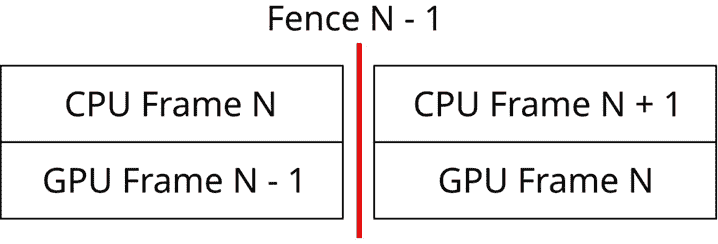
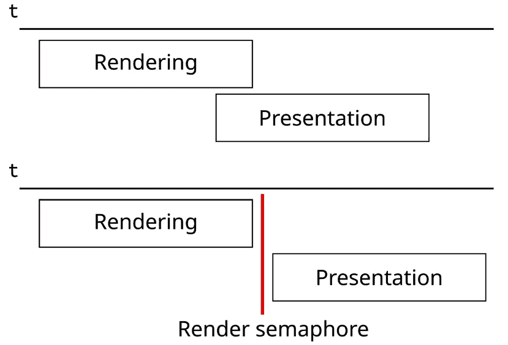
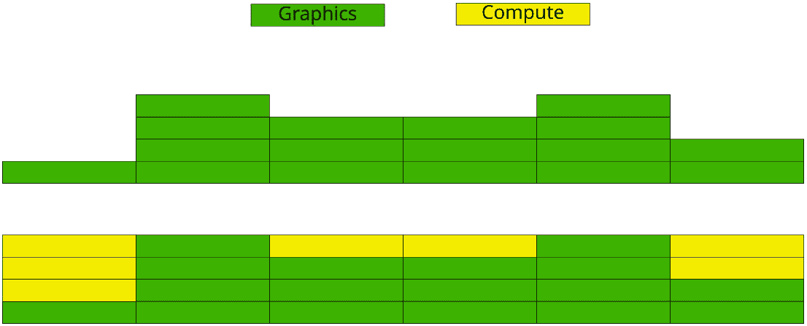

# 5

# 解锁异步计算

在本章中，我们将通过允许计算工作与图形任务并行执行来改进我们的渲染器。到目前为止，我们一直将所有工作记录并提交给单个队列。我们仍然可以向该队列提交计算任务以与图形工作一起执行：例如，在本章中，我们已经开始使用计算着色器进行全屏光照渲染过程。在这种情况下，我们不需要单独的队列，因为我们想减少不同队列之间的同步量。

然而，在单独的队列上运行其他计算工作负载可能是有益的，这样可以允许 GPU 充分利用其计算单元。在本章中，我们将实现一个简单的布料模拟，使用计算着色器在单独的计算队列上运行。为了解锁这一新功能，我们需要对我们的引擎进行一些修改。

在本章中，我们将涵盖以下主要内容：

+   使用单个时间线信号量来避免多个栅栏

+   为异步计算添加单独的队列

+   使用异步计算实现布料模拟

# 技术要求

本章的代码可以在以下 URL 找到：[`github.com/PacktPublishing/Mastering-Graphics-Programming-with-Vulkan/tree/main/source/chapter5`](https://github.com/PacktPublishing/Mastering-Graphics-Programming-with-Vulkan/tree/main/source/chapter5)

# 用单个时间线信号量替换多个栅栏

在本节中，我们将解释当前如何在我们的渲染器中使用栅栏和信号量，以及如何通过利用时间线信号量来减少我们必须使用的对象数量。

我们的引擎已经支持使用栅栏并行渲染多个帧。必须使用栅栏来确保 GPU 已经完成对给定帧的资源使用。这是通过在提交新一批命令到 GPU 之前在 CPU 上等待来实现的。



图 5.1 – CPU 正在处理当前帧，而 GPU 正在渲染上一帧

然而，有一个缺点；我们需要为每个正在飞行的帧创建一个栅栏。这意味着我们将至少需要管理两个栅栏来实现双缓冲，如果我们想支持三缓冲，则需要三个。

我们还需要多个信号量来确保 GPU 在继续之前等待某些操作完成。例如，我们需要在渲染完成后发出一个信号量，并将该信号量传递给显示命令。这是为了保证在我们尝试显示交换链图像之前渲染已完成。

下面的图示说明了两种场景；在第一种场景中，没有信号量，交换链图像可以在渲染仍在进行时显示到屏幕上。

在第二种场景中，我们添加了一个在渲染提交中信号并在展示之前等待的信号量。这确保了应用程序的正确行为。如果我们没有这个信号量，我们可能会展示仍在渲染的图像，并显示损坏的数据。



图 5.2 – 两个场景说明了在渲染和展示之间需要信号量的必要性

当我们开始考虑多个队列时，情况会变得更糟。在本章中，我们将添加一个单独的计算队列。这意味着我们需要添加更多的栅栏来等待 CPU 完成计算工作。我们还需要新的信号量来同步计算和图形队列，以确保计算队列产生的数据准备好被图形队列使用。

即使我们没有使用计算队列，我们也可能想要将我们的渲染工作分成多个提交。每个提交都需要它自己的信号和等待信号量，根据每个工作负载的依赖关系。对于有数十个甚至数百个提交的大型场景，这可能会迅速失控。

幸运的是，我们有一个解决方案。如果我们这么想，栅栏和信号量持有相同的信息；它们在提交完成后被信号。如果有一种方法可以在 CPU 和 GPU 上使用单个对象会怎样？这种确切的功能正是由时间线信号量提供的。

如其名所示，时间线信号量保持一个单调递增的值。我们可以定义我们希望信号量被信号通知的值和希望等待的值。这个对象可以被 GPU 和 CPU 等待，大大减少了实现正确同步所需的对象数量。

现在我们将展示如何在 Vulkan 中使用时间线信号量。

## 启用时间线信号量扩展

时间线信号量功能在 Vulkan 1.2 中被提升为核心功能。然而，它不是一个强制性的扩展，因此在使用它之前，我们首先需要查询支持。这通常是通过枚举设备暴露的扩展并查找扩展名称来完成的：

```cpp
vkEnumerateDeviceExtensionProperties( 
    vulkan_physical_device, nullptr, 
        &device_extension_count, extensions );
for ( size_t i = 0; i < device_extension_count; i++ ) {
    if ( !strcmp( extensions[ i ].extensionName, 
         VK_KHR_TIMELINE_SEMAPHORE_EXTENSION_NAME ) ) {
             timeline_semaphore_extension_present = true;
             continue;
         }
}
```

如果扩展存在，我们需要填充一个额外的结构，该结构将在设备创建时使用，如下面的代码所示：

```cpp
VkPhysicalDeviceFeatures2 physical_features2 { 
VK_STRUCTURE_TYPE_PHYSICAL_DEVICE_FEATURES_2 };
void* current_pnext = nullptr;
VkPhysicalDeviceTimelineSemaphoreFeatures timeline_sempahore_features{ VK_STRUCTURE_TYPE_PHYSICAL_DEVICE_TIMELINE_SEMAPHORE_FEATURES  };
if ( timeline_semaphore_extension_present ) {
    timeline_sempahore_features.pNext = current_pnext;
    current_pnext = &timeline_sempahore_features;
}
physical_features2.pNext = current_pnext;
vkGetPhysicalDeviceFeatures2( vulkan_physical_device, 
    &physical_features2 );
```

我们还需要将扩展名添加到已启用扩展的列表中：

```cpp
if ( timeline_semaphore_extension_present ) {
    device_extensions.push( 
        VK_KHR_TIMELINE_SEMAPHORE_EXTENSION_NAME );
}
```

最后，我们使用我们刚刚在创建设备时检索到的数据：

```cpp
VkDeviceCreateInfo device_create_info { 
    VK_STRUCTURE_TYPE_DEVICE_CREATE_INFO };
device_create_info.enabledExtensionCount = 
    device_extensions.size;  
device_create_info.ppEnabledExtensionNames = 
    device_extensions.data; 
device_create_info.pNext = &physical_features2;
vkCreateDevice( vulkan_physical_device, 
    &device_create_info, vulkan_allocation_callbacks, 
        &vulkan_device );
```

现在，我们已经准备好在我们的代码中使用时间线信号量了！我们将在下一节中看到如何创建时间线信号量。

## 创建时间线信号量

创建时间线信号量相当简单。我们首先定义标准的创建结构：

```cpp
VkSemaphoreCreateInfo semaphore_info{ 
    VK_STRUCTURE_TYPE_SEMAPHORE_CREATE_INFO };
```

然后，我们需要传递一个额外的结构来告诉 API 我们想要创建一个时间线信号量：

```cpp
VkSemaphoreTypeCreateInfo semaphore_type_info{ 
    VK_STRUCTURE_TYPE_SEMAPHORE_TYPE_CREATE_INFO };
semaphore_type_info.semaphoreType = 
    VK_SEMAPHORE_TYPE_TIMELINE;
semaphore_info.pNext = &semaphore_type_info;
Finally, we call the create function:
vkCreateSemaphore( vulkan_device, &semaphore_info, 
    vulkan_allocation_callbacks, &vulkan_timeline_semaphore );
```

就这样！我们现在有一个可以用于我们的渲染器的时间线信号量。在下一节中，我们将探讨如何使用这种类型的信号量的一些示例。

## 在 CPU 上等待时间线信号量

如前所述，我们可以在 CPU 上等待时间线信号量被触发。以下代码正是这样做的：

```cpp
u64 timeline_value = …;

VkSemaphoreWaitInfo semaphore_wait_info{ 
    VK_STRUCTURE_TYPE_SEMAPHORE_WAIT_INFO };
semaphore_wait_info.semaphoreCount = 1;
semaphore_wait_info.pSemaphores = 
    &vulkan_timeline_semaphore;
semaphore_wait_info.pValues = &timeline_value;

vkWaitSemaphores( vulkan_device, &semaphore_wait_info, 
                  timeout );
```

如您可能已经注意到的，我们可以同时等待多个信号量，并为每个信号量指定不同的值。这在渲染到多个窗口时可能很有用，每个窗口使用不同的信号量。`VkSemaphoreWaitInfo`结构还有一个`flags`字段。

在此字段中使用`VK_SEMAPHORE_WAIT_ANY_BIT`值将在任何一个信号量达到我们等待的值时终止等待。否则，只有在所有信号量都达到各自值时，等待才会终止。

上述代码的最后一个重要方面是超时值。这个值以纳秒为单位指定。如果在给定时间内等待条件没有得到满足，调用将返回`VK_TIMEOUT`。我们通常将超时设置为无限，因为我们绝对需要信号量被触发。

然而，存在一个风险，即等待调用可能永远不会返回，例如，如果等待和信号值的组合导致 GPU 上的死锁。一种替代方法是设置超时为一个相对较大的值——例如 1 秒。如果在这个时间间隔内等待未完成，很可能我们的提交存在问题，并且我们可以将错误信息通知用户。

在本节中，我们展示了如何在 CPU 上等待时间线信号量。在下一节中，我们将介绍如何在 GPU 上使用时间线信号量。

## 在 GPU 上使用时间线信号量

在本节中，我们将展示如何更新时间线信号量的值，以及如何在 GPU 上等待特定的值。

注意

在我们开始之前，我们想指出我们正在使用`VK_KHR_synchronization2`扩展。这个扩展简化了屏障和信号量的代码编写。请参考完整代码，以了解如何使用旧 API 实现这一点。

我们首先定义我们想要等待的信号量列表：

```cpp
VkSemaphoreSubmitInfoKHR wait_semaphores[]{
    { VK_STRUCTURE_TYPE_SEMAPHORE_SUBMIT_INFO_KHR, nullptr, 
       vulkan_image_acquired_semaphore, 0, 
       VK_PIPELINE_STAGE_2_COLOR_ATTACHMENT_OUTPUT_BIT_KHR,
       0 },
    { VK_STRUCTURE_TYPE_SEMAPHORE_SUBMIT_INFO_KHR, nullptr, 
       vulkan_timeline_semaphore, absolute_frame - ( 
       k_max_frames - 1 ), 
       VK_PIPELINE_STAGE_2_TOP_OF_PIPE_BIT_KHR , 0 }
};
```

这个列表可以包含标准信号量和时间线信号量。对于标准信号量，`signal`值被忽略。

同样，我们需要定义一个要等待的信号量列表：

```cpp
VkSemaphoreSubmitInfoKHR signal_semaphores[]{
    { VK_STRUCTURE_TYPE_SEMAPHORE_SUBMIT_INFO_KHR, nullptr, 
       *render_complete_semaphore, 0, 
       VK_PIPELINE_STAGE_2_COLOR_ATTACHMENT_OUTPUT_BIT_KHR, 
       0 },
    { VK_STRUCTURE_TYPE_SEMAPHORE_SUBMIT_INFO_KHR, nullptr, 
       vulkan_timeline_semaphore, absolute_frame + 1, 
       VK_PIPELINE_STAGE_2_COLOR_ATTACHMENT_OUTPUT_BIT_KHR 
       , 0 }
};
```

如前所述，我们可以使用不同的信号量类型，对于标准信号量，信号值被忽略。对于时间线信号量，信号值始终需要增加。如果我们提交相同的值两次或更小的值，将会得到一个验证错误。

我们还需要小心我们用于等待和发出的值。如果我们等待在同一个提交中设置的值，我们将会使 GPU 陷入死锁。一般来说，始终尝试使用一个保证已被前一个提交设置的值。验证层也将帮助您捕获此类错误。

最后一步是将两个列表传递给提交信息结构：

```cpp
VkSubmitInfo2KHR submit_info{ 
    VK_STRUCTURE_TYPE_SUBMIT_INFO_2_KHR };
submit_info.waitSemaphoreInfoCount = 2;
submit_info.pWaitSemaphoreInfos = wait_semaphores;
submit_info.commandBufferInfoCount = 
    num_queued_command_buffers;
submit_info.pCommandBufferInfos = command_buffer_info;
submit_info.signalSemaphoreInfoCount = 2;
submit_info.pSignalSemaphoreInfos = signal_semaphores;

queue_submit2( vulkan_main_queue, 1, &submit_info, 
    VK_NULL_HANDLE );
```

如您可能已经注意到的，我们现在可以在提交中等待和发出相同的时间线信号量。我们也不再需要栅栏。这极大地简化了代码并减少了所需的同步对象数量。

在本节中，我们展示了如何启用使用时间线信号量的扩展，以及如何创建和使用它们在 CPU 上等待。最后，我们展示了如何在 GPU 上等待和发出时间线信号量。

在下一节中，我们将利用新获得的知识添加一个用于异步计算工作的单独队列。

# 添加用于异步计算的单独队列

在本节中，我们将说明如何使用单独的队列进行图形和计算工作，以充分利用我们的 GPU。现代 GPU 拥有许多通用的计算单元，这些单元既可以用于图形工作，也可以用于计算工作。根据给定帧的工作负载（着色器复杂性、屏幕分辨率、渲染过程之间的依赖关系等），GPU 可能无法充分利用。

使用计算着色器将一些在 CPU 上完成的计算移动到 GPU 上可以提高性能并实现更好的 GPU 利用率。这是可能的，因为 GPU 调度器可以确定是否有任何计算单元处于空闲状态，并将工作分配给它们以重叠现有工作：



图 5.3 – 顶部：图形工作负载没有充分利用 GPU；底部：计算工作负载可以利用未使用的资源以实现最佳的 GPU 利用率

在本节的剩余部分，我们将演示如何使用上一节中引入的时间线信号量来同步两个队列之间的数据访问。

## 在单独的队列上提交工作

我们已经在*第三章*中设置了多个队列，*解锁多线程*。现在我们需要确保两个队列之间的数据访问正确同步；否则，我们可能会访问过时或更糟的数据，即尚未初始化的数据。

在此过程的第一个步骤是创建一个单独的命令缓冲区。由于同一个命令缓冲区不能提交到不同的队列，因此必须为计算工作使用不同的命令缓冲区。这可以通过从我们的`GpuDevice`实现请求一个新的命令缓冲区轻松实现：

```cpp
CommandBuffer* cb = gpu.get_command_buffer( 0, 
gpu.current_frame, true );
```

接下来，我们需要创建一个新的时间线信号量，该信号量将被计算队列使用。这与我们在上一节中展示的代码相同，我们不会在这里重复。

然后，我们需要在每次计算提交时增加我们时间线信号量的值：

```cpp
bool has_wait_semaphore = last_compute_semaphore_value > 0;
VkSemaphoreSubmitInfoKHR wait_semaphores[]{
    { VK_STRUCTURE_TYPE_SEMAPHORE_SUBMIT_INFO_KHR, nullptr, 
       vulkan_compute_semaphore, 
       last_compute_semaphore_value, 
       VK_PIPELINE_STAGE_2_COMPUTE_SHADER_BIT_KHR, 0 }
};

last_compute_semaphore_value++;

VkSemaphoreSubmitInfoKHR signal_semaphores[]{
    { VK_STRUCTURE_TYPE_SEMAPHORE_SUBMIT_INFO_KHR, nullptr, 
       vulkan_compute_semaphore, 
       last_compute_semaphore_value, 
       VK_PIPELINE_STAGE_2_COMPUTE_SHADER_BIT_KHR, 0 },
};
```

这段代码与我们在提交时间线信号量之前展示的代码类似。主要区别在于等待阶段，现在必须是`VK_PIPELINE_STAGE_2_COMPUTE_SHADER_BIT_KHR`。现在我们已经有了等待和信号信号量的列表，它们已准备好用于我们的提交：

```cpp
VkCommandBufferSubmitInfoKHR command_buffer_info{ 
    VK_STRUCTURE_TYPE_COMMAND_BUFFER_SUBMIT_INFO_KHR };
command_buffer_info.commandBuffer = 
    command_buffer->vk_command_buffer;

VkSubmitInfo2KHR submit_info{ 
    VK_STRUCTURE_TYPE_SUBMIT_INFO_2_KHR };
submit_info.waitSemaphoreInfoCount = 
    has_wait_semaphore ? 1 : 0;
submit_info.pWaitSemaphoreInfos = wait_semaphores;
submit_info.commandBufferInfoCount = 1;
submit_info.signalSemaphoreInfoCount = 1;
submit_info.pSignalSemaphoreInfos = signal_semaphores;

queue_submit2( vulkan_compute_queue, 1, &submit_info, 
    VK_NULL_HANDLE );
```

再次强调，这应该是一个熟悉的代码。我们想强调的是，我们只在第一次提交后添加等待信号量。如果我们要在第一次提交时等待信号量，GPU 将会死锁，因为信号量永远不会被触发。幸运的是，验证层会突出显示这个问题，并且可以很容易地纠正。

现在我们已经提交了计算工作负载，我们需要确保图形队列等待数据准备就绪。我们可以通过在提交图形队列时将计算信号量添加到等待信号量的列表中来实现这一点。我们将只突出显示新的代码：

```cpp
bool wait_for_compute_semaphore = ( 
    last_compute_semaphore_value > 0 ) && has_async_work; 
VkSemaphoreSubmitInfoKHR wait_semaphores[]{
    { VK_STRUCTURE_TYPE_SEMAPHORE_SUBMIT_INFO_KHR, nullptr, 
       vulkan_image_acquired_semaphore, 0, 
       VK_PIPELINE_STAGE_2_COLOR_ATTACHMENT_OUTPUT_BIT_KHR, 
       0 },
    { VK_STRUCTURE_TYPE_SEMAPHORE_SUBMIT_INFO_KHR, nullptr, 
       vulkan_compute_semaphore, 
       last_compute_semaphore_value, 
       VK_PIPELINE_STAGE_2_VERTEX_ATTRIBUTE_INPUT_BIT_KHR, 
       0 },
    { VK_STRUCTURE_TYPE_SEMAPHORE_SUBMIT_INFO_KHR, nullptr, 
       vulkan_graphics_semaphore, 
       absolute_frame - ( k_max_frames - 1 ), 
       VK_PIPELINE_STAGE_2_TOP_OF_PIPE_BIT_KHR , 0 },
};
```

在将计算信号量添加到列表时，必须采取相同的谨慎。我们只想在至少执行了一个计算提交时等待。对于某些帧，我们可能没有任何计算工作待处理。在这种情况下，我们也不希望等待计算信号量。

在我们的案例中，我们将等待阶段设置为`VK_PIPELINE_STAGE_2_VERTEX_ATTRIBUTE_INPUT_BIT_KHR`，因为我们正在修改我们的网格的顶点。如果，例如，您正在使用计算队列更新一个直到片段着色器阶段才使用的纹理，这将需要调整。使用正确的等待阶段对于获得最佳性能很重要。

在本节中，我们展示了如何检索用于计算工作的单独队列。然后我们解释了如何使用新创建的队列提交计算工作，并正确同步来自不同队列的数据访问以确保正确的结果。

在下一节中，我们将通过实现一个简单的布料模拟来展示一个具体的示例，使用的是计算着色器。

# 使用异步计算实现布料模拟

在本节中，我们将实现一个简单的布料模拟，作为计算工作负载的示例用例。我们首先解释为什么在某些任务上运行 GPU 可能是有益的。接下来，我们提供一个计算着色器的概述。最后，我们展示如何将代码从 CPU 迁移到 GPU，并突出两个平台之间的差异。

## 使用计算着色器的优势

在过去，物理模拟主要在 CPU 上运行。GPU 只有足够的计算能力来处理图形工作，并且大多数管道阶段都是由只能执行一个任务的专用硬件块实现的。随着 GPU 的发展，管道阶段转移到通用的计算块，这些块可以执行不同的任务。

这种灵活性和计算能力的增加使得引擎开发者可以将一些工作负载移动到 GPU 上。除了原始性能之外，在 GPU 上运行一些计算可以避免从 CPU 内存到 GPU 内存的昂贵复制。内存速度没有像处理器速度那样快速发展，尽可能少地在设备之间移动数据是应用程序性能的关键。

在我们的例子中，布料模拟必须更新所有顶点的位置并将更新的数据复制到 GPU。根据网格的大小和要更新的网格数量，这可能会占帧时间的很大一部分。

这些工作负载在 GPU 上也可以更好地扩展，因为我们能够并行更新更多的网格。

现在我们将概述计算着色器是如何执行的。如果你熟悉计算着色器或者之前使用过 CUDA 或 OpenCL，可以自由地浏览下一节。

## 计算着色器概述

GPU 执行模型被称为**单指令多线程**（**SIMT**）。它与现代 CPU 提供的**单指令多数据**（**SIMD**）类似，用于使用单个指令操作多个数据条目。

然而，GPU 在单个指令中操作的数据点更多。另一个主要区别是，与 SIMD 指令相比，GPU 上的每个线程都更加灵活。GPU 架构是一个迷人的话题，但其范围超出了本书的范围。我们将在本章末尾提供进一步阅读的参考文献。

注意

线程组在不同的 GPU 供应商中有不同的名称。你可能会在他们的文档中看到术语 warp 或 wave。我们将使用线程组来避免混淆。

每个计算着色器调用可以在计算单元内使用多个线程，并且可以控制使用多少线程。在 Vulkan 中，这是通过计算着色器内的以下指令实现的：

```cpp
layout (local_size_x = 8, local_size_y = 8, 
local_size_z = 1) in;
```

这定义了局部组的大小；我们将在稍后解释它是如何工作的。目前，主要点是我们在告诉 GPU 我们想要执行 64 个线程（8x8）。每个 GPU 都有一个最佳线程组大小。你应该检查每个供应商的文档，并在可能的情况下调整线程组大小以获得最佳性能。

在调用计算着色器时，我们还需要定义一个全局组大小：

```cpp
gpu_commands->dispatch( ceilu32( renderer->
    gpu->swapchain_width * 1.f / 8 ), 
      ceilu32( renderer->gpu->swapchain_height * 1.f / 8 ), 
      1 );
```

这段代码取自我们的光照传递实现。在这种情况下，我们想要处理渲染目标纹理中的所有像素。正如你可能注意到的，我们将其大小除以 8。这是确保我们不会多次处理相同像素所必需的。让我们通过一个例子来澄清局部和全局组大小的工作原理。

假设我们的渲染目标是 1280x720。将宽度乘以高度将给出图像中的总像素数。当我们定义局部组大小时，我们确定每个着色器调用将处理多少像素（在我们的例子中再次是 64）。着色器调用的数量计算如下：

```cpp
shader_invocation_count = total_pixels / 64
```

`dispatch`命令需要三个值，因为局部和全局组大小都被定义为三个值的向量。这就是为什么我们将每个维度除以`8`的原因：

```cpp
global_group_size_x = width / 8
global_group_size_y = height / 8
```

由于我们正在处理 2D 纹理，我们不会修改`z`值。我们可以通过以下代码验证我们正在处理正确的像素数量：

```cpp
local_thread_group_count = 64
shader_invocation_count = global_group_size_x * 
    global_group_size_y
total_pixels =  shader_invocation_count * 
    local_thread_group_count
```

我们可以通过使用 GLSL 提供的这个变量来确定在着色器内部正在运行哪个调用：

```cpp
ivec3 pos = ivec3( gl_GlobalInvocationID.xyz );
```

每个线程将看到一个独特的位置值，我们可以使用它来访问我们的纹理。

这只是计算着色器执行模型的简要概述。我们将在*进一步阅读*部分提供更深入的资源。

现在我们对计算着色器的执行有了更好的理解，我们将演示如何将 CPU 代码转换为 GPU 计算着色器。

## 编写计算着色器

为计算着色器编写代码与编写顶点或片段着色器类似。主要区别在于我们在计算着色器中具有更多的灵活性来定义要访问哪些数据。例如，在顶点着色器中，我们通常访问属性缓冲区中的一个条目。同样适用于片段着色器，其中由着色器调用着色的片段由 GPU 确定。

由于增加了灵活性，我们还需要更仔细地考虑我们的访问模式和线程之间的同步。例如，如果有多个线程必须写入相同的内存位置，我们需要添加内存屏障以确保对该内存的先前写入已完成，并且所有线程都看到正确的值。在伪代码中，这转化为以下内容：

```cpp
// code
MemoryBarrier()
// all threads have run the code before the barrier
```

如果在着色器调用之间需要访问相同的内存位置，GLSL 还提供了原子操作。

考虑到这一点，让我们看看布料模拟 CPU 版本的伪代码：

```cpp
for each physics mesh in the scene:
    for each vertex in the mesh:
        compute the force applied to the vertex
    // We need two loops because each vertex references 
       other vertices position
    // First we need to compute the force applied to each 
       vertex, 
    // and only after update each vertex position
       for each vertex in the mesh:
    update the vertex position and store its velocity

    update the mesh normals and tangents
    copy the vertices to the GPU
```

我们为布料模拟使用了常见的弹簧模型，但其实现超出了本章的范围。我们建议查看代码以获取更多细节，并在*进一步阅读*部分引用了我们使用的论文。

正如你所注意到的，在循环的末尾，我们必须将更新的顶点、法线和切线缓冲区复制到 GPU 上。根据网格的数量和它们的复杂性，这可能是一个昂贵的操作。如果布料模拟依赖于在 GPU 上运行的其它系统的数据，这一步可能会更加昂贵。

例如，如果动画系统在 GPU 上运行，而布料模拟在 CPU 上运行，我们现在需要执行两个复制操作，并且在管道中还有额外的同步点。出于这些原因，将布料模拟移动到 GPU 上可能是有益的。

让我们先看看顶点缓冲区的设置：

```cpp
BufferCreation creation{ };
sizet buffer_size = positions.size * sizeof( vec3s );
creation.set( flags, ResourceUsageType::Immutable, 
    buffer_size ).set_data( positions.data )
        .set_name( nullptr ).set_persistent( true );

BufferResource* cpu_buffer = renderer->
    create_buffer( creation );
cpu_buffers.push( *cpu_buffer );
```

这是我们之前需要的唯一缓冲区。因为我们必须在 CPU 上更新数据，所以我们只能使用主机一致性的缓冲区，这样 CPU 上的写入在 CPU 上才是可见的。使用这种类型的缓冲区对 GPU 的性能有影响，因为这种内存可能访问速度较慢，尤其是当缓冲区大小很大时。

由于我们现在将在 GPU 上执行更新，我们可以使用标记为`device_only`的缓冲区。这就是我们创建缓冲区的方式：

```cpp
creation.reset().set( flags, ResourceUsageType::Immutable, 
    buffer_size ).set_device_only( true )
        .set_name( "position_attribute_buffer" );

BufferResource* gpu_buffer = renderer->
    create_buffer( creation );
gpu_buffers.push( *gpu_buffer );
```

最后，我们只从 CPU 复制一次数据到 GPU。复制完成后，我们可以释放 CPU 缓冲区：

```cpp
async_loader->request_buffer_copy( cpu_buffer->handle, 
                                   gpu_buffer->handle );
```

我们已经展示了位置缓冲区的示例。所有其他缓冲区（法线、切线、纹理坐标和索引）都以相同的方式进行管理。

现在我们有了我们的缓冲区，我们需要创建一个将被我们的计算着色器使用的描述符集：

```cpp
DescriptorSetLayoutHandle physics_layout = renderer->
    gpu->get_descriptor_set_layout
        ( cloth_technique->passes[ 0 ].pipeline, 
            k_material_descriptor_set_index );
ds_creation.reset().buffer( physics_cb, 0 )
    .buffer( mesh.physics_mesh->gpu_buffer, 1 )
    .buffer( mesh.position_buffer, 2 )
    .buffer( mesh.normal_buffer, 3 )
    .buffer( mesh.index_buffer, 4 )
    .set_layout( physics_layout );

mesh.physics_mesh->descriptor_set = renderer->
    gpu->create_descriptor_set( ds_creation );
```

我们可以将前一个缓冲区的绑定与以下着色器代码相匹配：

```cpp
layout ( std140, set = MATERIAL_SET, binding = 0 ) uniform 
    PhysicsData {
    ...
};

layout ( set = MATERIAL_SET, binding = 1 ) buffer 
    PhysicsMesh {
        uint index_count;
        uint vertex_count;

    PhysicsVertex physics_vertices[];
};

layout ( set = MATERIAL_SET, binding = 2 ) buffer 
    PositionData {
        float positions[];
};

layout ( set = MATERIAL_SET, binding = 3 ) buffer 
    NormalData {
        float normals[];
};

layout ( set = MATERIAL_SET, binding = 4 ) readonly buffer 
    IndexData {
        uint indices[];
};
```

重要的是要注意几个点。因为我们不知道每个缓冲区在运行时的尺寸，我们必须使用单独的存储块。每个存储块只能有一个运行时数组，并且它必须是块的最后一个成员。

我们还必须使用浮点数组而不是`vec3`数组；否则，向量中的每个条目都会填充到 16 字节，GPU 上的数据将不再与 CPU 上的数据布局匹配。我们可以使用`vec4`作为类型，但我们会为每个顶点浪费 4 字节。当你有数百万，甚至数十亿个顶点时，这会累积起来！

最后，我们将`IndexData`块标记为`readonly`。这是因为在这个着色器中我们永远不会修改索引缓冲区。标记每个块为正确的属性很重要，因为这会给着色器编译器提供更多的优化机会。

我们可以通过不同的数据排列来减少块的数量，例如：

```cpp
struct MeshVertex {
    vec3 position;
    vec3 normal;
    vec3 tangent;
};

layout ( set = MATERIAL_SET, binding = 2 ) buffer MeshData {
    MeshVertex mesh_vertices[];
};
```

这种解决方案通常被称为**结构数组**（**AoS**），而之前我们展示的代码使用了**数组结构**（**SoA**）。虽然 AoS 解决方案简化了绑定，但它也使得无法单独使用每个数组。例如，在我们的深度遍历中，我们只需要位置信息。因此，我们更倾向于使用 SoA 方法。

我们已经展示了如何调度计算着色器以及如何同步计算和图形队列之间的访问，所以我们不会在这里重复那段代码。现在我们可以转向着色器实现。我们只将展示相关部分；您可以通过查看代码来获取完整的列表。

我们首先计算每个顶点所受的力：

```cpp
vec3 spring_force = vec3( 0, 0, 0 );

for ( uint j = 0; j < physics_vertices[ v ]
    .joint_count; ++j ) {
        pull_direction = ...;
        spring_force += pull_direction;
}

vec3 viscous_damping = physics_vertices[ v ]
    .velocity * -spring_damping;

vec3 viscous_velocity = ...;

vec3 force = g * m;
force -= spring_force;
force += viscous_damping;
force += viscous_velocity;

physics_vertices[ v ].force = force;
```

注意我们每次是如何访问`physics_vertices`数组的。在 CPU 代码中，我们可以简单地获取结构体的引用，并且每个字段都会被正确更新。然而，GLSL 不支持引用，因此我们需要非常小心，确保我们没有写入局部变量。

与 CPU 代码一样，在计算每个顶点的力向量之后，我们需要更新其位置：

```cpp
vec3 previous_position = physics_vertices[ v ]
    .previous_position;
vec3 current_position = physics_vertices[ v ].position;

vec3 new_position = ...;

physics_vertices[ v ].position = new_position;
physics_vertices[ v ].previous_position = current_position;

physics_vertices[ v ].velocity = new_position - current_position;
```

再次注意，我们每次都从缓冲区中读取。最后，我们更新网格的顶点位置：

```cpp
for ( uint v = 0; v < vertex_count; ++v ) {
     positions[ v * 3 + 0 ] = physics_vertices[ v ]
         .position.x;
     positions[ v * 3 + 1 ] = physics_vertices[ v ]
         .position.y;
     positions[ v * 3 + 2 ] = physics_vertices[ v ]
         .position.z;
}
```

因为所有这些都是在 GPU 上执行的，所以位置可能首先由另一个系统（如动画）更新，但我们不再需要昂贵的从 GPU 到 GPU 的复制操作。

在我们得出结论之前，我们想指出，我们为每个网格调用一个着色器，并且性能是通过在同一个调度中对多个网格更新布料模拟来实现的。另一种方法可能是为每个网格有一个调度，其中每个着色器调用更新一个单独的顶点。

虽然在技术上是一个有效的方法，但它需要在线程组内以及着色器调用之间进行更多的同步。正如我们提到的，我们必须首先计算每个顶点的力，然后才能更新它们的位置。另一个解决方案可能是将更新分成两个着色器，一个用于计算力，另一个用于更新位置。

这仍然需要在每个着色器调度之间使用管道屏障。虽然 GPU 必须保证每个命令的执行顺序与记录的顺序相同；但它不保证完成的顺序。出于这些原因，我们决定为每个网格使用一个线程。

在本节中，我们解释了计算着色器的执行模型以及在 GPU 上运行选定的计算以提高性能和避免额外的内存复制的好处。然后我们演示了如何将针对 CPU 编写的代码移植到 GPU 上，以及在使用计算着色器时需要注意的一些方面。

我们建议查看代码以获取更多细节。尝试对布料模拟进行修改以实现不同的模拟技术，或者向引擎中添加您自己的计算着色器！

# 摘要

在本章中，我们为我们的渲染器构建了支持计算着色器的基础。我们首先介绍了时间线信号量和它们如何被用来替换多个信号量和栅栏。我们展示了如何在 CPU 上等待时间线信号量，以及时间线信号量可以作为队列提交的一部分使用，无论是为了发出信号还是等待。

接下来，我们演示了如何使用新引入的时间线信号量来同步图形和计算队列之间的执行。

在上一节中，我们展示了如何将针对 CPU 编写的代码移植到 GPU 上的一个示例。我们首先解释了在 GPU 上运行计算的一些好处。接下来，我们概述了计算着色器的执行模型以及局部和全局工作组大小的配置。最后，我们给出了一个用于布料模拟的计算着色器具体示例，并突出了与为 CPU 编写的相同代码的主要差异。

在下一章中，我们将通过添加网格着色器来改进我们的管线，对于不支持这些着色器的设备，我们将编写一个计算着色器替代方案。

# 进一步阅读

同步可能是 Vulkan 中最复杂的方面之一。我们在本章和前几章中提到了一些概念。如果您想提高您的理解，我们建议阅读以下资源：

+   [Vulkan 规范 - 同步](https://www.khronos.org/registry/vulkan/specs/1.3-extensions/html/vkspec.xhtml#synchronization)

+   [Vulkan 同步理解](https://www.khronos.org/blog/understanding-vulkan-synchronization)

+   [Vulkan 同步示例](https://github.com/KhronosGroup/Vulkan-Docs/wiki/Synchronization-Examples)

当涉及到计算着色器时，我们只是触及了表面。以下资源更深入地探讨了这些内容，并提供了一些针对个别设备的优化建议：

+   [OpenGL Compute Shader](https://www.khronos.org/opengl/wiki/Compute_Shader)

+   [NVIDIA CUDA 编程指南](https://docs.nvidia.com/cuda/cuda-c-programming-guide/index.xhtml#programming-model)

+   [OpenCL 编程指南](https://github.com/KhronosGroup/OpenCL-Guide/blob/main/chapters/opencl_programming_model.md)

计算机图形学中的实时布料模拟已经是一个研究了许多年的主题。我们的实现基于这篇论文：[斯坦福大学 Rigidcloth 论文](http://graphics.stanford.edu/courses/cs468-02-winter/Papers/Rigidcloth.pdf)。

在这篇论文中，介绍了一种流行的另一种方法：[CMU Baraff 论文](http://www.cs.cmu.edu/~baraff/papers/sig98.pdf)。

最后，这次 GDC 演讲给了我们使用布料模拟来展示如何使用计算着色器的想法：

[Ubisoft 布料模拟性能分析](https://www.gdcvault.com/play/1022350/Ubisoft-Cloth-Simulation-Performance-Postmortem)

# 第二部分：GPU 驱动渲染

从这部分开始，我们将专注于现代渲染技术。本节将涵盖以下章节：

+   *第六章**，GPU 驱动渲染*

+   *第七章**，使用集群延迟渲染渲染多个光源*

+   *第八章**，使用网格着色器添加阴影*

+   *第九章**，实现可变率着色*

+   *第十章**，添加体积雾*
