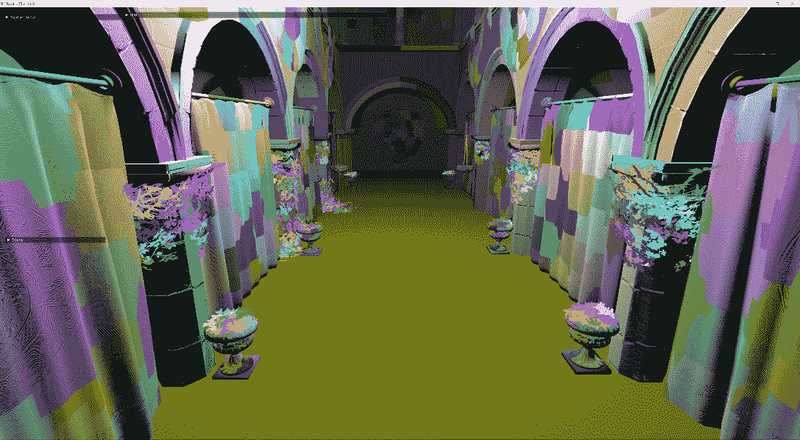
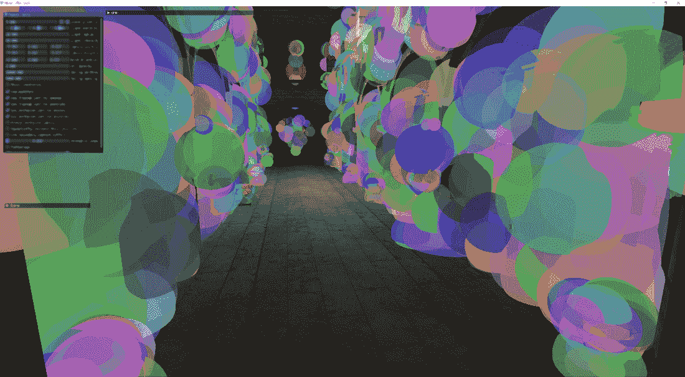
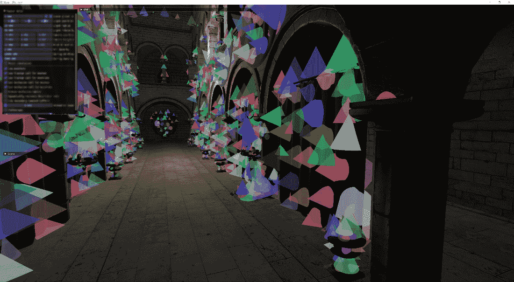
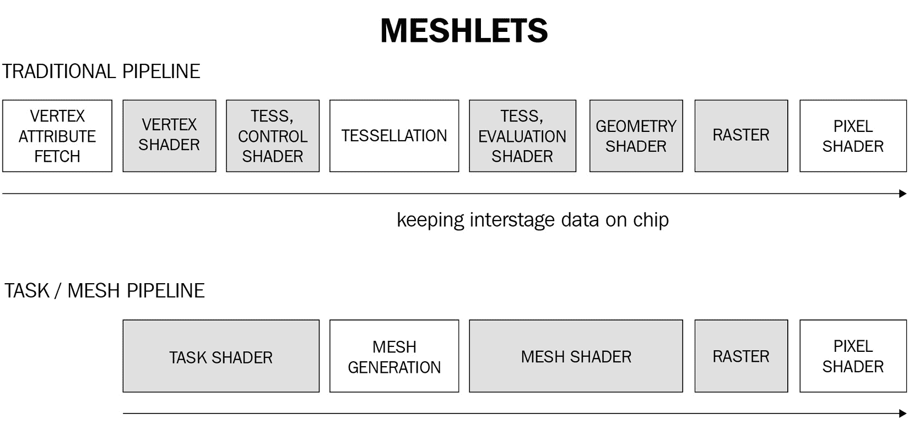
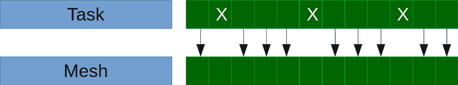

# 6

# GPU 驱动渲染

在本章中，我们将升级几何管线以使用最新的可用技术：**网格着色器**和**网格块**。这种技术的理念是将网格渲染的流程从 CPU 移动到 GPU，将剔除和绘制命令生成移动到不同的着色器中。

我们首先将在 CPU 上处理网格结构，通过将其分离成不同的*网格块*，每个网格块是包含最多 64 个三角形的组，每个三角形都有一个单独的边界球。然后我们将使用计算着色器进行剔除，并在不同的传递中写入绘制网格块的命令列表。最后，我们将使用网格着色器渲染网格块。还将提供一个计算版本，因为目前网格着色器仅适用于 Nvidia GPU。

传统上，几何剔除是在 CPU 上执行的。场景中的每个网格通常由一个**轴对齐的边界框**（**AABB**）表示。AABB 可以很容易地与相机视锥体进行剔除，但随着场景复杂性的增加，大量帧时间可能会花费在剔除步骤上。

这通常是渲染管线中的第一步，因为我们需要确定哪些网格需要提交进行绘制。这意味着很难找到其他可以并行执行的工作。在 CPU 上执行视锥剔除的另一个痛点是难以确定哪些对象被遮挡且不需要绘制。

在每一帧中，我们需要根据相机位置重新排序所有元素。当场景中有成千上万的元素时，这通常是不切实际的。最终，一些网格，例如地形，被组织在大的区域中，这些区域总是会被绘制出来，即使只有其中的一小部分是可见的。

幸运的是，我们可以将一些计算转移到 GPU 上，并利用其并行能力。本章中我们将要介绍的技术将允许我们在 GPU 上执行视锥和遮挡剔除。为了使过程尽可能高效，我们将直接在 GPU 上生成绘制命令列表。

在本章中，我们将涵盖以下主要主题：

+   将大型网格分解成网格块

+   使用任务和网格着色器处理网格块以执行背面和视锥剔除

+   使用计算着色器进行高效的遮挡剔除

+   在 GPU 上生成绘制命令并使用间接绘制函数

# 技术要求

本章的代码可以在以下 URL 找到：[`github.com/PacktPublishing/Mastering-Graphics-Programming-with-Vulkan/tree/main/source/chapter6`](https://github.com/PacktPublishing/Mastering-Graphics-Programming-with-Vulkan/tree/main/source/chapter6)。

# 将大型网格分解成网格块

在本章中，我们将主要关注管道的几何阶段，即着色阶段之前的一个阶段。向管道的几何阶段添加一些复杂性将在后续阶段带来回报，因为我们将减少需要着色的像素数量。

注意

当我们提到图形管道的几何阶段时，我们并不是指几何着色器。管道的几何阶段指的是**输入装配**（**IA**）、顶点处理和**原语装配**（**PA**）。顶点处理可以进一步运行一个或多个以下着色器：顶点、几何、细分、任务和网格着色器。

内容几何形状有多种形状、大小和复杂性。渲染引擎必须能够处理从小型详细对象到大型地形的网格。大型网格（如地形或建筑）通常由艺术家分解，以便渲染引擎可以根据这些对象与摄像机的距离选择不同的细节级别。

将网格分解成更小的块可以帮助剔除不可见的几何形状，但其中一些网格仍然足够大，以至于我们需要完全处理它们，即使只有一小部分是可见的。

网格细分是为了解决这些问题而开发的。每个网格被细分为顶点组（通常是 64 个），这些顶点可以在 GPU 上更容易地处理。

下图说明了网格如何被分解成网格细分：



图 6.1 – 网格细分示例

这些顶点可以组成任意数量的三角形，但我们通常根据我们运行的硬件调整这个值。在 Vulkan 中，推荐值为`126`（如[`developer.nvidia.com/blog/introduction-turing-mesh-shaders/`](https://developer.nvidia.com/blog/introduction-turing-mesh-shaders/)中所述，这个数字是为了为每个网格保留一些内存以写入原始计数）。

注意

在撰写本文时，网格和任务着色器仅通过其扩展在 Nvidia 硬件上可用。虽然本章中描述的一些 API 是特定于这个扩展的，但概念可以普遍应用并使用通用计算着色器实现。Khronos 委员会目前正在开发这个扩展的更通用版本，以便网格和任务着色器很快就能从其他供应商那里获得！

现在我们有更少的三角形数量，我们可以通过剔除不可见或被其他对象遮挡的网格来使用它们进行更细粒度的控制。

除了顶点和三角形的列表之外，我们还为每个网格生成一些额外的数据，这些数据在稍后执行背面、视锥体和遮挡剔除时将非常有用。

另一个额外的可能性（将在未来添加）是选择网格的**细节级别**（**LOD**），从而根据任何想要的启发式方法选择不同的 meshlets 子集。

这额外数据中的第一个代表 meshlet 的边界球体，如下面的截图所示：



图 6.2 – meshlet 边界球示例；为了清晰起见，一些较大的球已被隐藏

有些人可能会问：为什么不使用 AABBs？AABBs 至少需要两个`vec3`的数据：一个用于中心，一个用于半大小向量。另一种编码方式是存储最小和最大的角点。相反，球体可以用单个`vec4`编码：一个`vec3`用于中心加上半径。

由于我们可能需要处理数百万个 meshlets，每个节省的字节都很重要！球体也更容易进行视锥体和遮挡剔除的测试，正如我们将在本章后面描述的。

我们接下来要使用的数据的下一部分是 meshlet 圆锥，如下面的截图所示：



图 6.3 – meshlet 圆锥示例；为了清晰起见，并非所有圆锥都显示

圆锥表示 meshlet 面向的方向，并将用于背面剔除。

现在我们更好地理解了 meshlets 为何有用以及我们如何使用它们来改进大型网格的剔除，让我们看看如何在代码中生成它们！

## 生成 meshlets

我们使用一个开源库，称为**MeshOptimizer** ([`github.com/zeux/meshoptimizer`](https://github.com/zeux/meshoptimizer))来生成 meshlets。另一个替代库是**meshlete** ([`github.com/JarkkoPFC/meshlete`](https://github.com/JarkkoPFC/meshlete))，我们鼓励您尝试两者，以找到最适合您需求的库。

在加载给定网格的数据（顶点和索引）之后，我们将生成 meshlets 的列表。首先，我们确定可以为我们网格生成的最大 meshlets 数量，并为描述 meshlets 的顶点和索引数组分配内存：

```cpp
const sizet max_meshlets = meshopt_buildMeshletsBound( 
    indices_accessor.count, max_vertices, max_triangles );

Array<meshopt_Meshlet> local_meshlets;
local_meshlets.init( temp_allocator, max_meshlets, 
    max_meshlets );

Array<u32> meshlet_vertex_indices;
meshlet_vertex_indices.init( temp_allocator, max_meshlets * 
    max_vertices, max_meshlets* max_vertices );
Array<u8> meshlet_triangles;
meshlet_triangles.init( temp_allocator, max_meshlets * 
    max_triangles * 3, max_meshlets* max_triangles * 3 );
```

注意索引和三角形数组的类型。我们并没有修改原始的顶点或索引缓冲区，而是只在原始缓冲区中生成一个索引列表。另一个有趣的方面是，我们只需要 1 个字节来存储三角形索引。再次强调，节省内存对于保持 meshlet 处理效率非常重要！

下一步是生成我们的 meshlets：

```cpp
const sizet max_vertices = 64;
const sizet max_triangles = 124;
const f32 cone_weight = 0.0f;

sizet meshlet_count = meshopt_buildMeshlets( 
    local_meshlets.data, 
    meshlet_vertex_indices.data, 
    meshlet_triangles.data, indices, 
    indices_accessor.count, 
    vertices, 
    position_buffer_accessor.count, 
    sizeof( vec3s ), 
    max_vertices, 
    max_triangles, 
    cone_weight );
```

如前所述，我们需要告诉库一个 meshlet 可以包含的最大顶点和三角形数量。在我们的案例中，我们使用 Vulkan API 推荐值。其他参数包括原始顶点和索引缓冲区，以及我们将创建的包含 meshlets 数据的数组。

让我们更详细地看看每个 meshlet 的数据结构：

```cpp
struct meshopt_Meshlet
{
unsigned int vertex_offset;
unsigned int triangle_offset;

unsigned int vertex_count;
unsigned int triangle_count;
};
```

每个 meshlet 由两个偏移量和两个计数描述，一个用于顶点索引，一个用于三角形索引。请注意，这些偏移量指的是由库填充的`meshlet_vertex_indices`和`meshlet_triangles`，而不是原始的顶点和索引缓冲区。

现在我们有了 meshlet 数据，我们需要将其上传到 GPU。为了将数据大小保持在最小，我们在全分辨率下存储位置，同时将每个维度的法线压缩为 1 字节，将 UV 坐标压缩为每个维度半浮点。在伪代码中，如下所示：

```cpp
meshlet_vertex_data.normal = ( normal + 1.0 ) * 127.0;
meshlet_vertex_data.uv_coords = quantize_half( uv_coords );
```

下一步是从每个 meshlet 中提取额外的数据（边界球体和圆锥）：

```cpp
for ( u32 m = 0; m < meshlet_count; ++m ) {
    meshopt_Meshlet& local_meshlet = local_meshlets[ m ];

    meshopt_Bounds meshlet_bounds = 
    meshopt_computeMeshletBounds( 
    meshlet_vertex_indices.data + 
    local_meshlet.vertex_offset,
    meshlet_triangles.data +
    local_meshlet.triangle_offset,
    local_meshlet.triangle_count,
    vertices, 
    position_buffer_accessor
    .count,
    sizeof( vec3s ) );

    ...
}
```

我们遍历所有 meshlets，并调用 MeshOptimizer API 来计算每个 meshlet 的边界。让我们更详细地看看返回数据的结构：

```cpp
struct meshopt_Bounds
{
    float center[3];
    float radius;

    float cone_apex[3];
    float cone_axis[3];
    float cone_cutoff;

    signed char cone_axis_s8[3];
    signed char cone_cutoff_s8;
};
```

前四个浮点数代表边界球体。接下来，我们有圆锥定义，它由圆锥方向（`cone_axis`）和圆锥角度（`cone_cutoff`）组成。我们没有使用`cone_apex`值，因为它使得背面剔除计算更加昂贵。然而，它可以带来更好的结果。

再次提醒，量化值（`cone_axis_s8`和`cone_cutoff_s8`）帮助我们减少了每个 meshlet 所需的数据大小。

最后，meshlet 数据被复制到 GPU 缓冲区，并在任务和 mesh shaders 的执行期间使用。

对于每个处理的 mesh，我们还会保存 meshlets 的偏移量和计数，以便基于父 mesh 进行粗略剔除：如果 mesh 可见，则其 meshlets 将被添加。

在本节中，我们描述了什么是 meshlets 以及为什么它们对在 GPU 上改进几何剔除很有用。接下来，我们展示了我们实现中使用的数据结构。现在我们的数据已经准备好了，它将开始被任务和 mesh shaders 消费。这就是下一节的主题！

# 理解任务和 mesh shaders

在我们开始之前，我们应该提到 mesh shaders 可以在没有 task shaders 的情况下使用。例如，如果您想在 CPU 上对 meshlets 执行剔除或其他预处理步骤，您完全可以这样做。

此外，请注意，任务和 mesh shaders 在图形管线中替代了 vertex shaders。mesh shaders 的输出将被 fragment shader 直接消费。

下面的图示展示了传统几何管线和 mesh shader 管线之间的区别：



图 6.4 – 传统与网格管道之间的区别

在本节中，我们将概述任务着色器和网格着色器的工作原理，然后使用这些信息来实现使用任务着色器的背面剔除和视锥剔除。

任务着色器和网格着色器使用与计算着色器相同的执行模型，有一些小的变化。任务着色器的输出直接由网格着色器消费，对于这两种类型，我们都可以指定线程组大小。

任务着色器（有时也称为放大着色器）可以被视为过滤器。在调用任务着色器时，我们将所有网格元素提交给处理，任务着色器将输出通过过滤器的网格元素。

以下图表提供了一个由任务着色器处理的网格元素的示例。被拒绝的网格元素将不再进一步处理。



图 6.5 – 任务着色器确定要剔除的网格元素。被剔除的网格元素不会被网格着色器处理

然后网格着色器将处理活动的网格元素，并执行与在顶点着色器中通常执行的处理。

虽然这只是一个关于任务着色器和网格着色器的高级概述，但内容并不多。如果您想了解更多关于该功能内部工作原理的信息，我们将在*进一步阅读*部分提供更多资源。

接下来，我们将解释如何在 Vulkan 中实现任务着色器和网格着色器！

## 实现任务着色器

如我们之前提到的，任务着色器和网格着色器通过 Vulkan API 的扩展提供。我们之前已经展示了如何检查扩展，因此在本章中我们没有重复代码。请参阅代码以获取更多详细信息。

该扩展还引入了两个新的管道阶段，`VK_PIPELINE_STAGE_TASK_SHADER_BIT_NV`和`VK_PIPELINE_STAGE_MESH_SHADER_BIT_NV`，可用于放置管道屏障以确保这些阶段使用的数据正确同步。

任务着色器可以像任何计算着色器一样处理：我们创建一个包含（可选）任务着色器模块、网格着色器和片段着色器的管道。调用任务着色器使用以下 API 进行：

```cpp
vkCmdDrawMeshTasksNV( vk_command_buffer, task_count, 
    first_task );
```

将`task_count`视为计算着色器的工作组大小。还有一个间接变体，可以从缓冲区中读取多个绘制的调用详情：

```cpp
vkCmdDrawMeshTasksIndirectCountNV( vk_command_buffer, 
    mesh_draw_buffer, 0, draw_count, stride );
```

我们在代码中使用这个变体，因为它允许我们每个场景只进行一次绘制调用，并让 GPU 完全控制哪些网格元素将被绘制。

在间接渲染中，我们像在 CPU 上一样在 GPU 程序中写入命令，并且我们还会读取一个缓冲区以了解有多少命令。我们将在本章的*使用计算进行 GPU 剔除*部分看到命令写入。

现在，我们将注意力转向着色器实现。任务和网格着色器要求启用它们的 GLSL 扩展，否则编译器可能会将代码视为常规计算着色器：

```cpp
#extension GL_NV_mesh_shader: require
```

由于我们使用间接命令来调用我们的着色器，我们需要启用另一个扩展，这将使我们能够访问当前着色器调用的`draw` ID：

```cpp
#extension GL_ARB_shader_draw_parameters : enable
```

注意，此扩展是在`platform.h`头文件中启用的，而不是直接在着色器代码中。正如我们提到的，任务着色器类似于计算着色器。实际上，我们着色器的第一个指令是确定线程组大小：

```cpp
layout(local_size_x = 32) in;
```

在这里，即使指定了`local_size_y`和`local_size_z`，也会被忽略。现在我们可以进入着色器的主体部分。我们首先确定需要处理哪个网格和网格块：

```cpp
uint thread_index = gl_LocalInvocationID.x;
uint group_index = gl_WorkGroupID.x;
uint meshlet_index = group_index * 32 + thread_index;

uint mesh_instance_index = draw_commands[ gl_DrawIDARB ]
    .drawId;
```

`gl_DrawIDARB`绘制索引来自通过间接缓冲区中写入的命令对每个`vkCmdDrawMeshTasksNV`的调用。

接下来，我们加载当前网格块的数据。首先，我们确定网格块的世界位置和包围球的大小：

```cpp
vec4 center = model * vec4(meshlets[mi].center, 1);
float scale = length( model[0] );
float radius = meshlets[mi].radius * scale;
```

接下来，我们恢复`cone_axis`值（记住，它们存储为一个字节）和`cone_cutoff`：

```cpp
vec3 cone_axis = mat3( model ) * 
   vec3(int(meshlets[mi].cone_axis[0]) / 127.0, 
   int(meshlets[mi].cone_axis[1]) / 127.0, 
   int(meshlets[mi].cone_axis[2]) / 127.0); 
float cone_cutoff = int(meshlets[mi].cone_cutoff) / 127.0;
```

现在我们有了执行背面和截锥剔除所需的所有数据：

```cpp
accept = !coneCull(center.xyz, radius, cone_axis, 
    cone_cutoff, eye.xyz);
```

接下来，`coneCull`的实现如下：

```cpp
bool coneCull(vec3 center, float radius, vec3 cone_axis, 
float cone_cutoff, vec3 camera_position)
{
    return dot(center - camera_position, cone_axis) >= 
        cone_cutoff * length(center - camera_position) + 
        radius;
}
```

此代码首先计算圆锥轴与从包围球中心指向相机的向量的夹角的余弦值。然后，它将圆锥截止值（即截止半角的余弦值）乘以相机与包围球中心的距离，并加上包围球的半径。

这决定了圆锥是否指向相机，应该被剔除，或者如果它指向相机，则应该保留。

下一步是执行截锥剔除。首先，我们将包围球的中心转换到相机空间：

```cpp
center = world_to_camera * center;
```

接下来，我们检查六个截锥平面，以确定包围球是否在截锥内：

```cpp
for ( uint i = 0; i < 6; ++i ) {
    frustum_visible = frustum_visible && 
        (dot( frustum_planes[i], center) > -radius);
}
```

如果网格块既可见又不是背面，我们就接受它：

```cpp
accept = accept && frustum_visible;
```

最后一步是写出可见网格块的索引及其数量。输出数据结构定义如下：

```cpp
out taskNV block
{
    uint meshletIndices[32];
};
```

我们使用 GLSL 的子组指令来完成这一步，如果这是你第一次看到这种语法，逐行分析是值得的。要访问这些指令，必须启用以下扩展：

```cpp
#extension GL_KHR_shader_subgroup_ballot: require
```

首先，根据网格块是否被认为是可见的，为活动的着色器调用设置一个位：

```cpp
uvec4 ballot = subgroupBallot(accept);
```

接下来，我们确定前一个调用设置的位，并使用它来存储活动的网格块索引：

```cpp
uint index = subgroupBallotExclusiveBitCount(ballot);

if (accept)
    meshletIndices[index] = meshlet_index;
```

最后，我们计算这个线程组中所有设置的位，并将它们存储在`gl_TaskCountNV`变量中：

```cpp
uint count = subgroupBallotBitCount(ballot);

if (ti == 0)
    gl_TaskCountNV = count;
```

`gl_TaskCountNV`变量由 GPU 用来确定需要多少个网格着色器调用才能处理未被遮挡的网格块。`if`语句是必需的，以确保每个网格块只写入一次`TaskCount`。

这就完成了我们的任务着色器实现。接下来，我们将查看我们的网格着色器实现。

## 实现网格着色器

在任务着色器中执行网格片裁剪后，我们需要处理活动网格片。这类似于常规顶点着色器，然而，有一些重要的区别我们想要指出。

就像任务着色器一样，网格着色器可以被视为计算着色器，第一个指令是确定线程组大小：

```cpp
layout(local_size_x = 32) in;
```

然后，我们必须读取任务着色器写入的数据：

```cpp
in taskNV block
{
    uint meshletIndices[32];
};
```

接下来，我们定义我们将要输出的数据。我们首先确定我们可以写入的最大顶点数和原语（在我们的例子中是三角形）数：

```cpp
layout(triangles, max_vertices = 64, max_primitives = 124) out;
```

我们继续使用我们可能通常从顶点着色器输出的相同数据：

```cpp
layout (location = 0) out vec2 vTexcoord0[];
layout (location = 1) out vec4 vNormal_BiTanX[];
layout (location = 2) out vec4 vTangent_BiTanY[];
layout (location = 3) out vec4 vPosition_BiTanZ[];
layout (location = 4) out flat uint mesh_draw_index[];
```

注意，尽管如此，我们正在使用一个值数组，因为我们可以为每次调用输出多达 64 个顶点。

现在我们有了输入和输出值，我们可以转向着色器实现。像之前一样，我们首先确定我们的网格和网格片索引：

```cpp
uint ti = gl_LocalInvocationID.x;
uint mi = meshletIndices[gl_WorkGroupID.x];

MeshDraw mesh_draw = mesh_draws[ meshlets[mi].mesh_index ];
uint mesh_instance_index = draw_commands[gl_DrawIDARB + 
total_count].drawId;
```

接下来，我们确定活动网格片的顶点和索引偏移量以及计数：

```cpp
uint vertexCount = uint(meshlets[mi].vertexCount);
uint triangleCount = uint(meshlets[mi].triangleCount);
uint indexCount = triangleCount * 3;

uint vertexOffset = meshlets[mi].dataOffset;
uint indexOffset = vertexOffset + vertexCount;
```

然后，我们处理活动网格片的顶点：

```cpp
for (uint i = ti; i < vertexCount; i += 32)
{
    uint vi = meshletData[vertexOffset + i];

vec3 position = vec3(vertex_positions[vi].v.x, 
   vertex_positions[vi].v.y, 
   vertex_positions[vi].v.z); 

    // normals, tangents, etc.

    gl_MeshVerticesNV[ i ].gl_Position = view_projection * 
        (model * vec4(position, 1));

    mesh_draw_index[ i ] = meshlets[mi].mesh_index;
}
```

注意我们正在写入`gl_MeshVerticesNV`变量。这个变量被 GPU 用来跟踪我们输出的顶点和它们的索引。这些数据随后将被光栅化器用来在屏幕上绘制生成的三角形。

接下来，我们写入索引：

```cpp
uint indexGroupCount = (indexCount + 3) / 4;

for (uint i = ti; i < indexGroupCount; i += 32)
{
    writePackedPrimitiveIndices4x8NV(i * 4, 
        meshletData[indexOffset + i]);
}
```

`writePackedPrimitiveIndices4x8NV`指令是专门为网格着色器引入的，它允许它们一次写入四个索引。正如我们之前提到的，索引只需要 1 个字节来存储，因为我们不能有大于 64 的值。它们被打包到`meshletData`中，这是一个无符号`int`数组。

如果索引以不同的格式存储，我们就需要将它们逐个写入到`gl_PrimitiveIndicesNV`变量中。

最后，我们在适当的变量中写入原语计数：

```cpp
if (ti == 0)
    gl_PrimitiveCountNV = uint(meshlets[mi].triangleCount);
```

这就完成了我们的网格着色器实现。

在本节中，我们概述了任务和网格着色器的工作原理以及它们与计算着色器的关系。接下来，我们提供了我们的任务和网格着色器实现的概述，并突出了与常规顶点着色器的主要区别。

在下一节中，我们将通过添加遮挡裁剪来扩展我们的实现。

# 使用计算进行 GPU 裁剪

在上一节中，我们展示了如何在网格片中执行背面和视锥裁剪。在本节中，我们将使用计算着色器实现视锥和遮挡裁剪。

根据渲染管线，遮挡裁剪通常通过深度预扫描来完成，我们只写入深度缓冲区。深度缓冲区随后可以在 G-Buffer 扫描期间使用，以避免着色那些我们已经知道被遮挡的片段。

这种方法的缺点是我们必须绘制场景两次，除非有其他工作可以与深度预遍历重叠，否则必须等待深度预遍历完成才能进行下一步。

本节中描述的算法最初在[`advances.realtimerendering.com/s2015/aaltonenhaar_siggraph2015_combined_final_footer_220dpi.pdf`](https://advances.realtimerendering.com/s2015/aaltonenhaar_siggraph2015_combined_final_footer_220dpi.pdf)上提出。

这里是如何工作的：

1.  使用上一帧的深度缓冲区，我们渲染场景中的可见对象，并执行网格和网格集的视锥体和遮挡剔除。这可能导致错误的否定，例如，在本帧中可见但之前不可见的网格或网格集。我们存储这些对象的列表，以便在下一阶段解决任何错误的肯定。

1.  上一步在计算着色器中直接生成了一组绘制命令。此列表将用于使用间接绘制命令绘制可见对象。

1.  现在我们有了更新的深度缓冲区，我们也更新了深度金字塔。

1.  我们现在可以重新测试第一阶段中剔除的对象，并生成一个新的绘制列表以删除任何错误的肯定。

1.  我们绘制剩余的对象并生成最终的深度缓冲区。然后，它将被用作下一帧的起点，这个过程将重复。

现在我们对遮挡算法的步骤有了更好的理解，让我们详细看看它是如何实现的。

## 深度金字塔生成

当描述遮挡算法时，我们提到了深度缓冲区的使用。然而，我们并没有直接使用深度缓冲区。我们使用的是所谓的**深度金字塔**。你可以将其视为深度缓冲区的 MIP 映射。

与传统的 MIP 映射相比，我们不能使用双线性插值来计算低级。如果我们使用常规插值，我们将计算场景中不存在的深度值。

注意

正如我们将在本书后面看到的那样，这通常适用于采样深度纹理。你应该使用最近邻采样或具有 min/max 比较操作的特殊采样器。有关更多信息，请参阅[`www.khronos.org/registry/vulkan/specs/1.3-extensions/man/html/VkSamplerReductionMode.xhtml`](https://www.khronos.org/registry/vulkan/specs/1.3-extensions/man/html/VkSamplerReductionMode.xhtml)。

相反，我们读取我们想要减少的四个片段，并选择最大值。我们选择最大值是因为我们的深度值从`0`到`1`，我们需要确保覆盖所有值范围。如果你使用`反转 z`，深度值从`1`到`0`，因此必须使用最小值。

我们使用计算着色器执行此步骤。我们首先将深度纹理转换为读取状态：

```cpp
util_add_image_barrier( gpu, gpu_commands->
    vk_command_buffer, depth_texture, 
        RESOURCE_STATE_SHADER_RESOURCE, 0, 1, true );
```

然后，我们遍历深度金字塔的级别：

```cpp
u32 width = depth_pyramid_texture->width;
u32 height = depth_pyramid_texture->
    height for ( u32 mip_index = 0; mip_index < 
    depth_pyramid_texture->mipmaps; ++mip_index ) {
    util_add_image_barrier( gpu, gpu_commands->
    vk_command_buffer, depth_pyramid_texture->
    vk_image, RESOURCE_STATE_UNDEFINED, 
    RESOURCE_STATE_UNORDERED_ACCESS, 
    mip_index, 1, false );
```

在前面的示例中，屏障是必需的，以确保我们写入的图像被正确设置。接下来，我们计算这一级的组大小并调用计算着色器：

```cpp
    u32 group_x = ( width + 7 ) / 8;
    u32 group_y = ( height + 7 ) / 8;

    gpu_commands->dispatch( group_x, group_y, 1 );
```

如我们稍后将看到的，计算着色器的线程组大小设置为 8x8。我们必须考虑到这一点来计算正确的组大小。

最后，我们将当前级的图像进行转换，以便在下一迭代中安全地读取它：

```cpp
    util_add_image_barrier( gpu, gpu_commands->
        vk_command_buffer, depth_pyramid_texture->
        vk_image, RESOURCE_STATE_UNORDERED_ACCESS, 
        RESOURCE_STATE_SHADER_RESOURCE, mip_index, 
        1, false );

    width /= 2;
    height /= 2;
}
```

我们还将宽度和高度更新为与下一级的大小匹配。计算着色器的实现相对简单：

```cpp
ivec2 texel_position00 = ivec2( gl_GlobalInvocationID.xy )
    * 2;
ivec2 texel_position01 = texel_position00 + ivec2(0, 1);
ivec2 texel_position10 = texel_position00 + ivec2(1, 0);
ivec2 texel_position11 = texel_position00 + ivec2(1, 1);
```

我们首先计算我们想要减少的 texels 的位置。然后，我们读取这些 texels 的深度值：

```cpp
float color00 = texelFetch( src, texel_position00, 0 ).r;
float color01 = texelFetch( src, texel_position01, 0 ).r;
float color10 = texelFetch( src, texel_position10, 0 ).r;
float color11 = texelFetch( src, texel_position11, 0 ).r;
```

最后，我们计算最大值并将其存储在金字塔中下一级的正确位置：

```cpp
float result = max( max( max( color00, color01 ), 
    color10 ), color11 );
imageStore( dst, ivec2( gl_GlobalInvocationID.xy ), 
    vec4( result, 0, 0, 0 ) );
```

`max`操作是必需的，因为深度从`0`（靠近相机）到`1`（远离相机）。当使用`inverse-depth`时，应将其设置为`min`。在降采样时，我们希望取四个样本中最远的，以避免过度遮挡。

现在我们已经计算了深度金字塔，让我们看看它将如何用于遮挡剔除。

## 遮挡剔除

这一步的实现完全在计算着色器中完成。我们将突出显示代码的主要部分。我们首先加载当前网格：

```cpp
uint mesh_draw_index = 
   mesh_instance_draws[mesh_instance_index] 
   .mesh_draw_index; 

MeshDraw mesh_draw = mesh_draws[mesh_draw_index];

mat4 model = 
   mesh_instance_draws[mesh_instance_index].model;
```

接下来，我们计算视空间中边界球的位置和半径：

```cpp
vec4 bounding_sphere = mesh_bounds[mesh_draw_index];

vec4 world_bounding_center = model * 
    vec4(bounding_sphere.xyz, 1);
vec4 view_bounding_center = world_to_camera * 
    world_bounding_center;

float scale = length( model[0] );
float radius = bounding_sphere.w * scale;
```

注意，这是整个网格的边界球，而不是 meshlet。我们将以相同的方式处理 meshlets。

下一步是对边界球执行视锥剔除。这与我们在*实现任务着色器*部分中展示的代码相同，我们不会在这里重复它。

如果网格通过视锥剔除，我们将检查遮挡剔除。首先，我们计算透视投影球的边界矩形。这一步是必要的，因为投影球的形状可能是椭球体。我们的实现基于这篇论文：[`jcgt.org/published/0002/02/05/`](https://jcgt.org/published/0002/02/05/) 和 Niagara 项目 ([`github.com/zeux/niagara/`](https://github.com/zeux/niagara/))。

我们将仅突出显示最终的实现；我们建议阅读完整论文以获取更多关于理论和推导的细节。

我们首先检查球体是否完全位于近平面后面。如果是这样，则不需要进一步处理：

```cpp
bool project_sphere(vec3 C, float r, float znear, 
    float P00, float P11, out vec4 aabb) {
        if (-C.z - r < znear)
        return false;
```

为什么是`–C.z`？因为在我们的实现中，我们查看一个负方向向量，因此可见像素的`z`始终是负的。

接下来，我们计算*x*轴上的最小和最大点。我们这样做是通过仅考虑`xz`平面，找到球体在此平面上的投影，并计算该投影的最小和最大`x`坐标：

```cpp
vec2 cx = vec2(C.x, -C.z);
vec2 vx = vec2(sqrt(dot(cx, cx) - r * r), r);
vec2 minx = mat2(vx.x, vx.y, -vx.y, vx.x) * cx;
vec2 maxx = mat2(vx.x, -vx.y, vx.y, vx.x) * cx;
```

我们对`y`坐标重复相同的程序（此处省略）。计算出的点在世界空间中，但我们需要它们在透视投影空间中的值。这是通过以下代码实现的：

```cpp
aabb = vec4(minx.x / minx.y * P00, miny.x / miny.y * P11, 
       maxx.x / maxx.y * P00, maxy.x / maxy.y * P11);
```

`P00`和`P11`是视图-投影矩阵的前两个对角值。最后一步是将这些值从屏幕空间转换到 UV 空间。在 UV 空间中操作将有助于算法的下一部分。

变换是通过以下代码执行的：

```cpp
aabb = aabb.xwzy * vec4(0.5f, -0.5f, 0.5f, -0.5f) + 
vec4(0.5f);
```

屏幕空间中的坐标在`[-1, 1]`范围内，而 UV 坐标在`[0, 1]`范围内。这种变换执行一个范围到另一个范围的映射。我们使用负偏移量`y`，因为屏幕空间有一个左下角的起点，而 UV 空间有一个左上角的起点。

现在我们有了网格球体的二维边界框，我们可以检查它是否被遮挡。首先，我们确定应该使用深度金字塔的哪个级别：

```cpp
ivec2 depth_pyramid_size = 
   textureSize(global_textures[nonuniformEXT 
   (depth_pyramid_texture_index)], 0); 
float width = (aabb.z - aabb.x) * depth_pyramid_size.x ;
float height = (aabb.w - aabb.y) * depth_pyramid_size.y ;

float level = floor(log2(max(width, height)));
```

我们简单地通过深度金字塔纹理的顶层大小来缩放之前步骤中计算的边界框大小。然后，我们取宽度和高度中最大的对数的对数，以确定我们应该使用金字塔的哪个级别来进行深度值查找。

通过这一步，我们将边界框减少到单个像素查找。记住，在计算金字塔的级别时，减少步骤存储最远的深度值。正因为如此，我们可以安全地查找单个片段以确定边界框是否被遮挡。

这是通过以下代码实现的：

```cpp
float depth = 
   textureLod(global_textures[nonuniformEXT 
   (depth_pyramid_texture_index)], (aabb.xy + aabb.zw) 
   0.5, level).r;
```

首先，我们在金字塔中查找球体边界框的深度值。接下来，我们计算边界球体的最近深度。

我们还计算边界球体的最近深度：

```cpp
float depth_sphere = z_near / (view_bounding_center.z – 
                     radius); 
```

最后，我们通过将球体的深度与从金字塔中读取的深度进行比较来确定球体是否被遮挡：

```cpp
occlusion_visible = (depth_sphere <= depth);
```

如果网格通过了视锥体和遮挡剔除，我们就将绘制命令添加到命令列表中：

```cpp
draw_commands[draw_index].drawId = mesh_instance_index;
draw_commands[draw_index].taskCount = 
    (mesh_draw.meshlet_count + 31) / 32;
draw_commands[draw_index].firstTask = 
    mesh_draw.meshlet_offset / 32;
```

然后，我们将使用这个命令列表来绘制可见网格的 meshlets（如*理解任务和网格着色器*部分所示）并更新深度金字塔。

最后一步将是重新运行第一次遍历中丢弃的网格的剔除。使用更新的深度金字塔，我们可以生成一个新的命令列表来绘制任何被错误剔除的网格。

这就完成了我们的遮挡剔除实现。在本节中，我们解释了一个在 GPU 上高效执行遮挡剔除的算法。我们首先详细说明了该技术执行的步骤。

我们随后突出了代码中执行深度金字塔创建的主要部分，该金字塔用于基于每个网格的边界球体进行遮挡剔除。

在 GPU 上执行剔除是一种强大的技术，它帮助开发者克服了传统几何管道的一些限制，并使我们能够渲染更复杂和详细的场景。

# 摘要

在本章中，我们介绍了网格块的概念，这是一种帮助我们将大型网格分解成更易管理的块，并可用于在 GPU 上执行遮挡计算的构造。我们展示了如何使用我们选择的库（MeshOptimizer）生成网格块，我们还展示了对于遮挡操作有用的额外数据结构（锥体和边界球体）。

我们引入了网格和任务着色器。从概念上讲，它们与计算着色器相似，允许我们在 GPU 上快速处理网格块。我们展示了如何使用任务着色器执行背面和视锥剔除，以及如何通过并行处理和生成多个原语来替换顶点着色器。

最后，我们探讨了遮挡剔除的实现。我们首先列出了组成这项技术的步骤。接下来，我们展示了如何从现有的深度缓冲区计算深度金字塔。最后，我们分析了遮挡剔除的实现，并突出了计算着色器中最相关的部分。这一步还生成了一组可用于间接绘制调用的命令。

到目前为止，我们的场景只使用了一盏灯。在下一章中，我们将实现集群延迟光照，这将使我们能够在场景中渲染数百盏灯。

# 进一步阅读

正如我们在前面的章节中提到的，任务和网格着色器仅在 Nvidia GPU 上可用。这篇博客文章有更多关于它们内部工作原理的细节：[`developer.nvidia.com/blog/introduction-turing-mesh-shaders/`](https://developer.nvidia.com/blog/introduction-turing-mesh-shaders/)。

我们的实现受到了这些资源中描述的算法和技术的大力启发：

+   [`www.gdcvault.com/play/1023463/contactUs`](https://www.gdcvault.com/play/1023463/contactUs)

+   [`advances.realtimerendering.com/s2015/aaltonenhaar_siggraph2015_combined_final_footer_220dpi.pdf`](http://advances.realtimerendering.com/s2015/aaltonenhaar_siggraph2015_combined_final_footer_220dpi.pdf)

我们用于任务和网格着色器的首选参考实现是这个项目：[`github.com/zeux/niagara`](https://github.com/zeux/niagara)，该项目还附带了一系列展示其开发的视频：[`www.youtube.com/playlist?list=PL0JVLUVCkk-l7CWCn3-cdftR0oajugYvd`](https://www.youtube.com/playlist?list=PL0JVLUVCkk-l7CWCn3-cdftR0oajugYvd)。

这些库可以用来生成网格块：

+   [`github.com/zeux/meshoptimizer`](https://github.com/zeux/meshoptimizer)（我们使用的那个）

+   [`github.com/JarkkoPFC/meshlete`](https://github.com/JarkkoPFC/meshlete)

在遮挡剔除领域的一个较新的发展是可见性缓冲区概念。该技术在这些资源中进行了详细描述：

+   [`www.conffx.com/Visibility_Buffer_GDCE.pdf`](http://www.conffx.com/Visibility_Buffer_GDCE.pdf)

+   [`filmicworlds.com/blog/visibility-buffer-rendering-with-material-graphs/`](http://filmicworlds.com/blog/visibility-buffer-rendering-with-material-graphs/)

+   [`www.youtube.com/watch?v=eviSykqSUUw`](https://www.youtube.com/watch?v=eviSykqSUUw)
