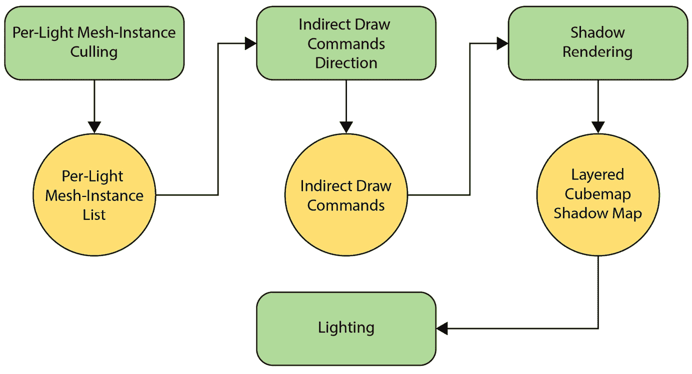
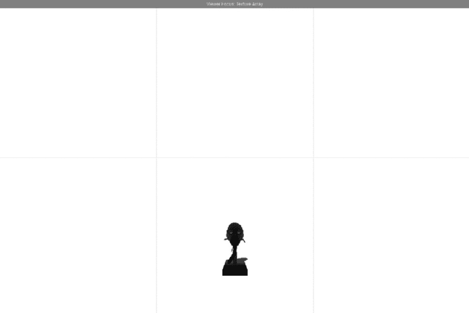
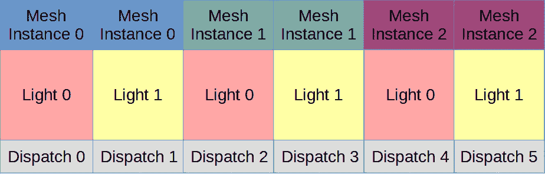
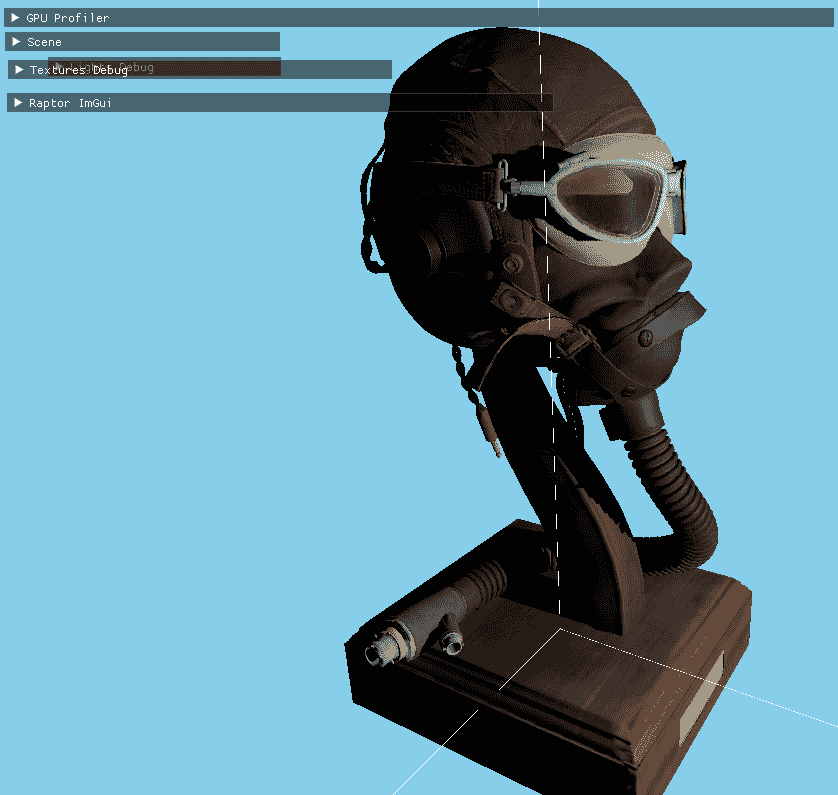
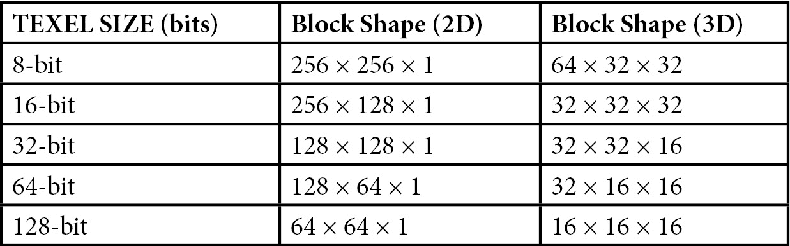

# 第八章：使用网格着色器添加阴影

在上一章中，我们使用集群延迟技术添加了对多个光源的支持，并引入了最新的创新。

我们添加了一个硬限制，最多 256 个光源，每个光源都可以是动态的，并且具有独特的属性。

在本章中，我们将为这些光源中的每一个添加投射阴影的可能性，以进一步增强 Raptor Engine 中显示的任何资产的可视效果，并且我们将利用网格着色器提供的可能性，让许多这些光源投射阴影，同时保持合理的帧时间。

我们还将探讨使用稀疏资源来提高阴影图内存使用，将拥有许多阴影投射光源的可能性从几乎不可能变为在当前硬件上可能且性能良好的状态。

在本章中，我们将涵盖以下主要主题：

+   阴影技术的简要历史

+   使用网格着色器实现阴影映射

+   使用 Vulkan 的稀疏资源改进阴影内存

# 技术要求

本章的代码可以在以下网址找到：[`github.com/PacktPublishing/Mastering-Graphics-Programming-with-Vulkan/tree/main/source/chapter8`](https://github.com/PacktPublishing/Mastering-Graphics-Programming-with-Vulkan/tree/main/source/chapter8)

# 阴影技术的简要历史

阴影是任何渲染框架中最大的新增功能之一，因为它们确实增强了场景中深度和体积的感知。作为一个与光线相关的现象，它们在图形文献中被研究了数十年，但问题仍然远未解决。

目前最常用的阴影技术是阴影映射，但最近，得益于硬件支持的光线追踪，光线追踪阴影作为一种更真实解决方案正在变得流行。

有些游戏——特别是*Doom 3*——也使用了阴影体积作为使光线产生阴影的解决方案，但现在已经不再使用。

## 阴影体积

阴影体积是一个古老的概念，由 Frank Crow 在 1977 年提出。它们被定义为沿着光线方向和向无限延伸的每个三角形的顶点的投影，从而创建一个体积。

阴影非常清晰，并且需要针对每个三角形和每束光进行处理。最新的实现使用了模板缓冲区，这一变化使得它能够实时使用。

阴影体积的问题在于它们需要大量的几何工作，并且变得填充率很高，在这种情况下，阴影图是一个明显的赢家。

## 阴影映射

所有技术中最常用的技术，首次出现在 1978 年左右，是实时和离线渲染的行业标准。阴影映射背后的想法是从光线的视角渲染场景，并保存每个像素的深度。

之后，当从摄像机视角渲染场景时，像素位置可以转换为阴影坐标系，并测试与阴影贴图中的相应像素是否重叠，以确定当前像素是否处于阴影中。

阴影贴图的分辨率非常重要，以及其中保存的信息类型。随着时间的推移，过滤器开始出现，使用数学工具添加软化阴影的可能性，或者添加计算来使阴影在靠近阻挡几何体时变得更硬。

阴影映射也存在许多问题，但由于它是事实上的标准，因此使用了许多技术来减轻这些问题。可能遇到的一些问题是走样、阴影痤疮和彼得·潘效应。

寻找一个稳健的阴影解决方案是渲染引擎中最复杂的步骤之一，通常需要大量的试错和针对不同场景和情况定制的解决方案。

## 光线追踪阴影

在过去几年中，光线追踪——一种使用光线追踪任何类型渲染信息的技术——在客户 GPU 上获得了硬件支持，使得渲染程序员可以使用不同的场景表示来追踪光线，并增强不同渲染现象的外观。

我们将在本书的末尾探讨光线追踪，但就目前而言，只需说使用这种特殊的场景表示（不同于我们已使用的网格和网格块），对于屏幕上的每个像素，都可以向影响该像素的每个光源追踪一条光线，并计算该像素的最终阴影贡献即可。

这是阴影最先进和最真实的形式，但性能方面——尽管有硬件支持——可能仍然较慢，并且支持它的 GPU 的扩散程度并不像所需的那样高，以使其成为新的标准。

正因如此，阴影映射仍然是标准——任何硬件，包括移动电话，都可以渲染阴影贴图，并且仍然可以呈现出令人信服的外观。基于这一考虑，我们选择将阴影映射作为 Raptor Engine 的主要阴影技术。

# 使用网格着色器实现阴影映射

现在我们已经探讨了渲染阴影的不同方法，我们将描述用于一次渲染多个阴影贴图的算法和实现细节，利用网格着色器的强大功能。

## 概述

在本节中，我们将概述该算法。我们试图实现的是使用网格块和网格着色器来渲染阴影，但这将需要一些计算工作来生成实际绘制网格块的命令。

我们将绘制由点光源产生的阴影，并使用立方体贴图作为纹理来存储必要的信息。我们将在下一节中讨论立方体贴图。

回到算法，第一步将是针对灯光剪裁网格实例。这是在计算着色器中完成的，并将保存每个灯光的可见网格实例列表。网格实例用于稍后检索关联的网格，并且将使用任务着色器稍后执行每个网格集的剪裁。

第二步是将间接绘制网格集参数写入以执行网格集的实际渲染到阴影图中，这同样是在计算着色器中完成的。这里有一个需要注意的地方，将在“关于多视图渲染”部分进行解释。

第三步是使用间接网格着色器绘制网格集，将其绘制到实际的阴影图中。

我们将使用分层立方体贴图阴影纹理进行绘制，每个层对应每个灯光。

第四步和最后一步是在场景照明时采样阴影纹理。

我们将以几乎无过滤的方式渲染阴影，因为本章的重点是网格着色器驱动的阴影，但我们将提供过滤选项的链接，放在本章的末尾。

下面是算法的视觉概述：



图 8.1 – 算法概述

在下一节中，我们将讨论立方体贴图阴影，用于存储点光源的阴影。

## 立方体贴图阴影

**立方体贴图**是一种将 3D 方向（*x*、*y*、*z*）映射到包含图像信息的六个面的通用方法。

它们不仅用于阴影渲染，而且在一般情况下也用于绘制环境（如天空盒或远处的景观），并且它们已经标准化到连硬件都包含对立方体贴图采样和过滤的支持。

立方体贴图的每个方向通常都有一个名称、一个方向和一个与之关联的单个纹理：

+   正向 *x*

+   负向 *x*

+   正向 *y*

+   负向 *y*

+   正向 *z*

+   负向 *z*

当渲染到一个面时，我们需要提供矩阵，使其朝正确的方向查看。

在读取时，一个单独的向量将被（在幕后）转换为相应的图像。对于阴影，这个过程将是手动的，因为我们将为每个面提供一个视图投影矩阵，网格集将读取它以将渲染引导到正确的面。

对于这一点，还有一个需要注意的地方，即我们需要为每个面复制绘图命令，因为一个顶点只能渲染到与每个面关联的图像视图。

有一些扩展可以将一个顶点与多个图像关联，正如我们将在下一节中看到的，但它们在编写时的网格着色器中的支持仍然有限。

提出的阴影渲染的另一个重要方面是，我们将使用立方体贴图数组，这样我们就可以通过分层渲染来读取和写入每个阴影。

下面是针对一个点光源的展开立方体贴图阴影渲染，每个立方体贴图面都有一个纹理：



图 8.2 – 从光线视角渲染的六个立方体贴图面

如我们所见，只有正*Z*方向在渲染内容。我们将提供一些剔除机制，以避免在空立方体贴图面上渲染网格块。

## 关于多视图渲染的说明

如前所述，有一个扩展可以帮助在多个立方体贴图面上渲染顶点：多视图渲染。这个扩展在虚拟现实应用中广泛使用，可以在双目投影的两个视图中渲染一个顶点，也可以与立方体贴图一起使用。

在撰写本文时，网格着色器还没有得到适当的扩展支持，所以我们使用 NVIDIA 的 Vulkan 扩展，但这并不支持多视图渲染，因此我们手动为每个面生成命令并使用这些命令进行绘制。

我们知道一个多供应商扩展正在路上，因此我们将相应地更新代码，但核心算法不会改变，因为多视图渲染更多的是一种优化。

我们现在可以查看算法步骤。

## 每光线网格实例剔除

准备阴影渲染的第一步是在计算着色器中进行的粗粒度剔除。在 Raptor 中，我们有网格和网格块表示，因此我们可以使用网格及其边界体积作为与网格块链接的*更高层次*。

我们将执行一个非常简单的光线球与网格球相交操作，如果相交，我们将添加相应的网格块。首先要知道的是，我们将使用网格实例和光线一起调度这个计算着色器，因此我们将为每个光线和每个网格实例计算光线是否影响网格实例。

然后，我们将输出一个每个光线的网格块实例列表，定义为网格实例和全局网格块索引的组合。我们还将写入每个光线的网格块实例计数，以跳过空灯光并正确读取索引。

因此，第一步是重置每个光线的计数：

```cpp
layout (local_size_x = 32, local_size_y = 1, local_size_z =
        1) in;
void main() {
    if (gl_GlobalInvocationID.x == 0 ) {
        for ( uint i = 0; i < NUM_LIGHTS; ++i ) {
            per_light_meshlet_instances[i * 2] = 0;
            per_light_meshlet_instances[i * 2 + 1] = 0;
        }
    }
    global_shader_barrier();
```

然后，我们将跳过那些将在超出范围的灯光上工作的线程。当我们调度时，我们在除以 32 后向上取整数字，因此一些线程可能正在处理空灯光。

这个计算调度将通过将每个网格实例与每个光线链接来完成，如下所示：



图 8.3 – 使用单个绘制调用渲染多个光线的立方体贴图的命令缓冲区组织

这里是提前退出和光线索引计算：

```cpp
    uint light_index = gl_GlobalInvocationID.x %
                       active_lights;
    if (light_index >= active_lights) {
        return;
    }
    const Light = lights[light_index];
```

以类似的方式，我们计算网格实例索引，并在调度向上取整过多时再次*提前退出*：

```cpp
    uint mesh_instance_index = gl_GlobalInvocationID.x /
                               active_lights;
    if (mesh_instance_index >= num_mesh_instances) {
        return;
    }
    uint mesh_draw_index = mesh_instance_draws
                           [mesh_instance_index].
                           mesh_draw_index;
    // Skip transparent meshes
    MeshDraw mesh_draw = mesh_draws[mesh_draw_index];
    if ( ((mesh_draw.flags & (DrawFlags_AlphaMask |
           DrawFlags_Transparent)) != 0 ) ){
        return;
    }
```

我们最终可以收集网格实例和模型的边界球，并简单地计算世界空间边界球：

```cpp
    vec4 bounding_sphere = mesh_bounds[mesh_draw_index];
    mat4 model = mesh_instance_draws
                 [mesh_instance_index].model;
    // Calculate mesh instance bounding sphere
    vec4 mesh_world_bounding_center = model * vec4
        (bounding_sphere.xyz, 1);
    float scale = length( model[0] );
    float mesh_radius = bounding_sphere.w * scale * 1.1;
    // Artificially inflate bounding sphere
    // Check if mesh is inside light
    const bool mesh_intersects_sphere =
    sphere_intersect(mesh_world_bounding_center.xyz,
        mesh_radius, light.world_position, light.radius )
            || disable_shadow_meshes_sphere_cull();
    if (!mesh_intersects_sphere) {
        return;
    }
```

到目前为止，我们知道网格实例受到光的影响，因此增加每个光源的网格块计数，并添加所有必要的索引以绘制网格块：

```cpp
    uint per_light_offset =
        atomicAdd(per_light_meshlet_instances[light_index],
            mesh_draw.meshlet_count);
    // Mesh inside light, add meshlets
    for ( uint m = 0; m < mesh_draw.meshlet_count; ++m ) {
        uint meshlet_index = mesh_draw.meshlet_offset + m;
         meshlet_instances[light_index *
             per_light_max_instances + per_light_offset
                 + m] = uvec2( mesh_instance_index,
                     meshlet_index );
    }
}
```

我们将在接下来的任务着色器中同时写入网格实例索引以检索世界矩阵，以及全局网格块索引以检索网格块数据。但在那之前，我们需要生成一个间接绘制命令列表，我们将在下一节中看到这一点。

此外，根据场景，我们有网格块实例的最大数量，并且我们为每个光源预先分配它们。

## 间接绘制命令生成

这个计算着色器将为每个光源生成一个间接命令列表。我们将使用每个光源网格块实例的**着色器存储缓冲对象**（**SSBO**）的最后一个元素来原子计数间接命令的数量。

如前所述，重置用于间接命令计数的`atomic int`：

```cpp
layout (local_size_x = 32, local_size_y = 1, local_size_z =
        1) in;
void main() {
    if (gl_GlobalInvocationID.x == 0 ) {
        // Use this as atomic int
        per_light_meshlet_instances[NUM_LIGHTS] = 0;
    }
    global_shader_barrier();
```

我们将提前终止执行以处理四舍五入的光索引：

```cpp
    // Each thread writes the command of a light.
    uint light_index = gl_GlobalInvocationID.x;
    if ( light_index >= active_lights ) {
        return;
    }
```

我们最终可以写入间接数据和打包的光索引，前提是光源包含可见的网格。

注意，我们写入六个命令，每个立方体贴图面一个：

```cpp
    // Write per light shadow data
    const uint visible_meshlets =
        per_light_meshlet_instances[light_index];
    if (visible_meshlets > 0) {
        const uint command_offset =
            atomicAdd(per_light_meshlet_instances[
                NUM_LIGHTS], 6);
        uint packed_light_index = (light_index & 0xffff)
                                   << 16;
        meshlet_draw_commands[command_offset] =
            uvec4( ((visible_meshlets + 31) / 32), 1, 1,
                packed_light_index | 0 );
        meshlet_draw_commands[command_offset + 1] =
            uvec4( ((visible_meshlets + 31) / 32), 1, 1,
                packed_light_index | 1 );
   ... same for faces 2 to 5.
    }
}
```

现在我们有一个间接绘制命令列表，每个光源六个。我们将在任务着色器中执行进一步的剔除，下一节将展示。

## 阴影立方体贴图面剔除

在间接绘制任务着色器中，我们将添加一个机制来剔除网格块与立方体贴图的交集以优化渲染。为此，我们有一个实用方法，它将计算给定立方体贴图和轴对齐的边界框时，哪个面将在立方体贴图中可见。它是使用立方体贴图面法线来计算中心点和范围是否包含在定义六个立方体贴图面之一的四个平面中：

```cpp
uint get_cube_face_mask( vec3 cube_map_pos, vec3 aabb_min,
                         vec3 aabb_max ) {
    vec3 plane_normals[] = {
        vec3(-1, 1, 0), vec3(1, 1, 0), vec3(1, 0, 1),
            vec3(1, 0, -1), vec3(0, 1, 1), vec3(0, -1, 1)
    };
    vec3 abs_plane_normals[] = {
        vec3(1, 1, 0), vec3(1, 1, 0), vec3(1, 0, 1),
            vec3(1, 0, 1), vec3(0, 1, 1), vec3(0, 1, 1) };
    vec3 aabb_center = (aabb_min + aabb_max) * 0.5f;
    vec3 center = aabb_center - cube_map_pos;
    vec3 extents = (aabb_max - aabb_min) * 0.5f;
    bool rp[ 6 ];
    bool rn[ 6 ];
    for ( uint  i = 0; i < 6; ++i ) {
        float dist = dot( center, plane_normals[ i ] );
        float radius = dot( extents, abs_plane_normals[ i ]
        );
        rp[ i ] = dist > -radius;
        rn[ i ] = dist < radius;
    }
    uint fpx = (rn[ 0 ] && rp[ 1 ] && rp[ 2 ] && rp[ 3 ] &&
                aabb_max.x > cube_map_pos.x) ? 1 : 0;
    uint fnx = (rp[ 0 ] && rn[ 1 ] && rn[ 2 ] && rn[ 3 ] &&
                aabb_min.x < cube_map_pos.x) ? 1 : 0;
    uint fpy = (rp[ 0 ] && rp[ 1 ] && rp[ 4 ] && rn[ 5 ] &&
                aabb_max.y > cube_map_pos.y) ? 1 : 0;
    uint fny = (rn[ 0 ] && rn[ 1 ] && rn[ 4 ] && rp[ 5 ] &&
                aabb_min.y < cube_map_pos.y) ? 1 : 0;
    uint fpz = (rp[ 2 ] && rn[ 3 ] && rp[ 4 ] && rp[ 5 ] &&
                aabb_max.z > cube_map_pos.z) ? 1 : 0;
    uint fnz = (rn[ 2 ] && rp[ 3 ] && rn[ 4 ] && rn[ 5 ] &&
                aabb_min.z < cube_map_pos.z) ? 1 : 0;
    return fpx | ( fnx << 1 ) | ( fpy << 2 ) | ( fny << 3 )
    | ( fpz << 4 ) | ( fnz << 5 );
}
```

这些方法返回一个位掩码，其中每个六位都设置为`1`，当当前轴对齐的边界框在该面上可见时。

## 网格块阴影渲染 – 任务着色器

现在我们已经有了这个实用方法，我们可以看看任务着色器。我们改变了一些其他任务着色器的内容，以适应间接绘制并使用分层渲染来写入不同的立方体贴图。

我们将传递`uint`到网格着色器，它打包一个光和一个面索引以检索相应的立方体贴图视图投影矩阵并将其写入正确的层：

```cpp
out taskNV block {
    uint meshlet_indices[32];
     uint light_index_face_index;
};
void main() {
    uint task_index = gl_LocalInvocationID.x;
     uint meshlet_group_index = gl_WorkGroupID.x;
```

网格块计算比较复杂，因为需要全局计算索引。我们首先计算间接绘制全局的网格块索引：

```cpp
    // Calculate meshlet and light indices
    const uint meshlet_index = meshlet_group_index * 32 +
                               task_index;
```

然后，我们在剔除计算着色器中写入的网格块实例中外推光索引和读取偏移量：

```cpp
    uint packed_light_index_face_index =
        meshlet_draw_commands[gl_DrawIDARB].w;
    const uint light_index =
        packed_light_index_face_index >> 16;
    const uint meshlet_index_read_offset =
        light_index * per_light_max_instances;
```

我们最终可以读取正确的网格块和网格实例索引：

```cpp
uint global_meshlet_index = 
   meshlet_instances[meshlet_index_read_offset + 
   meshlet_index].y; 
   uint mesh_instance_index =
        meshlet_instances[meshlet_index_read_offset +
            meshlet_index].x;
```

现在，我们计算面索引，然后我们可以开始剔除阶段：

```cpp
    const uint face_index = (packed_light_index_face_index
                             & 0xf);
    mat4 model = mesh_instance_draws[mesh_instance_index]
                 .model;
```

剔除与之前的任务着色器执行方式类似，但我们还添加了按面剔除：

```cpp
    vec4 world_center = model * vec4(meshlets
                        [global_meshlet_index].center, 1);
    float scale = length( model[0] );
    float radius = meshlets[global_meshlet_index].radius *
                   scale * 1.1;   // Artificially inflate
                                     bounding sphere
vec3 cone_axis = 
   mat3( model ) * vec3(int(meshlets 
   [global_meshlet_index].cone_axis[0]) / 127.0, 
   int(meshlets[global_meshlet_index]. 
   cone_axis[1]) / 127.0, 
   int(meshlets[global_meshlet_index]. 
   cone_axis[2]) / 127.0); 
   float cone_cutoff = int(meshlets[global_meshlet_index].
                           cone_cutoff) / 127.0;
    bool accept = false;
    const vec4 camera_sphere = camera_spheres[light_index];
    // Cone cull
    accept = !coneCull(world_center.xyz, radius, cone_axis,
             cone_cutoff, camera_sphere.xyz) ||
             disable_shadow_meshlets_cone_cull();
    // Sphere culling
    if ( accept ) {
        accept = sphere_intersect( world_center.xyz,
                 radius, camera_sphere.xyz,
                 camera_sphere.w) ||
                 disable_shadow_meshlets_sphere_cull();
    }
    // Cubemap face culling
    if ( accept ) {
        uint visible_faces =
        get_cube_face_mask( camera_sphere.xyz,
            world_center.xyz - vec3(radius),
                world_center.xyz + vec3(radius));
        switch (face_index) {
            case 0:
                accept = (visible_faces & 1) != 0;
                break;
            case 1:
                accept = (visible_faces & 2) != 0;
                break;
...same for faces 2 to 5.
                    }
        accept = accept || disable_shadow_meshlets_cubemap
                 _face_cull();
    }
```

在这个着色器点，我们写入每个可见的网格块：

```cpp
         uvec4 ballot = subgroupBallot(accept);
    uint index = subgroupBallotExclusiveBitCount(ballot);
    if (accept)
        meshlet_indices[index] = global_meshlet_index;
    uint count = subgroupBallotBitCount(ballot);
    if (task_index == 0)
        gl_TaskCountNV = count;
```

最后，我们写入打包的光和面索引：

```cpp
        light_index_face_index =
            packed_light_index_face_index;
}
```

接下来，我们将看到网格着色器。

## 网格块阴影渲染 – 网格着色器

在这个网格着色器中，我们需要检索要写入的立方体贴图数组中的层索引和读取正确视图投影变换的光索引。

重要的是要注意，每个面都有自己的变换，因为我们实际上是在单独渲染每个面。

注意，立方体贴图的每个面都被视为一个层，因此第一个立方体贴图将在层 0-5 中渲染，第二个在层 6-11 中，依此类推。

这里是代码：

```cpp
void main() {
   ...
    const uint light_index = light_index_face_index >> 16;
    const uint face_index = (light_index_face_index & 0xf);
    const int layer_index = int(CUBE_MAP_COUNT *
                                light_index + face_index);
    for (uint i = task_index; i < vertex_count; i +=
       32)    {
        uint vi = meshletData[vertexOffset + i];
        vec3 position = vec3(vertex_positions[vi].v.x,
                        vertex_positions[vi].v.y,
                        vertex_positions[vi].v.z);
        gl_MeshVerticesNV[ i ].gl_Position =
        view_projections[layer_index] *
           (model * vec4(position, 1));
    }
    uint indexGroupCount = (indexCount + 3) / 4;
    for (uint i = task_index; i < indexGroupCount; i += 32) {
        writePackedPrimitiveIndices4x8NV(i * 4,
            meshletData[indexOffset + i]);
    }
```

在这里，我们为每个基元写入层索引。这些偏移量的使用是为了在写入时避免银行冲突，正如之前着色器中看到的那样：

```cpp
     gl_MeshPrimitivesNV[task_index].gl_Layer =
         layer_index;
    gl_MeshPrimitivesNV[task_index + 32].gl_Layer =
        layer_index;
    gl_MeshPrimitivesNV[task_index + 64].gl_Layer =
        layer_index;
    gl_MeshPrimitivesNV[task_index + 96].gl_Layer =
        layer_index;
    if (task_index == 0) {
        gl_PrimitiveCountNV =
            uint(meshlets[global_meshlet_index]
                .triangle_count);
    }
}
```

在完成这个网格着色器渲染的阴影之后，由于没有关联的片段着色器，我们现在可以在光照着色器中读取生成的阴影纹理，如下一节所述。

## 阴影贴图采样

由于我们只是使用没有过滤的硬阴影贴图，因此采样它的代码是标准的立方体贴图代码。我们计算世界到光向量和使用它来采样立方体贴图。

由于这是一个分层立方体贴图，我们需要 3D 方向向量和层索引，这些我们已经在光源本身中保存：

```cpp
    vec3 shadow_position_to_light = world_position –
                                    light.world_position;
const float closest_depth =
    texture(global_textures_cubemaps_array
    [nonuniformEXT(cubemap_shadows_index)],
    vec4(shadow_position_to_light,
    shadow_light_index)).r;
```

然后，我们使用`vector_to_depth_value`实用方法将深度转换为原始深度值，该方法从光向量中获取主轴并将其转换为原始深度，这样我们就可以比较从立方体贴图中读取的值：

```cpp
    const float current_depth = vector_to_depth_value
                                (shadow_position_to_light,
                                 light.radius);
    float shadow = current_depth - bias < closest_depth ?
                   1 : 0;
```

这里展示了`vector_to_depth_value`方法：

```cpp
float vector_to_depth_value( inout vec3 Vec, float radius) {
    vec3 AbsVec = abs(Vec);
    float LocalZcomp = max(AbsVec.x, max(AbsVec.y,
                           AbsVec.z));
    const float f = radius;
    const float n = 0.01f;
    float NormZComp = -(f / (n - f) - (n * f) / (n - f) /
                        LocalZcomp);
    return NormZComp;
}
```

它从方向向量中获取主轴，并使用来自投影矩阵的公式将其转换为原始深度。这个值现在可以与存储在阴影贴图中的任何深度值一起使用。

这里是一个来自点光源的阴影示例：



图 8.4 – 场景中单个点光源产生的阴影

如我们所见，阴影在渲染中是一个巨大的改进，为观众提供了物体与其环境之间基本视觉线索。

到目前为止，我们看到了如何实现基于网格着色器的阴影，但仍有改进的空间，尤其是在内存使用方面。目前，这个解决方案为每个光源预先分配一个立方体贴图，如果我们考虑每个光源有六个纹理，内存可能会很快变得很大。

在下一节中，我们将探讨使用稀疏资源降低阴影贴图内存的解决方案。

# 使用 Vulkan 的稀疏资源改进阴影内存

正如我们在上一节末尾提到的，我们目前为所有光源的每个立方体贴图分配全部内存。根据光源的屏幕大小，我们可能会浪费内存，因为远处的和小的光源无法利用阴影贴图的高分辨率。

因此，我们实现了一种技术，可以根据相机位置动态确定每个立方体贴图的分辨率。有了这些信息，我们就可以管理稀疏纹理，并在运行时根据给定帧的要求重新分配其内存。

稀疏纹理（有时也称为**虚拟纹理**）可以手动实现，但幸运的是，它们在 Vulkan 中是原生支持的。我们现在将描述如何使用 Vulkan API 来实现它们。

## 创建和分配稀疏纹理

Vulkan 中的常规资源必须绑定到单个内存分配，并且无法将给定的资源绑定到不同的分配。这对于在运行时已知且我们预计不会更改的资源来说效果很好。

然而，当使用具有动态分辨率的立方体贴图时，我们需要能够将内存的不同部分绑定到给定的资源。Vulkan 提供了两种方法来实现这一点：

+   稀疏资源允许我们将资源绑定到非连续的内存分配，但完整的资源需要绑定。

+   稀疏驻留允许我们将资源部分绑定到不同的内存分配。这正是我们实现所需的功能，因为我们可能只会使用立方体贴图每一层的子集。

这两种方法都允许用户在运行时将资源重新绑定到不同的分配。开始使用稀疏资源所需的第一步是在创建资源时传递正确的标志：

```cpp
VkImageCreateInfo image_info = {
    VK_STRUCTURE_TYPE_IMAGE_CREATE_INFO };
image_info.flags = VK_IMAGE_CREATE_SPARSE_RESIDENCY_BIT |
                   VK_IMAGE_CREATE_SPARSE_BINDING_BIT;
```

在这里，我们正在请求支持稀疏驻留的资源。一旦创建了一个图像，我们就不需要立即为其分配内存。相反，我们将从内存的一个区域分配，然后从该区域中子分配单个页面。

重要的是要注意，Vulkan 对单个页面的大小有严格的要求。这些是从 Vulkan 规范中获取的所需大小：



表 8.1 – 图像的稀疏块大小

我们需要这些信息来确定为给定大小的立方体贴图分配多少页面。我们可以使用以下代码检索给定图像的详细信息：

```cpp
VkPhysicalDeviceSparseImageFormatInfo2 format_info{
    VK_STRUCTURE_TYPE_PHYSICAL_DEVICE_SPARSE_IMAGE_FORMAT
        _INFO_2 };
format_info.format = texture->vk_format;
format_info.type = to_vk_image_type( texture->type );
format_info.samples = VK_SAMPLE_COUNT_1_BIT;
format_info.usage = texture->vk_usage;
format_info.tiling = VK_IMAGE_TILING_OPTIMAL;
```

此结构的信息已经包含在我们的纹理数据结构中。接下来，我们检索给定图像的块大小：

```cpp
Array<VkSparseImageFormatProperties2> properties;
vkGetPhysicalDeviceSparseImageFormatProperties2(
    vulkan_physical_device, &format_info, &property_count,
        properties.data );
u32 block_width = properties[ 0 ].properties.
                  imageGranularity.width;
u32 block_height = properties[ 0 ].properties.
                   imageGranularity.height;
```

使用这些信息，我们现在可以分配一个页面池。首先，我们检索图像的内存要求：

```cpp
VkMemoryRequirements memory_requirements{ };
vkGetImageMemoryRequirements( vulkan_device, texture->
                              vk_image,
                              &memory_requirements );
```

这是我们用于常规纹理的相同代码；然而，`memory_requirements.alignment`将包含给定图像格式的块大小。

接下来，我们计算给定池大小所需的块数量：

```cpp
u32 block_count = pool_size / ( block_width * block_height );
```

最后一步是为我们将用于写入立方体贴图的页面分配：

```cpp
VmaAllocationCreateInfo allocation_create_info{ };
allocation_create_info.usage = VMA_MEMORY_USAGE_GPU_ONLY;
VkMemoryRequirements page_memory_requirements;
page_memory_requirements.memoryTypeBits =
    memory_requirements.memoryTypeBits;
page_memory_requirements.alignment =
    memory_requirements.alignment;
page_memory_requirements.size =
    memory_requirements.alignment;
vmaAllocateMemoryPages( vma_allocator,
                        &page_memory_requirements,
                        &allocation_create_info,
                        block_count, page_pool->
                        vma_allocations.data, nullptr );
```

`vmaAllocateMemoryPages`，用于一次性分配多个页面。

现在我们已经为我们的阴影映射分配了内存，我们需要确定每个立方体贴图的分辨率。

## 选择每光照阴影内存使用

为了确定给定光线的立方体贴图的分辨率，我们需要找到它对场景的影响程度。直观上，距离更远的光线将有更小的影响，这取决于它的半径（至少对于点光源），但我们需要量化它的影响量。我们实现了一个类似于在 *More Efficient Virtual Shadow Maps for Many* *Lights* 论文中提出的解决方案。

我们将重用前一章中引入的概念：簇。我们将屏幕细分为瓦片，并在 *z* 轴上 *切割* 截锥体。这将给我们更小的截锥体（由轴对齐的边界框近似），我们将使用它来确定哪些区域被给定光线覆盖。

让我们看看实现这一点的代码：

1.  我们首先计算每个光线在相机空间中的边界框：

    ```cpp
    for ( u32 l = 0; l < light_count; ++l ) {
    ```

    ```cpp
        Light& light = scene->lights[ l ];
    ```

    ```cpp
        vec4s aabb_min_view = glms_mat4_mulv(
    ```

    ```cpp
                              last_camera.view,
    ```

    ```cpp
                              light.aabb_min );
    ```

    ```cpp
        vec4s aabb_max_view = glms_mat4_mulv(
    ```

    ```cpp
                              last_camera.view,
    ```

    ```cpp
                              light.aabb_max );
    ```

    ```cpp
        lights_aabb_view[ l * 2 ] = vec3s{
    ```

    ```cpp
            aabb_min_view.x, aabb_min_view.y,
    ```

    ```cpp
                aabb_min_view.z };
    ```

    ```cpp
        lights_aabb_view[ l * 2 + 1 ] = vec3s{
    ```

    ```cpp
            aabb_max_view.x, aabb_max_view.y,
    ```

    ```cpp
                aabb_max_view.z };
    ```

    ```cpp
    }
    ```

1.  接下来，我们遍历瓦片和每个深度切片，计算每个簇的位置和大小。我们首先计算每个瓦片的相机空间位置：

    ```cpp
    vec4s max_point_screen = vec4s{ f32( ( x + 1 ) *
    ```

    ```cpp
                             tile_size ), f32( ( y + 1 ) *
    ```

    ```cpp
                             tile_size ), 0.0f, 1.0f };
    ```

    ```cpp
                             // Top Right
    ```

    ```cpp
    vec4s min_point_screen = vec4s{ f32( x * tile_size ),
    ```

    ```cpp
                             f32( y * tile_size ),
    ```

    ```cpp
                             0.0f, 1.0f }; // Top Right
    ```

    ```cpp
    vec3s max_point_view = screen_to_view(
    ```

    ```cpp
                           max_point_screen );
    ```

    ```cpp
    vec3s min_point_view = screen_to_view(
    ```

    ```cpp
                           min_point_screen );
    ```

1.  然后，我们需要确定每个切片的最小和最大深度：

    ```cpp
    f32 tile_near = z_near * pow( z_ratio, f32( z ) *
    ```

    ```cpp
                                  z_bin_range );
    ```

    ```cpp
    f32 tile_far  = z_near * pow( z_ratio, f32( z + 1 ) *
    ```

    ```cpp
                                  z_bin_range );
    ```

1.  最后，我们将这两个值结合起来，以检索簇的位置和大小：

    ```cpp
    vec3s min_point_near = line_intersection_to_z_plane(
    ```

    ```cpp
                           eye_pos, min_point_view,
    ```

    ```cpp
                           tile_near );
    ```

    ```cpp
    vec3s min_point_far  = line_intersection_to_z_plane(
    ```

    ```cpp
                           eye_pos, min_point_view,
    ```

    ```cpp
                           tile_far );
    ```

    ```cpp
    vec3s max_point_near = line_intersection_to_z_plane(
    ```

    ```cpp
                           eye_pos, max_point_view,
    ```

    ```cpp
                           tile_near );
    ```

    ```cpp
    vec3s max_point_far  = line_intersection_to_z_plane(
    ```

    ```cpp
                           eye_pos, max_point_view,
    ```

    ```cpp
                           tile_far );
    ```

    ```cpp
    vec3s min_point_aabb_view = glms_vec3_minv( glms_vec3_minv( min_point_near, min_point_far ), glms_vec3_minv( max_point_near, max_point_far ) );
    ```

    ```cpp
    vec3s max_point_aabb_view = glms_vec3_maxv( glms_vec3_maxv( min_point_near, min_point_far ), glms_vec3_maxv( max_point_near, max_point_far ) );
    ```

现在我们已经获得了簇，我们遍历每个光线，以确定它是否覆盖了簇以及簇在光线上的投影；我们将在稍后澄清这究竟意味着什么。

1.  下一步是在光线和簇之间进行盒相交测试：

    ```cpp
    f32 minx = min( min( light_aabb_min.x,
    ```

    ```cpp
                    light_aabb_max.x ), min(
    ```

    ```cpp
                    min_point_aabb_view.x,
    ```

    ```cpp
                    max_point_aabb_view.x ) );
    ```

    ```cpp
    f32 miny = min( min( light_aabb_min.y,
    ```

    ```cpp
                    light_aabb_max.y ), min(
    ```

    ```cpp
                    min_point_aabb_view.y,
    ```

    ```cpp
                    max_point_aabb_view.y ) );
    ```

    ```cpp
    f32 minz = min( min( light_aabb_min.z,
    ```

    ```cpp
                    light_aabb_max.z ), min(
    ```

    ```cpp
                    min_point_aabb_view.z,
    ```

    ```cpp
                    max_point_aabb_view.z ) );
    ```

    ```cpp
    f32 maxx = max( max( light_aabb_min.x,
    ```

    ```cpp
                    light_aabb_max.x ), max(
    ```

    ```cpp
                    min_point_aabb_view.x,
    ```

    ```cpp
                    max_point_aabb_view.x ) );
    ```

    ```cpp
    f32 maxy = max( max( light_aabb_min.y,
    ```

    ```cpp
                    light_aabb_max.y ), max(
    ```

    ```cpp
                    min_point_aabb_view.y,
    ```

    ```cpp
                    max_point_aabb_view.y ) );
    ```

    ```cpp
    f32 maxz = max( max( light_aabb_min.z,
    ```

    ```cpp
                    light_aabb_max.z ), max(
    ```

    ```cpp
                    min_point_aabb_view.z,
    ```

    ```cpp
                    max_point_aabb_view.z ) );
    ```

    ```cpp
    f32 dx = abs( maxx - minx );
    ```

    ```cpp
    f32 dy = abs( maxy - miny );
    ```

    ```cpp
    f32 dz = abs( maxz - minz );
    ```

    ```cpp
    f32 allx = abs( light_aabb_max.x - light_aabb_min.x )
    ```

    ```cpp
               + abs( max_point_aabb_view.x –
    ```

    ```cpp
               min_point_aabb_view.x );
    ```

    ```cpp
    f32 ally = abs( light_aabb_max.y - light_aabb_min.y )
    ```

    ```cpp
               + abs( max_point_aabb_view.y –
    ```

    ```cpp
               min_point_aabb_view.y );
    ```

    ```cpp
    f32 allz = abs( light_aabb_max.z - light_aabb_min.z )
    ```

    ```cpp
               + abs( max_point_aabb_view.z –
    ```

    ```cpp
               min_point_aabb_view.z );
    ```

    ```cpp
     bool intersects = ( dx <= allx ) && ( dy < ally ) &&
    ```

    ```cpp
                       ( dz <= allz );
    ```

如果它们确实相交，我们将计算光线在簇上的投影面积的一个近似值：

```cpp
f32 d = glms_vec2_distance( sphere_screen, tile_center );
f32 diff = d * d - tile_radius_sq;
if ( diff < 1.0e-4 ) {
    continue;
}
f32 solid_angle = ( 2.0f * rpi ) * ( 1.0f - ( sqrtf(
                    diff ) / d ) );
f32 resolution = sqrtf( ( 4.0f * rpi * tile_pixels ) /
                        ( 6 * solid_angle ) );
```

策略是取光线和簇中心在屏幕空间中的距离，计算簇对光线位置的立体角，并使用簇的像素大小来计算立方体贴图的分辨率。更多细节请参阅论文。

我们保留最大分辨率，并将使用计算出的值来绑定每个立方体贴图的内存。

## 将渲染到稀疏阴影贴图中

现在我们已经确定了给定帧的立方体贴图的分辨率，我们需要将预分配的页面分配给我们的纹理：

1.  第一步是记录哪些页面分配给每个图像：

    ```cpp
    VkImageAspectFlags aspect = TextureFormat::has_depth(
    ```

    ```cpp
    texture->vk_format ) ? VK_IMAGE_ASPECT_DEPTH_BIT : VK_IMAGE_ASPECT_COLOR_BIT;
    ```

    ```cpp
    for ( u32 block_y = 0; block_y < num_blocks_y;
    ```

    ```cpp
          ++block_y ) {
    ```

    ```cpp
          for ( u32 block_x = 0; block_x < num_blocks_x;
    ```

    ```cpp
                ++block_x ) {
    ```

    ```cpp
                    VkSparseImageMemoryBind sparse_bind{ };
    ```

    ```cpp
                    VmaAllocation allocation = 
    ```

    ```cpp
                       page_pool-> vma_allocations
    ```

    ```cpp
                          [ page_pool->used_pages++ ];
    ```

    ```cpp
                    VmaAllocationInfo allocation_info{ };
    ```

    ```cpp
                    vmaGetAllocationInfo( vma_allocator,
    ```

    ```cpp
                                          allocation,
    ```

    ```cpp
                                          &allocation_info );
    ```

我们首先获取我们将要用于给定块的分配的详细信息，因为我们需要访问 `VkDeviceMemory` 处理器和它从池中分配的偏移量。

1.  接下来，我们计算每个块的纹理偏移量：

    ```cpp
            i32 dest_x = ( i32 )( block_x * block_width +
    ```

    ```cpp
                                  x );
    ```

    ```cpp
            i32 dest_y = ( i32 )( block_y * block_height +
    ```

    ```cpp
                                  y );
    ```

1.  然后，我们将此信息记录到 `VkSparseImageMemoryBind` 数据结构中，该结构将用于稍后更新绑定到立方体贴图纹理的内存：

    ```cpp
            sparse_bind.subresource.aspectMask = aspect;
    ```

    ```cpp
            sparse_bind.subresource.arrayLayer = layer;
    ```

    ```cpp
            sparse_bind.offset = { dest_x, dest_y, 0 };
    ```

    ```cpp
            sparse_bind.extent = { block_width,
    ```

    ```cpp
                                   block_height, 1 };
    ```

    ```cpp
            sparse_bind.memory =
    ```

    ```cpp
                allocation_info.deviceMemory;
    ```

    ```cpp
            sparse_bind.memoryOffset =
    ```

    ```cpp
                allocation_info.offset;
    ```

    ```cpp
            pending_sparse_queue_binds.push( sparse_bind
    ```

    ```cpp
                                           );
    ```

    ```cpp
        }
    ```

    ```cpp
    }
    ```

重要的是要注意，正如我们之前提到的，我们只使用一个具有许多层的图像。层变量确定每个分配将属于哪个层。请参阅完整代码以获取更多详细信息。

1.  最后，我们记录这些页面将绑定到哪些图像上：

    ```cpp
    SparseMemoryBindInfo bind_info{ };
    ```

    ```cpp
    bind_info.image = texture->vk_image;
    ```

    ```cpp
    bind_info.binding_array_offset = array_offset;
    ```

    ```cpp
    bind_info.count = num_blocks;
    ```

    ```cpp
    pending_sparse_memory_info.push( bind_info );
    ```

`array_offset` 是 `pending_sparse_queue_binds` 数组中的一个偏移量，这样我们就可以在一个数组中存储所有挂起的分配。

现在我们已经记录了分配更新的列表，我们需要将它们提交到队列中，以便 GPU 执行。

1.  首先，我们为每个层填充一个`VkSparseImageMemoryBindInfo`结构：

    ```cpp
    for ( u32 b = 0; b < pending_sparse_memory_info.size;
    ```

    ```cpp
          ++b ) {
    ```

    ```cpp
        SparseMemoryBindInfo& internal_info =
    ```

    ```cpp
            pending_sparse_memory_info[ b ];
    ```

    ```cpp
        VkSparseImageMemoryBindInfo& info =
    ```

    ```cpp
            sparse_binding_infos[ b ];
    ```

    ```cpp
        info.image = internal_info.image;
    ```

    ```cpp
        info.bindCount = internal_info.count;
    ```

    ```cpp
        info.pBinds = pending_sparse_queue_binds.data +
    ```

    ```cpp
                      internal_info.binding_array_offset;
    ```

    ```cpp
    }
    ```

1.  接下来，我们将所有挂起的绑定操作提交到主队列：

    ```cpp
    VkBindSparseInfo sparse_info{
    ```

    ```cpp
        VK_STRUCTURE_TYPE_BIND_SPARSE_INFO };
    ```

    ```cpp
    sparse_info.imageBindCount =
    ```

    ```cpp
        sparse_binding_infos.size;
    ```

    ```cpp
    sparse_info.pImageBinds = sparse_binding_infos.data;
    ```

    ```cpp
    sparse_info.signalSemaphoreCount = 1;
    ```

    ```cpp
    sparse_info.pSignalSemaphores =
    ```

    ```cpp
        &vulkan_bind_semaphore;
    ```

    ```cpp
    vkQueueBindSparse( vulkan_main_queue, 1, &sparse_info,
    ```

    ```cpp
                       VK_NULL_HANDLE );
    ```

需要注意的是，确保在访问我们刚刚更新的资源分配之前完成此操作是用户的责任。我们通过发出一个信号量`vulkan_bind_semaphore`来实现这一点，然后主渲染工作提交将等待该信号量。

需要注意的是，我们在其上调用`vkQueueBindSparse`的队列必须具有`VK_QUEUE_SPARSE_BINDING_BIT`标志。

在本节中，我们介绍了分配和使用稀疏纹理所需的步骤。我们首先解释了稀疏纹理的工作原理以及为什么它们对我们使用立方体贴图的情况很有用。

接下来，我们说明了我们用来根据每个灯光对场景的贡献动态确定每个立方体贴图分辨率的算法。最后，我们展示了如何使用 Vulkan API 将内存绑定到稀疏资源。

# 摘要

在本章中，我们将我们的照明系统扩展到支持许多点光源，并实现了高效的实现。我们从阴影算法的简要历史开始，讨论了它们的优缺点，直到最近利用光线追踪硬件的一些技术。

接下来，我们介绍了我们对许多点光源阴影的实现。我们解释了为每个灯光生成立方体贴图的方法，以及我们为了使算法能够扩展到许多灯光而实施的优化。特别是，我们强调了从主几何体遍历中重用的剔除方法以及每个灯光使用单个间接绘制调用的方法。

在最后一节中，我们介绍了稀疏纹理，这是一种允许我们动态地将内存绑定到给定资源的技术。我们强调了我们用来确定每个点光源对场景的贡献的算法，以及我们如何使用这些信息来确定每个立方体贴图的分辨率。最后，我们展示了如何使用 Vulkan API 与稀疏资源一起使用。

尽管我们本章只涵盖了点光源，但一些技术可以与其他类型的灯光一起重用。一些步骤也可以进一步优化：例如，可以进一步降低立方体贴图的分辨率，仅考虑几何体可见的区域。

为了清晰起见，集群计算目前是在 CPU 上完成的，以避免从 GPU 读取集群数据，这可能是一个缓慢的操作，但可能值得将实现移至 GPU。我们鼓励您尝试代码并添加更多功能！

# 进一步阅读

书籍《实时阴影》提供了许多实现阴影的技术的好概述，其中许多至今仍在使用。

《GPU Pro 360 阴影指南》收集了专注于阴影的《GPU Pro》系列文章。

书中描述的一种有趣的技术称为四面体阴影映射：其想法是将阴影映射投影到一个四面体上，然后将其展开到一个单独的纹理上。

原始概念是在*使用四面体映射进行全向光阴影映射*章节中引入的（最初发表在*GPU Pro*中），后来在*基于瓦片的全方位阴影*（最初发表在*GPU Pro 6*中）中进行了扩展。

更多细节，请参考作者提供的代码：[`www.hd-prg.com/tileBasedShadows.xhtml`](http://www.hd-prg.com/tileBasedShadows.xhtml).

我们的稀疏纹理实现基于这个 SIGGRAPH 演示：[`efficientshading.com/wp-content/uploads/s2015_shadows.pdf`](https://efficientshading.com/wp-content/uploads/s2015_shadows.pdf).

这扩展了他们的原始论文，可以在以下链接找到：[`newq.net/dl/pub/MoreEfficientClusteredShadowsPreprint.pdf.`](http://newq.net/dl/pub/MoreEfficientClusteredShadowsPreprint.pdf%0D)

虽然我们在这章中没有实现它，但阴影映射缓存是一种重要的技术，可以减少计算阴影映射的成本，并将阴影映射更新分摊到多个帧上。

一个好的起点是这个演示：[`www.activision.com/cdn/research/2017_DD_Rendering_of_COD_IW.pdf`](https://www.activision.com/cdn/research/2017_DD_Rendering_of_COD_IW.pdf).

我们集群计算的方法与本文中提出的方法非常接近：[`www.aortiz.me/2018/12/21/CG.xhtml#part-2.`](http://www.aortiz.me/2018/12/21/CG.xhtml#part-2%0D)

Vulkan 规范提供了更多关于如何使用 API 进行稀疏资源的信息：[`registry.khronos.org/vulkan/specs/1.2-extensions/html/vkspec.xhtml#sparsememory`](https://registry.khronos.org/vulkan/specs/1.2-extensions/html/vkspec.xhtml#sparsememory).
