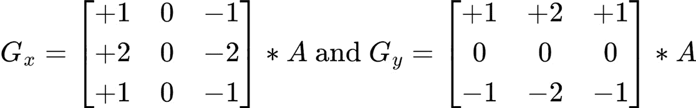
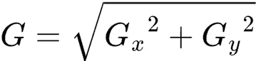

# 实现可变率着色

在本章中，我们将实现一种最近变得相当流行的技术：可变率着色。这项技术允许开发者指定以何种速率对单个像素进行着色，同时保持相同的视觉质量感知。这种方法使我们能够减少某些渲染过程所需的时间，而这些节省下来的时间可以用来实现更多功能或以更高的分辨率进行渲染。

Vulkan 提供了多种将此技术集成到应用程序中的选项，我们将概述所有这些选项。此功能通过一个仅支持在最新硬件上运行的扩展提供，但可以使用计算着色器手动实现它。我们不会在这里介绍这个选项，但将在*进一步阅读*部分指出相关资源。

在本章中，我们将涵盖以下主要主题：

+   可变率着色介绍

+   使用 Vulkan API 实现可变率着色

+   使用专用常量配置计算着色器

# 技术要求

本章的代码可以在以下 URL 找到：[`github.com/PacktPublishing/Mastering-Graphics-Programming-with-Vulkan/tree/main/source/chapter9`](https://github.com/PacktPublishing/Mastering-Graphics-Programming-with-Vulkan/tree/main/source/chapter9)。

# 可变率着色介绍

**可变率着色**（**VRS**）是一种允许开发者控制片段着色速率的技术。当此功能禁用时，所有片段都使用 1x1 的速率进行着色，这意味着片段着色器将为图像中的所有片段运行。

随着虚拟现实（**VR**）头显的引入，开发者开始研究减少渲染一帧所需时间的方法。这至关重要，不仅因为 VR 需要渲染两帧（一帧用于右眼，一帧用于左眼），而且因为 VR 对帧延迟非常敏感，需要更高的帧率来避免用户出现运动病。

开发出来的一种技术被称为**视野渲染**：其想法是在全速率渲染图像中心的同时降低中心以外的质量。开发者注意到，用户主要关注图像的中央区域，而不会注意到周围区域的低质量。

事实证明，这种方法可以推广到 VR 之外。因此，DirectX®和 Vulkan 等 API 已经原生地添加了对该功能的支持。

使用这种更通用的方法，可以为单个片段指定多个着色速率。通常推荐使用的速率是 1x1、1x2、2x1 和 2x2。虽然可能采用更高的着色速率，但这通常会导致最终帧中出现可见的伪影。

正如我们提到的，1x1 的比率意味着片段着色器将在图像中的所有片段上运行，没有时间节省。这是未启用 VRS 时的默认行为。

1x2 或 2x1 的比率意味着两个片段将由单个片段着色器调用着色，计算出的值应用于这两个片段。同样，2x2 的阴影率意味着单个片段调用将计算并应用单个值到四个片段上。

## 确定阴影率

有多种选择来为单个片段选择阴影率，我们实现的方法是在光照过程之后运行基于亮度的边缘检测过滤器。

理念是在图像中亮度均匀的区域降低阴影率，在过渡区域使用全率。这种方法有效，因为人眼对这些区域的改变比那些具有更均匀值的区域更敏感。

我们使用的过滤器是 3x3 配置中的传统 Sobel 过滤器。对于每个片段，我们计算两个值：



图 9.1 – 用于近似给定片段的 x 和 y 导数的过滤器（来源：维基百科 –https://en.wikipedia.org/wiki/Sobel_operator）

我们随后使用以下公式计算最终的导数值：



图 9.2 – 近似导数值的公式（来源：维基百科 –https://en.wikipedia.org/wiki/Sobel_operator）

让我们将 Sobel 过滤器应用于以下图像：


图 9.3 – 光照过程后的渲染帧

它为我们提供了以下阴影率掩码：


图 9.4 – 计算出的阴影率掩码

在我们的实现中，我们将为`G`值（如*图 9.2*中的公式计算）大于`0.1`的片段使用完整的 1x1 比率。这些是*图 9.4*中的黑色像素。

对于`G`值低于`0.1`的片段，我们将使用 2x2 的比率，这些片段是*图 9.4*中的截图中的红色像素。我们将在下一节中解释如何计算掩码中的值。

在本节中，我们介绍了可变率着色的概念，并提供了我们实现的详细信息。在下一节中，我们将演示如何使用 Vulkan API 实现此功能。

# 使用 Vulkan 集成可变率着色

正如我们在上一节中提到的，片段着色率功能是通过 `VK_KHR_fragment_shading_rate` 扩展提供的。与其他选项扩展一样，在使用相关 API 之前，请确保您使用的设备支持它。

Vulkan 提供了三种方法来控制着色率：

+   每个绘制

+   每个原语

+   使用图像附件进行渲染通道

要使用每个绘制自定义着色率，有两种选择。我们可以在创建管道时传递 `VkPipelineFragmentShadingRateStateCreateInfoKHR` 结构，或者我们可以在运行时调用 `vkCmdSetFragmentShadingRateKHR`。

当我们事先知道某些绘制可以在不影响质量的情况下以较低速率执行时，这种方法很有用。这可能包括我们知道远离相机的天空或物体。

还可以为每个原语提供一个着色率。这是通过从顶点着色器或网格着色器中填充内置着色器变量 `PrimitiveShadingRateKHR` 来实现的。

如果，例如，我们确定可以在网格着色器中使用较低级别的细节并降低渲染特定原语的速率，这可能会很有用。

对于我们的实现，我们决定使用第三种方法，因为它对我们的用例来说更灵活。正如我们在上一节中提到的，我们首先需要计算可变率着色率掩码。这是通过一个计算着色器完成的，该着色器填充着色率图像。

我们首先填充一个在着色器调用中共享的表格：

```cpp
shared float local_image_data[ LOCAL_DATA_SIZE ][
   LOCAL_DATA_SIZE ];
local_image_data[ local_index.y ][ local_index.x ] = 
   luminance( texelFetch( global_textures[ 
   color_image_index ], global_index, 0 ).rgb ); 
barrier();
```

表格中的每个条目都包含此着色器调用中片段的亮度值。

我们使用这种方法来减少我们需要执行的纹理读取次数。如果每个着色器线程都必须单独读取它需要的值，我们可能需要八次纹理读取。使用这个解决方案，每个线程只需要一次读取。

对于我们正在处理的区域的边界上的片段线程，有一个需要注意的地方。随着每次着色器调用，我们处理 16x16 个片段，但由于 Sobel 滤波器的工作方式，我们需要填充一个 18x18 的表格。对于边界的线程，我们需要进行一些额外的处理以确保表格被完全填充。为了简洁，这里省略了代码。

注意，我们必须使用 `barrier()` 方法来确保这个工作组内的所有线程都完成了它们的写入。如果没有这个调用，线程将计算错误的价值，因为表格将不会正确填充。

接下来，我们计算给定片段的导数值：

```cpp
float dx = local_image_data[ local_index.y - 1 ][
    local_index.x - 1 ] - local_image_data[
    local_index.y - 1 ][ local_index.x + 1 ] +
    2 * local_image_data[ local_index.y ][
    local_index.x - 1 ] -
    2 * local_image_data[ local_index.y ][
    local_index.x + 1 ] +
    local_image_data[ local_index.y + 1][
    local_index.x - 1 ] -
    local_image_data[ local_index.y + 1 ][
    local_index.x + 1 ];
float dy = local_image_data[ local_index.y - 1 ][
    local_index.x - 1 ] +
    2 * local_image_data[ local_index.y - 1 ][
    local_index.x ] +
    local_image_data[ local_index.y - 1 ][
    local_index.x + 1 ] -
    local_image_data[ local_index.y + 1 ][
    local_index.x - 1 ] -
    2 * local_image_data[ local_index.y + 1 ][
    local_index.x ] -
    local_image_data[ local_index.y + 1 ][
    local_index.x + 1 ];
float d = pow( dx, 2 ) + pow( dy, 2 );
```

这只是简单地应用我们在上一节中介绍的公式。现在我们已经计算了导数，我们需要存储这个片段的着色率：

```cpp
uint rate = 1 << 2 | 1;
if ( d > 0.1 ) {
    rate = 0;
}
imageStore( global_uimages_2d[ fsr_image_index ], ivec2(
    gl_GlobalInvocationID.xy ), uvec4( rate, 0, 0, 0 ) );
```

速率是按照 Vulkan 规范中的公式计算的：

```cpp
size_w = 2^( ( texel / 4 ) & 3 )
size_h = 2^( texel & 3 )
```

在我们的情况下，我们正在计算前一个公式中的 `texel` 值。我们为 `x` 和 `y` 着色率设置指数（`0` 或 `1`），并将值存储在着色率图像中。

一旦着色率图像被填充，我们就可以使用它为下一帧的渲染通道提供着色率。在使用此图像之前，我们需要将其转换为正确的布局：

```cpp
VK_IMAGE_LAYOUT_FRAGMENT_SHADING_RATE_ATTACHMENT_OPTIMAL_
    KHR
```

我们还需要使用一个新的管线阶段：

```cpp
VK_PIPELINE_STAGE_FRAGMENT_SHADING_RATE_ATTACHMENT_BIT_KHR
```

有几种方法可以将新创建的着色率图像作为渲染通道的一部分使用。`VkSubpassDescription2`结构可以通过`VkFragmentShadingRateAttachmentInfoKHR`结构扩展，该结构指定了要使用哪个附加作为片段着色率。由于我们尚未使用`RenderPass2`扩展，我们选择扩展我们现有的动态渲染实现。

我们必须使用以下代码扩展`VkRenderingInfoKHR`结构：

```cpp
VkRenderingFragmentShadingRateAttachmentInfoKHR
shading_rate_info {
    VK_STRUCTURE_TYPE_RENDERING_FRAGMENT_SHADING
        _RATE_ATTACHMENT_INFO_KHR };
shading_rate_info.imageView = texture->vk_image_view;
shading_rate_info.imageLayout =
    VK_IMAGE_LAYOUT_FRAGMENT_SHADING_RATE
        _ATTACHMENT_OPTIMAL_KHR;
shading_rate_info.shadingRateAttachmentTexelSize = { 1, 1 };
rendering_info.pNext = ( void* )&shading_rate_info;
```

就这样！用于渲染的着色器不需要任何修改。

在本节中，我们详细说明了修改我们的渲染代码以使用着色率图像所需的更改。我们还提供了实现基于索贝尔滤波器的边缘检测算法的计算着色器的实现。

此算法的结果然后用于确定每个片段的着色率。

在下一节中，我们将介绍特殊化常量，这是一个 Vulkan 特性，允许我们控制计算着色器的工作组大小以获得最佳性能。

# 利用特殊化常量

**特殊化常量**是 Vulkan 的一个特性，允许开发者在创建管线时定义常量值。这在需要相同着色器但只有一些常量值不同的多个用例时特别有用，例如材料。与预处理定义相比，这是一个更优雅的解决方案，因为它们可以在运行时动态控制，而无需重新编译着色器。

在我们的情况下，我们希望能够根据我们运行的硬件控制计算着色器的工作组大小以获得最佳性能：

1.  实现的第一步是确定着色器是否使用特殊化常量。我们现在在解析着色器 SPIR-V 时识别任何被以下类型装饰的变量：

    ```cpp
    case ( SpvDecorationSpecId ):
    ```

    ```cpp
    {
    ```

    ```cpp
        id.binding = data[ word_index + 3 ];
    ```

    ```cpp
        break;
    ```

    ```cpp
    }
    ```

1.  在解析所有变量时，我们现在保存特殊化常量的详细信息，以便在编译使用此着色器的管线时使用：

    ```cpp
    switch ( id.op ) {
    ```

    ```cpp
        case ( SpvOpSpecConstantTrue ):
    ```

    ```cpp
        case ( SpvOpSpecConstantFalse ):
    ```

    ```cpp
        case ( SpvOpSpecConstant ):
    ```

    ```cpp
        case ( SpvOpSpecConstantOp ):
    ```

    ```cpp
        case ( SpvOpSpecConstantComposite ):
    ```

    ```cpp
        {
    ```

    ```cpp
            Id& id_spec_binding = ids[ id.type_index ];
    ```

    ```cpp
    SpecializationConstant& 
    ```

    ```cpp
       specialization_constant = parse_result-> 
    ```

    ```cpp
       specialization_constants[ 
    ```

    ```cpp
       parse_result-> 
    ```

    ```cpp
       specialization_constants_count 
    ```

    ```cpp
       ]; 
    ```

    ```cpp
            specialization_constant.binding =
    ```

    ```cpp
                id_spec_binding.binding;
    ```

    ```cpp
            specialization_constant.byte_stride =
    ```

    ```cpp
                id.width / 8;
    ```

    ```cpp
            specialization_constant.default_value =
    ```

    ```cpp
                id.value;
    ```

    ```cpp
            SpecializationName& specialization_name =
    ```

    ```cpp
             parse_result->specialization_names[
    ```

    ```cpp
                 parse_result->
    ```

    ```cpp
                 specialization_constants_count ];
    ```

    ```cpp
            raptor::StringView::copy_to(
    ```

    ```cpp
                id_spec_binding.name,
    ```

    ```cpp
                     specialization_name.name, 32 );
    ```

    ```cpp
            ++parse_result->
    ```

    ```cpp
                specialization_constants_count;
    ```

    ```cpp
            break;
    ```

    ```cpp
        }
    ```

    ```cpp
    }
    ```

1.  现在我们有了特殊化常量的信息，我们可以在创建管线时更改它们的值。我们首先填充一个`VkSpecializationInfo`结构：

    ```cpp
    VkSpecializationInfo specialization_info;
    ```

    ```cpp
    VkSpecializationMapEntry specialization_entries[
    ```

    ```cpp
        spirv::k_max_specialization_constants ];
    ```

    ```cpp
    u32 specialization_data[
    ```

    ```cpp
        spirv::k_max_specialization_constants ];
    ```

    ```cpp
    specialization_info.mapEntryCount = shader_state->
    ```

    ```cpp
        parse_result->specialization_constants_count;
    ```

    ```cpp
    specialization_info.dataSize = shader_state->
    ```

    ```cpp
        parse_result->specialization_constants_count *
    ```

    ```cpp
            sizeof( u32 );
    ```

    ```cpp
    specialization_info.pMapEntries =
    ```

    ```cpp
        specialization_entries;
    ```

    ```cpp
    specialization_info.pData = specialization_data;
    ```

1.  然后我们为每个特殊化常量条目设置值：

    ```cpp
    for ( u32 i = 0; i < shader_state->parse_result->
    ```

    ```cpp
        specialization_constants_count; ++i ) {
    ```

    ```cpp
        const spirv::SpecializationConstant&
    ```

    ```cpp
            specialization_constant = shader_state->
    ```

    ```cpp
                parse_result->
    ```

    ```cpp
                    specialization_constants[ i ];
    ```

    ```cpp
        cstring specialization_name = shader_state->
    ```

    ```cpp
            parse_result->specialization_names[ i ].name;
    ```

    ```cpp
        VkSpecializationMapEntry& specialization_entry =
    ```

    ```cpp
            specialization_entries[ i ];
    ```

    ```cpp
        if ( strcmp(specialization_name, "SUBGROUP_SIZE")
    ```

    ```cpp
            == 0 ) {
    ```

    ```cpp
                       specialization_entry.constantID =
    ```

    ```cpp
                          specialization_constant.binding;
    ```

    ```cpp
            specialization_entry.size = sizeof( u32 );
    ```

    ```cpp
            specialization_entry.offset = i * sizeof( u32 );
    ```

    ```cpp
            specialization_data[ i ] = subgroup_size;
    ```

    ```cpp
        }
    ```

    ```cpp
    }
    ```

在我们的情况下，我们正在寻找一个名为`SUBGROUP_SIZE`的变量。最后一步是将特殊化常量细节存储在创建管线时将使用的着色器阶段结构中：

```cpp
shader_stage_info.pSpecializationInfo =
    &specialization_info;
```

在编译过程中，驱动程序和编译器将覆盖着色器中现有的值，使用我们指定的值。

在本节中，我们说明了如何利用专用常量在运行时修改着色器行为。我们详细介绍了在解析 SPIR-V 二进制文件时我们进行的更改，以识别专用常量。然后，我们强调了在创建管线时覆盖专用常量值所需的新代码。

# 摘要

在本章中，我们介绍了可变率着色技术。我们简要概述了这种方法及其如何用于在不损失感知质量的情况下提高某些渲染通道的性能。我们还解释了用于确定每个片段着色率的边缘检测算法。

在下一节中，我们说明了启用和使用 Vulkan API 中此功能所需的更改。我们详细介绍了在绘制、原语和渲染通道级别更改着色率的选项。然后，我们解释了使用计算着色器实现的边缘检测算法以及如何使用结果生成着色率图像。

在最后一节中，我们介绍了专用常量，这是 Vulkan API 提供的一种机制，可以在编译时修改着色器常量值。我们说明了如何使用此功能根据代码运行的设备来控制计算着色器的组大小以实现最佳性能。

在下一章中，我们将向场景中引入体积效果。这项技术允许我们设定环境的氛围，并可用于引导玩家注意特定区域。

# 进一步阅读

我们只对可变率着色的 Vulkan API 给了一个简要概述。我们建议阅读规范以获取更多详细信息：[`registry.khronos.org/vulkan/specs/1.3-extensions/html/vkspec.xhtml#primsrast-fragment-shading-rate`](https://registry.khronos.org/vulkan/specs/1.3-extensions/html/vkspec.xhtml#primsrast-fragment-shading-rate)。

在线可用的资源似乎大多集中在 DirectX API 上，但相同的策略可以转换为 Vulkan。本博客文章提供了一些关于 VRS 优势的细节：[`devblogs.microsoft.com/directx/variable-rate-shading-a-scalpel-in-a-world-of-sledgehammers/`](https://devblogs.microsoft.com/directx/variable-rate-shading-a-scalpel-in-a-world-of-sledgehammers/)。

这两个视频提供了将 VRS 集成到现有游戏引擎中的深入细节。特别是关于如何使用计算着色器实现 VRS 的部分特别有趣：

+   [`www.youtube.com/watch?v=pPyN9r5QNbs`](https://www.youtube.com/watch?v=pPyN9r5QNbs)

+   [`www.youtube.com/watch?v=Sswuj7BFjGo`](https://www.youtube.com/watch?v=Sswuj7BFjGo)

本文说明了 VRS 也可以有其他用途，例如，加速光线追踪：[`interplayoflight.wordpress.com/2022/05/29/accelerating-raytracing-using-software-vrs/`](https://interplayoflight.wordpress.com/2022/05/29/accelerating-raytracing-using-software-vrs/)。
