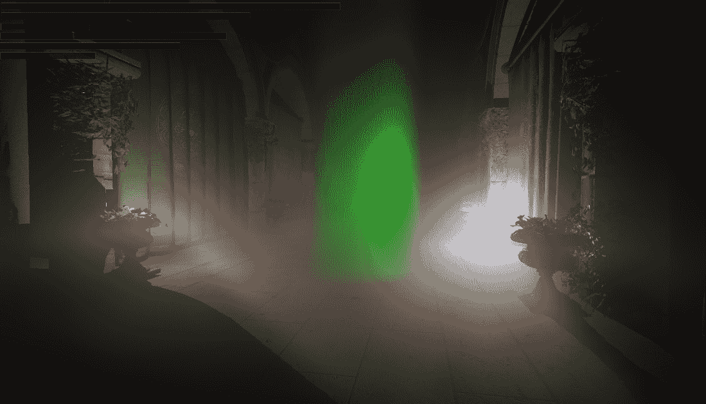
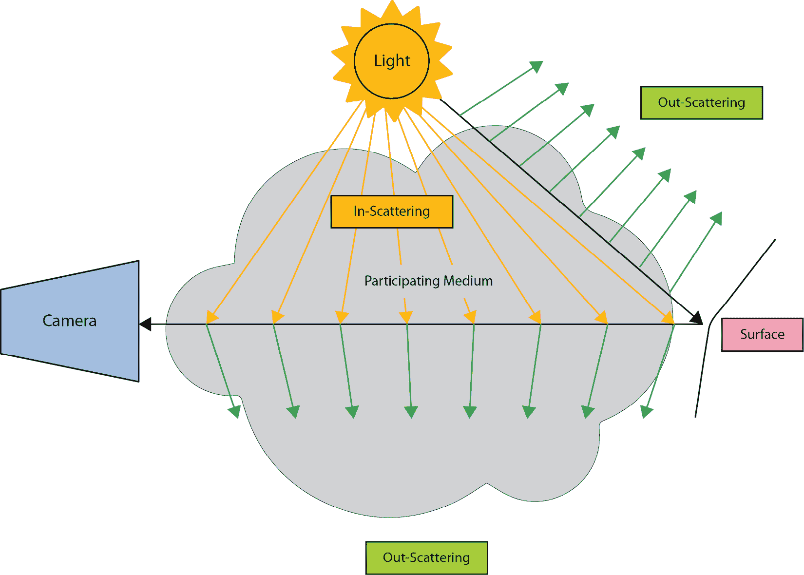
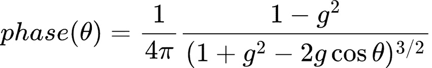
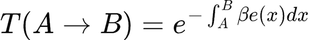
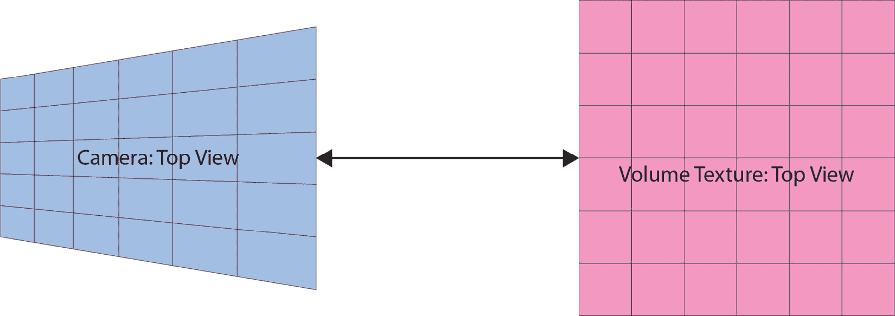
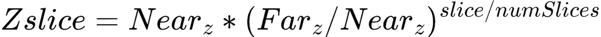
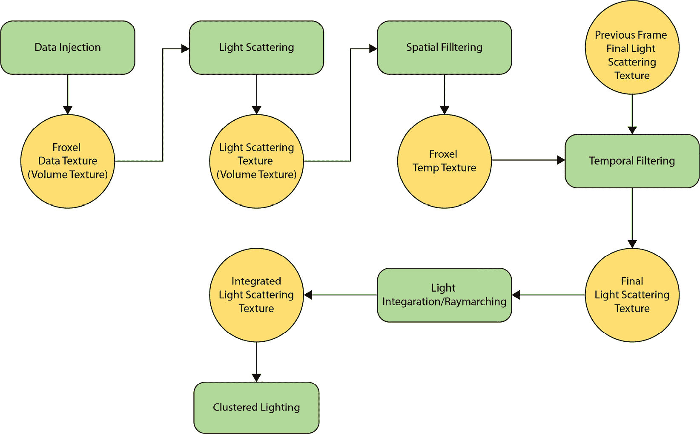

# 添加体积雾

在上一章添加了可变率着色后，我们将实现另一种现代技术，这将增强 Raptor 引擎的视觉效果：**体积雾**。体积渲染和雾在渲染文献中是非常古老的话题，但直到几年前，它们还被认为不适合实时使用。

使这一技术在实时中可行的是观察到的雾是一个低频效应；因此渲染可以比屏幕分辨率低得多，从而提高实时使用中的性能。

此外，计算着色器的引入，以及因此通用的 GPU 编程，加上对技术体积方面的近似和优化巧妙观察，为实时体积雾的解锁铺平了道路。

主要思想来源于巴特·沃罗尼斯基在 2014 年 Siggraph 会议上发表的奠基性论文([`bartwronski.files.wordpress.com/2014/08/bwronski_volumetric_fog_siggraph2014.pdf`](https://bartwronski.files.wordpress.com/2014/08/bwronski_volumetric_fog_siggraph2014.pdf))，他在那里描述了即使在几乎 10 年后，这一技术的核心思想仍然如此。

实现这一技术对于了解帧的不同渲染部分之间的协同作用也很重要：开发单一技术可能具有挑战性，但与其他技术的交互同样重要，并且可以增加技术的挑战性

在本章中，我们将涵盖以下主要主题：

+   介绍体积雾渲染

+   实现体积雾基础技术

+   添加空间和时间滤波以改善视觉效果

到本章结束时，我们将把体积雾集成到 Raptor 引擎中，与场景和所有动态灯光交互，如下图所示：



图 10.1 – 带有密度体积和三个投射阴影的光的体积雾

# 技术要求

本章的代码可以在以下 URL 找到：[`github.com/PacktPublishing/Mastering-Graphics-Programming-with-Vulkan/tree/main/source/chapter10`](https://github.com/PacktPublishing/Mastering-Graphics-Programming-with-Vulkan/tree/main/source/chapter10)。

# 介绍体积雾渲染

那么，**体积雾渲染**究竟是什么？正如其名所示，它是体积渲染和雾现象的结合。现在我们将对这些组件进行一些背景介绍，并看看它们如何在最终技术中结合在一起。

让我们从体积渲染开始。

## 体积渲染

这种渲染技术描述了当光线穿过参与介质时发生的视觉效果。参与介质是一个包含密度或反照率局部变化的体积。

以下图表总结了在参与介质中光子发生的情况：



图 10.2 – 参与介质中的光行为

我们试图描述的是光通过参与介质（即雾体积、云或大气散射）时的变化。

有三种主要现象发生，如下所述：

+   **吸收**：这发生在光线简单地被困在介质内部，无法逸出。这是一个能量的净损失。

+   **外散射**：这在图 10.2 中用绿色箭头表示，并且是能量从介质中逸出（因此可见）的损失。

+   **内散射**：这是来自与介质相互作用的灯光的能量。

虽然这三个现象足以描述光的行为，但在完全理解体渲染之前，还需要了解三个其他组成部分。

### 相位函数

第一个组成部分是**相位函数**。这个函数描述了光在不同方向上的散射。它依赖于光向量与出射方向之间的角度。

这个函数可能很复杂，试图以现实的方式描述散射，但最常用的是亨尼海-格林斯坦函数，这是一个也考虑各向异性的函数。

亨尼海-格林斯坦函数的公式如下：



图 10.3 – 亨尼海-格林斯坦函数

在前面的方程中，角度 theta 是视向量与光向量之间的角度。我们将在着色器代码中看到如何将其转换为可用的东西。

### 灭减

第二个组成部分是**灭减**。灭减是描述光散射程度的量。我们将在算法的中间步骤中使用它，但为了应用计算出的雾，我们需要透射率。

### 透射率

第三个也是最后一个组成部分是**透射率**。透射率是光通过介质一段的灭减，它使用比尔-朗伯定律来计算：



图 10.4 – 比尔-朗伯定律

在最终的积分步骤中，我们将计算透射率并使用它来选择如何将雾应用到场景中。这里重要的是要掌握基本概念；章节末尾将提供链接以加深对数学背景的理解。

我们现在拥有了查看体雾实现细节所需的所有概念。

## 体雾

现在我们已经了解了贡献于体渲染的不同组成部分，我们可以从算法的角度进行鸟瞰。巴特·沃罗尼斯基在开发这项技术时，第一个也是最巧妙的想法之一是使用一个截锥体对齐的体积纹理，如下所示：



图 10.5 – 视锥对齐体积纹理

使用体积纹理和与标准光栅化渲染相关的数学，我们可以创建相机视锥和纹理之间的映射。这种映射已经在渲染的不同阶段发生，例如，在乘以视图投影矩阵的顶点位置时，所以这不是什么新东西。

新的是在体积纹理中存储信息以计算体积渲染。这个纹理的每个元素通常被称为**froxel**，代表**视锥体素**。

我们选择了一个宽度、高度和深度为 128 个单位的纹理，但其他解决方案使用宽度高度取决于屏幕分辨率，类似于聚簇着色。

我们将使用具有这种分辨率的纹理作为中间步骤，并且对于额外的滤波，我们将在稍后讨论。一个额外的决定是使用非线性深度分布来增加相机的分辨率，将线性范围映射到指数范围。

我们将使用一个分布函数，例如 Id 在他们的 iD Tech 引擎中使用的函数，如下所示：



图 10.6 – 体积纹理在 Z 坐标函数上的深度切片

现在我们已经决定了体积纹理和世界单位之间的映射，我们可以描述实现完整工作体积雾解决方案所需的步骤。

算法在以下图中概述，其中矩形代表着色器执行，而椭圆代表纹理：



图 10.7 – 算法概述

我们现在将逐步查看算法的每个步骤，以创建一个心理模型来了解正在发生的事情，我们将在本章后面回顾着色器。

### 数据注入

第一步是数据注入。这个着色器将把一些以颜色和密度形式存在的彩色雾添加到只包含数据的第一个视锥对齐纹理中。我们决定添加一个常量雾、一个基于高度的雾和一个雾体积，以模拟更真实的游戏开发设置。

### 光散射

在执行光散射时，我们计算场景中灯光的入射散射。

在拥有一个工作的聚簇光照算法后，我们将重用相同的数据结构来计算每个 froxel 的光贡献，注意以不同于标准聚簇光照的方式处理光 – 这里没有漫反射或镜面反射，而只是一个由衰减、阴影和相位给出的全局项。

我们还采样与灯光相关的阴影图，以实现更逼真的行为。

### 空间滤波

为了消除一些噪声，我们仅在视锥对齐纹理的 X 轴和 Y 轴上应用高斯滤波器，然后传递到最重要的滤波器，即时间滤波器。

### 时间滤波

这个过滤器通过在算法的不同步骤添加一些噪声来消除一些色带，从而真正提高了视觉效果。它将读取前一帧的最终纹理（集成之前的那个），并根据某个常数因子将当前的光散射结果与之前的结果混合。

这是一个非常困难的话题，因为时间滤波和重投影可能会引起一些问题。我们将在下一章讨论**时间****反走样**（**TAA**）时进行更深入的讨论。

在散射和消光完成后，我们可以执行光积分，从而准备场景将要采样的纹理。

### 光积分

这一步准备另一个对齐体积纹理来包含雾的积分。基本上，这个着色器模拟了低分辨率的射线投射，以便这个结果可以被场景采样。

射线投射通常从摄像机开始，向场景的远平面延伸。对齐体积纹理和这个积分的结合为每个 froxel 提供了一个缓存的射线投射光散射，以便场景可以轻松采样。在这个步骤中，我们从之前纹理中保存的所有消光中最终计算出透射率，并使用它将雾合并到场景中。

这和时序滤波是一些重大创新，解锁了此算法的实时可能性。在更高级的解决方案中，例如在游戏《荒野大镖客救赎 2》中，可以添加额外的射线投射来模拟更远距离的雾。

它还允许雾和体积云（使用纯射线投射方法）混合，实现几乎无缝的过渡。这在上 Siggraph 关于《荒野大镖客救赎 2》渲染的演示中详细解释。

### 集群光照中的场景应用

最后一步是使用世界位置在光照着色器中读取体积纹理。我们可以读取深度缓冲区，计算世界位置，计算 froxel 坐标并采样纹理。

为了进一步平滑体积外观，可以先将场景应用渲染到半分辨率纹理，然后使用几何感知上采样将其应用到场景中，但这个步骤将留给你作为练习来完成。

# 实现体积雾渲染

现在我们已经拥有了读取使此算法完全工作的代码所需的所有知识。从 CPU 的角度来看，它只是一系列计算着色器调度，所以很简单。

这种技术的核心在各个着色器中实现，因此也在 GPU 上实现，几乎处理了我们在上一节中提到的关于对齐体积纹理的几乎所有步骤。

*图 10.7* 展示了不同的算法步骤，我们将在接下来的章节中逐一介绍。

## 数据注入

在第一个着色器中，我们将从不同雾现象的颜色和密度开始编写散射和消光：

我们决定添加三种不同的雾效果，如下所示：

+   恒定雾

+   高度雾

+   体积中的雾

对于每种雾，我们需要计算散射和消光并将它们累积：

以下代码将颜色和密度转换为散射和消光：

```cpp
vec4 scattering_extinction_from_color_density( vec3 color,
    float density ) {
    const float extinction = scattering_factor * density;
    return vec4( color * extinction, extinction );
}
```

我们现在可以查看主着色器。这个着色器，就像本章中的大多数其他着色器一样，将被调度为每个 froxel 单元一个线程：

在第一部分，我们将看到用于计算世界位置的调度和代码：

```cpp
layout (local_size_x = 8, local_size_y = 8, local_size_z =
        1) in;
void main() {
    ivec3 froxel_coord = ivec3(gl_GlobalInvocationID.xyz);
    vec3 world_position = world_from_froxel(froxel_coord);
    vec4 scattering_extinction = vec4(0);
```

我们添加了一个可选的噪声来动画化雾并打破恒定的密度：

```cpp
    vec3 sampling_coord = world_position *
       volumetric_noise_position_multiplier +
       vec3(1,0.1,2) * current_frame *
       volumetric_noise_speed_multiplier; 
    vec4 sampled_noise = texture(
       global_textures_3d[volumetric_noise_texture_index],
       sampling_coord);
    float fog_noise = sampled_noise.x;
```

这里，我们添加并累积恒定雾：

```cpp
    // Add constant fog
    float fog_density = density_modifier * fog_noise;
    scattering_extinction += 
       scattering_extinction_from_color_density( 
       vec3(0.5), fog_density ); 
```

然后，添加并累积高度雾：

```cpp
    // Add height fog
    float height_fog = height_fog_density *
       exp(-height_fog_falloff * max(world_position.y, 0)) *
       fog_noise;
    scattering_extinction += 
       scattering_extinction_from_color_density( 
       vec3(0.5), height_fog ); 
```

最后，从盒子中添加密度：

```cpp
    // Add density from box
    vec3 box = abs(world_position - box_position);
    if (all(lessThanEqual(box, box_size))) {
        vec4 box_fog_color = unpack_color_rgba( box_color
                                              );
        scattering_extinction +=
            scattering_extinction_from_color_density(
                box_fog_color.rgb, box_fog_density *
                    fog_noise);
    }
```

我们最终存储散射和消光，以便在下一个着色器中照明：

```cpp
    imageStore(global_images_3d[froxel_data_texture_index],
               froxel_coord.xyz, scattering_extinction );
}
```

## 计算光照贡献

照明将使用已在通用照明函数中使用的 Clustered Lighting 数据结构执行。在这个着色器中，我们计算光线的入射散射：

着色器调度与上一个着色器相同，一个线程对应一个 froxel：

```cpp
layout (local_size_x = 8, local_size_y = 8, local_size_z =
        1) in;
void main() {
    ivec3 froxel_coord = ivec3(gl_GlobalInvocationID.xyz);
    vec3 world_position = world_from_froxel(froxel_coord);
    vec3 rcp_froxel_dim = 1.0f / froxel_dimensions.xyz;
```

我们从注入着色器的结果中读取散射和消光：

```cpp
vec4 scattering_extinction = texture(global_textures_3d 
   [nonuniformEXT(froxel_data_texture_index)], 
   froxel_coord * rcp_froxel_dim);
   float extinction = scattering_extinction.a;
```

然后开始累积光线并使用集群的箱子：

注意不同渲染算法之间的协作：由于已经开发了集群的箱子，我们可以使用它从世界空间位置查询定义体积中的光源：

```cpp
vec3 lighting = vec3(0);
vec3 V = normalize(camera_position.xyz - world_position);
// Read clustered lighting data
// Calculate linear depth
float linear_d = froxel_coord.z * 1.0f /
   froxel_dimension_z;
linear_d = raw_depth_to_linear_depth(linear_d,
   froxel_near, froxel_far) / froxel_far;
// Select bin
int bin_index = int( linear_d / BIN_WIDTH );
uint bin_value = bins[ bin_index ];
// As in calculate_lighting method, cycle through
// lights to calculate contribution
for ( uint light_id = min_light_id;
    light_id <= max_light_id;
    ++light_id ) {
    // Same as calculate_lighting method
    // Calculate point light contribution
    // Read shadow map for current light
    float shadow = current_depth –
       bias < closest_depth ? 1 : 0;
    const vec3 L = normalize(light_position –
       world_position);
    float attenuation = attenuation_square_falloff(
       L, 1.0f / light_radius) * shadow;
```

到目前为止，代码几乎与照明中使用的代码相同，但我们添加了`phase_function`来最终化光照因子：

```cpp
    lighting += point_light.color *
       point_light.intensity *
       phase_function(V, -L,
         phase_anisotropy_01) *
       attenuation;
                    }
```

最终的散射计算并存储，如下所示：

```cpp
vec3 scattering = scattering_extinction.rgb * lighting;
imageStore( global_images_3d
            [light_scattering_texture_index],
            ivec3(froxel_coord.xyz), vec4(scattering,
            extinction) );
}
```

现在，我们将查看积分/光线追踪着色器，以总结实现算法体积部分所需的主要着色器。

## 散射和消光的积分

这个着色器负责在 froxel 纹理中执行光线追踪并在每个单元格中进行中间计算。它仍然会写入一个与锥体对齐的纹理，但每个单元格将包含从该单元格开始的累积散射和透射率：

注意，我们现在使用透射率而不是消光，透射率是一个将消光积分到一定空间的量。调度仅针对锥体纹理的 *X* 和 *Y* 轴，读取光线散射纹理，因为我们将在主循环中执行积分步骤并将结果写入每个 froxel：

最终存储的结果是散射和透射率，因此可以更容易地将其应用于场景：

```cpp
// Dispatch with Z = 1 as we perform the integration.
layout (local_size_x = 8, local_size_y = 8, local_size_z =
        1) in;
void main() {
    ivec3 froxel_coord = ivec3(gl_GlobalInvocationID.xyz);
    vec3 integrated_scattering = vec3(0,0,0);
    float integrated_transmittance = 1.0f;
    float current_z = 0;
    vec3 rcp_froxel_dim = 1.0f / froxel_dimensions.xyz;
```

我们在 *Z* 轴上积分，因为该纹理是锥体对齐的：

首先，我们计算深度差以获得消光积分所需的厚度：

```cpp
    for ( int z = 0; z < froxel_dimension_z; ++z ) {
        froxel_coord.z = z;
         float next_z = slice_to_exponential_depth(
                        froxel_near, froxel_far, z + 1,
                        int(froxel_dimension_z) );
        const float z_step = abs(next_z - current_z);
        current_z = next_z;
```

我们将计算散射和透射率，并将它们累积到下一个在 *Z* 轴上的单元格：

```cpp
        // Following equations from Physically Based Sky,
           Atmosphere and Cloud Rendering by Hillaire
        const vec4 sampled_scattering_extinction =
        texture(global_textures_3d[
        nonuniformEXT(light_scattering_texture_index)],
        froxel_coord * rcp_froxel_dim);
        const vec3 sampled_scattering =
            sampled_scattering_extinction.xyz;
        const float sampled_extinction =
            sampled_scattering_extinction.w;
        const float clamped_extinction =
            max(sampled_extinction, 0.00001f);
        const float transmittance = exp(-sampled_extinction
                                        * z_step);
        const vec3 scattering = (sampled_scattering –
                                (sampled_scattering *
                                transmittance)) /
                                clamped_extinction;
        integrated_scattering += scattering *
                                 integrated_transmittance;
        integrated_transmittance *= transmittance;
        imageStore( global_images_3d[
           integrated_light_scattering_texture_index],
           froxel_coord.xyz,
           vec4(integrated_scattering,
              integrated_transmittance) );
    }
}
```

现在我们有一个包含光线追踪散射和透射值的体积纹理，可以从帧中的任何位置查询，以了解有多少雾以及该点的颜色。

这就完成了算法的主要体积渲染方面。我们现在来看看将雾应用于场景有多容易。

## 将体积雾应用于场景

我们最终可以应用体积雾。为此，我们使用屏幕空间坐标来计算纹理的采样坐标。这个函数将在延迟和前向渲染路径的照明计算结束时使用。

我们首先计算采样坐标：

```cpp
vec3 apply_volumetric_fog( vec2 screen_uv, float raw_depth,
                           vec3 color ) {
    const float near = volumetric_fog_near;
    const float far = volumetric_fog_far;
    // Fog linear depth distribution
    float linear_depth = raw_depth_to_linear_depth(
                         raw_depth, near, far );
    // Exponential
    float depth_uv = linear_depth_to_uv( near, far,
        linear_depth, volumetric_fog_num_slices );
vec4 scattering_transmittance =
   texture(global_textures_3d
   [nonuniformEXT(volumetric_fog_texture_index)], 
   froxel_uvw);
```

在读取指定位置的散射和透射值之后，我们使用透射值来调制当前场景颜色并添加雾散射颜色，如下所示：

```cpp
    color.rgb = color.rgb * scattering_transmittance.a +
                scattering_transmittance.rgb;
    return color;
}
```

这就完成了完全实现体积雾渲染的必要步骤。但仍然存在一个大问题：**带状效应**。

这是一个在几篇论文中讨论的广泛主题，但为了简单起见，我们可以这样说，拥有低分辨率的体积纹理会增加带状问题，但这是实现实时性能所必需的。

## 添加过滤器

为了进一步提高视觉效果，我们添加了两个不同的过滤器：一个时间过滤器和空间过滤器。

时间过滤器真正实现了差异，因为它给了我们在算法的不同部分添加噪声的可能性，从而消除了带状效应。空间过滤器进一步平滑了雾。

### 空间过滤

这个着色器将通过应用高斯过滤器来平滑体积纹理的 X 和 Y 轴。它将读取光散射的结果并将其写入 froxel 数据纹理，在当前帧的这个点尚未使用，从而消除了创建临时纹理的需要。

我们首先定义高斯函数及其表示代码：

```cpp
#define SIGMA_FILTER 4.0
#define RADIUS 2
float gaussian(float radius, float sigma) {
    const float v = radius / sigma;
    return exp(-(v*v));
}
```

然后我们读取光散射纹理，并且只有在计算出的坐标有效时才累加值和权重：

```cpp
    vec4 scattering_extinction =
       texture( global_textures_3d[
       nonuniformEXT(light_scattering_texture_index)],
       froxel_coord * rcp_froxel_dim );
    if ( use_spatial_filtering == 1 ) {
        float accumulated_weight = 0;
        vec4 accumulated_scattering_extinction = vec4(0);
        for (int i = -RADIUS; i <= RADIUS; ++i ) {
            for (int j = -RADIUS; j <= RADIUS; ++j ) {
                ivec3 coord = froxel_coord + ivec3(i, j,
                                                   0);
                // if inside
                if (all(greaterThanEqual(coord, ivec3(0)))
                    && all(lessThanEqual(coord,
                    ivec3(froxel_dimension_x,
                    froxel_dimension_y,
                    froxel_dimension_z)))) {
                    const float weight =
                        gaussian(length(ivec2(i, j)),
                            SIGMA_FILTER);
                    const vec4 sampled_value =
                      texture(global_textures_3d[
                        nonuniformEXT(
                          light_scattering_texture_index)],
                            coord * rcp_froxel_dim);
                  accumulated_scattering_extinction.rgba +=
                      sampled_value.rgba * weight;
                    accumulated_weight += weight;
                }
            }
        }
        scattering_extinction =
           accumulated_scattering_extinction /
           accumulated_weight;
    }
```

我们将结果存储在 froxel 数据纹理中：

```cpp
    imageStore(global_images_3d[froxel_data_texture_index],
               froxel_coord.xyz, scattering_extinction );
}
```

下一步是时间过滤。

### 时间过滤

这个着色器将接受当前计算的 3D 光散射纹理并应用一个时间过滤器。为了做到这一点，它将需要两个纹理，一个用于当前帧，一个用于前一帧，多亏了无绑定，我们只需要更改索引来使用它们。

分派与本章中的大多数着色器类似，每个 froxel 元素都有一个线程。让我们从读取当前光散射纹理开始。

这目前位于`froxel_data_texture`中，来自空间过滤：

```cpp
    vec4 scattering_extinction =
       texture( global_textures_3d[
       nonuniformEXT(froxel_data_texture_index)],
       froxel_coord * rcp_froxel_dim );
```

我们需要计算之前的屏幕空间位置来读取前一个帧的纹理。

我们将计算世界位置，然后使用之前的视图投影来获取 UVW 坐标以读取纹理：

```cpp
    // Temporal reprojection
    if (use_temporal_reprojection == 1) {
        vec3 world_position_no_jitter =
            world_from_froxel_no_jitter(froxel_coord);
        vec4 sceen_space_center_last =
            previous_view_projection *
                vec4(world_position_no_jitter, 1.0);
        vec3 ndc = sceen_space_center_last.xyz /
                   sceen_space_center_last.w;
        float linear_depth = raw_depth_to_linear_depth(
                             ndc.z, froxel_near, froxel_far
                             );
        float depth_uv = linear_depth_to_uv( froxel_near,
                         froxel_far, linear_depth,
                         int(froxel_dimension_z) );
        vec3 history_uv = vec3( ndc.x * .5 + .5, ndc.y * -
                                .5 + .5, depth_uv );
```

然后我们检查计算出的 UVW 是否有效，如果是，我们将读取前一个纹理：

```cpp
        // If history UV is outside the frustum, skip
        if (all(greaterThanEqual(history_uv, vec3(0.0f)))
             && all(lessThanEqual(history_uv, vec3(1.0f)))) {
            // Fetch history sample
            vec4 history = textureLod(global_textures_3d[
               previous_light_scattering_texture_index],
               history_uv, 0.0f);
```

一旦读取了样本，我们可以根据用户定义的百分比将当前结果与上一个结果合并：

```cpp
            scattering_extinction.rgb = mix(history.rgb,
                scattering_extinction.rgb,
                    temporal_reprojection_percentage);
            scattering_extinction.a = mix(history.a,
                scattering_extinction.a,
                    temporal_reprojection_percentage);
        }
    }
```

我们将结果存储回光散射纹理中，以便积分可以在算法的体积部分的最后一步使用它。

```cpp
    imageStore(global_images_3d[light_scattering_texture_in
               dex],
               froxel_coord.xyz, scattering_extinction );
}
```

到目前为止，我们已经看到了体积雾完整算法的所有步骤。

最后要看到的是用于动画雾的体积噪声生成，并简要讨论用于去除条纹的噪声和抖动。

## 体积噪声生成

为了使雾密度更有趣，我们可以采样体积噪声纹理来稍微修改密度。我们可以添加一个单次执行的计算着色器，它将 Perlin 噪声存储在 3D 纹理中，然后在采样雾密度时读取它。

此外，我们可以动画化这个噪声来模拟风动画。着色器很简单，并使用以下 Perlin 噪声函数：

```cpp
layout (local_size_x = 8, local_size_y = 8, local_size_z =
        1) in;
void main() {
    ivec3 pos = ivec3(gl_GlobalInvocationID.xyz);
    vec3 xyz = pos / volumetric_noise_texture_size;
    float perlin_data = get_perlin_7_octaves(xyz, 4.0);
    imageStore( global_images_3d[output_texture_index],
                pos, vec4(perlin_data, 0, 0, 0) );
}
```

结果是一个单通道体积纹理，其中包含用于采样的 Perlin 噪声。我们还使用一个特殊的采样器，它在*U*、*V*和*W*轴上有重复过滤器。

## 蓝色噪声

作为用于在不同区域偏移采样的附加噪声，我们使用蓝色噪声，从纹理中读取它，并给它添加一个时间组件。

蓝色噪声有许多有趣的特性，并且有许多关于为什么它是视觉感知中优秀噪声的文献，我们将在本章末尾提供链接，但现在，我们只是从具有两个通道的纹理中读取噪声，并将其映射到`-1`到`1`的范围。

映射函数如下：

```cpp
float triangular_mapping( float noise0, float noise1 ) {
    return noise0 + noise1 - 1.0f;
}
```

以下操作用于读取蓝色噪声：

```cpp
float generate_noise(vec2 pixel, int frame, float scale) {
    vec2 uv = vec2(pixel.xy / blue_noise_dimensions.xy);
    // Read blue noise from texture
    vec2 blue_noise = texture(global_textures[
        nonuniformEXT(blue_noise_128_rg_texture_index)],
                      uv ).rg;
    const float k_golden_ratio_conjugate = 0.61803398875;
    float blue_noise0 = fract(ToLinear1(blue_noise.r) +
        float(frame % 256) * k_golden_ratio_conjugate);
    float blue_noise1 = fract(ToLinear1(blue_noise.g) +
        float(frame % 256) * k_golden_ratio_conjugate);
    return triangular_noise(blue_noise0, blue_noise1) *
        scale;
}
```

最终值将在`-1`和`1`之间，并且可以按任何需要缩放并用于任何地方。

有一个动画蓝色噪声论文承诺更好的质量，但由于许可问题，我们选择了使用这个免费版本。

# 摘要

在本章中，我们介绍了体积雾渲染技术。在展示代码之前，我们提供了简短的数学背景和算法概述。我们还展示了不同的技术，以改善条纹——这是一个需要仔细平衡噪声和时间重投影的广泛主题。

提出的算法也是一个几乎完整的实现，可以在许多商业游戏中找到。我们还讨论了过滤，特别是与下一章相关的时间滤波器，我们将讨论一种使用时间重投影的防锯齿技术。

在下一章中，我们将看到时间抗锯齿和用于在体积雾中抖动采样的噪声之间的协同作用如何减轻视觉条纹。我们还将展示一种使用用于生成体积噪声的单次使用计算着色器生成自定义纹理的可行方法。

这种技术也用于其他体积算法，如体积云，以存储更多用于生成云形状的自定义噪声。

# 进一步阅读

本章引用了许多不同的论文，但最重要的是关于基于 GPU 的实时体积渲染的*实时体积渲染*论文：[`patapom.com/topics/Revision2013/Revision%202013%20-%20Real-time%20Volumetric%20Rendering%20Course%20Notes.pdf`](https://patapom.com/topics/Revision2013/Revision%202013%20-%20Real-time%20Volumetric%20Rendering%20Course%20Notes.pdf).

该算法仍然是 Bart Wronski 的开创性论文的衍生：[`bartwronski.files.wordpress.com/2014/08/bwronski_volumetric_fog_siggraph2014.pdf`](https://bartwronski.files.wordpress.com/2014/08/bwronski_volumetric_fog_siggraph2014.pdf).

在以下链接中，有一些进化和数学改进：[`www.ea.com/frostbite/news/physically-based-unified-volumetric-rendering-in-frostbite`](https://www.ea.com/frostbite/news/physically-based-unified-volumetric-rendering-in-frostbite).

对于深度分布，我们参考了 iD Tech 6 中使用的公式：[`advances.realtimerendering.com/s2016/Siggraph2016_idTech6.pdf`](https://advances.realtimerendering.com/s2016/Siggraph2016_idTech6.pdf).

对于带状和噪声，最全面的论文来自 Playdead：

+   [`loopit.dk/rendering_inside.pdf`](https://loopit.dk/rendering_inside.pdf)

+   [`loopit.dk/banding_in_games.pdf`](https://loopit.dk/banding_in_games.pdf)

关于动画蓝色噪声的信息：[`blog.demofox.org/2017/10/31/animating-noise-for-integration-over-time/`](https://blog.demofox.org/2017/10/31/animating-noise-for-integration-over-time/)

关于抖动、蓝色噪声和黄金比例序列的信息：[`bartwronski.com/2016/10/30/dithering-part-two-golden-ratio-sequence-blue-noise-and-highpass-and-remap/`](https://bartwronski.com/2016/10/30/dithering-part-two-golden-ratio-sequence-blue-noise-and-highpass-and-remap/)

可以在这里找到免费的蓝色噪声纹理：[`momentsingraphics.de/BlueNoise.xhtml`](http://momentsingraphics.de/BlueNoise.xhtml).

# 第三部分：高级渲染技术

在这部分，我们将继续向我们的渲染器添加高级技术，并探讨如何使用光线追踪替换或改进早期章节中开发的一些技术。

在本节中，我们将涵盖以下章节：

+   *第十一章**，时间反走样*

+   *第十二章**，Ray Tracing 入门*

+   *第十三章**，使用 Ray Tracing 重新审视阴影*

+   *第十四章**，使用 Ray Tracing 添加动态漫反射全局照明*

+   *第十五章**，使用 Ray Tracing 添加反射*
