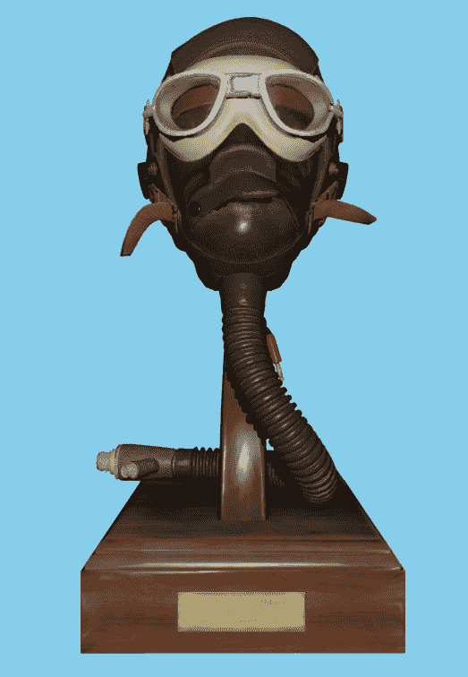
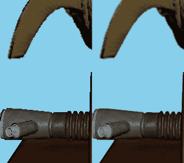
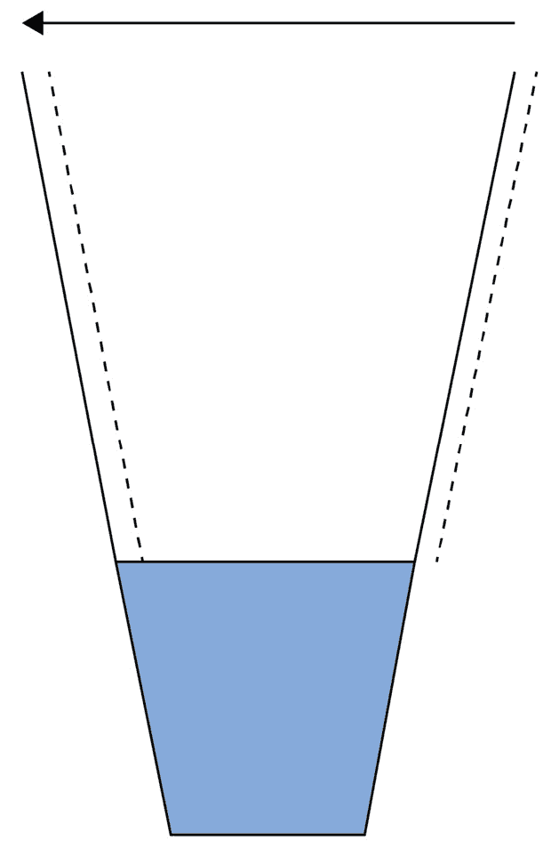
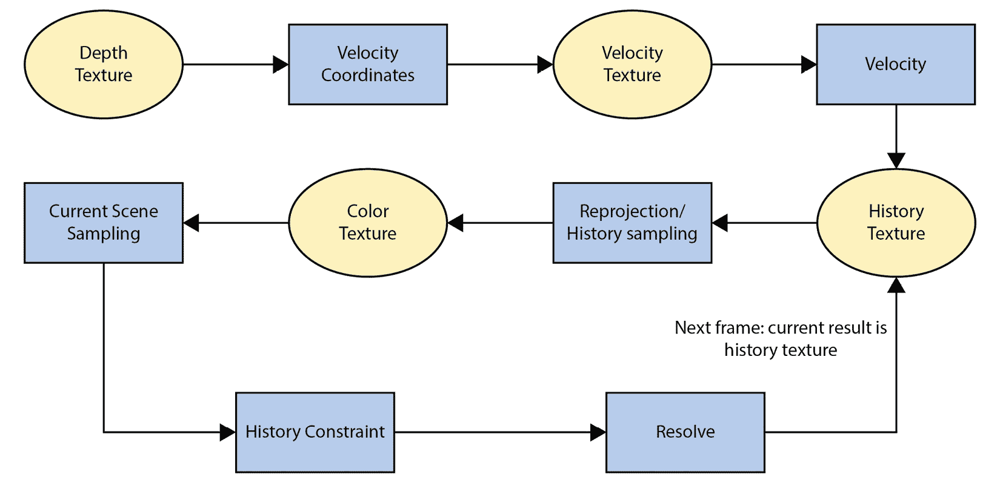
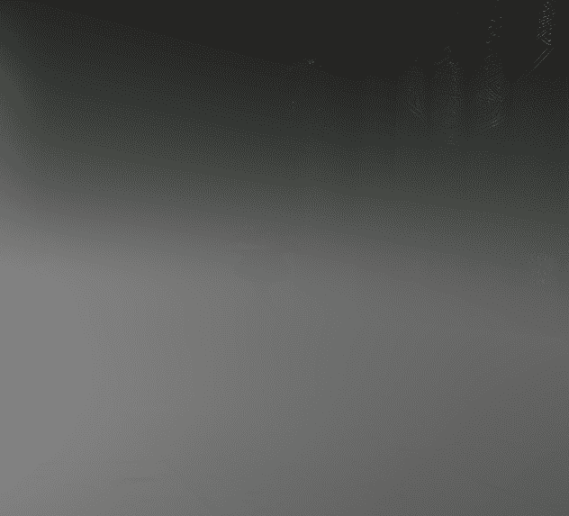

# 11

# 时间抗锯齿

在本章中，我们将扩展在前一章中提到的概念，当时我们讨论了时间重投影。提高图像质量最常见的方法是采样更多数据（超采样），并将其过滤到所需的采样频率。

在渲染过程中使用的主要技术是**多样本抗锯齿**，或称为**MSAA**。另一种用于超采样的技术是时间超采样，或使用两个或更多帧的样本来重建更高品质的图像。

在体积雾技术中，采用类似的方法以非常有效的方式消除由体积纹理低分辨率引起的带状条纹。我们将看到如何通过使用**时间****抗锯齿**（**TAA**）来实现更好的图像质量。

这种技术在近年来被广泛采用，因为越来越多的游戏开始在核心中使用延迟渲染，并且由于在延迟渲染上应用 MSAA 的困难。有各种尝试使 MSAA 和延迟渲染协同工作，但当时在时间和内存性能方面始终证明是不可行的，因此开始开发替代解决方案。

进入**后处理抗锯齿**及其众多缩写。第一个被广泛使用的是**形态学抗锯齿**，或称为**MLAA**，由当时在 Intel 工作的亚历山大·雷什托夫开发，并在 2009 年的高性能图形会议上展示。

该算法是为了在 CPU 上使用 Intel 的**流式单指令多数据扩展**（**SSE**）指令而开发的，并提出了一些有趣的解决方案来寻找和改进几何边缘渲染，这推动了后续的实现。后来，索尼圣莫尼卡在《战神 III》中采用了 MLAA，使用 Cell **协同处理单元**（**SPUs**）以实时性能执行。

后处理抗锯齿终于在 2011 年由豪尔赫·吉梅内斯和其他人开发出了 GPU 实现，开辟了一个新的渲染研究领域。各种其他游戏工作室开始开发定制的后处理抗锯齿技术并分享他们的细节。

所有这些技术都是基于几何边缘识别和图像增强。

另一个开始出现的新方面是重用前帧的信息以进一步增强视觉效果，例如在**锐化形态学抗锯齿**，或称为**SMAA**中，它开始添加时间组件以增强最终图像。

最广泛采用的抗锯齿技术是 TAA，它带来了一系列挑战，但非常适合渲染管线，并允许其他技术（如体积雾）通过引入动画抖动来减少带状条纹，从而提高视觉效果。

TAA 现在已成为大多数游戏引擎的标准，无论是商业的还是私人的。它带来了一些挑战，例如处理透明物体和图像模糊，但我们将看到如何解决这些问题。

在本章的剩余部分，我们将首先看到算法概述，然后深入到实现。我们还将创建一个初始的、极其简单的实现，仅为了展示算法的基本构建块，让您了解如何从头开始编写自定义 TAA 实现。最后，我们将看到算法中的不同改进区域。

让我们看看一个示例场景并突出 TAA 的改进：



图 11.1 – 时间反走样场景

以下是一些最终结果的截图，有和没有启用 TAA。



图 11.2 – 图 11.1 无（左）和有（右）TAA 的细节

在本章中，我们将探讨以下主题：

+   创建最简单的 TAA 实现

+   技术的逐步改进

+   TAA 之外图像锐化技术概述

+   使用噪声和 TAA 改善不同图像区域的带状

# 技术要求

本章的代码可以在以下网址找到：[`github.com/PacktPublishing/Mastering-Graphics-Programming-with-Vulkan/tree/main/source/chapter11`](https://github.com/PacktPublishing/Mastering-Graphics-Programming-with-Vulkan/tree/main/source/chapter11)。

# 概述

在本节中，我们将看到 TAA 渲染技术的算法概述。

TAA 基于通过应用小的偏移到相机投影矩阵并应用一些过滤器来生成最终图像的样本集合，如下所示：



图 11.3 – 楔形抖动

有各种数值序列可以用来偏移相机，正如我们在实现部分将看到的。移动相机被称为 **抖动**，通过抖动相机，我们可以收集额外的数据来增强图像。

以下是对 TAA 着色器的概述：



图 11.4 – TAA 算法概述

根据 *图 11**.4*，我们将算法分为步骤（蓝色矩形）和纹理读取（黄色椭圆）。

1.  我们计算读取速度的坐标，表示为 **速度坐标** 块。

这通常是通过读取当前像素位置周围的 3x3 像素邻域并找到最近的像素，使用当前帧的 **深度纹理** 来完成的。从 3x3 邻域读取已被证明可以减少鬼影并提高边缘质量。

1.  我们使用从 **速度纹理** 块中找到的新坐标读取速度，注意使用线性采样器，因为速度不仅仅是像素的增量，还可以在像素之间。

1.  我们从**历史纹理**块读取颜色信息。这基本上是上一帧的 TAA 输出。我们可以选择应用一个过滤器来读取纹理，以进一步提高质量。

1.  我们将读取当前场景的颜色。在这个步骤中，我们还将通过读取当前像素位置周围的邻域来缓存信息，以约束我们之前读取的历史颜色，并引导最终的解决阶段。

1.  历史约束。我们试图将前一帧的颜色限制在当前颜色的一个区域内，以拒绝来自遮挡或去遮挡的无效样本。如果不这样做，会有很多幽灵效果。

1.  第六步和最后一步是**解决**。我们将当前颜色和约束历史颜色结合，通过应用一些额外的过滤器来生成最终的像素颜色。

当前帧的 TAA 结果将是下一帧的历史纹理，所以我们只需每帧简单地切换纹理（历史和 TAA 结果），无需像某些实现那样复制结果。

现在我们已经看到了算法的概述，我们可以开始实现一个初始的 TAA 着色器。

# 最简单的 TAA 实现

理解这种技术的最好方法是构建一个缺少一些重要步骤的基本实现，并且渲染模糊或抖动，因为这很容易做到。

如果正确执行，这种技术的基本成分很简单，但每个都必须以精确的方式进行。我们首先给相机添加抖动，这样我们就可以渲染场景的不同视角并收集额外的数据。

我们将添加运动矢量，以便我们可以在正确的位置读取前一帧的颜色信息。最后，我们将重新投影，或者说，读取历史帧的颜色数据并将其与当前帧的数据结合。

让我们看看不同的步骤。

## 抖动相机

这一步的目标是通过`x`和`y`轴将投影相机平移一个小量。

我们在`GameCamera`类中添加了一些实用代码：

```cpp
void GameCamera::apply_jittering( f32 x, f32 y ) {
    // Reset camera projection
    camera.calculate_projection_matrix();
    // Calculate jittering translation matrix and modify
       projection matrix
    mat4s jittering_matrix = glms_translate_make( { x, y,
                                                  0.0f } );
    camera.projection = glms_mat4_mul( jittering_matrix,
                                       camera.projection );
    camera.calculate_view_projection();
}
```

每一步都很重要且容易出错，所以请小心。

我们首先想要重置投影矩阵，因为我们将会手动修改它。然后我们构建一个包含`x`和`y`抖动值的平移矩阵，我们稍后会看到如何计算它们。

最后，我们将投影矩阵乘以抖动矩阵，并计算新的视图投影矩阵。注意乘法顺序，因为如果顺序错误，即使不移动相机，你也会看到一个模糊的、抖动的混乱！

在这个功能正常工作后，我们可以通过移除矩阵构建和乘法来优化代码，得到更干净且错误更少的代码，如下所示：

```cpp
void GameCamera::apply_jittering( f32 x, f32 y ) {
   camera.calculate_projection_matrix();
   // Perform the same calculations as before, with the
      observation that
   // we modify only 2 elements in the projection matrix:
   camera.projection.m20 += x;
   camera.projection.m21 += y;
   camera.calculate_view_projection();
}
```

## 选择抖动序列

现在我们将构建一个`x`和`y`值的序列来抖动相机。通常有不同序列被使用：

+   Halton

+   Hammersley

+   马丁·罗伯特的 R2

+   交错梯度

代码中包含了前面序列的所有实现，每个实现都可以让图像呈现出略微不同的外观，因为它改变了我们随时间收集样本的方式。

关于使用我们将提供的不同序列的丰富材料，我们将在本章末尾提供链接；现在重要的是要知道我们有一个重复几次帧后抖动相机的两个数字的序列。

假设我们选择了 Halton 序列。我们首先想要计算`x`和`y`的值：

```cpp
   f32 jitter_x = halton( jitter_index, 2 );
   f32 jitter_y = halton( jitter_index, 3 );
```

这些值在`[0,1]`范围内，但我们想要在两个方向上抖动，因此我们将其映射到`[-1.1]`范围：

```cpp
    f32 jitter_offset_x = jitter_x * 2 - 1.0f;
    f32 jitter_offset_y = jitter_y * 2 - 1.0f;
```

我们现在将它们应用到`apply jitter`方法中，但有一个注意事项：我们想要添加亚像素抖动，因此我们需要将这些偏移量除以屏幕分辨率：

```cpp
game_camera.apply_jittering( jitter_offset_x / gpu.swapchain_width, jitter_offset_y / gpu.swapchain_height );
```

最后，我们需要选择一个抖动周期，在重复抖动数字后经过多少帧，更新如下：

```cpp
jitter_index = ( jitter_index + 1 ) % jitter_period;
```

通常一个好的周期是四帧，但在附带的代码中，有改变这个数字并查看对渲染图像影响的可能性。

另一个基本的事情是要缓存先前和当前的抖动值并将它们发送到 GPU，这样运动向量就可以考虑完整的移动。

我们在场景统一变量中添加了`jitter_xy`和`previous_jitter_xy`作为变量，以便在所有着色器中访问。

## 添加运动向量

现在我们正确地抖动了相机并保存了偏移量，是时候添加运动向量以正确读取前一帧的颜色数据了。有两个运动来源：相机运动和动态对象运动。

我们添加了一个 R16G16 格式的速度纹理来存储每个像素的速度。对于每一帧，我们将它清除到`(0,0)`并计算不同的运动。对于相机运动，我们将计算当前和先前的屏幕空间位置，考虑到抖动和运动向量。

我们将在计算着色器中执行以下操作：

```cpp
layout (local_size_x = 8, local_size_y = 8, local_size_z =
        1) in;
void main() {
    ivec3 pos = ivec3(gl_GlobalInvocationID.xyz);
    // Read the raw depth and reconstruct NDC coordinates.
    const float raw_depth = texelFetch(global_textures[
        nonuniformEXT(depth_texture_index)], pos.xy, 0).r;
    const vec2 screen_uv = uv_nearest(pos.xy, resolution);
    vec4 current_position_ndc = vec4(
        ndc_from_uv_raw_depth( screen_uv, raw_depth ), 1.0f
        );
    // Reconstruct world position and previous NDC position
    const vec3 pixel_world_position =
        world_position_from_depth
           (screen_uv, raw_depth, inverse_view_projection);
    vec4 previous_position_ndc = previous_view_projection *
        vec4(pixel_world_position, 1.0f);
    previous_position_ndc.xyz /= previous_position_ndc.w;
    // Calculate the jittering difference.
    vec2 jitter_difference = (jitter_xy –
                              previous_jitter_xy)* 0.5f;
    // Pixel velocity is given by the NDC [-1,1] difference
       in X and Y axis
    vec2 velocity = current_position_ndc.xy –
                    previous_position_ndc.xy;
    // Take in account jittering
    velocity -= jitter_difference;
    imageStore( motion_vectors, pos.xy, vec4(velocity, 0,
                                             0) );
```

动态网格需要在顶点着色器或网格着色器中写入额外的输出，并在相机运动着色器中进行类似的计算：

```cpp
// Mesh shader version
gl_MeshVerticesNV[ i ].gl_Position = view_projection *
    (model * vec4(position, 1));
vec4 world_position = model * vec4(position, 1.0);
vec4 previous_position_ndc = previous_view_projection *
    vec4(world_position, 1.0f);
previous_position_ndc.xyz /= previous_position_ndc.w;
vec2 jitter_difference = (jitter_xy - previous_jitter_xy) *
                          0.5f;
vec2 velocity = gl_MeshVerticesNV[ i ].gl_Position.xy –
    previous_position_ndc.xy - jitter_difference;
vTexcoord_Velocity[i] = velocity;
```

然后，只需将速度写入其自己的渲染目标即可。

现在我们有了运动向量，我们终于可以看到一个极其基本的 TAA 着色器的实现。

## 首次实现代码

我们再次运行计算着色器来计算 TAA。最简单可能的着色器实现如下：

```cpp
vec3 taa_simplest( ivec2 pos ) {
    const vec2 velocity = sample_motion_vector( pos );
    const vec2 screen_uv = uv_nearest(pos, resolution);
    const vec2 reprojected_uv = screen_uv - velocity;
    vec3 current_color = sample_color(screen_uv.xy).rgb;
    vec3 history_color =
        sample_history_color(reprojected_uv).rgb;
    // source_weight is normally around 0.9.
    return mix(current_color, previous_color,
               source_weight);
}
```

在代码中，步骤很简单：

1.  在像素位置采样速度。

1.  在像素位置采样当前颜色。

1.  使用运动向量在先前的像素位置采样历史颜色。

1.  混合颜色，取当前帧颜色的 10%左右。

在继续进行任何改进之前，确保这一点完美运行至关重要。

你应该看到一个模糊度更大的图像，但存在一个大问题：在移动相机或物体时会出现鬼影。如果相机和场景是静态的，则不应该有像素移动。这是判断抖动和重投影是否正常工作的基本依据。

随着这种实现方式的工作，我们现在可以查看不同的改进区域，以获得更稳固的 TAA。

# 改进 TAA

有五个方面可以改进 TAA：重投影、历史采样、场景采样、历史约束和解决。

每个部分都有不同的参数需要调整，以满足项目的渲染需求——TAA 并不精确或完美，因此从视觉角度来看需要额外注意。

让我们详细看看不同的区域，以便使伴随的代码更清晰。

## 重投影

首先要做的是改进重投影，从而计算读取速度的坐标来驱动*历史* *采样*部分。

为了计算历史纹理像素坐标，最常见的方法是获取当前像素周围 3x3 正方形中的最近像素，这是 Brian Karis 的一个想法。我们将读取深度纹理，并使用深度值作为确定最近像素的方法，并缓存该像素的`x`和`y`位置：

```cpp
void find_closest_fragment_3x3(ivec2 pixel, out ivec2
                               closest_position, out
                               float closest_depth) {
    closest_depth = 1.0f;
    closest_position = ivec2(0,0);
    for (int x = -1; x <= 1; ++x ) {
        for (int y = -1; y <= 1; ++y ) {
            ivec2 pixel_position = pixel + ivec2(x, y);
                pixel_position = clamp(pixel_position,
                    ivec2(0), ivec2(resolution.x - 1,
                        resolution.y - 1));
            float current_depth =
                texelFetch(global_textures[
                    nonuniformEXT(depth_texture_index)],
                        pixel_position, 0).r;
            if ( current_depth < closest_depth ) {
                closest_depth = current_depth;
                closest_position = pixel_position;
            }
        }
    }
}
```

只使用找到的像素位置作为运动向量的读取坐标，鬼影将变得不那么明显，边缘将更加平滑：

```cpp
        float closest_depth = 1.0f;
        ivec2 closest_position = ivec2(0,0);
        find_closest_fragment_3x3( pos.xy,
                                   closest_position,
                                   closest_depth );
        const vec2 velocity = sample_motion_vector
            (closest_position.xy);
        // rest of the TAA shader
```

可能还有其他读取速度的方法，但这种方法已经在质量和性能之间证明了最佳权衡。另一种实验方法是在类似的 3x3 像素邻域中使用最大速度。

没有完美的解决方案，因此强烈鼓励进行实验和渲染技术的参数化。在我们计算出读取历史纹理的像素位置后，我们最终可以对其进行采样。

## 历史采样

在这种情况下，最简单的事情就是直接在计算的位置读取历史纹理。现实情况是，我们还可以应用一个过滤器来增强读取的视觉效果。

在代码中，我们添加了尝试不同过滤器的选项，这里的标准选择是使用 Catmull-Rom 过滤器来增强采样：

```cpp
   // Sample motion vectors.
    const vec2 velocity = sample_motion_vector_point(
                          closest_position );
    const vec2 screen_uv = uv_nearest(pos.xy, resolution);
    const vec2 reprojected_uv = screen_uv - velocity;
    // History sampling: read previous frame samples and
       optionally apply a filter to it.
    vec3 history_color = vec3(0);
    history_color = sample_history_color(
                    reprojected_uv ).rgb;
    switch (history_sampling_filter) {
        case HistorySamplingFilterSingle:
            history_color = sample_history_color(
                            reprojected_uv ).rgb;
            break;
        case HistorySamplingFilterCatmullRom:
            history_color = sample_texture_catmull_rom(
                            reprojected_uv,
                            history_color_texture_index );
            break;
    }
```

在我们得到历史颜色后，我们将采样当前场景颜色，并缓存历史约束和最终解决阶段所需的信息。

如果不进行进一步处理就使用历史颜色，会导致鬼影效果。

## 场景采样

在这个阶段，鬼影效果不那么明显但仍存在，因此我们可以用类似寻找最近像素的心态，在当前像素周围搜索以计算颜色信息并对其应用过滤器。

基本上，我们将像素视为信号而不是简单的颜色。这个主题可以相当长且有趣，在章节末尾，将提供资源以深入了解这一点。此外，在这一步中，我们将缓存用于约束来自前一帧的颜色的历史边界所需的信息。

我们需要知道的是，我们将围绕当前像素采样另一个 3x3 区域，并计算约束发生所需的信息。最有价值的信息是此区域中的最小和最大颜色，方差裁剪（我们将在稍后查看）还需要计算平均颜色和平方平均颜色（称为**矩**）以帮助历史约束。最后，我们还将对颜色采样应用一些过滤。

让我们看看代码：

```cpp
// Current sampling: read a 3x3 neighborhood and cache
   color and other data to process history and final
   resolve.
    // Accumulate current sample and weights.
    vec3 current_sample_total = vec3(0);
    float current_sample_weight = 0.0f;
    // Min and Max used for history clipping
    vec3 neighborhood_min = vec3(10000);
    vec3 neighborhood_max = vec3(-10000);
    // Cache of moments used in the constraint phase
    vec3 m1 = vec3(0);
    vec3 m2 = vec3(0);
    for (int x = -1; x <= 1; ++x ) {
        for (int y = -1; y <= 1; ++y ) {
            ivec2 pixel_position = pos + ivec2(x, y);
            pixel_position = clamp(pixel_position,
                ivec2(0), ivec2(resolution.x - 1,
                    resolution.y - 1));
            vec3 current_sample =
            sample_current_color_point(pixel_position).rgb;
            vec2 subsample_position = vec2(x * 1.f, y *
                                           1.f);
            float subsample_distance = length(
                                       subsample_position
                                       );
            float subsample_weight = subsample_filter(
                                     subsample_distance );
            current_sample_total += current_sample *
                                    subsample_weight;
            current_sample_weight += subsample_weight;
            neighborhood_min = min( neighborhood_min,
                                    current_sample );
            neighborhood_max = max( neighborhood_max,
                                     current_sample );
            m1 += current_sample;
            m2 += current_sample * current_sample;
        }
    }
vec3 current_sample = current_sample_total /
                      current_sample_weight;
```

所有这些代码所做的就是采样颜色，过滤它，并为历史约束缓存信息，因此我们可以继续到下一阶段。

## 历史约束

最后，我们到达了历史采样颜色的约束。基于前面的步骤，我们创建了一个我们认为有效的可能颜色值范围。如果我们认为每个颜色通道都是一个值，我们基本上创建了一个有效的颜色区域，我们将对其进行约束。

约束是一种接受或丢弃来自历史纹理的颜色信息的方式，可以减少鬼影到几乎为零。随着时间的推移，为了寻找更好的标准来丢弃颜色，人们开发了不同的约束历史采样颜色的方法。

一些实现也尝试依赖于深度或速度差异，但这似乎是更稳健的解决方案。

我们添加了四个约束来测试：

+   RGB 夹紧

+   RGB 裁剪

+   方差裁剪

+   带有夹紧 RGB 的方差裁剪

最好的质量是由带有夹紧 RGB 的方差裁剪提供的，但看到其他选项也很有趣，因为它们是首次实现中使用的。

下面是代码：

```cpp
    switch (history_clipping_mode) {
        // This is the most complete and robust history
           clipping mode:
        case HistoryClippingModeVarianceClipClamp:
        default: {
            // Calculate color AABB using color moments m1
               and m2
            float rcp_sample_count = 1.0f / 9.0f;
            float gamma = 1.0f;
            vec3 mu = m1 * rcp_sample_count;
            vec3 sigma = sqrt(abs((m2 * rcp_sample_count) –
                         (mu * mu)));
            vec3 minc = mu - gamma * sigma;
            vec3 maxc = mu + gamma * sigma;
            // Clamp to new AABB
            vec3 clamped_history_color = clamp(
                                         history_color.rgb,
                                         neighborhood_min,
                                         neighborhood_max
                                         );
            history_color.rgb = clip_aabb(minc, maxc,
                                vec4(clamped_history_color,
                                1), 1.0f).rgb;
            break;
        }
    }
```

`clip_aabb`函数是限制采样历史颜色在最小和最大颜色值之间的方法。

简而言之，我们试图在颜色空间中构建一个 AABB 来限制历史颜色位于该范围内，从而使最终颜色与当前颜色相比更可信。

TAA 着色器的最后一步是解析，即结合当前和历史颜色，并应用一些过滤器以生成最终的像素颜色。

## 解析

再次，我们将应用一些额外的过滤器来决定前一个像素是否可用以及可用程度。

默认情况下，我们开始只使用当前帧像素的 10%，并依赖于历史信息，因此如果没有这些过滤器，图像将会相当模糊：

```cpp
// Resolve: combine history and current colors for final
   pixel color
    vec3 current_weight = vec3(0.1f);
    vec3 history_weight = vec3(1.0 - current_weight);
```

我们将看到的第一个过滤器是时间过滤器，它使用缓存的邻域最小和最大颜色来计算当前和先前颜色混合的程度：

```cpp
    // Temporal filtering
    if (use_temporal_filtering() ) {
        vec3 temporal_weight = clamp(abs(neighborhood_max –
                                      neighborhood_min) /
                                      current_sample,
                                      vec3(0), vec3(1));
        history_weight = clamp(mix(vec3(0.25), vec3(0.85),
                               temporal_weight), vec3(0),
                               vec3(1));
        current_weight = 1.0f - history_weight;
    }
```

接下来的两个过滤器是相关的；因此，我们将它们放在一起。

他们两者都使用亮度，一个用于抑制所谓的**萤火虫**，即当有强烈光源时图像中可能存在的非常亮的单个像素，而另一个则使用亮度差异来进一步引导权重，使其偏向当前或之前的颜色：

```cpp
    // Inverse luminance filtering
    if (use_inverse_luminance_filtering() ||
        use_luminance_difference_filtering() ) {
        // Calculate compressed colors and luminances
        vec3 compressed_source = current_sample /
            (max(max(current_sample.r, current_sample.g),
                current_sample.b) + 1.0f);
        vec3 compressed_history = history_color /
            (max(max(history_color.r, history_color.g),
                history_color.b) + 1.0f);
        float luminance_source = use_ycocg() ?
            compressed_source.r :
                luminance(compressed_source);
        float luminance_history = use_ycocg() ?
            compressed_history.r :
                luminance(compressed_history);
        if ( use_luminance_difference_filtering() ) {
            float unbiased_diff = abs(luminance_source –
            luminance_history) / max(luminance_source,
            max(luminance_history, 0.2));
            float unbiased_weight = 1.0 - unbiased_diff;
            float unbiased_weight_sqr = unbiased_weight *
                                        unbiased_weight;
            float k_feedback = mix(0.0f, 1.0f,
                                   unbiased_weight_sqr);
            history_weight = vec3(1.0 - k_feedback);
            current_weight = vec3(k_feedback);
        }
        current_weight *= 1.0 / (1.0 + luminance_source);
        history_weight *= 1.0 / (1.0 + luminance_history);
    }
```

我们使用新计算出的权重组合结果，最后输出颜色：

```cpp
    vec3 result = ( current_sample * current_weight +
                    history_color * history_weight ) /
                    max( current_weight + history_weight,
                    0.00001 );
    return result;
```

到目前为止，着色器已经完成，准备好使用。在附带的演示中，将有许多调整参数来学习不同过滤器以及涉及的步骤之间的差异。

关于 TAA 最常见的抱怨之一是图像的模糊。接下来我们将看到几种改善这一问题的方法。

# 锐化图像

在最基本实现中可以注意到的一件事，以及与 TAA 经常相关的问题，是图像锐度的降低。

我们已经通过在采样场景时使用过滤器来改进了它，但我们可以在 TAA 之外以不同的方式处理最终图像的外观。我们将简要讨论三种不同的方法来提高图像的锐化。

## 锐化后处理

提高图像锐度的方法之一是在后处理链中添加一个简单的锐化着色器。

代码很简单，它是基于亮度的：

```cpp
    vec4 color = texture(global_textures[
                 nonuniformEXT(texture_id)], vTexCoord.xy);
    float input_luminance = luminance(color.rgb);
    float average_luminance = 0.f;
    // Sharpen
    for (int x = -1; x <= 1; ++x ) {
        for (int y = -1; y <= 1; ++y ) {
            vec3 sampled_color = texture(global_textures[
                nonuniformEXT(texture_id)], vTexCoord.xy +
                    vec2( x / resolution.x, y /
                        resolution.y )).rgb;
            average_luminance += luminance( sampled_color
                                          );
        }
    }
    average_luminance /= 9.0f;
    float sharpened_luminance = input_luminance –
                                average_luminance;
    float final_luminance = input_luminance +
                            sharpened_luminance *
                            sharpening_amount;
    color.rgb = color.rgb * (final_luminance /
                input_luminance);
```

根据这段代码，当锐化量为`0`时，图像不会被锐化。标准值是`1`。

## 负 MIP 偏差

一种全局减少模糊的方法是修改`VkSamplerCreateInfo`结构中的`mipLodBias`字段，使其为负数，例如`-0.25`，从而将纹理**MIP**，即纹理的逐渐缩小的图像金字塔，移动到更高的值。

这应该通过考虑性能差异来完成，因为我们正在更高 MIP 级别上进行采样，如果级别太高，我们可能会重新引入走样。

一个全局引擎选项来调整将是一个很好的解决方案。

## 解除纹理 UV 抖动

另一个可能的解决方案来采样更锐利的纹理是像这样计算 UVs，就像相机没有任何抖动时一样：

```cpp
vec2 unjitter_uv(float uv, vec2 jitter) {
    return uv - dFdxFine(uv) * jitter.x + dFdyFine(uv) *
        jitter.y;
}
```

我个人没有尝试这种方法，但觉得它很有趣，值得实验。它被 Emilio Lopez 在他的 TAA 文章中提到，该文章链接在*参考*部分，并引用了一位名叫 Martin Sobek 的同事，他想出了这个主意。

TAA 和锐化的结合极大地改善了图像的边缘，同时保留了物体内部的细节。

我们还需要关注图像的最后一个方面：带状效应。

# 改善带状效应

带状效应是影响帧渲染各个步骤的问题。例如，它会影响体积雾和光照计算。



图 11.5 – 体积雾中带状问题细节

我们可以在*图 11.5*中看到，如果没有实施解决方案，这可以在体积雾中存在。解决视觉中带状效应的方法是在帧的各个通道中添加一些随机抖动，但这也会向图像添加视觉噪声。

随机抖动（Dithering）被定义为有意添加噪声以消除带状效应。可以使用不同类型的噪声，正如我们将在随附的代码中看到的那样。添加时间重投影可以平滑添加的噪声，因此成为提高图像视觉质量的最佳方法之一。

在*第十章*“添加体积雾”中，我们看到了一个非常简单的时间重投影方案，并且我们也向算法的各个步骤添加了噪声。我们现在已经看到了一个更复杂的时间重投影方案的实施，以增强图像，并且它应该更清楚地解释了动画抖动背后的原理：动画抖动有效地提供了更多的样本，并且由于时间重投影，有效地使用了它们。抖动与其自己的时间重投影相关联，因此在体积雾步骤中，抖动比例可能太大，无法被 TAA 清理。

当将体积雾（Volumetric Fog）应用于场景时，我们可以添加一个小型的、动态的随机抖动，以增强雾的视觉效果，同时通过 TAA 进行清理。另一个随机抖动的应用是在光照着色器中，同样是在像素级别，因此有资格被 TAA 清理。

注意

尝试获得无噪声的图像很困难，因为时间重投影使用了多个帧，因此不可能在这里通过图像展示在随附的应用程序中出现的无带状效果。

# 摘要

在本章中，我们介绍了 TAA 渲染技术。

我们通过尝试突出涉及的不同着色器步骤来概述了算法。然后我们继续创建最简单的 TAA 着色器：一个练习，以让我们更深入地理解这项技术本身。

在此之后，我们开始使用过滤器以及从当前场景中获取的信息来增强各个步骤。我们鼓励您添加自定义过滤器，调整参数以及不同场景，以进一步理解和开发这项技术。

另一个可以尝试的想法是将历史约束应用于体积雾的时间重投影阶段，这是我的朋友 Marco Vallario 几个月前建议的。

在下一章中，我们将向 Raptor Engine 添加对光线追踪的支持，这是一项最近的技术进步，它解锁了高质量的光照技术，我们将在接下来的章节中介绍。

# 进一步阅读

在本章中，我们讨论了多个主题，从后处理抗锯齿的历史到 TAA 的实现，再到带状和噪声。

多亏了图形社区，他们分享了大量的发现信息，我们才能在这个主题上加深我们的知识。

以下是一些阅读链接：

+   关于后处理反走样技术演变的索引：[`www.iryoku.com/research-impact-retrospective-mlaa-from-2009-to-2017`](http://www.iryoku.com/research-impact-retrospective-mlaa-from-2009-to-2017)。

+   第一篇 MLAA 论文：[`www.intel.com/content/dam/develop/external/us/en/documents/z-shape-arm-785403.pdf`](https://www.intel.com/content/dam/develop/external/us/en/documents/z-shape-arm-785403.pdf)。

+   MLAA 的 GPU 实现：[`www.iryoku.com/mlaa/`](http://www.iryoku.com/mlaa/)。

+   SMAA，MLAA 的一种演变：[`www.iryoku.com/smaa/`](http://www.iryoku.com/smaa/)。

+   Matt Pettineo 关于信号处理和反走样的最佳文章：[`therealmjp.github.io/posts/msaa-resolve-filters/`](https://therealmjp.github.io/posts/msaa-resolve-filters/)。

+   Inside 中的时间重投影反走样技术，包含了对 TAA 技术的首次全面文档记录。包括历史约束和 AABB 剪裁的信息：[`s3.amazonaws.com/arena-attachments/655504/c5c71c5507f0f8bf344252958254fb7d.pdf?1468341463`](http://s3.amazonaws.com/arena-attachments/655504/c5c71c5507f0f8bf344252958254fb7d.pdf?1468341463)。

+   高质量时间超采样，虚幻引擎 TAA 实现：[`de45xmedrsdbp.cloudfront.net/Resources/files/TemporalAA_small-59732822.pdf`](https://de45xmedrsdbp.cloudfront.net/Resources/files/TemporalAA_small-59732822.pdf)。

+   时间超采样的一次探索，介绍了方差剪裁：[`developer.download.nvidia.com/gameworks/events/GDC2016/msalvi_temporal_supersampling.pdf`](https://developer.download.nvidia.com/gameworks/events/GDC2016/msalvi_temporal_supersampling.pdf)。

+   一篇包含提示的 TAA 文章，例如 UV 解抖动和 Mip 偏置：[`www.elopezr.com/temporal-aa-and-the-quest-for-the-holy-trail/`](https://www.elopezr.com/temporal-aa-and-the-quest-for-the-holy-trail/)。

+   另一篇优秀的 TAA 文章，包含完整实现：[`alextardif.com/TAA.xhtml`](https://alextardif.com/TAA.xhtml)。

+   游戏中的带状现象：[`loopit.dk/banding_in_games.pdf`](https://loopit.dk/banding_in_games.pdf)。
