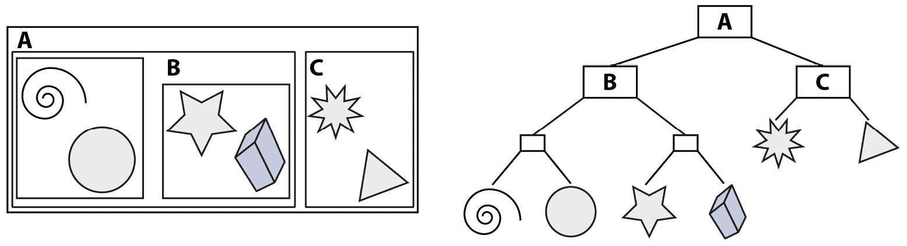
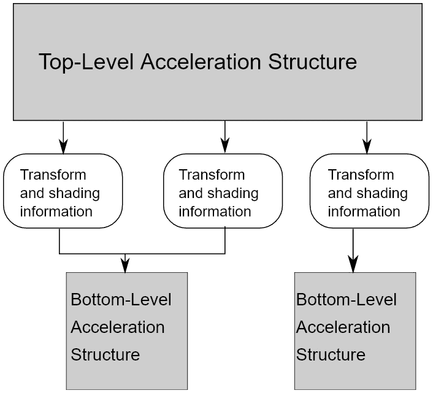
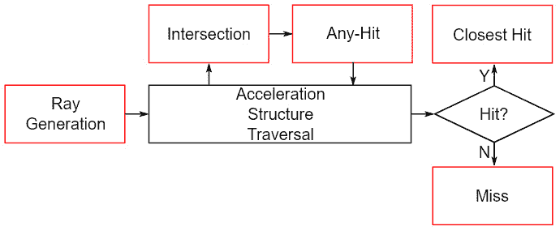
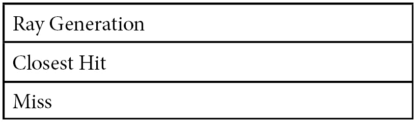

# 第十二章：光线追踪入门

在本章中，我们将光线追踪引入我们的渲染管道。得益于现代 GPU 中光线追踪硬件支持的添加，现在可以将光线追踪技术集成到实时渲染中。

与传统渲染管道相比，光线追踪需要不同的设置，因此我们专门用一整章来设置光线追踪管道。我们将详细介绍如何设置着色器绑定表，以便 API 知道在给定光线交点测试成功或失败时调用哪些着色器。

接下来，我们将解释如何创建**底部级加速结构**（**BLAS**）和**顶部级加速结构**（**TLAS**）。这些**加速结构**（**AS**）用于加速场景光线遍历并确保光线追踪可以以交互式速率进行。

在本章中，我们将涵盖以下主要主题：

+   Vulkan 中光线追踪简介

+   构建 BLAS 和 TLAS

+   定义和创建光线追踪管道

# 技术要求

本章的代码可以在以下 URL 找到：[`github.com/PacktPublishing/Mastering-Graphics-Programming-with-Vulkan/tree/main/source/chapter12`](https://github.com/PacktPublishing/Mastering-Graphics-Programming-with-Vulkan/tree/main/source/chapter12)。

# Vulkan 中光线追踪简介

硬件中的光线追踪支持首次于 2018 年随 NVIDIA RTX 系列推出。最初，Vulkan 中的光线追踪支持仅通过 NVIDIA 扩展提供，但后来，该功能通过 Khronos 扩展得到认可，允许多个供应商支持 Vulkan 中的光线追踪 API。我们专门用一整章来介绍光线追踪管道的设置，因为它需要针对光线追踪的新构造。

与传统渲染管道的第一个不同之处在于需要将我们的场景组织成加速结构。这些结构用于加速场景遍历，因为它们允许我们跳过整个网格，而光线没有机会与之相交。

这些加速结构通常实现为**边界体积层次结构**（**BVH**）。BVH 将场景和单个网格划分为边界框，然后将其组织成树状结构。树的叶节点是唯一包含几何数据的节点，而父节点定义了包含子节点的体积的位置和范围。

以下图像展示了简单场景及其 BVH 表示：



图 12.1 – 左侧的场景示例及其右侧的 BVH 表示（来源：维基百科）

Vulkan API 在 TLAS 和 BLAS 之间做出了进一步的区分。BLAS 包含单个网格定义。然后，这些定义可以组合成一个 TLAS，通过定义它们的变换矩阵，可以在场景中放置多个相同网格的实例。

如下图所示，这是这种组织的示意图：



图 12.2 – 每个 BLAS 可以多次添加到 TLAS 中，具有不同的着色和变换细节（来源：Vulkan 规范）

现在我们已经定义了我们的加速结构，我们可以将注意力转向光线追踪管线。引入光线追踪管线的主要变化是能够在着色器内部调用其他着色器。这是通过定义着色器绑定表来实现的。这些表中的每个槽位定义了以下着色器类型之一：

+   **光线生成**：在传统的光线追踪管线中，这是生成光线的入口点。正如我们将在后面的章节中看到的，光线也可以从片段和计算着色器中生成。

+   **交点**：此着色器允许应用程序实现自定义几何体原语。在 Vulkan 中，我们只能定义三角形和**轴对齐边界框**（**AABB**）。

+   **任何命中**：这是在触发交点着色器之后执行的。其主要用途是确定是否应该进一步处理命中或忽略它。

+   **最近命中**：这是当光线第一次击中原始几何体时触发的着色器。

+   **丢失**：如果光线没有击中任何原始几何体，则触发此着色器。

+   **可调用**：这些是可以从现有着色器中调用的着色器。

流程总结如下图所示：



图 12.3 – 光线追踪管线的着色器流程（来源：Vulkan 规范）

在本节中，我们概述了在 Vulkan API 中实现光线追踪的方法。在下一节中，我们将更详细地探讨如何创建加速结构。

# 构建 BLAS 和 TLAS

如前所述，光线追踪管线需要将几何体组织到加速结构中，以加快场景中光线的遍历。在本节中，我们将解释如何在 Vulkan 中实现这一点。

我们首先在解析场景时创建一个 `VkAccelerationStructureGeometryKHR` 列表。对于每个网格，这个数据结构定义如下：

```cpp
VkAccelerationStructureGeometryKHR geometry{
    VK_STRUCTURE_TYPE_ACCELERATION_STRUCTURE_GEOMETRY_KHR };
geometry.geometryType = VK_GEOMETRY_TYPE_TRIANGLES_KHR;
geometry.flags =  mesh.is_transparent() ? 0 :
    VK_GEOMETRY_OPAQUE_BIT_KHR;
```

每个几何结构可以定义三种类型的条目：三角形、AABB 和实例。我们将在这里使用三角形，因为这是我们定义网格的方式。我们将在定义 TLAS 时使用实例。

以下代码演示了如何使用 `triangles` 结构：

```cpp
geometry.geometry.triangles.sType =
    VK_STRUCTURE_TYPE_ACCELERATION_STRUCTURE_GEOMETRY
        _TRIANGLES_DATA_KHR;
geometry.geometry.triangles.vertexFormat =
    VK_FORMAT_R32G32B32_SFLOAT;
geometry.geometry.triangles.vertexData.deviceAddress =
    renderer->gpu->get_buffer_device_address(
        mesh.position_buffer ) + mesh.position_offset;
geometry.geometry.triangles.vertexStride = sizeof( float )
    * 3;
geometry.geometry.triangles.maxVertex = vertex_count;
geometry.geometry.triangles.indexType = mesh.index_type;
geometry.geometry.triangles.indexData.deviceAddress =
    renderer->gpu->get_buffer_device_address(
        mesh.index_buffer );
```

几何数据定义方式与传统绘制相同：我们需要提供一个顶点和索引缓冲区、顶点步长和顶点格式。原始计数在下一个结构中定义。

最后，我们还需要填充一个 `VkAccelerationStructureBuildRangeInfoKHR` 结构来存储我们的网格的原始定义：

```cpp
VkAccelerationStructureBuildRangeInfoKHR build_range_info{ };
build_range_info.primitiveCount = vertex_count;
build_range_info.primitiveOffset = mesh.index_offset;
```

现在我们已经有了网格的详细信息，我们可以开始构建 BLAS。这是一个两步过程。首先，我们需要查询我们的 AS 需要多少内存。我们通过定义一个 `VkAccelerationStructureBuildGeometryInfoKHR` 结构来实现：

```cpp
VkAccelerationStructureBuildGeometryInfoKHR as_info{
    VK_STRUCTURE_TYPE_ACCELERATION_STRUCTURE_BUILD
        _GEOMETRY_INFO_KHR };
as_info.type =
    VK_ACCELERATION_STRUCTURE_TYPE_BOTTOM_LEVEL_KHR;
as_info.mode =
    VK_BUILD_ACCELERATION_STRUCTURE_MODE_BUILD_KHR;
as_info.geometryCount = scene->geometries.size;
as_info.pGeometries = scene->geometries.data;
```

这些标志告诉 Vulkan API，这个 BLAS 在未来可能会被更新或压缩：

```cpp
as_info.flags =
    VK_BUILD_ACCELERATION_STRUCTURE_ALLOW_UPDATE_BIT_KHR |
        VK_BUILD_ACCELERATION_STRUCTURE_ALLOW
            _COMPACTION_BIT_KHR;
```

在查询 AS 的大小时，我们需要提供一个列表，其中包含每个几何条目中原始数的最大数量：

```cpp
for ( u32 range_index = 0; range_index < scene->
    geometries.size; range_index++ ) {
        max_primitives_count[ range_index ] = scene->
           build_range_infos[ range_index ].primitiveCount;
}
```

现在，我们已经准备好查询我们的 AS 的大小：

```cpp
VkAccelerationStructureBuildSizesInfoKHR as_size_info{
    VK_STRUCTURE_TYPE_ACCELERATION_STRUCTURE_BUILD
        _SIZES_INFO_KHR };
vkGetAccelerationStructureBuildSizesKHR( gpu.vulkan_device,
    VK_ACCELERATION_STRUCTURE_BUILD_TYPE_DEVICE_KHR,
      &as_info, max_primitives_count.data, &as_size_info );
```

在构建 AS 时，我们需要提供两个缓冲区：一个用于实际的 AS 数据，另一个用于构建过程中使用的临时缓冲区。这两个缓冲区的创建方式如下：

```cpp
as_buffer_creation.set(
    VK_BUFFER_USAGE_ACCELERATION_STRUCTURE_STORAGE_BIT_KHR,
        ResourceUsageType::Immutable,
            as_size_info.accelerationStructureSize )
                .set_device_only( true )
                    .set_name( "blas_buffer" );
scene->blas_buffer = gpu.create_buffer(
    as_buffer_creation );
as_buffer_creation.set(
VK_BUFFER_USAGE_STORAGE_BUFFER_BIT |
    VK_BUFFER_USAGE_SHADER_DEVICE_ADDRESS_BIT_KHR,
        ResourceUsageType::Immutable,
            as_size_info.buildScratchSize )
                .set_device_only( true )
                    .set_name( "blas_scratch_buffer" );
BufferHandle blas_scratch_buffer_handle =
    gpu.create_buffer( as_buffer_creation );
```

这与之前多次使用的创建缓冲区代码类似，但有两大关键区别我们要强调：

+   AS 缓冲区需要使用 `VK_BUFFER_USAGE_ACCELERATION_STRUCTURE_STORAGE_BIT_KHR` 使用标志来创建

+   需要使用 `VK_BUFFER_USAGE_SHADER_DEVICE_ADDRESS_BIT_KHR` 来创建临时缓冲区。光线追踪扩展还要求 `VK_KHR_buffer_device_address` 扩展。这允许我们查询给定缓冲区的 GPU 虚拟地址，但它必须使用此使用标志创建。

现在我们已经拥有了创建我们的 BLAS 所需的一切。首先，我们检索我们的 AS 的句柄：

```cpp
VkAccelerationStructureCreateInfoKHR as_create_info{
    VK_STRUCTURE_TYPE_ACCELERATION_STRUCTURE
        _CREATE_INFO_KHR };
as_create_info.buffer = blas_buffer->vk_buffer;
as_create_info.offset = 0;
as_create_info.size =
    as_size_info.accelerationStructureSize;
as_create_info.type =
    VK_ACCELERATION_STRUCTURE_TYPE_BOTTOM_LEVEL_KHR;
vkCreateAccelerationStructureKHR( gpu.vulkan_device,
    &as_create_info, gpu.vulkan_allocation_callbacks,
        &scene->blas );
```

到目前为止，`scene->blas` 仍然只是一个句柄。为了构建我们的加速结构，我们需要填充我们的 `VkAccelerationStructureBuildGeometryInfoKHR` 结构的剩余字段：

```cpp
as_info.dstAccelerationStructure = scene->blas;
as_info.scratchData.deviceAddress =
    gpu.get_buffer_device_address(
        blas_scratch_buffer_handle );
VkAccelerationStructureBuildRangeInfoKHR* blas_ranges[] = {
    scene->build_range_infos.data
};
```

最后，我们记录构建 AS 的命令：

```cpp
vkCmdBuildAccelerationStructuresKHR( gpu_commands->
    vk_command_buffer, 1, &as_info, blas_ranges );
gpu.submit_immediate( gpu_commands );
```

注意我们立即提交了这个命令。这是必需的，因为无法在同一提交中构建 BLAS 和 TLAS，因为 TLAS 依赖于完全构建的 BLAS。

下一步和最后一步是构建 TLAS。过程与之前描述的 BLAS 类似，我们将强调其中的区别。TLAS 通过指定多个 BLAS 的实例来定义，其中每个 BLAS 可以有自己的转换。这与传统的实例化非常相似：我们定义一次几何形状，可以通过简单地改变其转换来多次渲染。

我们首先定义一个 `VkAccelerationStructureInstanceKHR` 结构：

```cpp
VkAccelerationStructureInstanceKHR tlas_structure{ };
tlas_structure.transform.matrix[ 0 ][ 0 ] = 1.0f;
tlas_structure.transform.matrix[ 1 ][ 1 ] = 1.0f;
tlas_structure.transform.matrix[ 2 ][ 2 ] = 1.0f;
tlas_structure.mask = 0xff;
tlas_structure.flags = VK_GEOMETRY_INSTANCE_TRIANGLE_FACING_CULL_DISABLE_BIT_KHR;
tlas_structure.accelerationStructureReference =
    blas_address;
```

如前所述，我们提供了一个 BLAS 引用及其转换。然后我们需要创建一个缓冲区来存储这些数据：

```cpp
as_buffer_creation.reset().set(
    VK_BUFFER_USAGE_ACCELERATION_STRUCTURE
    _BUILD_INPUT_READ_ONLY_BIT_KHR | VK_BUFFER_USAGE_
    SHADER_DEVICE_ADDRESS_BIT,
    ResourceUsageType::Immutable, sizeof(
    VkAccelerationStructureInstanceKHR ) )
    .set_data( &tlas_structure )
    .set_name( "tlas_instance_buffer" );
BufferHandle tlas_instance_buffer_handle =
    gpu.create_buffer( as_buffer_creation );
```

注意到 `VK_BUFFER_USAGE_ACCELERATION_STRUCTURE_BUILD_INPUT_READ_ONLY_BIT_KHR` 使用标志，这是将要用于 AS 构建期间的缓冲区所必需的。

接下来，我们定义一个 `VkAccelerationStructureGeometryKHR` 结构：

```cpp
VkAccelerationStructureGeometryKHR tlas_geometry{
    VK_STRUCTURE_TYPE_ACCELERATION_STRUCTURE_GEOMETRY_KHR };
tlas_geometry.geometryType =
    VK_GEOMETRY_TYPE_INSTANCES_KHR;
tlas_geometry.geometry.instances.sType =
    VK_STRUCTURE_TYPE_ACCELERATION_STRUCTURE
        _GEOMETRY_INSTANCES_DATA_KHR;
tlas_geometry.geometry.instances.arrayOfPointers = false;
tlas_geometry.geometry.instances.data.deviceAddress =
    gpu.get_buffer_device_address(
        tlas_instance_buffer_handle );
```

现在我们已经定义了我们的 TLAS 结构，我们需要查询它的大小。我们不会重复完整的代码，但这里是在创建 BLAS 时与`VkAccelerationStructureBuildGeometryInfoKHR`结构相比的差异：

```cpp
as_info.type =
    VK_ACCELERATION_STRUCTURE_TYPE_TOP_LEVEL_KHR;
as_info.geometryCount = 1;
as_info.pGeometries = &tlas_geometry;
```

在创建 TLAS 的数据和临时缓冲区之后，我们就可以获取 TLAS 句柄了：

```cpp
as_create_info.buffer = tlas_buffer->vk_buffer;
as_create_info.offset = 0;
as_create_info.size =
    as_size_info.accelerationStructureSize;
as_create_info.type =
    VK_ACCELERATION_STRUCTURE_TYPE_TOP_LEVEL_KHR;
vkCreateAccelerationStructureKHR( gpu.vulkan_device,
                                  &as_create_info, 
                                  gpu.vulkan_allocation_
                                     callbacks,
                                  &scene->tlas );
```

最后，我们可以构建我们的 TLAS：

```cpp
as_info.dstAccelerationStructure = scene->tlas;
as_info.scratchData.deviceAddress =
    gpu.get_buffer_device_address(
        tlas_scratch_buffer_handle );
VkAccelerationStructureBuildRangeInfoKHR tlas_range_info{ };
    tlas_range_info.primitiveCount = 1;
VkAccelerationStructureBuildRangeInfoKHR* tlas_ranges[] = {
    &tlas_range_info
};
vkCmdBuildAccelerationStructuresKHR( gpu_commands->
    vk_command_buffer, 1, &as_info, tlas_ranges );
```

如前所述，我们立即提交此命令，以便在开始渲染时 TLAS 已准备好。虽然无法在同一提交中构建 BLAS 和 TLAS，但可以并行创建多个 BLAS 和 TLAS。

我们现在可以将加速结构用于光线追踪了！

在本节中，我们详细介绍了创建 BLAS 和 TLAS 所需的步骤。我们首先记录了我们的几何体的三角形原语。然后我们使用这些数据创建了一个 BLAS 实例，该实例随后被用作 TLAS 的一部分。

在下一节中，我们将定义一个利用这些加速结构的射线追踪管线。

# 定义和创建光线追踪管线

现在我们已经定义了我们的加速结构，我们可以将注意力转向光线追踪管线。正如我们之前提到的，光线追踪着色器与传统图形和计算着色器的工作方式不同。光线追踪着色器被设置为根据着色器绑定表设置调用其他着色器。

如果你熟悉 C++，你可以将此设置视为一种简单的多态形式：射线追踪管线的接口始终相同，但我们可以在运行时动态地覆盖哪些着色器（方法）被调用。我们不需要定义所有入口点。

在这个例子中，例如，我们只定义了光线生成、最近击中和丢失着色器。我们现在忽略任何击中和交点着色器。

如其名所示，着色器绑定表可以以表格形式表示。这是我们将在示例中构建的绑定表：



表格中的顺序很重要，因为这是驱动程序用来告诉 GPU 根据已触发的阶段调用哪个着色器的顺序。

在我们开始构建管线之前，让我们看看我们将要使用的三个示例着色器。我们首先从光线生成着色器开始，它负责生成光线以遍历我们的场景。首先，我们必须启用用于光线追踪的 GLSL 扩展：

```cpp
#extension GL_EXT_ray_tracing : enable
```

接下来，我们必须定义一个将被其他着色器填充的变量：

```cpp
layout( location = 0 ) rayPayloadEXT vec4 payload;
```

我们接下来定义一个统一变量，它将包含对我们的 AS 的引用：

```cpp
layout( binding = 1, set = MATERIAL_SET ) uniform
    accelerationStructureEXT as;
```

最后，我们定义了我们的光线生成调用参数：

```cpp
layout( binding = 2, set = MATERIAL_SET ) uniform rayParams
{
    uint sbt_offset;
    uint sbt_stride;
    uint miss_index;
    uint out_image_index;
};
```

`sbt_offset` 是着色器绑定表中的偏移量，在着色器绑定表中定义了多个同类型的着色器时可以使用。在我们的例子中，这将是一个`0`，因为我们为每个着色器只有一个条目。

`sbt_stride`是绑定表中每个条目的大小。这个值必须通过传递一个`VkPhysicalDeviceRayTracingPipelinePropertiesKHR`结构到`vkGetPhysicalDeviceProperties2`来为每个设备查询。

`miss_index`用于计算 miss 着色器的索引。如果绑定表中存在多个 miss 着色器，则可以使用此功能。在我们的用例中，它将是`0`。

最后，`out_image_index`是我们将要写入的无绑定图像数组中图像的索引。

现在我们已经定义了我们的光线生成着色器的输入和输出，我们可以调用该函数来追踪光线进入场景！

```cpp
traceRayEXT( as, // top level acceleration structure
                gl_RayFlagsOpaqueEXT, // rayFlags
                0xff, // cullMask
                sbt_offset,
                sbt_stride,
                miss_index,
                camera_position.xyz, // origin
                0.0, // Tmin
                compute_ray_dir( gl_LaunchIDEXT,
                gl_LaunchSizeEXT ),
                100.0, // Tmax
                0 // payload
            );
```

第一个参数是我们想要遍历的 TLAS。由于这是`traceRayEXT`函数的参数，我们可以在同一个着色器中将光线投射到多个加速结构中。

`rayFlags`是一个位掩码，它决定了哪些几何体将触发对我们的着色器的回调。在这种情况下，我们只对具有不透明标志的几何体感兴趣。

`cullMask`用于匹配具有相同掩码值的 AS 中的条目。这允许我们定义一个可以用于多个目的的单个 AS。

最后，有效载荷决定了我们在这里定义的光线追踪有效载荷的位置索引。这允许我们多次调用`traceRayEXT`，每次调用使用不同的有效载荷变量。

其他字段都是不言自明的或者之前已经解释过。接下来，我们将更详细地看看如何计算光线方向：

```cpp
vec3 compute_ray_dir( uvec3 launchID, uvec3 launchSize) {
```

光线追踪着色器与计算着色器非常相似，并且，像计算着色器一样，每个调用都有一个 ID。对于光线追踪着色器，这由`gl_LaunchIDEXT`变量定义。同样，`gl_LaunchSizeEXT`定义了总的调用大小。这类似于计算着色器的工作组大小。

在我们的情况下，图像中的每个像素都有一个调用。我们按照以下方式在**归一化设备坐标**（**NDCs**）中计算`x`和`y`：

```cpp
    float x = ( 2 * ( float( launchID.x ) + 0.5 ) / float(
        launchSize.x ) - 1.0 );
    float y = ( 1.0 - 2 * ( float( launchID.y ) + 0.5 ) /
        float( launchSize.y ) );
```

注意，我们必须反转`y`坐标，否则我们的最终图像将会是颠倒的。

最后，我们通过乘以`inverse_view_projection`矩阵来计算我们的世界空间方向：

```cpp
   vec4 dir = inverse_view_projection * vec4( x, y, 1, 1 );
   dir = normalize( dir );
   return dir.xyz;
}
```

一旦`traceRayEXT`返回，有效载荷变量将包含通过其他着色器计算出的值。光线生成的最后一步是将此像素的颜色保存下来：

```cpp
imageStore( global_images_2d[ out_image_index ], ivec2(
    gl_LaunchIDEXT.xy ), payload );
```

现在，我们将查看一个最邻近命中着色器的示例：

```cpp
layout( location = 0 ) rayPayloadInEXT vec4 payload;
void main() {
    payload = vec4( 1.0, 0.0, 0.0, 1.0 );
}
```

与光线生成着色器的主要区别是，现在使用`rayPayloadInEXT`限定符定义了有效载荷。同样重要的是，位置必须与光线生成着色器中定义的位置相匹配。

miss 着色器与之前相同，只是我们使用了不同的颜色来区分两者。

现在我们已经定义了我们的着色器代码，我们可以开始构建我们的管线。编译光线追踪着色器模块的方式与其他着色器相同。主要区别是着色器类型。对于光线追踪，已经添加了以下枚举：

+   `VK_SHADER_STAGE_RAYGEN_BIT_KHR`

+   `VK_SHADER_STAGE_ANY_HIT_BIT_KHR`

+   `VK_SHADER_STAGE_CLOSEST_HIT_BIT_KHR`

+   `VK_SHADER_STAGE_MISS_BIT_KHR`

+   `VK_SHADER_STAGE_INTERSECTION_BIT_KHR`

+   `VK_SHADER_STAGE_CALLABLE_BIT_KHR`

对于光线追踪管道，我们必须填充一个新的`VkRayTracingShaderGroupCreateInfoKHR`结构：

```cpp
shader_group_info.sType =
    VK_STRUCTURE_TYPE_RAY_TRACING_SHADER
        _GROUP_CREATE_INFO_KHR;
shader_group_info.type =
    VK_RAY_TRACING_SHADER_GROUP_TYPE_GENERAL_KHR;
shader_group_info.generalShader = stage index;
shader_group_info.closestHitShader = VK_SHADER_UNUSED_KHR;
shader_group_info.anyHitShader = VK_SHADER_UNUSED_KHR;
shader_group_info.intersectionShader =
    VK_SHADER_UNUSED_KHR;
```

在这个例子中，我们定义了一个通用着色器，它可以是一个生成、丢失或可调用着色器。在我们的情况下，我们定义了我们的射线生成着色器。正如你所见，在同一组条目内也可以定义其他着色器。我们决定为每种着色器类型设置单独的条目，因为它使我们构建着色器绑定表时具有更大的灵活性。

其他着色器类型以类似方式定义，我们在此不再重复。作为一个快速示例，以下是定义最近击中着色器的方法：

```cpp
shader_group_info.type =
    VK_RAY_TRACING_SHADER_GROUP_TYPE
        _TRIANGLES_HIT_GROUP_KHR;
shader_group_info.closestHitShader = stage_index;
```

现在我们已经定义了着色器组，我们可以创建我们的管道对象：

```cpp
VkRayTracingPipelineCreateInfoKHR pipeline_info{
    VK_STRUCTURE_TYPE_RAY_TRACING_PIPELINE_CREATE_INFO_KHR };
pipeline_info.stageCount = shader_state_data->
    active_shaders;
pipeline_info.pStages = shader_state_data->
    shader_stage_info;
pipeline_info.groupCount = shader_state_data->
    active_shaders;
pipeline_info.pGroups = shader_state_data->
    shader_group_info;
pipeline_info.maxPipelineRayRecursionDepth = 1;
pipeline_info.layout = pipeline_layout;
vkCreateRayTracingPipelinesKHR( vulkan_device,
    VK_NULL_HANDLE, pipeline_cache, 1, &pipeline_info,
        vulkan_allocation_callbacks, &pipeline->vk_pipeline );
pipeline->vk_bind_point =
    VkPipelineBindPoint::VK_PIPELINE
        _BIND_POINT_RAY_TRACING_KHR;
```

注意`maxPipelineRayRecursionDepth`字段。它决定了在递归调用`rayTraceEXT`函数时最大调用栈的数量。这对于编译器确定此管道在运行时可能使用的内存量是必需的。

我们省略了`pLibraryInfo`和`pLibraryInterface`字段，因为我们没有使用它们。多个光线追踪管道可以组合在一起创建一个更大的程序，类似于在 C++中链接多个对象。这可以帮助减少光线追踪管道的编译时间，因为单个组件只需要编译一次。

最后一步是创建我们的着色器绑定表。我们首先计算我们的表所需的尺寸：

```cpp
u32 group_handle_size =
    ray_tracing_pipeline_properties.shaderGroupHandleSize;
sizet shader_binding_table_size = group_handle_size *
    shader_state_data->active_shaders;
```

我们只需将句柄大小乘以我们表中条目的数量。

接下来，我们调用`vkGetRayTracingShaderGroupHandlesKHR`来获取光线追踪管道中的组句柄：

```cpp
Array<u8> shader_binding_table_data{ };
shader_binding_table_data.init( allocator,
    shader_binding_table_size, shader_binding_table_size );
vkGetRayTracingShaderGroupHandlesKHR( vulkan_device,
    pipeline->vk_pipeline, 0, shader_state_data->
        active_shaders, shader_binding_table_size,
            shader_binding_table_data.data );
```

一旦我们有了着色器组句柄，我们就可以将它们组合起来为每种着色器类型创建单独的表。它们存储在单独的缓冲区中：

```cpp
BufferCreation shader_binding_table_creation{ };
shader_binding_table_creation.set(
    VK_BUFFER_USAGE_SHADER_BINDING_TABLE_BIT_KHR |
    VK_BUFFER_USAGE_SHADER_DEVICE_ADDRESS_BIT_KHR,
    ResourceUsageType::Immutable, group_handle_size
    ).set_data( shader_binding_table_data.data
    ).set_name(  "shader_binding_table_raygen" );
pipeline->shader_binding_table_raygen = create_buffer(
    shader_binding_table_creation );
shader_binding_table_creation.set_data(
    shader_binding_table_data.data + group_handle_size )
        .set_name( "shader_binding_table_hit" );
pipeline->shader_binding_table_hit = create_buffer(
    shader_binding_table_creation );
shader_binding_table_creation.set_data(
    shader_binding_table_data.data + ( group_handle_size *
        2 ) ).set_name( "shader_binding_table_miss" );
pipeline->shader_binding_table_miss = create_buffer(
    shader_binding_table_creation );
```

每个表中只有一个条目，所以我们只需将每个组句柄复制到其缓冲区中。请注意，该缓冲区必须使用`VK_BUFFER_USAGE_SHADER_BINDING_TABLE_BIT_KHR`使用标志创建。

这就完成了我们的光线追踪管道创建。剩下要做的就是实际使用它来生成图像！这是通过以下代码实现的：

```cpp
u32 shader_group_handle_size = gpu_device->
    ray_tracing_pipeline_properties.shaderGroupHandleSize;
VkStridedDeviceAddressRegionKHR raygen_table{ };
raygen_table.deviceAddress = gpu_device->
    get_buffer_device_address( pipeline->
        shader_binding_table_raygen );
raygen_table.stride = shader_group_handle_size;
raygen_table.size = shader_group_handle_size;
VkStridedDeviceAddressRegionKHR hit_table{ };
hit_table.deviceAddress = gpu_device->
    get_buffer_device_address( pipeline->
        shader_binding_table_hit );
VkStridedDeviceAddressRegionKHR miss_table{ };
miss_table.deviceAddress = gpu_device->
    get_buffer_device_address( pipeline->
        shader_binding_table_miss );
VkStridedDeviceAddressRegionKHR callable_table{ };
vkCmdTraceRaysKHR( vk_command_buffer, &raygen_table,
    &miss_table, &hit_table, &callable_table, width,
        height, depth );
```

我们为每个着色器绑定表定义`VkStridedDeviceAddressRegionKHR`。我们使用之前创建的表缓冲区。请注意，即使我们不使用它们，我们仍然需要为可调用着色器定义一个表。`width`、`height`和`depth`参数决定了我们的光线追踪着色器的调用大小。

在本节中，我们说明了如何创建和使用光线追踪管道。我们首先定义了我们的着色器绑定表的组织结构。接下来，我们查看了一个基本的射线生成和最近击中着色器。然后，我们展示了如何创建光线追踪管道对象以及如何检索着色器组句柄。

这些句柄随后被用来填充我们的着色器绑定表的缓冲区。最后，我们演示了如何将这些组件组合起来以调用我们的光线追踪管线。

# 摘要

在本章中，我们提供了如何在 Vulkan 中使用光线追踪的详细信息。我们首先解释了两个基本概念：

+   **加速结构**：这些结构是加快场景遍历所必需的。这对于实现实时结果至关重要。

+   **着色器绑定表**：光线追踪管线可以调用多个着色器，这些表用于告诉 API 在哪个阶段使用哪个着色器。

在下一节中，我们提供了创建 TLAS 和 BLAS 的实现细节。我们首先记录组成我们的网格的几何体列表。接下来，我们使用这个列表来创建一个 BLAS。每个 BLAS 可以在 TLAS 中实例化多次，因为每个 BLAS 实例定义了自己的变换。有了这些数据，我们就可以创建我们的 TLAS。

在第三和最后一节中，我们解释了如何创建光线追踪管线。我们从创建单个着色器类型开始。接下来，我们展示了如何将这些单个着色器组合成一个光线追踪管线，以及如何从一个给定的管线生成着色器绑定表。

然后，我们展示了如何编写一个简单的光线生成着色器，该着色器与最近命中着色器和丢失着色器一起使用。最后，我们演示了如何将这些组件组合起来以在我们的场景中追踪光线。

在下一章中，我们将利用本章的所有知识来实现光线追踪阴影！

# 进一步阅读

和往常一样，我们只提供了如何使用 Vulkan API 的最相关细节。我们建议您阅读 Vulkan 规范以获取更多详细信息。以下是相关部分列表：

+   [`registry.khronos.org/vulkan/specs/1.3-extensions/html/vkspec.xhtml#pipelines-ray-tracing`](https://registry.khronos.org/vulkan/specs/1.3-extensions/html/vkspec.xhtml#pipelines-ray-tracing)

+   [`registry.khronos.org/vulkan/specs/1.3-extensions/html/vkspec.xhtml#interfaces-raypipeline`](https://registry.khronos.org/vulkan/specs/1.3-extensions/html/vkspec.xhtml#interfaces-raypipeline)

+   [`registry.khronos.org/vulkan/specs/1.3-extensions/html/vkspec.xhtml#acceleration-structure`](https://registry.khronos.org/vulkan/specs/1.3-extensions/html/vkspec.xhtml#acceleration-structure)

+   [`registry.khronos.org/vulkan/specs/1.3-extensions/html/vkspec.xhtml#ray-tracing`](https://registry.khronos.org/vulkan/specs/1.3-extensions/html/vkspec.xhtml#ray-tracing)

这个网站提供了关于加速结构的更多详细信息：[`www.scratchapixel.com/lessons/3d-basic-rendering/introduction-acceleration-structure/introduction`](https://www.scratchapixel.com/lessons/3d-basic-rendering/introduction-acceleration-structure/introduction)。

在线关于实时光线追踪的资源非常丰富。这仍然是一个新兴领域，并且正在持续研究中。以下这两本免费书籍提供了良好的起点：

+   [`www.realtimerendering.com/raytracinggems/rtg/index.xhtml`](http://www.realtimerendering.com/raytracinggems/rtg/index.xhtml)

+   [`www.realtimerendering.com/raytracinggems/rtg2/index.xhtml`](http://www.realtimerendering.com/raytracinggems/rtg2/index.xhtml)
