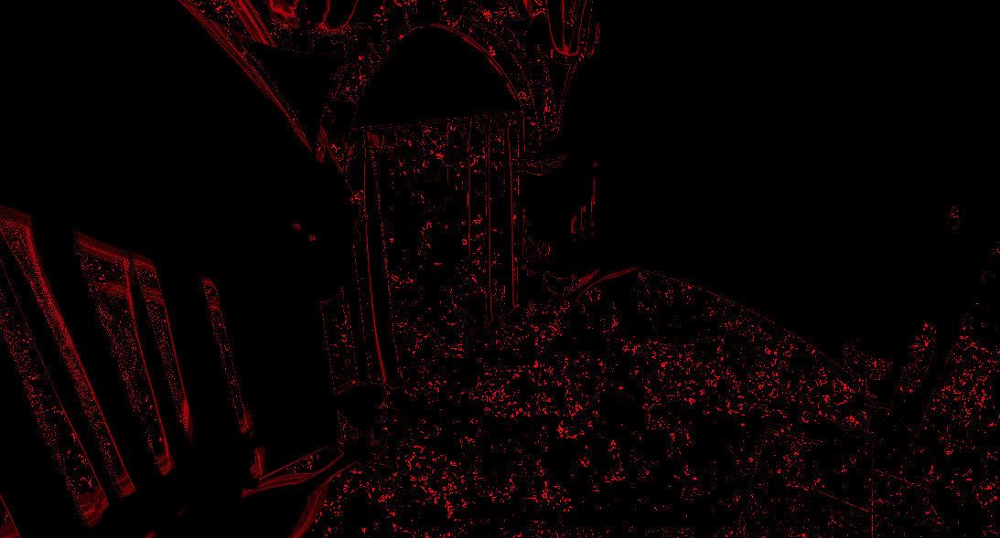
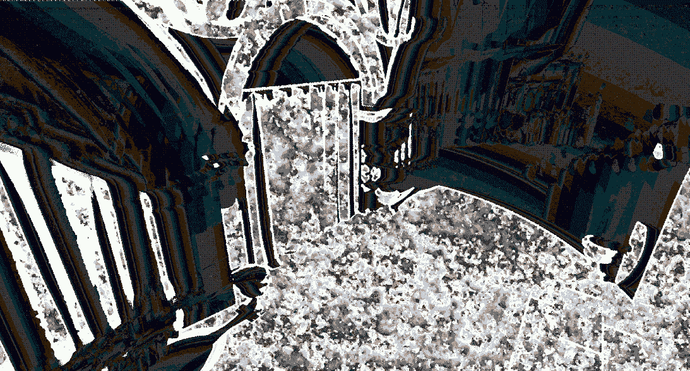
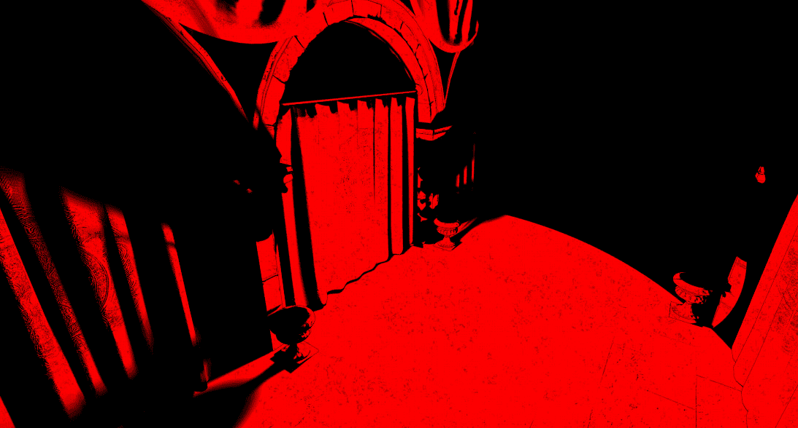

# 重新审视使用光线追踪的阴影

在本章中，我们将使用**光线追踪**来实现阴影效果。在*第八章*中，*使用网格着色器添加阴影*，我们使用了传统的阴影映射技术来获取每个光源的可见性，并使用这些信息来计算最终图像的阴影项。使用光线追踪来实现阴影可以让我们获得更详细的结果，并且可以根据每个光源的距离和强度对结果的质量进行更精细的控制。

我们将实现两种技术：第一种技术与离线渲染中使用的类似，即向每个光源发射光线以确定可见性。虽然这种方法可以给我们带来最佳结果，但它可能相当昂贵，这取决于场景中光源的数量。

第二种技术基于**《光线追踪宝石》**中的一篇最新文章。我们使用一些启发式方法来确定每个光源需要发射多少条光线，并将结果与空间和时间滤波器结合，以使结果稳定。

在本章中，我们将涵盖以下主要主题：

+   实现简单的基于光线追踪的阴影

+   实现基于光线追踪的阴影的高级技术

# 技术要求

到本章结束时，你将学会如何实现基本的基于光线追踪的阴影效果。你还将熟悉一种更高级的技术，它能够渲染带有柔和阴影的多光源。

本章的代码可以在以下 URL 找到：[`github.com/PacktPublishing/Mastering-Graphics-Programming-with-Vulkan/tree/main/source/chapter13`](https://github.com/PacktPublishing/Mastering-Graphics-Programming-with-Vulkan/tree/main/source/chapter13)。

# 实现简单的基于光线追踪的阴影

正如我们在引言中提到的，阴影映射技术多年来一直是实时渲染的基石。在 GPU 引入光线追踪功能之前，使用其他技术成本太高。

这并没有阻止图形社区想出聪明的解决方案来提高结果的质量，同时保持低成本。传统技术的主要问题是它们基于从每个光源的角度捕获深度缓冲区。这对于靠近光源和摄像机的物体来说效果很好，但随着我们远离，深度不连续性会导致最终结果中出现伪影。

解决这个问题的方法包括对结果进行滤波——例如，使用**百分比更近滤波**（**PCF**）或**级联阴影映射**（**CSM**）。这种技术需要捕获多个深度**切片**——级联以保持足够的分辨率，当我们远离光源时。这通常仅用于日光，因为它可能需要大量的内存和时间来多次重新渲染场景。它也可能很难在级联的边界处获得良好的结果。

阴影映射的另一个主要问题是，由于深度缓冲区的分辨率和它引入的不连续性，可能难以获得硬阴影。我们可以通过光线追踪来缓解这些问题。离线渲染已经使用了多年光线和路径追踪来实现照片级效果，包括阴影。

当然，他们有等待数小时或数天才能完成单个帧的奢侈，但我们可以实时获得类似的结果。在前一章中，我们使用了`vkCmdTraceRaysKHR`命令将射线投射到场景中。

对于这个实现，我们引入了射线查询，它允许我们从片段和计算着色器遍历我们设置的加速结构。

我们将修改我们的光照传递中的`calculate_point_light_contribution`方法，以确定每个片段可以看到哪些光源，并确定最终的阴影项。

首先，我们需要启用`VK_KHR_ray_query`设备扩展。我们还需要启用相关的着色器扩展：

```cpp
#extension GL_EXT_ray_query : enable
```

然后，我们不是从每个光源的视角计算立方体贴图，而是简单地从片段世界位置向每个光源发射射线。

我们首先初始化一个`rayQueryEXT`对象：

```cpp
rayQueryEXT rayQuery;
rayQueryInitializeEXT(rayQuery, as, gl_RayFlagsOpaqueEXT |
    gl_RayFlagsTerminateOnFirstHitEXT, 0xff,
        world_position, 0.001, l, d);
```

注意`gl_RayFlagsTerminateOnFirstHitEXT`参数，因为我们对这个射线只对第一次命中感兴趣。"l"是从`world_position`到光源的方向，我们使用从射线原点的小偏移量来避免自相交。

最后一个参数`d`是从`world_position`到灯光位置的距离。指定这个值很重要，因为否则射线查询可能会报告超过灯光位置的交点，我们可能会错误地将一个片段标记为处于阴影中。

现在我们已经初始化了射线查询对象，我们调用以下方法来开始场景遍历：

```cpp
rayQueryProceedEXT( rayQuery );
```

这将在找到命中点或射线终止时返回。当使用射线查询时，我们不需要指定着色器绑定表。为了确定射线遍历的结果，我们可以使用几种方法来查询结果。在我们的情况下，我们只想知道射线是否击中了任何几何体：

```cpp
if ( rayQueryGetIntersectionTypeEXT( rayQuery, true ) ==
    gl_RayQueryCommittedIntersectionNoneEXT ) {
        shadow = 1.0;
}
```

如果不是，这意味着我们可以从这个片段看到我们正在处理的灯光，我们可以在最终计算中考虑这个灯光的贡献。我们对每个灯光重复此操作以获得总的阴影项。

虽然这个实现非常简单，但它主要适用于点光源。对于其他类型的灯光——例如面光源——我们需要发射多根射线来确定可见性。随着光源数量的增加，使用这种简单技术可能会变得过于昂贵。

在本节中，我们演示了一个简单的实现，以开始实时光线追踪阴影。在下一节中，我们将介绍一种新的技术，它具有更好的扩展性，可以支持多种类型的灯光。

# 改进光线追踪阴影

在上一节中，我们描述了一个可以用来计算场景中可见性项的简单算法。正如我们提到的，这在大规模灯光和不同类型灯光需要大量样本的情况下扩展性不好。

在本节中，我们将实现一个受《Ray Tracing Gems》书中“Ray Traced Shadows”文章启发的不同算法。正如在本章和即将到来的章节中常见的那样，主要思想是将计算成本分散到时间上。

这仍然可能导致结果噪声，因为我们仍在使用低样本数。为了达到我们想要的质量，我们将利用空间和时间滤波，类似于我们在*第十一章*中做的，*时间反走样*。

该技术通过三个过程实现，我们还将利用运动向量。现在我们将详细解释每个过程。

## 运动向量

正如我们在*第十一章*中看到的，*时间反走样*，运动向量是确定给定片段中的物体在帧之间移动多远所必需的。我们需要这些信息来确定我们计算中要保留和丢弃哪些信息。这有助于我们避免最终图像中的鬼影伪影。

对于本章的技术，我们需要以不同于**时间反走样**（**TAA**）的方式计算运动向量。我们首先计算两帧之间深度的比例差异：

```cpp
float depth_diff = abs( 1.0 - ( previous_position_ndc.z /
    current_position_ndc.z ) );
```

接下来，我们计算一个 epsilon 值，该值将用于确定可接受的深度变化：

```cpp
float c1 = 0.003;
float c2 = 0.017;
float eps = c1 + c2 * abs( view_normal.z );
```

最后，我们使用这两个值来决定重投影是否成功：

```cpp
vec2 visibility_motion = depth_diff < eps ? vec2(
    current_position_ndc.xy - previous_position_ndc.xy ) :
        vec2( -1, -1 );
```

下图显示了这一计算的结果：


图 13.1 – 运动向量的纹理

我们将把这个值存储在一个纹理中，以供以后使用。下一步是计算过去四帧的可见性变化。

## 计算可见性方差

这种技术使用过去四帧的数据来确定每个片段每个光所需的样本数。我们将`可见性`值存储在一个 3D RGBA16 纹理中，其中每个通道是前几帧的`可见性`值。每一层存储单个光的可见性历史。

这是第一个使用 3D 调度大小的计算着色器之一。值得强调的是`dispatch`调用：

```cpp
gpu_commands->dispatch( x, y, render_scene->active_lights );
```

在这个过程中，我们只是计算过去四帧中的最小值和最大值之间的差异：

```cpp
vec4 last_visibility_values = texelFetch(
    global_textures_3d[ visibility_cache_texture_index ],
        tex_coord, 0 );
float max_v = max( max( max( last_visibility_values.x,
    last_visibility_values.y ), last_visibility_values.z ),
        last_visibility_values.w );
float min_v = min( min( min( last_visibility_values.x,
    last_visibility_values.y ), last_visibility_values.z ),
        last_visibility_values.w );
float delta = max_v - min_v;
```

在第一帧中，历史值被设置为`0`。我们将增量存储在另一个 3D 纹理中，以便在下一轮中使用。下图显示了这一轮的结果：



图 13.2 – 过去四帧的可见性变化

## 计算可见性

这一次传递负责根据过去四帧的方差计算每个光需要发射多少光线。

这一次传递需要从不同的纹理中读取大量数据。我们将使用**局部数据存储（LDS**）来缓存一个着色器调用内所有线程的值：

```cpp
local_image_data[ local_index.y ][ local_index.x ] =
    texelFetch( global_textures_3d[ variation_texture_index
        ], global_index, 0 ).r;
```

正如我们在*第九章*中解释的，*实现可变率着色*，我们需要小心同步这些写入，通过在访问存储在`local_image_data`中的数据之前放置一个`barrier()`调用。同样，我们还需要填充矩阵边缘的值。代码与之前相同，我们在这里不会重复它。

接下来，我们将对这些数据进行滤波，使其更具时间稳定性。第一步是在一个 5x5 区域内计算最大值，并将结果存储在另一个 LDS 矩阵中：

```cpp
local_max_image_data[ local_index.y ][ local_index.x ] =
    max_filter( local_index );
```

`max_filter`的实现如下：

```cpp
for ( int y = -2; y <= 2; ++y  ) {
    for ( int x = -2; x <= 2; ++x ) {
        ivec2 xy = index.xy + ivec2( x, y );
        float v = local_image_data[ xy.y ][ xy.x ];
        max_v = max( max_v, v );
    }
}
```

在计算了`max`值之后，我们将它们通过一个 13x13 的帐篷滤波器：

```cpp
float spatial_filtered_value = 0.0;
for ( int y = -6; y <= 6; ++y ) {
    for ( int x = -6; x <= 6; ++x ) {
        ivec2 index = local_index.xy + ivec2( x, y );
        float v = local_max_image_data[ index.y ][ index.x
        ];
        float f = tent_kernel[ y + 6 ][ x + 6 ];
        spatial_filtered_value += v * f;
    }
}
```

这样做是为了平滑相邻片段之间的差异，同时仍然给正在处理的片段更多的权重。然后我们将这个值与时间数据结合起来：

```cpp
vec4 last_variation_values = texelFetch(
    global_textures_3d[ variation_cache_texture_index ],
        global_index, 0 );
float filtered_value = 0.5 * ( spatial_filtered_value +
   0.25 * ( last_variation_values.x +
          last_variation_values.y +
          last_variation_values.z +
          last_variation_values.w ) );
```

在继续之前，我们更新下一帧的变差缓存：

```cpp
last_variation_values.w = last_variation_values.z;
last_variation_values.z = last_variation_values.y;
last_variation_values.y = last_variation_values.x;
last_variation_values.x = texelFetch( global_textures_3d[
    variation_texture_index ], global_index, 0 ).r;
```

我们现在利用刚刚获得的数据来计算可见性项。首先，我们需要确定样本计数。如果前一次传递中的重投影失败，我们简单地使用最大的样本计数：

```cpp
uint sample_count = MAX_SHADOW_VISIBILITY_SAMPLE_COUNT;
if ( motion_vectors_value.r != -1.0 ) {
```

如果重投影成功，我们得到最后一帧的样本计数，并确定样本计数在过去四帧中是否稳定：

```cpp
    sample_count = sample_count_history.x;
    bool stable_sample_count = 
      ( sample_count_history.x == sample_count_history.y ) &&
      ( sample_count_history.x == sample_count_history.z ) &&
      ( sample_count_history.x == sample_count_history.w );
```

然后，我们将这些信息与我们之前计算出的滤波值结合起来，以确定这一帧的样本计数：

```cpp
    float delta = 0.2;
    if ( filtered_value > delta && sample_count <
        MAX_SHADOW_VISIBILITY_SAMPLE_COUNT ) {
            sample_count += 1;
    } else if ( stable_sample_count &&
          sample_count >= 1 ) {
              sample_count -= 1;
      }
```

如果滤波值超过一个给定的阈值，我们将增加样本计数。这意味着我们在过去四帧中识别出高方差值，我们需要更多的样本来收敛到一个更好的结果。

如果相反，样本计数在过去四帧中保持稳定，我们将减少样本计数。

虽然这在实践中效果很好，但如果场景稳定（例如，当相机不移动时），样本计数可能会达到`0`。这会导致一个未照亮的场景。因此，如果过去四帧的样本计数也为`0`，我们强制样本计数为`1`：

```cpp
    bvec4 hasSampleHistory = lessThan(
        sample_count_history, uvec4( 1 ) );
    bool zeroSampleHistory = all( hasSampleHistory );
    if ( sample_count == 0 && zeroSampleHistory ) {
        sample_count = 1;
    }
}
```

下面是样本计数缓存纹理的一个示例：



图 13.3 – 样本计数缓存纹理

注意到看到光的片段通常需要更多的样本，这是预期的。

现在我们知道了需要多少样本，我们可以继续计算`可见性`值：

```cpp
float visibility = 0.0;
if ( sample_count > 0 ) {
    // world position and normal are computed the same as
       before
    visibility = get_light_visibility(
       gl_GlobalInvocationID.z, sample_count,
       pixel_world_position, normal, frame_index );
}
```

`get_light_visibility`是追踪场景中光线的方法。它的实现如下：

```cpp
const vec3 position_to_light = light.world_position –
    world_position;
const vec3 l = normalize( position_to_light );
const float NoL = clamp(dot(normal, l), 0.0, 1.0);
float d = sqrt( dot( position_to_light, position_to_light ) );
```

我们首先计算一些参数，就像我们之前为我们的光照实现所做的那样。此外，我们计算`d`，即这个片段的世界位置与正在处理的光之间的距离。

接下来，我们仅在光线足够接近且不在该片段的几何体后面时，才通过场景追踪光线。这是通过以下代码实现的：

```cpp
float visiblity = 0.0;
float attenuation =
    attenuation_square_falloff(position_to_light,
        1.0f / light.radius);
const float scaled_distance = r / d;
if ( ( NoL > 0.001f ) && ( d <= r ) && ( attenuation >
    0.001f ) ) {
```

然后，我们为每个样本追踪一条光线。为了确保结果随时间收敛，我们通过使用预先计算的泊松盘来计算光线方向：

```cpp
    for ( uint s = 0; s < sample_count; ++s ) {
        vec2 poisson_sample = POISSON_SAMPLES[ s *
            FRAME_HISTORY_COUNT + frame_index ];
        vec3 random_dir = normalize( vec3( l.x +
            poisson_sample.x, l.y + poisson_sample.y, l.z )
            );
        vec3 random_x = x_axis * poisson_sample.x *
            (scaled_distance) * 0.01;
        vec3 random_y = y_axis * poisson_sample.y *
            (scaled_distance) * 0.01;
        vec3 random_dir = normalize(l + random_x +
            random_y);
```

现在我们已经计算了我们的光线方向，我们可以开始光线遍历：

```cpp
        rayQueryEXT rayQuery;
        rayQueryInitializeEXT(rayQuery, as,
           gl_RayFlagsOpaqueEXT |
           gl_RayFlagsTerminateOnFirstHitEXT,
           0xff, world_position, 0.001,
           random_dir, d);
        rayQueryProceedEXT( rayQuery );
```

这段代码与我们第一部分中展示的代码非常相似，但在这个案例中，我们累计光线可见的每个方向上的`visibility`值：

```cpp
        if (rayQueryGetIntersectionTypeEXT(rayQuery, true)
            != gl_RayQueryCommittedIntersectionNoneEXT) {
                visibility +=
                    rayQueryGetIntersectionTEXT(rayQuery,
                        true) < d ? 0.0f : 1.0f;
        }
        else {
            visiblity += 1.0f;
        }
    }
}
```

最后，我们返回计算出的`visibility`值的平均值：

```cpp
return visiblity / float( sample_count );
```

现在我们有了这一帧的`visibility`值，我们需要更新我们的可见性历史缓存。如果重投影成功，我们只需添加新值：

```cpp
vec4 last_visibility_values = vec4(0);
if ( motion_vectors_value.r != -1.0 ) {
    last_visibility_values = texelFetch(
        global_textures_3d[ visibility_cache_texture_index
            ], global_index, 0 );
    last_visibility_values.w = last_visibility_values.z;
    last_visibility_values.z = last_visibility_values.y;
    last_visibility_values.y = last_visibility_values.x;
```

如果，另一方面，重投影失败，我们用新的`visibility`值覆盖所有`history`条目：

```cpp
} else {
    last_visibility_values.w = visibility;
    last_visibility_values.z = visibility;
    last_visibility_values.y = visibility;
}
last_visibility_values.x = visibility;
```

最后一步是更新样本计数缓存：

```cpp
sample_count_history.w = sample_count_history.z;
sample_count_history.z = sample_count_history.y;
sample_count_history.y = sample_count_history.x;
sample_count_history.x = sample_count;
```

现在我们已经更新了这一帧的可见性项并更新了所有缓存，我们可以移动到最后一个遍历并计算用于光照计算的滤波可见性。

## 计算滤波可见性

如果我们使用上一节计算出的`visibility`值，输出将会非常嘈杂。对于每一帧，我们可能会有不同的样本数和样本位置，尤其是如果相机或物体在移动。

由于这个原因，在我们能够使用它之前，我们需要*清理*结果。一种常见的方法是使用去噪器。去噪器通常实现为一系列计算遍历，正如其名所示，将尽可能减少噪声。去噪器可能需要相当长的时间，特别是当分辨率增加时。

在我们的情况下，我们将使用一个简单的时域和空域滤波器来减少这种技术所需的时间。与之前的遍历一样，我们首先需要将数据读入 LDS。这是通过以下两行代码实现的：

```cpp
local_image_data[ local_index.y ][ local_index.x ] =
    visibility_temporal_filter( global_index );
local_normal_data[ local_index.y ][ local_index.x ] =
    get_normal( global_index );
```

`visibility_temporal_filter`的实现如下：

```cpp
vec4 last_visibility_values = texelFetch(
    global_textures_3d[ visibility_cache_texture_index ],
        ivec3( xy, index.z ), 0 );
float filtered_visibility = 0.25 * (
    last_visibility_values.x + last_visibility_values.y +
    last_visibility_values.z + last_visibility_values.w );
```

我们首先读取给定光在此片段的历史可见性数据，并简单地计算平均值。这是我们的时间滤波器。根据您的用例，您可能使用不同的加权函数，给予较近的值更多的重视。

对于空域滤波，我们将使用高斯核。原始文章使用根据可见性方差可变大小的核。在我们的实现中，我们决定使用固定的 5x5 高斯核，因为它提供了足够好的结果。

计算滤波值的循环实现如下：

```cpp
vec3 p_normal = local_normal_data[ local_index.y ][
    local_index.x ];
```

首先，我们将法线存储在我们的片段位置。然后我们遍历核大小来计算最终项：

```cpp
for ( int y = -2; y <= 2; ++y ) {
    for ( int x = -2; x <= 2; ++x ) {
        ivec2 index = local_index.xy + ivec2( x, y );
        vec3 q_normal = local_normal_data[ local_index.y +
            y ][ local_index.x + x ];
        if ( dot( p_normal, q_normal ) <= 0.9 ) {
            continue;
        }
```

如文章所述，如果相邻片段的法线发散，我们忽略这个数据点。这样做是为了防止阴影泄露。

最后，我们将已经通过时间滤波器的值与核值相结合：

```cpp
        float v = local_image_data[ index.y ][ index.x ];
        float k = gaussian_kernel[ y + 2 ][ x + 2 ];
        spatial_filtered_value += v * k;
    }
}
```

下一个图展示了过滤后的可见性纹理的内容：



图 13.4 – 过滤后的可见性纹理

这就完成了每个灯光的`可见性`值的计算。现在，我们可以使用这些信息在我们的光照过程中，如下一节所述。

## 使用过滤后的可见性

使用我们的`可见性`项非常简单。在`calculate_point_light_contribution`方法中，我们只需读取在前几步中计算出的可见性：

```cpp
float shadow = texelFetch( global_textures_3d[
    shadow_visibility_texture_index ], ivec3( screen_uv,
        shadow_light_index ), 0 ).r;
float attenuation =
    attenuation_square_falloff(position_to_light, 1.0f /
        light.radius) * shadow;
if ( attenuation > 0.0001f && NoL > 0.0001f ) {
// same code as before
```

可能可以将传统的阴影映射与类似于我们在这里描述的射线追踪实现相结合。这完全取决于该技术的帧预算、场景中的灯光类型以及期望的质量。

在本节中，我们提出了射线追踪阴影的不同实现方法。第一步是计算并存储过去四帧的可见性方差。接下来，我们使用`max`滤波器后跟帐篷滤波器来计算每个片段和每个灯光的样本计数。

然后，我们使用这个样本计数将射线追踪到场景中，以确定一个原始的`可见性`值。在最后一遍中，我们将这个`可见性`值通过时间和空间滤波器来减少噪声。最后，我们使用这个过滤后的值在我们的光照计算中。

# 摘要

在本章中，我们介绍了射线追踪阴影的两个实现方法。在第一部分，我们提供了一个类似于你可能在离线渲染器中找到的简单实现。我们简单地针对每个片段向每个灯光发射一束射线，以确定从该位置是否可见。

虽然这对于点光源来说效果很好，但要支持其他灯光类型并渲染软阴影，则需要许多射线。因此，我们还提供了一个替代方案，该方案利用空间和时间信息来确定每个灯光需要使用多少样本。

我们首先计算过去四帧的可见性方差。然后，我们过滤这个值以确定每个灯光对每个片段需要发射多少射线。我们使用这个计数来遍历场景并确定每个片段的`可见性`值。最后，我们过滤我们获得的可见性以减少噪声。过滤后的可见性随后用于光照计算以确定最终的阴影项。

在下一章中，我们将通过实现全局光照来继续我们的射线追踪之旅！

# 进一步阅读

本章中我们实现的技术在《光线追踪宝石》一书的第十三章“用光线追踪重新审视阴影”中有详细描述。该书可在以下链接免费获取：[`www.realtimerendering.com/raytracinggems/rtg/index.xhtml`](http://www.realtimerendering.com/raytracinggems/rtg/index.xhtml).

我们只使用了可用于光线追踪的 GLSL API 的有限集合。我们建议阅读 GLSL 扩展规范以查看所有可用的选项：

+   [`github.com/KhronosGroup/GLSL/blob/master/extensions/ext/GLSL_EXT_ray_tracing.txt`](https://github.com/KhronosGroup/GLSL/blob/master/extensions/ext/GLSL_EXT_ray_tracing.txt)

+   [`github.com/KhronosGroup/GLSL/blob/master/extensions/ext/GLSL_EXT_ray_query.txt`](https://github.com/KhronosGroup/GLSL/blob/master/extensions/ext/GLSL_EXT_ray_query.txt)

在本章中，我们使用了几个过滤器。信号处理是一个广阔而精彩的领域，它在图形编程中的应用比人们意识到的要多。为了帮助您入门，我们推荐 Bart Wronski 的这篇文章：[`bartwronski.com/2021/02/15/bilinear-down-upsampling-pixel-grids-and-that-half-pixel-offset/`](https://bartwronski.com/2021/02/15/bilinear-down-upsampling-pixel-grids-and-that-half-pixel-offset/).
