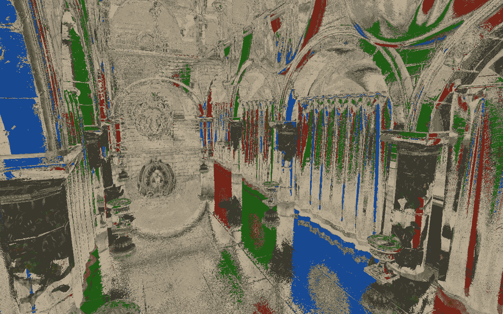
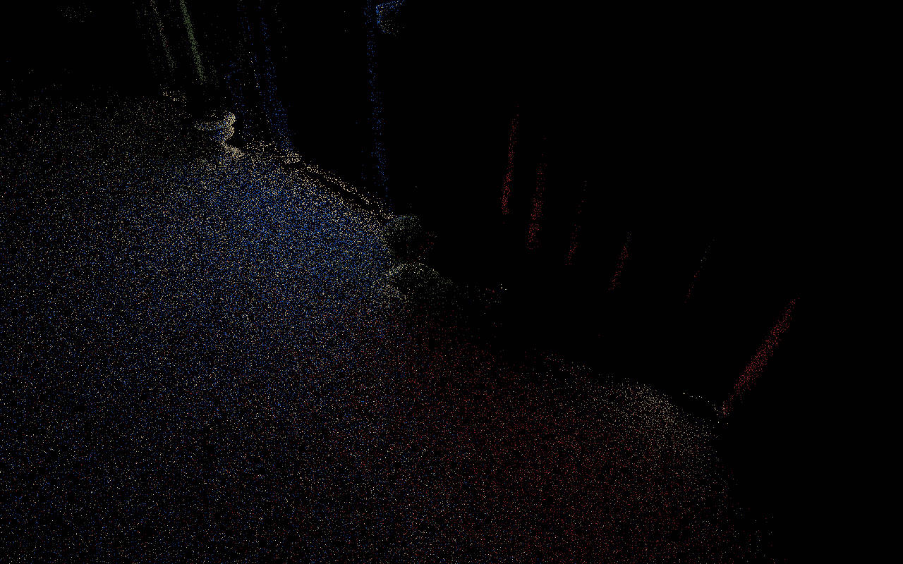
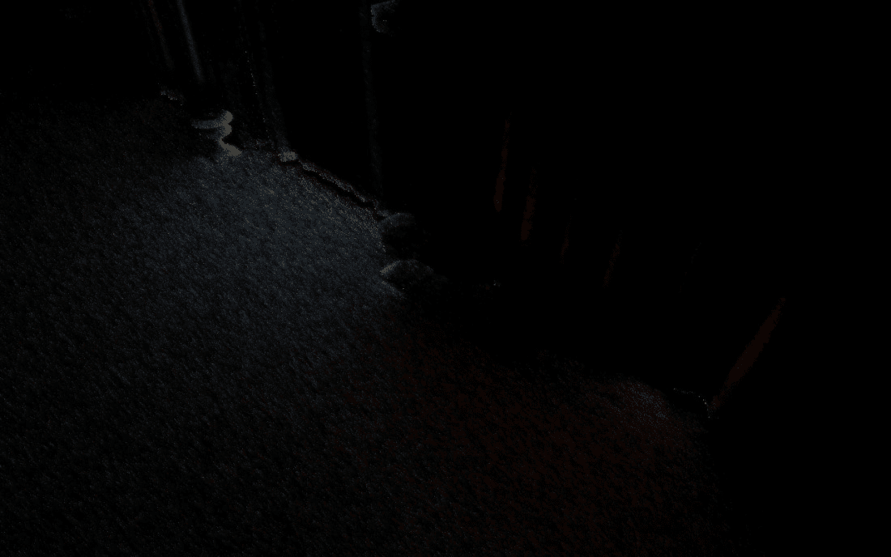
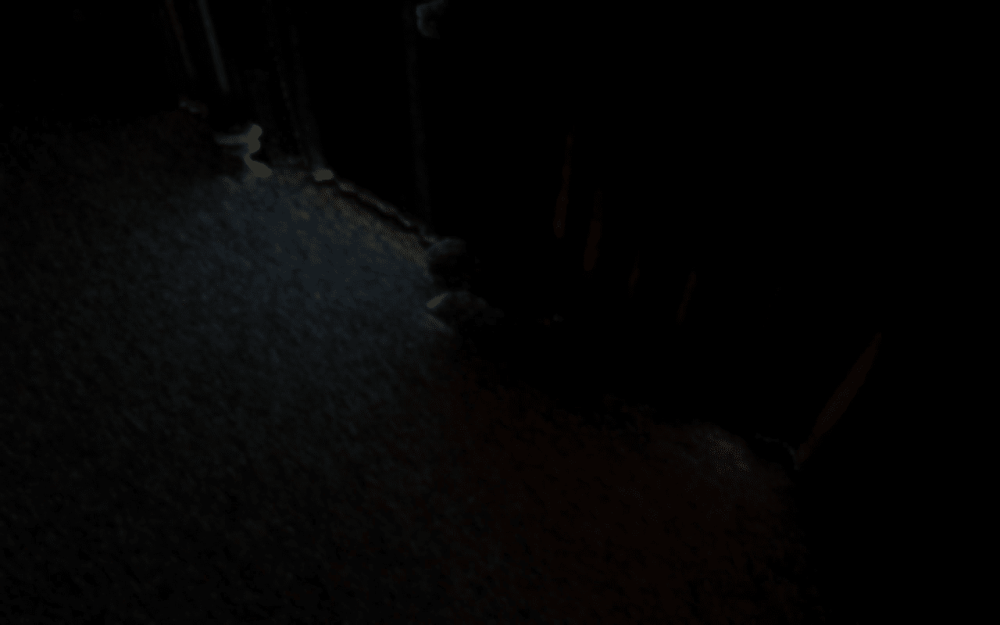

# 使用光线追踪添加反射

在本章中，我们将使用光线追踪来实现反射。在引入光线追踪硬件之前，应用程序使用屏幕空间技术来实现反射。然而，这种技术有缺点，因为它只能使用屏幕上可见的信息。如果其中一条光线超出屏幕上可见的几何形状，我们通常会回退到环境贴图。由于这种限制，渲染的反射可能会根据相机位置而不一致。

通过引入光线追踪硬件，我们可以克服这一限制，因为我们现在可以访问屏幕上不可见的几何形状。缺点是我们可能需要进行一些昂贵的光照计算。如果反射的几何形状在屏幕外，这意味着我们没有 G 缓冲区的数据，需要从头开始计算颜色、光照和阴影数据。

为了降低这种技术的成本，开发者通常会以半分辨率追踪反射，或者在屏幕空间反射失败时才使用光线追踪。另一种方法是使用较低分辨率的几何形状在光线追踪路径中，以降低光线遍历的成本。在本章中，我们将实现仅使用光线追踪的解决方案，因为这可以提供最佳质量的结果。然后，将很容易在它之上实现之前提到的优化。

在本章中，我们将涵盖以下主要主题：

+   屏幕空间反射的工作原理

+   实现光线追踪反射

+   实现降噪器以使光线追踪输出可用

# 技术要求

到本章结束时，你将很好地理解可用于反射的不同解决方案。你还将学习如何实现光线追踪反射以及如何借助降噪器来提高最终结果。

本章的代码可以在以下 URL 找到：[`github.com/PacktPublishing/Mastering-Graphics-Programming-with-Vulkan/tree/main/source/chapter15`](https://github.com/PacktPublishing/Mastering-Graphics-Programming-with-Vulkan/tree/main/source/chapter15)。

# 屏幕空间反射的工作原理

反射是重要的渲染元素，可以提供更好的沉浸感。因此，多年来，开发者已经开发了一些技术来包括这种效果，甚至在光线追踪硬件可用之前。

最常见的方法之一是在 G 缓冲区数据可用后对场景进行光线追踪。一个表面是否会产生反射由材料的粗糙度决定。只有粗糙度低的材料才会产生反射。这也帮助减少了这种技术的成本，因为通常只有少数表面会满足这一要求。

射线追踪是一种类似于光线追踪的技术，它在*第十章*中介绍，即*添加体积雾*。作为快速提醒，射线追踪的工作原理与光线追踪相似。我们不是遍历场景以确定射线是否击中任何几何体，而是通过固定次数的迭代，以小的增量沿着射线的方向移动。

这既有优点也有缺点。优点是，这项技术具有固定的成本，与场景的复杂度无关，因为每条射线的最大迭代次数是预先确定的。缺点是，结果的质量取决于步长和迭代次数。

为了获得最佳质量，我们希望有大量的迭代和小的步长，但这会使技术变得过于昂贵。折衷方案是使用一个步长，以产生足够好的结果，然后将结果通过去噪滤波器传递，以尝试减少由低频采样引入的伪影。

如其名所示，这项技术类似于其他技术，如**屏幕空间环境遮挡**（**SSAO**），在屏幕空间中工作。对于给定的片段，我们首先确定它是否产生反射。如果产生，我们根据表面法线和视方向确定反射射线的方向。

接下来，我们沿着反射射线的方向移动给定次数的迭代和步长。在每一步中，我们检查深度缓冲区以确定是否击中任何几何体。由于深度缓冲区具有有限的分辨率，通常我们定义一个 delta 值来决定是否将给定的迭代视为击中。

如果射线深度与深度缓冲区中存储的值的差异小于这个 delta 值，我们可以退出循环；否则，我们必须继续。这个 delta 值的大小可能因场景的复杂度而异，通常需要手动调整。

如果射线追踪循环击中了可见几何体，我们查找该片段的颜色值并将其用作反射颜色。否则，我们返回黑色或使用环境图确定反射颜色。

我们在这里跳过一些实现细节，因为它们与本章无关。我们在*进一步阅读*部分提供了更详细的信息。

如前所述，这项技术仅限于屏幕上可见的信息。主要缺点是，如果反射的几何体不再在屏幕上渲染，随着摄像机的移动，反射将消失。另一个缺点来自射线追踪，因为我们对可以采取的步数和大小有限制。

这可能会在反射中引入孔洞，这通常通过积极的过滤来解决。这可能导致反射模糊，并使得根据场景和视点难以获得清晰的反射。

在本节中，我们介绍了屏幕空间反射。我们解释了这种技术背后的主要思想及其一些不足。在下一节中，我们将实现光线追踪反射，这可以减少这种技术的一些限制。

# 实现光线追踪反射

在本节中，我们将利用硬件光线追踪功能来实现反射。在深入代码之前，这里是对算法的概述：

1.  我们从 G 缓冲区数据开始。我们检查给定片段的粗糙度是否低于某个阈值。如果是，我们进入下一步。否则，我们不再处理这个片段。

1.  为了使这种技术在实时中可行，我们只为每个片段发射一条反射光线。我们将展示两种选择反射光线方向的方法：一种模拟类似镜面的表面，另一种为给定片段采样 GGX 分布。

1.  如果反射光线击中某些几何形状，我们需要计算其表面颜色。我们向通过重要性采样选择的光源发射另一条光线。如果选择的光源是可见的，我们使用我们的标准光照模型计算表面的颜色。

1.  由于我们只为每个片段使用一个样本，最终输出将会是噪声的，尤其是因为我们随机选择反射方向。因此，光线追踪步骤的输出将通过去噪器进行处理。我们实现了一种称为**时空方差引导滤波**（**SVGF**）的技术，它专门为这种用途开发。该算法将利用空间和时间数据来生成一个包含少量噪声的结果。

1.  最后，我们在光照计算期间使用去噪数据来检索镜面颜色。

现在你已经对涉及的步骤有了很好的了解，让我们深入探讨！第一步是检查给定片段的粗糙度是否高于某个阈值：

```cpp
if ( roughness <= 0.3 ) {
```

我们选择了`0.3`，因为它给出了我们想要的结果，尽管你可以自由地尝试其他值。如果这个片段对反射计算有贡献，我们初始化随机数生成器，并计算两个值以采样 GGX 分布：

```cpp
rng_state = seed( gl_LaunchIDEXT.xy ) + current_frame;
float U1 = rand_pcg() * rnd_normalizer;
float U2 = rand_pcg() * rnd_normalizer;
```

两个随机函数可以如下实现：

```cpp
uint seed(uvec2 p) {
    return 19u * p.x + 47u * p.y + 101u;
}
uint rand_pcg() {
    uint state = rng_state;
    rng_state = rng_state * 747796405u + 2891336453u;
    uint word = ((state >> ((state >> 28u) + 4u)) ^ state) 
                  277803737u;
    return (word >> 22u) ^ word;
}
```

这两个函数是从优秀的《GPU 渲染的哈希函数》论文中提取的，我们强烈推荐。它包含许多其他你可以实验的函数。我们选择这个种子函数，以便我们可以使用片段的位置。

接下来，我们需要选择我们的反射向量。如前所述，我们已经实现了两种技术。对于第一种技术，我们只需将视向量围绕表面法线反射以模拟类似镜面的表面。这可以计算如下：

```cpp
vec3 reflected_ray = normalize( reflect( incoming, normal ) );
```

当使用这种方法时，我们得到以下输出：



图 15.1 – 类似镜子的反射

另一种方法通过随机采样 GGX 分布来计算法线：

```cpp
vec3 normal = sampleGGXVNDF( incoming, roughness, roughness, 
                             U1, U2 );
vec3 reflected_ray = normalize( reflect( incoming, normal ) );
```

`sampleGGXVNDF`函数来自《采样可见法线的 GGX 分布》论文。其实现方式在这篇论文中有详细描述；我们建议您阅读以获取更多细节。

简而言之，这种方法根据材料的 BRDF 和视图方向计算一个随机法线。这个过程是为了确保计算出的反射更加物理上准确。

接下来，我们必须在场景中追踪一条光线：

```cpp
traceRayEXT( as, // topLevel
            gl_RayFlagsOpaqueEXT, // rayFlags
            0xff, // cullMask
            sbt_offset, // sbtRecordOffset
            sbt_stride, // sbtRecordStride
            miss_index, // missIndex
            world_pos, // origin
            0.05, // Tmin
            reflected_ray, // direction
            100.0, // Tmax
            0 // payload index
        );
```

如果光线有击中点，我们使用重要性采样来选择一个灯光用于最终颜色计算。重要性采样的主要思想是根据给定的概率分布确定哪个元素，在我们的情况下是哪个灯光，更有可能被选中。

我们采用了来自《Ray Tracing Gems》一书中“在 GPU 上对许多灯光进行重要性采样”章节中描述的重要性值。

我们首先遍历场景中的所有灯光：

```cpp
for ( uint l = 0; l < active_lights; ++l ) {
    Light light = lights[ l ];
```

接下来，我们计算光线与被击中三角形的法线之间的角度：

```cpp
    vec3 p_to_light = light.world_position - p_world.xyz;
    float point_light_angle = dot( normalize( p_to_light ), 
                              triangle_normal );
    float theta_i = acos( point_light_angle );
```

然后，我们计算灯光与片段在世界空间中的位置之间的距离：

```cpp
    float distance_sq = dot( p_to_light, p_to_light );
    float r_sq = light.radius * light.radius;
```

然后，我们使用这两个值来确定是否应该考虑这个灯光：

```cpp
    bool light_active = ( point_light_angle > 1e-4 ) && ( 
                          distance_sq <= r_sq );
```

下一步涉及计算一个方向参数。这告诉我们灯光是直接照在片段上还是以某个角度照射：

```cpp
    float theta_u = asin( light.radius / sqrt( distance_sq 
    ) );
    float theta_prime = max( 0, theta_i - theta_u );
    float orientation = abs( cos( theta_prime ) );
```

最后，我们必须通过考虑灯光的强度来计算重要性值：

```cpp
    float importance = ( light.intensity * orientation ) / 
                         distance_sq; 
    float final_value = light_active ? importance : 0.0;
    lights_importance[ l ] = final_value;
```

如果给定的灯光对于这个片段不被考虑为活动状态，其重要性值将为`0`。最后，我们必须累积这个灯光的重要性值：

```cpp
    total_importance += final_value;
}
```

现在我们有了重要性值，我们需要对它们进行归一化。像任何其他概率分布函数一样，我们的值需要加起来等于`1`：

```cpp
for ( uint l = 0; l < active_lights; ++l ) {
    lights_importance[ l ] /= total_importance;
}
```

现在我们可以选择用于这个帧的灯光。首先，我们必须生成一个新的随机值：

```cpp
float rnd_value = rand_pcg() * rnd_normalizer;
```

接下来，我们必须遍历灯光并累积每个灯光的重要性。一旦累积值大于我们的随机值，我们就找到了要使用的灯光：

```cpp
for ( ; light_index < active_lights; ++light_index ) {
    accum_probability += lights_importance[ light_index ];
     if ( accum_probability > rnd_value ) {
        break;
    }
}
```

现在我们已经选择了灯光，我们必须向它发射一条光线以确定它是否可见。如果它是可见的，我们使用我们的光照模型计算反射表面的最终颜色。

我们计算阴影因子，如*第十三章*中所述，“使用光线追踪重新审视阴影”，颜色计算方式与*第十四章*中相同，“使用光线追踪添加动态漫反射全局照明”。

这是结果：



图 15.2 – 光线追踪步骤的噪声输出

在本节中，我们展示了我们实现的基于光线追踪的反射。首先，我们描述了选择射线方向的两个方法。然后，我们演示了如何使用重要性采样来选择用于计算的灯光。最后，我们描述了如何使用选定的灯光来确定反射表面的最终颜色。

此步骤的结果将会是噪声的，不能直接用于我们的光照计算。在下一节中，我们将实现一个降噪器，这将帮助我们移除大部分噪声。

# 实现降噪器

为了使我们的反射输出可用于光照计算，我们需要将其通过一个降噪器。我们实现了一个名为 SVGF 的算法，该算法是为了重建路径追踪中的颜色数据而开发的。

SVGF 由三个主要步骤组成：

1.  首先，我们计算亮度积分颜色和矩。这是算法的时间步骤。我们将前一帧的数据与当前帧的结果相结合。

1.  接下来，我们计算方差的估计值。这是通过使用我们在第一步中计算的第一和第二矩值来完成的。

1.  最后，我们执行五次小波滤波器的步骤。这是算法的空间步骤。在每次迭代中，我们应用一个 5x5 滤波器，尽可能多地减少剩余的噪声。

现在你已经了解了主要算法，我们可以继续处理代码细节。我们首先计算当前帧的矩：

```cpp
float u_1 = luminance( reflections_color );
float u_2 = u_1 * u_1;
vec2 moments = vec2( u_1, u_2 );
```

接下来，我们使用运动矢量值——与我们在*第十一章*，“时间反走样”中计算出的相同值——来确定我们是否可以将当前帧的数据与前一帧的数据合并。

首先，我们计算前一帧在屏幕上的位置：

```cpp
bool check_temporal_consistency( uvec2 frag_coord ) {
    vec2 frag_coord_center = vec2( frag_coord ) + 0.5; 
    vec2 motion_vector = texelFetch( global_textures[ 
                         motion_vectors_texture_index ], 
                         ivec2( frag_coord ), 0 ).rg; 
    vec2 prev_frag_coord = frag_coord_center + 
                           motion_vector;
```

接下来，我们检查旧的片段坐标是否有效：

```cpp
    if ( any( lessThan( prev_frag_coord, vec2( 0 ) ) ) || 
          any( greaterThanEqual( prev_frag_coord, 
                                 resolution ) ) ) {
              return false;
    }
```

然后，我们检查网格 ID 是否与前一顿一致：

```cpp
    uint mesh_id = texelFetch( global_utextures[ 
                               mesh_id_texture_index ], 
                               ivec2( frag_coord ), 0 ).r;
    uint prev_mesh_id = texelFetch( global_utextures[ 
                        history_mesh_id_texture_index ], 
                        ivec2( prev_frag_coord ), 0 ).r;

    if ( mesh_id != prev_mesh_id ) {
        return false;
    }
```

接下来，我们检查是否存在大的深度不连续性，这可能是由于前一帧的遮挡造成的。我们利用当前帧和前一帧深度之间的差异，以及当前帧深度在屏幕空间中的导数：

```cpp
        float z = texelFetch( global_textures[ 
                              depth_texture_index ], 
                              ivec2( frag_coord ), 0 ).r;
    float prev_z = texelFetch( global_textures[ 
                               history_depth_texture ], 
                               ivec2( prev_frag_coord ), 0 
                               ).r;

    vec2 depth_normal_dd = texelFetch( global_textures[ 
                           depth_normal_dd_texture_index ], 
                           ivec2( frag_coord ), 0 ).rg;
    float depth_diff = abs( z - prev_z ) / ( 
                       depth_normal_dd.x + 1e-2 );

    if ( depth_diff > 10 ) {
        return false;
    }
```

最后的一致性检查是通过使用法线值来完成的：

```cpp
    float normal_diff = distance( normal, prev_normal ) / ( 
                                  depth_normal_dd.y + 1e-2 
                                  );
    if ( normal_diff > 16.0 ) {
        return false;
    }
```

如果所有这些测试都通过，这意味着前一帧的值可以用于时间累积：

```cpp
if ( is_consistent ) {
    vec3 history_reflections_color = texelFetch( 
    global_textures[ history_reflections_texture_index ], 
    ivec2( frag_coord ), 0 ).rgb;
    vec2 history_moments = texelFetch( global_textures[ 
                           history_moments_texture_index ], 
                           ivec2( frag_coord ), 0 ).rg;

    float alpha = 0.2;
    integrated_color_out = reflections_color * alpha + 
    ( 1 - alpha ) * history_reflections_color;
    integrated_moments_out = moments * alpha + ( 1 - alpha 
    ) * moments;
```

如果一致性检查失败，我们只将使用当前帧的数据：

```cpp
} else {
    integrated_color_out = reflections_color;
    integrated_moments_out = moments;
}
```

这完成了累积步骤。这是我们获得的结果：



图 15.3 – 累积步骤后的颜色输出

下一步是计算方差。这可以很容易地按照以下方式完成：

```cpp
float variance = moments.y - pow( moments.x, 2 );
```

现在我们有了累积值，我们可以开始实现小波滤波器。如前所述，这是一个 5x5 交叉双边滤波器。我们从一个熟悉的双重循环开始，注意不要访问越界值：

```cpp
for ( int y = -2; y <= 2; ++y) {
    for( int x = -2; x <= 2; ++x ) {
        ivec2 offset = ivec2( x, y );
        ivec2 q = frag_coord + offset;

        if ( any( lessThan( q, ivec2( 0 ) ) ) || any( 
             greaterThanEqual( q, ivec2( resolution ) ) ) ) 
             {
                 continue;
        }
```

接下来，我们计算滤波器核值和加权值，`w`：

```cpp
        float h_q = h[ x + 2 ] * h[ y + 2 ];
        float w_pq = compute_w( frag_coord, q );
        float sample_weight = h_q * w_pq;
```

我们将在稍后解释加权函数的实现。接下来，我们加载给定片段的集成颜色和方差：

```cpp
        vec3 c_q = texelFetch( global_textures[ 
        integrated_color_texture_index ], q, 0 ).rgb;
        float prev_variance = texelFetch( global_textures[ 
        variance_texture_index ], q, 0 ).r;
```

最后，我们累积新的颜色和方差值：

```cpp
        new_filtered_color += h_q * w_pq * c_q;
        color_weight += sample_weight;

        new_variance += pow( h_q, 2 ) * pow( w_pq, 2 ) * 
                        prev_variance;
        variance_weight += pow( sample_weight, 2 );
    }
}
```

在存储新计算出的值之前，我们需要将它们除以累积的权重：

```cpp
    new_filtered_color /= color_weight;
    new_variance /= variance_weight;
```

我们重复这个过程五次。生成的颜色输出将被用于我们的镜面颜色光照计算。

正如承诺的那样，我们现在将查看权重计算。权重有三个要素：法线、深度和亮度。在代码中，我们尽量遵循论文中的命名，以便更容易与我们的公式实现相匹配。

我们从法线开始：

```cpp
vec2 encoded_normal_p = texelFetch( global_textures[ 
                        normals_texture_index ], p, 0 ).rg;
vec3 n_p = octahedral_decode( encoded_normal_p );

vec2 encoded_normal_q = texelFetch( global_textures[ 
                        normals_texture_index ], q, 0 ).rg;
vec3 n_q = octahedral_decode( encoded_normal_q );

float w_n = pow( max( 0, dot( n_p, n_q ) ), sigma_n );
```

我们计算当前片段的法线与过滤器中片段之间的余弦值，以确定法线成分的权重。

我们接下来关注深度：

```cpp
float z_dd = texelFetch( global_textures[ depth_normal_dd_
                         texture_index ], p, 0 ).r;
float z_p = texelFetch( global_textures[ depth_texture_index ], 
                        p, 0 ).r;
float z_q = texelFetch( global_textures[ depth_texture_index ], 
                        q, 0 ).r;

float w_z = exp( -( abs( z_p – z_q ) / ( sigma_z * abs( 
            z_dd ) + 1e-8 ) ) );
```

与累积步骤类似，我们利用两个片段之间的深度值之间的差异。屏幕空间导数也被包括在内。像以前一样，我们想要惩罚大的深度不连续性。

最后一个权重元素是亮度。我们首先计算我们正在处理的片段的亮度：

```cpp
vec3 c_p = texelFetch( global_textures[ integrated_color_
                       texture_index ], p, 0 ).rgb;
vec3 c_q = texelFetch( global_textures[ integrated_color_
                       texture_index ], q, 0 ).rgb;

float l_p = luminance( c_p );
float l_q = luminance( c_q );
```

接下来，我们将方差值通过高斯滤波器传递以减少不稳定性：

```cpp
float g = 0.0;
const int radius = 1;
for ( int yy = -radius; yy <= radius; yy++ ) {
    for ( int xx = -radius; xx <= radius; xx++ ) {
        ivec2 s = p + ivec2( xx, yy );
        float k = kernel[ abs( xx ) ][ abs( yy ) ];
        float v = texelFetch( global_textures[ 
                  variance_texture_index ], s, 0 ).r;
        g += v * k;
    }
}
```

最后，我们计算亮度权重并将其与其他两个权重值结合：

```cpp
float w_l = exp( -( abs( l_p - l_q ) / ( sigma_l * sqrt
            ( g ) + 1e-8 ) ) );

return w_z * w_n * w_l;
```

这就完成了 SVGF 算法的实现。经过五次迭代后，我们得到以下输出：



图 15.4 – 去噪步骤结束时的输出

在本节中，我们描述了如何实现一个常见的去噪算法。该算法包括三个步骤：一个用于颜色和亮度矩的累积阶段，一个用于计算亮度方差，以及一个用于小波滤波的步骤，该步骤重复五次。

# 概述

在本章中，我们描述了如何实现光线追踪反射。我们从一个概述开始，即屏幕空间反射，这是一种在光线追踪硬件可用之前使用了多年的技术。我们解释了它是如何工作的以及它的局限性。

接下来，我们描述了我们的光线追踪实现以确定反射值。我们提供了两种确定反射射线方向的方法，并解释了如果返回一个碰撞，如何计算反射颜色。

由于我们只为每个片段使用一个样本，因此这一步骤的结果是噪声的。为了尽可能减少这种噪声，我们实现了一个基于 SVGF 的去噪器。这项技术包括三个步骤。首先，有一个时间累积步骤来计算颜色和亮度矩。然后，我们计算亮度方差。最后，我们通过五个小波滤波器的迭代来处理颜色输出。

本章也标志着我们书籍的结束！我们希望您阅读这本书的乐趣与我们写作时的乐趣一样。当谈到现代图形技术时，一本书中能涵盖的内容是有限的。我们包括了我们认为在 Vulkan 中实现时最有趣的一些特性和技术。我们的目标是为您提供一套可以构建和扩展的工具。我们祝愿您在掌握图形编程的道路上有一个美好的旅程！

我们非常欢迎您的反馈和纠正，所以请随时与我们联系。

# 进一步阅读

我们只提供了屏幕空间反射的简要介绍。以下文章更详细地介绍了它们的实现、局限性以及如何改进最终结果：

+   [`lettier.github.io/3d-game-shaders-for-beginners/screen-space-reflection.xhtml`](https://lettier.github.io/3d-game-shaders-for-beginners/screen-space-reflection.xhtml)

+   [`bartwronski.com/2014/01/25/the-future-of-screenspace-reflections/`](https://bartwronski.com/2014/01/25/the-future-of-screenspace-reflections/)

+   [`bartwronski.com/2014/03/23/gdc-follow-up-screenspace-reflections-filtering-and-up-sampling/`](https://bartwronski.com/2014/03/23/gdc-follow-up-screenspace-reflections-filtering-and-up-sampling/)

我们只使用了论文《GPU 渲染的哈希函数》中介绍的许多哈希技术之一：[`jcgt.org/published/0009/03/02/`](https://jcgt.org/published/0009/03/02/)。

此链接包含了更多关于我们用来通过采样 BRDF 确定反射向量的采样技术细节：*采样可见法线的 GGX 分布*：[`jcgt.org/published/0007/04/01/`](https://jcgt.org/published/0007/04/01/)。

关于我们介绍的 SVGF 算法的更多细节，我们建议阅读原始论文和相关材料：[`research.nvidia.com/publication/2017-07_spatiotemporal-variance-guided-filtering-real-time-reconstruction-path-traced`](https://research.nvidia.com/publication/2017-07_spatiotemporal-variance-guided-filtering-real-time-reconstruction-path-traced)。

我们使用了重要性采样来确定每一帧使用哪种光线。在过去几年中变得流行的一种技术是**水库时空重要性重采样**（**ReSTIR**）。我们强烈建议您阅读原始论文并查找受其启发的其他技术：[`research.nvidia.com/publication/2020-07_spatiotemporal-reservoir-resampling-real-time-Ray-Tracing-dynamic-direct`](https://research.nvidia.com/publication/2020-07_spatiotemporal-reservoir-resampling-real-time-Ray-Tracing-dynamic-direct)。

在本章中，我们为了教学目的从头开始实现了 SVGF 算法。我们的实现是一个很好的起点，但我们也建议查看 AMD 和 Nvidia 的生产级去噪器以比较结果：

+   [GPUOpen FidelityFX Denoiser](https://gpuopen.com/fidelityfx-denoiser/)

+   [NVIDIA RTX 光线追踪的 RT-Denoiser](https://developer.nvidia.com/rtx/Ray-Tracing/rt-denoisers)
