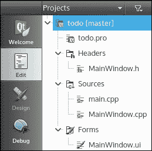
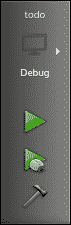
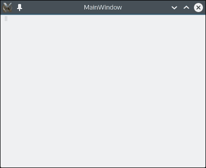
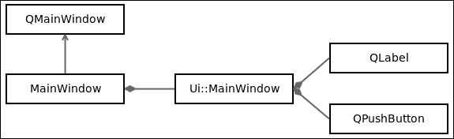
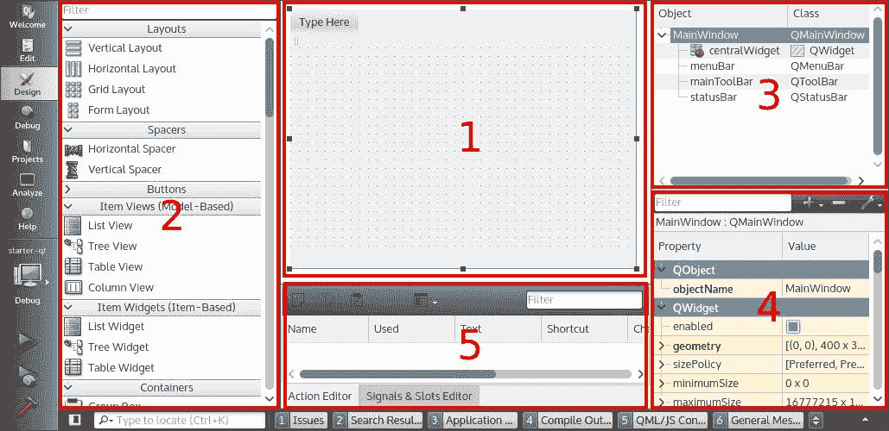
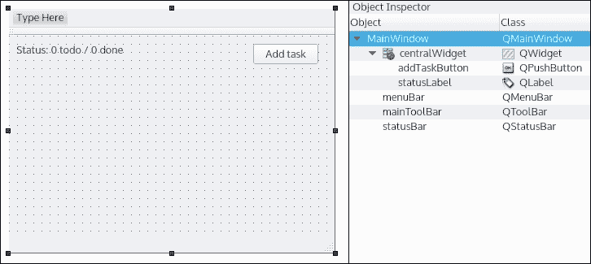
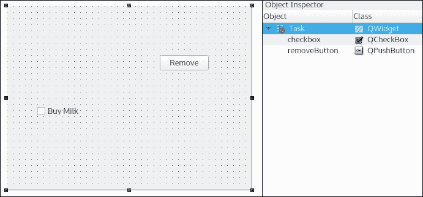
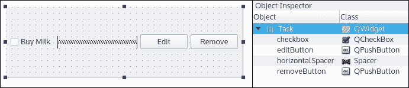
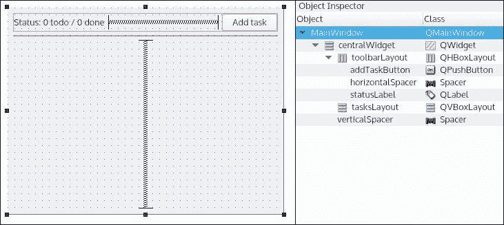

# 第一章。让你的 Qt 脚步湿透

如果你熟悉 C++ 但从未接触过 Qt，或者如果你已经制作了一些中级 Qt 应用程序，那么本章将确保你在学习以下章节的高级概念之前，Qt 的基础是安全的。

我们将教你如何使用 Qt Creator 创建一个简单的待办事项应用程序。此应用程序将显示一个任务列表，你可以创建/更新/删除任务。我们将涵盖 Qt Creator 和 Qt Designer 界面、信号/槽机制的介绍、创建具有自定义信号/槽的自定义小部件以及将其集成到你的应用程序中。

你将使用新的 C++14 语义实现一个待办事项应用程序：lambda 表达式、auto 变量和 for 循环。这些概念将逐一深入解释，并在整本书中应用。

本章结束时，你将能够使用 Qt 小部件和新的 C++ 语义创建一个具有灵活 UI 的桌面应用程序。

在本章中，我们将涵盖以下主题：

+   Qt 项目基本结构

+   Qt Designer 界面

+   UI 基础

+   信号和槽

+   自定义 `QWidget`

+   C++14 lambda、auto、for each

# 创建项目

第一件事是启动 Qt Creator。

在 Qt Creator 中，你可以通过 **文件** | **新建文件或项目** | **应用程序** | **Qt 小部件应用程序** | **选择** 来创建一个新的 Qt 项目。

然后向导将引导你完成四个步骤：

1.  **位置**：你必须选择一个项目名称和位置。

1.  **工具包**：你的项目目标平台（桌面、Android 等）。

1.  **详情**：生成类的基类信息和名称。

1.  **摘要**：允许你将你的新项目配置为子项目，并自动将其添加到版本控制系统。

即使可以保留所有默认值，也请至少设置一个有用的项目名称，例如 "todo" 或 "TodoApp"。如果你想要将其命名为 "Untitled" 或 "Hello world"，我们也不会责怪你。

完成后，Qt Creator 将生成几个文件，你可以在 **项目** 层级视图中看到它们：



`.pro` 文件是 Qt 的配置项目文件。由于 Qt 添加了特定的文件格式和 C++ 关键字，因此会执行一个中间构建步骤，解析所有文件以生成最终文件。这个过程由 `qmake`（Qt SDK 中的一个可执行文件）完成。它还将为你的项目生成最终的 Makefiles。

一个基本的 `.pro` 文件通常包含：

+   使用的 Qt 模块（`core`、`gui` 等）

+   目标名称（`todo`、`todo.exe` 等）

+   项目模板（`app`、`lib` 等）

+   源文件、头文件和表单

Qt 和 C++14 提供了一些很棒的功能。本书将在所有项目中展示它们。对于 `GCC` 和 `CLANG` 编译器，你必须将 `CONFIG += c++14` 添加到 `.pro` 文件中，以在 Qt 项目上启用 C++14，如下面的代码所示：

```cpp
QT       += core gui 
CONFIG   += c++14 

greaterThan(QT_MAJOR_VERSION, 4): QT += widgets 

TARGET = todo 
TEMPLATE = app 

SOURCES += main.cpp \ 
           MainWindow.cpp 

HEADERS  += MainWindow.h \ 

FORMS    += MainWindow.ui \ 

```

`MainWindow.h` 和 `MainWindow.cpp` 文件是 `MainWindow` 类的头文件/源文件。这些文件包含向导生成的默认 GUI。

`MainWindow.ui`文件是你的 XML 格式的 UI 设计文件。它可以用 Qt Designer 更容易地编辑。这个工具是一个**WYSIWYG**（**所见即所得**）编辑器，它可以帮助你添加和调整你的图形组件（小部件）。

这是`main.cpp`文件，其中包含其著名的函数：

```cpp
#include "MainWindow.h" 
#include <QApplication> 

int main(int argc, char *argv[]) 
{ 
    QApplication a(argc, argv); 
    MainWindow w; 
    w.show(); 

    return a.exec(); 
} 

```

如同往常，`main.cpp`文件包含程序的入口点。默认情况下，它将执行两个操作：

+   实例化和显示你的主窗口

+   实例化一个`QApplication`并执行阻塞的主事件循环

这是 Qt Creator 的底部左侧工具栏：



使用它以调试模式构建和启动你的`todo`应用程序：

1.  确认项目处于**调试**构建模式。

1.  使用锤子按钮来构建你的项目。

1.  使用带有小蓝色虫的绿色播放按钮开始调试。

你会发现一个奇妙且空荡荡的窗口。在解释如何构建这个`MainWindow`之后，我们将纠正这个问题：



一个空的**MainWindow**截图

### 提示

**Qt 技巧**

+   按*Ctrl* + *B*（Windows/Linux）或*Command* + *B*（Mac）来构建你的项目

+   按*F5*（Windows/Linux）或*Command* + *R*（Mac）以调试模式运行你的应用程序

# MainWindow 结构

这个生成的类是 Qt 框架使用的完美且简单的例子；我们将一起剖析它。如前所述，`MainWindow.ui`文件描述了你的 UI 设计，而`MainWindow.h`/`MainWindow.cpp`是你可以用代码操作 UI 的 C++对象。

看一下头文件`MainWindow.h`很重要。我们的`MainWindow`对象继承自 Qt 的`QMainWindow`类：

```cpp
#include <QMainWindow> 

namespace Ui { 
class MainWindow; 
} 

class MainWindow : public QMainWindow 
{ 
    Q_OBJECT 

public: 
    explicit MainWindow(QWidget *parent = 0); 
    ~MainWindow(); 
private: 
    Ui::MainWindow *ui; 
}; 

```

由于我们的类继承自`QMainWindow`类，我们在头文件顶部添加了相应的包含。第二部分是`Ui::MainWindow`的前向声明，因为我们只声明了一个指针。

`Q_OBJECT`对于非 Qt 开发者来说可能看起来有点奇怪。这个宏允许类定义自己的信号/槽，以及更广泛的 Qt 元对象系统。这些特性将在本章的后面部分介绍。

这个类定义了一个公共构造函数和析构函数。后者相当常见。但构造函数接受一个参数 parent。这个参数是一个默认为`null`的`QWidget`指针。

`QWidget`是一个 UI 组件。它可以是一个标签、一个文本框、一个按钮等等。如果你在窗口、布局和其他 UI 小部件之间定义了父子关系，你的应用程序的内存管理将会更容易。实际上，在这种情况下，删除父对象就足够了，因为它的析构函数将负责删除其子对象，然后子对象再删除其子对象，依此类推。

我们的 `MainWindow` 类从 Qt 框架扩展了 `QMainWindow`。我们在私有字段中有一个 `ui` 成员变量。其类型是 `Ui::MainWindow` 的指针，该指针在由 Qt 生成的 `ui_MainWindow.h` 文件中定义。它是 UI 设计文件 `MainWindow.ui` 的 C++ 转写。`ui` 成员变量将允许您从 C++ 中与 UI 组件（`QLabel`、`QPushButton` 等）交互，如图所示：



### 小贴士

**C++ 小贴士**

如果您的类只使用指针或引用来表示类类型，您可以通过使用前向声明来避免包含头文件。这将大大减少编译时间。

现在头部部分已经完成，我们可以谈谈 `MainWindow.cpp` 源文件。

在以下代码片段中，第一个包含是我们类的头文件。第二个包含是生成类 `Ui::MainWindow` 所需的包含。这个包含是必需的，因为我们只在头文件中使用前向声明：

```cpp
#include "MainWindow.h" 
#include "ui_MainWindow.h" 

MainWindow::MainWindow(QWidget *parent) : 
    QMainWindow(parent), 
    ui(new Ui::MainWindow) 
{ 
    ui->setupUi(this); 

```

在许多情况下，Qt 使用初始化列表生成一段很好的代码。`parent` 参数用于调用超类构造函数 `QMainWindow`。我们的私有成员变量 `ui` 也被初始化了。

现在`ui`已经初始化，我们必须调用`setupUi`函数来初始化`MainWindow.ui`设计文件中使用的所有组件：

由于我们在构造函数中初始化了一个指针，它必须在析构函数中清理：

```cpp
MainWindow::~MainWindow() 
{ 
    delete ui; 
} 

```

# Qt Designer

Qt Designer 是开发 Qt 应用程序的主要工具。这个所见即所得编辑器将帮助您轻松设计您的 GUI。如果您在`MainWindow.ui`文件之间切换到**编辑**模式或**设计**模式，您将看到真实的 XML 内容和设计器：



设计器显示几个部分：

+   **表单编辑器**：这是表单的可视表示（目前为空）

+   **组件箱**：这包含可以与您的表单一起使用的所有组件

+   **对象检查器**：这以分层树的形式显示您的表单

+   **属性编辑器**：这列出了所选组件的属性

+   **动作编辑器/信号与槽编辑器**：这处理对象之间的连接

是时候装饰这个空白的窗口了！让我们从表单上的“显示组件”部分拖放一个**标签**组件。您可以从属性编辑器中更改名称和文本属性。

由于我们正在制作一个 `todo` 应用程序，我们建议以下属性：

+   `objectName`: `statusLabel`

+   `text`: `状态：0 待办/0 完成`

这个标签将稍后显示 `todo` 任务的数量和已完成任务的数量。好的，保存，构建，并启动您的应用程序。现在您应该在窗口中看到您的新标签。

您现在可以使用以下属性添加一个按钮：

+   `objectName`: `addTaskButton`

+   `text`: `添加任务`

你应该得到一个接近以下结果：



### 小贴士

**Qt 小贴士**

您可以通过双击它直接在表单上编辑组件的文本属性！

# 信号和槽

Qt 框架通过三个概念：信号、槽和连接，提供了一个灵活的消息交换机制：

+   `signal` 是对象发送的消息

+   `slot` 是当这个信号被触发时将被调用的函数

+   `connect` 函数指定哪个 `signal` 连接到哪个 `slot`

Qt 已经为其类提供了信号和槽，你可以在应用程序中使用它们。例如，`QPushButton` 有一个 `clicked()` 信号，当用户点击按钮时将被触发。`QApplication` 类有一个 `quit()` 槽函数，可以在你想终止应用程序时调用。

这就是为什么你会喜欢 Qt 信号和槽：

+   槽仍然是一个普通函数，所以你可以自己调用它

+   单个信号可以连接到不同的槽

+   单个槽可以被不同的链接信号调用

+   可以在来自不同对象的信号和槽之间，甚至在位于不同线程中的对象之间建立连接！

请记住，为了能够将 `signal` 连接到 `slot`，它们的函数签名必须匹配。参数的数量、顺序和类型必须相同。注意，信号和槽从不返回值。

这是 Qt 连接的语法：

```cpp
connect(sender, &Sender::signalName,  
    receiver, &Receiver::slotName); 

```

我们可以使用此出色机制进行的第一个测试是将现有的 `signal` 与现有的 `slot` 连接起来。我们将把这个连接调用添加到 `MainWindow` 构造函数中：

```cpp
MainWindow::MainWindow(QWidget *parent) : 
    QMainWindow(parent), 
    ui(new Ui::MainWindow) 
{ 
    ui->setupUi(this); 
    connect(ui->addTaskButton, &QPushButton::clicked, 
    QApplication::instance(), &QApplication::quit); 
} 

```

让我们分析一下如何完成连接：

+   `sender`：这是将发送信号的对象。在我们的例子中，它是从 UI 设计器添加的名为 `addTaskButton` 的 `QPushButton`。

+   `&Sender::signalName`：这是成员信号函数的指针。在这里，我们希望在点击信号被触发时执行某些操作。

+   `receiver`：这是将接收并处理信号的对象。在我们的情况下，它是 `main.cpp` 中创建的 `QApplication` 对象。

+   `&Receiver::slotName`：这是指向接收者之一的成员槽函数的指针。在这个例子中，我们使用内置的 `quit()` 槽从 `Qapplication`，这将退出应用程序。

你现在可以编译并运行这个简短的示例。如果你点击 `MainWindow` 的 `addTaskButton`，应用程序将被终止。

### 小贴士

**Qt 小贴士**

你可以将一个信号连接到另一个信号。当第一个信号被触发时，第二个信号将被发出。

现在你已经知道了如何将信号连接到现有的槽，让我们看看如何在 `MainWindow` 类中声明和实现一个自定义的 `addTask()` 槽。当用户点击 `ui->addTaskButton` 时，这个槽将被调用。

这是更新后的 `MainWindow.h`：

```cpp
class MainWindow : public QMainWindow 
{ 
    Q_OBJECT 

public: 
    explicit MainWindow(QWidget *parent = 0); 
    ~MainWindow(); 

public slots: 
    void addTask(); 

private: 
    Ui::MainWindow *ui; 
}; 

```

Qt 使用特定的 `slot` 关键字来识别槽。由于槽是一个函数，你可以根据需要调整其可见性（`public`、`protected` 或 `private`）。

在 `MainWindow.cpp` 文件中添加此槽实现：

```cpp
void MainWindow::addTask() 
{ 
    qDebug() << "User clicked on the button!"; 
} 

```

Qt 提供了一种使用 `QDebug` 类高效显示调试信息的方法。获取 `QDebug` 对象的一个简单方法是调用 `qDebug()` 函数。然后，您可以使用流运算符发送您的调试信息。

更新文件顶部如下：

```cpp
#include <QDebug> 

MainWindow::MainWindow(QWidget *parent) : 
    QMainWindow(parent), 
    ui(new Ui::MainWindow) 
{ 
    ui->setupUi(this); 
    connect(ui->addTaskButton, &QPushButton::clicked, 
    this, &MainWindow::addTask); 
} 

```

由于我们现在在槽中使用 `qDebug()`，我们必须包含 `<QDebug>`。更新的连接现在调用我们的自定义槽而不是退出应用程序。

构建并运行应用程序。如果您点击按钮，您将在 Qt Creator 的 `应用程序输出` 选项卡中看到您的调试信息。

# 自定义 QWidget

现在，我们必须创建一个 `Task` 类来保存我们的数据（任务名称和完成状态）。这个类将有一个与 `MainWindow` 分离的表单文件。Qt Creator 提供了一个自动工具来生成基类和相关表单。

点击 **文件** | **新建文件或项目** | **Qt** | **Qt Designer 表单类**。这里有几个表单模板；您将认出主窗口，这是我们在启动 `todo` 应用程序项目时 Qt Creator 为我们创建的。选择 **小部件** 并将类命名为 `Task`，然后点击 **下一步**。以下是 Qt Creator 将执行的操作的摘要：

1.  创建一个 `Task.h` 文件和一个 `Task.cpp` 文件。

1.  创建相关的 `Task.ui` 并进行管道连接，将其连接到 `Task.h`。

1.  将这三个新文件添加到 `todo.pro` 中，以便它们可以被编译。

完成，然后，`Task` 类就准备好了，可以填充。我们将首先跳转到 `Task.ui`。首先，拖放一个 `Check Box`（将 `checkbox` 放入 `objectName`）和一个 `Push Button` (`objectName` = `removeButton`)：



我的对齐看起来很棒，让我们把它发给客户吧！

除非您有像素级的眼睛，否则您的小部件对齐得不是很好。您需要指示小部件应该如何布局以及当窗口几何形状改变时它们应该如何反应（例如，当用户调整窗口大小时）。为此，Qt 提供了几个默认布局类：

+   `垂直布局`: 在这种布局中，小部件垂直堆叠

+   `水平布局`: 在这种布局中，小部件水平堆叠

+   `网格布局`: 在这种布局中，小部件被排列在一个可以细分到更小单元格的网格中

+   `表单布局`: 在这种布局中，小部件排列得像网页表单，一个标签和一个输入

每个布局都会尝试将所有小部件约束在相等表面上。它将根据每个小部件的约束更改小部件的形状或添加额外的边距。一个复选框不会被拉伸，但一个按钮会被拉伸。

在我们的 `Task` 对象中，我们希望这些是水平堆叠的。在 **表单编辑器** 选项卡中，右键单击窗口并选择 **布局** | **水平布局**。每次您在此布局中添加新小部件时，它都将水平排列。

现在在 `checkbox` 对象之后添加一行 `Push Button (objectName = editButton)`。

**表单编辑器**窗口提供了你 UI 渲染的逼真预览。如果你现在拉伸窗口，你可以观察到每个部件将如何对此事件做出反应。当水平调整大小时，你可以注意到按钮被拉伸了。这看起来很糟糕。我们需要一些“提示”布局，这些按钮不应该被拉伸。进入`Spacer`部件。在部件框中取`Horizontal Spacer`，并将其放在`checkbox`对象之后：



空间部件是一个特殊的部件，它试图将相邻的部件（水平或垂直）推到一边，迫使它们尽可能少地占用空间。`editButton`和`removeButton`对象现在只占用它们的文本空间，当窗口大小调整时，它们将被推到窗口的边缘。

你可以在表单中添加任何类型的子布局（垂直、水平、网格、表单），并通过组合部件、空间和布局创建一个看起来复杂的应用程序。这些工具旨在设计一个能够正确响应不同窗口几何形状的桌面应用程序。

设计器部分已完成，因此我们可以切换到`Task`源代码。由于我们创建了一个 Qt Designer 表单类，`Task`与其 UI 紧密相关。我们将利用这一点将模型存储在单个位置。当我们创建一个`Task`对象时，它必须有一个名称：

```cpp
#ifndef TASK_H 
#define TASK_H 

#include <QWidget> 
#include <QString> 

namespace Ui { 
class Task; 
} 

class Task : public QWidget 
{ 
    Q_OBJECT 

public: 
    explicit Task(const QString& name, QWidget *parent = 0); 
    ~Task(); 

    void setName(const QString& name); 
    QString name() const; 
    bool isCompleted() const; 

private: 
    Ui::Task *ui; 
}; 

#endif // TASK_H 

```

构造函数指定了一个名称，正如你所见，没有私有字段存储对象的任何状态。所有这些都将通过表单部分来完成。我们还添加了一些 getter 和 setter，它们将与表单交互。最好将模型与 UI 完全分离，但我们的示例足够简单，可以合并它们。此外，`Task`的实现细节对外界是隐藏的，并且可以在以后进行重构。以下是`Task.cpp`文件的内容：

```cpp
#include "Task.h" 
#include "ui_Task.h" 

Task::Task(const QString& name, QWidget *parent) : 
        QWidget(parent), 
        ui(new Ui::Task) 
{ 
    ui->setupUi(this); 
    setName(name); 
} 

Task::~Task() 
{ 
    delete ui; 
} 

void Task::setName(const QString& name) 
{ 
    ui->checkbox->setText(name); 
} 

QString Task::name() const 
{ 
    return ui->checkbox->text(); 
} 

bool Task::isCompleted() const 
{ 
   return ui->checkbox->isChecked(); 
} 

```

实现很简单；我们在`ui->checkbox`中存储信息，`name()`和`isCompleted()`getter 从`ui->checkbox`中获取数据。

# 添加任务

我们现在将重新排列`MainWindow`的布局，以便能够显示我们的待办任务。目前，我们没有可以显示任务的部件。打开`MainWindow.ui`文件并编辑它以获得以下结果：



如果我们详细说明内容，我们有：

+   一个包含`toolbarLayout`文件和`tasksLayout`文件的`centralWidget`的垂直布局。

+   一个垂直空间将这些布局推到顶部，迫使它们占用尽可能小的空间。

+   我们去掉了`menuBar`、`mainToolBar`和`statusBar`。Qt Creator 会自动创建它们，我们只是不需要它们来完成我们的目的。你可以从它们的名字中猜测它们的用途。

不要忘记通过在**对象检查器**窗口中选择**MainWindow**并编辑**Qwidget** | **windowTitle**属性，将`MainWindow`的标题重命名为`Todo`。你的应用程序值得有一个合适的名字。

### 小贴士

**Qt 小贴士**

在设计模式中按*Shift* + *F4*切换到表单编辑器和源代码。

现在，`MainWindow` UI 已经准备好欢迎任务，让我们切换到代码部分。应用程序必须跟踪新任务。在`MainWindow.h`文件中添加以下内容：

```cpp
#include <QVector> 

#include "Task.h" 

class MainWindow : public QMainWindow 
{ 
    // MAINWINDOW_H 

public slots: 
    void addTask(); 

private: 
    Ui::MainWindow *ui; 
    QVector<Task*> mTasks; 
}; 

```

`QVector`是 Qt 容器类，提供动态数组，相当于`std::vector`。作为一个一般规则，STL 容器更可定制，但可能缺少一些与 Qt 容器相比的功能。如果你使用 C++11 智能指针，你应该优先使用`std`容器，但我们会稍后讨论这一点。

在 Qt 的`QVector`文档中，你可能会遇到以下说法：“*对于大多数用途，* `QList` *是正确的类来使用*”。在 Qt 社区中对此有争议：

+   你是否经常需要在数组的开始或中间插入比指针更大的对象？请使用`QList`类。

+   需要连续内存分配？更少的 CPU 和内存开销？请使用`QVector`类。

已经添加的槽`addTask()`现在将在我们想要将新的`Task`对象添加到`mTasks`函数时被调用。

每次点击`addTaskButton`时，让我们填充我们的`QVector`任务。首先，在`MainWindow.cpp`文件中连接`clicked()`信号：

```cpp
MainWindow::MainWindow(QWidget *parent) : 
    QMainWindow(parent), 
    ui(new Ui::MainWindow), 
    mTasks() 
{ 
    ui->setupUi(this); 
    connect(ui->addTaskButton, &QPushButton::clicked,  
    this, &MainWindow::addTask); 
}; 

```

### 小贴士

**C++小贴士**

作为最佳实践，尽量始终在初始化列表中初始化成员变量，并尊重变量声明的顺序。这样你的代码将运行得更快，并且可以避免不必要的变量复制。请查看标准 C++文档[`isocpp.org/wiki/faq/ctors#init-lists`](https://isocpp.org/wiki/faq/ctors#init-lists)。

`addTask()`函数的主体应该如下所示：

```cpp
void MainWindow::addTask() 
{ 
        qDebug() << "Adding new task"; 
        Task* task = new Task("Untitled task"); 
        mTasks.append(task); 
        ui->tasksLayout->addWidget(task); 
} 

```

我们创建了一个新的任务并将其添加到我们的`mTask`向量中。因为`Task`是一个`QWidget`，所以我们直接将其添加到`tasksLayout`中。这里需要注意的是，我们从未管理过这个新任务的内存。`delete task`指令在哪里？这是我们在本章早期开始探讨的 Qt 框架的关键特性；`QObject`类会自动处理对象销毁。

在我们的案例中，`ui->tasksLayout->addWidget(task)`调用有一个有趣的副作用；任务的所有权被转移到了`tasksLayout`。在`Task`构造函数中定义的`QObject*`父类现在是`tasksLayout`，当`tasksLayout`通过递归遍历其子项并调用它们的析构函数来释放自己的内存时，将调用`Task`的析构函数。

这将在这一精确时刻发生：

```cpp
MainWindow::~MainWindow() 
{ 
    delete ui; 
} 

```

当`MainWindow`被释放（记住，它是在`main.cpp`文件中分配的栈变量），它将调用`delete ui`，这反过来又会使整个`QObject`层次结构崩溃。这个特性有一些有趣的后果。首先，如果你在应用程序中使用`QObject`父子模型，你将需要管理的内存将少得多。其次，它可能与一些新的 C++11 语义冲突，特别是智能指针。我们将在后面的章节中讨论这一点。

# 使用`QDialog`

我们应该得到比未命名的任务更好的东西。用户在创建时需要定义其名称。最简单的方法是显示一个对话框，用户可以在其中输入任务名称。幸运的是，Qt 为我们提供了一个非常可配置的对话框，它完美地适用于`addTask()`：

```cpp
#include <QInputDialog> 
... 
void MainWindow::addTask() 
{ 
    bool ok; 
    QString name = QInputDialog::getText(this,  
        tr("Add task"), 
        tr("Task name"), 
        QLineEdit::Normal, 
        tr("Untitled task"),               &ok); 
    if (ok && !name.isEmpty()) { 
        qDebug() << "Adding new task"; 
        Task* task = new Task(name); 
        mTasks.append(task); 
        ui->tasksLayout->addWidget(task); 
    } 
} 

```

`QinputDialog::getText`函数是一个静态阻塞函数，用于显示对话框。当用户验证/取消对话框时，代码继续执行。如果我们运行应用程序并尝试添加一个新任务，我们会看到以下内容：


`QInputDialog::getText`的签名如下：

```cpp
QString QinputDialog::getText( 
  QWidget* parent,  
      const QString& title,  
      const QString& label,  
      QLineEdit::EchoMode mode = QLineEdit::Normal,  
      const QString& text = QString(),  
      bool* ok = 0, ...)
```

让我们分解一下：

+   `parent`: 这是`QinputDialog`附加到的父小部件（`MainWindow`）。这是`QObject`类父子模型的另一个实例。

+   `title`: 这是窗口标题中显示的标题。在我们的示例中，我们使用`tr("Add task")`，这是 Qt 处理代码中的 i18n 的方式。我们将在稍后看到如何为给定的字符串提供多个翻译。

+   `label`: 这是在输入文本字段上方显示的标签。

+   `mode`: 这是指输入字段如何渲染（密码模式将隐藏文本）。

+   `ok`: 这是一个指向变量的指针，如果用户按下**OK**，则将其设置为 true；如果用户按下**Cancel**，则将其设置为 false。

+   `QString`: 返回的`QString`是用户输入的内容。

对于我们的示例，还有一些可选参数我们可以安全忽略。

# 分配代码责任

太好了，用户现在可以在创建任务时指定任务名称。如果他输入名称时出错怎么办？下一个合乎逻辑的步骤是在创建任务后重命名它。我们将采取稍微不同的方法。我们希望我们的`Task`尽可能自主。如果我们将其附加到另一个组件（而不是`MainWindow`），这个重命名功能必须继续工作。因此，这个责任必须交给`Task`类：

```cpp
// In Task.h 
public slots: 
    void rename(); 

// In Task.cpp 
#include <QInputDialog> 

Task::Task(const QString& name, QWidget *parent) : 
       QWidget(parent), 
       ui(new Ui::Task) 
{ 
   ui->setupUi(this); 
   setName(name); 
   connect(ui->editButton, &QPushButton::clicked, this, &Task::rename); 
} 
... 
void Task::rename() 
{ 
    bool ok; 
    QString value = QInputDialog::getText(this, tr("Edit task"), 
                                          tr("Task name"), 
                                          QLineEdit::Normal, 
                                          this->name(), &ok); 
    if (ok && !value.isEmpty()) { 
        setName(value); 
    } 
} 

```

我们添加了一个公共槽`rename()`来将其连接到信号。`rename()`函数的主体重用了我们之前用`QInputDialog`覆盖的内容。唯一的区别是`QInputDialog`的默认值，它是当前任务名称。当调用`setName(value)`时，UI 会立即刷新为新值；无需同步或更新，Qt 主循环会完成其工作。

好处在于`Task::rename()`是完全自主的。在`MainWindow`中没有进行任何修改，因此我们实际上在`Task`和父`QWidget`之间有零耦合。

# 使用 `lambda` 发出自定义信号

删除任务的操作实现起来很简单，但我们在过程中会学习一些新概念。`Task` 必须通知其所有者和父类（`MainWindow`），`removeTaskButton`（`QPushButton`）已被点击。我们将在 `Task.h` 文件中定义一个自定义信号 `removed` 来实现这一点：

```cpp
class Task : public QWidget 
{ 
    ... 
public slots: 
    void rename(); 
signals: 
    void removed(Task* task); 
   ... 
}; 

```

就像我们对槽函数所做的那样，我们必须在我们的头文件中添加 Qt 关键字信号。由于 `signal` 只用于通知另一个类，因此不需要 `public` 关键字（它甚至会导致编译错误）。`signal` 简单地是一个发送给接收者（连接的 `slot`）的通知；它意味着 `removed(Task* task)` 函数没有函数体。我们添加了 `task` 参数，以便接收者知道哪个任务请求被删除。下一步是在 `removeButton` 点击时发出 `removed` 信号。这是在 `Task.cpp` 文件中完成的：

```cpp
Task::Task(const QString& name, QWidget *parent) : 
        QWidget(parent), 
        ui(new Ui::Task) 
{ 
    ui->setupUi(this); 
    ... 
    connect(ui->removeButton, &QPushButton::clicked, [this] { 
        emit removed(this); 
    }); 
} 

```

这段代码摘录展示了 C++11 的一个非常有趣的功能：`lambda` 表达式。在我们的例子中，`lambda` 表达式是以下部分：

```cpp
[this] { 
        emit removed(this); 
    }); 

```

我们在这里所做的就是将点击信号连接到一个匿名内联函数，一个 `lambda`。Qt 允许通过将一个信号连接到另一个信号（如果它们的签名匹配）来传递信号。这里不是这种情况；`clicked` 信号没有参数，而 `removed` 信号需要一个 `Task*`。`lambda` 避免了在 `Task` 中声明冗长的 `slot`。Qt 5 接受 `lambda` 而不是槽函数在 `connect` 中，并且两种语法都可以使用。

我们的 `lambda` 执行一行代码：`emit removed(this)`。`Emit` 是一个 Qt 宏，它将立即触发连接的 `slot` 并传递我们作为参数传递的内容。正如我们之前所说的，`removed(Task* this)` 没有函数体，它的目的是通知已注册的槽函数一个事件。

`lambda` 是 C++ 的一个很好的补充。它们提供了一种非常实用的方法来定义代码中的短函数。技术上讲，`lambda` 是一个能够捕获其作用域内变量的闭包的构造。完整的语法如下：

```cpp
[ capture-list ] ( params ) -> ret { body }
```

让我们研究这个语句的每一部分：

+   `capture-list`：这定义了在 `lambda` 范围内可见的变量。

+   `params`：这是可以传递到 `lambda` 范围的函数参数类型列表。在我们的例子中没有参数，我们可能会写成 `[this] () { ... }`，但 C++11 允许我们完全省略括号。

+   `ret`：这是 `lambda` 函数的返回类型。就像 `params` 一样，如果返回类型是 `void`，则可以省略此参数。

+   `body`：这显然是你的代码主体，其中你可以访问你的 `capture-list` 和 `params`，并且必须返回一个类型为 `ret` 的变量。

在我们的例子中，我们捕获了 `this` 指针以便能够：

+   参考一下 `removed()` 函数，它是 `Task` 类的一部分。如果我们没有捕获 `this`，编译器会报错：`error: 'this' was not captured for this lambda function emit removed(this);`。

+   将 `this` 传递给 `removed` 信号；调用者需要知道哪个任务触发了 `removed`。

`capture-list` 依赖于标准的 C++ 语义：通过复制或引用捕获变量。假设我们想要打印构造函数参数 `name` 的日志，并在我们的 `lambda` 中通过引用捕获它：

```cpp
connect(ui->removeButton, &QPushButton::clicked, [this, &name] { 
        qDebug() << "Trying to remove" << name; 
        this->emit removed(this); 
    }); 

```

这段代码可以正常编译。不幸的是，当我们尝试移除一个 `Task` 时，运行时会因为一个耀眼的段错误而崩溃。发生了什么？正如我们所说，我们的 `lambda` 是一个匿名函数，它将在 `clicked()` 信号被发射时执行。我们捕获了 `name` 引用，但这个引用可能是 `-`，一旦我们离开 `Task` 构造函数（更准确地说，从调用者作用域），这个引用就变得无效了。然后 `qDebug()` 函数将尝试显示一个不可达的代码并崩溃。

你真的需要小心你捕获的内容以及你的 lambda 将被执行的上下文。在这个例子中，可以通过通过复制捕获 `name` 来修正段错误：

```cpp
connect(ui->removeButton, &QPushButton::clicked, [this, name] { 
        qDebug() << "Trying to remove" << name; 
        this->emit removed(this); 
    }); 

```

### 小贴士

**C++ 小贴士**

+   你可以使用 `=` 和 `&` 语法捕获在定义 lambda 的函数中可到达的所有变量。

+   `this` 变量是捕获列表的一个特例。你不能通过引用 `[&this]` 来捕获它，如果你处于这种情况，编译器会警告你：`[=, this]`。不要这样做。小猫会死的。

我们的 `lambda` 直接作为参数传递给 connect 函数。换句话说，这个 `lambda` 是一个变量。这有很多后果：我们可以调用它、赋值给它，并返回它。为了说明一个“完全形成”的 `lambda`，我们可以定义一个返回任务名称格式化版本的 `lambda`。这个代码片段的唯一目的是调查 `lambda` 函数的机制。不要将以下代码包含在你的 `todo` 应用程序中，你的同事可能会称你为“函数狂热者”：

```cpp
connect(ui->removeButton, &QPushButton::clicked, [this, name] { 
    qDebug() << "Trying to remove" << 
        [] (const QString& taskName) -> QString { 
            return "-------- " + taskName.toUpper(); 
    }(name); 
    this->emit removed(this); 
}); 

```

在这里我们做了一件巧妙的事情。我们调用了 `qDebug()`；在这个调用中我们定义了一个立即执行的 `lambda`。让我们分析一下：

+   `[]`: 我们没有进行捕获。这个 `lambda` 不依赖于封装的函数。

+   `(const QString& taskName)`: 当这个 lambda 被调用时，它将期望一个 `QString` 来工作。

+   `-> QString`: 返回的 lambda 表达式的值将是一个 `QString`。

+   `return "------- " + taskName.toUpper()`: 我们 lambda 的主体。如您所见，使用 Qt，字符串操作变得容易得多。

+   `(name)`: 现在到了关键点。现在 `lambda` 函数已经定义，我们可以通过传递 `name` 参数来调用它。在一条指令中，我们定义并调用它。`QDebug()` 函数将简单地打印结果。

如果我们能将这个 `lambda` 赋值给一个变量并多次调用它，这个 `lambda` 的真正好处就会显现出来。C++ 是静态类型的，因此我们必须提供 `lambda` 变量的类型。在语言规范中，`lambda` 类型不能显式定义。我们将很快看到如何使用 C++11 来实现它。现在，让我们完成我们的删除功能。

任务现在发出 `removed()` 信号。这个信号必须由 `MainWindow` 消费：

```cpp
// in MainWindow.h 
public slots: 
    void addTask(); 
    void removeTask(Task* task); 

// In MainWindow.cpp 
void MainWindow::addTask() 
{ 
    ... 
    if (ok && !name.isEmpty()) { 
        qDebug() << "Adding new task"; 
        Task* task = new Task(name); 
        connect(task, &Task::removed,  
       this, &MainWindow::removeTask); 
    ... 
    } 
} 

void MainWindow::removeTask(Task* task) 
{ 
    mTasks.removeOne(task); 
    ui->tasksLayout->removeWidget(task); 
    task->setParent(0); 
    delete task; 
} 

```

`MainWindow::removeTask()` 函数必须匹配信号签名。当任务创建时建立连接。有趣的部分在于 `MainWindow::removeTask()` 的实现。

任务首先从 `mTasks` 向量中删除。然后从 `tasksLayout` 中删除。在这里，`tasksLayout` 释放了对 `task` 的所有权（即，`tasksLayout` 停止成为 `task` 类的父类）。

到目前为止一切顺利。接下来的两行很有趣。所有权转移并没有完全释放 `task` 类的所有权。如果我们注释掉这些行，`removeTask()` 将会看起来像这样：

```cpp
void MainWindow::removeTask(Task* task) 
{ 
    mTasks.removeOne(task); 
    ui->tasksLayout->removeWidget(task); 
    // task->setParent(0); 
    // delete task; 
} 

```

如果你在 `Task` 析构函数中添加日志消息并执行程序，这个日志消息将会显示。然而，Qt 文档告诉我们，在 `Qlayout::removeWidget` 部分：*小部件的所有权保持不变，就像它被添加时一样*。

实际上发生的情况是，`task` 类的父类变成了 `centralWidget`，`tasksLayout` 类的父类。我们希望 Qt 忘记关于 `task` 的所有信息，这就是为什么我们调用 `task->setParent(0)`。然后我们可以安全地删除它并结束。

# 使用 `auto` 类型和一个基于范围的 for 循环简化

完成我们任务系统的 CRUD 功能的最终一步是实现已完成任务功能。我们将实现以下功能：

+   点击复选框以标记任务为已完成

+   删除任务名称

+   更新 `MainWindow` 中的状态标签

复选框点击处理遵循与 `removed` 相同的模式：

```cpp
// In Task.h 
signals: 
    void removed(Task* task); 
    void statusChanged(Task* task); 
private slots: 
    void checked(bool checked); 

// in Task.cpp 
Task::Task(const QString& name, QWidget *parent) : 
        QWidget(parent), 
        ui(new Ui::Task) 
{ 
    ... 

    connect(ui->checkbox, &QCheckBox::toggled,  
    this, &Task::checked); 
} 

... 

void Task::checked(bool checked) 
{ 
    QFont font(ui->checkbox->font()); 
    font.setStrikeOut(checked); 
    ui->checkbox->setFont(font); 
    emit statusChanged(this); 
} 

```

我们定义一个槽 `checked(bool checked)`，它将被连接到 `checkbox::toggled` 信号。在我们的 `slot checked()` 中，根据 `bool checked` 值划掉 `checkbox` 文本。这是使用 `QFont` 类完成的。我们创建一个从 `checkbox->font()` 的副本字体，修改它，并将其重新分配给 `ui->checkbox`。如果原始的 `font` 是加粗的，具有特殊大小，其外观将保证保持不变。

### 提示

在 Qt Designer 中玩转字体对象。选择 `Task.ui` 文件中的 `checkbox` 并转到 **属性编辑器** | **QWidget** | **字体**。

最后一条指令通知 `MainWindow` 任务的状态已更改。信号名称是 `statusChanged`，而不是 `checkboxChecked`，以隐藏任务的实现细节。在 `MainWindow.h` 文件中添加以下代码：

```cpp
// In MainWindow.h 
public: 
    void updateStatus(); 
public slots: 
    void addTask(); 
    void removeTask(Task* task); 
    void taskStatusChanged(Task* task); 

// In MainWindow.cpp 
MainWindow::MainWindow(QWidget *parent) : 
    QMainWindow(parent), 
    ui(new Ui::MainWindow), 
    mTasks() 
{ 
    ... 
    updateStatus(); 
    } 
} 

void MainWindow::addTask() 
{ 
   ... 
   if (ok && !name.isEmpty()) { 
       ... 
       connect(task, &Task::removed, this, 
               &MainWindow::removeTask); 
       connect(task, &Task::statusChanged, this, 
               &MainWindow::taskStatusChanged); 
       mTasks.append(task); 
       ui->tasksLayout->addWidget(task); 
       updateStatus(); 
   } 
} 

void MainWindow::removeTask(Task* task) 
{ 
   ... 
   delete task; 
   updateStatus(); 
} 

void MainWindow::taskStatusChanged(Task* /*task*/) 
{ 
    updateStatus(); 
} 

void MainWindow::updateStatus() 
{ 
    int completedCount = 0; 
    for(auto t : mTasks)  { 
        if (t->isCompleted()) { 
            completedCount++; 
        } 
    } 
    int todoCount = mTasks.size() - completedCount; 

    ui->statusLabel->setText( 
        QString("Status: %1 todo / %2 completed") 
                             .arg(todoCount) 
                             .arg(completedCount)); 
} 

```

我们定义了一个槽 `taskStatusChanged`，当任务创建时与之连接。这个 `slot` 的单一指令是调用 `updateStatus()`。这个函数遍历任务并更新 `statusLabel`。`updateStatus()` 函数在任务创建和删除时被调用。

在 `updateStatus()` 中，我们遇到了更多新的 C++11 语义：

```cpp
for(auto t : mTasks)  { 
    ...  
} 

```

`for` 关键字让我们可以遍历基于范围的容器。因为 `QVector` 是一个可迭代的容器，所以我们可以在这里使用它。范围声明（`auto t`）是每次迭代将被分配的类型和变量名。范围表达式（`mTasks`）简单地是执行过程将进行的容器。Qt 为 C++ 早期版本提供了一个针对 `for` 循环（即 `foreach`）的定制实现；你不再需要它了。

`auto` 关键字是另一个伟大的新语义。编译器根据初始化器自动推断变量类型。它为诸如这样的神秘迭代器减轻了许多痛苦：

```cpp
std::vector::const_iterator iterator = mTasks.toStdVector() 
                                           .stdTasks.begin(); 

// how many neurones did you save? 
auto autoIter = stdTasks.begin(); 

```

自 C++14 以来，`auto` 甚至可以用于函数返回类型。这是一个了不起的工具，但请谨慎使用。如果你使用 `auto`，类型应该从签名名称/变量名中明显可见。

### 小贴士

`auto` 关键字可以与 `const` 和引用结合使用。你可以编写这样的 for 循环：`for (const auto & t : mTasks) { ... }`。

记得我们之前提到的半面包 `lambda` 吗？有了所有这些特性，我们可以写出：

```cpp
auto prettyName = [] (const QString& taskName) -> QString { 
    return "-------- " + taskName.toUpper(); 
}; 
connect(ui->removeButton, &QPushButton::clicked,  
    [this, name, prettyName] { 
        qDebug() << "Trying to remove" << prettyName(name); 
        this->emit removed(this); 
}); 

```

现在真是一件美丽的事情。将 `auto` 与 `lambda` 结合使用，可以编写出非常易读的代码，并开启了一个充满可能性的世界。

最后要学习的是 `QString` API。我们在 `updateStatus()` 中使用了它：

```cpp
ui->statusLabel->setText( 
        QString("Status: %1 todo / %2 completed") 
                             .arg(todoCount) 
                             .arg(completedCount)); 

```

Qt 背后的开发者们投入了大量工作，使得在 C++ 中进行字符串操作变得可行。这是一个完美的例子，我们用更现代、更健壮的 API 替换了经典的 C `sprintf`。参数仅基于位置，无需指定类型（更不易出错），并且 `arg(...)` 函数接受所有类型的参数。

### 小贴士

花些时间浏览一下 [`doc.qt.io/qt-5/qstring.html`](http://doc.qt.io/qt-5/qstring.html) 上的 `QString` 文档。它展示了你可以用这个类做多少事情，你也会发现自己使用 `std string` 或 `cstring` 的例子越来越少。

# 摘要

在本章中，我们从零开始创建了一个桌面 Qt 应用程序。Qt 以其信号/槽机制而闻名，你必须对这种范式有信心。我们还介绍了一些重要的 C++14 特性，这些特性将贯穿整本书。

现在是时候发现一些 `qmake` 的秘密了，以及当你构建 Qt 项目时实际上会发生什么。在下一章中，我们还将讨论如何创建和组织一个应用程序，其中包含必须在 Windows、Mac OS 和 Linux 上运行的与平台相关的代码。
