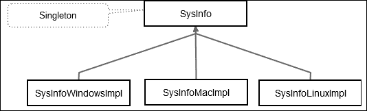
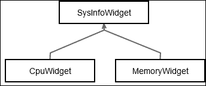
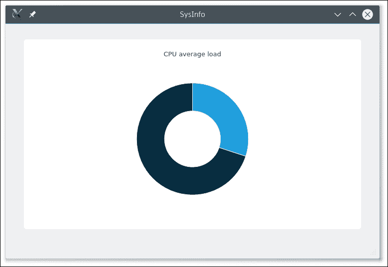
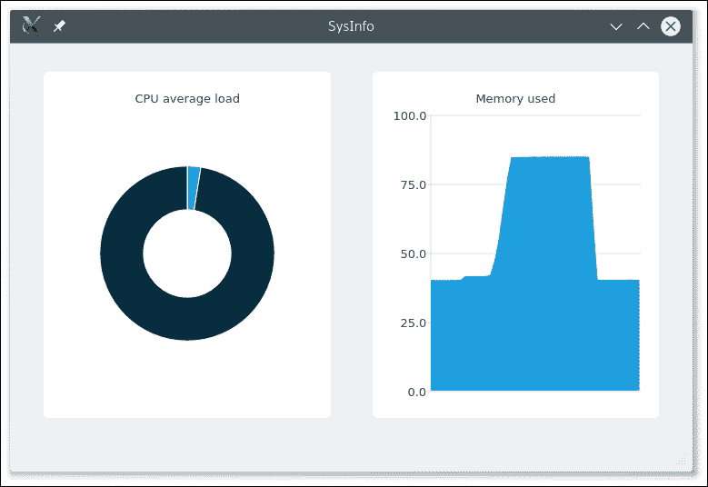
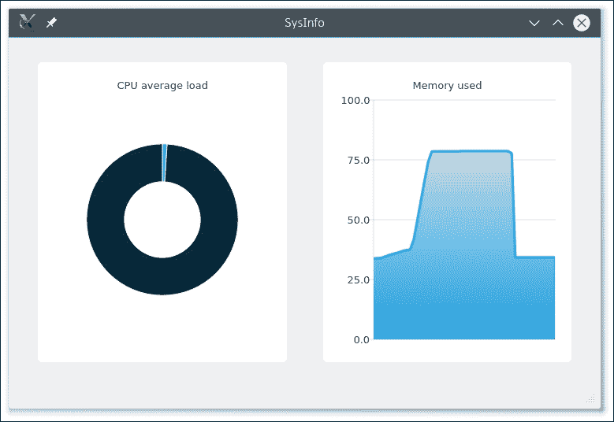
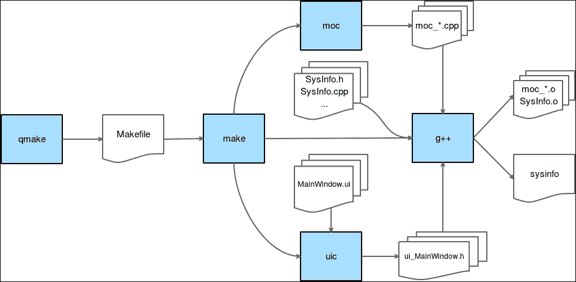

# 第二章。探索 QMake 秘密

本章讨论了创建依赖特定平台代码的跨平台应用程序的问题。我们将看到 qmake 对项目编译的影响。

你将学习如何创建一个系统监控应用程序，该程序可以从 Windows、Linux 和 Mac 中检索平均 CPU 负载和内存使用情况。对于这类依赖于操作系统的应用程序，架构是保持应用程序可靠和可维护的关键。

在本章结束时，您将能够创建和组织一个使用特定平台代码并显示 Qt 图表小部件的跨平台应用程序。此外，qmake 将不再是一个谜。

本章涵盖了以下主题：

+   特定平台代码组织

+   设计模式、策略和单例

+   抽象类和纯虚函数

+   Qt 图表

+   qmake 工具

# 设计跨平台项目

我们想要显示一些可视化仪表和图表小部件，因此创建一个新的 **Qt 小部件应用程序**，名为 `ch02-sysinfo`。正如在 第一章 中所讨论的，“初识 Qt”，Qt Creator 将为我们生成一些文件：`main.cpp`、`MainWindow.h`、`MainWindow.cpp` 和 `MainWindow.ui`。

在深入 C++ 代码之前，我们必须考虑软件的架构。本项目将处理多个桌面平台。得益于 C++ 和 Qt 的结合，大部分源代码将适用于所有目标。然而，为了从操作系统（操作系统）中检索 CPU 和内存使用情况，我们将使用一些特定平台的代码。

为了成功完成这项任务，我们将使用两种设计模式：

+   **策略模式**：这是一个描述功能（例如，检索 CPU 使用情况）的接口，具体行为（在 Windows/Mac OS/Linux 上检索 CPU 使用情况）将在实现此接口的子类中执行。

+   **单例模式**：此模式确保给定类只有一个实例。此实例将通过一个唯一的访问点轻松访问。

如您在以下图中所见，类 `SysInfo` 是我们与策略模式的接口，也是一个单例。策略模式的具体行为在 `SysInfoWindowsImpl`、`SysInfoMacImpl` 和 `SysInfoLinuxImpl` 类中执行，这些类是 `SysInfo` 的子类：



UI 部分只知道并使用 `SysInfo` 类。特定平台的实现类由 `SysInfo` 类实例化，调用者不需要了解 `SysInfo` 子类的任何信息。由于 `SysInfo` 类是单例，对所有小部件的访问将更加容易。

让我们从创建`SysInfo`类开始。在 Qt Creator 中，你可以通过在层次视图中的项目名称上右键单击的上下文菜单创建一个新的 C++类。然后点击**添加新项**选项，或者从菜单中，转到**文件** | **新建文件或项目** | **文件和类**。然后执行以下步骤：

1.  前往**C++类** | **选择**。

1.  将**类名**字段设置为`SysInfo`。由于这个类没有从其他类继承，我们不需要使用**基类**字段。

1.  点击**下一步**，然后**完成**以生成一个空的 C++类。

我们将通过添加三个纯虚函数来指定我们的接口：`init()`、`cpuLoadAverage()`和`memoryUsed()`：

```cpp
// In SysInfo.h 
class SysInfo 
{ 
public: 
    SysInfo(); 
    virtual ~SysInfo(); 

    virtual void init() = 0; 
    virtual double cpuLoadAverage() = 0; 
    virtual double memoryUsed() = 0; 
}; 

// In SysInfo.cpp 
#include "SysInfo.h" 

SysInfo::SysInfo() 
{ 
} 

SysInfo::~SysInfo() 
{ 
} 

```

这些函数各自有特定的角色：

+   `init()`：这个函数允许派生类根据操作系统平台执行任何初始化过程。

+   `cpuLoadAverage()`：这个函数调用一些特定于操作系统的代码来获取平均 CPU 负载，并以百分比的形式返回。

+   `memoryUsed()`：这个函数调用一些特定于操作系统的代码来获取内存使用情况，并以百分比的形式返回。

`virtual`关键字表示该函数可以在派生类中被覆盖。`= 0`语法表示这个函数是纯虚的，必须在任何具体的派生类中覆盖。此外，这使得`SysInfo`成为一个抽象类，不能被实例化。

我们还添加了一个空的虚析构函数。这个析构函数必须是虚的，以确保从基类指针删除派生类的实例时，将调用派生类析构函数，而不仅仅是基类析构函数。

现在，我们的`SysInfo`类是一个抽象类，并准备好被派生，我们将描述三种实现：Windows、Mac OS 和 Linux。如果你不想使用其他两个，你也可以只执行一个实现。我们不会对此做出任何评判。在添加实现后，`SysInfo`类将被转换成一个单例。

## 添加 Windows 实现

记得本章开头提到的 UML 图吗？`SysInfoWindowsImpl`类是`SysInfo`类派生出的一个类。这个类的主要目的是封装获取 CPU 和内存使用情况的 Windows 特定代码。

是时候创建`SysInfoWindowsImpl`类了。为了做到这一点，你需要执行以下步骤：

1.  在层次视图中的`ch02-sysinfo`项目名称上右键单击。

1.  点击**添加新项** | **C++类** | **选择**。

1.  将**类名**字段设置为`SysInfoWindowsImpl`。

1.  将**基类**字段设置为**<Custom>**，并在`SysInfo`类下编写。

1.  点击**下一步**然后**完成**以生成一个空的 C++类。

这些生成的文件是一个好的起点，但我们必须调整它们：

```cpp
#include "SysInfo.h" 

class SysInfoWindowsImpl : public SysInfo 
{ 
public: 
    SysInfoWindowsImpl(); 

    void init() override; 
    double cpuLoadAverage() override; 
    double memoryUsed() override; 
}; 

```

首件事是向我们的父类`SysInfo`添加`include`指令。现在你可以覆盖基类中定义的虚函数。

### 小贴士

**Qt 小贴士**

将您的光标放在派生类名称（在 `class` 关键字之后）上，然后按 *Alt* + *Enter*（Windows / Linux）或 *Command* + *Enter*（Mac）来自动插入基类的虚拟函数。

`override` 关键字来自 C++11。它确保函数在基类中被声明为虚拟的。如果标记为 `override` 的函数签名与任何父类的 `virtual` 函数不匹配，将显示编译时错误。

在 Windows 上检索当前使用的内存很容易。我们将从 `SysInfoWindowsImpl.cpp` 文件中的这个功能开始：

```cpp
#include "SysInfoWindowsImpl.h" 

#include <windows.h> 

SysInfoWindowsImpl::SysInfoWindowsImpl() : 
    SysInfo(), 
{ 
} 

double SysInfoWindowsImpl::memoryUsed() 
{ 
    MEMORYSTATUSEX memoryStatus; 
    memoryStatus.dwLength = sizeof(MEMORYSTATUSEX); 
    GlobalMemoryStatusEx(&memoryStatus); 
    qulonglong memoryPhysicalUsed = 
        memoryStatus.ullTotalPhys - memoryStatus.ullAvailPhys; 
    return (double)memoryPhysicalUsed / 
        (double)memoryStatus.ullTotalPhys * 100.0; 
} 

```

不要忘记包含 `windows.h` 文件，这样我们就可以使用 Windows API！实际上，这个函数检索总物理内存和可用物理内存。简单的减法给出了使用的内存量。根据基类 `SysInfo` 的要求，此实现将返回值作为 `double` 类型；例如，Windows 操作系统上使用 23% 的内存值为 `23.0`。

检索总使用的内存是一个好的开始，但我们不能就此停止。我们的类还必须检索 CPU 负载。Windows API 有时可能会很混乱。为了使我们的代码更易于阅读，我们将创建两个私有辅助函数。更新您的 `SysInfoWindowsImpl.h` 文件以匹配以下片段：

```cpp
#include <QtGlobal> 
#include <QVector> 

#include "SysInfo.h" 

typedef struct _FILETIME FILETIME; 

class SysInfoWindowsImpl : public SysInfo 
{ 
public: 
    SysInfoWindowsImpl(); 

    void init() override; 
    double cpuLoadAverage() override; 
    double memoryUsed() override; 

private: 
    QVector<qulonglong> cpuRawData(); 
    qulonglong convertFileTime(const FILETIME& filetime) const; 

private: 
    QVector<qulonglong> mCpuLoadLastValues; 
}; 

```

让我们分析这些变化：

+   `cpuRawData()` 是一个将执行 Windows API 调用来检索系统计时信息并以通用格式返回值的函数。我们将检索并返回三个值：系统在空闲、内核和用户模式中花费的时间量。

+   `convertFileTime()` 函数是我们的第二个辅助函数。它将 Windows 的 `FILETIME` 结构语法转换为 `qulonglong` 类型。`qulonglong` 类型是 Qt 的 `unsigned long long int`。Qt 保证在所有平台上都是 64 位的。您也可以使用 typedef `quint64`。

+   `mCpuLoadLastValues` 是一个变量，它将存储在某一时刻的系统计时（空闲、内核和用户）。

+   不要忘记包含 `<QtGlobal>` 标签以使用 `qulonglong` 类型，以及 `<QVector>` 标签以使用 `QVector` 类。

+   语法 `typedef struct _FILETIME FILETIME` 是对 `FILENAME` 语法的某种前置声明。由于我们只使用引用，我们可以在我们的文件 `SysInfoWindowsImpl.h` 中避免包含 `<windows.h>` 标签，并将其保留在 CPP 文件中。

我们现在可以切换到文件 `SysInfoWindowsImpl.cpp` 并实现这些函数，以完成 Windows 上的 CPU 平均负载功能：

```cpp
#include "SysInfoWindowsImpl.h" 

#include <windows.h> 

SysInfoWindowsImpl::SysInfoWindowsImpl() : 
    SysInfo(), 
    mCpuLoadLastValues() 
{ 
} 

void SysInfoWindowsImpl::init() 
{ 
    mCpuLoadLastValues = cpuRawData(); 
} 

```

当调用 `init()` 函数时，我们将 `cpuRawData()` 函数的返回值存储在我们的类变量 `mCpuLoadLastValues` 中。这将对 `cpuLoadAverage()` 函数的处理有所帮助。

你可能想知道为什么我们不在这个构造函数的初始化列表中执行这个任务。那是因为当你从初始化列表中调用一个函数时，对象还没有完全构造完成！在某些情况下，这可能是不安全的，因为函数可能会尝试访问尚未构造的成员变量。然而，在这个 `ch02-sysinfo` 项目中，`cpuRawData` 函数没有使用任何成员变量，所以如果你真的想这么做，你可以安全地将 `cpuRawData()` 函数添加到 `SysInfoWindowsImpl.cpp` 文件中：

```cpp
QVector<qulonglong> SysInfoWindowsImpl::cpuRawData() 
{ 
    FILETIME idleTime; 
    FILETIME kernelTime; 
    FILETIME userTime; 

    GetSystemTimes(&idleTime, &kernelTime, &userTime); 

    QVector<qulonglong> rawData; 

    rawData.append(convertFileTime(idleTime)); 
    rawData.append(convertFileTime(kernelTime)); 
    rawData.append(convertFileTime(userTime)); 
    return rawData; 
} 

```

这里就是：调用 `GetSystemTimes` 函数的 Windows API！这个函数会给我们提供系统空闲、内核模式和用户模式下所花费的时间量。在填充 `QVector` 类之前，我们使用以下代码中描述的辅助函数 `convertFileTime` 将每个值进行转换：

```cpp
qulonglong SysInfoWindowsImpl::convertFileTime(const FILETIME& filetime) const 
{ 
    ULARGE_INTEGER largeInteger; 
    largeInteger.LowPart = filetime.dwLowDateTime; 
    largeInteger.HighPart = filetime.dwHighDateTime; 
    return largeInteger.QuadPart; 
} 

```

Windows 结构 `FILEFTIME` 在两个 32 位部分（低和高）上存储 64 位信息。我们的函数 `convertFileTime` 使用 Windows 结构 `ULARGE_INTEGER` 在返回之前正确地在单个部分中构建一个 64 位值，然后将其作为 `qulonglong` 类型返回。最后但同样重要的是，`cpuLoadAverage()` 的实现：

```cpp
double SysInfoWindowsImpl::cpuLoadAverage() 
{ 
    QVector<qulonglong> firstSample = mCpuLoadLastValues; 
    QVector<qulonglong> secondSample = cpuRawData(); 
    mCpuLoadLastValues = secondSample; 

    qulonglong currentIdle = secondSample[0] - firstSample[0]; 
    qulonglong currentKernel = secondSample[1] - firstSample[1]; 
    qulonglong currentUser = secondSample[2] - firstSample[2]; 
    qulonglong currentSystem = currentKernel + currentUser; 

    double percent = (currentSystem - currentIdle) * 100.0 / 
        currentSystem ; 
    return qBound(0.0, percent, 100.0); 
} 

```

这里有三个需要注意的重要点：

+   请记住，样本是一个绝对的时间量，所以减去两个不同的样本将给出瞬时值，这些值可以被处理以获取当前的 CPU 负载。

+   第一个样本来自我们的成员变量 `mCpuLoadLastValues`，它是在 `init()` 函数第一次探测时获取的。第二个样本是在调用 `cpuLoadAverage()` 函数时检索到的。初始化样本后，`mCpuLoadLastValues` 变量可以存储将被用于下一次调用的新样本。

+   `percent` 方程可能有点棘手，因为从 Windows API 检索到的内核值也包含了空闲值。

### 小贴士

如果你想了解更多关于 Windows API 的信息，请查看 MSDN 文档，链接为[`msdn.microsoft.com/library`](https://msdn.microsoft.com/library)。

完成 Windows 实现的最后一步是编辑文件 `ch02-sysinfo.pro`，使其类似于以下片段：

```cpp
QT       += core gui 
CONFIG   += C++14 

greaterThan(QT_MAJOR_VERSION, 4): QT += widgets 

TARGET = ch02-sysinfo 
TEMPLATE = app 

SOURCES += main.cpp \ 
    MainWindow.cpp \ 
    SysInfo.cpp 

HEADERS += MainWindow.h \ 
    SysInfo.h 

windows { 
    SOURCES += SysInfoWindowsImpl.cpp 
    HEADERS += SysInfoWindowsImpl.h 
} 

FORMS    += MainWindow.ui 

```

正如我们在 `ch01-todo` 项目中所做的那样，我们也在 `ch02-sysinfo` 项目中使用了 C++14。这里真正的新点是，我们将文件 `SysInfoWindowsImpl.cpp` 和 `SysInfoWindowsImpl.h` 从公共的 `SOURCES` 和 `HEADERS` 变量中移除。实际上，我们将它们添加到了 `windows` 平台作用域中。当为其他平台构建时，这些文件将不会被 qmake 处理。这就是为什么我们可以在 `SysInfoWindowsImpl.cpp` 源文件中安全地包含特定的头文件，如 `windows.h`，而不会损害其他平台的编译。

## 添加 Linux 实现

让我们开始实现我们的 `ch02-sysinfo` 项目的 Linux 版本。如果你已经完成了 Windows 版本的实现，这将是一件轻而易举的事情！如果你还没有，你应该看看它。本部分中不会重复一些信息和技巧，例如如何创建 `SysInfo` 实现类、键盘快捷键以及 `SysInfo` 接口的详细信息。

创建一个新的 C++ 类 `SysInfoLinuxImpl`，它继承自 `SysInfo` 类，并插入基类中的虚拟函数：

```cpp
#include "SysInfo.h" 

class SysInfoLinuxImpl : public SysInfo 
{ 
public: 
    SysInfoLinuxImpl(); 

    void init() override; 
    double cpuLoadAverage() override; 
    double memoryUsed() override; 
}; 

```

我们将首先在文件 `SysInfoLinuxImpl.cpp` 中实现 `memoryUsed()` 函数：

```cpp
#include "SysInfoLinuxImpl.h" 

#include <sys/types.h> 
#include <sys/sysinfo.h> 

SysInfoLinuxImpl::SysInfoLinuxImpl() : 
    SysInfo(), 
{ 
} 

double SysInfoLinuxImpl::memoryUsed() 
{ 
    struct sysinfo memInfo; 
    sysinfo(&memInfo); 

    qulonglong totalMemory = memInfo.totalram; 
    totalMemory += memInfo.totalswap; 
    totalMemory *= memInfo.mem_unit; 

    qulonglong totalMemoryUsed = memInfo.totalram - memInfo.freeram; 
    totalMemoryUsed += memInfo.totalswap - memInfo.freeswap; 
    totalMemoryUsed *= memInfo.mem_unit; 

    double percent = (double)totalMemoryUsed / 
        (double)totalMemory * 100.0; 
    return qBound(0.0, percent, 100.0); 
} 

```

这个函数使用 Linux 特定的 API。在添加所需的包含文件后，你可以使用返回整体系统统计信息的 Linux `sysinfo()` 函数。有了总内存和已用内存，我们可以轻松地返回 `percent` 值。请注意，交换内存已被考虑在内。

CPU 负载功能比内存功能稍微复杂一些。实际上，我们将从 Linux 检索 CPU 执行不同类型工作的总耗时。这并不是我们想要的。我们必须返回瞬时 CPU 负载。获取它的常见方法是在短时间内检索两个样本值，并使用差异来获取瞬时 CPU 负载：

```cpp
#include <QtGlobal> 
#include <QVector> 

#include "SysInfo.h" 

class SysInfoLinuxImpl : public SysInfo 
{ 
public: 
    SysInfoLinuxImpl(); 

    void init() override; 
    double cpuLoadAverage() override; 
    double memoryUsed() override; 

private: 
    QVector<qulonglong> cpuRawData(); 

private: 
    QVector<qulonglong> mCpuLoadLastValues; 
}; 

```

在这个实现中，我们只添加一个辅助函数和一个成员变量：

+   `cpuRawData()` 是一个将执行 Linux API 调用来检索系统时间信息并以 `qulonglong` 类型的 `QVector` 返回值的函数。我们检索并返回四个值，包含 CPU 在以下方面的耗时：用户模式下的普通进程、用户模式下的优先进程、内核模式下的进程和空闲时间。

+   `mCpuLoadLastValues` 是一个变量，它将存储在给定时刻的系统时间样本。

让我们转到 `SysInfoLinuxImpl.cpp` 文件来更新它：

```cpp
#include "SysInfoLinuxImpl.h" 

#include <sys/types.h> 
#include <sys/sysinfo.h> 

#include <QFile> 

SysInfoLinuxImpl::SysInfoLinuxImpl() : 
    SysInfo(), 
    mCpuLoadLastValues() 
{ 
} 

void SysInfoLinuxImpl::init() 
{ 
    mCpuLoadLastValues = cpuRawData(); 
} 

```

如前所述，`cpuLoadAverage` 函数需要两个样本才能计算瞬时 CPU 负载平均值。调用 `init()` 函数允许我们第一次设置 `mCpuLoadLastValues`：

```cpp
QVector<qulonglong> SysInfoLinuxImpl::cpuRawData() 
{ 
    QFile file("/proc/stat"); 
    file.open(QIODevice::ReadOnly); 

    QByteArray line = file.readLine(); 
    file.close(); 
    qulonglong totalUser = 0, totalUserNice = 0, 
        totalSystem = 0, totalIdle = 0; 
    std::sscanf(line.data(), "cpu %llu %llu %llu %llu", 
        &totalUser, &totalUserNice, &totalSystem, 
        &totalIdle); 

    QVector<qulonglong> rawData; 
    rawData.append(totalUser); 
    rawData.append(totalUserNice); 
    rawData.append(totalSystem); 
    rawData.append(totalIdle); 

    return rawData; 
} 

```

要在 Linux 系统上检索 CPU 的原始信息，我们选择解析 `/proc/stat` 文件中可用的信息。所有需要的信息都在第一行，所以只需要一个 `readLine()` 就足够了。尽管 Qt 提供了一些有用的功能，但有时 C 标准库函数更简单。这里就是这样；我们正在使用 `std::sscanf` 从字符串中提取变量。现在让我们看看 `cpuLoadAverage()` 函数的实现：

```cpp
double SysInfoLinuxImpl::cpuLoadAverage() 
{ 
    QVector<qulonglong> firstSample = mCpuLoadLastValues; 
    QVector<qulonglong> secondSample = cpuRawData(); 
    mCpuLoadLastValues = secondSample; 

    double overall = (secondSample[0] - firstSample[0]) 
        + (secondSample[1] - firstSample[1]) 
        + (secondSample[2] - firstSample[2]); 

    double total = overall + (secondSample[3] - firstSample[3]); 
    double percent = (overall / total) * 100.0; 
    return qBound(0.0, percent, 100.0); 
} 

```

这里发生了魔法。在这个最后的函数中，我们将所有的拼图碎片组合在一起。这个函数使用了两个 CPU 原始数据样本。第一个样本来自我们的成员变量 `mCpuLoadLastValues`，它由 `init()` 函数首次设置。第二个样本由 `cpuLoadAverage()` 函数请求。然后 `mCpuLoadLastValues` 变量将存储新的样本，该样本将在下一次 `cpuLoadAverage()` 函数调用时用作第一个样本。

`percent` 方程应该很容易理解：

+   `overall` 等于 user + nice + kernel

+   `total` 等于 overall + idle

### 小贴士

您可以在 Linux 内核文档中找到更多关于 `/proc/stat` 的信息，请参阅 [`www.kernel.org/doc/Documentation/filesystems/proc.txt`](https://www.kernel.org/doc/Documentation/filesystems/proc.txt)。

与其他实现一样，最后要做的就是编辑 `ch02-sysinfo.pro` 文件，如下所示：

```cpp
QT       += core gui 
CONFIG   += C++14 

greaterThan(QT_MAJOR_VERSION, 4): QT += widgets 

TARGET = ch02-sysinfo 
TEMPLATE = app 

SOURCES += main.cpp \ 
    MainWindow.cpp \ 
    SysInfo.cpp \ 
    CpuWidget.cpp \ 
    MemoryWidget.cpp \ 
    SysInfoWidget.cpp 

HEADERS += MainWindow.h \ 
    SysInfo.h \ 
    CpuWidget.h \ 
    MemoryWidget.h \ 
    SysInfoWidget.h 

windows { 
    SOURCES += SysInfoWindowsImpl.cpp 
    HEADERS += SysInfoWindowsImpl.h 
} 

linux { 
    SOURCES += SysInfoLinuxImpl.cpp 
    HEADERS += SysInfoLinuxImpl.h 
} 

FORMS    += MainWindow.ui 

```

在 `ch02-sysinfo.pro` 文件中，使用这个 Linux 范围条件，我们的 Linux 特定文件将不会被其他平台上的 `qmake` 命令处理。

## 添加 Mac OS 实现

让我们看看 `SysInfo` 类的 Mac 实现。首先创建一个名为 `SysInfoMacImpl` 的新 C++ 类，它继承自 `SysInfo` 类。覆盖 `SysInfo` 虚拟函数，您应该有一个类似于这样的 `SysInfoMacImpl.h` 文件：

```cpp
#include "SysInfo.h" 

#include <QtGlobal> 
#include <QVector> 

class SysInfoMacImpl : public SysInfo 
{ 
public: 
    SysInfoMacImpl(); 

    void init() override; 
    double cpuLoadAverage() override; 
    double memoryUsed() override; 
}; 

```

我们将要做的第一个实现将是 `memoryUsed()` 函数，在 `SysInfoMacImpl.cpp` 文件中：

```cpp
#include <mach/vm_statistics.h> 
#include <mach/mach_types.h> 
#include <mach/mach_init.h> 
#include <mach/mach_host.h> 
#include <mach/vm_map.h> 

SysInfoMacImpl::SysInfoMacImpl() : 
    SysInfo() 
{ 

} 

double SysInfoMacImpl::memoryUsed() 
{ 
    vm_size_t pageSize; 
    vm_statistics64_data_t vmStats; 

    mach_port_t machPort = mach_host_self(); 
    mach_msg_type_number_t count = sizeof(vmStats)  
                                  / sizeof(natural_t); 
    host_page_size(machPort, &pageSize); 

    host_statistics64(machPort, 
                      HOST_VM_INFO, 
                      (host_info64_t)&vmStats, 
                      &count); 

    qulonglong freeMemory = (int64_t)vmStats.free_count  
                            * (int64_t)pageSize; 

    qulonglong totalMemoryUsed = ((int64_t)vmStats.active_count + 
                             (int64_t)vmStats.inactive_count + 
                             (int64_t)vmStats.wire_count)  
                             * (int64_t)pageSize; 

    qulonglong totalMemory = freeMemory + totalMemoryUsed; 

    double percent = (double)totalMemoryUsed  
                     / (double)totalMemory * 100.0; 
    return qBound(0.0, percent, 100.0); 
} 

```

我们首先包含 Mac OS 内核的不同头文件。然后通过调用 `mach_host_self()` 函数初始化 `machPort`。`machPort` 是一种特殊的连接到内核的方式，使我们能够请求有关系统的信息。然后我们继续准备其他变量，以便我们可以使用 `host_statistics64()` 函数检索虚拟内存统计信息。

当 `vmStats` 类填充了所需的信息时，我们提取相关数据：`freeMemory` 和 `totalMemoryUsed`。

注意，Mac OS 有一种独特的内存管理方式：它保留了很多内存在缓存中，以便在需要时刷新。这意味着我们的统计数据可能会误导；我们看到内存被使用，而实际上它只是被保留“以防万一”。

百分比计算很简单；我们仍然返回一个 min/max 压缩值，以避免未来图表中出现任何疯狂值。

接下来是 `cpuLoadAverage()` 的实现。模式始终相同；在固定间隔内取样本并计算该间隔的增长。因此，我们必须存储中间值，以便能够计算与下一个样本的差异：

```cpp
// In SysInfoMacImpl.h 
#include "SysInfo.h" 

#include <QtGlobal> 
#include <QVector> 

... 

private: 
    QVector<qulonglong> cpuRawData(); 

private: 
    QVector<qulonglong> mCpuLoadLastValues; 
}; 

// In SysInfoMacImpl.cpp 
void SysInfoMacImpl::init() 
{ 
    mCpuLoadLastValues =  cpuRawData(); 
} 

QVector<qulonglong> SysInfoMacImpl::cpuRawData() 
{ 
    host_cpu_load_info_data_t cpuInfo; 
    mach_msg_type_number_t cpuCount = HOST_CPU_LOAD_INFO_COUNT; 
    QVector<qulonglong> rawData; 
    qulonglong totalUser = 0, totalUserNice = 0, totalSystem = 0,           totalIdle = 0; 
    host_statistics(mach_host_self(), 
                    HOST_CPU_LOAD_INFO, 
                    (host_info_t)&cpuInfo, 
                    &cpuCount); 

    for(unsigned int i = 0; i < cpuCount; i++) { 
        unsigned int maxTicks = CPU_STATE_MAX * i; 
        totalUser += cpuInfo.cpu_ticks[maxTicks + CPU_STATE_USER]; 
        totalUserNice += cpuInfo.cpu_ticks[maxTicks  
                                           + CPU_STATE_SYSTEM]; 
        totalSystem += cpuInfo.cpu_ticks[maxTicks  
                                           + CPU_STATE_NICE]; 
        totalIdle += cpuInfo.cpu_ticks[maxTicks + CPU_STATE_IDLE]; 
    } 

    rawData.append(totalUser); 
    rawData.append(totalUserNice); 
    rawData.append(totalSystem); 
    rawData.append(totalIdle); 
    return rawData; 
} 

```

如您所见，使用的模式严格等同于 Linux 实现。您甚至可以直接复制粘贴 `SysInfoLinuxImpl.cpp` 文件中 `cpuLoadAverage()` 函数的主体。它们执行的是完全相同的事情。

现在，对于`cpuRawData()`函数的实现是不同的。我们使用`host_statistics()`函数加载`cpuInfo`和`cpuCount`，然后我们遍历每个 CPU，使`totalUser`、`totalUserNice`、`totalSystem`和`totalIdle`函数得到填充。最后，我们在返回之前将所有这些数据追加到`rawData`对象中。

最后的部分是将`SysInfoMacImpl`类仅在 Mac OS 上编译。修改`.pro`文件，使其具有以下内容：

```cpp
... 

linux { 
    SOURCES += SysInfoLinuxImpl.cpp 
    HEADERS += SysInfoLinuxImpl.h 
} 

macx { 
    SOURCES += SysInfoMacImpl.cpp 
    HEADERS += SysInfoMacImpl.h 
} 

FORMS    += MainWindow.ui 

```

# 将 SysInfo 转换为单例

承诺必须遵守：我们现在将`SysInfo`类转换为单例。C++提供了许多实现单例设计模式的方法。我们在这里将解释其中的一种。打开`SysInfo.h`文件并做出以下更改：

```cpp
class SysInfo 
{ 
public: 
    static SysInfo& instance(); 
    virtual ~SysInfo(); 

    virtual void init() = 0; 
    virtual double cpuLoadAverage() = 0; 
    virtual double memoryUsed() = 0; 

protected: 
    explicit SysInfo(); 

private: 
    SysInfo(const SysInfo& rhs); 
    SysInfo& operator=(const SysInfo& rhs); 
}; 

```

单例必须保证只有一个类的实例，并且这个实例可以从单个访问点轻松访问。

因此，首先要做的是将构造函数的可见性更改为`protected`。这样，只有这个类及其子类才能调用构造函数。

由于必须只有一个对象实例存在，允许复制构造函数和赋值运算符是没有意义的。解决这个问题的方法之一是将它们设置为`private`。

### 小贴士

**C++技巧**

自 C++11 以来，你可以使用语法`void myFunction() = delete`定义一个已删除的函数。任何使用已删除函数的操作都将显示编译时错误。这是防止使用单例的复制构造函数和赋值运算符的另一种方法。

最后的更改是“唯一访问点”，它有一个`static`函数实例，将返回`SysInfo`类的引用。

现在是时候将单例更改提交到`SysInfo.cpp`文件中：

```cpp
#include <QtGlobal> 

#ifdef Q_OS_WIN 
    #include "SysInfoWindowsImpl.h" 
#elif defined(Q_OS_MAC) 
    #include "SysInfoMacImpl.h" 
#elif defined(Q_OS_LINUX) 
    #include "SysInfoLinuxImpl.h" 
#endif 

SysInfo& SysInfo::instance() 
{ 
    #ifdef Q_OS_WIN 
        static SysInfoWindowsImpl singleton; 
    #elif defined(Q_OS_MAC) 
        static SysInfoMacImpl singleton; 
    #elif defined(Q_OS_LINUX) 
        static SysInfoLinuxImpl singleton; 
    #endif 

    return singleton; 
} 

SysInfo::SysInfo() 
{ 
} 

SysInfo::~SysInfo() 
{ 
} 

```

在这里，你可以看到另一个 Qt 跨平台技巧。Qt 提供了一些宏`Q_OS_WIN`、`Q_OS_LINUX`或`Q_OS_MAC`。只有对应操作系统的 Qt OS 宏才会被定义。通过将这些宏与条件预处理器指令`#ifdef`结合使用，我们可以在所有操作系统上始终包含和实例化正确的`SysInfo`实现。

将`singleton`变量声明为`instance()`函数中的静态变量是 C++中创建单例的一种方法。我们倾向于选择这个版本，因为你不需要担心单例的内存管理。编译器将处理第一次实例化和销毁。此外，自 C++11 以来，这种方法是线程安全的。

# 探索 Qt 图表

核心部分已经准备好了。现在是时候为这个项目创建一个用户界面了，Qt Charts 可以帮助我们完成这个任务。Qt Charts 是一个模块，它提供了一套易于使用的图表组件，例如折线图、面积图、样条图、饼图等等。

Qt Charts 之前是一个仅限商业的 Qt 模块。从 Qt 5.7 开始，该模块现在包含在 Qt 中，对于开源用户，它是在 GPLv3 许可证下。如果你卡在 Qt 5.6 上，你可以从源代码构建该模块。更多信息可以在 [`github.com/qtproject/qtcharts`](https://github.com/qtproject/qtcharts) 找到。

目前的目标是创建两个 Qt 控件，`CpuWidget` 和 `MemoryWidget`，以显示 CPU 和内存使用的漂亮的 Qt 图表。这两个控件将共享许多共同的任务，因此我们首先创建一个抽象类，`SysInfoWidget`：



然后，这两个实际的控件将从 `SysInfoWidget` 类继承并执行它们特定的任务。

创建一个名为 `SysInfoWidget` 的新 C++ 类，以 `QWidget` 作为基类。在 `SysInfoWidget.h` 文件中必须处理一些增强：

```cpp
#include <QWidget> 
#include <QTimer> 
#include <QtCharts/QChartView> 

class SysInfoWidget : public QWidget 
{ 
    Q_OBJECT 
public: 
    explicit SysInfoWidget(QWidget *parent = 0, 
                           int startDelayMs = 500, 
                           int updateSeriesDelayMs = 500); 

protected: 
    QtCharts::QChartView& chartView(); 

protected slots: 
    virtual void updateSeries() = 0; 

private: 
    QTimer mRefreshTimer; 
    QtCharts::QChartView mChartView; 
}; 

```

`QChartView` 是一个通用的控件，可以显示多种类型的图表。这个类将处理布局并显示 `QChartView`。一个 `QTimer` 将会定期调用 `updateSeries()` 槽函数。正如你所见，这是一个纯虚槽。这就是为什么 `SysInfoWidget` 类是抽象的。`updateSeries()` 槽函数将被子类覆盖以检索系统值并定义图表应该如何绘制。请注意，参数 `startDelayMs` 和 `updateSeriesDelayMs` 有默认值，如果需要，调用者可以自定义这些值。

我们现在可以继续到 `SysInfoWidget.cpp` 文件，在创建子控件之前正确准备这个 `SysInfoWidget` 类：

```cpp
#include <QVBoxLayout> 

using namespace QtCharts; 

SysInfoWidget::SysInfoWidget(QWidget *parent, 
                             int startDelayMs, 
                             int updateSeriesDelayMs) : 
    QWidget(parent), 
    mChartView(this) 
{ 
    mRefreshTimer.setInterval(updateSeriesDelayMs); 
    connect(&mRefreshTimer, &QTimer::timeout, 
            this, &SysInfoWidget::updateSeries); 
    QTimer::singleShot(startDelayMs,  
        [this] { mRefreshTimer.start(); }); 

    mChartView.setRenderHint(QPainter::Antialiasing); 
    mChartView.chart()->legend()->setVisible(false); 

    QVBoxLayout* layout = new QVBoxLayout(this); 
    layout->addWidget(&mChartView); 
    setLayout(layout); 
} 

QChartView& SysInfoWidget::chartView() 
{ 
    return mChartView; 
} 

```

`SysInfoWidget` 构造函数中的所有任务都是子控件 `CpuWidget` 和 `MemoryWidget` 所需要的共同任务。第一步是初始化 `mRefreshTimer` 以定义计时器间隔和每当超时信号被触发时调用的槽函数。然后，静态函数 `QTimer::singleShot()` 将在 `startDelayMs` 定义的延迟后启动真正的计时器。在这里，Qt 结合 lambda 函数将只使用几行代码就给我们一个强大的功能。下一部分启用了抗锯齿以平滑图表绘制。我们隐藏图表的图例以获得简约的显示。最后一部分处理布局以在 `SysInfoWidget` 类中显示 `QChartView` 控件。

# 使用 QCharts 的 CpuWidget

现在，基类 `SysInfoWidget` 已经准备好了，让我们实现它的第一个子类：`CpuWidget`。我们将现在使用 Qt Charts API 来显示一个好看的控件。平均 CPU 负载将以一个中心有洞的饼图显示，就像一个部分被吃掉的甜甜圈，被吃掉的部分是 CPU 使用率的百分比。第一步是添加一个名为 `CpuWidget` 的新 C++ 类，并使其继承 `SysInfoWidget`：

```cpp
#include "SysInfoWidget.h" 

class CpuWidget : public SysInfoWidget 
{ 
public: 
    explicit CpuWidget(QWidget* parent = 0); 
}; 

```

在构造函数中，唯一需要的参数是 `QWidget* parent`。由于我们在 `SysInfoWidget` 类中为 `startDelayMs` 和 `updateSeriesDelayMs` 变量提供了默认值，我们得到了最佳的行为；在子类化 `SysInfoWidget` 时不需要记住它，但如果需要，仍然可以轻松地覆盖它。

下一步是重写 `SysInfoWidget` 类中的 `updateSeries()` 函数并开始使用 Qt Charts API：

```cpp
#include <QtCharts/QpieSeries> 

#include "SysInfoWidget.h" 

class CpuWidget : public SysInfoWidget 
{ 
    Q_OBJECT 
public: 
    explicit CpuWidget(QWidget* parent = 0); 

protected slots: 
    void updateSeries() override; 

private: 
    QtCharts::QPieSeries* mSeries; 
}; 

```

由于我们重写了 `SysInfoWidget::updateSeries()` 插槽，我们必须包含 `Q_OBJECT` 宏，以便 `CPUWidget` 能够响应 `SysInfoWidgetmRefreshTimer::timeout()` 信号。

我们从 Qt Charts 模块中包含 `QPieSeries`，以便我们可以创建一个名为 `mSeries` 的成员 `QPieSeries*`。`QPieSeries` 是 `QAbstractSeries` 的子类，它是所有 Qt Charts 系列的基类（`QLineSeries`、`QAreaSeries`、`QPieSeries` 等）。在 Qt Charts 中，`QAbstractSeries` 子类持有你想要显示的数据，并定义了它应该如何绘制，但它不定义数据应该在哪里显示在你的布局中。

我们现在可以继续到 `CpuWidget.cpp` 文件，调查我们如何告诉 Qt 绘图的位置：

```cpp
using namespace QtCharts; 

CpuWidget::CpuWidget(QWidget* parent) : 
    SysInfoWidget(parent), 
    mSeries(new QPieSeries(this)) 
{ 
    mSeries->setHoleSize(0.35); 
    mSeries->append("CPU Load", 30.0); 
    mSeries->append("CPU Free", 70.0); 

    QChart* chart = chartView().chart(); 
    chart->addSeries(mSeries); 
    chart->setTitle("CPU average load"); 
} 

```

所有 Qt Charts 类都是在 `QtCharts` 命名空间中定义的。这就是为什么我们以 `using namespace QtCharts` 开始。

首先，我们在构造函数初始化列表中初始化 `mSeries`，然后继续配置它。我们使用 `mSeries->setHoleSize(0.35)` 切割甜甜圈，并将两个数据集添加到 `mSeries`：一个是假的 `CPU Load` 和 `Cpu Free`，它们以百分比表示。现在 `mSeries` 函数已经准备好与负责其绘制的类链接：`QChart`。

`QChart` 类是从 `SysInfoWidget::chartView()` 函数中检索的。当调用 `chart->addSeries(mSeries)` 时，`chart` 接管了 `mSeries` 的所有权，并将根据系列类型绘制它——在我们的例子中，是一个 `QPieSeries`。`QChart` 不是一个 `QWidget`：它是 `QGraphicsWidget` 的子类。`QGraphicsWidget` 可以被描述为一个比 `QWidget` 更轻量级的组件，有一些不同（它的坐标和几何形状使用 `doubles` 或 `floats` 而不是 `integers` 定义，支持 `QWidget` 属性的子集：自定义拖放框架等）。`QGraphicsWidget` 类被设计为添加到 `QGraphicsScene` 类中，这是一个高性能的 Qt 组件，用于同时绘制屏幕上的数百个项。

在我们的 `SysInfo` 应用程序中，`QChart` 必须在 `SysInfoWidget` 中的 `QVBoxLayout` 中显示。在这里，`QChartView` 类非常有用。它允许我们在 `QWidget` 布局中添加 `chart`。

到目前为止，`QPieSeries` 似乎相当抽象。让我们将它添加到 `MainWindow` 文件中，看看它的样子：

```cpp
// In MainWindow.h 
#include "CpuWidget.h" 

... 

private: 
    Ui::MainWindow *ui; 
    CpuWidget mCpuWidget; 
}; 

// In MainWindow.cpp 
MainWindow::MainWindow(QWidget *parent) : 
    QMainWindow(parent), 
    ui(new Ui::MainWindow), 
    mCpuWidget(this) 
{ 
    ui->setupUi(this); 
    SysInfo::instance().init(); 
    ui->centralWidget->layout()->addWidget(&mCpuWidget); 
} 

```

我们只需在 `MainWindow.h` 文件中声明 `mCpuWidget`，初始化它，并将其添加到 `MainWindow->centralWidget->layout`。如果你现在运行应用程序，你应该看到类似这样的内容：



尽管看起来很酷，但这个甜甜圈有点静态，并不能反映 CPU 的使用情况。多亏了我们用`SysInfo`和`SysInfoWidget`类构建的架构，接下来的部分将迅速实现。

切换回`CpuWidget.cpp`文件，并实现具有以下主体的`updateSeries()`函数：

```cpp
void CpuWidget::updateSeries() 
{ 
    double cpuLoadAverage = SysInfo::instance().cpuLoadAverage(); 
    mSeries->clear(); 
    mSeries->append("Load", cpuLoadAverage); 
    mSeries->append("Free", 100.0 - cpuLoadAverage); 
} 

```

首先，我们获取对`SysInfo`单例的引用。然后我们在`cpuLoadAverage`变量中检索当前的 CPU 平均负载。我们必须将此数据提供给我们的`mSeries`。`mSeries`对象是一个`QPieCharts`，这意味着我们只想获取当前 CPU 平均负载的快照。与这种类型的图表相比，过去的历史没有意义；这就是为什么我们使用`mSeries->clear()`语法清除`mSeries`数据，并附加`cpuLoadAverage`变量以及空闲部分（`100.0 - cpuLoadAverage`）。

值得注意的是，在`CpuWidget`类中，我们无需担心刷新问题。所有的工作都在`SysInfoWidget`子类中完成，该子类使用了`QTimer`类的所有功能和铃声。在`SysInfoWidget`子类中，我们只需专注于有价值的特定代码：应该显示哪些数据以及使用什么类型的图表来显示它。如果你查看整个`CpuWidget`类，它非常简短。下一个`SysInfoWidget`子类，`MemoryWidget`，也将非常简洁，并且易于实现。

# 使用 Qcharts 进行内存使用

我们的第二个`SysInfoWidget`是一个`MemoryWidget`类。这个小部件将显示数据的历史记录，以便我们可以看到内存消耗随时间的变化。为了显示这些数据，我们将使用来自 Qt Chart 模块的`QLineSeries`类。创建`MemoryWidget`类，并遵循我们为`CpuWidget`使用的相同模式：

```cpp
#include <QtCharts/QLineSeries> 

#include "SysInfoWidget.h" 

class MemoryWidget : public SysInfoWidget 
{ 
    Q_OBJECT 
public: 
    explicit MemoryWidget(QWidget *parent = 0); 

protected slots: 
    void updateSeries() override; 

private: 
    QtCharts::QLineSeries* mSeries; 
    qint64 mPointPositionX; 
}; 

```

与`QPieSeries*`不同，`mSeries`是一种`QLineSeries*`类型，它将以与`MemoryWidget.cpp`非常相似的方式链接到`chart`对象：

```cpp
#include "MemoryWidget.h" 
#include <QtCharts/QAreaSeries> 

using namespace QtCharts; 

const int CHART_X_RANGE_COUNT = 50; 
const int CHART_X_RANGE_MAX = CHART_X_RANGE_COUNT - 1; 

MemoryWidget::MemoryWidget(QWidget *parent) : 
    SysInfoWidget(parent), 
    mSeries(new QlineSeries(this)), 
    mPointPositionX(0) 
{ 
    QAreaSeries* areaSeries = new QAreaSeries(mSeries); 

    QChart* chart = chartView().chart(); 
    chart->addSeries(areaSeries); 
    chart->setTitle("Memory used"); 
    chart->createDefaultAxes(); 
    chart->axisX()->setVisible(false); 
    chart->axisX()->setRange(0, CHART_X_RANGE_MAX); 
    chart->axisY()->setRange(0, 100); 
} 

void MemoryWidget::updateSeries() 
{ 
} 

```

`mSeries`数据，如往常一样，在初始化列表中初始化。`mPointPositionX`是一个`unsigned long long`（使用 Qt 表示法`qint64`）变量，它将跟踪数据集的最后一个 X 位置。这个巨大的值用于确保`mPointPositionX`永远不会溢出。

然后，我们使用一个中间的`areaSeries`，它在`QAreaSeries* areaSeries = new QareaSeries(mSeries)`初始化时接管`mSeries`的所有权。然后`areaSeries`被添加到`chart`对象中，在`chart->addSeries(areaSeries)`处。我们不想在`QChart`中显示单一线条；相反，我们想显示一个表示已使用内存百分比的区域。这就是为什么我们使用`areaSeries`类型。尽管如此，我们仍然会在`updateSeries()`函数中向数据集添加新点时更新`mSeries`数据。`areaSeries`类型将自动处理它们并将它们传递给`chart`对象。

在`chart->addSeries(areaSeries)`之后，我们配置图表显示：

+   `chart->createDefaultAxes()` 函数基于 `areaSeries` 类型创建一个 *X* 和 *Y* 轴。如果我们使用 3D 系列，`createDefaultAxes()` 函数将添加一个 *Z* 轴。

+   使用 `chart->axisX()->setVisible(false)`（在轴底部显示中间值）隐藏 *X* 轴的刻度值。在我们的 `MemoryWidget` 类中，这个信息是不相关的。

+   为了定义我们想要显示的点数——显示历史的大小——我们调用 `chart->axisX()->setRange(0, CHART_X_RANGE_MAX)`。在这里，我们使用一个常量以便以后更容易修改这个值。看到文件顶部的值，我们避免了在 `MemoryWidget.cpp` 中搜索这个值用于更新的需要。

+   `chart->axisY()->setRange(0, 100)` 定义了 *Y* 轴的最大范围，这是一个百分比，基于 `SysInfo::memoryUsed()` 函数返回的值。

图表现在已正确配置。我们现在必须通过填充 `updateSeries()` 主体来给它提供数据：

```cpp
void MemoryWidget::updateSeries() 
{ 
    double memoryUsed = SysInfo::instance().memoryUsed(); 
    mSeries->append(mPointPositionX++, memoryUsed); 
    if (mSeries->count() > CHART_X_RANGE_COUNT) { 
        QChart* chart = chartView().chart(); 
        chart->scroll(chart->plotArea().width()  
                      / CHART_X_RANGE_MAX, 0); 
        mSeries->remove(0); 
    } 
} 

```

我们首先检索最新的内存使用百分比，并将其追加到 `mSeries` 的 *X* 坐标 `mPointPositionX`（我们后增量它以供下一次 `updateSeries()` 调用使用）和 *Y* 坐标 `memoryUsed`。由于我们想保留 `mSeries` 的历史记录，`mSeries->clear()` 从未调用。然而，当我们添加超过 `CHART_X_RANGE_COUNT` 个点时会发生什么？图表上的可见“窗口”是静态的，点将被添加到外部。这意味着我们只能看到前 `CHART_X_RANGE_MAX` 个点的内存使用情况，然后就没有了。

幸运的是，`QChart` 提供了一个在视图中滚动以移动可见窗口的功能。我们只有在数据集大于可见窗口时才开始处理这种情况，即 `if (mSeries->count() > CHART_X_RANGE_COUNT)`。然后我们使用 `mSeries->remove(0)` 移除索引 0 处的点，以确保小部件不会存储无限的数据集。一个监控内存使用并自身存在内存泄漏的 SysInfo 应用程序有点令人沮丧。

语法 `chart->scroll(chart->plotArea().width() / CHART_X_RANGE_MAX, 0)` 将滚动到 *X* 轴上的最新点，而 *Y* 轴上没有点。`chart->scroll(dx, dy)` 期望使用我们的系列坐标表示的坐标。这就是为什么我们必须检索 `char->plotArea()` 除以 `CHART_X_RANGE_MAX`，即 *X* 轴单位。

我们现在可以在 `MainWindow` 中添加 `MemoryWidget` 类：

```cpp
// In MainWindow.h 
#include "CpuWidget.h" 
#include "MemoryWidget.h" 

... 

private: 
    Ui::MainWindow *ui; 
    CpuWidget mCpuWidget; 
    MemoryWidget mMemoryWidget; 
}; 

// In MainWindow.cpp 
MainWindow::MainWindow(QWidget *parent) : 
    QMainWindow(parent), 
    ui(new Ui::MainWindow), 
    mCpuWidget(this), 
    mMemoryWidget(this) 
{ 
    ui->setupUi(this); 
    SysInfo::instance().init(); 
    ui->centralWidget->layout()->addWidget(&mCpuWidget); 
    ui->centralWidget->layout()->addWidget(&mMemoryWidget); 
} 

```

正如我们在 `CPUWidget` 中所做的那样，向 `MainWindow` 添加一个名为 `mMemoryWidget` 的新成员，并使用 `ui→centralWidget->layout()->addWidget(&mMemoryWidget)` 语法将其添加到 `centralWidget` 布局中。

编译、运行应用程序，并等待几秒钟。你应该看到类似以下内容：



`MemoryWidget` 类运行良好，但看起来有点单调。我们可以用 Qt 非常容易地自定义它。目标是让内存区域顶部有一条粗线，从上到下有一个漂亮的渐变。我们只需修改 `MemoryWidget.cpp` 文件中的 `areaSeries` 类：

```cpp
#include <QtCharts/QAreaSeries> 
#include <QLinearGradient> 
#include <QPen> 

#include "SysInfo.h" 

using namespace QtCharts; 

const int CHART_X_RANGE_MAX = 50; 
const int COLOR_DARK_BLUE = 0x209fdf; 
const int COLOR_LIGHT_BLUE = 0xbfdfef; 
const int PEN_WIDTH = 3; 

MemoryWidget::MemoryWidget(QWidget *parent) : 
    SysInfoWidget(parent), 
    mSeries(new QLineSeries(this)) 
{ 
    QPen pen(COLOR_DARK_BLUE); 
    pen.setWidth(PEN_WIDTH); 

    QLinearGradient gradient(QPointF(0, 0), QPointF(0, 1)); 
    gradient.setColorAt(1.0, COLOR_DARK_BLUE); 
    gradient.setColorAt(0.0, COLOR_LIGHT_BLUE); 
    gradient.setCoordinateMode(QGradient::ObjectBoundingMode); 

    QAreaSeries* areaSeries = new QAreaSeries(mSeries); 
    areaSeries->setPen(pen); 
    areaSeries->setBrush(gradient); 

    QChart* chart = chartView().chart(); 
    ... 
} 

```

`QPen pen` 函数是 `QPainter` API 的一部分。它是 Qt 依赖以进行大多数 GUI 绘图的基础。这包括整个 `QWidget` API (`QLabel`、`QPushButton`、`QLayout` 等)。对于 `pen`，我们只需指定其颜色和宽度，然后通过 `areaSeries->setPen(pen)` 应用到 `areaSeries` 类。

对于渐变，原理相同。我们在指定垂直渐变每端的颜色之前，定义了起点 (`QPointF(0, 0)`) 和终点 (`QPointF(0, 1)`)。`QGradient::ObjectBoundingMode` 参数定义了如何将起始/终点坐标映射到对象上。使用 `QAreaSeries` 类时，我们希望渐变坐标与整个 `QareaSeries` 类匹配。这些坐标是归一化坐标，意味着 `0` 是形状的起点，`1` 是终点：

+   `[0.0]` 坐标将指向 `QAreaSeries` 类的左上角

+   `[1.0]` 坐标将指向 `QAreaSeries` 类的左下角

最后进行构建和运行，`SysInfo` 应用程序将看起来像这样：



内存泄漏或启动虚拟机是让你的内存变得疯狂的好方法

`SysInfo` 应用程序现在已经完成，我们甚至添加了一些视觉上的润色。如果你想进一步自定义小部件以符合你的口味，可以探索 `QGradient` 类和 `QPainter` API。

# `.pro` 文件深入解析

当你点击 **构建** 按钮时，Qt Creator 实际上在做什么？Qt 如何处理单个 `.pro` 文件对不同平台的编译？`Q_OBJECT` 宏的确切含义是什么？我们将在接下来的章节中深入探讨这些问题。我们的示例案例将是刚刚完成的 `SysInfo` 应用程序，我们将研究 Qt 在底层做了什么。

我们可以通过深入研究 `.pro` 文件开始这项研究。它是编译任何 Qt 项目的入口点。基本上，`.pro` 文件是一个 `qmake` 项目文件，描述了项目使用的源文件和头文件。它是对 `Makefile` 的平台无关定义。首先，我们可以涵盖在 `ch02-sysinfo` 应用程序中使用的不同 `qmake` 关键字：

```cpp
#------------------------------------------------- 
# 
# Project created by QtCreator 2016-03-24T16:25:01 
# 
#------------------------------------------------- 
QT += core gui charts 
CONFIG += C++14 

greaterThan(QT_MAJOR_VERSION, 4): QT += widgets 

TARGET = ch02-sysinfo 
TEMPLATE = app 

```

这些函数中的每一个都有特定的作用：

+   `#`：这是在行上注释所需的前缀。是的，我们是在 2016-03-24-crazy 日期生成的项目，对吧？

+   `QT`：这是项目中使用的 Qt 模块的列表。在特定平台的 Makefile 中，每个值都将包括模块头文件和相应的库链接。

+   `CONFIG`：这是项目配置选项的列表。在这里，我们在 Makefile 中配置了对 C++14 的支持。

+   `TARGET`: 这是目标输出文件的名称。

+   `TEMPLATE`: 这是生成`Makefile.app`时使用的项目模板，它告诉 qmake 生成一个针对二进制的 Makefile。如果你正在构建一个库，请使用`lib`值。

在`ch02-sysinfo`应用程序中，我们开始使用平台特定的编译规则，利用直观的作用域机制：

```cpp
windows { 
    SOURCES += SysInfoWindowsImpl.cpp 
    HEADERS += SysInfoWindowsImpl.h 
} 

```

如果你必须使用`Makefile`来做这件事，你可能在做对之前会掉一些头发（光头不是借口）。此语法简单而强大，也用于条件语句。假设你只想在调试模式下构建一些文件。你会写出以下内容：

```cpp
windows { 
    SOURCES += SysInfoWindowsImpl.cpp 
    HEADERS += SysInfoWindowsImpl.h 

    debug { 
        SOURCES += DebugClass.cpp 
        HEADERS += DebugClass.h 
    } 
} 

```

在`windows`作用域内嵌套`debug`相当于`if (windows && debug)`。作用域机制更加灵活；你可以使用此语法来具有 OR 布尔运算符条件：

```cpp
windows|unix { 
  SOURCES += SysInfoWindowsAndLinux.cpp 
} 

```

你甚至可以有 else if/else 语句：

```cpp
windows|unix { 
  SOURCES += SysInfoWindowsAndLinux.cpp 
} else:macx { 
  SOURCES += SysInfoMacImpl.cpp 
} else { 
  SOURCES += UltimateGenericSources.cpp 
} 

```

在这个代码片段中，我们也可以看到`+=`运算符的使用。qmake 工具提供了一系列运算符来修改变量的行为：

+   `=`: 此运算符将变量设置为指定的值。例如，`SOURCES = SysInfoWindowsImpl.cpp`会将单个`SysInfoWindowsImpl.cpp`值赋给`SOURCES`变量。

+   `+=`: 此运算符将值添加到值的列表中。这是我们通常在`HEADERS`、`SOURCES`、`CONFIG`等中使用的。

+   `-=`: 此运算符从列表中删除值。例如，你可以在通用部分添加`DEFINE = DEBUG_FLAG`语法，在平台特定的作用域（例如 Windows 发布版）中，使用`DEFINE -= DEBUG_FLAG`语法将其删除。

+   `*=`: 此运算符只有在值尚未存在于列表中时才将其添加到列表中。`DEFINE *= DEBUG_FLAG`语法只将`DEBUG_FLAG`值添加一次。

+   `~=`: 此运算符将匹配正则表达式的任何值替换为指定的值，例如`DEFINE ~= s/DEBUG_FLAG/debug`。

你也可以在`.pro`文件中定义变量，并在不同的地方重用它们。我们可以通过使用 qmake 的`message()`函数来简化这一点：

```cpp
COMPILE_MSG = "Compiling on" 

windows { 
    SOURCES += SysInfoWindowsImpl.cpp 
    HEADERS += SysInfoWindowsImpl.h 
    message($$COMPILE_MSG windows) 
} 

linux { 
    SOURCES += SysInfoLinuxImpl.cpp 
    HEADERS += SysInfoLinuxImpl.h 
    message($$COMPILE_MSG linux) 
} 

macx { 
    SOURCES += SysInfoMacImpl.cpp 
    HEADERS += SysInfoMacImpl.h 
    message($$COMPILE_MSG mac) 
} 

```

如果你构建项目，你将在每次在**常规消息**选项卡（你可以从**窗口** | **输出面板** | **常规消息**访问此选项卡）构建项目时看到你的平台特定消息。在这里，我们定义了一个`COMPILE_MSG`变量，并在调用`message($$COMPILE_MSG windows)`时引用它。当你需要从`.pro`文件编译外部库时，这提供了有趣的可能性。然后你可以将所有源聚合到一个变量中，将其与对特定编译器的调用结合起来，等等。

### 小贴士

如果你的作用域特定语句是一行，你可以使用以下语法来描述它：

```cpp
windows:message($$COMPILE_MSG windows) 

```

除了`message()`之外，还有一些其他有用的函数：

+   `error(string)`: 此函数显示字符串并立即退出编译。

+   `exists(filename)`: 这个函数检查 `filename` 的存在。qmake 还提供了 `!` 操作符，这意味着你可以写 `!exist(myfile) { ... }`。

+   `include(filename)`: 这个函数包含另一个 `.pro` 文件的内容。它赋予你将 `.pro` 文件切割成更多模块化组件的能力。当你有一个大项目需要多个 `.pro` 文件时，这将非常有用。

### 注意

所有内置函数的描述请见 [`doc.qt.io/qt-5/qmake-test-function-reference.html`](http://doc.qt.io/qt-5/qmake-test-function-reference.html)。

# qmake 内部结构

正如我们之前所说的，qmake 是 Qt 框架编译系统的基础。在 Qt Creator 中，当你点击 **构建** 按钮时，会调用 qmake。让我们通过在 **命令行界面 (CLI**) 上自己调用它来研究 qmake 究竟在做什么。

创建一个临时目录，你将在其中存储生成的文件。我们正在使用一个 Linux 机器，但这可以在任何操作系统上实现。我们选择了 `/tmp/sysinfo`。使用 CLI，导航到这个新目录并执行以下命令：

```cpp
/path/to/qt/installation/5.7/gcc_64/bin/qmake -makefile -o Makefile /path/to/sysinfoproject/ch02-sysinfo.pro

```

这个命令将以 `-makefile` 模式执行 qmake，根据你的 `sysinfo.pro` 文件生成一个 Makefile。如果你浏览 Makefile 的内容，你会看到我们在 `.pro` 部分之前提到过的很多东西。Qt 模块的链接、不同模块的头部文件、包含你的项目头部和源文件，等等。

现在，让我们通过简单地输入 `make` 命令来构建这个 Makefile。

这个命令将生成二进制文件 `ch02-sysinfo`（基于 `.pro` 文件的 `TARGET` 值）。如果你现在查看 `/tmp/sysinfo` 中现有的文件列表：

```cpp
$ ls -1
ch02-sysinfo
CpuWidget.o
main.o
MainWindow.o
Makefile
MemoryWidget.o
moc_CpuWidget.cpp
moc_CpuWidget.o
moc_MainWindow.cpp
moc_MainWindow.o
moc_MemoryWidget.cpp
moc_MemoryWidget.o
moc_SysInfoWidget.cpp
moc_SysInfoWidget.o
SysInfoLinuxImpl.o
SysInfo.o
SysInfoWidget.o
ui_MainWindow.h

```

现在非常有趣，我们发现所有的源文件都编译成了常规的 `.o` 扩展名（`SysInfo.o`、`SysInfoWidget.o` 等），但还有很多以 `moc_` 为前缀的其他文件。这里隐藏着 Qt 框架的另一个基石：元对象编译器。

每次你使用信号/槽系统时，你都必须在你的头文件中包含宏 `Q_OBJECT`。每次你从一个槽中发出信号或在槽中接收信号，而你并没有编写任何特定的代码来处理它时，Qt 会为你处理。这是通过生成一个包含 Qt 需要正确处理你的信号和槽的所有内容的中间实现（`moc_*.cpp` 文件）来完成的。

一图胜千言。以下是标准 qmake 项目的完整编译流程：



蓝色框代表命令，波浪形框是文档（源文件或最终二进制文件）。让我们一步步走过这些步骤：

1.  `qmake` 命令与项目 `.pro` 文件一起执行。它根据项目文件生成一个 Makefile。

1.  执行 `make` 命令，这将调用其他命令来生成中间文件。

1.  `uic`命令代表用户界面编译器。它接受所有的`.ui`文件（基本上是界面的 XML 描述），并生成相应的`ui_*.h`头文件，你需要在你的`.cpp`文件中包含它（在我们的`ch02-sysinfo`项目中，它在`MainWindow.cpp`中）。

1.  `moc`命令接受包含`Q_OBJECT`宏（与超类`QObject`配对）的每个类，并生成中间的`moc_*.cpp`文件，这些文件包括使信号/槽框架工作所需的一切。

1.  执行`g++`命令，在将所有源文件和中间`moc`文件编译成`.o`文件之前，最终将所有内容链接到二进制文件`ch02-sysinfo`中。

### 小贴士

注意，如果在创建类之后添加`Q_OBJECT`宏，有时编译器会对你的信号和槽进行抱怨。为了解决这个问题，只需从**构建** | **运行 qmake**运行`qmake`命令。现在你可以看到，这是因为 Makefile 需要重新生成以包含生成新的中间`moc`文件的事实。

通常，在开发者社区中，源代码生成被视为不良实践。Qt 长期以来一直在这个问题上受到批评。我们总是担心机器在我们背后做一些巫术。不幸的是，C++没有提供任何实际的方法来进行代码自省（即反射），而信号和槽机制需要关于你的类的某些元数据来解析你的信号和槽。这可以通过 C++模板系统部分实现，但 Qt 认为这种解决方案的可读性、可移植性、可用性和鲁棒性都较差。你还需要一个优秀的编译器对模板的支持。在 C++编译器的广阔世界中，这不能被假设。

`moc`系统现在已经完全成熟。有一些非常具体的边缘情况可能会带来麻烦（有些人报告了在 Visual Studio 中非常特定的情况下的问题），但即便如此，我们认为这个功能的收益远远超过了可能遇到的问题。信号/槽系统是一个令人惊叹的工作系统，如果你看看 Qt 的早期版本，该系统从最初的发布起就已经存在。Qt 5 中添加的函数表示法（它提供了`connect()`有效性的编译时检查）与 C++11 的`lambdas`结合，使其变得非常愉快。

# 在`Q_OBJECT`和信号/槽之下

现在 Qt 的构建系统应该更清晰了。尽管如此，`Q_OBJECT`宏以及信号/槽/emit 关键字仍然是黑盒。让我们深入探讨`Q_OBJECT`。

真相在于源代码中；`Q_OBJECT`在文件`qobjectdefs.h`（在 Qt 5.7 中）中定义：

```cpp
#define Q_OBJECT \ 
public: \ 
    // skipped details 
    static const QMetaObject staticMetaObject; \ 
    virtual const QMetaObject *metaObject() const; \ 
    virtual void *qt_metacast(const char *); \ 
    virtual int qt_metacall(QMetaObject::Call, int, void **); \ 
    QT_TR_FUNCTIONS \ 
private: \ 
    // skipped details  
qt_static_metacall(QObject *, QMetaObject::Call, int, void **); 

```

这个宏定义了一些静态函数和一个`static QMetaObject`。这些静态函数的正文在生成的`moc`文件中实现。我们不会让你陷入`QMetaObject`类的细节。这个类的作用是存储`QObject`子类的所有元信息。它还维护了你类中的信号和槽与任何连接类中的信号和槽之间的对应表。每个信号和每个槽都被分配了一个唯一的索引：

+   `metaObject()`函数对于正常的 Qt 类返回`&staticMetaObject`，而在与 QML 对象一起工作时返回`dynamicMetaObject`。

+   `qt_metacast()`函数使用类的名称执行动态转换。这个函数是必需的，因为 Qt 不依赖于标准 C++ **RTTI**（**运行时类型信息**）来检索关于对象或类的元数据。

+   `qt_metacall()`直接通过索引调用内部信号或槽。因为使用了索引而不是指针，所以没有指针解引用，编译器可以对生成的 switch case 进行大量优化（编译器可以直接在早期包含`jump`指令到特定的 case，避免大量的分支评估）。因此，信号/槽机制的执行非常快。

Qt 还添加了非标准的 C++关键字来管理信号/槽机制，即`signals`、`slots`和`emit`。让我们看看每个关键字背后的含义，并看看如何在`connect()`函数中安排一切。

`slots`和`signals`关键字也在`qobjectdefs.h`中定义：

```cpp
#     define slots 
#     define signals public 

```

确实如此：`slots`指向空值，而`signals`关键字只是`public`关键字的占位符。你所有的`signals`/`slots`仅仅是...函数。`signals`关键字被强制设置为`public`，以确保你的信号函数在类外部可见（毕竟`private signal`有什么意义呢？）。Qt 的魔法仅仅是能够向任何连接的`slot`关键字发出`signal`关键字，而不需要知道实现该`slot`的类的细节。所有的事情都是通过`moc`文件中`QMetaObject`类实现来完成的。当`signal`关键字被发出时，会调用`QMetaObject::activate()`函数，并传递改变后的值和信号索引。

最后要研究的是`emit`的定义：

```cpp
# define emit 

```

如此多的无意义定义，几乎可以说是荒谬的！从代码的角度来看，`emit`关键字完全无用；`moc`明显忽略它，之后也没有发生任何特别的事情。它仅仅是对开发者的一种提示，让他注意到他正在处理信号/槽而不是普通函数。

要触发一个`槽`，你必须使用`QObject::connect()`函数将你的`signal`关键字连接到它。这个函数创建了一个新的`Connection`实例，该实例在`qobject_p.h`中定义：

```cpp
struct Connection 
    { 
        QObject *sender; 
        QObject *receiver; 
        union { 
            StaticMetaCallFunction callFunction; 
            QtPrivate::QSlotObjectBase *slotObj; 
        }; 
        // The next pointer for the singly-linked ConnectionList 
        Connection *nextConnectionList; 
        //senders linked list 
        Connection *next; 
        Connection **prev; 
        ... 
    }; 

```

`Connection` 实例存储了对信号发射类（`sender`）、槽接收类（`receiver`）以及连接的 `signal` 和 `slot` 关键字的索引的指针。当信号被发射时，每个连接的槽都必须被调用。为了能够做到这一点，每个 `QObject` 都有一个链表，其中包含其每个 `signal` 的 `Connection` 实例，以及每个 `slot` 关键字的相同 `Connection` 链表。

这对链表允许 Qt 正确遍历每个依赖的 `slot`/`signal` 对，使用索引来触发正确的函数。同样的推理用于处理 `receiver` 的销毁：Qt 遍历双链表并从连接处移除对象。

这个遍历发生在著名的 UI 线程中，在那里处理整个消息循环，并根据可能的事件（鼠标、键盘、网络等）触发每个连接的信号/槽。因为 `QThread` 类继承自 `QObject`，所以任何 `QThread` 都可以使用信号/槽机制。此外，`signals` 关键字可以发送到其他线程，它们将在接收线程的事件循环中处理。

# 摘要

在本章中，我们创建了一个跨平台的 `SysInfo` 应用程序。我们介绍了单例模式和策略模式，以实现具有平台特定代码的整洁代码组织。你学习了如何使用 Qt Charts 模块实时显示系统信息。最后，我们深入研究了 `qmake` 命令，以了解 Qt 如何实现信号/槽机制，以及 Qt 特定关键字（`emit`、`signals` 和 `slots`）背后隐藏的内容。

到现在为止，你应该对 Qt 的工作原理以及如何处理跨平台应用程序有了清晰的了解。在下一章中，我们将探讨如何将更大的项目拆分，以保持作为维护者的理智。我们将研究 Qt 的一个基本模式——模型/视图，并发现如何使用 Qt 与数据库交互。
