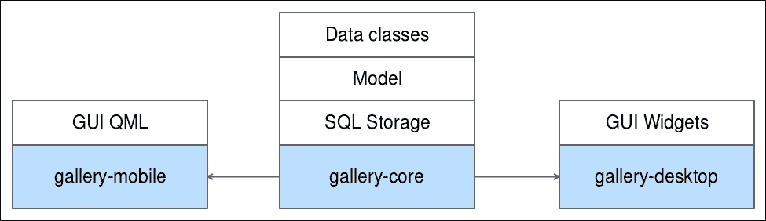
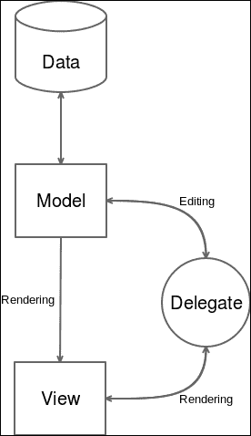
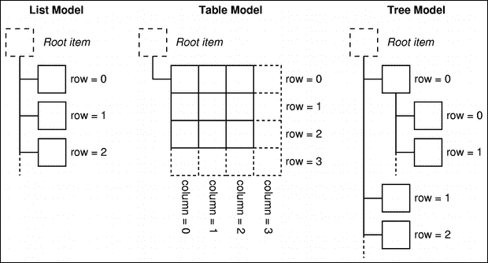

# 第三章. 分割你的项目并统治你的代码

上一章深入探讨了 qmake，研究了信号/槽系统背后的内容，并介绍了一种实现平台特定代码的合理方法。本章旨在向您展示如何正确分割项目，以充分利用 Qt 框架。

为了做到这一点，你将创建一个处理相册和图片的画廊应用程序。你将能够创建、读取、更新和删除任何相册，并以缩略图网格或全分辨率显示图片。所有内容都将持久化在 SQL 数据库中。

本章通过创建一个将在以下两个章节中使用的核心库来奠定画廊的基础：第四章，*拿下桌面 UI*，和第五章，*统治移动 UI*。

本章涵盖了以下主题：

+   应用程序/库项目分离

+   使用 Qt 进行数据库交互

+   C++14 中的智能指针

+   Qt 中的模型/视图架构及其模型实现

# 设计可维护项目

设计可维护项目的第一步是将它适当地分割成明确定义的模块。一种常见的方法是将引擎与用户界面分开。这种分离迫使你减少代码不同部分之间的耦合，使其更加模块化。

这正是我们将采取的`gallery`应用程序的方法。项目将被分割成三个子项目：



子项目如下：

+   **gallery-core**：这是一个包含应用程序逻辑核心的库：数据类（或业务类）、持久化存储（在 SQL 中），以及通过单个入口点使存储对 UI 可用的模型。

+   **gallery-desktop**：这是一个依赖于`gallery-core`库来获取数据并向用户显示的 Qt 小部件应用程序。该项目将在第四章，*拿下桌面 UI*中介绍。

+   **gallery-mobile**：这是一个针对移动平台（Android 和 iOS）的 QML 应用程序。它也将依赖于`gallery-core`。该项目将在第五章，*统治移动 UI*中介绍。

如您所见，每一层都有单一的责任。这个原则既应用于项目结构，也应用于代码组织。在这三个项目中，我们将努力实现章节的座右铭：“分割你的项目，统治你的代码”。

为了以这种方式分离你的 Qt 项目，我们将创建一种不同类型的项目，即**Subdirs**项目：

1.  点击**文件** | **新建文件**或**项目**。

1.  在**项目类型**中，选择**其他项目** | **Subdirs 项目** | **选择**。

1.  将其命名为`ch03-gallery-core`，然后点击**选择**。

1.  选择你最新的 Qt 桌面套件，然后点击**下一步** | **完成并添加子项目**。

在这里，Qt Creator 创建了父项目`ch03-gallery-core`，它将托管我们的三个子项目（`gallery-core`、`gallery-desktop`和`gallery-mobile`）。父项目本身没有代码也没有编译单元，它只是将多个`.pro`项目分组并表达它们之间依赖关系的一种方便方式。

下一步是创建第一个`subdir`项目，这是你在点击**完成并添加子项目**后 Qt Creator 立即提出的。我们将从`gallery-core`开始：

1.  在**项目**选项卡中选择**库**。

1.  选择**C++库**。

1.  选择**共享库**类型，并将其命名为`gallery-core`，然后点击**下一步**。

1.  选择模块，**QtCore**和**QtSql**，然后点击**下一步**。

1.  在**类名**字段中输入**Album**，然后点击**下一步**。Qt Creator 将生成以这个类为例的库的基本框架。

1.  确认项目已正确添加为`ch03-gallery-core.pro`的子项目，然后点击**完成**。

在深入研究`gallery-core`代码之前，让我们研究一下 Qt Creator 为我们做了什么。打开父级`.pro`文件，`ch03-gallery-core.pro`：

```cpp
TEMPLATE = subdirs 

SUBDIRS += \ 
    gallery-core 

```

到目前为止，我们在`.pro`文件中使用了`TEMPLATE = app`语法。`subdirs`项目模板指示 Qt 去寻找要编译的子项目。当我们把`gallery-core`项目添加到`ch03-gallery-core.pro`中时，Qt Creator 将其添加到了`SUBDIRS`变量中。正如你所见，`SUBDIRS`是一个列表，所以你可以添加任意多的子项目。

当编译`ch03-gallery-core.pro`时，Qt 会扫描每个`SUBDIRS`值来编译它们。我们现在可以切换到`gallery-core.pro`：

```cpp
QT       += sql 
QT       -= gui 

TARGET = gallery-core 
TEMPLATE = lib 

DEFINES += GALLERYCORE_LIBRARY 
SOURCES += Album.cpp 
HEADERS += Album.h\ 
        gallery-core_global.h 

unix { 
    target.path = /usr/lib 
    INSTALLS += target 
} 

```

让我们看看它是如何工作的：

+   `QT`已附加了`sql`模块并删除了`gui`模块。默认情况下，**QtGui**总是包含在内，必须显式删除。

+   `TEMPLATE`的值再次不同。我们使用`lib`来告诉 qmake 生成一个 Makefile，该 Makefile 将输出一个名为`gallery-core`的共享库（由`TARGET`变量指定）。

+   `DEFINES += GALLERY_CORE_LIBRARY`语法是一个编译标志，它让编译器知道何时导入或导出库符号。我们很快就会回到这个概念。

+   `HEADERS`包含了我们的第一个类`Album.h`，还有一个由 Qt 生成的头文件：`gallery-core_global.h`。这个文件是 Qt 提供的一种语法糖，用于简化跨平台库的痛苦。

+   `unix { ... }`范围指定了库的安装目标。这个平台范围是生成的，因为我们是在 Linux 上创建的项目。默认情况下，它将尝试在系统库路径（`/usr/lib`）中安装库。

请完全删除`unix`范围，我们不需要使库在系统范围内可用。

为了更好地理解跨平台共享对象问题，你可以打开`gallery-core_global.h`：

```cpp
#include <QtCore/qglobal.h> 

#if defined(GALLERYCORE_LIBRARY) 
#  define GALLERYCORESHARED_EXPORT Q_DECL_EXPORT 
#else 
#  define GALLERYCORESHARED_EXPORT Q_DECL_IMPORT 
#endif 

```

我们再次遇到了在 `gallery-core.pro` 文件中定义的 `GALLERYCORE_LIBRARY`。Qt Creator 为我们生成了一段有用的代码：在共享库中处理符号可见性的跨平台方式。

当您的应用程序链接到共享库时，符号函数、变量或类必须以特殊方式标记，以便使用共享库的应用程序可见。符号的默认可见性取决于平台。某些平台默认隐藏符号，其他平台将它们公开。当然，每个平台和编译器都有自己的宏来表示这种公共/私有概念。

为了避免整个 `#ifdef windows #else` 模板代码，Qt 提供了 `Q_DECL_EXPORT`（如果我们正在编译库）和 `Q_DECL_IMPORT`（如果我们正在使用共享库编译您的应用程序）。因此，在您想要标记为公共的符号中，您只需使用 `GALLERYCORESHARED_EXPORT` 宏。

一个示例在 `Album.h` 文件中：

```cpp
#ifndef ALBUM_H 
#define ALBUM_H 

#include "gallery-core_global.h" 

class GALLERYCORESHARED_EXPORT Album 
{ 

public: 
    Album(); 
}; 

#endif // ALBUM_H 

```

您包含适当的 `gallery-core_global.h` 文件以访问宏，并在 `class` 关键字之后使用它。它不会过多地污染您的代码，并且仍然是跨平台的。

### 注意

另一种可能性是创建一个 **静态链接库**。如果您想要处理更少的依赖项（单个二进制文件总是更容易部署），这个路径很有趣。但有几个缺点：

+   增加编译时间：每次您修改库时，应用程序也必须重新编译。

+   更紧密的耦合，多个应用程序不能链接到您的库。每个都必须嵌入它。

# 定义数据类

我们正在从头开始构建我们的画廊。我们将从实现数据类开始，以便能够正确编写数据库层。应用程序的目标是将图片组织到专辑中。因此，两个明显的类是 `Album` 和 `Picture`。在我们的示例中，一个专辑仅仅有一个名称。`Picture` 类必须属于 `Album` 类，并有一个文件路径（原始文件在文件系统中的路径）。

`Album` 类在项目创建时就已经创建好了。打开 `Album.h` 文件，并更新它以包含以下实现：

```cpp
#include <QString> 

#include "gallery-core_global.h" 

class GALLERYCORESHARED_EXPORT Album 
{ 
public: 
    explicit Album(const QString& name = ""); 

    int id() const; 
    void setId(int id); 
    QString name() const; 
    void setName(const QString& name); 

private: 
    int mId; 
    QString mName; 
}; 

```

如您所见，`Album` 类仅包含一个 `mId` 变量（数据库 ID）和一个 `mName` 变量。按照典型的 **OOP**（面向对象范式）风格，`Album` 类本应有一个 `QVector<Picture>mPictures` 字段。我们故意没有这样做。通过解耦这两个对象，当我们想要加载一个专辑而不需要拉取潜在的数千张相关图片时，我们将拥有更多的灵活性。在 `Album` 类中拥有 `mPictures` 的另一个问题是，使用此代码的开发者（您或其他人）会问自己：何时加载 `mPictures`？我应该只部分加载 `Album` 并得到一个不完整的 `Album`，还是应该总是加载包含所有图片的 `Album`？

通过完全删除该字段，问题就消失了，代码也更容易理解。开发者会直觉地知道，如果他想使用图片，就必须显式地加载它们；否则，他可以继续使用这个简单的 `Album` 类。

获取器和设置器已经很明确了；我们将让您在不向您展示的情况下实现它们。我们只会看看 `Album.cpp` 中的 `Album` 类的构造函数：

```cpp
Album::Album(const QString& name) : 
    mId(-1), 
    mName(name) 
{ 
} 

```

`mId` 变量被初始化为 `-1` 以确保默认使用一个无效的 ID，并且 `mName` 变量被分配一个 `name` 值。

现在我们可以继续到 `Picture` 类。创建一个新的 C++ 类名为 `Picture` 并打开 `Picture.h` 进行如下修改：

```cpp
#include <QUrl> 
#include <QString> 

#include "gallery-core_global.h" 

class GALLERYCORESHARED_EXPORT Picture 
{ 
public: 
    Picture(const QString& filePath = ""); 
    Picture(const QUrl& fileUrl); 

    int id() const; 
    void setId(int id); 

    int albumId() const; 
    void setAlbumId(int albumId); 

    QUrl fileUrl() const; 
    void setFileUrl(const QUrl& fileUrl); 
private: 
    int mId; 
    int mAlbumId; 
    QUrl mFileUrl; 
}; 

```

不要忘记在 `class` 关键字之前添加 `GALLERYCORESHARED_EXPORT` 宏，以便从库中导出类。作为一个数据结构，`Picture` 有一个 `mId` 变量，属于一个 `mAlbumId` 变量，并且有一个 `mUrl` 值。我们使用 `QUrl` 类型来使路径操作更容易使用，这取决于平台（桌面或移动）。

让我们看看 `Picture.cpp`：

```cpp
#include "Picture.h" 
Picture::Picture(const QString& filePath) : 
    Picture(QUrl::fromLocalFile(filePath)) 
{ 
} 

Picture::Picture(const QUrl& fileUrl) : 
    mId(-1), 
    mAlbumId(-1), 
    mFileUrl(fileUrl) 
{ 
} 

QUrl Picture::fileUrl() const 
{ 
    return mFileUrl; 
} 

void Picture::setFileUrl(const QUrl& fileUrl) 
{ 
    mFileUrl = fileUrl; 
} 

```

在第一个构造函数中，静态函数 `QUrl::fromLocalFile` 被调用，为其他构造函数提供一个 `QUrl` 对象，该构造函数接受一个 `QUrl` 参数。

在 C++11 中，能够调用其他构造函数是一个很好的补充。

# 将您的数据存储在数据库中

现在数据类已经准备好了，我们可以继续实现数据库层。Qt 提供了一个现成的 `sql` 模块。Qt 使用 SQL 数据库驱动程序支持各种数据库。在 `gallery-desktop` 中，我们将使用包含在 `sql` 模块中的 `SQLITE3` 驱动程序，它非常适合用例：

+   **一个非常简单的数据库模式**：不需要复杂的查询

+   **非常少或没有并发事务**：不需要复杂的交易模型

+   **单一用途数据库**：不需要启动系统服务，数据库存储在一个单独的文件中，并且不需要被多个应用程序访问

数据库将从多个位置访问；我们需要有一个单一的入口点。创建一个新的 C++ 类名为 `DatabaseManager` 并修改 `DatabaseManager.h` 以如下所示：

```cpp
#include <QString> 

class QSqlDatabase; 

const QString DATABASE_FILENAME = "gallery.db"; 

class DatabaseManager 
{ 
public: 
    static DatabaseManager& instance(); 
    ~DatabaseManager(); 

protected: 
    DatabaseManager(const QString& path = DATABASE_FILENAME); 
    DatabaseManager& operator=(const DatabaseManager& rhs); 

private: 
    QSqlDatabase* mDatabase; 
}; 

```

首先要注意的是，我们在 `DatabaseManager` 类中实现了单例模式，就像我们在第二章的“在单例中转换 SysInfo”部分所做的那样，即 第二章，*发现 QMake 秘密*。`DatabaseManager` 类将在 `mDatabase` 字段中打开连接并将其借给其他可能的类。

此外，`QSqlDatabase`被前置声明并用作`mDatabase`字段的指针。我们本可以包含`QSqlDatabase`头文件，但这样会有一个不希望出现的副作用：包含`DatabaseManager`的每个文件都必须也包含`QSqlDatabase`。因此，如果我们应用程序中存在一些传递性包含（链接到`gallery-core`库），应用程序将被迫启用`sql`模块。因此，存储层通过库泄漏。应用程序不应了解存储层实现。对于应用程序来说，它可以是 SQL、XML 或其他任何东西；库是一个应该遵守合同并持久化数据的黑盒。

让我们切换到`DatabaseManager.cpp`并打开数据库连接：

```cpp
#include "DatabaseManager.h" 

#include <QSqlDatabase> 

DatabaseManager& DatabaseManager::instance() 
{ 
    static DatabaseManager singleton; 
    return singleton; 
} 

DatabaseManager::DatabaseManager(const QString& path) : 
    mDatabase(new QSqlDatabase(QSqlDatabase::addDatabase("QSQLITE"))) 
{ 
    mDatabase->setDatabaseName(path); 
    mDatabase->open(); 
} 

DatabaseManager::~DatabaseManager() 
{ 
    mDatabase->close(); 
    delete mDatabase; 
} 

```

在`mDatabase`字段初始化时，通过`QSqlDatabase::addDatabase("QSQLITE")`函数调用选择正确的数据库驱动。接下来的步骤只是配置数据库名称（碰巧是 SQLITE3 中的文件路径）和通过`mDatabase->open()`函数打开连接。在`DatabaseManager`析构函数中，关闭连接并正确删除`mDatabase`指针。

数据库连接现在已打开；我们只需执行我们的`Album`和`Picture`查询。在`DatabaseManager`中为我们的数据类实现**CRUD**（**创建**/**读取**/**更新**/**删除**）操作会迅速将`DatabaseManager.cpp`的长度增加到数百行。添加更多表，你就可以看到`DatabaseManager`会变成一个怪物。

因此，我们的每个数据类都将有一个专门的数据库类，负责所有的数据库 CRUD 操作。我们将从`Album`类开始；创建一个新的 C++类名为`AlbumDao`（数据访问对象）并更新`AlbumDao.h`：

```cpp
class QSqlDatabase; 

class AlbumDao 
{ 
public: 
    AlbumDao(QSqlDatabase& database); 
    void init() const; 

private: 
    QSqlDatabase& mDatabase; 
}; 

```

`AlbumDao`类的构造函数接受一个`QSqlDatabase&`参数。这个参数是`AlbumDao`类将用于所有 SQL 查询的数据库连接。`init()`函数的目的是创建`albums`表，应该在`mDatabase`打开时调用。

让我们看看`AlbumDao.cpp`的实现：

```cpp
#include <QSqlDatabase> 
#include <QSqlQuery> 

#include "DatabaseManager.h" 

AlbumDao::AlbumDao(QSqlDatabase& database) : 
    mDatabase(database) 
{ 
} 

void AlbumDao::init() const 
{ 
    if (!mDatabase.tables().contains("albums")) { 
        QSqlQuery query(mDatabase); 
        query.exec("CREATE TABLE albums (id INTEGER PRIMARY KEY AUTOINCREMENT, name TEXT)"); 
    } 
} 

```

如同往常，`mDatabase`字段使用数据库参数进行初始化。在`init()`函数中，我们可以看到实际 SQL 请求的执行过程。如果`albums`表类不存在，将创建一个`QSqlQuery`查询，该查询将使用`mDatabase`连接来执行。如果你省略`mDatabase`，查询将使用默认的匿名连接。`query.exec()`函数是执行查询的最简单方式：你只需传递查询的`QString`类型，然后操作就完成了。在这里，我们创建`albums`表，其字段与数据类`Album`（`id`和`name`）相匹配。

### 小贴士

`QSqlQuery::exec()` 函数返回一个 `bool` 值，表示请求是否成功。在你的生产代码中，始终检查这个值。你可以使用 `QSqlQuery::lastError()` 进一步调查错误。一个示例可以在章节的源代码中找到，在 `DatabaseManager::debugQuery()` 中。

`AlbumDao` 类的骨架已经完成。下一步是将它与 `DatabaseManager` 类链接起来。更新 `DatabaseManager` 类如下：

```cpp
// In DatabaseManager.h 
#include "AlbumDao.h" 

... 

private: 
    QSqlDatabase* mDatabase; 

public: 
    const AlbumDao albumDao; 
}; 

// In DatabaseManager.cpp 
DatabaseManager::DatabaseManager(const QString& path) : 
    mDatabase(new QSqlDatabase(QSqlDatabase::addDatabase("QSQLITE"))), 
    albumDao(*mDatabase) 
{ 
    mDatabase->setDatabaseName(path); 
    mDatabase->open(); 

    albumDao.init(); 
} 

```

`albumDao` 字段在 `DatabaseManager.h` 文件中被声明为 `public const AlbumDao`。这需要一些解释：

+   `public` 可见性是为了让 `DatabaseManager` 客户端能够访问 `albumDao` 字段。API 已经足够直观；如果你想在 `album` 上执行数据库操作，只需调用 `DatabaseManager::instance().albumDao`。

+   `const` 关键字是为了确保没有人可以修改 `albumDao`。因为它 `public`，我们无法保证对象的安全性（任何人都可以修改对象）。作为副作用，我们强制 `AlbumDao` 的每个公共函数都是 `const`。这很有意义；毕竟，`AlbumDao` 字段可能是一个包含许多函数的命名空间。将其作为一个类更方便，因为我们可以用 `mDatabase` 字段保持对数据库连接的引用。

在 `DatabaseManager` 构造函数中，`albumDao` 类使用 `mDatabase` 解引用指针进行初始化。在数据库连接打开后，调用 `albumDao.init()` 函数。

我们现在可以继续实现更有趣的 SQL 查询。我们可以从在 `AlbumDao` 类中创建一个新的专辑开始：

```cpp
// In AlbumDao.h 
class QSqlDatabase; 
class Album; 

class AlbumDao 
{ 
public: 
    AlbumDao(QSqlDatabase& database); 
    void init() const; 

    void addAlbum(Album& album) const; 
    ... 
}; 

// In AlbumDao.cpp 

#include <QSqlDatabase> 
#include <QSqlQuery> 
#include <QVariant> 

... 

void AlbumDao::addAlbum(Album& album) const 
{ 
    QSqlQuery query(mDatabase); 
    query.prepare("INSERT INTO albums (name) VALUES (:name)"); 
    query.bindValue(":name", album.name()); 
    query.exec(); 
    album.setId(query.lastInsertId().toInt()); 
} 

```

`addAlbum()` 函数接受一个 `album` 参数，提取其信息并执行相应的查询。在这里，我们采用了预查询的概念：`query.prepare()` 函数接受一个 `query` 参数，其中包含稍后提供的参数的占位符。我们将使用 `:name` 语法提供 `name` 参数。支持两种语法：Oracle 风格的冒号-名称（例如，`:name`）或 ODBC 风格的问号（例如，`?name`）。

然后，我们将 `bind :name` 语法绑定到 `album.name()` 函数的值。因为 `QSqlQuery::bind()` 期望一个 `QVariant` 作为参数值，所以我们必须向这个类添加 `include` 指令。

简而言之，`QVariant` 是一个通用数据持有者，可以接受广泛的原始类型（`char`、`int`、`double` 等）和复杂类型（`QString`、`QByteArray`、`QUrl` 等）。

当执行 `query.exec()` 函数时，绑定的值会被正确替换。`prepare()` 语句技术使代码对 SQL 注入（注入一个隐藏请求会失败）更加健壮，并且更易于阅读。

查询的执行会修改查询对象`query`本身的状态。`QSqlQuery`查询不仅是一个 SQL 查询执行器，它还包含活动查询的状态。我们可以使用`query.lastInsertId()`函数检索有关查询的信息，该函数返回一个包含我们刚刚插入的相册行 ID 的`QVariant`值。这个`id`被赋予在`addAlbum()`参数中提供的`album`。因为我们修改了`album`，所以我们不能将参数标记为`const`。对代码的`const`正确性严格把关是给其他开发者一个好的提示，他们可以推断出你的函数可能会（或可能不会）修改传递的参数。

剩余的更新和删除操作严格遵循与`addAlbum()`相同的模式。我们将在下一个代码片段中提供预期的函数签名。请参考该章节的源代码以获取完整的实现。然而，我们需要实现检索数据库中所有相册的请求。这个请求值得仔细看看：

```cpp
// In AlbumDao.h 
#include <QVector> 

    ... 
    void addAlbum(Album& album) const; 
    void updateAlbum(const Album& album) const; 
    void removeAlbum(int id) const; 
    QVector<Album*> albums() const; 
    ... 
}; 

// In AlbumDao.cpp 
QVector<Album*> AlbumDao::albums() const 
{ 
    QSqlQuery query("SELECT * FROM albums", mDatabase); 
    query.exec(); 
    QVector<Album*> list; 
    while(query.next()) { 
        Album* album = new Album(); 
        album->setId(query.value("id").toInt()); 
        album->setName(query.value("name").toString()); 
        list.append(album); 
    } 
    return list; 
} 

```

`albums()`函数必须返回一个`QVector<Album*>`值。如果我们看一下函数的主体，我们会看到`QSqlQuery`的另一个属性。为了遍历给定请求的多行，`query`处理一个指向当前行的内部游标。然后我们可以继续创建一个`new Album*()`函数，并使用`query.value()`语句填充行数据，该语句接受一个列名参数并返回一个被转换为正确类型的`QVariant`值。这个新的`album`参数被添加到`list`中，最后，这个`list`被返回给调用者。

`PictureDao`类在用法和实现上与`AlbumDao`类非常相似。主要区别在于图片有一个指向相册的外键。`PictureDao`函数必须根据`albumId`参数进行条件限制。下面的代码片段显示了`PictureDao`头文件和`init()`函数：

```cpp
// In PictureDao.h 
#include <QVector> 

class QSqlDatabase; 
class Picture; 

class PictureDao 
{ 
public: 
    explicit PictureDao(QSqlDatabase& database); 
    void init() const; 

    void addPictureInAlbum(int albumId, Picture& picture) const; 
    void removePicture(int id) const; 
    void removePicturesForAlbum(int albumId) const; 
    QVector<Picture*> picturesForAlbum(int albumId) const; 

private: 
    QSqlDatabase& mDatabase; 
}; 

// In PictureDao.cpp 
void PictureDao::init() const 
{ 
    if (!mDatabase.tables().contains("pictures")) { 
        QSqlQuery query(mDatabase); 
        query.exec(QString("CREATE TABLE pictures") 
        + " (id INTEGER PRIMARY KEY AUTOINCREMENT, " 
        + "album_id INTEGER, " 
        + "url TEXT)"); 
    } 
} 

```

如你所见，多个函数接受一个`albumId`参数，以在图片和拥有`album`参数之间建立联系。在`init()`函数中，外键以`album_id INTEGER`语法表示。SQLITE3 没有合适的外键类型。它是一个非常简单的数据库，并且没有对这个类型字段进行严格的约束；这里使用了一个简单的整数。

最后，在`DatabaseManager`类中添加了`PictureDao`函数，其方式与我们为`albumDao`所做的一样。有人可能会争论，如果有很多`Dao`类，那么在`DatabaseManager`类中添加一个`const Dao`成员并快速调用`init()`函数会变得很繁琐。

一个可能的解决方案是创建一个抽象的 `Dao` 类，其中包含一个纯虚的 `init()` 函数。`DatabaseManager` 类将有一个 `Dao` 注册表，它将每个 `Dao` 映射到一个 `QString` 键，并使用 `QHash<QString, const Dao> mDaos`。然后，`init()` 函数调用将在 `for` 循环中进行，并使用 `QString` 键访问 `Dao` 对象。这超出了本项目范围，但仍然是一个有趣的方法。

# 使用智能指针保护你的代码

我们刚才描述的代码是完全有效的，但它可以通过 `AlbumDao::albums()` 函数来加强，特别是这个函数。在这个函数中，我们遍历数据库行并创建一个新的 `Album` 来填充列表。我们可以聚焦于这个特定的代码段：

```cpp
QVector<Album*> list; 
while(query.next()) { 
    Album* album = new Album(); 
    album->setId(query.value("id").toInt()); 
    album->setName(query.value("name").toString()); 
    list.append(album); 
} 
return list; 

```

假设 `name` 列已经被重命名为 `title`。如果你忘记更新 `query.value("name")`，你可能会遇到麻烦。Qt 框架不依赖于异常，但并非所有野外的 API 都是这样。这里的异常会导致内存泄漏：`Album* album` 函数已经在堆上分配，但未释放。为了处理这种情况，你需要在有风险的代码周围加上 `try` `catch` 语句，并在抛出异常时释放 `album` 参数。也许这个错误应该向上冒泡；因此，你的 `try` `catch` 语句只是为了处理潜在的内存泄漏。你能想象在你面前编织的意大利面代码吗？

指针的真正问题是所有权的不可确定性。一旦分配，指针的所有者是谁？谁负责释放对象？当你将指针作为参数传递时，调用者何时保留所有权或将其释放给被调用者？

自 C++11 以来，内存管理达到了一个重要的里程碑：智能指针功能已经稳定，可以大大提高你代码的安全性。目标是通过对简单的模板语义进行显式地指示指针的所有权。有三种类型的智能指针：

+   `unique_ptr` 指针表明所有者是唯一的指针所有者

+   `shared_ptr` 指针表明指针的所有权在多个客户端之间共享

+   `weak_ptr` 指针表明指针不属于客户端

现在，我们将专注于 `unique_ptr` 指针来理解智能指针的机制。

`unique_ptr` 指针实际上是在栈上分配的一个变量，它接管了你提供的指针的所有权。让我们用这种语义来分配一个 `Album`：

```cpp
#include <memory> 
void foo() 
{ 
    Album* albumPointer = new Album(); 
    std::unique_ptr<Album> album(albumPointer); 
    album->setName("Unique Album"); 
} 

```

整个智能指针 API 都可以在 `memory` 头文件中找到。当我们将 `album` 声明为 `unique_ptr` 时，我们做了两件事：

+   我们在栈上分配了一个 `unique_ptr<Album>`。`unique_ptr` 指针依赖于模板在编译时检查指针类型的有效性。

+   我们将 `albumPointer` 内存的所有权授予了 `album`。从这一点开始，`album` 就是指针的所有者。

这简单的一行有重要的影响。首先，你再也不必担心指针的生命周期了。因为 `unique_ptr` 指针是在堆栈上分配的，所以一旦超出作用域就会销毁。在这个例子中，当我们退出 `foo()` 时，`album` 将从堆栈中移除。`unique_ptr` 实现将负责调用 `Album` 析构函数并释放内存。

其次，你在编译时明确指出了你指针的所有权。如果他们没有自愿地摆弄你的 `unique_ptr` 指针，没有人可以释放 `albumPointer` 的内容。你的同事开发者也可以一眼看出谁是你的指针的所有者。

注意，尽管 `album` 是 `unique_ptr<Album>` 类型，但你仍然可以使用 `->` 操作符调用 `Album` 函数（例如，`album->setName()`）。这是由于这个操作符的重载。`unique_ptr` 指针的使用变得透明。

好吧，这个用例很不错，但指针的目的是能够分配一块内存并共享它。比如说，`foo()` 函数分配了 `album unique_ptr` 指针，然后将所有权转让给 `bar()`。这看起来是这样的：

```cpp
void foo() 
{ 
    std::unique_ptr<Album> album(new Album()); 
    bar(std::move(album)); 
} 

void bar(std::unique_ptr<Album> barAlbum) 
{ 
   qDebug() << "Album name" << barAlbum->name(); 
} 

```

这里，我们介绍 `std::move()` 函数：它的目的是转移 `unique_ptr` 函数的所有权。一旦调用 `bar(std::move(album))`，`album` 就变得无效。你可以用一个简单的 `if` 语句来测试它：`if (album) { ... }`。

从现在起，`bar()` 函数通过在堆栈上分配一个新的 `unique_ptr` 来成为指针的所有者（通过 `barAlbum`），并在退出时释放指针。你不必担心 `unique_ptr` 指针的成本，因为这些对象非常轻量级，它们不太可能影响你应用程序的性能。

再次强调，`bar()` 函数的签名告诉开发者这个函数期望接收传递的 `Album` 的所有权。试图在没有使用 `move()` 函数的情况下传递 `unique_ptr` 将导致编译错误。

另一点需要注意的是，在处理 `unique_ptr` 指针时，`.`（点）和 `->`（箭头）的不同含义：

+   `->` 操作符解引用到指针成员，并允许你调用真实对象的函数

+   `.` 操作符让你可以访问 `unique_ptr` 对象的函数

`unique_ptr` 指针提供了各种函数。其中最重要的包括：

+   `get()` 函数返回原始指针。`album.get()` 返回一个 `Album*` 值。

+   `release()` 函数释放了指针的所有权并返回原始指针。`album.release()` 函数返回一个 `Album*` 值。

+   `reset(pointer p = pointer())`函数销毁当前管理的指针，并获取给定参数的所有权。一个例子是`barAlbum.reset()`函数，它销毁当前拥有的`Album*`。带有参数的`barAlbum.reset(new Album())`也会销毁拥有的对象，并获取提供的参数的所有权。

最后，您可以使用`*`操作符取消引用对象，这意味着`*album`将返回一个`Album&`值。这种取消引用很方便，但您会看到，智能指针使用得越多，您就越不需要它。大多数时候，您会用以下语法替换原始指针：

```cpp
void bar(std::unique_ptr<Album>& barAlbum); 

```

因为我们通过引用传递`unique_ptr`，`bar()`不会获取指针的所有权，并在退出时不会尝试释放它。因此，在`foo()`中不需要使用`move(album)`；`bar()`函数将只对`album`参数进行操作，但不会获取其所有权。

现在，让我们考虑`shared_ptr`。`shared_ptr`指针在指针上保持一个引用计数器。每次`shared_ptr`指针引用相同的对象时，计数器会增加；当这个`shared_ptr`指针超出作用域时，计数器会减少。当计数器达到零时，对象将被释放。

让我们用`shared_ptr`指针重写我们的`foo()`/`bar()`示例：

```cpp
#include <memory> 
void foo() 
{ 
    std::shared_ptr<Album> album(new Album()); // ref counter = 1 
    bar(album); // ref counter = 2 
} // ref counter = 0 

void bar(std::shared_ptr<Album> barAlbum) 
{ 
   qDebug() << "Album name" << barAlbum->name(); 
} // ref counter = 1 

```

如您所见，语法与`unique_ptr`指针非常相似。每次分配新的`shared_ptr`指针并指向相同的数据时，引用计数器会增加，在函数退出时减少。您可以通过调用`album.use_count()`函数来检查当前的计数。

我们将要介绍的最后一个智能指针是`weak_ptr`指针。正如其名所示，它不会获取任何所有权或增加引用计数。当函数指定一个`weak_ptr`时，它向调用者表明它只是一个客户端，而不是指针的所有者。如果我们用`weak_ptr`指针重新实现`bar()`，我们得到：

```cpp
#include <memory> 
void foo() 
{ 
    std::shared_ptr<Album> album(new Album()); // ref counter = 1 
    bar(std::weak_ptr<Album>(album)); // ref counter = 1 
} // ref counter = 0 

void bar(std::weak_ptr<Album> barAlbum) 
{ 
   qDebug() << "Album name" << barAlbum->name(); 
} // ref counter = 1 

```

如果故事到此为止，使用`weak_ptr`与原始指针之间就不会有任何兴趣。`weak_ptr`在悬空指针问题上有一个主要优势。如果您正在构建缓存，通常您不希望保留对对象的强引用。另一方面，您想知道对象是否仍然有效。通过使用`weak_ptr`，您知道对象何时被释放。现在，考虑原始指针方法：您的指针可能无效，但您不知道内存的状态。

在 C++14 中引入了另一个语义，我们必须涵盖：`make_unique`。这个关键字旨在替换`new`关键字，并以异常安全的方式构造一个`unique_ptr`对象。这是它的用法：

```cpp
unique_ptr<Album> album = make_unique<Album>(); 

```

`make_unique`关键字封装了`new`关键字，使其异常安全，特别是在这种情况下：

```cpp
foo(new Album(), new Picture()) 

```

这段代码将按以下顺序执行：

1.  分配和构造`Album`函数。

1.  分配和构造`Picture`函数。

1.  执行 `foo()` 函数。

如果 `new Picture()` 抛出异常，由 `new Album()` 分配的内存将会泄漏。这个问题可以通过使用 `make_unique` 关键字来解决：

```cpp
foo(make_unique<Album>(), make_unique<Picture>()) 

```

`make_unique` 关键字返回一个 `unique_ptr` 指针；C++ 标准委员会还提供了 `shared_ptr` 的等效形式 `make_shared`，遵循相同的原理。

所有这些新的 C++ 语义都尽力消除 `new` 和 `delete`。然而，编写所有的 `unique_ptr` 和 `make_unique` 可能会有些繁琐。在 `album` 创建中，`auto` 关键字提供了帮助：

```cpp
auto album = make_unique<Album>() 

```

这与常见的 C++ 语法有很大的不同。变量类型是推断出来的，没有显式的指针，内存是自动管理的。在使用智能指针一段时间后，你会在代码中看到越来越少的原始指针（甚至更少的 `delete`，这真是一种解脱）。剩余的原始指针将简单地表明客户端正在使用指针，但并不拥有它。

总体来说，C++11 和 C++14 的智能指针在 C++ 代码编写中是一个真正的进步。在此之前，代码库越大，我们对内存管理的安全感就越低。我们的头脑在处理这种级别的复杂性时总是不够好。智能指针简单地说让你对自己的代码感到安全。另一方面，你仍然可以完全控制内存。对于性能关键代码，你始终可以自己处理内存。对于其他所有事情，智能指针是明确表示对象所有权和解放思想的一种优雅方式。

我们现在可以重新编写 `AlbumDao::albums()` 函数中的小片段。更新 `AlbumDao::albums()` 如下：

```cpp
// In AlbumDao.h 
std::unique_ptr<std::vector<std::unique_ptr<Album>>> albums() const; 

// In AlbumDao.cpp 
unique_ptr<vector<unique_ptr<Album>>> AlbumDao::albums() const 
{ 
    QSqlQuery query("SELECT * FROM albums", mDatabase); 
    query.exec(); 
    unique_ptr<vector<unique_ptr<Album>>> list(new vector<unique_ptr<Album>>()); 
    while(query.next()) { 
        unique_ptr<Album> album(new Album()); 
        album->setId(query.value("id").toInt()); 
        album->setName(query.value("name").toString()); 
        list->push_back(move(album)); 
    } 
    return list; 
} 

```

哇！`album()` 函数的签名已经变成了一个非常奇特的东西。智能指针本应使你的生活变得更简单，对吧？让我们分解一下，以了解 Qt 中智能指针的一个主要点：容器行为。

重写的初始目标是确保 `album` 的创建。我们希望 `list` 成为 `album` 的明确所有者。这将使我们的 `list` 类型（即 `albums()` 返回类型）变为 `QVector<unique_ptr<Album>>`。然而，当返回 `list` 类型时，其元素将被复制（记住，我们之前定义的返回类型为 `QVector<Album>`）。从这个角度来看，一个自然的解决方案是返回 `QVector<unique_ptr<Album>>*` 类型以保持 `Album` 元素的唯一性。

看看这里的主要痛点：`QVector` 类重载了复制操作符。因此，当返回 `list` 类型时，编译器无法保证我们的 `unique_ptr` 元素的唯一性，并且会抛出编译错误。这就是为什么我们必须求助于标准库中的 `vector` 对象，并编写长类型：`unique_ptr<vector<unique_ptr<Album>>>`。

### 注意

看一下官方对 Qt 容器中`unique_ptr`指针支持的回应。毫无疑问：[`lists.qt-project.org/pipermail/interest/2013-July/007776.html`](http://lists.qt-project.org/pipermail/interest/2013-July/007776.html)。简短的回答是：不，它永远不会完成。永远不要提及它。

如果我们将这个新的`albums()`签名翻译成普通英语，它将读作：`album()`函数返回一个`Album`的向量。这个向量是其包含的`Album`元素的拥有者，而你将是向量的拥有者。

要完成对`albums()`实现的覆盖，你可能注意到我们没有在`list`声明中使用`auto`和`make_unique`关键字。我们的库将在第五章的移动设备上使用，*掌握移动 UI*，并且该平台尚不支持 C++14。因此，我们必须将我们的代码限制在 C++11 中。

我们也遇到了在指令`list->push_back(move(album))`中使用`move`函数的情况。直到那一行，`album`是`while`作用域的“所有者”，移动操作将所有权转移给了列表。在最后的指令`return list`中，我们应该写成`move(list)`，但 C++11 接受直接返回，并且会自动为我们调用`move()`函数。

我们在本节中涵盖的内容是`AlbumDao`类与`PictureDao`完全匹配。请参考章节的源代码以查看完整的`PictureDao`类实现。

# 实现模型

数据已经准备好向潜在的客户（将显示和编辑其内容的应用程序）公开。然而，客户端和数据库之间的直接连接将导致非常强的耦合。如果我们决定切换到另一种存储类型，视图至少部分需要重写。

这就是模型来拯救我们的地方。它是一个抽象层，与数据（我们的数据库）进行通信，并以数据特定的、实现无关的形式向客户端公开这些数据。这种方法是**MVC**（**模型-视图-控制器**）概念的直接后代。让我们回顾一下 MVC 是如何工作的：

+   模型管理数据。它负责请求数据并更新数据。

+   视图向用户显示数据。

+   控制器与模型和视图都进行交互。它负责向视图提供正确的数据，并根据从视图接收到的用户交互向模型发送命令。

这种范式使得在不干扰其他部分的情况下交换各种部分成为可能。多个视图可以显示相同的数据，数据层可以更改，而上层将不会意识到这一点。

Qt 将视图和控制结合在一起形成模型/视图架构。在实现上比完整的 MVC 方法更简单的同时，保留了存储和表示的分离。为了允许编辑和视图定制，Qt 引入了代理的概念，该代理连接到模型和视图：



Qt 关于模型/视图的文档确实非常丰富。然而，有时在细节中迷失方向；有时感觉有点令人不知所措。我们将通过实现 `AlbumModel` 类并观察其工作方式来尝试澄清这些问题。

Qt 提供了各种模型子类，它们都扩展自 `QAbstractItemModel`。在开始实现之前，我们必须仔细选择要扩展的基类。记住，我们的数据是列表的变体：我们将有一个专辑列表，每个专辑将有一个图片列表。让我们看看 Qt 提供了什么：

+   `QAbstractItemModel`：这是一个最抽象的类，因此也是最难实现的。我们将不得不重新定义很多函数来正确使用它。

+   `QStringListModel`：这是一个向视图提供字符串的模型。它太简单了。我们的模型更复杂（我们有自定义对象）。

+   `QSqlTableModel`（或 `QSqLQueryModel`）：这个类是一个非常有趣的竞争者。它自动处理多个 SQL 查询。另一方面，它仅适用于非常简单的表模式。例如，在 `pictures` 表中，`album_id` 外键使其很难适应这个模型。你可能可以节省一些代码行，但感觉就像试图将一个圆形的木塞塞入一个方形的孔中。

+   `QAbstractListModel`：这个类提供了一个提供一维列表的模型。这非常适合我们的需求，节省了很多键盘敲击，并且仍然足够灵活。

我们将使用 `QabstractListModel` 类并创建一个新的 C++ 类名为 `AlbumModel`。更新 `AlbumModel.h` 文件，使其看起来像这样：

```cpp
#include <QAbstractListModel> 
#include <QHash> 
#include <vector> 
#include <memory> 

#include "gallery-core_global.h" 
#include "Album.h" 
#include "DatabaseManager.h" 

class GALLERYCORESHARED_EXPORT AlbumModel : public QAbstractListModel 
{ 
    Q_OBJECT 
public: 

    enum Roles { 
        IdRole = Qt::UserRole + 1, 
        NameRole, 
    }; 

    AlbumModel(QObject* parent = 0); 

    QModelIndex addAlbum(const Album& album); 

    int rowCount(const QModelIndex& parent = QModelIndex()) const override; 
    QVariant data(const QModelIndex& index, int role = Qt::DisplayRole) const override; 
    bool setData(const QModelIndex& index, const QVariant& value, int role) override; 
    bool removeRows(int row, int count, const QModelIndex& parent) override; 
    QHash<int, QByteArray> roleNames() const override; 

private: 
    bool isIndexValid(const QModelIndex& index) const; 

private: 
    DatabaseManager& mDb; 
    std::unique_ptr<std::vector<std::unique_ptr<Album>>> mAlbums; 
}; 

```

`AlbumModel` 类扩展了 `QAbstractListModel` 类，并且只有两个成员：

+   `mDb`：这是数据库的链接。在模型/视图架构中，模型将通过 `mDb` 与数据层进行通信。

+   `mAlbums`：这充当一个缓冲区，将避免过多地访问数据库。类型应该让你想起我们为 `AlbumDao::albums()` 编写的智能指针。

`AlbumModel` 类唯一的特定函数是 `addAlbum()` 和 `isIndexValid()`。其余的都是 `QAbstractListModel` 函数的重写。我们将逐一介绍这些函数，以了解模型是如何工作的。

首先，让我们看看 `AlbumModel` 类在 `AlbumModel.cpp` 文件中的构建方式：

```cpp
AlbumModel::AlbumModel(QObject* parent) : 
    QAbstractListModel(parent), 
    mDb(DatabaseManager::instance()), 
    mAlbums(mDb.albumDao.albums()) 
{ 
} 

```

`mDb` 文件使用 `DatabaseManager` 单例地址初始化，之后我们看到现在著名的 `AlbumDao::albums()` 正在发挥作用。

返回`vector`类型并初始化`mAlbums`。这种语法使得所有权转移是自动的，无需显式调用`std::move()`函数。如果数据库中存储有任何专辑，`mAlbums`将立即填充这些专辑。

每次模型与视图交互（通知我们变化或提供数据）时，都会使用`mAlbums`。因为它仅在内存中，所以读取将非常快。当然，我们必须小心保持`mAlbum`与数据库状态的连贯性，但所有操作都将保持在`AlbumModel`内部机制中。

如我们之前所说，该模型旨在成为与数据交互的中心点。每次数据发生变化时，模型都会发出一个信号来通知视图；每次视图想要显示数据时，它将请求模型提供数据。`AlbumModel`类覆盖了读写访问所需的所有内容。读函数包括：

+   `rowCount()`: 此函数用于获取列表大小

+   `data()`: 此函数用于获取要显示的数据的特定信息

+   `roleNames()`: 此函数用于向框架指示每个“角色”的名称。我们将在接下来的几段中解释什么是角色

编辑函数包括：

+   `setData()`: 此函数用于更新数据

+   `removeRows()`: 此函数用于删除数据

我们将从读取部分开始，其中视图请求模型提供数据。

因为我们将显示专辑列表，所以视图首先应该知道有多少可用项。这是在`rowCount()`函数中完成的：

```cpp
int AlbumModel::rowCount(const QModelIndex& parent) const 
{ 
    return mAlbums->size(); 
} 

```

作为我们的缓冲对象，使用`mAlbums->size()`是完美的。没有必要查询数据库，因为`mAlbums`已经填充了数据库中的所有专辑。`rowCount()`函数有一个未知参数：一个`const QModelIndex& parent`。在这里，它没有被使用，但我们必须在继续`AlbumModel`类的旅程之前解释这个类型背后的含义。

`QModelIndex`类是 Qt 中 Model/View 框架的一个核心概念。它是一个轻量级对象，用于在模型中定位数据。我们使用一个简单的`QAbstractListModel`类，但 Qt 能够处理三种表示类型：



没有比官方 Qt 图表更好的解释了

现在我们来详细看看模型：

+   **列表模型**：在这个模型中，数据存储在一个一维数组中（行）

+   **表格模型**：在这个模型中，数据存储在一个二维数组中（行和列）

+   **树模型**：在这个模型中，数据以父子关系存储

为了处理所有这些模型类型，Qt 提出了`QModelIndex`类，这是一种处理它们的抽象方式。`QModelIndex`类具有针对每个用例的函数：`row()`、`column()`和`parent()`/`child()`。每个`QModelIndex`实例都意味着是短暂的：模型可能会更新，因此索引将变得无效。

模型将根据其数据类型生成索引，并将这些索引提供给视图。然后视图将使用它们查询模型以获取新的数据，而无需知道`index.row()`函数是否对应于数据库行或`vector`索引。

我们可以通过`data()`实现的`index`参数来看到`index`参数的作用：

```cpp
QVariant AlbumModel::data(const QModelIndex& index, int role) const 
{ 
    if (!isIndexValid(index)) { 
        return QVariant(); 
    } 
    const Album& album = *mAlbums->at(index.row()); 

    switch (role) { 
        case Roles::IdRole: 
            return album.id(); 

        case Roles::NameRole: 
        case Qt::DisplayRole: 
            return album.name(); 

        default: 
            return QVariant(); 
    } 
} 

```

视图将使用两个参数请求数据：一个`index`和一个`role`。因为我们已经涵盖了`index`，我们可以专注于`role`的责任。

当数据被显示时，它可能是由多个数据聚合而成的。例如，显示图片将包括缩略图和图片名称。这些数据元素中的每一个都需要由视图检索。`role`参数满足这一需求，它将每个数据元素与一个标签关联，以便视图知道显示的数据类别。

Qt 提供了各种默认角色（`DisplayRole`、`DecorationRole`、`EditRole`等），如果需要，您可以定义自己的角色。这就是我们在`AlbumModel.h`文件中通过`enum Roles`所做的事情：我们添加了`IdRole`和`NameRole`。

`data()`函数的主体现在在我们手中！我们首先使用辅助函数`isIndexValid()`测试`index`的有效性。查看该章节的源代码以详细了解其功能。视图请求在特定的`index`处获取数据：我们使用`*mAlbums->at(index.row())`检索给定`index`处的`album`行。

这将在`index.row()`索引处返回一个`unique_ptr<Album>`值，并且我们取消引用它以获得一个`Album&`。在这里，`const`修饰符很有趣，因为我们处于一个读取函数中，修改`album`行没有意义。`const`修饰符在编译时添加了这个检查。

`role`参数上的`switch`告诉我们应该返回哪种数据类别。`data()`函数返回一个`QVariant`值，这是 Qt 中类型的瑞士军刀。如果我们没有处理指定的角色，我们可以安全地返回`album.id()`、`album.name()`或默认的`QVariant()`。

最后要覆盖的读取函数是`roleNames()`：

```cpp
QHash<int, QByteArray> AlbumModel::roleNames() const 
{ 
    QHash<int, QByteArray> roles; 
    roles[Roles::IdRole] = "id"; 
    roles[Roles::NameRole] = "name"; 
    return roles; 
} 

```

在这个抽象级别，我们不知道将使用哪种视图来显示我们的数据。如果视图是用 QML 编写的，它们将需要有关数据结构的一些元信息。`roleNames()`函数提供了这些信息，因此可以通过 QML 访问角色名称。如果您只为桌面小部件视图编写，可以安全地忽略此函数。我们目前正在构建的库将用于 QML；这就是为什么我们重写了这个函数。

模型的读取部分现在已完成。客户端视图已经拥有了正确查询和显示数据所需的一切。我们现在将研究 `AlbumModel` 的编辑部分。

我们将从创建一个新的专辑开始。视图将构建一个新的 `Album` 对象，并将其传递给 `Album::addAlbum()` 以正确持久化：

```cpp
QModelIndex AlbumModel::addAlbum(const Album& album) 
{ 
    int rowIndex = rowCount(); 
    beginInsertRows(QModelIndex(), rowIndex, rowIndex); 
    unique_ptr<Album> newAlbum(new Album(album)); 
    mDb.albumDao.addAlbum(*newAlbum); 
    mAlbums->push_back(move(newAlbum)); 
    endInsertRows(); 
    return index(rowIndex, 0); 
} 

```

索引是导航模型数据的一种方式。我们首先做的事情是通过 `rowCount()` 获取 `mAlbums` 的大小，以确定这个新专辑的索引。

从这里开始，我们开始使用特定的模型函数：`beginInsertRows()` 和 `endInsertRows()`。这些函数封装了实际的数据修改。它们的目的在于自动触发可能感兴趣的任何人的信号：

+   `beginInsertRows()`：此函数通知给定索引的行即将更改

+   `endInsertRows()`：此函数通知行已更改

`beginInsertRows()` 函数的第一个参数是新元素的 `parent`。对于模型，根始终是空的 `QModelIndex()` 构造函数。因为我们没有在 `AlbumModel` 中处理任何层次关系，所以始终将新元素添加到根是安全的。后续参数是第一个和最后一个修改的索引。我们每次调用插入一个元素，所以我们提供 `rowIndex` 两次。为了说明这个信号的使用，例如，一个视图可能会显示一个加载消息，告诉用户“正在保存 5 个新专辑”。

对于 `endInsertRows()`，感兴趣的视图可能会隐藏保存消息并显示“保存完成”。

起初这可能会看起来有些奇怪，但它使 Qt 能够以通用的方式自动为我们处理很多信号。你很快就会看到，当在 第四章 设计应用程序的 UI 时，这种做法是如何很好地工作的，*征服桌面 UI*。

实际的插入操作在 `beginInsertRows()` 指令之后开始。我们首先使用 `unique_ptr<Album> newAlbum` 创建 `album` 行的副本。然后，使用 `mDb.albumDao.addAlbum(*newAlbum)` 将此对象插入数据库中。不要忘记，`AlbumDao::addAlbum()` 函数还会修改传入的专辑，将其 `mId` 设置为最后一个 SQLITE3 插入的 ID。

最后，`newAlbum` 被添加到 `mAlbums` 中，并且其所有权也通过 `std::move()` 转移。返回值提供了这个新专辑的索引对象，它简单地将行封装在一个 `QModelIndex` 对象中。

让我们继续编辑函数，使用 `setData()`：

```cpp
bool AlbumModel::setData(const QModelIndex& index, const QVariant& value, int role) 
{ 
    if (!isIndexValid(index) 
            || role != Roles::NameRole) { 
        return false; 
    } 
    Album& album = *mAlbums->at(index.row()); 
    album.setName(value.toString()); 
    mDb.albumDao.updateAlbum(album); 
    emit dataChanged(index, index); 
    return true; 
} 

```

当视图想要更新数据时，会调用此函数。其签名与 `data()` 非常相似，但增加了额外的参数值。

主体部分也遵循相同的逻辑。在这里，`album` 行是一个 `Album&`，没有 `const` 关键字。唯一可以编辑的值是名称，这是在对象上完成的，然后持久化到数据库中。

我们必须发出`dataChanged()`信号来通知所有感兴趣的人，对于给定的索引（起始索引和结束索引），有一行发生了变化。这个强大的机制集中了所有数据的状态，使得可能的视图（例如相册列表和当前相册详情）能够自动刷新。

函数的返回值简单地指示数据更新是否成功。在生产应用程序中，您应该测试数据库处理的成功并返回相关值。

最后，我们将介绍最后一个编辑函数`removeRows()`：

```cpp
bool AlbumModel::removeRows(int row, int count, const QModelIndex& parent) 
{ 
    if (row < 0 
            || row >= rowCount() 
            || count < 0 
            || (row + count) > rowCount()) { 
        return false; 
    } 
    beginRemoveRows(parent, row, row + count - 1); 
    int countLeft = count; 
    while (countLeft--) { 
        const Album& album = *mAlbums->at(row + countLeft); 
        mDb.albumDao.removeAlbum(album.id()); 
    } 
    mAlbums->erase(mAlbums->begin() + row, 
                  mAlbums->begin() + row + count); 
    endRemoveRows(); 
    return true; 
} 

```

函数签名现在应该看起来很熟悉了。当一个视图想要删除行时，它必须提供起始行、要删除的行数以及行的父级。

之后，就像我们对`addAlbum()`所做的那样，我们用两个函数包装有效的删除操作：

+   `beginRemoveRows()`函数，它期望父级、起始索引和最后一个索引

+   `endRemoveRows()`函数，它只是简单地触发模型框架中的自动信号

函数的其余部分并不难理解。我们遍历要删除的行，并对每一行，我们从数据库中删除它，并从`mAlbums`中移除它。我们简单地从我们的内存`mAlbums`向量中检索相册，并使用`mDb.albumDao.removeAlbum(album.id())`处理实际的数据库删除操作。

`AlbumModel`类现在已经完全介绍完毕。您现在可以创建一个新的 C++类，并将其命名为`PictureModel`。

我们将不会详细讨论`PictureModel`类。主要部分是相同的（你只需将数据类`Album`替换为`Picture`）。然而，有一个主要区别：`PictureModel`始终处理给定相册的图片。这个设计选择说明了如何仅通过一些简单的信号将两个模型链接起来。

这里是`PictureModel.h`的更新版本：

```cpp
#include <memory> 
#include <vector> 

#include <QAbstractListModel> 

#include "gallery-core_global.h" 
#include "Picture.h" 

class Album; 
class DatabaseManager; 
class AlbumModel; 

class GALLERYCORESHARED_EXPORT PictureModel : public QAbstractListModel 
{ 
    Q_OBJECT 
public: 

    enum PictureRole { 
        FilePathRole = Qt::UserRole + 1 
    }; 
    PictureModel(const AlbumModel& albumModel, QObject* parent = 0); 

    QModelIndex addPicture(const Picture& picture); 

    int rowCount(const QModelIndex& parent = QModelIndex()) const override; 
    QVariant data(const QModelIndex& index, int role) const override; 
    bool removeRows(int row, int count, const QModelIndex& parent) override; 

    void setAlbumId(int albumId); 
    void clearAlbum(); 

public slots: 
    void deletePicturesForAlbum(); 

private: 
    void loadPictures(int albumId); 
    bool isIndexValid(const QModelIndex& index) const; 

private: 
    DatabaseManager& mDb; 
    int mAlbumId; 
    std::unique_ptr<std::vector<std::unique_ptr<Picture>>> mPictures; 
}; 

```

有趣的部分是关于相册的部分。如您所见，构造函数期望一个`AlbumModel`。这个类也存储当前的`mAlbumId`，以便只能请求给定相册的图片。让我们看看构造函数实际上做了什么：

```cpp
PictureModel::PictureModel(const AlbumModel& albumModel, QObject* parent) : 
    QAbstractListModel(parent), 
    mDb(DatabaseManager::instance()), 
    mAlbumId(-1), 
    mPictures(new vector<unique_ptr<Picture>>()) 
{ 
    connect(&albumModel, &AlbumModel::rowsRemoved, 
            this, &PictureModel::deletePicturesForAlbum); 
} 

```

如您所见，`albumModel`类仅用于将信号连接到我们的槽`deletePicturesForAlbum()`，这一点不言自明。这确保了数据库始终有效：如果拥有相册被删除，则应该删除图片。当`AlbumModel`发出`rowsRemoved`信号时，这将自动完成。

现在，`mPictures`不是初始化为数据库中的所有图片。因为我们选择将`PictureModel`限制为只处理给定相册的图片，所以在`PictureModel`的构造时我们不知道要选择哪个相册。加载只能在相册被选择时进行，在`setAlbumId()`中：

```cpp
void PictureModel::setAlbumId(int albumId) 
{ 
    beginResetModel(); 
    mAlbumId = albumId; 
    loadPictures(mAlbumId); 
    endResetModel(); 
} 

```

当相册发生变化时，我们会完全重新加载 `PictureModel`。重新加载阶段被 `beginResetModel()` 和 `endResetModel()` 函数包裹。它们会通知任何附加的视图，它们的状态也应该被重置。模型之前报告的任何数据（例如，`QModelIndex`）都变得无效。

`loadPictures()` 函数相当直接：

```cpp
void PictureModel::loadPictures(int albumId) 
{ 
    if (albumId <= 0) { 
         mPictures.reset(new vector<unique_ptr<Picture>>()); 
        return; 
    } 
    mPictures = mDb.pictureDao.picturesForAlbum(albumId); 
} 

```

按照惯例，我们决定，如果提供了一个负的 `album id`，则清除图片。为此，我们使用调用 `mPictures.reset(new vector<unique_ptr<Picture>>())` 来重新初始化 `mPictures`。这将调用拥有向量的析构函数，进而对 `Picture` 元素执行相同的操作。我们强制 `mPictures` 总是拥有一个有效的向量对象，以避免任何可能的空引用（例如，在 `PictureModel::rowCount()` 中）。

之后，我们只需将给定 `albumId` 的数据库图片分配给 `mPictures`。因为我们每个级别都使用智能指针，所以我们甚至看不到任何特定的语义。不过，`mPicture` 是一个 `unique_ptr<vector<unique_ptr<Picture>>>`。当调用 `=` 操作符时，`unique_ptr` 会重载它，发生以下两个操作：

+   右侧（从数据库检索到的图片）的所有权转移到了 `mPictures`

+   `mPictures` 的旧内容会自动删除

它实际上等同于调用 `mPictures.reset()` 然后执行 `mPictures = move(mDb.pictureDao.picturesForAlbum(albumId))`。使用 `=` 重载，一切都会变得流畅得多，阅读起来也更加愉快。

`PictureModel` 展示了模型范式可以有多灵活。你可以轻松地将其适应到自己的用例中，而无需进行任何强耦合。毕竟，`albumModel` 只用于连接到单个信号；没有保留的引用。类的其余部分可以在章节的源代码中找到。

# 摘要

本章是一次创建一个定义良好的 `gallery-core` 库的旅程。我们使用 `.pro` 文件研究了高级技术，以将项目拆分为子模块，在智能指针的帮助下将数据持久化到 SQLITE3 数据库中，并最终研究了 Qt 中的模型/视图架构是如何工作的。

从现在起，Qt 的项目组织对你来说应该不再令人生畏。下一章将继续我们停止的地方：库已经准备好了，现在让我们制作出伟大的 QWidgets，以拥有一个令人惊叹的画廊应用程序，并查看模型的另一面：视图层。
