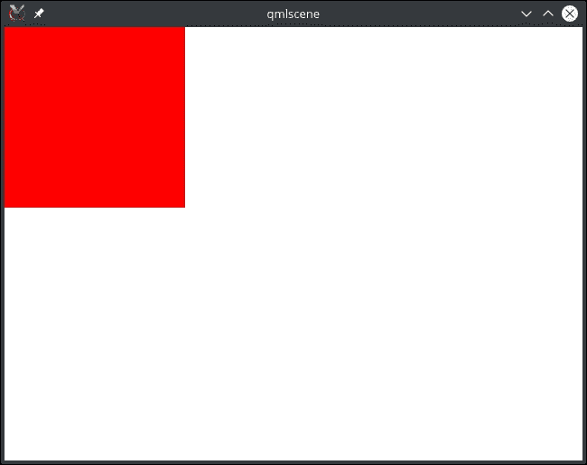
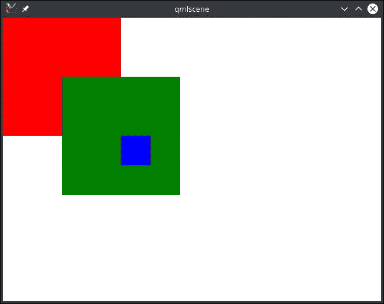
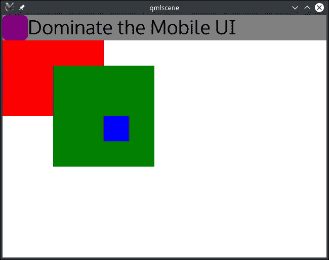
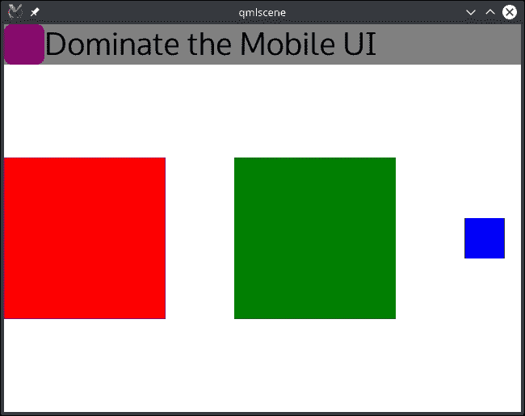
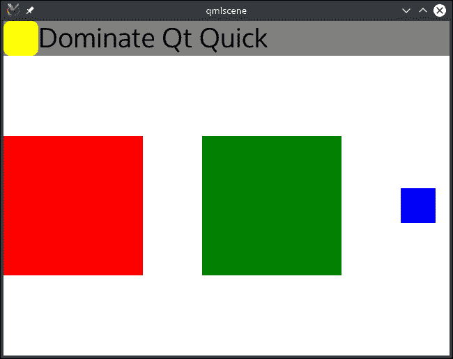
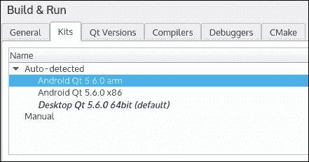
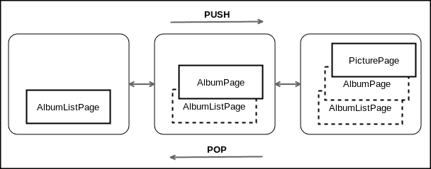

# 第五章  主导移动 UI

在 第三章，*划分项目并管理代码*中，我们创建了一个强大的核心库来处理图片库。现在我们将使用这个 `gallery-core` 库来创建一个移动应用程序。

我们将教你如何从头开始创建 Qt Quick 项目。你将使用 QML 创建自定义 Qt Quick 视图。本章还将介绍你的 QML 视图如何与 C++ 库通信。

在本章结束时，你的画廊应用程序将在你的移动设备（Android 或 iOS）上运行，并具有符合触摸设备的专用 GUI。此应用程序将提供与桌面应用程序相同的功能。

本章涵盖了以下主题：

+   创建 Qt Quick 项目

+   QML

+   Qt Quick 控件

+   Qt 移动（Android 和 iOS）

+   从 QML 调用 C++ 函数

# 从 Qt Quick 和 QML 开始

Qt Quick 是使用 Qt 创建应用程序的另一种方式。你可以用它来创建一个完整的应用程序，代替 Qt Widgets。Qt Quick 模块提供了过渡、动画和视觉效果。你还可以使用着色器自定义图形效果。此模块特别擅长制作使用触摸屏的设备软件。Qt Quick 使用一种专用语言：Qt 模型语言（QML）。它是一种声明性语言；其语法接近 JSON（JavaScript 对象表示法）语法。此外，QML 还支持内联或单独文件中的 JavaScript 表达式。

让我们从使用 QML 的一个简单的 Qt Quick 应用程序示例开始。创建一个名为 `main.qml` 的新文件，并使用以下代码片段：

```cpp
import QtQuick 2.5 
import QtQuick.Window 2.2 

Window { 
    visible: true 
    width: 640; height: 480 

    // A nice red rectangle 
    Rectangle { 
        width: 200; height: 200 
        color: "red" 
    } 
} 

```

Qt 5 提供了一个名为 `qmlscene` 的良好工具，用于原型设计 QML 用户界面。你可以在 Qt 安装文件夹中找到二进制文件，例如：`Qt/5.7/gcc_64/bin/qmlscene`。要加载你的 `main.qml` 文件，你可以运行该工具并选择文件，或者使用 CLI 并在参数中使用 `.qml` 文件：`qmlscene main.qml`。你应该会看到类似这样的内容：



要使用 Qt Quick 模块，你需要导入它。语法很简单：

```cpp
import <moduleName> <moduleVersion> 

```

在这个例子中，我们导入了 `QtQuick`，这是一个提供基本组件（`Rectangle`、`Image`、`Text`）的通用模块，我们还导入了 `QtQuick.Window` 模块，它将提供主窗口应用程序（`Window`）。

一个 QML 组件可以有属性。例如，我们将 `Window` 类的 `width` 属性设置为值 `640`。以下是通用的语法：

```cpp
<ObjectType> { 
    <PropertyName>: <PropertyValue> 
} 

```

我们现在可以更新 `main.qml` 文件，添加一些新的矩形：

```cpp
import QtQuick 2.5 
import QtQuick.Window 2.2 

Window { 
    visible: true 
    width: 640; height: 480 

    Rectangle { 
        width: 200; height: 200 
        color: "red" 
    } 

    Rectangle { 
        width: 200; height: 200 
        color: "green" 
        x: 100; y: 100 

        Rectangle { 
            width: 50; height: 50 
            color: "blue" 
            x: 100; y: 100 
        } 
    } 
} 

```

这是视觉结果：



你的 QML 文件将 UI 描述为组件的层次结构。`Window` 元素以下的层次结构如下：

+   红色 `Rectangle`

+   绿色 `Rectangle`

+   蓝色 `Rectangle`

每个嵌套项都将始终相对于其父项具有其 `x`、`y` 坐标。

为了构建你的应用程序结构，你可以构建可重用的 QML 组件。你可以轻松地创建一个新的组件。所有 QML 组件都必须有一个根项目。让我们通过创建一个名为`MyToolbar.qml`的新文件来构建一个新的`MyToolbar`组件：

```cpp
import QtQuick 2.5 

import QtQuick 2.5 

Rectangle { 
    color: "gray" 
    height: 50 

    Rectangle { 
        id: purpleRectangle 
        width: 50; height: parent.height 
        color: "purple" 
        radius: 10 
    } 

    Text { 
        anchors.left: purpleRectangle.right 
        anchors.right: parent.right 
        text: "Dominate the Mobile UI" 
        font.pointSize: 30 
    } 
} 

```

灰色的`Rectangle`元素将是我们用作背景的根项目。我们还创建了两个项目：

+   一个可以与 ID`purpleRectangle`关联的紫色`Rectangle`元素。此项目的高度将是其父元素的高度，即灰色的`Rectangle`元素。

+   一个`Text`元素。在这种情况下，我们使用锚点。它将帮助我们布局项目而不使用硬编码的坐标。`Text`元素的左侧将与`purpleRectangle`的右侧对齐，而`Text`元素的右侧将与父元素的右侧（灰色的`Rectangle`元素）对齐。

### 注意

Qt Quick 提供了许多锚点：`left`、`horizontalCenter`、`right`、`top`、`verticalCenter`和`bottom`。你还可以使用便利锚点，如`fill`或`centerIn`。有关锚点的更多信息，请参阅[`doc.qt.io/qt-5/qtquick-positioning-anchors.html`](http://doc.qt.io/qt-5/qtquick-positioning-anchors.html)。

你可以通过更新你的`main.qml`来在你的窗口中使用`MyToolbar`：

```cpp
Window { 
    ... 
    MyToolbar { 
        width: parent.width 
    } 
} 

```

我们将宽度设置为父级宽度。就像这样，工具栏填满了窗口的宽度。以下是结果：



锚点非常适合对齐特定项目，但如果你想要以网格、行或列的形式布局多个项目，你可以使用`QtQuick.layouts`模块。以下是一个更新后的`main.qml`示例：

```cpp
import QtQuick 2.5 
import QtQuick.Window 2.2 
import QtQuick.Layouts 1.3 

Window { 
    visible: true 
    width: 640; height: 480 

    MyToolbar { 
        id: myToolbar 
        width: parent.width 
    } 

    RowLayout { 
        anchors.top: myToolbar.bottom 
        anchors.left: parent.left 
        anchors.right: parent.right 
        anchors.bottom: parent.bottom 

        Rectangle { width: 200; height: 200; color: "red" } 
        Rectangle { width: 200; height: 200 color: "green" } 
        Rectangle { width: 50; height: 50; color: "blue" } 
    } 
} 

```

你应该得到类似这样的结果：



如你所见，我们使用了一个`RowLayout`元素，它位于`myToolbar`下方，以及其父元素`Window`元素。此项目提供了一种动态布局行中项目的方法。Qt Quick 还提供了其他布局元素：`GridLayout`和`ColumnLayout`。

你的自定义组件也可以公开自定义属性，这些属性可以在组件外部修改。你可以通过添加`property`属性来实现。请更新`MyToolbar.qml`：

```cpp
import QtQuick 2.5 

Rectangle { 

    property color iconColor: "purple" 
    property alias title: label.text 

    color: "gray" 
    height: 50 

    Rectangle { 
        id: purpleRectangle 
        width: 50; height: parent.height 
        color: iconColor 
        radius: 10 
    } 

    Text { 
        id: label 
        anchors.left: purpleRectangle.right 
        anchors.right: parent.right 
        text: "Dominate the Mobile UI" 
        font.pointSize: 30 
    } 
} 

```

`iconColor`是一个全新的属性，它是一个完整的变量。我们还更新了`Rectangle`属性以使用此属性作为`color`。`title`属性只是一个`alias`，你可以将其视为更新`label.text`属性的指针。

从外部，你可以使用相同的语法使用这些属性；请使用以下片段更新`main.qml`文件：

```cpp
import QtQuick 2.5 
import QtQuick.Window 2.2 
import QtQuick.Layouts 1.3 

Window { 
    visible: true 
    width: 640; height: 480 

    MyToolbar { 
        id: myToolbar 
        width: parent.width 

        title: "Dominate Qt Quick" 
        iconColor: "yellow" 
    } 
   ... 
} 

```

你应该得到一个像这样的漂亮的更新后的工具栏：



我们已经涵盖了 QML 的基础知识，现在我们将继续使用 QML 进行移动应用程序开发。

# 检查你的开发环境

要能够为 Android 创建 Qt 应用程序，你必须有：

+   支持 Android v2.3.3（API 10）或更高版本的设备

+   Android SDK

+   Android NDK

+   JDK

+   Qt 为 Android 预构建的组件 x86（来自 Qt 维护工具）

+   Qt 预构建组件用于 Android ARMv7（来自 Qt 维护工具）

要能够为 iOS 创建 Qt 应用程序，您必须具备：

+   搭载 iOS 5.0 或更高版本的设备

+   一台 Mac 桌面电脑

+   Xcode

+   Qt for iOS（来自 Qt 维护工具）

当启动时，Qt Creator 将检测并创建 Android 和 iOS Qt 工具包。您可以从**工具** | **选项** | **构建和运行** | **工具包**检查您现有的工具包，如下面的截图所示：



# 创建 Qt Quick 项目

本章将遵循我们在第四章中介绍的项目结构，即*征服桌面 UI*：一个父项目`ch05-gallery-mobile.pro`将包含我们的两个子项目，`gallery-core`和新的`gallery-mobile`。

在 Qt Creator 中，您可以从**文件** | **新建文件或项目** | **应用程序** | **Qt Quick Controls 应用程序** | **选择**创建一个 Qt Quick 子项目。

向导将允许您自定义项目创建：

+   位置

    +   选择一个项目名称（`gallery-mobile`）和位置

+   详细信息

    +   取消选择**包含.ui.qml 文件**

    +   取消选择**启用原生样式**

+   工具包

    +   选择您的桌面工具包

    +   至少选择一个移动工具包

+   摘要

    +   请确保将 gallery-mobile 添加为`ch05-gallery-mobile.pro`的子项目

让我们花些时间解释为什么我们选择这些选项来创建我们的项目。

首先要分析的是应用程序模板。默认情况下，Qt Quick 仅提供基本的 QML 组件（`Rectangle`、`Image`、`Text`等）。高级组件将由 Qt Quick 模块处理。对于本项目，我们将使用 Qt Quick Controls（`ApplicationWindow`、`Button`、`TextField`等）。这就是我们选择从**Qt Quick Controls 应用程序**开始的原因。请记住，您始终可以在以后导入和使用 Qt Quick 模块。

在本章中，我们将不使用 Qt Quick Designer。因此，`.ui.qml`文件不是必需的。尽管设计师可以提供很多帮助，但了解并自己编写 QML 文件是很好的。

桌面“原生样式”被禁用，因为本项目主要针对移动平台。此外，禁用“原生样式”可以避免对 Qt 小部件模块的过度依赖。

最后，我们选择至少两个工具包。第一个是我们的桌面工具包。其他工具包是您要针对的移动平台。我们通常使用以下开发工作流程：

+   在桌面上的快速迭代

+   在移动模拟器/模拟器上检查和修复行为

+   在移动设备上进行真实测试

在真实设备上的部署通常需要更长的时间，因此您可以使用桌面工具包进行大部分开发。移动工具包将允许您在真实移动设备或模拟器（例如使用 Qt Android x86 工具包）上检查应用程序的行为。

让我们讨论向导自动生成的文件。以下是`main.cpp`文件：

```cpp
#include <QGuiApplication> 
#include <QQmlApplicationEngine> 

int main(int argc, char *argv[]) 
{ 
    QGuiApplication app(argc, argv); 

    QQmlApplicationEngine engine; 
    engine.load(QUrl(QStringLiteral("qrc:/main.qml"))); 

    return app.exec(); 
} 

```

我们在这里使用 `QGuiApplication` 而不是 `QApplication`，因为我们在这个项目中不使用 Qt 小部件。然后，我们创建 QML 引擎并加载 `qrc:/mail.qml`。正如你可能已经猜到的（带有 `qrc:/` 前缀），这个 QML 文件位于 Qt 资源文件中。

你可以打开 `qml.qrc` 文件来找到 `main.qml`：

```cpp
import QtQuick 2.5 
import QtQuick.Controls 1.4 

ApplicationWindow { 
    visible: true 
    width: 640 
    height: 480 
    title: qsTr("Hello World") 

    menuBar: MenuBar { 
        Menu { 
            title: qsTr("File") 
            MenuItem { 
                text: qsTr("&Open") 
                onTriggered: console.log("Open action triggered"); 
            } 
            MenuItem { 
                text: qsTr("Exit") 
                onTriggered: Qt.quit(); 
            } 
        } 
    } 

    Label { 
        text: qsTr("Hello World") 
        anchors.centerIn: parent 
    } 
} 

```

首先要做的事情是导入文件中使用的类型。注意每个导入语句末尾的模块版本。`QtQuick` 模块将导入基本的 QML 元素（`Rectangle`、`Image` 等），而 `QtQuick.Controls` 模块将导入来自 `QtQuick Controls` 子模块的高级 QML 元素（`ApplicationWindow`、`MenuBar`、`MenuItem`、`Label` 等）。

然后，我们定义了类型为 `ApplicationWindow` 的根元素。它提供了一个顶级应用程序窗口，包含以下项目：`MenuBar`、`ToolBar` 和 `StatusBar`。`ApplicationWindow` 的 `visible`、`width`、`height` 和 `title` 属性是原始类型。语法简单易懂。

`menuBar` 属性更复杂。这个 `MenuBar` 属性由一个 `Menu` 文件组成，该文件本身由两个 `MenuItems` 组成：`Open` 和 `Exit`。每次激活 `MenuItem` 时，它都会发出一个 `triggered()` 信号。在这种情况下，`MenuItem` 文件将在控制台记录一条消息。退出 `MenuItem` 将终止应用程序。

最后，我们在 `ApplicationWindow` 类型的内容区域添加了一个显示 "Hello World" 的 `Label`。使用锚点定位项目很有用。在我们的例子中，标签在父元素 `ApplicationWindow` 中垂直和水平居中。

在继续之前，请确保此示例在您的桌面和移动设备上都能正确运行。

# 准备你的 Qt Quick 图库入口点

首先，你需要将此项目链接到我们的 `gallery-core` 库。我们已经在 第四章 中介绍了如何链接内部库，*征服桌面 UI*。更多详情请参阅该章节。这是更新后的 `gallery-mobile.pro` 文件：

```cpp
TEMPLATE = app 

QT += qml quick sql svg 

CONFIG += c++11 

SOURCES += main.cpp 

RESOURCES += gallery.qrc 

LIBS += -L$$OUT_PWD/../gallery-core/ -lgallery-core 
INCLUDEPATH += $$PWD/../gallery-core 
DEPENDPATH += $$PWD/../gallery-core 

contains(ANDROID_TARGET_ARCH,x86) { 
    ANDROID_EXTRA_LIBS = \ 
        $$[QT_INSTALL_LIBS]/libQt5Sql.so 
} 

```

请注意，我们在这里做了几处修改：

+   我们添加了 `sql` 模块以在移动设备上部署依赖项

+   我们为按钮图标添加了 `svg` 模块

+   `qml.qrc` 文件已重命名为 `gallery.qrc`

+   我们链接了 `gallery-core` 库

+   默认情况下，`sql` 共享对象（`libQt5Sql.so`）不会部署到你的 Android x86 设备上。你必须明确将其包含在你的 `.pro` 文件中。

现在，你可以在我们的 `gallery-mobile` 应用程序中使用 `gallery-core` 库中的类。让我们看看如何将 C++ 模型与 QML 绑定。这是更新后的 `main.cpp`：

```cpp
#include <QGuiApplication> 
#include <QQmlApplicationEngine> 
#include <QQmlContext> 
#include <QQuickView> 

#include "AlbumModel.h" 
#include "PictureModel.h" 

int main(int argc, char *argv[]) 
{ 
    QGuiApplication app(argc, argv); 

    AlbumModel albumModel; 
    PictureModel pictureModel(albumModel); 

    QQmlApplicationEngine engine; 

    QQmlContext* context = engine.rootContext(); 
    context->setContextProperty("albumModel", &albumModel); 
    context->setContextProperty("pictureModel", &pictureModel); 

    engine.load(QUrl(QStringLiteral("qrc:/qml/main.qml"))); 

    return app.exec(); 
} 

```

我们将在 C++ 中实例化模型，并通过根 `QQmlContext` 对象将其暴露给 QML。`setContextProperty()` 函数允许我们将 C++ 的 `QObject` 绑定到 QML 属性。第一个参数将是 QML 属性名称。我们只绑定一个 C++ 对象到 QML 属性；上下文对象不拥有此对象。

现在我们来谈谈移动应用程序本身。我们将定义三个具有特定角色的页面：

+   `AlbumListPage`

    +   显示现有专辑

    +   专辑创建

    +   专辑选择

+   `AlbumPage`

    +   以缩略图形式显示现有图片

    +   在专辑中添加图片

    +   专辑重命名

    +   专辑删除

    +   图片选择

+   `PicturePage`

    +   显示所选图片

    +   图片选择

    +   图片删除

为了处理导航，我们将使用来自 Qt Quick Controls 的`StackView`组件。这个 QML 组件实现了基于堆栈的导航。当你想要显示一个页面时，你可以将其推入。当用户请求返回时，你可以将其弹出。以下是使用`StackView`组件为我们的图库移动应用程序创建的工作流程。带有实线边框的页面是当前屏幕上显示的页面：



这是`main.qml`的实现：

```cpp
import QtQuick 2.6 
import QtQuick.Controls 2.0 

ApplicationWindow { 

    readonly property alias pageStack: stackView 

    id: app 
    visible: true 
    width: 768 
    height: 1280 

    StackView { 
        id: stackView 
        anchors.fill: parent 
        initialItem: AlbumListPage {} 
    } 

    onClosing: { 
        if (Qt.platform.os == "android") { 
            if (stackView.depth > 1) { 
                close.accepted = false 
                stackView.pop() 
            } 
        } 
    } 
} 

```

这个主文件非常简单。应用程序是围绕`StackView`组件构建的。我们将`id`属性设置为允许我们的`StackView`被其他 QML 对象识别和引用。`anchors`属性将`stackView`设置为填充其父元素，即`ApplicationWindow`类型。最后，我们将`initialItem`属性设置为即将实现的页面`AlbumListPage`。

在 Android 上，每次用户按下返回按钮时，`onClosing`都会执行。为了模仿原生 Android 应用程序，我们将在真正关闭应用程序之前首先弹出最后一个堆叠的页面。

在文件顶部，我们为`stackView`定义了一个`property alias`。一个`property alias`是对另一个现有属性的简单引用。这个别名将非常有用，可以从其他 QML 组件访问`stackView`。为了防止 QML 组件破坏我们正在使用的`stackView`，我们使用了`readonly`关键字。初始化后，组件可以访问属性但不能更改其值。

# 使用 ListView 显示专辑

让我们为这个移动应用程序创建第一个页面！在`gallery.qrc`文件中创建一个名为`AlbumListPage.qml`的文件。以下是页面头部的实现：

```cpp
import QtQuick 2.0 
import QtQuick.Layouts 1.3 

import QtQuick.Controls 2.0 

Page { 

    header: ToolBar { 
        Label { 
            Layout.fillWidth: true 
            text: "Albums" 
            font.pointSize: 30 
        } 
    } 
... 
} 

```

`Page`是一个带有头部和脚部的容器控件。在这个应用程序中，我们只会使用头部项。我们将`ToolBar`分配给`header`属性。这个工具栏的高度将由 Qt 处理，并根据目标平台进行调整。在这个第一个简单实现中，我们只放置了一个显示文本“专辑”的`Label`。

在`header`初始化之后，向此页面添加一个`ListView`元素：

```cpp
ListView { 
    id: albumList 
    model: albumModel 
    spacing: 5 
    anchors.fill: parent 

    delegate: Rectangle { 
        width: parent.width 
        height: 120 
        color: "#d0d1d2" 

        Text { 
            text: name 
            font.pointSize: 16 
            color: "#000000" 
            anchors.verticalCenter: parent.verticalCenter 
        } 
    } 
} 

```

Qt Quick 的`ListView`是 Qt 小部件`QListView`的等价物。它显示从提供的模型中提供的项目列表。我们将`model`属性设置为值`albumModel`。这指的是从`main.cpp`文件中可从 QML 访问的 C++模型，因为我们使用了`setContextProperty()`函数。在 Qt Quick 中，您必须提供一个委托来描述行将如何显示。在这种情况下，一行将只显示相册名称，使用`Text`项目。在 QML 中访问相册名称很容易，因为我们的`AlbumModel`模型向 QML 公开其角色列表。让我们回顾一下`AlbumModel`的覆盖`roleNames()`函数：

```cpp
QHash<int, QByteArray> AlbumModel::roleNames() const 
{ 
    QHash<int, QByteArray> roles; 
    roles[Roles::IdRole] = "id"; 
    roles[Roles::NameRole] = "name"; 
    return roles; 
} 

```

因此，每次您的 Qt Quick 委托使用`name`角色时，它将调用`AlbumModel`函数`data()`，并带有正确的角色整数，并返回正确的相册名称字符串。

要处理鼠标，点击一行并在委托上添加一个`MouseArea`元素：

```cpp
ListView { 
    ... 
    delegate: Rectangle { 
        ... 
        MouseArea { 
            anchors.fill: parent 
            onClicked: { 
                albumList.currentIndex = index 
                pictureModel.setAlbumId(id) 
                pageStack.push("qrc:/qml/AlbumPage.qml", 
                       { albumName: name, albumRowIndex: index }) 
            } 
        } 
    } 
} 

```

`MouseArea`是一个不可见的项目，可以与任何可见项目一起使用来处理鼠标事件。这也适用于手机触摸屏上的简单触摸。在这里，我们告诉`MouseArea`元素占用父`Rectangle`的整个区域。

在我们的情况下，我们只在`clicked`信号上执行任务。我们使用`index`更新`ListView`的`currentIndex`。这个`index`是一个特殊角色，包含模型中项目的索引。

当用户点击时，我们将通过`pictureModel.setAlbumId(id)`调用告诉`pictureModel`加载选定的相册。我们很快就会看到 QML 如何调用 C++方法。

最后，我们将`AlbumPage`推送到`pageStack`属性。`push()`函数允许我们使用{`key: value`, ... }语法设置一系列 QML 属性。每个属性都将复制到推入的项目中。在这里，`name`和`index`将复制到`AlbumPage`的`albumName`和`albumRowIndex`属性中。这是一种简单而强大的方式，可以通过属性参数实例化一个 QML 页面。

从您的 QML 代码中，您只能调用一些特定的 C++方法：

+   属性（使用`Q_PROPERTY`）

+   公共槽

+   装饰为可调用的函数（使用`Q_INVOKABLE`）

在此情况下，我们将`PictureModel::setAlbumId()`装饰为`Q_INVOKABLE`，请更新`PictureModel.h`文件：

```cpp
class GALLERYCORESHARED_EXPORT PictureModel : public QAbstractListModel 
{ 
    Q_OBJECT 
public: 
   ... 
    Q_INVOKABLE void setAlbumId(int albumId); 
   ... 
}; 

```

# 使用 QML 单例主题化应用程序

QML 应用程序的样式和主题化可以通过多种方式完成。在本章中，我们将声明一个带有主题数据的 QML 单例，这些数据由自定义组件使用。此外，我们还将创建一个自定义的`Page`组件来处理工具栏及其默认项（返回按钮和页面标题）。

请创建一个新的`Style.qml`文件：

```cpp
pragma Singleton 
import QtQuick 2.0 

QtObject { 
    property color text: "#000000" 

    property color windowBackground: "#eff0f1" 
    property color toolbarBackground: "#eff0f1" 
    property color pageBackground: "#fcfcfc" 
    property color buttonBackground: "#d0d1d2" 

    property color itemHighlight: "#3daee9" 
} 

```

我们声明一个只包含我们的主题属性的`QtObject`组件。`QtObject`是一个非视觉的 QML 组件。

在 QML 中声明单例类型需要两个步骤。首先，你需要使用 `pragma singleton`，这将指示组件的单例使用。第二步是注册它。这可以通过 C++ 或创建一个 `qmldir` 文件来完成。让我们看看第二步。创建一个新的纯文本文件，命名为 `qmldir`：

```cpp
singleton Style 1.0 Style.qml 

```

这条简单的语句将声明一个名为 `Style` 的 QML `singleton` 类型，版本为 1.0，来自名为 `Style.qml` 的文件。

现在是时候在自定义组件中使用这些主题属性了。让我们看看一个简单的例子。创建一个新的 QML 文件，命名为 `ToolBarTheme.qml`：

```cpp
import QtQuick 2.0 
import QtQuick.Controls 2.0 

import "." 

ToolBar { 
     background: Rectangle { 
         color: Style.toolbarBackground 
     } 

} 

```

这个 QML 对象描述了一个自定义的 `ToolBar`。在这里，`background` 元素是一个简单的 `Rectangle`，带有我们的颜色。我们可以通过 `Style.toolbarBackground` 容易地访问我们的单例 `Style` 和其主题属性。

### 注意

QML 单例需要显式导入来加载 `qmldir` 文件。`import "."` 是解决这个 Qt 错误的一个方法。更多信息，请查看 [`bugreports.qt.io/browse/QTBUG-34418`](https://bugreports.qt.io/browse/QTBUG-34418)。

我们现在将创建一个名为 `PageTheme.qml` 的 QML 文件，目的是包含与页面工具栏和主题相关的所有代码：

```cpp
import QtQuick 2.0 

import QtQuick.Layouts 1.3 
import Qt.labs.controls 1.0 
import QtQuick.Controls 2.0 
import "." 

Page { 

    property alias toolbarButtons: buttonsLoader.sourceComponent 
    property alias toolbarTitle: titleLabel.text 

    header: ToolBarTheme { 
        RowLayout { 
            anchors.fill: parent 
            ToolButton { 
                background: Image { 
                    source: "qrc:/res/icons/back.svg" 
                } 
                onClicked: { 
                    if (stackView.depth > 1) { 
                        stackView.pop() 
                    } 
                } 
            } 

            Label { 
                id: titleLabel 
                Layout.fillWidth: true 
                color: Style.text 
                elide: Text.ElideRight 
                font.pointSize: 30 
            } 

            Loader { 
                Layout.alignment: Qt.AlignRight 
                id: buttonsLoader 
            } 
        } 
    } 

    Rectangle { 
        color: Style.pageBackground 
        anchors.fill: parent 
    } 
} 

```

这个 `PageTheme` 元素将自定义页面的头部。我们使用之前创建的 `ToolBarTheme`。这个工具栏只包含一个 `RowLayout` 元素，用于在一行中水平显示项目。这个布局包含三个元素：

+   `ToolButton`：这是显示来自 `gallery.qrc` 的图像并弹出当前页面的 "返回" 按钮

+   `Label`：这是显示页面标题的元素

+   `Loader`：这是允许页面在通用工具栏中动态添加特定元素的元素

`Loader` 元素拥有一个 `sourceComponent` 属性。在这个应用程序中，这个属性可以通过 `PageTheme` 页面分配，以添加特定的按钮。这些按钮将在运行时实例化。

`PageTheme` 页面还包含一个 `Rectangle` 元素，它适合父元素并使用 `Style.pageBackground` 配置页面背景颜色。

现在我们已经准备好了 `Style.qml` 和 `PageTheme.qml` 文件，我们可以更新 `AlbumListPage.qml` 文件来使用它：

```cpp
import QtQuick 2.6 
import QtQuick.Controls 2.0 
import "." 

PageTheme { 

    toolbarTitle: "Albums" 

    ListView { 
        id: albumList 
        model: albumModel 
        spacing: 5 
        anchors.fill: parent 

        delegate: Rectangle { 
            width: parent.width 
            height: 120 
            color: Style.buttonBackground 

            Text { 
                text: name 
                font.pointSize: 16 
                color: Style.text 
                anchors.verticalCenter: parent.verticalCenter 
            } 
            ... 
        } 
    } 
} 

```

现在，`AlbumListPage` 是一个 `PageTheme` 元素，我们不再直接操作 `header`。我们只需要设置属性 `toolbarTitle` 来在工具栏中显示一个漂亮的 "Albums" 文本。我们还可以使用 `Style` 单例的属性来享受漂亮的颜色。

通过将主题属性集中在一个文件中，你可以轻松地更改应用程序的外观和感觉。项目的源代码还包含一个暗色主题。

# 在移动设备上加载数据库

在继续 UI 实现之前，我们必须注意在移动设备上数据库部署的问题。剧透：这不会很有趣。

我们必须回到 `gallery-core` 项目的 `DatabaseManager.cpp`：

```cpp
DatabaseManager& DatabaseManager::instance() 
{ 
    return singleton; 
} 

DatabaseManager::DatabaseManager(const QString& path) : 
    mDatabase(new QSqlDatabase(QSqlDatabase::addDatabase("QSQLITE"))), 
    albumDao(*mDatabase), 
    pictureDao(*mDatabase) 
{ 
    mDatabase->setDatabaseName(path); 
    ... 
} 

```

在桌面环境中，SQLite3 数据库是在`mDatabase->setDatabaseName()`指令下创建的，但在移动设备上则完全不工作。这是由于每个移动平台（Android 和 iOS）的文件系统都非常特定。应用程序只能访问一个狭窄的沙盒，它不能干扰文件系统的其余部分。应用程序目录中的所有文件都必须具有特定的文件权限。如果我们让 SQLite3 创建数据库文件，它将没有正确的权限，操作系统将阻止数据库打开。

因此，数据库将无法正确创建，你的数据也无法持久化。当使用原生 API 时，这不是问题，因为操作系统会负责数据库的正确配置。由于我们使用 Qt 进行开发，我们无法轻松访问此 API（除非使用 JNI 或其他黑魔法）。一种解决方案是将一个“即用”数据库嵌入到应用程序包中，并将其复制到正确的文件系统路径，并赋予正确的权限。

此数据库应包含一个空的已创建数据库，没有任何内容。该数据库位于该章节的源代码中（你也可以从第四章的源代码中生成，*征服桌面 UI*）。你可以将其添加到`gallery.qrc`文件中。

由于我们的层定义清晰，我们只需修改`DatabaseManager::instance()`的实现来处理这种情况：

```cpp
DatabaseManager& DatabaseManager::instance() 
{ 
#if defined(Q_OS_ANDROID) || defined(Q_OS_IOS) 
    QFile assetDbFile(":/database/" + DATABASE_FILENAME); 
    QString destinationDbFile = QStandardPaths::writableLocation( 
                            QStandardPaths::AppLocalDataLocation) 
                    .append("/" + DATABASE_FILENAME); 

        if (!QFile::exists(destinationDbFile)) { 
            assetDbFile.copy(destinationDbFile); 
            Qfile::setPermissions(destinationDbFile, 
                            QFile::WriteOwner | QFile::ReadOwner); 
        } 
    } 
    static DatabaseManager singleton(destinationDbFile); 
#else 
    static DatabaseManager singleton; 
#endif 
    return singleton; 
} 

```

我们首先使用一个巧妙的 Qt 类`QStandardPaths`检索应用程序的平台特定路径。此类返回多种类型的路径（`AppLocalDataLocation`、`DocumentsLocation`、`PicturesLocation`等）。数据库应存储在应用程序数据目录中。如果文件不存在，我们从我们的资源中复制它。

最后，修改文件的权限以确保操作系统不会因为权限不够严格而阻止数据库的打开。

当一切完成后，`DatabaseManager 单例`将使用正确的数据库文件路径实例化，构造函数可以透明地打开此数据库。

### 注意

在 iOS 模拟器中，`QStandardPaths::writableLocation()`函数不会返回正确的路径。自 iOS 8 以来，模拟器在主机上的存储路径已更改，Qt 没有反映这一点。有关更多信息，请参阅[`bugreports.qt.io/browse/QTCREATORBUG-13655`](https://bugreports.qt.io/browse/QTCREATORBUG-13655)。

这些解决方案并不简单。这显示了跨平台应用程序在移动设备上的局限性。每个平台都有自己非常特定的处理文件系统和部署内容的方式。即使我们设法在 QML 中编写平台无关的代码，我们仍然必须处理操作系统之间的差异。

# 从自定义 InputDialog 创建新相册

`AlbumListPage` 需要一些数据来显示。下一步是能够添加一个新的专辑。为此，在某个时刻，我们将不得不从 QML 中调用 `AlbumModel` 函数来添加这个新专辑。在构建 UI 之前，我们不得不在 `gallery-core` 中进行一些小的修改。

`AlbumModel` 函数已经在 QML 中可用。然而，我们无法直接从 QML 代码中调用 `AlbumModel::addAlbum(const Album& album)`；QML 引擎将不会识别该函数并抛出错误 **TypeError: Property 'addAlbum' of object AlbumModel(...) is not a function**。这可以通过简单地用 `Q_INVOKABLE` 宏装饰所需的函数来修复（就像我们对 `PictureModel::setAlbumId()` 所做的那样）。

尽管如此，这里还有一个问题：`Album` 是一个在 QML 中不被识别的 C++ 类。如果我们想在 QML 中完全访问 `Album`，这将涉及到对类的重大修改：

+   强制 `Album` 类继承自 `QObject` 类。

+   添加一个 `Q_PROPERTY` 宏来指定类中哪个属性应该可以从 QML 访问。

+   添加多个构造函数（复制构造函数、`QObject* parent` 等）。

+   强制 `AlbumModel::addAlbum()` 函数接受一个 `Album*` 而不是 `Album&`。对于复杂对象（即非基本类型），QML 只能处理指针。这并不是一个大问题，但使用引用而不是指针往往会使代码更安全。

如果类在 QML 中被大量操作，这些修改是完全合理的。我们的用例非常有限：我们只想创建一个新的专辑。在整个应用程序中，我们将依赖于本地的 Model/View API 来显示专辑数据，而不会使用 `Album` 的任何特定功能。

由于所有这些原因，我们将在 `AlbumModel` 中简单地添加一个包装函数：

```cpp
// In AlbumModel.h 
... 
QModelIndex addAlbum(const Album& album); 
Q_INVOKABLE void addAlbumFromName(const QString& name); 
... 

// In AlbumModel.cpp 
void AlbumModel::addAlbumFromName(const QString& name) 
{ 
    addAlbum(Album(name)); 
} 

```

新函数 `addAlbumFromName()` 只是包装了对 `addAlbum()` 的调用，并带有所需的专辑 `name` 参数。它可以通过 `Q_INVOKABLE` 宏从 QML 中调用。

我们现在可以切换回 `gallery-mobile` 项目的 UI。我们将使用 QML 的 `Dialog` 来添加这个专辑。QtQuick 提供了各种默认的对话框实现：

+   `ColorDialog`：此对话框用于选择颜色

+   `Dialog`：此对话框使用通用的对话框和标准按钮（相当于 `QDialog`）

+   `FileDialog`：此对话框用于从本地文件系统中选择文件

+   `FontDialog`：此对话框用于选择字体

+   `MessageDialog`：此对话框用于显示消息

你本应在这个列表中看到 `InputDialog`（因为我们曾在 第四章 中使用过 `QInputDialog` 小部件，*征服桌面 UI*），但 Qt Quick 并没有提供它。创建一个新的 **QML 文件 (Qt Quick 2**) 并将其命名为 `InputDialog.qml`。内容应如下所示：

```cpp
import QtQuick 2.6 
import QtQuick.Layouts 1.3 
import Qt.labs.controls 1.0 
import QtQuick.Dialogs 1.2 
import QtQuick.Window 2.2 
import "." 

Dialog { 

    property string label: "New item" 
    property string hint: "" 
    property alias editText : editTextItem 

    standardButtons: StandardButton.Ok | StandardButton.Cancel 
    onVisibleChanged: { 
        editTextItem.focus = true 
        editTextItem.selectAll() 
    } 
    onButtonClicked: { 
        Qt.inputMethod.hide(); 
    } 
    Rectangle { 

        implicitWidth: parent.width 
        implicitHeight: 100 

        ColumnLayout { 
            Text { 
                id: labelItem 
                text: label 
                color: Style.text 
            } 

            TextInput { 
                id: editTextItem 
                inputMethodHints: Qt.ImhPreferUppercase 
                text: hint 
                color: Style.text 
            } 
        } 
    } 
} 

```

在这个自定义`InputDialog`中，我们使用了通用的 Qt Quick `Dialog`，并将其修改为包含通过 ID`editTextItem`引用的`TextInput`项。我们还在`editTextItem`上方添加了一个`labelItem`来描述预期的输入。在这个对话框中有几个需要注意的事项。

首先，因为我们希望这个对话框是通用的，所以它必须是可配置的。调用者应该能够提供参数来显示其特定的数据。这是通过在`Dialog`元素顶部的三个属性来完成的：

+   `label`: 这个属性配置了在`labelItem`中显示的文本。

+   `hint`: 这个属性是`editTextItem`中显示的默认文本。

+   `editText`: 这个属性引用了“本地”的`editTextItem`元素。这将允许调用者在对话框关闭时检索值。

我们还配置了`Dialog`元素，使其能够自动使用平台按钮，通过`standardButtons: StandardButton.Ok | StandardButton.Cancel`语法来验证或取消对话框。

最后，为了使对话框更加用户友好，当`Dialog`元素变为可见并且文本被选中时，`editTextItem`将获得焦点。这两个步骤在`onVisibleChanged()`回调函数中完成。当对话框隐藏（即，点击了**确定**或**取消**），我们使用`Qt.InputMethod.hide()`隐藏虚拟键盘。

`InputDialog`已准备好使用！打开`AlbumListPage.qml`并按如下方式修改：

```cpp
PageTheme { 

    toolbarTitle: "Albums" 
    toolbarButtons: ToolButton { 
        background: Image { 
            source: "qrc:/res/icons/album-add.svg" 
        } 
        onClicked: { 
            newAlbumDialog.open() 
        } 
    } 

    InputDialog { 
        id: newAlbumDialog 
        title: "New album" 
        label: "Album name:" 
        hint: "My Album" 

        onAccepted: { 
            albumModel.addAlbumFromName(editText.text) 
        } 
    } 

```

我们在`PageTheme`元素内部添加了 ID 为`newAlbumDialog`的`InputDialog`。我们定义了所有自定义属性：`title`、`label`和`hint`。当用户点击**确定**按钮时，将调用`onAccepted()`函数。在这里，只需调用`AlbumModel`元素中的包装函数`addAlbumFromName()`并传入输入的文本即可。

默认情况下，这个`Dialog`元素是不可见的，我们通过在`toolbarButtons`中添加一个`ToolButton`来打开它。这个`ToolButton`将按照我们在`PageTheme.qml`文件中指定的方式添加到页眉的右侧。为了符合移动标准，我们在这个按钮内部使用了一个自定义图标而不是文本。

这里可以看到，可以使用语法`qrc:/res/icons/album-add.svg`引用存储在`.qrc`文件中的图像。我们使用 SVG 文件来拥有可缩放的图标，但你也可以为`gallery-mobile`应用程序使用你自己的图标。

当用户点击`ToolButton`时，将调用`onClicked()`函数，在这里我们打开`newAlbumDialog`。在我们的参考设备 Nexus 5X 上，它看起来是这样的：


当用户点击**确定**按钮时，整个模型/视图管道开始工作。这个新相册被持久化，`AlbumModel`元素发出正确的信号来通知我们的`ListView`、`albumList`刷新自己。我们开始利用`gallery-core`的强大功能，它可以在桌面应用程序和移动应用程序中使用，而无需重写大量引擎代码。

# 使用 ImageProvider 加载图像

现在是时候显示我们刚刚持久化的相册的缩略图了。这些缩略图需要以某种方式加载。由于我们的应用程序针对的是移动设备，我们无法在加载缩略图时冻结 UI 线程。我们可能会占用 CPU 或者被操作系统杀死，这两种情况对于`gallery-mobile`来说都不是理想的结果。Qt 提供了一个非常方便的类来处理图像加载：`QQuickImageProvider`。

`QQuickImageProvider`类提供了一个接口，以异步方式在您的 QML 代码中加载`QPixmap`类。这个类会自动创建线程来加载`QPixmap`类，您只需实现`requestPixmap()`函数即可。还有更多内容，`QQuickImageProvider`默认会缓存请求的位图，以避免过多地击中数据源。

我们的缩略图必须从`PictureModel`元素加载，该元素提供了对给定`Picture`的`fileUrl`的访问。我们的`r`QQuickImageProvider 实现将需要为`PicturelModel`中的行索引获取`QPixmap`类。创建一个新的 C++类名为`PictureImageProvider`，并按如下方式修改`PictureImageProvider.h`：

```cpp
#include <QQuickImageProvider> 

class PictureModel; 

class PictureImageProvider : public QQuickImageProvider 
{ 
public: 

    PictureImageProvider(PictureModel* pictureModel); 

    QPixmap requestPixmap(const QString& id, QSize* size,  
            const QSize& requestedSize) override; 

private: 
    PictureModel* mPictureModel; 
}; 

```

在构造函数中必须提供一个指向`PictureModel`元素的指针，以便能够检索`fileUrl`。我们重写了`requestPixmap()`，它在参数列表中有一个`id`参数（现在可以安全地忽略`size`和`requestedSize`）。当我们想要加载图片时，这个`id`参数将在 QML 代码中提供。对于 QML 中的给定`Image`，`PictureImageProvider`类将被调用如下：

```cpp
Image { source: "image://pictures/" + index } 

```

让我们分解一下：

+   `image`：这是图像 URL 源的方案。这告诉 Qt 与图像提供者一起加载图像。

+   `pictures`：这是图像提供者的标识符。我们将在`main.cpp`中初始化`QmlEngine`时将`PictureImageProvider`类和此标识符链接起来。

+   `index`：这是图像的 ID。在这里，它是图片的行索引。这对应于`requestPixmap()`中的`id`参数。

我们已经知道我们想要以两种模式显示图片：缩略图和全分辨率。在这两种情况下，都将使用`QQuickImageProvider`类。这两个模式的行为非常相似：它们将请求`PictureModel`的`fileUrl`并返回加载的`QPixmap`。

这里有一个模式。我们可以轻松地将这两种模式封装在`PictureImageProvider`中。我们唯一需要知道的是调用者想要缩略图还是全分辨率`QPixmap`。这可以通过使`id`参数更加明确来实现。

我们将实现`requestPixmap()`函数，使其能够以两种方式被调用：

+   `images://pictures/<index>/full`：使用这种语法来检索全分辨率图片

+   `images://pictures/<index>/thumbnail`：使用这种语法来检索图片的缩略图版本

如果`index`值是`0`，这两个调用将在`requestPixmap()`中将 ID 设置为`0/full`或`0/thumbnail`。让我们看看`PictureImageProvider.cpp`中的实现：

```cpp
#include "PictureModel.h" 

PictureImageProvider::PictureImageProvider(PictureModel* pictureModel) : 
    QQuickImageProvider(QQuickImageProvider::Pixmap), 
    mPictureModel(pictureModel) 
{ 
} 

QPixmap PictureImageProvider::requestPixmap(const QString& id, QSize* /*size*/, const QSize& /*requestedSize*/) 
{ 
    QStringList query = id.split('/'); 
    if (!mPictureModel || query.size() < 2) { 
        return QPixmap(); 
    } 

    int row = query[0].toInt(); 
    QString pictureSize = query[1]; 

    QUrl fileUrl = mPictureModel->data(mPictureModel->index(row, 0),       PictureModel::Roles::UrlRole).toUrl(); 
    return ?? // Patience, the mystery will be soon unraveled 
} 

```

我们首先使用带有`QQuickImageProvider::Pixmap`参数的`QQuickImageProvider`构造函数来配置`QQuickImageProvider`以调用`requestPixmap()`。`QQuickImageProvider`构造函数支持各种图像类型（`QImage`、`QPixmap`、`QSGTexture`、`QQuickImageResponse`），并且每种类型都有自己的`requestXXX()`函数。

在`requestPixmap()`函数中，我们首先使用`/`分隔符拆分这个 ID。从这里，我们检索`row`值和所需的`pictureSize`。通过简单地调用带有正确参数的`mPictureModel::data()`函数来加载`fileUrl`。我们在第四章，*征服桌面 UI*中使用了完全相同的调用。

太好了，我们知道应该加载哪个`fileUrl`以及期望的维度。然而，我们还有最后一件事要处理。因为我们操作的是行而不是数据库 ID，所以对于不同相册中的两张不同图片，我们将会有相同的请求 URL。记住，`PictureModel`会为给定的`Album`加载一系列图片。

我们应该想象（这里是一个双关语）这种情况。对于一个名为`Holidays`的相册，请求 URL 将是`images://pictures/0/thumbnail`以加载第一张图片。对于另一个名为`Pets`的相册，它将以相同的 URL`images://pictures/0/thumbnail`加载第一张图片。正如我们之前所说的，`QQuickImageProvider`会自动生成缓存，这将避免对相同 URL 的后续`requestPixmap()`调用。因此，无论选择哪个相册，我们总是会提供相同的图片。

这个约束迫使我们禁用`PictureImageProvider`中的缓存并推出我们自己的缓存。这是一件有趣的事情来做；以下是一个可能的实现：

```cpp
// In PictureImageProvider.h 

#include <QQuickImageProvider> 
#include <QCache> 

... 
public: 
    static const QSize THUMBNAIL_SIZE; 

    QPixmap requestPixmap(const QString& id, QSize* size, const QSize& requestedSize) override; 

    QPixmap* pictureFromCache(const QString& filepath, const QString& pictureSize); 

private: 
    PictureModel* mPictureModel; 
    QCache<QString, QPixmap> mPicturesCache; 
}; 

// In PictureImageProvider.cpp 
const QString PICTURE_SIZE_FULL = "full"; 
const QString PICTURE_SIZE_THUMBNAIL = "thumbnail"; 
const QSize PictureImageProvider::THUMBNAIL_SIZE = QSize(350, 350); 

QPixmap PictureImageProvider::requestPixmap(const QString& id, QSize* /*size*/, const QSize& /*requestedSize*/) 
{ 
    ... 
    return *pictureFromCache(fileUrl.toLocalFile(), pictureSize); 
} 

QPixmap* PictureImageProvider::pictureFromCache(const QString& filepath, const QString& pictureSize) 
{ 
    QString key = QStringList{ pictureSize, filepath } 
                    .join("-"); 

        QPixmap* cachePicture = nullptr; 
    if (!mPicturesCache.contains(pictureSize)) { 
        QPixmap originalPicture(filepath); 
        if (pictureSize == PICTURE_SIZE_THUMBNAIL) { 
            cachePicture = new QPixmap(originalPicture 
                                  .scaled(THUMBNAIL_SIZE, 
                                          Qt::KeepAspectRatio, 
                                          Qt::SmoothTransformation)); 
        } else if (pictureSize == PICTURE_SIZE_FULL) { 
            cachePicture = new QPixmap(originalPicture); 
        } 
        mPicturesCache.insert(key, cachePicture); 
    } else { 
        cachePicture = mPicturesCache[pictureSize]; 
    } 

    return cachePicture; 
} 

```

这个新的`pictureFromCache()`函数旨在将生成的`QPixmap`存储在`mPicturesCache`中，并返回正确的`QPixmap`。`mPicturesCache`类依赖于一个`QCache`；这个类允许我们以键/值的方式存储数据，并且可以为每个条目分配一个成本。这个成本应该大致映射对象的内存成本（默认情况下，`cost = 1`）。当`QCache`实例化时，它使用一个`maxCost`值初始化（默认`100`）。当所有对象的成本总和超过`maxCost`时，`QCache`开始删除对象以腾出空间，从最近最少访问的对象开始。

在`pictureFromCache()`函数中，我们在尝试从缓存中检索`QPixmap`之前，首先生成一个由`fileUrl`和`pictureSize`组成的键。如果它不存在，将生成适当的`QPixmap`（如果需要，将其缩放到`THUMBNAIL_SIZE`宏），并将其存储在缓存中。`mPicturesCache`类成为这个`QPixmap`的所有者。

完成`PictureImageProvider`类的最后一步是使其在 QML 上下文中可用。这可以在`main.cpp`中完成：

```cpp
#include "AlbumModel.h" 
#include "PictureModel.h" 
#include "PictureImageProvider.h" 

int main(int argc, char *argv[]) 
{ 
    QGuiApplication app(argc, argv); 
    ... 

    QQmlContext* context = engine.rootContext(); 
    context->setContextProperty("thumbnailSize", PictureImageProvider::THUMBNAIL_SIZE.width()); 
    context->setContextProperty("albumModel", &albumModel); 
    context->setContextProperty("pictureModel", &pictureModel); 

    engine.addImageProvider("pictures", new 
                            PictureImageProvider(&pictureModel)); 
    ... 
} 

```

使用`engine.addImageProvider()`将`PictureImageProvider`类添加到 QML 引擎中。第一个参数将是 QML 中的提供者标识符。请注意，引擎将接管传递的`PictureImageProvider`。最后一件事情，`thumbnailSize`参数也传递给`engine`，它将在 QML 代码中将缩略图限制为指定的尺寸。

# 在 GridView 中显示缩略图

下一步是显示这些缩略图。创建一个新的 QML 文件，命名为`AlbumPage.qml`：

```cpp
import QtQuick 2.6 
import QtQuick.Layouts 1.3 
import QtQuick.Controls 2.0 
import "." 

PageTheme { 

    property string albumName 
    property int albumRowIndex 

    toolbarTitle: albumName 

    GridView { 
        id: thumbnailList 
        model: pictureModel 
        anchors.fill: parent 
        anchors.leftMargin: 10 
        anchors.rightMargin: 10 
        cellWidth : thumbnailSize 
        cellHeight: thumbnailSize 

        delegate: Rectangle { 
            width: thumbnailList.cellWidth - 10 
            height: thumbnailList.cellHeight - 10 
            color: "transparent" 

            Image { 
                id: thumbnail 
                anchors.fill: parent 
                fillMode: Image.PreserveAspectFit 
                cache: false 
                source: "image://pictures/" + index + "/thumbnail" 
            } 
        } 
    } 
} 

```

这个新的`PageTheme`元素定义了两个属性：`albumName`和`albumRowIndex`。`albumName`属性用于更新`toolbarTitle`中的标题；`albumRowIndex`将用于与`AlbumModel`交互，以便从当前页面重命名或删除专辑。

要显示缩略图，我们依赖于一个`GridView`元素，它将缩略图布局在单元格的网格中。这个`thumbnailList`项目使用`pictureModel`请求其数据。代理只是一个包含单个`Image`的`Rectangle`元素。这个`Rectangle`元素略小于`thumbnailList.cellWidth`或`thumbnailList.cellHeight`。`GridView`元素不提供`spacing`属性（像`ListView`一样，在项目之间留出一些空间）。因此，我们通过使用较小的区域来显示内容来模拟它。

`Image`项目将尝试使用`anchors.fill: parent`占用所有可用空间，但仍然会使用`fillMode: Image.PreserveAspectFit`保持提供的图片的宽高比。你可以识别出`source`属性，其中提供了当前代理`index`以检索缩略图。最后，`cache: false`属性确保`PictureImageProvider`类不会尝试使用本地缓存。

要显示 `AlbumPage.qml`，我们必须更新 `stackView`（位于 `main.qml` 中）。记住，`stackView` 已声明为属性（`pageStack`），因此可以从任何 QML 文件中访问它。

当用户点击 `AlbumListPage.qml` 中给定 `Album` 值的 `MouseArea` 元素时，将显示 `AlbumPage` 元素。

现在，我们将赋予用户添加新图片的能力。为此，我们将依赖于 QtQuick 对话框：`FileDialog`。以下是更新后的 `AlbumPage.qml` 版本：

```cpp
import QtQuick 2.6 
import QtQuick.Layouts 1.3 
import QtQuick.Controls 2.0 
import QtQuick.Dialogs 1.2 
import "." 

PageTheme { 

    property string albumName 
    property int albumRowIndex 

    toolbarTitle: albumName 
    toolbarButtons: RowLayout { 
        ToolButton { 
            background: Image { 
                source: "qrc:/res/icons/photo-add.svg" 
            } 
            onClicked: { 
                dialog.open() 
            } 
        } 
    } 

    FileDialog { 
        id: dialog 
        title: "Open file" 
        folder: shortcuts.pictures 
        onAccepted: { 
            var pictureUrl = dialog.fileUrl 
            pictureModel.addPictureFromUrl(pictureUrl) 
            dialog.close() 
        } 
    } 

    GridView { 
        ... 
} 

```

`FileDialog` 元素的实现非常直接。通过使用 `folder: shortcuts.pictures` 属性，QtQuick 将自动将 `FileDialog` 元素定位到平台特定的图片目录。更好的是，在 iOS 上，它将打开原生照片应用程序，您可以在其中选择自己的图片。

当用户验证其图片选择时，路径在 `onAccepted()` 函数的 `dialog.fileUrl` 字段中可用，我们将其存储在 `pictureUrl` 变量中。然后，将此 `pictureUrl` 变量传递给 `PictureModel` 的新包装函数 `addPictureFromUrl()`。使用的模式与我们为 `AlbumModel::addAlbumFromName()` 所做的完全相同：一个围绕 `PictureModel::addPicture()` 的 `Q_INVOKABLE` 包装函数。

`AlbumPage` 中缺失的部分是删除专辑和重命名专辑的功能。它们遵循我们已讨论过的模式。删除操作将通过 `AlbumModel` 中的包装函数来完成，而重命名将重用我们为 `AlbumListPage.qml` 创建的 `InputDialog`。请参考该章节的源代码以查看这些功能的实现。以下是缩略图在 Android 设备上的显示效果：


# 滑动浏览全分辨率图片

在 `gallery-mobile` 中，我们还需要实现最后一页，即全分辨率图片页面。在 第四章，*征服桌面 UI* 中，我们使用上一页/下一页按钮浏览图片。在本章中，我们针对移动平台。因此，导航应使用基于触摸的手势：滑动。

这是新 `PicturePage.qml` 文件的实现：

```cpp
import QtQuick 2.0 
import QtQuick.Layouts 1.3 
import QtQuick.Controls 2.0 
import "." 

PageTheme { 

    property string pictureName 
    property int pictureIndex 

    toolbarTitle: pictureName 

    ListView { 
        id: pictureListView 
        model: pictureModel 
        anchors.fill: parent 
        spacing: 5 
        orientation: Qt.Horizontal 
        snapMode: ListView.SnapOneItem 
        currentIndex: pictureIndex 

        Component.onCompleted: { 
            positionViewAtIndex(currentIndex, 
                                ListView.SnapPosition) 
        } 

        delegate: Rectangle { 
            property int itemIndex: index 
            property string itemName: name 

            width: ListView.view.width == 0 ? 
                   parent.width : ListView.view.width 
            height: pictureListView.height 
            color: "transparent" 

            Image { 
                fillMode: Image.PreserveAspectFit 
                cache: false 
                width: parent.width 
                height: parent.height 
                source: "image://pictures/" + index + "/full" 
            } 
        } 
    } 
} 

```

我们首先定义两个属性，`pictureName` 和 `pictureIndex`。当前的 `pictureName` 属性在 `toolbarTitle` 中显示，而 `pictureIndex` 用于在 `ListView` 中初始化正确的 `currentIndex`，即 `currentIndex: pictureIndex`。

要能够滑动浏览图片，我们再次使用 `ListView`。在这里，每个项目（一个简单的 `Image` 元素）将占据其父元素的全尺寸。当组件加载时，即使 `currentIndex` 设置正确，视图也必须更新到正确的索引位置。这就是我们在 `pictureListView` 中通过以下方式所做的：

```cpp
Component.onCompleted: { 
    positionViewAtIndex(currentIndex, ListView.SnapPosition) 
} 

```

这将更新当前可见项的位置到`currentIndex`。到目前为止，一切顺利。然而，当创建一个`ListView`时，它首先做的事情是初始化其代理。`ListView`有一个`view`属性，其中填充了`delegate`内容。这意味着在`Component.onCompleted()`中，`ListView.view`（是的，这很痛苦）没有任何宽度。因此，`positionViewAtIndex()`函数实际上什么也不做。为了防止这种行为，我们必须使用三元表达式`ListView.view.width == 0 ? parent.width : ListView.view.width`为代理提供一个默认初始宽度。这样，视图在第一次加载时将有一个默认宽度，并且`positionViewAtIndex()`函数可以愉快地移动，直到`ListView.view`正确加载。

要滑动查看每张图片，我们将`ListView`的`snapMode`值设置为`ListView.SnapOneItem`。每次快速滑动都会跳转到下一张或上一张图片，而不会继续运动。

代理的`Image`项看起来非常像缩略图版本。唯一的区别是源属性，我们请求`PictureImageProvider`类使用全分辨率。

当`PicturePage`打开时，正确的`pictureName`属性会在标题中显示。然而，当用户快速滑动到另一张图片时，名称不会更新。为了处理这个问题，我们必须检测运动状态。在`pictureListView`中添加以下回调：

```cpp
onMovementEnded: { 
    currentIndex = itemAt(contentX, contentY).itemIndex 
} 

onCurrentItemChanged: { 
    toolbarTitleLabel.text = currentItem.itemName 
} 

```

当由滑动引起的运动结束时，会触发`onMovementEnded()`类。在这个函数中，我们使用`contentX`和`contentY`坐标的可见项的`itemIndex`更新`ListViewcurrentIndex`。

第二个功能，`onCurrentItemChanged()`，在`currentIndex`更新时被调用。它将简单地使用当前项的图片名称更新`toolbarTitleLabel.text`。

要显示`PicturePage.qml`，在`AlbumPage.qml`的`thumbnailList`代理中使用了相同的`MouseArea`模式：

```cpp
MouseArea { 
    anchors.fill: parent 
    onClicked: { 
        thumbnailList.currentIndex = index 
        pageStack.push("qrc:/qml/PicturePage.qml",  
    { pictureName: name, pictureIndex: index }) 
    } 
} 

```

再次强调，`PicturePage.qml`文件被推送到`pageStack`，并且所需的参数（`pictureName`和`pictureIndex`）以相同的方式提供。

# 摘要

本章结束了画廊应用程序的开发。我们使用`gallery-core`建立了坚实的基础，使用`gallery-desktop`创建了一个小部件 UI，最后使用`gallery-mobile`制作了一个 QML UI。

QML 使 UI 开发变得非常快速。不幸的是，这项技术仍然很年轻，并且正在快速发展。与移动操作系统（Android、iOS）的集成正在积极开发中，我们希望它能带来使用 Qt 的伟大移动应用程序。目前，移动跨平台工具包的固有限制仍然难以克服。

下一章将把 QML 技术带到新的领域：在 Raspberry Pi 上运行的蛇形游戏开发。
