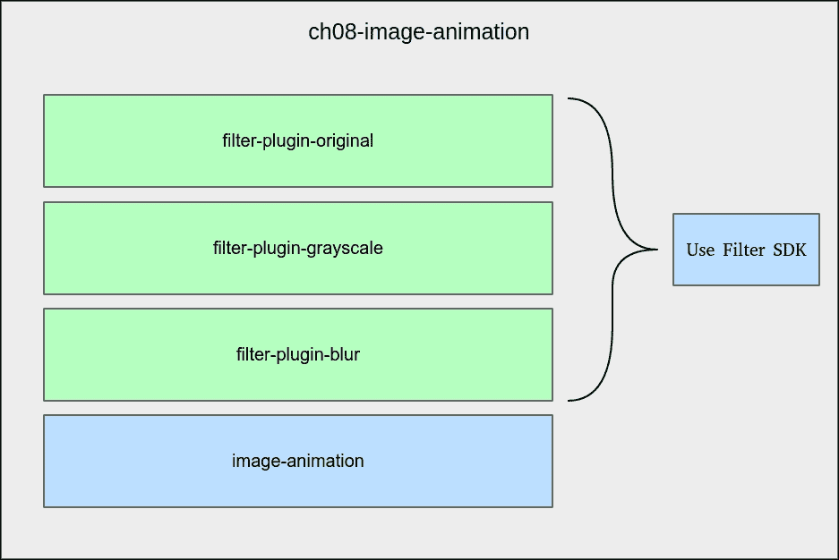
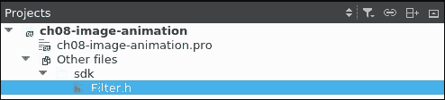
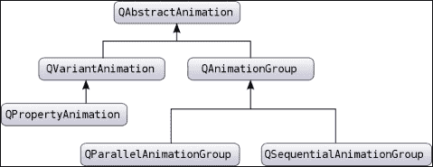
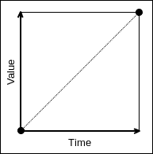
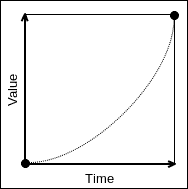
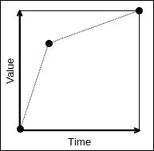
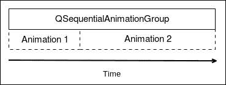
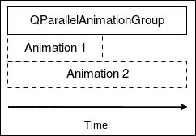
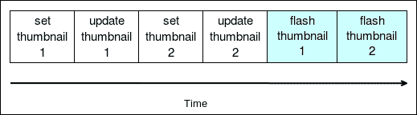
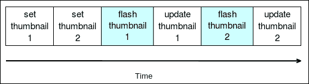

# 第八章. 动画 - 活起来，活起来！

在上一章中，你学习了如何创建自定义 Qt Designer 插件。本章将进一步深入，教你如何创建可分发的软件开发工具包（SDK）供第三方开发者使用，Qt 插件系统的工作原理，以及如何使用华丽的动画使你的应用程序更具吸引力。

示例项目将是第七章中的项目重新实现，*无痛第三方库*。你将构建相同的图像处理应用程序，但具有从插件导入滤镜的能力。

本章将教你如何完成以下任务：

+   使用 Qt 插件系统创建 SDK

+   使用 SDK 实现自定义插件

+   使用 `.pri` 文件分解构建任务

+   在最终应用程序中动态加载插件

+   理解 Qt 动画框架

+   使用简单、顺序和并行动画

+   使用`QPropertyAnimation`和`QGraphics`效果应用自定义效果

# 准备 SDK

在深入代码之前，我们必须花点时间来反思我们将如何构建它。本章有两个目标：

+   深入探讨 Qt 插件系统

+   研究和集成 Qt 动画框架

本章的第一部分将专注于插件系统。我们的目标是提供一个方法来构建可以集成到我们的应用程序中的插件，供第三方开发者使用。这些插件应该是动态加载的。应用程序将是第七章中的示例项目的直接后代，*无痛第三方库*。功能将完全相同，但将使用这个新的插件系统，并将具有华丽的动画。

项目的结构将如下所示：



父级项目是 `ch08-image-animation`，它由以下内容组成：

+   `filter-plugin-original`：一个库项目，是原始滤镜的实现

+   `filter-plugin-grayscale`：一个库项目，是灰度滤镜的实现

+   `filter-plugin-blur`：一个库项目，是模糊滤镜的实现

+   `image-animation`：一个 Qt Widgets 应用程序，它将加载显示所需的插件，并使每个插件应用于加载的图片成为可能

我们将开发这些插件中的每一个，但请记住，它们可能是由第三方开发者创建的。为了实现这种开放性，每个插件都将提供 SDK。这个 SDK 依赖于 Qt 插件系统。

考虑到插件应该处理什么内容至关重要。我们的应用程序是一个图像处理软件。我们选择将插件的责任限制在图片处理部分，但这绝对是一个设计选择。

另一种方法可能是让插件开发者提供自己的 UI 来配置插件（例如，调整模糊的强度）。在本章中，我们通过仅关注插件开发本身来保持简单。这完全取决于你以及你想要如何设计你的应用程序。通过扩大插件可以执行的范围，你也增加了插件开发者的负担。总是存在权衡；提供更多选择往往会增加复杂性。众所周知，我们开发者是一群懒惰的人。至少，我们希望在计算机为我们工作时能够偷懒。

我们将首先构建将在每个插件中部署的 SDK。执行以下步骤：

1.  创建一个名为 `ch08-image-animation` 的 **Subdirs 项目**（在向导的末尾不要添加子项目）。

1.  在你的文件系统资源管理器中，打开 `ch08-image-animation` 目录并创建一个 `sdk` 目录。

1.  在 `sdk` 内部创建一个空的 `Filter.h` 文件。

我们的 SDK 将由一个文件组成，`Filter.h`，这是每个插件应该实现的接口（或头文件）。每个插件负责根据其所需功能返回修改后的图片。因为此 SDK 没有链接到任何特定项目，我们将在 Qt Creator 中的特殊文件夹 **Other files** 下显示它。为此，更新 `ch08-image-animation.pro`：

```cpp
TEMPLATE = subdirs 

CONFIG += c++14 

OTHER_FILES += \ 
            sdk/Filter.h 

```

在 Qt Creator 解析 `ch08-image-animation.pro` 之后，你应该在 **Projects** 选项卡中看到以下内容：



`Filter.h` 文件位于父项目级别。因此，它将更容易在我们的各种插件之间分解 SDK 的管道代码。让我们实现 `Filter.h`：

```cpp
#include <QImage> 

class Filter 
{ 
public: 
    virtual ~Filter() {} 
    virtual QString name() const = 0; 
    virtual QImage process(const QImage& image) = 0; 
}; 

#define Filter_iid "org.masteringqt.imageanimation.filters.Filter" 
Q_DECLARE_INTERFACE(Filter, Filter_iid) 

```

让我们分解这个接口：`Filter` 子类必须通过实现 `name()` 方法提供名称，并在实现 `process()` 方法时返回处理后的图像。正如你所见，`Filter.h` 确实非常接近在 第七章 中看到的版本，*无需烦恼的第三方库*。

然而，真正的新内容出现在类定义之后：

```cpp
#define Filter_iid "org.masteringqt.imageanimation.filters.Filter" 
Q_DECLARE_INTERFACE(Filter, Filter_iid) 

```

`Filter_iid` 是一个唯一标识符，让 Qt 知道接口名称。这将强制实施在实现者一方，该方还必须声明此标识符。

### 提示

对于实际应用场景，你应该给这个唯一标识符添加一个版本号。这将让你能够正确处理 SDK 和附加插件的版本。

`Q_DECLARE_INTERFACE` 宏将类与给定的标识符关联起来。这将使 Qt 能够检查加载的插件是否可以安全地转换为 `Filter` 类型。

### 提示

在生产代码中，在命名空间内声明您的接口更安全。您永远不知道您的 SDK 将部署在哪种代码环境中。这样，您可以避免潜在的名称冲突。如果您在命名空间中声明，请确保 `Q_DECLARE_INTERFACE` 宏在命名空间作用域之外。

# 创建您的插件

SDK 的创建过程非常顺利。我们现在可以继续创建我们的第一个插件。我们已经知道所有我们的插件都将包含我们刚刚完成的 SDK。幸运的是，这可以通过一个 `.pri` 文件（PRoject Include）轻松实现。`.pri` 文件的行为与 `.pro` 文件完全一样；唯一的区别是它旨在包含在 `.pro` 文件中。

在 `ch08-image-animation` 目录中创建一个名为 `plugins-common.pri` 的文件，其中包含以下代码：

```cpp
INCLUDEPATH += $$PWD/sdk 
DEPENDPATH += $$PWD/sdk 

```

此文件将包含在每个 `.pro` 插件中。它的目的是告诉编译器在哪里可以找到 SDK 的头文件，以及在哪里查找头文件和源文件之间的依赖关系。这将增强修改检测，并在需要时正确编译源文件。

要在项目中看到此文件，我们必须将其添加到 `ch08-image-animation.pro` 中的 `OTHER_FILES` 宏：

```cpp
OTHER_FILES += \ 
            sdk/Filter.h \ 
            plugins-common.pri 

```

构建最直接的插件是 `filter-plugin-original`，因为它不对图像执行任何特定的处理。让我们按照以下步骤创建此插件：

1.  在 `ch08-image-animation` 中创建一个新的 **子项目**。

1.  选择 **库** | **C++ 库** | **选择...**。

1.  选择 **共享库**，将其命名为 `filter-plugin-original`，然后点击 **下一步**。

1.  选择 **QtCore**，然后转到 **QtWidgets** | **下一步**。

1.  将创建的类命名为 `FilterOriginal`，然后点击 **下一步**。

1.  将其作为 **子项目** 添加到 `ch08-image-animation`，然后点击 **完成**。

Qt Creator 为我们创建了很多样板代码，但在这个案例中，我们不需要它。按照以下方式更新 `filter-plugin-original.pro`：

```cpp
QT       += core widgets 

TARGET = $$qtLibraryTarget(filter-plugin-original) 
TEMPLATE = lib 
CONFIG += plugin 

SOURCES += \ 
    FilterOriginal.cpp 

HEADERS += \ 
    FilterOriginal.h 

include(../plugins-common.pri) 

```

我们首先指定 `TARGET` 应根据操作系统约定正确命名，使用 `$$qtLibraryTarget()`。`CONFIG` 属性添加了 `plugin` 指令，这告诉生成的 `Makefile` 包含编译 dll/so/dylib（根据您的操作系统选择）所需的必要指令。

我们移除了不必要的 `DEFINES` 和 `FilterOriginal_global.h`。插件不应该暴露给调用者任何特定内容，因此不需要处理符号导出。

我们现在可以继续到 `FilterOriginal.h`：

```cpp
#include <QObject> 

#include <Filter.h> 

class FilterOriginal : public QObject, Filter 
{ 
    Q_OBJECT 
    Q_PLUGIN_METADATA(IID "org.masteringqt.imageanimation.filters.Filter") 
    Q_INTERFACES(Filter) 

public: 
    FilterOriginal(QObject* parent = 0); 
    ~FilterOriginal(); 

    QString name() const override; 
    QImage process(const QImage& image) override; 
}; 

```

`FilterOriginal` 类必须首先继承 `QObject`；当插件将被加载时，它将首先是一个 `QObject` 类，然后再被转换为实际类型，`Filter`。

`Q_PLUGIN_METADATA` 宏声明导出适当的实现接口标识符到 Qt。它注释了类，让 Qt 元系统了解它。我们在 `Filter.h` 中再次遇到了我们定义的唯一标识符。

`Q_INTERFACES` 宏告诉 Qt 元对象系统该类实现了哪个接口。

最后，`FilterOriginal.cpp` 几乎不值得打印：

```cpp
FilterOriginal::FilterOriginal(QObject* parent) : 
    QObject(parent) 
{ 
} 

FilterOriginal::~FilterOriginal() 
{ 
} 

QString FilterOriginal::name() const 
{ 
    return "Original"; 
} 

QImage FilterOriginal::process(const QImage& image) 
{ 
    return image; 
} 

```

如你所见，其实现是一个空操作。我们从第七章，*无烦恼的第三方库*版本中添加的唯一内容是`name()`函数，它返回`Original`。

我们现在将实现灰度滤镜。正如我们在第七章，*无烦恼的第三方库*中所做的那样，我们将依赖 OpenCV 库来处理图片。同样适用于以下插件，模糊。

由于这两个项目都有自己的`.pro`文件，你可以预见 OpenCV 的链接将相同。这是一个`.pri`文件的完美用例。

在`ch08-image-animation`目录内，创建一个名为`plugins-common-opencv.pri`的新文件。不要忘记将其添加到`ch08-image-animation.pro`中的`OTHER_FILES`：

```cpp
OTHER_FILES += \ 
            sdk/Filter.h \ 
            plugins-common.pri \ 
            plugins-common-opencv.pri 

```

下面是`plugins-common-opencv.pri`的内容：

```cpp
windows { 
    INCLUDEPATH += $$(OPENCV_HOME)/../../include 
    LIBS += -L$$(OPENCV_HOME)/lib \ 
        -lopencv_core2413 \ 
        -lopencv_imgproc2413 
} 

linux { 
    CONFIG += link_pkgconfig 
    PKGCONFIG += opencv 
} 

macx { 
    INCLUDEPATH += /usr/local/Cellar/opencv/2.4.13/include/ 

    LIBS += -L/usr/local/lib \ 
        -lopencv_core \ 
        -lopencv_imgproc 
} 

```

`plugins-common-opencv.pri`的内容是我们第七章，*无烦恼的第三方库*中制作的直接复制。

所有必要的准备工作都已经就绪；我们现在可以继续`filter-plugin-grayscale`项目。与`filter-plugin-original`一样，我们将按照以下方式构建它：

1.  在`ch08-image-animation`中创建一个**共享库类型**的**C++库子项目**。

1.  创建一个名为`FilterGrayscale`的类。

1.  在**必需模块**中选择**QtCore**和**QWidgets**。

下面是`filter-plugin-grayscale.pro`的更新版本：

```cpp
QT       += core widgets 

TARGET = $$qtLibraryTarget(filter-plugin-grayscale) 
TEMPLATE = lib 
CONFIG += plugin 

SOURCES += \ 
    FilterGrayscale.cpp 

HEADERS += \ 
    FilterGrayscale.h 

include(../plugins-common.pri) 
include(../plugins-common-opencv.pri) 

```

内容与`filter-plugin-original.pro`非常相似。我们只是添加了`plugins-common-opencv.pri`，以便我们的插件能够链接到 OpenCV。

关于`FilterGrayscale`，其头文件与`FilterOriginal.h`完全相同。以下是`FilterGrayscale.cpp`中的相关部分：

```cpp
#include <opencv/cv.h> 

// Constructor & Destructor here 
... 

QString FilterOriginal::name() const 
{ 
    return "Grayscale"; 
} 

QImage FilterOriginal::process(const QImage& image) 
{ 
    // QImage => cv::mat 
    cv::Mat tmp(image.height(), 
                image.width(), 
                CV_8UC4, 
                (uchar*)image.bits(), 
                image.bytesPerLine()); 

    cv::Mat resultMat; 
    cv::cvtColor(tmp, resultMat, CV_BGR2GRAY); 

    // cv::mat => QImage 
    QImage resultImage((const uchar *) resultMat.data, 
                       resultMat.cols, 
                       resultMat.rows, 
                       resultMat.step, 
                       QImage::Format_Grayscale8); 
    return resultImage.copy(); 
} 

```

包含`plugins-common-opencv.pri`使我们能够正确地包含`cv.h`头文件。

我们将要实现的最后一个插件是模糊插件。再次创建一个**C++库子项目**，并创建`FilterBlur`类。项目结构和`.pro`文件的内容相同。以下是`FilterBlur.cpp`：

```cpp
QString FilterOriginal::name() const 
{ 
    return "Blur"; 
} 

QImage FilterOriginal::process(const QImage& image) 
{ 
    // QImage => cv::mat 
    cv::Mat tmp(image.height(), 
                image.width(), 
                CV_8UC4, 
                (uchar*)image.bits(), 
                image.bytesPerLine()); 

    int blur = 17; 
    cv::Mat resultMat; 
    cv::GaussianBlur(tmp, 
                     resultMat, 
                     cv::Size(blur, blur), 
                     0.0, 
                     0.0); 

    // cv::mat => QImage 
    QImage resultImage((const uchar *) resultMat.data, 
                       resultMat.cols, 
                       resultMat.rows, 
                       resultMat.step, 
                       QImage::Format_RGB32); 
    return resultImage.copy(); 
} 

```

模糊量是硬编码在`17`。在生产应用程序中，使这个量可变可能更有吸引力。

### 提示

如果你想进一步推进项目，尝试在 SDK 中包含一个配置插件属性的布局方式。

# 动态加载你的插件

我们现在将处理加载这些插件的应用程序：

1.  在`ch08-image-animation`内部创建一个新的**子项目**。

1.  选择类型**Qt Widgets 应用程序**。

1.  命名为`image-animation`并接受默认的**类信息设置**。

我们在`.pro`文件中还有一些最后要完成的事情。首先，`image-animation`将尝试从其输出目录的某个地方加载插件。因为每个过滤器插件项目都是独立的，其输出目录与`image-animation`分开。因此，每次你修改一个插件时，你都必须将编译好的共享库复制到正确的`image-animation`目录中。这样做可以使它对`image-animation`应用程序可用，但我们都是懒惰的开发者，对吧？

我们可以通过更新`plugins-common-pri`来实现自动化，如下所示：

```cpp
INCLUDEPATH += $$PWD/sdk 
DEPENDPATH += $$PWD/sdk 

windows { 
    CONFIG(debug, debug|release) { 
        target_install_path = $$OUT_PWD/../image-animation/debug/plugins/ 
    } else { 
        target_install_path = $$OUT_PWD/../image-animation/release/plugins/ 
    } 

} else { 
    target_install_path = $$OUT_PWD/../image-animation/plugins/ 
} 

# Check Qt file 'spec_post.prf' for more information about '$$QMAKE_MKDIR_CMD' 
createPluginsDir.path = $$target_install_path 
createPluginsDir.commands = $$QMAKE_MKDIR_CMD $$createPluginsDir.path 
INSTALLS += createPluginsDir 

target.path = $$target_install_path 
INSTALLS += target 

```

简而言之，输出库被部署在输出`image-animation/plugins`目录中。Windows 有一个不同的输出项目结构；这就是为什么我们必须有一个特定于平台的章节。

更好的是，`plugins`目录会自动通过指令`createPluginsDir.commands = $$QMAKE_MKDIR_CMD $$createPluginsDir.path`创建。我们不得不用特殊的`$$QMAKE_MKDIR_CMD`命令而不是系统命令（`mkdir`）。Qt 会将其替换为正确的 shell 命令（取决于你的操作系统），仅在目录不存在时创建该目录。不要忘记添加`make install`构建步骤来执行此任务！

在`.pro`文件中最后要处理的是`image-animation`的`image-animation`。应用程序将操作`Filter`实例。因此，它需要访问 SDK。请在`image-animation.pro`中添加以下内容：

```cpp
INCLUDEPATH += $$PWD/../sdk 
DEPENDPATH += $$PWD/../sdk 

```

系好安全带。我们现在将加载我们新鲜出炉的插件。在`image-animation`中创建一个名为`FilterLoader`的新类。以下是`FilterLoader.h`的内容：

```cpp
#include <memory> 
#include <vector> 

#include <Filter.h> 

class FilterLoader 
{ 

public: 
    FilterLoader(); 
    void loadFilters(); 

    const std::vector<std::unique_ptr<Filter>>& filters() const; 

private: 
    std::vector<std::unique_ptr<Filter>> mFilters; 
}; 

```

这个类负责加载插件。再一次，我们依靠 C++11 智能指针中的`unique_ptr`来解释`Filter`实例的所有权。`FilterLoader`类将是拥有者，通过`mFilters`提供对`vector`的访问器`filters()`。

注意，`filter()`函数返回一个`const&`给`vector`。这种语义带来了两个好处：

+   参考确保了`vector`不会被复制。如果没有它，编译器可能会发出类似“`FilterLoader`不再是`mFilters`内容的拥有者！”这样的警告。当然，因为它处理的是 C++模板，编译器错误看起来可能更像是对英语语言的惊人侮辱。

+   `const`关键字确保调用者不能修改`vector`类型。

现在我们可以创建`FilterLoader.cpp`文件：

```cpp
#include "FilterLoader.h" 

#include <QApplication> 
#include <QDir> 
#include <QPluginLoader> 

FilterLoader::FilterLoader() : 
    mFilters() 
{ 
} 

void FilterLoader::loadFilters() 
{ 
    QDir pluginsDir(QApplication::applicationDirPath()); 
#ifdef Q_OS_MAC 
    pluginsDir.cdUp(); 
    pluginsDir.cdUp(); 
    pluginsDir.cdUp(); 
#endif 
    pluginsDir.cd("plugins"); 

    for(QString fileName: pluginsDir.entryList(QDir::Files)) { 
        QPluginLoader pluginLoader( 
                      pluginsDir.absoluteFilePath(fileName)); 
        QObject* plugin = pluginLoader.instance(); 
        if (plugin) { 
            mFilters.push_back(std::unique_ptr<Filter>( 
                        qobject_cast<Filter*>(plugin) 
            )); 
        } 
    } 
} 

const std::vector<std::unique_ptr<Filter>>& FilterLoader::filters() const 
{ 
    return mFilters; 
} 

```

类的核心在于`loadFilter()`方法。我们首先使用`pluginsDir`移动到`plugins`目录，它位于`image-animation`的输出目录中。对于 Mac 平台有一个特殊情况处理：`QApplication::applicationDirPath()`返回生成应用程序包内的路径。唯一的方法是使用`cdUp()`指令向上爬三次。

对于这个目录中的每个`fileName`，我们尝试加载一个`QPluginLoader`加载器。`QPluginLoader`提供了对 Qt 插件的访问。这是加载共享库的跨平台方式。此外，`QPluginLoader`加载器有以下优点：

+   它检查插件是否与宿主应用程序相同的 Qt 版本链接

+   通过提供通过`instance()`直接访问插件的方式，而不是依赖于 C 函数，它简化了插件的加载。

我们接着尝试使用`pluginLoader.instance()`加载插件。这将尝试加载插件的根组件。在我们的案例中，根组件是`FilerOriginal`、`FilterGrayscale`或`FilterBlur`。这个函数总是返回一个`QObject*`；如果插件无法加载，它返回`0`。这就是为什么我们在自定义插件中继承了`QObject`类。

`instance()`的调用隐式地尝试加载插件。一旦完成，`QPluginLoader`不再处理`plugin`的内存。从这里，我们使用`qobject_cast()`将插件转换为`Filter*`。

`qobject_cast()`函数的行为类似于标准的 C++ `dynamic_cast()`；区别在于它不需要**RTTI**（**运行时类型信息**）。

最后但同样重要的是，将`Filter*`类型的`plugin`封装在`unique_ptr`中，并添加到`mFilters`向量中。

# 在应用程序中使用插件

现在插件已正确加载，它们必须可以从应用程序的 UI 中访问。为此，我们将从第七章，*无需烦恼的第三方库*中的`FilterWidget`类中汲取一些灵感（无耻的借鉴）。

使用 Qt Designer 创建一个新的**表单类**，使用名为`FilterWidget`的**Widget**模板。`FilterWidget.ui`文件与第七章中完成的一样，*无需烦恼的第三方库*。

创建`FilterWidget.h`文件如下：

```cpp
#include <QWidget> 
#include <QImage> 

namespace Ui { 
class FilterWidget; 
} 

class Filter; 

class FilterWidget : public QWidget 
{ 
    Q_OBJECT 

public: 
    explicit FilterWidget(Filter& filter, QWidget *parent = 0); 
    ~FilterWidget(); 

    void process(); 

    void setSourcePicture(const QImage& sourcePicture); 
    void setSourceThumbnail(const QImage& sourceThumbnail); 
    void updateThumbnail(); 

    QString title() const; 

signals: 
    void pictureProcessed(const QImage& picture); 

protected: 
    void mousePressEvent(QMouseEvent*) override; 

private: 
    Ui::FilterWidget *ui; 
    Filter& mFilter; 

    QImage mDefaultSourcePicture; 
    QImage mSourcePicture; 
    QImage mSourceThumbnail; 

    QImage mFilteredPicture; 
    QImage mFilteredThumbnail; 
}; 

```

总体来说，我们简化了与 Qt Designer 插件相关的一切，只是通过引用将`mFilter`值传递给构造函数。`FilterWidget`类不再是`Filter`的所有者；它更像是调用它的客户端。记住，`Filter`（即插件）的所有者是`FilterLoader`。

另一个修改是新的`setThumbnail()`函数。它应该替代旧的`updateThumbnail()`调用。新的`updateThumbnail()`现在只执行缩略图处理，不接触源缩略图。这种划分是为了为即将到来的动画部分做准备。缩略图更新将在动画完成后进行。

### 注意

请参阅该章节的源代码以查看`FilterWidget.cpp`。

所有底层都已经完成。下一步是填充 `MainWindow`。再次强调，它遵循我们在第七章中覆盖的模式，*无需烦恼的第三方库*。与 `MainWindow.ui` 的唯一区别是 `filtersLayout` 是空的。显然，插件是动态加载的，因此在编译时我们无法在其中放置任何内容。

让我们来看看 `MainWindow.h`：

```cpp
#include <QMainWindow> 
#include <QImage> 
#include <QVector> 

#include "FilterLoader.h" 

namespace Ui { 
class MainWindow; 
} 

class FilterWidget; 

class MainWindow : public QMainWindow 
{ 
    Q_OBJECT 

public: 
    explicit MainWindow(QWidget *parent = 0); 
    ~MainWindow(); 

    void loadPicture(); 

protected: 
    void resizeEvent(QResizeEvent* event) override; 

private slots: 
    void displayPicture(const QImage& picture); 
    void saveAsPicture(); 

private: 
    void initFilters(); 
    void updatePicturePixmap(); 

private: 
    Ui::MainWindow *ui; 
    QImage mSourcePicture; 
    QImage mSourceThumbnail; 
    QImage& mFilteredPicture; 
    QPixmap mCurrentPixmap; 

    FilterLoader mFilterLoader; 
    FilterWidget* mCurrentFilter; 
    QVector<FilterWidget*> mFilters; 
}; 

```

唯一值得注意的是将 `mFilterLoader` 添加为成员变量。在 `MainWindow.cpp` 中，我们将专注于更改：

```cpp
void MainWindow::initFilters() 
{ 
    mFilterLoader.loadFilters(); 

    auto& filters = mFilterLoader.filters(); 
    for(auto& filter : filters) { 
        FilterWidget* filterWidget = new FilterWidget(*filter); 
        ui->filtersLayout->addWidget(filterWidget); 
        connect(filterWidget, &FilterWidget::pictureProcessed, 
                this, &MainWindow::displayPicture); 
        mFilters.append(filterWidget); 
    } 

    if (mFilters.length() > 0) { 
        mCurrentFilter = mFilters[0]; 
    } 
} 

```

`initFilters()` 函数不会从 `ui` 内容中加载过滤器。相反，它首先调用 `mFilterLoader.loadFilters()` 函数，从 `plugins` 目录动态加载插件。

之后，一个 `auto&` 过滤器被分配给 `mFilterLoader.filters()`。请注意，使用 `auto` 关键字要容易阅读得多。实际类型是 `std::vector<std::unique_ptr<Filter>>&`，这看起来更像是一个神秘的咒语，而不是一个简单的对象类型。

对于这些过滤器中的每一个，我们创建一个 `FilterWidget*` 并传递 `filter` 的引用。在这里，`filter` 事实上是一个 `unique_ptr`。C++11 背后的开发者们明智地修改了解引用操作符，使得新的 `FilterWidget(*filter)` 变得透明。`auto` 关键字和 `->` 操作符（或解引用操作符）的重载组合使得使用新的 C++ 功能变得更加愉快。

看看这个 for 循环。对于每个 `filter`，我们执行以下任务：

1.  创建一个 `FilterWidget` 模板。

1.  将 `FilterWidget` 模板添加到 `filtersLayout` 子项中。

1.  将 `FilterWidget::pictureProcessed` 信号连接到 `MainWindow::displayPicture` 插槽。

1.  将新的 `FilterWidget` 模板添加到 `QVector` `mFilters` 中。

最后，选择第一个 `FilterWidget`。

对 `MainWindow.cpp` 的唯一其他修改是 `loadPicture()` 的实现：

```cpp
 void MainWindow::loadPicture() 
{ 
    ... 
    for (int i = 0; i <mFilters.size(); ++i) { 
        mFilters[i]->setSourcePicture(mSourcePicture); 
        mFilters[i]->setSourceThumbnail(mSourceThumbnail); 
        mFilters[i]->updateThumbnail(); 
    } 
    mCurrentFilter->process(); 
} 

```

`updateThumbnail()` 函数已经被拆分为两个函数，这里就是使用它的地方。

应用程序现在可以进行测试。你应该能够执行它，并看到动态加载的插件以及显示处理后的默认 Lenna 图片。

# 探索动画框架

你的应用程序运行得非常出色。现在是时候看看我们如何让它跳跃和移动，或者说，让它“活”起来。Qt 动画框架可以用来创建和启动 Qt 属性的动画。Qt 将通过一个内部的全局定时器句柄平滑地插值属性值。只要它是 Qt 属性，你可以对任何东西进行动画处理。你甚至可以使用 `Q_PROPERTY` 为你的对象创建属性。如果你忘记了 `Q_PROPERTY`，请参阅第七章，*无需烦恼的第三方库*。

提供了三个主要类来构建动画：

+   `QPropertyAnimation`：这个类用于动画一个 Qt 属性动画

+   `QParallelAnimationGroup`：这个类并行动画化多个动画（所有动画同时开始）

+   `QSequentialAnimationGroup`：这个类按顺序动画化多个动画（动画按定义的顺序一个接一个地运行）

所有这些类都继承自`QAbstractAnimation`。以下是来自官方 Qt 文档的图表：



请注意，`QAbstractAnimation`、`QVariantAnimation`和`QAnimationGroup`都是抽象类。以下是一个简单的 Qt 动画示例：

```cpp
QLabel label; 
QPropertyAnimation animation; 

animation.setTargetObject(&label); 
animation.setPropertyName("geometry"); 
animation.setDuration(4000); 
animation.setStartValue(QRect(0, 0, 150, 50)); 
animation.setEndValue(QRect(300, 200, 150, 50)); 
animation.start(); 

```

前面的代码片段将一个`QLabel`标签从 0 x 0 位置移动到 300 x 200 位置，耗时四秒。首先需要定义目标对象及其属性。在我们的例子中，目标对象是`label`，我们想要动画化名为`geometry`的属性。然后，我们设置动画的持续时间（以毫秒为单位）：`4000`毫秒对应四秒。最后，我们可以决定`geometry`属性的开始和结束值，这是一个`QRect`，定义如下：

```cpp
QRect(x, y, width, height) 

```

`label`对象从 0 x 0 位置开始，到 300 x 200 位置结束。在这个例子中，大小是固定的（150 x 50），但如果你愿意，也可以动画化宽度和高度。

最后，我们调用`start()`函数开始动画。在四秒内，动画平滑地将标签从 0 x 0 位置移动到 300 x 200 位置。默认情况下，动画使用线性插值来提供中间值，因此，两秒后，`label`将位于 150 x 100 位置。值的线性插值看起来像以下图示：



在我们的例子中，`label`对象将以恒定速度从起始位置移动到结束位置。缓动函数是一个描述值随时间演变的数学函数。缓动曲线是数学函数的视觉表示。默认的线性插值是一个好的起点，但 Qt 提供了许多缓动曲线来控制动画的速度行为。以下是更新后的示例：

```cpp
QLabel label; 
QPropertyAnimation animation(&label, "geometry"); 
animation.setDuration(4000); 
animation.setStartValue(QRect(0, 0, 150, 50)); 
animation.setEndValue(QRect(300, 200, 150, 50)); 
animation.setEasingCurve(QEasingCurve::InCirc); 
animation.start(); 

```

你可以直接使用`QPropertyAnimation`构造函数设置目标对象和属性名。因此，我们移除了`setTargetObject()`和`setPropertyName()`函数。之后，我们使用`setEasingCurve()`为这个动画指定一个曲线。`InCirc`看起来如下：



使用这个缓动曲线，标签开始移动速度很慢，但在动画过程中逐渐加速。

另一种方法是使用`setKeyValueAt()`函数自己定义中间的关键步骤。让我们更新我们的例子：

```cpp
QLabel label; 
QPropertyAnimation animation(&label, "geometry"); 
animation.setDuration(4000); 
animation.setKeyValueAt(0, QRect(0, 0, 150, 50)); 
animation.setKeyValueAt(0.25, QRect(225, 112.5, 150, 50)); 
animation.setKeyValueAt(1, QRect(300, 200, 150, 50)); 
animation.start(); 

```

我们现在正在使用 `setKeyValueAt()` 设置关键帧。第一个参数是 0 到 1 范围内的时间步长。在我们的例子中，步骤 1 意味着四秒。步骤 0 和步骤 1 的关键帧提供了与第一个示例的起始/结束位置相同的坐标。正如你所见，我们还在步骤 0.25（对我们来说是一秒）处添加了一个位置 225 x 112.5 的关键帧。下一个图示说明了这一点：



你可以清楚地区分使用 `setKeyValueAt()` 创建的三个关键帧。在我们的例子中，我们的 `label` 将在 一秒内迅速达到 225 x 112.5 的位置。然后标签将在剩余的三秒内缓慢移动到 300 x 200 的位置。

如果你有一个以上的 `QPropertyAnimation` 对象，你可以使用组来创建更复杂的序列。让我们看一个例子：

```cpp
QPropertyAnimation animation1(&label1, "geometry"); 
QPropertyAnimation animation2(&label2, "geometry"); 
... 
QSequentialAnimationGroup animationGroup; 
animationGroup.addAnimation(&anim1); 
animationGroup.addAnimation(&anim2); 
animationGroup.start(); 

```

在这个例子中，我们使用 `QSequentialAnimationGroup` 来依次运行动画。首先要做的是将动画添加到 `animationGroup` 中。然后，当我们对动画组调用 `start()` 时，`animation1` 将被 `启动`。当 `animation1` 完成 时，`animationGroup` 将运行 `animation2`。当列表中的最后一个动画结束时，`QSequentialAnimationGroup` 才会完成。下一个图示描述了这种行为：



第二个动画组 `QParallelAnimationGroup` 以与 `QSequentialAnimationGroup` 相同的方式初始化和启动。但行为不同：它并行启动所有动画，等待最长的动画结束。以下是这一点的说明：



请记住，动画组本身也是一个动画（它继承自 `QAbstractAnimation`）。因此，你可以将动画组添加到其他动画组中，以创建一个非常复杂的动画序列！

# 让你的缩略图跳跃

让我们将我们学到的有关 Qt 动画框架的知识应用到我们的项目中。每次用户点击过滤器缩略图时，我们希望对其进行“戳”操作。所有修改都将在对 `FilterWidget` 类进行。让我们从 `FilterWidget.h` 开始：

```cpp
#include <QPropertyAnimation> 

class FilterWidget : public QWidget 
{ 
    Q_OBJECT 

public: 
    explicit FilterWidget(Filter& filter, QWidget *parent = 0); 
    ~FilterWidget(); 
    ... 

private: 
    void initAnimations(); 
    void startSelectionAnimation(); 

private: 
    ... 
    QPropertyAnimation mSelectionAnimation; 
}; 

```

第一个函数 `initAnimations()` 初始化了 `FilterWidget` 所使用的动画。第二个函数 `startSelectionAnimation()` 执行启动此动画所需的任务。正如你所见，我们还在前一个章节中介绍了 `QPropertyAnimation` 类。

我们现在可以更新 `FilterWidget.cpp`。让我们更新构造函数：

```cpp
FilterWidget::FilterWidget(Filter& filter, QWidget *parent) : 
    QWidget(parent), 
    ... 
    mSelectionAnimation() 
{ 
    ... 
    initAnimations(); 
    updateThumbnail(); 
} 

```

我们初始化了一个名为 `mSelectionAnimation` 的 `QPropertyAnimation`。构造函数还调用了 `initAnimations()`。以下是其实施方法：

```cpp
void FilterWidget::initAnimations() 
{ 
    mSelectionAnimation.setTargetObject(ui->thumbnailLabel); 
    mSelectionAnimation.setPropertyName("geometry"); 
    mSelectionAnimation.setDuration(200); 
} 

```

你现在应该熟悉这些动画初始化步骤了。目标对象是显示过滤器插件预览的 `thumbnailLabel`。要动画化的属性名称是 `geometry`，因为我们想更新这个 `QLabel` 的位置。最后，我们将动画时长设置为 200 毫秒。就像笑话一样，保持简短而甜蜜。

更新现有的鼠标事件处理程序如下：

```cpp
void FilterWidget::mousePressEvent(QMouseEvent*) 
{ 
    process(); 
    startSelectionAnimation(); 
} 

```

每次用户点击缩略图时，都会调用移动缩略图的选中动画。我们现在可以添加这个最重要的函数如下：

```cpp
void FilterWidget::startSelectionAnimation() 
{ 
    if (mSelectionAnimation.state() == 
        QAbstractAnimation::Stopped) { 

        QRect currentGeometry = ui->thumbnailLabel->geometry(); 
        QRect targetGeometry = ui->thumbnailLabel->geometry(); 
        targetGeometry.setY(targetGeometry.y() - 50.0); 

        mSelectionAnimation.setKeyValueAt(0, currentGeometry); 
        mSelectionAnimation.setKeyValueAt(0.3, targetGeometry); 
        mSelectionAnimation.setKeyValueAt(1, currentGeometry); 
        mSelectionAnimation.start(); 
    } 
} 

```

首先要做的是获取 `thumbnailLabel` 的当前几何形状，称为 `currentGeometry`。然后，我们创建一个具有相同 `x`、`width` 和 `height` 值的 `targetGeometry` 对象。我们只减少 `y` 位置 50，因此目标位置始终在当前位置之上。

之后，我们定义我们的关键帧：

+   **在步骤 0**，值是当前位置。

+   **在步骤 0.3**（60 毫秒，因为总时长是 200 毫秒），值是目标位置。

+   **在步骤 1**（动画的结尾），我们将它恢复到原始位置。缩略图将迅速达到目标位置，然后缓慢下降到其原始位置。

这些关键帧必须在每次动画开始之前初始化。因为布局是动态的，当用户调整主窗口大小时，位置（以及因此的几何形状）可能已经被更新。

请注意，我们正在防止如果当前状态没有停止，动画再次开始。如果没有这个预防措施，如果用户像疯子一样连续点击小部件，缩略图可能会一次又一次地移动到顶部。

你现在可以测试你的应用程序并点击一个过滤器效果。过滤器缩略图将跳起来响应你的点击！

# 淡入图片

当用户打开图片时，我们希望通过调整其不透明度来淡入图像。`QLabel` 或 `QWidget` 类不提供不透明度属性。然而，我们可以使用 `QGraphicsEffect` 为任何 `QWidget` 添加视觉效果。对于这个动画，我们将使用 `QGraphicsOpacityEffect` 来提供 `opacity` 属性。

这里是一个图解来描述每个组件的作用：


在我们的案例中，`QWidget` 类是我们的 `QLabel`，而 `QGraphicsEffect` 类是 `QGraphicsOpacityEffect`。Qt 提供了图形效果系统来改变 `QWidget` 类的渲染。抽象类 `QGraphicsEffect` 有一个纯虚方法 `draw()`，该方法由每个图形效果实现。

我们现在可以根据下一个片段更新 `MainWindow.h`：

```cpp
#include <QPropertyAnimation> 
#include <QGraphicsOpacityEffect> 

class MainWindow : public QMainWindow 
{ 
    ... 
private: 
    ... 
    void initAnimations(); 
private: 
    ... 
    QPropertyAnimation mLoadPictureAnimation; 
    QGraphicsOpacityEffect mPictureOpacityEffect; 
}; 

```

`initAnimations()` 这个私有函数负责所有的动画初始化。`mLoadPictureAnimation` 成员变量负责对加载的图片执行淡入动画。最后，我们声明了 `mPictureOpacityEffect`，这是必须的 `QGraphicsOpacityEffect`。

让我们切换到实现部分，使用 `MainWindow.cpp` 构造函数：

```cpp
MainWindow::MainWindow(QWidget *parent) : 
    QMainWindow(parent), 
    ... 
    mLoadPictureAnimation(), 
    mPictureOpacityEffect() 
{ 
    ... 
    initFilters(); 
    initAnimations(); 
} 

```

没有惊喜。我们使用初始化列表来构造我们的两个新成员变量。`MainWindow`构造函数还调用了`initAnimations()`。

让我们看看这个动画是如何初始化的：

```cpp
void MainWindow::initAnimations() 
{ 
    ui->pictureLabel->setGraphicsEffect(&mPictureOpacityEffect); 
    mLoadPictureAnimation.setTargetObject(&mPictureOpacityEffect); 
    mLoadPictureAnimation.setPropertyName("opacity"); 
    mLoadPictureAnimation.setDuration(500); 
    mLoadPictureAnimation.setStartValue(0); 
    mLoadPictureAnimation.setEndValue(1); 
    mLoadPictureAnimation.setEasingCurve(QEasingCurve::InCubic); 
} 

```

首先要做的是将我们的`QGraphicsOpacityEffect`与`QLabel`链接起来。这可以通过在`pictureLabel`上调用`setGraphicsEffect()`函数轻松完成。

现在我们可以设置动画。在这种情况下，`mLoadPictureAnimation`针对`mPictureOpacityEffect`，将影响其名为`opacity`的属性。动画持续时间为`500`毫秒。接下来，我们设置动画开始和结束时的透明度值：

+   在开始时，图片是完全透明的（`透明度`值为`0`）

+   最后，图片完全可见（`透明度`值为`1`）

对于这个动画，我们使用`InCubic`缓动曲线。这个曲线看起来像这样：


随意尝试其他曲线，找到最适合您的曲线。

### 注意

您可以在此处获取所有缓动曲线的视觉预览列表：[`doc.qt.io/qt-5/qeasingcurve.html`](http://doc.qt.io/qt-5/qeasingcurve.html)

最后一步是在正确的地方开始动画：

```cpp
void MainWindow::loadPicture() 
{ 
    ... 
    mCurrentFilter->process(); 
    mLoadPictureAnimation.start(); 
} 

```

您现在可以启动应用程序并加载一张图片。您应该会看到图片在 500 毫秒内淡入！

# 按顺序闪烁缩略图

对于最后一个动画，我们想在缩略图更新时在每个过滤器预览上显示蓝色闪光。我们不想同时闪烁所有预览，而是按顺序逐个闪烁。这个功能将通过两部分实现：

+   在`FilterWidget`中创建一个颜色动画以显示蓝色闪光

+   在`MainWindow`中构建一个包含所有`FilterWidget`颜色动画的顺序动画组

让我们开始添加颜色动画。按照以下代码片段更新`FilterWidget.h`：

```cpp
#include <QGraphicsColorizeEffect> 

class FilterWidget : public QWidget 
{ 
    Q_OBJECT 

public: 
    explicit FilterWidget(Filter& filter, QWidget *parent = 0); 
    ~FilterWidget(); 
    ... 
    QPropertyAnimation* colorAnimation(); 

private: 
    ... 
    QPropertyAnimation mSelectionAnimation; 
    QPropertyAnimation* mColorAnimation; 
    QGraphicsColorizeEffect mColorEffect; 
}; 

```

这次我们不想影响透明度，而是将缩略图着色为蓝色。因此，我们使用另一个 Qt 标准效果：`QGraphicsColorizeEffect`。我们还声明了一个新的`QPropertyAnimation`，名为`mColorAnimation`，以及其对应的获取器`colorAnimation()`。我们将`mColorAnimation`声明为指针，因为所有权将由`MainWindow`的动画组接管。这个话题很快就会涉及。

让我们更新`FilterWidget.cpp`中的构造函数：

```cpp
FilterWidget::FilterWidget(Filter& filter, QWidget *parent) : 
    QWidget(parent), 
    ... 
    mColorAnimation(new QPropertyAnimation()), 
    mColorEffect() 
{ 
    ... 
} 

```

我们只需要构造我们的两个新成员变量，`mColorAnimation`和`mColorEffect`。让我们看看获取器的惊人复杂性：

```cpp
QPropertyAnimation* FilterWidget::colorAnimation() 
{ 
    return mColorAnimation; 
} 

```

这是个谎言：我们总是试图编写全面的代码！

现在初步工作完成，我们可以通过更新`initAnimations()`函数来初始化颜色动画，如下所示：

```cpp
void FilterWidget::initAnimations() 
{ 
    ... 
    mColorEffect.setColor(QColor(0, 150, 150)); 
    mColorEffect.setStrength(0.0); 
    ui->thumbnailLabel->setGraphicsEffect(&mColorEffect); 

    mColorAnimation->setTargetObject(&mColorEffect); 
    mColorAnimation->setPropertyName("strength"); 
    mColorAnimation->setDuration(200); 
    mColorAnimation->setStartValue(1.0); 
    mColorAnimation->setEndValue(0.0); 
} 

```

第一部分设置了颜色过滤器。在这里，我们选择了一种青绿色来作为闪烁效果。着色效果由其 `strength` 属性处理。默认值是 `1.0`，因此，我们将它设置为 `0.0` 以防止它影响我们默认的 Lenna 缩略图。最后，我们通过调用 `setGraphicsEffect()` 将 `thumbnailLabel` 与 `mColorEffect` 链接起来。

第二部分是颜色动画的准备。这个动画针对颜色效果及其属性，名为 `strength`。这是一个短暂的闪烁；`200` 毫秒就足够了：

+   我们希望从全强度效果开始，所以我们将起始值设置为 `1.0`

+   在动画过程中，着色效果将逐渐减弱，直到达到 `0.0`

这里的默认线性插值就足够好了，所以我们没有使用任何缓动曲线。

我们在这里。颜色效果/动画已初始化，我们提供了一个 `colorAnimation()` 获取器。现在我们可以开始这个功能的第二部分，更新 `MainWindow.h`：

```cpp
#include <QSequentialAnimationGroup> 

class MainWindow : public QMainWindow 
{ 
    Q_OBJECT 
    ... 

private: 
    ... 
    QSequentialAnimationGroup mFiltersGroupAnimation; 
}; 

```

我们声明一个 `QSequentialAnimationGroup` 类来依次触发所有显示蓝色闪烁的 `FilterWidget` 颜色动画。让我们更新 `MainWindow.cpp` 中的构造函数：

```cpp
MainWindow::MainWindow(QWidget *parent) : 
    QMainWindow(parent), 
    ... 
    mFiltersGroupAnimation() 
{ 
    ... 
} 

```

新成员变量意味着初始化列表中的新构造：这就是规则！

我们现在可以更新 `initAnimations()` 来准备我们的动画组：

```cpp
void MainWindow::initAnimations() 
{ 
    ... 
    for (FilterWidget* filterWidget : mFilters) { 
        mFiltersGroupAnimation.addAnimation( 
            filterWidget->colorAnimation()); 
    } 
} 

```

你还记得吗，动画组只是一个动画容器？因此，我们遍历每个 `FilterWidget` 来获取其颜色动画，并调用 `addAnimation()` 填充我们的 `mFiltersGroupAnimation`。多亏了 C++11 的基于范围的 for 循环，这使得代码非常易于阅读。请注意，当你向动画组添加动画时，组将拥有这个动画的所有权。

我们的动画组已经准备好了。现在我们可以启动它：

```cpp
void MainWindow::loadPicture() 
{ 
    ... 
    mCurrentFilter->process(); 
    mLoadPictureAnimation.start(); 
    mFiltersGroupAnimation.start(); 
} 

```

启动您的应用程序并打开一张图片。您可以看到所有过滤器缩略图将一个接一个地从左到右闪烁。这正是我们想要的，但它还不够完美，因为所有缩略图在闪烁之前都已经更新了。我们之所以有这种行为，是因为 `loadPicture()` 函数实际上设置了并更新了所有缩略图，然后最终启动了顺序动画组。以下是说明当前行为的方案：



该方案仅描述了两个缩略图的行为，但三个缩略图的原则是相同的。以下是目标行为：



我们必须在闪烁动画结束后才更新缩略图。幸运的是，`QPropertyAnimation` 在动画结束后会发出 `finished` 信号，所以我们只需要做几个更改。更新 `MainWindow.cpp` 中的 `loadPicture()` 函数：

```cpp
void MainWindow::loadPicture() 
{ 
    ... 
    for (int i = 0; i <mFilters.size(); ++i) { 
        mFilters[i]->setSourcePicture(mSourcePicture); 
        mFilters[i]->setSourceThumbnail(mSourceThumbnail); 
        //mFilters[i]->updateThumbnail(); 
    } 
    ... 
} 

```

如您所见，我们保留了设置，只是在用户打开新图片时移除了更新缩略图。在这个阶段，所有 `FilterWidget` 实例都拥有正确的缩略图，但它们没有显示出来。让我们通过更新 `FilterWidget.cpp` 来解决这个问题：

```cpp
void FilterWidget::initAnimations() 
{ 
    ... 
    mColorAnimation->setTargetObject(&mColorEffect); 
    mColorAnimation->setPropertyName("strength"); 
    mColorAnimation->setDuration(200); 
    mColorAnimation->setStartValue(1.0); 
    mColorAnimation->setEndValue(0.0); 
    connect(mColorAnimation, &QPropertyAnimation::finished, [this]  
    { 
        updateThumbnail(); 
    }); 
} 

```

我们将一个 `lambda` 函数连接到颜色动画的完成信号。这个 `lambda` 函数简单地更新缩略图。现在你可以重新启动你的应用程序并加载一张图片。你应该能看到我们不仅动画化了连续的蓝色闪光，还更新了缩略图。

# 摘要

在本章中，你在自己的 SDK 中定义了一个 `Filter` 接口。你的过滤器现在变成了插件。你知道如何创建和加载一个新的插件，因此你的应用程序现在是模块化的，并且可以轻松扩展。我们还使用 Qt 动画框架增强了应用程序。你知道如何使用 `QGraphicsEffect`（如果需要的话）来动画化任何 `QWidget` 的位置、颜色和透明度。我们创建了一个顺序动画，通过 `QSequentialAnimationGroup` 依次启动三个动画。

在下一章中，我们将讨论一个重要主题：线程。Qt 框架可以帮助你构建一个健壮且可靠的线程应用程序。为了说明本章内容，我们将使用线程池创建一个曼德布罗特分形生成器。
