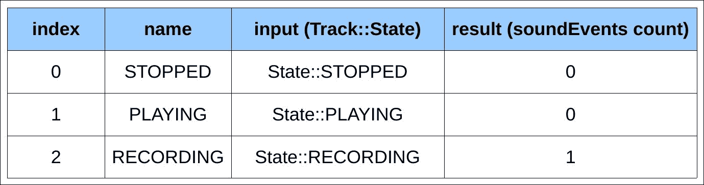

# 第十二章。使用 QTest（不）通过

在上一章中，我们创建了一个具有一些序列化功能的鼓机软件。在本章中，我们将为这个应用程序编写单元测试。为了实现这个目标，我们将使用 Qt Test，它是 Qt 应用程序的专用测试模块。

示例项目是一个使用 CLI 命令执行并生成测试报告的测试应用程序。我们将涵盖包括数据集、GUI、信号和基准测试在内的不同类型的测试。

本章将涵盖以下主题：

+   Qt Test 框架

+   单元测试的项目布局

+   个性化您的测试执行

+   使用数据集编写测试

+   基准测试您的代码

+   模拟 GUI 事件

+   使用`QSignalSpy`类执行信号内省

# 发现 Qt Test

Qt 框架提供了 Qt Test，这是一个完整的 API，用于在 C++中创建您的单元测试。测试执行您的应用程序代码并对其进行验证。通常，测试会将一个变量与预期值进行比较。如果变量不匹配特定值，则测试失败。如果您想更进一步，您可以基准测试您的代码，并获取您的代码所需的时间/CPU 滴答/事件。不断点击 GUI 进行测试可能会很快变得无聊。Qt Test 为您提供在您的小部件上模拟键盘输入和鼠标事件的可能性，以完全检查您的软件。

在我们的案例中，我们想要创建一个名为`drum-machine-test`的单元测试程序。这个控制台应用程序将检查上一章中我们著名的鼓机代码。创建一个名为`ch12-drum-machine-test`的`subdirs`项目，其拓扑结构如下：

+   `drum-machine`:

    +   `drum-machine.pro`

+   `drum-machine-test`:

    +   `drum-machine-test.pro`

+   `ch12-drum-machine-test.pro`

+   `drum-machine-src.pri`

`drum-machine`和`drum-machine-test`项目共享相同的源代码。因此，所有公共文件都放在一个项目包含文件中：`drum-machine-src.pri`。以下是更新的`drum-machine.pro`：

```cpp
QT += core gui multimedia widgets 
CONFIG += c++14 

TARGET = drum-machine 
TEMPLATE = app 

include(../drum-machine-src.pri) 

SOURCES += main.cpp 

```

如您所见，我们只执行重构任务；鼓机项目不受鼓机测试应用程序的影响。您现在可以创建如下所示的`drum-machine-test.pro`文件：

```cpp
QT += core gui multimedia widgets testlib 
CONFIG += c++14 console 

TARGET = drum-machine-test 
TEMPLATE = app 

include(../drum-machine-src.pri) 

DRUM_MACHINE_PATH = ../drum-machine 
INCLUDEPATH += $$DRUM_MACHINE_PATH 
DEPENDPATH += $$DRUM_MACHINE_PATH 

SOURCES += main.cpp 

```

首先要注意的是，我们需要启用`testlib`模块。然后即使我们正在创建控制台应用程序，我们也想对 GUI 进行测试，因此还需要使用主要应用程序所使用的模块（`gui`、`multimedia`和`widgets`）。最后，我们将包含所有应用程序文件（源文件、头文件、表单和资源）的项目包含文件。`drum-machine-test`应用程序还将包含新的源文件，因此我们必须正确设置`INCLUDEPATH`和`DEPENDPATH`变量到源文件文件夹。

Qt Test 易于使用，并基于一些简单的假设：

+   测试用例是一个`QObject`类

+   私有槽是一个测试函数

+   测试用例可以包含多个测试函数

注意，以下名称的私有槽不是测试函数，而是自动调用来初始化和清理测试的特殊函数：

+   `initTestCase()`: 这个函数在第一个测试函数之前被调用

+   `init()`: 这个函数在每个测试函数之前被调用

+   `cleanup()`: 这个函数在每个测试函数之后被调用

+   `cleanupTestCase()`: 这个函数在最后一个测试函数之后被调用

好的，我们已经准备好在`drum-machine-test`应用程序中编写第一个测试用例。`drum-machine`对象的序列化是一个重要的部分。对保存功能的错误修改可以轻易地破坏加载功能。它可能在编译时不会产生错误，但它可能导致无法使用的应用程序。这就是为什么测试很重要的原因。首先，我们需要验证序列化/反序列化过程。创建一个新的 C++类，`DummySerializable`。以下是头文件：

```cpp
#include "Serializable.h" 

class DummySerializable : public Serializable 
{ 
public: 
    DummySerializable(); 

    QVariant toVariant() const override; 
    void fromVariant(const QVariant& variant) override; 

    int myInt = 0; 
    double myDouble = 0.0; 
    QString myString = ""; 
    bool myBool = false; 
}; 

```

这是一个简单的类，实现了我们在第十一章中创建的`Serializable`接口，*与序列化一起玩乐*。这个类将有助于验证我们序列化过程中的底层。正如你所见，该类包含了一些不同类型的变量，以确保完整的序列化功能。让我们看看文件，`DummySerializable.cpp`:

```cpp
#include "DummySerializable.h" 

DummySerializable::DummySerializable() : 
    Serializable() 
{ 
} 

QVariant DummySerializable::toVariant() const 
{ 
    QVariantMap map; 
    map.insert("myInt", myInt); 
    map.insert("myDouble", myDouble); 
    map.insert("myString", myString); 
    map.insert("myBool", myBool); 
    return map; 
} 

void DummySerializable::fromVariant(const QVariant& variant) 
{ 
    QVariantMap map = variant.toMap(); 
    myInt = map.value("myInt").toInt(); 
    myDouble = map.value("myDouble").toDouble(); 
    myString = map.value("myString").toString(); 
    myBool = map.value("myBool").toBool(); 
} 

```

没有惊喜；我们使用`QVariantMap`执行操作，就像在上一章中已经执行的那样。我们的虚拟类已经准备好了；创建一个新的 C++类，`TestJsonSerializer`，其头文件如下：

```cpp
#include <QtTest/QTest> 

#include "JsonSerializer.h" 

class TestJsonSerializer : public QObject 
{ 
    Q_OBJECT 

public: 
    TestJsonSerializer(QObject* parent = nullptr); 

private slots: 
    void cleanup(); 
    void saveDummy(); 
    void loadDummy(); 

private: 
    QString loadFileContent(); 

private: 
    JsonSerializer mSerializer; 
}; 

```

到这里，我们的第一个测试用例！这个测试用例对我们类`JsonSerializer`进行验证。你可以看到两个测试函数，`saveDummy()`和`loadDummy()`。`cleanup()`槽是之前提到的特殊 Qt 测试槽，它在每个测试函数之后执行。我们现在可以在`TestJsonSerializer.cpp`中编写实现：

```cpp
#include "DummySerializable.h" 

const QString FILENAME = "test.json"; 
const QString DUMMY_FILE_CONTENT = "{\n    "myBool": true,\n    "myDouble": 5.2,\n    "myInt": 1,\n    "myString": "hello"\n}\n"; 

TestJsonSerializer::TestJsonSerializer(QObject* parent) : 
    QObject(parent), 
    mSerializer() 
{ 
} 

```

这里创建了两个常量：

+   `FILENAME`: 这是用于测试保存和加载数据的文件名

+   `DUMMY_FILE_CONTENT`: 这是测试函数`saveDummy()`和`loadDummy()`使用的参考文件内容

让我们实现测试函数，`saveDummy()`:

```cpp
void TestJsonSerializer::saveDummy() 
{ 
    DummySerializable dummy; 
    dummy.myInt = 1; 
    dummy.myDouble = 5.2; 
    dummy.myString = "hello"; 
    dummy.myBool = true; 

    mSerializer.save(dummy, FILENAME); 

    QString data = loadFileContent(); 
    QVERIFY(data == DUMMY_FILE_CONTENT); 
} 

```

第一步是使用一些固定值实例化一个`DummySerializable`类。因此，我们调用测试函数，`JsonSerializer::save()`，它将在`test.json`文件中序列化我们的虚拟对象。然后，我们调用一个辅助函数，`loadFileContent()`，以获取`test.json`文件中的文本。最后，我们使用一个 Qt 测试宏，`QVERIFY()`，来执行验证，即 JSON 序列化器保存的文本与`DUMMY_FILE_CONTENT`中预期的值相同。如果`data`等于正确的值，则测试函数成功。以下是日志输出：

```cpp
PASS   : TestJsonSerializer::saveDummy() 

```

如果数据与预期值不同，则测试失败，并在控制台日志中显示错误：

```cpp
FAIL!  : TestJsonSerializer::saveDummy()  
'data == DUMMY_FILE_CONTENT' returned FALSE. () 
Loc: [../../ch12-drum-machine-test/drum-machine-test/TestJsonSerializer.cpp(31)] 

```

让我们简要看看辅助函数，`loadFileContent()`:

```cpp
QString TestJsonSerializer::loadFileContent() 
{ 
    QFile file(FILENAME); 
    file.open(QFile::ReadOnly); 
    QString content = file.readAll(); 
    file.close(); 
    return content; 
} 

```

这没什么大不了的。我们打开文件 `test.json`，读取所有文本内容，并返回相应的 `QString`。

宏 `QVERIFY()` 非常适合检查布尔值，但 Qt 测试在你想比较数据与预期值时提供了一个更好的宏。让我们通过测试函数 `loadDummy()` 来发现 `QCOMPARE()`：

```cpp
void TestJsonSerializer::loadDummy() 
{ 
    QFile file(FILENAME); 
    file.open(QFile::WriteOnly | QIODevice::Text); 
    QTextStream out(&file); 
    out << DUMMY_FILE_CONTENT; 
    file.close(); 

    DummySerializable dummy; 
    mSerializer.load(dummy, FILENAME); 

    QCOMPARE(dummy.myInt, 1); 
    QCOMPARE(dummy.myDouble, 5.2); 
    QCOMPARE(dummy.myString, QString("hello")); 
    QCOMPARE(dummy.myBool, true); 
} 

```

第一部分创建一个 `test.json` 文件，包含参考内容。然后我们创建一个空的 `DymmySerializable` 并调用函数来测试 `Serializable::load()`。最后，我们使用 Qt 测试宏 `QCOMPARE()`。语法很简单：

```cpp
QCOMPARE(actual_value, expected_value); 

```

我们现在可以测试从 JSON 加载的模拟对象的每个字段。测试函数 `loadDummmy()` 只有在所有 `QCOMPARE()` 调用都成功时才会成功。`QCOMPARE()` 错误会更加详细：

```cpp
FAIL!  : TestJsonSerializer::loadDummy() Compared values are not the same 
   Actual   (dummy.myInt): 0 
   Expected (1)          : 1 
Loc: [../../ch12-drum-machine-test/drum-machine-test/TestJsonSerializer.cpp(45)] 

```

每次执行测试函数时，都会调用特殊的 `cleanup()` 槽。让我们更新你的文件 `TestJsonSerializable.cpp`，如下所示：

```cpp
void TestJsonSerializer::cleanup() 
{ 
    QFile(FILENAME).remove(); 
} 

```

这是一个简单的安全措施，将在每个测试函数之后删除 `test.json` 文件，并防止保存和加载测试冲突。

# 执行你的测试

我们编写了一个测试用例 `TestJsonSerializer`，其中包含一些测试函数。我们在 `drum-machine-test` 应用程序中需要一个 `main()` 函数。我们将探讨三种可能性：

+   `QTEST_MAIN()` 函数

+   编写我们自己的简单 `main()` 函数

+   编写我们自己的支持多个测试类的增强 `main()`

`QTest` 模块提供了一个有趣的宏，`QTEST_MAIN()`。此宏为你的应用程序生成一个完整的 `main()` 函数。此生成方法运行你的测试用例中的所有测试函数。要使用它，请将以下片段添加到 `TestJsonSerializer.cpp` 文件末尾：

```cpp
QTEST_MAIN(TestJsonSerializer) 

```

此外，如果你仅在 `.cpp` 文件中声明和实现测试类（没有头文件），你需要在 `QTEST_MAIN` 宏之后包含生成的 moc 文件：

```cpp
QTEST_MAIN(TestJsonSerializer) 
#include "testjsonserializer" 

```

如果你使用 `QTEST_MAIN()` 宏，不要忘记删除现有的 `main.cpp`。否则，你将有两个 `main()` 函数，并且会发生编译错误。

你现在可以尝试运行你的鼓机测试应用程序并查看应用程序输出。你应该看到类似以下内容：

```cpp
$ ./drum-machine-test
********* Start testing of TestJsonSerializer *********
Config: Using QtTest library 5.7.0, Qt 5.7.0 (x86_64-little_endian-lp64 shared (dynamic) release build; by GCC 4.9.1 20140922 (Red Hat 4.9.1-10))
PASS   : TestJsonSerializer::initTestCase()
PASS   : TestJsonSerializer::saveDummy()
PASS   : TestJsonSerializer::loadDummy()
PASS   : TestJsonSerializer::cleanupTestCase()
Totals: 4 passed, 0 failed, 0 skipped, 0 blacklisted, 1ms
********* Finished testing of TestJsonSerializer *********

```

我们的测试函数，`saveDummy()` 和 `loadDummy()`，按照声明顺序执行。两者都成功，状态为 `PASS`。生成的测试应用程序处理了一些选项。通常，你可以通过执行以下命令来显示帮助菜单：

```cpp
$ ./drum-machine-test -help

```

让我们看看一些酷炫的功能。我们可以通过名称执行单个函数。以下命令仅执行 `saveDummy` 测试函数：

```cpp
$ ./drum-machine-test saveDummy

```

你也可以通过空格分隔名称来执行多个测试函数。

QTest 应用程序提供了日志详细选项：

+   `-silent` 用于静默模式。仅显示致命错误和摘要信息。

+   `-v1` 用于详细输出。显示测试函数输入的信息。

+   `-v2` 用于扩展详细输出。显示每个 `QCOMPARE()` 和 `QVERIFY()`。

+   `-vs` 用于详细信号。显示发出的信号和连接的槽。

例如，我们可以使用以下命令显示 `loadDummy` 执行的详细信息：

```cpp
$ ./drum-machine-test -v2 loadDummy
********* Start testing of TestJsonSerializer *********
Config: Using QtTest library 5.7.0, Qt 5.7.0 (x86_64-little_endian-lp64 shared (dynamic) release build; by GCC 4.9.1 20140922 (Red Hat 4.9.1-10))
INFO   : TestJsonSerializer::initTestCase() entering
PASS   : TestJsonSerializer::initTestCase()
INFO   : TestJsonSerializer::loadDummy() entering
INFO   : TestJsonSerializer::loadDummy() QCOMPARE(dummy.myInt, 1)
 Loc: [../../ch12-drum-machine-test/drum-machine-test/TestJsonSerializer.cpp(45)]
INFO   : TestJsonSerializer::loadDummy() QCOMPARE(dummy.myDouble, 5.2)
 Loc: [../../ch12-drum-machine-test/drum-machine-test/TestJsonSerializer.cpp(46)]
INFO   : TestJsonSerializer::loadDummy() QCOMPARE(dummy.myString, QString("hello"))
 Loc: [../../ch12-drum-machine-test/drum-machine-test/TestJsonSerializer.cpp(47)]
INFO   : TestJsonSerializer::loadDummy() QCOMPARE(dummy.myBool, true)
 Loc: [../../ch12-drum-machine-test/drum-machine-test/TestJsonSerializer.cpp(48)]
PASS   : TestJsonSerializer::loadDummy()
INFO   : TestJsonSerializer::cleanupTestCase() entering
PASS   : TestJsonSerializer::cleanupTestCase()
Totals: 3 passed, 0 failed, 0 skipped, 0 blacklisted, 1ms
********* Finished testing of TestJsonSerializer *********

```

另一个很棒的功能是日志输出格式。您可以使用各种格式（如 `.txt`、`.xml`、`.csv` 等）创建测试报告文件。语法要求一个文件名和一个文件格式，由逗号分隔：

```cpp
$ ./drum-machine-test -o <filename>,<format>

```

在以下示例中，我们创建了一个名为 `test-report.xml` 的 XML 报告：

```cpp
$ ./drum-machine-test -o test-report.xml,xml

```

注意，某些日志级别仅影响纯文本输出。此外，CSV 格式只能与测试宏 `QBENCHMARK` 一起使用，该宏将在本章后面介绍。

如果您想自定义生成的测试应用程序，您可以编写 `main()` 函数。从 `TestJsonSerializer.cpp` 中移除 `QTEST_MAIN` 宏。然后创建一个类似以下的 `main.cpp`：

```cpp
#include "TestJsonSerializer.h" 

int main(int argc, char *argv[]) 
{ 
    TestJsonSerializer test; 
    QStringList arguments = QCoreApplication::arguments(); 
    return QTest::qExec(&test, arguments); 
} 

```

在这种情况下，我们使用静态函数 `QTest::qExec()` 来启动 `TestJsonSerializer` 测试。不要忘记提供命令行参数以享受 QTest CLI 选项。

如果您将测试函数写在不同的测试类中，您将创建一个由测试类生成的一个应用程序。如果您按测试应用程序保留一个测试类，甚至可以使用 `QTEST_MAIN` 宏来生成主函数。

有时候您只想创建一个测试应用程序来处理所有测试类。在这种情况下，您在同一个应用程序中有多个测试类，因此您不能使用 `QTEST_MAIN` 宏，因为您不希望为每个测试类生成多个主函数。

让我们看看一种简单的方法来调用所有测试类在一个独特应用程序中：

```cpp
int main(int argc, char *argv[]) 
{ 
    int status = 0; 
    TestFoo testFoo; 
    TestBar testBar; 
    status |= QTest::qExec(&testFoo); 
    status |= QTest::qExec(&testBar); 
    return status; 
} 

```

在这个简单的自定义 `main()` 函数中，我们正在执行 `TestFoo` 和 `TestBar` 测试。但我们失去了 CLI 选项。实际上，多次使用带有命令行参数的 `QTest::qExec()` 函数会导致错误和不良行为。例如，如果您只想从 `TestBar` 中执行一个特定的测试函数。`TestFoo` 的执行将找不到测试函数，显示错误消息，并停止应用程序。

这里有一个处理一个应用程序中多个测试类的解决方案。我们将为我们的测试应用程序创建一个新的命令行选项 `-select`。此选项允许您选择要执行的特定测试类。以下是一个语法示例：

```cpp
$ ./drum-machine-test -select foo fooTestFunction

```

如果使用 `-select` 选项，则必须将其放在命令的开头，后跟测试类名称（在这个例子中是 `foo`）。然后，我们可以选择性地添加 Qt 测试选项。为了实现这个目标，我们将创建一个增强型的 `main()` 函数，该函数解析新的 `select` 选项并执行相应的测试类。

我们将一起创建我们的增强型 `main()` 函数：

```cpp
QApplication app(argc, argv); 
QStringList arguments = QCoreApplication::arguments(); 

map<QString, unique_ptr<QObject>> tests; 
tests.emplace("jsonserializer", 
    make_unique<TestJsonSerializer>()); 
tests.emplace("foo", make_unique<TestFoo>()); 
tests.emplace("bar", make_unique<TestBar>()); 

```

`QApplication`将在我们之后的其他 GUI 测试用例中需要。我们检索命令行参数以供以后使用。名为`tests`的`std::map`模板包含测试类的智能指针，而`QString`标签用作键。请注意，我们正在使用`map::emplace()`函数，该函数不会将源复制到映射中，而是在原地创建它。使用`map::insert()`函数会导致错误，因为智能指针的复制是不合法的。还可以使用`std::map`模板和`make_unique`一起使用的另一种语法是：

```cpp
tests["bar"] = make_unique<TestBar>(); 

```

现在我们可以解析命令行参数：

```cpp
if (arguments.size() >= 3 && arguments[1] == "-select") { 
    QString testName = arguments[2]; 
    auto iter = tests.begin(); 
    while(iter != tests.end()) { 
        if (iter->first != testName) { 
            iter = tests.erase(iter); 
        } else { 
            ++iter; 
        } 
    } 
    arguments.removeOne("-select"); 
    arguments.removeOne(testName); 
} 

```

如果使用`-select`选项，此代码段执行两个重要任务：

+   从`tests`映射中删除与测试名称不匹配的测试类

+   从`-select`选项和`testName`变量中删除参数，为`QTest::qExec()`函数提供干净的参数

现在我们可以添加执行测试类的最后一步：

```cpp
int status = 0; 
for(auto& test : tests) { 
    status |= QTest::qExec(test.second.get(), arguments); 
} 

return status; 

```

如果没有使用`-select`选项，将执行所有测试类。如果我们使用带有测试类名称的`-select`选项，则只执行这个类。

# 使用数据集编写因子化测试

我们现在将注意力转向测试`Track`类。我们将特别关注`Track`类可以具有的不同状态：`STOPPED`、`PLAYING`和`RECORDING`。对于这些状态中的每一个，我们都要确保只有在正确的状态（`RECORDING`）下添加`SoundEvents`才会生效。

要做到这一点，我们可以编写以下测试函数：

+   `testAddSoundEvent()`: 这个函数将`Track`置于`STOPPED`状态，调用`track.addSoundEvent(0)`，并检查`track.soundEvents().size == 0`

+   `testAddSoundEvent()`: 这个函数将`Track`置于`PLAYING`状态，调用`track.addSoundEvent(0)`，并检查`track.soundEvents().size == 0`

+   `testAddSoundEvent()`: 这个函数将`Track`置于`RECORDING`状态，调用`track.addSoundEvent(0)`，并检查`track.soundEvents().size == 1`

如您所见，逻辑是相同的，我们只是更改了输入和期望的输出。为了简化，Qt Test 提供了一个另一个模块：数据集。

数据集可以看作是一个二维表，其中每一行是一个测试，列是输入和期望的输出。对于我们的`Track`状态测试，它看起来会是这样：



使用这种方法，你只需编写一个`addSoundEvent()`测试函数，Qt Test 就会负责遍历这个表格并比较结果。目前，这看起来像是魔法。让我们来实现它！

创建一个名为`TestTrack`的新 C++类，遵循与`TestJsonSerializer`类相同的模式（继承自`QObject`，包含`QTest`）。更新`TestTrack.h`如下：

```cpp
class TestTrack : public QObject 
{ 
    Q_OBJECT 
public: 
    explicit TestTrack(QObject *parent = 0); 

private slots: 
    void addSoundEvent_data(); 
    void addSoundEvent(); 
}; 

```

在这里我们添加了两个函数：

+   `addSoundEvent_data()`: 这是一个填充真实测试数据集的函数

+   `addSoundEvent()`: 这是一个执行测试的函数

如您所见，为给定 `xxx()` 函数填充数据集的函数必须命名为 `xxx_data()`。让我们看看 `addSoundEvent_data()` 的实现：

```cpp
void TestTrack::addSoundEvent_data() 
{ 
    QTest::addColumn<int>("trackState"); 
    QTest::addColumn<int>("soundEventCount"); 

    QTest::newRow("STOPPED")  
                << static_cast<int>(Track::State::STOPPED)  
                << 0; 
    QTest::newRow("PLAYING")  
                << static_cast<int>(Track::State::PLAYING)  
                << 0; 
    QTest::newRow("RECORDING")  
                << static_cast<int>(Track::State::RECORDING)  
                << 1; 
} 

```

如您所见，数据集的构建就像一个表格。我们首先使用 `trackState` 和 `soundEventCount` 列定义表格的结构。请注意，`QTest::addColumn` 依赖于模板来了解变量的类型（两种情况下都是 `int`）。

之后，使用 `QTest::newRow()` 函数将一行添加到表中，并将测试名称作为参数传递。`QTest::newRow` 语法支持 `<<` 操作符，这使得为给定行打包所有数据变得非常容易。

注意，添加到数据集的每一行都对应于 `addSoundEvent()` 函数的一次执行，其中该行的数据将可用。

我们现在可以将注意力转向 `addSoundEvent()`：

```cpp
void TestTrack::addSoundEvent() 
{ 
    QFETCH(int, trackState); 
    QFETCH(int, soundEventCount); 

    Track track; 
    switch (static_cast<Track::State>(trackState)) { 
        case Track::State::STOPPED: 
            track.stop(); 
            break; 
        case Track::State::PLAYING: 
            track.play(); 
            break; 
        case Track::State::RECORDING: 
            track.record(); 
            break; 
        default: 
            break; 
    } 

    track.addSoundEvent(0); 
    track.stop(); 

    QCOMPARE(track.soundEvents().size(),  
             static_cast<size_t>(soundEventCount)); 
} 

```

因为 `addSoundEvent()` 是由 QTest 执行的，并且提供了数据集数据，所以我们可以安全地访问数据集的当前行，就像在数据库中使用游标一样。`QFETCH(int, trackState)` 是一个有用的宏，它执行两个操作：

+   声明一个名为 `trackState` 的 `int` 变量

+   获取数据集当前列索引数据并将其内容存储在 `trackState` 中

同样的原则也应用于 `soundEventCount`。现在我们已经有了所需的轨道状态和预期的声音事件计数，我们可以继续进行实际测试：

1.  根据 `trackState` 将轨道置于适当的状态。请记住，`Track::setState()` 函数是私有的，因为 `Track` 关键字独立处理 `trackState` 变量，基于调用者的指令（`stop()`、`play()`、`record()`）。

1.  尝试向轨道添加一个 `SoundEvent`。

1.  停止轨道。

1.  将轨道中的 `SoundEvents` 数量与 `soundEventCount` 中预期的数量进行比较。

不要忘记在 `main.cpp` 中添加 `TestTrack` 类：

```cpp
#include "TestJsonSerializer.h" 
#include "TestTrack.h" 

... 

int main(int argc, char *argv[]) 
{ 
    ... 
    map<QString, unique_ptr<QObject>> tests; 
    tests.emplace("jsonserializer",  
                  make_unique<TestJsonSerializer>()); 
    tests.emplace("track",  
                  make_unique<TestTrack>()); 
    ... 
} 

```

您现在可以运行测试，并看到 `addSoundEvent()` 的三个测试在控制台输出其结果：

```cpp
PASS   : TestTrack::addSoundEvent(STOPPED)
PASS   : TestTrack::addSoundEvent(PLAYING)
PASS   : TestTrack::addSoundEvent(RECORDING)

```

数据集通过为单个测试的数据变体进行因式分解，使得编写测试不那么枯燥。

您还可以使用命令行对数据集的特定条目运行单个测试：

```cpp
$ ./drum-machine-test <testfunction>:<dataset entry>

```

假设我们只想使用 `RECORDING` 状态执行 `TestTrack` 中的测试函数 `addSoundEvent()`。以下是运行命令行：

```cpp
$ ./drum-machine-test -select track addSoundEvent:RECORDING

```

# 代码基准测试

Qt Test 还提供了一个非常易于使用的语义来基准测试代码的执行速度。为了看到它的实际效果，我们将基准测试将 `Track` 保存为 JSON 格式所需的时间。根据轨道长度（`SoundEvents` 的数量），序列化所需的时间会有所不同。

当然，使用不同的轨道长度基准测试此功能更有趣，看看时间节省是否呈线性。数据集可以提供帮助！它不仅适用于运行具有预期输入和输出的相同函数，还适用于运行具有不同参数的相同函数。

我们将首先在`TestJsonSerializer`中创建数据集函数：

```cpp
class TestJsonSerializer : public QObject 
{ 
    ... 

private slots: 
    void cleanup(); 
    void saveDummy(); 
    void loadDummy(); 

    void saveTrack_data(); 
    ... 
}; 

void TestJsonSerializer::saveTrack_data() 
{ 
    QTest::addColumn<int>("soundEventCount"); 

    QTest::newRow("1") << 1; 
    QTest::newRow("100") << 100; 
    QTest::newRow("1000") << 1000; 
} 

```

`saveTrack_data()`函数简单地存储在保存之前要添加到`Track`类中的`SoundEvent`数量。`"1"`、`"100"`和`"1000"`字符串在这里是为了在测试执行输出中有清晰的标签。这些字符串将在每次执行`saveTrack()`时显示。请随意调整这些数字！

现在进行真正的测试，使用基准调用：

```cpp
class TestJsonSerializer : public QObject 
{ 
    ... 
    void saveTrack_data(); 
    void saveTrack(); 
    ... 
}; 

void TestJsonSerializer::saveTrack() 
{ 
    QFETCH(int, soundEventCount); 
    Track track; 
    track.record(); 
    for (int i = 0; i < soundEventCount; ++i) { 
        track.addSoundEvent(i % 4); 
    } 
    track.stop(); 

    QBENCHMARK { 
        mSerializer.save(track, FILENAME); 
    } 
} 

```

`saveTrack()`函数首先从其数据集中获取`soundEventCount`列。之后，它添加正确数量的`soundEvent`（具有正确的`record()`状态！）并最终在 JSON 格式中进行序列化基准测试。

你可以看到，基准测试本身只是一个看起来像这样的宏：

```cpp
QBENCHMARK { 
    // instructions to benchmark 
} 

```

包含在`QBENCHMARK`宏中的指令将被自动测量。如果你使用更新的`TestJsonSerializer`类执行测试，你应该看到类似以下输出：

```cpp
PASS   : TestJsonSerializer::saveTrack(1) 
RESULT : TestJsonSerializer::saveTrack():"1": 
     0.041 msecs per iteration (total: 84, iterations: 2048) 
PASS   : TestJsonSerializer::saveTrack(100) 
RESULT : TestJsonSerializer::saveTrack():"100": 
     0.23 msecs per iteration (total: 59, iterations: 256) 
PASS   : TestJsonSerializer::saveTrack(1000) 
RESULT : TestJsonSerializer::saveTrack():"1000": 
     2.0 msecs per iteration (total: 66, iterations: 32) 

```

如你所见，`QBENCHMARK`宏使 Qt Test 输出非常有趣的数据。为了保存一个包含单个`SoundEvent`的`Track`类，花费了 0.041 毫秒。Qt Test 重复了这个测试 2048 次，总共花费了 84 毫秒。

在接下来的测试中，`QBENCHMARK` 宏的力量开始显现。在这里，`saveTrack()` 函数尝试保存一个包含 100 个`SoundEvents`的`Track`类。完成这个操作花费了 0.23 毫秒，并且指令重复了 256 次。这表明 Qt Test 基准会自动根据单次迭代的平均时间调整迭代次数。

`QBENCHMARK`宏有这种行为，因为如果重复多次（以避免可能的外部噪声），指标往往更准确。

### 小贴士

如果你想要你的测试在没有多次迭代的情况下进行基准测试，请使用`QBENCHMARK_ONCE`。

如果你使用命令行执行测试，你可以向`QBENCHMARK`提供额外的指标。以下是总结可用选项的表格：

| **名称** | **命令行参数** | **可用性** |
| --- | --- | --- |
| 墙时 | （默认） | 所有平台 |
| CPU tick 计数器 | `-tickcounter` | Windows、OS X、Linux、许多类 UNIX 系统。 |
| 事件计数器 | `-eventcounter` | 所有平台 |
| Valgrind Callgrind | `-callgrind` | Linux（如果已安装） |
| Linux Perf | `-perf` | Linux |

这些选项中的每一个都将替换用于测量基准测试代码执行时间的所选后端。例如，如果你使用`-tickcounter`参数运行`drum-machine-test`：

```cpp
$ ./drum-machine-test -tickcounter
...
RESULT : TestJsonSerializer::saveTrack():"1":
 88,062 CPU cycles per iteration (total: 88,062, iterations: 1)
PASS   : TestJsonSerializer::saveTrack(100)
RESULT : TestJsonSerializer::saveTrack():"100":
 868,706 CPU cycles per iteration (total: 868,706, iterations: 1)
PASS   : TestJsonSerializer::saveTrack(1000)
RESULT : TestJsonSerializer::saveTrack():"1000":
 7,839,871 CPU cycles per iteration (total: 7,839,871, iterations: 1)
...

```

你可以看到，以毫秒为单位测量的墙时已经替换为每个迭代完成的 CPU 周期数。

另一个有趣的选择是`-eventcounter`，它测量在发送到相应目标之前事件循环接收到的数字。这可能是一种检查你的代码是否发出正确数量信号的好方法。

# 测试你的 GUI

现在是时候看看你如何使用 Qt 测试 API 测试你的 GUI 了。`QTest`类提供了几个函数来模拟键盘和鼠标事件。

为了演示它，我们将继续使用测试`Track`状态的概念，但提升到一个更高的层面。而不是测试`Track`状态本身，我们将检查当`Track`状态改变时，`drum-machine`应用程序的 UI 状态是否被正确更新。具体来说，当开始录音时，控制按钮（播放、停止、录音）应该处于特定的状态。

首先，在`drum-machine-test`项目中创建一个`TestGui`类。别忘了在`main.cpp`的`tests`映射中添加`TestGui`类。像往常一样，让它继承`QObject`并更新`TestGui.h`如下：

```cpp
#include <QTest> 

#include "MainWindow.h" 

class TestGui : public QObject 
{ 
    Q_OBJECT 
public: 
    TestGui(QObject* parent = 0); 

private: 
    MainWindow mMainWindow; 
}; 

```

在这个头文件中，我们有一个成员`mMainWindow`，它是`drum-machine`项目中的`MainWindow`关键字的实例。在整个`TestGui`测试过程中，将使用单个`MainWindow`，我们将注入事件并检查其反应。

让我们切换到`TestGui`构造函数：

```cpp
#include <QtTest/QtTest> 

TestGui::TestGui(QObject* parent) : 
    QObject(parent), 
    mMainWindow() 
{ 
    QTestEventLoop::instance().enterLoop(1); 
} 

```

构造函数初始化了`mMainWindow`变量。请注意，`mMainWindow`从未被显示（使用`mMainWindow.show()`）。我们不需要显示它，我们只想测试其状态。

在这里，我们使用一个相当晦涩的函数调用（`QTestEventLoop`完全没有文档说明）来强制事件循环在 1 秒后开始。

我们必须这样做的原因在于`QSoundEffect`类。`QSoundEffect`类在调用`QSoundEffect::setSource()`函数时被初始化（在`MainWindow`中，这是在`SoundEffectWidgets`的初始化时完成的）。如果我们省略显式的`enterLoop()`调用，`drum-machine-test`执行将因段错误而崩溃。

似乎必须显式进入事件循环，以便让`QSoundEffect`类正确完成初始化。我们通过研究`QSoundEffect`类的 Qt 单元测试找到了这个未记录的解决方案。

现在进行真正的 GUI 测试！为了测试控制按钮，更新`TestGui`：

```cpp
// In TestGui.h 
class TestGui : public QObject 
{ 
    ... 
private slots: 
    void controlButtonState(); 
    ... 
}; 

// In TestGui.cpp 
#include <QtTest/QtTest> 
#include <QPushButton> 
... 
void TestGui::controlButtonState() 
{ 
    QPushButton* stopButton =  
        mMainWindow.findChild<QPushButton*>("stopButton"); 
    QPushButton* playButton =  
        mMainWindow.findChild<QPushButton*>("playButton"); 
    QPushButton* recordButton =  
        mMainWindow.findChild<QPushButton*>("recordButton"); 

    QTest::mouseClick(recordButton, Qt::LeftButton); 

    QCOMPARE(stopButton->isEnabled(), true); 
    QCOMPARE(playButton->isEnabled(), false); 
    QCOMPARE(recordButton->isEnabled(), false); 
} 

```

在`controlButtonState()`函数中，我们首先使用方便的`mMainWindow.findChild()`函数检索我们的按钮。这个函数在`QObject`中可用，并且传递的名称对应于我们在 Qt Designer 中创建`MainWindow.ui`时为每个按钮使用的`objectName`变量。

一旦我们检索到所有按钮，我们使用`QTest::mouseClick()`函数注入一个鼠标点击事件。它需要一个`QWidget*`参数作为目标以及应该被点击的按钮。你甚至可以传递键盘修饰符（控制、shift 等）和可能的点击延迟（以毫秒为单位）。

一旦点击了`recordButton`，我们就测试所有控制按钮的状态，以确保它们处于期望的启用状态。

### 备注

这个函数可以很容易地扩展以测试所有状态（`PLAYING`、`STOPPED`、`RECORDING`），其中输入是期望的状态，输出是预期的按钮状态。

`QTest`类提供了许多有用的函数来注入事件，包括：

+   `keyEvent()`: 这个函数用于模拟按键事件

+   `keyPress()`: 这个函数用于模拟按键按下事件

+   `keyRelease()`: 这个函数用于模拟按键释放事件

+   `mouseClick()`: 这个函数用于模拟鼠标点击事件

+   `mouseDClick()`: 这个函数用于模拟鼠标双击事件

+   `mouseMove()`: 这个函数用于模拟鼠标移动事件

# 使用 QSignalSpy 监视你的应用程序

在 Qt 测试框架中，我们将要讨论的最后一部分是使用`QSignalSpy`监视信号的能力。这个类允许你对任何`QObject`发出的信号进行内省。

让我们通过`SoundEffectWidget`来观察它的实际效果。我们将测试当调用`SoundEffectWidget::play()`函数时，`soundPlayed`信号会带有正确的`soundId`参数被触发。

这里是`TestGui`的`playSound()`函数：

```cpp
#include <QTest> 

#include "MainWindow.h" 

// In TestGui.h 
class TestGui : public QObject 
{ 
    ... 
    void controlButtonState(); 
    void playSound(); 
    ... 
}; 

// In TestGui.cpp 
#include <QPushButton> 
#include <QtTest/QtTest> 
#include "SoundEffectWidget.h" 
... 
void TestGui::playSound() 
{ 
    SoundEffectWidget widget; 
    QSignalSpy spy(&widget, &SoundEffectWidget::soundPlayed); 
    widget.setId(2); 
    widget.play(); 

    QCOMPARE(spy.count(), 1); 
    QList<QVariant> arguments = spy.takeFirst(); 
    QCOMPARE(arguments.at(0).toInt(), 2); 
} 

```

我们首先初始化一个`SoundEffectWidget`小部件和一个`QSignalSpy`类。`spy`类的构造函数接受要监视的对象的指针以及要监视的信号的成员函数的指针。在这里，我们想检查`SoundEffectWidget::soundPlayed()`信号。

然后，`widget`被配置了一个任意的`soundId`（`2`）并且调用了`widget.play()`。这里变得有趣的是：`spy`将信号触发的参数存储在`QVariantList`中。每次`soundPlayed()`被触发时，`spy`中都会创建一个新的`QVariantList`，其中包含触发的参数。

第一步是检查信号只触发一次，通过比较`spy.count()`与`1`。紧接着，我们将这个信号的参数存储在`arguments`中，并检查它的值是否为`2`，这是`widget`配置的初始`soundId`。

如你所见，`QSignalSpy`使用简单；你可以为每个你想要监视的信号创建任意数量的实例。

# 摘要

Qt 测试模块优雅地帮助我们轻松创建测试应用程序。你学会了如何使用独立的测试应用程序来组织你的项目。你能够比较和验证简单测试中的特定值。对于复杂的测试，你可以使用数据集。你实现了一个简单的基准测试，记录执行函数所需的时间或 CPU 周期数。你已经模拟了 GUI 事件并监视 Qt 信号以确保你的应用程序运行良好。

你的应用程序已经创建，单元测试显示通过状态。在下一章中，我们将学习如何部署你的应用程序。
