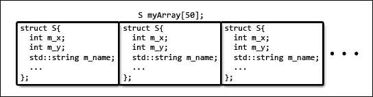
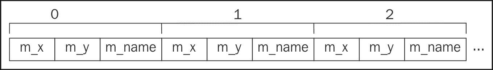
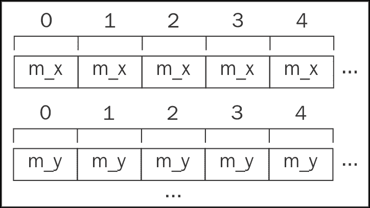
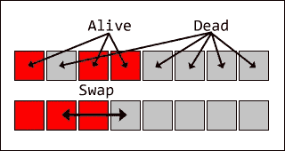
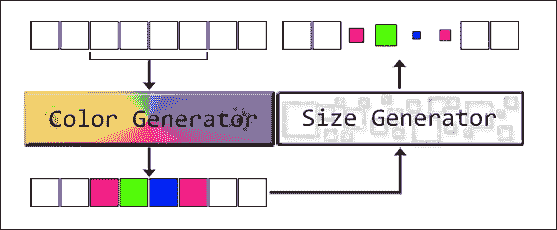
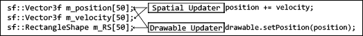
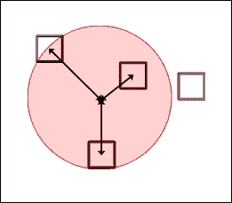
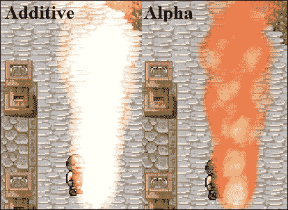
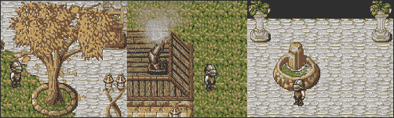
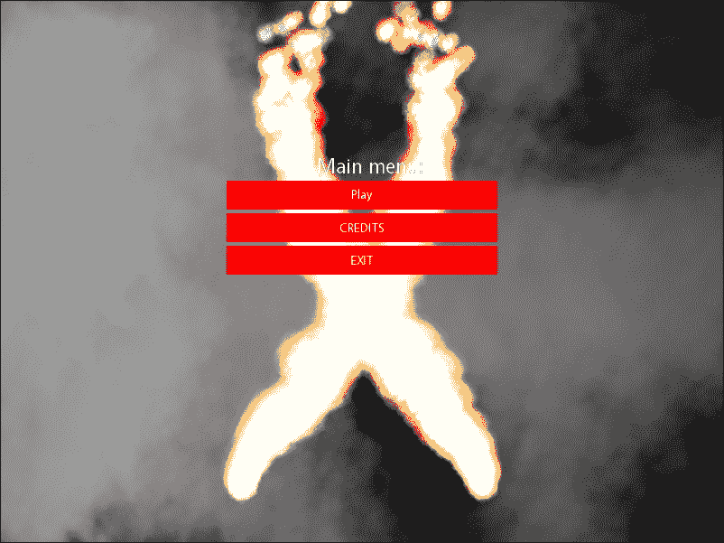

# 第三章. 让它下雨！——构建粒子系统

在任何游戏中拥有适当的交互性至关重要。无论是通过让玩家的后果引发连锁反应最终影响他们的状态来娱乐玩家，还是仅仅意味着控制感和输入管理感觉恰到好处，不可否认的是，这是为数不多的可以使游戏成功或失败的因素之一。虽然后者非常重要，但并不是菜单的流畅导航吸引了大多数玩家，这就是为什么在本章中我们将重点关注环境交互以及通过粒子系统实现的美化。

在本章中，我们将讨论以下主题：

+   **数组结构**存储模式的优点

+   灵活粒子系统的架构和实现

+   创建不同类型的生成器和更新器对象，允许创建各种效果

有很多东西需要学习，所以我们不要浪费时间，直接深入吧！

# 版权资源的使用

像往常一样，让我们首先感谢所有慷慨的艺术家，他们通过提供在极其灵活的许可下提供的资产，使这一切成为可能：

+   由*dbszabo1*创作的*misc png*，根据**CC0**许可（公有领域）：[`dbszabo1.deviantart.com/art/misc-png-316228902`](http://dbszabo1.deviantart.com/art/misc-png-316228902)

+   由*Juan Story*创作的*Jillcreation-overlay-cloud*，根据**CC0**许可（公有领域）：[`www.effecthub.com/item/5358`](http://www.effecthub.com/item/5358)

+   由*William.Thompsonj*创作的[LPC] Leaf Recolor，根据**CC-BY-SA 3.0**和**GPL 3.0**许可：[`opengameart.org/content/lpc-leaf-recolor`](http://opengameart.org/content/lpc-leaf-recolor)

# 粒子系统基础

在实现粒子系统之前，我们需要先了解一些关键概念，以便使我们的系统按预期工作，首先是从数据存储的方式开始。

## 结构体数组与数组结构体

起初可能会让人想将粒子拥有的所有数据都放入一个单独的类中，给它一些处理特定情况的自定义方法，并将所有这些对象存储在某个通用容器中，如下所示：



虽然这样做确实更简单，但对性能的提升却微乎其微。请记住，我们可能需要处理成千上万的粒子实例，而且这些实例需要以各种不同的方式更新。一个简单的粒子更新循环可能会使缓存看起来像这样：



从性能角度来看，这真是太糟糕了，因为如果我们只需要处理位置，这意味着缓存中所有额外的空间，本可以用来存储其他粒子的位置，现在却只存储了完全无用的数据，至少现在是这样。反过来，当需要更新另一个粒子的位置并请求它时，它很可能不会在缓存中找到，从而导致缓存未命中和时间的浪费。

一个更好的场景可能看起来像这样：



在性能方面，这要好得多，因为缓存中存在的所有数据都保证会被使用。我们如何实现这样的结果？通过将不同的粒子属性存储在自己的容器中，确保内存的连续性，如下所示：

```cpp
struct S{ 
  int m_x[50]; 
  int m_y[50]; 
  std::string m_name[50]; 
  ... 
}; 

```

然而，存储并不是一切。我们还必须确保，当我们处理此类结构时，只使用相关和必要的数据。然而，这部分内容将在稍后讨论。

## 粒子的存储

在解决了关键概念之后，让我们看看如何使用**SoA**模式存储粒子：

```cpp
class ParticleContainer { 
public: 
  ... 
  const static size_t Max_Particles = 3000; 
  sf::Vector3f m_position[Max_Particles]; 
  sf::Vector3f m_velocity[Max_Particles]; 
  sf::Vector3f m_acceleration[Max_Particles]; 
  sf::Vector2f m_startSize[Max_Particles]; 
  sf::Vector2f m_currentSize[Max_Particles]; 
  sf::Vector2f m_finalSize[Max_Particles]; 
  sf::Color m_startColor[Max_Particles]; 
  sf::Color m_currentColor[Max_Particles]; 
  sf::Color m_finalColor[Max_Particles]; 
  std::string m_texture[Max_Particles]; 
  sf::RectangleShape m_drawable[Max_Particles]; 
  float m_startRotation[Max_Particles]; 
  float m_currentRotation[Max_Particles]; 
  float m_finalRotation[Max_Particles]; 
  float m_lifespan[Max_Particles]; 
  float m_maxLifespan[Max_Particles]; 
  bool m_gravity[Max_Particles]; 
  bool m_addBlend[Max_Particles]; 
  bool m_alive[Max_Particles]; 

  size_t m_countAlive; 
  TextureManager* m_textureManager; 
protected: 
  ... 
}; 

```

存储和计算粒子属性有几种方法。在这里，我们使用 C 风格的数组以及一个表示它们大小的静态常量。所有这些属性以及它们的目的将在本章的后续部分中介绍。

在这里还有一些额外的好处是跟踪粒子的数量，以及指向纹理管理器的指针，因为其中一些可能正在使用需要抓取和释放的纹理。当然，它们在构造函数中设置得很好：

```cpp
ParticleContainer(TextureManager* l_textureManager) 
  : m_textureManager(l_textureManager), m_countAlive(0) 
{ Reset(); } 

~ParticleContainer(){ 
  for (size_t i = 0; i < Max_Particles; ++i){ 
    if (m_texture[i].empty()) { continue; } 
    m_textureManager->ReleaseResource(m_texture[i]); 
  } 
} 

```

这个容器类的析构函数有一个相当简单的工作。为了不留下任何悬而未决的问题，它只需要遍历存储的每个粒子，并检查它是否正在使用纹理，这只是一个字符串标识符。如果是，则释放纹理。

另一个相当重要的任务留给了构造函数，即重置粒子的所有分配内存。这留给`Reset()`方法：

```cpp
void Reset(){ 
  for (size_t i = 0; i < Max_Particles; ++i) { ResetParticle(i); } 
  m_countAlive = 0; 
} 

```

`ResetParticle`私有方法为列表中的每个单独的粒子调用。它负责将所有数据归零，以确保下一个获得相同标识符的粒子不会携带前一个拥有它的粒子遗留的某些属性。

为了有效地管理 SoA 结构，我们将使用这两个关键方法来启用和禁用特定的 ID：

```cpp
void Enable(size_t l_id){ 
  if (m_countAlive >= Max_Particles) { return; } 
  m_alive[l_id] = true; 
  Swap(l_id, m_countAlive); 
  ++m_countAlive; 
} 

void Disable(size_t l_id){ 
  if (!m_countAlive) { return; } 
  ResetParticle(l_id); 
  Swap(l_id, m_countAlive - 1); 
  --m_countAlive; 
} 

```

首先进行一次合理性检查，以确保我们不会在已经存在最大数量粒子的情况下启用任何粒子，或者在没有活跃粒子的情况下禁用任何粒子。启用粒子只需将其*存活*标志设置为*true*，而禁用则需要完全重置。然后，所有存储在`l_id`的数据都会在启用时与最后一个活跃粒子的元素交换，以使其成为最后一个，或者在禁用时与最后一个粒子交换。请考虑以下说明：



虽然它涵盖了禁用粒子的场景，但同样的基本原理也适用于启用。

实际的数据交换过程并不复杂：

```cpp
void Swap(size_t l_first, size_t l_second) { 
  std::swap(m_position[l_first], m_position[l_second]); 
  std::swap(m_velocity[l_first], m_velocity[l_second]); 
  std::swap(m_acceleration[l_first], m_acceleration[l_second]); 
  std::swap(m_startSize[l_first], m_startSize[l_second]); 
  ... 
} 

```

它简单地在对每个单个粒子的属性在`l_first`和`l_second`索引上调用`std::swap`。

最后，我们来到了单个粒子的实际重置代码：

```cpp
void ResetParticle(size_t l_id){ 
  m_alive[l_id] = false; 
  m_gravity[l_id] = false; 
  m_addBlend[l_id] = false; 
  m_lifespan[l_id] = 0.f; 
  m_maxLifespan[l_id] = 0.f; 
  m_position[l_id] = { 0.f, 0.f, 0.f }; 
  m_velocity[l_id] = { 0.f, 0.f, 0.f }; 
  m_acceleration[l_id] = { 0.f, 0.f, 0.f }; 
  m_startRotation[l_id] = 0.f; 
  m_currentRotation[l_id] = 0.f; 
  m_finalRotation[l_id] = 0.f; 
  m_startSize[l_id] = { 0.f, 0.f }; 
  m_currentSize[l_id] = { 0.f, 0.f }; 
  m_finalSize[l_id] = { 0.f, 0.f }; 
  m_startColor[l_id] = { 0, 0, 0, 0 }; 
  m_currentColor[l_id] = { 0, 0, 0, 0 }; 
  m_finalColor[l_id] = { 0, 0, 0, 0 }; 
  if (!m_texture[l_id].empty()){ 
    m_textureManager->ReleaseResource(m_texture[l_id]); 
    m_texture[l_id].clear(); 
    m_drawable[l_id].setTexture(nullptr); 
  } 
} 

```

预计，每个粒子的参数都会重置到提供的索引处的适当默认值。如果纹理标识符不为空，资源也会被释放，因为不再需要它。

## 粒子系统架构

为了适应粒子的存储方式，同时为系统提供更新、交互和灵活性的手段，我们必须仔细考虑其架构。让我们先将其分解成更小的部分，这样更容易单独管理：

+   **发射器**：存在于世界中的一个对象，充当粒子生成器。它有权访问一个生成器列表，每个发射出的粒子在生成之前都会通过这些生成器。

+   **生成器**：这属于其他具有直接访问粒子属性并根据它们自己的、预先定义的规则修改它们以实现某种外观的类似对象的列表。

+   **更新器**：粒子系统拥有的许多对象之一，旨在仅使用特定任务所需的数据，该任务始终与以特定方式更新粒子相关。

+   **力应用器**：一个小型数据结构，由一个更新器使用，以在世界上创建*力*，这些力与粒子进行物理交互。

让我们花些时间深入探讨每个单独的部分。

### 生成器

在这个语境中，发生器将充当一种盖章的作用。它将接收一系列粒子，这些粒子的属性将根据接收它们的生成器的类型进行调整。请考虑以下说明：



一个特定的生成器几乎可以被视为一种盖章。它印在粒子上的某些属性可能是随机的，而其他属性则是恒定的。无论如何，一旦将几个粒子输入其中，它们就会带有生成器负责的属性而被“盖章”。

我们将要实现的所有生成器都需要是通用的，这就是为什么它们都必须遵守提供的接口：

```cpp
class BaseGenerator { 
public: 
  virtual ~BaseGenerator() {} 
  virtual void Generate(Emitter* l_emitter, 
    ParticleContainer* l_particles, size_t l_from, size_t l_to)=0; 
  friend std::stringstream& operator >> ( 
    std::stringstream& l_stream, BaseGenerator& b) 
  { 
    b.ReadIn(l_stream); 
    return l_stream; 
  } 

  virtual void ReadIn(std::stringstream& l_stream){} 
}; 

```

首先，需要解释一下`Generate()`方法。它接受一个指向拥有它的`Emitter`实例的指针。它还接受一个指向它将要与之一起工作的粒子容器的指针。最后两个参数是构成范围的粒子 ID，这代表容器内将启用的粒子。范围本身将在拥有生成器的发射器内部计算。

这个基类还允许派生生成器实现如何从文件中加载它们的属性。这将在我们开始实际创建不同类型的生成器时变得很重要。

### 发射器

如前所述，发射器只是一个拥有生成器列表的类，以便生成特定类型的粒子。它可以在世界中定位，并负责通过跟踪其发射速率来计算发射的粒子 ID 范围。让我们看看`Emitter`类的头文件：

```cpp
class Emitter { 
public: 
  Emitter(const sf::Vector3f& l_position,int l_maxParticles = -1); 
  void Update(float l_dT, ParticleContainer* l_particles); 
  void SetPosition(const sf::Vector3f& l_position); 
  sf::Vector3f GetPosition() const; 
  size_t GetEmitRate() const; 
  void SetEmitRate(size_t l_nPerSecond); 
  void SetParticleSystem(ParticleSystem* l_system); 
  void SetGenerators(const std::string& l_generators); 
  std::string GetGenerators() const; 
  ParticleSystem* GetParticleSystem() const; 
private: 
  std::string m_generators; 
  size_t m_emitRate; 
  int m_maxParticles; 
  sf::Vector3f m_position; 
  float m_accumulator; 
  ParticleSystem* m_system; 
}; 

```

如您所见，这个类实际上并不存储生成器实例的列表。相反，它存储一个字符串标识符，该标识符将用于从粒子系统获取特定风格的粒子列表。

这个类中的所有设置器和获取器都是简单的单行方法，它们正好按照广告宣传的那样执行，所以我们不会涉及它们。

除了所有其他明显的数据成员之外，它还存储一个名为`m_accumulator`的浮点值，它将与发射速率一起使用。我们很快就会详细介绍它。它还存储一个`m_maxParticles`数据成员，以便知道是否应该无限期地发射粒子，或者发射器在创建了一定数量的粒子后需要停止。

#### 实现发射器

让我们从将所有数据成员初始化为其默认值的基本开始：

```cpp
Emitter::Emitter(const sf::Vector3f& l_position, 
  int l_maxParticles) : m_position(l_position),  
  m_maxParticles(l_maxParticles), m_emitRate(0), 
  m_accumulator(0.f), m_system(nullptr){} 

```

这个类中唯一真正重要的方法是`Update()`方法。它负责在粒子发射时进行所有实际的重负载工作：

```cpp
void Emitter::Update(float l_dT, ParticleContainer* l_particles){ 
  if (m_generators.empty()) { return; } 
  auto generatorList = m_system->GetGenerators(m_generators); 
  if (!generatorList) { return; } 
  m_accumulator += l_dT * m_emitRate; 
  if (m_accumulator < 1.f) { return; } 
  auto num_particles = static_cast<int>(m_accumulator); 
  m_accumulator -= num_particles; 
  if (m_maxParticles != -1) { 
    if (num_particles > m_maxParticles) { 
      num_particles = m_maxParticles; 
      m_maxParticles = 0; 
    } 
    else { m_maxParticles -= num_particles; } 
  } 
  size_t from = l_particles->m_countAlive; 
  size_t to = (l_particles->m_countAlive + num_particles > 
    l_particles->Max_Particles ? l_particles->Max_Particles - 1 
    : l_particles->m_countAlive + num_particles - 1); 

  for (auto& generator : *generatorList){ 
    generator->Generate(this, l_particles, from, to); 
  } 
  for (auto i = from; i <= to; ++i){ l_particles->Enable(i); } 
  if (!m_maxParticles) { m_system->RemoveEmitter(this); } 
} 

```

显然，如果生成器标识符为空，或者我们无法从粒子系统中获取生成器列表，更新将不会发生。只要不是这种情况，`m_accumulator` 数据成员就会根据发射速率和**delta time**进行增加。它保存了尚未发射的粒子总数。由于显然我们不能发射半个粒子或任何其他分数，因此会检查累加器数据成员是否小于一。如果是这种情况，就没有东西可以发射/更新。

需要发射的粒子数量通过将累加器值转换为整数来计算。然后从累加器中减去，保留剩余的粒子分数，以便在下一次滴答时使用。

我们知道发射器应该无限期地喷射粒子的方式是，如果其`m_maxParticles`数据成员被设置为`-1`。如果不是这样，这一刻要发射的粒子数量将检查是否没有超过限制。

最后，我们来到了有趣的部分。首先，计算将要复活的所有 ID 的范围，确保它不超过允许的最大粒子数。然后遍历发射器喷射出的粒子类型的生成器列表，将当前发射器的指针和粒子列表传递给它们的`Generate()`方法，同时传递计算出的范围。然后遍历粒子范围，重新启用以再次显示，并检查发射器是否需要被移除，如果`m_maxParticles`数据成员达到零。

### 更新器

为了让我们的粒子系统充满活力，我们必须不断更新它。考虑到性能，我们必须坚持 SoA 模式，并且只处理特定场景绝对必要的数据，如下所示：



考虑到这一点，可以为所有更新器创建一个非常基本的接口，看起来像这样：

```cpp
class BaseUpdater { 
public: 
  virtual ~BaseUpdater() {} 
  virtual void Update(float l_dT, 
    ParticleContainer* l_particles) = 0; 
}; 

```

如您所见，所有更新器应该关注的只是 delta 时间以及它们正在操作的粒子容器的指针。没有必要提供范围，因为它将操作所有*存活*粒子。

### 力应用器

因为我们不希望我们的角色在静态、死寂的环境中四处奔跑，所以需要事件和粒子之间的一些交互性。这种关系是通过力的方式建立的，它影响可达粒子动力学状态，如下所示：



力应用器不是粒子系统的基本组成部分。我们为了使它们通用化所需做的只是存储一些数据，并让适当的更新器处理逻辑。话虽如此，让我们看看我们需要存储什么：

```cpp
struct ForceApplicator { 
  ForceApplicator(const sf::Vector3f& l_center, 
    const sf::Vector3f& l_force, float l_radius) 
    : m_center(l_center), m_force(l_force), m_radius(l_radius){} 
  sf::Vector3f m_center; 
  sf::Vector3f m_force; 
  float m_radius; 
}; 

```

力可以在世界中定位，因此需要存储其中心。此外，还需要知道力的半径，以便确定影响区域。最后，没有首先知道其强度，就无法产生影响。这就是`m_force`发挥作用的地方，它允许在所有三个轴向上定义力。

# 构建粒子系统类

在所有构建块就绪之后，是时候实际构建粒子系统类了。让我们从一些类型定义开始：

```cpp
using Updaters = std::unordered_map<std::string, 
  std::unique_ptr<BaseUpdater>>; 
using EmitterList = std::vector<std::unique_ptr<Emitter>>; 
using Emitters = std::unordered_map<StateType, EmitterList>; 
using GeneratorList = std::vector<std::unique_ptr<BaseGenerator>>; 
using Generators = std::unordered_map<std::string,GeneratorList>; 
using RemovedEmitters = std::vector<Emitter*>; 
using Particles = std::unordered_map<StateType, 
  std::unique_ptr<ParticleContainer>>; 
using ForceApplicatorList = std::vector<ForceApplicator>; 
using ForceApplicators = std::unordered_map<StateType, 
  ForceApplicatorList>; 

using GeneratorFactory = std::unordered_map<std::string, 
  std::function<BaseGenerator*(void)>>; 

```

为了访问我们想要的任何更新器，我们可以将它们映射到`string`标识符。虽然更新器不是状态特定的，但发射器是。它们的列表必须与特定的状态相关联，以在整个应用程序中维护粒子。生成器，就像更新器一样，也不是特定于任何特定状态的，我们希望能够通过`Emitter`类中的字符串标识符来访问它们。说到这里，正如我们从已经覆盖的代码中可以看出，发射器可以请求移除自身，以防它们应该停止发射粒子。由于这发生在更新周期中，而类仍在使用中，因此必须保留一个单独的发射器指针列表，以便稍后移除。

粒子本身显然存储在指定的`ParticleContainer`类中，但这些容器显然可以被不同的状态拥有。这与之前类似的想法，我们将状态类型映射到不同的粒子容器，以维护应用程序范围内的粒子支持。相同的原理也适用于力应用器。

我们拥有的最后一种数据类型应该是一个明显的迹象，表明我们将使用工厂设计模式来生产不同类型的粒子生成器。这些类型也将与字符串标识符相关联。

考虑到所有这些，现在是时候讨论如何实现`ParticleSystem`类了，从其头文件开始：

```cpp
class ParticleSystem : public FileLoader, public StateDependent, 
  public MapLoadee 
{ 
public: 
  ParticleSystem(StateManager* l_stateManager, 
    TextureManager* l_textureMgr, RandomGenerator* l_rand, 
    Map* l_map); 
  void AddEmitter(std::unique_ptr<Emitter> l_emitter, 
    const StateType& l_state = StateType(0)); 
  void AddForce(ForceApplicator l_force, 
    const StateType& l_state = StateType(0)); 
  void RemoveEmitter(Emitter* l_emitter); 

  GeneratorList* GetGenerators(const std::string& l_name); 

  TextureManager* GetTextureManager() const; 
  RandomGenerator* GetRand() const; 

  void CreateState(const StateType& l_state); 
  void ChangeState(const StateType& l_state); 
  void RemoveState(const StateType& l_state); 

  void ReadMapLine(const std::string& l_type, 
    std::stringstream& l_stream); 

  void Update(float l_dT); 
  void ApplyForce(const sf::Vector3f& l_center, 
    const sf::Vector3f& l_force, float l_radius); 
  void Draw(Window* l_window, int l_elevation); 
private: 
  bool ProcessLine(std::stringstream& l_stream); 
  void ResetForNextFile(); 

  template<class T> 
  void RegisterGenerator(const std::string& l_name) { ... } 

  std::string m_loadingGenerator; 
  Particles m_container; 
  Particles::iterator m_stateItr; 
  Emitters::iterator m_emitterItr; 
  Updaters m_updaters; 
  Emitters m_emitters; 
  Generators m_generators; 
  GeneratorFactory m_factory; 
  ForceApplicators m_forces; 
  RemovedEmitters m_removedEmitters; 
  TextureManager* m_textureMgr; 
  RandomGenerator* m_rand; 
  Map* m_map; 
}; 

```

首先，让我们来探讨这个类的继承细节。因为我们将在文本文件中保存粒子的属性，所以从`FileLoader`继承是有用的，更不用说我们可以将工作卸载到单独的线程上。此外，回想一下，不同的状态将需要访问我们的粒子系统，这意味着粒子管理器必须实现添加、更改和删除状态的方法。最后，请记住，粒子发射器和影响它们的力可能是游戏地图包含的内容，因此我们也在继承`MapLoadee`类。

这个类本身显然需要访问纹理管理器，稍后会将一个指向它的指针传递给需要它的类。对于随机数生成器也是如此，以及地图实例的指针。

最后，请注意这个类的两个突出显示的数据成员，它们都是迭代器。这些被保留下来是为了在更新/渲染粒子时更容易地访问特定状态的数据。

## 实现粒子系统

让我们先看看这个类的构造函数：

```cpp
ParticleSystem::ParticleSystem(StateManager* l_stateManager, 
  TextureManager* l_textureManager, RandomGenerator* l_rand, 
  Map* l_map) 
  : m_stateManager(l_stateManager),m_textureMgr(l_textureManager), 
  m_rand(l_rand), m_map(l_map) 
{ 
  m_updaters.emplace("Lifespan", 
    std::make_unique<LifespanUpdater>()); 
  ... 
  RegisterGenerator<PointPosition>("PointPosition"); 
  ... 
} 

```

除了执行所有数据成员设置任务的初始化列表之外，构造函数在这里的另一个目的就是设置所有的更新器和生成器类型。我们上面的代码被大量缩减，但基本思想保持不变。我们想要使用的所有更新器都通过适当的字符串标识符插入到它们的容器中。在生成器方面，我们调用一个私有模板方法，将特定类型的生成器与字符串标识符关联起来。再次强调，这里我们使用了工厂模式。

将发射器对象添加到我们的粒子系统中相对简单：

```cpp
void ParticleSystem::AddEmitter( 
  std::unique_ptr<Emitter> l_emitter, const StateType& l_state) 
{ 
  l_emitter->SetParticleSystem(this); 
  if (!GetGenerators(l_emitter->GetGenerators())) {  
    return;  
  } 
  if (l_state == StateType(0)) { 
    if (m_emitterItr == m_emitters.end()) { return; } 
    m_emitterItr->second.emplace_back(std::move(l_emitter)); 
    return; 
  } 
  auto itr = m_emitters.find(l_state); 
  if (itr == m_emitters.end()) { return; } 
  itr->second.emplace_back(std::move(l_emitter)); 
} 

```

首先，为发射器提供一个指向粒子系统的指针，以便稍后访问。然后我们检查发射器的生成器列表名称是否有效。拥有一个将要产生 *空* 粒子的发射器是没有意义的。

如类头所示，此方法第二个参数提供了一个默认值。这为我们提供了一个很好的方法来区分用户是否希望将发射器添加到特定状态，或者只是当前选定的状态。这两种可能性随后在代码的剩余部分得到处理。

强制应用器以非常相似的方式处理：

```cpp
void ParticleSystem::AddForce(ForceApplicator l_force, 
  const StateType& l_state) 
{ 
  if (l_state == StateType(0)) { 
    if (m_stateItr == m_container.end()) { return; } 
    m_forces[m_currentState].emplace_back(l_force); 
    return; 
  } 
  auto itr = m_forces.find(l_state); 
  if(itr == m_forces.end()) { return; } 
  itr->second.emplace_back(l_force); 
} 

```

再次强调，第二个参数有一个默认值，因此我们在尝试将强制应用器数据插入适当的容器之前处理了这两种可能性。

如数据类型部分所述，移除发射器有两个阶段。第一阶段是将发射器的指针放入指定的列表中：

```cpp
void ParticleSystem::RemoveEmitter(Emitter* l_emitter) { 
  m_removedEmitters.push_back(l_emitter); 
} 

```

实际的移除操作在其他地方处理。我们很快就会介绍这一点。

获取生成器列表对于发射过程非常重要，因此，我们自然也需要一个方法来获取它：

```cpp
GeneratorList* ParticleSystem::GetGenerators( 
  const std::string& l_name) 
{ 
  auto& itr = m_generators.find(l_name); 
  if (itr == m_generators.end()) { 
    return nullptr; 
  } 
  return &itr->second; 
} 

```

现在，我们遇到了粒子系统的状态相关部分，从状态创建开始：

```cpp
void ParticleSystem::CreateState(const StateType& l_state) { 
  if (m_container.find(l_state) != m_container.end()) { return; } 
  m_container.emplace(l_state, 
    std::make_unique<ParticleContainer>(m_textureMgr)); 
  m_emitters.emplace(l_state, EmitterList()); 
  m_forces.emplace(l_state, ForceApplicatorList()); 
  ChangeState(l_state); 
} 

```

首先，需要确定正在创建的状态是否已经因为某种原因分配了自己的粒子容器。如果没有，就创建一个并将其插入到状态粒子的容器中，以及发射器列表和相同状态的强制应用器列表。

### 注意

`StateDependent` 类的 `CreateState()` 方法是唯一需要手动调用的代码，以防某些状态不需要使用特定的状态相关资源。

接下来，让我们讨论如何在粒子系统中改变状态：

```cpp
void ParticleSystem::ChangeState(const StateType& l_state) { 
  SetState(l_state); 
  m_stateItr = m_container.find(m_currentState); 
  m_emitterItr = m_emitters.find(m_currentState); 

  auto c = static_cast<CollisionUpdater*>( 
    m_updaters["Collision"].get()); 
  if (l_state == StateType::Game) { c->SetMap(m_map); } 
  else { c->SetMap(nullptr); } 
  auto f = static_cast<ForceUpdater*>(m_updaters["Force"].get()); 
  auto& forceItr = m_forces.find(m_currentState); 
  if (forceItr == m_forces.end()) { 
    f->SetApplicators(nullptr); return; 
  } 
  f->SetApplicators(&forceItr->second); 
} 

```

在调用一个用于改变其自身内部状态的私有方法之后，持有当前状态粒子迭代器的数据成员被更新。对发射器迭代器执行相同的操作。

在这个上下文中，接下来的几行代码可能没有太多意义，因为我们还没有处理任何更新器，但无论如何让我们来覆盖它们。在接下来的步骤中，我们将拥有粒子碰撞和力的更新器。就碰撞而言，更新器只需要指向游戏地图的指针，假设当前状态是`Game`。另一方面，`ForceUpdater`需要能够访问当前状态的力量应用者列表。这两种类型的更新器都包含在这里。

让我们通过查看在从粒子系统中删除状态时内部发生的情况来总结状态修改的主题：

```cpp
void ParticleSystem::RemoveState(const StateType& l_state) { 
  if (m_stateItr->first == l_state) { 
    m_stateItr = m_container.end(); 
    m_emitterItr = m_emitters.end(); 
  } 
  m_emitters.erase(l_state); 
  m_forces.erase(l_state); 
  m_container.erase(l_state); 
} 

```

我们在这里所做的只是从状态绑定容器中删除数据。由于保留了两个迭代器数据成员，因此如果被删除的状态与当前状态匹配，也必须重置它们。由于我们的状态系统的工作方式和`ChangeState`与`RemoveState`的顺序，我们不需要担心迭代器被无效化。

我们的粒子系统肯定会有很多从文本文件中加载的数据，这就是为什么它继承自文件加载类。让我们看看每行流将被喂入的方法：

```cpp
bool ParticleSystem::ProcessLine(std::stringstream& l_stream) { 
  std::string type; 
  l_stream >> type; 
  if (type == "Name") { 
    if (!(l_stream >> m_loadingGenerator)) { return false; } 
    auto generators = GetGenerators(m_loadingGenerator); 
    if (generators) { return false; } 
  } else { 
    if (m_loadingGenerator.empty()) { return false; } 
    auto itr = m_factory.find(type); 
    if (itr == m_factory.end()) { return true; } 
    std::unique_ptr<BaseGenerator> generator(itr->second()); 
    l_stream >> *generator; 
    m_generators[m_loadingGenerator].emplace_back( 
      std::move(generator)); 
  } 
  return true; 
} 

```

每行的第一个字符串，后来被称为类型，被提取出来。如果我们有一个名称，另一个字符串将被尝试提取，并在生成器列表中进行匹配检查，以避免重复。生成器列表的名称存储在`m_loadingGenerator`数据成员中。

如果遇到其他类型，可以安全地假设我们正在处理特定类型的生成器。如果是这种情况，首先会检查生成器列表名称是否为空，这会表明存在文件格式问题。然后，在生成器工厂中搜索从文件中加载的类型对应的生成器。如果找到了，就会通过它创建一个新的生成器实例，将流对象传递给它，通过`>>`操作符进行自己的加载，并将最终的实例插入到当前类型`m_loadingGenerator`的生成器列表中。

由于我们使用数据成员来保留文件信息，因此在尝试加载另一个文件之前必须重置它。我们的`FileLoader`接口提供了这样的功能，因为此方法被重载：

```cpp
void ParticleSystem::ResetForNextFile() { 
  m_loadingGenerator.clear(); 
} 

```

粒子系统最终继承的最终基类`MapLoadee`要求我们实现一个方法，该方法将处理具有自定义类型的地图文件条目：

```cpp
void ParticleSystem::ReadMapLine(const std::string& l_type, 
  std::stringstream& l_stream) 
{ 
  if (l_type == "ParticleEmitter") { 
    sf::Vector3f position; 
    size_t emitRate; 
    std::string generatorType; 
    l_stream >> generatorType >> position.x >> position.y >> 
      position.z >> emitRate; 
    auto emitter = std::make_unique<Emitter>(position); 
    emitter->SetEmitRate(emitRate); 
    emitter->SetGenerators(generatorType); 
    AddEmitter(std::move(emitter), StateType::Game); 
  } else if (l_type == "ForceApplicator") { 
    sf::Vector3f position; 
    sf::Vector3f force; 
    float radius; 
    l_stream >> position.x >> position.y >> position.z >> 
      force.x >> force.y >> force.z >> radius; 
    AddForce(ForceApplicator(position, force, radius), 
      StateType::Game); 
  } 
} 

```

如您所见，粒子系统支持两种不同的地图条目类型：`ParticleEmitter`和`ForceApplicator`。在两种情况下，所有适当的数据都会流式传输并应用于新构造的对象，然后添加到`Game`状态中。

接下来，让我们专注于使一切移动的方法，即所谓的`Update()`方法：

```cpp
void ParticleSystem::Update(float l_dT) { 
  if (m_stateItr == m_container.end()) { return; } 
  for (auto& emitter : m_emitterItr->second) { 
    emitter->Update(l_dT, m_stateItr->second.get()); 
  } 
  for (auto& updater : m_updaters){ 
    updater.second->Update(l_dT, m_stateItr->second.get()); 
  } 
  if (!m_removedEmitters.size()) { return; } 
  for (auto& removed : m_removedEmitters) { 
    m_emitterItr->second.erase( 
      std::remove_if( 
        m_emitterItr->second.begin(), 
        m_emitterItr->second.end(), 
        removed { 
          return emitter.get() == removed; 
        } 
    )); 
  } 
  m_removedEmitters.clear(); 
} 

```

它实际上只由三个基本部分组成：更新发射器，更新所有不同的`BaseUpdater`实例，以及处理移除的发射器。如果当前状态迭代器无效，则这些都不会发生。没有粒子可供工作意味着我们没有任何工作要做。

更新发射器和更新器相对简单。移除已处理的发射器也不是什么复杂的事情。通过迭代移除的发射器指针容器，并对每个条目，如果发射器仍然在世界上并且具有相同的内存地址，则将其从容器中移除。

最后，我们来到了负责将所有美丽的粒子显示在屏幕上的代码：

```cpp
void ParticleSystem::Draw(Window* l_window, int l_elevation) { 
  if (m_stateItr == m_container.end()) { return; } 
  auto container = m_stateItr->second.get(); 
  auto& drawables = container->m_drawable; 
  auto& positions = container->m_position; 
  auto& blendModes = container->m_addBlend; 
  auto view = l_window->GetRenderWindow()->getView(); 
  auto renderer = l_window->GetRenderer(); 

  auto state = m_stateManager->GetCurrentStateType(); 
  if (state == StateType::Game || state == StateType::MapEditor) { 
    renderer->UseShader("default"); 
  } else { 
    renderer->DisableShader(); 
  } 

  for (size_t i = 0; i < container->m_countAlive; ++i) { 
    if (l_elevation >= 0) { 
      if (positions[i].z < l_elevation * Sheet::Tile_Size) { 
        continue; 
      } 
      if (positions[i].z >= (l_elevation + 1) * Sheet::Tile_Size){ 
        continue; 
      } 
    } else if (positions[i].z < 
      Sheet::Num_Layers * Sheet::Tile_Size) 
    { continue; } 
    renderer->AdditiveBlend(blendModes[i]); 
    renderer->Draw(drawables[i]); 
  } 
  renderer->AdditiveBlend(false); 
} 

```

自然地，如果我们处于没有粒子容器的状态，则不需要进行绘制。否则，我们获取可绘制数组的引用，它们的位子和混合模式。由于我们希望粒子支持分层以增加深度，因此此方法的第二个参数接受当前正在绘制的层。

### 注意

注意这段代码中的状态检查和着色器的使用。我们实际上在这里控制粒子着色的状态。地图编辑器状态将在下一章中介绍。

如果层/高度测试通过，我们还需要进行一项额外的检查，以便能够渲染粒子，那就是粒子是否当前在屏幕的视图中。

### 小贴士

这个简单的 AABB 碰撞检测显然没有考虑到粒子可能被旋转的情况。虽然被检查的边界仍然包含粒子的整个身体，但某些特殊情况可能会导致粒子被渲染，而它以某种方式旋转，使得它应该是不可见的，但边界框仍然在视图中。这可以通过应用更复杂的碰撞检测算法来解决，但这里不会涉及。

最后，在所有测试都通过之后，是时候渲染粒子了。记住，对我们来说，在渲染时支持两种混合模式是最有益的：加法和 alpha 混合。幸运的是，SFML 使这变得很容易，我们只需要向窗口实例的 draw 方法传递一个额外的参数来决定如何绘制某个对象。

在渲染某些粒子类型时，能够切换混合模式可能很有用，因为这样可以使它们看起来更真实。例如，看看使用加法混合渲染的相同类型的粒子，与默认模式 alpha 混合相比：



虽然并非所有粒子都会利用这种混合模式，但对于需要额外动力的粒子来说，这确实是一个很好的选项。

# 创建更新器

核心粒子系统已经全部构建完毕，现在是时候关注那些将赋予我们系统功能性和润色的个别部分了。完成之后，以下是一些可能实现的效果：



唯一的方法是继续前进，让我们继续吧！

## 空间更新器

首先，可能是最明显的一项任务是根据粒子的运动状态调整粒子位置。尽管它们可能很小，但它们仍然基于速度、加速度和位置的变化来操作：

```cpp
class SpatialUpdater : public BaseUpdater { 
public: 
  void Update(float l_dT, ParticleContainer* l_particles) { 
    auto& velocities = l_particles->m_velocity; 
    auto& accelerations = l_particles->m_acceleration; 
    for (size_t i = 0; i < l_particles->m_countAlive; ++i) { 
      velocities[i] += accelerations[i] * l_dT; 
    } 
    auto& positions = l_particles->m_position; 
    for (size_t i = 0; i < l_particles->m_countAlive; ++i) { 
      positions[i] += velocities[i] * l_dT; 
    } 
  } 
}; 

```

到目前为止，一切顺利！其中一些更新器将具有相当小的足迹，因为它们执行的任务极其简单。我们在这里所做的一切只是获取速度、加速度和位置容器的引用。然后，通过两个独立的循环来操作数据，以最小化缓存未命中。

## 可绘制更新器

接下来，让我们更新粒子的可绘制部分。这正是名为 `DrawableUpdater` 的合适之处：

```cpp
class DrawableUpdater : public BaseUpdater { 
public: 
  void Update(float l_dT, ParticleContainer* l_particles) { 
    auto& positions = l_particles->m_position; 
    auto& drawables = l_particles->m_drawable; 
    for (size_t i = 0; i < l_particles->m_countAlive; ++i) { 
      drawables[i].setPosition(positions[i].x, positions[i].y); 
    } 
    auto& sizes = l_particles->m_currentSize; 
    for (size_t i = 0; i < l_particles->m_countAlive; ++i) { 
      drawables[i].setSize(sizes[i]); 
    } 
    for (size_t i = 0; i < l_particles->m_countAlive; ++i) { 
      float ScaleFactor = std::max( 
        (positions[i].z / Sheet::Tile_Size) * 
        ScaleToElevationRatio, 1.f); 
      drawables[i].setScale(ScaleFactor, ScaleFactor); 
    } 
    auto& colors = l_particles->m_currentColor; 
    for (size_t i = 0; i < l_particles->m_countAlive; ++i) { 
      drawables[i].setFillColor(colors[i]); 
    } 
    auto& rotations = l_particles->m_currentRotation; 
    for (size_t i = 0; i < l_particles->m_countAlive; ++i) { 
      drawables[i].setRotation(rotations[i]); 
    } 

    for (size_t i = 0; i < l_particles->m_countAlive; ++i) { 
      drawables[i].setOrigin( 
        drawables[i].getLocalBounds().width / 2, 
        drawables[i].getLocalBounds().height / 2); 
    } 
  } 
  static const float ScaleToElevationRatio; 
}; 

const float DrawableUpdater::ScaleToElevationRatio = 1.5f; 

```

这段代码相当多，但其本质非常简单。使用独立的循环来设置所有相关的可绘制属性。然而，我们还有一些更有趣的事情在进行。注意代码中突出显示的部分，所有这些都与缩放相关。你可能已经猜到了，当涉及到视觉效果时，SFML 只处理两个维度。为了模拟 3D 粒子在周围飞行的效果，我们可以利用可绘制缩放。缩放因子本身被限制在 *1.f*，所以我们不会小于默认粒子大小。这里的缩放与高度比设置为 *1.5f*，这可能是最佳值，但显然可以调整。这只是简单的比例，粒子所谓的 *高度* 乘以以获得缩放值，当使用时，应该产生粒子向摄像机飞行的错觉。

## 生命周期更新器

由于计算机资源，至少在撰写本书的时候是有限的，我们需要有一种好的方法来处理粒子，当它们需要被处理的时候。一个不错的想法是为粒子附加一个生命周期，这样在它应该过期后，粒子就可以优雅地从群体中移除：

```cpp
class LifespanUpdater : public BaseUpdater { 
public: 
  void Update(float l_dT, ParticleContainer* l_particles) { 
    auto& lifespans = l_particles->m_lifespan; 
    auto& maxLifespans = l_particles->m_maxLifespan; 
    for (size_t i = 0; i < l_particles->m_countAlive;) { 
      lifespans[i] += l_dT; 
      if (lifespans[i] < maxLifespans[i]) { ++i; continue; } 
      l_particles->Disable(i); 
    } 
  } 
}; 

```

这是一个相当简单的更新器。将时间增量添加到每个活动粒子中，然后检查该粒子是否已经超过了其生命周期。如果超过了，粒子将被禁用。请注意，禁用粒子将减少粒子容器中的 `m_countAlive` 数据成员。正因为如此，我们在递增局部变量 `i` 时必须小心，以免在过程中跳过任何数据。

## 插值器

粒子的大量属性在其生命周期内不会保持静态。以粒子颜色为例，我们可能想要将粒子淡化到完全透明，或者甚至循环一系列颜色。所有这些都可以通过插值来实现。这个过程是它自己的更新器类的良好候选者：

```cpp
class Interpolator : public BaseUpdater { 
public: 
  void Update(float l_dT, ParticleContainer* l_particles) { 
    auto& startColors = l_particles->m_startColor; 
    auto& currentColors = l_particles->m_currentColor; 
    auto& finalColors = l_particles->m_finalColor; 
    auto& lifespans = l_particles->m_lifespan; 
    auto& maxLifespans = l_particles->m_maxLifespan; 
    for (size_t i = 0; i < l_particles->m_countAlive; ++i) { 
      if (startColors[i] == finalColors[i]) { continue; } 
      currentColors[i].r = Utils::Interpolate<sf::Uint8>(0.f, 
        maxLifespans[i], startColors[i].r, finalColors[i].r, 
        lifespans[i]); 
      currentColors[i].g = Utils::Interpolate<sf::Uint8>(0.f, 
        maxLifespans[i], startColors[i].g, finalColors[i].g, 
        lifespans[i]); 
      currentColors[i].b = Utils::Interpolate<sf::Uint8>(0.f, 
        maxLifespans[i], startColors[i].b, finalColors[i].b, 
        lifespans[i]); 
      currentColors[i].a = Utils::Interpolate<sf::Uint8>(0.f, 
        maxLifespans[i], startColors[i].a, finalColors[i].a, 
        lifespans[i]); 
    } 

    auto& startRotations = l_particles->m_startRotation; 
    auto& currentRotations = l_particles->m_currentRotation; 
    auto& finalRotations = l_particles->m_finalRotation; 

    for (size_t i = 0; i < l_particles->m_countAlive; ++i) { 
      if (startRotations[i] == finalRotations[i]) { continue; } 
      currentRotations[i] = Utils::Interpolate<float>(0.f, 
        maxLifespans[i], startRotations[i], finalRotations[i], 
        lifespans[i]); 
    } 

    auto& startSizes = l_particles->m_startSize; 
    auto& currentSizes = l_particles->m_currentSize; 
    auto& finalSizes = l_particles->m_finalSize; 

    for (size_t i = 0; i < l_particles->m_countAlive; ++i) { 
      if (startSizes[i] == finalSizes[i]) { continue; } 
      currentSizes[i] = sf::Vector2f( 
        Utils::Interpolate<float>(0.f, maxLifespans[i], 
          startSizes[i].x, finalSizes[i].x, lifespans[i]), 
        Utils::Interpolate<float>(0.f, maxLifespans[i], 
          startSizes[i].y, finalSizes[i].y, lifespans[i])); 
    } 
  } 
}; 

```

再次强调，我们有很多代码，但它的本质基本上是一致的。存储在我们 `Utilities.h` 头文件中的 `Interpolate` 函数，接受一个时间范围，在这个范围内我们需要进行插值，以及应该进行插值的值范围，和当前的时间值，它决定了输出。

插值属性包括粒子颜色、旋转和大小。对于这三者，我们首先检查起始值是否与最终值相同，以避免无用的计算。

## 力更新器

在这个粒子系统的规划阶段，我们讨论了在世界上有不同类型的力会影响粒子。除了有自定义力的可能性之外，我们还希望有基本的重力，这样任何类型的粒子只要有被重力影响的属性，就会开始下落。让我们实现一个更新器，使我们能够做到这一点：

```cpp
class ForceUpdater : public BaseUpdater { 
  friend class ParticleSystem; 
public: 
  ForceUpdater() : m_applicators(nullptr) {} 

  void Update(float l_dT, ParticleContainer* l_particles) { 
    auto& velocities = l_particles->m_velocity; 
    auto& gravity = l_particles->m_gravity; 
    for (size_t i = 0; i < l_particles->m_countAlive; ++i) { 
      if (!gravity[i]) { continue; } 
      velocities[i].z -= Gravity * l_dT; 
    } 

    if (!m_applicators) { return; } 
    auto& positions = l_particles->m_position; 
    for (size_t i = 0; i < l_particles->m_countAlive; ++i) { 
      for (auto& force : *m_applicators) { 
        Force(force.m_center, force.m_force * l_dT, 
          force.m_radius, positions[i], velocities[i]); 
      } 
    } 
  } 

  void SetApplicators(ForceApplicatorList* l_list) { 
    m_applicators = l_list; 
  } 

  static const float Gravity; 
private: 
  void Force(const sf::Vector3f& l_center, 
    const sf::Vector3f& l_force, float l_radius, 
    sf::Vector3f& l_position, sf::Vector3f& l_velocity) 
  { ... } 

  ForceApplicatorList* m_applicators; 
}; 

const float ForceUpdater::Gravity = 128.f; 

```

这个特定更新器的第一个，也是最重要的功能，是将重力应用于所有需要重力的粒子。我们希望能够给某些类型的粒子，如烟雾或火焰，赋予不受重力影响的特性，所以这完全取决于一个可以设置的标志。实际的引力定义为静态 `const` 数据成员，并在类定义下方设置。

接下来是我们在世界中与力应用器打交道的事情。如果力更新器没有指向力应用器列表的指针，显然就没有什么可做的了，所以我们从更新方法中返回。否则，将调用一个私有的 `Force()` 方法，该方法使用力的中心、调整后的力大小（考虑了时间增量）、其半径，以及作为参数传递的粒子的位置和速度引用：

```cpp
void Force(const sf::Vector3f& l_center, 
  const sf::Vector3f& l_force, float l_radius, 
  sf::Vector3f& l_position, sf::Vector3f& l_velocity) 
{ 
  sf::Vector3f from(l_center.x - l_radius, 
    l_center.y - l_radius, l_center.z - l_radius); 
  sf::Vector3f to(l_center.x + l_radius, 
    l_center.y + l_radius, l_center.z + l_radius); 
  if (l_position.x < from.x) { return; } 
  if (l_position.y < from.y) { return; } 
  if (l_position.z < from.z) { return; } 
  if (l_position.x > to.x) { return; } 
  if (l_position.y > to.y) { return; } 
  if (l_position.z > to.z) { return; } 

  sf::Vector3f distance = l_center - l_position; 
  sf::Vector3f a_distance = sf::Vector3f(std::abs(distance.x), 
    std::abs(distance.y), std::abs(distance.z)); 
  float magnitude = std::sqrt(std::pow(a_distance.x, 2) + 
    std::pow(a_distance.y, 2) + std::pow(a_distance.z, 2)); 
  sf::Vector3f normal = sf::Vector3f( 
    a_distance.x / magnitude, 
    a_distance.y / magnitude, 
    a_distance.z / magnitude 
  ); 
  sf::Vector3f loss = sf::Vector3f( 
    std::abs(l_force.x) / (l_radius / a_distance.x), 
    std::abs(l_force.y) / (l_radius / a_distance.y), 
    std::abs(l_force.z) / (l_radius / a_distance.z) 
  ); 
  sf::Vector3f applied = sf::Vector3f( 
    (l_force.x > 0 ? l_force.x - loss.x : l_force.x + loss.x), 
    (l_force.y > 0 ? l_force.y - loss.y : l_force.y + loss.y), 
    (l_force.z > 0 ? l_force.z - loss.z : l_force.z + loss.z) 
  ); 
  applied.x *= normal.x; 
  applied.y *= normal.y; 
  applied.z *= normal.z; 
  if (distance.x < 0) { applied.x = -applied.x; } 
  if (distance.y < 0) { applied.y = -applied.y; } 
  if (distance.z < 0) { applied.z = -applied.z; } 

  l_velocity += applied; 
} 

```

使用力的中心和半径计算出距离范围后，测试粒子的位置，看它是否在力影响区域内。如果所有测试都通过，就计算力中心和粒子之间的距离。然后，它被用来计算它们之间的绝对距离，确定力的大小，并归一化向量。基于所有三个轴上的半径和距离，计算力损失，并从实际施加的力中减去，然后将结果乘以法线，以得到最终产品。根据距离的符号，我们可以确定力应该施加的方向，这就是下面三行的作用。最后，在完成所有这些工作之后，我们准备将施加的力添加到粒子的速度上。

在这个更新器的帮助下，我们实际上可以从类外对粒子应用力，如下所示：

```cpp
void ParticleSystem::ApplyForce(const sf::Vector3f& l_center, 
  const sf::Vector3f& l_force, float l_radius) 
{ 
  if (m_stateItr == m_container.end()) { return; } 
  auto f = static_cast<ForceUpdater*>(m_updaters["Force"].get()); 
  auto container = m_stateItr->second.get(); 
  auto& positions = container->m_position; 
  auto& velocities = container->m_velocity; 
  for (size_t i = 0; i < container->m_countAlive; ++i) { 
    f->Force(l_center, l_force, l_radius, 
      positions[i], velocities[i]); 
  } 
} 

```

虽然这不如在世界上有恒定力那么有用，但它仍然可以用于测试目的。

## 碰撞更新器

粒子与世界交互的另一个重要方面是处理它们的碰撞。到目前为止，我们唯一真正需要担心的碰撞是粒子撞击地面；然而，借助这个类，实际地图碰撞可以很容易地实现：

```cpp
class CollisionUpdater : public BaseUpdater { 
public: 
  void Update(float l_dT, ParticleContainer* l_particles) { 
    auto& positions = l_particles->m_position; 
    auto& velocities = l_particles->m_velocity; 
    for (size_t i = 0; i < l_particles->m_countAlive; ++i) { 
      if (positions[i].z > 0.f) { continue; } 
      positions[i].z = 0.f; 
      velocities[i].z = 0.f; 
    } 

    if (!m_map) { return; } 
    for (size_t i = 0; i < l_particles->m_countAlive; ++i) { 
      if (positions[i].z > 0.f) { continue; } 
      ApplyFriction(l_dT, positions[i], velocities[i]); 
    } 
  } 
  void SetMap(Map* l_map) { m_map = l_map; } 
private: 
  void ApplyFriction(float l_dT, sf::Vector3f& l_position, 
    sf::Vector3f& l_velocity) { ... } 
  Map* m_map; 
}; 

```

我们在这里需要担心的是检查粒子在*z*轴上的位置是否低于零。如果是这样，该轴上的位置将被重置为零，以及它的速度。此外，如果更新器已经提供了一个指向地图实例的指针，我们希望处理粒子与地图的摩擦，前提是它们接触地面。如果情况如此，delta 时间将被传递到一个私有的`ApplyFriction()`方法中，以及粒子的位置和速度向量：

```cpp
void ApplyFriction(float l_dT, sf::Vector3f& l_position, 
  sf::Vector3f& l_velocity) 
{ 
  sf::Vector2i tileCoords = sf::Vector2i( 
    static_cast<int>(floor(l_position.x / Sheet::Tile_Size)), 
    static_cast<int>(floor(l_position.y / Sheet::Tile_Size))); 
  auto tile = m_map->GetTile(tileCoords.x, tileCoords.y, 0); 
  sf::Vector2f friction; 
  if (!tile) { friction = m_map->GetDefaultTile()->m_friction; } 
  else { friction = tile->m_properties->m_friction; } 
  friction.x *= std::abs(l_velocity.x); 
  friction.y *= std::abs(l_velocity.y); 
  friction *= l_dT; 
  if (l_velocity.x != 0.f && friction.x != 0.f) { 
    if (std::abs(l_velocity.x) - std::abs(friction.x) < 0.f) { 
      l_velocity.x = 0.f; 
    } else { 
      l_velocity.x += (l_velocity.x > 0.f ? 
        friction.x * -1.f : friction.x); 
    } 
  } 

  if (l_velocity.y != 0.f && friction.y != 0.f) { 
    if (std::abs(l_velocity.y) - std::abs(friction.y) < 0.f) { 
      l_velocity.y = 0.f; 
    } else { 
      l_velocity.y += (l_velocity.y > 0.f ? 
        friction.y * -1.f : friction.y); 
    } 
  } 
} 

```

在确定粒子接触的瓦片坐标后，检查瓦片是否确实存在。如果不存在，则使用默认的摩擦系数。一旦所有这些都被整理好，就会计算由于摩擦而失去的速度，然后乘以 delta 时间以获得当前帧的准确结果。从这一点开始的所有其他内容都与确保添加的值具有正确的符号，并且不会导致越过绝对零进入相反符号域有关。

# 粒子生成器

有了所有这些更新器，除非为粒子生成某些基本值，否则实际上什么也不会发生。无论是粒子的初始位置、颜色的范围，还是附着在我们飞行小数据结构上的纹理名称，基于某种预先设定的概念来拥有这个初始数据集是很重要的。我们支持相当多的生成器，更不用说还有大量新的生成器候选者，以及由此产生的新类型粒子。话虽如此，让我们来看看一些基本内容，这样我们就可以开始实现一些基本效果。

## 点位置

在整个系统中，我们可能拥有的最简单的生成器是一个点位置。本质上，它只是将输入粒子的所有位置设置到空间中的一个静态点上：

```cpp
class PointPosition : public BaseGenerator { 
public: 
  void Generate(Emitter* l_emitter,ParticleContainer* l_particles, 
    size_t l_from, size_t l_to) 
  { 
    auto& positions = l_particles->m_position; 
    auto center = l_emitter->GetPosition(); 
    for (auto i = l_from; i <= l_to; ++i) {positions[i] = center;} 
  } 
}; 

```

所有粒子定位的中心点是从发射器那里获取的。其位置将始终用于确定粒子应该在哪里生成。

## 区域位置

将所有粒子的位置设置到同一个点可能会相当无聊，更不用说在视觉上也很奇怪。如果我们处理的是烟雾或火焰这样的粒子，那么在指定区域内分散粒子可能更有意义。这就是`AreaPosition`发挥作用的地方：

```cpp
class AreaPosition : public BaseGenerator { 
public: 
  AreaPosition() = default; 
  AreaPosition(const sf::Vector3f& l_deviation) 
    : m_deviation(l_deviation) {} 
  void Generate(Emitter* l_emitter,ParticleContainer* l_particles, 
    size_t l_from, size_t l_to) 
  { 
    auto& positions = l_particles->m_position; 
    auto center = l_emitter->GetPosition(); 
    auto rangeFrom = sf::Vector3f(center.x - m_deviation.x, 
      center.y - m_deviation.y, center.z - m_deviation.z); 
    auto rangeTo = sf::Vector3f(center.x + m_deviation.x, 
      center.y + m_deviation.y, center.z + m_deviation.z); 
    auto& rand = *l_emitter->GetParticleSystem()->GetRand(); 
    for (auto i = l_from; i <= l_to; ++i) { 
      positions[i] = sf::Vector3f( 
        rand(rangeFrom.x, rangeTo.x), 
        rand(rangeFrom.y, rangeTo.y), 
        rand(rangeFrom.z, rangeTo.z) 
      ); 
    } 
  } 

  void ReadIn(std::stringstream& l_stream) { 
    l_stream >> m_deviation.x >> m_deviation.y >> m_deviation.z; 
  } 
private: 
  sf::Vector3f m_deviation; 
}; 

```

这个特定的位置生成器仍然使用发射器位置作为中心点，但对其应用一个随机偏差范围。偏差值可以直接从粒子文件中读取，或者简单地通过这个生成器的构造函数设置。

## 行位置

面积位置的一个轻微变化是线位置。它的工作方式与面积位置相同，只是仅限于一个轴，这个轴可以通过构造函数提供或从粒子文件中加载：

```cpp
enum class LineAxis{ x, y, z }; 

class LinePosition : public BaseGenerator { 
public: 
  LinePosition() : m_axis(LineAxis::x), m_deviation(0.f) {} 
  LinePosition(LineAxis l_axis, float l_deviation) 
    : m_axis(l_axis), m_deviation(l_deviation) {} 
  void Generate(Emitter* l_emitter,ParticleContainer* l_particles, 
    size_t l_from, size_t l_to) 
  { 
    auto& positions = l_particles->m_position; 
    auto center = l_emitter->GetPosition(); 
    auto& rand = *l_emitter->GetParticleSystem()->GetRand(); 
    for (auto i = l_from; i <= l_to; ++i) { 
      if (m_axis == LineAxis::x) { 
        center.x = rand(center.x - m_deviation, 
          center.x + m_deviation); 
      } else if (m_axis == LineAxis::y) { 
        center.y = rand(center.y - m_deviation, 
          center.y + m_deviation); 
      } else { 
        center.z = rand(center.z - m_deviation, 
          center.z + m_deviation); } 
      positions[i] = center; 
    } 
  } 

  void ReadIn(std::stringstream& l_stream) { 
    std::string axis; 
    l_stream >> axis >> m_deviation; 
    if (axis == "x") { m_axis = LineAxis::x; } 
    else if (axis == "y") { m_axis = LineAxis::y; } 
    else if (axis == "z") { m_axis = LineAxis::z; } 
    else { std::cout << "Faulty axis: " << axis << std::endl; } 
  } 
private: 
  LineAxis m_axis; 
  float m_deviation; 
}; 

```

这里的随机偏差仅应用于一个轴。可以说，使用面积位置生成器可以达到相同的效果，但这并不妨碍有一些多样性。

## 粒子属性

粒子拥有的某些属性可能根本不需要自己的生成器。例如，粒子的重力和混合模式标志可以简单地汇总到单个类型的生成器中：

```cpp
class PropGenerator : public BaseGenerator { 
public: 
  PropGenerator(bool l_gravity = true, bool l_additive = false) 
    : m_gravity(l_gravity), m_additive(l_additive) {} 
  void Generate(Emitter* l_emitter,ParticleContainer* l_particles, 
    size_t l_from, size_t l_to) 
  { 
    auto& gravity = l_particles->m_gravity; 
    for (auto i = l_from; i <= l_to; ++i) { 
      gravity[i] = m_gravity; 
    } 
    auto& additive = l_particles->m_addBlend; 
    for (auto i = l_from; i <= l_to; ++i) { 
      additive[i] = m_additive; 
    } 
  } 

  void ReadIn(std::stringstream& l_stream) { 
    int gravity = 1; 
    int additive = 0; 
    l_stream >> gravity >> additive; 
    m_gravity = (gravity != 0); 
    m_additive = (additive != 0); 
  } 
private: 
  bool m_gravity; 
  bool m_additive; 
}; 

```

重力和混合模式标志，就像所有之前的生成器一样，可以从文件中加载，或者通过类的构造函数设置。

## 随机颜色

随机化所有发射粒子的颜色可能是人们想要做的事情，无论是对于像不同阴影的水粒子这样的轻微随机变化，还是对于像彩虹糖喷泉这样的完全随机。所有这些以及更多都可以通过这个类来完成：

```cpp
class RandomColor : public BaseGenerator { 
public: 
  RandomColor() = default; 
  RandomColor(const sf::Vector3i& l_from,const sf::Vector3i& l_to) 
    : m_from(l_from), m_to(l_to) {} 
  void Generate(Emitter* l_emitter,ParticleContainer* l_particles, 
    size_t l_from, size_t l_to) 
  { 
    auto& rand = *l_emitter->GetParticleSystem()->GetRand(); 
    auto& colors = l_particles->m_currentColor; 
    for (auto i = l_from; i <= l_to; ++i) { 
      sf::Color target{ 
        static_cast<sf::Uint8>(rand(m_from.x, m_to.x)), 
        static_cast<sf::Uint8>(rand(m_from.y, m_to.y)), 
        static_cast<sf::Uint8>(rand(m_from.z, m_to.z)), 
        255 
      }; 
      colors[i] = target; 
    } 
  } 
   void ReadIn(std::stringstream& l_stream) { 
    l_stream >> m_from.x >> m_to.x >> m_from.y >> m_to.y >> 
      m_from.z >> m_to.z; 
  } 
private: 
  sf::Vector3i m_from; 
  sf::Vector3i m_to; 
}; 

```

生成器存储范围，这些范围将被用来生成随机结果。它们可以从粒子文件中加载，或者通过构造函数设置。由于三个颜色通道中的范围可能不同，它们被分别随机化。

## 颜色范围

当随机颜色生成器只是简单地分配粒子的当前颜色时，颜色范围提供了一系列颜色，粒子在其生命周期内会通过插值逐渐过渡到这些颜色。这整个过程就像分配这些值一样简单：

```cpp
class ColorRange : public BaseGenerator { 
public: 
  ColorRange() = default; 
  ColorRange(const sf::Color& l_start, const sf::Color& l_finish) 
    : m_start(l_start), m_finish(l_finish) {} 
  void Generate(Emitter* l_emitter,ParticleContainer* l_particles, 
    size_t l_from, size_t l_to) 
  { 
    auto& beginning = l_particles->m_startColor; 
    auto& current = l_particles->m_currentColor; 
    auto& ending = l_particles->m_finalColor; 
    for (auto i = l_from; i <= l_to; ++i) { 
      beginning[i] = m_start; 
      current[i] = m_start; 
      ending[i] = m_finish; 
    } 
  } 
  void ReadIn(std::stringstream& l_stream) { 
    int s_r = 0, s_g = 0, s_b = 0, s_a = 0; 
    int f_r = 0, f_g = 0, f_b = 0, f_a = 0; 
    l_stream >> s_r >> s_g >> s_b >> s_a; 
    l_stream >> f_r >> f_g >> f_b >> f_a; 

    m_start = { 
      static_cast<sf::Uint8>(s_r), static_cast<sf::Uint8>(s_g), 
      static_cast<sf::Uint8>(s_b), static_cast<sf::Uint8>(s_a) 
    }; 
    m_finish = { 
      static_cast<sf::Uint8>(f_r), static_cast<sf::Uint8>(f_g), 
      static_cast<sf::Uint8>(f_b), static_cast<sf::Uint8>(f_a) 
    }; 
  } 
private: 
  sf::Color m_start; 
  sf::Color m_finish; 
}; 

```

就像之前一样，范围可以从粒子文件中读取或通过构造函数设置。粒子的初始颜色和当前颜色都设置为起始颜色。

注意反序列化方法。因为我们是从文本文件中读取整数，所以变量类型最初必须反映这一点。读取所有值之后，它们被转换为`sf::Uint8`并存储为范围。这显然包括 alpha 通道，以便在粒子即将消失时能够实现淡出效果。

## 随机生命周期

为粒子生成生命周期与到目前为止我们所做的一切相当相似，所以我们就直接进入正题吧：

```cpp
class RandomLifespan : public BaseGenerator { 
public: 
  RandomLifespan() : m_from(0.f), m_to(0.f) {} 
  RandomLifespan(float l_from, float l_to) 
    : m_from(l_from), m_to(l_to) {} 
  void Generate(Emitter* l_emitter,ParticleContainer* l_particles, 
    size_t l_from, size_t l_to) 
  { 
    auto& rand = *l_emitter->GetParticleSystem()->GetRand(); 
    auto& lifespans = l_particles->m_maxLifespan; 
    for (auto i = l_from; i <= l_to; ++i) { 
      lifespans[i] = rand(m_from, m_to); 
    } 
  } 

  void ReadIn(std::stringstream& l_stream) { 
    l_stream >> m_from >> m_to; 
  } 
private: 
  float m_from; 
  float m_to; 
}; 

```

预计生命周期也会以范围的形式存储，可以从粒子文件中加载或通过构造函数设置。之后，粒子的生命周期将在指定的范围内随机化。这可以通过消除视觉上容易突出的“死亡线”，提供某些效果的视觉多样性。

## 随机大小

随机化粒子大小是我们视觉工具箱中另一个有用的工具。让我们来看看：

```cpp
class RandomSize : public BaseGenerator { 
public: 
  RandomSize() : m_from(0), m_to(0) {} 
  RandomSize(int l_from, int l_to): m_from(l_from), m_to(l_to) {} 

  void Generate(Emitter* l_emitter,ParticleContainer* l_particles, 
    size_t l_from, size_t l_to) 
  { 
    auto& rand = *l_emitter->GetParticleSystem()->GetRand(); 
    auto& sizes = l_particles->m_currentSize; 
    for (auto i = l_from; i <= l_to; ++i) { 
      float size = static_cast<float>(rand(m_from, m_to)); 
      sizes[i] = sf::Vector2f(size, size); 
    } 
  } 

  void ReadIn(std::stringstream& l_stream) { 
    l_stream >> m_from >> m_to; 
  } 
private: 
  int m_from; 
  int m_to; 
}; 

```

与往常一样，范围作为数据成员存储，可以从文件中读取，或通过构造函数设置。尺寸本身随机化一次，然后作为两个轴的相同尺寸应用。到目前为止，我们没有理由生成具有不匹配尺寸的矩形粒子。

## 随机速度

如果我们不从这些粒子的出生开始推动它们，那么我们迄今为止投入系统的所有努力都将陷入停滞。应用随机速度值可以达到这个目的：

```cpp
class RandomVelocity : public BaseGenerator { 
public: 
  RandomVelocity() = default; 
  RandomVelocity(const sf::Vector3f& l_from, 
    const sf::Vector3f& l_to) : m_from(l_from), m_to(l_to) {} 

  void Generate(Emitter* l_emitter,ParticleContainer* l_particles, 
    size_t l_from, size_t l_to) 
  { 
    auto& rand = *l_emitter->GetParticleSystem()->GetRand(); 
    auto& velocities = l_particles->m_velocity; 
    for (auto i = l_from; i <= l_to; ++i) { 
      sf::Vector3f target{ 
        rand(m_from.x, m_to.x), 
        rand(m_from.y, m_to.y), 
        rand(m_from.z, m_to.z) 
      }; 
      velocities[i] = target; 
    } 
  } 

  void ReadIn(std::stringstream& l_stream) { 
    l_stream >> m_from.x >> m_to.x >> m_from.y >> m_to.y >> 
    m_from.z >> m_to.z; 
  } 
private: 
  sf::Vector3f m_from; 
  sf::Vector3f m_to; 
}; 

```

速度，如前面所述，在三维空间中工作，所以我们必须这样存储它们。它们的范围要么从粒子文件中加载，要么通过此生成器的构造函数设置。然后，它们将分别随机化并应用。

## 旋转范围

粒子的旋转可以用于我们想到的许多不同效果。在它们的寿命期间略微旋转它们可以提供一些很好的多样性，所以让我们在下一个生成器中反映这一点：

```cpp
class RotationRange : public BaseGenerator { 
public: 
  RotationRange() : m_start(0.f), m_finish(0.f) {} 
  RotationRange(float l_start, float l_finish) 
    : m_start(l_start), m_finish(l_finish) {} 
  void Generate(Emitter* l_emitter,ParticleContainer* l_particles, 
    size_t l_from, size_t l_to) 
  { 
    auto& beginning = l_particles->m_startRotation; 
    auto& ending = l_particles->m_finalRotation; 
    for (auto i = l_from; i <= l_to; ++i) { 
      beginning[i] = m_start; 
      ending[i] = m_finish; 
    } 
  } 

  void ReadIn(std::stringstream& l_stream) { 
    l_stream >> m_start >> m_finish; 
  } 
private: 
  float m_start; 
  float m_finish; 
}; 

```

由于旋转值将在粒子的寿命期间进行插值，我们使用起始和结束值来反映这一点。

## 尺寸范围

粒子尺寸与我们迄今为止处理的所有其他数据没有不同，所以让我们来看看：

```cpp
class SizeRange : public BaseGenerator { 
public: 
  SizeRange() : m_start(0), m_finish(0) {} 
  SizeRange(float l_start, float l_finish) 
    : m_start(l_start), m_finish(l_finish) {} 
  void Generate(Emitter* l_emitter,ParticleContainer* l_particles, 
    size_t l_from, size_t l_to) 
  { 
    if (m_start == m_finish) { 
      auto& sizes = l_particles->m_currentSize; 
      for (auto i = l_from; i <= l_to; ++i) { 
        sizes[i] = sf::Vector2f(m_start, m_start); 
      } 
    } else { 
      auto& beginning = l_particles->m_startSize; 
      auto& ending = l_particles->m_finalSize; 
      for (auto i = l_from; i <= l_to; ++i) { 
        beginning[i] = sf::Vector2f(m_start, m_start); 
        ending[i] = sf::Vector2f(m_finish, m_finish); 
      } 
    } 
  } 

  void ReadIn(std::stringstream& l_stream) { 
    l_stream >> m_start >> m_finish; 
  } 
private: 
  float m_start; 
  float m_finish; 
}; 

```

提供给此生成器的范围首先会被检查，看它们是否不相等。然而，如果它们不相等，我们可以将粒子的尺寸视为常数，并将其当前尺寸简单地设置为该值，以节省插值器的工作量。否则，将填充尺寸的起始和结束值。

## 纹理生成器

最后，但绝对是最重要的，我们可以通过纹理化使我们的粒子看起来大约有一百万倍吸引人。幸运的是，我们的系统在这个阶段使这变得相当容易。让我们来看看：

```cpp
class TextureGenerator : public BaseGenerator { 
public: 
  TextureGenerator() = default; 
  TextureGenerator(const std::string& l_texture) 
    : m_texture(l_texture) {} 
  void Generate(Emitter* l_emitter,ParticleContainer* l_particles, 
    size_t l_from, size_t l_to) 
  { 
    if (m_texture.empty()) { return; } 
    TextureManager* manager = l_emitter-> 
      GetParticleSystem()->GetTextureManager(); 
    if (!manager->RequireResource(m_texture)) { return; } 
    auto& textures = l_particles->m_texture; 
    auto& drawables = l_particles->m_drawable; 
    auto resource = manager->GetResource(m_texture); 
    auto size = resource->getSize(); 
    for (auto i = l_from; i <= l_to; ++i) { 
      textures[i] = m_texture; 
      manager->RequireResource(m_texture); 
      drawables[i].setTexture(resource); 
      drawables[i].setTextureRect(sf::IntRect(0,0,size.x,size.y)); 
    } 
    manager->ReleaseResource(m_texture); 
  } 

  void ReadIn(std::stringstream& l_stream){l_stream >> m_texture;} 
private: 
  std::string m_texture; 
}; 

```

需要用于粒子类型的纹理的字符串标识符首先要么从文件中加载，要么通过构造函数传入。然后，在`Generate`方法内部检查该字符串，以确保它不为空。在获得纹理管理器的指针后，通过尝试获取资源句柄来检查资源句柄的有效性。

### 注意

记住，`RequireResource`行实际上声明资源正在被使用，直到它被释放。

正在被生成的所有粒子都将提供纹理的资源句柄。对于每个粒子，资源需要一次，然后最终传递到粒子的可绘制对象中，并根据粒子大小进行适当的裁剪。

最后，注意`Generate()`方法中最后高亮显示的代码行。因为我们已经通过在验证目的和获取资源引用时在非常开始时要求它，增加了一次内部资源计数器，现在必须释放它，使内部资源计数器的值与实际使用此纹理的粒子数量相同。

# 使用粒子系统

在我们开始使用粒子系统之前，需要进行一些基本的设置。首先，由于粒子系统依赖于状态和地图加载，它们之间的关系必须在主`Game`类内部设置，如下所示：

```cpp
void Game::SetUpStates() { 
  ... 
  m_stateManager->AddDependent(m_particles.get()); 
  ... 
} 

void Game::SetUpClasses() { 
  ... 
  m_gameMap.AddLoadee(m_particles.get()); 
} 

```

接下来，让我们构建一种实际类型的粒子，它将在主菜单中使用，使其看起来非常壮观：

```cpp
Name MenuFlame 
PointPosition 
SizeRange 32 8 
|ColorRange 255 255 0 100 0 255 255 0 
RandomColor 100 255 100 255 100 255 
RandomLifespan 6 6 
RandomVelocity -10 10 -50 -80 5 10 
RotationRange 0 45 
Texture Flame 
Properties 0 1 

```

所有这些生成器参数都已经介绍过了，所以如果这个格式看起来有问题，那么再次回顾生成器部分可能是明智的。

让我们把所有这些壮观的视觉效果添加到菜单状态中，使其比目前看起来更加引人注目。我们可以先设置几个发射器：

```cpp
void State_MainMenu::OnCreate() { 
  ... 
  auto w_size = context->m_wind->GetWindowSize(); 
  context->m_particles->CreateState(StateType::MainMenu); 
  auto emitter = std::make_unique<Emitter>(sf::Vector3f( 
    static_cast<float>(w_size.x) / 3.f, 
    static_cast<float>(w_size.y) - 64.f, 
    33.f)); 
  emitter->SetEmitRate(25); 
  emitter->SetGenerators("MenuFlame"); 
  context->m_particles->AddEmitter(std::move(emitter)); 
  emitter = std::make_unique<Emitter>(sf::Vector3f( 
    (static_cast<float>(w_size.x) / 3.f) * 2.f, 
    static_cast<float>(w_size.y) - 64.f, 
    33.f)); 
  emitter->SetEmitRate(25); 
  emitter->SetGenerators("MenuFlame"); 
  context->m_particles->AddEmitter(std::move(emitter)); 
  emitter = std::make_unique<Emitter>(sf::Vector3f( 
    0.f, 
    static_cast<float>(w_size.y) / 2.f, 
    0.f)); 
  emitter->SetEmitRate(60); 
  emitter->SetGenerators("MenuSmoke"); 
  context->m_particles->AddEmitter(std::move(emitter)); 
  auto f = ForceApplicator( 
    sf::Vector3f(static_cast<float>(w_size.x) / 2.f, 
      static_cast<float>(w_size.y) / 2.f, 64.f), 
    sf::Vector3f(500.f, 500.f, 500.f), 256.f); 
  context->m_particles->AddForce(f); 
} 

```

注意代码中高亮的那一行。为了能够使用它，必须在粒子系统中创建一个状态。接下来，创建了两个发射器。一个位于屏幕宽度的三分之一处，另一个位于三分之二处。它们都被添加到系统中，还有一个位于左侧的发射器，它将产生烟雾。最后，在两个火焰之间添加了一个力应用器，也添加到粒子系统中。通过这种深思熟虑的定位，我们将创建一个即将展示的非常漂亮的效果。

我们显然需要更新粒子以使其正常工作：

```cpp
void State_MainMenu::Update(const sf::Time& l_dT) { 
  m_stateMgr->GetContext()->m_particles->Update(l_dT.asSeconds()); 
} 

```

最后，让我们在屏幕上绘制它们：

```cpp
void State_MainMenu::Draw() { 
  auto context = m_stateMgr->GetContext(); 
  for (unsigned int i = 0; i < Sheet::Num_Layers; ++i) { 
    m_stateMgr->GetContext()->m_particles->Draw( 
      *m_stateMgr->GetContext()->m_wind, i); 
  } 
  m_stateMgr->GetContext()->m_particles->Draw( 
    *m_stateMgr->GetContext()->m_wind, -1); 
} 

```

由于`Draw()`方法接受我们当前正在绘制的层，并且对于这个状态来说层是不相关的，所以我们只是遍历层的数量，对每一层调用`Draw()`方法。最后，使用参数`-1`再次调用`Draw()`方法，表示我们想要绘制所有超出最大层的粒子。

最终结果，连同烟雾效果，看起来有点像这样：



这远远不能展示出粒子系统真正能做什么。本章中的代码包含了存在于游戏状态中的示例，可以通过编译项目并在场景中漫步轻松找到。

# 摘要

可能有很多东西需要吸收，但如果你在这里，恭喜你！通过一些精心的设计、经过计算的决策和一点品味，我们不仅制作了一个使游戏看起来好十倍的粒子系统，而且还形成了知识的基础，这可以作为向更好设计和提高性能迈进的垫脚石。

在接下来的几章中，我们将介绍制作我们自己的工具的基础知识，这些工具将用于实际设计我们正在工作的游戏及其资产。那里见！
