# 第八章. 光之诞生 - 高级光照简介

在这个时代，对游戏有一定的标准期望。随着技术的进步和任何给定计算单元中晶体管数量的增加，我们可用的能力越来越多，可以做到以前无法想象的事情。肯定利用了所有这些额外马力的就是动态光照。由于其惊人的视觉效果，它已经成为大多数视频游戏的一个基本组成部分，现在也是人们期望与之一起到来的核心技术之一。

在本章中，我们将涵盖以下主题：

+   使用延迟渲染/着色技术

+   实现多遍光照着色器

+   使用法线图伪造几何复杂性

+   使用高光图创建闪亮的表面

+   使用高度图使光照感觉更立体

让我们开始探讨这个主题的细节！

# 使用第三方软件

本章中使用的所有材料图都不是手工绘制的。为了生成某些材料图，使用了*Crazybump*，可以在[`crazybump.com/`](http://crazybump.com/)找到。

在网上还可以找到其他免费替代方案。

# 延迟渲染

延迟渲染/着色是一种技术，它通过不在第一次遍历中启用某些效果来让我们对场景中某些效果的应用有更大的控制权。相反，场景可以被渲染到一个离屏缓冲区中，以及其他包含相同图像的其他材料类型的缓冲区，然后在效果应用之后，可能是在多个遍历之后，绘制到屏幕上。使用这种方法允许我们将某些逻辑与我们的主渲染代码分离和模块化。它还给我们提供了将尽可能多的效果应用到最终图像的机会。让我们看看实现这项技术需要什么。

## 修改渲染器

为了支持我们即将利用的所有新技巧，我们需要对我们的渲染器做一些修改。它应该能够保持一个缓冲纹理，并在多个遍历中渲染到它，以创建我们想要的光照：

```cpp
class Renderer { 
  friend Window; 
public: 
  ... 
  void EnableDeferredRendering(); 
  void BeginSceneRendering(); 
  void BeginTextureRendering(); 
  sf::RenderTexture* GetCurrentTexture(); 
  sf::RenderTexture* GetFinishedTexture(); 
  void SwapTextures(); 
  void ClearCurrentTexture(); 
  void ClearFinishedTexture(); 
  void ClearTextures(); 
  void DrawBufferTexture(); 
  void DisableDeferredRendering(); 
  ... 
private: 
  void CreateTextures(); 
  ... 
  sf::Shader* m_currentShader; 
  sf::RenderTexture* m_currentTexture; 
  sf::RenderTexture m_texture1; 
  sf::RenderTexture m_texture2; 
  ... 
  bool m_deferred; 
}; 

```

为了方便起见，我们有一些方法可以切换延迟渲染过程。此外，由于渲染场景到纹理与渲染纹理到另一个纹理略有不同，因为相机的（视图）位置不同，我们将使用`BeginSceneRendering()`和`BeginTextureRendering()`方法来正确处理这项任务。

注意这个类中使用了两个纹理，以及一个指向当前正在使用的纹理的指针。多遍方法的核心是能够在绘制当前渲染目标的同时采样包含前一次渲染遍历信息的纹理。

最后，我们将讨论三种清除当前纹理、前一个渲染通道的纹理以及这两个纹理的方法。然后，可以通过调用`DrawBufferTexture()`方法来渲染最新的渲染通道纹理。

### 在`Renderer`类中实现更改

让我们从简单的事情开始。实现延迟渲染切换方法；它们将帮助您跟踪当前的渲染状态：

```cpp
void Renderer::EnableDeferredRendering() { 
  if (!m_useShaders) { return; } 
  m_deferred = true; 
} 

void Renderer::DisableDeferredRendering() { m_deferred = false; } 

```

如您所见，这就像翻转一个标志一样简单。在启用延迟渲染的情况下，我们还需要检查是否允许使用着色器。

此外，我们用作缓冲区的纹理显然需要被创建：

```cpp
void Renderer::CreateTextures() { 
  if (!m_useShaders) { return; } 
  m_texture1.create(m_screenSize.x, m_screenSize.y); 
  m_texture2.create(m_screenSize.x, m_screenSize.y); 
  ClearTextures(); 
  m_texture1.display(); 
  m_texture2.display(); 
  m_currentTexture = &m_texture1; 
} 

```

这种特定方法是在`Renderer`构造函数中调用的。

接下来，我们有一些同样简单但更为重要的内容：

```cpp
void Renderer::BeginSceneRendering() { 
  auto& view = m_window->GetRenderWindow()->getView(); 
  m_currentTexture->setView(view); 
} 

void Renderer::BeginTextureRendering() { 
  auto& view = m_window->GetRenderWindow()->getDefaultView(); 
  m_currentTexture->setView(view); 
} 

```

通过在适当的时间使用这些方法，我们可以成功绘制出具有世界坐标的形状，这些形状对于一个独立纹理缓冲区来说大小为窗口大小。我们也可以简单地从另一个窗口大小的纹理中绘制信息到缓冲区。

一些有用的获取器方法总是很有用的：

```cpp
sf::RenderTexture* Renderer::GetCurrentTexture() { 
  if (!m_useShaders) { return nullptr; } 
  return m_currentTexture; 
} 

sf::RenderTexture* Renderer::GetFinishedTexture() { 
  if (!m_useShaders) { return nullptr; } 
  if (!m_currentTexture) { return nullptr; } 
  return (m_currentTexture == &m_texture1 ? 
    &m_texture2 : &m_texture1); 
} 

```

虽然第一个方法只是返回当前正在使用的缓冲纹理的指针，但第二个方法则正好相反。它确定哪个纹理不是当前缓冲区；一旦确定，它就返回该对象的指针。为什么这会如此有用，我们很快就会明白。

清除这些纹理就像人们想象的那样简单：

```cpp
void Renderer::ClearCurrentTexture() { 
  if (!m_useShaders) { return; } 
  if (!m_currentTexture) { return; } 
  m_currentTexture->clear(); 
} 

void Renderer::ClearFinishedTexture() { 
  if (!m_useShaders) { return; } 
  auto texture = GetFinishedTexture(); 
  if (!texture) { return; } 
  texture->clear(); 
} 

void Renderer::ClearTextures() { 
  if (!m_useShaders) { return; } 
  m_texture1.clear(); 
  m_texture2.clear(); 
} 

```

为了准备另一个渲染通道并显示对第一个缓冲区所做的所有更改，纹理必须这样交换：

```cpp
void Renderer::SwapTextures() { 
  if (!m_useShaders) { return; } 
  if (m_currentTexture) { m_currentTexture->display(); } 
  if (m_currentTexture != &m_texture1) { 
    m_currentTexture = &m_texture1; 
  } else { 
    m_currentTexture = &m_texture2; 
  } 
} 

```

注意对纹理的`display`方法的调用。调用`display`是必需的，因为我们希望纹理所做的所有更改都能反映出来。如果不调用此方法，我们的进度就不会显现。

对这个类的一个关键修改是确保在启用延迟渲染时使用缓冲纹理：

```cpp
void Renderer::Draw(const sf::Drawable& l_drawable, 
  sf::RenderTarget* l_target) 
{ 
  if (!l_target) { 
    if (!m_deferred || !m_useShaders) { 
      l_target = m_window->GetRenderWindow(); 
    } else { l_target = m_currentTexture; } 
  } 
  sf::RenderStates states = sf::RenderStates::Default; 
  if (m_addBlend) { states.blendMode = sf::BlendAdd; } 
  if (m_useShaders && m_currentShader) { 
    states.shader = m_currentShader; 
  } 
  l_target->draw(l_drawable, states); 
  ++m_drawCalls; 
} 

```

在进行几项检查以确保我们不会覆盖已提供的渲染目标并且着色器使用已启用之后，我们通过覆盖`l_target`指针的地址来选择缓冲纹理。

最后，包含所有渲染通道信息的缓冲纹理可以这样绘制到屏幕上：

```cpp
void Renderer::DrawBufferTexture() { 
  if (!m_useShaders) { return; } 
  auto texture = GetFinishedTexture(); 
  if (!texture) { return; } 
  m_sprite.setTexture(texture->getTexture()); 
  Draw(m_sprite); 
} 

```

这种简单而强大的设计为我们提供了实现几乎所有可想象的后处理效果的可行性。

## 一个最小示例

偶然的一个效果，本章的重点是动态照明。在我们进一步实现更高级的功能或深入研究更复杂的概念之前，让我们逐步了解使用新实现的渲染器功能的过程。让我们一步一步来。

首先，场景应该像往常一样绘制到纹理缓冲区：

```cpp
renderer->EnableDeferredRendering(); 
renderer->UseShader("default"); 
renderer->BeginSceneRendering(); 

for (unsigned int i = 0; i < Sheet::Num_Layers; ++i) { 
  context->m_gameMap->Draw(i); 
  context->m_systemManager->Draw(window, i); 
  particles->Draw(window, i); 
} 
particles->Draw(window, -1); 

renderer->SwapTextures(); 

```

如你所见，一旦启用延迟渲染，将使用默认的着色器，场景渲染过程开始。对于每一层，地图、实体和粒子都像往常一样绘制。现在唯一的区别是，在幕后使用缓冲纹理。一旦一切都被渲染，纹理被交换；这允许当前的背缓冲纹理显示所有变化：

```cpp
renderer->BeginTextureRendering(); 

if(renderer->UseShader("LightPass")) { 
  auto shader = renderer->GetCurrentShader(); 
  auto time = context->m_gameMap->GetTimeNormal(); 
  shader->setUniform("AmbientLight", 
    sf::Glsl::Vec3(time, time, time)); 
  sf::Vector3f lightPos(700.f, 300.f, 10.f); 
  sf::Vector2i screenPos = window->GetRenderWindow()-> 
    mapCoordsToPixel({ lightPos.x, lightPos.y }); 
  shader->setUniform("LightPosition", 
    sf::Glsl::Vec3(screenPos.x, window->GetWindowSize().y - 
    screenPos.y, lightPos.z)); 
  shader->setUniform("LightColor", 
    sf::Glsl::Vec3(0.1f, 0.1f, 0.1f)); 
  shader->setUniform("LightRadius", 128.f); 

  shader->setUniform("texture", 
    renderer->GetFinishedTexture()->getTexture()); 

  auto size = context->m_wind->GetWindowSize(); 

  sf::VertexArray vertices(sf::TrianglesStrip, 4); 
  vertices[0] = sf::Vertex(sf::Vector2f(0, 0), 
    sf::Vector2f(0,   1)); 
  vertices[1] = sf::Vertex(sf::Vector2f(size.x, 0), 
    sf::Vector2f(1, 1)); 
  vertices[2] = sf::Vertex(sf::Vector2f(0, size.y), 
    sf::Vector2f(0, 0)); 
  vertices[3] = sf::Vertex(sf::Vector2f(size), 
    sf::Vector2f(1, 0)); 

  renderer->Draw(vertices); 
  renderer->SwapTextures(); 
} 

```

一旦场景被渲染，我们就进入从现在开始将被称作光照通道的阶段。这个特殊的通道使用它自己的着色器，并负责场景的照明。它设置了所谓的*环境光*以及常规的全向光。

### 注意

**环境光**是一种没有位置的光。它均匀地照亮场景的任何部分，无论距离如何。

如前述代码所示，点光源首先将它的世界坐标转换为屏幕空间坐标，然后作为统一变量传递给着色器。然后，将光颜色和半径传递给着色器，以及前一个通道的纹理，在这个例子中，仅仅是场景的颜色（漫反射）图。

### 注意

**点光源**是一种从单个点向所有方向（全向）发射光的光源，形成一个照明球体。

### 小贴士

屏幕空间坐标系中的*Y*轴与世界坐标格式相反，这意味着正的*Y*值向上而不是向下。这就是为什么在传递给着色器之前必须调整光位置*Y*坐标的原因。

代码的下一部分主要是用来触发将漫反射纹理完整重绘到缓冲纹理上的操作。我们创建了一个由两个三角形条组成的四边形，表示为`sf::VertexArray`。它的大小被设置为整个窗口的大小，以确保所有像素都能被重绘。一旦四边形被绘制，纹理再次交换以反映所有变化：

```cpp
renderer->DisableDeferredRendering(); 
window->GetRenderWindow()->setView( 
  window->GetRenderWindow()->getDefaultView()); 
renderer->DrawBufferTexture(); 
window->GetRenderWindow()->setView(currentView); 
renderer->DisableShader(); 

```

这个例子中的最后一部分只是关闭了延迟渲染，这样从现在开始所有的渲染操作都将对窗口进行。然后设置窗口视图为默认状态，以便缓冲纹理可以轻松地绘制到屏幕上。最后，在禁用任何仍然活跃的着色器之前，我们重新设置了视图。

### 着色器代码

我们几乎完成了！这个谜题中最后但绝对不是最不重要的一个部分是正确编写光照通道着色器以获得正确的结果。鉴于我们已经在 C++代码中对光照过程有所了解，让我们看看 GLSL 能提供什么：

```cpp
uniform sampler2D texture; 
uniform vec3 AmbientLight; 
uniform vec3 LightPosition; 
uniform vec3 LightColor; 
uniform float LightRadius; 

void main() 
{ 
  vec4 pixel = texture2D(texture, gl_TexCoord[0].xy); 

  float dist = sqrt( 
    pow(LightPosition.x - gl_FragCoord.x, 2) + 
    pow(LightPosition.y - gl_FragCoord.y, 2) + 
    pow(LightPosition.z - gl_FragCoord.z, 2)); 

  vec4 finalPixel; 

  if(dist <= LightRadius) 
    finalPixel = (gl_Color * pixel) + 
    (pixel * vec4(LightColor, 1.0)); 
  else 
    finalPixel = (gl_Color * pixel) * vec4(AmbientLight, 1.0); 
  gl_FragColor = finalPixel; 
} 

```

如预期的那样，我们需要在这个通道中处理漫反射纹理以保留颜色信息。其他统一值包括表示环境颜色的 3D 向量，两个表示常规光源位置和颜色的 3D 向量，以及表示相同光源半径的浮点值。

传递给着色器的纹理在适当的插值纹理坐标处采样，并存储在 `pixel` 变量中。然后使用勾股定理距离公式计算正在处理的像素与光源中心的距离：

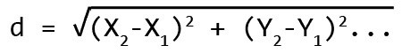

### 注意

`gl_FragCoord` 参数在屏幕空间中持有像素坐标。它的 *Z* 分量是一个深度值，目前我们不会使用它。

### 小贴士

`pow` 函数简单地返回一个值，该值是其第二个参数的幂。

在计算距离之后，会进行检查以确定我们正在处理的光与像素之间的距离是否在光源的半径内。如果是，我们的像素的颜色信息将与光颜色相乘并添加到最终要写入的像素中。否则，颜色信息将简单地乘以环境颜色。

这个相当基本的原则给我们带来了，正如预期的那样，相当基本和非现实的光照效果：

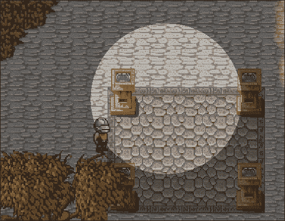

虽然它可行，但在现实中，光线是向所有方向发射的。它也会逐渐失去亮度。让我们看看在我们的游戏中实现这一效果需要什么。

# 光线衰减

光线衰减，也称为强度逐渐减弱，是我们将在创建光源逐渐减弱效果时使用的技术。它本质上归结为在光线通过着色器中使用另一个公式。有许多衰减光线的变体适用于不同的目的。让我们看看：

```cpp
uniform sampler2D texture; 
uniform vec3 AmbientLight; 
uniform vec3 LightPosition; 
uniform vec3 LightColor; 
uniform float LightRadius; 
uniform float LightFalloff; 

void main() 
{ 
  vec4 pixel = texture2D(texture, gl_TexCoord[0].xy); 
  // Nornalized light vector and distance to the light surface. 
  vec3 L = LightPosition - gl_FragCoord.xyz; 
  float distance = length(L); 
  float d = max(distance - LightRadius, 0); 
  L /= distance; 
  // calculate basic attenuation 
  float attenuation = 1 / pow(d/LightRadius + 1, 2); 

  attenuation = (attenuation - LightFalloff) / (1 - LightFalloff); 
  attenuation = max(attenuation, 0); 

  vec4 finalPixel = (gl_Color * pixel); 
  finalPixel *= vec4(AmbientLight, 1.0); // IF FIRST PASS ONLY! 
  finalPixel += (pixel * vec4(LightColor, 1.0) * attenuation); 

  gl_FragColor = finalPixel; 
} 

```

再次强调，我们处理的是相同的统一值，但增加了一个额外的 `LightFalloff` 值。这是一个介于 *0* 和 *1* 之间的因子，决定了光源亮度衰减的速度。

在 `main()` 函数内部，漫反射像素按常规采样。这在我们计算表示像素与光源中心位置差异的向量 `L` 之前完成。然后使用 `length` 函数将此向量转换为距离。这是我们在这个着色器的第一次迭代中手动计算的那种类型的距离。然后使用浮点数变量 `d` 通过从光源半径中减去它来计算片段与光源外部的距离。`max()` 函数确保如果像素在光源的气泡内部，我们不会得到一个负值。

如前所述，衰减本身可以有多种变体。这种特定的变体在视觉上最适合我们正在处理的类型游戏。

在计算完成后，最终输出像素乘以环境光（如果有多遍光遍历，则仅在第一遍执行）。此外，光信息乘以漫反射像素，并将衰减因子加到它上面。这次乘法确保了，如果像素在有效光范围内，则不会添加额外的光。结果是稍微更吸引人：

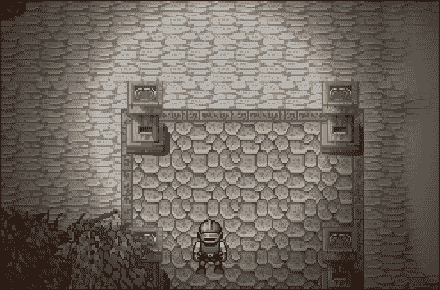

在这个阶段，你可以提出一个非常好的问题：“究竟如何才能处理多个光源输入？”幸运的是，这比想象中要简单一些。

# 多遍着色

就像 *C/C++* 代码一样，GLSL 也支持使用数据数组。使用它们似乎是一个明显的选择，只需将关于多个光流的信息推送到着色器，并在一次遍历中完成所有操作。然而，与 *C++* 不同的是，GLSL 需要在编译时知道这些数组的大小，这非常类似于 *C*。截至写作时，动态大小数组还不受支持。虽然这个信息可能会让处理多个光源的简单计划变得困难，但显然还是有其他选择。

一种对抗这种情况的方法可能是使用一个非常大的、静态大小的数据数组。只有其中的一部分数据会被填充，着色器会通过遍历数组来处理它，同时使用一个统一的整数来告诉它实际传递给它多少个光源。这个想法有几个明显的瓶颈。首先，屏幕上允许的最大光流数量会有一个阈值。第二个问题是性能。将数据发送到 GPU 是昂贵的，如果我们一次性发送过多的信息，这会迅速变得低效。

尽管第一个想法有缺陷，但它有一个在考虑更好的策略时很有用的组成部分：允许的最大光流数量。为什么不一次只发送一小部分数据，在不同的遍历中进行呢？如果每次发送正确数量的光流，CPU 和 GPU 的性能瓶颈都可以最小化。然后，可以将每个遍历的结果混合成一个单一的纹理。

## 修改光遍历着色器

为了正确混合多个遍历的缓冲区纹理，我们需要克服一些挑战。首先，由于环境光，信息会有损失。如果光线太暗，后续的遍历就会越来越不明显。为了解决这个问题，除了最后渲染遍历的颜色信息外，我们还需要访问实际的漫反射图。

第二个问题是选择每个着色器传递的光流数量。这可以通过基准测试或简单地通过试错得到正确答案。就我们的目的而言，我们将选择每个传递 3-4 条光流。让我们看看如何修改光着色器以实现这一点：

```cpp
uniform sampler2D LastPass; 
uniform sampler2D DiffuseMap; 
uniform vec3 AmbientLight; 
uniform int LightCount; 
uniform int PassNumber; 

struct LightInfo { 
  vec3 position; 
  vec3 color; 
  float radius; 
  float falloff; 
}; 

const int MaxLights = 3; 
uniform LightInfo Lights[MaxLights]; 

```

首先，注意新的 `sampler2D` 统一类型，它被传递给漫反射图。这将非常有价值，以避免在额外的传递中光颜色被冲淡。我们将需要的其他两块额外信息是确定发送到当前传递的着色器的光流数量的值，以及我们目前正在处理的传递。

实际的光信息现在被整洁地存储在一个 `struct` 中，该 `struct` 包含我们期望的常规数据。在其下方，我们需要声明一个表示每个着色器传递最大光流数量的常量整数，以及将被我们的 C++代码填充光信息的统一数组。

让我们看看着色器主体需要经历哪些变化才能支持这一点：

```cpp
void main() 
{ 
  vec4 pixel = texture2D(LastPass, gl_TexCoord[0].xy); 
  vec4 diffusepixel = texture2D(DiffuseMap, gl_TexCoord[0].xy); 
  vec4 finalPixel = gl_Color * pixel; 
  if(PassNumber == 1) { finalPixel *= vec4(AmbientLight, 1.0); } 
  // IF FIRST PASS ONLY! 
  for(int i = 0; i < LightCount; ++i) { 
     vec3 L = Lights[i].position - gl_FragCoord.xyz; 
     float distance = length(L); 
     float d = max(distance - Lights[i].radius, 0); 
     L /= distance; 
     float attenuation = 1 / pow(d/Lights[i].radius + 1, 2); 
     attenuation = (attenuation - Lights[i].falloff) / 
       (1 - Lights[i].falloff); 
     attenuation = max(attenuation, 0); 
     finalPixel += diffusepixel * 
       ((vec4(Lights[i].color, 1.0) * attenuation)); 
  } 
  gl_FragColor = finalPixel; 
} 

```

首先，我们需要采样漫反射像素以及来自前一个着色器传递的像素。`finalPixel` 变量在早期就建立了，并使用前一个着色器传递的信息。请注意这一点，因为否则前一个传递将会丢失。由于我们现在可以在着色器中访问传递编号，因此我们可以在第一个传递期间仅对像素应用环境光。

然后，我们可以跳入一个 `for` 循环，该循环使用从 C++端传入的 `LightCount` 常量。这种设计让我们能够只使用发送到着色器的数据，而不会过度使用，如果最后一个着色器传递的光流数量少于允许的最大数量。

最后，让我们看看在片段的实际着色方面需要做出哪些改变。我们的所有计算保持不变，只是现在使用光数据。灯光常量现在通过方括号访问，以在循环的每次迭代中获取正确的信息。注意循环底部的最终像素计算。现在它使用漫反射像素而不是前一个着色器传递的像素。

## C++代码中的更改

我们刚刚完成的 GLSL 中的所有花哨之处，如果没有我们实际代码库的适当支持，都是不完整的。首先，让我们从简单的东西开始，并方便地在一个合适的 `struct` 中表示光流：

```cpp
struct LightBase { 
  LightBase(const sf::Vector3f& l_pos, 
    const sf::Vector3f& l_color, float l_rad, float l_fall) 
    : m_lightPos(l_pos), m_lightColor(l_color), m_radius(l_rad), 
    m_falloff(l_fall) {} 
  LightBase(const sf::Vector3f& l_color): m_lightColor(l_color) {} 
  sf::Vector3f m_lightPos; 
  sf::Vector3f m_lightColor; 
  float m_radius; 
  float m_falloff; 
}; 

```

现在好了！现在让我们开始将所有额外的信息传递给着色器本身：

```cpp
... // Diffuse pass. 
renderer->SwapTextures(); 
auto DiffuseImage = renderer->GetFinishedTexture()-> 
  getTexture().copyToImage(); 
DiffuseImage.flipVertically(); 
auto DiffuseTexture = sf::Texture(); 
DiffuseTexture.loadFromImage(DiffuseImage); 
renderer->BeginTextureRendering(); 
... 
std::vector<LightBase> lights; 
// {Position}, {Color}, Radius, Falloff 
lights.push_back({ { 700.f, 350.f, 10.f }, { 1.f, 0.f, 0.f }, 
  128.f, 0.005f }); 
lights.push_back({ { 600.f, 350.f, 10.f }, { 0.f, 1.f, 0.f }, 
  128.f, 0.005f }); 
lights.push_back({ { 500.f, 350.f, 10.f }, { 0.f, 0.f, 1.f }, 
  128.f, 0.005f }); 
lights.push_back({ { 400.f, 600.f, 10.f },{ 1.f, 0.f, 0.f }, 
  128.f, 0.005f }); 
lights.push_back({ { 300.f, 600.f, 10.f },{ 0.f, 1.f, 0.f }, 
  128.f, 0.005f }); 
lights.push_back({ { 200.f, 600.f, 10.f },{ 0.f, 0.f, 1.f }, 
  128.f, 0.005f }); 
lights.push_back({ { 600.f, 550.f, 0.f }, { 1.f, 1.f, 1.f }, 
  128.f, 0.005f }); 

const int LightsPerPass = 3; 

```

在我们完成绘制到漫反射纹理之后，它被复制并存储在一个单独的缓冲区中。然后它沿 *Y* 轴翻转，因为复制过程会反转它。

### 小贴士

这里纹理的复制和翻转只是一个概念验证。它不应该在生产代码中执行，因为它非常低效。

到目前为止，我们已经准备好开始光照遍历。在我们开始之前，确保添加了一些光照流到`std::vector`中，并等待传递。此外，在底部声明一个常量，表示每次传递给着色器的光照流数量。这个数字必须与着色器内部的常量匹配。

让我们从实际的轻量级遍历开始，看看它包含哪些内容：

```cpp
if (renderer->UseShader("LightPass")) { 
  renderer->BeginTextureRendering(); 
  auto shader = renderer->GetCurrentShader(); 
  shader->setUniform("AmbientLight", 
    sf::Glsl::Vec3(0.f, 0.f, 0.2f)); 
  int i = 0; 
  int pass = 0; 
  auto lightCount = lights.size(); 
  for (auto& light : lights) { 
    std::string id = "Lights[" + std::to_string(i) + "]"; 
    sf::Vector2i screenPos = window->GetRenderWindow()-> 
      mapCoordsToPixel({light.m_lightPos.x, light.m_lightPos.y}); 
    shader->setUniform(id + ".position", sf::Glsl::Vec3( 
      screenPos.x, window->GetWindowSize().y - screenPos.y, 
      light.m_lightPos.z)); 
    shader->setUniform(id + ".color", 
      sf::Glsl::Vec3(light.m_lightColor)); 
    shader->setUniform(id + ".radius", light.m_radius); 
    shader->setUniform(id + ".falloff", light.m_falloff); 
    ++i; 
    if (i < LightsPerPass && (pass * LightsPerPass) + i 
      < lightCount) 
    { continue; } 
    shader->setUniform("LightCount", i); 
    i = 0; 
    shader->setUniform("PassNumber", pass + 1); 
    shader->setUniform("LastPass", 
      renderer->GetFinishedTexture()->getTexture()); 
    shader->setUniform("DiffuseMap", DiffuseTexture); 
    renderer->Draw(vertices); 
    renderer->SwapTextures(); 
    renderer->BeginTextureRendering(); 
    ++pass; 
  } 
} 
... 

```

环境光照首先设置，因为它在迭代之间不会改变。在这种情况下，我们给它一点蓝色调。此外，还创建了几个用于迭代和遍历的局部变量，以便随时获取这些信息。

当我们遍历每个光照流时，会创建一个名为`id`的字符串，其中包含每次迭代的整数。这是为了表示着色器内部光照流的统一数组访问分析，它将作为帮助我们访问和覆盖这些数据的有用方式。然后使用带有附加点操作符的`id`字符串和`struct`数据成员的名称，通过`id`字符串传递光照信息。不久之后，光照标识符`i`会增加。在这个时候，我们需要决定是否已经处理了所需数量的光照流，以便调用着色器。如果已经添加了遍历的最后一个光照流，或者我们正在处理场景的最后一个光照流，那么将初始化其余的统一变量，并绘制我们之前提到的全屏`sf::VertexArray`四边形，为每个可见像素调用一个着色器。这实际上给我们一个这样的结果：

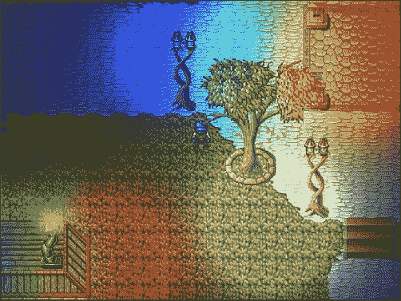

现在我们有进展了！这个方法的唯一缺点是我们必须处理 C++代码中的所有混乱，因为所有这些数据都没有得到妥善管理。现在就让我们来解决这个问题吧！

# 管理光照输入

在软件设计的各个方面，良好的数据组织都很重要。很难想象一个运行快速且高效的程序，同时希望在后台运行一个强大、强大且灵活的框架。到目前为止，我们的情况相当容易管理，但想象一下，如果你想为地图、实体以及所有的粒子绘制额外的纹理。这很快就会变得令人厌烦，难以维护。是时候利用我们的工程智慧，提出一个更好的系统了。

## 适用于轻量级用户

首要的是，任何希望使用我们的光照引擎的类都需要实现它们自己的版本，将某些类型的纹理绘制到缓冲区（s）。对于漫反射贴图，我们已经有普通的`Draw`调用，但即使它们都有相同的签名，这也还不够好。这些类需要一个通用的接口，以便它们成为光照家族中成功的部分：

```cpp
class LightManager; 
class Window; 

class LightUser { 
  friend class LightManager; 
  virtual void Draw(MaterialMapContainer& l_materials, 
    Window& l_window, int l_layer) = 0; 
}; 

```

`LightUser`类强制任何派生类实现一个特殊的`Draw`方法，该方法使用材料容器。它还可以访问`Window`类，并知道它试图绘制到哪个层。你可能会问：“什么是材料容器？”让我们通过进一步探讨这个设计来找出答案。

## 光管理器类

在我们设计一个可以处理所有照明需求的大类之前，让我们谈谈材料。碰巧的是，我们已经处理过一种类型的材料：漫反射贴图。我们还将使用许多其他可能的材料，所以我们不再绕弯子，来看看它们是什么：

```cpp
enum class MaterialMapType { Diffuse, Height, Normal, 
  Specular, COUNT }; 
using MaterialMapContainer = std::unordered_map< 
  MaterialMapType, std::unique_ptr<sf::RenderTexture>>; 

```

除了漫反射贴图，我们还将构建*高度*、*法线*和*镜面*贴图。现在这些术语可能都不太容易理解，但没关系。随着我们一步步深入，每个术语都会被详细解释。

材料贴图容器类型只是一个将类型链接到`sf::RenderTexture`的映射。这样，我们可以为每种材料类型拥有一个单独的纹理。

对于光管理器，我们只需要两个类型定义：

```cpp
using LightContainer = std::vector<LightBase>; 
using LightUserContainer = std::vector<LightUser*>; 

```

如您所见，它们极其简单。我们将存储光流本身以及指向光用户类的指针，因为这里不需要更复杂的东西。有了这个，让我们看看`LightManager`类的实际定义：

```cpp
class Window; 

class LightManager { 
public: 
  LightManager(Window* l_window); 

  void AddLight(const LightBase& l_light); 
  void AddLightUser(LightUser* l_user); 
  LightBase* GetAmbientLight(); 

  void RenderMaterials(); 
  void RenderScene(); 

  const unsigned int LightsPerPass = 4; 
protected: 
  MaterialMapContainer m_materialMaps; 
private: 
  void ClearAll(); 
  void SetViews(); 
  void DisplayAll(); 
  LightBase m_ambientLight; 
  LightContainer m_lights; 
  LightUserContainer m_users; 

  sf::VertexArray m_fullScreenQuad; 

  Window* m_window; 
}; 

```

如您所见，这已经是最基本的了。构造函数接收一个指向`Window`类的指针。我们为轻度用户提供了几个`add`方法，以及轻量级流本身。我们还为特定任务提供了一些渲染方法。注意这个类定义的常量整数，它表示每个着色器通道允许的最大光流数量。像我们之前那样只渲染三个光流有点浪费，所以这个数字可以进一步提高，前提是不会对处理过程的性能产生不利影响。

其中有三个辅助方法--处理清除缓冲区纹理、设置它们的视图以及显示对它们的更改。我们还存储了我们将用于执行光通操作的四边形的`sf::VertexArray`。

### 实现光管理器

和往常一样，让我们先看看当创建光管理器时需要构建什么：

```cpp
LightManager::LightManager(Window* l_window) : m_window(l_window), 
  m_ambientLight({ 0.f, 0.f, 0.f }) 
{ 
  auto windowSize = l_window->GetWindowSize(); 
  for (auto i = 0; 
    i < static_cast<int>(MaterialMapType::COUNT); ++i) 
  { 
    auto pair = m_materialMaps.emplace( 
      static_cast<MaterialMapType>(i), 
      std::move(std::make_unique<sf::RenderTexture>())); 
    auto& texture = pair.first->second; 
    texture->create(windowSize.x, windowSize.y); 
  } 

  m_fullScreenQuad = sf::VertexArray(sf::TriangleStrip, 4); 

  m_fullScreenQuad[0] = sf::Vertex( 
    sf::Vector2f(0, 0), sf::Vector2f(0, 1)); 
  m_fullScreenQuad[1] = sf::Vertex( 
    sf::Vector2f(windowSize.x, 0), sf::Vector2f(1, 1)); 
  m_fullScreenQuad[2] = sf::Vertex( 
    sf::Vector2f(0, windowSize.y), sf::Vector2f(0, 0)); 
  m_fullScreenQuad[3] = sf::Vertex( 
    sf::Vector2f(windowSize), sf::Vector2f(1, 0)); 
} 

```

初始化列表对于存储`Window`指针以及将环境光照初始化为绝对黑色很有用。一旦完成，就获取窗口大小并创建所有材料纹理。最后，设置窗口大小的四边形以供以后使用。

添加器和获取器方法相当简单，但它们是必要的：

```cpp
void LightManager::AddLight(const LightBase& l_light) { 
  m_lights.push_back(l_light); 
} 
void LightManager::AddLightUser(LightUser* l_user) { 
  m_users.emplace_back(l_user); 
} 
LightBase* LightManager::GetAmbientLight() { 
  return &m_ambientLight; 
} 

```

处理所有材料贴图一次在打字上可能会相当浪费，因此我们需要一些方法来帮助我们快速完成这项工作：

```cpp
void LightManager::ClearAll() { 
  for (auto& map : m_materialMaps) { map.second->clear(); } 
} 

void LightManager::SetViews() { 
  auto view = m_window->GetRenderWindow()->getView(); 
  for (auto& map : m_materialMaps) { map.second->setView(view); } 
} 

void LightManager::DisplayAll() { 
  for (auto& map : m_materialMaps) { map.second->display(); } 
} 

```

注意`SetViews()`中使用的视图。由于这些材料贴图将代替窗口使用，它们必须使用窗口的视图来处理所有被绘制视觉的世界坐标。

说到材质贴图，任何希望使用我们的光照管理器的类都应该能够绘制到其中的每一个。幸运的是，我们已经通过使这些类实现一个纯虚`Draw`方法来简化了这一点：

```cpp
void LightManager::RenderMaterials() { 
  ClearAll(); 
  SetViews(); 
  // Render each elevation in proper order. 
  for (auto i = 0; i < Sheet::Num_Layers; ++i) { 
    for (auto& user : m_users) { 
      user->Draw(m_materialMaps, *m_window, i); 
    } 
  } 
  // Render everything above allowed height. 
  for (auto& user : m_users) { 
    user->Draw(m_materialMaps, *m_window, -1); 
  } 
  DisplayAll(); 
} 

```

在所有纹理都被清除并设置其视图之后，每个光照用户都需要为游戏引擎支持的每个允许的层绘制一些内容。实际上，在这些高度之上的任何视觉元素也需要有机会被渲染，这可以通过使用第二个循环来实现。然后通过调用`DisplayAll()`方法更新所有材质纹理。

材质绘制完成后，我们需要进行与我们在最小代码示例中所做的多通道着色相同的处理过程：

```cpp
void LightManager::RenderScene() { 
  auto renderer = m_window->GetRenderer(); 
  auto window = m_window->GetRenderWindow(); 
  auto size = window->getSize(); 
  auto currentView = window->getView(); 

  renderer->EnableDeferredRendering(); 

  if (renderer->UseShader("LightPass")) { 
    // Light pass. 
    auto shader = renderer->GetCurrentShader(); 
    shader->setUniform("AmbientLight", 
      sf::Glsl::Vec3(m_ambientLight.m_lightColor)); 
    shader->setUniform("DiffuseMap", 
      m_materialMaps[MaterialMapType::Diffuse]->getTexture()); 
    ... 
    int LightID = 0; 
    int pass = 0; 
    for (auto& light : m_lights) { 
      std::string id = "Lights[" + std::to_string(LightID) + "]"; 
      sf::Vector2i screenPos = window->mapCoordsToPixel( 
        { light.m_lightPos.x, light.m_lightPos.y }, currentView); 
      float y = static_cast<float>( 
        static_cast<int>(size.y) - screenPos.y); 
      shader->setUniform(id + ".position", 
        sf::Glsl::Vec3(screenPos.x, y, light.m_lightPos.z)); 
      shader->setUniform(id + ".color", 
        sf::Glsl::Vec3(light.m_lightColor)); 
      shader->setUniform(id + ".radius", light.m_radius); 
      shader->setUniform(id + ".falloff", light.m_falloff); 
      ++LightID; 
      if (LightID < LightsPerPass && (pass * LightsPerPass) 
        + LightID < m_lights.size()) 
      { continue; } 
      renderer->BeginTextureRendering(); 
      shader->setUniform("LightCount", LightID); 
      LightID = 0; 
      shader->setUniform("PassNumber", pass + 1); 
      if (pass == 0) { 
        shader->setUniform("LastPass", 
          m_materialMaps[MaterialMapType::Diffuse]->getTexture()); 
      } else { 
        shader->setUniform("LastPass", 
          renderer->GetFinishedTexture()->getTexture()); 
      } 
      renderer->Draw(m_fullScreenQuad); 
      renderer->SwapTextures(); 
      ++pass; 
    } 
  } 

  renderer->DisableDeferredRendering(); 
  renderer->DisableShader(); 
  window->setView(window->getDefaultView()); 
  renderer->DrawBufferTexture(); 
  window->setView(currentView); 
} 

```

这与之前讨论的已建立模型非常相似。这里需要注意的是一些更改：使用一个名为`m_materialMaps`的内部数据成员来将材质信息传递给光照通道着色器，以及在底部附近检查的地方，如果这是第一个着色器通道，则将漫反射纹理作为`"LastPass"`统一变量传递。否则，我们将采样一个完全黑色的纹理。

### 集成光照管理器类

光照管理器实现后，我们可以将其添加到使用它的所有类的列表中：

```cpp
State_Game::State_Game(StateManager* l_stateManager) 
  : BaseState(l_stateManager), 
    m_lightManager(l_stateManager->GetContext()->m_wind) 
{ 
  auto context = m_stateMgr->GetContext(); 
  m_lightManager.AddLightUser(context->m_gameMap); 
  m_lightManager.AddLightUser(context->m_systemManager); 
  m_lightManager.AddLightUser(context->m_particles); 
} 

```

在这种情况下，我们只与游戏地图、系统管理器和粒子管理器类作为光照用户一起工作。

设置我们之前的光照信息现在与之前一样简单：

```cpp
void State_Game::OnCreate() { 
  ... 
  m_lightManager.GetAmbientLight()->m_lightColor = 
    sf::Vector3f(0.2f, 0.2f, 0.2f); 
  m_lightManager.AddLight({ { 700.f, 350.f, 32.f }, 
    { 1.f, 0.f, 0.f }, 128.f, 0.005f }); 
  m_lightManager.AddLight({ { 600.f, 350.f, 32.f }, 
    { 0.f, 1.f, 0.f }, 128.f, 0.005f }); 
  m_lightManager.AddLight({ { 500.f, 350.f, 32.f }, 
    { 0.f, 0.f, 1.f }, 128.f, 0.005f }); 
  m_lightManager.AddLight({ { 400.f, 600.f, 32.f }, 
    { 1.f, 0.f, 0.f }, 128.f, 0.005f }); 
  m_lightManager.AddLight({ { 300.f, 600.f, 32.f }, 
    { 0.f, 1.f, 0.f }, 128.f, 0.005f }); 
  m_lightManager.AddLight({ { 200.f, 600.f, 32.f }, 
    { 0.f, 0.f, 1.f }, 128.f, 0.005f }); 
  m_lightManager.AddLight({ { 600.f, 550.f, 33.f }, 
    { 1.f, 1.f, 1.f }, 128.f, 0.01f }); 
} 

```

最后，我们只需确保材质贴图被绘制，就像场景本身一样：

```cpp
void State_Game::Draw() { 
  m_lightManager.RenderMaterials(); 
  m_lightManager.RenderScene(); 
} 

```

现在，唯一剩下的事情就是将这些讨厌的类适配到我们在这里设置的新光照模型中。

# 将类适配以使用光照

显然，我们游戏中每个进行渲染的类都有其独特的渲染方式。将相同的图形渲染到不同类型的材质贴图上也不例外。让我们看看每个支持光照的类应该如何实现它们各自的`Draw`方法，以确保与我们的光照系统保持同步。

## `Map`类

我们需要首先处理的是`Map`类。由于它处理瓦片绘制的方式不同，所以会有所不同。让我们看看需要添加什么：

```cpp
class Map : ..., public LightUser { 
public: 
  ... 
  void Draw(MaterialMapContainer& l_materials, 
    Window& l_window, int l_layer); 
protected: 
  ... 
  Void CheckTextureSizes(int l_fromZ, int l_toZ); 
  std::array<sf::RenderTexture, Sheet::Num_Layers> m_textures; 
  ... 
}; 

```

到目前为止，一切顺利！`Map`类现在正在使用`LightUser`接口。`m_textures`数据成员是一个在所有这些之前就存在的已建立数组，它简单地存储每个支持高度的纹理。尽管如此，还是增加了一个新的受保护成员函数，名为`CheckTextureSizes`：

```cpp
void Map::CheckTextureSizes(int l_fromZ, int l_toZ) { 
  auto realMapSize = m_tileMap.GetMapSize() * 
    static_cast<unsigned int>(Sheet::Tile_Size); 
  for (auto layer = l_fromZ; layer <= l_toZ; ++layer) { 
    if (m_textures[layer].getSize() != realMapSize) { 
      ... // Information printed to the console. 
      if (!m_textures[layer].create(realMapSize.x, realMapSize.y)) 
      { ... } // Error message. 
    } 
    ... // Other textures. 
  } 
} 

```

这仅仅是一种确保所有未来的纹理，以及当前的漫反射贴图，都有适当大小的便捷方式。

让我们看看`Redraw`方法现在需要做什么，以便完全支持光照管理器：

```cpp
void Map::Redraw(sf::Vector3i l_from, sf::Vector3i l_to) { 
  ... 
  CheckTextureSizes(l_from.z, l_to.z); 
  ClearMapTexture(l_from, originalTo); 
  auto renderer = m_window->GetRenderer(); 

  if (renderer->UseShader("default")) { 
    // Diffuse pass. 
    for (auto x = l_from.x; x <= l_to.x; ++x) { 
      for (auto y = l_from.y; y <= l_to.y; ++y) { 
        for (auto layer = l_from.z; layer <= l_to.z; ++layer) { 
          auto tile = m_tileMap.GetTile(x, y, layer); 
          if (!tile) { continue; } 
          auto& sprite = tile->m_properties->m_sprite; 
          sprite.setPosition( 
            static_cast<float>(x * Sheet::Tile_Size), 
            static_cast<float>(y * Sheet::Tile_Size)); 
          renderer->Draw(sprite, &m_textures[layer]); 
        } 
      } 
    } 
  } 
  ... // Other passes. 
  renderer->DisableShader(); 
  DisplayAllTextures(l_from.z, l_to.z); 
} 

```

只需添加几行额外的代码即可添加支持。我们只需确保在绘图发生时渲染器被涉及，因为这允许在过程中使用正确的着色器。

由于我们很快就会添加更多的材质图，因此这些纹理的清除也需要集成到现有代码中：

```cpp
void Map::ClearMapTexture(sf::Vector3i l_from, sf::Vector3i l_to){ 
  ... 
  if (l_to.x == -1 && l_to.y == -1) { 
    // Clearing the entire texture. 
    for (auto layer = l_from.z; layer <= toLayer; ++layer) { 
      m_textures[layer].clear({ 0,0,0,0 }); 
      ... // Other textures. 
    } 
    return; 
  } 
  // Portion of the map needs clearing. 
  ... 
  for (auto layer = l_from.z; layer <= toLayer; ++layer) { 
    m_textures[layer].draw(shape, sf::BlendMultiply); 
    ... // Other textures. 
  } 
  DisplayAllTextures(l_from.z, toLayer); 
} 

```

用于此目的的空间用注释标记，这与辅助方法完全相同，这些方法有助于显示对这些缓冲区纹理所做的所有更改：

```cpp
void Map::DisplayAllTextures(int l_fromZ, int l_toZ) { 
  for (auto layer = l_fromZ; layer <= l_toZ; ++layer) { 
    m_textures[layer].display(); 
    ... // Other textures. 
  } 
} 

```

`LightUser` 类的实际 `Draw` 方法可以像这样实现：

```cpp
void Map::Draw(MaterialMapContainer& l_materials, 
  Window& l_window, int l_layer) 
{ 
  if (l_layer < 0) { return; } 
  if (l_layer >= Sheet::Num_Layers) { return; } 
  auto rect = sf::IntRect(sf::Vector2i(0, 0), 
    sf::Vector2i(m_textures[l_layer].getSize())); 
  m_layerSprite.setTextureRect(rect); 
  // Diffuse. 
  m_layerSprite.setTexture(m_textures[l_layer].getTexture()); 
  m_window->GetRenderer()->Draw(m_layerSprite, 
    l_materials[MaterialMapType::Diffuse].get()); 
  ... // Other textures. 
} 

```

由于 `Map` 类的工作方式，我们只需设置我们正在处理的精灵使用适当的材质类型的正确纹理。在这种情况下，我们只需要漫反射纹理。

## 实体渲染系统

如果你还记得，`SystemManager` 类是我们添加到 `LightManager` 作为 `LightUser` 的。尽管现在只有一个系统负责渲染，我们仍然希望保持这种方式，并且简单地转发传递给 `SystemManager` 的所有参数。这保留了未来添加执行相同任务的其他系统的选项：

```cpp
void SystemManager::Draw(MaterialMapContainer& l_materials, 
  Window& l_window, int l_layer) 
{ 
  ... 
  auto system = dynamic_cast<S_Renderer*>(itr->second.get()); 
  system->Draw(l_materials, l_window, l_layer); 
} 

```

转发的参数被发送到 `S_Renderer` 并可以像这样使用：

```cpp
void S_Renderer::Draw(MaterialMapContainer& l_materials, 
  Window& l_window, int l_layer) 
{ 
  ... 
  if (renderer->UseShader("default")) { 
    // Diffuse pass. 
    for (auto &entity : m_entities) { 
      auto position = entities->GetComponent<C_Position>( 
        entity, Component::Position); 
      if (position->GetElevation() < l_layer) { continue; } 
      if (position->GetElevation() > l_layer) { break; } 
      C_Drawable* drawable = GetDrawableFromType(entity); 
      if (!drawable) { continue; } 
      drawable->Draw(&l_window, 
        l_materials[MaterialMapType::Diffuse].get()); 
    } 
  } 
  ... // Other passes. 
  renderer->DisableShader(); 
} 

```

这与 `Map` 类处理其重绘过程的方式相当相似。我们只需确保使用 `Renderer` 类将绘图绘制到漫反射纹理上，这是在底层发生的，因为 `C_Drawable` 简单地将这些参数传递下去：

```cpp
class C_Drawable : public C_Base{ 
  ... 
  virtual void Draw(Window* l_wind, 
    sf::RenderTarget* l_target = nullptr) = 0; 
}; 

class C_SpriteSheet : public C_Drawable{ 
  ... 
  void Draw(Window* l_wind, sf::RenderTarget* l_target = nullptr){ 
    if (!m_spriteSheet) { return; } 
    m_spriteSheet->Draw(l_wind, l_target); 
  } 
  ... 
}; 

void SpriteSheet::Draw(Window* l_wnd, sf::RenderTarget* l_target) { 
  l_wnd->GetRenderer()->Draw(m_sprite, l_target); 
} 

```

## 粒子系统

以这种方式绘制粒子与其他 `LightUser` 的方式没有太大区别：

```cpp
void ParticleSystem::Draw(MaterialMapContainer& l_materials, 
  Window& l_window, int l_layer) 
{ 
  ... 
  if (renderer->UseShader("default")) { 
  // Diffuse pass. 
    for (size_t i = 0; i < container->m_countAlive; ++i) { 
      if (l_layer >= 0) { 
        if (positions[i].z < l_layer * Sheet::Tile_Size) 
        { continue; } 
        if (positions[i].z >= (l_layer + 1) * Sheet::Tile_Size) 
        { continue; } 
      } else if(positions[i].z<Sheet::Num_Layers*Sheet::Tile_Size) 
      { continue; } 
      renderer->AdditiveBlend(blendModes[i]); 
      renderer->Draw(drawables[i], 
        l_materials[MaterialMapType::Diffuse].get()); 
    } 
  } 
  renderer->AdditiveBlend(false); 
  ... // Other passes. 
  renderer->DisableShader(); 
} 

```

再次强调，这一切都是为了确保材质通过 `Renderer` 传递。

# 准备额外的材质

以这种方式绘制基本的光流相当巧妙。但让我们面对现实，我们想要做的不仅仅是这些！任何额外的处理都需要关于我们正在处理的表面的进一步材质信息。至于存储这些材质，`Map` 类需要为用于此目的的纹理分配额外的空间：

```cpp
class Map : ..., public LightUser { 
public: 
  ... 
  void Draw(MaterialMapContainer& l_materials, 
    Window& l_window, int l_layer); 
protected: 
  ... 
  std::array<sf::RenderTexture, Sheet::Num_Layers> m_textures; 
  std::array<sf::RenderTexture, Sheet::Num_Layers> m_normals; 
  std::array<sf::RenderTexture, Sheet::Num_Layers> m_speculars; 
  std::array<sf::RenderTexture, Sheet::Num_Layers> m_heightMap; 
  ... 
}; 

```

这些纹理还需要检查其尺寸是否正确，并在必要时进行调整：

```cpp
void Map::CheckTextureSizes(int l_fromZ, int l_toZ) { 
  auto realMapSize = m_tileMap.GetMapSize() * 
    static_cast<unsigned int>(Sheet::Tile_Size); 
  for (auto layer = l_fromZ; layer <= l_toZ; ++layer) { 
    ... 
    if (m_normals[layer].getSize() != realMapSize) { 
      if (!m_normals[layer].create(realMapSize.x, realMapSize.y)) 
      { ... } 
    } 
    if (m_speculars[layer].getSize() != realMapSize) { 
      if (!m_speculars[layer].create(realMapSize.x,realMapSize.y)) 
      { ... } 
    } 
    if (m_heightMap[layer].getSize() != realMapSize) { 
      if (!m_heightMap[layer].create(realMapSize.x,realMapSize.y)) 
      { ... } 
    } 
  } 
} 

```

清除材质图同样简单；我们只需添加几行额外的代码：

```cpp
void Map::ClearMapTexture(sf::Vector3i l_from, sf::Vector3i l_to) 
{ 
  ... 
  if (l_to.x == -1 && l_to.y == -1) { 
    for (auto layer = l_from.z; layer <= toLayer; ++layer) { 
      ... 
      m_normals[layer].clear({ 0,0,0,0 }); 
      m_speculars[layer].clear({ 0,0,0,0 }); 
      m_heightMap[layer].clear({ 0,0,0,0 }); 
    } 
    return; 
  } 
  ... 
  for (auto layer = l_from.z; layer <= toLayer; ++layer) { 
    ... 
    m_normals[layer].draw(shape, sf::BlendMultiply); 
    m_speculars[layer].draw(shape, sf::BlendMultiply); 
    m_heightMap[layer].draw(shape, sf::BlendMultiply); 
  } 
  DisplayAllTextures(l_from.z, toLayer); 
} 

```

显示对缓冲区纹理所做的更改遵循相同简单且易于管理的做法：

```cpp
void Map::DisplayAllTextures(int l_fromZ, int l_toZ) { 
  for (auto layer = l_fromZ; layer <= l_toZ; ++layer) { 
    m_textures[layer].display(); 
    m_normals[layer].display(); 
    m_speculars[layer].display(); 
    m_heightMap[layer].display(); 
  } 
} 

```

最后，将此信息绘制到 `LightManager` 的内部缓冲区，对于 `Map` 类，可以这样做：

```cpp
void Map::Draw(MaterialMapContainer& l_materials, 
  Window& l_window, int l_layer) 
{ 
  ... // Diffuse. 
  // Normal. 
  m_layerSprite.setTexture(m_normals[l_layer].getTexture()); 
  m_window->GetRenderer()->Draw(m_layerSprite, 
    l_materials[MaterialMapType::Normal].get()); 
  // Specular. 
  m_layerSprite.setTexture(m_speculars[l_layer].getTexture()); 
  m_window->GetRenderer()->Draw(m_layerSprite, 
    l_materials[MaterialMapType::Specular].get()); 
  // Height. 
  m_layerSprite.setTexture(m_heightMap[l_layer].getTexture()); 
  m_window->GetRenderer()->Draw(m_layerSprite, 
    l_materials[MaterialMapType::Height].get()); 
} 

```

容易吗？很好！让我们继续前进，构建可以处理绘制这些材质图的过程的着色器。

## 准备纹理管理器

为了在加载漫反射图像时自动加载额外的材质图，我们需要对 `ResourceManager` 和 `TextureManager` 类进行一些非常快速且不痛苦的修改：

```cpp
class ResourceManager{ 
public: 
  bool RequireResource(const std::string& l_id, 
    bool l_notifyDerived = true) 
  { 
    ... 
    if (l_notifyDerived) { OnRequire(l_id); } 
    return true; 
  } 

  bool ReleaseResource(const std::string& l_id, 
    bool l_notifyDerived = true) 
  { 
    ... 
    if (l_notifyDerived) { OnRelease(l_id); } 
    return true; 
  } 
protected: 
  ... 
  virtual void OnRequire(const std::string& l_id) {} 
  virtual void OnRelease(const std::string& l_id) {} 
}; 

class TextureManager : ...{ 
public: 
  ... 
  void OnRequire(const std::string& l_id) { 
    if (RequireResource(l_id + "_normal", false)) { ... } 
    if (RequireResource(l_id + "_specular", false)) { ... } 
  } 

  void OnRelease(const std::string& l_id) { 
    if (ReleaseResource(l_id + "_normal", false)) { ... } 
    if (ReleaseResource(l_id + "_specular", false)) { ... } 
  } 
}; 

```

通过添加`OnRequire()`和`OnRelease()`方法，并正确地将它们与`l_notifyDerived`标志集成以避免无限递归，当加载漫反射纹理时，`TextureManager`可以安全地加载法线和镜面材质图，前提是它们被找到。请注意，当纹理管理器需要这些图时，实际上会将`false`作为第二个参数传递，以避免无限递归。

## 材质通道着色器

我们将使用两种类型的材质通道着色器。一种类型，简单地称为*MaterialPass*，将从纹理中采样材质颜色：

```cpp
uniform sampler2D texture; 
uniform sampler2D material; 
void main() 
{ 
  vec4 pixel = texture2D(texture, gl_TexCoord[0].xy); 
  vec4 materialPixel = texture2D(material, gl_TexCoord[0].xy); 
  materialPixel.a *= pixel.a; 
  gl_FragColor = gl_Color * materialPixel; 
} 

```

它检索漫反射像素和材质纹理像素，并使用漫反射 alpha 值来显示正确的颜色。这意味着，如果我们处理的是漫反射图上的透明像素，则不会为其渲染材质颜色。否则，材质颜色与漫反射像素完全独立。这对于绘制同时具有位于不同纹理中的材质图的图像非常有用。

第二种类型的材质着色器，从现在起称为*MaterialValuePass*，也将采样漫反射像素。然而，它不会使用材质纹理，而是简单地为所有非透明像素使用静态颜色值：

```cpp
uniform sampler2D texture; 
uniform vec3 material; 
void main() 
{ 
  vec4 pixel = texture2D(texture, gl_TexCoord[0].xy); 
  float alpha = 0.0; 
  if(pixel == vec4(0.0, 0.0, 0.0, 1.0)) 
    alpha = gl_Color.a; 
  else 
    alpha = pixel.a; 
  gl_FragColor = gl_Color * vec4(material.rgb, alpha); 
} 

```

在这里，我们首先验证采样像素不是完全黑色的。如果是，则使用`gl_Color`的`alpha`值而不是像素的`alpha`值。然后，我们只需将静态材质颜色值写入片段。这种着色器对于没有材质图且每个像素都使用静态颜色的可绘制对象非常有用。

# 法线图

灯光可以用来创建视觉复杂且令人叹为观止的场景。拥有照明系统的一个巨大好处是它提供了添加额外细节的能力，这在其他情况下是不可能的。实现这一目标的一种方法就是使用**法线贴图**。

从数学的角度讲，在表面的上下文中，*法线*这个词简单地是一个垂直于该表面的方向向量。考虑以下插图：

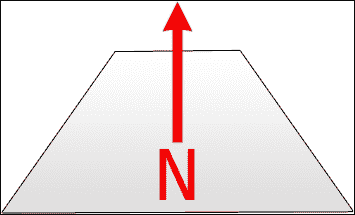

在这种情况下，法线朝上，因为那是垂直于平面的方向。这有什么帮助呢？好吧，想象一下你有一个非常复杂的模型，有很多顶点；渲染这个模型会非常耗时，因为需要处理大量的几何形状。一个聪明的技巧，称为**法线贴图**，就是将所有这些顶点的信息保存到一个看起来类似这样的纹理上：

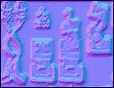

这可能看起来非常奇特，尤其是在以灰度形式查看这本书的物理版本时，但请尽量不要从颜色的角度考虑，而是从方向的角度考虑。法线贴图的红色通道编码了 *-x* 和 *+x* 值。绿色通道对 *-y* 和 *+y* 值做同样的处理，而蓝色通道用于 *-z* 到 *+z*。现在回顾一下之前的图像，更容易确认每个单独像素的方向。在完全平坦的几何体上使用这些信息仍然可以让我们以这种方式对其进行照明，使其看起来具有所有这些细节；然而，它仍然保持平坦且对性能影响不大：

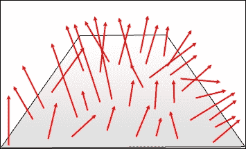

这些法线贴图可以是手工绘制，或者简单地使用如 *Crazybump* 这样的软件生成。让我们看看如何在我们的游戏引擎中实现这一切。

## 实现法线贴图渲染

在地图的情况下，实现法线贴图渲染非常简单。我们已经有所有材质贴图集成并准备就绪，所以现在这只是一个采样瓦片贴图法线纹理的问题：

```cpp
void Map::Redraw(sf::Vector3i l_from, sf::Vector3i l_to) { 
  ... 
  if (renderer->UseShader("MaterialPass")) { 
    // Material pass. 
    auto shader = renderer->GetCurrentShader(); 
    auto textureName = m_tileMap.GetTileSet().GetTextureName(); 
    auto normalMaterial = m_textureManager-> 
      GetResource(textureName + "_normal"); 
    for (auto x = l_from.x; x <= l_to.x; ++x) { 
      for (auto y = l_from.y; y <= l_to.y; ++y) { 
        for (auto layer = l_from.z; layer <= l_to.z; ++layer) { 
          auto tile = m_tileMap.GetTile(x, y, layer); 
          if (!tile) { continue; } 
          auto& sprite = tile->m_properties->m_sprite; 
          sprite.setPosition( 
            static_cast<float>(x * Sheet::Tile_Size), 
            static_cast<float>(y * Sheet::Tile_Size)); 
          // Normal pass. 
          if (normalMaterial) { 
            shader->setUniform("material", *normalMaterial); 
            renderer->Draw(sprite, &m_normals[layer]); 
          } 
        } 
      } 
    } 
  } 
  ... 
} 

```

这个过程与将法线瓦片绘制到漫反射贴图上的过程完全相同，只是在这里我们必须向材质着色器提供瓦片贴图法线的纹理。同时请注意，我们现在正在绘制到法线缓冲区纹理。

对于绘制实体也是如此：

```cpp
void S_Renderer::Draw(MaterialMapContainer& l_materials, 
  Window& l_window, int l_layer) 
{ 
  ... 
  if (renderer->UseShader("MaterialPass")) { 
    // Material pass. 
    auto shader = renderer->GetCurrentShader(); 
    auto textures = m_systemManager-> 
      GetEntityManager()->GetTextureManager(); 
    for (auto &entity : m_entities) { 
      auto position = entities->GetComponent<C_Position>( 
        entity, Component::Position); 
      if (position->GetElevation() < l_layer) { continue; } 
      if (position->GetElevation() > l_layer) { break; } 
      C_Drawable* drawable = GetDrawableFromType(entity); 
      if (!drawable) { continue; } 
      if (drawable->GetType() != Component::SpriteSheet) 
      { continue; } 
      auto sheet = static_cast<C_SpriteSheet*>(drawable); 
      auto name = sheet->GetSpriteSheet()->GetTextureName(); 
      auto normals = textures->GetResource(name + "_normal"); 
      // Normal pass. 
      if (normals) { 
        shader->setUniform("material", *normals); 
        drawable->Draw(&l_window, 
          l_materials[MaterialMapType::Normal].get()); 
      } 
    } 
  } 
  ... 
} 

```

您可以通过纹理管理器尝试获取一个正常纹理。如果您找到了，您可以将它绘制到法线贴图材质缓冲区中。

处理粒子与我们已经看到的方法没有太大区别，除了一个小细节：

```cpp
void ParticleSystem::Draw(MaterialMapContainer& l_materials, 
  Window& l_window, int l_layer) 
{ 
  ... 
  if (renderer->UseShader("MaterialValuePass")) { 
    // Material pass. 
    auto shader = renderer->GetCurrentShader(); 
    for (size_t i = 0; i < container->m_countAlive; ++i) { 
      if (l_layer >= 0) { 
        if (positions[i].z < l_layer * Sheet::Tile_Size) 
        { continue; } 
        if (positions[i].z >= (l_layer + 1) * Sheet::Tile_Size) 
        { continue; } 
      } else if (positions[i].z < 
        Sheet::Num_Layers * Sheet::Tile_Size) 
      { continue; } 
      // Normal pass. 
      shader->setUniform("material", 
        sf::Glsl::Vec3(0.5f, 0.5f, 1.f)); 
      renderer->Draw(drawables[i], 
        l_materials[MaterialMapType::Normal].get()); 
    } 
  } 
  ... 
} 

```

正如您所看到的，我们实际上正在使用材质值着色器来给粒子提供静态法线，这些法线总是指向相机。在将所有法线贴图渲染到它上面后，法线贴图缓冲区应该看起来像这样：

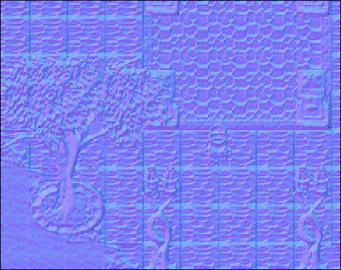

## 修改照明着色器

现在我们已经拥有了所有这些信息，让我们在计算光照着色器内部的像素照明时实际使用它：

```cpp
uniform sampler2D LastPass; 
uniform sampler2D DiffuseMap; 
uniform sampler2D NormalMap; 
uniform vec3 AmbientLight; 
uniform int LightCount; 
uniform int PassNumber; 

struct LightInfo { 
  vec3 position; 
  vec3 color; 
  float radius; 
  float falloff; 
}; 

const int MaxLights = 4; 
uniform LightInfo Lights[MaxLights]; 

void main() 
{ 
  vec4 pixel = texture2D(LastPass, gl_TexCoord[0].xy); 
  vec4 diffusepixel = texture2D(DiffuseMap, gl_TexCoord[0].xy); 
  vec4 normalpixel = texture2D(NormalMap, gl_TexCoord[0].xy); 
  vec3 PixelCoordinates = 
    vec3(gl_FragCoord.x, gl_FragCoord.y, gl_FragCoord.z); 
  vec4 finalPixel = gl_Color * pixel; 
  vec3 viewDirection = vec3(0, 0, 1); 
  if(PassNumber == 1) { finalPixel *= vec4(AmbientLight, 1.0); } 
  // IF FIRST PASS ONLY! 
  vec3 N = normalize(normalpixel.rgb * 2.0 - 1.0); 
  for(int i = 0; i < LightCount; ++i) { 

    vec3 L = Lights[i].position - PixelCoordinates;
    float distance = length(L);
    float d = max(distance - Lights[i].radius, 0);
    L /= distance;
    float attenuation = 1 / pow(d/Lights[i].radius + 1, 2); 
    attenuation = (attenuation - Lights[i].falloff) / 
      (1 - Lights[i].falloff); 
    attenuation = max(attenuation, 0); 
    float normalDot = max(dot(N, L), 0.0); 
    finalPixel += (diffusepixel * 
      ((vec4(Lights[i].color, 1.0) * attenuation))) * normalDot; 
  } 
  gl_FragColor = finalPixel; 
} 

```

首先，需要将法线贴图纹理传递给它，并进行采样，这就是前两行高亮代码的作用所在。一旦完成，对于我们在屏幕上绘制的每个光源，都会计算法线方向向量。这是通过首先确保它可以进入负范围，然后归一化它来完成的。归一化向量只表示一个方向。

### 注意

由于颜色值范围从 *0* 到 *255*，负值不能直接表示。这就是为什么我们首先通过乘以 *2.0* 并减去 *1.0* 来将它们带入正确的范围。

然后计算法线向量和归一化`L`向量之间的点积，现在它代表从光到像素的方向。一个像素从特定光源照亮的程度直接取决于点积，这是一个从*1.0*到*0.0*的值，代表大小。

### 注意

**点积**是一种代数运算，它接受*两个向量*以及它们之间角度的*余弦值*，并产生一个介于*0.0*和*1.0*之间的标量值，这基本上代表了它们有多“正交”。我们利用这个特性，随着它们法线与光之间的角度越来越大，逐渐减少对像素的照明。

最后，在计算最终像素值时再次使用点积。整个光的影响都乘以它，这使得每个像素都可以以不同的方式绘制，就像它有一些指向不同方向的底层几何形状一样。

现在最后要做的就是将正常映射缓冲区传递到我们的 C++代码中的着色器：

```cpp
void LightManager::RenderScene() { 
  ... 
  if (renderer->UseShader("LightPass")) { 
    // Light pass. 
    ... 
    shader->setUniform("NormalMap", 
      m_materialMaps[MaterialMapType::Normal]->getTexture()); 
    ... 
  } 
  ... 
} 

```

这有效地启用了正常映射，并给我们带来了如下的美丽效果：

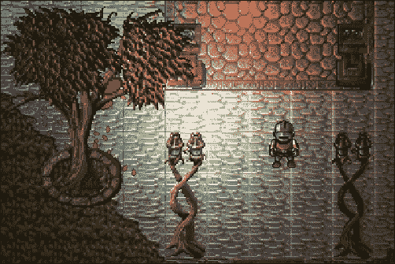

树叶、角色以及这张图片中的几乎所有东西，现在看起来都有定义、棱角和凹槽；它被照亮，就像它有几何形状一样，尽管它是纸薄的。注意这个特定实例中每个瓦片周围的线条。这就是为什么像素艺术（如瓦片图集）的正常映射不应该自动生成的原因之一；它可以采样它旁边的瓦片，并错误地添加斜边。

# 镜面映射

虽然正常映射为我们提供了模拟表面凹凸度的可能性，但镜面映射允许我们以相同的方式处理表面的光泽度。这就是我们用作正常映射示例的瓦片图集的相同段在镜面映射中的样子：

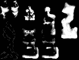

它没有普通映射那么复杂，因为它只需要存储一个值：光泽度因子。我们可以让每个光照决定它将在场景上产生多少*光泽*，让它有自己的值：

```cpp
struct LightBase { 
  ... 
  float m_specularExponent = 10.f; 
  float m_specularStrength = 1.f; 
}; 

```

## 添加对镜面反射的支持

与正常映射类似，我们需要使用材质通道着色器将渲染输出到镜面反射缓冲纹理：

```cpp
void Map::Redraw(sf::Vector3i l_from, sf::Vector3i l_to) { 
  ... 
  if (renderer->UseShader("MaterialPass")) { 
    // Material pass. 
    ... 
    auto specMaterial = m_textureManager->GetResource( 
      textureName + "_specular"); 
    for (auto x = l_from.x; x <= l_to.x; ++x) { 
      for (auto y = l_from.y; y <= l_to.y; ++y) { 
        for (auto layer = l_from.z; layer <= l_to.z; ++layer) { 
          ... // Normal pass. 
          // Specular pass. 
          if (specMaterial) { 
            shader->setUniform("material", *specMaterial); 
            renderer->Draw(sprite, &m_speculars[layer]); 
          } 
        } 
      } 
    } 
  } 
  ... 
} 

```

镜面反射的纹理再次尝试获取；如果找到，则将其传递到材质通道着色器。当你渲染实体时也是如此：

```cpp
void S_Renderer::Draw(MaterialMapContainer& l_materials, 
  Window& l_window, int l_layer) 
{ 
  ... 
  if (renderer->UseShader("MaterialPass")) { 
    // Material pass. 
    ... 
    for (auto &entity : m_entities) { 
      ... // Normal pass. 
      // Specular pass. 
      if (specular) { 
        shader->setUniform("material", *specular); 
        drawable->Draw(&l_window, 
          l_materials[MaterialMapType::Specular].get()); 
      } 
    } 
  } 
  ... 
} 

```

另一方面，粒子也使用材质值通道着色器：

```cpp
void ParticleSystem::Draw(MaterialMapContainer& l_materials, 
  Window& l_window, int l_layer) 
{ 
  ... 
  if (renderer->UseShader("MaterialValuePass")) { 
    // Material pass. 
    auto shader = renderer->GetCurrentShader(); 
    for (size_t i = 0; i < container->m_countAlive; ++i) { 
      ... // Normal pass. 
      // Specular pass. 
      shader->setUniform("material", 
        sf::Glsl::Vec3(0.f, 0.f, 0.f)); 
      renderer->Draw(drawables[i], 
        l_materials[MaterialMapType::Specular].get()); 
    } 
  } 
} 

```

目前，我们不想让任何东西都有镜面反射。这显然可以在以后进行调整，但重要的是我们有了这个功能，并且它产生了以下这样的结果：

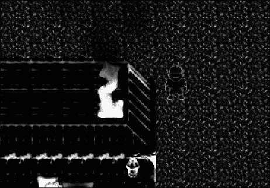

这种具有光泽的纹理需要在光照通道内进行采样，就像普通纹理一样。让我们看看这涉及到什么。

## 修改光照着色器

就像之前一样，需要添加一个统一的`sampler2D`来采样特定片段的镜面度：

```cpp
uniform sampler2D LastPass; 
uniform sampler2D DiffuseMap; 
uniform sampler2D NormalMap; 
uniform sampler2D SpecularMap; 
uniform vec3 AmbientLight; 
uniform int LightCount; 
uniform int PassNumber; 

struct LightInfo { 
  vec3 position; 
  vec3 color; 
  float radius; 
  float falloff; 
  float specularExponent; 
  float specularStrength; 
}; 

const int MaxLights = 4; 
uniform LightInfo Lights[MaxLights]; 

const float SpecularConstant = 0.4; 

void main() 
{ 
  ... 
  vec4 specularpixel = texture2D(SpecularMap, gl_TexCoord[0].xy); 
  vec3 viewDirection = vec3(0, 0, 1); // Looking at positive Z. 
  ... 
  for(int i = 0; i < LightCount; ++i){ 
    ... 
    float specularLevel = 0.0; 
    specularLevel = 
      pow(max(0.0, dot(reflect(-L, N), viewDirection)), 
      Lights[i].specularExponent * specularpixel.a) 
      * SpecularConstant; 
    vec3 specularReflection = Lights[i].color * specularLevel * 
      specularpixel.rgb * Lights[i].specularStrength; 
    finalPixel += 
      (diffusepixel * ((vec4(Lights[i].color, 1.0) * attenuation)) 
      + vec4(specularReflection, 1.0)) * normalDot; 
  } 
  gl_FragColor = finalPixel; 
} 

```

我们还需要将每个光线的`struct`中的镜面指数和强度添加进去，因为现在它是它的一部分。一旦采样了镜面像素，我们还需要设置摄像机的方向。由于这是静态的，我们可以在着色器中保持原样。

然后，通过考虑像素的法线与光之间的点积、镜面像素本身的颜色和光的镜面强度来计算像素的镜面度。注意计算中使用了镜面常数。这是一个可以，并且应该调整以获得最佳结果的价值，因为 100%的镜面度很少看起来很好。

然后，剩下的就是确保将镜面纹理也发送到光通道着色器，除了光线的镜面指数和强度值：

```cpp
void LightManager::RenderScene() { 
  ... 
  if (renderer->UseShader("LightPass")) { 
    // Light pass. 
    ... 
    shader->setUniform("SpecularMap", 
      m_materialMaps[MaterialMapType::Specular]->getTexture()); 
    ... 
    for (auto& light : m_lights) { 
      ... 
      shader->setUniform(id + ".specularExponent", 
        light.m_specularExponent); 
      shader->setUniform(id + ".specularStrength", 
        light.m_specularStrength); 
      ... 
    } 
  } 
} 

```

结果可能不会立即可见，但通过仔细检查移动光流，我们可以看到正确映射的表面将会有一个随着光线移动的闪光：

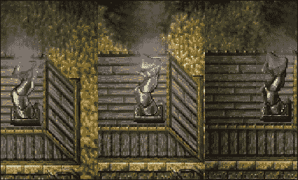

虽然这几乎是完美的，但仍有改进的空间。

# 高度图

照亮世界的要点是使所有视觉细节以逼真的方式突出。我们已经添加了人工动态照明、假 3D 几何形状和光泽，那么剩下什么呢？嗯，还没有显示场景正确高度的东西。直到现在，我们在计算照明距离时一直将场景视为完全平坦。相反，我们需要处理被称为高度图的东西，它将存储像素的高度。

## 适配现有代码

正确绘制高度可能相当棘手，尤其是在瓦片图的情况下。我们需要知道在绘制逼真高度时瓦片面向哪个方向。考虑以下插图：

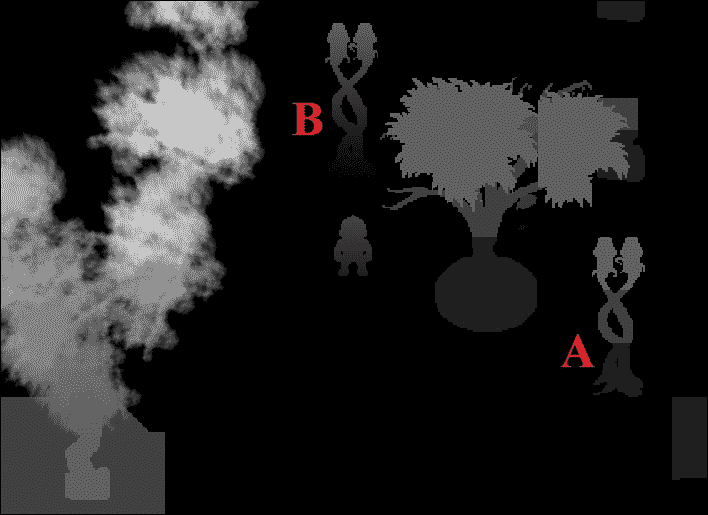

点**A**旁边的瓦片没有与之关联的法线，而点**B**旁边的瓦片都面向摄像机。我们可以通过进行这些简单的修改在地图文件中存储法线数据：

```cpp
struct Tile { 
  ... 
  sf::Vector3f m_normal; 
}; 

void TileMap::ReadInTile(std::stringstream& l_stream) { 
  ... 
  sf::Vector3f normals(0.f, 1.f, 0.f); 
  l_stream >> normals.x >> normals.y >> normals.z; 
  tile->m_normal = normals; 
  ... 
} 

TILE 57 15 3 1 1 // Tile entry without a normal. 
TILE 144 15 8 1 1 0 0 1 // Tile entry with a normal 0,0,1 

```

`Tile`结构本身现在保留了一个正常值，这个值将在以后使用。当从文件中读取瓦片时，附加信息将在最后加载。这里最后两行显示了来自地图文件的实际条目。

根据这些瓦片法线绘制高度的所有操作都在适当的着色器中完成，所以让我们传递它所需的所有信息：

```cpp
void Map::Redraw(sf::Vector3i l_from, sf::Vector3i l_to) { 
  ... 
  if (renderer->UseShader("HeightPass")) { 
    // Height pass. 
    auto shader = renderer->GetCurrentShader(); 
    for (auto x = l_from.x; x <= l_to.x; ++x) { 
      for (auto y = l_from.y; y <= l_to.y; ++y) { 
        for (auto layer = l_from.z; layer <= l_to.z; ++layer) { 
          auto tile = m_tileMap.GetTile(x, y, layer); 
          if (!tile) { continue; } 
          auto& sprite = tile->m_properties->m_sprite; 
          sprite.setPosition( 
            static_cast<float>(x * Sheet::Tile_Size), 
            static_cast<float>(y * Sheet::Tile_Size)); 
          shader->setUniform("BaseHeight", 
            static_cast<float>(layer * Sheet::Tile_Size)); 
          shader->setUniform("YPosition", sprite.getPosition().y); 
          shader->setUniform("SurfaceNormal", 
            sf::Glsl::Vec3(tile->m_normal)); 
          renderer->Draw(sprite, &m_heightMap[layer]); 
        } 
      } 
    } 
  } 
  ... 
} 

```

高度通道着色器使用可绘制基高度的一个值，在这个例子中，它只是世界坐标中的高程。它还使用`Drawable`类的*Y*世界坐标并获取表面法线。同样，实体也需要设置相同的值：

```cpp
void S_Renderer::Draw(MaterialMapContainer& l_materials, 
  Window& l_window, int l_layer) 
{ 
  ... 
  if (renderer->UseShader("HeightPass")) { 
    // Height pass. 
    auto shader = renderer->GetCurrentShader(); 
    shader->setUniform("BaseHeight", 
      static_cast<float>(l_layer * Sheet::Tile_Size)); 
    shader->setUniform("SurfaceNormal", 
      sf::Glsl::Vec3(0.f, 0.f, 1.f)); 
    for (auto &entity : m_entities) { 
      auto position = entities->GetComponent<C_Position>( 
        entity, Component::Position); 
      if (position->GetElevation() < l_layer) { continue; } 
      if (position->GetElevation() > l_layer) { break; } 
      C_Drawable* drawable = GetDrawableFromType(entity); 
      if (!drawable) { continue; } 
      if (drawable->GetType() != Component::SpriteSheet) 
      { continue; } 
      auto sheet = static_cast<C_SpriteSheet*>(drawable); 
      shader->setUniform("YPosition", position->GetPosition().y); 
      drawable->Draw(&l_window, 
        l_materials[MaterialMapType::Height].get()); 
    } 
  } 
  ... 
} 

```

然而，在这种情况下，我们为所有实体使用相同的法线。这是因为我们希望它们面向相机，并且像垂直于地面站立一样被照亮。另一方面，粒子没有面向相机，而是法线指向正*Y*轴：

```cpp
void ParticleSystem::Draw(MaterialMapContainer& l_materials, 
  Window& l_window, int l_layer) 
{ 
  ... 
  if (renderer->UseShader("HeightPass")) { 
    // Height pass. 
    auto shader = renderer->GetCurrentShader(); 
    shader->setUniform("SurfaceNormal", 
      sf::Glsl::Vec3(0.f, 1.f, 0.f)); 
    for (size_t i = 0; i < container->m_countAlive; ++i) { 
      if (l_layer >= 0) { 
        if (positions[i].z < l_layer * Sheet::Tile_Size) 
        { continue; } 
        if (positions[i].z >= (l_layer + 1) * Sheet::Tile_Size) 
        { continue; } 
      } else if (positions[i].z < 
        Sheet::Num_Layers * Sheet::Tile_Size) 
      { continue; } 
      shader->setUniform("BaseHeight", positions[i].z); 
      shader->setUniform("YPosition", positions[i].y); 
      renderer->Draw(drawables[i], 
        l_materials[MaterialMapType::Height].get()); 
    } 
  } 
  ... 
} 

```

## 编写高度传递着色器

高度传递是我们迄今为止编写的唯一一个同时使用顶点和片段着色器的程序。

让我们看看顶点着色器中需要发生什么：

```cpp
uniform float YPosition; 
out float Height; 
void main() 
{ 
  gl_Position = gl_ModelViewProjectionMatrix * gl_Vertex; 
  gl_TexCoord[0] = gl_TextureMatrix[0] * gl_MultiTexCoord0; 
  gl_FrontColor = gl_Color; 
  Height = gl_Vertex.y - YPosition; 
} 

```

这里只有一行不是传统意义上的顶点着色器标准，当然除了统一变量和输出变量之外。顶点着色器输出一个名为`Height`的浮点值到片段着色器。它只是形状在世界坐标中*Y*分量和相同形状的基础*Y*位置之间的高度。然后，高度在所有片段之间进行插值，从而得到一个很好的，渐变分布。

### 注意

`gl_Vertex`信息存储在世界坐标中。底部*Y*坐标始终从可绘制对象的相同高度开始，这使得顶部*Y*坐标等于其位置和高度的之和。

最后，我们可以看看片段着色器，并实际填充一些片段：

```cpp
uniform sampler2D texture; 
uniform vec3 SurfaceNormal; 
uniform float BaseHeight; 
in float Height; 
void main() 
{ 
  vec4 pixel = texture2D(texture, gl_TexCoord[0].xy); 
  float value = (BaseHeight - (Height * SurfaceNormal.z)) / 255.0; 
  gl_FragColor = vec4(value, value, value, pixel.a); 
} 

```

如前所述，它接受漫反射纹理、表面法线、可绘制对象的基础高度以及从顶点着色器中插值的`Height`值。然后对漫反射像素进行采样，以便使用其 alpha 值进行透明度。高度值本身是通过从可绘制对象的基础高度中减去像素高度乘以表面法线的*Z*分量来计算的。最后，整个值除以*255*，因为我们希望以归一化格式存储颜色信息。

## 更改光照着色器

最后，可以通过采样高度图来更改光照传递着色器：

```cpp
... 
uniform sampler2D HeightMap; 
... 
void main() 
{ 
  ... 
  float pixelheight = texture2D(HeightMap, gl_TexCoord[0].xy).r 
    * 255; 
  vec3 PixelCoordinates = 
    vec3(gl_FragCoord.x, gl_FragCoord.y, pixelheight); 
  ... 
  gl_FragColor = finalPixel; 
} 

```

一旦采样像素高度并将其乘以*255*以将其恢复到世界坐标，我们只需要在计算像素和片段之间的距离时，将`gl_FragCoord.z`值替换为`pixelHeight`。是的，这真的只需要这么简单！

然后，`HeightMap`可以实际传递给着色器进行采样，如下所示：

```cpp
void LightManager::RenderScene() { 
  ... 
  if (renderer->UseShader("LightPass")) { 
    // Light pass. 
    ... 
    shader->setUniform("HeightMap", 
      m_materialMaps[MaterialMapType::Height]->getTexture()); 
    ... 
  } 
  ... 
} 

```

这给我们提供了一个非常棒的效果，实际上可以展示特定结构的**高度**，前提是它被正确地提升并且具有正确的法线：

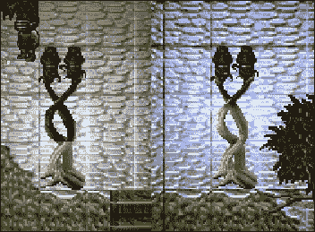

左侧的灯柱没有法线，而右侧的灯柱的法线朝向*+Z*方向。在这两张图片中，灯光的位置完全相同。

# 摘要

如果你还在这里，恭喜你！你已经吸收了相当多的信息，但正如我们的世界终于开始在视觉上成形一样，我们即将踏上下一章将讨论的更加惊人的特性。那里见！
