# 第十章。你不应该跳过的章节 - 最终优化

任何游戏最重要的方面是什么？根据一位非常著名的网络名人，那便是能够玩它。华丽的图形和先进的技术无疑为像视频游戏这样视觉和交互式的媒介增添了必要的精致感，但如果这些都妨碍了享受最基本的无缝游戏体验，那么整个游戏可能就只是一个花哨的屏幕保护程序了。即使应用程序在高端机器上运行良好，优化代码也是极其重要的，因为每一次迭代都会排除掉一些可能较旧但仍然可以用来扩大游戏粉丝基础的机器。

在本章中，我们将涵盖以下主题：

+   性能分析和代码指标的基础

+   分析和修复我们代码中的低效之处

+   光线剔除的基础

让我们不要浪费更多的时钟周期，开始清理一些这些低效之处！

# 使用第三方软件

如预期的那样，我们无法在没有额外工具的情况下完成所有这些工作。性能分析应用程序是一个需要成熟软件后端支持的课题，用于整洁地组织和展示给我们性能细节的数据。"CodeXL"是我们已经在第九章中介绍过的应用程序，*《黑暗的速度 - 灯光与阴影*》，虽然我们用它来查看运行时的 OpenGL 状态，但它也提供了一系列用于分析 CPU 和 GPU 代码的选项。您可以在以下链接找到并下载它：[`gpuopen.com/compute-product/codexl/`](http://gpuopen.com/compute-product/codexl/)。

当然，如果我们没有 AMD 硬件，可用的性能分析工具集非常有限。虽然我们可以通过有限的 CPU 性能分析选项来应对，但例如在 Nvidia 显卡上进行 GPU 性能分析就需要不同的工具。市面上有一些选择，但一个值得注意的选项是*Nvidia Nsight*：[`www.nvidia.com/object/nsight.html`](http://www.nvidia.com/object/nsight.html)。

然而，值得一提的是，Nsight 的最新版本不支持 SFML 调用的某些旧版功能，因此功能再次受到限制。

# 细节决定成败

人们常说，一位大师工匠不仅知道如何使用工具，还知道何时使用工具。许多程序员常常得出一个错误的结论，认为他们必须不断编写美丽、高效且总体上完美的代码，这样的代码永远不会失败。在实践中，这离事实相差甚远。许多人都是通过艰难的方式才意识到这一点。正如*唐纳德·克努特*所说：

> *"程序员在思考或担心程序非关键部分的运行速度上浪费了大量的时间，而这些关于效率的尝试实际上在调试和维护时会产生强烈的负面影响。我们应该忘记关于小效率的事情，比如说 97%的时间：过早优化是万恶之源。"*

这并不意味着不应该考虑性能。例如，设计具有后续功能的类，或者为任务选择正确的算法，这些都属于剩余的 3%。简单来说，除非应用程序明显运行缓慢，否则在代码中解决性能问题始终应该是最后的任务之一。

程序员常犯的另一个错误是在评估性能时依赖直觉。很容易忘记程序具有大量的底层复杂性和动态部分，这也是为什么除非经过适当测试，否则很难确切知道特定代码块将如何表现。关键在于始终进行性能分析！游戏运行缓慢吗？拿出分析器来试一试。感觉敌人的路径查找代码真的拖累了性能吗？不要只是感觉，要分析！优化后的代码状态也是如此。不要只是替换大量代码并假设它会运行得更快。先进行基准测量，做出适当的更改，然后分析最终结果以确保新代码运行得更快。开始看到这幅图了吗？很好。现在，让我们直接进入性能分析的基本知识！

# 性能分析基础知识

应用程序可以以多种不同的方式进行性能分析。从分支和单个指令，到缓存的使用和数据访问模式，都可以在项目中跟踪。然而，由于我们的游戏并不特别复杂，我们实际上只需要关注基于时间的性能分析。

分析器可以以三种基本方式收集有关应用程序的信息：

+   **采样**: 这是一种周期性的应用程序堆栈捕获，结果相对不准确，但开销非常小。

+   **事件收集**: 这涉及到利用编译过程，并对其进行配置，以便将某些信息发送到性能分析 DLL。具有更高的开销和更高的精度。

+   **仪器设备**: 这涉及到在运行时直接将代码注入到应用程序中，从而允许获得最精确的结果，但同时也具有最高的开销。

可以根据所使用的软件和需要收集的数据来利用这些技术中的任何一种。由于我们实际上并不需要极其精确的结果来定位代码的热点，因此最好采用采样方法。

### 小贴士

正如我们已经建立的，分析并不是一项免费的任务。在某些情况下，它可能会使应用程序的速度慢到几乎无法运行，这取决于任务，可能是完全正常的。

## 基于时间的采样

使用基于时间的采样技术将对应用程序的所有函数/方法调用、初始化/销毁、几乎可以创建或调用的任何内容进行粗略估计，并为它们分配样本值。这甚至包括底层库，如 STL、SFML、OpenGL 等。如果你的代码使用了它们，它们将会出现在列表中。

这个样本值表示执行某一行代码所花费的时间。有两种类型的时间样本：

+   **包含**：这涉及到在特定行/代码块内花费的所有时间，包括执行可能被调用的其他函数所需的时间。

+   **排除**：这仅涉及特定行/代码块执行本身所花费的时间。

我们可能不会处理排他性样本计数，但理解这些术语仍然很重要。

最后，重要的是要理解样本是相对的。如果一个程序运行缓慢，那么整个程序捕获的样本将更少。这个特定的基准不应该根据数量来解释，而应该与代码的其他部分进行比较。

### 注意

采样应该始终在所有相关的项目优化都启用的情况下进行，因为它会移除用于调试的冗余代码，这可能会干扰结果。在 Visual Studio 的情况下，采样时应使用发布模式。

## 采样我们的应用程序

现在我们已经掌握了基础知识，让我们实际启动一个配置文件并开始吧！这个过程的第一重要方面实际上是花足够的时间采样所需应用程序的状态。在我们的案例中，采样应该在`游戏`状态下进行，并且至少持续 20 秒，以捕获足够的信息。如果大部分应用程序采样时间都花在菜单状态下，那么这并不能帮助我们理解实体组件系统的时间复杂度，例如。

其次，我们应该在压力状态下测试我们的应用程序，以确保它在非理想条件下表现良好。为了我们的目的，我们将简单地添加更多的实体、粒子发射器和灯光到场景中，直到构建出类似以下内容的**压力测试**：

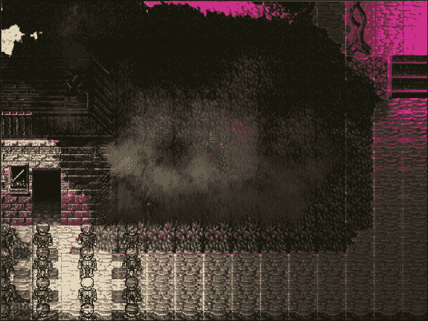

它可能看起来并不美观，但同样，性能问题也不美观。

一旦应用程序采样足够并且终止，大多数分析器都会显示采样过程中运行的所有进程的**概览**。重要的是只通过点击它来选择我们的游戏，因为我们对此感兴趣。

导航到**函数**选项卡后，我们应该得到类似以下的内容：

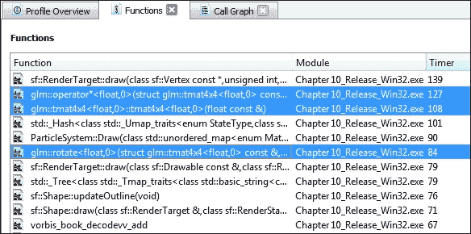

通过点击**计时器**选项卡并按降序排序条目，我们可以查看采样量最多的函数，从而运行时间最长。这就是你将找到使用通用库如 *SFML* 并牺牲一些性能的地方。虽然编写特定情况的代码在性能方面可能更优，但考虑到 SFML 在小型到中型项目中的多功能性，这仍然是一个值得付出的代价。

虽然很明显我们的 SFML 渲染代码可能需要一些改进，并在渲染精灵和瓦片时使用顶点数组来减少这个瓶颈，但我们这次不会关注 SFML 特定的优化。相反，让我们首先分析列表上突出显示的条目。正如 `glm::` 命名空间所暗示的，我们用于各种计算的 OpenGL 数学库是罪魁祸首。通过右键单击条目，我们可以在调用图中查看它。

### 注意

**调用图**是一种帮助我们定位代码中使用特定函数的所有点的工具。

通过简单地分析屏幕上的信息，我们现在能够看到哪些代码以这种方式使用 GLM 矩阵，从而引起性能问题：

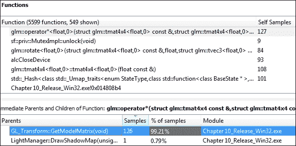

如**父级**部分所示，关于这个特定瓶颈的大多数时间采样都位于 `GL_Transform::GetModelMatrix()` 方法内部。双击该函数可以让我们查看代码和每行特定的热点：

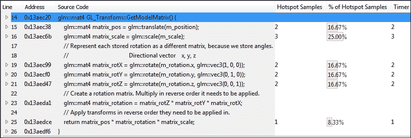

到现在为止，所有这些都应该开始累积起来。与矩阵相关的两个最常被采样的是 `glm::tmat4x4<float,0>::tmat4x4<float,0>(float const&)`，这是矩阵构造函数，以及 `glm::rotate`，我们调用了三次。每次我们想要从这个类中获取一个模型矩阵（每帧每个阴影投射器都会调用一次），都会构造并填充许多新的矩阵，使用相当昂贵的 GLM 函数调用，更不用说之后的乘法运算了。

## 寻找 GPU 瓶颈

寻找 GPU 瓶颈与我们在 CPU 上所做的是相当相似的。它也利用时间采样，并将生成类似的外观报告，列出基于执行时间的 OpenGL 代码，如下所示：

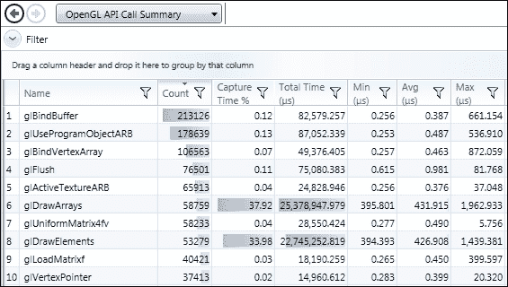

我们在这里不会深入讨论 GPU 优化，但思路是相同的：找到瓶颈，以更有效的方式重新实现代码，并再次测试。

### 注意

一些 GPU 分析工具，如 Nvidia Nsight，不支持 SFML 制作的旧版 OpenGL API 调用。

# 提高 CPU 代码性能

在建立基线读取后，我们可以开始对我们的代码进行更改。其中一些更改涉及简单地理解我们使用的库，并更加谨慎地部署它们，而其他更改则围绕做出更好的设计选择，应用更快、更合适的算法，设计更好的数据结构，以及使用 C++标准的最新功能。让我们先看看我们可以对代码进行的一些简单更改。

## 优化三个最明显的瓶颈

根据分析器的结果，我们之前编写的代码有很多改进的空间。在本节中，我们将解决三个最不高效的实现及其修复方法。

### GL_Transform 优化

我们用来说明时间采样如何工作的第一个例子是改进的完美候选。它真的没有太多微妙之处。首先，每次请求模型矩阵时都要重新计算所有涉及的矩阵是非常低效的。更糟糕的是，所有*7*个矩阵都必须重新创建。这浪费了大量的时钟周期，却没有理由。让我们看看如何快速改进这一点：

```cpp
class GL_Transform { 
public: 
  ... 
  const glm::mat4& GetModelMatrix(); 
private: 
  ... 
  bool m_needsUpdate; 
  glm::mat4 m_matPos; 
  glm::mat4 m_matScale; 
  glm::mat4 m_matRotX; 
  glm::mat4 m_matRotY; 
  glm::mat4 m_matRotZ; 
  glm::mat4 m_matRotCombined; 
  glm::mat4 m_modelMatrix; // Final matrix. 
}; 

```

首先，注意`GetModelMatrix`的返回参数从*const* *引用*改变。这确保了我们每次都不是返回一个新构造的矩阵。此外，我们增加了一个布尔标志，帮助我们跟踪对象的位置、缩放或旋转是否已更改，以及模型矩阵是否需要更新以反映这一点。最后，我们现在将所有 7 个矩阵存储在变换对象中，这样它们就只创建一次。这很重要，因为我们不希望仅仅因为对象的位置发生了变化，就重新计算三个旋转矩阵及其组合矩阵。

接下来，让我们实际实施这些更改，从本类的 setter 开始：

```cpp
void GL_Transform::SetPosition(const glm::vec3& l_pos) { 
  if (l_pos == m_position) { return; } 
  m_position = l_pos; 
  m_matPos = glm::translate(m_position); 
  m_needsUpdate = true; 
} 

```

这里的一般思路是首先检查提供给 setter 方法的参数是否已经是它应该覆盖的任何参数的当前值。如果不是，则改变位置，并更新位置矩阵，同时将`m_needsUpdate`标志设置为`true`。这将确保稍后模型矩阵得到更新。

旋转遵循完全相同的原理：

```cpp
void GL_Transform::SetRotation(const glm::vec3& l_rot) { 
  if (l_rot == m_rotation) { return; } 
  if (l_rot.x != m_rotation.x) { 
    m_matRotX = glm::rotate(m_rotation.x, glm::vec3(1, 0, 0)); 
  } 
  if (l_rot.y != m_rotation.y) { 
    m_matRotY = glm::rotate(m_rotation.y, glm::vec3(0, 1, 0)); 
  } 
  if (l_rot.z != m_rotation.z) { 
    m_matRotZ = glm::rotate(m_rotation.z, glm::vec3(0, 0, 1)); 
  } 
  m_matRotCombined = m_matRotZ * m_matRotY * m_matRotX; 
  m_rotation = l_rot; 
  m_needsUpdate = true; 
} 

```

然而，在提交赋值之前，我们必须检查向量类的每个成员，因为它们各自都有自己的矩阵。现在越来越清楚的是，我们的目标是只计算我们绝对必须计算的内容。

缩放，再次，完全遵循这个想法：

```cpp
void GL_Transform::SetScale(const glm::vec3& l_scale) { 
  if (l_scale == m_scale) { return; } 
  m_scale = l_scale; 
  m_matScale = glm::scale(m_scale); 
  m_needsUpdate = true; 
} 

```

`GetModelMatrix`方法现在应该这样实现：

```cpp
const glm::mat4& GL_Transform::GetModelMatrix() { 
  if (m_needsUpdate) { 
    m_modelMatrix = m_matPos * m_matRotCombined * m_matScale; 
    m_needsUpdate = false; 
  } 
  return m_modelMatrix; 
} 

```

首先，检查更新标志以确定矩阵是否需要更新。如果需要，则将所有三个相关矩阵相乘，并将标志重置回 `false`。然后我们返回 `m_modelMatrix` 数据成员的 const 引用，确保不会创建一个只是为了后来丢弃的对象。

让我们遵循自己的建议，再次分析应用程序以确保我们的更改有效：

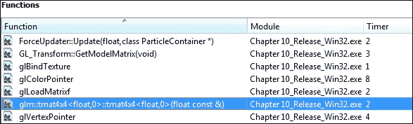

所有与 `glm::` 相关的之前突出显示的行现在都已经完全从列表顶部消失！在这个说明中突出显示的异常是在采样 `GL_Transform::GetModelMatrix()` 时拍摄的，**没有**通过 const 引用返回，只是为了表明我们的方法确实有效。当方法返回 const 引用时，甚至突出显示的函数也会完全消失。这完美地说明了避免无用的数据副本如何极大地提高整体性能。

### 粒子系统优化

样本列表顶部的另一个巨大瓶颈正是 `ParticleSystem::Draw` 方法。实际上，这是我们编写的代码中采样最高的部分。理解渲染这么多粒子会很有压力是合理的，但在这个例子中，未优化的这个方法将我们游戏的帧率降低到 10 FPS：

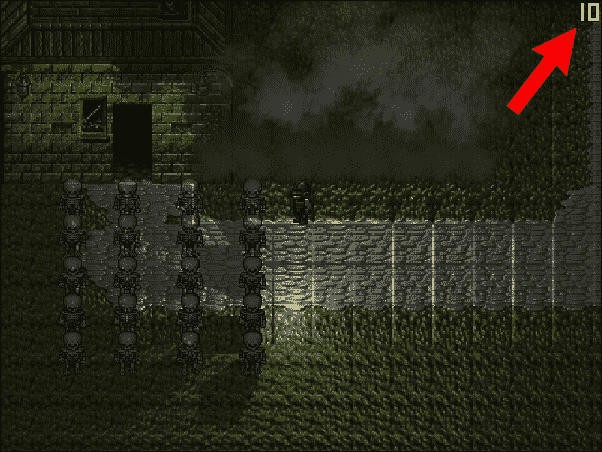

### 小贴士

**Fraps** 是一款免费的屏幕捕获软件，可以录制视频、截图，最重要的是对我们来说，可以显示帧率！虽然它是针对 Windows 的，但还有其他类似工具适用于 Linux 和 OSX。帧率计数器也可以通过简单地计算我们的代码中的帧数并使用 SFML 显示结果来轻松实现。

这绝对是不可原谅的，所以让我们打开性能分析器并剖析一下 `Draw` 方法：

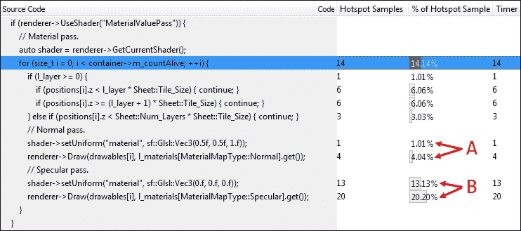

根据样本计数，主要的不效率似乎在材质值着色器传递内部，其中每个粒子都为正常和漫反射传递进行渲染。然而，还有一些奇怪的事情发生，那就是正常传递的样本似乎非常低，但当渲染漫反射传递时，它们突然大幅增加。考虑到我们只是设置一个 `vec3` 通用变量并将绘制到渲染纹理中，这看起来可能特别奇怪。这就是为什么需要进一步深入函数堆栈并理解 SFML 在幕后如何处理事情的原因：

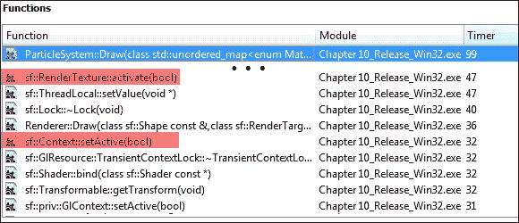

由于上下文切换和渲染纹理在幕后工作的方式，以我们这样做的方式渲染两种不同类型的材质图是非常低效的。在运行时切换纹理次数过多会导致严重的性能瓶颈，这也是为什么游戏使用精灵和瓦片图而不是单个图像的原因。

让我们尝试将这些两种不同类型分开，确保一次只渲染一个纹理：

```cpp
void ParticleSystem::Draw(MaterialMapContainer& l_materials, ...) { 
  ... 
  if (renderer->UseShader("MaterialValuePass")) { 
    auto shader = renderer->GetCurrentShader(); 
    // Normal pass. 
    auto texture = l_materials[MaterialMapType::Normal].get(); 
    shader->setUniform("material", 
      sf::Glsl::Vec3(0.5f, 0.5f, 1.f)); 
    for (size_t i = 0; i < container->m_countAlive; ++i) { 
      ... 
      renderer->Draw(drawables[i], texture); 
    } 

    // Specular pass. 
    texture = l_materials[MaterialMapType::Specular].get(); 
    shader->setUniform("material", sf::Glsl::Vec3(0.f, 0.f, 0.f)); 
    for (size_t i = 0; i < container->m_countAlive; ++i) { 
      ... 
      renderer->Draw(drawables[i], texture); 
    } 
  } 
  ... 
} 

```

注意，材质统一变量也被移出循环，以防止每次都构建不必要的副本并将其发送到着色器。现在只需运行应用程序，性能的明显提升将很快变得明显。让我们看看通过将我们已有的少量代码分成两部分，性能提高了多少：

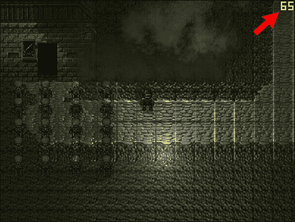

我们只是通过将正常和漫反射材质通道分开，就从 10 FPS 跳到了 65 FPS！这才像样！你会注意到这种性能的突然提升将样本计数急剧增加：

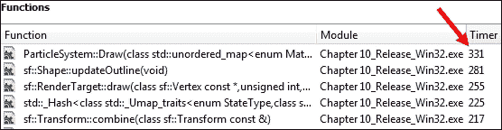

这是因为游戏现在运行得更快，并没有表明函数执行时间更长。记住，样本是相对的。在查看列表后，之前高亮的两个代码片段现在出现在列表的下方，样本计数在 20s 左右。这比之前略低，但由于样本是相对的，并且它们都上升了大约 6 倍，这表明性能有了巨大的提升。

### 光线剔除

我们必须解决的最后一个主要低效问题与第八章中实现的照明系统有关，即*让光亮起来！——高级照明简介*和第九章*黑暗的速度——照明与阴影*。

通过使用多通道着色/渲染处理场景中的多个光源是一种很好的技术，但当这些通道开始累积时，它可能会迅速变得低效。解决这个问题的第一步显然是不渲染那些不会影响最终图像的光源。通过消除那些不能直接被场景的视锥体观察到的对象来减少渲染对象数量的技术，也称为**剔除**，将有助于解决这个问题。

由于我们目前只处理全向点光源，可以通过简单地检查圆形与矩形的碰撞来实现光线剔除。

让我们设置一些辅助函数来帮助我们完成这项工作：

```cpp
inline float GetDistance(const sf::Vector2f& l_1, 
  const sf::Vector2f& l_2) 
{ 
  return std::sqrt(std::pow(l_1.x - l_2.x, 2) + 
    std::pow(l_1.y - l_2.y, 2)); 
} 

inline bool CircleInView(const sf::View& l_view, 
  const sf::Vector2f& l_circleCenter, float l_circleRad) 
{ 
  auto HalfSize = l_view.getSize() / 2.f; 
  float OuterRadius = std::sqrt((HalfSize.x * HalfSize.x) + 
    (HalfSize.y * HalfSize.y)); 
  float AbsoluteDistance = GetDistance(l_view.getCenter(), 
    l_circleCenter); 
  if (AbsoluteDistance > OuterRadius + l_circleRad) { 
    return false; 
  } 
  float InnerRadius = std::min(l_view.getSize().x, 
    l_view.getSize().y) / 2.f; 
  if (AbsoluteDistance < InnerRadius + l_circleRad){return true;} 
  glm::vec2 dir = { 
    l_circleCenter.x - l_view.getCenter().x, 
    l_circleCenter.y - l_view.getCenter().y 
  }; 
  dir = glm::normalize(dir); 
  sf::Vector2f point = l_circleCenter + 
    sf::Vector2f(l_circleRad * dir.x, l_circleRad * dir.y); 
  auto rect = sf::FloatRect( 
    l_view.getCenter() - HalfSize, 
    l_view.getSize()); 
  return rect.contains(point); 
} 

```

该函数首先在视图矩形周围创建一个外半径，这样我们就可以默认为大多数情况下光线远离视图视锥体的圆形-圆形碰撞检查。获取视图中心和圆形中心的距离，并检查是否超过视图外边界圆的半径加上圆形半径的总和。这是检查光线圆形是否接近视图矩形的最简单方法。

如果光线更靠近视图，就会为视图的矩形构造另一个圆的半径。这次，圆在视图内部，并且只有矩形尺寸较小的一维的半径。如果光线和视图中心之间的距离低于内半径和圆的半径之和，我们就可以确定发生了碰撞。这又是一个我们可以从列表中划掉的常见情况，在默认使用更复杂的算法之前。

最后，如果我们知道光线可能与某个角落相交，我们就将光线的方向向视图归一化，并使用它来获取最近点，然后检查该点是否与表示我们视图的构造的`sf::FloatRect`相交。

对光线管理类中的`RenderScene()`方法的实际更改仅涉及存储一个新列表，其中包含肯定影响屏幕上某些内容的光线，以便可以将它们传递给着色器：

```cpp
void LightManager::RenderScene() { 
  ... 
  std::vector<LightBase*> unculled; 
  for (auto& light : m_lights) { 
    if (!Utils::CircleInView(currentView, 
      { light.m_lightPos.x, light.m_lightPos.y }, 
      light.m_radius)) 
    { continue; } 
    unculled.emplace_back(&light); 
  } 
  auto& beginning = unculled.begin(); 
  auto passes = static_cast<int>(std::ceil( 
    static_cast<float>(unculled.size()) / LightsPerPass)); 
  if (passes == 0) { passes = 1; } 

  for (int pass = 0; pass < passes; ++pass) { 
    ... 
    for (int lightID = 0; lightID < LightsPerPass; ++lightID) { 
      ... 
      DrawShadowMap(ShadowPassShaderHandle, **light, lightID); 
      ... 
    } 
    ... 
    for (int lightID = 0; lightID < LightCount; ++lightID) { 
      ... 
      SubmitLightUniforms(LightPassShaderHandle,lightID, **light); 
      ... 
    } 
    ... 
    renderer->SwapTextures(); 
  } 
  ... 
} 

```

注意，我们没有考虑光线的衰减或它在着色器中的衰减情况，以确定是否应该剪裁它。

在剪裁掉所有不必要的灯光后，只有非常繁忙的区域才会经历一些性能损失。此时，应该引起关注的是关卡设计区域，并改进地图的架构。

# 摘要

恭喜你一路走到最后！这是一段相当漫长的旅程，我们确实可以说，这里涵盖了应该能够激发任何人对高级游戏开发信心的大量内容。即便如此，一如既往地，还有很多特性、优化、技术和主题我们只是简要提及，或者甚至还没有承认。利用这一点作为灵感去追求卓越，因为，正如我们已经确立的，大师级工匠不仅知道如何使用工具，也知道何时使用工具。虽然我们已经涵盖了基础知识，但还有很多更多的工具可以添加到你的工具箱中。使用它们，滥用它们，打破它们并替换它们。做任何需要的事情，但始终记得从中吸取经验，并在下次做得更好。

就这样，愿你的下一个项目展现出额外的打磨水平，并且运行得更快！感谢阅读！
