# 第三章. 交互式 3D 数据可视化

在本章中，我们将涵盖以下主题：

+   设置用于 3D 渲染的虚拟相机

+   使用透视渲染创建 3D 图表

+   使用 GLFW 创建交互式环境

+   渲染体数据集 – MCML 模拟

# 简介

OpenGL 是一个非常吸引人的平台，用于创建动态、高度交互的工具，以在 3D 中可视化数据。在本章中，我们将基于前一章讨论的基本概念，并扩展我们的演示，以包含更多复杂的 OpenGL 3D 渲染功能。为了实现 3D 可视化，我们首先将介绍在 OpenGL 中设置虚拟相机的基本步骤。此外，为了创建更多交互式演示，我们将介绍使用 GLFW 回调函数来处理用户输入。使用这些概念，我们将说明如何使用 OpenGL 创建具有透视渲染的交互式 3D 图表。最后，我们将演示如何渲染由生物组织中光传输的蒙特卡洛模拟生成的 3D 体数据集。到本章结束时，读者将能够使用透视渲染可视化数据，并通过用户输入动态地与环境交互，适用于广泛的用途。

# 设置用于 3D 渲染的虚拟相机

在现实世界中，渲染 3D 场景类似于使用数码相机拍照。创建照片所采取的步骤也可以应用于 OpenGL。

例如，你可以将相机从一个位置移动到另一个位置，并在空间中自由调整视点，这被称为**视图变换**。你还可以调整场景中感兴趣对象的位姿。然而，与现实世界不同，在虚拟世界中，你可以自由地以任何方向定位对象，没有任何物理约束，这被称为**建模变换**。最后，我们可以更换相机镜头来调整缩放并创建不同的视角，这个过程被称为**投影变换**。

当你应用视图和建模变换拍照时，数码相机获取信息并在你的屏幕上创建图像。这个过程称为**光栅化**。

这些矩阵集——包括视图变换、建模变换和投影变换——是我们可以在运行时调整的基本元素，这使我们能够创建场景的交互式和动态渲染。要开始，我们将首先探讨相机矩阵的设置，以及我们如何创建具有不同视角的场景。

## 准备工作

本章中的源代码基于上一章的最终演示。基本上，我们将通过使用透视矩阵设置摄像机模型来修改之前的实现。在接下来的章节中，我们将探讨使用 **OpenGL 着色语言**（**GLSL**）来启用更复杂的渲染技术和更高的性能。

## 如何做到这一点...

让我们开始处理 OpenGL 中透视变换的第一个新要求。由于摄像机参数依赖于窗口大小，我们首先需要实现一个处理窗口大小事件的回调函数，并相应地更新矩阵：

1.  定义回调函数的函数原型：

    ```cpp
    void framebuffer_size_callback(GLFWwindow* window, int width, int height)
    {
    ```

1.  预设摄像机参数：垂直 **视野角度**（**fovY**），到 **近裁剪面**（前）的距离，到 **远裁剪面**（后）的距离，以及屏幕纵横比（**宽度**/**高度**）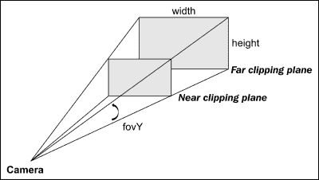

    ```cpp
      const float fovY = 45.0f;
      const float front = 0.1f;
      const float back = 128.0f;
      float ratio = 1.0f;
      if (height > 0)
        ratio = (float) width / (float) height;
    ```

1.  设置虚拟摄像机的视口（使用窗口大小）：

    ```cpp
      glViewport(0, 0, width, height);
    ```

1.  将矩阵模式指定为 `GL_PROJECTION` 并允许后续的矩阵操作应用于投影矩阵栈：

    ```cpp
      glMatrixMode(GL_PROJECTION);
    ```

1.  将单位矩阵加载到当前矩阵中（即重置矩阵到其默认状态）：

    ```cpp
      glLoadIdentity();
    ```

1.  为虚拟摄像机设置透视投影矩阵：

    ```cpp
      gluPerspective(fovY, ratio, front, back);
    }
    ```

## 它是如何工作的...

`framebuffer_size_callback` 函数的目的是处理来自 GLFW 库的回调事件。当窗口大小改变时，将捕获一个事件，回调函数提供了一个机制来相应地更新虚拟摄像机的参数。一个重要的问题是，如果我们不适当调整虚拟摄像机渲染参数，改变屏幕的纵横比可能会引入扭曲。因此，`update` 函数也会调用 `glViewport` 函数，以确保图形被渲染到新的可视区域。

此外，想象一下我们正在用真实世界中的物理摄像头拍摄一个场景。`gluPerspective`函数基本上控制着摄像头镜头的缩放（即视场角）以及摄像头传感器（即图像平面）的宽高比。虚拟摄像头和真实摄像头之间一个主要的不同之处在于近裁剪面和远裁剪面（前后变量）的概念，它限制了渲染图像的可视区域。这些限制与更高级的主题（深度缓冲区和深度测试）以及图形引擎如何与虚拟 3D 场景协同工作有关。一个经验法则是，我们永远不应该设置一个不必要的过大值，因为它会影响深度测试结果的精度，这可能导致 Z 冲突问题。**Z 冲突**是一种现象，当物体具有非常相似的深度值且深度值的精度不足以解决这种歧义（由于 3D 渲染过程中的浮点表示精度损失）时发生。设置更高分辨率的深度缓冲区或减少裁剪面之间的距离通常是减轻此类问题的最简单方法。

示例代码提供了场景的透视渲染，类似于人眼观察世界的方式。例如，如果一个物体离摄像头更近，它看起来会更大；如果它离摄像头更远，它看起来会更小。这允许我们更真实地观察场景。另一方面，通过控制视场角，我们可以夸大透视扭曲，类似于使用超广角镜头捕捉场景。

## 还有更多...

或者，我们可以通过用以下代码替换`gluPerspective()`函数来使用`glFrustum()`函数设置摄像头： 

```cpp
  const double DEG2RAD = 3.14159265 / 180;
  // tangent of half fovY
  double tangent = tan(fovY/2 * DEG2RAD);  
  // half height of near plane
  double height_f = front * tangent;     
  // half width of near plane
  double width_f = height_f * ratio;   

  //Create the projection matrix based on the near clipping 
  //plane and the location of the corners
  glFrustum(-width_f, width_f, -height_f, height_f, front, back);
}
```

`glFrustum` 函数接受近裁剪面和远裁剪面的角点来构建投影矩阵。从根本上讲，`gluPerspective` 和 `glFrustum` 函数之间没有区别，因此它们可以互换使用。

正如我们所见，OpenGL 中的虚拟摄像头可以在屏幕帧缓冲区（窗口大小）变化时更新，这些事件更新通过 GLFW 库的回调机制捕获。当然，我们也可以处理其他事件，例如键盘和鼠标输入。关于如何处理其他事件的更多细节将在稍后讨论。在下一节中，让我们实现演示的其余部分，以创建我们的第一个具有透视渲染的 3D 图形。

# 使用透视渲染创建 3D 图形

在上一章中，我们展示了随时间变化的二维高斯分布的标准差热图。现在，我们将继续使用相同的数据集在 3D 中进行更高级的渲染，并展示使用 OpenGL 可视化多维数据的有效性。上一章的代码库将被修改以启用 3D 渲染。

我们不是在平面上渲染二维高斯分布函数，而是将高斯函数 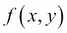 的输出作为 z（高度）值，如下所示：

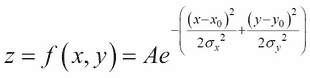

在这里 **A** 是以 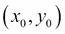 和  为中心的分布的振幅，而  是分布沿 *x* 和 *y* 方向的标准差（分散度）。在我们的例子中，我们将随时间改变分布的分散度以改变其在 3D 中的形状。此外，我们还将根据高度应用热图到每个顶点，以获得更好的可视化效果。

## 准备工作

使用投影模型设置好相机后，我们可以通过改变一些虚拟相机参数（如视场角以实现透视扭曲以及不同视角的旋转角度）来以期望的效果渲染我们的图。为了减少编码复杂性，我们将重新使用在 第二章，*OpenGL 原语和 2D 数据可视化* 中实现的 `draw2DHeatMap` 和 `gaussianDemo` 函数，并进行一些小的修改。渲染技术将基于前一章中描述的 OpenGL 原语。

## 如何做到这一点...

让我们修改 第二章，*OpenGL 原语和 2D 数据可视化* 中的最终演示（代码包中的 `main_gaussian_demo.cpp`），以启用 3D 中的透视渲染。首先提供整体代码结构以引导读者，主要更改将按顺序在较小的块中讨论：

```cpp
#include <GLFW/glfw3.h>
...

// Window size
const int WINDOWS_WIDTH = 1280;
const int WINDOWS_HEIGHT = 720;

// NEW: Callback functions and helper functions for 3D plot
void framebuffer_size_callback(GLFWwindow* window, int width, int height);
void draw2DHeatMap(const Data *data, int num_points);
void gaussianDemo(float sigma);
...

int main(void)
{
  GLFWwindow* window;
  int width, height;
  if (!glfwInit()){
    exit(EXIT_FAILURE);
  }
  window = glfwCreateWindow(WINDOWS_WIDTH, WINDOWS_HEIGHT, "Chapter 3: 3D Data Plotting", NULL, NULL);
  if (!window){
    glfwTerminate();
    exit(EXIT_FAILURE);
  }
  glfwMakeContextCurrent(window);
  glfwSwapInterval(1);
  // NEW: Callback functions
  ...

  //enable anti-aliasing
  glEnable(GL_BLEND);
  //smooth the points
  glEnable(GL_LINE_SMOOTH);
  //smooth the lines
  glEnable(GL_POINT_SMOOTH);
  glHint(GL_LINE_SMOOTH_HINT, GL_NICEST);
  glHint(GL_POINT_SMOOTH_HINT, GL_NICEST);
  //needed for alpha blending
  glBlendFunc(GL_SRC_ALPHA, GL_ONE_MINUS_SRC_ALPHA);
  glEnable(GL_ALPHA_TEST) ;
  // NEW: Initialize parameters for perspective rendering
  ...
  while (!glfwWindowShouldClose(window))
  {
    glClear(GL_COLOR_BUFFER_BIT | GL_DEPTH_BUFFER_BIT);
    glClearColor(1.0f, 1.0f, 1.0f, 1.0f);
    // NEW: Perspective rendering
    ...
  }
  glfwDestroyWindow(window);
  glfwTerminate();
  exit(EXIT_SUCCESS);
}
```

在心中牢记前面的框架，在 `main` 函数中，让我们添加之前章节中实现的窗口调整大小的 `callback` 函数：

```cpp
glfwGetFramebufferSize(window, &width, &height);
framebuffer_size_callback(window, width, height);
```

让我们定义几个全局变量并初始化它们以进行透视渲染，包括缩放级别（`zoom`）以及围绕 *x* （`beta`）和 *z* （`alpha`）轴的旋转角度，分别：

```cpp
GLfloat alpha=210.0f, beta=-70.0f, zoom=2.0f;
```

此外，在 `main` 循环之外，让我们初始化一些用于渲染高斯分布的参数，包括标准差（sigma）、符号和随时间动态改变函数的步长：

```cpp
float sigma = 0.1f;
float sign = 1.0f;
float step_size = 0.01f;
```

在 `while` 循环中，我们执行以下变换以在 3D 中渲染高斯函数：

1.  将矩阵模式指定为 `GL_MODELVIEW` 以允许后续的矩阵操作应用于 `MODELVIEW` 矩阵栈：

    ```cpp
    glMatrixMode(GL_MODELVIEW);
    ```

1.  执行对象的平移和旋转：

    ```cpp
    glLoadIdentity();
    glTranslatef(0.0, 0.0, -2.0);
    // rotate by beta degrees around the x-axis
    glRotatef(beta, 1.0, 0.0, 0.0);
    // rotate by alpha degrees around the z-axis
    glRotatef(alpha, 0.0, 0.0, 1.0);
    ```

1.  在 3D 中绘制原点（带有 *x*、*y* 和 *z* 轴）和高斯函数。动态地绘制一系列具有不同 sigma 值的高斯函数，并在达到某个阈值时反转符号：

    ```cpp
    drawOrigin();
    sigma=sigma+sign*step_size;
    if(sigma>1.0f){
      sign = -1.0f;
    }
    if(sigma<0.1){
      sign = 1.0f;
    }
    gaussianDemo(sigma);
    ```

    为了处理上述每个绘图任务，我们在单独的函数中实现了原点可视化器、高斯函数生成器和 3D 点可视化器。

为了可视化原点，实现以下绘图函数：

1.  定义函数原型：

    ```cpp
    void drawOrigin(){
    ```

1.  分别用红色、绿色和蓝色绘制*x*、*y*和*z*轴：

    ```cpp
      glLineWidth(4.0f);
      glBegin(GL_LINES);
      float transparency = 0.5f;

      //draw a red line for the x-axis
      glColor4f(1.0f, 0.0f, 0.0f, transparency);
      glVertex3f(0.0f, 0.0f, 0.0f);
      glColor4f(1.0f, 0.0f, 0.0f, transparency);
      glVertex3f(0.3f, 0.0f, 0.0f);

      //draw a green line for the y-axis
      glColor4f(0.0f, 1.0f, 0.0f, transparency);
      glVertex3f(0.0f, 0.0f, 0.0f);
      glColor4f(0.0f, 1.0f, 0.0f, transparency);
      glVertex3f(0.0f, 0.0f, 0.3f);

      //draw a blue line for the z-axis
      glColor4f(0.0f, 0.0f, 1.0f, transparency);
      glVertex3f(0.0f, 0.0f, 0.0f);
      glColor4f(0.0f, 0.0f, 1.0f, transparency);
      glVertex3f(0.0f, 0.3f, 0.0f);
      glEnd();
    }
    ```

对于高斯函数演示的实现，我们将问题分解为两部分：一个高斯数据生成器和带有点绘制的热图可视化函数。结合 3D 渲染和热图，我们现在可以清楚地看到高斯分布的形状以及样本如何在空间中随时间动画和移动：

1.  生成高斯分布：

    ```cpp
    void gaussianDemo(float sigma){
      const int grid_x = 400;
      const int grid_y = 400;
      const int num_points = grid_x*grid_y;
      Data *data=(Data*)malloc(sizeof(Data)*num_points);
      int data_counter=0;

      //standard deviation
      const float sigma2=sigma*sigma;
      //amplitude
      const float sigma_const = 10.0f*(sigma2*2.0f*(float)M_PI);

      for(float x = -grid_x/2.0f; x<grid_x/2.0f; x+=1.0f){
       for(float y = -grid_y/2.0f; y<grid_y/2.0f; y+=1.0f){
          float x_data = 2.0f*x/grid_x;
          float y_data = 2.0f*y/grid_y;
          //Set the mean to 0
          float z_data = exp(-0.5f*(x_data*x_data)/(sigma2) -0.5f*(y_data*y_data)/(sigma2)) /sigma_const;
          data[data_counter].x = x_data;
          data[data_counter].y = y_data;
          data[data_counter].z = z_data;
          data_counter++;
        }
      }
      draw2DHeatMap(data, num_points);
      free(data);
    }
    ```

1.  接下来，实现`draw2DHeatMap`函数以可视化结果。注意，与第二章不同，*OpenGL 原语和 2D 数据可视化*，我们在`glVertex3f`函数内部使用 z 值：

    ```cpp
    void draw2DHeatMap(const Data *data, int num_points){
      glPointSize(3.0f);
      glBegin(GL_POINTS);
      float transparency = 0.25f;
      //locate the maximum and minimum values in the dataset
      float max_value=-999.9f;
      float min_value=999.9f;
      for(int i=0; i<num_points; i++){
        Data d = data[i];
        if(d.z > max_value)
          max_value = d.z;
        if(d.z < min_value)
          min_value = d.z;
      }
      float halfmax = (max_value + min_value) / 2;
      //display the result
      for(int i = 0; i<num_points; i++){
        Data d = data[i];
        float value = d.z;
        float b = 1.0f - value/halfmax;
        float r = value/halfmax - 1.0f;
        if(b < 0)
          b=0;
        if(r < 0)
          r=0;
        float g = 1.0f - b - r;
        glColor4f(r, g, b, transparency);
        glVertex3f(d.x, d.y, d.z);
      }
      glEnd();
    }
    ```

渲染结果如下所示。我们可以看到透明度（alpha 混合）使我们能够看到数据点，并提供了视觉上吸引人的结果：

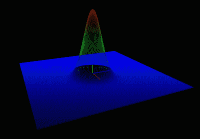

## 它是如何工作的...

这个简单的示例演示了透视渲染的使用以及 OpenGL 变换函数来在虚拟空间中旋转和移动渲染对象。正如你所见，整体代码结构与第二章相同，*OpenGL 原语和 2D 数据可视化*，主要变化包括设置透视渲染的相机参数（在`framebuffer_size_callback`函数内部）以及执行所需的变换以在 3D 中渲染高斯函数（在将矩阵模式设置为`GL_MODELVIEW`之后）。两个非常常用的变换函数来操纵虚拟对象包括`glRotatef`和`glTranslatef`，这些函数允许我们将对象定位在任何方向和位置。这些函数可以显著提高你自己的应用程序的动态性，因为它们在开发和计算时间上的成本非常低，因为它们经过了高度优化。

`glRotatef`函数接受四个参数：旋转角度和方向向量的三个分量 *(x, y, z)*，这些分量定义了旋转轴。该函数还将当前矩阵替换为旋转矩阵和当前矩阵的乘积：

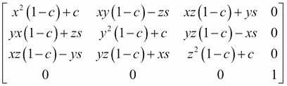

这里 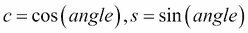 和 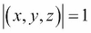。

## 更多内容...

可能有人会问，如果我们想将两个对象放置在不同的方向和位置怎么办？如果我们想将许多部分在空间中相对于彼此定位怎么办？对这些问题的答案是使用 `glPushMatrix` 和 `glPopMatrix` 函数来控制变换矩阵的堆栈。对于具有大量部件的模型，这个概念可能会相对复杂，并且保持具有许多组件的状态机的历史可能会很繁琐。为了解决这个问题，我们将探讨 GLSL 支持的新版本（OpenGL 3.x 及更高版本）。

# 使用 GLFW 创建交互式环境

在前两个部分中，我们专注于创建 3D 对象以及利用虚拟相机的基本 OpenGL 渲染技术。现在，我们准备将用户输入，如鼠标和键盘输入，结合到使用相机控制功能（如缩放和旋转）的更动态的交互中。这些功能将是即将到来的应用程序的基本构建块，代码将在后面的章节中重用。

## 准备中

GLFW 库提供了一个机制来处理来自不同环境的用户输入。事件处理程序以 C/C++ 中的回调函数的形式实现，在前面的教程中，我们为了简化而跳过了这些选项。要开始，我们首先需要启用这些回调函数并实现基本功能来控制渲染参数。

## 如何做到这一点...

要处理键盘输入，我们将自己的 `callback` 函数实现附加到 GLFW 的事件处理程序上。在 `callback` 函数中，我们将执行以下操作：

1.  定义以下全局变量（包括一个名为 `locked` 的新变量，用于跟踪鼠标按钮是否按下，以及旋转角度和缩放级别），这些变量将由 `callback` 函数更新：

    ```cpp
    GLboolean locked = GL_FALSE;
    GLfloat alpha=210.0f, beta=-70.0f, zoom=2.0f;
    ```

1.  定义键盘 `callback` 函数原型：

    ```cpp
    void key_callback(GLFWwindow* window, int key, int scancode, int action, int mods)
    {
    ```

1.  如果收到除按键事件之外的任何事件，则忽略它：

    ```cpp
      if (action != GLFW_PRESS)
        return;
    ```

1.  创建一个 `switch` 语句来处理每个按键事件的案例：

    ```cpp
      switch (key)
      {
    ```

1.  如果按下 *Esc* 键，则退出程序：

    ```cpp
        case GLFW_KEY_ESCAPE:
          glfwSetWindowShouldClose(window, GL_TRUE);
          break;
    ```

1.  如果按下空格键，通过切换变量来开始或停止动画：

    ```cpp
        case GLFW_KEY_SPACE:
          freeze=!freeze;
          break;
    ```

1.  如果按下方向键（上、下、左和右），则更新控制渲染对象旋转角度的变量：

    ```cpp
        case GLFW_KEY_LEFT:
          alpha += 5.0f;
          break;
        case GLFW_KEY_RIGHT:
          alpha -= 5.0f;
          break;
        case GLFW_KEY_UP:
          beta -= 5.0f;
          break;
        case GLFW_KEY_DOWN:
          beta += 5.0f;
          break;
    ```

1.  最后，如果按下 *Page Up* 或 *Page Down* 键，则通过更新 `zoom` 变量来从对象中缩放或缩小：

    ```cpp
        case GLFW_KEY_PAGE_UP:
          zoom -= 0.25f;
          if (zoom < 0.0f)
            zoom = 0.0f;
            break;
        case GLFW_KEY_PAGE_DOWN:
          zoom += 0.25f;
          break;
          default:
          break;
      }
    }
    ```

要处理鼠标点击事件，我们实现另一个类似于键盘的 `callback` 函数。鼠标点击事件相当简单，因为可用的按钮有限：

1.  定义鼠标按键的 `callback` 函数原型：

    ```cpp
    void mouse_button_callback(GLFWwindow* window, int button, int action, int mods)
    {
    ```

1.  为了简单起见，忽略除左键点击事件之外的所有输入：

    ```cpp
      if (button != GLFW_MOUSE_BUTTON_LEFT)
        return;
    ```

1.  切换 `lock` 变量以存储鼠标按下事件。`lock` 变量将用于确定鼠标移动是否用于旋转对象：

    ```cpp
      if (action == GLFW_PRESS)
      {
        glfwSetInputMode(window, GLFW_CURSOR,   GLFW_CURSOR_DISABLED);
        locked = GL_TRUE;
      }
      else
      {
        locked = GL_FALSE;
        glfwSetInputMode(window, GLFW_CURSOR,GLFW_CURSOR_NORMAL);
      }
    }
    ```

对于处理鼠标移动事件，我们需要创建另一个`callback`函数。鼠标移动的`callback`函数从窗口中获取*x*和*y*坐标，而不是唯一的键输入：

1.  定义一个接受鼠标坐标的`callback`函数原型：

    ```cpp
    void cursor_position_callback(GLFWwindow* window, double x, double y)
    {
    ```

1.  在鼠标按下和移动时，我们使用鼠标的*x*和*y*坐标更新对象的旋转角度：

    ```cpp
      //if the mouse button is pressed
      if (locked)
      {
        alpha += (GLfloat) (x - cursorX) / 10.0f;
        beta += (GLfloat) (y - cursorY) / 10.0f;
      }
      //update the cursor position
      cursorX = (int) x;
      cursorY = (int) y;
    }
    ```

最后，我们将实现鼠标滚动回调函数，允许用户通过滚动来放大和缩小对象。

1.  定义一个捕获`x`和`y`滚动变量的`callback`函数原型：

    ```cpp
    void scroll_callback(GLFWwindow* window, double x, double y)
    {
    ```

1.  取 y 参数（上下滚动）并更新缩放变量：

    ```cpp
      zoom += (float) y / 4.0f;
      if (zoom < 0.0f)
        zoom = 0.0f;
    }
    ```

在所有`callback`函数实现之后，我们现在可以准备将这些函数链接到 GLFW 库的事件处理器。GLFW 库提供了一个平台无关的 API 来处理这些事件，因此相同的代码可以在 Windows、Linux 和 Mac OS X 上无缝运行。

要将回调函数与 GLFW 库集成，请在`main`函数中调用以下函数：

```cpp
//keyboard input callback
glfwSetKeyCallback(window, key_callback);

//framebuffer size callback  
glfwSetFramebufferSizeCallback(window, framebuffer_size_callback);

//mouse button callback
glfwSetMouseButtonCallback(window, mouse_button_callback);

//mouse movement callback
glfwSetCursorPosCallback(window, cursor_position_callback);

//mouse scroll callback
glfwSetScrollCallback(window, scroll_callback);
```

最终结果是用户可以自由控制空间中渲染对象的交互式界面。首先，当用户滚动鼠标（见以下截图）时，我们向前或向后移动对象。这产生了视觉上的感知，即对象被相机放大或缩小：

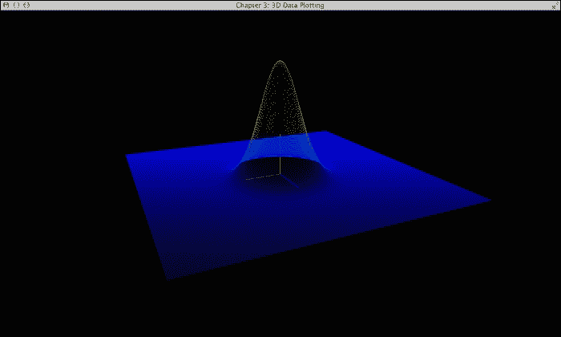

这里是另一个不同缩放级别的截图：

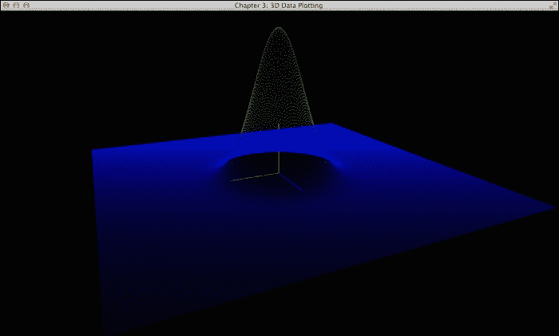

这些简单而强大的技术允许用户实时操纵虚拟对象，并且在可视化复杂数据集时可能非常有用。此外，我们可以通过按住鼠标按钮并在不同方向上拖动对象来以不同的角度旋转对象。下面的截图显示了我们可以如何以任意角度渲染图表以更好地理解数据分布。

这里是一张显示高斯函数侧视图的截图：

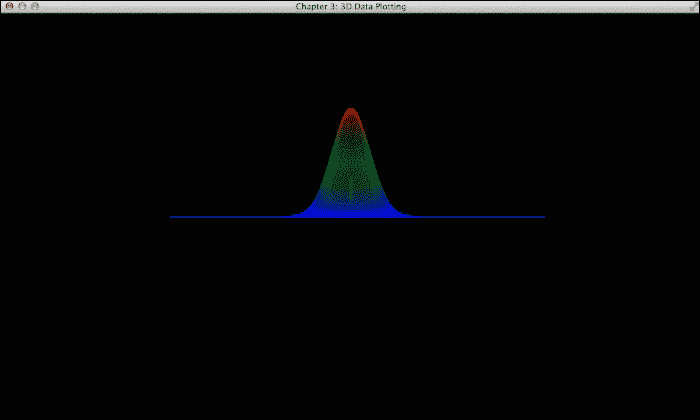

这里是一张从顶部显示高斯函数的截图：

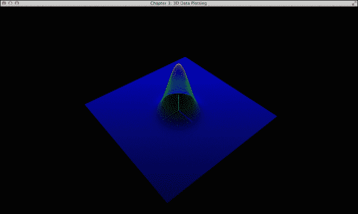

最后，这是一张显示高斯函数底部的截图：

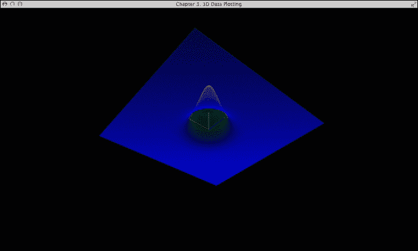

## 它是如何工作的...

这个示例代码展示了构建跨多个平台高度可移植的交互式应用程序所需的基本界面，这些应用程序使用 OpenGL 和 GLFW 库。在 GLFW 库中使用`callback`函数允许非阻塞调用，这些调用与渲染引擎并行运行。这个概念特别有用，因为鼠标、键盘和游戏手柄等输入设备都有不同的输入速率和延迟。这些`callback`函数允许异步执行而不阻塞主渲染循环。

`glfwSetKeyCallback`、`glfwSetFramebufferSizeCallback`、`glfwSetScrollCallback`、`glfwSetMouseBcuttonCallback`和`glfwSetCursorPosCallback`函数提供了对鼠标按钮和滚动轮、键盘输入以及窗口调整大小事件的控制。这些只是我们可以使用 GLFW 库支持实现的许多处理程序中的一部分。例如，我们可以通过添加额外的`callback`函数来进一步扩展错误处理能力。此外，我们可以处理窗口关闭和打开事件，从而实现与多个窗口的更复杂接口。到目前为止提供的示例中，我们介绍了如何通过相对简单的 API 调用创建交互式界面的基础知识。

## 参见

为了全面覆盖 GLFW 库函数调用，本网站提供了一套全面的示例和文档，包括所有回调函数以及输入和其他事件的处理：[`www.glfw.org/docs/latest/`](http://www.glfw.org/docs/latest/)。

# 渲染体积数据集 – MCML 模拟

在本节中，我们将演示从生物组织中光传输的蒙特卡洛模拟生成的 3D 体积数据集的渲染，称为**多层介质蒙特卡洛**（**MCML**）。为了简化，本章代码包中包含了模拟输出文件，以便读者可以直接运行演示，而无需设置模拟代码。蒙特卡洛模拟的源代码在“参见”部分列出的系列出版物中有详细描述，并且对于感兴趣的读者，GPU 实现可在网上获得（[`code.google.com/p/gpumcml/`](https://code.google.com/p/gpumcml/))）。

生物组织中的光传输可以用**辐射传输方程**（**RTE**）来模拟，该方程对于复杂几何形状来说，解析求解已被证明是困难的。时间相关的 RTE 可以表示为：


这里 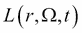 是辐射亮度 [*W m^(−2)sr^(−1)*]，定义为穿过位置 *r* 处垂直于方向 *Ω* 的单位立体角的无穷小面积上的辐射功率 [*W*]，*μ[s]* 是散射系数，*μ[a]* 是吸收系数，*ν* 是光速，而 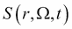 是源项。为了数值求解 RTE，威尔逊和亚当引入了**蒙特卡洛**（**MC**）方法，由于其准确性和多功能性（特别是对于复杂组织几何形状），该方法被广泛接受为光子迁移建模的金标准方法。

MC 方法是一种统计抽样技术，已被应用于许多不同领域的许多重要问题，从医学中的放射治疗计划到金融中的期权定价。蒙特卡洛这个名字来源于摩纳哥的度假胜地，该地以其赌场等景点而闻名。正如其名所示，MC 方法的关键特征涉及利用随机机会（通过生成具有特定概率分布的随机数）来模拟所讨论的物理过程。

在我们的案例中，我们感兴趣的是模拟生物组织中的光子传播。MCML 算法提供了多层介质中稳态光传输的蒙特卡洛模型。特别是，我们将模拟在组织表面具有圆形光源的均匀介质中的光子传播，以计算光剂量（吸收能量）分布。这类计算有广泛的应用范围，包括光疗（如光动力疗法）的治疗计划（这可以被视为一种针对癌症的光激活化疗）。

在这里，我们演示如何将我们的代码库与 OpenGL 渲染函数集成以显示体量数据。我们将利用诸如 alpha 混合、透视渲染和热图渲染等技术。结合 GLFW 接口捕获用户输入，我们可以创建一个交互式可视化器，可以实时显示大量体量数据，并使用几个简单的键输入控制放大体量数据集中数据点平面的切片器。

## 准备工作

模拟结果存储在一个包含 3D 矩阵的 ASCII 文本文件中。矩阵中的每个值代表在体素化几何结构中某个固定位置的吸收光子能量密度。在这里，我们将提供一个简单的解析器，从文件中提取模拟输出矩阵并将其存储在本地内存中。

## 如何实现...

让我们从实现 MCML 数据解析器、喷射颜色方案热图生成器以及 OpenGL 中的切片器开始：

1.  从模拟输出的文本文件中获取数据并将其存储在浮点数组中：

    ```cpp
    #define MCML_SIZE_X 50
    #define MCML_SIZE_Y 50
    #define MCML_SIZE_Z 200
    float mcml_data[MCML_SIZE_X][MCML_SIZE_Y][MCML_SIZE_Z];
    Vertex mcml_vertices[MCML_SIZE_X][MCML_SIZE_Y][MCML_SIZE_Z];
    float max_data, min_data;
    int slice_x = 0, slice_z = 0, slice_y = 0;
    float point_size=5.0f;

    //load the data from a text file
    void loadMCML(){
      FILE *ifp;
      //open the file for reading
      ifp = fopen("MCML_output.txt", "r");
      if (ifp == NULL) {
        fprintf(stderr, "ERROR: Can't open MCML Data file!\n");
        exit(1);
      }
      float data;
      float max=0, min=9999999;
      for(int x=0; x<MCML_SIZE_X; x++){
        for(int z=0; z<MCML_SIZE_Z; z++){
          for(int y=0; y<MCML_SIZE_Y; y++){
            if (fscanf(ifp, "%f\n", &data) == EOF){
              fprintf(stderr, "ERROR: Missing MCML Data file!\n");
              exit(1);
            }
            //store the log compressed data point
            data = log(data+1);
            mcml_data[x][y][z]=data;
            //find the max and min from the data set for heatmap
            if(data>max){
              max=data;
            }
            if(data<min){
              min=data;
            }
            //normalize the coordinates
            mcml_vertices[x][y][z].x=(float)(x-MCML_SIZE_X/2.0f)/MCML_SIZE_X;
            mcml_vertices[x][y][z].y=(float)(y-MCML_SIZE_Y/2.0f)/MCML_SIZE_Y;
            mcml_vertices[x][y][z].z=(float)(z-MCML_SIZE_Z/2.0f)/MCML_SIZE_Z*2.0f;
          }
        }
      }
      fclose(ifp);
      max_data = max;
      min_data = min;
      halfmax= (max+min)/2.0f;
    ```

1.  使用自定义颜色图对模拟输出值进行编码以进行显示：

    ```cpp
      //store the heat map representation of the data
      for(int z=0; z<MCML_SIZE_Z; z++){
        for(int x=0; x<MCML_SIZE_X; x++){
          for(int y=0; y<MCML_SIZE_Y; y++){
            float value = mcml_data[x][y][z];
            COLOUR c = GetColour(value, min_data,max_data);
            mcml_vertices[x][y][z].r=c.r;
            mcml_vertices[x][y][z].g=c.g;
            mcml_vertices[x][y][z].b=c.b;
          }
        }
      }
    }
    ```

1.  使用喷射颜色方案实现热图生成器：

    ```cpp
    Color getHeatMapColor(float value, float min, float max)
    {
      //remapping the value to the JET color scheme
      Color c = {1.0f, 1.0f, 1.0f}; // default value
      float dv;
      //clamp the data 
      if (value < min)
        value = min;
      if (value > max)
        value = max;
      range = max - min;
      //the first region (0%-25%)
      if (value < (min + 0.25f * range)) {
        c.r = 0.0f;
        c.g = 4.0f * (value - min) / range;
      }
      //the second region of value (25%-50%)
      else if (value < (min + 0.5f * range)) {
        c.r = 0.0f;
        c.b = 1.0f + 4.0f * (min + 0.25f * range - value) / range;
      }
      //the third region of value (50%-75%)
      else if (value < (min + 0.75f * range)) {
        c.r = 4.0f * (value - min - 0.5f * range) / range;
        c.b = 0.0f;
      }
      //the fourth region (75%-100%)
      else {
        c.g = 1.0f + 4.0f * (min + 0.75f * range - value) / range;
        c.b = 0.0f;
      }
      return(c);
    }
    ```

1.  在屏幕上绘制所有数据点，并启用透明度：

    ```cpp
    void drawMCMLPoints(){
      glPointSize(point_size);
      glBegin(GL_POINTS);
      for(int z=0; z<MCML_SIZE_Z; z++){
        for(int x=0; x<MCML_SIZE_X; x++){
          for(int y=0; y<MCML_SIZE_Y; y++){
            glColor4f(mcml_vertices[x][y][z].r,mcml_vertices[x][y][z].g,mcml_vertices[x][y][z].b, 0.15f);
            glVertex3f(mcml_vertices[x][y][z].x,mcml_vertices[x][y][z].y,mcml_vertices[x][y][z].z);
          }
        }
      }
      glEnd();
    }
    ```

1.  绘制三个数据点的切片以进行横截面可视化：

    ```cpp
    void drawMCMLSlices(){
      glPointSize(10.0f);
      glBegin(GL_POINTS);

      //display data on xy plane
      for(int x=0; x<MCML_SIZE_X; x++){
        for(int y=0; y<MCML_SIZE_Y; y++){
          int z = slice_z;
          glColor4f(mcml_vertices[x][y][z].r,mcml_vertices[x][y][z].g,mcml_vertices[x][y][z].b, 0.9f);
          glVertex3f(mcml_vertices[x][y][z].x,mcml_vertices[x][y][z].y,mcml_vertices[x][y][z].z);
        }
      }

      //display data on yz plane
      for(int z=0; z<MCML_SIZE_Z; z++){
        for(int y=0; y<MCML_SIZE_Y; y++){
          int x = slice_x;
          glColor4f(mcml_vertices[x][y][z].r,mcml_vertices[x][y][z].g,mcml_vertices[x][y][z].b, 0.9f);
          glVertex3f(mcml_vertices[x][y][z].x,mcml_vertices[x][y][z].y,mcml_vertices[x][y][z].z);
        }
      }

      //display data on xz plane
      for(int z=0; z<MCML_SIZE_Z; z++){
        for(int x=0; x<MCML_SIZE_X; x++){
          int y = slice_y;
          glColor4f(mcml_vertices[x][y][z].r,mcml_vertices[x][y][z].g,mcml_vertices[x][y][z].b, 0.9f);
          glVertex3f(mcml_vertices[x][y][z].x,mcml_vertices[x][y][z].y,mcml_vertices[x][y][z].z);
        }
      }
      glEnd();
    }
    ```

1.  此外，我们还需要更新 `key_callback` 函数以移动切片：

    ```cpp
    void key_callback(GLFWwindow* window, int key, int scancode, int action, int mods)
    {
      if (action != GLFW_PRESS)
        return;
      switch (key)
      {
        case GLFW_KEY_ESCAPE:
          glfwSetWindowShouldClose(window, GL_TRUE);
          break;
        case GLFW_KEY_P:
          point_size+=0.5;
          break;
        case GLFW_KEY_O:
          point_size-=0.5;
          break;
        case GLFW_KEY_A:
          slice_y -=1;
          if(slice_y < 0)
            slice_y = 0;
          break;
        case GLFW_KEY_D:
          slice_y +=1;
          if(slice_y >= MCML_SIZE_Y-1)
            slice_y = MCML_SIZE_Y-1;
          break;
        case GLFW_KEY_W:
          slice_z +=1;
          if(slice_z >= MCML_SIZE_Z-1)
            slice_z = MCML_SIZE_Z-1;
          break;
        case GLFW_KEY_S:
          slice_z -= 1;
          if (slice_z < 0)
            slice_z = 0;
          break;
        case GLFW_KEY_E:
          slice_x -=1;
          if(slice_x < 0)
            slice_x = 0;
          break;
        case GLFW_KEY_Q:
          slice_x +=1;
          if(slice_x >= MCML_SIZE_X-1)
            slice_x = MCML_SIZE_X-1;
          break;
        case GLFW_KEY_PAGE_UP:
          zoom -= 0.25f;
          if (zoom < 0.f)
            zoom = 0.f;
          break;
        case GLFW_KEY_PAGE_DOWN:
          zoom += 0.25f;
          break;
        default:
          break;
      }
    }
    ```

1.  最后，为了完成演示，只需在 `main` 循环中调用 `drawMCMLPoints` 和 `drawMCMLSlices` 函数，并使用之前演示中用于绘制高斯函数的透视渲染相同的代码结构即可：

    ```cpp
    while (!glfwWindowShouldClose(window))
    {
      glClear(GL_COLOR_BUFFER_BIT | GL_DEPTH_BUFFER_BIT);
      glClearColor(0.0f, 0.0f, 0.0f, 1.0f);

      glMatrixMode(GL_MODELVIEW);
      glLoadIdentity();
      glTranslatef(0.0, 0.0, -zoom);
      glRotatef(beta, 1.0, 0.0, 0.0);
      glRotatef(alpha, 0.0, 0.0, 1.0);
      //disable depth test so we can render the points with blending
      glDisable(GL_DEPTH_TEST);
      drawMCMLPoints();
      //must enable this to ensure the slides are rendered in the right order 
      glEnable(GL_DEPTH_TEST);
      drawMCMLSlices();

      //draw the origin with the x,y,z axes for visualization
      drawOrigin();
      glfwSwapBuffers(window);
      glfwPollEvents();
    }
    ```

在下面的屏幕截图中，以 3D 形式显示了模拟结果，表示在体素化几何形状中的光子吸收分布。光源照亮组织表面（底部*z=0*），并通过模拟为无限宽的均匀介质组织的组织传播（正*z*方向）。光子吸收分布遵循有限尺寸、平坦和圆形光束的预期形状：


## 如何工作...

这个演示说明了我们如何将蒙特卡洛模拟（以及更一般地，任何应用程序生成的体数据集）生成的体数据集通过一个高度交互式的界面使用 OpenGL 进行渲染。数据解析器以 ASCII 文本文件作为输入。然后，我们将浮点数据转换为可以适应我们的渲染管道的单独顶点。初始化时，变量`mcml_vertices`和`mcml_data`存储预先计算的热图数据以及每个数据点的位置。`parser`函数还计算数据集中的最大值和最小值，以便进行热图可视化。`getHeatMapColor`函数将模拟输出值映射到喷气色系中的颜色。该算法基本上定义了一个颜色光谱，并根据其范围重新映射值。

在下面的屏幕截图中，我们展示了模拟结果的一个俯视图，这使我们能够可视化光分布的对称性：

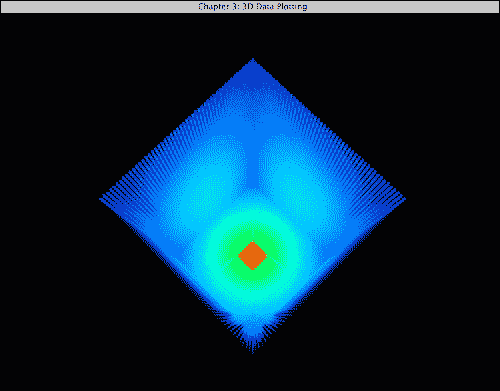

`drawMCMLSlices`函数接受一个数据切片（即一个平面），并以全不透明度和更大的点大小渲染数据点。这提供了一种有用且非常常见的可视化方法（特别是在医学成像中），允许用户通过移动横截面切片来详细检查体数据。正如以下屏幕截图所示，我们可以沿*x*、*y*和*z*方向移动切片器来可视化感兴趣的区域：

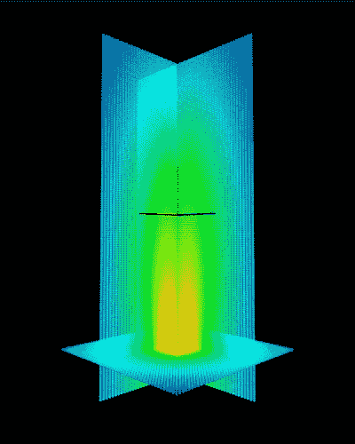

## 还有更多...

这个演示提供了一个在交互式 3D 环境中渲染模拟数据的实时体数据可视化的示例。当前的实现可以很容易地修改，以适应需要体数据集可视化的广泛应用程序。我们的方法提供了一个直观的方式来渲染复杂的 3D 数据集，包括热图生成器、切片器和使用 OpenGL 的 3D 透视渲染技术。

一个重要的观察是，这个演示需要大量的 `glVertex3f` 调用，这可能会成为性能瓶颈的主要因素。为了解决这个问题，在接下来的章节中，我们将探讨更复杂的方法来处理内存传输，并使用**顶点缓冲对象**（**VBOs**）绘制更复杂的模型，**VBOs**是显卡中的内存缓冲区，用于存储顶点信息。这将引导我们走向片段程序和自定义顶点着色器程序（即从 OpenGL 2.0 过渡到 OpenGL 3.2 或更高版本）。然而，如果我们目标是缩短开发周期、最小化开销以及与旧硬件的向后兼容性，那么使用经典 OpenGL 2.0 调用的简单性是一个重要的考虑因素。

## 参见

如需更多信息，请参考以下参考文献：

+   E. Alerstam & W. C. Y. Lo, T. Han, J. Rose, S. Andersson-Engels, 和 L. Lilge, "使用 GPU 对浑浊介质中光传输的下一代加速和代码优化," *Biomed. Opt. Express 1*, 658-675 (2010).

+   W. C. Y. Lo, K. Redmond, J. Luu, P. Chow, J. Rose, 和 L. Lilge, "用于光动力治疗计划的光动力治疗蒙特卡洛模拟的硬件加速," *J. Biomed. Opt. 14*, 014019 (2009).

+   W. Wang, S. Jacques, 和 L. Zheng, "MCML - 多层组织中光传输的蒙特卡洛建模," *Comput. Meth. Prog. Biol. 47*, 131–146 (1995).

+   B. Wilson 和 G. Adam, "组织中光吸收和通量分布的蒙特卡洛模型," *Med. Phys. 10*, 824 (1983).
