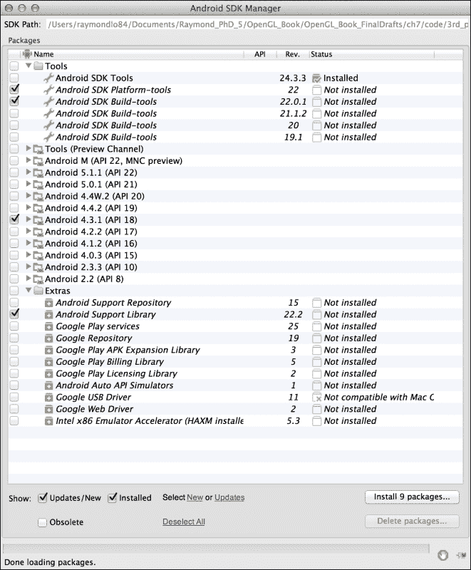
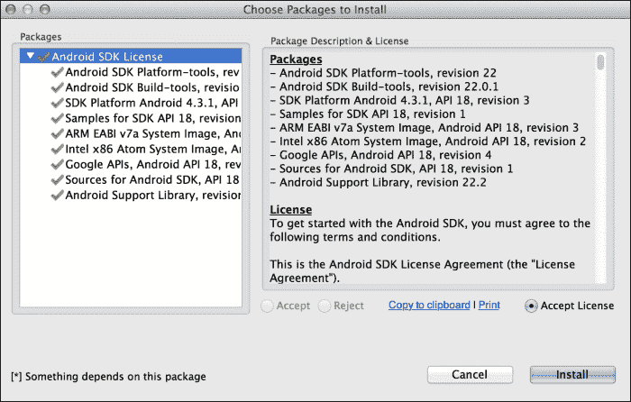
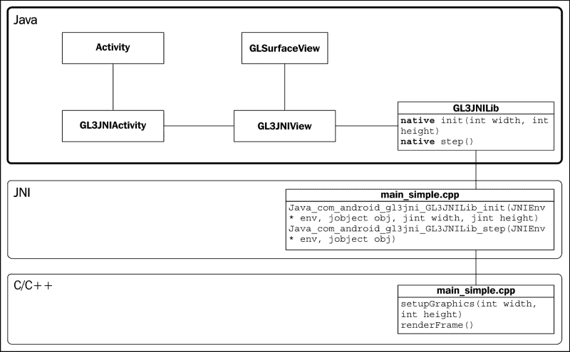
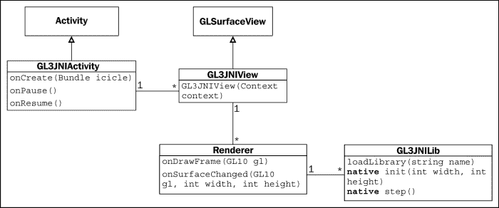
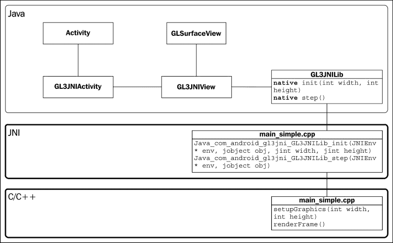
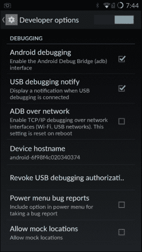
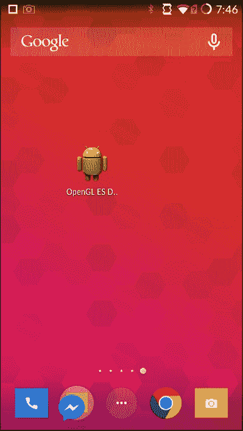
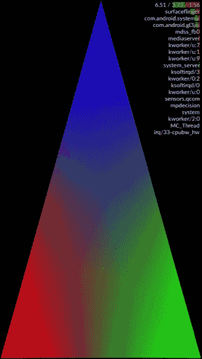
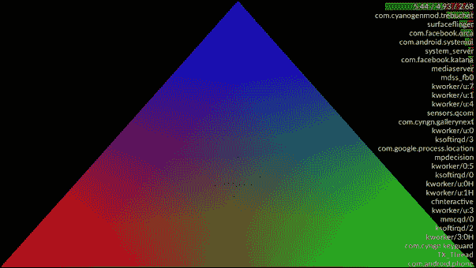

# 第七章：使用 OpenGL ES 3.0 在移动平台上进行实时图形渲染的介绍

在本章中，我们将涵盖以下主题：

+   设置 Android SDK

+   设置 **Android 本地开发工具包**（**NDK**）

+   开发用于集成 Android NDK 的基本框架

+   使用 OpenGL ES 3.0 创建您的第一个 Android 应用程序

# 简介

在本章中，我们将通过展示如何使用 **嵌入式系统中的 OpenGL**（**OpenGL ES**）在最新的移动设备上可视化数据，从智能手机到平板电脑，过渡到一个越来越强大且无处不在的计算平台。随着移动设备的普及和计算能力的增强，我们现在有了一个前所未有的机会，可以直接使用集成到现代移动设备中的高性能图形硬件来开发新颖的交互式数据可视化工具。

OpenGL ES 在标准化 2D 和 3D 图形 API 中发挥着重要作用，允许在具有各种硬件设置的嵌入式系统上大规模部署移动应用程序。在各种移动平台（主要是 Google Android、Apple iOS 和 Microsoft Windows Phone）中，Android 移动操作系统目前是最受欢迎的之一。因此，在本章中，我们将主要关注使用 OpenGL ES 3.0 开发基于 Android 的应用程序（API 18 及以上版本）的开发，它提供了 GLSL 的新版本支持（包括对整数和 32 位浮点操作的全面支持）以及增强的纹理渲染支持。尽管如此，OpenGL ES 3.0 也支持其他移动平台，如 Apple iOS 和 Microsoft Phone。

在这里，我们将首先介绍如何设置 Android 开发平台，包括提供构建移动应用程序基本工具的 SDK，以及允许通过直接硬件加速使用本地代码语言（C/C++）进行高性能科学计算和仿真的 NDK。我们将提供一个脚本，以简化在您的移动设备上部署第一个基于 Android 的应用程序的过程。

# 设置 Android SDK

Google Android OS 网站提供了一个名为 **Android SDK** 的独立包，用于 Android 应用程序开发。它包含开发 Android 应用程序所需的所有必要的编译和调试工具（除了由 Android NDK 提供的本地代码支持）。接下来的步骤解释了在 Mac OS X 或类似地，在 Linux 上的安装过程，需要对脚本和二进制包进行一些小的修改。

## 如何操作...

要安装 Android SDK，请按照以下步骤操作：

1.  从 Android 开发者网站下载独立包，网址为 [`dl.google.com/android/android-sdk_r24.3.3-macosx.zip`](http://dl.google.com/android/android-sdk_r24.3.3-macosx.zip)。

1.  创建一个名为 `3rd_party/android` 的新目录，并将设置文件移动到该文件夹：

    ```cpp
    mkdir 3rd_party/android
    mv android-sdk_r24.3.3-macosx.zip 3rd_party/android 
    ```

1.  解压包：

    ```cpp
    cd 3rd_party/android && unzip android-sdk_r24.3.3-macosx.zip
    ```

1.  执行 Android SDK Manager：

    ```cpp
    ./android-sdk-macosx/tools/android
    ```

1.  从包列表中选择**Android 4.3.1 (API 18)**，除了默认选项外。取消选择**Android M (API22, MBC preview)**和**Android 5.1.1 (API 22)**。在**Android SDK Manager**界面上按下**安装 9 个包...**按钮，如图所示：

1.  选择**接受****许可**并点击**安装**按钮：

1.  要验证安装，请在终端中输入以下命令：

    ```cpp
    ./android-sdk-macosx/tools/android list
    ```

1.  这是一个说明 Android 4.3.1 平台成功安装的示例：

    ```cpp
    Available Android targets:
    ----------
    id: 1 or "android-18"
    Name: Android 4.3.1
    Type: Platform
    API level: 18
    Revision: 3
    Skins: HVGA, QVGA, WQVGA400, WQVGA432, WSVGA, WVGA800 (default), WVGA854, WXGA720, WXGA800, WXGA800-7in
    Tag/ABIs : default/armeabi-v7a, default/x86
    ...
    ```

1.  最后，我们将安装 Apache Ant 以自动化 Android 应用程序开发的软件构建过程。我们可以通过使用 MacPort 命令行或从其官方网站 [`ant.apache.org/`](http://ant.apache.org/) 轻易地获取 Apache Ant 包：

    ```cpp
    sudo port install apache-ant
    ```

## 相关内容

要在 Linux 或 Windows 上安装 Android SDK，下载相应的安装文件，并遵循 Android 开发者网站上的说明，网址为 [`developer.android.com/sdk/index.html`](https://developer.android.com/sdk/index.html)。

在 Linux 上设置 Android SDK 的设置程序与使用命令行界面基本相同，只是应该使用此链接下载不同的独立包：[`dl.google.com/android/android-sdk_r24.3.3-linux.tgz`](http://dl.google.com/android/android-sdk_r24.3.3-linux.tgz)。

此外，对于 Windows 用户，可以通过此链接获取独立包：[`dl.google.com/android/installer_r24.3.3-windows.exe`](http://dl.google.com/android/installer_r24.3.3-windows.exe)。

要验证您的手机是否具有适当的 OpenGL ES 3.0 支持，请参考 Android 文档中关于如何在运行时检查 OpenGL ES 版本的说明：[`developer.android.com/guide/topics/graphics/opengl.html#version-check`](http://developer.android.com/guide/topics/graphics/opengl.html#version-check)。

# 设置 Android 原生开发工具包 (NDK)

Android NDK 环境对于原生代码语言开发至关重要。在这里，我们将再次概述 Mac OS X 平台的设置步骤。

## 如何操作...

要安装 Android NDK，请按照以下步骤操作：

1.  从 Android 开发者网站下载 NDK 安装包，网址为 [`dl.google.com/android/ndk/android-ndk-r10e-darwin-x86_64.bin`](http://dl.google.com/android/ndk/android-ndk-r10e-darwin-x86_64.bin)。

1.  将设置文件移动到相同的安装文件夹：

    ```cpp
    mv android-ndk-r10e-darwin-x86_64.bin 3rd_party/android 
    ```

1.  将文件的权限设置为可执行：

    ```cpp
    cd 3rd_party/android && chmod +x android-ndk-r10e-darwin-x86_64.bin
    ```

1.  运行 NDK 安装包：

    ```cpp
    ./android-ndk-r10e-darwin-x86_64.bin
    ```

1.  安装过程完全自动化，以下输出确认了 Android NDK 安装的成功：

    ```cpp
    ...
    Extracting  android-ndk-r10e/build/tools
    Extracting  android-ndk-r10e/build/gmsl
    Extracting  android-ndk-r10e/build/core
    Extracting  android-ndk-r10e/build/awk
    Extracting  android-ndk-r10e/build
    Extracting  android-ndk-r10e

    Everything is Ok
    ```

## 相关内容

要在 Linux 或 Windows 上安装 Android NDK，下载相应的安装文件，并遵循 Android 开发者网站上的说明：[`developer.android.com/tools/sdk/ndk/index.html`](https://developer.android.com/tools/sdk/ndk/index.html)。

# 开发用于集成 Android NDK 的基本框架

现在我们已经成功安装了 Android SDK 和 NDK，我们将演示如何开发一个基本框架，将本地 C/C++代码集成到基于 Java 的 Android 应用程序中。在这里，我们描述了使用 OpenGL ES 3.0 在移动设备上部署高性能代码的一般机制。

OpenGL ES 3.0 支持 Java 和 C/C++接口。根据应用程序的具体要求，您可能因为其灵活性和可移植性而选择在 Java 中实现解决方案。对于高性能计算和需要高内存带宽的应用程序，您最好使用 NDK 进行细粒度优化和内存管理。此外，我们可以使用静态库链接将现有的库，如使用 Android NDK 的 OpenCV，移植到我们的项目中。跨平台编译能力为在移动平台上以最小的开发工作量进行实时图像和信号处理开辟了许多可能性。

在这里，我们介绍了一个由三个类组成的简单框架：`GL3JNIActivity`、`GL3JNIView`和`GL3JNIActivity`。我们将在以下图中展示一个简化的类图，说明这些类之间的关系。本地代码（C/C++）将单独实现，并在下一节中详细描述：



## 如何操作...

首先，我们将创建对 Android 应用程序至关重要的核心 Java 源文件。这些文件作为我们 OpenGL ES 3.0 本地代码的包装器：

1.  在项目目录中，使用以下命令创建一个名为`src/com/android/gl3jni`的文件夹：

    ```cpp
    mkdir src/com/android/gl3jni

    ```

1.  在新文件夹`src/com/android/gl3jni/`中的 Java 源文件`GL3JNIActivity.java`中创建第一个类`GL3JNIActivity`：

    ```cpp
    package com.android.gl3jni;

    import android.app.Activity;
    import android.os.Bundle;
    /**
     * Main application for Android
     */
    public class GL3JNIActivity extends Activity {

      GL3JNIView mView;

      @Override protected void onCreate(Bundle icicle) {
        super.onCreate(icicle);
        mView = new GL3JNIView(getApplication());
        setContentView(mView);
      }

      @Override protected void onPause() {
        super.onPause();
        mView.onPause();
      }

      @Override protected void onResume() {
        super.onResume();
        mView.onResume();
      }
    }
    ```

1.  接下来，实现`GL3JNIView`类，该类在`src/com/android/gl3jni/`目录下的`GL3JNIView.java`源文件中处理 OpenGL 渲染设置：

    ```cpp
    package com.android.gl3jni;

    import android.content.Context;
    import android.opengl.GLSurfaceView;
    import javax.microedition.khronos.egl.EGLConfig;
    import javax.microedition.khronos.opengles.GL10;

    /**
    * A simple application that uses OpenGL ES3 and GLSurface
    */
    class GL3JNIView extends GLSurfaceView {
      public GL3JNIView(Context context) {
        super(context);
         /* Pick an EGLConfig with RGB8 color, 16-bit depth, no stencil, supporting OpenGL ES 3.0 or later */
        setEGLConfigChooser(8, 8, 8, 0, 16, 0);
        setEGLContextClientVersion(3);
        setRenderer(new Renderer());
      }
      private static class Renderer implements GLSurfaceView.Renderer {
        public void onDrawFrame(GL10 gl) {
          GL3JNILib.step();
        }

        public void onSurfaceChanged(GL10 gl, int width, int height) {
          GL3JNILib.init(width, height);
        }
        public void onSurfaceCreated(GL10 gl, EGLConfig config) {
        }
      }
    }
    ```

1.  最后，在`src/com/android/gl3jni`目录下的`GL3JNILib.java`中创建`GL3JNILib`类来处理本地库的加载和调用：

    ```cpp
    package com.android.gl3jni;

    public class GL3JNILib {
      static {
        System.loadLibrary("gl3jni");
      }

      public static native void init(int width, int height);
      public static native void step();
    }
    ```

1.  现在，在项目的项目目录中添加`AndroidManifest.xml`文件，该文件包含关于您在 Android 系统中的应用程序的所有必要信息：

    ```cpp
    <?xml version="1.0" encoding="utf-8"?>
    <manifest xmlns:android=
      "http://schemas.android.com/apk/res/android" 
      package="com.android.gl3jni">
        <application android:label=
        "@string/gl3jni_activity">
          <activity android:name="GL3JNIActivity"           android:theme=
          "@android:style/Theme.NoTitleBar.Fullscreen" 
          android:launchMode="singleTask"             android:configChanges=
          "orientation|keyboardHidden">
                <intent-filter>
                    <action android:name=
              "android.intent.action.MAIN" />
                    <category android:name=
                      "android.intent.category.LAUNCHER" />
                </intent-filter>
            </activity>
        </application>
        <uses-feature android:glEsVersion="0x00030000"/>
        <uses-sdk android:minSdkVersion="18"/>
    </manifest>
    ```

1.  在`res/values/`目录下，添加`strings.xml`文件，该文件保存了我们的应用程序名称：

    ```cpp
    <?xml version="1.0" encoding="utf-8"?>
    <resources>
      <string name="gl3jni_activity">OpenGL ES Demo</string>
    </resources>
    ```

## 它是如何工作的...

下面的类图展示了核心函数和类之间的关系。类似于所有其他具有用户界面的 Android 应用程序，我们定义了 **Activity** 类，它处理核心交互。`GL3JNIActivity` 的实现很简单。它捕获 Android 应用程序的事件（例如，`onPause` 和 `onResume`），并创建一个 `GL3JNIView` 类的实例，该实例处理图形渲染。我们不是添加 UI 元素，如文本框或标签，而是基于 `GLSurfaceView` 创建一个表面，该表面处理硬件加速的 OpenGL 渲染：



`GL3JNIView` 类是 `GLSurfaceView` 类的子类，它提供了一个专门用于 OpenGL 渲染的表面。我们通过 `setEGLConfigChooser` 函数选择了 RGB8 颜色模式、16 位深度缓冲区，并且没有使用模板缓冲区，并通过 `setEGLContextClientVersion` 函数确保环境已设置为 OpenGL ES 3.0。然后，`setRenderer` 函数注册了自定义的 `Renderer` 类，该类负责实际的 OpenGL 渲染。

`Renderer` 类在渲染循环中实现了关键事件函数——`onDrawFrame`、`onSurfaceChanged` 和 `onSurfaceCreated`——这些函数连接到由 `GL3JNILib` 类处理的代码的原生实现（C/C++）。

最后，`GL3JNILib` 类创建了一个与原生代码函数通信的接口。首先，它加载名为 `gl3jni` 的原生库，该库包含实际的 OpenGL ES 3.0 实现。函数原型 `step` 和 `init` 用于与原生代码接口，这些代码将在下一节中单独定义。请注意，我们还可以将画布宽度和高度值作为参数传递给原生函数。

`AndroidManifest.xml` 和 `strings.xml` 文件是 Android 应用程序所需的配置文件，它们必须以 XML 格式存储在项目的根目录中。`AndroidManifest.xml` 文件定义了所有必要的信息，包括 Java 包的名称、权限要求的声明（例如，文件读写访问），以及应用程序所需的最低 Android API 版本。

## 参见

关于 Android 应用程序开发的更多信息，Android 开发者网站提供了关于 API 的详细文档，请参阅 [`developer.android.com/guide/index.html`](http://developer.android.com/guide/index.html)。

关于在 Android 应用程序中使用 OpenGL ES 的更多信息，Android 编程指南详细描述了编程工作流程，并在 [`developer.android.com/training/graphics/opengl/environment.html`](http://developer.android.com/training/graphics/opengl/environment.html) 提供了有用的示例。

# 使用 OpenGL ES 创建您的第一个 Android 应用程序

在本节中，我们将使用 C/C++的本地代码来完成我们的实现，创建第一个使用 OpenGL ES 3.0 的 Android 应用程序。如图所示的简化类图所示，Java 代码仅在移动设备上提供基本接口。现在，在 C/C++方面，我们实现 Java 侧之前定义的所有功能，并包含 OpenGL ES 3.0 所需的所有库（在`main_simple.cpp`文件中）。`main_simple.cpp`文件还通过使用**Java 本地接口**（**JNI**）定义了 C/C++和 Java 侧之间的关键接口：



## 准备工作

我们假设您已经安装了 Android SDK 和 NDK 中的所有先决工具，并且已经设置了上一节中介绍的基本框架。此外，在继续之前，您应该复习前面章节中介绍的着色器编程基础知识。

## 如何操作...

在这里，我们描述了 OpenGL ES 3.0 本地代码的实现，以完成演示应用程序：

1.  在项目目录中，使用以下命令创建一个名为`jni`的文件夹：

    ```cpp
    mkdir jni

    ```

1.  创建一个名为`main_simple.cpp`的文件，并将其存储在`jni`目录中。

1.  包含 JNI 和 OpenGL ES 3.0 所需的所有必要头文件：

    ```cpp
    //header for JNI
    #include <jni.h>

    //header for the OpenGL ES3 library
    #include <GLES3/gl3.h>
    ```

1.  包含日志头文件并定义宏以显示调试消息：

    ```cpp
    #include <android/log.h>
    #include <stdio.h>
    #include <stdlib.h>
    #include <math.h>

    //android error log interface
    #define  LOG_TAG    "libgl3jni"
    #define  LOGI(...)  __android_log_print(ANDROID_LOG_INFO,LOG_TAG,__VA_ARGS__)
    #define  LOGE(...)  __android_log_print(ANDROID_LOG_ERROR,LOG_TAG,__VA_ARGS__)
    ```

1.  声明我们的演示应用程序的着色程序变量：

    ```cpp
    GLuint gProgram;
    GLuint gvPositionHandle;
    GLuint gvColorHandle;

    int width = 1280;
    int height = 720;
    ```

1.  定义顶点着色器和片段着色器的着色程序代码：

    ```cpp
    // Vertex shader source code
    static const char g_vshader_code[] =
      "#version 300 es\n"
        "in vec4 vPosition;\n"
      "in vec4 vColor;\n"
        "out vec4 color;\n"
        "void main() {\n"
          "  gl_Position = vPosition;\n"
          "  color = vColor;\n"
      "}\n";

    // fragment shader source code
    static const char g_fshader_code[] =
      "#version 300 es\n"
        "precision mediump float;\n"
      "in vec4 color;\n"
        "out vec4 color_out;\n"
        "void main() {\n"
          "  color_out = color;\n"
      "}\n";
    ```

1.  使用 Android 日志实现 OpenGL ES 的错误调用处理程序：

    ```cpp
    /**
     * Print out the error string from OpenGL
     */
    static void printGLString(const char *name, GLenum s) {
      const char *v = (const char *) glGetString(s);
      LOGI("GL %s = %s\n", name, v);
    }

    /**
    * Error checking with OpenGL calls
    */
    static void checkGlError(const char* op) {
      for (GLint error = glGetError(); error; error
      = glGetError()) {
        LOGI("After %s() glError (0x%x)\n", op, error);
      }
    }
    ```

1.  实现顶点或片段程序加载机制。警告和错误消息被重定向到 Android 日志输出：

    ```cpp
    GLuint loadShader(GLenum shader_type, const char* p_source) {
      GLuint shader = glCreateShader(shader_type);
      if (shader) {
        glShaderSource(shader, 1, &p_source, 0);
        glCompileShader(shader);
        GLint compiled = 0;
        glGetShaderiv(shader, GL_COMPILE_STATUS, &compiled);

        //Report error and delete the shader
        if (!compiled) {
          GLint infoLen = 0;
          glGetShaderiv(shader, GL_INFO_LOG_LENGTH, &infoLen);
          if (infoLen) {
            char* buf = (char*) malloc(infoLen);
            if (buf) {
              glGetShaderInfoLog(shader, infoLen, 0, buf);
              LOGE("Could not compile shader %d:\n%s\n", shader_type, buf);
              free(buf);
            }
            glDeleteShader(shader);
            shader = 0;
          }
        }
      }
      return shader;
    }
    ```

1.  实现着色程序创建机制。该函数还附加并链接着色程序：

    ```cpp
    GLuint createShaderProgram(const char *vertex_shader_code, const char *fragment_shader_code){
      //create the vertex and fragment shaders
      GLuint vertex_shader_id = loadShader(GL_VERTEX_SHADER, vertex_shader_code);
      if (!vertex_shader_id) {
        return 0;
      }

      GLuint fragment_shader_id = loadShader(GL_FRAGMENT_SHADER, fragment_shader_code);
      if (!fragment_shader_id) {
        return 0;
      }

      GLint result = GL_FALSE;
      //link the program
      GLuint program_id = glCreateProgram();
      glAttachShader(program_id, vertex_shader_id);
      checkGlError("glAttachShader");
      glAttachShader(program_id, fragment_shader_id);
      checkGlError("glAttachShader");
      glLinkProgram(program_id);

      //check the program and ensure that the program is linked properly
      glGetProgramiv(program_id, GL_LINK_STATUS, &result);
      if ( result != GL_TRUE ){
        //error handling with Android
        GLint bufLength = 0;
        glGetProgramiv(program_id, GL_INFO_LOG_LENGTH, &bufLength);
        if (bufLength) {
          char* buf = (char*) malloc(bufLength);
          if (buf) {
            glGetProgramInfoLog(program_id, bufLength, 0, buf);
            LOGE("Could not link program:\n%s\n", buf);
            free(buf);
          }
        }
        glDeleteProgram(program_id);
        program_id = 0;
      }
      else {
        LOGI("Linked program Successfully\n");
      }

      glDeleteShader(vertex_shader_id);
      glDeleteShader(fragment_shader_id);

      return program_id;
    }
    ```

1.  创建一个处理初始化的函数。这是一个辅助函数，用于处理来自 Java 侧的请求：

    ```cpp
    bool setupGraphics(int w, int h) {
      printGLString("Version", GL_VERSION);
      printGLString("Vendor", GL_VENDOR);
      printGLString("Renderer", GL_RENDERER);
      printGLString("Extensions", GL_EXTENSIONS);

      LOGI("setupGraphics(%d, %d)", w, h);
      gProgram = createShaderProgram(g_vshader_code, g_fshader_code);
      if (!gProgram) {
        LOGE("Could not create program.");
        return false;
      }
      gvPositionHandle = glGetAttribLocation(gProgram, "vPosition");
      checkGlError("glGetAttribLocation");
      LOGI("glGetAttribLocation(\"vPosition\") = %d\n",
      gvPositionHandle);

      gvColorHandle = glGetAttribLocation(gProgram, "vColor");
      checkGlError("glGetAttribLocation");
      LOGI("glGetAttribLocation(\"vColor\") = %d\n",
      gvColorHandle);

      glViewport(0, 0, w, h);
      width = w;
      height = h;

      checkGlError("glViewport");

      return true;
    }
    ```

1.  设置绘制屏幕上红色、绿色和蓝色顶点的渲染函数：

    ```cpp
    //vertices
    GLfloat gTriangle[9]={-1.0f, -1.0f, 0.0f,
      1.0f, -1.0f, 0.0f,
      0.0f, 1.0f, 0.0f};
    GLfloat gColor[9]={1.0f, 0.0f, 0.0f,
      0.0f, 1.0f, 0.0f,
      0.0f, 0.0f, 1.0f};

    void renderFrame() {
      glClearColor(0.0f, 0.0f, 0.0f, 1.0f);
      checkGlError("glClearColor");

      glClear(GL_COLOR_BUFFER_BIT | GL_DEPTH_BUFFER_BIT);
      checkGlError("glClear");

      glUseProgram(gProgram);
      checkGlError("glUseProgram");

      glVertexAttribPointer(gvPositionHandle, 3, GL_FLOAT, GL_FALSE, 0, gTriangle);
      checkGlError("glVertexAttribPointer");

      glVertexAttribPointer(gvColorHandle, 3, GL_FLOAT, GL_FALSE, 0, gColor);
      checkGlError("glVertexAttribPointer");

      glEnableVertexAttribArray(gvPositionHandle);
      checkGlError("glEnableVertexAttribArray");

      glEnableVertexAttribArray(gvColorHandle);
      checkGlError("glEnableVertexAttribArray");

      glDrawArrays(GL_TRIANGLES, 0, 9);
      checkGlError("glDrawArrays");
    }
    ```

1.  定义连接到 Java 侧的 JNI 原型。这些调用是 Java 代码和 C/C++本地代码之间的接口：

    ```cpp
    //external calls for Java
    extern "C" {
      JNIEXPORT void JNICALL Java_com_android_gl3jni_GL3JNILib_init(JNIEnv * env, jobject obj, jint width, jint height);
      JNIEXPORT void JNICALL Java_com_android_gl3jni_GL3JNILib_step(JNIEnv * env, jobject obj);
    };
    ```

1.  使用辅助函数设置内部函数调用：

    ```cpp
    //link to internal calls
    JNIEXPORT void JNICALL 
    Java_com_android_gl3jni_GL3JNILib_init(JNIEnv * env, 
      jobject obj, jint width, jint height)
    {
      setupGraphics(width, height);
    }

    JNIEXPORT void JNICALL Java_com_android_gl3jni_GL3JNILib_step(JNIEnv * env, jobject obj)
    {
      renderFrame();
    }
    //end of file
    ```

1.  现在我们已经完成了本地代码的实现，我们必须编译代码并将其链接到 Android 应用程序。要编译代码，创建一个类似于`Makefile`的`build`文件，在`jni`文件夹中命名为`Android.mk`：

    ```cpp
    LOCAL_PATH:= $(call my-dir)

    include $(CLEAR_VARS)

    LOCAL_MODULE    := libgl3jni
    LOCAL_CFLAGS    := -Werror
    #for simplified demo
    LOCAL_SRC_FILES := main_simple.cpp
    LOCAL_LDLIBS    := -llog -lGLESv3

    include $(BUILD_SHARED_LIBRARY)
    ```

1.  此外，我们必须创建一个`Application.mk`文件，该文件提供有关构建类型的信息，例如**应用程序二进制接口**（**ABI**）。`Application.mk`文件必须存储在`jni`目录中：

    ```cpp
    APP_ABI := armeabi-v7a
    #required for GLM and other static libraries
    APP_STL := gnustl_static
    ```

1.  在此阶段，根目录中应具有以下文件列表：

    ```cpp
    src/com/android/gl3jni/GL3JNIActivity.java
    src/com/android/gl3jni/GL3JNILib.java
    src/com/android/gl3jni/GL3JNIView.java
    AndroidManifest.xml
    res/value/strings.xml
    jni/Android.mk
    jni/Application.mk
    jni/main_simple.cpp
    ```

要编译原生源代码并在手机上部署我们的应用程序，请在终端中运行以下`build`脚本，如下所示：

1.  设置 SDK 和 NDK 的环境变量。（请注意，以下相对路径假设 SDK 和 NDK 安装在当前目录外 3 级，其中`compile.sh`和`install.sh`脚本在代码包中执行。根据需要，应修改这些路径以匹配您的代码目录结构）： 

    ```cpp
    export ANDROID_SDK_PATH="../../../3rd_party/android/android-sdk-macosx"
    export ANDROID_NDK_PATH="../../../3rd_party/android/android-ndk-r10e"
    ```

1.  使用 android `update`命令初始化项目以进行首次编译。这将生成后续步骤所需的所有必要文件（如`build.xml`文件）：

    ```cpp
    $ANDROID_SDK_PATH/tools/android update project -p . -s --target "android-18"
    ```

1.  使用`build`命令编译 JNI 原生代码：

    ```cpp
    $ANDROID_NDK_PATH/ndk-build
    ```

1.  运行`build`命令。Apache Ant 会读取`build.xml`脚本并构建准备部署的**Android 应用程序包**（**APK**）文件：

    ```cpp
    ant debug
    ```

1.  使用**Android 调试桥接器**（**adb**）命令安装 Android 应用程序：

    ```cpp
    $ANDROID_SDK_PATH/platform-tools/adb install -r bin/GL3JNIActivity-debug.apk
    ```

要使此命令生效，在通过 USB 端口连接移动设备之前，请确保已启用 USB 调试模式并接受任何与安全相关的警告提示。在大多数设备上，您可以通过导航到**设置** | **应用程序** | **开发**或**设置** | **开发者**来找到此选项。然而，在 Android 4.2 或更高版本中，此选项默认隐藏，必须通过导航到**设置** | **关于手机**（或**关于平板电脑**）并多次点击**构建号**来启用。有关进一步详情，请遵循官方 Android 开发者网站提供的说明，网址为[`developer.android.com/tools/device.html`](http://developer.android.com/tools/device.html）。以下是成功配置 USB 调试模式的 Android 手机示例截图：



应用程序安装后，我们可以像使用任何其他 Android 应用程序一样执行它，只需直接通过手机上的应用程序图标打开即可，如图所示：



下图展示了启动应用程序后的截图。请注意，CPU 监视器已被启用以显示 CPU 利用率。默认情况下，此功能未启用，但可以在**开发者选项**中找到。应用程序支持纵向和横向模式，并且在更改帧缓冲区大小时，图形会自动缩放到窗口大小：



这是横向模式的另一张截图：



## 它是如何工作的...

本章展示了我们在前几章中方法的可移植性。本质上，本章开发的原生代码与我们之前章节中介绍的内容相似。特别是，着色器程序的创建和加载机制几乎完全相同，只是我们在 Android 中使用了一个预定义的字符串（`static char[]`）来简化加载文件的复杂性。然而，也有一些细微的差异。在这里，我们将列出这些差异和新特性。

在片段程序和顶点程序中，我们需要添加 `#version 300 es` 指令以确保着色器代码可以访问新特性，例如统一块和整数及浮点运算的全面支持。例如，OpenGL ES 3.0 用 **in** 和 **out** 关键字替换了属性和变元限定符。这种标准化使得在各个平台上开发 OpenGL 代码的速度大大加快。

另一个显著的差异是，我们完全用 EGL 库替换了 GLFW 库，EGL 库是 Android 中的标准库，用于上下文管理。所有事件处理，如窗口管理和用户输入，现在都通过 Android API 和原生代码来处理，原生代码只负责图形渲染。

Android 日志和错误报告系统现在可以通过 Android `adb` 程序访问。交互类似于终端输出，我们可以使用以下命令实时查看日志：

```cpp
adb logcat 
```

例如，我们的应用程序在日志中报告 OpenGL ES 版本以及移动设备支持的扩展。使用前面的命令，我们可以提取以下信息：

```cpp
I/libgl3jni( 6681): GL Version = OpenGL ES 3.0 V@66.0 AU@04.04.02.048.042 LNXBUILD_AU_LINUX_ANDROID_LNX.LA.3.5.1_RB1.04.04.02.048.042+PATCH[ES]_msm8974_LNX.LA.3.5.1_RB1__release_ENGG (CL@)
I/libgl3jni( 6681): GL Vendor = Qualcomm
I/libgl3jni( 6681): GL Renderer = Adreno (TM) 330
I/libgl3jni( 6681): GL Extensions = GL_AMD_compressed_ATC_texture GL_AMD_performance_monitor GL_AMD_program_binary_Z400 GL_EXT_debug_label GL_EXT_debug_marker GL_EXT_discard_framebuffer GL_EXT_robustness GL_EXT_texture_format_BGRA8888 GL_EXT_texture_type_2_10_10_10_REV GL_NV_fence GL_OES_compressed_ETC1_RGB8_texture GL_OES_depth_texture GL_OES_depth24 GL_OES_EGL_image GL_OES_EGL_image_external GL_OES_element_index_uint GL_OES_fbo_render_mipmap GL_OES_fragment_precision_high GL_OES_get_program_binary GL_OES_packed_depth_stencil GL_OES_depth_texture_cube_map GL_OES_rgb8_rgba8 GL_OES_standard_derivatives GL_OES_texture_3D GL_OES_texture_float GL_OES_texture_half_float GL_OES_texture_half_float_linear GL_OES_texture_npot GL_OES_vertex_half_float GL_OES_vertex_type_10_10_10_2 GL_OES_vertex_array_object GL_QCOM_alpha_test GL_QCOM_binning_control GL_QCOM_driver_control GL_QCOM_perfmon_global_mode GL_QCOM_extended_get GL_QCOM_extended_get2 GL_QCOM_tiled_rendering GL_QCOM_writeonly_rendering GL_EXT_sRGB GL_EXT_sRGB_write_control GL_EXT_
I/libgl3jni( 6681): setupGraphics(1440, 2560)
```

实时日志数据对于调试非常有用，并允许开发者快速分析问题。

一个常见的问题是 Java 和 C/C++ 元素之间如何相互通信。JNI 语法一开始可能难以理解，但我们可以通过仔细分析以下代码片段来解码它：

```cpp
JNIEXPORT void JNICALL Java_com_android_gl3jni_GL3JNILib_init
(JNIEnv *env, jobject obj, jint width, jint height)
```

`JNIEXPORT` 和 `JNICALL` 标签允许函数在运行时定位到共享库中。类名由 `com_android_gl3jni_GL3JNILib` (`com.android.gl3jni.GL3JNILib`) 指定，`init` 是 Java 原生函数的方法名。正如我们所见，类名中的点被下划线替换了。此外，我们还有两个额外的参数，即帧缓冲区的宽度和高度。根据需要，可以简单地将更多参数追加到函数参数列表的末尾。

在向后兼容性方面，我们可以看到 OpenGL 4.3 是 OpenGL ES 3.0 的完整超集。在 OpenGL 3.1 及更高版本中，我们可以看到嵌入式系统版本的 OpenGL 和标准桌面版本的 OpenGL 正在缓慢趋同，这减少了在应用程序生命周期中维护各种 OpenGL 版本的底层复杂性。

## 参见

Android 操作系统架构的详细描述超出了本书的范围。然而，你被鼓励查阅官方的开发者工作流程指南，链接为[`developer.android.com/tools/workflow/index.html`](http://developer.android.com/tools/workflow/index.html)。

关于 OpenGL ES 着色语言的更多信息可以在[`www.khronos.org/registry/gles/specs/3.0/GLSL_ES_Specification_3.00.3.pdf`](https://www.khronos.org/registry/gles/specs/3.0/GLSL_ES_Specification_3.00.3.pdf)找到。
