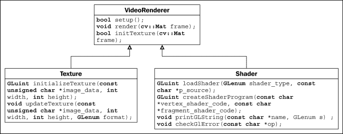

# 第九章.移动或可穿戴平台上的基于增强现实的可视化

在本章中，我们将涵盖以下主题：

+   入门 I：在 Android 上设置 OpenCV

+   入门 II：使用 OpenCV 访问相机实时流

+   使用纹理映射显示实时视频处理

+   基于增强现实的真实场景数据可视化

# 简介

数字图形领域自计算机发明以来，传统上一直生活在自己的虚拟世界中。通常，计算机生成的内容没有意识到用户，以及信息在现实世界中与用户的关联性。应用程序总是简单地等待用户的命令，如鼠标或键盘输入。在计算机应用程序早期设计中，一个主要的限制因素是计算机通常坐在办公室或家庭环境中的桌子上。缺乏移动性和无法与环境或用户互动，最终限制了现实世界交互式可视化应用程序的发展。

今天，随着移动计算的演变，我们重新定义了我们与世界日常互动的许多方面——例如，通过使用手机通过 GPS 进行导航的应用程序。然而，移动设备并没有使用户能够无缝地与世界互动，反而将用户从现实世界中引开。特别是，就像在桌面计算的前几代中一样，用户仍然需要从现实世界转向虚拟世界（在许多情况下，只是一个微小的移动屏幕）。

**增强现实**（AR）的概念是通过融合虚拟世界（由计算机生成）与现实世界，重新连接用户与真实世界的一步。这与虚拟现实截然不同，在虚拟现实中，用户沉浸于虚拟世界，脱离了现实世界。例如，AR 的一个典型实现是使用视频透视显示器，其中虚拟内容（如计算机生成的地图）与真实场景（通过内置摄像头连续捕获）相结合。现在，用户与真实世界互动——更接近真正以人为中心的应用。

最终，AR 功能的可穿戴计算设备（如 Meta 的 AR 眼镜，具有世界上第一个具有 3D 手势检测和 3D 立体显示的全息界面）的出现将创造一个新的计算时代，将极大地改变人类与计算机互动的方式。对数据可视化感兴趣的开发商现在有一套更以人为中心且直观的工具。这种设计，不用说，真正将人、机器和现实世界连接在一起。将信息直接叠加到现实世界（例如，通过叠加虚拟导航地图）要强大得多，也更有意义。

本章介绍了创建第一个基于 AR 的应用程序的基本构建块，该应用程序运行在基于 Android 的移动设备上：OpenCV 用于计算机视觉，OpenGL 用于图形渲染，以及 Android 的传感器框架用于交互。有了这些工具，以前只在好莱坞电影制作中存在的图形渲染能力现在可以随时供每个人使用。虽然我们本章将只关注基于 Android 的移动设备的使用，但本章介绍的基于 AR 的数据可视化的概念框架可以类似地扩展到最先进的可穿戴计算平台，如 Meta 的 AR 眼镜。

# 开始：在 Android 上设置 OpenCV

在本节中，我们将概述在 Android 平台上设置 OpenCV 库的步骤，这是启用访问任何增强现实应用程序的核心实时相机流所必需的。

## 准备工作

我们假设 Android SDK 和 NDK 的配置与第七章中讨论的完全一致，即《在移动平台上使用 OpenGL ES 3.0 进行实时图形渲染的介绍》，*在移动平台上使用 OpenGL ES 3.0 进行实时图形渲染的介绍*。在这里，我们增加了对 Android OpenCV 的支持。我们将从上一章的现有代码结构中导入和集成 OpenCV 库。

## 如何操作...

在这里，我们描述了设置 OpenCV 库的主要步骤，主要是路径设置和 Java SDK 项目预配置：

1.  在[`sourceforge.net/projects/opencvlibrary/files/opencv-android/3.0.0/OpenCV-3.0.0-android-sdk-1.zip`](http://sourceforge.net/projects/opencvlibrary/files/opencv-android/3.0.0/OpenCV-3.0.0-android-sdk-1.zip)下载 OpenCV for Android SDK 包，版本 3.0.0（`OpenCV-3.0.0-android-sdk-1.zip`）。

1.  将包（`OpenCV-3.0.0-android-sdk-1.zip`）移动到第七章中创建的`3rd_party/android`文件夹中，即《在移动平台上使用 OpenGL ES 3.0 进行实时图形渲染的介绍》，*在移动平台上使用 OpenGL ES 3.0 进行实时图形渲染的介绍*。

1.  使用以下命令解压包

    ```cpp
    cd 3rd_party/android && unzip OpenCV-3.0.0-android-sdk-1.zip

    ```

1.  然后在项目文件夹中（例如`ch9/code/opencv_demo_1`），运行以下脚本以初始化 Android 项目。请注意，`3rd_party`文件夹假设与上一章中的顶级目录相同：

    ```cpp
    #!/bin/bash
    ANDROID_SDK_PATH="../../../3rd_party/android/android-sdk-macosx"
    OPENCV_SDK_PATH="../../../3rd_party/android/OpenCV-android-sdk"

    #initialize the SDK Java library
    $ANDROID_SDK_PATH/tools/android update project -p $OPENCV_SDK_PATH/sdk/java -s --target "android-18"
    $ANDROID_SDK_PATH/tools/android update project -p . -s --target "android-18" --library $OPENCV_SDK_PATH/sdk/java
    ```

1.  最后，在构建脚本`jni/Android.mk`中包含 OpenCV 路径。

    ```cpp
    LOCAL_PATH:= $(call my-dir)
    #build the OpenGL + OpenCV code in JNI
    include $(CLEAR_VARS)
    #including OpenCV SDK
    include ../../../3rd_party/android/OpenCV-android-sdk/sdk/native/jni/OpenCV.mk
    ```

现在，该项目已与 OpenCV 库相连，既包括 Java 端也包括本地端。

接下来，我们必须在手机上安装 OpenCV 管理器。OpenCV 管理器允许我们创建应用程序，而无需将所有必需的库静态链接，这是推荐的。要安装软件包，我们可以从同一项目文件夹（`ch9/code/opencv_demo_1`）中执行以下 `adb` 命令。再次注意 `3rd_party` 文件夹的相对位置。您也可以在 Android SDK 文件夹中执行此命令，并相应地修改 `3rd_party` 文件夹的相对路径。

```cpp
$ANDROID_SDK_PATH/platform-tools/adb install ../../../3rd_party/android/OpenCV-android-sdk/apk/OpenCV_3.0.0_Manager_3.00_armeabi-v7a.apk
```

在我们成功完成设置后，我们就准备好在手机上创建我们的第一个 OpenCV Android 应用程序了。

## 参见

Windows 用户应参考以下关于使用 OpenCV 进行 Android 开发的教程，以获取设置说明：[`docs.opencv.org/doc/tutorials/introduction/android_binary_package/android_dev_intro.html`](http://docs.opencv.org/doc/tutorials/introduction/android_binary_package/android_dev_intro.html) 和 [`docs.opencv.org/doc/tutorials/introduction/android_binary_package/dev_with_OCV_on_Android.html#native-c`](http://docs.opencv.org/doc/tutorials/introduction/android_binary_package/dev_with_OCV_on_Android.html#native-c)。

关于在 Android 应用中使用 OpenCV 的更多信息，请参阅 [`opencv.org/platforms/android.html`](http://opencv.org/platforms/android.html) 在线文档。

# 开始 II：使用 OpenCV 访问相机实时流

接下来，我们需要演示如何将 OpenCV 集成到我们的基于 Android 的开发框架中。以下块图说明了本章将实现的核心功能和类之间的关系（本节将仅讨论与 OpenCV 介绍相关的功能或类）：


尤其是我们将演示如何从相机视频流中提取图像帧，以进行后续的图像处理步骤。OpenCV 库提供了对访问实时相机流的相机支持（视频数据流的原始数据缓冲区）以及控制相机参数。此功能允许我们以最佳分辨率、帧率和图像格式从实时预览相机中获取原始帧数据。

## 准备工作

本章中的示例基于第八章示例代码中介绍的基本结构，即 *移动设备上的交互式实时数据可视化*，它利用多点触控界面和运动传感器输入，在移动设备上实现交互式实时数据可视化。为了支持 OpenCV 所做的重大更改将在本章中突出显示。完整的代码，请从 Packt Publishing 网站下载代码包。

## 如何操作...

首先，我们将突出显示修改 Java 源文件所需的更改，以启用 OpenCV 和 OpenCV 相机模块的使用。将`GL3JNIActivity.java`（`src/com/android/gl3jni/`）重命名为`GL3OpenCVDemo.java`，并按以下方式修改代码：

1.  包含 OpenCV 库的包：

    ```cpp
    package com.android.gl3jni;
    ...
    import org.opencv.android.BaseLoaderCallback;
    import org.opencv.android.LoaderCallbackInterface;
    import org.opencv.android.OpenCVLoader;
    import org.opencv.android.CameraBridgeViewBase;
    import org.opencv.android.CameraBridgeViewBase.CvCameraViewFrame;
    import org.opencv.android.CameraBridgeViewBase.CvCameraViewListener2;
    import org.opencv.core.CvType;
    import org.opencv.core.Mat;

    import android.widget.RelativeLayout;
    import android.view.SurfaceView;
    ```

1.  将`CvCameraViewListener2`接口添加到`GL3OpenCVDemo`类：

    ```cpp
    public class GL3OpenCVDemo extends Activity implements SensorEventListener, CvCameraViewListener2{
    ```

1.  创建处理相机视图的变量：

    ```cpp
      private GL3JNIView mView=null;
      ...
      private boolean gl3_loaded = false;
      private CameraBridgeViewBase mOpenCvCameraView;
      private RelativeLayout l_layout;
    ```

1.  实现`BaseLoaderCallback`函数，用于`OpenCVLoader`：

    ```cpp
      private BaseLoaderCallback mLoaderCallback = new BaseLoaderCallback(this) {
      @Override 
      public void onManagerConnected(int status) {
        switch (status) {
          case LoaderCallbackInterface.SUCCESS:{
            Log.i("OpenCVDemo", "OpenCV loaded successfully");
            // load the library *AFTER* we have OpenCV lib ready!
            System.loadLibrary("gl3jni");
            gl3_loaded = true;

            //load the view as we have all JNI loaded 
            mView = new GL3JNIView(getApplication());
            l_layout.addView(mView);
            setContentView(l_layout);

            /* enable the camera, and push the images to the OpenGL layer */
            mOpenCvCameraView.enableView();
          } break;
          default:{
            super.onManagerConnected(status);
          } break;
        }
      }
    };
    ```

1.  实现 OpenCV 相机回调函数，并将图像数据传递到 JNI C/C++侧进行处理和渲染：

    ```cpp
    public void onCameraViewStarted(int width, int height) {
    }
    public void onCameraViewStopped() {
    }
    public Mat onCameraFrame(CvCameraViewFrame inputFrame) {
      //Log.i("OpenCVDemo", "Got Frame\n");
      Mat input = inputFrame.rgba();
      if(gl3_loaded){
        GL3JNILib.setImage(input.nativeObj);
      }
      //don't show on the java side
      return null;
    }
    ```

1.  在应用程序启动时，在`onCreate`函数中初始化相机：

    ```cpp
    @Override protected void onCreate(Bundle icicle) {
      super.onCreate(icicle);
      ...
      //setup the Java Camera with OpenCV
      setContentView(R.layout.ar);
      l_layout = (RelativeLayout)findViewById(R.id.linearLayoutRest);
      mOpenCvCameraView = (CameraBridgeViewBase)findViewById(R.id.opencv_camera_surface_view);
      mOpenCvCameraView.setVisibility( SurfaceView.VISIBLE );
      mOpenCvCameraView.setMaxFrameSize(1280, 720); /* cap it at 720 for performance issue */
      mOpenCvCameraView.setCvCameraViewListener(this);
      mOpenCvCameraView.disableView();
    }
    ```

1.  使用`OpenCVLoader`类中的异步初始化函数`initAsync`加载 OpenCV 库。此事件由之前定义的`BaseLoaderCallback mLoaderCallback`函数捕获：

    ```cpp
    @Override
    protected void onResume() {
      super.onResume();
      OpenCVLoader.initAsync(OpenCVLoader.OPENCV_VERSION_3_0_0, this, mLoaderCallback);  
      ...
    }
    ```

1.  最后，处理`onPause`事件，当应用程序不再在前台运行时，暂停相机预览：

    ```cpp
    @Override
    protected void onPause() {
      super.onPause();
      mSensorManager.unregisterListener(this);
      //stop the camera
      if(mView!=null){
        mView.onPause();
      }
      if (mOpenCvCameraView != null)
        mOpenCvCameraView.disableView();
      gl3_loaded = false;
    }
    ```

1.  现在在`GL3JNILib.java`（`src/com/android/gl3jni/`）中，添加原生的`setImage`函数以传递相机原始数据。由于源文件的简单性，此处显示了整个源文件：

    ```cpp
    package com.android.gl3jni;

    public class GL3JNILib { 
      public static native void init(int width, int height);
      public static native void step();

      //pass the image to JNI C++ side
      public static native void setImage(long imageRGBA);

      //pass the device rotation angles and the scaling factor
      public static native void resetRotDataOffset();
      public static native void setRotMatrix(float[] rotMatrix);
      public static native void setScale(float scale);
    }
    ```

1.  最后，`GL3JNIView.java`文件内的源代码几乎完全相同，除了我们提供了重置旋转数据并调用`setZOrderOnTop`函数的选项，以确保 OpenGL 层位于 Java 层之上：

    ```cpp
    class GL3JNIView extends GLSurfaceView {
      ...
      public GL3JNIView(Context context) {
        super(context);
        // Pick an EGLConfig with RGB8 color, 16-bit depth, no stencil 
        setZOrderOnTop(true);
        setEGLConfigChooser(8, 8, 8, 8, 16, 0);
        setEGLContextClientVersion(3);
        getHolder().setFormat(PixelFormat.TRANSLUCENT);
        renderer = new Renderer();
        setRenderer(renderer);
        //handle gesture input
        mScaleDetector = new ScaleGestureDetector(context, new ScaleListener());
      }
      ...
      @Override
      public boolean onTouchEvent(MotionEvent ev) {
        mScaleDetector.onTouchEvent(ev);
        int action = ev.getActionMasked();
        switch (action) {
          case MotionEvent.ACTION_DOWN:
            GL3JNILib.resetRotDataOffset();
            break;
        }
        return true;
      }
      ...
    }
    ```

1.  最后，在`main.cpp`文件中定义 JNI 原型，该文件连接所有组件，以与 Java 侧进行接口：

    ```cpp
    //external calls for Java
    extern "C" {
      JNIEXPORT void JNICALL Java_com_android_gl3jni_GL3JNILib_setImage(JNIEnv * jenv, jobject, jlong imageRGBA);
    };
    JNIEXPORT void JNICALL Java_com_android_gl3jni_GL3JNILib_setImage(
        JNIEnv * jenv, jobject, jlong imageRGBA) {
          cv::Mat* image = (cv::Mat*) imageRGBA;
          /* use mutex lock to ensure the write/read operations are synced (to avoid corrupting the frame) */
          pthread_mutex_lock(&count_mutex);
          frame = image->clone();
          pthread_mutex_unlock(&count_mutex);
          //LOGI("Got Image: %dx%d\n", frame.rows, frame.cols);
    }
    ```

1.  要访问设备相机，必须在`AndroidManifest.xml`文件中声明以下元素，以确保我们有控制相机的权限。在我们的当前示例中，我们请求访问具有自动对焦支持的前后摄像头。

    ```cpp
    <uses-permission android:name="android.permission.CAMERA"/>
    <uses-feature android:name="android.hardware.camera" android:required="false"/>
    <uses-feature android:name="android.hardware.camera.autofocus" android:required="false"/>
    <uses-feature android:name="android.hardware.camera.front" android:required="false"/>
    <uses-feature android:name="android.hardware.camera.front.autofocus" android:required="false"/>
    ```

到目前为止，我们已经开发了一个支持 OpenCV 和实时相机流的完整演示应用程序。在下一节中，我们将连接相机原始数据流到 OpenGL 层，并在 C/C++中使用 OpenCV 进行实时特征提取。

## 它是如何工作的...

在 Java 方面，我们已经集成了之前安装的 OpenCV Manager 来处理运行时所有库的动态加载。在启动应用程序时，我们必须调用`OpenCVLoader.initAsync`函数；所有与 OpenCV 相关的 JNI 库必须在 OpenCV 库成功加载后才能调用。为了同步这些操作，在我们的情况下，`callback`函数（`BaseLoaderCallback`）检查 OpenCV 初始化的状态，并且只有当 OpenCV 加载器返回成功（`LoaderCallbackInterface.SUCCESS`）时，我们才使用`System.loadLibrary`函数来初始化 OpenGL 和其他组件。为了简化，我们没有在这个示例中包含处理库加载异常的实现。

在传感器方面，我们还改变了`SensorManager`函数的实现，以返回旋转矩阵而不是欧拉角，以避免陀螺仪锁定问题（参考[`en.wikipedia.org/wiki/Gimbal_lock`](http://en.wikipedia.org/wiki/Gimbal_lock)）。我们还使用`SensorManager.remapCoordinateSystem`函数重新映射坐标（从设备方向到 OpenGL 摄像头方向）。然后，旋转矩阵通过原生调用`GL3JNILib.setRotMatrix`传递到 OpenGL 端。此外，我们可以允许用户通过触摸屏幕重置默认方向。这是通过调用`GL3JNILib.resetRotDataOffset`函数实现的，该函数使用触摸事件重置旋转矩阵。

此外，我们还添加了`OpenCV CvCameraViewListener2`接口和`CameraBridgeViewBase`类，以实现原生摄像头访问。`CameraBridgeViewBase`类是一个基本类，用于处理与 Android Camera 类和 OpenCV 库的交互。它负责控制摄像头，例如分辨率，以及处理帧，例如更改图像格式。客户端实现`CvCameraViewListener`以接收回调事件。在当前实现中，我们手动将分辨率设置为 1280 x 720。然而，我们可以根据应用需求增加或减少分辨率。最后，颜色帧缓冲区以 RGBA 格式返回，数据流将被传输到 JNI C/C++端并使用纹理映射进行渲染。

# 使用纹理映射显示实时视频

今天，大多数手机都配备了能够捕捉高质量照片和视频的摄像头。例如，三星 Galaxy Note 4 配备了 1600 万像素的后置摄像头以及 370 万像素的前置摄像头，用于视频会议应用。有了这些内置摄像头，我们可以在户外和室内环境中录制具有卓越图像质量的高清视频。这些成像传感器的普遍存在以及移动处理器的计算能力不断提高，现在使我们能够开发出更多交互式应用，例如实时跟踪物体或人脸。

通过结合 OpenGL 和 OpenCV 库，我们可以创建交互式应用，这些应用可以对现实世界进行实时视频处理，以注册和增强 3D 虚拟信息到现实世界物体上。由于这两个库都是硬件加速的（GPU 和 CPU 优化），探索使用这些库以获得实时性能非常重要。

在上一节中，我们介绍了提供访问实时摄像头流的框架。在这里，我们将创建一个完整的演示，使用基于 OpenGL 的纹理映射技术（类似于在第四章（ch04.html "第四章. 使用纹理映射渲染 2D 图像和视频"）到第六章（ch06.html "第六章. 使用 OpenGL 渲染立体 3D 模型"）中介绍的）显示实时视频，并使用 OpenCV 处理视频流以执行角点检测。为了帮助读者理解完成演示所需的额外代码，以下是实现概述图：



## 准备工作

此演示需要完成所有*准备工作*步骤，以便在 Android 设备上使用 OpenCV 捕获实时视频流。着色器程序和纹理映射代码的实现基于第八章（ch08.html "第八章. 移动设备上的交互式实时数据可视化"）中的演示。

## 如何做...

在本地代码方面，创建两个新的文件，分别命名为`VideoRenderer.hpp`和`VideoRenderer.cpp`。这些文件包含使用纹理映射渲染视频的实现。此外，我们还将从上一章导入`Texture.cpp`和`Texture.hpp`文件来处理纹理创建。

在`VideoRenderer.hpp`文件中，按照以下方式定义`VideoRenderer`类（每个函数的详细信息将在下一节讨论）：

```cpp
#ifndef VIDEORENDERER_H_
#define VIDEORENDERER_H_
//The shader program and basic OpenGL calls
#include <Shader.hpp>
//for texture support
#include <Texture.hpp>
//opencv support
#include <opencv2/core/core.hpp>
#include <opencv2/imgproc/imgproc.hpp>
#include <opencv2/highgui/highgui.hpp>

class VideoRenderer {
  public:
    VideoRenderer();
    virtual ~VideoRenderer();
    //setup all shader program and texture mapping variables
    bool setup();
    bool initTexture(cv::Mat frame);
    //render the frame on screen
    void render(cv::Mat frame);

  private:
    //this handles the generic camera feed view
    GLuint gProgram;
    GLuint gvPositionHandle;
    GLuint vertexUVHandle;
    GLuint textureSamplerID;
    GLuint texture_id;
    Shader shader;
};

#endif /* VIDEORENDERER_H_ */
```

在`VideoRenderer.cpp`文件中，我们实现了三个关键成员函数（`setup`、`initTexture`和`render`）。以下是完整的实现：

1.  包含`VideoRenderer.hpp`头文件，定义打印调试信息的函数，并定义构造函数和析构函数：

    ```cpp
    #include "VideoRenderer.hpp"

    #define  LOG_TAG    "VideoRenderer"
    #define  LOGI(...) __android_log_print(ANDROID_LOG_INFO,LOG_TAG,__VA_ARGS__)
    #define  LOGE(...) __android_log_print(ANDROID_LOG_ERROR,LOG_TAG,__VA_ARGS__)

    VideoRenderer::VideoRenderer() {
    }

    VideoRenderer::~VideoRenderer() {
    }
    ```

1.  定义顶点和片段着色器以及相关的配置步骤（类似于第八章，*移动设备上的交互式实时数据可视化*）：

    ```cpp
    bool VideoRenderer::setup(){
      // Vertex shader source code
      const char g_vshader_code[] =
      "#version 300 es\n"
      "layout(location = 1) in vec4 vPosition;\n"
      "layout(location = 2) in vec2 vertexUV;\n"
      "out vec2 UV;\n"
      "void main() {\n"
        "  gl_Position = vPosition;\n"
        "  UV=vertexUV;\n"
      "}\n";
      // fragment shader source code
      const char g_fshader_code[] =
      "#version 300 es\n"
      "precision mediump float;\n"
      "out vec4 color;\n"
      "uniform sampler2D textureSampler;\n"
      "in vec2 UV;\n"
      "void main() {\n"
        "  color = vec4(texture(textureSampler, UV).rgb, 1.0);\n"
      "}\n";

      LOGI("setupVideoRenderer");
      gProgram =   shader.createShaderProgram(g_vshader_code, g_fshader_code);
      if (!gProgram) {
        LOGE("Could not create program.");
        return false;
      }

      gvPositionHandle = glGetAttribLocation(gProgram, "vPosition");
      shader.checkGlError("glGetAttribLocation");
      LOGI("glGetAttribLocation(\"vPosition\") = %d\n",
      gvPositionHandle);

      vertexUVHandle = glGetAttribLocation(gProgram, "vertexUV");
      shader.checkGlError("glGetAttribLocation");
      LOGI("glGetAttribLocation(\"vertexUV\") = %d\n",
      vertexUVHandle);

      textureSamplerID = glGetUniformLocation(gProgram, "textureSampler");
      shader.checkGlError("glGetUniformLocation");
      LOGI("glGetUniformLocation(\"textureSampler\") =   %d\n", textureSamplerID);

      return true;
    }
    ```

1.  初始化并绑定纹理：

    ```cpp
    bool VideoRenderer::initTexture(cv::Mat frame){
      texture_id = initializeTexture(frame.data, frame.size().width, frame.size().height);
      //binds our texture in Texture Unit 0
      glActiveTexture(GL_TEXTURE0);
      glBindTexture(GL_TEXTURE_2D, texture_id);
      glUniform1i(textureSamplerID, 0);

      return true;
    }
    ```

1.  使用纹理映射在屏幕上渲染摄像头流：

    ```cpp
    void VideoRenderer::render(cv::Mat frame){
      //our vertices
      const GLfloat g_vertex_buffer_data[] = {
        1.0f,1.0f,0.0f,
        -1.0f,1.0f,0.0f,
        -1.0f,-1.0f,0.0f,
        1.0f,1.0f
        ,0.0f,
        -1.0f,-1.0f,0.0f,
        1.0f,-1.0f,0.0f
      };
      //UV map for the vertices
      const GLfloat g_uv_buffer_data[] = {
        1.0f, 0.0f,
        0.0f, 0.0f,
        0.0f, 1.0f,
        1.0f, 0.0f,
        0.0f, 1.0f,
        1.0f, 1.0f
      };

      glUseProgram(gProgram);
      shader.checkGlError("glUseProgram");

      glEnableVertexAttribArray(gvPositionHandle);
      shader.checkGlError("glEnableVertexAttribArray");

      glEnableVertexAttribArray(vertexUVHandle);
      shader.checkGlError("glEnableVertexAttribArray");

      glVertexAttribPointer(gvPositionHandle, 3, GL_FLOAT, GL_FALSE, 0, g_vertex_buffer_data);
      shader.checkGlError("glVertexAttribPointer");

      glVertexAttribPointer(vertexUVHandle, 2, GL_FLOAT, GL_FALSE, 0, g_uv_buffer_data);
      shader.checkGlError("glVertexAttribPointer");

      updateTexture(frame.data, frame.size().width, frame.size().height, GL_RGBA);

      //draw the camera feed on the screen
      glDrawArrays(GL_TRIANGLES, 0, 6);
      shader.checkGlError("glDrawArrays");

      glDisableVertexAttribArray(gvPositionHandle);
      glDisableVertexAttribArray(vertexUVHandle);
    }
    ```

为了进一步提高代码的可读性，我们将着色器程序和纹理映射的处理封装在`Shader.hpp`（`Shader.cpp`）和`Texture.hpp`（`Texture.cpp`）中，分别。这里我们只展示头文件以示完整，并请读者参考 Packt Publishing 网站上的代码包以获取每个函数的详细实现。

下面是`Shader.hpp`文件：

```cpp
#ifndef SHADER_H_
#define SHADER_H_

#define GLM_FORCE_RADIANS
#include <jni.h>
#include <android/log.h>
#include <stdio.h>
#include <stdlib.h>
#include <math.h>
#include <GLES3/gl3.h>
#include <glm/glm.hpp>
#include <glm/gtc/matrix_transform.hpp>

class Shader {
  public:
  Shader();
  virtual ~Shader();
  GLuint loadShader(GLenum shader_type, const char*p_source);
  GLuint createShaderProgram(const char*vertex_shader_code, const char*fragment_shader_code);
  void printGLString(const char *name, GLenum s) ;
  void checkGlError(const char* op);
};

#endif /* SHADER_H_ */
```

`Texture.hpp`文件应如下所示：

```cpp
#ifndef TEXTURE_HPP
#define TEXTURE_HPP

#include <GLES3/gl3.h>

class Texture {
  public:
    Texture();
    virtual ~Texture();
    GLuint initializeTexture(const unsigned char *image_data, int width, int height);
    void updateTexture(const unsigned char *image_data, int width, int height, GLenum format);
};

#endif
```

最后，我们按照以下步骤在`main.cpp`文件中整合所有内容：

1.  包含所有头文件。特别是，包含 `pthread.h` 以处理同步和 OpenCV 库以进行图像处理。

    ```cpp
    ...
    #include <pthread.h>
    #include <Texture.hpp>
    #include <Shader.hpp>
    #include <VideoRenderer.hpp>

    //including opencv headers
    #include <opencv2/core/core.hpp>
    #include <opencv2/imgproc/imgproc.hpp>
    #include <opencv2/highgui/highgui.hpp>
    #include <opencv2/features2d/features2d.hpp>
    ...
    ```

1.  定义 `VideoRenderer` 和 `Shader` 对象，以及 `pthread_mutex_t` 锁变量，以使用互斥锁处理数据复制的同步。

    ```cpp
    //mutex lock for data copying
    pthread_mutex_t count_mutex;
    ...
    //pre-set image size.
    const int IMAGE_WIDTH = 1280;
    const int IMAGE_HEIGHT = 720; 

    bool enable_process = true;
    //main camera feed from the Java side
    cv::Mat frame;
    //all shader related code
    Shader shader;
    //for video rendering
    VideoRenderer videorenderer;
    ```

1.  在 `setupGraphics` 函数中设置 `VideoRenderer` 对象并初始化纹理。

    ```cpp
    bool setupGraphics(int w, int h) {
      ...
      videorenderer.setup();
      //template for the first texture
      cv::Mat frameM(IMAGE_HEIGHT, IMAGE_WIDTH, CV_8UC4, cv::Scalar(0,0,0,255));
      videorenderer.initTexture(frameM);
      frame = frameM;
      ...
      return true;
    }
    ```

1.  创建一个 `processFrame` 辅助函数，用于处理使用 OpenCV 的 `goodFeaturesToTrack` 函数的特征提取。该函数还直接在帧上绘制结果以进行可视化。

    ```cpp
    void processFrame(cv::Mat *frame_local){
      int maxCorners = 1000;
      if( maxCorners < 1 ) { maxCorners = 1; }
      cv::RNG rng(12345);
      // Parameters for Shi-Tomasi algorithm
      std::vector<cv::Point2f> corners;
      double qualityLevel = 0.05;
      double minDistance = 10;
      int blockSize = 3;
      bool useHarrisDetector = false;
      double k = 0.04;

      // Copy the source image
      cv::Mat src_gray;
      cv::Mat frame_small;
      cv::resize(*frame_local, frame_small, cv::Size(), 0.5, 0.5, CV_INTER_AREA);
      cv::cvtColor(frame_small, src_gray, CV_RGB2GRAY );

      // Apply feature extraction
      cv::goodFeaturesToTrack( src_gray, corners, maxCorners, qualityLevel, minDistance, cv::Mat(), blockSize, useHarrisDetector, k );

      // Draw corners detected on the image
      int r = 10;
      for( int i = 0; i < corners.size(); i++ )
      {
        cv::circle(*frame_local, 2*corners[i], r, cv::Scalar(rng.uniform(0,255), 
        rng.uniform(0,255), rng.uniform(0,255), 255), -1, 8, 0 );
      }
      //LOGI("Found %d features", corners.size());
    }
    ```

1.  在 `renderFrame` 函数中实现带有互斥锁同步的帧复制（以避免由于共享内存和竞态条件导致的帧损坏）。使用 OpenCV 库处理帧，并使用 OpenGL 纹理映射技术渲染结果。

    ```cpp
    void renderFrame() {
      shader.checkGlError("glClearColor");
      glClearColor(0.0f, 0.0f, 0.0f, 0.0f);
      glClear(GL_COLOR_BUFFER_BIT | GL_DEPTH_BUFFER_BIT);

      shader.checkGlError("glClear");

      pthread_mutex_lock(&count_mutex);
      cv::Mat frame_local = frame.clone();
      pthread_mutex_unlock(&count_mutex);

      if(enable_process)
        processFrame(&frame_local);

      //render the video feed on screen
      videorenderer.render(frame_local);
      //LOGI("Rendering OpenGL Graphics");
    }
    ```

1.  定义 JNI 原型并实现 `setImage` 函数，该函数通过互斥锁确保数据复制受保护，从 Java 端接收原始相机图像数据。还实现了 `toggleFeatures` 函数，用于在触摸屏幕时开启和关闭特征跟踪。

    ```cpp
    extern "C" {
    ..
      JNIEXPORT void JNICALL Java_com_android_gl3jni_GL3JNILib_setImage(JNIEnv * jenv, jobject, jlong imageRGBA);
      //toggle features
      JNIEXPORT void JNICALL Java_com_android_gl3jni_GL3JNILib_toggleFeatures(JNIEnv * jenv, jobject);
    };

    JNIEXPORT void JNICALL Java_com_android_gl3jni_GL3JNILib_toggleFeatures(JNIEnv * env, jobject obj){
      //toggle the processing on/off 
      enable_process = !enable_process;
    }
    JNIEXPORT void JNICALL Java_com_android_gl3jni_GL3JNILib_setImage(
      JNIEnv * jenv, jobject, jlong imageRGBA) {
      cv::Mat* image = (cv::Mat*) imageRGBA;
      /* use mutex lock to ensure the write/read operations are synced (to avoid corrupting the frame) */
      pthread_mutex_lock(&count_mutex);
      frame = image->clone();
      pthread_mutex_unlock(&count_mutex);
      //LOGI("Got Image: %dx%d\n", frame.rows, frame.cols);
    }
    ```

    

生成的图像是来自 OpenCV 的后处理帧。除了显示原始视频帧外，我们还展示了我们的实现可以轻松扩展以支持使用 OpenCV 的实时视频处理。`processFrame` 函数使用 OpenCV 的 `goodFeaturesToTrack` 角点检测功能，并将从场景中提取的所有角点叠加到图像上。

图像特征是许多跟踪算法（如**同时定位与建图**（**SLAM**））以及识别算法（如基于图像的匹配）的基本元素。例如，使用 SLAM 算法，我们可以构建环境的地图，并同时跟踪设备在空间中的位置。这些技术在 AR 应用中特别有用，因为我们始终需要将虚拟世界与真实世界对齐。接下来，我们可以看到在手机上实时运行的特征提取算法（角点检测）。


## 它是如何工作的...

`VideoRenderer` 类有两个主要功能：

+   创建处理纹理映射的着色器程序（`Shader.cpp` 和 `Texture.cpp`）。

+   使用 OpenCV 的原始相机帧更新纹理内存。每次从 OpenCV 获取新帧时，我们调用渲染函数，该函数更新纹理内存并在屏幕上绘制帧。

`main.cpp` 文件连接了实现的所有组件，并封装了所有交互逻辑。它与 Java 端（例如，`setImage`）接口，我们将所有计算密集型任务卸载到 C++原生端。例如，`processFrame` 函数处理 OpenCV 视频处理管道，我们可以高效地处理内存 I/O 和并行化。另一方面，`VideoRenderer` 类通过 OpenGL 加速渲染，以在移动平台上实现实时性能。

可能有人会注意到，Android 上的 OpenGL 和 OpenCV 的实现与桌面版本大多相同。这就是我们采用跨平台语言的关键原因，我们可以轻松地将代码扩展到任何未来平台，而无需付出太多努力。

## 参见

在移动平台上，计算资源尤其有限，因此优化所有可用硬件资源的利用非常重要。基于 OpenGL 的硬件加速可以减少我们在图形处理器上渲染 2D 和 3D 图形的大部分开销。在不久的将来，特别是随着支持 GPGPU 的移动处理器的出现（例如，Nvidia 的 K1 移动处理器），我们将为计算机视觉算法提供更多并行化处理，并为移动设备上的许多应用提供实时性能。例如，Nvidia 现在正式支持其所有即将推出的移动处理器上的 CUDA，因此我们将在移动平台上看到更多实时图像处理、机器学习（如深度学习算法）和高性能图形的出现。更多信息请参阅以下网站：[`developer.nvidia.com/embedded-computing`](https://developer.nvidia.com/embedded-computing)。

# 基于增强现实的真实世界场景数据可视化

在我们的最终演示中，我们将通过在现实世界的物体和场景上叠加 3D 数据来介绍基于 AR 的数据可视化的基本框架。我们应用相同的 GPU 加速模拟模型，并使用基于传感器的跟踪方法将其注册到世界中。以下图表展示了本章实现中的最终架构：


## 准备工作

这个最终演示整合了本章之前介绍的所有概念，并需要在基于 Android 的手机上使用 OpenCV 捕获（并可能处理）实时视频流。为了减少代码的复杂性，我们创建了增强现实层（`AROverlayRenderer`），我们可以在未来使用更先进的算法来改进层的注册、对齐和校准。

## 如何实现...

让我们在 `AROverlayRenderer.hpp` 文件中定义一个新的类 `AROverlayRenderer`：

```cpp
#ifndef AROVERLAYRENDERER_H_
#define AROVERLAYRENDERER_H_

#include<Shader.hpp>

class AROverlayRenderer {
  public:
    AROverlayRenderer();
    virtual ~AROverlayRenderer();
    void render();
    bool setup();
    void setScale(float s);

    void setOldRotMatrix(glm::mat4 r_matrix);
    void setRotMatrix(glm::mat4 r_matrix);
    void resetRotMatrix();
    void setScreenSize(int width, int height);
    void setDxDy (float dx, float dy);
  private:
    //this renders the overlay view
    GLuint gProgramOverlay;
    GLuint gvOverlayPositionHandle;
    GLuint gvOverlayColorHandle;
    GLuint matrixHandle;
    GLuint sigmaHandle;
    GLuint scaleHandle;

  //vertices for the grid
  int grid_size;
  GLfloat *gGrid;
  GLfloat sigma;

  //for handling the object rotation from user
  GLfloat dx, dy;
  GLfloat rotX, rotY;

  //the view matrix and projection matrix
  glm::mat4 g_view_matrix;
  glm::mat4 g_projection_matrix;

  //initial position of the camera
  glm::vec3 g_position;
  //FOV of the virtual camera in OpenGL
  float g_initial_fov;

  glm::mat4 rotMatrix;
  glm::mat4 old_rotMatrix;

  float scale;
  int width;
  int height;

  Shader shader;
  void computeProjectionMatrices();
  void computeGrid();
};

#endif /* AROVERLAYRENDERER_H_ */
```

现在在 `AROverlayRenderer.cpp` 文件中实现 `AROverlayRenderer` 成员函数：

1.  包含 `AROverlayRenderer.hpp` 头文件，并定义打印消息以及构造函数和析构函数：

    ```cpp
    #include "AROverlayRenderer.hpp"

    #define  LOG_TAG    "AROverlayRenderer"
    #define  LOGI(...) __android_log_print(ANDROID_LOG_INFO,LOG_TAG,__VA_ARGS__)
    #define  LOGE(...) __android_log_print(ANDROID_LOG_ERROR,LOG_TAG,__VA_ARGS__)

    AROverlayRenderer::AROverlayRenderer() {
      //initial position of the camera
      g_position = glm::vec3( 0.0f, 0.0f, 0.0f );

      //FOV of the virtual camera in OpenGL
      //45 degree FOV
      g_initial_fov = 45.0f*glm::pi<float>()/180.0f;

      /* scale for the panel and other objects, allow for zooming in with pinch. */
      scale = 1.0f;
      dx=0.0f; dy=0.0f;
      rotX=0.0f, rotY=0.0f;
      sigma = 0;

      grid_size = 400;
      //allocate memory for the grid
      gGrid = (GLfloat*) malloc(sizeof(GLfloat)*grid_size*grid_size*3);
    }

    AROverlayRenderer::~AROverlayRenderer() {
      //delete all dynamically allocated objects here
      free(gGrid);
    }
    ```

1.  初始化模拟的网格模式：

    ```cpp
    void AROverlayRenderer::computeGrid(){
      float grid_x = grid_size;
      float grid_y = grid_size;
      unsigned int data_counter = 0;
      //define a grid ranging from -1 to +1
      for(float x = -grid_x/2.0f; x<grid_x/2.0f; x+=1.0f){
        for(float y = -grid_y/2.0f; y<grid_y/2.0f; y+=1.0f){
          float x_data = x/grid_x;
          float y_data = y/grid_y;
          gGrid[data_counter] = x_data;
          gGrid[data_counter+1] = y_data;
          gGrid[data_counter+2] = 0;
          data_counter+=3;
        }
      }
    }
    ```

1.  设置用于叠加图形的着色器程序：

    ```cpp
    bool AROverlayRenderer::setup(){
      // Vertex shader source code
      static const char g_vshader_code_overlay[] =
        "#version 300 es\n"
        "in vec4 vPosition;\n"
        "uniform mat4 MVP;\n"
        "uniform float sigma;\n"
        "uniform float scale;\n"
        "out vec4 color_based_on_position;\n"
        "// Heat map generator                \n"
        "vec4 heatMap(float v, float vmin, float vmax){\n"
        "    float dv;\n"
        "    float r=1.0, g=1.0, b=1.0;\n"
        "  if (v < vmin){\n"
        "    v = vmin;}\n"
        "  if (v > vmax){\n"
        "    v = vmax;}\n"
        "  dv = vmax - vmin;\n"
        "  if (v < (vmin + 0.25 * dv)) {\n"
          "    r = 0.0;\n"
          "    g = 4.0 * (v - vmin) / dv;\n"
        "  } else if (v < (vmin + 0.5 * dv)) {\n"
          "    r = 0.0;\n"
          "    b = 1.0 + 4.0 * (vmin + 0.25 * dv - v) / dv;\n"
        "  } else if (v < (vmin + 0.75 * dv)) {\n"
          "    r = 4.0 * (v - vmin - 0.5 * dv) / dv;\n"
          "    b = 0.0;\n"
        "  } else {\n"
          "    g = 1.0 + 4.0 * (vmin + 0.75 * dv - v) / dv;\n"
          "    b = 0.0;\n"
        "  }\n"
        "    return vec4(r, g, b, 0.1);\n"
      "}\n"
      "void main() {\n"
        "  //Simulation on GPU \n"
        "  float x_data = vPosition.x;\n"
        "  float y_data = vPosition.y;\n"
        "  float sigma2 = sigma*sigma;\n"
        "  float z = exp(-0.5*(x_data*x_data)/(sigma2)-0.5*(y_data*y_data)/(sigma2));\n"
        "  vec4 position = vPosition;\n"
        "  position.z = z*scale;\n"
        "  position.x = position.x*scale;\n"
        "  position.y = position.y*scale;\n"
        "  gl_Position = MVP*position;\n"
        "  color_based_on_position = heatMap(position.z, 0.0, 0.5);\n"
        "  gl_PointSize = 5.0*scale;\n"
      "}\n";

      // fragment shader source code
      static const char g_fshader_code_overlay[] =
        "#version 300 es\n"
          "precision mediump float;\n"
        "in vec4 color_based_on_position;\n"
        "out vec4 color;\n"
        "void main() {\n"
          "  color = color_based_on_position;\n"
        "}\n";

        //setup the shader for the overlay
        gProgramOverlay = shader.createShaderProgram(g_vshader_code_overlay, g_fshader_code_overlay);
      if (!gProgramOverlay) {
        LOGE("Could not create program for overlay.");
        return false;
      }
      //get handlers for the overlay side
      matrixHandle = glGetUniformLocation(gProgramOverlay, "MVP");
      shader.checkGlError("glGetUniformLocation");
      LOGI("glGetUniformLocation(\"MVP\") = %d\n",
          matrixHandle);

      gvOverlayPositionHandle = glGetAttribLocation(gProgramOverlay, "vPosition");
      shader.checkGlError("glGetAttribLocation");
      LOGI("glGetAttribLocation(\"vPosition\") = %d\n",
          gvOverlayPositionHandle);

      sigmaHandle = glGetUniformLocation(gProgramOverlay, "sigma");
      shader.checkGlError("glGetUniformLocation");
      LOGI("glGetUniformLocation(\"sigma\") = %d\n",
          sigmaHandle);

      scaleHandle = glGetUniformLocation(gProgramOverlay, "scale");
      shader.checkGlError("glGetUniformLocation");
      LOGI("glGetUniformLocation(\"scale\") = %d\n",
        scaleHandle);

      computeGrid();
    }
    ```

1.  创建辅助函数，从触摸界面设置比例、屏幕大小和旋转变量：

    ```cpp
    void AROverlayRenderer::setScale(float s) {
      scale = s;
    }

    void AROverlayRenderer::setScreenSize(int w, int h) {
      width = w;
      height = h;
    }

    void AROverlayRenderer::setRotMatrix(glm::mat4 r_matrix){
      rotMatrix= r_matrix;
    }

    void AROverlayRenderer::setOldRotMatrix(glm::mat4 r_matrix){
      old_rotMatrix = r_matrix;
    }

    void AROverlayRenderer::resetRotMatrix(){
      old_rotMatrix = rotMatrix;
    }

    void AROverlayRenderer::setDxDy(float dx, float dy){
      //update the angle of rotation for each
      rotX += dx/width;
      rotY += dy/height;
    }
    ```

1.  根据相机参数计算投影和视图矩阵：

    ```cpp
    void AROverlayRenderer::computeProjectionMatrices(){
      //direction vector for z
      glm::vec3 direction_z(0.0, 0.0, -1.0);
      //up vector
      glm::vec3 up = glm::vec3(0.0, -1.0, 0.0);

      float aspect_ratio = (float)width/(float)height;
      float nearZ = 0.01f;
      float farZ = 50.0f;
      float top = tan(g_initial_fov/2*nearZ);
      float right = aspect_ratio*top;
      float left = -right;
      float bottom = -top;
      g_projection_matrix = glm::frustum(left, right, bottom, top, nearZ, farZ);

      g_view_matrix = glm::lookAt(
        g_position,           // camera position
        g_position+direction_z, //viewing direction 
        up                  // up direction
      );
    }
    ```

1.  在屏幕上渲染图形：

    ```cpp
    void AROverlayRenderer::render(){
      //update the variables for animations
      sigma+=0.002f;
      if(sigma>0.5f){
        sigma = 0.002f;
      }
      glUseProgram(gProgramOverlay);
      /* Retrieve the View and Model matrices and apply them to the rendering */
      computeProjectionMatrices();
      glm::mat4 projection_matrix = g_projection_matrix;
      glm::mat4 view_matrix = g_view_matrix;
      glm::mat4 model_matrix = glm::mat4(1.0);

      model_matrix = glm::translate(model_matrix, glm::vec3(0.0f, 0.0f, scale-5.0f));
      //X,Y reversed for the screen orientation
      model_matrix = glm::rotate(model_matrix, rotY*glm::pi<float>(), glm::vec3(-1.0f, 0.0f, 0.0f));
      model_matrix = glm::rotate(model_matrix, rotX*glm::pi<float>(), glm::vec3(0.0f, -1.0f, 0.0f));
      model_matrix = glm::rotate(model_matrix, 90.0f*glm::pi<float>()/180.0f, glm::vec3(0.0f, 0.0f, 1.0f));
      /* the inverse of rotational matrix is to counter-  rotate the graphics to the center. This allows us to reset the camera orientation since R*inv(R) = I. */
      view_matrix = rotMatrix*glm::inverse(old_rotMatrix)*view_matrix;

      //create the MVP (model view projection) matrix
      glm::mat4 mvp = projection_matrix * view_matrix * model_matrix;
      glUniformMatrix4fv(matrixHandle, 1, GL_FALSE, &mvp[0][0]);
      shader.checkGlError("glUniformMatrix4fv");
      glEnableVertexAttribArray(gvOverlayPositionHandle);
      shader.checkGlError("glEnableVertexAttribArray");
      glVertexAttribPointer(gvOverlayPositionHandle, 3, GL_FLOAT, GL_FALSE, 0, gGrid);
      shader.checkGlError("glVertexAttribPointer");
      glUniform1f(sigmaHandle, sigma);
      shader.checkGlError("glUniform1f");

      glUniform1f(scaleHandle, 1.0f);
      shader.checkGlError("glUniform1f");

      //draw the overlay graphics
      glDrawArrays(GL_POINTS, 0, grid_size*grid_size);
      shader.checkGlError("glDrawArrays");
      glDisableVertexAttribArray(gvOverlayPositionHandle);
    }
    ```

1.  最后，我们只需要对之前演示中使用的 `main.cpp` 文件进行少量修改，即可在实时视频流（现实场景）上启用 AR 叠加。这里只展示了突出所需修改的相关代码片段（从 Packt Publishing 网站下载完整代码）：

    ```cpp
    ...
    #include <AROverlayRenderer.hpp>
    ...
    AROverlayRenderer aroverlayrenderer;
    ...
    bool setupGraphics(int w, int h) {
      ...
      videorenderer.setup();
      aroverlayrenderer.setup();
      ...
      videorenderer.initTexture(frame);
      aroverlayrenderer.setScreenSize(width, height);
    }

    void renderFrame() {
      ...
      videorenderer.render(frame);
      aroverlayrenderer.render();
    }
    ...
    extern "C" {
      ...
      JNIEXPORT void JNICALL Java_com_android_gl3jni_GL3JNILib_setScale(JNIEnv * env, jobject obj,  jfloat jscale);
      JNIEXPORT void JNICALL Java_com_android_gl3jni_GL3JNILib_resetRotDataOffset(JNIEnv * env, jobject obj);
      JNIEXPORT void JNICALL Java_com_android_gl3jni_GL3JNILib_setRotMatrix (JNIEnv *env, jobject obj, jfloatArray ptr);
      JNIEXPORT void JNICALL Java_com_android_gl3jni_GL3JNILib_setDxDy(JNIEnv *env, jobject obj,  jfloat dx,  jfloat dy);
    };
    ...
    JNIEXPORT void JNICALL Java_com_android_gl3jni_GL3JNILib_resetRotDataOffset (JNIEnv * env, jobject obj){
      aroverlayrenderer.resetRotMatrix();
    }
    JNIEXPORT void JNICALL Java_com_android_gl3jni_GL3JNILib_setScale (JNIEnv * env, jobject obj, jfloat jscale)
    {
      aroverlayrenderer.setScale(jscale);
      LOGI("Scale is %lf", scale);
    }
    JNIEXPORT void JNICALL Java_com_android_gl3jni_GL3JNILib_resetRotDataOffset (JNIEnv * env, jobject obj){
      aroverlayrenderer.resetRotMatrix();
    }
    JNIEXPORT void JNICALL Java_com_android_gl3jni_GL3JNILib_setRotMatrix (JNIEnv *env, jobject obj, jfloatArray ptr) {
      jsize len = env->GetArrayLength(ptr);
      jfloat *body = env->GetFloatArrayElements(ptr,0);
      //should be 16 elements from the rotation matrix
      glm::mat4 rotMatrix(1.0f);
      int count = 0;
      for(int i = 0; i<4; i++){
        for(int j=0; j<4; j++){
          rotMatrix[i][j] = body[count];
          count++;
        }
      }
      env->ReleaseFloatArrayElements(ptr, body, 0);
      aroverlayrenderer.setRotMatrix(rotMatrix);
    }
    JNIEXPORT void JNICALL Java_com_android_gl3jni_GL3JNILib_setDxDy(JNIEnv * env, jobject obj, jfloat dx, jfloat dy){
      aroverlayrenderer.setDxDy(dx, dy);
    }
    ```

使用这个框架，可以在不同的现实世界物体或表面上叠加任何虚拟数据集，并启用真正交互式应用程序，使用移动设备内置的传感器和手势界面以及新兴的最先进可穿戴 AR 眼镜。以下是一些结果，展示了基于 AR 的实时、交互式 3-D 数据集（在这种情况下，高斯分布）叠加在现实场景中的可视化：


## 它是如何工作的...

启用 AR 应用程序的关键要素是将信息叠加到现实世界中的能力。`AROverlayRenderer` 类实现了所有 AR 应用程序必需的核心功能。首先，我们创建一个虚拟相机，其参数与手机上实际相机的参数相匹配。相机的参数，如**视野**（**FOV**）和宽高比，目前是硬编码的，但我们可以很容易地在 `computeProjectionMatrices` 函数中修改它们。然后，为了在现实世界和虚拟世界之间进行注册，我们根据设备的方向控制虚拟相机的方向。方向值通过从 Java 端传递的旋转矩阵（`setRotMatrix` 函数）输入，我们将其直接应用于 OpenGL 相机视图矩阵（`view_matrix`）。此外，我们使用手机的触摸屏界面来重置旋转矩阵的默认方向。这是通过在触摸事件（`resetRotDataOffset` 函数）上存储旋转矩阵值来实现的，并将旋转矩阵的逆应用于视图矩阵（这相当于将相机向相反方向旋转）。

在用户交互方面，我们已启用捏合和拖动选项以支持与虚拟对象的动态交互。在捏合事件发生时，我们获取缩放因子，并通过在 `model_matrix` 变量上应用 `glm::translate` 函数将渲染对象放置在更远的位置。此外，我们通过捕获 Java 端的拖动动作（`setDxDy` 函数）来旋转虚拟对象。用户可以通过在屏幕上拖动手指来控制虚拟对象的朝向。这些多指手势共同实现了一个高度交互的应用程序界面，使用户能够直观地改变渲染对象的视角。

由于校准过程的潜在复杂性，我们在此不涵盖这些细节。然而，高级用户可以参考以下网站以进行更深入的讨论：[`docs.opencv.org/doc/tutorials/calib3d/camera_calibration/camera_calibration.html`](http://docs.opencv.org/doc/tutorials/calib3d/camera_calibration/camera_calibration.html)。

此外，当前的注册过程完全基于 IMU，并且不支持平移（即虚拟对象不会与真实世界精确移动）。为了解决这个问题，我们可以应用各种图像处理技术，如均值漂移跟踪、基于特征的跟踪和基于标记的跟踪，以恢复摄像头的完整 6 自由度 (DOF) 模型。例如，SLAM 是恢复 6 自由度摄像头模型的一个很好的候选方案，但其详细实现超出了本章的范围。

## 参见

事实上，在本章中，我们只涵盖了增强现实 (AR) 的基础知识。AR 领域在学术界和工业界都变得越来越热门。如果您对在最新的可穿戴计算平台上实现 AR 数据可视化应用（例如，Meta 提供的具有 3D 手势输入和 3D 立体输出的平台）感兴趣，请访问以下网站：

+   [`www.getameta.com/`](https://www.getameta.com/)

+   [`www.eyetap.org/publications/`](http://www.eyetap.org/publications/)

关于 AR 眼镜的更多技术细节，请参阅以下出版物：

+   Raymond Lo, Alexander Chen, Valmiki Rampersad, Jason Huang, Han Wu, Steve Mann (2013). "基于 3D 摄像头自手势感知的增强现实系统," IEEE 国际技术与社会研讨会 (ISTAS) 2013，第 20-31 页。

+   Raymond Lo, Valmiki Rampersad, Jason Huang, Steve Mann (2013). "三维高动态范围监控用于 3D 范围感测摄像头," IEEE 国际技术与社会研讨会 (ISTAS) 2013，第 255-265 页。

+   Raymond Chun Hing Lo, Steve Mann, Jason Huang, Valmiki Rampersad, and Tao Ai. 2012\. "高动态范围 (HDR) 视频图像处理用于数字玻璃." 在第 20 届 ACM 国际多媒体会议 (MM '12) 论文中。ACM，纽约，纽约，美国，第 1477-1480 页。

+   史蒂夫·曼恩，雷蒙德·洛，黄杰森，瓦尔米基·兰佩拉斯，瑞安·詹森，爱涛（2012）。"HDRchitecture: 极大动态范围的实时立体 HDR 成像"，载于 ACM SIGGRAPH 2012 新兴技术（SIGGRAPH '12）。
