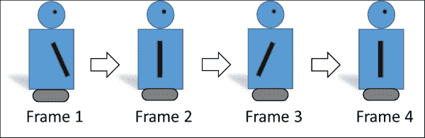
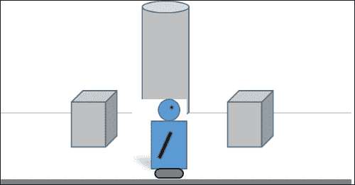
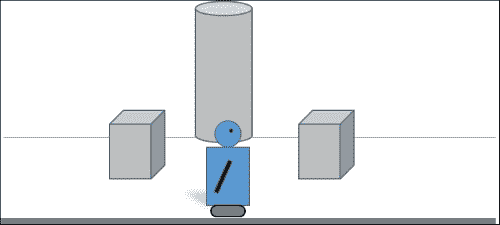
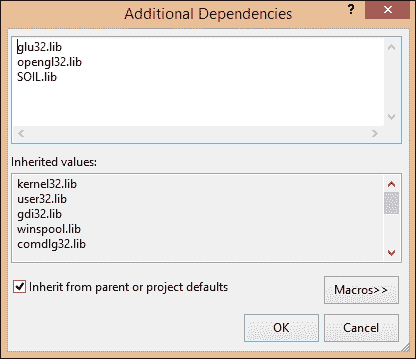
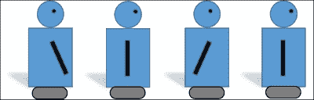
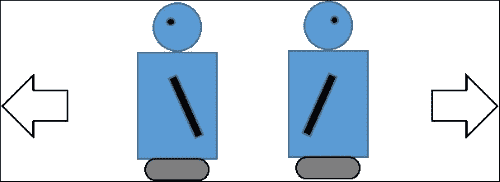
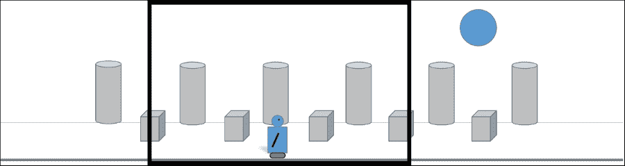

# 第三章。角色问题

没有角色，视频游戏就不会有趣。本章全部关于让您的游戏角色栩栩如生。游戏通常有两种角色。首先，有你扮演的角色或角色。这些被称为玩家角色。由计算机控制的角色被称为非玩家角色或 NPC。

本章将解释如何为您的游戏创建角色。在这个过程中，我们将涵盖：

+   **小精灵**：小精灵是玩家在游戏中与之交互的任何纹理。这包括玩家角色、NPC 和游戏中的其他物体。

+   **动画**：使图像看起来像是在移动的艺术称为动画。您将学习如何使用多个图像使您的纹理在屏幕上移动。

+   **图集**：图像可以逐个存储，也可以组合成单个复合纹理，称为**精灵图集**或**图集**。

# 小精灵式地说

多年前，一位计算机爱好者发明了一种酷炫的方法，在计算机屏幕上渲染和显示小图像。这些图像会在屏幕上移动，甚至与其他物体发生碰撞。这位计算机爱好者将这些图像称为小精灵，这个名字一直沿用至今。

## 小精灵与无小精灵

小精灵只是代表屏幕上对象的图像。小精灵的例子包括角色、NPC、武器、外星太空船和岩石。任何可以在屏幕上移动或被游戏中的其他物体击中的对象都是小精灵。不与其他物体交互的对象不是小精灵。例子可能包括背景中的山脉、地面和天空。

显然，要实现一个游戏，既需要小精灵也需要无小精灵。此外，这种区分有点任意。有些游戏将游戏中的所有图像都实现为小精灵，因为将游戏中的所有图像以一致的方式处理更为方便。

## 翻页动画

你小时候有没有制作过翻页书？为了唤起你的记忆，这里是如何工作的。首先，你在笔记本上画了一个简单的图形。然后你翻到下一页，画了同样的图像，但这次有一点不同。你继续在连续的页面上画一些与原始图像略有不同的图像。当你完成时，你翻动笔记本边缘的页面，看到了看似是一部原始的电影。


另一个例子是电影。电影以帧的形式记录在胶片上。然后，胶片通过放映机播放，放映机逐帧播放电影。如前所述，关键是至少以每秒 24 帧的速度播放帧，以欺骗眼睛，使其认为有流畅的运动。

## 帧动画

2D 精灵动画的工作方式与翻页书类似。艺术家绘制图像的连续版本。当这些图像依次渲染时，它们看起来就像在移动。动画中的每一张图像被称为一帧。至少需要 24 或更多 fps 才能创建一个令人信服的动画。显然，更多的帧将创建一个更平滑的动画。



上一张图像展示了一个使用四个帧的非常简单的动画。唯一改变的是机器人的手臂位置。从**帧 1**到**帧 4**依次播放，手臂看起来会从前面摆动到后面，然后再向前摆动。如果将这个动作与将精灵向右移动结合起来，那么你将得到一个简单的行走机器人的动画。

### 小贴士

如前例所示，我并不是一个艺术家！我是一个程序员，所以这本书中创建的艺术将会非常简单。实际上，在游戏的初始阶段，使用非常简单的占位符艺术是很常见的。这允许程序员在艺术团队在后期阶段将真正的艺术作品放入游戏的同时测试游戏的功能。

# 创建精灵

专业 2D 艺术家使用 Adobe Photoshop 等程序为游戏创建 2D 资源。不幸的是，我们没有时间教你如何使用像 Photoshop 这样复杂的程序。

如果你想要尝试创建自己的资源，那么你可以尝试在任意基于 Windows 的电脑上安装的 Paint 程序。如果你真的想深入挖掘 2D 艺术创作而不需要深入挖掘你的银行账户，那么你可以下载 GIMP ([`www.gimp.org`](http://www.gimp.org))，这是一个免费的全功能 2D 图像处理程序。

## 使用 PNGs

在上一章中，我们加载并渲染了一个位图文件。结果发现，位图并不是处理精灵的最佳格式，因为它们比 PNGs 占用更多的文件空间（因此，更多的内存），并且位图不支持透明度。

### 小贴士

在我们有了允许直接将透明度编码为图像一部分的图像格式之前，我们使用特定的背景颜色，并期望我们的图像库在处理图像时移除该颜色。由于洋红色在图像中很少使用，因此经常被用作背景颜色。

位图文件的大小比 PNGs 大，因为它们不是以压缩格式存储的。压缩允许图像以更小的空间存储，这在设备上，如手机上，可能非常重要。

PNGs 使用**无损**压缩算法进行存储。无损意味着为了达到压缩效果，不会牺牲图像质量。其他格式，如 JPEG，可以以压缩格式存储，但使用的是**有损**算法，这会降低图像质量。

PNG 还支持使用**alpha**通道进行透明度。除了存储每个像素的红色、绿色和蓝色成分（RGB）外，PNG 还存储每个像素的透明度在 alpha 通道中（RGBA）。

您会记得，在前一章中，所有纹理在游戏中都表示为矩形。然而，真实形状并不是矩形的。树木、汽车和机器人都有更复杂的形状。

如果我们使用位图作为所有图像，那么纹理的全矩形将渲染，遮挡掉精灵后面的所有内容。在以下图像中，我们的机器人在管道前通过，管道的一部分被位图的空白区域遮挡。



在 PNG 图像中，我们将空白区域设置为透明。在以下图像中，管道不再被机器人的图像透明部分遮挡：



在上一章中，我们编写了加载 BMP 文件的代码。通常，我们不得不编写不同的代码来加载 PNG 文件。实际上，我们必须为每种我们想要处理的图像类型编写一个加载器。

幸运的是，有人已经做了所有这些工作，并将其作为一个名为**SOIL**（**简单 OpenGL 图像库**）的库提供。您可以从[`www.lonesock.net/soil.html`](http://www.lonesock.net/soil.html)下载您的副本。

使用 SOIL 库有几个优点：

+   我们不再需要担心为每种我们想要使用的图像类型编写自己的加载器。SOIL 支持 BMP、PNG 以及许多其他格式。

+   文件加载不是完全抽象的。您不必担心代码是如何工作的，只需知道它确实可以工作。

+   SOIL 具有其他可能有用的功能（例如，能够写入图像文件）。

下载文件以压缩文件夹的形式提供。一旦解压文件夹，您将看到一个名为`Simple OpenGL Image Library`的文件夹。这个文件夹包含很多文件，但我们只需要`soil.h`。

### 链接到 SOIL 库

现在，是时候将 SOIL 库添加到我们的项目中了：

1.  找到您解压 SOIL 代码的文件夹。

1.  打开`lib`文件夹，找到`libSOIL.a`。

1.  将`libSOIL.a`复制到包含**RoboRacer2D**源代码的文件夹中。

1.  打开**RoboRacer2D**项目。

1.  在**解决方案资源管理器**面板中右键单击**RoboRacer2D**项目，并选择**属性**。

1.  对于**配置**下拉框，请确保您选择了**所有配置**。

1.  打开**配置属性**分支，然后是**链接器**分支。

1.  选择**输入**选项。

1.  点击**附加依赖项**下拉菜单，选择**<编辑…**>。

1.  在对话框窗口中分别输入`opengl32.lib`和`glu32.lib`，然后点击**确定**。

### 小贴士

Windows 的库文件通常以 `.lib` 结尾，而为 UNIX 编写的文件以 `.a` 结尾。标准的 SOIL 发行版附带 UNIX 库；您需要使用 Windows 库。您可以在网上找到 `SOIL.lib`，使用 SOIL 源代码创建自己的 Windows 库文件，或者从本书的网站上下载 SOIL.lib。

### 包含 SOIL 头文件

接下来，我们需要将 SOIL 头文件复制到我们的项目中，并在代码中包含它：

1.  找到您解压 SOIL 代码的文件夹。

1.  打开 `src` 文件夹并找到 `SOIL.h`。

1.  将 `SOIL.h` 复制到包含 **RoboRacer2D** 源代码的文件夹。

1.  打开 **RoboRacer2D** 项目。

1.  打开 `RoboRacer2D.cpp`。

1.  将 `#include "SOIL.h"` 添加到包含列表中。

### 小贴士

您会注意到 SOIL 包中还有许多其他文件被解压出来。这包括所有原始源文件以及几个如何使用库的示例。

### 打开图像文件

现在，我们准备编写一个加载图像文件的函数。我们将传递文件名，该函数将返回一个表示 OpenGL 纹理句柄的整数。

以下代码行使用 SOIL 加载图像：

```cpp
GLuint texture = SOIL_load_OGL_texture
(
  imageName,
  SOIL_LOAD_AUTO,
  SOIL_CREATE_NEW_ID,
  0
);
```

所有工作都是由 `SOIL_load_OGL_texture` 调用完成的。这四个参数是最通用的设置：

+   第一个参数是图像文件的路径和文件名。

+   第二个参数告诉 SOIL 如何加载图像（在这种情况下，我们指示 SOIL 自动解决问题）。

+   第三个参数告诉 SOIL 为我们创建一个 OpenGL 纹理 ID。

+   如果使用，第四个参数可以设置为几个标志位，告诉 SOIL 执行一些自定义处理。我们目前没有使用这个，所以我们只发送一个 `0`。

我们将使用代码，例如这个，将图像加载到我们的 `sprite` 类中。

### 小贴士

如果您想查看所有可用的选项，请打开 `SOIL.h` 并阅读源代码注释。

## 编写精灵类代码

为了轻松地将精灵集成到我们的游戏中，我们将创建一个专门处理精灵的类。

让我们考虑我们想要的功能：

+   一组图像。

+   表示当前帧的索引。

+   一个变量，存储总帧数。

+   变量用于存储精灵当前 *x* 和 *y* 位置。对于这个游戏，这将图像的左上角。

+   一个变量，存储精灵当前速度的 x 和 y 分量（如果没有移动则为 `0`）。

+   存储图像宽度和高度的变量。注意，如果精灵有多个图像，它们必须都是相同的大小。

+   一个布尔值，告诉我们这个精灵是否与其他精灵发生碰撞。

+   一个布尔值，告诉我们这个精灵应该正常渲染还是翻转。

+   一个布尔值，告诉我们这个精灵现在是否可见。

+   一个布尔值，告诉我们这个精灵现在是否是活跃的。

除了这些属性外，我们还希望能够以几种方式操作精灵。我们可能需要添加以下方法：

+   向精灵添加图像

+   更新精灵的位置

+   更新精灵的动画帧

+   将精灵渲染到屏幕上

打开您的游戏项目，并添加一个名为 `Sprite.cpp` 的新类，以及一个名为 `Sprite.h` 的头文件。

### 小贴士

在 Visual Studio 中，在解决方案资源管理器窗格中右键单击 **头文件** 过滤器。然后选择 **添加类**。给类命名为 `Sprite` 并点击 **添加**。Visual Studio 将为您创建模板头文件和源代码文件。

使用以下代码为 `Sprite.h`：

```cpp
#pragma once:
#include <gl\gl.h>

class Sprite
{
  public:
struct Point
{
  GLfloat x;
  GLfloat y;
};

   struct Size
 {
  GLfloat width;
  GLfloat height;
 };
 struct Rect
 {
  GLfloat top;
  GLfloat bottom;
  GLfloat left;
  GLfloat right;
 };

  protected:
  GLuint* m_textures;
  unsigned int m_textureIndex;
  unsigned int m_currentFrame;
  unsigned int m_numberOfFrames;
  GLfloat m_animationDelay;
  GLfloat m_animationElapsed;

  Point m_position;
  Size m_size;
  GLfloat m_velocity;

  bool m_isCollideable;
  bool m_flipHorizontal;
  bool m_flipVertical;
  bool m_isVisible;
  bool m_isActive;
  bool m_useTransparency;
  bool m_isSpriteSheet;

  public:
  Sprite(const unsigned int m_pNumberOfTextures);
  ~Sprite();

  void Update(const float p_deltaTime);
  void Render();

  const bool AddTexture(const char* p_fileName, const bool p_useTransparency = true);
   const GLuint GetCurrentFrame() {
  if (m_isSpriteSheet)
  {
   return m_textures[0];
  }
  else
  {
   return m_textures[m_currentFrame];
  }
 }

  void SetPosition(const GLfloat p_x, const GLfloat p_y) { m_position.x = p_x; m_position.y = p_y; }
   void SetPosition(const Point p_position) { m_position = p_position; }
 const Point GetPosition() { return m_position; }
 const Size GetSize() const { return m_size; }
void SetFrameSize(const GLfloat p_width, const GLfloat p_height) {
m_size.width = p_width; m_size.height = p_height; }
  void SetVelocity(const GLfloat p_velocity) { m_velocity = p_velocity; }
  void SetNumberOfFrames(const unsigned int p_frames) { m_numberOfFrames = p_frames;  }

  const bool isCollideable() const { return m_isCollideable; }
void IsCollideable(const bool p_value) { m_isCollideable = p_value;  }
  void FlipHorizontal(const bool p_value) { m_flipHorizontal = p_value; }
  void FlipVertical(const bool p_value) { m_flipVertical = p_value; }
  void IsActive(const bool p_value) { m_isActive = p_value; }
  const bool IsActive() const { return m_isActive; }
void IsVisible(const bool p_value) { m_isVisible = p_value; }
const bool IsVisible() const { return m_isVisible; }
void UseTransparency(const bool p_value) { m_useTransparency = p_value; }
};
```

我知道，代码很多！这是一个典型的面向对象类，由受保护的属性和公共方法组成。让我们看看这个类的功能：

+   `#pragma once`：这是一个 C++指令，告诉 Visual Studio 如果它们在多个源文件中包含，则只包含文件一次。

    ### 小贴士

    另一个选择是使用头文件保护：

    ```cpp
    #ifndef SPRITE_H
    #define SPRITE_H
    ...code...
    #endif
    ```

    如果 `SPRITE_H` 已经被定义，这将阻止代码被包含。那么头文件已经被包含，并且不会重复包含。

+   我们在这个头文件中包含 `gl.h`，因为我们需要访问标准的 OpenGL 变量类型。

+   在课堂内部，我们定义了两个非常有用的结构：点和矩形。我们与点和矩形打交道如此频繁，以至于拥有简单结构来保存它们的值是有意义的。

+   成员变量如下：

    +   `m_textures` 是一个 `GLuint` 数组，将动态保存构成这个精灵的所有 OpenGL 纹理句柄。

    +   `m_textureIndex` 从零开始，每次向精灵添加纹理时都会递增。

    +   `m_currentFrame` 从零开始，每次我们想要前进动画帧时都会递增。

    +   `m_numberOfFrames` 存储组成我们动画的总帧数。

    +   `m_animationDelay` 是我们想要在动画帧前进之前经过的秒数。这允许我们控制动画的速度。

    +   `m_animationElapsed` 将保存自上次动画帧更改以来经过的时间。

    +   `m_position` 保存精灵的 `x` 和 `y` 位置。

    +   `m_size` 保存精灵的 `width` 和 `height`。

    +   `m_velocity` 保存精灵的速度。较大的值将使精灵在屏幕上移动得更快。

    +   `m_isCollideable` 是一个标志，告诉我们这个精灵是否与屏幕上的其他对象发生碰撞。当设置为 `false` 时，精灵将穿过屏幕上的其他对象。

    +   `m_flipHorizontal` 是一个标志，告诉类在渲染时精灵图像是否应该水平翻转。这种技术可以通过重用单个纹理来保存纹理内存，用于左右移动。

    +   `m_flipVertical` 是一个标志，告诉类在渲染时精灵图像是否应该垂直翻转。

    +   `m_isVisible` 是一个标志，表示精灵是否当前在游戏中可见。如果设置为 `false`，则精灵将不会被渲染。

    +   `m_isActive`是一个标志，表示精灵当前是否激活。如果设置为 false，则不会更新精灵的动画帧和位置。

    +   `m_useTransparency`是一个标志，它告诉精灵类是否在精灵中使用 alpha 通道。由于 alpha 检查成本较高，我们将其设置为 false，用于没有透明度（如游戏背景）的图像。

+   `m_isSpriteSheet`是一个标志，它告诉精灵类是否使用单个纹理来保存此精灵的所有帧。如果设置为`true`，则每个帧都作为单独的纹理加载。

+   接下来，我们有以下方法：

    +   `Sprite`是一个构造函数，它接受一个参数`p_numberOfTextures`。我们必须告诉类在创建精灵时将使用多少纹理，以便为纹理动态数组分配正确的内存量。

    +   `~Sprite`是类的析构函数。

    +   将使用`Update`来更新当前动画帧和精灵的当前位置。

    +   将使用`Render`来实际在屏幕上显示精灵。

    +   `AddTexture`在精灵创建后使用，用于添加所需的纹理。

    +   当精灵被渲染时，使用`GetCurrentFrame`来确定要渲染的精灵帧。

+   剩余的方法只是访问器方法，允许您修改类属性。

接下来，让我们开始类的实现。打开`Sprite.cpp`并添加以下代码：

```cpp
#include "stdafx.h"
#include "Sprite.h"
#include "SOIL.h"

Sprite::Sprite(const unsigned int p_numberOfTextures)
{
  
  m_textures = new GLuint[p_numberOfTextures];
  m_textureIndex = 0;
  m_currentFrame = 0;
  m_numberOfFrames = 0;
  m_animationDelay = 0.25f;
  m_animationElapsed = 0.0f;
  m_position.x = 0.0f;
  m_position.y = 0.0f;
  m_size.height = 0.0f;
  m_size.width = 0.0f;
  m_velocity = 0.0f;

  m_isCollideable = true;
  m_flipHorizontal = false;
  m_flipVertical = false;
  m_isVisible = false;
  m_isActive = false;
  m_isSpriteSheet = false;
}

Sprite::~Sprite()
{
  delete[] m_textures;
}
```

下面是实现代码的一些细节：

+   除了`stdafx.h`和`Sprite.h`，我们还包含了`SOIL.h`，因为这是我们实际用来加载纹理的代码块。

+   `Sprite`构造函数：

    +   根据给定的`p_numberOfTextures`动态为`m_textures`数组分配空间。

    +   初始化所有其他类属性。请注意，大多数布尔属性都设置为`false`。结果是，新创建的精灵将不会激活或可见，直到我们明确将其设置为激活和可见。

+   `~Sprite`析构函数释放了用于`m_textures`数组的内存。

我们将接下来实现`Update`、`Render`和`AddTexture`方法。

### 小贴士

你可能已经注意到，我在代码中的许多变量前都加上了`m_`或`p_`前缀。`m_`总是用来作为类属性（或成员变量）名称的前缀，而`p_`用来作为函数中用作参数的变量的前缀。如果一个变量没有前缀，它通常是一个局部变量。

## 创建精灵帧

我们已经讨论了如何通过绘制图像的多个帧来创建 2D 动画，每个帧都略有不同。必须记住的关键点是：

+   每个框架必须具有完全相同的尺寸

+   图像在框架中的放置必须保持一致

+   只有图像中应该移动的部分应该从一帧到另一帧发生变化。

## 保存每一帧

保存帧的一个技巧是将每个帧保存为其自己的图像。由于你最终将会有很多精灵和帧需要处理，因此为所有图像制定一个一致的命名约定非常重要。例如，对于之前展示的三个帧的机器人动画，我们可能会使用以下文件名：

+   `robot_left_00.png`

+   `robot_left_01.png`

+   `robot_left_02.png`

+   `robot_left_03.png`

+   `robot_right_00.png`

+   `robot_right_01.png`

+   `robot_right_02.png`

+   `robot_right_03.png`

游戏中的每个图像都应该使用相同的命名机制。这将在编码动画系统时为你节省无尽的麻烦。

### 小贴士

你应该将所有图像保存在名为“resources”的文件夹中，该文件夹应与包含源文件的文件夹位于同一位置。

## 从单个纹理加载精灵

让我们看看加载每个帧都保存为单独文件的精灵的代码：

```cpp
robot_right = new Sprite(4);
 robot_right->SetFrameSize(100.0f, 125.0f);
 robot_right->SetNumberOfFrames(4);
 robot_right->SetPosition(0, screen_height - 130.0f);
 robot_right->AddTexture("resources/robot_right_00.png");
 robot_right->AddTexture("resources/robot_right_01.png");
 robot_right->AddTexture("resources/robot_right_02.png");
 robot_right->AddTexture("resources/robot_right_03.png");
```

关于前面代码的重要点：

+   我们创建了一个新的精灵类实例来存储信息。我们必须告诉精灵类为这个精灵分配 4 个纹理的空间。

+   我们首先存储每个帧的宽度和高度。在这种情况下，这恰好是构成这个精灵的每个纹理的宽度和高度。由于构成特定精灵的每个纹理都必须具有相同的尺寸，我们只需要调用一次。

+   然后我们存储这个精灵中的帧数。这似乎与我们在构造函数中指定的纹理数量重复。然而，正如你将在下一节中看到的，纹理的数量并不总是等于帧的数量。

+   我们现在将每个纹理添加到精灵中。精灵类会为我们分配必要的内存。

## 创建精灵图

存储精灵的另一种方法是使用精灵图。精灵图将特定动画的所有精灵存储在一个文件中。精灵通常组织成条带。



由于每个帧的尺寸相同，我们可以将每个帧在特定动画中的位置计算为从精灵图中的第一个帧的偏移量。

### 小贴士

你可以在[`www.varcade.com/blog/glueit-sprite-sheet-maker-download/`](http://www.varcade.com/blog/glueit-sprite-sheet-maker-download/)下载一个名为**GlueIt**的小程序。这个小程序允许你指定几个单独的图像，然后它会将这些图像粘合到一个精灵图中。

## 加载精灵图

以下代码加载了一个存储为精灵图的精灵：

```cpp
 robot_right_strip = new Sprite(1);
 robot_right_strip->SetFrameSize(125.0f, 100.0f);
 robot_right_strip->SetNumberOfFrames(4);
 robot_right_strip->SetPosition(0, screen_height - 130.0f);
 robot_right_strip->AddTexture("resources/robot_right_strip.png");
```

这段代码与我们之前用来创建具有单个纹理的精灵的代码非常相似。然而，有一些重要的区别：

+   我们只需要为单个纹理分配空间，因为我们只加载一个纹理。这是使用精灵表的主要优势，因为加载单个大纹理比加载几个小纹理要高效得多。

+   再次强调，我们设置每个帧的宽度和高度。请注意，这些值与加载单个纹理时的值相同，因为重要的是每个帧的宽度和高度，而不是纹理的宽度和高度。

+   再次，我们存储这个精灵的帧数。这个精灵仍然有四个帧，尽管所有四个帧都存储在一个单独的图像中。

+   我们然后向精灵添加单个图像。

### 小贴士

当我们准备好渲染动画的每一帧时，精灵类将负责根据当前帧和每帧的宽度计算渲染精灵条的确切部分。

## 加载我们的精灵

以下代码显示了我们将用于将精灵加载到游戏中的完整代码。打开 **RoboRacer2D** 项目并打开 `RoboRacer.cpp`。首先我们需要包含 Sprite 头文件：

```cpp
#include "Sprite.h"
```

接下来，我们需要一些全局变量来存储我们的精灵。在代码的变量声明部分添加此代码（在所有函数之前）：

```cpp
Sprite* robot_left;
Sprite* robot_right;
Sprite* robot_right_strip;
Sprite* robot_left_strip;
Sprite* background;
Sprite* player;
```

我们为游戏直到此点需要的每个精灵创建了指针：

+   一个用于将机器人向左移动的精灵

+   一个用于将机器人向右移动的精灵

+   一个用于背景的精灵

### 小贴士

为了让您更容易地处理两种类型的精灵，我为每个机器人方向定义了两个精灵。例如，`robot_left` 将定义由单个纹理组成的精灵，而 `robot_left_strip` 将定义由单个精灵表组成的精灵。通常情况下，你不会在单个游戏中使用两者！

现在，添加 `LoadTextures` 函数：

```cpp
const bool LoadTextures()
{
  background = new Sprite(1);
  background->SetFrameSize(1877.0f, 600.0f);
  background->SetNumberOfFrames(1);
  background->AddTexture("resources/background.png", false);

  robot_right = new Sprite(4);
  robot_right->SetFrameSize(100.0f, 125.0f);
  robot_right->SetNumberOfFrames(4);
  robot_right->SetPosition(0, screen_height - 130.0f);
  robot_right->AddTexture("resources/robot_right_00.png");
  robot_right->AddTexture("resources/robot_right_01.png");
  robot_right->AddTexture("resources/robot_right_02.png");
  robot_right->AddTexture("resources/robot_right_03.png");

  robot_left = new Sprite(4);
  robot_left->SetFrameSize(100.0f, 125.0f);
  robot_left->SetNumberOfFrames(4);
  robot_left->SetPosition(0, screen_height - 130.0f);
  robot_left->AddTexture("resources/robot_left_00.png");
  robot_left->AddTexture("resources/robot_left_01.png");
  robot_left->AddTexture("resources/robot_left_02.png");
  robot_left->AddTexture("resources/robot_left_03.png");

  robot_right_strip = new Sprite(1);
  robot_right_strip->SetFrameSize(125.0f, 100.0f);
  robot_right_strip->SetNumberOfFrames(4);
  robot_right_strip->SetPosition(0, screen_height - 130.0f);
  robot_right_strip->AddTexture("resources/robot_right_strip.png");

  robot_left_strip = new Sprite(1);
  robot_left_strip->SetFrameSize(125.0f, 100.0f);
  robot_left_strip->SetNumberOfFrames(4);
  robot_right_strip->SetPosition(0, screen_height - 130.0f);
  robot_left_strip->AddTexture("resources/robot_left_strip.png");

  background->IsVisible(true);
  background->IsActive(true);
  background->SetVelocity(-50.0f);

  robot_right->IsActive(true);
  robot_right->IsVisible(true);
  robot_right->SetVelocity(50.0f);

  player = robot_right;
  player->IsActive(true);
  player->IsVisible(true);
  player->SetVelocity(50.0f);

  return true;
}
```

这段代码与之前向您展示的加载精灵的代码完全相同。它只是更全面：

+   `LoadTexures` 加载游戏中需要的所有精灵（包括重复的 *strip* 版本，这样你可以看到使用精灵表与单个纹理之间的区别）。

+   `SetPosition` 用于设置机器人精灵的初始位置。请注意，我们不对背景精灵这样做，因为它的位置从 `(0, 0)` 开始，这是默认值。

+   `SetVisible` 和 `SetActive` 用于设置 `background` 精灵和 `robot_left_strip` 精灵为活动状态和可见状态。所有其他精灵都将保持非活动状态和不可见状态。

由于纹理的加载在游戏中只需要发生一次，我们将添加调用此操作的 `StartGame` 函数。修改 `RoboRacer.cpp` 中的 `StartGame` 函数：

```cpp
void StartGame()
{
  LoadTextures();
}
```

加载纹理的最后一步是在我们的精灵类中实现 `AddTexture` 方法。打开 `Sprite.cpp` 并添加以下代码：

```cpp
const bool Sprite::AddTexture(const char* p_imageName, const bool p_useTransparency)
{
  GLuint texture = SOIL_load_OGL_texture( p_imageName, SOIL_LOAD_AUTO, SOIL_CREATE_NEW_ID, 0 );
  if (texture == 0)
  {
    return false;
  }

  m_textures[m_textureIndex] = texture;
  m_textureIndex++;
  if (m_textureIndex == 1 && m_numberOfFrames > 1)
  {
    m_isSpriteSheet= true;
  }
  else
  {
    m_isSpriteSheet = false;
  }
  m_useTransparency = p_useTransparency;
  return true;
}
```

`AddTexture` 在创建新精灵后使用。它将所需的纹理添加到 `m_textures` 数组中。以下是它的工作原理：

+   `p_imageName` 保存要加载的图像的名称和路径。

+   `p_useTransparency`用于告诉精灵类这个图像是否使用 alpha 通道。由于我们的大部分精灵都会使用透明度，所以这个值默认设置为`true`。然而，如果我们把`p_useTransparency`设置为`false`，那么任何透明度信息都将被忽略。

+   `SOIL_load_OGL_texture`完成了加载纹理的所有工作。这个调用的参数在本章前面已经描述过。请注意，SOIL 足够智能，可以根据文件扩展名加载图像类型。

+   如果纹理成功加载，`SOIL_load_OGL_texture`将返回一个 OpenGL 纹理句柄。如果没有，它将返回`0`。通常，我们会测试这个值并使用某种错误处理，或者在任何纹理没有正确加载时退出。

+   由于`m_textures`数组是在构造函数中分配的，我们可以简单地将纹理存储在`m_textureIndex`槽中。

+   然后我们增加`m_textureIndex`。

+   我们使用一个小技巧来确定这个精灵是否使用精灵表或单个精灵。基本上，如果只有一个纹理但有很多帧，那么我们假设这个精灵使用精灵表，并将`m_isSpriteSheet`设置为`true`。

+   最后，我们将`m_useTransparency`设置为传入的值。这将在`Render`方法中稍后使用。

# 渲染

我们在创建精灵时做了很多工作，但直到我们实际使用 OpenGL 渲染精灵之前，什么都不会显示出来。渲染是针对游戏每一帧进行的。首先，调用`Update`函数来更新游戏状态，然后一切都会被渲染到屏幕上。

## 在游戏循环中添加渲染

让我们从在`GameLoop` RoboRacer.cpp 中添加对`Render`的调用开始：

```cpp
void GameLoop()
{
  Render();
}
```

在这一点上，我们只是在调用主要的`Render`函数（在下一节中实现）。每个可以绘制到屏幕上的对象也将有一个`Render`方法。这样，渲染游戏的调用将级联到游戏中每个可渲染对象。

## 实现主渲染函数

现在，是时候实现主要的`Render`函数了。将以下代码添加到`RoboRacer.cpp`中：

```cpp
void Render()
{
  glClear(GL_COLOR_BUFFER_BIT);
  glLoadIdentity();

  background->Render();
  robot_left->Render();
  robot_right->Render();
  robot_left_strip->Render();
  robot_right_strip->Render();

  SwapBuffers(hDC);
}
```

### 小贴士

注意，我们首先渲染背景。在 2D 游戏中，对象将按照先来先渲染的原则进行渲染。这样，机器人总是会渲染在背景之上。

这是它的工作方式：

+   我们总是通过重置 OpenGL 渲染管线来开始我们的渲染周期。`glClear`将整个颜色缓冲区设置为我们在初始化 OpenGL 时选择的背景颜色。`glLoadIdentify`重置渲染矩阵。

+   接下来，我们为每个精灵调用`Render`。我们不在乎精灵是否实际上是可见的。我们让精灵类的`Render`方法做出这个决定。

+   一旦所有对象都渲染完毕，我们调用`SwapBuffers`。这是一种称为双缓冲的技术。当我们渲染场景时，它实际上是在屏幕外的缓冲区中创建的。这样玩家就不会看到单独的图像，因为它们被合成为屏幕上的图像。然后，一个单独的`SwapBuffers`调用将离屏缓冲区快速复制到实际屏幕缓冲区。这使得屏幕渲染看起来更加平滑。

## 在精灵类中实现渲染

我们渲染链的最后一个步骤是在`Sprite`类中添加一个渲染方法。这将允许每个精灵将自己渲染到屏幕上。打开`Sprite.h`并添加以下代码：

```cpp
void Sprite::Render()
{
  if (m_isVisible)
  {
    if (m_useTransparency)
    {
      glEnable(GL_BLEND);
      glBlendFunc(GL_SRC_ALPHA, GL_ONE_MINUS_SRC_ALPHA);
    }

    glBindTexture(GL_TEXTURE_2D, GetCurrentFrame());

    glBegin(GL_QUADS);

    GLfloat x = m_position.x;
    GLfloat y = m_position.y;

    GLfloat w = m_size.width;
    GLfloat h = m_size.height;

    GLfloat texWidth = (GLfloat)m_textureIndex / (GLfloat)m_numberOfFrames;
    GLfloat texHeight = 1.0f;
    GLfloat u = 0.0f;
    GLfloat v = 0.0f;
    if (m_textureIndex < m_numberOfFrames)
    {
      u = (GLfloat)m_currentFrame * texWidth;
    }
    glTexCoord2f(u, v); glVertex2f(x, y);
    glTexCoord2f(u + texWidth, v); glVertex2f(x + w, y);
    glTexCoord2f(u + texWidth, v + texHeight); glVertex2f(x + w, y + h);
    glTexCoord2f(u, v + texHeight); glVertex2f(x, y + h);

    glEnd();

    if (m_useTransparency)
    {
      glDisable(GL_BLEND);
    }
  }
}
```

这可能是代码中较为复杂的部分之一，因为渲染需要考虑许多因素。精灵是否可见？我们正在渲染精灵的哪一帧？精灵应该在屏幕上的哪个位置渲染？我们是否关心透明度？让我们一步一步地分析代码：

+   首先，我们检查`m_visible`是否为`true`。如果不是，我们跳过整个渲染过程。

+   接下来，我们检查这个精灵是否使用透明度。如果是，我们必须启用透明度。实现透明度的技术术语是混合。OpenGL 必须将当前纹理与屏幕上已有的内容进行混合。`glEnable(GL_BLEND)`打开透明度混合。`glBlendFunc`的调用告诉 OpenGL 我们想要实现哪种混合类型。简单来说，`GL_SRC_ALPHA`和`GL_ONE_MIUS_SRC_ALPHA`参数告诉 OpenGL 允许背景图像通过精灵的透明部分可见。

+   `glBindTexture`告诉 OpenGL 我们现在想要使用哪个纹理。`GetCurrentFrame`的调用返回适当的 OpenGL 纹理句柄。

+   `glBegin`告诉 OpenGL 我们准备渲染特定项目。在这种情况下，我们正在渲染一个四边形。

+   接下来的两行代码根据存储在`m_position`中的`x`和`y`值设置精灵的`x`和`y`坐标。这些值在`glVertex2f`调用中使用，以定位精灵。

+   我们还需要当前帧的`width`和`height`，接下来的两行代码将它们存储为`w`和`h`以方便使用。

+   最后，我们需要知道我们将要渲染纹理的多少部分。通常，我们会渲染整个纹理。然而，在精灵图的情况下，我们只想渲染纹理的一部分。我们将在稍后更详细地讨论这一点。

+   一旦我们有了要渲染的位置、宽度和纹理部分，我们就使用`glTexCoord2f`和`glVertex2f`的成对调用，将纹理的每个角落映射到四边形上。这一点在第二章*你的视角*中进行了详细的讨论。

+   `glEnd`的调用告诉 OpenGL 我们已完成当前渲染。

+   由于 alpha 检查计算成本较高，我们在渲染结束时通过调用`glDisable(GL_BLEND)`将其关闭。

## UV 贴图

UV 贴图在第二章 *你的视角*中进行了详细说明。然而，我们在这里将进行回顾，并看看它在代码中的实现方式。

按照惯例，我们将纹理的左侧坐标分配给变量**u**，将纹理的顶部坐标分配给变量**v**。因此，这种技术被称为**uv**贴图。

OpenGL 将纹理的原点视为**uv**坐标（0, 0），将纹理的最远延伸点视为**uv**坐标（1, 1）。因此，如果我们想渲染整个纹理，我们将从（0, 0）到（1, 1）映射整个范围到四边形的四个角。但是，假设我们只想渲染图像宽度的一半（但整个高度）。在这种情况下，我们将**uv**坐标的范围从（0, 1）到（0.5, 1）映射到四边形的四个角。希望你能想象这将只渲染纹理的一半。

因此，为了渲染我们的精灵图集，我们首先通过将`m_textureIndex`除以`m_numberOfFrames`来确定每个精灵帧的宽度。对于一个有四个帧的精灵，这将给出 0.25 的值。

接下来，我们确定我们处于哪个帧。以下表格显示了具有四个帧的精灵的每个帧的**uv**范围：

| 帧 | u | v |
| --- | --- | --- |
| 0 | 0.0 to 0.25 | 0.0 to 1.0 |
| 1 | 0.25 to 0.5 | 0.0 to 1.0 |
| 2 | 0.5 to 0.75 | 0.0 to 1.0 |
| 3 | 0.75 to 1.0 | 0.0 to 1.0 |

由于我们的精灵图集是水平设置的，我们只需要关注从整个纹理中获取正确的**u**范围，而**v**的范围保持不变。

因此，以下是我们算法的工作方式：

+   如果精灵不是精灵图集，那么每个帧使用 100%的纹理，我们使用从（0,0）到（1,1）的 uv 值范围。

+   如果精灵基于精灵图集，我们通过将`m_textureIndex`除以`m_numberOfFrames`来确定每个帧的宽度（`texWidth`）。

+   我们通过将`m_currentFrame`乘以`texWidth`来确定起始的**u**值。

+   我们通过将`u` + `texWidth`来确定**u**的范围。

+   我们将**u**映射到四边形的右上角，并将`u` + `texWidth`映射到四边形的左下角。

+   **v**的映射是正常的，因为我们的精灵图集使用了纹理高度的 100%。

### 小贴士

如果你很难理解 UV 贴图，不要担心。我花费了多年的应用实践才完全理解这个概念。你可以尝试调整 uv 坐标来查看事物是如何工作的。例如，尝试设置.05、1 和 1.5，看看会发生什么！

## 一个额外的细节

我们需要仔细查看`GetCurrentFrame`的调用，以确保你理解这个函数的作用。以下是其实施方式：

```cpp
const GLuint GetCurrentFrame()
{

  if(m_isSpriteSheet)
  {
    return m_textures[0];
  }
  else
  {
    return m_textures[m_currentFrame];
  }
}
```

这里正在发生的事情：

+   如果精灵是精灵图集，我们总是返回`m_textures[0]`，因为根据定义，索引`0`处只有一个纹理。

+   如果精灵不是一个精灵表，那么我们就返回索引 `m_currentFrame` 处的纹理。`m_currentFrame` 在精灵更新方法（定义在下面）中更新。

# 一个移动的例子

我们到目前为止创建的代码创建了一个包含我们的机器人和背景的基本场景。现在，是时候利用动画的力量让我们的机器人复活了。

动画实际上有两个组成部分。首先，由于我们将按顺序播放精灵的每一帧，所以精灵本身将看起来像是在动画。如果你使用为这本书制作的库存文件，你会看到机器人的眼睛和手臂在移动。

第二个组成部分是屏幕上的移动。这是机器人的水平移动和身体动作的组合，将产生令人信服的动画。

## 将更新添加到游戏循环中

与渲染一样，我们首先在 `GameLoop` 函数中添加一个 `Update` 调用。修改 `RoboRacer.cpp` 中的 `GameLoop` 函数：

```cpp
void GameLoop(const float p_deltatTime)
{
  Update(p_deltatTime);
  Render();
}
```

我们现在有两个新功能：

+   我们添加了 `p_deltaTime` 作为参数。这代表自上一帧以来经过的毫秒数。我们将在下一节中看到它是如何计算的。

+   我们添加了对主 `Update` 函数的调用（定义在下一节）。游戏中的每个对象也将有一个 `Update` 方法。这样，更新游戏的调用将级联通过游戏中的每个对象。我们传递 `p_deltatTime`，以便后续对 `Update` 的每次调用都知道游戏中经过的时间。

## 实现主 Update 调用

我们的首要任务是实现在 `RoboRacer.cpp` 中的 `Update` 函数。将以下函数添加到 `RoboRacer.cpp` 中：

```cpp
void Update(const float p_deltaTime)
{
  background->Update(p_deltaTime);
  robot_left->Update(p_deltaTime);
  robot_right->Update(p_deltaTime);
  robot_left_strip->Update(p_deltaTime);
  robot_right_strip->Update(p_deltaTime);
}
```

注意，我们向每个精灵调用 `Update`。在这个阶段，我们并不关心精灵是否真的需要更新。这个决定将在 `Sprite` 类内部做出。

### 小贴士

在一个真正的游戏中，我们可能有一个精灵数组，并且我们会通过遍历数组并对每个元素调用更新来更新它们。由于这个游戏使用的精灵很少，所以我为每个精灵单独编写了代码。

## 在精灵类中实现 Update

现在是时候在我们的 `Sprite` 类中实现 `Update` 方法了。这个方法执行了将精灵定位并更新精灵内部动画所需的所有工作。将以下代码添加到 `Sprite.h` 中：

```cpp
void Sprite::Update(const float p_deltaTime)
{
  float dt = p_deltaTime;

  if (m_isActive)
  {
    m_animationElapsed += dt;
    if (m_animationElapsed >= m_animationDelay)
    {
      m_currentFrame++;
      if (m_currentFrame >= m_numberOfFrames) m_currentFrame = 0;
      m_animationElapsed = 0.0f;
    }
    m_position.x = m_position.x + m_velocity * dt;
  }
}
```

这段代码的作用如下：

+   为了方便，我们将 `p_deltaTime` 存储到局部变量 `dt` 中。这在测试期间有时需要将 `dt` 的值硬编码时很有用。

+   接下来，我们测试 `m_active`。如果这个值为 `false`，则跳过整个更新。

+   我们现在处理精灵的内部动画。我们首先将 `dt` 添加到 `m_animationElapsed` 中，以查看自上次帧变化以来经过的时间。如果 `m_animationElapsed` 超过 `m_animationDelay`，那么就是切换到下一帧的时候了。这意味着 `m_animationDelay` 的值越高，精灵的动画速度就越慢。

+   如果需要，我们增加`m_currentFrame`，确保一旦我们超过了总帧数，就重置为`0`。

+   如果我们只是进行帧增量，我们也希望将`m_animationElapsed`重置为`0`。

+   现在，我们根据`m_velocity`和`dt`移动精灵。请查看下一节中关于使用 delta time 计算移动的详细信息。

## 角色移动

在这个游戏版本中，我们编程我们的机器人从左到右移动屏幕。使我们的角色移动的关键是**速度**属性。速度属性告诉程序每个游戏周期移动机器人多少像素。

由于帧来得很快，速度通常很小。例如，在一个以 60 fps 运行的游戏中，速度为 1 会使机器人在每个游戏帧中移动 60 像素。精灵可能移动得太快而无法交互。

## 使用 delta time

将速度设置为固定值有一个小问题。显然，有些计算机比其他计算机快。使用固定速度，机器人在较快的计算机上会移动得更快。这是一个问题，因为它意味着在较快的计算机上玩游戏的人必须玩得更好！

我们可以使用计算机的时钟来解决此问题。计算机跟踪自上一帧开始经过的时间。在游戏术语中，这被称为**delta time**，并将其分配给一个我们可以在`Update`循环中访问的变量：

```cpp
void Update(float deltaTime);
```

在前面的函数定义中，`deltaTime`是一个浮点值。记住，我们的游戏通常以 60 fps 运行，所以`deltaTime`将是一个非常小的数字。

### 小贴士

当我们设置游戏以 60 fps 运行时，它很少以确切的那个速度运行。每个帧完成其计算所需的时间可能略有不同。delta time 告诉我们确切经过的时间，我们可以使用这些信息来调整事件的时间或速度。

让我们更详细地看看我们如何使用速度来定位我们的精灵：

```cpp
m_position.x += m_velocity * dt;
```

我们将`m_velocity`乘以`dt`，然后将这个值加到当前位置。这种技术会根据自上一帧以来经过的时间自动调整速度。如果上一帧处理时间略短，那么机器人会移动得略少。如果上一帧处理时间略长，那么我们的机器人会移动得更远。最终结果是，机器人在更快和更慢的计算机上都能保持一致的移动。

### 小贴士

对于较慢的计算机，这可能会引起其他副作用，特别是关于碰撞检测。如果时间过长，那么精灵会移动得更远。例如，这可能导致精灵在碰撞检测之前穿过墙壁。

由于`dt`是一个非常小的数字，我们现在将不得不使用一个较大的数字作为速度。当前代码使用的是 50。当然，在完整游戏中，这个值将根据我们的机器人发生的情况而变化。

## 计算 delta time

我们已经有了所有代码，除了实际计算 delta time 的代码。为了计算游戏中每一帧经过的时间，我们必须：

1.  存储帧前的時間。

1.  存储帧后的时间。

1.  计算两者之间的差异。

打开`RoboRacer.cpp`，并在调用`StartGame`之后直接添加以下代码：

```cpp
int previousTime = glutGet(GLUT_ELAPSED_TIME);
```

注意，我们正在使用`GLUT`来获取当前经过的时间。每次调用`glutGet(GLUT_ELAPSED_TIME)`都会给我们自游戏开始以来经过的毫秒数。

### 小贴士

为了使用 GLUT，请记住将 OpenGLFun 项目中的`glut.h`、`glut32.dll`和`glut32.lib`复制到 RoboRacer2D 的源代码文件夹中。在 SpaceRacer2D.cpp 的顶部包含`glut.h`。

接下来，在调用`GameLoop`之前直接添加以下行：

```cpp
int currentTime = glutGet(GLUT_ELAPSED_TIME);
float deltaTime = (float)(currentTime - previousTime) / 1000;
previousTime= currentTime;
GameLoop(deltaTime);
```

这里是我们所做的工作：

+   首先，我们捕获了当前经过的时间，并将其存储在`m_currentTime`中。

+   我们通过从`m_previousTime`中减去`m_currentTime`来计算自上一帧以来经过的时间。我们将这个值转换为秒，以便更容易处理。

+   然后将`previousTime`设置为等于当前时间，以便我们有下一个计算的基准。

+   最后，我们修改了对`GameLoop`的调用，以传递`deltaTime`的值。这将随后传递到游戏中每个`Update`调用。

## 翻转

今天的游戏可以在各种设备上创建和播放，从超级电脑到移动电话。每个设备都有自己的优点和缺点。然而，一个经验法则是，随着设备变得更小，其功能变得更加有限。

这些限制变得至关重要的一个领域是纹理内存。纹理内存是内存中存储正在游戏中使用的纹理的位置。特别是移动设备，其可用的纹理内存非常有限，游戏程序员必须非常小心，不要超过这个限制。

2D 游戏往往使用大量的纹理内存。这是因为每个动画的每一帧都必须存储在内存中，以便使 2D 图像栩栩如生。对于 2D 游戏来说，典型的情况是拥有数千帧的纹理需要加载到内存中。

几乎将所需的纹理内存量减半的一个简单方法是通过利用纹理翻转。简单来说，我们的机器人向左移动是我们机器人向右移动的镜像。而不是使用一组纹理向左移动，另一组纹理向右移动，我们可以在渲染时使用代码翻转纹理。



如果你想尝试一下，翻转将通过改变将精灵的**uv**坐标映射到纹理的方式来实现。

## 滚动背景

你可能想知道为什么我们将背景设置为精灵。毕竟，我们定义精灵为玩家在游戏中与之交互的对象，而背景基本上被机器人忽略。

将背景设置为精灵的主要原因是可以让我们以统一的方式处理所有纹理。这种做法的优势在于，我们可以将相同的属性应用到所有图像上。例如，如果我们决定想要我们的背景移动呢？

滚动背景在 2D 游戏中用于营造持续变化的背景印象。实际上，2D 横版滚动游戏被认为是一个独立的游戏类型。创建滚动背景有两个基本要求：

1.  创建一个比屏幕更宽的大纹理。

1.  为纹理分配一个速度，使其向侧面移动。

超出屏幕宽度的纹理背景部分将不会被渲染。随着图像的移动，背景看起来像是向左或向右滑动。如果你将背景图像的速度设置为与玩家速度完全相同，那么当机器人向左或向右跑时，你会得到一个背景飞过的错觉。

由于我们已经将背景图像实现为精灵，我们唯一需要做的就是设置其速度。这已经在`AddTextures`的代码中完成了：

```cpp
background->SetVelocity(-50.0f); 
```

通过将背景速度设置为`-50`，当机器人向右移动时，背景向左滚动。

# 使用图谱

正如我之前提到的，纹理内存是你们的核心资源之一。实际上，由于所有纹理都需要为典型的 2D 游戏动画，内存不足是很常见的情况。与加载单个纹理相比，加载更大的纹理也耗时。因此，我们必须想出更有效地使用纹理内存的方法。

一种旨在将更多纹理压缩到更少空间中的常用技术被称为**图谱化**。纹理图谱的工作方式与本章前面描述的精灵图非常相似。我们不是将每个纹理作为单独的图像存储，而是将整个游戏的所有纹理打包到一个或多个称为**图谱**的纹理中。

正如其词义所示，图谱的工作方式与地图非常相似。我们只需要知道任何特定图像的位置，我们就可以在图谱中找到并提取它。每个图谱都由两部分组成：

+   包含所有图像的纹理

+   包含每个图像在图谱中位置的文本文件

如你所想，将成千上万的图像高效地打包进图谱，并手动跟踪每个图像在图谱中的位置几乎是不可能的。这就是为什么有程序为我们做这件事。

我使用一个名为**Texture Atlas Generator**的免费纹理图集工具。你可以从这里下载：[`www.gogo-robot.com/2010/03/20/texture-atlas-sprite-sheet-generator/`](http://www.gogo-robot.com/2010/03/20/texture-atlas-sprite-sheet-generator/)。

本章不涉及详细的图集示例。如果你想自己探索，以下是你需要的步骤：

1.  使用一个程序，例如刚才提到的程序，来创建你的图集。

1.  将你的数据保存为 XML 文件。

1.  编写一个类来解析之前步骤中保存的 XML（我建议从[`www.grinninglizard.com/tinyxml/`](http://www.grinninglizard.com/tinyxml/)上的**TinyXML**开始）。

1.  使用与精灵图集一起工作的代码，修改精灵类以能够从更大的纹理中的任意位置处理子纹理。

# 摘要

本章涵盖了大量的内容。你创建了一个新的类专门用于处理精灵。将这个类视为你为任何将要创建的游戏的实用工具箱的一个巨大部分。这个类处理了你在游戏中加载、移动和处理纹理作为对象所需的所有要求。

在下一章中，你将学习如何处理输入，并实际控制你的机器人。
