# 第五章。碰撞与逃逸

自从你在第一章开始阅读本书以来，你已经取得了很大的进步！你已经能够将移动图像渲染到屏幕上并控制它们的移动。你正在朝着创建一个伟大的游戏迈进。下一步是编写游戏中各种对象之间的交互代码。

本章将解释如何实现碰撞检测。碰撞检测确定当对象位于同一位置时它们如何相互作用。包括以下主题：

+   **边界检测**：当一个对象达到屏幕的顶部、底部、左侧或右侧边缘时，会发生什么？有惊人的多种选择，你可以选择你想要做什么。

+   **碰撞检测**：存在各种场景，我们经常需要检查以确定两个对象是否相撞。我们将介绍圆形和矩形碰撞检测算法。我们还将讨论何时使用每种类型的碰撞检测是合适的。

# 超出边界！

如果你运行我们当前的游戏，你会注意到，如果你允许机器人继续向左或向右移动，它将会离开屏幕。当他到达屏幕边缘时，他会继续移动，直到他不再可见。如果你反转他的方向，并让他移动相同的步数，他将会重新出现在屏幕上。

当一个对象达到屏幕边缘时，我们通常希望它执行一些特殊操作，例如停止或转身。确定对象何时达到屏幕边缘的代码称为**边界检测**。当对象达到边界时，我们可以做的事情有很多可能性。

+   停止对象

+   允许对象超出边界（因此，消失）

+   允许对象超出边界并在对面的边界重新出现（你玩过 Asteroids 的街机版本吗？）

+   沿着对象（即马里奥）滚动相机和屏幕

+   允许对象反弹离开边界（你玩过 Breakout 吗？）

由于我们的机器人由玩家控制，我们将简单地强制他在到达屏幕边缘时停止移动。

## 获取锚点

为了实现边界检查，你必须首先知道图像的确切锚点。技术上，锚点可以位于任何位置，但最常见的两个位置是左上角和图像中心。

首先，让我们看看如果我们忽略锚点会发生什么。打开**RoboRacer2D**项目，然后打开`RoboRacer2D.cpp`。

插入以下函数：

```cpp
void CheckBoundaries(Sprite* p_sprite)
{
  if (p_sprite->GetPosition().x < 0)
  {
    p_sprite->SetVelocity(0.0f);
  }
  else if (p_sprite->GetPosition().x > screen_width)
  {
    p_sprite->SetVelocity(0.0f);
  }
}
```

下面是这段代码为我们做了什么：

+   函数接受一个精灵作为其参数

+   函数首先检查精灵的`x`位置是否小于`0`，其中`0`是屏幕最左边缘的`x`坐标

+   函数随后检查精灵的`x`位置是否大于屏幕宽度，其中`screen_width`是屏幕最右边缘的`x`坐标

+   如果任何一个检查为 `true`，精灵的速度将被设置为 `0`，从而有效地阻止了精灵的运动

现在，将高亮的代码行添加到 `RoboRacer2D.cpp` 中的 `Update` 函数，紧接在 `ProcessInput` 之后：

```cpp
inputManager->Update(p_deltaTime);
ProcessInput();
CheckBoundaries(player);

```

这只是调用我们刚刚创建的 `CheckBoundaries` 函数，并传入 `player` 对象。

现在，运行程序。移动 Robo 直到他到达屏幕的左端。然后将他移动到屏幕的右端。我们实现边界检查的方式有什么不妥之处吗？

### 小贴士

忽略背景向一侧滚动的方式。我们很快就会修复这个问题。

**问题 1**：Robo 似乎没有碰到左边的边界。

以下截图显示了如果你允许 Robo 前往屏幕的左端会发生什么。他看起来在到达边缘前就停止了。尽管你无法在以下截图中看到，但有一个影子始终延伸到机器人的左侧。被检测为图像边缘的是影子的左边缘。

结果表明，我们通过图像加载例程加载的图像的默认锚点实际上是在左上角。

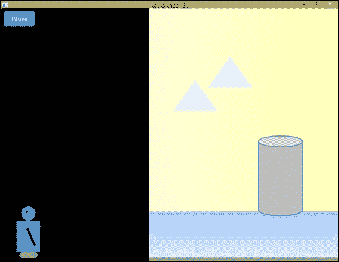

**问题 2**：Robo 完全移出屏幕到右边。

以下截图显示了如果你允许 Robo 继续向右移动会发生什么。现在你理解了锚点位于左上角，你可能已经明白了正在发生的事情。

由于边界检查是基于精灵的 `x` 坐标，当左上角超过屏幕宽度时，整个精灵已经移出屏幕。机器人的灰度图像显示了他实际的位置，如果我们能看到他的话：

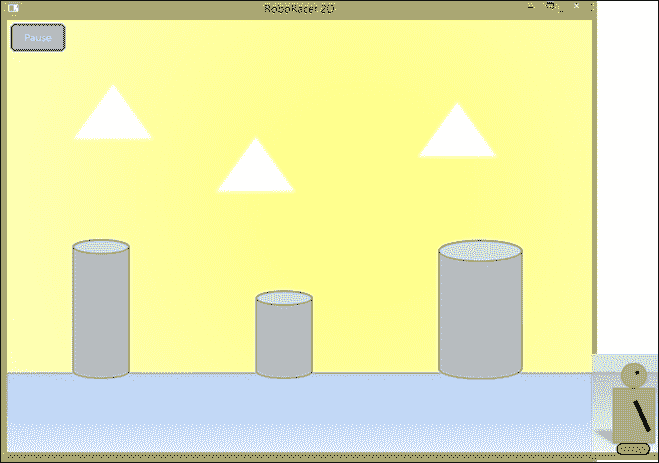

**问题 3**：一旦 Robo 到达屏幕的左端或右端，他会卡住。改变他的方向似乎没有任何效果！

这个问题被称为 **嵌入**。以下是发生的事情：

+   我们继续检查 Robo 的位置，直到他的 *x* 坐标超过一个阈值。

+   一旦他超过了那个阈值，我们就将他的速度设置为 `0`。

+   现在 Robo 的 *x* 坐标超过了那个阈值，它将始终超过那个阈值。任何试图将他移动到相反方向的努力都会触发边界检查，这将发现 Robo 的 *x* 坐标仍然超过阈值，他的速度将被设置为 `0`。

解决方案是在我们发现 Robo 已经越过阈值时立即将 Robo 的位置设置在阈值另一侧。我们将添加这个修正，但首先我们必须理解碰撞矩形。

## 碰撞矩形

看看以下 Robo 的图像。实心矩形代表纹理的边界。虚线矩形代表我们实际上想要考虑的边界和碰撞检测区域。这被称为 **碰撞矩形**。

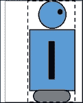

比较两个矩形，以下是我们将纹理矩形转换为碰撞矩形的步骤：

+   在左侧纹理边界添加大约 34 个像素

+   从右侧纹理边界减去大约 10 个像素

+   顶部和右侧边界不需要调整

让我们通过添加定义碰撞矩形的功能来增强精灵类。

打开`Sprite.h`并添加以下成员变量：

```cpp
Rect m_collision;
```

然后添加两个访问器方法：

```cpp
const Rect GetCollisionRect() const;
void SetCollisionRectOffset(const Rect p_rect) { m_collision = p_rect; }
```

`GetCollisionRect`的实现稍微复杂一些，所以我们将这段代码放入`Sprite.cpp`：

```cpp
const Sprite::Rect Sprite::GetCollisionRect() const
{
  Rect rect;
  rect.left = m_position.x + m_collision.left;
  rect.right = m_position.x + m_size.width + m_collision.right;
  rect.top = m_position.y + m_collision.top;
  rect.bottom = m_position.y + m_size.height + m_collision.bottom;

  return rect;
}
```

我们正在做的是：

+   `m_collision`：这将保存四个偏移量值。这些值将代表一个必须添加到纹理的边界矩形中，以得到我们想要的碰撞矩形。

+   `SetCollisionRectOffset`：这个方法接受一个`Rect`参数，它包含四个偏移量——顶部、底部、左侧和右侧，这些偏移量必须添加到纹理边界的顶部、底部、左侧和右侧以创建碰撞矩形。

+   `GetCollisionRect`：这个方法返回我们在检查边界和检测碰撞时实际可以使用的碰撞矩形。这是通过将宽度和高度添加到精灵的当前锚点（左上角）并调整`m_collision`中的值来计算的。

注意，`GetCollisionRect`是动态的；它总是根据精灵的当前位置返回当前的碰撞矩形。因此，我们在任何游戏时刻返回实际需要检查的顶部、底部、左侧和右侧边界。

如果仔细观察设计，你应该能够看到如果没有定义碰撞矩形，`GetCollisionRect`将返回由纹理矩形确定的碰撞矩形。因此，这种新的设计允许我们默认使用纹理矩形作为碰撞矩形。另一方面，如果我们想指定自己的碰撞矩形，我们可以使用`SetCollisionRectOffset`来做到这一点。

为了安全起见，我们将在构造函数中通过添加以下行来初始化 m_collision：

```cpp
m_collision.left = 0.0f;
m_collision.right = 0.0f;
m_collision.top = 0.0f;
m_collision.bottom = 0.0f;
```

现在我们有了支持碰撞矩形的代码，我们需要为机器人的精灵定义碰撞矩形。转到`RoboRacer2D.cpp`中的`LoadTextures`函数，并在`return true`代码行之前添加以下突出显示的行：

```cpp
Sprite::Rect collision;
collision.left = 34.0f;
collision.right = -10.0f;
collision.top = 0.0f;
collision.bottom = 0.0f;
robot_left->SetCollisionRectOffset(collision);
robot_right->SetCollisionRectOffset(collision);

return true;
```

记住，只添加前面的突出显示代码。代码的最后一行是为了提供上下文。

现在我们将重写我们的边界检测函数，以利用碰撞矩形。在这个过程中，我们将解决我们在第一次尝试中遇到的所有三个问题。当前的代码使用图像的锚点，这并不能准确地反映我们想要检查的实际边界。新的代码将使用碰撞矩形。将 RoboRacer2D 中的`CheckBoundaries`函数替换为以下代码：

```cpp
void CheckBoundaries(Sprite* p_sprite)
{
  Sprite::Rect check = p_sprite->GetCollisionRect();

  if (check.left < 0.0f)
  {
    p_sprite->SetVelocity(0.0f);
  }
  else if (check.right > screen_width)
  {
    p_sprite->SetVelocity(0.0f);
  }
}
```

这段代码使用了为正在检查的精灵定义的碰撞矩形。正如我们之前讨论的，`GetCollisionRect`根据精灵的当前位置返回顶部、底部、左侧和右侧边界，这极大地简化了我们的代码！现在，我们只需检查精灵的左侧是否小于零，或者精灵的右侧是否大于零，我们就完成了！

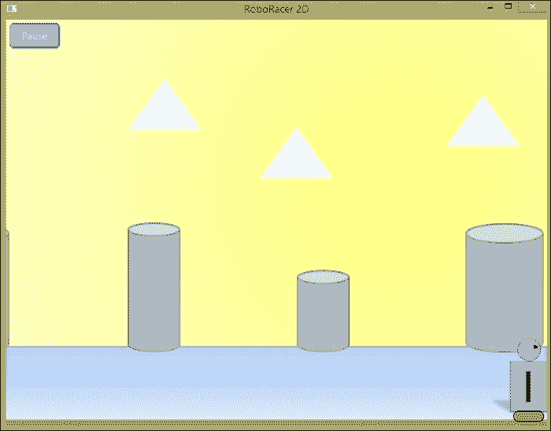

## 嵌入

哈哈！Robo 现在成功停在屏幕边缘（前一个图像中只显示了右侧）。但是，哎呀！它仍然卡住了！正如我们之前提到的，这个问题被称为嵌入。如果我们放大，我们可以看到发生了什么：

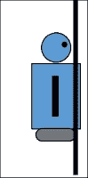

垂直线代表屏幕的边缘。当 Robo 停止时，它的右边缘已经超过了屏幕的右边缘，所以我们停止它。不幸的是，即使我们试图让他转向相反方向，`CheckBoundaries`函数也会在 Robo 有机会开始移动之前在下一个帧上检查：

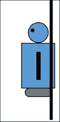

根据边界检查，Robo 的右边缘仍然在屏幕的右边缘之外，所以 Robo 的速度再次被设置为零。Robo 在甚至无法迈出一步之前就被停止了！

这里是解决方案；一旦我们检测到 Robo 超出了边界，我们就将他的速度设置为零，并将 Robo 重新定位到边界另一侧：

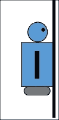

现在，只要 Robo 朝相反方向移动，它就能移动。

为了实现这个更改，我们再次将更改应用于`CheckBoundaries`函数：

```cpp
void CheckBoundaries(Sprite* p_sprite)
{
  Sprite::Rect check = p_sprite->GetCollisionRect();
 float offset;
  float x;
  float y;

  if (check.left < 0.0f)
  {
    p_sprite->SetVelocity(0.0f);
    offset = check.left;
 x = p_sprite->GetPosition().x - offset;
 y = p_sprite->GetPosition().y;
 p_sprite->SetPosition(x, y);
  }
  else if (check.right > screen_width)
  {
    p_sprite->SetVelocity(0.0f);
    offset = screen_width - check.right;
 x = p_sprite->GetPosition().x + offset;
 y = p_sprite->GetPosition().y;
 p_sprite->SetPosition(x, y);
  }
  if (check.top < 0.0f)
  {
    p_sprite->SetVelocity(0.0f);
    offset = check.top;
 y = p_sprite->GetPosition().y - offset;
 x = p_sprite->GetPosition().x;
 p_sprite->SetPosition(x, y);
  }
  else if (check.bottom > screen_height)
  {
    p_sprite->SetVelocity(0.0f);
    offset = screen_height - check.bottom;
 y = p_sprite->GetPosition().y + offset;
 x = p_sprite->GetPosition().x;
 p_sprite->SetPosition(x, y);
  }
}
```

突出的行显示了添加的代码。基本上，我们执行以下操作：

+   计算 Robo 超出边界的距离

+   调整他的位置，使他现在正好位于边界上

你会注意到我们还填写了处理顶部和底部边界的函数，以便边界检查可以用于任何方向移动的任何精灵。

## 调整背景

现在我们已经让 Robo 按照我们希望的方式移动，两个新的问题已经出现在背景图片上：

1.  当 Robo 停止时，背景继续滚动。

1.  当背景图片在右侧或左侧结束时，它会从屏幕上滑出，我们只剩下黑色背景。

在我们继续进行碰撞检测之前，让我们修复背景。首先，我们将添加以下函数到`RoboRacer2D.cpp`：

```cpp
void CheckBackground()
{
  float leftThreshold = 0.0f;
  float rightThreshold = -(background->GetSize().width - screen_width);
  if (background->GetPosition().x > 0)
  {
    background->SetPosition(0.0f, background->GetPosition().y);
  }
  else if (background->GetPosition().x < rightThreshold)
  {
    background->SetPosition(rightThreshold, background->GetPosition().y);
  }
}
```

这段代码与边界检查代码非常相似。如果背景锚点向左移动足够远以至于暴露了纹理的右边缘，它将被重置。如果背景锚点向右移动足够远以至于暴露了纹理的左边缘，它将被重置。

现在，将高亮显示的代码行添加到`Update`函数中，在`RoboRacer2D.cpp`中调用`CheckBoundaries`之后：

```cpp
inputManager->Update(p_deltaTime);
ProcessInput();
CheckBoundaries(player);
CheckBackground();

```

背景现在应该从边缘延伸到边缘。玩玩游戏，休息一下喝杯咖啡吧。你应得的！

# 可碰撞物体

有很多次我们可能想要检查和查看游戏中的物体是否相互碰撞。我们可能想知道玩家是否撞到了障碍物或敌人。我们可能有玩家可以捡起的物体，通常称为**拾取物**或**道具**。

在游戏中，可以与其他物体发生碰撞的物体统称为可碰撞物体。当我们创建`Sprite`类时，实际上是为这个目的设计的。查看类构造函数，你会注意到成员变量`m_isCollideable`被设置为`false`。当我们编写碰撞检测代码时，我们将忽略那些`m_isCollideable`设置为`false`的物体。如果我们想让一个物体能够与其他物体发生碰撞，我们必须确保将`m_collideable`设置为`true`。

## 准备得分

为了保持我们的设计简单，我们将创建一个敌人和一个拾取物。撞到敌人会从玩家的得分中扣除分数，而撞到拾取物则会增加玩家的得分。我们将在精灵类中添加一些额外的代码来支持这个功能。

首先，让我们添加一些新的成员变量。在`Sprite.h`中声明一个新的变量：

```cpp
int m_value;
```

然后添加以下方法：

```cpp
void SetValue(const int p_value) { m_value = p_value; }
const int GetValue() const { return m_value; }
```

通过这些更改，每个精灵都将有一个内在值。如果值为正，则表示奖励。如果值为负，则表示惩罚。

不要忘记在`Sprite`类构造函数中将`m_value`初始化为零！

## 真正的朋友

让我们添加我们的拾取物精灵。在这种情况下，拾取物是一个油罐，以保持 Robo 的关节平滑工作。

将以下精灵定义添加到 RoboRacer2D 中：

```cpp
Sprite* pickup;
```

现在，我们将设置精灵。将以下代码添加到`LoadTextures`：

```cpp
pickup = new Sprite(1);
pickup->SetFrameSize(26.0f, 50.0f);
pickup->SetNumberOfFrames(1);
pickup->AddTexture("resources/oil.png");
pickup->IsVisible(false);
pickup->IsActive(false);
pickup->SetValue(50);
```

这段代码基本上与我们用来创建所有精灵的代码相同。一个值得注意的区别是我们使用新的`SetValue`方法向精灵添加一个值。这代表玩家收集这个拾取物将获得的分数。

## 生成时间

注意，我们已经将精灵设置为非活动状态和不可见状态。现在，我们将编写一个函数来随机生成拾取物。首先，我们需要添加两个额外的 C++头文件。在`RoboRacer2D.cpp`中添加以下头文件：

```cpp
#include <stdlib.h>
#include <time.h>
```

我们需要`stdlib`中的`rand`函数和`time`来为我们提供一个值来初始化随机生成器。

### 小贴士

随机数是从内部表中生成的。为了保证每次程序启动时选择不同的随机数，你首先需要用保证每次启动程序时都不同的值来初始化随机数生成器。由于程序启动的时间总是不同的，我们通常使用时间作为种子。

接下来，我们需要一个计时器。在`RoboRacer2D.cpp`中声明以下变量：

```cpp
float pickupSpawnThreshold;
float pickupSpawnTimer;
```

阈值是我们希望在生成拾取物之前经过的秒数。计时器将从零开始并计数到那个秒数。

让我们在`StartGame`函数中初始化这些值。`StartGame`函数也是一个很好的地方来初始化我们的随机数生成器。将以下三行代码添加到`StartGame`的末尾：

```cpp
srand(time(NULL));
pickupSpawnThreshold = 15.0f;
pickupSpawnTimer = 0.0f;
```

第一行通过传递表示当前时间的整数来初始化随机数生成器。下一行设置生成阈值为`15`秒。第三行将生成计时器设置为`0`。

现在，让我们创建一个生成拾取物的函数。将以下代码添加到`RoboRacer2D.cpp`中：

```cpp
void SpawnPickup(float p_DeltaTime)
{
  if (pickup->IsVisible() == false)
  {
    pickupSpawnTimer += p_DeltaTime;
    if (pickupSpawnTimer > pickupSpawnThreshold)
    {
      float marginX = pickup->GetSize().width;
      float marginY = pickup->GetSize().height;
      float spawnX = (rand() % (int)(screen_width - (marginX * 2))) + marginX;
      float spawnY = screen_height - ((rand() % (int)(player->GetSize().height - (marginY * 1.5))) + marginY);
      pickup->SetPosition(spawnX, spawnY);
      pickup->IsVisible(true);
      pickup->IsActive(true);
      pickupSpawnTimer = 0.0f;
    }
  }
}
```

这段代码执行以下操作：

+   它会检查拾取物是否已经在屏幕上了

+   如果没有拾取物，则生成计时器递增

+   如果生成计时器超过了生成阈值，拾取物将在屏幕宽度和 Robo 的垂直范围内随机位置生成。

不要过于担心所使用的特定数学。你的拾取物定位算法可能完全不同。这里的关键是，将生成一个位于 Robo 可触及范围内的单个拾取物。

确保在`Update`函数中调用`SpawnPickup`并在更新拾取物时添加一行：

```cpp
if (m_gameState == GS_Running)
{
  background->Update(p_deltaTime);
  robot_left->Update(p_deltaTime);
  robot_right->Update(p_deltaTime);
  robot_left_strip->Update(p_deltaTime);
  robot_right_strip->Update(p_deltaTime);

  pause->Update(p_deltaTime);
  resume->Update(p_deltaTime);

  pickup->Update(p_deltaTime);
 SpawnPickup(p_deltaTime);
}
```

我们还需要在`Render`中添加一行代码来渲染拾取物：

```cpp
void Render()
{
  glClear(GL_COLOR_BUFFER_BIT);
  glLoadIdentity();

  background->Render();
  robot_left->Render();
  robot_right->Render();
  robot_left_strip->Render();
  robot_right_strip->Render();

  pause->Render();
  resume->Render();

  pickup->Render();
  SwapBuffers(hDC);
}
```

如果你现在运行游戏，那么在游戏开始后的约五秒钟，应该会生成一个油桶。

### 提示

当前代码有一个缺陷。它可能会在 Robo 的正上方生成拾取物。一旦我们实现了碰撞检测，Robo 将立即捡起油桶。这将会发生得如此之快，以至于你甚至看不到它发生。为了保持简单，我们将容忍这个特定的缺陷。

# 圆形碰撞检测

检测碰撞的一种方法是通过观察每个物体彼此之间的距离。这被称为圆形碰撞检测，因为它将每个物体视为被一个圆所包围，并使用该圆的半径来确定物体是否足够接近以发生碰撞。

看看下面的图：

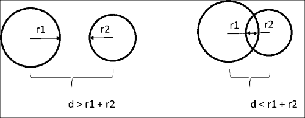

左侧的圆没有发生碰撞，而右侧的圆发生了碰撞。对于没有碰撞的圆，两个圆心之间的距离（*d*）大于两个半径（*r1 + r2*）之和。对于发生碰撞的圆，两个圆心之间的距离（*d*）小于两个半径（*r1 + r2*）之和。我们可以利用这个知识来测试任何两个物体是否基于圆的半径和物体中心点之间的距离发生碰撞。

那么，我们如何使用这些信息呢？

1.  我们将知道**r1**和**r2**，因为我们创建精灵时设置了它们。

1.  我们将使用每个圆心的*x*和*y*坐标来计算直角三角形的两条边。

1.  我们将使用勾股定理的变体来计算两个中心点之间的距离 *d*。

这可能会让你感到有点头疼，但我希望刷新你记忆中基本几何的一个定理。

## 勾股定理

勾股定理允许我们在知道形成两个点之间直角的两条线段长度的情况下，找到二维空间中任意两点之间的距离。

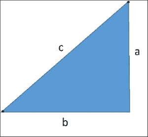

*a² + b² = c²*

在我们的案例中，我们试图计算两点之间的距离（c）。

一点代数变换可以将这个方程转换为：

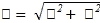

计算平方根是计算上昂贵的。一个很棒的数学技巧实际上允许我们在不计算平方根的情况下进行碰撞检测。

如果我们使用平方根来进行这个计算，它可能看起来是这样的：

```cpp
c = sqrt(a * a + b * b);
if (c <= r1 + r2) return true;
```

虽然这可以工作，但有一个很棒的数学技巧可以让我们在不计算平方根的情况下完成这个测试。看看这个：

```cpp
c = a * a + b * b;
if (c<= r1 * r1 + r2 * r2) return true;
```

结果表明，我们可以在方程中保持所有项的平方，比较仍然有效。这是因为我们只对距离和半径之和的相对比较感兴趣，而不是绝对数学值。

### 小贴士

如果我们在这里展示的数学让你感到困惑，那么请不要过于担心。圆形碰撞检测非常常见，检测它的数学通常已经内置到你将使用的游戏引擎中。然而，我想让你稍微了解一下引擎内部。毕竟，游戏编程本质上是数学性的，你对数学了解得越多，你的编码能力就会越强。

## 添加圆形碰撞代码

现在，是时候修改 `Sprite.h` 以添加对圆形碰撞检测的支持。首先，我们需要添加一些成员变量来保存中心点和半径。将这两个属性添加到 `Sprite.h` 中：

```cpp
float m_radius;
Point m_center;
```

然后添加以下方法声明：

```cpp
void SetRadius(const GLfloat p_radius) { m_radius = p_radius; }
const float GetRadius() const { return m_radius; }
void SetCenter(const Point p_center) { m_center = p_center; }
const Point GetCenter() const;
const bool IntersectsCircle(const Sprite* p_sprite) const;
```

这些方法允许我们设置和检索精灵的中心点和半径。`GetCenter` 方法有多行，因此我们将在 `Sprite.cpp` 中实现它：

```cpp
const Sprite::Point Sprite::GetCenter() const
{
  Point center;
  center.x = this->GetPosition().x + m_center.x;
  center.y = this->GetPosition().y + m_center.y;

  return center;
}
```

这里需要注意的一个重要点是，`m_center` 代表精灵锚点的一个 `x` 和 `y` 偏移。因此，为了返回中心点，我们将 `m_center` 添加到精灵的当前位置，这将给出精灵在游戏中的当前中心点。

我们现在需要添加代码以执行碰撞检测。将以下代码添加到 `Sprite.cpp` 中：

```cpp
const bool Sprite::IntersectsCircle(const Sprite* p_sprite) const
{
 if (this->IsCollideable() && p_sprite->IsCollideable() && this->IsActive() && p_sprite->IsActive())
 {
  const Point p1 = this->GetCenter();
  const Point p2 = p_sprite->GetCenter();
  float y = p2.y - p1.y;
  float x = p2.x - p1.x;
  float d = x*x + y*y;
  float r1 = this->GetRadius() * this->GetRadius();
  float r2 = p_sprite->GetRadius() * p_sprite->GetRadius();
  if (d <= r1 + r2)
  {
   return true;
  }
 }
 return false;
}
```

我们已经解释了勾股定理的使用，所以这段代码对你来说可能有点熟悉。以下是我们在做什么：

这个函数接受一个与自身比较的精灵。

+   首先，我们检查确保两个精灵都是可碰撞的。

+   `p1` 和 `p2` 代表两个中心点。

+   `x`和`y`代表直角三角形的边`a`和`b`的长度。请注意，计算只是简单地计算每个精灵的`x`和`y`位置之间的差异。

+   `r1`和`r2`是两个圆的半径（以 2 的幂表示）。

+   `d` 是两个中心之间的距离（以 2 的幂表示）。

+   如果`d`小于或等于两个半径之和，则表示圆相交。

## 为什么使用圆形碰撞检测？

正如我们多次讨论的那样，纹理被表示为矩形。实际上，我们将在本章后面介绍矩形碰撞检测时利用这一点。以下图示说明了矩形和圆形碰撞检测的不同之处（相对大小被夸张以说明问题）：

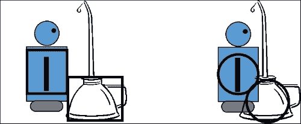

左侧的精灵使用矩形边界框进行碰撞。右侧的精灵使用边界圆进行碰撞。一般来说，当我们处理更圆的形状时，使用边界圆在视觉上更有说服力。

### 小贴士

我必须承认，在这个例子中，差异并不大。你可以在这个例子中用矩形或圆形碰撞检测。油桶的圆形特性使其成为圆形碰撞检测的良好候选者。如果碰撞的两个物体实际上是圆形（即，两个球体碰撞），圆形碰撞检测就非常关键。

使用我们开发的代码，我们需要为任何将使用圆形碰撞检测的精灵定义中心和半径。将以下代码添加到`RoboRacer.cpp`中的`LoadTextures`函数：

```cpp
Sprite::Point center;
float radius;

center.x = robot_right->GetSize().width / 2.0f;
center.y = robot_right->GetSize().height / 2.0f;
radius = (center.x + center.y) / 2.0f;

robot_right->SetCenter(center);
robot_right->SetRadius(radius);
robot_left->SetCenter(center);
robot_left->SetRadius(radius);

center.x = pickup->GetSize().width / 2.0f;
float yOffset = (pickup->GetSize().height / 4.0f) * 3.0f;
center.y = yOffset;
pickup->SetCenter(center);
radius = pickup->GetSize().width / 2.0f;
pickup->SetRadius(radius);
```

不要过于担心我们在这里使用的确切值。我们基本上是为 Robo 和油桶设置一个边界圆，以匹配前面的图。Robo 的边界圆设置为机器人的中间，而油桶的圆设置为纹理的下半部分。

## 连接碰撞检测

现在，我们将添加一个新函数来执行所有的碰撞检测。将以下函数添加到`RoboRacer2D.cpp`中：

```cpp
void CheckCollisions()
{
 if (player->IntersectsCircle(pickup))
 {
  pickup->IsVisible(false);
  pickup->IsActive(false);
  player->SetValue(player->GetValue() + pickup->GetValue());
  pickupSpawnTimer = 0.0f;
 }
}
```

此代码的目的是检查玩家是否与拾取物品发生了碰撞：

+   如果`player->IntersectsCircle(pickup)`的调用返回`true`，则表示玩家与拾取物品发生了碰撞

+   拾取物品被禁用并变得不可见

+   拾取物品的值被添加到玩家的值中（这将是未来章节中计分的基准）

+   生成计时器被重置

我们还剩下两个小细节。首先，你必须将`CheckCollisions`的调用添加到`Update`函数中：

```cpp
if (m_gameState == GS_Running)
{
  background->Update(p_deltaTime);
  robot_left->Update(p_deltaTime);
  robot_right->Update(p_deltaTime);
  robot_left_strip->Update(p_deltaTime);
  robot_right_strip->Update(p_deltaTime);

  pause->Update(p_deltaTime);
  resume->Update(p_deltaTime);

  pickup->Update(p_deltaTime);
  SpawnPickup(p_deltaTime);

  CheckCollisions();
}
```

其次，你需要使玩家和拾取物品`可碰撞`。将以下三行代码添加到`LoadTextures`的底部，就在返回语句之前：

```cpp
robot_left->IsCollideable(true);
robot_right->IsCollideable(true);
pickup->IsCollideable(true);
```

现在，真正的乐趣开始了！玩游戏，当油桶生成时，用 Robo 去拾取它。五秒后，另一个油桶生成。乐趣永无止境！

# 矩形碰撞检测

现在，我们将学习如何实现矩形碰撞检测。结果证明，机器人和我们的敌人（一个水瓶）都非常矩形，这使得矩形碰撞检测是最好的选择。

## 敌人内部

让我们介绍我们的机器人敌人——一瓶水来生锈他的齿轮。这个代码将在下面包括。

将以下精灵定义添加到 `RoboRacer2D`：

```cpp
Sprite* enemy;
```

现在，我们将设置精灵。将以下代码添加到 `LoadTextures`：

```cpp
enemy = new Sprite(1);
enemy->SetFrameSize(32.0f, 50.0f);
enemy->SetNumberOfFrames(1);
enemy->AddTexture("resources/water.png");
enemy->IsVisible(false);
enemy->IsActive(false);
enemy->SetValue(-50);
enemy->IsCollideable(true);
```

这段代码基本上是我们用来创建所有精灵的相同代码。一个值得注意的差异是，我们使用新的 `SetValue` 方法向精灵添加一个负值。这就是玩家如果击中这个敌人将失去多少分。我们还确保将敌人设置为可碰撞。

## 生成敌人

就像拾取物一样，我们需要生成我们的敌人。我们可以使用与拾取物相同的代码，但我认为如果我们的敌人使用不同的计时器会更好。

在 `RoboRacer2D.cpp` 中声明以下变量：

```cpp
float enemySpawnThreshold;
float enemySpawnTimer;
```

阈值是我们希望敌人生成前要经过的秒数。计时器将从零开始并向上计数到这个秒数。

让我们在 `StartGame` 函数中初始化这些值。将以下两行代码添加到 `StartGame` 的末尾：

```cpp
enemySpawnThreshold = 7.0f;
enemySpawnTimer = 0.0f;
```

我们设置了 7 秒的生成阈值，并将生成计时器设置为 0。

现在，让我们创建一个生成我们敌人的函数。将以下代码添加到 `RoboRacer2D.cpp`：

```cpp
void SpawnEnemy(float p_DeltaTime)
{
  if (enemy->IsVisible() == false)
  {
    enemySpawnTimer += p_DeltaTime;
    if (enemySpawnTimer >enemySpawnThreshold)
    {
      float marginX = enemy->GetSize().width;
      float marginY = enemy->GetSize().height;
      float spawnX = (rand() % (int)(screen_width - (marginX * 2))) + marginX;
      float spawnY = screen_height - ((rand() % (int)(player->GetSize().height - (marginY * 2))) + marginY);
      enemy->SetPosition(spawnX, spawnY);
      enemy->IsVisible(true);
      enemy->IsActive(true);
    }
  }
}
```

这段代码执行以下操作：

+   它检查确保敌人尚未在屏幕上

+   如果没有敌人，则生成计时器增加

+   如果生成计时器超过生成阈值，敌人将在屏幕宽度内和机器人垂直范围内随机位置生成

不要过于担心所使用的特定数学。你的敌人定位算法可以完全不同。这里的关键是，一个敌人将在机器人的路径内生成。

确保在 `Update` 函数中添加对 `SpawnEnemy` 的调用以及更新敌人的行：

```cpp
if (m_gameState == GS_Running)
{
  background->Update(p_deltaTime);
  robot_left->Update(p_deltaTime);
  robot_right->Update(p_deltaTime);
  robot_left_strip->Update(p_deltaTime);
  robot_right_strip->Update(p_deltaTime);

  pause->Update(p_deltaTime);
  resume->Update(p_deltaTime);

  pickup->Update(p_deltaTime);
  SpawnPickup(p_deltaTime);

  enemy->Update(p_deltaTime);
 SpawnEnemy(p_deltaTime);

  CheckCollisions();

}
```

我们还需要在 `Render` 中添加一行来渲染敌人：

```cpp
void Render()
{
  glClear(GL_COLOR_BUFFER_BIT);
  glLoadIdentity();

  background->Render();
  robot_left->Render();
  robot_right->Render();
  robot_left_strip->Render();
  robot_right_strip->Render();

  pause->Render();
  resume->Render();

  pickup->Render();
  enemy->Render();
  SwapBuffers(hDC);
}
```

如果你现在运行游戏，那么大约在游戏开始后七秒应该会生成一个水瓶。

## 添加矩形碰撞代码

正如我们多次提到的，所有精灵本质上都是矩形。从视觉上看，如果这些矩形的任何边框重叠，我们可以假设两个精灵发生了碰撞。

我们将向我们的 `Sprite` 类添加一个函数，用于确定两个矩形是否相交。打开 `Sprite.h` 并添加以下方法声明：

```cpp
const bool IntersectsRect(const Sprite*p_sprite) const;
```

现在，让我们将实现添加到 `Sprite.cpp`：

```cpp
const bool Sprite::IntersectsRect(const Sprite* p_sprite) const
{
 if (this->IsCollideable() && p_sprite->IsCollideable() && this->IsActive() && p_sprite->IsActive()) 
 {
  const Rect recta = this->GetCollisionRect();
  const Rect rectb = p_sprite->GetCollisionRect();
  if (recta.left >= rectb.left && recta.left <= rectb.right && recta.top >= rectb.top && recta.top <= rectb.bottom)
  {
   return true;
  }
  else if (recta.right >= rectb.left && recta.right <= rectb.right && recta.top >= rectb.top && recta.top <= rectb.bottom)
  {
   return true;
  }
  else if (recta.left >= rectb.left && recta.right <= rectb.right && recta.top < rectb.top && recta.bottom > rectb.bottom)
  {
   return true;
  }
  else if (recta.top >= rectb.top && recta.bottom <= rectb.bottom && recta.left < rectb.left && recta.right > rectb.right)
  {
   return true;
  }
  else if (rectb.left >= recta.left && rectb.left <= recta.right &&
   rectb.top >= recta.top && rectb.top <= recta.bottom)
  {
   return true;
  }
  else if (rectb.right >= recta.left && rectb.right <= recta.right && rectb.top >= recta.top && rectb.top <= recta.bottom)
  {
   return true;
  }
  else if (rectb.left >= recta.left && rectb.right <= recta.right && rectb.top < recta.top && rectb.bottom > recta.bottom)
  {
   return true;
  }
  else if (recta.top >= rectb.top && recta.bottom <= rectb.bottom && recta.left < rectb.left && recta.right > rectb.right)
  {
   return true;
  }
  else if (rectb.top >= recta.top && rectb.bottom <= recta.bottom && rectb.left < recta.left && rectb.right > recta.right)
  {
   return true;
  }
 }
 return false;
}
```

这就是这段代码的工作方式：

+   这个函数看起来很复杂，但实际上只做了几件事情。

+   该函数接受一个精灵参数。

+   我们将`recta`设置为调用`IntersectsRect`方法的精灵的碰撞矩形，并将`rectb`设置为传入的精灵的碰撞矩形。

+   然后，我们测试`recta`中顶点的位置与`rectb`中所有可能的位置组合。如果任何测试返回`true`，则我们返回`true`。否则，我们返回`false`。

以下图示说明了两个矩形可能交互的一些方式：

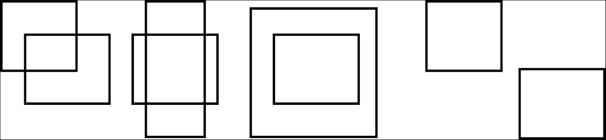

## 连接继续

我们已经通过使用`CheckCollisions`实现了碰撞检测。我们只需将以下代码添加到`CheckCollisions`中，以检查玩家是否与敌人发生碰撞：

```cpp
if (player->IntersectsRect(enemy))
{
  enemy->IsVisible(false);
  enemy->IsActive(false);
  enemy->SetValue(player->GetValue() + enemy->GetValue());
  enemySpawnTimer = 0.0f;
}
```

现在，真正的乐趣开始了！玩这个游戏，当水敌人出现时确保 Robo 避开它！如果你与敌人发生碰撞，你会失去分数（因为敌人的值被设置为负数）。在我们实现可见分数之前，你可能需要将分数输出到控制台。

# 摘要

我相信你现在可以理解，没有碰撞检测，大多数游戏都是不可能实现的。碰撞检测允许游戏中的对象相互交互。我们使用碰撞检测来获取物品并检测我们是否遇到了敌人。

我们还讨论了边界检查的基本任务。边界检查是一种特殊的碰撞检测形式，用于检查一个对象是否达到了屏幕边界。另一种类型的边界检查用于管理场景背景。

在下一章中，我们将通过添加一些收尾工作来结束游戏，包括一个抬头显示（heads-up display）！
