# 第八章。拓展视野

到目前为止，我们的编码仅限于二维。现在，是时候扩展到三维了。在许多方面，这并不会像听起来那么令人畏惧。毕竟，我们不再使用两个坐标（*x* 和 *y*）来指定位置，而是现在简单地添加一个第三个坐标（*z*）。然而，有一些领域，第三维会增加相当大的复杂性，我的工作就是帮助你掌握这种复杂性。在本章中，我们将从在三维世界中放置对象的基本理解开始，包括：

+   **三维坐标系**：你已经掌握了笛卡尔坐标系（*x* 和 *y* 坐标）。我们将讨论如何将其扩展到第三个轴。

+   **三维摄像机**：在二维游戏中，摄像机基本上是固定的，而物体则在其周围移动。在三维游戏编程中，我们经常将摄像机向前、向后、向侧面移动，甚至围绕游戏中的物体旋转。

+   **三维视图**：2D 计算机屏幕是如何精确地表示 3D 游戏的？你将学习 3D 如何通过图形管道进行转换的基础知识。

+   **三维变换**：在三维空间中移动比在二维空间中移动要复杂得多。实际上，我们使用一种全新的数学形式来做到这一点。你将学习矩阵的基础知识，以及如何使用它们来移动、旋转和改变三维对象的大小。

# 进入第三维度！

你已经生活在一个三维的世界里。你可以前后走动，左右移动，跳跃或蹲下。如果你在飞行或甚至游泳，三维的现实变得更加明显。

大多数二维游戏通过允许玩家左右移动，或上下跳跃来操作。这就是我们创建 RoboRacer2D 时所做的事情。在这种类型的二维游戏中，缺失的维度是深度。我们的机器人不能离我们更远或更近。考虑到我们是在一个平面上画他，他仅限于二维也就不足为奇了。

## 模拟三维

当然，艺术家们早在几百年前就找到了一种绕过这种限制的方法，他们观察到，当一个物体离我们越来越远时，它会变得越小，而当我们靠近它时，它会变得越大。因此，在二维世界中表示三维的一个简单方法就是简单地画出更远的物体作为更小的物体。二维游戏很早就学会了这个技巧，并用来模拟三维：

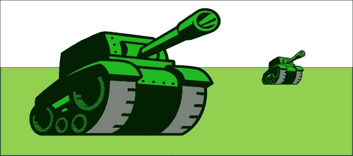

在前面的图像中，较大的水箱看起来比较小的水箱更近。

深度的一个重要方面是**透视**。艺术家们了解到，当平行线远离时，它们似乎会向中心汇聚。它们似乎汇聚的点被称为**消失点**：

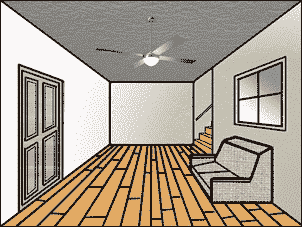

在前面的图像中，墙壁和地板面板都是平行的，但它们似乎向图像的中心汇聚。

3D 运动的第三个方面是，远离我们的物体看起来比靠近我们的物体移动得慢。因此，当你驾驶时，电线杆会比你远处的山移动得快得多。一些 2D 游戏利用这种现象，称为**视差**，通过在游戏中创建一个移动速度远慢于前景的背景层。实际上，这正是我们在 RoboRacer2D 中所做的，因为前景中的机器人移动速度比背景中的物体快。

2D 游戏在硬件和显卡为我们做这些之前就已经使用了所有这些特性——大小、透视和视差——来模拟 3D。最早以令人信服的方式做到这一点的游戏之一是 Pole Position。真正让人震惊的游戏是 Doom，这可能是第一个允许玩家在 3D 世界中自由移动的游戏。

## 真实 3D

现代 3D 游戏将模拟 3D 的想法提升到了新的水平。在我们刚才讨论的模拟 3D 部分中，程序员的任务是调整图像的大小，使其看起来越远越小，处理透视，并处理视差。现在这些任务由 3D 显卡处理。

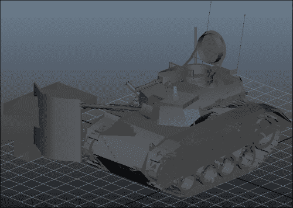

前面的图像展示了一个坦克的 3D**模型**。这些模型是使用特殊软件创建的，例如 Maya 或 3ds Max。这个模型与我们之前展示的 2D 坦克图像在本质上不同，因为它以三维的形式表示坦克。

我们将在未来的章节中更详细地讨论 3D 建模。目前，重要的概念是 3D 坦克的数据被发送到显卡，而显卡负责在坦克位于 3D 空间中的尺寸、透视和视差。这大大减轻了程序员的负担！

## 3D 坐标系统

现在你已经对如何在 2D 屏幕上创建 3D 幻觉有了基本的了解，让我们学习增加另一个维度是如何影响我们的坐标系统的。

在第二章中，我向你介绍了许多游戏系统使用的 2D 坐标系。

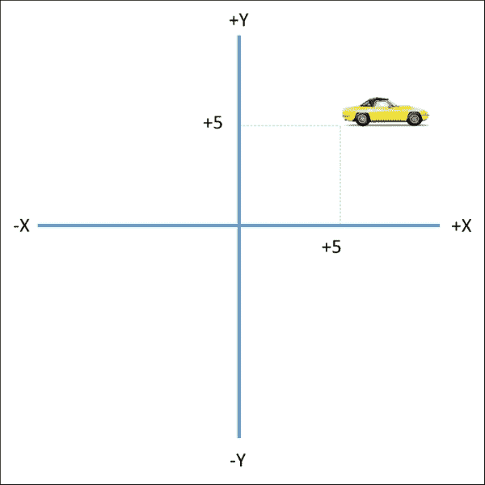

前面的图示显示了一辆位于坐标位置（**5, 5**）的汽车。现在让我们加入第三个维度，看看它是如何比较的：

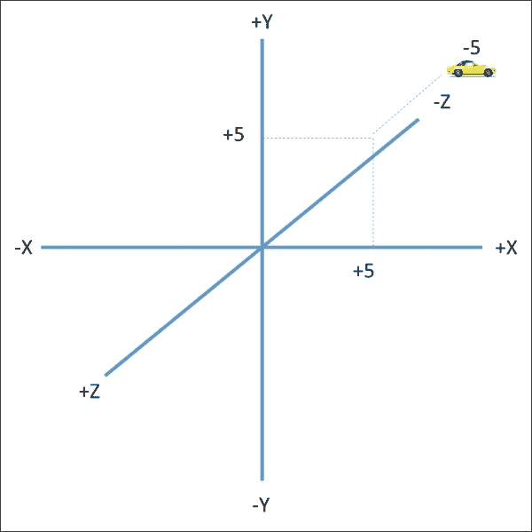

注意，我们添加了第三个轴，并将其标记为 Z 轴。Z 轴上的正值离我们更近，而 Z 轴上的负值离我们更远。现在汽车位于 3D 空间中的坐标（**5, 5, -5**）。随着汽车距离更远，它看起来也比之前 2D 图像中的小（你可以将 2D 空间视为所有*z*坐标都是 0 的空间）。

前面的图示展示了 Z 轴以一个角度呈现，但重要的是要理解 Z 轴实际上是与计算机屏幕的平面垂直的。

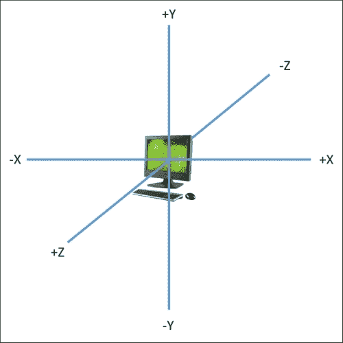

将 Z 轴想象成从屏幕前方穿过中心并延伸到后面的线！

### 小贴士

实际上，在 3D 世界中表示轴的方法有很多。OpenGL 和 DirectX 之间的一个区别是 Z 轴。在 OpenGL 中，正的*z*值更靠近玩家。在 DirectX（微软的 3D 渲染引擎）中，负的 z 值更靠近玩家。了解这一点是很好的，因为你很可能需要与这两个系统一起工作。OpenGL 被称为**右手**坐标系，而 DirectX 是**左手**坐标系。解释它们如何得到这些名称有点困难，所以如果你想了解更多，请在互联网上搜索！

# 摄像机

在第二章*你的视角*中，我们将创建游戏与制作视频录制进行了比较。你的摄像机捕捉了你面前的一部分视图。如果对象进入或离开该视野，它们将不再出现在视频录制中。

3D 游戏也使用摄像机。OpenGL 允许你在六个轴上移动游戏摄像机：上、下、左、右、进、出。当你移动游戏摄像机时，其视野中的对象会发生变化。

假设你将摄像机对准场景中的汽车，并向左或向右平移。汽车将进入或离开视野。当然，如果你向上或向下平移摄像机，也会发生相同的情况。后退（或缩小）时，汽车看起来会更小。向前（或放大）时，汽车看起来会更大。倾斜摄像机，汽车看起来就像在上坡、下坡，甚至可能颠倒过来！

## 记得那些家庭电影吗？

记得那些随着摄像机移动整个场景会跳动的家庭电影吗？显然，摄像机的位置和运动与汽车的外观有很大关系。在游戏世界中也是如此。

OpenGL 使用摄像机概念来确定屏幕上显示的内容以及如何显示。你可以上下移动摄像机，也可以左右移动。你可以旋转或倾斜摄像机。你拥有完全的控制权！

## 保持稳定！

虽然你对移动摄像机有完全的控制权，但有些游戏只是将摄像机放置在特定的位置，然后将其固定。这类似于将你的家庭摄像机固定在三脚架上。

许多 2D 游戏使用固定摄像机，这正是我们在 RoboRacer2D 中所做的。游戏中的所有运动都来自于改变游戏对象的位置，而不是改变摄像机的位置。

在 3D 游戏中，同时移动摄像机和游戏中的对象是非常常见的。想象一下，我们有一个带有移动汽车的 3D 场景。如果摄像机保持固定，汽车最终会移出场景。为了保持汽车在场景中，我们需要移动摄像机以跟随汽车。汽车和摄像机都需要移动。

## 视口

在游戏术语中，任何时刻相机可以看到的区域称为**视口**。视口定义了相机可以看到的游戏世界的区域：

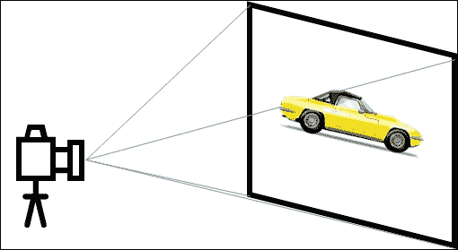

上一幅图显示了具有特定宽度和高度的视口。如果汽车移动到这些边界之外，它将不再可见。在 3D 世界中，我们还必须定义我们想要捕捉的图像的深度。

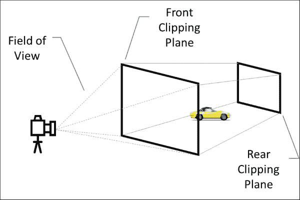

上一幅图显示了如何定义 3D 视口：

+   前裁剪平面定义了物体可以离相机多近。任何比前裁剪平面更近的物体都不会在屏幕上渲染。

+   后裁剪平面定义了物体可以离相机多远。任何超出后裁剪平面的物体都不会在屏幕上渲染。

+   前后裁剪平面的区域称为锥体。锥体内的对象将被渲染到屏幕上。

+   视场决定了从相机看去的视角的高度和宽度。宽视场将渲染更多区域，而窄视场将渲染较少区域。更宽的视角也会在图像中引入更多的扭曲。

# 进入矩阵

现在是所有新游戏程序员心中恐惧的主题：**矩阵**。矩阵是一种数学工具（线性代数的一部分），它使得处理大量相关数字变得更加容易。

在最简单的形式中，**矩阵**是一个数字表。比如说，我想表示空间中的一个坐标。我可以将其值写下如下：

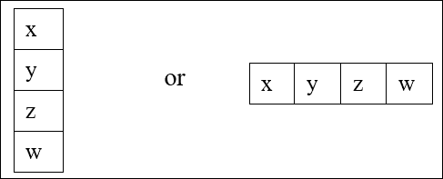

## 向量

矩阵的单行或单列称为**向量**。向量很重要，因为它们可以用来定位和移动物体。

游戏中常用的矩阵包含四个值：*x*，*y*，*z*和*w*。这些*x*，*y*和*z*分量通常指的是 3D 坐标系中的位置，而*w*是一个开关：

+   值 1 表示这个向量是一个位置

+   值 0 表示这个向量是一个速度

这里有一个例子：

+   向量（`1, 5, 10, 1`）代表在 3D 坐标系中 x = `1`，y = `5`，z = `10`的点。

+   向量（`1, 5, 10, 0`）是一个在*x*方向上移动 1 个单位，在*y*方向上移动 5 个单位，在*z*方向上移动 10 个单位的点

### 小贴士

注意，向量可以用括号内的一系列数字来表示。这比每次写向量时都要画一个表格要容易得多！

## 向量组合

向量的真正力量在于它们组合在一起时。组合向量的最常见方式是乘法。看看以下例子：

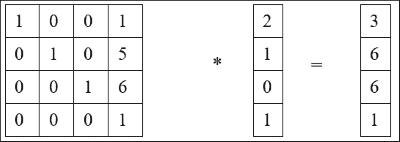

左边的矩阵被称为**平移矩阵**，因为当你用它乘以一个位置向量时，结果将是一个新的位置（在 3D 空间中移动事物被称为**平移**）。在这种情况下，点(**2, 1, 0**)已经平移到了新的位置(**3, 6, 6**)。

### 小贴士

记住：在(**1, 5, 6, 1**)和(**2, 1, 0, 1**)中的最后一个**1**是*w*值，它简单地告诉我们我们正在处理一个位置。注意，*w*值在最终结果中也保持为**1**！

如果你一直在关注，你肯定在想我们是如何得到第三个矩阵的！实际上，乘以两个矩阵比看起来要复杂得多。为了乘以前面显示的两个矩阵，必须执行以下操作：

+   (1 * 2) + (0 * 1) + (0 * 0) + (1 * 1) = 3

+   (0 * 2) + (1 * 1) + (0 * 0) + (5 * 1) = 6

+   (0 * 2) + (0 * 1) + (1 * 0) + (6 * 1) = 6

+   (0 * 2) + (0 * 1) + (0 * 0) + (1 * 1) = 1

第一个矩阵的每一行中的每个单元格都会与第二个矩阵的每一列中的每个单元格相乘。

这可能看起来只是为了移动一个点而费尽周折，但当涉及到在游戏中快速移动 3D 对象时，矩阵数学比其他技术要快得多。

别担心！这就是我们要说的关于矩阵和向量的全部内容。你应该知道 OpenGL 使用矩阵来计算**变换**，包括：

+   移动

+   缩放

+   旋转

### 小贴士

如果你曾经同时使用 OpenGL 和 DirectX，你必须意识到它们在处理矩阵的方式上存在差异。OpenGL 使用**行主序**，而 DirectX 使用**列主序**。在行主序矩阵中，第一列的所有单元格都是相邻的，然后是下一行的所有单元格，依此类推。在列主序矩阵中，第一列的所有单元格都是相邻的，然后是下一列的所有单元格，依此类推。这在你操作和计算矩阵时会产生巨大的差异！

## 单位矩阵

我将提到另一个特殊的矩阵：

| 1 | 0 | 0 | 0 |
| --- | --- | --- | --- |
| 0 | 1 | 0 | 0 |
| 0 | 0 | 1 | 0 |
| 0 | 0 | 0 | 1 |

前面的矩阵被称为单位矩阵。如果你将任何矩阵乘以单位矩阵，结果将是原始矩阵（就像将任何数字乘以 1 的结果是原始数字一样）。每次我们想要初始化一个矩阵时，我们将其设置为单位矩阵。

OpenGL 中有特殊的矩阵，你将在接下来的代码中了解到一些。

# 在 3D 中进行编码

是时候将我们的理论付诸实践，创建我们的第一个 3D 场景了。为了保持简单，我们将通过在 3D 空间中放置一个立方体的步骤进行。这也将是我们 3D 游戏的开始，所以让我们在 Visual Studio 中创建一个全新的项目。

## 创建项目

当我们为我们的 2D 游戏创建项目时，我们从一个标准的 Windows 项目开始，然后删除（或忽略）了我们不需要使用的项目。事实上，标准的 Windows 项目有很多不必要的开销。这是因为 Windows 项目模板假设 Windows 将负责渲染和处理。这对我们的 2D 项目很有用，但只是添加了我们不需要的大量额外代码。

对于这个项目，我们将从一个空的 Windows 项目开始，然后添加必要的代码来初始化和创建一个 OpenGL 窗口。然后，我们将从这里开始逐步进行：

1.  首先打开 Visual Studio。

1.  当 Visual Studio 打开后，通过点击**文件**，**新建**，**项目**来创建一个新的项目。从**Visual C++**分支选择**空项目**。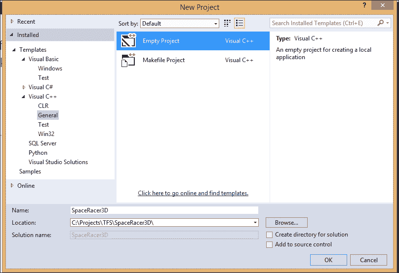

1.  **命名**项目为`SpaceRacer3D`，将其放置在你选择的地点，然后点击**确定**。结果是没有任何代码的项目。让我们通过创建我们的主游戏文件来解决这个问题。

1.  在**解决方案资源管理器**面板的**源文件**文件夹上右键单击。

1.  选择**添加**，**新建项…**。

1.  点击**C++文件(.cpp)**。

1.  输入`SpaceRacer3D.cpp`作为**名称**并点击**添加**。

## 获取 OpenGL 文件

当你安装 Visual Studio 时，标准的 OpenGL 库已经安装好了。然而，OpenGL 实用工具库可能没有安装。为了简化事情，我们将简单地从我们的 RoboRacer2D 项目中复制所需的文件。

打开**RoboRacer2D**项目文件夹，并选择以下文件：

+   `glut.h`

+   `glut32.dll`

+   `glut32.lib`

现在将这些文件复制到**SpaceRacer3D**源文件夹中。这将与你的`SpaceRacer3D.cpp`文件所在的文件夹相同。

## 将项目链接到 OpenGL 库

现在我们有了项目和相关的 OpenGL 文件，我们需要链接到 OpenGL 库。这是通过访问项目属性来完成的。

在**解决方案资源管理器**面板中执行以下操作：

1.  右键单击项目名称（不是解决方案），然后选择**属性**。

1.  在**配置属性**下的**链接器**分支中打开，并选择**输入**。

1.  点击**附加依赖项**，然后点击出现的下拉箭头。

1.  点击**<编辑…**>。

1.  在**附加依赖项**对话框窗口中添加`OpenGL32.lib`和`GLu32.lib`。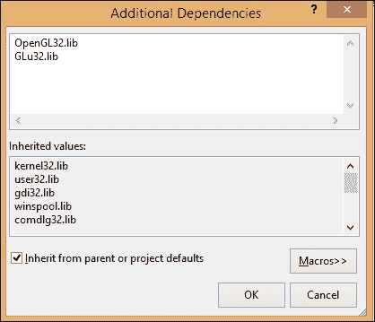

# 设置 OpenGL 窗口

现在我们将添加创建 OpenGL 窗口所需的代码。我们之前为 RoboRacer2D 做过一次，但现在，我们正在创建一个 3D 游戏，会有一些不同。以下是我们需要做的：

1.  包含头文件。

1.  定义全局变量。

1.  创建 OpenGL 窗口。

1.  初始化 OpenGL 窗口。

1.  调整 OpenGL 窗口的大小。

1.  移除 OpenGL 窗口。

1.  创建 Windows 事件处理程序。

1.  创建`WinMain`函数。

注意，我们仍然需要编写一些代码来满足 Windows 的要求。我们需要一个事件处理程序来处理 Windows 事件，我们仍然需要一个主函数作为程序的入口点并运行主程序循环。列表中的其他一切都是用来设置 OpenGL 环境的。

### 小贴士

我按照逻辑顺序列出了我们需要的功能任务。当我们实际编写代码时，我们将以稍微不同的顺序创建事物。这是因为某些函数需要另一个函数已经定义。例如，创建 OpenGL 窗口的函数会调用初始化 OpenGL 窗口的函数，因此初始化函数是首先编写的。

## 包含头文件

第一步是包含适当的头文件。在`SpaceRacer3D.cpp`的顶部添加以下头文件：

```cpp
#include <windows.h>
#include <gl\GL.h>
#include <gl\GLU.h>
#include "glut.h"
```

这些文件与我们在 2D 项目中使用的相同，但这里有一个快速描述，以便你不必翻回：

+   我们仍在 Windows 上运行，因此必须包含`windows.h`

+   OpenGL 的核心头文件是`GL.h`

+   在`GLU.h`中有一些非常棒的实用工具可以简化我们的工作

+   在`glut.h`中也有一些有用的工具

## 定义全局变量

我们需要一些全局变量来保存对 Windows 和 OpenGL 对象的引用。在标题行下方添加以下代码行：

```cpp
HINSTANCE hInstance = NULL;
HDC hDC = NULL;
HGLRC hRC = NULL;
HWND hWnd = NULL;
bool fullscreen = false;
```

这里是一个快速列表，说明这些变量用于什么：

+   `hInstance`：这保存了对应用程序此实例的引用

+   `hDC`：这保存了对用于在原生 Windows 中绘图的 GDI 设备上下文的引用

+   `hRC`：这保存了对 OpenGL 渲染上下文的引用，用于渲染 3D

+   `hWnd`：这保存了应用程序实际运行的窗口的引用

我们还包含了一个全局的`fullscreen`变量。如果你将其设置为`true`，游戏将以全屏模式运行。如果你将其设置为`false`，游戏将以窗口模式运行。

## 创建创建 OpenGL 窗口的函数

我们还将包含对 Windows 事件处理程序的前向引用。添加以下代码行：

```cpp
LRESULT CALLBACK WndProc(HWND, UINT, WPARAM, LPARAM);
```

前向引用允许我们定义一个实际实现将在代码后面出现的函数。`WndProc`的代码将在稍后添加。

## 调整 OpenGL 窗口大小

接下来，我们将创建一个调整 OpenGL 窗口大小的函数。当程序启动以及应用程序运行的窗口大小调整时都会调用此函数。添加以下代码：

```cpp
void ReSizeGLScene(const GLsizei p_width, const GLsizei p_height)
{
  GLsizei h = p_height;
  GLsizei w = p_width;
  if (h == 0)
  {
    h = 1;
  }
  glViewport(0, 0, w, h);

  glMatrixMode(GL_PROJECTION);
  glLoadIdentity();
  gluPerspective(45.0f, (GLfloat)w / (GLfloat)h, 0.1f, 100.0f);

  glMatrixMode(GL_MODELVIEW);
  glLoadIdentity();
}
```

这段代码设置了 OpenGL 窗口的大小，并准备在 3D 中渲染窗口：

+   首先，我们获取宽度和高度（确保高度永远不会等于 0），并使用它们通过`glViewport`函数定义视口的大小。前两个参数是视口左下角*x*和*y*的值，然后是宽度和高度。这四个参数定义了视口的大小和位置。

+   接下来，我们必须定义视锥体。在告诉 OpenGL 使用投影矩阵之后，我们使用`gluPerspective`函数，它接受四个参数：视野（以度为单位，不是弧度），纵横比，前裁剪平面的距离和后裁剪平面的距离。视野是从相机中心的角度。纵横比是宽度除以高度。这四个参数定义了视锥体的大小。

    ### 提示

    完成此章节后，你可以尝试调整此函数的值，看看它如何改变渲染效果。

+   最后，我们告诉 OpenGL 从此点开始使用模型视图。

如果你将此函数与我们用于 RoboRacer2D 的`GLSize`函数进行比较，你会注意到一个显著的区别：我们没有调用`glOrtho`。记住，RoboRacer2D 是一个 2D 游戏。2D 游戏在渲染场景时使用**正交投影**，这会移除透视。在 2D 游戏中不需要透视。大多数 3D 游戏使用**透视投影**，它由`gluPerspective`调用定义。

### 注意

**OpenGL 矩阵**

在`gluPerspective`调用之前，你会注意到两个函数：`glMatrixMode`和`glLoadIdentity`。记得我们讨论矩阵时提到，矩阵用于存储一组值。OpenGL 有许多标准矩阵，其中之一是投影矩阵，它用于定义视图视锥体。

如果我们想要设置矩阵的值，我们必须首先告诉 OpenGL 我们想要使用这个矩阵。接下来，我们通常初始化矩阵，最后，我们进行一个设置矩阵值的调用。

看看设置视图视锥体的代码，这正是我们做的：

+   `glMatrixMode(GL_PROJECTION)`：这告诉 OpenGL 我们想要使用投影矩阵。在此调用之后的任何矩阵操作都将应用于投影矩阵。

+   `glLoadIdentity()`：这设置投影矩阵为单位矩阵，因此清除任何之前的值。

+   `gluPerspective(45.0f, (GLfloat)w / (GLfloat)h, 0.1f, 100.0f)`：这设置投影矩阵的值。

你应该习惯这种模式，因为它在 OpenGL 中经常被使用：设置一个矩阵来工作，初始化矩阵，然后设置矩阵的值。例如，在此函数的末尾，我们告诉 OpenGL 使用模型视图矩阵并初始化它。之后的任何操作都将影响模型视图。

## 初始化 OpenGL 窗口

添加以下代码以初始化 OpenGL：

```cpp
const bool InitGL()
{
  glShadeModel(GL_SMOOTH);
  glClearColor(0.0f, 0.0f, 0.0f, 0.0f);
  glClearDepth(1.0f);
  glEnable(GL_DEPTH_TEST);
  glDepthFunc(GL_LEQUAL);
  glHint(GL_PERSPECTIVE_CORRECTION_HINT, GL_NICEST);
  return true;
}
```

此函数通过定义确定场景如何渲染的重要设置来初始化 OpenGL：

+   `glShadeModel`：这告诉 OpenGL 我们想要它平滑顶点的边缘。这大大提高了我们图像的外观。

+   `glClearColor`：此设置每次调用`glClear`清除渲染缓冲区时使用的颜色。它也是场景中显示的默认颜色。

+   `glClearDepth(1.0f)`: 这告诉 OpenGL，每次调用 `glClear` 时，我们希望清除整个深度缓冲区。记住，我们现在正在 3D 环境中工作，深度缓冲区大致等同于 Z 轴。

+   `glEnable(GL_DEPTH_TEST)`: 这打开深度检查。深度检查用于确定特定数据是否将被渲染。

+   `glDepthFunc(GL_LEQUAL)`: 这告诉 OpenGL 你希望如何执行深度测试。`LEQUAL` 告诉 OpenGL 只有当传入数据的 z 值小于或等于现有数据的 z 值时才写入数据。

+   `glHint((GL_PERSPECTIVE_CORRECTION_HINT, GL_NICEST))`: 这是一个有趣的函数。`glHint` 表示此函数将建议 OpenGL 使用作为参数传递的设置。然而，由于存在许多不同类型的设备，无法保证这些设置实际上会被强制执行。`GL_PERSPECTIVE` 提示告诉 OpenGL 在渲染透视时使用最高质量，而 `GL_NICEST` 表示在渲染质量与速度之间更注重质量。

## 创建一个用于删除 OpenGL 窗口的函数

最终，我们可能需要关闭这些操作。良好的编程实践要求我们释放 OpenGL 窗口所使用的资源。将以下函数添加到我们的代码中：

```cpp
GLvoid KillGLWindow(GLvoid)
{
  if (fullscreen)
  {
    ChangeDisplaySettings(NULL, 0);
    ShowCursor(TRUE);
  }
  if (hRC)
  {
    wglMakeCurrent(NULL, NULL);
    wglDeleteContext(hRC);
    hRC = NULL;
  }
  if (hDC)
  {
    ReleaseDC(hWnd, hDC)
    hDC = NULL;
  }

  if (hWnd)
  {
    DestroyWindow(hWnd);
    hWnd = NULL;
  }
  UnregisterClass("OpenGL", hInstance)
  hInstance = NULL;
}
```

首先，我们告诉 Windows 退出全屏模式（如果我们在全屏运行），并将光标恢复。然后，我们检查每个附加了资源的对象，释放该对象，然后将其设置为 null。需要释放的对象包括：

+   `hRC`: 这是指 OpenGL 渲染上下文

+   `hDC`: 这是指 Windows 设备上下文

+   `hWnd`: 这是指向窗口的句柄

+   `hInstance`: 这是指向应用程序的句柄

### 提示

你可能会注意到以 `wgl` 开头的两个函数（`wglMakeCurrent` 和 `wglDeleteContext`）。这代表 Windows GL，这些是仅在 Windows 中工作的特殊 OpenGL 函数。

## 创建 OpenGL 窗口

现在我们已经定义了其他 OpenGL 支持函数，我们可以添加用于实际创建 OpenGL 窗口的函数。添加以下代码：

```cpp
const bool CreateGLWindow(const char* p_title, const int p_width, const int p_height, const int p_bits, const bool p_fullscreenflag)
{
  GLuint  PixelFormat;
  WNDCLASS wc;
  DWORD  dwExStyle;
  DWORD  dwStyle;
  RECT  WindowRect;
  WindowRect.left = (long)0;
  WindowRect.right = (long)p_width;
  WindowRect.top = (long)0;
  WindowRect.bottom = (long)p_height;

  fullscreen = p_fullscreenflag;
  GLfloat screen_height = (GLfloat)p_height;
  GLfloat screen_width = (GLfloat)p_width;

  hInstance = GetModuleHandle(NULL);
  wc.style = CS_HREDRAW | CS_VREDRAW | CS_OWNDC;
  wc.lpfnWndProc = (WNDPROC)WndProc;
  wc.cbClsExtra = 0;
  wc.cbWndExtra = 0;
  wc.hInstance = hInstance;
  wc.hIcon = LoadIcon(NULL, IDI_WINLOGO);
  wc.hCursor = LoadCursor(NULL, IDC_ARROW);
  wc.hbrBackground = NULL;
  wc.lpszMenuName = NULL;
  wc.lpszClassName = "OpenGL";

  RegisterClass(&wc);

  if (fullscreen)
  {
    DEVMODE dmScreenSettings;
    memset(&dmScreenSettings, 0, sizeof(dmScreenSettings));
    dmScreenSettings.dmSize = sizeof(dmScreenSettings);
    dmScreenSettings.dmPelsWidth = p_width;
    dmScreenSettings.dmPelsHeight = p_height;
    dmScreenSettings.dmBitsPerPel = p_bits;
    dmScreenSettings.dmFields = DM_BITSPERPEL | DM_PELSWIDTH | DM_PELSHEIGHT;

    ChangeDisplaySettings(&dmScreenSettings, CDS_FULLSCREEN);
  }

  if (fullscreen)
  {
    dwExStyle = WS_EX_APPWINDOW;
    dwStyle = WS_POPUP;
    ShowCursor(false);
  }
  else
  {
    dwExStyle = WS_EX_APPWINDOW | WS_EX_WINDOWEDGE;
    dwStyle = WS_OVERLAPPEDWINDOW;
  }

  AdjustWindowRectEx(&WindowRect, dwStyle, FALSE, dwExStyle);

  hWnd = CreateWindowEx(dwExStyle,"OpenGL", p_title,
  dwStyle | WS_CLIPSIBLINGS | WS_CLIPCHILDREN,
  0, 0, WindowRect.right - WindowRect.left, WindowRect.bottom - WindowRect.top,
  NULL, NULL, hInstance, NULL);

  static PIXELFORMATDESCRIPTOR pfd =
  {
    sizeof(PIXELFORMATDESCRIPTOR),
    1,
    PFD_DRAW_TO_WINDOW | PFD_SUPPORT_OPENGL | PFD_DOUBLEBUFFER,
    PFD_TYPE_RGBA, p_bits,
    0, 0, 0, 0, 0, 0,
    0, 0, 0, 0, 0, 0, 0,
    16, 0, 0,
    PFD_MAIN_PLANE,
    0, 0, 0, 0
  };

  hDC = GetDC(hWnd);
  PixelFormat = ChoosePixelFormat(hDC, &pfd);
  SetPixelFormat(hDC, PixelFormat, &pfd);
  hRC = wglCreateContext(hDC);
  wglMakeCurrent(hDC, hRC);
  ShowWindow(hWnd, SW_SHOW);
  SetForegroundWindow(hWnd);
  SetFocus(hWnd);
  ReSizeGLScene(p_width, p_height);
  InitGL();
  return true;
}
```

`CreateGLWindow` 的目的是创建一个可以与 OpenGL 一起工作的窗口。此函数完成的主要任务如下：

+   设置窗口属性

+   将应用程序注册到 Windows 中—`RegisterClass`

+   如果需要，设置全屏模式—`ChangeDisplaySettings`

+   创建窗口—`CreateWindowEx`

+   获取 Windows 设备上下文—`GetDC`

+   设置 OpenGL 像素格式—`SetPixelFormat`

+   创建 OpenGL 渲染上下文—`wglCreateContext`

+   将 Windows 设备上下文和 OpenGL 渲染上下文绑定在一起—`wglMakeCurrent`

+   显示窗口—`ShowWindow`, `SetForegroundWindow(hWnd)`, 和 `SetFocus(hWnd)`

+   初始化 OpenGL 窗口—`ReSizeGLScene`, `InitGL`; 创建 `WinMain` 函数

`WinMain` 函数是应用程序的入口点。添加以下代码：

```cpp
int APIENTRY WinMain(_In_ HINSTANCE hInstance,
_In_opt_ HINSTANCE hPrevInstance,
_In_ LPTSTR    lpCmdLine,
_In_ int       nCmdShow)
{
  MSG msg;
  bool done = false;
  if (!CreateGLWindow("SpaceRacer3D", 800, 600, 16, false))
  {
    return false;
  }
  StartGame();
  int previousTime = glutGet(GLUT_ELAPSED_TIME);
  while (!done)
  {
    if (PeekMessage(&msg, NULL, 0, 0, PM_REMOVE))
    {
      if (msg.message == WM_QUIT)
      {
        done = true;
      }
      else
      {
        TranslateMessage(&msg);
        DispatchMessage(&msg);
      }
    }
    else
    {
      int currentTime = glutGet(GLUT_ELAPSED_TIME);
      float deltaTime = (float)(currentTime - previousTime) / 1000;
      previousTime = currentTime;
      GameLoop(deltaTime);
    }
  }
  EndGame();
  return (int)msg.wParam;
}
```

它调用所有其他函数来初始化 Windows，然后 OpenGL 启动主消息循环，我们劫持并适配它成为我们的游戏循环。正如我们在第一章中解释的所有这些代码，*建立基础*，我们在这里不再重复。

## 创建 Windows 事件处理器

最后，我们必须有一个事件处理器来接收来自 Windows 的事件并处理它们。我们在代码顶部创建了前向声明，现在我们将实际实现处理器。添加以下代码：

```cpp
LRESULT CALLBACK WndProc(HWND hWnd, UINT message, WPARAM wParam, LPARAM lParam)
{
  switch (message)
  {
    case WM_DESTROY:
    PostQuitMessage(0);
    break;
    case WM_SIZE:
    ReSizeGLScene(LOWORD(lParam), HIWORD(lParam));
    return 0;
    default:
    return DefWindowProc(hWnd, message, wParam, lParam);
  }
  return false;
}
```

这个函数将在 Windows 向我们的程序发送事件时被调用。我们处理两个事件：`WM_DESTROY`和`WM_SIZE`：

+   `WM_DESTROY`在窗口关闭时触发。当发生这种情况时，我们使用`PostQuitMessage`告诉主游戏循环是时候停止了。

+   `WM_SIZE`在窗口大小改变时触发。当发生这种情况时，我们调用`ReSizeGLScene`。

## 游戏循环

我们仍然需要为我们的游戏函数添加一些存根函数：`StartGame`、`Update`、`Render`、`EndGame`和`GameLoop`。在`WinMain`函数之前添加以下代码：

```cpp
void StartGame()
{

}

void Update(const float p_deltaTime)
{
}

void Render()
{
  glClear(GL_COLOR_BUFFER_BIT | GL_DEPTH_BUFFER_BIT);
  glMatrixMode(GL_MODELVIEW);
  glLoadIdentity();
  DrawCube();
  SwapBuffers(hDC);
}

void EndGame()
{
}

void GameLoop(const float p_deltatTime)
{
  Update(p_deltatTime);
  Render();
}
```

这些函数与 RoboRacer2D 中相同。`GameLoop`从 Windows 主循环中被调用，然后调用`Update`和`Render`。`StartGame`在 Windows 主循环之前被调用，`EndGame`在游戏结束时被调用。

## 结尾

如果你现在运行游戏，你会看到一个漂亮的黑色窗口。这是因为我们还没有告诉程序去绘制任何东西！做所有这些工作却得到一个黑色屏幕似乎不太公平，所以如果你想做一些额外的工作，请在`StartGame`函数之前添加以下代码：

```cpp
void DrawCube()
{
  glClear(GL_COLOR_BUFFER_BIT | GL_DEPTH_BUFFER_BIT);
  glTranslatef(0.0f, 0.0f, -7.0f);
  glRotatef(fRotate, 1.0f, 1.0f, 1.0f);
  glBegin(GL_QUADS);
  glColor3f(0.0f, 1.0f, 0.0f);
  glVertex3f(1.0f, 1.0f, -1.0f); glVertex3f(-1.0f, 1.0f, -1.0f);
  glVertex3f(-1.0f, 1.0f, 1.0f); glVertex3f(1.0f, 1.0f, 1.0f);
  glColor3f(1.0f, 0.5f, 0.0f);
  glVertex3f(1.0f, -1.0f, 1.0f); glVertex3f(-1.0f, -1.0f, 1.0f);
  glVertex3f(-1.0f, -1.0f, -1.0f); glVertex3f(1.0f, -1.0f, -1.0f);
  glColor3f(1.0f, 0.0f, 0.0f);
  glVertex3f(1.0f, 1.0f, 1.0f); glVertex3f(-1.0f, 1.0f, 1.0f);
  glVertex3f(-1.0f, -1.0f, 1.0f); glVertex3f(1.0f, -1.0f, 1.0f);
  glColor3f(1.0f, 1.0f, 0.0f);
  glVertex3f(1.0f, -1.0f, -1.0f); glVertex3f(-1.0f, -1.0f, -1.0f);
  glVertex3f(-1.0f, 1.0f, -1.0f); glVertex3f(1.0f, 1.0f, -1.0f);
  glColor3f(0.0f, 0.0f, 1.0f);
  glVertex3f(-1.0f, 1.0f, 1.0f); glVertex3f(-1.0f, 1.0f, -1.0f);
  glVertex3f(-1.0f, -1.0f, -1.0f); glVertex3f(-1.0f, -1.0f, 1.0f);
  glColor3f(1.0f, 0.0f, 1.0f);
  glVertex3f(1.0f, 1.0f, -1.0f); glVertex3f(1.0f, 1.0f, 1.0f);
  glVertex3f(1.0f, -1.0f, 1.0f); glVertex3f(1.0f, -1.0f, -1.0f);
  glEnd();
  fRotate -= 0.05f;

}
```

此外，你还需要确保声明以下全局变量：

```cpp
float frotate = 1.0f;
```

现在运行程序，你应该会看到一个五彩斑斓的旋转立方体。不用担心它是如何工作的——我们将在下一章中学习。

# 概述

在本章中，我们涵盖了创建 3D 游戏相关的大量新内容。你学习了游戏摄像头是如何像视频摄像头一样工作的。摄像头视锥体内的任何东西都将被渲染到屏幕上。你还学习了用于在 3D 世界中放置对象的 3D 坐标系。最后，你学习了矩阵和向量，它们是 3D 对象操作的基础。

最后，我们从一个空白项目开始，走过了设置使用 OpenGL 渲染的 3D 游戏所需的所有代码。记住，你永远不需要记住这段代码！但是，了解每一行代码的作用是很重要的。

在下一章中，你将学习如何从建模程序创建和加载 3D 模型。
