# 第九章。超级模型

在上一章中，你创建了一个框架来在 3D 中渲染 OpenGL。在那个章节的结尾，我们添加了一块代码，用来渲染一个立方体。在本章中，你将学习如何在 OpenGL 中创建 3D 对象，首先是通过代码，然后是通过 3D 建模程序。在本章中，我们将涵盖以下内容：

+   **显卡**：3D 显卡基本上是小型计算机，它们被优化来渲染 3D 对象。我们将快速了解一下显卡是如何做到它最擅长的事情的。

+   **顶点**：3D 对象是通过绘制点并告诉 OpenGL 使用这些点来创建一个可以在屏幕上渲染的对象来绘制的。

+   **三角形**：三角形被用来创建所有 3D 对象。你将了解顶点和三角形之间的关系以及它们是如何用来创建简单对象的。

+   **建模**：一旦你了解了如何使用代码创建简单的 3D 对象，你也会明白，如果你想创建任何复杂的东西，你需要一个更有效的工具。这就是 3D 建模软件出现并拯救了局面。

+   一旦创建了一个 3D 模型，你必须将模型放入游戏中。我们将通过读取建模软件生成的数据来创建代码，将 3D 模型加载到我们的游戏中。

# 新空间

到目前为止，我们一直在二维空间中工作。这意味着我们能够创建具有高度和宽度的游戏对象。这很好，因为我们的计算机屏幕也是二维的。当我们进入三维空间时，我们需要给我们的对象添加另一个维度：深度。由于计算机屏幕在物理上没有第三个维度来显示像素，这一切都是通过数学魔法来实现的！

在第八章 *拓展视野* 中，我们讨论了几种在二维显示中模拟三维的方法：

+   离我们更远的对象可以显得比靠近我们的对象更小

+   离我们更远的对象可以显得比靠近我们的对象移动得更慢

+   平行的线条可以画出向中心汇聚的趋势，随着它们离我们越来越远

这三种技术有一个主要的缺点：它们都要求程序员编写代码来使每个视觉效果工作。例如，程序员必须确保远离玩家的对象不断缩小，以便它们变得越来越小。

在一个真正的 3D 游戏中，程序员唯一需要担心的是将每个对象放置在 3D 空间中的正确坐标。特殊的显卡负责执行所有与大小、速度和视差相关的计算。这使程序员从这些计算中解放出来，但实际上增加了与三维空间中定位和旋转对象相关的一整套新要求。

# 计算机中的计算机

关于你的计算机处理你的游戏所需的东西。计算机必须从玩家那里接收输入，解释那个输入，然后将结果应用于游戏。一旦输入完成，计算机必须处理游戏的物理：物体必须移动，碰撞必须发生，爆炸必须随之而来。一旦计算机更新了游戏中的所有物体，它必须将这些结果渲染到屏幕上。最后，为了让人信服，所有这些至少每秒发生 30 次，通常是每秒 60 次！

真是令人惊讶，计算机可以如此快速地处理这么多信息。实际上，如果完全由你的计算机的中央处理器来完成这项工作，那么它将无法跟上。

3D 显卡通过处理渲染过程来解决这个问题，这样你的计算机的主 CPU 就不必处理了。你的 CPU 只需提供数据，而显卡则处理其余部分，使主 CPU 可以继续处理其他事情。

现代 3D 显卡实际上是一个完整的计算机系统，它位于你主计算机内部的硅芯片上。显卡就是你的计算机中的另一个计算机！显卡有自己的输入、输出，以及称为图形处理单元（GPU）的处理器。它还包含自己的内存，通常高达 4GB 或更多。

下面的图表显示了显卡的基本结构和它如何处理信息：

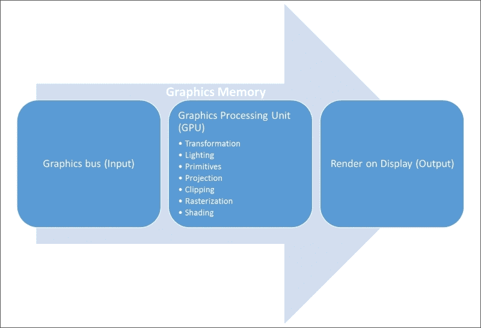

所描述的先前序列被称为图形管线。对过程中每一步的详细讨论超出了我们书籍的范围，但了解图形管线的基本知识是好的，所以这里有一些基础知识：

+   **图形总线**：在计算机术语中，总线只是移动数据的一种方式。将总线想象成高速公路：高速公路上的车道越多，交通就越快。在你的计算机内部，交通是数据位，而大多数现代显卡都有 64 条车道（称为 64 位总线），这允许同时移动多达 64 位（或 8 字节）的数据。图形总线直接从 CPU 接收其数据。

    +   **图形处理单元**：GPU 做所有的工作，正如你所看到的，有很多工作要做。

    +   **变换**：每个顶点，作为一个 3D 空间中的点，必须被正确放置。需要处理几个参考系。例如，局部坐标可能描述汽车轮胎与车身之间的距离，而全局坐标描述汽车与即将到来的悬崖之间的距离。所有数据都必须转换成单一的参考系。

    +   **光照**：每个顶点都必须被照亮。这意味着将光和颜色应用到每个顶点，并从顶点之间插值光和颜色的强度。就像太阳照亮我们的世界，荧光灯照亮我们的办公室一样，GPU 使用光照数据来正确照亮你的游戏世界。

    +   **基本图形元素**：这些是用于构建更复杂对象的简单对象。类似于虚拟乐高积木套装，GPU 使用三角形、矩形、圆形、立方体、球体、圆锥体和圆柱体来构建你在游戏中的所有内容。我们将在本章后面了解更多关于这方面的内容。

    +   **投影**：一旦 GPU 构建了世界的 3D 模型，它现在必须将世界的 3D 投影到 2D 空间（记住，你的显示只有两个维度）。这类似于太阳如何将 3D 物体的 2D 影子投影出来。

    +   **裁剪**：一旦 3D 场景被投影到 2D 空间，一些顶点将位于其他顶点之后，因此在这个时候实际上看不到。裁剪，或移除不可见的顶点，将这些顶点从数据中移除，简化了整个过程。

    +   **光栅化**：我们现在有一个二维模型，它从数学上表示了必须显示在屏幕上的当前图像。光栅化是将这个虚拟图像转换为实际像素的过程，这些像素必须显示在屏幕上。

    +   **着色**：这个最终过程决定了必须应用到屏幕上每个像素的实际颜色，以正确显示在早期阶段创建的模型。甚至可以编写代码来操纵这个过程以创建特殊视觉效果。在图形管线中修改着色过程的代码被称为着色器。

+   **渲染**：当然，我们之所以做所有这些，是为了能在计算机屏幕上显示我们的游戏。图形管线的最终输出是渲染缓冲区中当前屏幕的表示。现在，CPU 只需要将渲染缓冲区中的数据交换到实际屏幕缓冲区，结果就是你在游戏中看到的下一帧！

顺便说一下，你会在幕后（前一张图中的大箭头）注意到，所有这些操作都是由显卡上的专用内存支持的。所有数据都是从 CPU 移动到显卡内存中，在那里它被处理和加工，然后再发送回 CPU。这意味着主计算机上的内存不需要为处理图形而预留。

### 小贴士

重要的是要理解，前面的图是图形管线的通用表示。不同显卡上的特定硬件可能处理方式不同，OpenGL 和 DirectX 规范也略有不同，但前面的图仍然是基本管线。

# 拿出你的武器

是时候让我们学习如何在 OpenGL 中绘制东西了。无论你是在绘制你的武器、外星飞船还是一片草叶，一切都是从非常简单的形状开始的，这些形状组合起来形成更复杂的形状。

## 获取原始形状

在 OpenGL 中可以绘制的最基本形状被称为原始形状。OpenGL 可以绘制的原始形状包括：

+   **点**：正如其名所示，点渲染一个单独的点，由一个顶点定义。

+   **线条**：线条通过两个顶点之间的线条进行渲染。

+   **三角形**：三角形由三个顶点和连接这些顶点的三条线定义。

+   **四边形**：四边形由四个顶点和连接这些顶点的四条线定义。技术上讲，四边形实际上是两个在斜边处连接在一起的三角形。

就这样，朋友们！已知存在的所有事物都可以从这四种原始形状中创建出来。在三维中进行外推，这里有这些三维原始形状：

+   平面是线的二维拉伸（好吧，我知道平面实际上并不是三维的！）

+   金字塔是四边形和四个三角形的 3D 表示。

+   立方体是四边形的 3D 拉伸。

+   球体是一个基于圆的三维结构，它由线条（是的，线条，线条越短，圆越有说服力）构成。

+   圆柱体是圆的三维拉伸。

上述列表中的对象实际上并没有定义为 OpenGL 原始形状。然而，许多 3D 建模程序将它们称为原始形状，因为它们是最简单的三维对象之一。

## 绘制原始形状

在上一章中，我们使用以下代码创建了一个立方体：

```cpp
void DrawCube()
{
  glClear(GL_COLOR_BUFFER_BIT | GL_DEPTH_BUFFER_BIT);
  glTranslatef(0.0f, 0.0f, -7.0f);
  glRotatef(fRotate, 1.0f, 1.0f, 1.0f);
  glBegin(GL_QUADS);
  glColor3f(0.0f, 1.0f, 0.0f);
  glVertex3f(1.0f, 1.0f, -1.0f); glVertex3f(-1.0f, 1.0f, -1.0f);
  glVertex3f(-1.0f, 1.0f, 1.0f); glVertex3f(1.0f, 1.0f, 1.0f);
  glColor3f(1.0f, 0.5f, 0.0f);
  glVertex3f(1.0f, -1.0f, 1.0f); glVertex3f(-1.0f, -1.0f, 1.0f);
  glVertex3f(-1.0f, -1.0f, -1.0f); glVertex3f(1.0f, -1.0f, -1.0f);
  glColor3f(1.0f, 0.0f, 0.0f);
  glVertex3f(1.0f, 1.0f, 1.0f); glVertex3f(-1.0f, 1.0f, 1.0f);
  glVertex3f(-1.0f, -1.0f, 1.0f); glVertex3f(1.0f, -1.0f, 1.0f);
  glColor3f(1.0f, 1.0f, 0.0f);
  glVertex3f(1.0f, -1.0f, -1.0f); glVertex3f(-1.0f, -1.0f, -1.0f);
  glVertex3f(-1.0f, 1.0f, -1.0f); glVertex3f(1.0f, 1.0f, -1.0f);
  glColor3f(0.0f, 0.0f, 1.0f);
  glVertex3f(-1.0f, 1.0f, 1.0f); glVertex3f(-1.0f, 1.0f, -1.0f);
  glVertex3f(-1.0f, -1.0f, -1.0f); glVertex3f(-1.0f, -1.0f, 1.0f);
  glColor3f(1.0f, 0.0f, 1.0f);
  glVertex3f(1.0f, 1.0f, -1.0f); glVertex3f(1.0f, 1.0f, 1.0f);
  glVertex3f(1.0f, -1.0f, 1.0f); glVertex3f(1.0f, -1.0f, -1.0f);
  glEnd();
  fRotate -= 0.05f;

}
```

现在，让我们来了解这段代码是如何实际工作的：

1.  每当我们想在 OpenGL 中绘制某物时，我们首先从清除渲染缓冲区开始。换句话说，每一帧都是从零开始绘制的。`glClear`函数清除缓冲区，以便我们可以开始绘制。

1.  在我们开始绘制对象之前，我们希望告诉 OpenGL 在哪里绘制它们。`glTranslatef`命令将我们移动到三维空间中的某个点，从这个点开始我们的绘制（实际上，`glTranslatef`移动了相机，但效果是相同的）。

1.  如果我们想旋转我们的对象，那么我们使用`glRotatef`函数提供该信息。回想一下，上一章中的立方体缓慢地旋转。

1.  在我们向 OpenGL 提供顶点之前，我们需要告诉 OpenGL 如何解释这些顶点。它们是单独的点？线条？三角形？在我们的例子中，我们为构成立方体面的六个正方形定义了顶点，因此我们指定`glBegin(GL_QUADS)`以让 OpenGL 知道我们将为每个四边形提供顶点。接下来我们将描述几种其他可能性。

1.  在 OpenGL 中，你在定义顶点之前指定每个顶点的属性。例如，我们使用 `glColor3f` 函数来定义我们定义的下一组顶点的颜色。后续的每个顶点都将用这个指定的颜色绘制，直到我们通过另一个 `glColor3f` 调用更改颜色。

1.  最后，我们为四边形定义每个顶点。由于四边形需要四个顶点，接下来的四个 `glVertex3f` 调用将定义一个四边形。如果你仔细查看代码，你会注意到有六组四顶点定义（每组前面都有一个颜色定义），它们共同作用来创建我们立方体的六个面。

现在你已经了解了 OpenGL 如何绘制四边形，让我们通过介绍其他类型的原语来扩展你的知识。

## 表达观点

只有一种点原语。

### Gl_Points

`glBegin(GL_POINTS)` 函数调用告诉 OpenGL，每个后续的顶点都应该被渲染为一个单独的点。点甚至可以映射上纹理，这些被称为 **点精灵**。

点实际上是根据 `glEnable` 函数的 `GL_PROGRAM_POINT_SIZE` 参数定义的大小生成的像素方块。大小定义了点每边的像素数。点的位置被定义为该方块的中心。

点的大小必须大于零，否则会产生未定义的行为。点的大小有一个实现定义的范围，给定的大小将被夹到这个范围内。还有两个 OpenGL 属性决定了点如何被渲染：`GL_POINT_SIZE_RANGE`（返回 2 个浮点数）和 `GL_POINT_SIZE_GRANULARITY`。这个特定的 OpenGL 实现将大小夹到最接近的粒度倍数。

## 排队

根据顶点列表的不同解释，有三种类型的线原语。

### Gl_Lines

当你调用 `glBegin(GL_LINES)` 时，每一对顶点被解释为一条单独的线。顶点 1 和 2 被视为一条线。顶点 3 和 4 被视为另一条线。如果用户指定了奇数个顶点，则额外的顶点将被忽略。

### Gl_Line_Strip

当你调用 `glBegin(GL_LINES)` 时，第一个顶点定义了第一条线的开始。之后的每个顶点定义了前一条线的结束和下一条线的开始。这会产生将线连接在一起直到列表中最后一个顶点的效果。因此，如果你传递 *n* 个顶点，你会得到 *n-1* 条线。如果用户只指定了一个顶点，则绘制命令将被忽略。

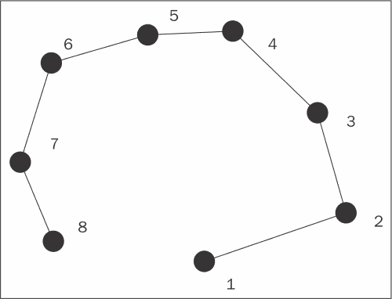

### Gl_Line_Loop

`glBegin(GL_LINE_LOOP)` 调用几乎与线带完全一样，除了第一个和最后一个顶点被作为一条线连接。因此，对于 *n* 个输入顶点，你会得到 *n* 条线。如果用户只指定了一个顶点，则绘制命令将被忽略。第一条和最后一条顶点之间的线发生在序列中的所有前一条线之后。


## 三角剖分

三角形是由三个顶点形成的原语。根据顶点流的不同的解释，有三种类型的三角形原语。

### Gl_Triangles

当你调用 `glBegin(GL_TRIANGLES)` 时，每个三个顶点定义一个三角形。顶点 1、2 和 3 形成一个三角形。顶点 4、5 和 6 形成另一个三角形。如果列表末尾少于三个顶点，它们将被忽略：

```cpp
glBegin(GL_TRIANGLES);
  glVertex3f( 0.0f, 1.0f, 0.0f);
  glVertex3f(-1.0f,-1.0f, 0.0f);
  glVertex3f( 1.0f,-1.0f, 0.0f);
glEnd();
```

### Gl_Triangle_Strip

当你调用 `glBegin(GL_TRIANGLE_STRIP)` 时，前三个顶点创建第一个三角形。之后，接下来的两个顶点创建下一个三角形，形成一个相邻三角形组。长度为 n 的顶点流将生成 *n-2* 个三角形：

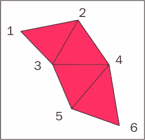

### Gl_Triangle_Fan

当你调用 `glBegin(GL_TRIANGLE_FAN)` 时，第一个顶点定义了所有其他三角形定义的点。之后，每对两个顶点定义一个新的三角形，其顶点与第一个三角形相同，形成一个扇形。长度为 *n* 的顶点流将生成 *n-2* 个三角形。任何剩余的顶点都将被忽略：

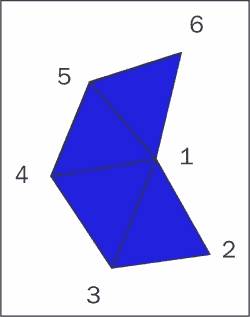

## 成方形

四边形是一个四边形，有四条边。不要混淆，认为所有四边形都是正方形或矩形。任何有四条边的形状都是四边形。预期的四个顶点应在同一平面上，否则可能导致未定义的结果。四边形通常由一对三角形组成，这可能导致伪影（图像中的意外故障）。

### Gl_Quads

当你调用 `glBegin(GL_QUADS)` 时，每组四个顶点定义一个四边形。顶点 1 到 4 形成一个四边形，而顶点 5 到 8 形成另一个。顶点列表必须是 4 的倍数才能正常工作：

```cpp
glBegin(GL_QUADS); 
  glVertex3f(-1.0f, 1.0f, 0.0f);
  glVertex3f( 1.0f, 1.0f, 0.0f);
  glVertex3f( 1.0f,-1.0f, 0.0f);
  glVertex3f(-1.0f,-1.0f, 0.0f);
glEnd();
```

### Gl_Quad_Strip

类似于三角形带，四边形带使用相邻边来形成下一个四边形。在四边形的情况下，一个四边形的第三和第四个顶点用作下一个四边形的边。因此，顶点 1 到 4 定义了第一个四边形，而 5 到 6 扩展了下一个四边形。长度为 *n* 的顶点列表将生成 *(n - 2)/2* 个四边形：

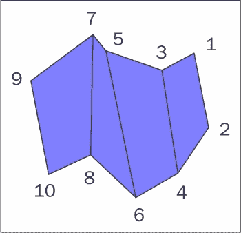

## 保存面子

我们所讨论的所有原语都是通过创建多个粘合在一起的多边形来创建的，或多或少。OpenGL 需要知道形状的哪个面朝向相机，这由绕序决定。由于你无法看到原语的前后两面，OpenGL 使用朝向来决定必须渲染哪一侧。

通常，OpenGL 负责处理绕序，以确保特定列表中的所有形状都有一致的朝向。如果你作为程序员尝试手动处理朝向，你实际上是在质疑 OpenGL。

## 回到埃及

如我们已经演示了绘制立方体的代码，让我们尝试一些更有趣的东西：一个**金字塔**。金字塔是由底部的正方形和四个三角形构成的。因此，创建金字塔的最简单方法就是创建四个`GL_TRIANGLE`原语和一个`GL_QUAD`原语：

```cpp
int DrawGlPyramid(GLvoid)
{
glClear(GL_COLOR_BUFFER_BIT | GL_DEPTH_BUFFER_BIT);
glLoadIdentity();
glTranslatef(-1.5f,0.0f,-6.0f);
glBegin(GL_TRIANGLES); 
glColor3f(1.0f,0.0f,0.0f); 
glVertex3f( 0.0f, 1.0f, 0.0f);
glColor3f(0.0f,1.0f,0.0f); 
glVertex3f(-1.0f,-1.0f, 1.0f);
glColor3f(0.0f,0.0f,1.0f);
glVertex3f( 1.0f,-1.0f, 1.0f); 
glColor3f(1.0f,0.0f,0.0f); 
glVertex3f( 0.0f, 1.0f, 0.0f);
glColor3f(0.0f,0.0f,1.0f);
glVertex3f( 1.0f,-1.0f, 1.0f);
glColor3f(0.0f,1.0f,0.0f);
glVertex3f( 1.0f,-1.0f, -1.0f); 
glColor3f(1.0f,0.0f,0.0f);
glVertex3f( 0.0f, 1.0f, 0.0f);
glColor3f(0.0f,1.0f,0.0f);
glVertex3f( 1.0f,-1.0f, -1.0f);
glColor3f(0.0f,0.0f,1.0f);
glVertex3f(-1.0f,-1.0f, -1.0f); 
glColor3f(1.0f,0.0f,0.0f);
glVertex3f( 0.0f, 1.0f, 0.0f);
glColor3f(0.0f,0.0f,1.0f);
glVertex3f(-1.0f,-1.0f,-1.0f);
glColor3f(0.0f,1.0f,0.0f);
glVertex3f(-1.0f,-1.0f, 1.0f);
glEnd();
}
```

# 建模职业

当你考虑到创建甚至最基本的形状所需的代码量时，你可能会对编写复杂的 3D 游戏感到绝望！幸运的是，有更好的工具可以创建 3D 对象。3D 建模软件允许 3D 建模师创建与艺术家使用绘图软件创建 2D 图像相似的三维对象。

将 3D 对象导入我们的游戏的过程通常有三个步骤：

1.  在 3D 建模工具中创建 3D 对象。

1.  将模型导出为数据文件。

1.  将数据文件加载到我们的游戏中。

## 混合操作

有许多流行的工具被专业人士用来创建 3D 模型。其中最受欢迎的两个是 3D Max 和 Maya。然而，这些工具也相对昂贵。结果发现，有一个非常强大的免费 3D 建模工具叫做**Blender**。我们将安装 Blender，然后学习如何使用它来为我们的游戏创建 3D 模型。

Blender 是一个适合想要尝试 3D 建模的初学者的 3D 建模和动画套件。Blender 是由 Blender 组织创建的开源软件，并且免费提供（尽管 Blender 组织将很高兴接受你的捐赠）。按照以下步骤在您的计算机上安装 Blender：

1.  前往[`www.Blender.Org`](http://www.Blender.Org)并按*Enter*。

1.  点击页面顶部的**下载**链接。

1.  下载与您的计算机兼容的文件。对于我的 64 位 Windows 计算机，我在以下截图中的圆圈中做了选择：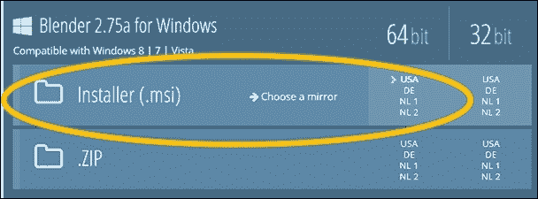

1.  下载 Blender 后，运行安装程序并接受所有默认值以在您的计算机上安装 Blender。

## Blender 概述

一旦你在你的计算机上安装了 Blender，打开它，你应该会看到以下屏幕：

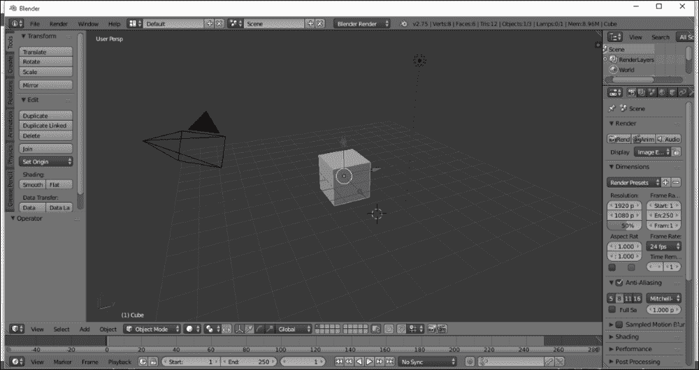

不要让屏幕的复杂性吓到你。Blender 有很多功能，你会在使用过程中逐渐学会，他们甚至尝试将许多功能直接放在你的指尖（或者说鼠标指尖）。他们甚至为你创建了一个立方体模型，让你可以立即开始。

屏幕中间是动作发生的地方。这是 3D 视图。网格为你提供了一个参考，但它不是模型的一部分。在上面的截图中，唯一的模型是立方体。

中间周围的面板提供了创建和操作对象的各种选项。我们不会有时间涵盖这些选项中的大部分，但网上有很多教程可供参考。

## 构建你的宇宙飞船

就像我们在书的 2D 部分所做的那样，我们将构建一个简单的 3D 宇宙飞船，这样我们就可以在我们的宇宙中飞来飞去。由于我是一个程序员而不是建模师，这将是一个极其简单的宇宙飞船。让我们用圆柱体来构建它。

要构建我们的宇宙飞船，我们首先想要移除立方体。使用你的右鼠标按钮选择立方体。你可以通过它发出的三个箭头来判断它是否被选中：

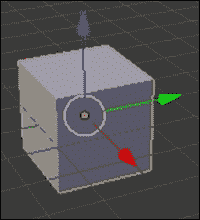

现在按下键盘上的*删除*键，立方体就会消失。

### 小贴士

如果你像我一样，你会尝试并尝试使用左鼠标按钮来选择物体。然而，Blender 使用右鼠标按钮来选择物体！

你可能会在 3D 视图中注意到另外两个物体：

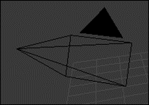

前一张图片中的物体代表相机。这不是你的游戏物体的一部分，而是代表从 Blender 内部看到的相机角度。你可以通过右键点击它并按*H*来隐藏它。

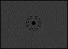

前一张图片中的物体代表光源。这不是你的游戏物体的一部分，而是代表 Blender 使用的光源。你可以通过右键点击它并按*H*来隐藏它。

现在，让我们创建那个圆柱体。在左侧面板中找到**创建**标签，并使用你的左鼠标按钮点击它：

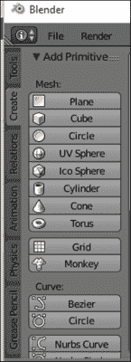

接下来，点击圆柱体按钮。Blender 将在 3D 视图中创建一个圆柱体：


注意到三个箭头。这些指示圆柱体是选中的物体。箭头用于移动、调整大小和旋转物体，但我们今天不会做这些。

你还应该注意到圆柱体内部有一个同心虚线圆圈。这表示物体的原点，即物体将围绕这个点移动、调整大小和旋转的点。

如果我们在建模一个真实物体，我们还会做很多其他的事情。由于这是一本编程书而不是建模书，我们不会做那些事情，但这里有一些未来学习的一些想法：

+   我们可以继续创建更多的物体，并使用它们来构建一个更加复杂的宇宙飞船

+   我们可以使用纹理和材质来给我们的宇宙飞船一个皮肤

## 导出物体

为了将宇宙飞船带入我们的游戏，我们必须首先将物体导出为一个可以被游戏读取的数据文件。我们可以使用很多不同的格式，但为了这个游戏，我们将使用`.obj`导出类型。要导出物体，执行以下操作：

1.  点击**文件**命令，然后点击**导出**。

1.  选择**Wavefront (.obj)**作为文件类型。

1.  在下一个屏幕中，选择你的导出位置（最好是游戏源代码的位置）并将其命名为`ship.obj`。

1.  点击屏幕右侧的**导出 OBJ**按钮。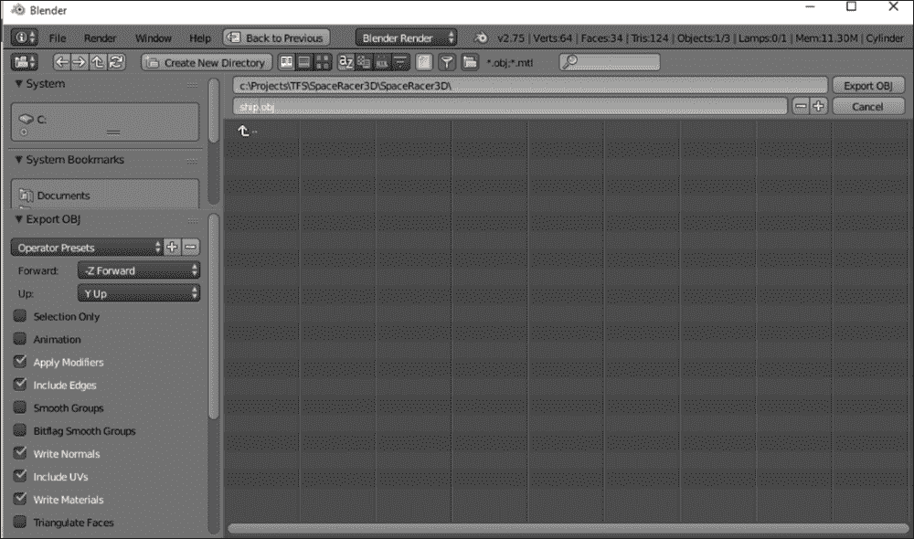

恭喜！你现在离将这个对象带入你的游戏只有一步之遥了。

## 正在加载

`.obj`文件只是一个文本文件，它存储了所有用于在 OpenGL 中渲染此对象的顶点和其他数据。以下截图显示了在记事本中打开的`ship.obj`文件：

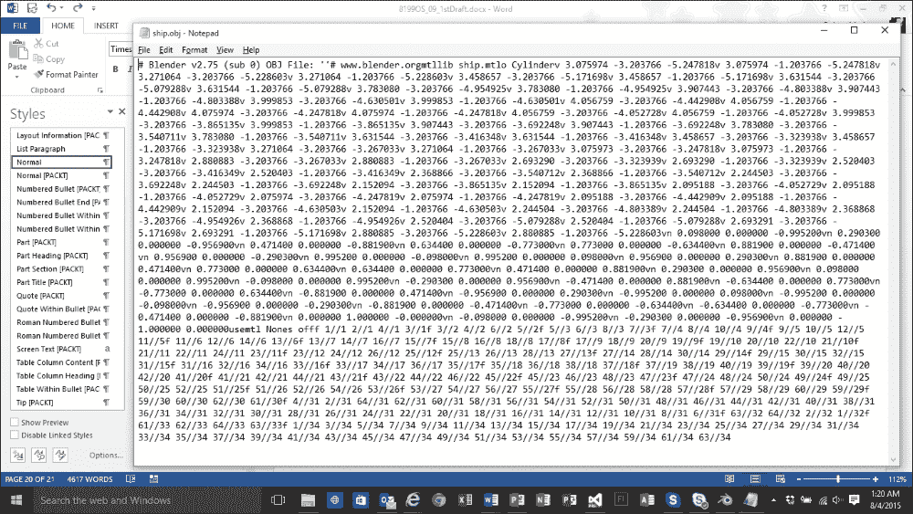

+   `#`：这定义了一个注释

+   `v`：这定义了一个顶点

+   `vt`：这定义了一个纹理坐标

+   `vn`：这定义了一个法线

+   `f`：这定义了一个面

我们现在将编写代码将此数据加载到我们的游戏中。将 SpaceRacer3D 项目打开到 Visual Studio 中。然后添加以下头文件：

```cpp
#include #include #include enum Primitive
{
 Triangles = 0,
 Quads = 1
};

struct Vec2
{
 Vec2()
 {
  x = 0.0f;
  y = 0.0f;
 }
 Vec2(const float p_x, const float p_y)
 {
  x = p_x;
  y = p_y;
 }

 float x;
 float y;
};

struct Vec3
{
 Vec3()
 {
  x = 0.0f;
  y = 0.0f;
  z = 0.0f;
 }
 Vec3(const float p_x, const float p_y, const float p_z)
 {
  x = p_x;
  y = p_y;
  z = p_z;
 }

 float x;
 float y;
 float z;
};

const bool LoadObj(
 const char * filepath, 
 std::vectortemp_vertices;
 std::vectortemp_normals;
 FILE * file = fopen(filepath, "r");
 if (file == NULL)
 {
  return false;
 }
 bool finished = false;
 while (!finished)
 {
  char line[128];
  int check = fscanf(file, "%s", line);
  if (check == EOF)
  {
   finished = true;
  }
  else
  {
   if (strcmp(line, "v") == 0)
   {
    Vec3 vertex;
    fscanf(file, "%f %f %f\n",  vertices.size(); i++)
 {
  unsigned int vertexIndex = vertices[i];
  unsigned int normalIndex = normals[i];
  Vec3 vertex = temp_vertices[vertexIndex - 1];
  Vec3 normal = temp_normals[normalIndex - 1];
  o_vertices.push_back(vertex);
  o_normals.push_back(normal);
 }
 return true;
}

Before you can compile the code you will need a to add a pre-processor definition. Open the project properties, and navigate to the C/C++ branch of the Configuration Properties. Add _CRT_SECURE_NO_WARNINGS to the Preprocessor Definitions.
```

这是加载器正在做的事情：

加载器接受参数（一个输入和三个输出）：

+   一个文件名。

+   一个指向顶点数组的指针。

+   一个指向 uvs 数组的指针。

+   一个指向法向量数组的指针。

+   创建了三个向量（C++中数组的一种类型）来存储从文件中解析出的数据。一个用于存储顶点，一个用于存储 uvs，一个用于存储法线。还创建了一个第四个向量，用于将每个顶点与一个 uv 坐标配对。

+   创建了三个临时向量作为输入缓冲区，以便在读取数据时使用。

+   现在正在读取`fbx`文件。程序寻找指示正在读取的数据类型的标志。对于我们现在的目的，我们只关心顶点数据。

+   当读取每条数据时，它会被放入适当的向量中。

+   向量被返回，以便程序可以处理它们。

简单到足以吗？但是，代码量很大，因为解析总是很有趣！对于我们来说，从模型中提取的最重要数据是顶点数组。

### 小贴士

我们还没有讨论 uvs 和法向量，因为我不想让这本书变成一本关于建模的书。Uvs 用于给对象添加纹理。由于我们没有添加任何纹理，所以不会有 uv 数据。法向量告诉 OpenGL 对象的哪个面是朝外的。这些数据用于正确渲染和照亮对象。

在下一章中，我们将使用这个加载器将我们的模型加载到游戏中。

# 概述

在本章中，我们覆盖了很多内容。你学习了如何使用 OpenGL 在代码中创建 3D 对象。同时，你也了解到实际上你并不是在代码中创建 3D 对象！相反，真正的游戏使用的是在特殊的 3D 建模软件（如 Blender）中创建的模型。

即使作为一个程序员，学习一些关于使用软件（如 Blender）的知识也是有用的，但最终你将想要找到真正知道如何充分利用这些工具的艺术家和建模师。你甚至可以在网上找到 3D 模型并将它们集成到你的游戏中。

为了结束这一切，我们学习了如何将 3D 模型加载到我们的。花几天时间在 Blender 中玩玩，看看你能想出什么，然后继续下一章！
