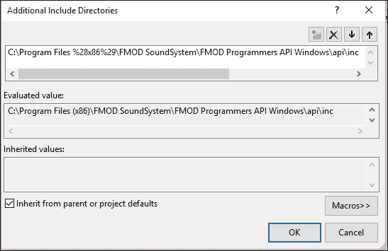
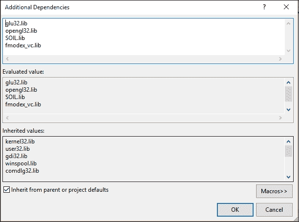
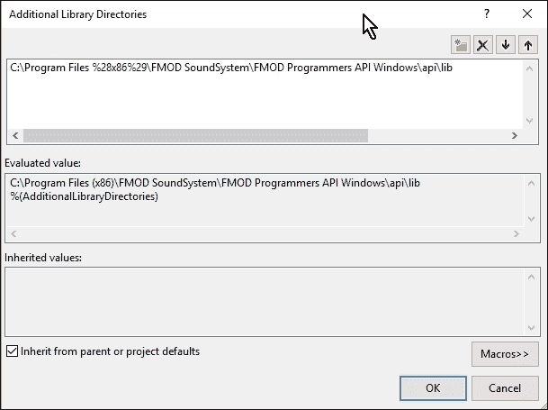
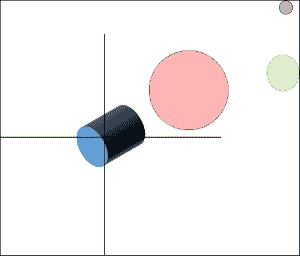
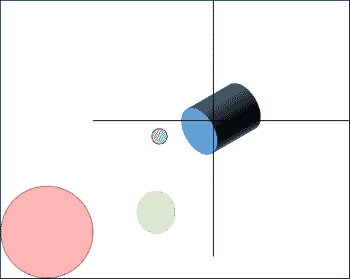
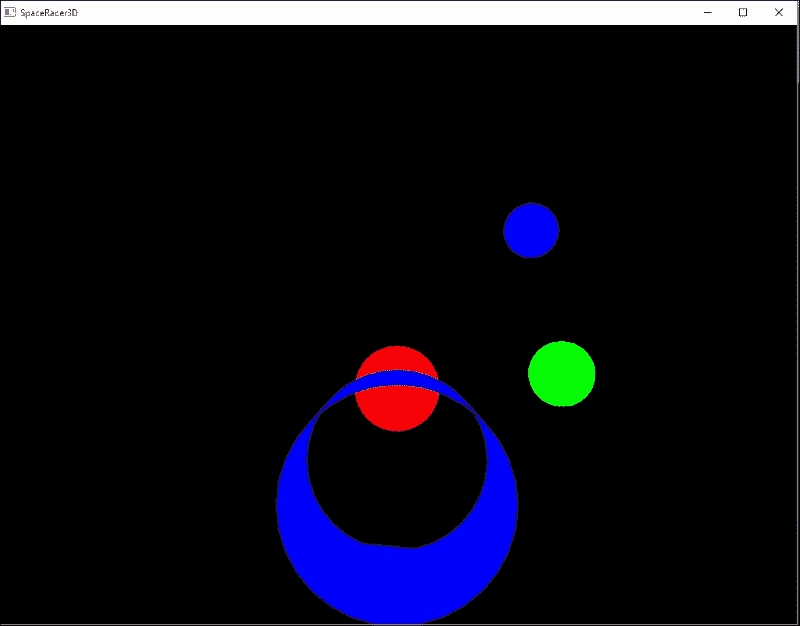
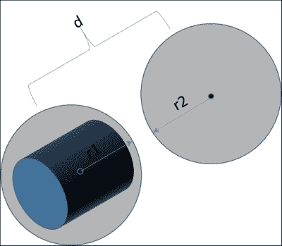

# 第十章。扩展空间

现在你已经知道如何构建你的 3D 世界，是时候做一些事情了！由于我们正在构建太空赛车游戏，我们需要能够移动我们的太空船。我们还会在游戏中放置一些障碍物，以便我们有东西可以与之竞赛。在本章中，你将学习以下主题：

+   **放置游戏对象**：我们将取一些 3D 对象，将它们加载到我们的游戏中，并在 3D 空间中放置它们。

+   **变换**：我们需要学习如何在 3D 中移动。在 2D 中移动很容易。在 3D 中，我们还有一个维度，现在我们还将想要在移动时考虑旋转。

+   **视角**：我们将学习视角如何影响我们玩游戏的方式。你想要坐在驾驶员座位上，还是只是在外面？

+   **碰撞**：我们在 2D 游戏中进行了碰撞检测。3D 中的碰撞检测更复杂，因为现在我们必须考虑检查中的三个空间维度。

# 创建 101

我们的首要任务是加载我们的世界。我们需要一些基本组件。首先，我们需要一个宇宙。这个宇宙将包含星星、小行星和我们的太空船。打开 SpaceRacer3D，让我们开始编码吧！

## 准备项目

在我们开始之前，我们需要将一些代码从我们的 2D 项目中移动过来。从 RoboRacer2D 复制以下文件和设置到 SpaceRacer3D：

1.  复制 `Input.cpp` 和 `Input.h`——我们将使用这些类来处理用户输入。

1.  复制 `Sprite.cpp`、`Sprite.h`、`SOIL.h` 和 `SOIL.lib`——我们将在下一章中使用它们来支持用户界面。你可能需要从 `Sprite.cpp` 中删除 `#include "stdafx.h"` 这一行。

1.  复制 `fmodex.dll`——我们需要这个文件来支持音频。

1.  复制项目配置属性/C/C++/常规/附加包含目录设置中的设置——这是为了提供对 FMOD 库的访问：

1.  复制项目配置属性/链接器/输入/附加依赖项设置中的设置——这是为了提供对 OpenGL、FMOD 和 SOIL 库的访问：

1.  复制项目配置属性/链接器/常规/附加库目录设置中的设置——这同样也是为了提供对 FMOD 库的访问：

## 加载游戏对象

在上一章中，我们学习了如何在 Blender 中创建 3D 对象并将它们导出为 `obj` 文件。然后，我们将代码添加到我们的项目中以加载 `obj` 数据。现在，我们将使用这段代码将一些模型加载到我们的游戏中。

我们将加载四个模型到我们的游戏中：太空船和三个小行星。想法是通过小行星带进行竞赛。由于我们的加载器将模型数据作为三个数组（顶点、纹理坐标和法线）持有，我们将创建一个模型类来定义这些数组，然后使用这个类来加载我们想要加载到游戏中的每个模型。

### 模型类头文件

创建一个新的类和头文件，分别命名为 `Model.cpp` 和 `Model.h`。打开 `Model.h`。首先，让我们设置好头文件：

```cpp
#pragma once
#include <stdlib.h>
#include <math.h>
#include "LoadObj.h"
#include "glut.h"
```

我们需要使用在 `math.h` 中定义的一些常量，因此我们需要添加一个预处理器指令。将 `_USE_MATH_DEFINES` 添加到 `Configuration Properties/C/C++/Preprocessor/Preprocessor Definitions`。注意，我们还包含了 `LoadObj.h`，因为我们将在类内部加载模型。现在，让我们创建这个类：

```cpp
class Model
{

  public:

  struct Color
  {
    Color()
    {
      r = 0.0f;
      g = 0.0f;
      b = 0.0f;
    }
    Color(const float p_r, const float p_g, const float p_b)
    {
      r = p_r;
      g = p_g;
      b = p_b;
    }
    float r;
    float g;
    float b;
  };
};
```

我们将大量使用颜色，因此我们定义了一个 `struct` 来保存 `r`、`g` 和 `b` 值，使事情更加方便。现在，对于我们的方法，我们使用以下代码：

```cpp
 Model(const char* p_filepath, const Color p_color);
 ~Model();
 void Update(const float p_deltaTime);
 void Render();
 void SetPosition(const float p_x, const float p_y, const float p_z);
 void SetPosition(const Vec3 p_position);
 const Vec3 GetPosition() const;
 void SetHeading(const float p_x, const float p_y, const float p_z);
 void SetHeading(const Vec3 p_heading);
 const Vec3 GetHeading() const;
 void SetColor(const float p_red, const float p_green, const float p_blue);
 void SetColor(const Color p_color);
 void SetBaseRotation(const float p_x, const float p_y, const float p_z);
 void SetBaseRotation(const Vec3 p_rotation);
 const Vec3 GetBaseRotation() const;
 void SetHeadingRotation(const float p_x, const float p_y, const float p_z);
 void SetHeadingRotation(const Vec3 p_rotation);
 const Vec3 GetHeadingRotation() const;
 void SetVelocity(const float p_velocity);
 const float GetVelocity() const;
 const bool IsShip();
 void IsShip(const bool p_IsShip);
 const bool IsVisible() const { return m_isVisible; };
 void IsVisible(const bool p_isVisible) { m_isVisible = p_isVisible; };
};
```

下面是每个方法的简要描述：

+   `Model` 是构造函数。它接受一个文件名和一个颜色。由于我们的模型是简单的形状，我们将使用颜色来给它们增添一些魅力。

+   `SetPosition` 和 `GetPosition` 管理对象在全局空间中的位置。

+   `SetHeading` 和 `GetHeading` 管理对象前进的方向。

+   `SetColor` 和 `GetColor` 管理对象的颜色。

+   `SetBaseRotation` 和 `GetBaseRotation` 管理应用于对象的任何局部旋转。

+   `SetHeadingRotation` 和 `GetHeadingRotation` 管理对象在全局空间中的方向。

+   `SetVelocity` 和 `GetVelocity` 管理对象的速率。

现在，对于变量，我们使用以下代码：

```cpp
m_vertices;
 std::vectorm_normals;
 Vec3 m_position;
 Vec3 m_heading;
 Vec3 m_baseRotation;
 Vec3 m_headingRotation;
 Color m_color;
 Primitive m_primitive;
 float m_velocity;

 bool m_isVisible;
 bool m_loaded;
 bool m_IsShip;

 float m_radius;
 bool m_collideable;
```

这些方法都是不言自明的，因为它们直接对应于之前描述的方法。这个头文件是我们放置世界中的对象并移动它们的良好结构。

### 实现 Model 类

现在，让我们实现这个类。打开 `Model.cpp` 并开始。首先，我们实现头文件、构造函数和析构函数：

```cpp
#include "Model.h"

Model::Model(const char* p_filepath, const Color p_color)
{
 m_filepath = p_filepath;
 m_loaded = LoadObj(m_filepath, m_vertices, m_normals, m_primitive);
 SetPosition(0.0f, 0.0f, 0.0f);
 SetHeading(0.0f, 0.0f, 0.0f);
 SetHeadingRotation(0.0f, 0.0f, 0.0f);
 SetBaseRotation(0.0f, 0.0f, 0.0f);
 IsShip(false);
 SetVelocity(0.0f);
 SetColor(p_color.r, p_color.g, p_color.b);
 SetRadius(1.0f);
 IsCollideable(true);
 IsVisible(true);
}
Model::~Model()
{
 m_vertices.clear();
 m_normals.clear();
}
```

构造函数设置了所有内容。注意，我们从构造函数中调用 `LoadObj` 来实际将对象加载到类中。结果将存储在成员数组 `m_vertices` 和 `m_normals` 中。`m_primitive` 将持有枚举，告诉我们这个对象是由四边形还是三角形定义的。其余变量被设置为默认值。这些可以在游戏中的任何时间通过使用适当的 `accessor` 方法来定义：

```cpp
float Deg2Rad(const float p_degrees)
{
  return p_degrees * (M_PI / 180.0f);

}
```

`Deg2Rad` 是一个辅助函数，它将度数转换为弧度。当我们移动船只时，我们跟踪航向角度的度数，但我们在 OpenGL 函数中经常需要使用弧度：

```cpp
void Model::Update(const float p_deltaTime)
{
 Vec3 targetRotation = GetHeadingRotation();
 Vec3 currentPosition = GetPosition();
 Vec3 targetPosition = GetPosition();

 float distance = m_velocity * p_deltaTime;
 Vec3 deltaPosition;

 deltaPosition.y = cos(Deg2Rad(targetRotation.z)) * distance;
 deltaPosition.x = -sin(Deg2Rad(targetRotation.z)) * distance;
 deltaPosition.z = sin(Deg2Rad(targetRotation.x)) * distance;

 targetPosition.x += deltaPosition.x;
 targetPosition.y += deltaPosition.y;
 targetPosition.z += deltaPosition.z;
 SetPosition(targetPosition);
}
```

`Update` 函数根据对象的速率更新对象的位置。最后，我们更新 `m_heading`，它将在渲染期间用于定位世界相机。然后更新对象在全局空间中的位置：

```cpp
void Model::Render()
{
 if (IsVisible())
 {
  glRotatef(-m_baseRotation.x, 1.0f, 0.0f, 0.0f);
  glRotatef(-m_baseRotation.y, 0.0f, 1.0f, 0.0f);
  glRotatef(-m_baseRotation.z, 0.0f, 0.0f, 1.0f);

  Vec3 targetRotation = GetHeadingRotation();
  Vec3 currentPosition = GetPosition();

  if (m_IsShip)
  {
   glPushMatrix();
   glLoadIdentity();
   glRotatef(targetRotation.x, 1.0f, 0.0f, 0.0f);
   glRotatef(targetRotation.y, 0.0f, 1.0f, 0.0f);
   glRotatef(targetRotation.z, 0.0f, 0.0f, 1.0f);
   GLfloat matrix[16];
   glGetFloatv(GL_MODELVIEW_MATRIX, matrix);
   glPopMatrix();
   glTranslatef(currentPosition.x, currentPosition.y, currentPosition.z);
   glMultMatrixf(matrix);
  }

  switch (m_primitive)
  {
  case Primitive::Quads:
   glBegin(GL_QUADS);
   break;
  case Primitive::Triangles:
   glBegin(GL_TRIANGLES);
   break;
  }
  glColor3f(m_color.r, m_color.g, m_color.b);
  for (unsigned int i = 0; i < m_vertices.size(); i++)
  {
   if (m_IsShip)
   {
    glVertex3f(m_vertices[i].x, m_vertices[i].y, m_vertices[i].z);
   }
   else
   {
    glVertex3f(m_vertices[i].x + m_position.x, m_vertices[i].y + m_position.y, m_vertices[i].z + m_position.z);
   }
  }
  glEnd();
 }
}
```

`Render` 函数负责渲染这个特定的对象。世界矩阵的设置将在游戏代码中完成。然后，游戏中的每个对象都将被渲染。

记得相机吗？相机是一个用于查看场景的虚拟对象。在我们的例子中，相机是船只。无论船只驶向何方，相机都会跟随。无论船只指向哪里，相机也会指向那里。

现在是真正的震撼点；OpenGL 实际上并没有相机。也就是说，在场景中并没有可以移动的相机。相反，相机始终位于坐标（**0.0, 0.0, 0.0**），即世界的原点。这意味着我们的船将始终位于原点。我们不会移动船，实际上我们会移动其他物体到相反的方向。当我们转向船时，实际上我们会旋转世界到相反的方向。

现在看看 `Render` 函数的代码：

+   首先，我们使用 `glRotate` 来旋转物体的基础旋转。如果需要定位物体，这会很有用。例如，我们在上一章中建模的圆柱体是立着的，在游戏中侧躺效果更好。你会在后面看到，我们给圆柱体应用了 90 度的旋转来实现这一点。

+   接下来，我们必须决定是渲染四边形还是三角形。当 Blender 导出模型时，它将其导出为四边形或三角形。加载器会确定模型是定义为四边形还是三角形，并将结果存储在 `m_primitive` 中。然后我们使用这个结果来确定这个特定物体是否必须使用三角形或四边形进行渲染。

+   我们使用 `glColor` 来设置物体的颜色。在这个阶段，我们还没有为我们的模型分配任何纹理，所以颜色为我们提供了一个简单的方式来给每个物体赋予个性。

现在是真正的工作时间！我们需要在全局空间中绘制物体的每个顶点。为此，我们遍历顶点数组中的每个点，并使用 `glVertex3f` 来放置每个点。

但要注意的是；顶点数组中的点是局部坐标。如果我们使用这些点绘制每个物体，那么它们都会在原点绘制。你可能会记得，我们希望将每个物体放置在相对于船的游戏中。因此，我们在原点绘制船，并根据船的位置绘制游戏中的每个其他物体。我们移动的是宇宙，而不是船。



当船移动时，整个坐标系也会随之移动。实际上，坐标系保持不动，整个宇宙都在它周围移动！



如果我们正在渲染船，我们只需使用其局部坐标来绘制它，它将在原点渲染。所有其他物体都根据船的位置在船的某个距离处绘制。

现在，对于类实现的其余部分，使用以下代码：

```cpp
void Model::SetPosition(const float p_x, const float p_y, const float p_z)
{
  m_position.x = p_x;
  m_position.y = p_y;
  m_position.z = p_z;
}

void Model::SetPosition(const Vec3 p_position)
{
  m_position.x = p_position.x;
  m_position.y = p_position.y;
  m_position.z = p_position.z;
}

const Vec3 Model::GetPosition() const
{
  return m_position;
}
```

这些方法设置和检索物体的位置。位置是基于物体在 `Update` 方法中的速度来改变的：

```cpp
void Model::SetHeading(const float p_x, const float p_y, const float p_z)
{
  m_heading.x = p_x;
  m_heading.y = p_y;
  m_heading.z = p_z;
}

void Model::SetHeading(const Vec3 p_heading)
{
  m_heading.x = p_heading.x;
  m_heading.y = p_heading.y;
  m_heading.z = p_heading.z;
}
const Vec3 Model::GetHeading() const
{
  return m_heading;
}
```

这些方法设置和检索物体的航向。航向是基于物体在 `Update` 方法中的航向旋转来改变的。航向是船前进的方向，用于旋转世界，使船看起来朝正确的方向前进：

```cpp
void Model::SetColor(const float p_red, const float p_green, const float p_blue)
{
  m_color.r = p_red;
  m_color.g = p_green;
  m_color.b = p_blue;
}

void Model::SetColor(const Color p_color)
{
  m_color.r = p_color.r;
  m_color.g = p_color.g;
  m_color.b = p_color.b;
}
```

这些方法用于管理对象的颜色：

```cpp
void Model::SetVelocity(const float p_velocity)
{
  m_velocity = p_velocity;
}

const float Model::GetVelocity() const
{
  return m_velocity;
}
```

这些方法用于管理对象的速率。速率在游戏代码的输入阶段设置：

```cpp
void Model::SetBaseRotation(const float p_x, const float p_y, const float p_z)
{
  m_baseRotation.x = p_x;
  m_baseRotation.y = p_y;
  m_baseRotation.z = p_z;
}

void Model::SetBaseRotation(const Vec3 p_rotation)
{
  m_baseRotation.x = p_rotation.x;
  m_baseRotation.y = p_rotation.y;
  m_baseRotation.z = p_rotation.z;
}

const Vec3 Model::GetBaseRotation() const
{
  return m_baseRotation;
}
```

这些方法用于管理对象的基本旋转。基本旋转用于在局部空间中旋转对象：

```cpp
void Model::SetHeadingRotation(const float p_x, const float p_y, const float p_z)
{
  m_headingRotation.x = p_x;
  m_headingRotation.y = p_y;
  m_headingRotation.z = p_z;
}

void Model::SetHeadingRotation(const Vec3 p_rotation)
{
  m_headingRotation.x = p_rotation.x;
  m_headingRotation.y = p_rotation.y;
  m_headingRotation.z = p_rotation.z;
}

const Vec3 Model::GetHeadingRotation() const
{
  return m_headingRotation;
}
```

这些方法用于管理对象的方向旋转。方向旋转用于围绕对象旋转世界，使对象看起来朝向特定方向。只有一个对象（飞船）将具有方向旋转。另一种思考方式是，方向旋转是摄像机的旋转，在我们的游戏中，摄像机是附着在飞船上的。

### 修改游戏代码

现在是时候修改我们的游戏代码，使其能够加载和操作游戏模型了。打开 `SpaceRacer3D.cpp`。

我们首先添加适当的头文件。在代码顶部，修改头文件定义，使其看起来像以下代码：

```cpp
#include <windows.h>
#include "Model.h"
#include "Sprite.h"
#include "Input.h"
#include "glut.h"
```

注意，我们已经添加了 `Model.h` 来加载我们的模型。我们还从 RoboRacer2D 中包含了 `Sprite.h` 和 `Input.h`，这样我们就可以在我们新游戏需要时使用这些类。

现在，我们需要定义一些全局变量来管理模型加载。在已定义的任何全局变量下面，添加以下代码：

```cpp
Model* ship;
std::vector<Model*> asteroids;
```

这些变量定义了指向我们的游戏对象的指针。由于飞船有点特殊，我们给它自己的指针。我们希望能够有任意数量的小行星；我们设置了一个指针向量（一个很好的动态数组）称为 asteroids。

移动到 `StartGame` 函数，我们使用它来初始化所有的游戏模型。修改 `StartGame` 函数，使其看起来像以下代码：

```cpp
void StartGame()
{
 //Ship
 Model::Color c(0.0f, 0.0f, 1.0f);
 ship = new Model("ship.obj", c);
 Vec3 rotation(90.0f, 0.0f, 0.0f);
 ship->SetBaseRotation(rotation);
 ship->IsShip(true);
 ship->SetVelocity(1.0f);

 //Asteroid 1
 c.r = 1.0f;
 c.g = 0.0f;
 c.b = 0.0f;
 Model* asteroid = new Model("asteroid.obj", c);
 Vec3 position(0.0f, 0.0f, -10.0f);
 asteroid->SetPosition(position);
 asteroids.push_back(asteroid);

 //Asteroid 2
 c.r = 0.0f;
 c.g = 1.0f;
 c.b = 0.0f;
 asteroid = new Model("asteroid.obj", c);
 position.x = 5.0f;
 position.y = 0.0f;
 position.z = -15.0f;
 asteroid->SetPosition(position);
 asteroids.push_back(asteroid);

 //Asteroid 3
 c.r = 0.0f;
 c.g = 1.0f;
 c.b = 1.0f;
 asteroid = new Model("asteroid.obj", c);
 position.x = 5.0f;
 position.y = 5.0f;
 position.z = -20.0f;
 asteroid->SetPosition(position);
 asteroids.push_back(asteroid);
}
```

我们将创建一个飞船对象和三个小行星对象。对于每个对象，我们首先定义一个颜色，然后创建一个新的 `Model`，传递对象的文件名和颜色。`Model` 类将加载从 Blender 导出的对象文件。

注意，我们使用 `IsCamera(true)` 调用将飞船设置为相机。我们还使用 `AttachCamera(ship)` 调用将飞船作为相机附加到每个游戏对象。

我们还为每个对象设置了一个位置。这将设置世界空间中的位置。这样我们就不会在每个对象的原点绘制每个对象了！

每个小行星都使用 `push.back` 方法放入小行星数组中。

现在，我们转到 `Update` 函数。修改 `Update` 函数，使其看起来像以下代码：

```cpp
void Update(const float p_deltaTime)
{

  ship->Update(p_deltaTime);

  for (unsigned int i = 0; i < asteroids.size(); i++)
  {
    asteroids[i]->Update(p_deltaTime);
  }
}
```

更新只是调用游戏中每个对象的 `Update` 方法。像往常一样，更新基于游戏中经过的时间量，所以我们传递 `p_deltaTime`。

现在转到 `Render` 函数。用以下代码替换现有的代码：

```cpp
void Render()
{
 glClear(GL_COLOR_BUFFER_BIT | GL_DEPTH_BUFFER_BIT);
 glMatrixMode(GL_MODELVIEW);
 glLoadIdentity();

 for (unsigned int i = 0; i < asteroids.size(); i++)
 {
  asteroids[i]->Render();
 }
 ship->Render();
 SwapBuffers(hDC);
}
```

渲染代码是游戏中的真正工作马。首先，我们设置本帧的渲染调用，然后对每个游戏对象调用 `Render` 方法：

+   `GlClear`：此操作清除渲染缓冲区。

+   `GlMatrixMode`：这会将模型设置为模型视图。所有平移和旋转都应用于模型视图。

+   `glLoadIdentity()`：这会重置矩阵。

+   接下来，我们为游戏中的每个对象调用`Render`方法。

+   最后，我们调用`SwapBuffers`，这实际上会将场景渲染到屏幕上。

恭喜！如果您现在运行游戏，应该能看到飞船和远处的三个小行星。由于我们设置了飞船的速度为 1.0，您也应该看到飞船缓慢地穿过小行星。然而，我们还没有任何控制飞船的方法，因为我们还没有实现任何输入。



# 掌控

我们现在有一个加载和渲染游戏对象的框架。但是，我们没有移动飞船的方法！好消息是，我们已经在 RoboRacer2D 中编写了一个输入类，并且可以在这里重用那段代码。

## 实现输入

在本章的早期，我让您将`Input`类从 RoboRacer2D 复制到 SpaceRacer3D 的源文件夹中。现在，我们只需将其连接到我们的游戏代码中。

打开 SpaceRacer3D。首先，我们需要包含输入头文件。在头文件中添加以下代码行：

```cpp
#include "Input.h"
```

我们还需要创建一个全局指针来管理`Input`类。在模型指针下方添加以下行：

```cpp
Input* m_input;
```

接下来，我们需要创建`Input`类的一个实例。在`StartGame`函数顶部添加以下代码行：

```cpp
m_input = new Input(hWnd);
```

现在，我们必须创建一个函数来处理我们的输入。在`Update`方法上方添加以下函数：

```cpp
void ProcessInput(const float p_deltaTime)
{
 Vec3 rotation;
 m_input->Update(p_deltaTime);
 Input::Command command = m_input->GetCommand();
 switch (command)
 {
 case Input::CM_STOP:
 {
  if (ship->GetVelocity() > 0.0f)
  {
   ship->SetVelocity(0.0f);
  }
  else
  {
   ship->SetVelocity(1.0f);
  }
 }
 break;
 case Input::CM_DOWN:
 {
  rotation = ship->GetHeadingRotation();
  rotation.x += -1.0f;
  if (rotation.x < 0.0f)
  {
   rotation.x = 359.0f;
  }
  if (rotation.x < 359.0f && rotation.x > 180.0f)
  {
   if (rotation.x < 315.0f)
   {
    rotation.x = 315.0f;
   }
  }
  ship->SetHeadingRotation(rotation);
 }
 break;
 case Input::CM_UP:
 {
  rotation = ship->GetHeadingRotation();
  rotation.x += 1.0f;
  if (rotation.x > 359.0f)
  {
   rotation.x = 0.0f;
  }
  if (rotation.x > 0.0f && rotation.x < 180.0f)
  {
   if (rotation.x > 45.0f)
   {
    rotation.x = 45.0f;
   }
  }
  ship->SetHeadingRotation(rotation);
 }
 break;
 case Input::CM_LEFT:
 {
  rotation = ship->GetHeadingRotation();
  rotation.z += 1.0f;
  if (rotation.z > 359.0f)
  {
   rotation.z = 0.0f;
  }
  if (rotation.z > 0.0f && rotation.z < 180.0f)
  {
   if (rotation.z > 45.0f)
   {
    rotation.z = 45.0f;
   }
  }
  ship->SetHeadingRotation(rotation);
 }
 break;
 case Input::CM_RIGHT:
 {
  rotation = ship->GetHeadingRotation();
  rotation.z += -1.0f;
  if (rotation.z < 0.0f)
  {
   rotation.z = 359.0f;
  }
  if (rotation.z < 359.0f && rotation.z > 180.0f)
  {
   if (rotation.z < 315.0f)
   {
    rotation.z = 315.0f;
   }
  }
  ship->SetHeadingRotation(rotation);
 }
 break;
 }
}
```

此代码处理键盘输入。您会记得从 RoboRacer2D 中，我们将虚拟命令映射到以下键：

+   `CM_STOP`：这是空格键。我们使用空格键作为切换来启动和停止飞船。如果飞船停止，按下空格键会设置速度。如果飞船的速度大于零，则按下空格键会将速度设置为零。

+   `CM_UP`：这是向上箭头键和*W*键。按下任一键都会改变航向旋转，使飞船向上移动。

+   `CM_DOWN`：这是向下箭头键和*S*键。按下任一键都会改变航向旋转，使飞船向下移动。

+   `CM_LEFT`：这是左箭头键和*A*键。按下任一键都会改变航向旋转，使飞船向左移动。

+   `CM_RIGHT`：这是向右箭头键和*D*键。按下任一键都会改变航向旋转，使飞船向右移动。

每个方向命令通过检索当前航向角度并改变航向向量的适当分量一度来实现。航向角度由每个对象的`Update`方法用来计算航向向量，该向量用于在`Render`方法中指向相机。

最后，我们需要从游戏的 `Update` 函数中调用 `HandleInput`。在对象更新调用之前，将以下代码行添加到 `Update` 方法的顶部。我们希望首先处理输入，然后调用每个对象的更新方法：

```cpp
ProcessInput(p_deltaTime);
```

就这样！给自己鼓掌并运行游戏。你现在可以使用键盘来控制飞船并导航你的宇宙。

# 小行星回转滑雪

现在是时候实现本章的最后一个特性了。我们将实现一个带有转折点的回转滑雪比赛。在典型的回转滑雪中，目标是绕过每个障碍物而不触碰它。为了简化问题，我们将通过每个小行星。如果你成功通过每个小行星，你就赢得了比赛。

## 设置碰撞检测

为了确定你是否通过了小行星，我们必须实现一些 3D 碰撞检测。有许多种类的碰撞检测，但我们将保持简单，并实现球形碰撞检测。

球形碰撞检测是一个简单的检查，看看两个 3D 对象中心是否在彼此的一定距离内。由于我们的陨石是球形的，这将是一个相当准确的指示，表明我们是否与之相撞。然而，飞船不是球形的，所以这种方法并不完美。

让我们从向 `Model` 类添加适当的方法开始我们的碰撞检测编码。打开 `Model.h` 并添加以下方法：

```cpp
const bool IsCollideable();
void IsCollideable(const bool collideable);
const bool CollidedWith(Model* target);
const Vec3 GetCenter() const;
void SetRadius(const float p_radius);
const float GetRadius() const;
```

这是我们将如何使用每个方法：

+   `IsCollideable` 用于获取或设置 `m_collideable` 标志。对象默认设置为可碰撞。我们游戏中的所有对象都设置为可碰撞，这样我们就可以检测飞船是否撞上了小行星。然而，在游戏中有一些对象你不希望它们发生碰撞是很常见的。如果你设置 `IsCollideable(false)`，则碰撞检测将被忽略。

+   `CollidedWith` 是执行实际碰撞检测的方法。

+   `GetCenter` 是一个辅助函数，用于计算对象在全局空间中的中心点。

+   `SetRadius` 和 `GetRadius` 是帮助函数，用于管理对象的碰撞半径。

我们还需要添加两个变量来跟踪半径和碰撞：

```cpp
 float m_radius;
 bool m_collideable;
```

现在，打开 `Model.cpp` 并添加以下代码以实现碰撞方法。

首先，我们需要在构造函数中定义半径。将以下代码行添加到构造函数中：

```cpp
 SetRadius(1.0f);
 IsCollideable(true);
```

现在添加以下方法：

```cpp
const bool Model::IsCollideable()
{
  return m_collideable;
}

void Model::IsCollideable(const bool p_collideable)
{
  m_collideable = p_collideable;
}

const bool Model::CollidedWith(Model* p_target)
{
  if (p_target->IsCollideable() && this->IsCollideable())
  {
    const Vec3 p1 = this->GetCenter();
    const Vec3 p2 = p_sprite->GetCenter();

    float y = p2.y - p1.y;
    float x = p2.x - p1.x;
    float z = p2.z - p1.z;
    float d = x*x + y*y + z*z;

    float r1 = this->GetRadius() * this->GetRadius();
    float r2 = p_sprite->GetRadius() * p_sprite->GetRadius();

    if (d <= r1 + r2)
    {
      return true;
    }
  }
  return false;
}

const Vec3 Model::GetCenter() const
{
 Vec3 center;
 center = GetPosition();
 if (m_IsShip)
 {
  center.z = -m_position.y;
  center.x = m_position.x;
  center.y = m_position.z;
 }
 return center;
}

void Model::SetRadius(const float p_radius)
{
  m_radius = p_radius;
}

const float Model::GetRadius() const
{
  return m_radius;
}
```

+   `IsCollideable` 和重写用于获取对象是否可以碰撞或获取碰撞标志的状态。

+   `GetCenter` 返回对象的当前位置。由于我们用对象原点在中心建模了所有对象，返回位置也返回了对象中心。一个更复杂的算法将使用对象的边界大小来计算中心。

+   `GetRadius` 和 `SetRadius` 管理半径，这对于碰撞检查代码是必需的。

+   `CollidedWith`是执行所有工作的方法。在确认当前对象和目标对象都可以发生碰撞之后，该方法执行以下操作：

    +   获取两个物体的中心点

    +   计算两个中心点之间的 3D 距离

    +   检查距离是否小于两个半径之和。如果是这样，则两个物体已经相撞：

    

如果你足够敏锐，你会注意到这种碰撞检测与 RoboRacer2D 中使用的碰撞检测非常相似。我们只是简单地给方程增加了 z 维度。

## 打开碰撞

现在，我们将在游戏中实现碰撞检测代码。打开`SpaceRacer3D.cpp`文件，在`Update`函数之前添加以下函数：

```cpp
void CheckCollisions()
{
 bool collision = false;
 for (int i = 0; i < asteroids.size(); i++)
 {
  Model* item = asteroids[i];
  collision = ship->CollidedWith(item);
  if (collision)
  {
   item->IsCollideable(false);
   item->IsVisible(false);
   score++;
   asteroidsHit++;
  }
 }
}
```

此方法执行以下操作：

+   它定义了一个碰撞标志。

+   它遍历所有的陨石。

+   它检查小行星是否与飞船相撞。

+   如果小行星与飞船相撞，我们将小行星的`IsCollideable`属性设置为`false`。这样，当飞船穿过小行星时，碰撞就不会发生多次。对于我们的游戏，我们只需要与小行星碰撞一次，所以这已经足够了。

我们需要将碰撞检测连接到`Update`函数中。在`HandleInput`调用之后，向`Update`方法中添加以下行：

```cpp
HandleCollisions();
```

就这样。我们现在已经实现了基本的碰撞检测！

# 摘要

在本章中，我们涵盖了大量的代码。你实现了一个简单而有效的框架，用于在游戏中创建和管理 3D 对象。这个类包括了加载模型、在 3D 空间中定位模型以及检测碰撞所必需的功能。

我们还在游戏中实现了输入和碰撞检测，以创建一个修改过的回旋赛，要求你穿过每一个陨石。

在下一章中，我们将实现用户界面和计分系统，使这个游戏更加完整。
