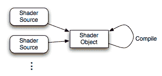
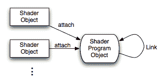
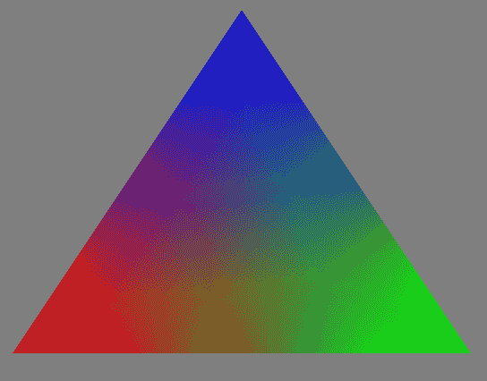

# 开始使用 GLSL

在本章中，我们将涵盖以下内容：

+   使用加载库访问最新的 OpenGL 功能

+   使用 GLM 进行数学计算

+   确定 GLSL 和 OpenGL 版本

+   编译着色器

+   链接着色器程序

+   保存和加载着色器二进制文件

+   加载 SPIR-V 着色器程序

# 简介

**OpenGL 着色语言**（**GLSL**）的 4.0 版本为对创建现代、交互式和图形程序感兴趣的程序员带来了前所未有的力量和灵活性。它通过提供一个简单而强大的语言和 API，以直接的方式利用现代**图形处理单元**（**GPU**）的力量。当然，使用 GLSL 的第一步是创建一个利用 OpenGL API 的程序。GLSL 程序不能独立存在；它们必须成为更大的 OpenGL 程序的一部分。在本章中，我们将提供一些入门的技巧和技术。我们将介绍如何加载、编译、链接和导出 GLSL 着色器程序。首先，让我们从一些背景知识开始。

# GLSL

GLSL（OpenGL 着色语言）是 OpenGL API 的基本和不可或缺的部分。使用 OpenGL API 编写的每个程序都会在内部使用一个或多个 GLSL 程序。这些“小程序”被称为**着色器程序**。一个着色器程序通常由几个称为**着色器**的组件组成。每个着色器在 OpenGL 管道的不同阶段执行。每个着色器都在 GPU 上运行，正如其名称所暗示的，它们（通常是）实现与光照和着色效果相关的算法。然而，着色器能够做的远不止着色。它们可以执行动画、生成额外的几何形状、对几何形状进行细分，甚至执行通用计算。

研究领域称为**通用计算在图形处理单元上**（**GPGPU**）关注的是利用 GPU（通常使用如 CUDA 或 OpenCL 之类的专用 API）执行通用计算，如流体动力学、分子动力学和密码学。随着 OpenGL 4.3 中引入的计算着色器，我们现在可以在 OpenGL 中执行 GPGPU。有关使用计算着色器的详细信息，请参阅第十一章，*使用计算着色器*。

着色器程序是为在 GPU 上直接执行而设计的，并且是并行执行的。例如，片段着色器可能为每个像素执行一次，每次执行都是同时进行的。显卡上的处理器数量决定了可以同时执行的数量。这使得着色器程序非常高效，并为程序员提供了一个简单的 API 来实现高度并行的计算。

着色器程序是*OpenGL 管道*的基本部分。在 OpenGL 版本 2.0 之前，着色算法被**硬编码**到管道中，并且只有有限的配置能力。当我们想要实现自定义效果时，我们使用各种技巧来强制固定功能管道比它实际更灵活。随着 GLSL 的出现，我们现在能够用我们用 GLSL 编写的自己的程序来替换这个硬编码的功能，从而给我们带来大量的额外灵活性和能力。有关这个可编程管道的更多详细信息，请参阅第三章的介绍，*GLSL 着色器的基础*。

实际上，OpenGL 版本 3.2 及以上不仅提供了这种能力，而且它们要求每个 OpenGL 程序都包含着色器程序。旧的固定功能管道已被弃用，转而采用新的可编程管道，其关键部分是使用 GLSL 编写的着色器程序。

# 配置文件 - 核心与兼容性

OpenGL 版本 3.0 引入了**弃用模型**，允许逐步从 OpenGL 规范中删除函数。函数或特性可以被标记为已弃用，这意味着它们预计将在 OpenGL 的未来版本中被移除。例如，使用`glBegin`/`glEnd`进行即时模式渲染在版本 3.0 中被标记为已弃用，并在版本 3.1 中被移除。

为了保持向后兼容性，OpenGL 3.2 引入了**兼容性配置文件**。一个为特定版本的 OpenGL（移除了旧功能）编写代码的程序员会使用**核心配置文件**。那些希望与旧功能保持兼容的人可以使用兼容性配置文件。

可能有些令人困惑的是，还有一个**向前兼容**上下文的概念，它与核心/兼容配置文件的概念略有区别。一个被认为是向前兼容的上下文基本上表明所有已弃用的功能都已移除。换句话说，如果一个上下文是向前兼容的，它只包括核心中的函数，但不包括那些被标记为已弃用的。一些 Windows API 提供了选择与配置文件一起的向前兼容状态的能力。

选择核心或兼容配置文件步骤取决于 Windows 系统的 API。例如，使用 GLFW，可以通过以下代码选择一个向前兼容的 4.6 核心配置文件：

```cpp
glfwWindowHint(GLFW_CONTEXT_VERSION_MAJOR, 4); 
glfwWindowHint(GLFW_CONTEXT_VERSION_MINOR, 6); 
glfwWindowHint(GLFW_OPENGL_FORWARD_COMPAT, GL_TRUE); 
glfwWindowHint(GLFW_OPENGL_PROFILE, GLFW_OPENGL_CORE_PROFILE); 

GLFWwindow *window = glfwCreateWindow(800, 600, "Title", nullptr, nullptr);
```

本书中的所有程序都设计为与向前兼容的 OpenGL 4.6 核心配置文件兼容。然而，许多程序也可以用于较旧版本或甚至兼容配置文件。

# 使用加载库访问最新的 OpenGL 功能

在 Windows 上，OpenGL 的**应用程序二进制接口**（**ABI**）被冻结在 OpenGL 版本 1.1。不幸的是，对于 Windows 开发者来说，这意味着无法直接链接到 OpenGL 新版本中提供的函数。相反，必须通过在运行时获取函数指针来访问 OpenGL 函数。获取函数指针并不困难，但需要一些繁琐的工作，并且有使代码杂乱无章的倾向。此外，Windows 通常附带一个符合 OpenGL 1.1 标准的标准 OpenGL `gl.h`文件。

OpenGL 维基百科指出，微软没有计划更新他们编译器附带的`gl.h`和`opengl32.lib`。幸运的是，其他人已经提供了通过透明地提供所需函数指针，同时在头文件中公开所需功能来为我们管理所有这些的库。这样的库被称为**OpenGL 加载库**（或**OpenGL 函数加载器**），有多个这样的库可用。其中最古老的一个是**OpenGL 扩展包装器**（**GLEW**）。然而，GLEW 有几个问题。首先，它提供了一个包含 OpenGL 所有版本中所有内容的单个大头文件。可能更倾向于有一个更精简的头文件，只包含我们可能使用的函数。其次，GLEW 作为需要单独编译并链接到我们的项目的库进行分发。我发现有一个加载器，只需添加源文件并将其直接编译到我们的可执行文件中，就可以将其包含到项目中，避免了支持另一个链接时依赖的需要。

在这个菜谱中，我们将使用一个名为 GLAD 的加载器生成器，它可以从[`github.com/Dav1dde/glad`](https://github.com/Dav1dde/glad)获取。这个非常灵活且高效的库可以生成只包含所需功能的头文件，并且只生成几个文件（一个源文件和一些头文件），我们可以直接将其添加到我们的项目中。

# 准备工作

要使用 GLAD，您可以通过`pip`下载并安装它（或从[`github.com/Dav1dde/glad`](https://github.com/Dav1dde/glad)），或者您可以使用这里提供的网络服务：[`glad.dav1d.de/`](http://glad.dav1d.de/)。如果您选择安装它，您将需要 Python。安装很简单，GitHub 页面上有详细的描述。

# 如何做这件事...

第一步是生成您选择的 OpenGL 版本和配置的头文件和源文件。在这个例子中，我们将为 OpenGL 4.6 核心配置生成文件。然后我们可以将这些文件复制到我们的项目中，并直接与我们的代码一起编译：

1.  要生成头文件和源文件，请运行以下命令：

```cpp
glad --generator=c --out-path=GL --profile=core --api=gl=4.6
```

1.  上一步将生成输出到名为`GL`的目录中。将会有两个目录：`GL/include`和`GL/src`。你可以直接将 GL 目录移动到你的项目中，或者将单个文件移动到适当的位置。在构建时包含`GL/src/glad.c`，并将`GL/include`放入你的`include`路径中。在程序代码中，每当需要访问 OpenGL 函数时，请包含`glad/glad.h`。请注意，这完全替换了`gl.h`，因此不需要包含它。

1.  为了初始化函数指针，你需要确保调用一个执行此操作的函数。所需的函数是`gladLoadGL()`。在创建 GL 上下文之后（通常在初始化函数中），在调用任何 OpenGL 函数之前，使用以下代码：

```cpp
if(!gladLoadGL()) {
  std::cerr << "Unable to load OpenGL functions!" << std::endl;
  exit(EXIT_FAILURE);
}
```

就这些了！

# 它是如何工作的...

第 1 步的命令生成了一些头文件和源文件。头文件提供了所有选定 OpenGL 函数的原型，将它们重新定义为函数指针，并定义了所有 OpenGL 常量。源文件提供了函数指针的初始化代码以及一些其他实用函数。我们可以在需要 OpenGL 函数原型的任何地方包含`glad/glad.h`头文件，因此所有函数入口点在编译时都可用。在运行时，`gladLoadGL()`调用将初始化所有可用的函数指针。

一些函数指针可能无法成功初始化。这可能发生在你的驱动程序不支持请求的 OpenGL 版本时。如果发生这种情况，调用这些函数将失败。

GLAD 的可用命令行参数在 GitHub 网站上进行了全面文档记录，并且可以通过`glad -h`访问。可以选择任何 OpenGL 版本，选择核心/兼容性配置文件，包含所需的扩展，以及/或创建调试回调。

# 还有更多...

GLAD 提供了一个位于[`glad.dav1d.de/`](http://glad.dav1d.de/)的 Web 服务，这使得在不安装 GLAD 的情况下生成加载器源文件和头文件变得容易。只需访问 URL，选择所需的配置，加载器文件就会被生成并下载。

# 参见

+   示例代码中的`ingredients/scenerunner.h`文件

+   GLEW，一个较老但流行的加载器和扩展管理器，可以从[`glew.sourceforge.net`](http://glew.sourceforge.net)获取

# 使用 GLM 进行数学运算

数学是计算机图形学的核心。在早期版本中，OpenGL 通过标准矩阵栈（`GL_MODELVIEW`和`GL_PROJECTION`）提供了管理坐标变换和投影的支持。然而，在现代核心 OpenGL 版本中，所有支持矩阵栈的功能都已删除。因此，我们必须提供自己的支持来处理通常的变换和投影矩阵，然后将它们传递到我们的着色器中。当然，我们可以编写自己的矩阵和向量类来管理这些，但有些人可能更喜欢使用现成的、健壮的库。

有这样一个库，就是由 Christophe Riccio 编写的**OpenGL Mathematics**（**GLM**）。其设计基于 GLSL 规范，因此语法对使用 GLSL 的人来说很熟悉。此外，它还提供了包含类似于一些被广泛怀念的 OpenGL 实用函数的功能的扩展，例如`glOrtho`、`glRotate`或`gluLookAt`。

# 准备工作

由于 GLM 是一个仅包含头文件的库，安装很简单。从[`glm.g-truc.net`](http://glm.g-truc.net)下载最新的 GLM 发行版。然后，解压缩存档文件，并将包含在其中的`glm`目录复制到编译器的包含路径中的任何位置。

# 如何做到这一点...

要使用 GLM 库，需要包含核心头文件以及任何扩展的头文件。对于这个例子，我们将包含矩阵变换扩展：

```cpp
#include <glm/glm.hpp> 
#include <glm/gtc/matrix_transform.hpp> 
```

GLM 类在`glm`命名空间中可用。以下是如何使用其中一些类的示例：

```cpp
glm::vec4 position = glm::vec4( 1.0f, 0.0f, 0.0f, 1.0f ); 
glm::mat4 view = glm::lookAt( 
        glm::vec3(0.0f, 0.0f, 5.0f),
        glm::vec3(0.0f, 0.0f, 0.0f),
        glm::vec3(0.0f, 1.0f, 0.0f) 
   ); 
glm::mat4 model(1.0f);   // The identity matrix 
model = glm::rotate( model, 90.0f, glm::vec3(0.0f,1.0f,0.0) ); 
glm::mat4 mv = view * model; 
glm::vec4 transformed = mv * position; 
```

# 它是如何工作的...

GLM 库是一个仅包含头文件的库。所有的实现都包含在头文件中。它不需要单独编译，也不需要将你的程序链接到它。只需将头文件放在你的包含路径中即可！

之前的例子首先创建了一个`vec4`（一个四分量向量），它代表一个位置。然后，它使用`glm::lookAt`函数创建了一个 4 x 4 的视图矩阵。这与旧的`gluLookAt`函数类似。在这里，我们将摄像机的位置设置为(0, 0, 5)，朝向原点，*向上*方向沿着正*y*轴。然后，我们继续创建模型矩阵，首先将单位矩阵存储在`model`变量中（通过单参数构造函数），然后使用`glm::rotate`函数乘以一个旋转矩阵。

这里的乘法是由`glm::rotate`函数隐式完成的。它将其第一个参数乘以由函数生成的旋转矩阵（在右侧）。第二个参数是旋转角度（以度为单位），第三个参数是旋转轴。由于在此语句之前，`model`是单位矩阵，所以最终结果是`model`变成了绕*y*轴旋转 90 度的旋转矩阵。

最后，我们通过将`view`和`model`变量相乘来创建我们的模型视图矩阵（`mv`），然后使用组合矩阵来变换位置。请注意，乘法运算符已被重载以按预期的方式工作。

顺序在这里很重要。通常，模型矩阵表示从对象空间到世界空间的转换，视图矩阵是从世界空间到相机空间的转换。因此，为了得到一个从对象空间到相机空间的转换的单个矩阵，我们希望模型矩阵首先应用。因此，模型矩阵被乘在视图矩阵的右侧。

# 还有更多...

不建议使用以下命令导入所有 GLM 命名空间：

```cpp
using namespace glm; 
```

这很可能会引起许多命名空间冲突。因此，最好根据需要使用`using`语句逐个导入符号。例如：

```cpp
#include <glm/glm.hpp> 
using glm::vec3; 
using glm::mat4; 
```

# 使用 GLM 类型作为 OpenGL 的输入

GLM 支持直接使用 OpenGL 的其中一个 OpenGL 向量函数（带有`v`后缀）将 GLM 类型传递给 OpenGL。例如，要将名为`proj`的`mat4`传递给 OpenGL，我们可以使用以下代码：

```cpp
glm::mat4 proj = glm::perspective( viewAngle, aspect, nearDist, farDist ); 
glUniformMatrix4fv(location, 1, GL_FALSE, &proj[0][0]); 
```

或者，而不是使用和号运算符，我们可以使用`glm::value_ptr`函数来获取 GLM 类型内容的指针：

```cpp
glUniformMatrix4fv(location, 1, GL_FALSE, glm::value_ptr(proj));
```

后者版本需要包含头文件`glm/gtc/type_ptr.hpp`。使用`value_ptr`可以说是更干净的方法，并且适用于任何 GLM 类型。

# 参见

+   Qt SDK 包括许多用于向量/矩阵数学的类，如果你已经在使用 Qt，这也是一个不错的选择。

+   GLM 网站([`glm.g-truc.net`](http://glm.g-truc.net))有额外的文档和示例

# 确定 GLSL 和 OpenGL 版本

为了支持广泛系统，能够查询当前驱动程序支持的 OpenGL 和 GLSL 版本是至关重要的。这样做相当简单，涉及两个主要函数：`glGetString`和`glGetIntegerv`。

注意，这些函数必须在 OpenGL 上下文创建之后调用。

# 如何实现...

以下代码将版本信息打印到`stdout`：

```cpp
const GLubyte *renderer = glGetString( GL_RENDERER ); 
const GLubyte *vendor = glGetString( GL_VENDOR ); 
const GLubyte *version = glGetString( GL_VERSION ); 
const GLubyte *glslVersion = 
       glGetString( GL_SHADING_LANGUAGE_VERSION ); 

GLint major, minor; 
glGetIntegerv(GL_MAJOR_VERSION, &major); 
glGetIntegerv(GL_MINOR_VERSION, &minor); 

printf("GL Vendor            : %s\n", vendor); 
printf("GL Renderer          : %s\n", renderer); 
printf("GL Version (string)  : %s\n", version); 
printf("GL Version (integer) : %d.%d\n", major, minor); 
printf("GLSL Version         : %s\n", glslVersion);
```

# 它是如何工作的...

注意，有两种不同的方式来检索 OpenGL 版本：使用`glGetString`和`glGetIntegerv`。前者可以提供可读的输出，但由于需要解析字符串，可能不适合程序化检查版本。`glGetString(GL_VERSION)`提供的字符串应该始终以点分隔的主版本和次版本开始，然而，次版本可能后面跟着供应商特定的构建号。此外，字符串的其余部分可以包含额外的供应商特定信息，也可能包括所选配置文件的信息（参见本章的*简介*部分）。重要的是要注意，使用`glGetIntegerv`查询版本信息需要 OpenGL 3.0 或更高版本。

对于`GL_VENDOR`和`GL_RENDERER`的查询提供了关于 OpenGL 驱动程序额外的信息。`glGetString(GL_VENDOR)`调用返回负责 OpenGL 实现的公司的名称。`glGetString(GL_RENDERER)`调用提供渲染器的名称，这是特定于某个硬件平台（例如 ATI Radeon HD 5600 系列）的。请注意，这两个值在版本之间不会变化，因此可以用来确定当前平台。

在本书的上下文中，对我们来说更重要的是对`glGetString(GL_SHADING_LANGUAGE_VERSION)`的调用，它提供了支持的 GLSL 版本号。这个字符串应该以点分隔的主版本号和次版本号开始，但与`GL_VERSION`查询类似，可能包含其他供应商特定的信息。

# 更多内容...

查询当前 OpenGL 实现的受支持扩展通常很有用。扩展名称是索引的，并且可以通过索引单独查询。我们使用`glGetStringi`变体来完成这个操作。例如，要获取存储在索引`i`处的扩展名称，我们使用`glGetStringi(GL_EXTENSIONS, i)`。要打印所有扩展的列表，我们可以使用以下代码：

```cpp
GLint nExtensions; 
glGetIntegerv(GL_NUM_EXTENSIONS, &nExtensions); 

for( int i = 0; i < nExtensions; i++ ) 
      printf("%s\n", glGetStringi( GL_EXTENSIONS, i ) );
```

# 编译着色器

要开始，我们需要知道如何编译我们的 GLSL 着色器。GLSL 编译器直接构建在 OpenGL 库中，着色器只能在运行中的 OpenGL 程序上下文中编译。

OpenGL 4.1 增加了将编译的着色器程序保存到文件的能力，使 OpenGL 程序能够通过加载预编译的着色器程序来避免着色器编译的开销（请参阅*保存和加载着色器二进制文件*食谱）。OpenGL 4.6 增加了加载编译为（或用）SPIR-V 的着色器程序的能力，SPIR-V 是定义着色器的中间语言。请参阅本章后面的*加载 SPIR-V 着色器*食谱。

编译着色器涉及创建一个着色器对象，向着色器对象提供源代码（作为字符串或字符串集），并要求着色器对象编译代码。这个过程大致可以用以下图表表示：



# 准备工作

要编译一个着色器，我们需要一个基本示例来工作。让我们从以下简单的顶点着色器开始。将其保存为名为`basic.vert.glsl`的文件：

```cpp
#version 460
in vec3 VertexPosition; 
in vec3 VertexColor; 

out vec3 Color; 

void main() 
{ 
   Color = VertexColor; 
   gl_Position = vec4( VertexPosition, 1.0 ); 
}
```

如果您对这段代码的功能感到好奇，它作为一个“传递”着色器工作。它接受`VertexPosition`和`VertexColor`输入属性，并通过`gl_Position`和`Color`输出变量将它们传递给片段着色器。

接下来，我们需要使用支持 OpenGL 的窗口工具包构建一个 OpenGL 程序的基本外壳。跨平台工具包的例子包括 GLFW、GLUT、FLTK、Qt 和 wxWidgets。在整个文本中，我将假设您可以使用您喜欢的工具包创建一个基本的 OpenGL 程序。几乎所有的工具包都有一个初始化函数的钩子、一个窗口调整大小回调（在调整窗口大小时调用）和一个绘制回调（在每次窗口刷新时调用）。为了本食谱的目的，我们需要一个创建并初始化 OpenGL 上下文的程序；它不需要做任何事情，只需显示一个空的 OpenGL 窗口。请注意，您还需要加载 OpenGL 函数指针（请参阅*使用加载库访问最新的 OpenGL 功能*食谱）。

最后，将着色器源代码加载到`std::string`（或字符数组）中。以下示例假设`shaderCode`变量是一个包含着色器源代码的`std::string`。

# 如何操作...

要编译一个着色器，请按照以下步骤操作：

1.  创建着色器对象：

```cpp
GLuint vertShader = glCreateShader( GL_VERTEX_SHADER ); 
if( 0 == vertShader ) { 
  std::cerr << "Error creating vertex shader." << std::endl;
  exit(EXIT_FAILURE); 
} 
```

1.  将源代码复制到着色器对象中：

```cpp
std::string shaderCode = loadShaderAsString("basic.vert.glsl"); 
const GLchar * codeArray[] = { shaderCode.c_str() }; 
glShaderSource( vertShader, 1, codeArray, NULL ); 
```

1.  编译着色器：

```cpp
glCompileShader( vertShader );
```

1.  验证编译状态：

```cpp
GLint result; 
glGetShaderiv( vertShader, GL_COMPILE_STATUS, &result ); 
if( GL_FALSE == result ) { 
  std::cerr << "Vertex shader compilation failed!" << std::endl;

  // Get and print the info log
  GLint logLen; 
  glGetShaderiv(vertShader, GL_INFO_LOG_LENGTH, &logLen); 
  if( logLen > 0 ) { 
    std::string log(logLen, ' '); 
    GLsizei written; 
    glGetShaderInfoLog(vertShader, logLen, &written, &log[0]); 
    std::cerr << "Shader log: " << std::endl << log;
  } 
} 
```

# 它是如何工作的...

第一步是使用`glCreateShader`函数创建着色器对象。参数是着色器的类型，可以是以下之一：`GL_VERTEX_SHADER`、`GL_FRAGMENT_SHADER`、`GL_GEOMETRY_SHADER`、`GL_TESS_EVALUATION_SHADER`、`GL_TESS_CONTROL_SHADER`，或者（自版本 4.3 起）`GL_COMPUTE_SHADER`。在这种情况下，由于我们正在编译顶点着色器，我们使用`GL_VERTEX_SHADER`。这个函数返回用于引用顶点着色器对象的值，有时称为**对象句柄**。我们将该值存储在`vertShader`变量中。如果在创建着色器对象时发生错误，此函数将返回 0，因此我们检查该错误，如果发生，我们打印一条适当的消息并终止。

在创建着色器对象之后，我们使用`glShaderSource`函数将源代码加载到着色器对象中。这个函数被设计用来接受一个字符串数组（而不是单个字符串），以便支持一次性编译多个源代码（文件、字符串）的选项。因此，在我们调用`glShaderSource`之前，我们将源代码的指针放入一个名为`sourceArray`的数组中。

`glShaderSource`的第一个参数是着色器对象的句柄。第二个是数组中包含的源代码字符串的数量。第三个参数是指向源代码字符串数组的指针。最后一个参数是一个`GLint`值数组，包含前一个参数中每个源代码字符串的长度。

在前面的代码中，我们传递了一个`NULL`值，这表示每个源代码字符串由一个空字符终止。如果我们的源代码字符串没有空终止，那么这个参数必须是一个有效的数组。请注意，一旦这个函数返回，源代码已经被复制到 OpenGL 内部内存中，因此可以释放存储源代码的内存。

下一步是编译着色器的源代码。我们通过简单地调用`glCompileShader`并传递要编译的着色器的句柄来完成这个操作。当然，根据源代码的正确性，编译可能会失败，所以下一步是检查编译是否成功。

我们可以通过调用 `glGetShaderiv` 来查询编译状态，这是一个用于查询着色器对象属性的函数。在这种情况下，我们感兴趣的是编译状态，所以我们使用 `GL_COMPILE_STATUS` 作为第二个参数。第一个参数当然是着色器对象的句柄，第三个参数是一个指向整数的指针，其中将存储状态。该函数在第三个参数中提供一个值为 `GL_TRUE` 或 `GL_FALSE` 的值，指示编译是否成功。

如果编译状态为 `GL_FALSE`，我们可以查询着色器日志，这将提供关于失败原因的额外详细信息。我们通过再次调用 `glGetShaderiv` 并传入值 `GL_INFO_LOG_LENGTH` 来查询日志的长度。这将在 `logLen` 变量中提供日志的长度。请注意，这包括空终止字符。然后我们为日志分配空间，并通过调用 `glGetShaderInfoLog` 来检索日志。第一个参数是着色器对象的句柄，第二个参数是用于存储日志的字符缓冲区的大小，第三个参数是一个指向整数的指针，其中将存储实际写入的字符数（不包括空终止字符），第四个参数是用于存储日志本身的字符缓冲区的指针。一旦检索到日志，我们就将其打印到 `stderr` 并释放其内存空间。

# 更多内容...

之前的示例仅演示了如何编译顶点着色器。还有几种其他类型的着色器，包括片段、几何和细分着色器。每种着色器类型的编译技术几乎相同。唯一的显著区别是 `glCreateShader` 的参数。

还需要注意的是，着色器编译只是第一步。类似于 C++ 这样的语言，我们需要链接程序。虽然着色器程序可以只包含一个着色器，但对于许多用例，我们必须编译两个或更多着色器，然后这些着色器必须链接成一个着色器程序对象。我们将在下一个配方中看到链接的步骤。

# 删除着色器对象

当不再需要时，可以通过调用 `glDeleteShader` 来删除着色器对象。这将释放着色器使用的内存并使句柄无效。请注意，如果着色器对象已经附加到程序对象（参考 *链接着色器程序* 配方），则它不会立即被删除，而是在从程序对象断开连接时标记为删除。

# 参见

+   示例代码中的 `chapter01/scenebasic.cpp` 文件

+   *链接着色器程序* 的配方

# 链接着色器程序

在我们编译了我们的着色器之后，在我们实际上可以将它们安装到 OpenGL 管道之前，我们需要将它们链接成一个着色器程序。链接步骤包括将一个着色器的输入变量与另一个着色器的输出变量之间的连接，以及将着色器的输入/输出变量与 OpenGL 环境中的适当位置之间的连接。

链接涉及与编译着色器时涉及的步骤相似的步骤。我们将每个着色器对象附加到一个新的着色器程序对象上，然后告诉着色器程序对象进行链接（确保在链接之前着色器对象已经编译）：



# 准备工作

对于这个配方，我们假设你已经编译了两个着色器对象，其句柄存储在 `vertShader` 和 `fragShader` 变量中。

对于本章中的这个和其他几个配方，我们将使用以下源代码作为片段着色器：

```cpp
#version 460 

in vec3 Color; 
out vec4 FragColor; 

void main() { 
  FragColor = vec4(Color, 1.0); 
} 
```

对于顶点着色器，我们将使用前一个配方中的源代码，*编译着色器*。

# 如何操作...

在我们的 OpenGL 初始化函数中，并在 `vertShader` 和 `fragShader` 指向的着色器对象编译之后，执行以下步骤：

1.  使用以下代码创建程序对象：

```cpp
GLuint programHandle = glCreateProgram(); 
if( 0 == programHandle ) 
{ 
  std::cerr << "Error creating program object." << std::endl; 
  exit(EXIT_FAILURE); 
} 
```

1.  按以下方式将着色器附加到程序对象上：

```cpp
glAttachShader( programHandle, vertShader ); 
glAttachShader( programHandle, fragShader ); 
```

1.  链接程序：

```cpp
glLinkProgram( programHandle );
```

1.  验证链接状态：

```cpp
GLint status; 
glGetProgramiv( programHandle, GL_LINK_STATUS, &status ); 
if( GL_FALSE == status ) {
  std::cerr << "Failed to link shader program!" << std::endl;
  GLint logLen; 
  glGetProgramiv(programHandle, GL_INFO_LOG_LENGTH, &logLen); 
  if( logLen > 0 ) { 
    std::string(logLen, ' ');
    GLsizei written;
    glGetProgramInfoLog(programHandle, logLen, &written, &log[0]); 
    std::cerr << "Program log: " << std::endl << log;
  } 
} 
```

1.  如果链接成功，我们可以使用 `glUseProgram` 将程序安装到 OpenGL 管道中：

```cpp
else
  glUseProgram( programHandle );
```

无论链接是否成功，清理我们的着色器对象都是一个好主意。一旦程序链接，它们就不再需要了：

```cpp
// Detach and delete shader objects
glDetachShader(programHandle, vertShader);
glDetachShader(programHandle, fragShader);
glDeleteShader(vertShader);
glDeleteShader(fragShader);
```

# 它是如何工作的...

我们首先调用 `glCreateProgram` 来创建一个空的程序对象。这个函数返回程序对象的句柄，我们将其存储在一个名为 `programHandle` 的变量中。如果程序创建出现错误，该函数将返回 0。我们检查这一点，如果发生错误，我们打印一条错误消息并退出。

接下来，我们使用 `glAttachShader` 将每个着色器附加到程序对象上。第一个参数是程序对象的句柄，第二个是要附加的着色器对象的句柄。

然后，我们通过调用 `glLinkProgram` 并提供程序对象的句柄作为唯一参数来链接程序。与编译类似，我们检查链接的成功或失败，并进行后续查询。

我们通过调用 `glGetProgramiv` 来检查链接状态。类似于 `glGetShaderiv`，`glGetProgramiv` 允许我们查询着色器程序的各种属性。在这种情况下，我们通过提供 `GL_LINK_STATUS` 作为第二个参数来请求链接状态。状态被返回到第三个参数指向的位置，在这个例子中命名为 `status`。

链接状态为`GL_TRUE`或`GL_FALSE`，表示链接成功或失败。如果状态值为`GL_FALSE`，我们将检索并显示程序信息日志，其中应包含额外的信息和错误消息。程序日志是通过调用`glGetProgramInfoLog`检索的。第一个参数是程序对象的句柄，第二个是包含日志的缓冲区大小，第三个是指向一个`GLsizei`变量的指针，其中将存储写入缓冲区的字节数（不包括空终止符），第四个是指向将存储日志的缓冲区的指针。缓冲区可以根据调用`glGetProgramiv`时返回的大小来分配，参数为`GL_INFO_LOG_LENGTH`。`log`中提供的字符串将被正确地空终止。

最后，如果链接成功，我们通过调用`glUseProgram`将程序安装到 OpenGL 管道中，提供程序句柄作为参数。

无论链接是否成功，将着色器对象分离并删除都是一个好主意。然而，如果着色器对象可能需要链接另一个程序，你应该将其从该程序中分离出来，并跳过删除操作，直到稍后。

通过编译、链接并将本食谱中的简单片元着色器和前一个食谱中的顶点着色器安装到 OpenGL 管道中，我们得到了一个完整的 OpenGL 管道，并准备好开始渲染。绘制一个三角形并为`Color`属性提供不同的值，可以得到一个多色三角形的图像，其中顶点是红色、绿色和蓝色，三角形内部三种颜色被插值，导致颜色在整个三角形中混合：



关于如何渲染三角形的详细信息，请参阅第二章，*使用 GLSL 程序*。

# 更多...

你可以在单个 OpenGL 程序中使用多个着色器程序。可以通过调用`glUseProgram`来选择所需的程序，在 OpenGL 管道中交换它们。

# 着色器输入/输出变量

你可能已经注意到，`Color`变量被用来从顶点着色器向片元着色器发送数据。在顶点着色器中有一个输出变量（`out vec3`），在片元着色器中有一个输入变量（`in vec3`），它们具有相同的名称。片元着色器接收到的值是从每个顶点相应的输出变量的值插值得到的（因此产生了前面图像中的混合颜色）。这种插值是在执行片元阶段之前由硬件光栅化器自动完成的。

当链接着色器程序时，OpenGL 会在顶点着色器和片段着色器（以及其他方面）之间建立输入和输出变量的连接。如果一个顶点着色器的输出变量与片段着色器的输入变量具有相同的名称和类型，OpenGL 将自动将它们*链接*在一起。

可以通过使用布局限定符来连接（链接）名称或类型不同的变量。使用布局限定符，我们可以为每个变量指定特定的位置。例如，假设我在我的顶点着色器中使用了这组输出变量：

```cpp
layout (location=0) out vec4 VertColor;
layout (location=1) out vec3 VertNormal;
```

我可以在片段着色器中使用这些变量：

```cpp
layout (location=0) in vec3 Color;
layout (location=1) in vec3 Normal;
```

尽管这些变量具有不同的名称（以及对于`Color`，类型），但由于它们被分配了相同的地址，它们将在程序链接时由链接器连接。在这个例子中，`VertColor`将被链接到`Color`，而`VertNormal`将被链接到`Normal`。这使得事情更加方便。我们不需要为输入/输出变量使用相同的名称，这给了我们使用在每个着色器阶段可能更具描述性的名称的灵活性。更重要的是，它是称为**独立着色器对象**的更大框架的一部分。可以在*使用程序管道*菜谱中找到独立着色器对象的完整示例。

实际上，当编译到 SPIR-V 时，使用布局限定符来指定变量位置是*必需的*（请参阅*加载 SPIR-V 着色器程序*菜谱）。

# 删除着色器程序

如果不再需要程序，可以通过调用`glDeleteProgram`从 OpenGL 内存中删除它，将程序句柄作为唯一参数提供。这将使句柄无效并释放程序使用的内存。请注意，如果程序对象当前正在使用中，它将不会立即被删除，而是在不再使用时被标记为删除。

此外，删除着色器程序会断开附加到程序上的着色器对象，但不会删除它们，除非这些着色器对象已经被之前的`glDeleteShader`调用标记为删除。因此，正如之前提到的，在程序链接后立即断开并删除它们是一个好主意，以避免意外泄漏着色器对象。

# 参见

+   示例代码中的`chapter01/scenebasic.cpp`文件

+   *编译着色器*菜谱

+   *使用程序管道*菜谱

+   *加载 SPIR-V 着色器程序*菜谱

# 保存和加载着色器二进制文件

OpenGL 4.1 引入了`glGetProgramBinary`和`glProgramBinary`函数，允许我们保存和加载编译后的着色器程序二进制文件。请注意，此功能仍然非常依赖于 OpenGL 驱动程序，并且支持范围有限。例如，macOS 上的 Intel 驱动程序不支持任何二进制格式。

不幸的是，苹果公司在 macOS Mojave 中已经弃用了 OpenGL。

在这个菜谱中，我们将概述保存和加载编译后的着色器程序所需的步骤。

# 准备工作

我们将假设一个着色器程序已经成功编译，并且其 ID 存储在 `program` 变量中。

# 如何做...

要保存着色器二进制文件，首先验证驱动程序至少支持一种着色器二进制格式：

```cpp
GLint formats = 0;
glGetIntegerv(GL_NUM_PROGRAM_BINARY_FORMATS, &formats);
if( formats < 1 ) {
  std::cerr << "Driver does not support any binary formats." << std::endl;
  exit(EXIT_FAILURE);
}

```

然后，假设至少有一个二进制格式可用，使用 `glGetProgramBinary` 来检索编译后的着色器代码并将其写入文件：

```cpp
// Get the binary length
GLint length = 0;
glGetProgramiv(program, GL_PROGRAM_BINARY_LENGTH, &length);

// Retrieve the binary code
std::vector<GLubyte> buffer(length);
GLenum format = 0;
glGetProgramBinary(program, length, NULL, &format, buffer.data());

// Write the binary to a file.
std::string fName("shader.bin");
std::cout << "Writing to " << fName << ", binary format = " << format << std::endl;
std::ofstream out(fName.c_str(), std::ios::binary);
out.write( reinterpret_cast<char *>(buffer.data()), length );
out.close();
```

要加载和使用着色器二进制文件，从存储中检索编译后的程序，并使用 `glProgramBinary` 将其加载到 OpenGL 上下文中：

```cpp
GLuint program = glCreateProgram();

// Load binary from file
std::ifstream inputStream("shader.bin", std::ios::binary);
std::istreambuf_iterator<char> startIt(inputStream), endIt;
std::vector<char> buffer(startIt, endIt);  // Load file
inputStream.close();

// Install shader binary
glProgramBinary(program, format, buffer.data(), buffer.size() );

// Check for success/failure
GLint status;
glGetprogramiv(program, GL_LINK_STATUS, &status);
if( GL_FALSE == status ) {
  // Handle failure ...
}
```

# 它是如何工作的...

驱动程序可以支持零个或多个二进制格式。使用 `GL_NUM_PROGRAM_BINARY_FORMATS` 常量调用 `glGetIntegerv` 会查询驱动程序以查看有多少可用。如果这个数字是零，OpenGL 驱动程序不支持读取或写入着色器二进制文件。如果值为一或更多，我们就可以开始了。

如果至少有一个二进制格式可用，我们可以使用 `glGetProgramBinary` 来检索前面显示的编译后的着色器代码。该函数将把使用的二进制格式写入第四个参数指向的位置。在前面的示例中，数据存储在名为 `buffer` 的向量中。

要加载着色器二进制文件，我们可以使用 `glProgramBinary`。此函数将加载之前保存的着色器二进制文件。它需要将二进制格式作为第二个参数传递。然后我们可以检查 `GL_LINK_STATUS` 以验证它是否加载无误。

# 参见

+   示例代码中的 `chapter01/scenebasic.cpp` 文件

+   *加载 SPIR-V 着色器程序* 的配方

# 加载 SPIR-V 着色器程序

**标准、可移植中间表示 - V** (**SPIR-V**) 是由 Khronos Group 设计和标准化的一个中间语言，用于着色器。它旨在成为多种不同语言的编译器目标。在 Vulkan API 中，着色器在加载之前必须编译为 SPIR-V。SPIR-V 的目的是为开发者提供自由，让他们可以使用任何他们想要的编程语言（只要它可以编译为 SPIR-V）来开发他们的着色器，并避免需要 OpenGL（或 Vulkan）实现为多种语言提供编译器的需求。

SPIR-V 着色器二进制文件的支持被添加到 OpenGL 核心版本 4.6 中，但也可以通过 `ARB_gl_spirv` 扩展在较早的 OpenGL 版本中使用。

目前，Khronos Group 为编译 GLSL 到 SPIR-V 提供了一个参考编译器。它可在 GitHub 上找到，网址为 [`github.com/KhronosGroup/glslang`](https://github.com/KhronosGroup/glslang)。

在本配方中，我们将介绍将 GLSL 着色器对预编译到 SPIR-V 并将其加载到 OpenGL 程序中的步骤。

# 准备工作

从 [`github.com/KhronosGroup/glslang`](https://github.com/KhronosGroup/glslang) 下载并编译 OpenGL 着色器验证器。请确保 `glslangValidator` 二进制文件已添加到您的 `PATH` 命令行中。在本例中，我们将使用位于 `basic.vert.glsl` 和 `basic.frag.glsl` 文件中的着色器对。

注意，你需要在着色器中为所有输入/输出变量使用显式位置。有关详细信息，请参阅*链接着色器程序*配方。

所有用于输入/输出接口（输入/输出变量）的变量都必须分配一个位置。

# 如何做...

首先，使用`glslangValidator`工具将着色器对编译成 SPIR-V：

```cpp
glslangValidator -G -o basic.vert.spv basic.vert.glsl
glslangValidator -G -o basic.frag.spv basic.frag.glsl
```

如果成功，这将生成`basic.vert.spv`和`basic.frag.spv` SPIR-V 输出文件。

要将你的 SPIR-V 着色器加载到 OpenGL 程序中，使用`glShaderBinary`和`glSpecializeShader`。使用`glShaderBinary`时，使用`GL_SHADER_BINARY_FORMAT_SPIR_V`作为二进制格式：

```cpp
GLuint vertShader = glCreateShader(GL_VERTEX_SHADER);

// Load the shader into a std::vector
std::ifstream inStream("basic.vert.spv", std::ios::binary);
std::istreambuf_iterator<char> startIt(inStream), endIt;
std::vector<char> buffer(startIt, endIt);
inStream.close();

// Load using glShaderBinary
glShaderBinary(1, &vertShader, GL_SHADER_BINARY_FORMAT_SPIR_V, buffer.data(), buffer.size());

// Specialize the shader (specify the entry point)
glSpecializeShader( vertShader, "main", 0, 0, 0);

// Check for success/failure
GLint status;
glGetShaderiv(vertShader, GL_COMPILE_STATUS, &status);
if( GL_FALSE == status ) {
  // Loading failed...
}
```

对于片段着色器的过程几乎完全相同；只需在第一行使用`GL_FRAGMENT_SHADER`而不是`GL_VERTEX_SHADER`。

最后，我们创建程序对象，附加着色器，并链接。这个过程与*链接着色器程序*配方中所示的过程相同，因此我们在这里不会重复它。

# 它是如何工作的...

`glShaderBinary`函数为我们提供了加载已编译为 SPIR-V 格式的着色器的功能。这部分相当直接。

可能有点令人困惑的函数是`glSpecializeShader`。在着色器阶段可以链接之前，我们必须调用此函数。这个调用是必需的，因为单个 SPIR-V 文件可以有多个入口点，SPIR-V 文件可以有*专门化常量*，这些是用户在编译成本地代码之前可以提供的参数。

至少，我们需要定义我们的着色器的入口点。由于源语言是 GLSL，入口点是`main`。我们通过第二个参数指定入口点（s）。对于 GLSL，我们简单地使用`main`常量字符串。最后三个参数可以用来定义专门化常量。三个中的第一个是常量的数量，下一个是指向常量索引数组的指针，最后是指向常量值数组的指针。

专门化 SPIR-V 着色器的过程类似于编译 GLSL 着色器。在调用`glSpecializeShader`之前，或者如果专门化失败，编译状态将是`GL_FALSE`。如果专门化成功，编译状态将是`GL_TRUE`。与 GLSL 着色器一样，我们可以查询着色器信息日志以获取详细的错误消息（参见*编译着色器*配方）。

# 更多...

SPIR-V 似乎将成为 Vulkan/OpenGL 空间中着色器编程的未来。然而，GLSL 并不会在短时间内消失。GLSL 编译器仍然与 OpenGL 一起提供，目前没有任何迹象表明它们将被移除或弃用。OpenGL 规范仍然将 GLSL 视为主要的着色语言。

然而，如果你想在 SPIR-V 早期加入，或者你对转向 Vulkan 感兴趣，那么现在在 OpenGL 中开始使用 SPIR-V 可能对你来说是有价值的。幸运的是，至少在 OpenGL 的最近版本中，这是可能的。

SPIR-V 的未来非常光明。已经有一个（大部分完成）针对 SPIR-V 的 HLSL 编译器，并且很可能很快会有其他语言被开发出来。这是着色器编程的激动人心时刻！

# 参见

+   示例代码中的 `chapter01/scenebasic.cpp` 文件

+   *编译着色器* 菜单

+   *链接着色器程序* 菜单
