# 第三章：GLSL 着色器的基础

在本章中，我们将涵盖以下食谱：

+   使用单个点光源进行漫反射和顶点着色

+   实现 Phong 反射模型

+   在着色器中使用函数

+   实现双面着色

+   实现平面着色

+   使用子程序选择着色器功能

+   抛弃片段以创建带有孔洞的外观

# 简介

着色器最初是在 OpenGL 的 2.0 版本中添加的，这为之前固定功能的 OpenGL 管道引入了可编程性。着色器赋予我们实现自定义渲染算法的能力，并在这些技术的实现上提供了更大的灵活性。有了着色器，我们可以在 GPU 上直接运行自定义代码，这为我们利用现代 GPU 提供的并行度提供了机会。

着色器使用**OpenGL 着色语言**（**GLSL**）实现。GLSL 在语法上类似于 C，这应该会使有经验的 OpenGL 程序员更容易学习。由于本文的性质，我不会在这里提供一个详尽的 GLSL 介绍。相反，如果你是 GLSL 的新手，阅读这些食谱应该能帮助你通过示例学习这门语言。如果你已经熟悉 GLSL，但没有 4.x 版本的经验，你将看到如何通过利用新的 API 来实现这些技术。然而，在我们深入 GLSL 编程之前，让我们快速看一下顶点着色器和片段着色器如何在 OpenGL 管道中定位。

# 顶点和片段着色器

在 OpenGL 4.3 及以上版本中，有六个着色器阶段/类型：顶点、几何、曲面细分控制、曲面细分评估、片段和计算。在本章中，我们将仅关注顶点和片段阶段。在第七章 *使用几何和曲面细分着色器* 中，我将提供一些使用几何和曲面细分着色器的食谱，而在第十一章 *使用计算着色器* 中，我将专门关注计算着色器。

着色器是现代 OpenGL 管道的基本部分。以下块图显示了仅安装了顶点和片段着色器的简化 OpenGL 管道视图：

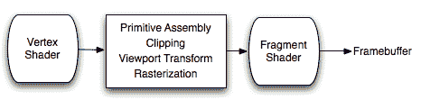

顶点数据通过管线发送，并通过着色器输入变量到达顶点着色器。顶点着色器的输入变量对应于顶点属性（参考第二章中的*使用顶点属性和顶点缓冲对象向着色器发送数据*配方，*使用 GLSL 程序工作*）。一般来说，着色器通过程序员定义的输入变量接收输入，这些变量的数据要么来自主 OpenGL 应用程序，要么来自之前的管线阶段（其他着色器）。例如，片段着色器的输入变量可能来自顶点着色器的输出变量。数据也可以通过统一变量（参考第二章中的*使用统一变量向着色器发送数据*配方，*使用 GLSL 程序工作*）提供给任何着色器阶段。这些用于比顶点属性更少变化的信息（例如，矩阵、光位置和其他设置）。以下图显示了有两个活动着色器（顶点和片段）时输入和输出变量之间关系的简化视图：

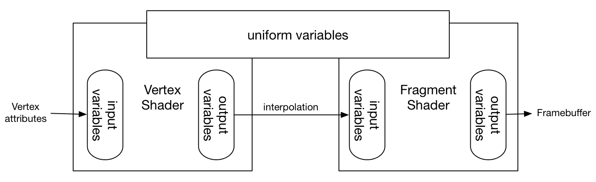

顶点着色器为每个顶点执行一次，并行执行。在顶点着色器完成执行之前，必须将对应顶点位置的数据转换成裁剪空间坐标，并分配给输出变量 `gl_Position`。顶点着色器可以使用着色器输出变量将其他信息发送到管线中。例如，顶点着色器也可能计算与顶点相关的颜色。这种颜色将通过适当的输出变量传递到后续阶段。

在顶点着色器和片段着色器之间，顶点被组装成原语，进行裁剪，并应用视口变换（以及其他操作）。然后进行光栅化过程，并填充多边形（如果需要）。片段着色器为渲染的多边形的每个片段执行一次（通常并行）。从顶点着色器提供的数据默认情况下以透视正确的方式进行插值，并通过着色器输入变量提供给片段着色器。片段着色器确定像素的适当颜色，并通过输出变量将其发送到帧缓冲区。深度信息自动处理，但可以根据需要由片段着色器修改。

# 首先学习基础知识

可编程着色器为我们提供了巨大的力量和灵活性。一个不错的起点是学习如何实现一个简单的、常见的反射模型，称为**Phong 反射模型**。这是一个很好的基础。

在本章中，我们将探讨实现 Phong 模型的基本技术。我们将对其进行一些简单的修改，包括双面渲染和平滑着色。在这个过程中，我们还将看到一些其他 GLSL 特性的示例，如函数、子程序和`discard`关键字。

# 使用单个点光源进行漫反射和顶点着色

在学习完整的 Phong 反射模型之前，我们将从仅一个部分开始：漫反射。这是一个简单的反射模型，它假设表面表现出纯漫反射。也就是说，表面看起来以相同的方式向所有方向散射光线，而不管方向如何。

入射光撞击表面并略微穿透后向所有方向重新辐射。当然，入射光在散射之前会与表面相互作用，导致某些波长的光被完全或部分吸收，而其他波长的光被散射。一个典型的漫反射表面例子是涂有哑光漆的表面。该表面看起来很暗淡，没有任何光泽。

以下图像显示了使用漫反射着色渲染的环面：

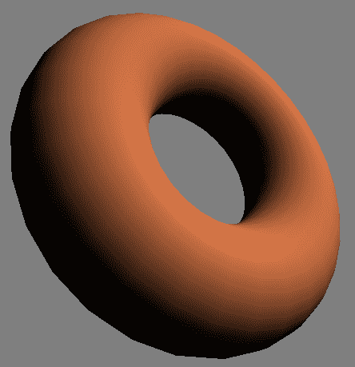

漫反射的数学模型涉及两个向量：从表面点到光源的方向（**s**），以及表面点的法向量（**n**）。这两个向量在以下图中表示：

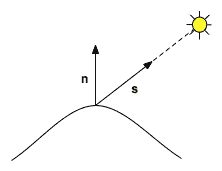

单位面积上撞击表面的入射光（或辐射度）的量取决于表面相对于光源的朝向。该情况下的物理学告诉我们，当光线沿着法向量方向到达时，单位面积上的辐射量最大，而当光线垂直于法向量时为零。在两者之间，它与光线方向与法向量之间角度的余弦值成正比。因此，由于点积与两个向量之间角度的余弦值成正比，我们可以将撞击表面的辐射量表示为光强度与**s**和**n**的点积的乘积，如下所示：

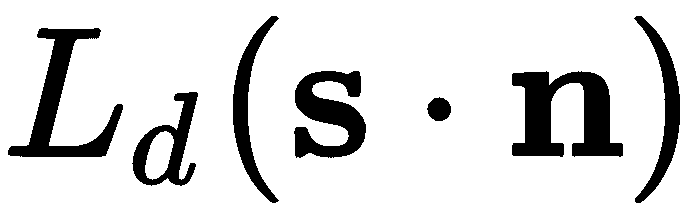

*L[d]*是光源的强度，向量**s**和**n**被假定为归一化的。

两个单位向量的点积等于它们之间角度的余弦值。

如前所述，一些入射光在重新发射之前被吸收。我们可以通过使用反射系数（*K[d]*）来模拟这种相互作用，它表示散射的入射光的比例。这有时被称为**漫反射率**或漫反射系数。漫反射率成为一个缩放因子，因此出射光的强度可以表示如下：

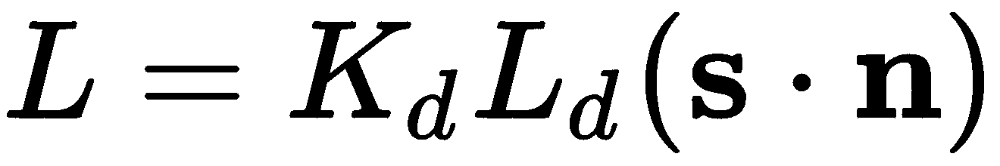

因为这个模型只依赖于指向光源的方向和表面的法线，而不依赖于指向观察者的方向，所以我们有一个表示均匀（全向）散射的模型。

在这个配方中，我们将在顶点着色器中的每个顶点上评估这个方程，并在面上插值得到的颜色。我们将使用统一变量为 *K[d]* 和 *L[d]* 项以及光源位置。

在这个和接下来的配方中，光强度和材料反射率系数由三组件（RGB）向量表示。因此，这些方程应被视为逐分量操作，分别应用于三个分量。幸运的是，GLSL 将使这一点几乎透明，因为必要的运算符在向量变量上逐分量操作。

# 准备工作

从一个提供顶点位置在属性位置 0 和顶点法线在属性位置 1 的 OpenGL 应用程序开始（请参阅第二章，*使用 GLSL 程序工作*中的*使用顶点属性和顶点缓冲对象向着色器发送数据*配方）。OpenGL 应用程序还应通过统一变量提供标准变换矩阵（投影、模型视图和法线）。

光源位置（在相机坐标系中），`Kd` 和 `Ld` 也应由 OpenGL 应用程序通过统一变量提供。注意，`Kd` 和 `Ld` 是 `vec3` 类型。我们可以使用 `vec3` 来存储 RGB 颜色以及一个向量或点。

# 如何操作...

要创建一个实现漫反射着色的着色器对，请按照以下步骤操作：

1.  顶点着色器计算漫反射方程，并通过输出变量 `LightIntensity` 将结果发送到片段着色器：

```cpp
layout (location = 0) in vec3 VertexPosition; 
layout (location = 1) in vec3 VertexNormal; 

out vec3 LightIntensity; 

uniform vec4 LightPosition;// Light position in camera coords. 
uniform vec3 Kd;           // Diffuse reflectivity 
uniform vec3 Ld;           // Light source intensity 

uniform mat4 ModelViewMatrix; 
uniform mat3 NormalMatrix; 
uniform mat4 ProjectionMatrix; 
uniform mat4 MVP;             // Projection * ModelView 

void main() 
{ 
    // Convert normal and position to eye coords 
    vec3 tnorm = normalize( NormalMatrix * VertexNormal); 
    vec4 camCoords = ModelViewMatrix * 
                     vec4(VertexPosition,1.0)); 
    vec3 s = normalize(vec3(LightPosition - camCoords)); 

    // The diffuse shading equation 
    LightIntensity = Ld * Kd * max( dot( s, tnorm ), 0.0 ); 

    // Convert position to clip coordinates and pass along 
    gl_Position = MVP * vec4(VertexPosition,1.0); 
} 
```

1.  片段着色器简单地将颜色应用到片段上：

```cpp
in vec3 LightIntensity; 
layout( location = 0 ) out vec4 FragColor; 

void main() { 
    FragColor = vec4(LightIntensity, 1.0); 
}
```

1.  在 OpenGL 应用程序中编译和链接这两个着色器，并在渲染之前安装着色器程序。有关编译、链接和安装着色器的详细信息，请参阅第一章，*开始使用 GLSL*。

# 它是如何工作的...

在这个例子中，顶点着色器完成了所有的工作。漫反射是在相机坐标系中通过首先使用法线矩阵变换法线向量，归一化，并将结果存储在 `tnorm` 中来计算的。请注意，如果您的法线向量已经归一化且法线矩阵不执行任何缩放，则这里的归一化可能不是必需的。

正交矩阵是模型视图矩阵左上角 3x3 部分的逆转。我们使用逆转是因为法向量与顶点位置变换的方式不同。关于正交矩阵的更详细讨论以及原因，请参阅任何计算机图形学入门教材（一个不错的选择是 Hearn 和 Baker 合著的《OpenGL 计算机图形学》）。如果你的模型视图矩阵不包含任何非均匀缩放，那么可以使用模型视图矩阵左上角的 3x3 部分来代替正交矩阵以变换你的法向量。然而，如果你的模型视图矩阵包含（均匀）缩放，那么在变换后你仍然需要（重新）归一化你的法向量。

下一步是将顶点位置转换为相机坐标，通过使用模型视图矩阵变换它。然后，我们通过从顶点位置减去光位置来计算指向光源的方向，并将结果存储在`s`中。

接下来，我们使用之前描述的方程计算散射光强度，并将结果存储在输出变量`LightIntensity`中。注意这里`max`函数的使用。如果点积小于零，则法向量与光方向之间的角度大于 90 度。这意味着入射光是从表面内部来的。由于这种情况意味着没有辐射到达表面，点积会产生负值，所以我们使用`0.0`的值。然而，你可能决定你想正确地照亮表面的两侧，在这种情况下，当光击中表面的背面时，需要反转法向量（参考本章中的*实现双面着色*配方）。

最后，我们通过乘以模型视图投影矩阵（即*投影 * 视图 * 模型）将顶点位置转换为裁剪空间坐标，并将结果存储在内置输出变量`gl_Position`中。

OpenGL 管道的后续阶段期望顶点位置以裁剪空间坐标的形式提供在输出变量`gl_Position`中。这个变量并不直接对应于片元着色器中的任何输入变量，但它被 OpenGL 管道在后续的原始装配、裁剪和光栅化阶段使用。我们始终提供一个有效的值对于这个变量是很重要的。

由于`LightIntensity`是顶点着色器的输出变量，其值在面之间插值，并传递到片元着色器。然后，片元着色器简单地将该值赋给输出片元。

# 还有更多...

漫射着色是一种仅模拟非常有限范围的表面技术的技巧。它最适合用于具有*哑光*外观的表面。此外，使用之前的技术，暗区可能看起来有点太暗。实际上，那些没有直接照亮的区域是完全黑色的。在真实场景中，通常有一些光线在房间内反射，从而照亮这些表面。在接下来的菜谱中，我们将探讨模拟更多表面类型的方法，并为表面上的暗部提供一些光线。

# 参见

+   示例代码中的`chapter03/scenediffuse.cpp`文件

+   第二章中的*使用统一变量将数据发送到着色器*菜谱，*使用 GLSL 程序*

+   第一章中的*编译着色器*菜谱，*开始使用 GLSL*

+   第一章中的*链接着色器程序*菜谱，*开始使用 GLSL*

+   第二章中的*使用顶点属性和顶点缓冲对象将数据发送到着色器*菜谱，*使用 GLSL 程序*

# 实现 Phong 反射模型

在本菜谱中，我们将实现著名的 Phong 反射模型。OpenGL 固定功能管道的默认着色技术非常类似于这里所展示的。它将光与表面的相互作用建模为三个组件的组合：环境、漫射和镜面。**环境**组件旨在模拟经过多次反射的光，它看起来似乎从所有方向均匀地发出。**漫射**组件在前一个菜谱中已讨论过，代表全向反射。**镜面**组件模拟表面的光泽度，并代表围绕一个优选方向的光滑反射。将这三个组件组合在一起可以模拟一个很好的（但有限的）表面类型多样性。这种着色模型被称为**Phong 反射模型**（或**Phong 着色模型**），以图形研究员 Bui Tuong Phong 的名字命名。

以下图像展示了使用 Phong 着色模型渲染的环面示例：

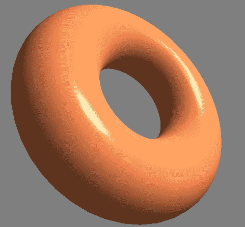

Phong 模型被实现为三个组件的总和：环境、漫射和镜面。环境组件代表照亮所有表面并均匀反射到所有方向的光。它用于帮助照亮场景中的一些较暗区域。由于它不依赖于光线的入射或出射方向，它可以简单地通过将光源强度（*L[a]*）乘以表面反射率（*K[a]*）来模拟：

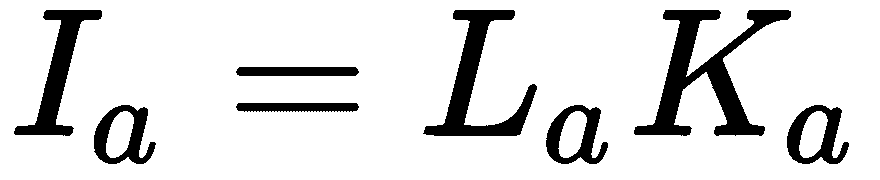

扩散分量模拟了一个粗糙表面，该表面向所有方向散射光线（参见本章中的*单点光源的扩散和顶点着色*配方）。扩散贡献由以下方程给出：

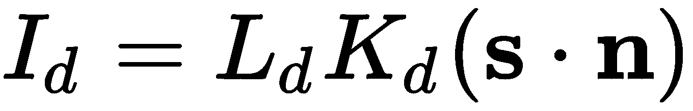

镜面分量用于模拟表面的光泽。当表面具有光泽时，光线从表面反射，并在某些优选方向上散射。我们这样模拟，使得反射光在完美（镜面）反射的方向上最强。该情况下的物理学告诉我们，对于完美反射，入射角等于反射角，并且矢量与表面法线共面，如下面的图所示：

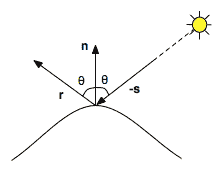

在前面的图中，**r** 代表与入射光矢量（**-s**）相对应的纯反射方向，而 **n** 是表面法线。我们可以通过以下方程计算 **r**：


为了模拟镜面反射，我们需要计算以下（归一化）矢量：指向光源的方向（**s**）、完美反射的矢量（**r**）、指向观察者的矢量（**v**）和表面法线（**n**）。这些矢量在以下图中表示：

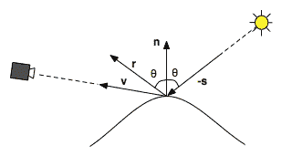

我们希望当观察者与矢量 **r** 对齐时，反射最大，而当观察者远离与 **r** 对齐时，反射迅速减弱。这可以通过使用 **v** 和 **r** 之间角度的余弦值提高到某个幂（**f**）来模拟：

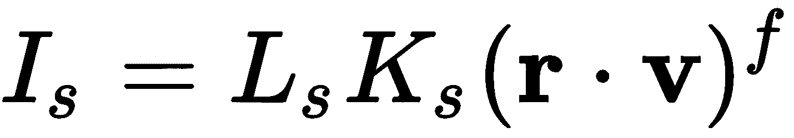

（回忆一下，点积与涉及矢量之间的角度的余弦值成正比。）功率越大，当 **v** 和 **r** 之间的角度增大时，值向零下降的速度越快。同样，与其他分量一样，我们也引入了镜面光强度项（*L[s]*）和反射率项（*K[s]*）。通常将 *K[s]* 项设置为某种灰度值（例如，(0.8, 0.8, 0.8)），因为光泽反射（通常）与波长无关。

镜面分量创建典型的光泽表面的**镜面高光**（亮斑）。方程中 *f* 的幂越大，镜面高光越小，表面越光滑。*f* 的值通常选择在 1 到 200 之间。

通过简单地将这三个项相加，我们得到以下着色方程：

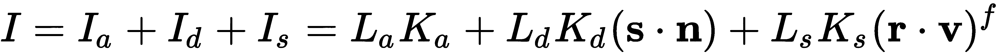

在以下代码中，我们将在顶点着色器中评估此方程，并在多边形上插值颜色。

# 准备工作

在 OpenGL 应用程序中，将顶点位置提供在位置 0，将顶点法线提供在位置 1。光的位置和我们的光照方程的其他可配置项是顶点着色器中的统一变量，它们的值必须从 OpenGL 应用程序中设置。

# 如何实现...

要创建一个实现 Phong 反射模型的着色器对，请按照以下步骤操作：

1.  顶点着色器在顶点位置计算 Phong 反射模型，并将结果发送到片段着色器：

```cpp
layout (location = 0) in vec3 VertexPosition; 
layout (location = 1) in vec3 VertexNormal; 

out vec3 LightIntensity; 

uniform struct LightInfo {
  vec4 Position; // Light position in eye coords.
  vec3 La;       // Ambient light intensity
  vec3 Ld;       // Diffuse light intensity
  vec3 Ls;       // Specular light intensity
} Light;

uniform struct MaterialInfo {
  vec3 Ka;      // Ambient reflectivity
  vec3 Kd;      // Diffuse reflectivity
  vec3 Ks;      // Specular reflectivity
  float Shininess; // Specular shininess factor
} Material;

uniform mat4 ModelViewMatrix; 
uniform mat3 NormalMatrix; 
uniform mat4 ProjectionMatrix; 
uniform mat4 MVP; 

void main() { 
  vec3 n = normalize( NormalMatrix * VertexNormal);
  vec4 camCoords = ModelViewMatrix * vec4(VertexPosition,1.0);

  vec3 ambient = Light.La * Material.Ka;
  vec3 s = normalize(vec3(Light.Position - camCoords));
  float sDotN = max( dot(s,n), 0.0 );
  vec3 diffuse = Light.Ld * Material.Kd * sDotN;
  vec3 spec = vec3(0.0);
  if( sDotN > 0.0 ) {
    vec3 v = normalize(-camCoords.xyz);
    vec3 r = reflect( -s, n );
    spec = Light.Ls * Material.Ks *
            pow( max( dot(r,v), 0.0 ), Material.Shininess );
  }

  LightIntensity = ambient + diffuse + spec;
  gl_Position = MVP * vec4(VertexPosition,1.0); 
} 
```

1.  片段着色器只是将颜色应用到片段上：

```cpp
in vec3 LightIntensity; 
layout( location = 0 ) out vec4 FragColor; 

void main() { 
    FragColor = vec4(LightIntensity, 1.0); 
} 
```

1.  在 OpenGL 应用程序中编译和链接两个着色器，并在渲染之前安装着色器程序。

# 它是如何工作的...

顶点着色器在眼坐标中计算着色方程。它首先将顶点法线转换到相机坐标系并归一化，然后将结果存储在`n`中。顶点位置也转换到相机坐标系并存储在`camCoords`中。

计算并存储环境分量在变量`ambient`中。

接下来，我们计算指向光源的归一化方向（`s`）。这是通过从相机坐标系中的顶点位置减去光的位置并归一化结果来完成的。

接下来计算`s`和`n`的点积。与前面的配方一样，我们使用内置函数`max`将值的范围限制在零和一之间。结果存储在名为`sDotN`的变量中，并用于计算漫反射分量。漫反射分量的结果存储在变量`diffuse`中。

在计算镜面分量之前，我们检查`sDotN`的值。如果`sDotN`为零，则没有光线到达表面，因此没有必要计算镜面分量，因为它的值必须是零。否则，如果`sDotN`大于零，我们使用前面提出的方程计算镜面分量。

如果我们在计算镜面分量之前没有检查`sDotN`，那么可能在背对光源的面出现一些镜面高光。这显然是一个不现实且不希望的结果。另一种解决这个问题的方法是将镜面和漫反射分量都乘以`sDotN`（而不是像我们现在这样只乘以漫反射分量）。这实际上更符合物理规律，但不是传统 Phong 模型的一部分。

观众的方向（`v`）是位置（归一化）的否定，因为在相机坐标系中，观众位于原点。

我们通过调用 GLSL 内置函数`reflect`来计算纯反射的方向，该函数将第一个参数关于第二个参数反射。我们不需要归一化结果，因为涉及的这两个向量已经归一化了。

在计算镜面分量时，我们使用内置函数`max`将点积的值限制在零和一之间，而函数`pow`将点积提升到`Shininess`指数的幂（对应于我们光照方程中的*f*）。

然后将三个分量的和存储在输出变量`LightIntensity`中。此值将与顶点相关联并传递到管道中。在到达片段着色器之前，其值将以透视正确的方式在多边形的面上进行插值。

最后，顶点着色器将位置转换为裁剪坐标，并将结果分配给内置输出变量`gl_Position`（参考本章中的“使用单个点光源进行漫反射和逐顶点着色”配方）。

片段着色器简单地将`LightIntensity`插值后的值应用到输出片段上，通过将其存储在着色器输出变量`FragColor`中。

# 还有更多...

Phong 反射模型工作得相当好，但也有一些缺点。James Blinn 对该模型进行的一小改动在实践中更常用。Blinn-Phong 模型用所谓的**半程向量**替换了纯反射向量，并产生了更真实的光泽高光。该模型在第四章的“Blinn-Phong 反射模型”配方中进行了讨论，位于“光照与着色”部分。

# 使用非局部观察者

我们可以通过使用所谓的**非局部观察者**来避免计算指向观察者的向量（`v`）所需的额外归一化。我们不是计算指向原点的方向，而是简单地为所有顶点使用常量向量（0，0，1）。当然，这并不准确，但在实践中，视觉结果非常相似，通常在视觉上无法区分，这为我们节省了一次归一化。

# 逐顶点与逐片段

由于着色方程是在顶点着色器内计算的，我们将其称为**逐顶点着色**。逐顶点着色也称为**Gouraud 着色**。这种方法的缺点之一是镜面高光可能会扭曲或丢失，因为着色方程并没有在多边形面上的每个点进行评估。

例如，一个应该在多边形中间出现的镜面高光，当使用逐顶点着色时可能根本不会出现，这是因为着色方程仅在镜面分量接近零的顶点处计算。在第四章的“使用逐片段着色以增强真实感”配方中，我们将在“光照与着色”部分查看将着色计算移动到片段着色器所需的更改，以产生更真实的结果。

# 方向性光源

如果我们假设存在一个方向性光源，我们也可以避免为每个顶点计算一个光方向（`s`）。一个**方向性光源**没有位置，只有方向。我们不需要为每个顶点计算指向源的方向，而是使用一个常量向量，它表示指向远程光源的方向。这是一种模拟来自远距离光源（如阳光）照明的良好方法。我们将在第四章的*使用方向性光源进行着色*配方中看到这个例子，*光照与着色*。

# 距离衰减

你可能会认为这个着色模型缺少一个重要的组件。它没有考虑到光源距离的影响。事实上，已知从源发出的辐射强度与源距离的平方成反比。那么为什么不在我们的模型中包含这个呢？

虽然这样做相当简单，但视觉结果往往不尽如人意。它往往会夸大距离效果，并创建出看起来不真实的效果。记住，我们的方程只是对涉及的物理的近似，并不是一个真正现实的模型，所以基于严格的物理定律添加的项产生不真实的结果并不令人惊讶。

在 OpenGL 固定功能管道中，可以使用`glLight`函数打开距离衰减。如果需要，可以简单地添加几个统一变量到我们的着色器中，以产生相同的效果。

# 参见

+   示例代码中的`chapter03/scenephong.cpp`文件

+   第四章中*使用方向性光源进行着色*配方，**光照与着色**。

+   第四章中*使用每片段着色提高真实感*配方，*光照与着色*。

+   第四章中*使用 Blinn-Phong 模型*配方，*光照与着色*。

# 在着色器中使用函数

GLSL 支持与 C 函数语法相似的函数。然而，调用约定有所不同。在下面的例子中，我们将使用函数重新审视 Phong 着色器，以帮助提供主要步骤的抽象。

# 准备工作

与之前的配方一样，在属性位置 0 提供顶点位置，在属性位置 1 提供顶点法线。所有 Phong 系数的统一变量应从 OpenGL 端设置，以及光的位置和标准矩阵。

# 如何操作...

顶点着色器几乎与之前的配方相同，除了 Phong 模型在函数内评估，我们添加另一个函数将位置和法线转换为相机坐标：

```cpp
// Uniform variables and attributes omitted...
 void getCamSpace( out vec3 norm, out vec3 position ) {
    norm = normalize( NormalMatrix * VertexNormal);
    position = (ModelViewMatrix * vec4(VertexPosition,1.0)).xyz;
}

vec3 phongModel( vec3 position, vec3 n ) { 
  vec3 ambient = Light.La * Material.Ka;
  vec3 s = normalize( Light.Position.xyz - position );
  float sDotN = max( dot(s,n), 0.0 );
  vec3 diffuse = Light.Ld * Material.Kd * sDotN;
  vec3 spec = vec3(0.0);
  if( sDotN > 0.0 ) {
    vec3 v = normalize(-position.xyz);
    vec3 r = reflect( -s, n );
    spec = Light.Ls * Material.Ks *
            pow( max( dot(r,v), 0.0 ), Material.Shininess );
  }

  return ambient + diffuse + spec;
}

void main() {
    // Get the position and normal in camera space
    vec3 camNorm, camPosition;
    getCamSpace(camNorm, camPosition);

    // Evaluate the reflection model
    LightIntensity = phongModel( camPosition, camNorm );

    gl_Position = MVP * vec4(VertexPosition,1.0);
} 
```

片段着色器与之前的配方没有变化。

# 它是如何工作的...

在 GLSL 函数中，参数评估策略是**按值返回调用**（也称为**按值复制-恢复**或**按值结果**）。参数变量可以用`in`、`out`或`inout`进行限定。对应于输入参数（用`in`或`inout`限定的参数）在调用时复制到参数变量中，输出参数（用`out`或`inout`限定的参数）在函数返回前复制回相应的参数。如果一个参数变量没有这三个限定符中的任何一个，则默认限定符是`in`。

我们在顶点着色器中创建了两个函数。第一个，命名为`getCamSpace`，将顶点位置和顶点法线转换成相机坐标，并通过输出参数返回它们。在`main`函数中，我们创建了两个未初始化的变量（`camNorm`和`camPosition`）来存储结果，然后以变量作为函数参数调用该函数。函数将结果存储到参数变量（`n`和`position`）中，这些变量在函数返回前被复制到参数中。

第二个函数`phongModel`仅使用输入参数。该函数接收眼睛空间的位置和法线，并计算 Phong 反射模型的结果。结果由函数返回并存储在着色器输出变量`LightIntensity`中。

# 更多...

由于从输出参数变量读取没有意义，输出参数只应在函数内部进行写入。它们的值是未定义的。

在函数内部，允许写入仅输入参数（用`in`限定）。函数的参数副本被修改，并且更改不会反映在参数中。

# `const`限定符

可以将`const`限定符与仅输入参数（不是`out`或`inout`）一起使用。此限定符使输入参数为只读，因此在函数内部不能对其进行写入。

# 函数重载

通过创建具有相同名称但参数数量和/或类型不同的多个函数，可以重载函数。与许多语言一样，两个重载的函数可能不仅仅在返回类型上有所不同。

# 将数组或结构传递给函数

应注意，当将数组或结构传递给函数时，它们是按值传递的。如果传递大数组或结构，可能会进行大量的复制操作，这可能不是所希望的。将这些变量声明在全局作用域中会是一个更好的选择。

# 参见

+   示例代码中的`chapter03/shader/function.vert.glsl`和`chapter03/shader/function.frag.glsl`文件

+   *实现 Phong 反射模型*的配方

# 实现双面着色

当渲染一个完全封闭的网格时，多边形的背面会被隐藏。然而，如果一个网格包含孔洞，背面可能会变得可见。在这种情况下，由于法向量指向错误的方向，多边形可能会被错误着色。为了正确着色这些背面，需要反转法向量并基于反转后的法向量计算光照方程。

以下图像显示了一个去掉盖子的茶壶。在左侧，使用 Phong 模型。在右侧，Phong 模型增加了本配方中讨论的双面渲染技术：

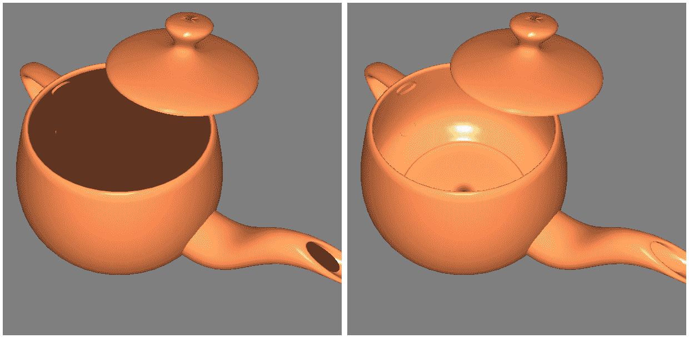

在这个配方中，我们将查看一个示例，该示例使用前面配方中讨论的 Phong 模型，并增加了正确着色背面面的能力。

# 准备工作

顶点位置应提供在属性位置 0，顶点法向量在属性位置 1。与前面的示例一样，必须通过统一变量将光照参数提供给着色器。

# 如何做...

要实现一个使用具有双面光照的 Phong 反射模型的着色器对，请按照以下步骤操作：

1.  顶点着色器与前面的配方类似，但它计算了两次 Phong 方程。首先，不改变法向量，然后再次反转法向量。结果分别存储在输出变量`FrontColor`和`BackColor`中：

```cpp
// Uniforms and attributes...
out vec3 FrontColor;
out vec3 BackColor;

vec3 phongModel( vec3 position, vec3 n ) { 
    // The Phong model calculations go here...
} 

void main() {
    vec3 tnorm = normalize( NormalMatrix * VertexNormal);
    vec3 camCoords = (ModelViewMatrix * 
    vec4(VertexPosition,1.0)).xyz;

    FrontColor = phongModel( camCoords, tnorm );
    BackColor = phongModel( camCoords, -tnorm );

    gl_Position = MVP * vec4(VertexPosition,1.0);
}
```

1.  片段着色器根据内置变量`gl_FrontFacing`的值选择使用哪种颜色：

```cpp
in vec3 FrontColor; 
in vec3 BackColor; 

layout( location = 0 ) out vec4 FragColor; 

void main() { 
    if( gl_FrontFacing ) { 
        FragColor = vec4(FrontColor, 1.0); 
    } else { 
        FragColor = vec4(BackColor, 1.0); 
    } 
} 
```

# 工作原理...

在顶点着色器中，我们使用顶点法向量和反转后的版本来计算光照方程，并将每个颜色传递给片段着色器。片段着色器根据面的方向选择并应用适当的颜色。

反射模型的评估被放置在一个名为`phongModel`的函数中。该函数被调用两次，首先使用法向量（转换为相机坐标），然后使用反转后的法向量。组合结果分别存储在`FrontColor`和`BackColor`中。

着色模型的一些方面（如环境分量）与法向量的方向无关。可以通过重写代码来优化此代码，以便冗余计算只进行一次。然而，在这个配方中，为了使事情清晰易读，我们两次计算整个着色模型。

在片段着色器中，我们根据内置变量 `gl_FrontFacing` 的值来确定应用哪种颜色。这是一个布尔值，表示片段是否是正面或背面多边形的一部分。请注意，这种判断是基于多边形的**方向**，而不是法向量。（如果一个多边形的顶点按逆时针顺序指定，从多边形的前面看，则称该多边形为逆时针方向。）默认情况下，在渲染时，如果顶点的顺序在屏幕上以逆时针顺序出现，则表示这是一个正面多边形；然而，我们可以通过从 OpenGL 程序中调用 `glFrontFace` 来改变这一点。

# 还有更多...

在顶点着色器中，我们通过法向量的方向来确定多边形的正面，而在片段着色器中，判断是基于多边形的方向。为了正确工作，必须适当地为 `glFrontFace` 设置确定的表面定义法向量。

对于这个配方的一个替代选择是在顶点着色器中首先确定正在着色的表面是正面还是背面，然后只将单个结果发送到片段着色器。一种方法是通过计算指向摄像机的向量（在摄像机坐标中的原点）与法向量的点积。如果点积为负，则表示法向量必须是指向观察者的，这意味着观察者看到的是表面的背面。

在这种情况下，我们需要反转法向量。具体来说，我们可以将顶点着色器中的主函数更改如下：

```cpp
void main() {
  vec3 tnorm = normalize( NormalMatrix * VertexNormal);
  vec3 camCoords = (ModelViewMatrix * vec4(VertexPosition,1.0)).xyz;
  vec3 v = normalize(-camCoords.xyz);

  float vDotN = dot(v, tnorm);

  if( vDotN >= 0 ) {
    Color = phongModel(camCoords, tnorm);
  } else {
    Color = phongModel(camCoords, -tnorm);
  }
  gl_Position = MVP * vec4(VertexPosition,1.0);
}
```

在这种情况下，我们只需要一个输出变量发送到片段着色器（在前面代码中的 `Color`），片段着色器只需将颜色应用到片段上。在这个版本中，在片段着色器中不需要检查 `gl_FrontFacing` 的值。

在这个版本中，用来确定是否为正面多边形的唯一因素是法向量。不使用多边形方向。如果一个多边形的顶点法线不平行（对于弯曲形状通常是这种情况），那么可能某些顶点被处理为**正面**，而其他顶点被处理为**背面**。这可能导致在表面颜色混合时产生不希望出现的伪影。最好是像现在常见的做法一样，在片段着色器中计算整个反射模型。有关逐片段着色的详细信息，请参阅第四章*使用逐片段着色提高真实感*的配方，*光照与着色*。

# 使用双面渲染进行调试

有时，通过视觉确定哪些面是正面和哪些是背面（基于环绕顺序）可能很有用。例如，当处理任意网格时，多边形可能没有使用适当的环绕顺序指定。作为另一个例子，当以程序方式开发网格时，有时确定哪些面具有适当的环绕顺序可能有助于调试。我们可以轻松调整我们的片段着色器，通过将纯色与所有背面（或正面）混合来帮助我们解决这类问题。例如，我们可以在片段着色器中的`else`子句中更改如下：

```cpp
FragColor = mix( vec4(BackColor,1.0), 
                vec4(1.0,0.0,0.0,1.0), 0.7 );
```

这将混合一个纯红色与所有背面，使它们突出，如下面的图像所示。在图像中，背面与 70%的红色混合，如前面的代码所示：

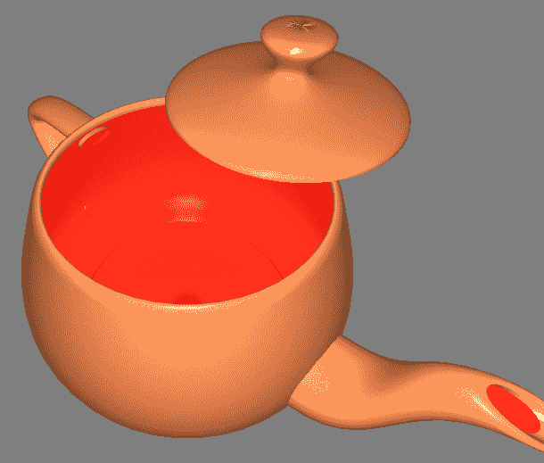

# 参见

+   示例代码中的`chapter03/scenetwoside.cpp`文件

+   *实现 Phong 反射模型*配方

+   *在第四章*（343fbd70-0012-4449-afe6-a724b330b441.xhtml）*光照和着色*中，*如何实现使用每个片段着色提高现实感*

# 实现平面着色

每个顶点着色涉及在每个顶点计算着色模型，并将结果（颜色）与该顶点关联。然后，颜色在多边形的面上进行插值，以产生平滑的着色效果。这也被称为**Gouraud 着色**。在 OpenGL 的早期版本中，这种带有颜色插值的每个顶点着色是默认的着色技术。

有时，为了使每个多边形使用单一颜色，以便在整个多边形面上没有颜色变化，从而使每个多边形看起来是平面的，这可能是有用的。这在物体形状需要这种技术的情况下可能很有用，例如，因为面确实打算看起来是平面的，或者有助于在复杂网格中可视化多边形的定位。每个多边形使用单一颜色通常称为**平面着色**。

以下图像显示了使用 Phong 反射模型渲染的网格。在左侧，使用 Gouraud 着色。在右侧，使用平面着色：

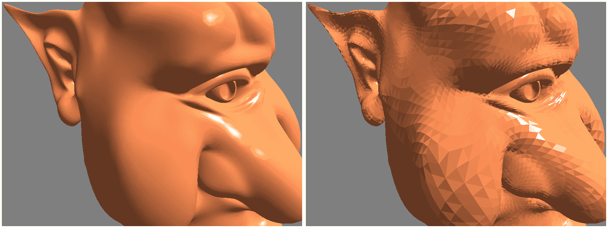

在 OpenGL 的早期版本中，通过调用`glShadeModel`函数并使用参数`GL_FLAT`来启用平面着色，在这种情况下，每个多边形的最后一个顶点的计算颜色在整个面上使用。

在 OpenGL 4 中，平面着色通过着色器输入/输出变量的可用插值限定符得到简化。

# 如何做...

要将 Phong 反射模型修改为使用平面着色，请执行以下步骤：

1.  使用与前面提供的 Phong 示例相同的顶点着色器。按照以下方式更改输出变量`LightIntensity`：

```cpp
flat out vec3 LightIntensity; 
```

1.  将片段着色器中的相应变量更改为使用`flat`限定符：

```cpp
flat in vec3 LightIntensity; 
```

1.  在 OpenGL 应用程序中编译和链接两个着色器，并在渲染之前安装着色程序。

# 它是如何工作的...

通过使用 `flat` 修饰符来指定顶点输出变量（及其对应的片段输入变量），启用平面着色。此修饰符表示在值到达片段着色器之前不应进行插值。提供给片段着色器的值将是与多边形的第一个或最后一个顶点的顶点着色器调用结果相对应的值。这个顶点被称为 **触发顶点**，可以使用 OpenGL 函数 `glProvokingVertex` 进行配置。例如，以下调用：

```cpp
glProvokingVertex(GL_FIRST_VERTEX_CONVENTION); 
```

表示第一个顶点应作为平面着色变量的值。`GL_LAST_VERTEX_CONVENTION` 参数表示应使用最后一个顶点。默认值是 `GL_LAST_VERTEX_CONVENTION`。

# 参见

+   示例代码中的 `chapter03/sceneflat.cpp` 文件

+   *实现 Phong 反射模型* 的配方

# 使用子例程选择着色器功能

在 GLSL 中，子例程是一种将函数调用绑定到一组可能的函数定义之一（基于变量的值）的机制。在许多方面，它类似于 C 中的函数指针。统一变量作为指针，用于调用函数。该变量的值可以从 OpenGL 端设置，从而将其绑定到几个可能的定义之一。子例程的函数定义不需要具有相同的名称，但必须具有相同数量和类型的参数以及相同的返回类型。

因此，子例程提供了一种在运行时选择替代实现的方法，而无需交换着色程序和/或重新编译，或使用与统一变量一起的 `if` 语句。例如，可以编写一个着色器，提供几个用于场景中不同对象的着色算法。在渲染场景时，而不是交换着色程序或使用条件语句，我们可以简单地更改子例程的统一变量，以在每个对象渲染时选择适当的着色算法。

由于着色程序中的性能至关重要，避免条件语句或着色程序交换可能很有价值。使用子例程，我们可以实现条件语句或着色程序交换的功能，而无需计算开销。然而，现代驱动程序在处理条件语句方面做得很好，因此子例程相对于条件语句的优势并不总是明确的。根据条件，基于统一变量的条件语句可以与子例程一样高效。

在这个例子中，我们将通过渲染茶壶两次来演示子例程的使用。第一个茶壶将使用前面描述的完整 Phong 反射模型进行渲染。第二个茶壶将只使用漫反射着色。将使用子例程统一变量来在两种着色技术之间进行选择。

**SPIR-V 不支持子例程**。因此，可能应该避免使用它们。由于 SPIR-V 显然是 OpenGL 中着色器的未来，子例程应被视为已弃用。

在以下图像中，我们可以看到一个使用子例程创建的渲染示例。左边的茶壶使用完整的 Phong 反射模型进行渲染，而右边的茶壶仅使用漫反射着色进行渲染。子例程用于在着色器功能之间切换：

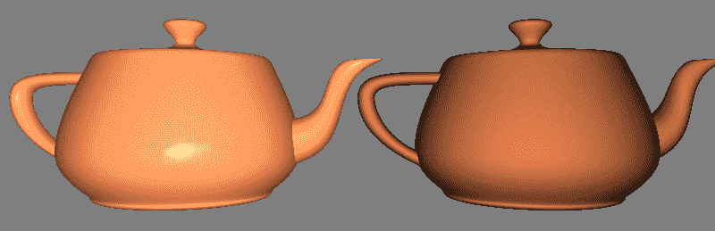

# 准备工作

与之前的食谱一样，在属性位置 0 提供顶点位置，在属性位置 1 提供顶点法线。所有 Phong 系数的统一变量应从 OpenGL 端设置，以及光的位置和标准矩阵。

我们假设在 OpenGL 应用程序中，`programHandle`变量包含着色器程序对象的句柄。

# 如何做到这一点...

要创建一个使用子例程在纯漫反射和 Phong 之间切换的着色器程序，请执行以下步骤：

1.  使用子例程统一变量设置顶点着色器，并声明两个子例程类型的函数：

```cpp
subroutine vec3 shadeModelType( vec3 position, vec3 normal); 
subroutine uniform shadeModelType shadeModel; 

out vec3 LightIntensity;

// Uniform variables and attributes here...

subroutine( shadeModelType ) 
vec3 phongModel( vec3 position, vec3 norm ) { 
    // The Phong reflection model calculations go here...
} 

subroutine( shadeModelType ) 
vec3 diffuseOnly( vec3 position, vec3 norm ) { 
   // Compute diffuse shading only..
} 

void main() {
   // Compute camPosition and camNorm ...

    // Evaluate the shading equation, calling one of 
    // the functions: diffuseOnly or phongModel. 
    LightIntensity = shadeModel(camPosition, camNorm); 

    gl_Position = MVP * vec4(VertexPosition,1.0); 
} 
```

1.  片段着色器与*《Phong 反射模型》*食谱中的相同。

1.  在 OpenGL 应用程序中，编译和链接着色器到着色器程序中，并将程序安装到 OpenGL 管道中。

1.  在 OpenGL 应用程序的渲染函数中，使用以下代码：

```cpp
GLuint phongIndex = 
   glGetSubroutineIndex(programHandle, 
                       GL_VERTEX_SHADER,"phongModel"); 
GLuint diffuseIndex = 
    glGetSubroutineIndex(programHandle, 
                       GL_VERTEX_SHADER, "diffuseOnly"); 

glUniformSubroutinesuiv( GL_VERTEX_SHADER, 1, &phongIndex); 
... // Render the left teapot 

glUniformSubroutinesuiv( GL_VERTEX_SHADER, 1, &diffuseIndex); 
... // Render the right teapot 
```

# 它是如何工作的...

在此示例中，子例程是在顶点着色器中定义的。第一步是声明子例程类型，如下所示：

```cpp
subroutine vec3 shadeModelType( vec3 position, vec3 normal); 
```

这定义了一个名为`shadeModelType`的新子例程类型。其语法与函数原型非常相似，因为它定义了一个名称、一个参数列表和一个返回类型。与函数原型一样，参数名称是可选的。

在创建新的子例程类型后，我们声明一个名为`shadeModel`的该类型统一变量：

```cpp
subroutine uniform shadeModelType shadeModel; 
```

此变量作为我们的函数指针，并将分配给 OpenGL 应用程序中的两个可能函数之一。

我们通过在函数定义前加上子例程限定符来声明两个函数是子例程的一部分：

```cpp
subroutine ( shadeModelType ) 
```

这表示该函数与子例程类型匹配，因此其头文件必须与子例程类型定义中的头文件相匹配。我们使用此前缀来定义`phongModel`和`diffuseOnly`函数。`diffuseOnly`函数计算漫反射着色方程，而`phongModel`函数计算完整的 Phong 反射方程。

我们通过在主函数中利用子例程统一的`shadeModel`来调用这两个子例程函数之一：

```cpp
LightIntensity = shadeModel( eyePosition, eyeNorm );
```

再次，这个调用将绑定到两个函数之一，具体取决于子例程统一变量`shadeModel`的值，我们将在 OpenGL 应用程序中设置它。

在 OpenGL 应用程序的渲染函数中，我们通过以下两个步骤给子例程统一变量赋值：

1.  首先，我们使用`glGetSubroutineIndex`查询每个子例程函数的索引。第一个参数是程序句柄。第二个是着色器阶段。在这种情况下，子例程是在顶点着色器中定义的，所以我们在这里使用`GL_VERTEX_SHADER`。第三个参数是子例程的名称。我们单独查询每个函数，并将索引存储在变量`phongIndex`和`diffuseIndex`中。

1.  第二，我们选择合适的子例程函数。为此，我们需要通过调用`glUniformSubroutinesuiv`来设置子例程的统一变量`shadeModel`的值。这个函数是为了一次性设置多个子例程统一变量而设计的。在我们的情况下，当然我们只设置了一个统一变量。第一个参数是着色器阶段（`GL_VERTEX_SHADER`），第二个是设置的统一变量数量，第三个是指向包含子例程函数索引数组的指针。由于我们只设置了一个统一变量，我们只需提供包含索引的`GLuint`变量的地址，而不是一个真正的值数组。当然，如果设置了多个统一变量，我们会使用一个数组。一般来说，提供的第三个参数的值数组以以下方式分配给子例程统一变量。数组的第 i 个元素分配给索引为 i 的子例程统一变量。由于我们只提供了一个值，我们正在设置索引为零的子例程统一变量。

你可能会想，“我们怎么知道我们的子例程统一变量位于索引零？我们在调用`glUniformSubroutinesuiv`之前没有查询索引！”这个代码之所以能工作，是因为我们依赖于 OpenGL 将始终从零开始连续编号子例程的索引。如果我们有多个子例程统一变量，我们可以（并且应该）使用`glGetSubroutineUniformLocation`查询它们的索引，然后适当地排序我们的数组。

`glUniformSubroutinesuiv`要求我们一次性设置所有子例程统一变量，在一个调用中。这样 OpenGL 就可以在单个爆发中验证它们。

# 还有更多...

不幸的是，当通过调用`glUseProgram`或其他技术从管道中解绑（切换）着色器程序时，子例程绑定会被重置。这要求我们每次激活着色器程序时都调用`glUniformSubroutinesuiv`。

在着色器中定义的子例程函数可以匹配多个子例程类型。子例程限定符可以包含由逗号分隔的子例程类型列表。例如，如果一个子例程匹配类型`type1`和`type2`，我们可以使用以下限定符：

```cpp
subroutine( type1, type2 ) 
```

这将允许我们使用不同类型的子例程统一变量来引用相同的子例程函数。

# 参见

+   示例代码中的`chapter03/scenesubroutine.cpp`文件

+   *菲涅耳反射模型*的配方

+   使用单个点光源的*漫反射和顶点着色*配方

# 丢弃片段以创建带有孔洞的外观

片段着色器可以利用`discard`关键字来*丢弃*片段。使用此关键字会导致片段着色器停止执行，而不会将任何内容（包括深度）写入输出缓冲区。这提供了一种在不使用混合的情况下在多边形中创建孔的方法。实际上，由于片段被完全丢弃，因此不依赖于对象绘制的顺序，从而节省了我们可能需要进行的任何深度排序的麻烦。

在这个配方中，我们将绘制一个茶壶，并使用`discard`关键字根据纹理坐标选择性地移除片段。结果将看起来像以下图像：

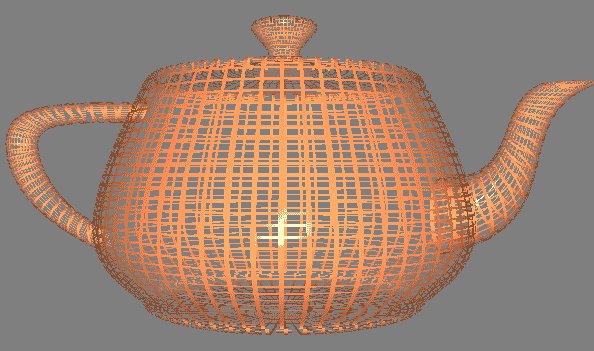

# 准备工作

顶点位置、法线和纹理坐标必须从 OpenGL 应用程序提供给顶点着色器。位置应提供在位置 0，法线在位置 1，纹理坐标在位置 2。与之前的示例一样，光照参数必须通过适当的统一变量从 OpenGL 应用程序设置。

# 如何做到这一点...

要创建一个基于正方形晶格（如图像所示）丢弃片段的着色程序：

1.  在顶点着色器中，我们使用双面光照，并包含纹理坐标：

```cpp
layout (location = 0) in vec3 VertexPosition; 
layout (location = 1) in vec3 VertexNormal; 
layout (location = 2) in vec2 VertexTexCoord; 

out vec3 FrontColor; 
out vec3 BackColor; 
out vec2 TexCoord; 

// Other uniform variables here...
// getCamSpace and phongModel functions...

void main() { 
    TexCoord = VertexTexCoord;

    // Get the position and normal in camera space 
    vec3 camNorm, camPosition;
    getCamSpace(camNorm, camPosition); 

    FrontColor = phongModel( camPosition, eyeNorm ); 
    BackColor = phongModel( camPosition, -eyeNorm ); 

    gl_Position = MVP * vec4(VertexPosition,1.0); 
} 
```

1.  在片段着色器中，使用`discard`关键字根据一定条件丢弃片段：

```cpp
in vec3 FrontColor; 
in vec3 BackColor; 
in vec2 TexCoord; 

layout( location = 0 ) out vec4 FragColor; 

void main() { 
    const float scale = 15.0; 
    bvec2 toDiscard = greaterThan( fract(TexCoord * scale), 
                                   vec2(0.2,0.2) );
    if( all(toDiscard) ) 
        discard; 

    if( gl_FrontFacing ) 
        FragColor = vec4(FrontColor, 1.0); 
    else 
        FragColor = vec4(BackColor, 1.0); 
} 
```

1.  在 OpenGL 应用程序中编译和链接这两个着色器，并在渲染之前安装着色程序。

# 它是如何工作的...

由于我们将丢弃茶壶的一些部分，我们将能够透过茶壶看到另一侧。这将导致一些多边形的背面变得可见。因此，我们需要为每个面的两侧适当地计算光照方程。我们将使用之前在双面着色配方中介绍过的相同技术。

顶点着色器基本上与双面着色配方相同，主要区别在于增加了纹理坐标。为了管理纹理坐标，我们有一个额外的输入变量，`VertexTexCoord`，它对应于属性位置 2。这个输入变量的值直接通过输出变量`TexCoord`传递给片段着色器，且不进行任何改变。波恩反射模型被计算两次，一次使用给定的法向量，将结果存储在`FrontColor`中，再次使用反转的法向量，将结果存储在`BackColor`中。

在片段着色器中，我们通过一种简单技术计算是否应该丢弃片段，该技术旨在产生前一幅图像中显示的类似晶格的图案。我们首先将纹理坐标乘以任意缩放因子`scale`。这对应于每个单位（缩放）纹理坐标中的晶格矩形数量。然后，我们使用内置函数`fract`计算缩放纹理坐标每个分量的分数部分。每个分量使用内置的`greaterThan`函数与 0.2 进行比较，并将结果存储在布尔向量`toDiscard`中。`greaterThan`函数逐分量比较两个向量，并将布尔结果存储在返回值的相应分量中。

如果向量`toDiscard`的两个分量都为真，则该片段位于每个晶格框架的内部，因此我们希望丢弃这个片段。我们可以使用内置函数`all`来帮助进行此检查。如果参数向量的所有分量都为真，则`all`函数将返回 true。如果函数返回 true，则执行`discard`语句以拒绝该片段。

在`else`分支中，我们根据多边形的朝向对片段进行着色，正如之前介绍的**实现双面着色**配方中所述。

# 参见

+   示例代码中的`chapter03/scenediscard.cpp`配方

+   本章中实现的**双面着色**配方
