# 照明和着色

在本章中，我们将介绍以下食谱：

+   使用多个位置光源进行着色

+   使用方向光源进行着色

+   使用逐片段着色提高真实感

+   Blinn-Phong 反射模型

+   模拟聚光灯

+   创建卡通着色效果

+   模拟雾

+   基于物理的反射模型

# 简介

在第三章 *GLSL 着色器的基础* 中，我们介绍了一些实现前固定功能管线产生的着色效果的技术。我们还探讨了 GLSL 的一些基本特性，如函数和子程序。在本章中，我们将超越这些入门特性，了解如何产生聚光灯、雾和卡通风格着色等着色效果。我们将介绍如何使用多个光源以及如何通过称为逐片段着色的技术来提高结果的真实感。

我们还将介绍非常流行且重要的 Blinn-Phong 反射模型和方向光源。

最后，我们将介绍如何通过配置早期深度测试优化来微调深度测试。

# 使用多个位置光源进行着色

当使用多个光源进行着色时，我们需要评估每个光源的反射模型，并将结果相加以确定表面位置反射的总光强度。自然的选择是创建统一数组来存储每个光源的位置和强度。我们将使用结构数组，这样我们就可以在单个统一变量中存储多个光源的值。

以下图像显示了使用五种不同颜色的光源渲染的“猪”网格。注意多个镜面高光：

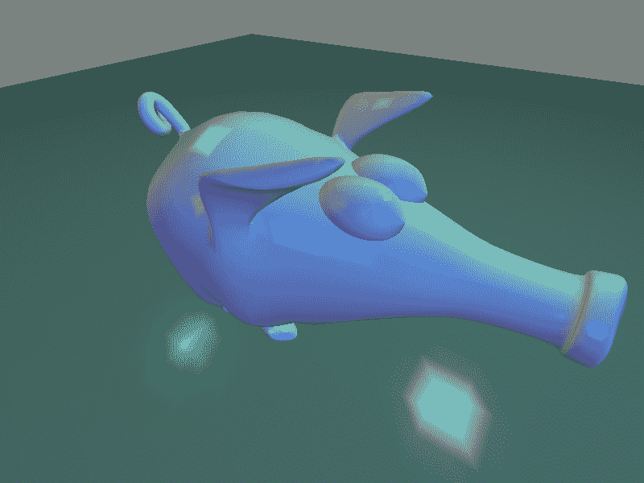

# 准备工作

使用顶点位置在属性位置零和法线在位置一设置你的 OpenGL 程序。

# 如何做到这一点...

要创建使用 Blinn-Phong 反射模型和多个光源进行渲染的着色器程序，请按照以下步骤操作：

在顶点着色器中，我们将使用与之前食谱中类似的结构，但我们将使用结构数组来存储光源。此外，我们只为每个光源存储两个强度值。第一个是环境强度，第二个用于漫反射和镜面反射。`phongModel`函数更新为使用数组中的一个值来使用光源信息：

```cpp
layout (location = 0) in vec3 VertexPosition; 
layout (location = 1) in vec3 VertexNormal; 

out vec3 Color; 

uniform struct LightInfo {
  vec4 Position; // Light position in eye coords.
  vec3 La;       // Ambient light intesity
  vec3 L;        // Diffuse and specular light intensity
} lights[5];

// Material and matrix uniforms omitted...

vec3 phongModel( int light, vec3 position, vec3 n ) { 
  vec3 ambient = lights[light].La * Material.Ka;
  vec3 s = normalize( lights[light].Position.xyz - position );
  float sDotN = max( dot(s,n), 0.0 );
  vec3 diffuse = Material.Kd * sDotN;
  vec3 spec = vec3(0.0);
  if( sDotN > 0.0 ) {
    vec3 v = normalize(-position.xyz);
    vec3 r = reflect( -s, n );
    spec = Material.Ks *
            pow( max( dot(r,v), 0.0 ), Material.Shininess );
  }

  return ambient + lights[light].L * (diffuse + spec);
}
void main() {
  vec3 camNorm = normalize( NormalMatrix * VertexNormal);
  vec3 camPosition = 
       ModelViewMatrix * vec4(VertexPosition,1.0)).xyz;

  // Evaluate the lighting equation, for each light
  Color = vec3(0.0);
  for( int i = 0; i < 5; i++ )
      Color += phongModel( i, camPosition, camNorm );

  gl_Position = MVP * vec4(VertexPosition,1.0);
}
```

片段着色器简单地将颜色应用到片段上，就像之前的食谱中一样。

在 OpenGL 应用程序中，在顶点着色器中设置`lights`数组的值。对于每个光源，使用以下类似代码。此示例使用第二章中描述的 C++着色器程序类*使用 GLSL 程序*（`prog`是一个`GLSLProgram`对象）：

```cpp
prog.setUniform("lights[0].L", glm::vec3(0.0f,0.8f,0.8f) ); 
prog.setUniform("lights[0].La", glm::vec3(0.0f,0.2f,0.2f) );
prog.setUniform("lights[0].Position", position );
```

# 它是如何工作的...

在顶点着色器中，光照参数存储在统一数组 `lights` 中。数组的每个元素都是一个类型为 `LightInfo` 的结构体。本例使用五个光源。漫反射/镜面反射光强度存储在 `L` 字段中，环境光强度存储在 `La` 字段中，位置存储在相机坐标的 `Position` 字段中。

其余的统一变量基本上与第三章《GLSL 着色器基础》中介绍的 Phong 模型着色器相同。

`phongModel` 函数负责计算给定光源的阴影方程。光源的索引作为第一个参数，`light` 提供。方程基于该索引处的 `lights` 数组中的值进行计算。在这个例子中，我们没有为漫反射和镜面反射组件使用单独的光强度。

在 `main` 函数中，使用 `for` 循环计算每个光源的阴影方程，并将结果累加到输出变量 `Color` 中。

片段着色器简单地将插值后的颜色应用到片段上。

# 参见

+   示例代码中的 `chapter04/scenemultilight.cpp` 文件

+   第三章《GLSL 着色器基础》中的 *实现 Phong 反射模型* 菜谱

+   *使用方向性光源进行阴影处理* 菜谱

# 使用方向性光源进行阴影处理

阴影方程的一个核心组件是从表面位置指向光源的向量（在之前的例子中为 `s`）。对于非常远的光源，这个向量在物体表面上几乎没有变化。事实上，对于非常遥远的光源，这个向量在表面的所有点上几乎是相同的（另一种思考方式是光线几乎是平行的）。这种模型适用于遥远但强大的光源，如太阳。这种光源通常被称为**方向性光源**，因为它没有特定的位置，只有方向。

当然，我们忽略了在现实中，光的强度随着与光源距离的平方而减少的事实。然而，对于方向性光源，忽略这一方面并不罕见。

如果我们使用方向性光源，场景中所有点的光源方向是相同的。因此，我们可以提高阴影计算的效率，因为我们不再需要为表面上的每个位置重新计算光源方向。

当然，位置光源和方向光源之间有视觉上的差异。以下图像显示了使用位置光源（左）和方向光源（右）渲染的环面。在左边的图像中，光源位于环面附近。由于所有光线都是平行的，方向光源覆盖了环面的大部分表面：

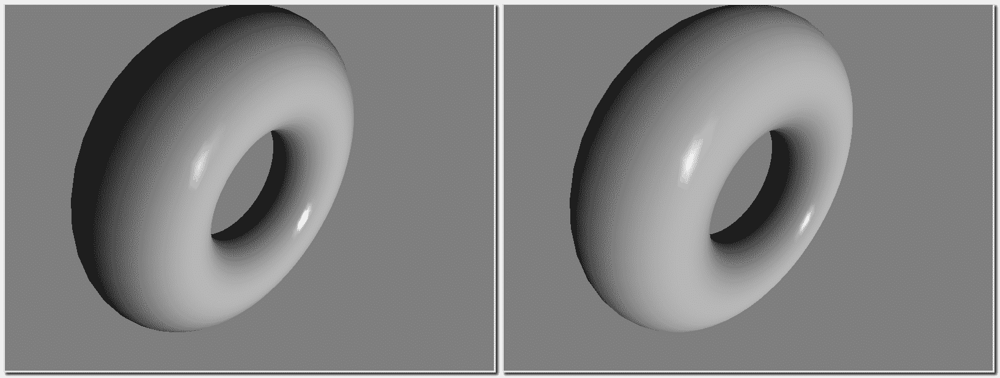

在 OpenGL 的早期版本中，光位置的四分量用于确定是否将光源视为方向光源。第四分量为零表示光源是方向性的，位置应被视为指向源的方向（一个向量）。否则，位置被视为光源的实际位置。在本例中，我们将模拟相同的功能。

# 准备工作

将你的 OpenGL 程序设置好，顶点位置在属性位置零，顶点法线在位置一。

# 如何做...

要创建一个使用方向光源实现 Phong 反射模型的着色器程序，我们将使用与上一个配方相同的顶点着色器，只是使用单个光源。在`phongModel`函数中，用以下内容替换`s`向量的计算：

```cpp
vec3 s;
if( Light.Position.w == 0.0 )
  s = normalize( Light.Position.xyz );
else
  s = normalize( Light.Position.xyz - position );
```

# 它是如何工作的...

在顶点着色器中，统一变量`Light.Position`的第四坐标用于确定是否将光源视为方向光源。在负责计算着色方程的`phongModel`函数内部，根据`Light.Position`的第四坐标是否为零来确定向量`s`的值。如果值为零，则将`Light.Position`归一化并用作指向光源的方向。否则，将`Light.Position`视为眼坐标中的位置，我们通过从顶点位置减去`Light.Position`并归一化结果来计算指向光源的方向。

# 更多内容...

使用方向光源时，由于不需要为每个顶点重新计算光方向，因此可以略微提高效率。这节省了一个减法操作，虽然这是一个小的收益，但如果有多个光源或按片段计算光照时，这种收益可能会累积。

# 参见

+   示例代码中的`chapter04/scenedirectional.cpp`文件

+   在第三章的*实现 Phong 反射模型*配方中

+   本章的*使用每片段着色以增强真实感*配方

# 使用每片段着色以增强真实感

当着色方程在顶点着色器内被评估（正如我们在之前的食谱中所做的那样），我们最终会得到与每个顶点相关联的颜色。然后，该颜色在面上进行插值，片元着色器将插值后的颜色分配给输出片元。如前所述，这种技术称为**Gouraud 着色**。Gouraud 着色（就像所有着色技术一样）是一种近似，当例如顶点的反射特性与多边形的中心相差甚远时，可能会导致一些不太理想的结果。例如，一个明亮的镜面高光可能位于多边形的中心，而不是其顶点。仅仅在顶点评估着色方程将防止镜面高光出现在渲染结果中。当使用 Gouraud 着色时，由于颜色插值可能不会匹配整个面上的反射模型值，还可能出现其他不理想的伪影，例如多边形的边缘。

为了提高我们结果的确切性，我们可以将着色方程的计算从顶点着色器移动到片元着色器。我们不是在多边形上插值颜色，而是插值位置和法线向量，并使用这些值在每个片元上评估着色方程。这种技术称为**Phong 着色**或**Phong 插值**。Phong 着色的结果要精确得多，并且提供了更令人满意的结果，但仍然可能有一些不理想的伪影出现。

以下图像显示了 Gouraud 和 Phong 着色的区别。左侧的场景使用 Gouraud（每顶点）着色渲染，右侧的场景使用 Phong（每片元）着色渲染。在茶壶下面是一个部分平面，使用单个四边形绘制。注意茶壶上的镜面高光以及茶壶下面平面的颜色变化：

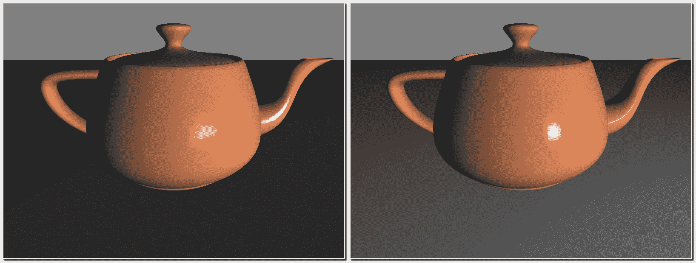

在这个例子中，我们将通过从顶点着色器传递位置和法线到片元着色器，并在片元着色器内评估 Phong 反射模型来实现 Phong 着色。

# 准备工作

将程序设置为你 OpenGL 应用程序中的顶点位置在属性位置零，法线在位置一。你的 OpenGL 应用程序还必须提供统一变量的值，如前所述。

# 如何实现...

要创建一个可以使用 Phong 反射模型实现每片元（或 Phong）着色的着色器程序，请按照以下步骤操作：

1.  顶点着色器简单地转换位置和法线到相机坐标，并将它们传递给片元着色器：

```cpp
layout (location = 0) in vec3 VertexPosition;
layout (location = 1) in vec3 VertexNormal;

out vec3 Position;
out vec3 Normal;

uniform mat4 ModelViewMatrix, NormalMatrix, ProjectionMatrix, MVP;

void main() {
  Normal = normalize( NormalMatrix * VertexNormal);
  Position = ( ModelViewMatrix * vec4(VertexPosition,1.0) ).xyz;
  gl_Position = MVP * vec4(VertexPosition,1.0);
}
```

1.  片元着色器使用从顶点着色器传递的值评估 Phong 反射模型：

```cpp
in vec3 Position; 
in vec3 Normal; 
// Uniform variables...

layout( location = 0 ) out vec4 FragColor; 

vec3 phongModel( vec3 position, vec3 n ) { 
   // Compute and return Phong reflection model
} 

void main() { 
  FragColor = vec4(phongModel(Position, normalize(Normal)), 1);
} 
```

# 它是如何工作的...

顶点着色器有两个输出变量：`Position`和`Normal`。在`main`函数中，我们通过法线矩阵变换将顶点法线转换为相机坐标，并将转换后的值存储在`Normal`中。同样，通过模型视图矩阵变换顶点位置，将其转换为眼睛坐标，并将转换后的值存储在`Position`中。`Position`和`Normal`的值会自动插值，并通过相应的输入变量提供给片段着色器。然后，片段着色器使用提供的值计算 Phong 反射模型。在这里，我们重新归一化`Normal`向量，因为插值过程可能会创建非单位长度的向量。

最后，结果存储在输出变量`FragColor`中。

# 还有更多...

在片段着色器内评估着色方程会产生更精确的渲染。然而，我们付出的代价是在多边形的每个像素上评估着色模型，而不是在每个顶点上。好消息是，随着现代图形卡的处理能力，可能足以并行评估多边形的所有片段。这实际上可以提供几乎等效的性能，无论是按片段还是按顶点着色。

# 参见

+   示例代码中的`chapter04/sceneperfragment.cpp`配方

+   在第三章的*《GLSL 着色器基础》*中，*实现 Phong 反射模型*的配方

# Blinn-Phong 反射模型

如在第三章的*《GLSL 着色器基础》*中，*实现 Phong 反射模型*的配方所述，方程中的镜面项涉及纯反射向量（*r*）和观察者方向（*v*）的点积：

为了评估前面的方程，我们需要找到纯反射向量（*r*），这是向量向光源（*s*）的反射，关于法向量（*n*）的反射：

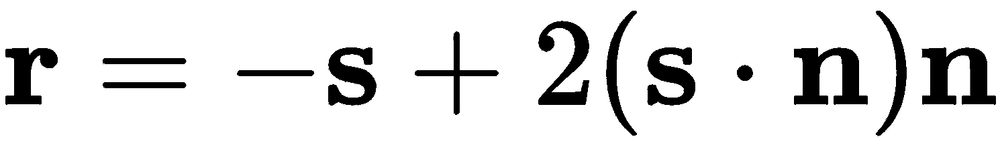

此方程使用 GLSL 函数`reflect`实现。

我们可以通过利用以下观察来避免计算*r*。当*v*与*r*对齐时，法向量(*n*)必须在*v*和*s*之间。让我们定义中点向量(*h*)为位于*v*和*s*之间的向量，其中*h*在加法后归一化：

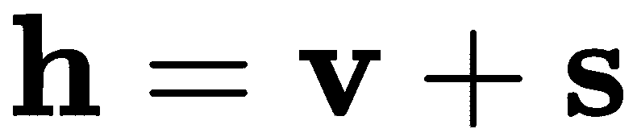

下图显示了中点向量和其他向量之间的相对位置：

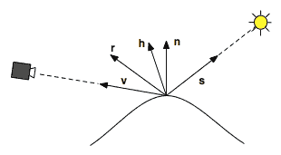

我们可以将方程中镜面成分的点积替换为*h*和*n*的点积：

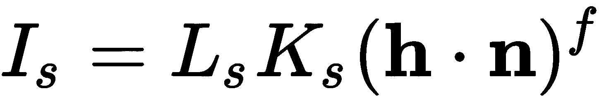

计算*h*所需的操作比计算*r*要少，因此我们预计使用中点向量可以带来一些效率提升。当所有向量共面时，中点向量与法线向量之间的角度与纯反射向量(*r*)与观察者方向向量(*v*)之间的角度成正比。因此，我们预计视觉结果将相似，尽管不完全相同。

这种对 Phong 反射模型的小幅修改是由 James Blinn 提出的，他曾在 NASA 的**喷气推进实验室**（**JPL**）工作。由于他的修改版本在镜面项中使用了*中点向量*，因此被称为**Blinn-Phong 模型**。

有趣的是，尽管 Blinn-Phong 模型看起来有些**ad hoc**，但它产生的结果比 Phong 模型更接近物理测量。有关详情，请参阅这篇论文：[`people.csail.mit.edu/wojciech/BRDFValidation/index.html`](http://people.csail.mit.edu/wojciech/BRDFValidation/index.html)

# 准备工作

首先，利用在配方*使用片段着色提高真实感*中展示的相同着色器程序，并按照那里的描述设置你的 OpenGL 程序。

# 如何做到...

使用与配方*使用片段着色提高真实感*中相同的着色器对，将片段着色器中的`phongModel`函数替换为以下内容：

```cpp
vec3 blinnPhong( vec3 position, vec3 n ) { 
  vec3 ambient = Light.La * Material.Ka;
  vec3 s = normalize( Light.Position.xyz - position );
  float sDotN = max( dot(s,n), 0.0 );
  vec3 diffuse = Material.Kd * sDotN;
  vec3 spec = vec3(0.0);
  if( sDotN > 0.0 ) {
    vec3 v = normalize(-position.xyz);
    vec3 h = normalize( v + s );
    spec = Material.Ks *
            pow( max( dot(h,n), 0.0 ), Material.Shininess );
  }
  return ambient + Light.L * (diffuse + spec);
}
```

# 它是如何工作的...

我们通过将指向观察者的方向(`v`)和指向光源的方向(`s`)相加，并对结果进行归一化来计算中点向量。然后，将中点向量的值存储在`h`中。然后，将镜面计算修改为使用`h`与法线向量(`n`)的点积。其余的计算保持不变。

# 还有更多...

以下截图显示了使用 Blinn-Phong 模型（右侧）渲染的茶壶，与使用第三章中*实现 Phong 反射模型*配方提供的方程式进行相同渲染的结果（左侧）。中点向量产生更大的镜面高光。如果需要，我们可以通过增加`Material.Shininess`指数的值来补偿镜面高光大小的差异：

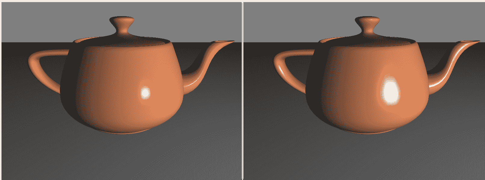

# 参考以下内容

+   示例代码中的`chapter04/shader/blinnphong.vert.glsl`和`chapter04/shader/blinnphong.frag.glsl`文件

+   *使用片段着色提高真实感*配方

# 模拟聚光灯

固定功能管线能够定义光源为聚光灯。在这种配置下，光源被认为是只在一个锥形范围内辐射光线的光源，其顶点位于光源处。此外，光线被衰减，使得它在锥形轴上最大，向边缘逐渐减小。这使得我们能够创建具有类似真实聚光灯视觉效果的灯光源。

以下截图显示了一个茶壶和一个环面使用单个聚光灯渲染的效果。注意聚光灯的强度从中心向边缘略微减弱：

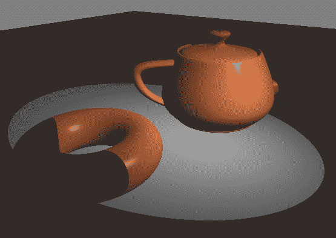

在这个配方中，我们将使用着色器来实现聚光灯效果，类似于固定功能管线产生的效果：

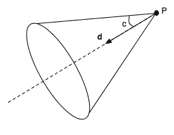

聚光灯的锥形由聚光灯方向（**d**，在先前的图像中），截止角（**c**，在先前的图像中）和位置（**P**，在先前的图像中）定义。聚光灯的强度被认为是沿着锥形轴最强，随着向边缘移动而减小。

# 准备工作

从配方中的相同顶点着色器开始，*使用每片段着色提高真实感*。您的 OpenGL 程序必须设置该顶点着色器以及以下片段着色器中定义的所有统一变量的值。

# 如何实现...

要创建使用聚光灯的 ADS 着色模型的着色器程序，请在片段着色器中使用以下代码：

```cpp
in vec3 Position; 
in vec3 Normal; 

uniform struct SpotLightInfo {
    vec3 Position;  // Position in cam coords
    vec3 L;         // Diffuse/spec intensity
    vec3 La;        // Amb intensity
    vec3 Direction; // Direction of the spotlight in cam coords.
    float Exponent; // Angular attenuation exponent
    float Cutoff;   // Cutoff angle (between 0 and pi/2)
} Spot;

// Material uniforms...

layout( location = 0 ) out vec4 FragColor; 

vec3 blinnPhongSpot( vec3 position, vec3 n ) { 
  vec3 ambient = Spot.La * Material.Ka, 
    diffuse = vec3(0), spec = vec3(0);
  vec3 s = normalize( Spot.Position - position );
  float cosAng = dot(-s, normalize(Spot.Direction));
  float angle = acos( cosAng );
  float spotScale = 0.0;
  if(angle < Spot.Cutoff ) {
    spotScale = pow( cosAng, Spot.Exponent );
    float sDotN = max( dot(s,n), 0.0 );
    diffuse = Material.Kd * sDotN;
    if( sDotN > 0.0 ) {
      vec3 v = normalize(-position.xyz);
      vec3 h = normalize( v + s );
      spec = Material.Ks *
        pow( max( dot(h,n), 0.0 ), Material.Shininess );
    }
  }
  return ambient + spotScale * Spot.L * (diffuse + spec);
}

void main() {
  FragColor = vec4(blinnPhongSpot(Position, normalize(Normal)), 1);
}

```

# 工作原理...

`SpotLightInfo` 结构定义了聚光灯的所有配置选项。我们声明一个名为 `Spot` 的单个统一变量来存储我们的聚光灯数据。`Position` 字段定义了聚光灯在视眼坐标系中的位置。`L` 字段是聚光灯的强度（漫反射和镜面反射），而 `La` 是环境强度。`Direction` 字段将包含聚光灯指向的方向，这定义了聚光灯锥的中心轴。此向量应在相机坐标系中指定。在 OpenGL 程序中，它应以与法向量相同的方式通过法线矩阵进行变换。我们可以在着色器中这样做；然而，在着色器中，法线矩阵将针对正在渲染的对象进行指定。这可能不是聚光灯方向适当的变换。

`Exponent`字段定义了在计算聚光灯的角衰减时使用的指数。聚光灯的强度与从光源到表面位置的向量（变量`s`的负值）与聚光灯方向之间的角度余弦成正比。然后将余弦项提升到变量`Exponent`的幂。此变量的值越大，聚光灯的强度衰减越快。这与镜面着色项中的指数类似。

`Cutoff`字段定义了聚光灯光锥中心轴与外边缘之间的角度。我们以弧度为单位指定此角度。

`blinnPhongSpot`函数计算 Blinn-Phong 反射模型，使用聚光灯作为光源。第一行计算环境光照分量并将其存储在`ambient`变量中。第二行计算从表面位置到聚光灯位置的向量（`s`）。接下来，我们计算从聚光灯到表面点的方向（`-s`）与聚光灯方向的点积，并将结果存储在`cosAng`中。然后计算它们之间的角度并将其存储在变量`angle`中。变量`spotScale`将用于缩放聚光灯的漫反射/镜面强度值。它最初设置为 0。

我们然后将`angle`变量的值与`Spot.Cutoff`变量的值进行比较。如果`angle`大于零且小于`Spot.Cutoff`，则表面点位于聚光灯的锥体内。否则，表面点仅接收环境光，因此我们跳过其余部分并仅返回环境分量。

如果`angle`小于`Spot.Cutoff`，我们通过将`-s`和`spotDir`的点积提升到`Spot.Exponent`的幂来计算`spotScale`值。`spotScale`的值用于缩放光强度，使得光在锥体的中心最大，并向边缘移动时逐渐减小。最后，像往常一样计算 Blinn-Phong 反射模型。

# 参见

+   示例代码中的`Chapter04/scenespot.cpp`文件

+   The Using per-fragment shading for improved realism recipe

+   The Blinn-Phong reflection model recipe

# 创建卡通着色效果

**卡通着色**（也称为**赛璐珞着色**）是一种非真实感渲染技术，旨在模仿手绘动画中常用的着色风格。有许多不同的技术被用来产生这种效果。在这个配方中，我们将使用一个非常简单的技术，它涉及到对环境光和漫反射着色模型的轻微修改。

基本效果是在大面积的恒定颜色之间有尖锐的过渡。这模拟了艺术家使用笔或刷的笔触来着色物体的方式。以下图像显示了使用卡通着色渲染的茶壶和环面示例：

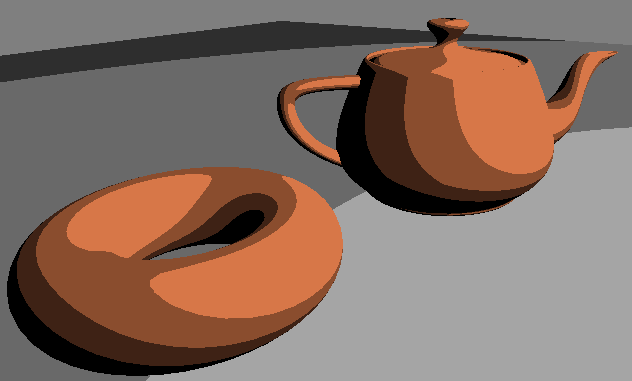

这里介绍的技术只涉及计算典型 ADS 着色模型的周围和漫反射分量，并对漫反射分量的余弦项进行量化。换句话说，通常在漫反射项中使用的点积值被限制在固定数量的可能值中。以下表格说明了四个级别的概念：

| **s 和 n 之间角度的余弦值** | **使用的值** |
| --- | --- |
| 介于 1 和 0.75 之间 | 0.75 |
| 介于 0.75 和 0.5 之间 | 0.5 |
| 介于 0.5 和 0.25 之间 | 0.25 |
| 介于 0.25 和 0.0 之间 | 0.0 |

在前一个表格中，**s** 是指向光源的向量，**n** 是表面的法向量。通过这种方式限制余弦项的值，着色在从一级到另一级之间显示出强烈的间断（参见前一个图像），模拟手绘细胞动画的笔触。

# 准备工作

从 *使用片段着色提高真实感* 菜单中的相同顶点着色器开始。您的 OpenGL 程序必须设置该顶点着色器中定义的所有统一变量的值，以及这里描述的片段着色器代码。

# 如何做到这一点...

要创建产生卡通着色效果的着色器程序，请使用以下片段着色器：

```cpp
in vec3 Position;
in vec3 Normal;

uniform struct LightInfo {
  vec4 Position; // Light position in eye coords.
  vec3 La;       // Ambient light intesity
  vec3 L;        // Diffuse and specular light intensity
} Light;

uniform struct MaterialInfo {
  vec3 Ka; // Ambient reflectivity
  vec3 Kd; // Diffuse reflectivity
} Material;

const int levels = 3;
const float scaleFactor = 1.0 / levels;

layout( location = 0 ) out vec4 FragColor;

vec3 toonShade( ) {
    vec3 n = normalize( Normal );
    vec3 s = normalize( Light.Position.xyz - Position );
    vec3 ambient = Light.La * Material.Ka;
    float sDotN = max( dot( s, n ), 0.0 );
    vec3 diffuse = Material.Kd * floor( sDotN * levels ) * scaleFactor;

    return ambient + Light.L * diffuse;
}

void main() {
    FragColor = vec4(toonShade(), 1.0);
}
```

# 它是如何工作的...

常量变量 `levels` 定义了在漫反射计算中将使用多少个不同的值。这也可以定义为统一变量，以便从主 OpenGL 应用程序中进行配置。我们将使用此变量来量化漫反射计算中余弦项的值。

`toonShade` 函数是此着色器中最重要的一部分。我们首先计算 **s**，即指向光源的向量。接下来，我们通过评估 `s` 和 `Normal` 的点积来计算漫反射分量的余弦项。下一行以以下方式量化该值。由于两个向量都是归一化的，并且我们使用 `max` 函数去除了负值，所以我们确信余弦值的范围在零到一之间。通过将此值乘以 `levels` 并取 `floor`，结果将是一个介于 `0` 和 `levels -1` 之间的整数。当我们除以 levels（通过乘以 `scaleFactor`）时，我们将这些整数值缩放到零到一之间。结果是可以在零和一之间均匀分布的 `levels` 个可能值之一。然后将此结果乘以 `Material.Kd`，即漫反射反射率项。

最后，我们将漫反射和周围分量组合起来，以获得片段的最终颜色。

# 更多内容...

在量化余弦项时，我们本可以使用 `ceil` 而不是 `floor`。这样做将简单地将每个可能值向上移动一个级别。这将使着色级别稍微亮一些。

在大多数细胞动画中常见的典型卡通风格包括围绕轮廓和形状其他边缘的黑轮廓。这里提出的着色模型不会产生这些黑轮廓。有几种产生它们的技术，我们将在本书稍后部分查看其中一种。

# 参见

+   示例代码中的 `chapter04/scenetoon.cpp` 文件

+   *使用片段着色提高真实感* 的配方

+   *Blinn-Phong 反射模型* 的配方

+   在第六章 Chapter 6，*图像处理和屏幕空间技术* 中，*使用几何着色器绘制轮廓线* 的配方

# 模拟雾

通过将每个片段的颜色与一个恒定的雾色混合，可以简单地实现雾效。雾色的影响程度由与摄像机的距离决定。我们可以使用距离和雾色量之间的线性关系，或者使用指数等非线性关系。

以下图像显示了使用与距离成线性关系的雾色混合产生的雾效渲染的四个茶壶：

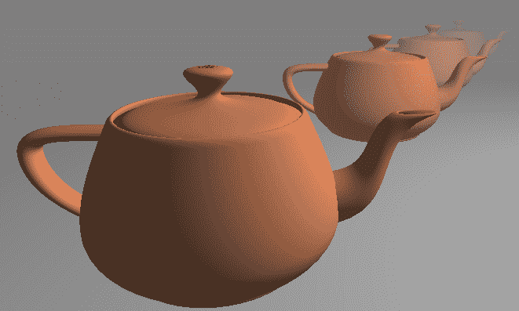

要定义这种线性关系，我们可以使用以下方程：

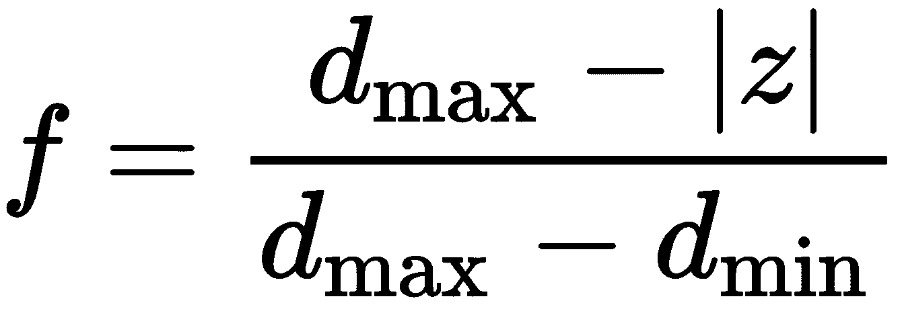

在前面的方程中，*d[min]* 是雾最少的（没有雾贡献）眼睛距离，*d[max]* 是雾色掩盖场景中所有其他颜色的距离。变量 *z* 代表眼睛的距离。值 *f* 是雾因子。雾因子为零表示 100% 雾，因子为一表示没有雾。由于雾通常在更长的距离上看起来最浓，因此当 *|z|* 等于 *d[max]* 时，雾因子最小，当 *|z|* 等于 *d[min]* 时，雾因子最大。

由于雾是通过片段着色器应用的，因此效果只会在渲染的对象上可见。它不会出现在场景中的任何 *空* 空间（背景）中。为了帮助使雾效保持一致，您应使用与最大雾色相匹配的背景色。

# 准备工作

从 *使用片段着色提高真实感* 配方中的相同顶点着色器开始。您的 OpenGL 程序必须设置该顶点着色器以及以下部分中显示的片段着色器中定义的所有统一变量的值。

# 如何做到...

要创建一个产生类似雾效的着色器，请使用以下代码作为片段着色器：

```cpp
in vec3 Position; 
in vec3 Normal; 
// Light and material uniforms ...
uniform struct FogInfo {
  float MaxDist;
  float MinDist;
  vec3 Color;
} Fog;

layout( location = 0 ) out vec4 FragColor;

vec3 blinnPhong( vec3 position, vec3 n ) { 
  // Blinn-Phong reflection model ...
}

void main() {
    float dist = abs( Position.z );
    float fogFactor = (Fog.MaxDist - dist) /
                      (Fog.MaxDist - Fog.MinDist);
    fogFactor = clamp( fogFactor, 0.0, 1.0 );
    vec3 shadeColor = blinnPhong(Position, normalize(Normal));
    vec3 color = mix( Fog.Color, shadeColor, fogFactor );
    FragColor = vec4(color, 1.0);
}
```

# 它是如何工作的...

在这个着色器中，`blinnPhong` 函数与 *Blinn-Phong 反射模型* 配方中使用的完全相同。*处理雾效的部分位于 `main` 函数中。

均匀变量`Fog`包含定义雾的广度和颜色的参数。`MinDist`字段是眼睛到雾的起始点的距离，而`MaxDist`是雾最大时的距离。`Color`字段是雾的颜色。

`dist`变量用于存储表面点到眼睛位置的距离。位置`z`坐标被用作实际距离的估计。`fogFactor`变量使用前面的方程计算。由于`dist`可能不在`Fog.MinDist`和`Fog.MaxDist`之间，我们将`fogFactor`的值夹在零和一之间。

然后我们调用`blinnPhong`函数来评估反射模型。这个结果存储在`shadeColor`变量中。

最后，我们根据`fogFactor`的值将`shadeColor`和`Fog.Color`混合在一起，并将结果用作片段颜色。

# 更多内容...

在这个配方中，我们使用了雾颜色与眼睛距离之间的线性关系。另一种选择是使用指数关系。例如，以下方程可以用来：

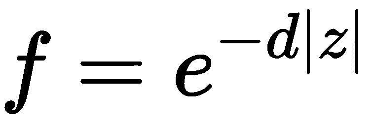

在上述方程中，*d*代表雾的密度。较大的值会创建*更浓*的雾。我们还可以将指数平方，以创建一个稍微不同的关系（随着距离的增加，雾的增长更快）。

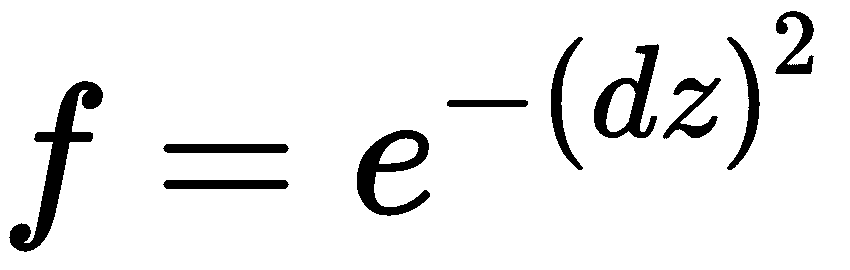

# 从眼睛计算距离

在前面的代码中，我们使用了*z*坐标的绝对值作为从摄像机到距离的估计。这可能会在某些情况下使雾看起来有点不真实。为了计算更精确的距离，我们可以替换以下行：

```cpp
float dist = abs( Position.z ); 
```

以下内容：

```cpp
float dist = length( Position.xyz ); 
```

当然，后一种版本需要开平方，因此在实践中可能会稍微慢一些。

# 参见

+   示例代码中的`chapter04/scenefog.cpp`文件

+   *Blinn-Phong 反射模型*的配方

# 基于物理的反射模型

**基于物理的渲染**或**PBR**是一个总称，它包括利用基于物理的光和反射模型的工具和技术。这个术语本身定义得相当宽松，但可以大致描述为一个着色/反射模型，它试图尽可能准确地模拟光与物质相互作用的物理过程。这个术语对不同的人可能意味着不同的事情，但就我们的目的而言，我们主要感兴趣的是它与 Phong 和 Blinn-Phong 反射模型的区别。

Blinn-Phong 模型是一种基于观察的反射经验模型。PBR 模型也可以被视为一种经验模型，但通常来说，它在表示交互的物理方面更为详细和准确。Blinn-Phong 模型使用了一些并非基于物理的参数，但能产生有效结果。例如，将光强度分为三个（或两个）单独的值在物理上并不准确（只有一个光源）。然而，它为艺术家提供了许多“可调”参数来工作，使他们能够达到期望的外观。

近年来，由于 PBR 技术减少了可调参数的数量，并在广泛的材料上提供更一致的结果，因此受到了青睐。艺术家们发现，之前的模型（非 PBR）往往难以“正确”实现。当场景由多种材料组成时，参数可能需要大量的“调整”才能保持一致。基于 PBR 的技术试图更准确地表示物理，这往往使得在广泛的照明设置下看起来更一致，从而减少了艺术家所需的微调量。

在这个配方中，我们将实现一个基于点光源的基本 PBR 反射模型。然而，在我们开始之前，让我们回顾一下数学。在以下方程中，我们将使用向量*n*，*l*，*v*和*h*，它们如下定义：

+   *n*: 表面法线

+   *l*: 表示入射光方向的向量

+   *v*: 指向观察者（摄像机）的方向

+   *h*: 位于*l*和*v*之间的向量（如在 Blinn-Phong 模型中）

描述光线从表面散射的流行数学模型被称为**反射方程**（渲染方程的特殊情况），其形式如下：

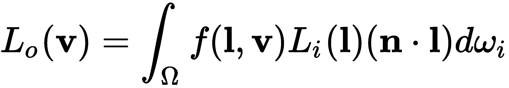

这个积分可能看起来有点吓人，但基本上，它意味着以下内容。从表面（*L[o]*）向观察者（*v*）发出的辐射量等于 BRDF（*f*）乘以入射辐射量（*L[i]*）的积分（可以认为是加权求和）。积分是在表面上方的半球内进行的，对于半球内的所有入射光方向（*l*），通过余弦因子（*n · l*）加权。这个余弦因子是一个权重，本质上代表了情况的几何形状。光线越直接地击中表面，其权重就越高。关于这个方程的更完整推导可以在几篇文献中找到。在这个配方中，我们将这个积分简化为一个简单的总和，假设唯一的入射辐射源是点光源。这当然是一个巨大的简化，我们将在稍后考虑一些更精确评估积分的技术。

对于我们来说，最重要的项是 BRDF 项（*f*），它代表双向反射分布函数。它表示从表面点反射的光照度比例，给定入射方向（*l*）和出射方向（*v*）。它的值是一个光谱值（R,G,B），其分量范围从 0 到 1。在这个配方中，我们将 BRDF 建模为两部分之和：散射 BRDF 和镜面 BRDF：

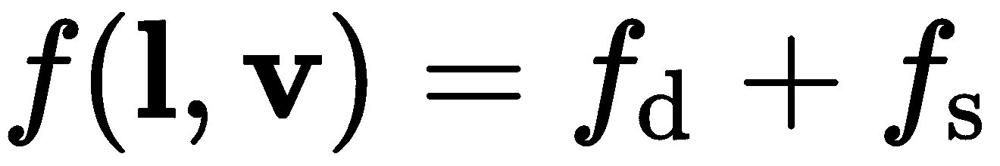

散射 BRDF 代表稍微吸收到表面然后重新辐射的光线。通常，建模这个项时，辐射光线没有特定的方向。它在所有出射方向上均匀辐射。这也被称为**朗伯反射率**。由于它不依赖于入射或出射方向，朗伯 BRDF 只是一个常数：

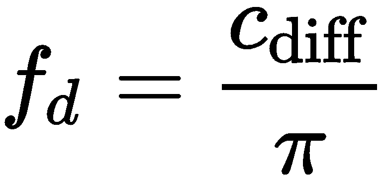

*c*[*dif*f]项代表散射辐射的光线比例。它通常被认为是物体的散射颜色。

镜面项代表表面反射率。光线直接从物体表面反射，没有被吸收。这有时也被称为**光泽反射率**。建模这种反射率的一种常见方法是基于**微 facet 理论**。该理论是为了描述从一般非光学平坦表面的反射而开发的。它将表面建模为由光学平坦（镜子）的小面组成，这些面以各种方向取向。只有那些正确取向以反射向观察者的面才能对 BRDF 做出贡献。

我们将这个 BRDF 表示为三个项和一个校正因子（分母）的乘积：

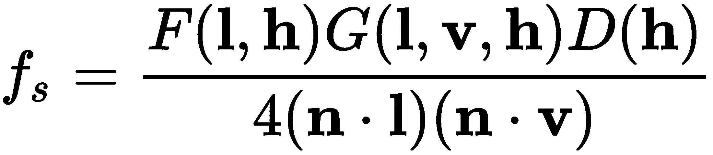

我不会详细介绍这些项的细节。更多信息，请参阅以下*也见*部分。相反，我将简要描述每一个。*F*项代表**菲涅耳反射**，从光学平坦表面反射的光线比例。菲涅耳反射率取决于法线与入射光线方向（入射角）之间的角度。然而，由于我们使用微 facet 理论，贡献的微 facet 表面是那些其法线向量与中点向量（*h*）平行的表面。因此，我们使用*l*和*h*之间的角度而不是*l*和*n*之间的角度。

菲涅耳反射率也取决于表面的折射率。然而，我们将使用一个不同的参数进行近似。这被称为**Schlick 近似**：

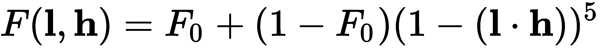

与使用折射率指数不同，这个近似使用的是 *F[0]*，材料的**特征镜面反射率**。换句话说，就是入射角为零度时的反射率。这个术语很有用，因为它可以用作镜面“颜色”，这对艺术家来说更加直观和自然。

为了进一步理解这个 *F[0]* 术语，让我们考虑常见材料的值。结果证明，材料的光学特性与其电学特性密切相关。因此，将材料分为三类是有帮助的：介电体（绝缘体）、金属（导体）和半导体。我们的模型将忽略第三类，并专注于前两类。金属通常不表现出任何漫反射，因为任何折射到表面的光线都会被自由电子完全吸收。金属的 *F[0]* 值比介电体大得多。实际上，介电体的 *F[0]* 值非常低，通常在 0.05（对于所有 RGB 成分）的范围内。这导致我们采用以下技术。

我们将颜色与材料关联起来。如果材料是金属，则没有漫反射，因此我们将 *c[diff]* 设置为 (0,0,0)，并将颜色作为 Fresnel 项中 *F[0]* 的值。如果材料是介电体，我们将 *F[0]* 设置为某个小值（我们将使用 (0.04, 0.04, 0.04)），并将颜色作为 *c[*dif*f] 的值。本质上，我们为金属和介电体使用两种略有不同的模型，根据需要在这两种模型之间切换。我们不是使用相同的模型来表示金属和非金属，并调整参数来表示每个，而是将它们分为两个不同的类别，每个类别都有一个略有不同的 BRDF 模型。这个流行术语被称为**金属度工作流程**。

接下来，让我们考虑镜面 BRDF 中的 *D* 项。这是**微观几何法线分布函数**（或**微观面分布函数**）。它描述了微观表面方向的统计分布。它有一个标量值，并给出在方向 *h* 上的微观面法线的相对浓度。这个术语对镜面高光的大小和形状有很强的影响。这个函数有多个选择，近年来基于物理测量已经开发出几个。我们将使用图形研究人员 Trowbridge 和 Reitz 中的一个流行的函数，一个独立的研究团队也将其命名为 **GGX**：

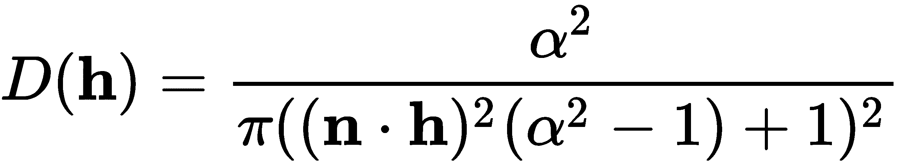

在这个方程中，*α* 是表示表面粗糙度的术语。遵循他人的做法，我们将使用粗糙度参数 *r*，并将 *α* 设置为 *r²*。

最后，我们将考虑镜面 BRDF 中的 *G* 项。这是几何函数，描述了具有给定法线的微表面从光方向（*l*）和视方向（*v*）都能被看到的可能性。其值是一个介于 0 和 1 之间的标量。这对于能量守恒至关重要。我们将使用以下模型来表示 *G*：

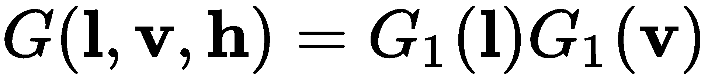

其中：

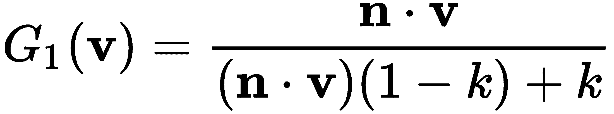

常数 *k* 是一个与粗糙度成正比的值。再次遵循他人的做法（见以下 *另见*），我们将使用以下来表示 *k*：

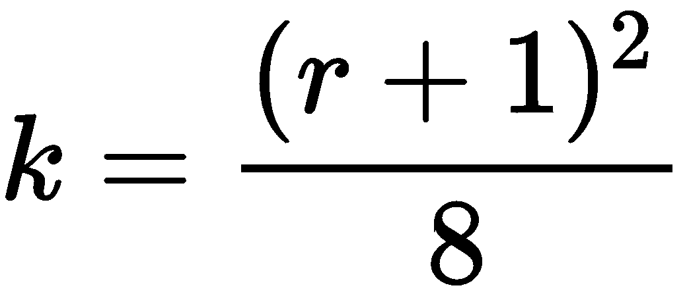

将所有这些放在一起，我们现在已经为我们的 BRDF 提供了一个完整的表示。在跳入代码之前，让我们回顾一下反射率方程。这是我们讨论的第一个方程，包含对表面上方半球所有方向的积分。在交互式应用程序中尝试评估这个积分将非常昂贵，所以我们通过假设所有入射光都直接来自点光源来简化它。如果我们这样做，积分将简化为以下求和：

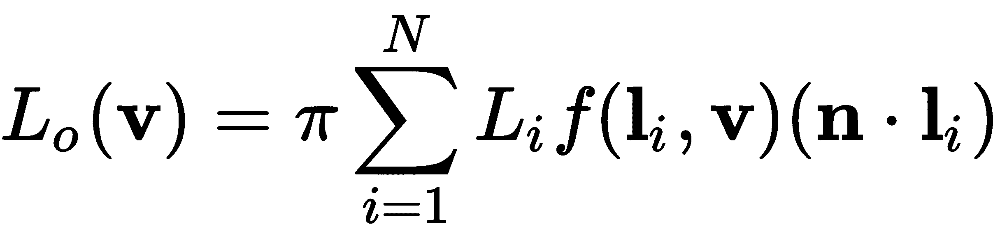

其中 *N* 是点光源的数量，*L[i]* 是由于第 *i* 个光源接收到的表面照明，*l[i]* 是指向第 *i* 个光源的方向。由于光的强度随距离增加而减小，我们将使用平方反比关系。然而，这里可以使用其他模型：

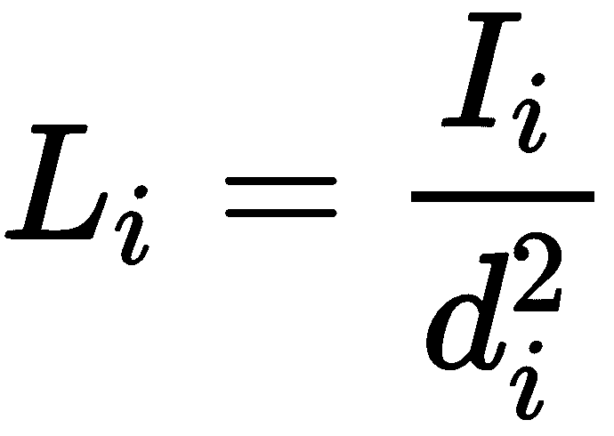

*I[i]* 是光源的强度，*d[i]* 是从表面点到光源的距离。

现在我们有一个完整的基于微面的模型，可以应用于金属表面和介电质。正如我们之前所讨论的，我们将根据我们是在处理金属还是介电质来稍微修改 BRDF。这个 BRDF 的参数数量相对较小。以下参数将定义一个材料：

+   表面粗糙度（*r*），一个介于 0 和 1 之间的值

+   材料是否为金属（布尔值）

+   一种颜色，被解释为介电质的漫反射颜色，或金属的特定镜面反射率（*F[0]*）。

这些参数相当直观易懂，与之前配方中 Blinn-Phong 模型中的许多参数相比。只有一个颜色，粗糙度比镜面指数更直观。

# 准备工作

我们将通过从 Blinn-Phong 配方中的着色器对开始设置我们的着色器，但我们将更改片段着色器。让我们为光和材料信息设置一些统一变量。

对于光源，我们只需要一个位置和一个强度：

```cpp
uniform struct LightInfo {
  vec4 Position; // Light position in cam. coords.
  vec3 L;        // Intensity
} Light[3];
```

对于材料，我们需要之前提到的三个值：

```cpp
uniform struct MaterialInfo {
  float Rough;  // Roughness
  bool Metal;   // Metallic (true) or dielectric (false)
  vec3 Color;   // Diffuse color for dielectrics, f0 for metallic
} Material;
```

# 如何做到这一点...

我们将为镜面 BRDF 中的三个术语定义一个函数。使用以下步骤：

1.  使用 Schlick 近似定义一个用于菲涅耳项的函数：

```cpp
vec3 schlickFresnel( float lDotH ) {
  vec3 f0 = vec3(0.04);  // Dielectrics
  if( Material.Metal ) {
    f0 = Material.Color;
  }
  return f0 + (1 - f0) * pow(1.0 - lDotH, 5);
}
```

1.  定义一个用于几何项 *G* 的函数：

```cpp
float geomSmith( float dotProd ) {
  float k = (Material.Rough + 1.0) * (Material.Rough + 1.0) / 8.0;
  float denom = dotProd * (1 - k) + k;
  return 1.0 / denom;
}
```

1.  基于 GGX/Trowbridge-Reitz 的法线分布函数 *D*：

```cpp
float ggxDistribution( float nDotH ) {
  float alpha2 = Material.Rough * Material.Rough * Material.Rough * Material.Rough;
  float d = (nDotH * nDotH) * (alpha2 - 1) + 1;
  return alpha2 / (PI * d * d);
}
```

1.  我们现在将定义一个函数，用于计算单个光源的整个模型：

```cpp
vec3 microfacetModel( int lightIdx, vec3 position, vec3 n ) { 
  vec3 diffuseBrdf = vec3(0.0); // Metallic
  if( !Material.Metal ) {
    diffuseBrdf = Material.Color;
  }

  vec3 l = vec3(0.0), 
    lightI = Light[lightIdx].L;
  if( Light[lightIdx].Position.w == 0.0 ) {  // Directional light
    l = normalize(Light[lightIdx].Position.xyz);
  } else {            // Positional light
    l = Light[lightIdx].Position.xyz - position;
    float dist = length(l);
    l = normalize(l);
    lightI /= (dist * dist);
  }

  vec3 v = normalize( -position );
  vec3 h = normalize( v + l );
  float nDotH = dot( n, h );
  float lDotH = dot( l, h );
  float nDotL = max( dot( n, l ), 0.0 );
  float nDotV = dot( n, v );
  vec3 specBrdf = 0.25 * ggxDistribution(nDotH) * 
        schlickFresnel(lDotH) * geomSmith(nDotL) * geomSmith(nDotV);

  return (diffuseBrdf + PI * specBrdf) * lightI * nDotL;
}
```

1.  我们通过求和光源、应用伽马校正并写出结果来将这些内容全部整合在一起：

```cpp
void main() {
  vec3 sum = vec3(0), n = normalize(Normal);
  for( int i = 0; i < 3; i++ ) {
    sum += microfacetModel(i, Position, n);
  }

  // Gamma 
  sum = pow( sum, vec3(1.0/2.2) );

  FragColor = vec4(sum, 1);
}
```

# 它是如何工作的...

`schlickFresnel` 函数计算 *F* 的值。如果材料是金属，则 *F[0]* 的值取自 `Material.Color` 的值。否则，我们简单地使用 (0.04, 0.04, 0.04)。由于大多数介电体具有相似的较小的 *F[0]* 值，这对于常见的介电体来说是一个相对较好的近似。

`geomSmith` 和 `ggxDistribution` 函数是之前描述的方程的直接实现。然而，在 `geomSmith` 中，我们省略了分子。这是因为它将与整体镜面 BRDF 的分母相抵消。

`microfacetModel` 函数计算 BRDF。如果材料是金属的，则将 `diffuse` 项设置为 `0`，否则设置为材料颜色的值。注意，我们在这里省略了 *π* 因子。这是因为它将与整体求和（最后一个求和方程）中的 *π* 项相抵消，因此在这里不需要包括它。

接下来，我们根据是否是方向光或位置光来确定 *L[i]* 项（`lightI`）和向量 *l*。如果是方向光，`lightI` 就是 `Light[lightIdx].L` 的值，否则，它将按光源距离的平方倒数进行缩放。

然后，我们使用之前定义的函数计算镜面 BRDF (`specBrdf`）。注意（如前所述），我们省略了 BRDF 的分母（除了 0.25 的因子），因为这些两个点积与 *G[1]* 函数的分子相抵消。

此函数的最终结果是总 BRDF 乘以光强度，乘以 *n* 和 *l* 的点积。我们只乘以镜面 BRDF 乘以 *π*，因为我们省略了漫反射 BRDF 中的 *π* 项。

一些简单材料的结果显示在下图中：

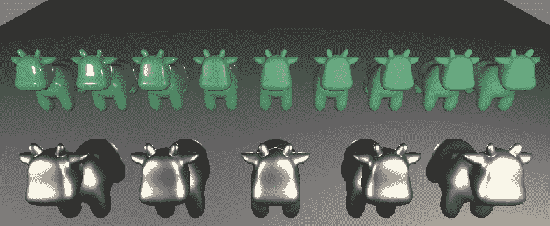

后排展示了从左到右粗糙度逐渐增加的介电（非金属）材料。前排展示了五种具有不同 *F[0]* 值的金属材料。

# 更多内容...

而不是将 `Material.Metal` 作为布尔值，可以选择将其设置为介于 0 和 1 之间的连续值。实际上，这正是某些实现所做的那样。然后，该值将用于在两种模型（金属和介电）之间进行插值。然而，这使得参数对于艺术家来说不太直观，你可能会发现额外的可配置性并不那么有用。

# 参见

+   示例代码中的 `chapter04/scenepbr.cpp` 文件

+   对 PBR 模型背后的数学原理以及来自 SIGGRAPH 2013 会议的其他信息的出色解释，请参阅[`blog.selfshadow.com/publications/s2013-shading-course/`](http://blog.selfshadow.com/publications/s2013-shading-course/)

+   这本*精彩的*书籍：《基于物理的渲染》（Physically Based Rendering），作者为 Pharr, Jakob, 和 Humphreys，目前为第三版
