# 第五章：使用纹理

在本章中，我们将涵盖以下食谱：

+   应用 2D 纹理

+   应用多个纹理

+   使用 alpha 贴图丢弃像素

+   使用法线贴图

+   视差贴图

+   带自阴影的陡峭视差贴图

+   使用立方体贴图模拟反射

+   使用立方体贴图模拟折射

+   应用投影纹理

+   将渲染输出到纹理

+   使用采样器对象

+   基于漫反射图像的照明

# 简介

纹理是实时渲染，尤其是 OpenGL 中一个重要且基本的部分。在着色器中使用纹理可以打开一个巨大的可能性范围。除了将纹理用作颜色信息源之外，它们还可以用于深度信息、着色参数、位移贴图、法线向量和其他顶点数据等。这个列表几乎是无穷无尽的。纹理是 OpenGL 程序中用于高级效果的最广泛使用的工具之一，这种情况在不久的将来不太可能改变。

在 OpenGL 4 中，我们现在可以通过缓冲区纹理、着色器存储缓冲区对象和图像纹理（图像加载/存储）来读取和写入内存。这进一步模糊了纹理的确切定义。一般来说，我们可能只是将其视为一个可能包含图像的数据缓冲区。

OpenGL 4.2 引入了**不可变存储纹理**。尽管这个术语可能意味着什么，但不可变存储纹理并不是不能改变的纹理。相反，术语*不可变*指的是一旦纹理被分配，*存储*就不能改变。也就是说，大小、格式和层数是固定的，但纹理内容本身可以修改。不可变一词指的是内存的分配，而不是内存的内容。在绝大多数情况下，不可变存储纹理更可取，因为可以避免许多运行时（绘制时）的一致性检查，并且我们可以包含一定程度的“类型安全”，因为我们不能意外地改变纹理的分配。在这本书的整个过程中，我们将专门使用不可变存储纹理。

不可变存储纹理是通过`glTexStorage*`函数分配的。如果你对纹理有经验，你可能习惯于使用`glTexImage*`函数，这些函数仍然受支持，但创建可变存储纹理。

在本章中，我们将探讨一些基本的和高级的纹理技术。我们将从基本的颜色纹理应用开始，然后过渡到使用纹理作为法线贴图和环境贴图。通过环境贴图，我们可以模拟反射和折射等现象。我们将看到一个将纹理投影到场景中物体上的例子，这类似于幻灯片投影仪投影图像的方式。最后，我们将通过一个使用**帧缓冲对象**（**FBOs**）直接渲染到纹理的例子来结束本章。

# 应用 2D 纹理

在 GLSL 中，将纹理应用于表面涉及访问纹理内存以检索与纹理坐标相关联的颜色，然后将该颜色应用于输出片段。将颜色应用于输出片段可能涉及将颜色与着色模型产生的颜色混合，直接应用颜色，使用反射模型中的颜色，或某些其他混合过程。在 GLSL 中，通过**sampler**变量访问纹理。sampler 变量是纹理单元的**句柄**。它通常在着色器内声明为 uniform 变量，并在主 OpenGL 应用程序中初始化，以指向适当的纹理单元。

在本食谱中，我们将查看一个简单示例，涉及将 2D 纹理应用于表面，如图所示。我们将使用纹理颜色作为 Blinn-Phong 反射模型中的漫反射（和环境）反射率项。以下图像显示了将砖纹纹理应用于立方体的结果。纹理显示在右侧，渲染结果显示在左侧：

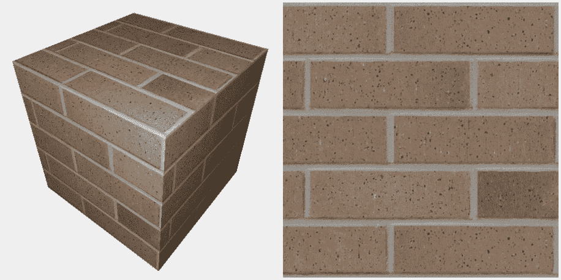

# 准备工作

设置你的 OpenGL 应用程序以提供顶点位置在属性位置 0，顶点法线在属性位置 1，以及纹理坐标在属性位置 2。Blinn-Phong 反射模型的参数再次在着色器内声明为 uniform 变量，并且必须从 OpenGL 程序中初始化。将着色器的句柄通过名为`programHandle`的变量使其可用。

# 如何实现...

要使用 2D 纹理渲染简单形状，请按照以下步骤操作：

1.  我们将定义一个简单的（静态）函数用于加载和初始化纹理：

```cpp
GLuint Texture::loadTexture( const std::string & fName ) {
  int width, height;
  unsigned char * data = Texture::loadPixels(fName, width, height);
  GLuint tex = 0;
  if( data != nullptr ) {
    glGenTextures(1, &tex);
    glBindTexture(GL_TEXTURE_2D, tex);
    glTexStorage2D(GL_TEXTURE_2D, 1, GL_RGBA8, width, height);
    glTexSubImage2D(GL_TEXTURE_2D, 0, 0, 0, 
              width, height, GL_RGBA, GL_UNSIGNED_BYTE, data);

    glTexParameteri(GL_TEXTURE_2D, GL_TEXTURE_MAG_FILTER, 
    GL_LINEAR);
    glTexParameteri(GL_TEXTURE_2D, GL_TEXTURE_MIN_FILTER, 
    GL_NEAREST);

    Texture::deletePixels(data);
  }
  return tex;
}
```

1.  在 OpenGL 应用程序的初始化中，使用以下代码加载纹理，将其绑定到纹理单元`0`，并将 uniform 变量`Tex1`设置为该纹理单元：

```cpp
GLuint tid = Texture::loadTexture("brick1.png");

glActiveTexture(GL_TEXTURE0); 
glBindTexture(GL_TEXTURE_2D, tid);

// Set the Tex1 sampler uniform to refer to texture unit 0 
int loc = glGetUniformLocation(programHandle, "Tex1"); 
glUniform1i(loc, 0); 
```

1.  顶点着色器将纹理坐标传递给片段着色器：

```cpp
layout (location = 0) in vec3 VertexPosition; 
layout (location = 1) in vec3 VertexNormal; 
layout (location = 2) in vec2 VertexTexCoord; 

out vec3 Position; 
out vec3 Normal; 
out vec2 TexCoord; 

// Other uniforms...

void main() 
{ 
  TexCoord = VertexTexCoord; 
  // Assign other output variables here... 
}
```

1.  片段着色器查找纹理值并将其应用于 Blinn-Phong 模型中的漫反射反射率：

```cpp
in vec3 Position; 
in vec3 Normal; 
in vec2 TexCoord; 

// The texture sampler object
uniform sampler2D Tex1; 

// Light/material uniforms...

void blinnPhong( vec3 pos, vec3 n ) { 
  vec3 texColor = texture(Tex1, TexCoord).rgb;
  vec3 ambient = Light.La * texColor;
  // ...
  vec3 diffuse = texColor * sDotN;
  // Compute spec...
  return ambient + Light.L * (diffuse + spec);   
} 
void main() { 
  FragColor = vec4( blinnPhong(Position, normalize(Normal) ), 1 ); 
} 
```

# 它是如何工作的...

第一段代码定义了一个简单的函数，该函数从文件中加载纹理，将纹理数据复制到 OpenGL 内存中，并设置`mag`和`min`过滤器。它返回纹理 ID。第一步，加载纹理图像文件，是通过调用另一个方法（`Texture::loadPixels`）完成的，该方法使用与示例代码一起提供的图像加载器。加载器来自头文件`stb_image.h`，可在 GitHub 上找到（[`github.com/nothings/stb`](https://github.com/nothings/stb)）。它读取图像并将像素数据存储在一个无符号字节的数组中，顺序为 RGBA。图像的宽度和高度通过最后两个参数返回。我们保留对图像数据的指针，简单地命名为`data`。

接下来的两行涉及通过调用 `glGenTextures` 创建一个新的纹理对象。新纹理对象的句柄存储在 `tex` 变量中。

要加载和配置纹理对象，我们执行以下操作。

1.  我们调用 `glBindTexture` 将新纹理对象绑定到 `GL_TEXTURE_2D` 目标。

1.  一旦纹理绑定到该目标，我们使用 `glTexStorage2D` 为纹理分配不可变存储。

1.  之后，我们使用 `glTexSubImage2D` 将该纹理的数据复制到纹理对象中。此函数的最后一个参数是图像原始数据的指针。

1.  下一步涉及使用 `glTexParameteri` 为纹理对象设置放大和缩小过滤器。对于这个例子，我们将使用 `GL_LINEAR` 作为前者，`GL_NEAREST` 作为后者。

纹理过滤器设置确定在从纹理返回颜色之前是否进行插值。此设置可以强烈影响结果的质量。在这个例子中，`GL_LINEAR` 表示它将返回最接近纹理坐标的四个纹素的平均加权值。有关其他过滤选项的详细信息，请参阅 OpenGL 文档中的 `glTexParameter`：[`www.opengl.org/wiki/GLAPI/glTexParameter`](http://www.opengl.org/wiki/GLAPI/glTexParameter)。

接下来，我们删除由 `data` 指向的纹理数据。没有必要保留它，因为它已经通过 `glTexSubImage2D` 复制到纹理内存中。为此，我们调用 `Texture::deletePixels` 函数。（内部调用 `stb_image` 库提供的函数 `stbi_image_free`。）然后，我们返回新纹理对象的 ID。

在接下来的代码段中，我们调用 `Texture::loadTexture` 函数来加载纹理，然后将其绑定到纹理单元 `0`。为此，首先我们调用 `glActiveTexture` 将当前活动纹理单元设置为 `GL_TEXTURE0`（第一个纹理单元，也称为 **纹理 **通道）。随后的纹理状态调用将作用于纹理单元零。然后，我们使用 `glBindTexture` 将新纹理绑定到该单元。最后，我们将 GLSL 程序中的统一变量 `Tex1` 设置为零。这是我们采样变量。注意，它在片段着色器中声明，类型为 `sampler2D`。将其值设置为零表示 OpenGL 系统该变量应引用纹理单元零（与之前使用 `glActiveTexture` 选择的是同一个）。

顶点着色器与前面例子中使用的非常相似，除了增加了纹理坐标输入变量 `VertexTexCoord`，它绑定到属性位置 `2`。它的值简单地通过将其分配给着色器输出变量 `TexCoord` 传递给片段着色器。

片段着色器与之前章节中使用的着色器也非常相似。主要的变化是`Tex1`统一变量和`blinnPhong`函数。`Tex1`是一个`sampler2D`变量，由 OpenGL 程序分配以引用纹理单元零。在`blinnPhong`函数中，我们使用该变量以及纹理坐标（`TexCoord`）来访问纹理。我们通过调用内置函数`texture`来实现这一点。这是一个通用函数，用于访问各种不同的纹理。第一个参数是一个采样变量，指示要访问哪个纹理单元，第二个参数是用于访问纹理的纹理坐标。返回值是一个包含通过纹理访问得到的颜色的`vec4`。我们只选择前三个组件（`.rgb`）并将它们存储在`texColor`中。然后，我们将`texColor`用作 Blinn-Phong 模型中的环境光和漫反射反射率项。

当使用纹理同时进行环境光和漫反射反射率时，设置环境光强度为小值很重要，以避免*过度曝光*。

# 还有更多...

在决定如何将纹理颜色与其他与片段相关的颜色组合时，有几种选择。在这个例子中，我们使用了纹理颜色作为环境光和漫反射反射率，但可以选择直接使用纹理颜色，或者以某种方式将其与反射模型混合。选项无穷无尽——选择权在你！

# 在 GLSL 中指定采样器绑定

截至 OpenGL 4.2，我们现在能够在 GLSL 中指定采样器绑定的默认值（采样器统一变量的值）。在之前的示例中，我们使用以下代码从 OpenGL 端设置统一变量的值：

```cpp
int loc = glGetUniformLocation(programHandle, "Tex1"); 
glUniform1i(loc, 0);
```

相反，如果我们使用 OpenGL 4.2，我们可以在着色器中使用 layout 限定符来指定默认值，如下面的语句所示：

```cpp
layout (binding=0) uniform sampler2D Tex1;
```

这简化了 OpenGL 端的代码，并使我们需要担心的事情减少了一项。本书附带示例代码使用此技术来指定`Tex1`的值，因此请查看那里以获取更完整的示例。我们还将在此后的食谱中使用此 layout 限定符。

# 参见

+   示例代码中的`chapter05/scenetexture.cpp`文件

+   有关通过顶点属性将数据发送到着色器的更多信息，请参阅第二章中的*使用顶点属性和顶点缓冲对象发送数据到着色器*食谱，*与 GLSL 程序一起工作*

+   在第四章的*使用每片段着色提高真实感*食谱中，*光照和着色*

# 应用多个纹理

将多个纹理应用于表面可以用来创建各种效果。基础层纹理可能代表*干净*的表面，而第二层可以提供额外的细节，如阴影、瑕疵、粗糙度或损坏。在许多游戏中，所谓的光照图作为额外的纹理层应用，以提供关于光照暴露的信息，从而有效地产生阴影和着色，而无需显式计算反射模型。这类纹理有时被称为*预烘焙*光照。在这个菜谱中，我们将通过应用两层纹理来展示这种多纹理技术。基础层将是一个完全不透明的砖图像，而第二层将是部分透明的。不透明部分看起来像是长在砖块上的苔藓。

以下图像显示了多个纹理的示例。左侧的纹理应用于右侧的立方体。基础层是砖纹理，而苔藓纹理则覆盖在其上。苔藓纹理的透明部分揭示了下面的砖纹理：

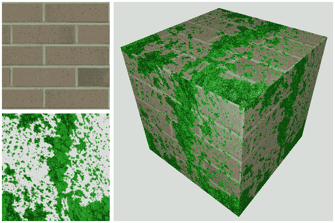

# 准备工作

我们将从上一道菜谱中开发的着色器开始，即*应用 2D 纹理*，以及那里描述的`Texture::loadTexture`函数。

# 如何操作...

1.  在你的 OpenGL 程序初始化部分，以与上一道菜谱*应用 2D 纹理*中指示的相同方式，将两个图像加载到纹理内存中。确保砖纹理被加载到纹理单元 0，而苔藓纹理加载到纹理单元 1：

```cpp
 GLuint brick = Texture::loadTexture("brick1.jpg");
 GLuint moss = Texture::loadTexture("moss.png");

// Load brick texture file into channel 0
glActiveTexture(GL_TEXTURE0);
glBindTexture(GL_TEXTURE_2D, brick);
// Load moss texture file into channel 1
glActiveTexture(GL_TEXTURE1);
glBindTexture(GL_TEXTURE_2D, moss); 
```

1.  从菜谱*应用 2D 纹理*中的片段着色器开始，将采样变量`Tex1`的声明替换为以下代码：

```cpp
layout(binding=0) uniform sampler2D BrickTex; 
layout(binding=1) uniform sampler2D MossTex;
```

1.  在`blinnPhong`函数中，从两个纹理中获取样本并将它们混合在一起。然后，将混合后的颜色应用到环境光和漫反射反射率上：

```cpp
vec4 brickTexColor = texture( BrickTex, TexCoord );
vec4 mossTexColor = texture( MossTex, TexCoord );
vec3 col = mix(brickTexColor.rgb, mossTexColor.rgb, mossTexColor.a);
vec3 ambient = Light.La * col;
// ...
vec3 diffuse = col * sDotN;
```

# 工作原理...

将两个纹理加载到 OpenGL 程序中的前述代码与上一道菜谱*应用 2D 纹理*中的代码非常相似。主要区别在于我们将每个纹理加载到不同的纹理单元。当加载砖纹理时，我们设置 OpenGL 状态，使得活动纹理单元为单元零：

```cpp
glActiveTexture(GL_TEXTURE0); 
```

当加载第二个纹理时，我们将 OpenGL 状态设置为纹理单元 1：

```cpp
glActiveTexture(GL_TEXTURE1); 
```

在片段着色器中，我们使用与适当纹理单元对应的布局限定符来指定每个采样器变量的纹理绑定。我们使用相应的统一变量访问两个纹理，并将结果存储在`brickTexColor`和`mossTexColor`中。这两个颜色通过内置函数`mix`混合在一起。`mix`函数的第三个参数是混合两种颜色时使用的百分比。我们使用苔藓纹理的 alpha 值作为该参数。这导致结果基于苔藓纹理中 alpha 的值进行线性插值。对于那些熟悉 OpenGL 混合函数的人来说，这等同于以下混合函数：

```cpp
glBlendFunc( GL_SRC_ALPHA, GL_ONE_MINUS_SRC_ALPHA ); 
```

在这种情况下，苔藓的颜色将是源颜色，砖的颜色将是目标颜色。最后，我们将`mix`函数的结果用作 Blinn-Phong 反射模型中的环境光和漫反射反射率。

# 更多内容...

在这个例子中，我们使用第二个纹理的 alpha 值混合了两种纹理颜色。这只是混合纹理颜色众多选项之一。这里有许多不同的选择，你的选择将取决于可用的纹理数据和期望的效果。一种流行的技术是使用额外的顶点属性来增强纹理之间的混合量。这个额外的顶点属性将允许我们在整个模型中改变混合因子。例如，我们可以通过定义另一个顶点属性来控制苔藓纹理和基础纹理之间的混合量，从而改变表面上苔藓的生长量。零值可能对应于没有苔藓，而一值将仅基于纹理的 alpha 值进行混合。

# 参见

+   示例代码中的`chapter05/scenemultitex.cpp`文件

+   应用 2D 纹理的配方

# 使用 alpha 图丢弃像素

为了创建具有孔洞的物体效果，我们可以使用包含有关物体透明部分信息的适当 alpha 通道的纹理。然而，这要求我们将深度缓冲区设置为只读，并从后向前渲染所有多边形以避免混合问题。我们需要根据相机位置对多边形进行排序，然后按正确顺序渲染它们。多么痛苦！使用 GLSL 着色器，我们可以通过使用`discard`关键字在纹理贴图的 alpha 值低于某个值时完全丢弃片段来避免所有这些问题。通过完全丢弃片段，我们不需要修改深度缓冲区，因为当丢弃时，它们根本不会与深度缓冲区进行评估。我们不需要对多边形进行深度排序，因为没有混合。

右侧的以下图像显示了一个茶壶，其碎片基于左侧的纹理被丢弃。片段着色器丢弃与具有低于一定阈值 alpha 值的 texels 对应的碎片：

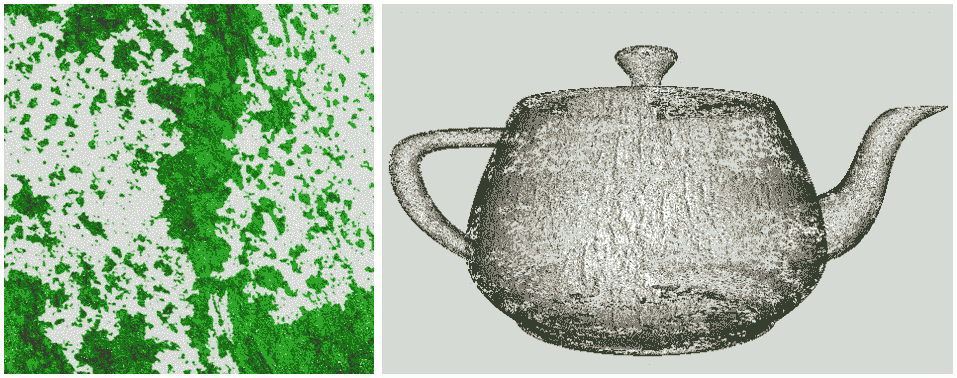

如果我们创建一个具有 alpha 通道的纹理图，我们可以使用 alpha 通道的值来确定是否应该丢弃碎片。如果 alpha 值低于某个值，则丢弃该像素。

由于这将允许观众看到物体内部，可能使一些背面可见，因此我们在渲染物体时需要使用双面光照。

# 准备工作

从上一个配方*应用 2D 纹理*开始，使用相同的着色器对和设置。将物体的基础纹理加载到纹理单元 0，并将你的 alpha 贴图加载到纹理单元 1。

# 如何操作...

要根据纹理的 alpha 数据丢弃碎片，请按照以下步骤操作：

1.  使用与*应用 2D 纹理*配方相同的顶点和片段着色器。然而，对片段着色器进行以下修改。

1.  将`sampler2D`统一变量替换为以下内容：

```cpp
layout(binding=0) uniform sampler2D BaseTex; 
layout(binding=1) uniform sampler2D AlphaTex;
```

1.  在`blinnPhong`函数中，使用`BaseTex`查找环境光和漫反射反射率的值。

1.  将`main`函数的内容替换为以下代码：

```cpp
void main() {
    vec4 alphaMap = texture( AlphaTex, TexCoord );

    if(alphaMap.a < 0.15 )
        discard;
    else {
        if( gl_FrontFacing ) {
            FragColor = vec4( 
            blinnPhong(Position,normalize(Normal)), 1.0 );
        } else {
            FragColor = vec4( blinnPhong(Position,normalize(-
            Normal)), 1.0 );
        }
    }
}
```

# 它是如何工作的...

在片段着色器的`main`函数中，我们访问 alpha 贴图纹理并将结果存储在`alphaMap`中。如果`alphaMap`的 alpha 分量小于某个值（在这个示例中为`0.15`），则使用`discard`关键字丢弃该碎片。

否则，我们使用适当方向化的法线向量计算 Blinn-Phong 光照模型，具体取决于碎片是否为正面碎片。

# 还有更多...

这种技术相当简单直接，是传统混合技术的良好替代方案。这是一种在物体上制造孔洞或呈现衰变外观的绝佳方法。如果你的 alpha 贴图在整个贴图中 alpha 值有逐渐变化（例如，alpha 值平滑变化的 alpha 贴图），则可以用来动画化物体的衰变。我们可以将 alpha 阈值（前一个示例中的`0.15`）从 0.0 变到 1.0，以创建物体逐渐衰变至无的动画效果。

# 参见

+   示例代码中的`chapter05/sceneaphatest.cpp`文件

+   *应用多个纹理*配方

# 使用法线贴图

**正常映射**是一种“伪造”表面中实际在表面几何形状中不存在的变异的技术。它对于生成具有凹凸、凹痕、粗糙度或皱纹的表面非常有用，而实际上并没有提供足够的位置信息（顶点）来完全定义这些变形。底层表面实际上是平滑的，但通过使用纹理（正常贴图）来改变法向量，使其看起来粗糙。这项技术与凹凸贴图或位移贴图密切相关。使用正常贴图，我们根据存储在纹理中的信息修改法向量。这创建了一个凹凸表面的外观，而没有实际上提供凹凸的几何形状。

正常贴图是一种纹理，其中纹理中存储的数据被解释为法向量而不是颜色。法向量通常编码到正常贴图的 RGB 信息中，这样红色通道包含*x*坐标，绿色通道包含*y*坐标，蓝色通道包含*z*坐标。然后可以将正常贴图用作*纹理*，在这种情况下，纹理值影响反射模型中使用的法向量，而不是表面的颜色。这可以用来使表面看起来包含实际在网格几何形状中不存在的变异（凹凸或皱纹）。

以下图像显示了带有和不带有正常贴图的 ogre 网格（由 Keenan Crane 提供）。左上角显示了 ogre 的基本颜色纹理。在这个例子中，我们使用这个纹理作为 Phong 反射模型中的漫反射反射率。右上角显示了带有颜色纹理和默认法向量的 ogre。左下角是正常贴图纹理。右下角显示了带有颜色纹理和正常贴图的 ogre。注意正常贴图提供的皱纹中的额外细节：

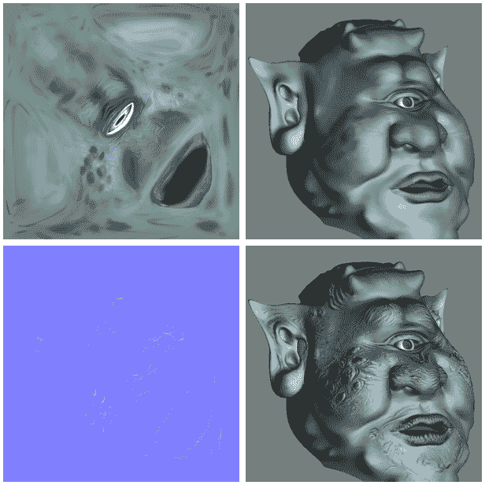

正常贴图可以通过多种方式生成。许多 3D 建模程序，如 Maya、Blender 或 3D Studio Max，都可以生成正常贴图。正常贴图也可以直接从灰度高度图纹理生成。NVIDIA 为 Adobe Photoshop 提供了一个插件，提供了这项功能（见[`developer.nvidia.com/object/photoshop_dds_plugins.html`](http://developer.nvidia.com/object/photoshop_dds_plugins.html)）。

正常贴图被解释为**切线空间**（也称为**对象局部坐标系**）中的向量。在切线坐标系中，原点位于表面点，表面法线与*z*轴（0, 0, 1）对齐。因此，*x*和*y*轴与表面相切。以下图像显示了表面两个不同位置上的切线框架的示例：

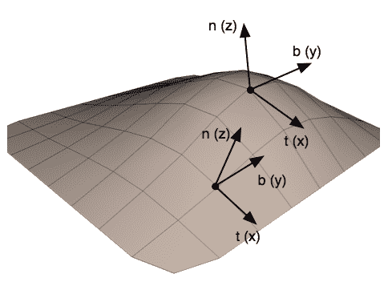

使用这种坐标系统的优点在于，存储在法线图中的法线向量可以被视为对真实法线的扰动，并且与对象坐标系无关。这避免了需要转换法线、添加扰动法线以及重新归一化的需求。相反，我们可以在反射模型中直接使用法线图中的值，而不需要进行任何修改。

为了使所有这些工作正常，我们需要在切线空间中评估反射模型。为此，我们在顶点着色器中将反射模型中使用的向量转换为切线空间，然后将它们传递到片段着色器中，在那里将评估反射模型。为了定义从相机（眼睛）坐标系到切线空间坐标系的变换，我们需要三个归一化、共正交的向量（在眼睛坐标系中定义），它们定义了切线空间系统。*z* 轴由法线向量 (*n*) 定义，*x* 轴由称为切线向量 (*t*) 的向量定义，而 *y* 轴通常称为法线向量 (*b*)。一个在相机坐标系中定义的点，*P*，可以以下述方式转换为切线空间：

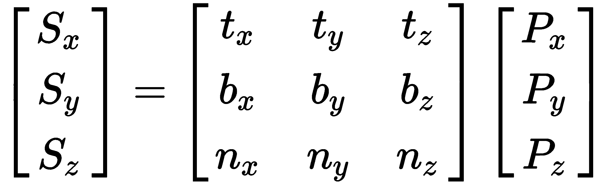

在前面的方程中，*S* 是切线空间中的点，而 *P* 是相机坐标中的点。为了在顶点着色器中应用这种变换，OpenGL 程序必须提供定义对象局部系统的至少三个向量，以及顶点位置。通常情况下，提供法线向量 (*n*) 和切线向量 (*t*)。如果提供了切线向量，可以通过切线向量和法线向量的叉积来计算法线向量。

切线向量有时会被包含在网格数据结构中的附加数据中。如果切线数据不可用，我们可以通过从表面纹理坐标的变化中推导出切线向量来近似切线向量（参见*任意网格的切线空间基向量计算*，Eric Lengyel，Terathon Software 3D 图形库，2001，在[`www.terathon.com/code/tangent.html`](http://www.terathon.com/code/tangent.html)）。

必须注意，切线向量在表面上应该是一致定义的。换句话说，切线向量的方向不应该从一个顶点到其相邻顶点有太大的变化。否则，可能会导致难看的着色伪影。

在以下示例中，我们将在顶点着色器中读取顶点位置、法线向量、切线向量和纹理坐标。我们将转换位置、法线和切线到相机空间，然后计算副法线向量（在相机空间中）。接下来，我们将计算观察方向（*v*）和指向光源的方向（*s*），然后将它们转换到切线空间。我们将传递切线空间*v*和*s*向量以及（未更改的）纹理坐标到片段着色器，在那里我们将使用切线空间向量和从法线贴图中检索到的法线向量评估 Blinn-Phong 反射模型。

# 准备工作

设置你的 OpenGL 程序以提供位置在属性位置`0`，法线在属性位置`1`，纹理坐标在位置`2`，以及切线向量在位置`3`。在此示例中，切线向量的第四个坐标应包含切线坐标系的**手性**（`-1`或`+1`）。此值将乘以叉积的结果。

将法线贴图加载到纹理单元一，并将颜色纹理加载到纹理单元零。

# 如何实现...

使用法线贴图渲染图像时，请使用以下着色器：

1.  在顶点着色器中，找到对象局部坐标系（切线空间）并将所有内容转换到该空间。将切线空间光方向和视方向传递给片段着色器：

```cpp
layout (location = 0) in vec3 VertexPosition; 
layout (location = 1) in vec3 VertexNormal; 
layout (location = 2) in vec2 VertexTexCoord; 
layout (location = 3) in vec4 VertexTangent; 

out vec3 LightDir; 
out vec2 TexCoord; 
out vec3 ViewDir; 

// Other uniform variables...

void main() { 
  // Transform normal and tangent to eye space 
  vec3 norm = normalize(NormalMatrix * VertexNormal); 
  vec3 tang = normalize(NormalMatrix * VertexTangent.xyz); 
  // Compute the binormal 
  vec3 binormal = normalize( cross( norm, tang ) ) * 
  VertexTangent.w; 
  // Matrix for transformation to tangent space 
  mat3 toObjectLocal = mat3( 
      tang.x, binormal.x, norm.x, 
      tang.y, binormal.y, norm.y, 
      tang.z, binormal.z, norm.z ) ; 
  // Get the position in eye coordinates 
  vec3 pos = vec3( ModelViewMatrix *  
                     vec4(VertexPosition,1.0) ); 

  // Transform light dir. and view dir. to tangent space 
  LightDir = toObjectLocal * (Light.Position.xyz - pos); 
  ViewDir = toObjectLocal * normalize(-pos); 

  // Pass along the texture coordinate 
  TexCoord = VertexTexCoord; 

  gl_Position = MVP * vec4(VertexPosition,1.0); 
} 
```

1.  在片段着色器中，更新`blinnPhong`函数以使用从纹理中获取的法线，并使用光和视方向输入变量：

```cpp
in vec3 LightDir; 
in vec2 TexCoord; 
in vec3 ViewDir; 

layout(binding=0) uniform sampler2D ColorTex; 
layout(binding=1) uniform sampler2D NormalMapTex; 

// Other uniform variables...

layout( location = 0 ) out vec4 FragColor; 

vec3 blinnPhong( vec3 n ) {
  // Similar to previous examples, except 
  // using normalize(LightDir) and normalize(ViewDir)...
}

void main() { 
    // Lookup the normal from the normal map
    vec3 norm = texture(NormalMapTex, TexCoord).xyz;
    norm = 2.0 * norm - 1.0;
    FragColor = vec4( blinnPhong(norm), 1.0 );
}
```

# 它是如何工作的...

顶点着色器首先通过乘以法线矩阵（并重新归一化）将顶点法线和切线向量转换为眼坐标。然后计算法线和切线向量的叉积作为副法线向量。结果乘以顶点切线向量的`w`坐标，这决定了切线空间坐标系统的手性。其值将是`-1`或`+1`。

接下来，我们创建一个转换矩阵，用于将眼坐标转换为切线空间，并将矩阵存储在`toObjectLocal`中。位置被转换为眼空间并存储在`pos`中，我们通过从光位置减去`pos`来计算光方向。结果乘以`toObjectLocal`以将其转换为切线空间，并将最终结果存储在输出变量`LightDir`中。此值是切线空间中光源的方向，并将由反射模型中的片段着色器使用。

类似地，计算视方向并将其转换为切线空间，通过归一化`pos`并乘以`toObjectLocal`。结果存储在输出变量`ViewDir`中。

纹理坐标通过仅将其分配给输出变量`TexCoord`而未更改地传递给片段着色器。

在片段着色器中，光方向和视图方向的切线空间值通过变量`LightDir`和`ViewDir`接收。`blinnPhong`函数与之前配方中使用的方法略有不同。唯一的参数是法线向量。该函数计算 Blinn-Phong 反射模型，从纹理`ColorTex`中获取漫反射率值，并使用`LightDir`和`ViewDir`作为光和视图方向，而不是计算它们。

在主函数中，从正常贴图纹理中检索法线向量并将其存储在变量`normal`中。由于纹理存储的值范围从零到一，而法线向量的分量范围从-1 到+1，我们需要将值重新缩放到该范围。我们通过乘以`2.0`然后减去`1.0`来实现这一点。

对于某些正常贴图，**z**坐标永远不会是负数，因为在切线空间中，这会对应于指向表面的法线。在这种情况下，我们可以假设**z**的范围从 0 到 1，并使用该范围的完整通道分辨率。然而，对于**z**坐标没有标准约定。

最后，调用`blinnPhong`函数，并传递`normal`参数。`blinnPhong`函数使用`LightDir`、`ViewDir`和`n`评估反射模型，所有这些都在切线空间中定义。结果通过将其分配给`FragColor`应用于输出片段。

# 参见

+   示例代码中的`chapter05/scenenormalmap.cpp`文件

+   **应用多个纹理**配方

# 视差贴图

正常贴图是一种在不增加额外几何形状的情况下引入表面细节的绝佳方法。然而，它们也有一些局限性。例如，当观察者的位置改变时，正常贴图不会提供视差效果，并且不支持自遮挡。**视差贴图**是一种技术，最初于 2001 年提出，它通过基于高度图修改纹理坐标来模拟视差和自遮挡效果。它需要**正常贴图**和**高度图**。高度图（也称为**凹凸贴图**）是一种灰度图像，其中每个纹理单元有一个代表该纹理单元表面高度的单一标量值。我们可以将 0 到 1 之间的任何高度视为**真实表面**，然后使用高度图中的值作为从该点开始的偏移量。在这个配方中，我们将`1.0`作为真实表面，因此高度图值为`0.0`表示距离真实表面**下方**`1.0`的距离（见以下图像）。

为了模拟视差，我们希望偏移纹理坐标的量取决于指向观察者（摄像机）的方向。在更陡的角度处，视差效果更强，因此我们希望在法线和视向量（指向摄像机的向量）之间的角度较大时，偏移量更强。此外，我们希望将纹理坐标偏移到与视向量相同的方向。与法线贴图配方类似，我们将使用切线空间。

如我们之前讨论的，在切线空间中，法向量与 *z* 轴相同。如果 *e* 是切线空间中指向摄像机的向量，我们将使用指向相反方向的向量（*v = -e*）。首先，让我们考虑标准法线贴图的情况。观察者感知到点 **P** 处的颜色和法线，但他们应该看到点 **Q** 处的颜色和法线：

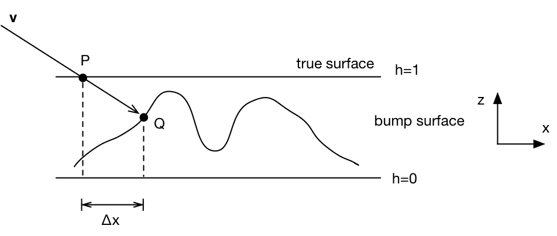

因此，我们希望偏移纹理坐标的量与前面图中 **Δx** 成正比，以便观察者看到点 **Q** 的阴影，而不是点 **P** 的阴影。您也可以为 y-z 截面绘制类似的图，结果几乎相同。

因此，我们需要以某种方式近似 **Δx**。考虑右三角形，如图所示：

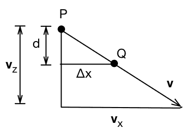

**d** 的值是点 **Q**（在真实表面下方）的深度，换句话说：*d = 1 - h[q]*，其中 *h[q]* 是点 *Q* 处的凹凸贴图的高度。根据相似三角形的规则，我们可以写出以下公式：

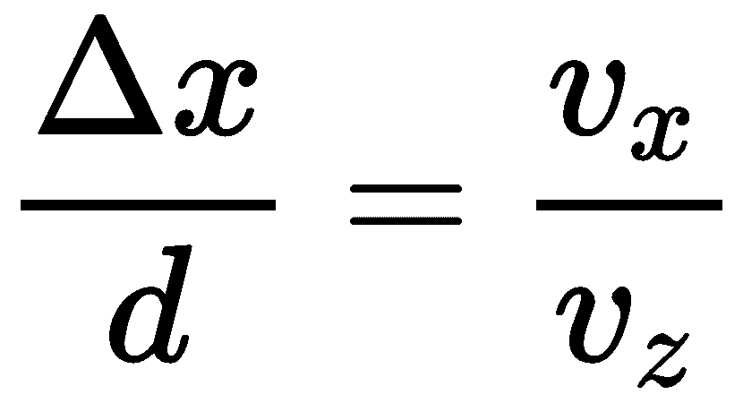

对 *y* 应用相同的分析，我们得到以下一对偏移量：

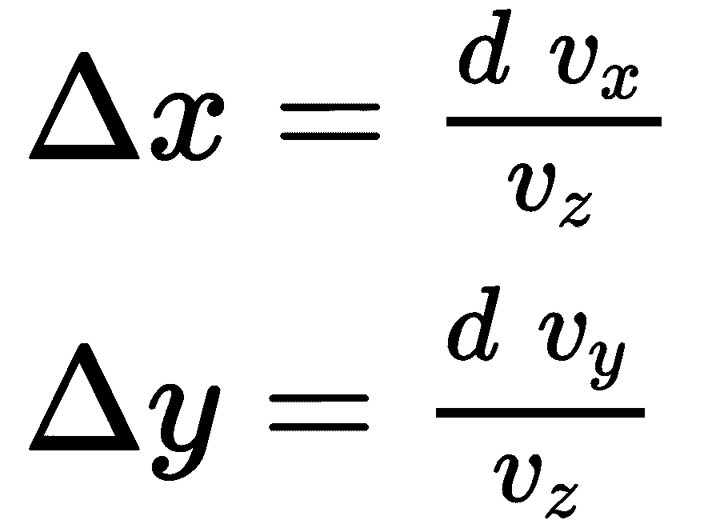

不幸的是，我们前面方程中没有 *d* 的值，因为我们不知道 *Q* 的值。也没有快速找到它的方法；我们需要通过高度图（我们将在下一个菜谱中这样做）追踪一条射线。因此，现在我们只是通过使用 *P* 处的高度（深度）（1 - h[p]）来近似 *d*。这是一个粗略的估计，但如果假设高度图没有很多真正的高频变化，在实践中它工作得相当好。

因此，对于给定表面点偏移纹理坐标（*P*），我们有以下方程：

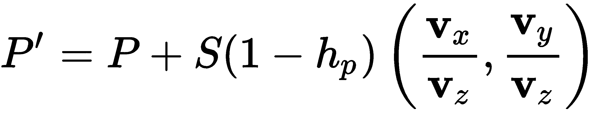

在前面的方程中，*S* 是一个缩放因子，可以用来限制效果的幅度并将其缩放到纹理空间。它通常是一个非常小的值（介于 0 和 0.05 之间），可能需要针对特定表面进行调整。

以下图像显示了与基本法线贴图相比的效果。在左侧，使用简单法线贴图渲染的单个四边形，在右侧是使用法线贴图和视差贴图的相同几何形状：

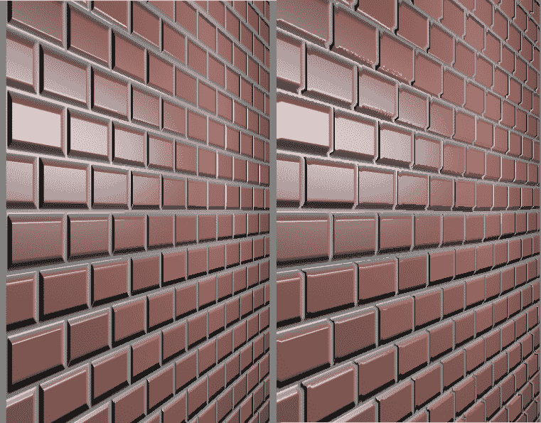

这个效果确实相当微妙，这个例子中也有一些不希望出现的伪影，但整体效果是清晰的。注意，这两张图片使用了相同的几何形状、相机位置和纹理图。如果你专注于远处的砖块（离观察者最远），你可以看到一些遮挡的模拟，并且整体效果在右边更真实。

# 准备工作

对于视差映射，我们需要三个纹理：一个高度图纹理、一个法线图纹理和一个颜色纹理。我们可以将高度图和法线图合并到一个纹理中，将高度值存储在 alpha 通道中，将法线存储在 R、G 和 B 中。这是一个常见的技巧，可以显著节省磁盘和内存空间。在这个配方中，我们将它们视为单独的纹理。

我们还需要一个具有切线向量的网格，这样我们就可以转换到切线空间。有关切线空间更多信息，请参阅之前的配方。

# 如何做到...

我们可以使用与之前配方中相同的顶点着色器，即*使用法线图*。顶点着色器变换视图方向和光方向，并将它们传递给片段着色器。它还传递纹理坐标。

片段着色器使用切线空间视图方向和当前纹理坐标处的高度图值来偏移纹理坐标。然后它使用新的纹理坐标值像往常一样进行着色：

```cpp
in vec3 LightDir;  // Tangent space
in vec2 TexCoord;
in vec3 ViewDir;  // Tangent space

layout(binding=0) uniform sampler2D ColorTex;
layout(binding=1) uniform sampler2D NormalMapTex;
layout(binding=2) uniform sampler2D HeightMapTex;

// Light and material uniforms 

layout( location = 0 ) out vec4 FragColor;

vec3 blinnPhong( ) {
  vec3 v = normalize(ViewDir);
  vec3 s = normalize(LightDir);

  const float bumpFactor = 0.015; 
  float height = 1 - texture(HeightMapTex, TexCoord).r;
  vec2 delta = v.xy * height * bumpFactor / v.z;
  vec2 tc = TexCoord.xy - delta;

  vec3 n = texture(NormalMapTex, tc).xyz;
  n.xy = 2.0 * n.xy - 1.0;
  n = normalize(n);

  float sDotN = max( dot(s,n), 0.0 );

  vec3 texColor = texture(ColorTex, tc).rgb;
  vec3 ambient = Light.La * texColor;
  vec3 diffuse = texColor * sDotN;
  vec3 spec = vec3(0.0);
  if( sDotN > 0.0 ) { 
    vec3 h = normalize( v + s );
    spec = Material.Ks *
            pow( max( dot(h,n), 0.0 ), Material.Shininess );
  }
  return ambient + Light.L * (diffuse + spec);
}

```

# 它是如何工作的...

在片段着色器中的`blinnPhong`方法中，我们首先计算纹理坐标的偏移量（`delta`变量）。`bumpFactor`常量通常在 0 和 0.05 之间。在这种情况下，我们使用`0.015`，但你需要根据你特定的法线/高度图调整这个值。我们通过 delta 的值偏移纹理坐标。我们在这里减去而不是加上，因为`ViewDir`实际上是指向观察者的，所以我们需要朝相反的方向偏移。注意，我们还在前面分析中讨论了反转高度值。使用偏移的纹理坐标（`tc`），我们使用 Blinn-Phong 模型和法线图以及颜色纹理的数据来计算着色。

# 更多...

视差映射产生微妙但令人愉悦的效果。然而，它确实存在一些不希望出现的伪影，例如所谓的**纹理游动**，并且在与具有陡峭的凹凸或高频凹凸的凹凸图一起使用时表现不佳。一种性能更好的视差映射改进称为倾斜视差映射，将在下一个配方中讨论。

# 参见

+   示例代码中的`chapter05/sceneparallax.cpp`文件

# 倾斜视差映射与自阴影

这个配方基于之前的配方，即视差映射，所以如果你还没有这样做，你可能想在阅读这个配方之前回顾一下那个配方。

**陡峭的视差映射**是一种技术，首次由 Morgan McGuire 和 Max McGuire 在 2005 年发表。它改进了视差映射，以更高的片段着色器工作量为代价，产生了更好的结果。尽管有额外的成本，但该算法仍然非常适合现代 GPU 的实时渲染。

这种技术涉及通过高度图进行离散步骤追踪视线光线，直到找到碰撞，以便更精确地确定纹理坐标的适当偏移。让我们回顾一下之前食谱中的图表，但这次，我们将高度图分解为 **n** 个离散级别（由虚线表示）：

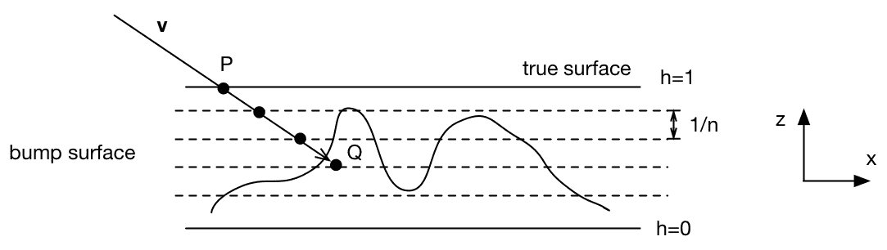

和之前一样，我们的目标是偏移纹理坐标，以便根据凹凸表面而不是真实表面进行着色。点 **P** 是正在渲染的多边形上的表面点。我们从点 **P** 开始，依次追踪视图向量到每个级别，直到找到一个位于或低于凹凸表面的点。在以下图像中，我们将经过三次迭代找到点 **Q**。

和之前的食谱一样，我们可以使用相似三角形推导出单次迭代的 **x** 和 **y** 的变化（参见 *视差映射* 食谱）。

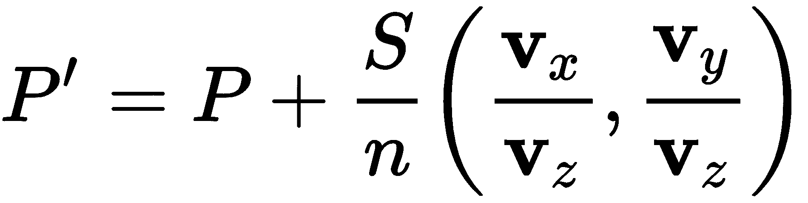

和之前一样，使用相似三角形（参见 *视差映射* 食谱）我们可以推导出单次迭代的 **x** 和 **y** 的变化。

使用这个方程，我们可以逐步通过高度级别，从 *P* 点开始，沿着视图向量远离相机。我们继续直到找到一个位于或低于高度图表面的点。然后我们使用该点的纹理坐标进行着色。本质上，我们正在片段着色器中实现一个非常简单的光线追踪器。

结果令人印象深刻。以下图像显示了同一表面的三个版本，以进行比较。左侧是应用了法线图的表面。中间图像是使用视差映射渲染的同一表面。右手边的图像是使用陡峭的视差映射生成的。所有三幅图像都使用了相同的法线图、高度图、几何形状和相机位置。它们都被渲染为一个四边形（两个三角形）。注意陡峭的视差如何显示每个砖块的变高。每个砖块的高度始终包含在高度图中，但视差映射技术并没有使其明显：

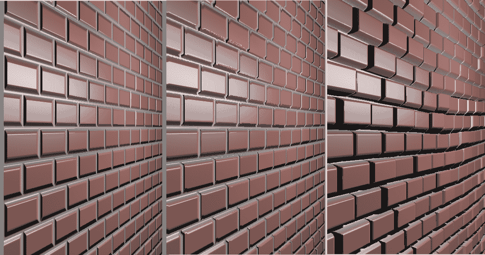

你可能已经注意到右边的图像也包括了阴影。一些砖块投射阴影到其他砖块上。这是通过在先前的技术基础上简单添加实现的。一旦我们找到点 **Q**，我们就向光源方向发射另一条光线。如果那条光线与表面碰撞，那么该点处于阴影中，我们只使用环境光照进行着色。否则，我们正常着色该点。以下图表说明了这个想法：

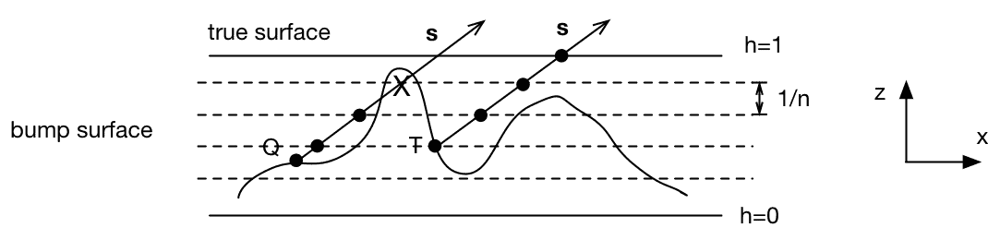

在前面的图中，点 **Q** 处于阴影中，而点 **T** 则不是。在每种情况下，我们沿着指向光源的方向（**s**）追踪光线。我们在每个离散高度级别上评估高度图。在点 **Q** 的情况下，我们找到一个位于凹凸表面的点下方，但对于点 **T**，所有点都位于其上方。

光线追踪过程几乎与之前描述的用于视图向量的过程相同。我们从点 **Q** 开始，沿着光线向光源移动。如果我们找到一个位于表面的点，那么该点被光源遮挡。否则，该点将正常着色。我们可以使用用于追踪视图向量的相同方程，将视图向量替换为指向光源的向量。

# 准备工作

对于此算法，我们需要一个高度图、一个法线图和一个颜色图。我们还需要在网格中具有切线向量，以便我们可以转换到切线空间。

# 如何实现...

顶点着色器与 *Parallax mapping* 菜单中使用的相同。

在片段着色器中，我们将过程分为两个函数：`findOffset` 和 `isOccluded`。第一个函数追踪视图向量以确定纹理坐标偏移。第二个函数追踪光线向量以确定该点是否处于阴影中：

```cpp
in vec3 LightDir;  // Tangent space
in vec2 TexCoord;
in vec3 ViewDir;   // Tangent space

layout(binding=0) uniform sampler2D ColorTex;
layout(binding=1) uniform sampler2D NormalMapTex;
layout(binding=2) uniform sampler2D HeightMapTex;

// Material and light uniforms...

layout( location = 0 ) out vec4 FragColor;

const float bumpScale = 0.03;

vec2 findOffset(vec3 v, out float height) {
  const int nSteps = int(mix(60, 10, abs(v.z)));
  float htStep = 1.0 / nSteps;
  vec2 deltaT = (v.xy * bumpScale) / (nSteps * v.z);
  float ht = 1.0;
  vec2 tc = TexCoord.xy;
  height = texture(HeightMapTex, tc).r;
  while( height < ht ) {
    ht -= htStep;
    tc -= deltaT;
    height = texture(HeightMapTex, tc).r;
  }
  return tc;
}

bool isOccluded(float height, vec2 tc, vec3 s) {
  // Shadow ray cast
  const int nShadowSteps = int(mix(60,10,s.z));
  float htStep = 1.0 / nShadowSteps;
  vec2 deltaT = (s.xy * bumpScale) / ( nShadowSteps * s.z );
  float ht = height + htStep * 0.5;
  while( height < ht && ht < 1.0 ) {
    ht += htStep;
    tc += deltaT;
    height = texture(HeightMapTex, tc).r;
  }

  return ht < 1.0;
}

vec3 blinnPhong( ) { 
  vec3 v = normalize(ViewDir);
  vec3 s = normalize( LightDir );

  float height = 1.0;
  vec2 tc = findOffset(v, height);

  vec3 texColor = texture(ColorTex, tc).rgb;
  vec3 n = texture(NormalMapTex, tc).xyz;
  n.xy = 2.0 * n.xy - 1.0;
  n = normalize(n);

  float sDotN = max( dot(s,n), 0.0 );
  vec3 diffuse = vec3(0.0), 
      ambient = Light.La * texColor,
      spec = vec3(0.0);

  if( sDotN > 0.0 && !isOccluded(height, tc, s) ) {
    diffuse = texColor * sDotN;
    vec3 h = normalize( v + s );
    spec = Material.Ks *
            pow( max( dot(h,n), 0.0 ), Material.Shininess );
  }

  return ambient + Light.L * (diffuse + spec);
}
```

# 工作原理...

`findOffset` 函数用于确定在着色时使用的纹理坐标。我们传入指向观察者的向量 *toward*（我们取反方向以远离眼睛），函数返回纹理坐标。它还通过输出参数 `height` 返回该位置的高度值。第一行确定离散高度级别数 (`nSteps`)。我们通过插值使用视图向量的 *z* 坐标值来选择一个介于 10 和 60 之间的数字。如果 *z* 坐标值较小，那么视图向量相对于高度级别几乎是垂直的。当视图向量接近垂直时，我们可以使用较少的步数，因为光线在级别之间的相对水平距离较短。然而，当向量接近水平时，我们需要更多的步数，因为光线在从一个级别移动到下一个级别时需要穿越更大的水平距离。`deltaT` 变量是我们从一个高度级别移动到下一个高度级别时在纹理空间中移动的量。这是之前列出的方程中的第二个项。

光线追踪过程通过以下循环进行。`ht` 变量跟踪高度级别。我们将其初始化为 `1.0`。`height` 变量将是当前位置的高度图值。`tc` 变量将跟踪我们在纹理空间中的移动，最初位于片段的纹理坐标 (`TexCoord`)。我们在 `tc` 处查找高度图中的值，然后进入循环。

循环会一直持续到高度图中的值（`height`）小于离散高度级别（`ht`）的值。在循环内部，我们改变`ht`以向下移动一个级别，并通过`deltaT`更新纹理坐标。请注意，我们减去`deltaT`是因为我们正在远离观察者。然后，我们在新的纹理坐标处查找高度图（`height`）的值并重复。

当循环结束时，`tc`应该有偏移纹理坐标的值，而`height`是高度图中该位置的值。我们返回`tc`，循环结束时`height`的值也通过输出参数返回给调用者。

注意，当我们查看面的背面时，这个循环是不正确的。然而，循环最终会在某个点上终止，因为我们总是减少`ht`，并且假设高度图纹理在 0 和 1 之间。如果背面可见，我们需要修改这一点以正确地跟随射线或反转法线。

`isOccluded`函数返回光源是否在该点被高度图遮挡。它与`findOffset`函数非常相似。我们传递由`findOffset`先前确定的`height`，相应的纹理坐标（`tc`）以及指向光源的方向（`s`）。类似于`findOffset`，我们在提供的高度和纹理坐标处沿着`s`的方向行进射线。请注意，我们开始循环时`ht`的值稍微偏离了那里的凹凸图值（`ht= height + htStep * 0.1`）。这是为了避免所谓的**阴影痤疮**效应。如果我们不偏移它，有时当射线与它开始的表面碰撞时，我们可能会得到*假阳性*，产生斑驳的阴影。

函数的其余部分包含一个与`findOffset`中的循环非常相似的循环。然而，我们向上通过高度级别，并且我们小心地停止当`ht`的值达到或超过 1.0 时。循环结束时，我们不需要`height`或`tc`的值；我们只需要知道循环是否由于第一个条件而停止。如果`ht < 1.0`，那么我们在超过高度图范围之前退出循环，这表明我们在射线上找到了一个高度更大的点。因此，该点必须在阴影中，所以我们返回 true。否则，光源没有被遮挡，所以我们返回 false。

`blinnPhong`函数调用`findOffset`来确定适当的纹理坐标。然后，它在那个位置的法线贴图和颜色贴图中查找值。接下来，它使用这些值评估 Blinn-Phong 反射模型。然而，它使用`isOccluded`函数来确定是否应该包含漫反射和镜面反射成分。如果`sDotN`的值小于或等于零，我们也不会评估这些成分，这意味着光线在（或与）面成切线，这是由着色法线确定的。

# 参见

+   示例代码中的`chapter05/sceneparallax.cpp`文件

# 使用立方体贴图模拟反射

纹理可以用来模拟具有纯反射成分的表面（如铬一样的镜面）。为了做到这一点，我们需要一个代表反射物体周围环境的纹理。然后，这个纹理可以以代表其反射外观的方式映射到物体的表面上。这种通用技术被称为**环境映射**。

通常，环境映射涉及创建一个代表环境的纹理，并将其映射到物体的表面上。它通常用于模拟反射或折射的效果。

**立方体贴图**是环境映射中使用的纹理的更常见类型之一。立方体贴图是一组六个单独的图像，代表环境投影到立方体的六个面上。这六个图像代表从位于立方体中心的观察者视角看环境。以下图像显示了立方体贴图的一个示例。图像被排列成好像立方体被*展开*并平铺开来。中间的四张图像将组成立方体的侧面，顶部和底部的图像对应于立方体的顶部和底部：

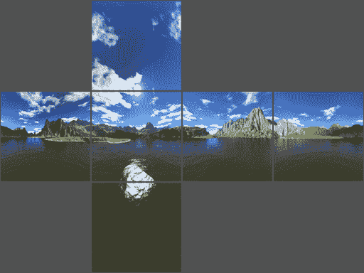

OpenGL 提供了对立方体贴图纹理的内置支持（使用`GL_TEXTURE_CUBE_MAP`目标）。纹理通过三维纹理坐标（s, t, r）访问。纹理坐标被解释为从立方体中心出发的方向向量。由该向量与立方体中心定义的线被延伸以与立方体的一个面相交。然后，在交点位置访问对应于该面的图像。

实际上，用于访问立方体贴图的三维纹理坐标和用于访问单个面图像的两个维纹理坐标之间的转换有些复杂。它可能不太直观，令人困惑。OpenGL 规范文档中可以找到一个非常易于理解的解释（[`www.khronos.org/registry/OpenGL/index_gl.php`](https://www.khronos.org/registry/OpenGL/index_gl.php)）。然而，好消息是，如果你小心地在立方体贴图中定位纹理，可以忽略转换的细节，并将纹理坐标可视化为前面描述的三维向量。

在这个例子中，我们将演示使用立方体贴图来模拟反射表面。我们还将使用立方体贴图来绘制反射对象周围的环境（有时称为**天空盒**）。

# 准备工作

首先，准备六个立方体贴图图像。在这个例子中，图像将遵循以下命名约定。有一个基本名称（存储在`baseFileName`变量中），后面跟着一个下划线，然后是六个可能的后缀之一（`posx`、`negx`、`posy`、`negy`、`posz`或`negz`），最后是文件扩展名。后缀`posx`、`posy`等表示通过面中心的轴（正*x*、正*y*等）。

确保它们都是正方形图像（最好是边长为二的幂的尺寸），并且它们都是相同的大小。

设置你的 OpenGL 程序，以便在属性位置 0 提供顶点位置，在属性位置 1 提供顶点法线。

此顶点着色器需要将模型矩阵（将对象坐标转换为世界坐标的矩阵）与视图矩阵分开，并作为单独的统一变量提供给着色器。你的 OpenGL 程序应在统一变量`ModelMatrix`中提供模型矩阵。

顶点着色器还需要世界坐标中摄像机的位置。确保你的 OpenGL 程序将统一变量`WorldCameraPosition`设置为适当的值。

# 如何做到...

要根据立方体贴图渲染具有反射效果的图像，并渲染立方体贴图本身，执行以下步骤：

1.  我们首先定义一个函数，该函数将六个立方体贴图图像加载到单个纹理目标中：

```cpp
GLuint Texture::loadCubeMap(const std::string &baseName, 
const std::string &extension) {
    GLuint texID;
    glGenTextures(1, &texID);
    glBindTexture(GL_TEXTURE_CUBE_MAP, texID);

    const char * suffixes[] = { "posx", "negx", "posy", 
    "negy", "posz", "negz" };
    GLint w, h;

    // Load the first one to get width/height
    std::string texName = baseName + "_" + suffixes[0] + extension;
    GLubyte * data = Texture::loadPixels(texName, w, h, false);

    // Allocate immutable storage for the whole cube map texture
    glTexStorage2D(GL_TEXTURE_CUBE_MAP, 1, GL_RGBA8, w, h);
    glTexSubImage2D(GL_TEXTURE_CUBE_MAP_POSITIVE_X, 
        0, 0, 0, w, h, GL_RGBA, GL_UNSIGNED_BYTE, data);
    stbi_image_free(data);

    // Load the other 5 cube-map faces
    for( int i = 1; i < 6; i++ ) {
        std::string texName = baseName + "_" + suffixes[i] + 
        extension;
        data = Texture::loadPixels(texName, w, h, false);
        glTexSubImage2D(GL_TEXTURE_CUBE_MAP_POSITIVE_X + i, 
            0, 0, 0, w, h, GL_RGBA, GL_UNSIGNED_BYTE, data);
        stbi_image_free(data);
    }

    glTexParameteri(GL_TEXTURE_CUBE_MAP, GL_TEXTURE_MAG_FILTER, 
    GL_LINEAR);
    glTexParameteri(GL_TEXTURE_CUBE_MAP, GL_TEXTURE_MIN_FILTER, 
    GL_NEAREST);
    glTexParameteri(GL_TEXTURE_CUBE_MAP, GL_TEXTURE_WRAP_S, 
    GL_CLAMP_TO_EDGE);
    glTexParameteri(GL_TEXTURE_CUBE_MAP, GL_TEXTURE_WRAP_T, 
    GL_CLAMP_TO_EDGE);
    glTexParameteri(GL_TEXTURE_CUBE_MAP, GL_TEXTURE_WRAP_R, 
    GL_CLAMP_TO_EDGE);

    return texID;
}
```

1.  使用以下代码进行顶点着色器：

```cpp

layout (location = 0) in vec3 VertexPosition; 
layout (location = 1) in vec3 VertexNormal; 
layout (location = 2) in vec2 VertexTexCoord; 

out vec3 ReflectDir;      // The direction of the reflected ray 

uniform vec3 WorldCameraPosition; 
uniform mat4 ModelViewMatrix; 
uniform mat4 ModelMatrix; 
uniform mat3 NormalMatrix; 
uniform mat4 ProjectionMatrix; 
uniform mat4 MVP; 

void main() {
  // Compute the reflected direction in world coords. 
  vec3 worldPos = vec3(ModelMatrix *  
                             vec4(VertexPosition,1.0) ); 
  vec3 worldNorm = vec3(ModelMatrix *  
                              vec4(VertexNormal, 0.0)); 
  vec3 worldView = normalize( WorldCameraPosition - worldPos );
  ReflectDir = reflect(-worldView, worldNorm ); 

  gl_Position = MVP * vec4(VertexPosition,1.0); 
} 
```

1.  使用以下代码进行片段着色器：

```cpp
in vec3 ReflectDir;   // The direction of the reflected ray 

// The cube map 
layout(binding=0) uniform samplerCube CubeMapTex; 

uniform float ReflectFactor; // Amount of reflection 
uniform vec4 MaterialColor;  // Color of the object's "Tint"  

layout( location = 0 ) out vec4 FragColor; 

void main() { 
  // Access the cube map texture 
  vec4 cubeMapColor = texture(CubeMapTex, ReflectDir); 
  FragColor = mix(MaterialColor, CubeMapColor, ReflectFactor);
} 
```

1.  在 OpenGL 程序的渲染部分，绘制一个以原点为中心的立方体，并将立方体贴图应用于立方体。你可以使用归一化位置作为纹理坐标。为此天空盒使用单独的着色器。请参阅示例代码以获取详细信息。

1.  切换到前面的着色器，并在场景中绘制对象（们）。

# 它是如何工作的...

在 OpenGL 中，立方体贴图纹理由六个单独的图像组成。为了完全初始化立方体贴图纹理，我们需要绑定到立方体贴图纹理，然后将每个图像单独加载到该纹理中的六个“槽位”中。在前面的代码（在`Texture::loadCubeMap`函数中），我们首先使用`glActiveTexture`绑定到纹理单元零。然后，通过调用`glGenTextures`创建一个新的纹理对象，将其句柄存储在变量`texID`中，并使用`glBindTexture`将该纹理对象绑定到`GL_TEXTURE_CUBE_MAP`目标。我们首先加载第一个图像以确定图像的尺寸，然后在一个循环中加载其他图像。下面的循环加载每个纹理文件，并使用`glTexSubImage2D`将纹理数据复制到 OpenGL 内存中。请注意，该函数的第一个参数是纹理目标，对应于`GL_TEXTURE_CUBE_MAP_POSITIVE_X + i`。OpenGL 定义了一系列连续的常量，对应于立方体的六个面，因此我们可以只需将一个整数加到第一个面的常量值上。循环完成后，立方体贴图纹理应该已经完全初始化，包含六个图像。

在此之后，我们设置立方体贴图纹理环境。我们使用线性过滤，并将纹理包裹模式设置为所有三个纹理坐标分量的`GL_CLAMP_TO_EDGE`。这通常效果很好，避免了在立方体边缘之间出现边界颜色的可能性。

更好的选择是使用无缝立方体贴图纹理（自 OpenGL 3.2 以来可用）。启用它们很简单，只需调用：`glEnable(GL_TEXTURE_CUBE_MAP_SEAMLESS)`。

在顶点着色器中，主要目标是计算反射方向，并将其传递到片段着色器中用于访问立方体贴图。输出变量`ReflectDir`将存储此结果。我们可以通过在法线向量周围反射指向观察者的向量来计算反射方向（在世界坐标中）。

我们选择在世界坐标中计算反射方向，因为如果我们使用眼睛坐标，那么当相机在场景内移动时，反射不会改变。

在主函数的`else`分支中，我们首先将位置转换为世界坐标，并将它们存储在`worldPos`中。然后，我们对法线做同样的处理，将结果存储在`worldNorm`中。请注意，`ModelMatrix`用于转换顶点法线。在进行这一操作时，为了防止模型矩阵的平移分量影响法线，法线的第四个坐标必须使用`0.0`的值。此外，模型矩阵不得包含任何非均匀缩放分量；否则，法线向量将被错误地转换。

观察者的方向在世界坐标中计算并存储在`worldView`中。

最后，我们将`worldView`关于法线进行反射，并将结果存储在输出变量`ReflectDir`中。片段着色器将使用这个方向来访问立方体贴图纹理，并将相应的颜色应用到片段上。可以将其想象为从观察者的眼睛开始，击中表面，从表面反射，并击中立方体贴图的光线。光线击中立方体贴图时看到的颜色就是我们需要的物体颜色。

在绘制天空盒时，我们使用顶点位置作为反射方向。为什么？好吧，当渲染天空盒时，我们希望天空盒上的位置与立方体贴图中的等效位置相对应（天空盒实际上只是立方体贴图的一种渲染）。因此，如果我们想访问与原点为中心的立方体上的位置相对应的立方体贴图上的位置，我们需要一个指向该位置的向量。我们需要的是该点的位置减去原点（即(0,0,0)）。因此，我们只需要顶点的位置。

天空盒可以以观察者位于天空盒中心，天空盒随着观察者移动的方式进行渲染（因此观察者始终位于天空盒中心）。在这个例子中我们没有这样做；然而，我们可以通过使用视图矩阵的旋转分量（而不是平移分量）来变换天空盒来实现这一点。

在片段着色器中，我们直接使用`ReflectDir`的值来访问立方体贴图纹理：

```cpp
vec4 cubeMapColor = texture(CubeMapTex, ReflectDir) 
```

我们将天空盒颜色与一些材质颜色混合。这允许我们对物体提供一些轻微的*色调*。色调的量由变量`ReflectFactor`调整。1.0 的值对应于零色调（全部反射），而 0.0 的值对应于无反射。以下图像显示了使用不同`ReflectFactor`值渲染的茶壶。左边的茶壶使用反射系数为 0.5，而右边的茶壶使用值为 0.85。基本材质颜色为灰色（使用的立方体贴图是罗马圣彼得大教堂的图像。©Paul Debevec）：

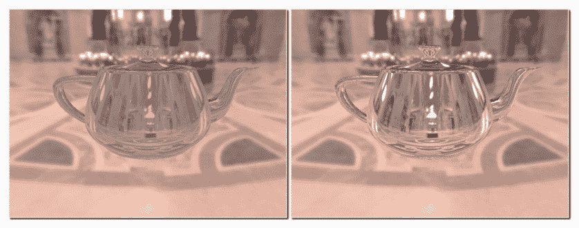

# 还有更多...

关于这种技术有两个重要点需要注意。首先，物体只会反射环境贴图。它们不会反射场景中任何其他物体的图像。为了做到这一点，我们需要从每个物体的视角生成环境贴图，通过在物体中心以六个坐标方向中的每个方向渲染场景六次来实现。然后，我们可以为适当的物体的反射使用适当的环境贴图。当然，如果任何物体相对于彼此移动，我们需要重新生成环境贴图。所有这些努力可能在一个交互式应用程序中是过于限制性的。

第二点涉及移动物体上出现的反射。在这些着色器中，我们计算反射方向并将其视为从环境贴图中心发出的向量。这意味着无论物体位于何处，反射都会看起来像物体位于环境的中心。换句话说，环境被处理成仿佛它距离无限远。*GPU Gems*一书的第十九章，由 Randima Fernando 所著，Addison-Wesley Professional，2009 年出版，对此问题有很好的讨论，并提供了一些可能的解决方案来定位反射。

# 参见

+   示例代码中的`chapter05/scenereflectcube.cpp`文件

+   *应用 2D 纹理*配方

+   由 Randima Fernando 所著，Addison-Wesley Professional，2009 年出版的《GPU Gems》一书的第十九章

# 使用立方体贴图模拟折射

透明物体会导致光线在物体与其周围环境之间的界面处略微弯曲。这种现象称为**折射**。在渲染透明物体时，我们通过使用环境贴图并将环境映射到物体上来模拟这种效果。换句话说，我们可以追踪从观察者到物体（过程中弯曲）再到环境的射线。然后，我们可以使用这个射线交点作为物体的颜色。

与前一个配方一样，我们将使用立方体贴图来模拟环境。我们将从观察者的位置追踪光线，穿过物体，并最终与立方体贴图相交。

折射过程由**斯涅尔定律**描述，它定义了入射角和折射角之间的关系：

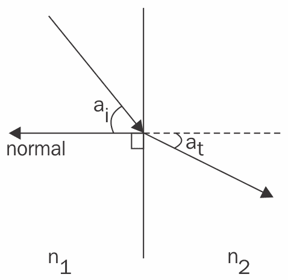

斯涅尔定律描述了入射角（**a[i]**）为入射光线与表面法线之间的角度，折射角（**a[t]**）为透射光线与延长法线之间的角度。入射光线通过的介质和包含透射光线的介质分别由折射率（图中**n[1]**和**n[2]**）描述。两个折射率之间的比率定义了光线在界面处弯曲的程度。

从斯涅尔定律出发，经过一些数学努力，我们可以推导出一个透射向量的公式，给定折射率的比率、法线向量和入射向量：

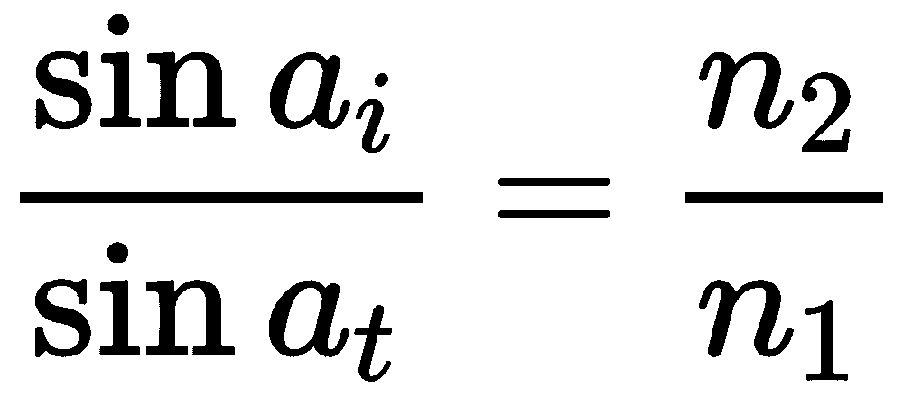

然而，实际上并没有必要这样做，因为 GLSL 提供了一个内置函数来计算这个透射向量，称为`refract`。我们将在本例中使用这个函数。

对于透明物体，通常不是所有光线都通过表面透射。一些光线会被反射。在这个例子中，我们将以非常简单的方式模拟这一点，并在本配方末尾讨论更精确的表示。

# 准备工作

设置你的 OpenGL 程序以在属性位置 0 提供顶点位置，在属性位置 1 提供顶点法线。与前面的配方一样，我们需要在统一变量 `ModelMatrix` 中提供模型矩阵。

使用前面配方中所示的技术加载立方体贴图。将其放置在纹理单元零。

将统一变量 `WorldCameraPosition` 设置为观察者在世界坐标中的位置。将统一变量 `Material.Eta` 的值设置为环境折射率 *n[1]* 与材料折射率 *n[2]* 之间的比率 (*n[1]/n[2]*)。将统一变量 `Material.ReflectionFactor` 的值设置为在界面处反射的光线比例（可能是一个小值）。

与前面的示例一样，如果你想要绘制环境，绘制一个围绕场景的大立方体，并使用一个单独的着色器将纹理应用到立方体上。请参阅示例代码以获取详细信息。

# 如何操作...

要渲染具有反射和折射的对象，执行以下步骤：

1.  在顶点着色器中使用以下代码：

```cpp

layout (location = 0) in vec3 VertexPosition; 
layout (location = 1) in vec3 VertexNormal; 

out vec3 ReflectDir;  // Reflected direction 
out vec3 RefractDir;  // Transmitted direction 

struct MaterialInfo { 
   float Eta;       // Ratio of indices of refraction 
   float ReflectionFactor; // Percentage of reflected light 
}; 
uniform MaterialInfo Material; 

uniform vec3 WorldCameraPosition; 
uniform mat4 ModelViewMatrix; 
uniform mat4 ModelMatrix; 
uniform mat3 NormalMatrix; 
uniform mat4 ProjectionMatrix; 
uniform mat4 MVP; 

void main() { 
   vec3 worldPos = vec3( ModelMatrix *  
                              vec4(VertexPosition,1.0) ); 
   vec3 worldNorm = vec3(ModelMatrix *  
                              vec4(VertexNormal, 0.0)); 
   vec3 worldView = normalize( WorldCameraPosition -  
                                    worldPos ); 

   ReflectDir = reflect(-worldView, worldNorm ); 
   RefractDir = refract(-worldView, worldNorm,  
                             Material.Eta );
    gl_Position = MVP * vec4(VertexPosition,1.0); 
} 
```

1.  在片段着色器中使用以下代码：

```cpp
in vec3 ReflectDir; 
in vec3 RefractDir; 

layout(binding=0) uniform samplerCube CubeMapTex; 
struct MaterialInfo { 
  float Eta;  // Ratio of indices of refraction 
  float ReflectionFactor; // Percentage of reflected light 
}; 
uniform MaterialInfo Material; 

layout( location = 0 ) out vec4 FragColor; 

void main() { 
  // Access the cube map texture 
  vec4 reflectColor = texture(CubeMapTex, ReflectDir); 
  vec4 refractColor = texture(CubeMapTex, RefractDir); 

  FragColor = mix(refractColor, reflectColor,  
                     Material.ReflectionFactor); 
}
```

# 的工作原理...

这两个着色器与前面配方中的着色器非常相似。

顶点着色器计算世界坐标中的位置、法线和视图方向 (`worldPos`、`worldNorm` 和 `worldView`)。然后使用 `reflect` 函数计算反射方向，并将结果存储在输出变量 `ReflectDir` 中。使用内置函数 `refract`（需要折射率比率 `Material.Eta`）计算透射方向。此函数利用斯涅尔定律计算透射向量的方向，然后将其存储在输出变量 `RefractDir` 中。

在片段着色器中，我们使用两个向量 `ReflectDir` 和 `RefractDir` 来访问立方体贴图纹理。通过反射光线检索到的颜色存储在 `reflectColor` 中，通过透射光线检索到的颜色存储在 `refractColor` 中。然后根据 `Material.ReflectionFactor` 的值将这两种颜色混合在一起。结果是反射光线的颜色和透射光线的颜色的混合。

以下图像展示了使用 10%反射和 90%折射（立方体贴图 © Paul Debevec）渲染的茶壶：

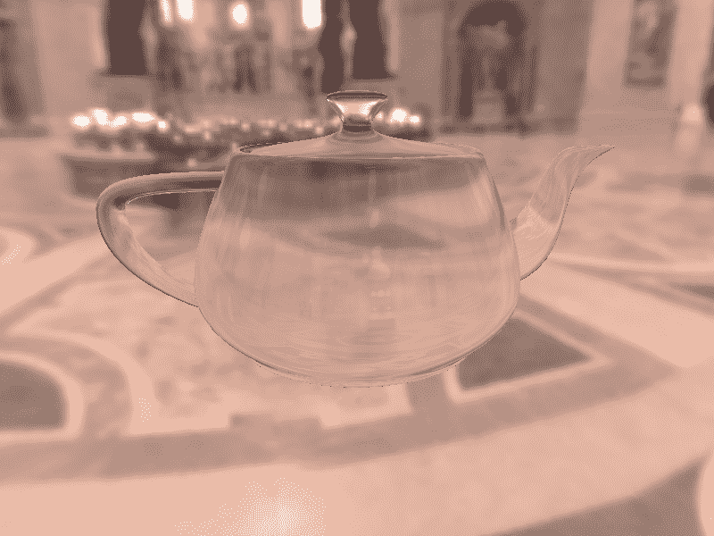

# 还有更多...

这种技术与前面配方中“更多...”部分讨论的缺点相同，*使用立方体贴图模拟反射*。

和大多数实时技术一样，这只是一个对实际情况中物理现象的简化。关于这项技术，有许多方面可以改进以提供更逼真的结果。

# 菲涅耳方程

实际上，反射光量的多少取决于入射光的入射角度。例如，当我们从岸边观察湖面时，大部分光线被反射，因此很容易在湖面上看到周围环境的倒影。然而，当我们在湖面上漂浮并直接向下看时，反射较少，更容易看到水面以下的东西。这种现象由菲涅耳方程（Augustin-Jean Fresnel 之后）描述。

菲涅耳方程描述了反射光量作为入射角度、光的偏振和折射率比函数。如果我们忽略偏振，很容易将菲涅耳方程纳入前面的着色器中。在 Randi J Rost 的《OpenGL 着色语言》第三版第十四章中可以找到非常好的解释，该书由 Addison-Wesley Professional 于 2009 年出版。

# 色差

白光当然由许多不同的单个波长（或颜色）组成。光线的折射程度实际上是波长依赖的。这导致在材料界面处可以观察到颜色光谱。最著名的例子是由棱镜产生的彩虹。

我们可以通过为光线的红色、绿色和蓝色分量使用不同的 `Eta` 值来模拟这种效果。我们会存储三个不同的 `Eta` 值，计算三个不同的反射方向（红色、绿色和蓝色），并使用这三个方向在立方体贴图中查找颜色。我们从第一个颜色中提取红色分量，从第二个颜色中提取绿色分量，从第三个颜色中提取蓝色分量，并将这三个分量组合在一起以创建片段的最终颜色。

# 通过物体的两侧折射

重要的是要注意，我们通过仅模拟光与物体一个边界的相互作用来简化了问题。在现实中，光在进入透明物体时会弯曲一次，在离开另一侧时再次弯曲。然而，这种简化通常不会导致看起来不真实的结果。在实时图形中，我们通常更关注结果看起来是否美观，而不是物理模型是否准确。

# 参见

+   示例代码中的 `chapter05/scenerefractcube.cpp` 文件

+   *使用立方体贴图模拟反射* 的配方

# 应用投影纹理

我们可以将纹理应用到场景中的对象上，就像纹理是从场景内部某个地方的想象中的“幻灯片投影仪”投影出来的。这种技术通常被称为**投影纹理映射**，并产生非常棒的效果。

以下图像展示了投影纹理映射的一个示例。左侧的花纹纹理（由 Stan Shebs 通过维基共享）被投影到茶壶和平面下：

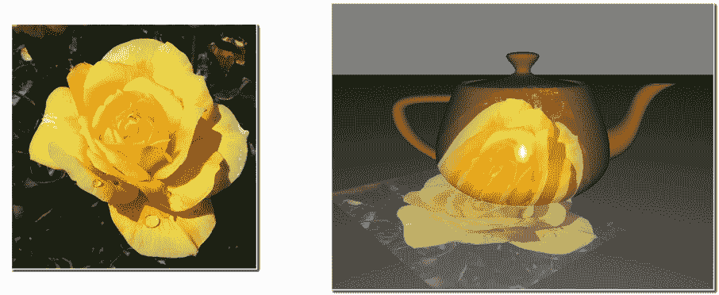

要将纹理投影到表面上，我们只需要确定基于表面位置和投影源（幻灯片投影仪）的相对位置的纹理坐标。一个简单的方法是将投影仪想象成一个位于场景内部的相机。就像我们定义 OpenGL 相机一样，我们定义一个以投影仪位置为中心的坐标系和一个**视图矩阵**（**V**），它将坐标转换为投影仪的坐标系。接下来，我们将定义一个**透视投影矩阵**（**P**），它将投影仪坐标系中的视锥体转换为大小为二的立方体，中心位于原点。将这两者结合起来，并添加一个用于重新缩放和将体积平移到大小为 1 且中心位于（0.5, 0.5, 0.5）的额外矩阵，我们得到以下变换矩阵：

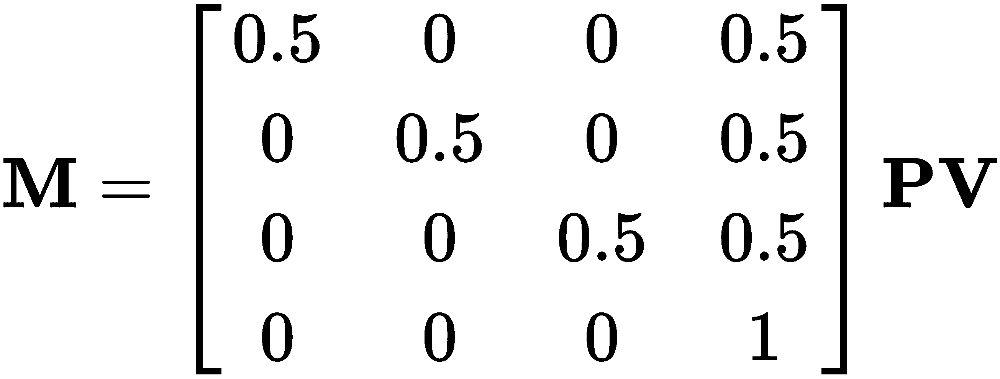

这里的目标基本上是将视锥体转换为 0 到 1 之间的范围，在*x*和*y*方向上。前面的矩阵可以做到这一点！它将位于投影仪视锥体内的世界坐标转换为 0 到 1 的范围（齐次），然后可以用来访问纹理。请注意，坐标是齐次的，在使用之前需要除以 w 坐标。

想要了解更多关于这种技术数学原理的细节，请查看以下由 NVIDIA 的 Cass Everitt 撰写的白皮书：[`www.nvidia.com/object/Projective_Texture_Mapping.html`](https://www.nvidia.com/object/Projective_Texture_Mapping.html)

在这个例子中，我们将使用投影纹理映射将单个纹理应用到场景中。

# 准备中

设置你的 OpenGL 应用程序，以在属性位置 0 提供顶点位置，在属性位置 1 提供法线。OpenGL 应用程序还必须为 Phong 反射模型提供材质和光照属性（参见以下章节中给出的片段着色器）。确保在统一变量`ModelMatrix`中提供模型矩阵（用于转换为世界坐标）。

# 如何操作...

要将投影纹理应用到场景中，请按照以下步骤操作：

1.  在 OpenGL 应用程序中，将纹理加载到纹理单元零。当纹理对象绑定到`GL_TEXTURE_2D`目标时，使用以下代码设置纹理的设置：

```cpp
glTexParameteri(GL_TEXTURE_2D, GL_TEXTURE_MAG_FILTER, 
                 GL_LINEAR); 
glTexParameteri(GL_TEXTURE_2D, GL_TEXTURE_MIN_FILTER,  
                GL_LINEAR); 
glTexParameteri(GL_TEXTURE_2D, GL_TEXTURE_WRAP_S,  
                GL_CLAMP_TO_BORDER); 
glTexParameteri(GL_TEXTURE_2D, GL_TEXTURE_WRAP_T,   
                GL_CLAMP_TO_BORDER); 
```

1.  在 OpenGL 应用程序中，设置幻灯片投影机的变换矩阵，并将其分配给统一变量`ProjectorMatrix`。使用以下代码来完成此操作。请注意，此代码使用了在第一章，*开始使用 GLSL*中讨论的 GLM 库：

```cpp
vec3 projPos, projAt, projUp;
// Set the above 3 to appropriate values...
mat4 projView = glm::lookAt(projPos, projAt, projUp);
```

```cpp
mat4 projProj = glm::perspective(glm::radians(30.0f), 1.0f, 0.2f, 1000.0f);
mat4 bias = glm::translate(mat4(1.0f), vec3(0.5f));
bias = glm::scale(bias, vec3(0.5f));
prog.setUniform("ProjectorMatrix", bias * projProj * projView);
```

1.  使用以下代码进行顶点着色器：

```cpp
layout (location = 0) in vec3 VertexPosition;
layout (location = 1) in vec3 VertexNormal;

out vec3 EyeNormal;   // Normal in eye coordinates
out vec4 EyePosition; // Position in eye coordinates
out vec4 ProjTexCoord;

uniform mat4 ProjectorMatrix;

uniform mat4 ModelViewMatrix;
uniform mat4 ModelMatrix;
uniform mat3 NormalMatrix;
uniform mat4 MVP;

void main() {
  vec4 pos4 = vec4(VertexPosition,1.0);

  EyeNormal = normalize(NormalMatrix * VertexNormal);
  EyePosition = ModelViewMatrix * pos4;
  ProjTexCoord = ProjectorMatrix * (ModelMatrix * pos4);
  gl_Position = MVP * pos4;
}
```

1.  使用以下代码进行片段着色器：

```cpp
in vec3 EyeNormal;       // Normal in eye coordinates 
in vec4 EyePosition;     // Position in eye coordinates 
in vec4 ProjTexCoord; 

layout(binding=0) uniform sampler2D ProjectorTex; 

// Light and material uniforms...

layout( location = 0 ) out vec4 FragColor; 

vec3 blinnPhong( vec3 pos, vec3 norm ) { 
  // Blinn-Phong model...
} 

void main() { 
  vec3 color = blinnPhong(EyePosition.xyz, normalize(EyeNormal));

  vec3 projTexColor = vec3(0.0);
  if( ProjTexCoord.z > 0.0 )
    projTexColor = textureProj( ProjectorTex, ProjTexCoord ).rgb;

  FragColor = vec4(color + projTexColor * 0.5, 1);
} 
```

# 它是如何工作的...

当将纹理加载到 OpenGL 应用程序中时，我们确保将*s*和*t*方向的包裹模式设置为`GL_CLAMP_TO_BORDER`。我们这样做是因为如果纹理坐标超出了零到一的范围内，我们不希望投影纹理有任何贡献。使用这种模式，使用默认的边框颜色，当纹理坐标超出 0 到 1（包括 0 和 1）的范围时，纹理将返回(0,0,0,0)。

在 OpenGL 应用程序中设置幻灯片投影机的变换矩阵。我们首先使用 GLM 函数`glm::lookAt`为投影机生成一个视图矩阵。在这个例子中，我们将投影机定位在(5, 5, 5)，朝向点(-2, -4,0)，使用*向上向量*为(0, 1, 0)。此函数与`gluLookAt`函数类似。它返回一个矩阵，用于将坐标系统转换为(5, 5, 5)，并根据第二个和第三个参数进行定位。

接下来，我们使用`glm::perspective`创建投影矩阵，以及缩放/平移矩阵*M*（如本食谱的介绍中所示）。这两个矩阵分别存储在`projProj`和`projScaleTrans`中。最终的矩阵是`projScaleTrans`、`projProj`和`projView`的乘积，存储在`m`中，并分配给统一变量`ProjectorTex`。

在顶点着色器中，我们有三个输出变量：`EyeNormal`、`EyePosition`和`ProjTexCoord`。前两个是眼坐标中的顶点法线和顶点位置。我们适当地变换输入变量，并在`main`函数中将结果分配给输出变量。

我们通过首先将位置变换到世界坐标（通过乘以`ModelMatrix`）来计算`ProjTexCoord`，然后应用投影机的变换。

在片段着色器中，在`main`函数中，我们首先计算反射模型，并将结果存储在变量`color`中。下一步是从纹理中查找颜色。然而，首先检查`ProjTexCoord`的*z*坐标。如果这是负数，则该位置在投影机后面，因此我们避免进行纹理查找。否则，我们使用`textureProj`查找纹理值，并将其存储在`projTexColor`中。

`textureProj` 函数是为了访问经过投影的坐标纹理而设计的。在访问纹理之前，它会将第二个参数的坐标除以其最后一个坐标。在我们的例子中，这正是我们想要的。我们之前提到，经过投影仪矩阵变换后，我们将剩下齐次坐标，因此我们需要在访问纹理之前除以 w 坐标。`textureProj` 函数将为我们完成这一点。

最后，我们将投影纹理的颜色添加到 Phong 模型的基础颜色中。我们将投影纹理颜色稍微缩放，以便它不会过于强烈。

# 还有更多...

这里介绍的技术有一个很大的缺点。目前还没有阴影支持，因此投影的纹理会直接穿透场景中的任何物体，并出现在它们后面的物体上（相对于投影仪而言）。在后面的食谱中，我们将探讨一些处理阴影的技术示例，这有助于解决这个问题。

# 参见

+   示例代码中的 `chapter05/sceneprojtex.cpp` 文件

+   第三章中的 *Blinn-Phong 反射模型* 食谱，*GLSL 着色器基础*

+   *应用 2D 纹理* 食谱

# 将渲染输出到纹理

有时候，在程序执行过程中实时生成纹理是有意义的。这个纹理可能是由某些内部算法（所谓的 **过程纹理**）生成的图案，或者它可能代表场景的另一个部分。

后者案例的一个例子可能是一个视频屏幕，人们可以看到 *世界* 的另一部分，也许是通过另一个房间的安全摄像头。视频屏幕可以随着另一个房间中物体的移动而不断更新，通过重新渲染安全摄像头视图到应用于视频屏幕的纹理中！

在以下图像中，出现在立方体上的纹理是通过将牛渲染到内部纹理中，然后将其应用于立方体的面来生成的：

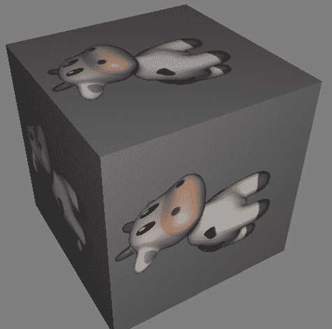

在 OpenGL 中，通过引入 **帧缓冲区对象**（**FBO**）大大简化了直接将渲染输出到纹理的过程。我们可以创建一个单独的渲染目标缓冲区（FBO），将我们的纹理附加到该 FBO 上，并以与渲染到默认帧缓冲区相同的方式渲染到 FBO 上。所需的所有操作只是交换 FBO，完成后再将其交换出来。

基本上，渲染过程涉及以下步骤：

1.  绑定到 FBO

1.  渲染纹理

1.  从 FBO（返回默认帧缓冲区）解绑

1.  使用纹理渲染场景

实际上，在 GLSL 着色器方面，为了使用这种纹理，我们不需要做太多工作。实际上，着色器会将其视为任何其他纹理。然而，我们将讨论一些关于片段输出变量的重要点。

在这个例子中，我们将介绍创建 FBO 及其后备纹理所需的步骤，以及如何设置一个与纹理一起工作的着色器。

# 准备工作

对于这个例子，我们将使用之前配方中的着色器，即*应用 2D 纹理*，进行一些小的修改。按照该配方中的描述设置你的 OpenGL 程序。我们将对着色器做的唯一修改是将`sampler2D`变量的名称从`Tex1`改为`Texture`。

# 如何做到...

要在纹理上渲染并应用该纹理到第二个渲染通道的场景中，请按照以下步骤操作：

1.  在主 OpenGL 程序中，使用以下代码设置帧缓冲区对象：

```cpp
GLuint fboHandle;  // The handle to the FBO 

// Generate and bind the framebuffer 
glGenFramebuffers(1, &fboHandle); 
glBindFramebuffer(GL_FRAMEBUFFER, fboHandle); 

// Create the texture object 
GLuint renderTex; 
glGenTextures(1, &renderTex); 
glActiveTexture(GL_TEXTURE0);  // Use texture unit 0 
glBindTexture(GL_TEXTURE_2D, renderTex); 
glTexStorage2D(GL_TEXTURE_2D, 1, GL_RGBA8, 512, 512); 
glTexParameteri(GL_TEXTURE_2D, GL_TEXTURE_MIN_FILTER,  
                GL_LINEAR); 
glTexParameteri(GL_TEXTURE_2D, GL_TEXTURE_MAG_FILTER,  
                GL_LINEAR); 

// Bind the texture to the FBO 
glFramebufferTexture2D(GL_FRAMEBUFFER,GL_COLOR_ATTACHMENT0,  
                       GL_TEXTURE_2D, renderTex, 0); 

// Create the depth buffer 
GLuint depthBuf; 
glGenRenderbuffers(1, &depthBuf); 
glBindRenderbuffer(GL_RENDERBUFFER, depthBuf); 
glRenderbufferStorage(GL_RENDERBUFFER, GL_DEPTH_COMPONENT,  
                      512, 512); 

// Bind the depth buffer to the FBO 
glFramebufferRenderbuffer(GL_FRAMEBUFFER,  
                          GL_DEPTH_ATTACHMENT, 
                          GL_RENDERBUFFER, depthBuf); 

// Set the target for the fragment shader outputs 
GLenum drawBufs[] = {GL_COLOR_ATTACHMENT0}; 
glDrawBuffers(1, drawBufs); 

// Unbind the framebuffer, and revert to default 
glBindFramebuffer(GL_FRAMEBUFFER, 0); 
```

1.  在 OpenGL 程序中的渲染函数内，绑定到帧缓冲区，绘制要渲染到纹理中的场景，然后从该帧缓冲区解绑，并绘制立方体：

```cpp
// Bind to texture's FBO 
glBindFramebuffer(GL_FRAMEBUFFER, fboHandle); 
glViewport(0,0,512,512);  // Viewport for the texture

// Use the texture for the cow here 
int loc = glGetUniformLocation(programHandle, "Texture"); 
glUniform1i(loc, 1);

// Setup the projection matrix and view matrix 
// for the scene to be rendered to the texture here. 
// (Don't forget to match aspect ratio of the viewport.) 

renderTextureScene(); 

// Unbind texture's FBO (back to default FB) 
glBindFramebuffer(GL_FRAMEBUFFER, 0); 
glViewport(0,0,width,height);  // Viewport for main window 

// Use the texture that is linked to the FBO 
int loc = glGetUniformLocation(programHandle, "Texture"); 
glUniform1i(loc, 0); 

// Reset projection and view matrices here...
renderScene();
```

# 它是如何工作的...

让我们先看看创建帧缓冲区对象的代码（步骤 1）。我们的 FBO 将是 512 像素的平方，因为我们打算将其用作纹理。我们首先使用`glGenFramebuffers`生成 FBO，并使用`glBindFramebuffer`将其绑定到`GL_FRAMEBUFFER`目标。接下来，我们创建一个将要渲染的纹理对象，并使用`glActiveTexture`选择纹理单元零。其余部分与创建任何其他纹理非常相似。我们使用`glTexStorage2D`为纹理分配空间。我们不需要将任何数据复制到该空间（使用`glTexSubImage2D`），因为我们将在渲染到 FBO 时稍后写入该内存。

接下来，我们通过调用函数`glFramebufferTexture2D`将纹理链接到 FBO。此函数将一个纹理对象附加到当前绑定的帧缓冲区对象的附件点上。第一个参数（`GL_FRAMEBUFFER`）表示纹理将被附加到当前绑定到`GL_FRAMEBUFFER`目标的 FBO。第二个参数是附件点。帧缓冲区对象有几个颜色缓冲区的附件点，一个用于深度缓冲区，还有一些其他附件点。这使我们能够从我们的片段着色器中针对多个颜色缓冲区。我们将在稍后了解更多关于这一点。我们使用`GL_COLOR_ATTACHMENT0`来表示此纹理链接到 FBO 的颜色附件 0。第三个参数（`GL_TEXTURE_2D`）是纹理目标，第四个（`renderTex`）是我们纹理的句柄。最后一个参数（`0`）是要附加到 FBO 的纹理的 mip 级别。在这种情况下，我们只有一个级别，所以我们使用零值。

由于我们想要在 FBO 上渲染并使用深度测试，我们还需要附加一个深度缓冲区。接下来的几行代码创建了深度缓冲区。`glGenRenderbuffer`函数创建了一个`renderbuffer`对象，而`glRenderbufferStorage`为`renderbuffer`对象分配空间。`glRenderbufferStorage`的第二个参数表示缓冲区的内部格式，由于我们将其用作深度缓冲区，我们使用特殊的格式`GL_DEPTH_COMPONENT`。

接下来，使用`glFramebufferRenderbuffer`将深度缓冲区附加到 FBO 的`GL_DEPTH_ATTACHMENT`附加点。

使用`glDrawBuffers`将着色器的输出变量分配给 FBO 的附加点。`glDrawBuffers`的第二个参数是一个数组，指示要关联到输出变量的 FBO 缓冲区。数组的第*i*个元素对应于位置*i*的片段着色器输出变量。在我们的例子中，我们只有一个着色器输出变量（`FragColor`）在位置零。此语句将该输出变量与`GL_COLOR_ATTACHMENT0`关联。

第一步的最后一条语句解除了 FBO 的绑定，使其恢复到默认帧缓冲区。

在最后一步（在渲染函数内），我们绑定到 FBO，使用单元一的纹理，并渲染纹理。请注意，我们需要小心地设置视口（`glViewport`）以及视图和投影矩阵，以适应我们的 FBO。由于我们的 FBO 是 512 x 512，我们使用`glViewport(0,0,512,512)`。类似的更改也应应用于视图和投影矩阵，以匹配视口的纵横比，并设置要渲染到 FBO 的场景。

一旦我们将渲染到纹理上，我们就从 FBO 解绑，重置视口、视图和投影矩阵，使用 FBO 的纹理（纹理单元 0），然后绘制立方体！

# 还有更多...

由于 FBO 有多个颜色附加点，我们可以从我们的片段着色器中获得多个输出目标。请注意，到目前为止，我们所有的片段着色器都只有一个输出变量分配到位置零。因此，我们设置了我们的 FBO，使其纹理对应于颜色附加点零。在后面的章节中，我们将查看使用多个这些附加点作为延迟着色等事物的示例。

# 参见

+   示例代码中的`chapter05/scenerendertotex.cpp`文件

+   应用 2D 纹理的配方

# 使用采样对象

采样器对象是在 OpenGL 3.3 中引入的，并提供了一种方便的方式来指定 GLSL 采样器变量的采样参数。指定纹理参数的传统方法是通过`glTexParameter`来指定，通常在定义纹理时进行。这些参数定义了相关纹理的采样状态（采样模式、环绕和钳位规则等）。这实际上将纹理及其采样状态合并为一个单一对象。如果我们想要以多种方式（例如，带有和没有线性过滤）从单个纹理中进行采样，我们有两个选择。我们可能需要修改纹理的采样状态，或者使用相同纹理的两个副本。

此外，我们可能希望为多个纹理使用相同的纹理采样参数集。根据我们到目前为止所看到的，没有简单的方法来实现这一点。使用采样器对象，我们可以一次性指定参数，并在多个纹理对象之间共享它们。

采样器对象将采样状态与纹理对象分离。我们可以创建定义特定采样状态的采样器对象，并将其应用于多个纹理，或者将不同的采样器对象绑定到同一纹理。单个采样器对象可以绑定到多个纹理，这允许我们一次性定义特定的采样状态，并在多个纹理对象之间共享。

采样器对象是在 OpenGL 端定义的（而不是在 GLSL 中），这使得它对 GLSL 来说实际上是透明的。

在这个配方中，我们将定义两个采样器对象，并将它们应用于单个纹理。以下图像显示了结果。相同的纹理被应用于两个平面。在左侧，我们使用为最近邻过滤设置的采样器对象，而在右侧，我们使用相同的纹理，并使用为线性过滤设置的采样器对象：

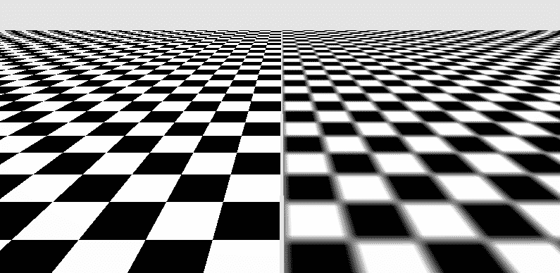

# 准备工作

我们将使用与配方*应用 2D 纹理*中相同的着色器。着色器代码将完全不变，但我们将使用采样器对象来改变采样变量`Tex1`的状态。

# 如何实现...

要设置纹理对象和采样器对象，执行以下步骤：

1.  按照常规方式创建并填充纹理对象，但这次我们不会使用`glTexParameter`设置任何采样状态：

```cpp
GLuint texID; 
glGenTextures(1, &texID); 
glBindTexture(GL_TEXTURE_2D, texID); 
glTexStorage2D(GL_TEXTURE_2D, 1, GL_RGBA8, w, h); 
glTexSubImage2D(GL_TEXTURE_2D, 0, 0, 0, w, h, GL_RGBA, 
   GL_UNSIGNED_BYTE, data);
```

1.  将纹理绑定到纹理单元 0，这是着色器使用的单元：

```cpp
glActiveTexture(GL_TEXTURE0); 
glBindTexture(GL_TEXTURE_2D, texID); 
```

1.  接下来，我们创建两个采样器对象，并将它们的 ID 分配给不同的变量

    为了清晰起见：

```cpp
GLuint samplers[2]; 
glGenSamplers(2, samplers); 
linearSampler = samplers[0]; 
nearestSampler = samplers[1]; 
```

1.  为线性插值设置`linearSampler`：

```cpp
glSamplerParameteri(linearSampler, GL_TEXTURE_MAG_FILTER,  
                    GL_LINEAR); 
glSamplerParameteri(linearSampler, GL_TEXTURE_MIN_FILTER,  
                    GL_LINEAR); 
```

1.  为最近邻采样设置`nearestSampler`：

```cpp
glSamplerParameteri(nearestSampler, GL_TEXTURE_MAG_FILTER,  
                    GL_NEAREST); 
glSamplerParameteri(nearestSampler, GL_TEXTURE_MIN_FILTER,  
                    GL_NEAREST); 
```

1.  在渲染时，当需要时绑定到每个采样器对象：

```cpp
glBindSampler(0, nearestSampler); 
// Render objects that use nearest-neighbor sampling 
glBindSampler(0, linearSampler); 
// Render objects that use linear sampling
```

# 它是如何工作的...

样本对象易于使用，并使得在相同的纹理之间切换不同的采样参数或为不同的纹理使用相同的采样参数变得简单。在步骤 1 和 2 中，我们创建了一个纹理并将其绑定到纹理单元 0。通常，我们会在这里使用`glTexParameteri`设置采样参数，但在这个例子中，我们将使用`glSamplerParameter`在样本对象中设置它们。在步骤 3 中，我们创建了样本对象并将它们的 ID 分配给一些变量。在步骤 4 和 5 中，我们使用`glSamplerParameter`设置适当的采样参数。这个函数几乎与`glTexParameter`完全相同，只是第一个参数是样本对象的 ID 而不是纹理目标。这为两个样本对象（`linearSampler`为线性，`nearestSampler`为最近）定义了采样状态。

最后，我们在渲染之前通过使用`glBindSampler`将样本对象绑定到适当的纹理单元来使用样本对象。在步骤 6 中，我们首先将`nearestSampler`绑定到纹理单元 0，渲染一些对象，然后将`linearSampler`绑定到纹理单元 0，并再次渲染一些对象。这里的结果是，通过在渲染过程中将不同的样本对象绑定到纹理单元，相同的纹理使用了不同的采样参数。

# 参见

+   示例代码中的`chapter05/scenesamplerobj.cpp`文件

+   应用 2D 纹理的配方

# 漫反射基于图像的照明

**基于图像的照明**是一种涉及使用图像作为光源的技术。该图像表示场景环境的全方位视图。使用基于图像的照明，图像本身被处理为一个完全环绕场景的高度详细的光源。场景中的物体通过图像的内容被照亮，这使得拥有一个非常复杂的照明环境或模拟真实世界场景成为可能。通常，这些图像是通过特殊的相机或特殊的摄影技术制作的，并记录在高动态范围内。这里展示了一个这样的图像示例（图像由南加州大学创意技术研究所和保罗·德贝韦克提供）：

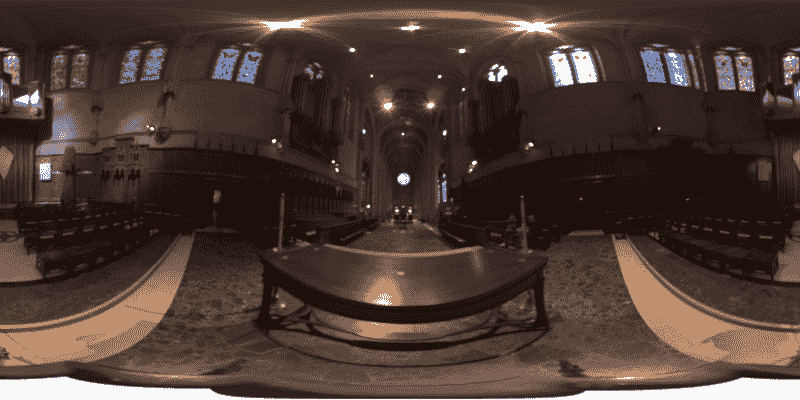

这些图像可以提供为立方图（六个图像的集合），或者某些其他类型的环境图，如**等角**全景图（之前展示的类型）。两者之间的转换是直接的。

由于等角图中的每个 texel 代表一个方向，立方图也是如此。要从一个转换到另一个，我们只需要将一个图中的方向转换为另一个图中的方向。

在这个配方中，我们将通过使用图像作为漫反射的光源的过程。这里的大部分工作都涉及创建**漫反射卷积**图。漫反射卷积是将环境图转换成可以直接用于计算漫反射的形式的转换。在以下图像中，左侧显示原始环境图，右侧是漫反射卷积（图片由南加州大学创意技术研究所和保罗·德贝维ック提供）：

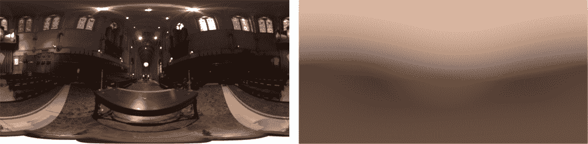

为了理解漫反射卷积图，让我们回顾一下反射方程（在第三章“基于物理的反射模型”中，*GLSL 着色器的基础*中提出）：

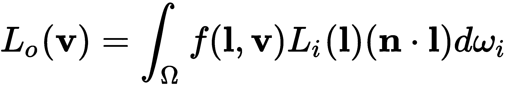

这个方程表示在表面上方半球面上所有入射光 (*l*) 的积分。前一个方程中的 *f* 项是**双向反射分布函数**（**BRDF**）。它表示在给定的入射 (*l*) 和出射 (*v*) 方向条件下，从表面点反射的光的分数。如果我们只考虑漫反射（朗伯），我们可以使用以下常数项作为 BRDF：

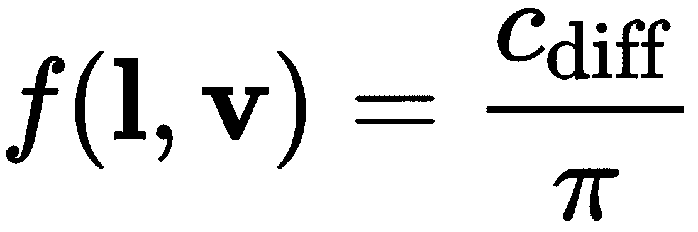

这给出了反射方程的以下内容：

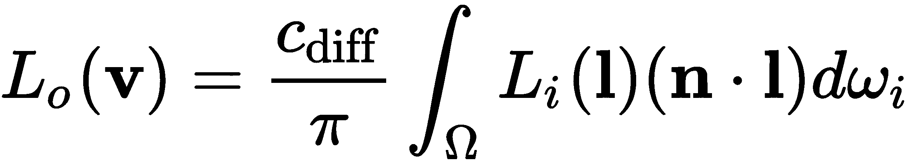

由于 BRDF 只是一个常数，它可以被因式分解到积分外面。注意，这个方程中没有依赖于出射方向 (*v*) 的东西。这导致我们得到以下见解。我们之前讨论的环境图表示了给定方向的入射辐射量，这是前一个方程中的 *Li* 项。我们可以使用**蒙特卡洛估计器**来估计给定 *n* 值的该积分的值：

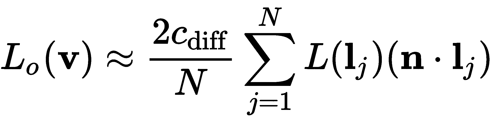

在前一个方程中，*l[j]* 代表从表面上方半球面（围绕 *n*）均匀采样的伪随机方向，*N* 是样本数量。*2π* 的常数因子来自均匀样本的概率密度函数作为立体角函数。

在半球面上均匀采样方向并不像你想象的那样简单。常见的做法是在一个系统中采样方向，其中 *z* 轴与向量 *n* 对齐，然后将样本转换成世界坐标。然而，我们必须小心地均匀选择方向。例如，如果我们只是为 *x* 和 *y* 选取介于 -1 和 1 之间的随机值，为 *z* 和 0 选取 1 和 0，然后进行归一化，那么这将给出有偏或“聚集”在 *z* 轴周围的定向，并且在半球面上不是均匀的。为了得到均匀的定向，我们可以使用以下公式：

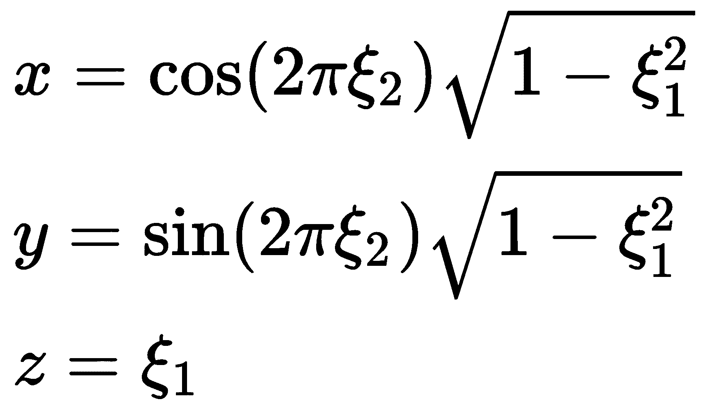

值 *ξ[1]* 和 *ξ[2]* 是范围 [0, 1] 内的均匀伪随机值。关于这一点的推导，请参阅 *基于物理的渲染* 第三版，第十三章，*蒙特卡洛积分*。

现在我们有了估计给定 *n* 值的积分的方法，我们可以以下述方式卷积原始环境图。我们将创建一个新的环境图（漫反射卷积图），其中每个纹理像素代表世界坐标中 *n* 的一个方向。纹理像素的值将是先前积分的估计值（除了 *c[diff]* 项），通过从原始环境图中取多个随机样本（*l[j]*) 来获得。我们可以 *离线* 进行此操作并预计算这个漫反射卷积。这是一个相对较慢的过程，但我们不需要很多细节。漫反射卷积通常变化相当平滑，因此我们可以使用较小的分辨率而不会牺牲太多质量。

我承认在这里省略了一些数学内容。关于图形中蒙特卡洛积分的非常好的介绍，请参阅 Pharr、Jakob 和 Humphreys 编著的 *基于物理的渲染* 第三版，第十三章，*蒙特卡洛积分*。

一旦我们有了预计算的漫反射卷积，我们就可以将其用作 *查找表* 来给出我们的漫反射积分（再次，没有 *c[diff]*) 的值，使用法线向量。我们可以将检索到的值乘以我们的材料的漫反射颜色 *c*[*dif*f]，以获得出射辐射度。换句话说，漫反射卷积表示给定 *n* 值的 *出射* 辐射度，而不是入射辐射度。

# 准备工作

这里的准备工作大部分涉及环境图的卷积。以下伪代码概述了这一过程：

```cpp
nSamples = 1000
foreach texel t in output map
  n = direction towards t
  rad = 0
  for i = 1 to nSamples
     li = uniform random direction in the 
          hemisphere around n in world coords
     L = read from environment map at li
     nDotL = dot( n, li )
     rad += L * nDotL
  set texel t to (2 / nSamples) * rad
```

# 如何操作...

要渲染具有漫反射图像光照的场景，过程相当简单。我们只需使用法线向量从我们的漫反射贴图中读取。

顶点着色器只是将位置和法线转换为世界坐标，并将它们传递下去：

```cpp
// Input attributes...

out vec3 Position; // world coords
out vec3 Normal;   // world coords.
out vec2 TexCoord;

// Matrix uniforms ...

void main() {
    TexCoord = VertexTexCoord;
    Position = (ModelMatrix * vec4(VertexPosition,1)).xyz;
    Normal = normalize( ModelMatrix * vec4(VertexNormal,0) ).xyz;
    gl_Position = MVP * vec4(VertexPosition,1.0);
}
```

片段着色器随后使用漫反射卷积图来确定积分的值，将其乘以从纹理图中取出的颜色，并应用伽玛校正：

```cpp
const float PI = 3.14159265358979323846;

in vec3 Position;
in vec3 Normal;
in vec2 TexCoord;

layout(binding=0) uniform samplerCube DiffConvTex;
layout(binding=1) uniform sampler2D ColorTex;

layout( location = 0 ) out vec4 FragColor;

const float gamma = 2.2;

void main() {
    vec3 n = normalize(Normal);

    // Look up reflected light from diffuse cube map
    vec3 light = texture(DiffConvTex, n).rgb;
    vec3 color = texture(ColorTex, TexCoord).rgb;
    color = pow(color, vec3(gamma));   // decode
    color *= light;

    color = pow( color, vec3(1.0/gamma));  // gamma encode

    FragColor = vec4( color, 1 );
}
```

本食谱引言中展示的环境图的结果如下截图所示：


# 工作原理...

一旦我们创建了扩散卷积，这项技术就没有太多内容了。我们只需简单地查找卷积映射 `DiffConvTex` 中的值，并将其与表面的基础颜色相乘。在这个例子中，表面的基础颜色是从第二个纹理映射 (`ColorTex`) 中获取的。我们在将基础颜色纹理与环境映射相乘之前，对其应用伽玛解码，将其移动到线性颜色空间。这假设纹理存储在 sRGB 或已经过伽玛编码。最终值在显示前进行伽玛编码。环境映射中的值位于线性颜色空间，因此我们需要在组合之前将所有内容移动到线性空间。有关伽玛编码/解码的更多细节，请参阅第六章中的*使用伽玛校正来提高图像质量*配方，*图像处理和屏幕空间技术*。

# 还有更多...

还很乐意将镜面/光泽组件包含在这个模型中。这里没有涉及这一点。此外，还应该包括适当的光滑反射。包括镜面组件有点困难，因为它还取决于观察者的方向。有创建镜面卷积的技术，我将参考以下来源。这些通常涉及几个简化假设，以便在实时中实现。

# 参考内容

+   示例代码中的 `chapter05/scenediffibl.cpp` 文件

+   《基于物理的渲染》，第三版，作者 Pharr, Jakob, 和 Humphreys

+   第六章中的*使用伽玛校正来提高图像质量*配方，*图像处理和屏幕空间技术*

+   有关基于图像照明的镜面贡献的详细信息，请参阅[`blog.selfshadow.com/publications/s2013-shading-course/`](http://blog.selfshadow.com/publications/s2013-shading-course/)
