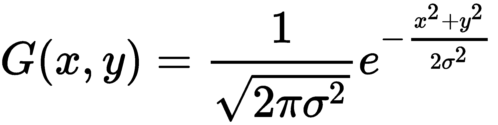

# 图像处理和屏幕空间技术

在本章中，我们将涵盖以下食谱：

+   应用边缘检测过滤器

+   应用高斯模糊过滤器

+   使用色调映射实现 HDR 照明

+   创建辉光效果

+   使用伽玛校正提高图像质量

+   使用多采样抗锯齿

+   使用延迟着色

+   屏幕空间环境遮挡

+   配置深度测试

+   实现无序透明度

# 简介

在本章中，我们将专注于直接与帧缓冲区中的像素工作的技术。这些技术通常涉及多个遍历。初始遍历生成像素数据，后续遍历应用效果或进一步处理这些像素。为了实现这一点，我们经常利用 OpenGL 提供的直接渲染到纹理或纹理集的能力（参考第五章的*渲染到纹理*食谱，*使用纹理*）。

能够将渲染输出到纹理，结合片段着色器的强大功能，开辟了巨大的可能性。我们可以在输出之前在片段着色器中应用额外的过程来实现图像处理技术，如亮度、对比度、饱和度和锐度。我们可以应用**卷积**过滤器，如边缘检测、平滑（模糊）或锐化。我们将在边缘检测食谱中更详细地了解卷积过滤器。

一组相关的技术涉及将额外的信息渲染到纹理中，这些信息超出了传统的颜色信息，然后在后续遍历中进一步处理这些信息以生成最终的渲染图像。这些技术属于通常被称为**延迟着色**的通用类别。

在本章中，我们将查看前面提到的每种技术的示例。我们将从边缘检测、模糊和辉光卷积过滤器的示例开始。然后，我们将转向重要的伽玛校正和多采样抗锯齿主题。最后，我们将以延迟着色的完整示例结束。

本章中的大多数食谱都涉及多个遍历。为了应用一个作用于最终渲染图像像素的过滤器，我们首先将场景渲染到一个中间缓冲区（一个纹理）。然后，在最终遍历中，我们通过绘制一个全屏四边形并将纹理渲染到屏幕上，在这个过程中应用过滤器。你将在接下来的食谱中看到这个主题的几个变体。

# 应用边缘检测过滤器

**边缘检测**是一种图像处理技术，它识别图像亮度发生显著变化的区域。它提供了一种检测物体边界和表面拓扑变化的方法。它在计算机视觉、图像处理、图像分析和图像模式识别领域有应用。它还可以用于创建一些视觉上有趣的效果。例如，它可以使 3D 场景看起来类似于 2D 铅笔素描，如下面的图像所示。为了创建此图像，一个茶壶和一个环面被正常渲染，然后在第二次遍历中应用了边缘检测滤波器：


我们在这里使用的边缘检测滤波器涉及使用卷积滤波器，或卷积核（也称为**滤波器核**）。卷积滤波器是一个矩阵，它定义了如何通过用附近像素的值与一组预定的权重之间的乘积之和来替换像素。作为一个简单的例子，考虑以下卷积滤波器：


3 x 3 滤波器以灰色阴影显示，叠加在一个假设的像素网格上。粗体数字代表滤波器核（权重）的值，非粗体值是像素值。像素的值可以代表灰度强度或 RGB 组件中的一个值。将滤波器应用于灰色区域的中心像素涉及将相应的单元格相乘并求和结果。结果将是中心像素的新值（**25**）。在这种情况下，该值将是（*17 + 19 + 2 * 25 + 31 + 33*），或 150。

当然，为了应用卷积滤波器，我们需要访问原始图像的像素以及一个单独的缓冲区来存储滤波器的结果。在这里，我们将通过使用两遍算法来实现这一点。在第一遍中，我们将图像渲染到纹理中，然后在第二遍中，我们将通过从纹理中读取并发送过滤后的结果到屏幕来应用滤波器。

边缘检测中最简单的基于卷积的技术之一是所谓的**Sobel 算子**。Sobel 算子旨在近似每个像素处的图像强度梯度。它是通过应用两个 3 x 3 滤波器来做到这一点的。这两个滤波器的结果是梯度的垂直和水平分量。然后我们可以使用梯度的幅度作为我们的边缘触发器。当梯度的幅度超过某个阈值时，我们假设该像素位于边缘上。

Sobel 算子使用的 3 x 3 滤波器核在以下方程中显示：


如果应用 *S[x]* 的结果是 *s[x]*，应用 *S[y]* 的结果是 *s[y]*，那么梯度的近似大小由以下方程给出：


如果*g*的值高于某个阈值，我们认为该像素是边缘像素，并在结果图像中突出显示它。

在本例中，我们将实现此滤波器作为两遍算法的第二遍。在第一遍中，我们将使用适当的照明模型渲染场景，但将结果发送到纹理。在第二遍中，我们将整个纹理作为填充屏幕的四边形渲染，并将滤波器应用于纹理。

# 准备工作

设置一个与主窗口具有相同维度的帧缓冲区对象（参考第五章，*使用纹理*中的*将渲染输出到纹理*配方），将 FBO 的第一个颜色附加连接到纹理单元零中的纹理对象。在第一遍中，我们将直接渲染到这个纹理。确保此纹理的`mag`和`min`过滤器设置为`GL_NEAREST`。我们不希望此算法有任何插值。

在顶点属性零中提供顶点信息，在顶点属性一中提供法线，在顶点属性二中提供纹理坐标。

以下统一变量需要从 OpenGL 应用程序中设置：

+   `Width`：用于设置屏幕窗口的宽度（以像素为单位）

+   `Height`：用于设置屏幕窗口的高度（以像素为单位）

+   `EdgeThreshold`：这是被认为在边缘上的`g`平方的最小值

+   `RenderTex`：这是与 FBO 关联的纹理

与着色模型关联的任何其他统一变量也应从 OpenGL 应用程序中设置。

# 如何操作...

要创建一个应用 Sobel 边缘检测滤波器的着色器程序，请执行以下步骤：

1.  顶点着色器仅将位置和法线转换为相机坐标，并将它们传递给片段着色器。

1.  片段着色器在第一遍中应用反射模型，在第二遍中应用边缘检测滤波器：

```cpp
in vec3 Position; 
in vec3 Normal; 

uniform int Pass; // Pass number

// The texture containing the results of the first pass 
layout( binding=0 ) uniform sampler2D RenderTex; 

uniform float EdgeThreshold; // The squared threshold 

// Light/material uniforms...

layout( location = 0 ) out vec4 FragColor; 
const vec3 lum = vec3(0.2126, 0.7152, 0.0722); 

vec3 blinnPhong( vec3 pos, vec3 norm ) {
 // ... 
} 

// Approximates the brightness of a RGB value. 
float luminance( vec3 color ) { 
 return dot(lum, color);
} 
vec4 pass1() { 
 return vec4(blinnPhong( Position, normalize(Normal) ),1.0); 
} 

vec4 pass2() { 
 ivec2 pix = ivec2(gl_FragCoord.xy); 
 float s00 = luminance( 
    texelFetchOffset(RenderTex, pix, 0, 
            ivec2(-1,1)).rgb); 
 float s10 = luminance( 
       texelFetchOffset(RenderTex, pix, 0, 
                ivec2(-1,0)).rgb); 
 float s20 = luminance( 
       texelFetchOffset(RenderTex, pix, 0, 
                ivec2(-1,-1)).rgb); 
 float s01 = luminance( 
       texelFetchOffset(RenderTex, pix, 0, 
                ivec2(0,1)).rgb); 
 float s21 = luminance( 
       texelFetchOffset(RenderTex, pix, 0, 
                ivec2(0,-1)).rgb); 
 float s02 = luminance( 
       texelFetchOffset(RenderTex, pix, 0, 
                ivec2(1,1)).rgb); 
 float s12 = luminance( 
       texelFetchOffset(RenderTex, pix, 0, 
                ivec2(1,0)).rgb); 
 float s22 = luminance( 
       texelFetchOffset(RenderTex, pix, 0, 
                ivec2(1,-1)).rgb); 

 float sx = s00 + 2 * s10 + s20 - (s02 + 2 * s12 + s22); 
 float sy = s00 + 2 * s01 + s02 - (s20 + 2 * s21 + s22); 

 float g = sx * sx + sy * sy; 

 if( g > EdgeThreshold ) return vec4(1.0); 
 else return vec4(0.0,0.0,0.0,1.0); 
} 

void main() { 
  if( Pass == 1 ) FragColor = pass1();
  if( Pass == 2 ) FragColor = pass2(); 
}
```

在你的 OpenGL 应用程序的渲染函数中，对于遍数#1，遵循以下步骤：

1.  选择 FBO，并清除颜色/深度缓冲区

1.  将`Pass`统一变量设置为`1`

1.  设置模型、视图和投影矩阵，并绘制场景

对于遍数#2，执行以下步骤：

1.  取消选择 FBO（恢复到默认帧缓冲区）并清除颜色/深度缓冲区

1.  将`Pass`统一变量设置为`2`

1.  将模型、视图和投影矩阵设置为单位矩阵

1.  绘制一个填充屏幕的单个四边形（或两个三角形）（在*x*和*y*方向上为-1 到+1），每个维度的纹理坐标从 0 到 1。

# 工作原理...

第一遍渲染场景的所有几何形状并将输出发送到纹理。我们选择`pass1`函数，该函数简单地计算并应用 Blinn-Phong 反射模型（参考第三章，*GLSL 着色器基础*）。

在第二次遍历中，我们选择`pass2`函数，并仅渲染一个覆盖整个屏幕的单个四边形。这样做是为了在图像中的每个像素上调用一次片段着色器。在`pass2`函数中，我们检索包含第一次遍历结果的纹理的八个相邻像素的值，并通过调用`luminance`函数计算它们的亮度。然后应用水平和垂直 Sobel 滤波器，并将结果存储在`sx`和`sy`中。

`luminance`函数通过计算强度的加权总和来确定 RGB 值的亮度。权重来自 ITU-R 建议书 Rec. 709。有关此内容的更多详细信息，请参阅维基百科上的*亮度*条目。

然后，我们计算梯度幅度的平方值（为了避免开方）并将结果存储在`g`中。如果`g`的值大于`EdgeThreshold`，我们认为该像素位于边缘，并输出一个白色像素。否则，我们输出一个纯黑色像素。

# 还有更多...

Sobel 算子相对简单，并且对强度的高频变化较为敏感。快速查看维基百科将引导你找到许多其他可能更精确的边缘检测技术。在渲染和边缘检测遍历之间添加一个*模糊遍历*也有可能减少高频变化量。模糊遍历将平滑高频波动，并可能改善边缘检测遍历的结果。

# 优化技术

这里讨论的技术需要执行八个纹理获取操作。纹理访问可能会有些慢，减少访问次数可以显著提高速度。由 Randima Fernando 编著的《GPU Gems：实时图形编程技巧、提示和技巧》（Addison-Wesley Professional 2004 年出版）的第二十四章对如何通过使用所谓的*辅助*纹理来减少滤波操作中的纹理获取次数进行了出色的讨论。

# 参见

+   示例代码中的`chapter06/sceneedge.cpp`文件

+   D. Ziou 和 S. Tabbone（*1998*），*边缘检测技术：概述*，《国际计算机视觉杂志》，第 24 卷，第 3 期

+   *Frei-Chen 边缘检测器*: [`rastergrid.com/blog/2011/01/frei-chen-edge-detector/`](http://rastergrid.com/blog/2011/01/frei-chen-edge-detector/)

+   第五章中的*将渲染输出到纹理*配方，《使用纹理》

# 应用高斯模糊过滤器

模糊过滤器在许多不同的情况下都很有用，目标是在图像中减少噪声量。如前所述，在边缘检测之前应用模糊过滤器可以通过减少图像中的高频波动来提高结果。任何模糊过滤器的基本思想是使用加权总和混合像素及其附近像素的颜色。权重通常随着与像素的距离（在 2D 屏幕空间中）的增加而减小，因此远离像素的像素对模糊像素的贡献小于靠近像素的像素。

**高斯模糊**使用二维高斯函数来加权附近像素的贡献：



方差项是高斯函数的**方差**，决定了高斯曲线的宽度。高斯函数在（0,0）处达到最大值，这对应于被模糊像素的位置及其值，随着 *x* 或 *y* 的增加而减小。以下图表显示了方差平方值为 4.0 的两维高斯函数：


以下图像显示了高斯模糊操作前后图像的一部分（左侧为之前，右侧为之后）：


要应用高斯模糊，对于每个像素，我们需要计算该像素处高斯函数值的加权总和，即所有图像中像素的加权总和（其中每个像素的 *x* 和 *y* 坐标基于一个位于被模糊像素处的原点）。这个总和的结果是像素的新值。然而，到目前为止的算法有两个问题：

+   由于这是一个 *O(n²)* 过程（其中 *n* 是图像中像素的数量），它可能对于实时应用来说太慢了

+   权重必须加起来等于一，以避免改变整体亮度

    该图像

由于我们在离散位置采样高斯函数，而没有在整个（无限）函数范围内求和，因此权重几乎肯定不会加起来等于一。

我们可以通过限制给定像素（而不是整个图像）模糊的像素数量，以及通过归一化高斯函数的值来解决上述两个问题。在这个例子中，我们将使用一个 9 x 9 的高斯模糊过滤器。也就是说，我们只计算被模糊像素周围 81 个像素的贡献。

这样的技术需要在片段着色器中进行 81 次纹理提取，而片段着色器是针对每个像素执行一次的。对于 800 x 600 大小的图像，总的纹理提取次数将是 *800 * 600 * 81 = 38,880,000*。这看起来很多，不是吗？好消息是，我们可以通过在两次传递中执行高斯模糊来显著减少纹理提取的次数。

二维高斯函数可以分解为两个一维高斯函数的乘积：


其中一维高斯函数由以下方程给出：


所以如果 *C[ij]* 是像素位置 (i, j) 处的像素颜色，我们需要计算的总和由以下方程给出：


这可以通过以下事实重写：二维高斯是两个一维高斯的乘积：


这意味着我们可以通过两次遍历来计算高斯模糊。在第一次遍历中，我们可以计算前一个方程中 *j*（垂直和）的总和，并将结果存储在一个临时纹理中。在第二次遍历中，我们使用前一次遍历的结果来计算 *i*（水平和）的总和。

现在，在我们查看代码之前，有一个重要的问题需要解决。正如我们之前提到的，高斯权重必须加起来等于一，才能成为真正的加权平均值。因此，我们需要归一化我们的高斯权重，如下方程所示：


前一个方程中 *k* 的值只是原始高斯权重的总和：


呼！我们已经将 *O(n^([2]))* 问题简化为 *O(n)* 的问题。好的，有了这个，让我们继续看代码。

我们将使用三次遍历和两个纹理来实现这项技术。在第一次遍历中，我们将整个场景渲染到纹理中。然后，在第二次遍历中，我们将第一次（垂直）求和应用于第一次遍历的纹理，并将结果存储在另一个纹理中。最后，在第三次遍历中，我们将水平求和应用于第二次遍历的纹理，并将结果发送到默认帧缓冲区。

# 准备工作

设置两个帧缓冲对象（参考第五章中的*渲染到纹理*配方，*使用纹理*），以及两个相应的纹理。第一个 FBO 应该有一个深度缓冲区，因为它将用于第一次遍历。第二个 FBO 不需要深度缓冲区，因为在第二次和第三次遍历中，我们只渲染一个填充整个屏幕的四边形，以便为每个像素执行一次片段着色器。

与前面的配方一样，我们将使用一个统一变量来选择每个遍历的功能。OpenGL 程序还应设置以下统一变量：

+   `Width`: 这用于设置屏幕的宽度（以像素为单位）

+   `Height`: 这用于设置屏幕的高度（以像素为单位）

+   `Weight[]`: 这是一个归一化高斯权重的数组

+   `Texture0`: 这是为了将其设置为纹理单元零

+   `PixOffset[]`: 这是一个从被模糊的像素偏移的数组

# 如何做到这一点...

在片段着色器中，我们在第一次遍历中应用 Blinn-Phong 反射模型。在第二次遍历中，我们计算垂直和。在第三次，我们计算水平和：

```cpp
in vec3 Position; // Vertex position 
in vec3 Normal;  // Vertex normal 

uniform int Pass; // Pass number
layout(binding=0) uniform sampler2D Texture0; 

// Light/material uniforms ....
layout( location = 0 ) out vec4 FragColor; 

uniform int PixOffset[5] = int[](0,1,2,3,4); 
uniform float Weight[5]; 

vec3 blinnPhong( vec3 pos, vec3 norm ) { 
  // ... 
} 

vec4 pass1() {
 return vec4(blinnPhong( Position, normalize(Normal) ),1.0); 
} 

vec4 pass2() { 
 ivec2 pix = ivec2(gl_FragCoord.xy); 
 vec4 sum = texelFetch(Texture0, pix, 0) * Weight[0]; 
 for( int i = 1; i < 5; i++ ) 
 { 
  sum += texelFetchOffset( Texture0, pix, 0, 
        ivec2(0,PixOffset[i])) * Weight[i]; 
  sum += texelFetchOffset( Texture0, pix, 0, 
        ivec2(0,-PixOffset[i])) * Weight[i]; 
 } 
 return sum; 
} 

vec4 pass3() { 
 ivec2 pix = ivec2(gl_FragCoord.xy); 
 vec4 sum = texelFetch(Texture0, pix, 0) * Weight[0]; 
 for( int i = 1; i < 5; i++ ) 
 { 
  sum += texelFetchOffset( Texture0, pix, 0, 
        ivec2(PixOffset[i],0)) * Weight[i]; 
  sum += texelFetchOffset( Texture0, pix, 0, 
        ivec2(-PixOffset[i],0)) * Weight[i]; 
 } 
 return sum; 
} 

void main() 
{ 
 if( Pass == 1 ) FragColor = pass1();
 else if( Pass == 2 ) FragColor = pass2();
 else if( Pass == 3 ) FragColor = pass3();
} 
```

在 OpenGL 应用程序中，计算在统一变量`PixOffset`中找到的偏移量的高斯权重，并将结果存储在`Weight`数组中。你可以使用以下代码来完成此操作：

```cpp
char uniName[20]; 
float weights[5], sum, sigma2 = 4.0f; 

// Compute and sum the weights 
weights[0] = gauss(0,sigma2); // The 1-D Gaussian function 
sum = weights[0]; 
for( int i = 1; i < 5; i++ ) { 
 weights[i] = gauss(i, sigma2); 
 sum += 2 * weights[i]; 
} 

// Normalize the weights and set the uniform 
for( int i = 0; i < 5; i++ ) { 
 snprintf(uniName, 20, "Weight[%d]", i); 
 prog.setUniform(uniName, weights[i] / sum); 
} 
```

在主渲染函数中，为第 1 次传递实现以下步骤：

1.  选择渲染帧缓冲区，启用深度测试，并清除颜色/深度缓冲区

1.  将`Pass`设置为`1`

1.  绘制场景

使用以下步骤进行第 2 次传递：

1.  选择中间帧缓冲区，禁用深度测试，并清除颜色缓冲区

1.  将`Pass`设置为`2`

1.  将视图、投影和模型矩阵设置为单位矩阵

1.  将第 1 次传递的纹理绑定到纹理单元 0

1.  绘制全屏四边形

使用以下步骤进行第 3 次传递：

1.  取消选择帧缓冲区（恢复默认），并清除颜色缓冲区

1.  将`Pass`设置为`3`

1.  将第 2 次传递的纹理绑定到纹理单元 0

1.  绘制全屏四边形

# 它是如何工作的...

在计算高斯权重的先前代码（代码段 3）中，名为`gauss`的函数计算一维高斯函数，其中第一个参数是`x`的值，第二个参数是 sigma 的平方。请注意，我们只需要计算正偏移，因为高斯关于零是对称的。由于我们只计算正偏移，我们需要仔细计算权重的总和。我们将所有非零值加倍，因为它们将被两次使用（正负偏移）。

第一次传递（函数`pass1`）使用 Blinn-Phong 反射模型将场景渲染到纹理中。

第二次传递（函数`pass2`）应用高斯模糊操作的加权垂直总和，并将结果存储在另一个纹理中。我们从第一次传递中创建的纹理中读取像素，在垂直方向上偏移`PixOffset`数组中的值。我们使用`Weight`数组中的权重进行求和。（`dy`项是纹理坐标中 texel 的高度。）我们在两个方向上同时求和，每个垂直方向上 4 个像素的距离。

第三次传递（`pass3`）与第二次传递非常相似。我们使用第二次传递的纹理来累积加权水平总和。通过这样做，我们将第二次传递产生的总和纳入我们的整体加权总和，如前所述。因此，我们在目标像素周围 9x9 像素区域内创建一个总和。对于这次传递，输出颜色将发送到默认帧缓冲区以生成最终结果。

# 还有更多...

当然，我们也可以通过增加`Weight`和`PixOffset`数组的大小并重新计算权重，以及/或者使用不同的`sigma2`值来改变高斯形状，来调整更大范围的 texels 的模糊。

# 参见

+   示例代码中的`chapter06/sceneblur.cpp`文件

+   双边滤波：[`people.csail.mit.edu/sparis/bf_course/`](http://people.csail.mit.edu/sparis/bf_course/)

+   第五章中的*将渲染输出到纹理*配方，*使用纹理*

+   本章中的*应用边缘检测滤波器*配方

# 使用色调映射实现 HDR 照明

当为大多数输出设备（显示器或电视）渲染时，设备仅支持每个颜色组件的典型颜色精度为 8 位，或者每个像素 24 位。因此，对于给定的颜色组件，我们限制在 0 到 255 之间的强度范围内。OpenGL 内部使用浮点值表示颜色强度，提供广泛的值和精度范围。在渲染之前，这些值最终通过将浮点范围[0.0, 1.0]映射到无符号字节的范围[0, 255]来转换为 8 位值。

然而，真实场景的亮度范围要宽得多。例如，场景中可见的光源或它们的直接反射可能比光源照亮的物体亮数百到数千倍。当我们使用每个通道 8 位，或浮点范围[0.0, -1.0]工作时，我们无法表示这个强度范围。如果我们决定使用更大的浮点值范围，我们可以更好地内部表示这些强度，但最终我们仍然需要将其压缩到 8 位范围。

使用更大动态范围计算光照/着色的过程通常被称为**高动态范围渲染**（**HDR 渲染**）。摄影师非常熟悉这个概念。当摄影师想要捕捉比单次曝光通常可能捕捉到的更大范围的强度时，他/她可能会拍摄几张不同曝光的照片来捕捉更广泛的值。这个称为**高动态范围成像**（**HDR 成像**）的概念在本质上与 HDR 渲染的概念非常相似。现在，包含 HDR 的后处理流程被认为是任何游戏引擎的基本组成部分。

**色调映射**是将广泛的动态范围值压缩到适合输出设备的较小范围的过程。在计算机图形学中，通常，色调映射是将某些任意值范围映射到 8 位范围。目标是保持图像的暗部和亮部，以便两者都可见，且没有任何部分是完全*褪色*的。

例如，包含明亮光源的场景可能会导致我们的着色模型产生大于 1.0 的强度。如果我们直接将其发送到输出设备，任何大于 1.0 的部分都会被限制为 255，并显示为白色。结果可能是一张大部分为白色的图像，类似于曝光过度的照片。

或者，如果我们把强度线性压缩到 [0, 255] 范围内，较暗的部分可能会太暗或完全看不见。使用色调映射，我们希望保持光源的亮度，同时也保持暗部区域的细节。

当涉及到色调映射和 HDR 渲染/成像时，这个描述只是触及了表面。对于更多细节，我推荐阅读 Reinhard 等人所著的《高动态范围成像》一书。

将一个动态范围映射到更小范围的数学函数称为**色调映射算子**（**TMO**）。这些通常有两种类型，局部算子和全局算子。局部算子通过使用给定像素的当前值以及可能的一些邻近像素的值来确定该像素的新值。全局算子需要有关整个图像的一些信息才能工作。例如，它可能需要知道图像中所有像素的整体平均亮度。其他全局算子使用整个图像上亮度值的直方图来帮助微调映射。

在这个配方中，我们将使用书中《实时渲染》中描述的简单全局算子。此算子使用图像中所有像素的对数平均亮度。对数平均是通过取亮度的对数并平均这些值，然后转换回来得到的，如下方程所示：


*Lw* 是 *(x, y)* 处像素的亮度。包含 *0.0001* 项是为了避免对黑色像素取对数。然后，这个对数平均被用作色调映射算子的一个部分，如下所示：


这个方程中的 *a* 项是关键。它以类似相机曝光级别的方式起作用。*a* 的典型值范围从 0.18 到 0.72。由于这个色调映射算子对暗部和亮部的值压缩得有点过多，我们将使用一个修改过的方程，它不会对暗部值压缩得那么厉害，并包括一个最大亮度 (*L[white]*)，这是一个可配置的值，有助于减少一些极端明亮的像素：


这是我们在本例中将要使用的色调映射算子。我们将场景渲染到一个高分辨率缓冲区中，计算对数平均亮度，然后在第二次遍历中应用之前的色调映射算子。

然而，在我们开始实现之前，还有一个细节需要处理。之前的方程都处理亮度。从一个 RGB 值开始，我们可以计算它的亮度，但一旦我们修改了亮度，我们如何修改 RGB 分量以反映新的亮度而不改变色调（或色度）呢？

**色度**是感知到的颜色，与该颜色的亮度无关。例如，灰色和白色是同一颜色的两种亮度级别。

解决方案涉及切换颜色空间。如果我们把场景转换到一个将亮度与色度分离的颜色空间，那么我们可以独立地改变亮度值。**CIE XYZ**颜色空间正好符合我们的需求。CIE XYZ 颜色空间被设计成其*Y*分量描述颜色的亮度，而色度可以通过两个导出参数（*x*和*y*）来确定。导出的颜色空间被称为**CIE xyY**空间，这正是我们所寻找的。*Y*分量包含亮度，而*x*和*y*分量包含色度。通过转换为*CIE xyY*空间，我们已经将亮度从色度中分离出来，允许我们改变亮度而不影响感知到的颜色。

因此，这个过程涉及将 RGB 转换为 CIE XYZ，然后转换为 CIE xyY，修改亮度，并逆过程回到 RGB。从 RGB 到 CIE XYZ（反之亦然）可以描述为一个转换矩阵（请参阅代码或*另请参阅*部分以获取矩阵）。

从 XYZ 到 xyY 的转换涉及以下内容：


最后，使用以下方程将 xyY 转换回 XYZ：


以下图像展示了此色调映射算子的结果示例。左侧图像显示了未进行任何色调映射的场景渲染。阴影是故意使用三个强烈的光源计算出的，具有广泛的动态范围。由于任何大于 1.0 的值都会被限制在最大强度，因此场景看起来*过曝*。右侧的图像使用了相同的场景和相同的阴影，但应用了之前的色调映射算子。注意球体和茶壶上*过曝*区域的镜面高光恢复：


# 准备工作

涉及的步骤如下：

1.  将场景渲染到高分辨率纹理中。

1.  计算对数平均亮度（在 CPU 上）。

1.  渲染一个填充屏幕的四边形以执行每个屏幕像素的片段着色器。在片段着色器中，从步骤 1 中创建的纹理中读取，应用色调映射算子，并将结果发送到屏幕。

为了设置环境，创建一个高分辨率纹理（使用`GL_RGB32F`或类似格式），并将其附加到一个具有深度附加的帧缓冲区。设置你的片段着色器，使用统一变量来选择通道。顶点着色器可以简单地传递眼睛坐标中的位置和法线。

# 如何做到这一点...

为了实现 HDR 色调映射，我们将执行以下步骤：

1.  在第一次遍历中，我们只想将场景渲染到高分辨率纹理中。绑定到已附加纹理的帧缓冲区，并正常渲染场景。

1.  计算纹理中像素的对数平均亮度。为此，我们将从纹理中提取数据，并在 CPU 端循环遍历像素。我们这样做是为了简单起见；一个 GPU 实现，可能使用计算着色器，会更快：

```cpp
int size = width * height;
std::vector<GLfloat> texData(size*3);
glActiveTexture(GL_TEXTURE0);
glBindTexture(GL_TEXTURE_2D, hdrTex);
glGetTexImage(GL_TEXTURE_2D, 0, GL_RGB, GL_FLOAT, texData.data());
float sum = 0.0f;
for( int i = 0; i < size; i++ ) {
 float lum = computeLum(texData[i*3+0], texData[i*3+1], texData[i*3+2]);
 sum += logf( lum + 0.00001f );
}
float logAve = expf( sum / size ); 
```

1.  使用`logAve`设置`AveLum`统一变量。切换回默认帧缓冲区，并绘制一个填充屏幕的四边形。在片段着色器中，将色调映射算子应用于第一步生成的纹理值：

```cpp
// Retrieve high-res color from texture 
vec4 color = texture( HdrTex, TexCoord ); 

// Convert to XYZ 
vec3 xyzCol = rgb2xyz * vec3(color); 

// Convert to xyY 
float xyzSum = xyzCol.x + xyzCol.y + xyzCol.z; 
vec3 xyYCol = vec3(0.0); 
if( xyzSum > 0.0 ) // Avoid divide by zero 
  xyYCol = vec3( xyzCol.x / xyzSum, 
         xyzCol.y / xyzSum, xyzCol.y); 

// Apply the tone mapping operation to the luminance 
// (xyYCol.z or xyzCol.y) 
float L = (Exposure * xyYCol.z) / AveLum; 
L = (L * ( 1 + L / (White * White) )) / ( 1 + L ); 

// Using the new luminance, convert back to XYZ 
if( xyYCol.y > 0.0 ) { 
 xyzCol.x = (L * xyYCol.x) / (xyYCol.y); 
 xyzCol.y = L; 
 xyzCol.z = (L * (1 - xyYCol.x - xyYCol.y))/xyYCol.y; 
} 

// Convert back to RGB and send to output buffer 
FragColor = vec4( xyz2rgb * xyzCol, 1.0); 
```

# 它是如何工作的...

在第一步中，我们将场景渲染到 HDR 纹理中。在第二步中，通过从纹理中检索像素并在 CPU（OpenGL 端）上进行计算来计算对数平均亮度。

在第三步中，我们渲染一个单独的填充屏幕四边形以执行每个屏幕像素的片段着色器。在片段着色器中，我们从纹理中检索 HDR 值并应用色调映射算子。在这个计算中有两个*可调*变量。`Exposure`变量对应于色调映射算子中的*a*项，而`White`变量对应于*L[white]*。对于前面的图像，我们分别使用了`0.35`和`0.928`的值。

# 还有更多...

色调映射并不是一门精确的科学。通常，这是一个不断尝试参数直到找到既有效又美观的过程。

我们可以通过在 GPU 上使用计算着色器（参考第十一章，*使用计算着色器*）或某些其他巧妙的技术来提高先前技术的效率。例如，我们可以将对数写入纹理，然后迭代地将整个帧下采样到 1 x 1 纹理。最终结果将可用在该单个像素中。然而，有了计算着色器的灵活性，我们可以进一步优化这个过程。

# 另请参阅

+   示例代码中的`chapter06/scenetonemap.cpp`文件。

+   布鲁斯·贾斯汀·林德布卢姆提供了一项有用的网络资源，用于颜色空间之间的转换。它包括将 RGB 转换为 XYZ 所需的各种转换矩阵。访问：[`www.brucelindbloom.com/index.html?Eqn_XYZ_to_RGB.html`](http://www.brucelindbloom.com/index.html?Eqn_XYZ_to_RGB.html)。

+   在第五章，*使用纹理*中的*渲染到纹理*配方。

# 创建辉光效果

**辉光**是一种视觉效果，图像的明亮部分似乎有边缘延伸到图像的较暗部分。这种效果基于相机和人类视觉系统感知高对比度区域的方式。由于所谓的**空气盘**（由通过孔的光产生的衍射图案），明亮的光源会*渗透*到图像的其他区域。

下图展示了动画电影《大象之梦》（© 2006，Blender 基金会 / 荷兰媒体艺术学院 / [www.elephantsdream.org](https://orange.blender.org/))中的溢出效果。门后的明亮白色光线*渗透*到图像的较暗部分：


在人工 CG 渲染中产生这种效果需要确定图像中哪些部分足够明亮，提取这些部分，模糊，并与原始图像重新组合。通常，溢出效果与 HDR 渲染相关联。使用 HDR 渲染时，我们可以为每个像素表示更广泛的强度范围（而不产生量化伪影）。由于可以表示更广泛的亮度值，因此与 HDR 渲染结合使用时，溢出效果更准确。

尽管 HDR（高动态范围）可以产生更高质量的结果，但在使用标准（非 HDR）颜色值时，仍然可能出现溢出效果。结果可能不会那么有效，但涉及的原则对两种情况都是相似的。

在以下示例中，我们将使用五次迭代实现溢出效果，包括四个主要步骤：

1.  在第一次迭代中，我们将场景渲染到 HDR 纹理中。

1.  第二次迭代将提取图像中比某个阈值值更亮的部分。我们将此称为**亮通道滤波器**。在应用此滤波器时，我们还将下采样到较低分辨率的缓冲区。我们这样做是因为当我们使用线性采样器从这个缓冲区读取时，我们将获得图像的额外模糊。

1.  第三和第四次迭代将对明亮部分应用高斯模糊（参考本章中的*应用高斯模糊滤波器*配方）。

1.  在第五次迭代中，我们将应用色调映射并将色调映射结果添加到模糊的亮通道滤波器结果中。

下图总结了这一过程。左上角的图像显示了渲染到 HDR 缓冲区的场景，其中一些颜色超出色域，导致图像的大部分区域*过曝*。亮通道滤波器产生一个更小的（大约是原始大小的四分之一或八分之一）图像，其中只有对应于高于阈值的亮度的像素。在这些示例中，像素显示为白色，因为它们的值大于一。对下采样图像应用两次高斯模糊，并对原始图像应用色调映射。最终图像是通过将色调映射图像与模糊的亮通道滤波器图像组合而成的。在采样后者时，我们使用线性滤波器以获得额外的模糊。最终结果显示在底部。

注意球体和背墙上的明亮高光处的溢出效果：


# 准备工作

对于这个配方，我们需要两个帧缓冲区对象，每个都与一个纹理相关联。第一个将用于原始 HDR 渲染，第二个将用于高斯模糊操作的两次传递。在片段着色器中，我们将通过变量`HdrTex`访问原始渲染，而高斯模糊的两个阶段将通过`BlurTex`访问。

常量变量`LumThresh`是第二次传递中使用的最小亮度值。任何大于该值的像素将在后续传递中被提取并模糊。

使用一个顶点着色器，该着色器通过眼坐标传递位置和法线。

# 如何实现...

要生成辉光效果，请执行以下步骤：

1.  在第一次传递中，将场景渲染到具有高分辨率背板纹理的帧缓冲区中。

1.  在第二次传递中，切换到一个包含高分辨率纹理的帧缓冲区，该纹理的大小小于完整渲染的大小。在示例代码中，我们使用一个大小为原始大小八分之一的纹理。绘制一个全屏四边形以启动每个像素的片段着色器，并在片段着色器中从高分辨率纹理中采样，并仅写入大于`LumThresh`的值。否则，将像素着色为黑色：

```cpp
vec4 val = texture(HdrTex, TexCoord); 
if( luminance(val.rgb) > LumThresh ) 
  FragColor = val; 
else 
  FragColor = vec4(0.0); 
```

1.  在第三次和第四次传递中，将高斯模糊应用于第二次传递的结果。这可以通过一个帧缓冲区和两个纹理来完成。在它们之间进行乒乓操作，从一个读取并写入另一个。有关详细信息，请参阅本章中的*应用高斯模糊过滤器*配方。

1.  在第五次和最后一次传递中，从第四次传递产生的纹理切换到线性过滤。切换到默认帧缓冲区（屏幕）。将*使用色调映射实现 HDR 光照*配方中的色调映射操作应用于原始图像纹理（`HdrTex`），并将结果与步骤 3 中的模糊纹理组合。线性过滤和放大应提供额外的模糊：

```cpp
// Retrieve high-res color from texture 
vec4 color = texture( HdrTex, TexCoord ); 

// Apply tone mapping to color, result is toneMapColor 
... 

///////// Combine with blurred texture ////////// 
vec4 blurTex = texture(BlurTex1, TexCoord); 

FragColor = toneMapColor + blurTex;
```

# 它是如何工作的...

由于空间限制，这里没有显示完整的片段着色器代码。完整的代码可以从 GitHub 仓库中获取。片段着色器使用五个方法实现，每个方法对应一个传递。第一次传递将场景正常渲染到 HDR 纹理中。在此传递期间，活动的帧缓冲区对象是与`HdrTex`对应的纹理所关联的，因此输出直接发送到该纹理。

第二次传递从`HdrTex`读取，并仅写入亮度值高于阈值`LumThresh`的像素。对于亮度（亮度）值低于`LumThresh`的像素，值为(0,0,0,0)。输出进入第二个帧缓冲区，其中包含一个大小大得多的纹理（原始大小的八分之一）。

第三和第四次迭代应用基本的高斯模糊操作（参见图章中的*应用高斯模糊滤波器*配方）。在这些迭代中，我们在`BlurTex1`和`BlurTex2`之间进行乒乓操作，因此我们必须小心地将适当的纹理交换到帧缓冲区中。

在第五次迭代中，我们切换回默认帧缓冲区，并从`HdrTex`和`BlurTex1`中读取。`BlurTex1`包含第四步的最终模糊结果，而`HdrTex`包含原始渲染。我们对`HdrTex`的结果应用色调映射并添加到`BlurTex1`。在从`BlurTex1`中提取时，我们应用线性过滤器，从而获得额外的模糊效果。

# 还有更多...

注意，我们已将色调映射运算符应用于原始渲染图像，但未应用于模糊亮通道滤波图像。有人可以选择将 TMO 应用于模糊图像，但在实践中，这通常不是必要的。我们应该记住，如果过度使用，光晕效果也可能在视觉上分散注意力。适可而止。

# 参见

+   示例代码中的`chapter06/scenehdrbloom.cpp`文件

+   *HDR meets Black & White 2* by Francesco Caruzzi in *Shader X6*

+   第五章中的*将渲染到纹理*配方，*使用纹理*

+   本章中的*应用边缘检测滤波器*配方

# 使用伽玛校正来提高图像质量

许多关于 OpenGL 和 3D 图形的书籍通常会忽视伽玛校正的主题。光照和着色计算被执行，结果未经修改直接发送到输出缓冲区。然而，当我们这样做时，我们可能产生与预期不完全一致的结果。这可能是因为计算机显示器（无论是老式的 CRT 还是较新的 LCD）对像素强度的响应是非线性的。例如，没有伽玛校正，灰度值为 0.5 不会像值为 1.0 那样亮一半。相反，它看起来会比应有的更暗。

下图中较低的曲线显示了典型显示器（伽玛为**2.2**）的响应曲线。*x*轴是强度，*y*轴是感知强度。虚线表示一系列线性强度。上曲线表示应用于线性值的伽玛校正。下曲线表示典型显示器的响应。在具有类似响应曲线的屏幕上，**0.5**的灰度值看起来会有**0.218**的值：


典型显示器的非线性响应通常可以用一个简单的幂函数来建模。感知强度（*P*）与像素强度（*I*）的幂成正比，这个幂通常称为伽玛：


根据显示设备的不同，*γ*的值通常在 2.0 到 2.4 之间。通常需要某种类型的显示器校准来确定精确的值。

为了补偿这种非线性响应，我们可以在将结果发送到输出帧缓冲区之前应用**伽玛校正**。伽玛校正涉及将像素强度提升到一种幂，以补偿显示器对非线性的响应，从而实现看起来线性的感知结果。将线性空间值提升到*1/γ*的幂将起到作用：


在渲染时，我们可以进行所有的光照和着色计算，忽略显示器响应曲线的非线性。这有时被称为在*线性空间*中工作。当最终结果要写入输出帧缓冲区时，我们可以在写入之前通过将像素提升到 1/γ的幂来应用伽玛校正。这是一个重要的步骤，将有助于改善渲染结果的外观。

例如，考虑以下图像。左边的图像是在不考虑伽玛的情况下渲染的网格。反射模型被计算，结果直接发送到帧缓冲区。右边的图像是在输出之前对颜色应用伽玛校正的相同网格：


明显的区别是，左边的图像看起来比右边的图像暗得多。然而，更重要的区别是面部从亮到暗的变化。虽然阴影终止器的过渡似乎比以前更强，但光照区域内的变化不那么极端。

应用伽玛校正是一项重要的技术，可以有效提高光照模型的结果。

# 如何操作...

将伽玛校正添加到 OpenGL 程序可以像执行以下步骤一样简单：

1.  设置一个名为`Gamma`的统一变量，并将其设置为适合你系统的适当值。

1.  在片段着色器中使用以下代码或类似代码：

```cpp
vec3 color = lightingModel( ... ); 
FragColor = vec4( pow( color, vec3(1.0/Gamma) ), 1.0 ); 
```

如果你的着色器涉及纹理数据，必须小心确保纹理数据没有被预先进行伽玛校正，以免你两次应用伽玛校正（参考本食谱的*更多内容...*部分）。

# 它是如何工作的...

由光照/着色模型确定的颜色被计算并存储在变量`color`中。我们将其视为在线性空间中计算颜色。在着色模型的计算过程中没有考虑显示器的响应（假设我们没有访问任何可能已经进行伽玛校正的纹理数据）。

要应用校正，在片段着色器中，我们将像素颜色提升到`1.0 / Gamma`的幂，并将结果应用到输出变量`FragColor`。当然，伽玛的倒数可以在片段着色器外部计算，以避免除法操作。

我们不对 alpha 分量应用伽玛校正，因为这通常是不希望的。

# 还有更多...

伽玛校正的应用在一般情况下是个好主意；然而，必须小心确保在正确的空间内进行计算。例如，纹理可能是照片或其他在将数据存储在图像文件之前应用伽玛校正的图像应用产生的图像。

因此，如果我们将纹理作为我们的光照模型的一部分并在其上应用伽玛校正，那么我们将对纹理数据实际上应用了两次伽玛校正。相反，我们需要小心地“解码”纹理数据，通过在将纹理数据用于我们的光照模型之前将其提升到伽玛的幂。

在《GPU Gems 3》一书中，由 Hubert Nguyen 编辑的“第二十四章，线性的重要性”中，对这些以及其他关于伽玛校正的问题进行了非常详细的讨论，这本书由 Addison-Wesley Professional 于 2007 年出版，强烈推荐作为补充阅读材料。

# 参见

+   示例代码中的`chapter06/scenegamma.cpp`文件

# 使用多采样抗锯齿

**抗锯齿**是一种技术，用于消除或减少在高分辨率或连续信息以较低分辨率呈现时存在的**走样伪影**的视觉影响。在实时图形中，走样通常会在多边形边缘的锯齿状外观或具有高度变化的纹理的视觉失真中显现出来。

以下图像显示了物体边缘的走样伪影示例。在左侧，我们可以看到边缘看起来是锯齿状的。这是因为每个像素被确定要么完全位于多边形内部，要么完全位于多边形外部。如果像素被确定在内部，它会被着色，否则则不会。当然，这并不完全准确。一些像素直接位于多边形的边缘。像素覆盖的屏幕区域中，一些实际上位于多边形内部，而一些位于外部。如果我们根据像素面积在多边形内部的部分修改像素的着色，可能会得到更好的结果。结果可能是着色表面的颜色与多边形外部的颜色的混合，其中像素覆盖的区域决定了比例。你可能认为这样做可能会非常昂贵。这可能确实如此；然而，我们可以通过每个像素使用多个**样本**来近似结果。

**多采样抗锯齿**涉及对每个像素进行多次采样并将这些样本的结果组合起来以确定像素的最终值。这些样本位于像素范围内的各个点。其中大部分样本将落在多边形内部，但对于靠近多边形边缘的像素，一些样本将落在多边形外部。片段着色器通常像往常一样为每个像素执行一次。例如，对于 4x **多采样抗锯齿**（**MSAA**），光栅化发生的频率是四倍。对于每个像素，片段着色器执行一次，结果根据有多少个样本落在多边形内进行缩放。

右侧的以下图像显示了使用多采样抗锯齿时的结果。内嵌图像是环面内部边缘的一个放大部分。在左侧，环面没有使用 MSAA 进行渲染。右侧的图像显示了启用 MSAA 后的结果：


OpenGL 已经支持多采样一段时间了，使用起来几乎是透明的。这只是一个开启或关闭的问题。它是通过使用额外的缓冲区来存储在处理过程中产生的亚像素样本来工作的。然后，将这些样本组合起来以产生片段的最终颜色。几乎所有这些都是自动的，程序员几乎无法对结果进行微调。然而，在本食谱的末尾，我们将讨论可能影响结果的插值限定符。

在这个食谱中，我们将看到在 OpenGL 应用程序中启用多采样抗锯齿所需的代码。

# 准备工作

启用多采样的技术不幸地依赖于窗口系统 API。在这个例子中，我们将演示如何使用 GLFW 来实现。步骤在 GLUT 或其他支持 OpenGL 的 API 中将是相似的。

# 如何操作...

为了确保创建并可用多采样缓冲区，请按照以下步骤操作：

1.  在创建你的 OpenGL 窗口时，你需要选择支持 MSAA 的 OpenGL 上下文。以下是在 GLFW 中这样做的方法：

```cpp
glfwWindowHint(GLFW_SAMPLES, 8); 
... // Other settings 
window = glfwCreateWindow( WIN_WIDTH, WIN_HEIGHT, 
            "Window title", NULL, NULL ); 
```

1.  要确定是否可用多采样缓冲区以及每像素实际使用多少个样本，你可以使用以下代码（或类似代码）：

```cpp
GLint bufs, samples; 
glGetIntegerv(GL_SAMPLE_BUFFERS, &bufs); 
glGetIntegerv(GL_SAMPLES, &samples); 
printf("MSAA: buffers = %d samples = %dn", bufs, samples); 
```

1.  要启用多采样，请使用以下代码：

```cpp
glEnable(GL_MULTISAMPLE); 
```

1.  要禁用多采样，请使用以下代码：

```cpp
glDisable(GL_MULTISAMPLE); 
```

# 它是如何工作的...

正如我们刚才提到的，创建具有多采样缓冲区的 OpenGL 上下文的技术取决于与窗口系统交互所使用的 API。前面的示例演示了如何使用 GLFW 来实现这一点。一旦创建了 OpenGL 上下文，就可以通过简单地使用前面示例中显示的`glEnable`调用来启用多采样。

请保持关注，因为在下一节中，我们将讨论在启用多采样抗锯齿时围绕着色器变量插值的一个微妙问题。

# 更多内容...

在 GLSL 中有两个插值限定符，允许程序员微调多采样的一些方面。它们是`sample`和`centroid`。

在我们能够深入了解`sample`和`centroid`如何工作之前，我们需要一些背景知识。让我们考虑在没有多采样的情况下处理多边形边的方式。一个片段被判定为在多边形内部还是外部，是通过确定该像素中心的位置来实现的。如果中心位于多边形内，则该像素被着色，否则不被着色。以下图像展示了这种行为。它显示了没有 MSAA 的多边形边缘附近的像素。线条代表多边形的边缘。灰色像素被认为是多边形内部。白色像素在多边形外部，并且不被着色。点代表像素中心：


对于插值变量（片段着色器的输入变量）的值，是相对于每个片段的中心进行插值的，这始终位于多边形内。

当启用多采样抗锯齿时，每个片段在其范围内的多个位置计算多个样本。如果其中任何一个样本位于多边形内，则至少为该像素执行一次着色器（但不一定是每个样本）。

作为视觉示例，以下图像展示了多边形边缘附近的像素。点代表样本。深色样本位于多边形内，白色样本位于多边形外。如果任何样本位于多边形内，则对该像素执行片段着色器（通常只执行一次）。请注意，对于某些像素，像素中心位于多边形外。因此，在 MSAA 的情况下，片段着色器可能在多边形的边缘附近稍微执行得更频繁：


现在，这里有一个重要的观点。片段着色器的输入变量值通常是插值到像素中心，而不是任何特定样本的位置。换句话说，片段着色器使用的值是通过插值到片段中心的位置来确定的，这个位置可能位于多边形外部！如果我们依赖于片段着色器的输入变量严格插值在顶点值之间（而不是该范围之外），那么这可能会导致意外的结果。

例如，考虑以下片段着色器的一部分：

```cpp
in vec2 TexCoord; 

layout( location = 0 ) out vec4 FragColor; 

void main() { 
 vec3 yellow = vec3(1.0,1.0,0.0); 
 vec3 color = vec3(0.0);  // black 
 if( TexCoord.s > 1.0 ) 
  color = yellow; 
 FragColor = vec4( color , 1.0 ); 
}
```

此着色器设计为将多边形着色为黑色，除非纹理坐标的`s`分量大于一。在这种情况下，片段将获得黄色。如果我们渲染一个每个方向纹理坐标范围从零到一的方形，我们可能会得到以下左侧图像所示的结果。以下图像显示了多边形边缘的放大图像，其中`s`纹理坐标约为`1.0`。两个图像都是使用前面的着色器渲染的。右侧图像是使用`centroid`修饰符创建的（关于这一点将在本章后面详细说明）：


左侧图像显示边缘的一些像素颜色较浅（如果图像是全彩的，则为黄色）。这是由于纹理坐标被插值到像素中心，而不是任何特定的样本位置。边缘的一些片段中心位于多边形外部，因此最终得到的纹理坐标大于一！

我们可以要求 OpenGL 通过插值到像素内且在多边形内的某个位置来计算输入变量的值。我们可以通过使用`centroid`修饰符来实现，如下面的代码所示：

```cpp
centroid in vec2 TexCoord; 
```

（修饰符还需要与顶点着色器中相应的输出变量一起使用。）当与前面的着色器一起使用`centroid`时，我们得到右侧显示的先前图像。

通常，当我们知道输入变量的插值不应超出这些变量在顶点处的值时，我们应该使用`centroid`或`sample`。

`sample`修饰符强制 OpenGL 将着色器的输入变量插值到样本本身的实际位置：

```cpp
sample in vec2 TexCoord;
```

这当然要求对于每个样本执行一次片段着色器。这将产生最准确的结果，但性能损失可能不值得，尤其是如果由`centroid`（或默认值）产生的视觉结果已经足够好的情况下。

# 参见

+   示例代码中的`chapter06/scenemsaa.cpp`文件

# 使用延迟着色

**延迟着色**是一种涉及将（或*推迟*）光照/着色步骤到第二次遍历的技术。我们这样做（以及其他原因）是为了避免对像素进行多次着色。基本思想如下：

1.  在第一次遍历中，我们渲染场景，但不是通过评估反射模型来确定片段颜色，而是简单地将所有几何信息（位置、法线、纹理坐标、反射率等）存储在一个中间缓冲区集中，统称为**g 缓冲区**（g 代表几何）。

1.  在第二次遍历中，我们简单地从 g 缓冲区读取，评估反射模型，并为每个像素生成最终颜色。

当使用延迟着色时，我们避免评估最终不会可见的片段的反射模型。例如，考虑一个位于两个多边形重叠区域中的像素。片段着色器可能为覆盖该像素的每个多边形执行一次；然而，只有两次执行中的一次的结果将成为该像素的最终颜色（假设没有启用混合）。评估其中一个片段的反射模型所花费的周期实际上是浪费的。使用延迟着色，反射模型的评估被推迟到所有几何体都已被处理，并且每个像素位置都已知可见几何体。因此，反射模型仅在屏幕上的每个像素上评估一次。这使我们能够以更高效的方式进行光照。例如，我们可以使用甚至数百个光源，因为我们只为每个屏幕像素评估一次光照。

延迟着色相对简单易懂，因此可以帮助实现复杂的光照/反射模型。

在这个菜谱中，我们将通过一个简单的延迟着色示例。我们将在我们的 g-buffer 中存储以下信息：位置、法线和漫反射颜色（漫反射反射率）。在第二次遍历中，我们将简单地使用存储在 g 缓冲区中的数据评估漫反射光照模型。

这个菜谱旨在作为延迟着色的起点。如果我们要在更实质的（现实世界）应用程序中使用延迟着色，我们可能需要在我们的 g 缓冲区中添加更多组件。扩展此示例以使用更复杂的光照/着色模型应该是直接明了的。

# 准备工作

g 缓冲区将包含三个纹理来存储位置、法线和漫反射颜色。有三个统一变量对应于这三个纹理：`PositionTex`、`NormalTex`和`ColorTex`；这些纹理应分别分配到纹理单元`0`、`1`和`2`。同样，顶点着色器假定位置信息由顶点属性`0`提供，法线由属性`1`提供，纹理坐标由属性`2`提供。

片段着色器有几个与光照和材质属性相关的统一变量，这些变量必须从 OpenGL 程序中设置。具体来说，`Light`和`Material`结构体适用于这里使用的着色模型。

你需要一个名为`deferredFBO`（类型为`GLuint`）的变量来存储 FBO 的句柄。

# 如何实现...

要创建包含我们的 g-buffer（s）的帧缓冲对象，请使用以下代码：

```cpp
void createGBufTex(GLenum texUnit, GLenum format, 
          GLuint &texid ) { 
  glActiveTexture(texUnit); 
  glGenTextures(1, &texid); 
  glBindTexture(GL_TEXTURE_2D, texid); 
  glTexStorage2D(GL_TEXTURE_2D,1,format,width,height); 
  glTexParameteri(GL_TEXTURE_2D, GL_TEXTURE_MIN_FILTER, 
          GL_NEAREST); 
  glTexParameteri(GL_TEXTURE_2D, GL_TEXTURE_MAG_FILTER, 
          GL_NEAREST); 
} 
... 
GLuint depthBuf, posTex, normTex, colorTex; 

// Create and bind the FBO 
glGenFramebuffers(1, &deferredFBO); 
glBindFramebuffer(GL_FRAMEBUFFER, deferredFBO); 

// The depth buffer 
glGenRenderbuffers(1, &depthBuf); 
glBindRenderbuffer(GL_RENDERBUFFER, depthBuf); 
glRenderbufferStorage(GL_RENDERBUFFER, GL_DEPTH_COMPONENT, 
           width, height); 

// The position, normal and color buffers 
createGBufTex(GL_TEXTURE0, GL_RGB32F, posTex); // Position 
createGBufTex(GL_TEXTURE1, GL_RGB32F, normTex); // Normal 
createGBufTex(GL_TEXTURE2, GL_RGB8, colorTex); // Color 

// Attach the images to the framebuffer 
glFramebufferRenderbuffer(GL_FRAMEBUFFER, 
     GL_DEPTH_ATTACHMENT, GL_RENDERBUFFER, depthBuf); 
glFramebufferTexture2D(GL_FRAMEBUFFER, 
     GL_COLOR_ATTACHMENT0, GL_TEXTURE_2D, posTex, 0); 
glFramebufferTexture2D(GL_FRAMEBUFFER, 
     GL_COLOR_ATTACHMENT1, GL_TEXTURE_2D, normTex, 0); 
glFramebufferTexture2D(GL_FRAMEBUFFER, 
     GL_COLOR_ATTACHMENT2, GL_TEXTURE_2D, colorTex, 0); 

GLenumdrawBuffers[] = {GL_NONE, GL_COLOR_ATTACHMENT0, 
     GL_COLOR_ATTACHMENT1,GL_COLOR_ATTACHMENT2}; 
glDrawBuffers(4, drawBuffers); :
```

在第一次遍历中，片段着色器将写入 G 缓冲区。在第二次遍历中，它将从这些缓冲区读取并应用着色模型。

```cpp
in vec3 Position;
in vec3 Normal;
in vec2 TexCoord;

layout (location = 0) out vec4 FragColor;
layout (location = 1) out vec3 PositionData;
layout (location = 2) out vec3 NormalData;
layout (location = 3) out vec3 ColorData;

// The g-buffer textures 
layout(binding = 0) uniform sampler2D PositionTex; 
layout(binding = 1) uniform sampler2D NormalTex; 
layout(binding = 2) uniform sampler2D ColorTex; 

uniform int Pass; // Pass number

// Material/light uniforms...

vec3 diffuseModel( vec3 pos, vec3 norm, vec3 diff ) { 
 vec3 s = normalize( vec3(Light.Position) - pos);
 float sDotN = max( dot(s,norm), 0.0 );
 return Light.L * diff * sDotN;
}

void pass1() { 
  // Store position, norm, and diffuse color in g-buffer 
  PositionData = Position; 
  NormalData = Normal; 
  ColorData = Material.Kd; 
} 

void pass2() { 
  // Retrieve position, normal and color information from 
  // the g-buffer textures 
  vec3 pos = vec3( texture( PositionTex, TexCoord ) ); 
  vec3 norm = vec3( texture( NormalTex, TexCoord ) ); 
  vec3 diffColor = vec3( texture(ColorTex, TexCoord) ); 

  FragColor=vec4(diffuseModel(pos,norm,diffColor), 1.0); 
} 

void main() { 
 if( Pass == 1 ) pass1();
 else if( Pass==2 ) pass2();
} 
```

在 OpenGL 应用程序的`render`函数中，对于遍历#1，使用以下步骤：

1.  绑定到帧缓冲对象`deferredFBO`

1.  清除颜色/深度缓冲区，将`Pass`设置为`1`，并启用深度测试（如果需要）

1.  正常渲染场景

使用以下步骤进行第 2 次传递：

1.  恢复到默认的 FBO（绑定到帧缓冲区 0）

1.  清除颜色缓冲区，将`Pass`设置为`2`，并禁用深度测试（如果需要）

1.  使用纹理坐标在每个方向上从零到一的屏幕填充四边形（或两个三角形）进行渲染

# 它是如何工作的...

在设置 g-buffer 的 FBO 时，我们使用具有内部格式`GL_RGB32F`的纹理来存储位置和法线分量。由于我们存储的是几何信息，而不是简单的颜色信息，因此需要使用更高分辨率的纹理（即每个像素更多的位）。漫反射率的缓冲区仅使用`GL_RGB8`，因为我们不需要为这些值提供额外的分辨率。

然后将这三个纹理通过`glFramebufferTexture2D`附加到帧缓冲区的颜色附件`0`、`1`和`2`。接着，通过调用`glDrawBuffers`将它们连接到片段着色器的输出变量：

```cpp
glDrawBuffers(4, drawBuffers); 
```

数组`drawBuffers`表示帧缓冲区组件与片段着色器输出变量位置之间的关系。数组中的第*i*项对应于第*i*个输出变量位置。此调用将颜色附件`0`、`1`和`2`分别设置为输出变量位置`1`、`2`和`3`。（注意，片段着色器中相应的变量是`PositionData`、`NormalData`和`ColorData`。）

在第 2 次传递过程中，转换和传递法线和位置不是严格必要的，因为它们在片段着色器中根本不会被使用。然而，为了保持简单，这个优化没有被包括在内。向顶点着色器中添加一个子例程来*关闭*第 2 次传递中的转换是件简单的事情。（当然，我们需要设置`gl_Position`。）

在片段着色器中，功能取决于变量`Pass`的值。它将根据其值调用`pass1`或`pass2`。在`pass1`函数中，我们将`Position`、`Normal`和`Material.Kd`的值存储在适当的输出变量中，实际上是将它们存储在我们刚刚提到的纹理中。

在`pass2`函数中，从纹理中检索位置、法线和颜色值，并用于评估漫反射光照模型。然后将结果存储在输出变量`FragColor`中。在这个传递过程中，`FragColor`应该绑定到默认帧缓冲区，因此这个传递的结果将显示在屏幕上。

# 还有更多...

在图形社区中，延迟着色的相对优缺点是某些争论的来源。延迟着色并不适用于所有情况。它很大程度上取决于你应用程序的具体要求，并且在决定是否使用延迟着色之前，需要仔细评估其利弊。

在 OpenGL 的较新版本中，可以通过使用`GL_TEXTURE_2D_MULTISAMPLE`来实现具有延迟着色的多样本抗锯齿。

另一个考虑因素是，延迟着色在混合/透明度方面做得不是很好。实际上，使用我们之前看到的基本实现进行混合是不可能的。通过在 g 缓冲区中存储额外的分层几何信息，使用具有深度剥离的额外缓冲区可以帮助解决这个问题。

延迟着色的一个显著优点是，可以保留第一次遍历中的深度信息，并在着色遍历期间将其作为纹理访问。能够将整个深度缓冲区作为纹理访问可以启用诸如景深（深度模糊）、屏幕空间环境光遮蔽、体积粒子以及其他类似技术等算法。

想要了解更多关于延迟着色的信息，请参阅由 Matt Pharr 和 Randima Fernando 编辑的《GPU Gems 2》（Addison-Wesley Professional 2005）的第九章以及由 Hubert Nguyen 编辑的《GPU Gems 3》（Addison-Wesley Professional 2007）的第十九章。这两章结合在一起，对延迟着色的优缺点进行了出色的讨论，并说明了如何在应用程序中决定是否使用它。

# 参见

+   示例代码中的`chapter06/scenedeferred.cpp`文件

+   第五章中的*渲染到纹理*配方，*使用纹理*

# 屏幕空间环境光遮蔽

**环境光遮蔽**是一种基于假设表面从所有方向接收均匀光照的渲染技术。由于附近有遮挡一些光线的物体，一些表面位置会比其他位置接收到的光更少。如果一个表面点附近有大量的局部几何形状，那么一些这种环境光照将被阻挡，导致该点变暗。

以下图像展示了这个示例（使用 Blender 生成）：


这张图像仅使用环境光遮蔽渲染，没有光源。注意结果在具有局部几何形状遮挡环境光照的区域看起来像阴影。结果对眼睛来说非常令人愉悦，并为图像增添了大量的真实感。

环境光遮蔽是通过从以表面点为中心的上半球测试表面点的可见性来计算的。考虑以下图中**A**和**B**两个点：


点**A**位于表面的一个角落附近，而点**B**位于一个平坦区域。箭头表示可见性测试的方向。点**B**上方的半球内所有方向都是未被遮挡的，这意味着光线不会与任何几何形状相交。然而，在点**A**上方的半球内，大约有一半的方向被遮挡（带有虚线的箭头）。因此，**A**应该接收到的光照较少，看起来比点**B**更暗。

实质上，环境光遮蔽可以归结为以下过程。在表面点周围的半球上尽可能多地采样。测试每个方向的可视性（遮挡）。未被遮挡的射线比例给出了该点的环境光遮蔽因子。

这个过程通常需要大量的样本才能产生可接受的结果。对于复杂场景中的每个网格顶点来说，在实时情况下这样做是不切实际的。然而，对于静态场景，结果可以预先计算并存储在纹理中。如果几何形状可以移动，我们需要一些与场景复杂度无关的近似方法。

**屏幕空间环境光遮蔽**（或 **SSAO**）是一类算法的名称，这些算法试图通过使用屏幕空间信息实时近似环境光遮蔽。换句话说，使用 SSAO，我们将在场景渲染后，使用存储在深度缓冲区和/或几何缓冲区中的数据，在后期处理中计算环境光遮蔽。SSAO 与延迟着色（参见配方 *使用延迟着色*）自然结合，但也已与前向（非延迟）渲染器一起实现。

在这个配方中，我们将作为延迟渲染过程的一部分实现 SSAO。我们将计算每个屏幕空间像素的环境光遮蔽因子，而不是在场景中每个物体的表面上，忽略任何从相机遮挡的几何形状。在延迟着色渲染器的第一次遍历后，我们在我们的 g-buffers（参见配方 *使用延迟着色*）中具有每个屏幕像素的可见表面位置的位置、法线和颜色信息。对于每个像素，我们将使用位置和法线向量定义表面点上的半球。然后，我们将在该半球内随机选择位置（样本）并测试每个位置的可见性：


上一张图表示了表面点 **P** 的遮挡测试。实心圆和空心圆是在 **P** 上方的半球内随机选择的样本点，沿法向量中心分布。空心圆未通过可见性测试，而实心圆通过了测试。

为了准确测试可见性，我们需要从表面点向所有样本点发射射线，并检查每条射线是否与表面相交。然而，我们可以避免这个过程。而不是追踪射线，我们将通过以下方式定义一个点从表面点可见：如果该点从相机可见，我们将假设它也从表面点可见。这在某些情况下可能不准确，但对于各种典型场景来说是一个很好的近似。

实际上，我们将使用一个额外的近似。我们不会从相机到表面点追踪射线；相反，我们只需比较被测试点和表面点在相机空间中相同 (x,y) 位置的 *z* 坐标。这引入了另一小部分错误，但在实践中并不足以引起反感。以下图解说明了这个概念：


对于我们在半球内测试的每个样本，我们找到在相机坐标中相同 (x,y) 位置上相机可见表面上的对应位置。这个位置简单地是样本在 (x,y) 位置的 g-缓冲区中的值。然后我们比较样本和表面点的 *z* 坐标。如果表面点的 *z* 坐标大于样本的 *z* 坐标（记住，我们在相机坐标中，所以所有 *z* 坐标都将为负），那么我们认为样本被表面遮挡。

如前图所示，这是眼射线可能发现的近似。前面的内容是过程的基本概述，没有更多内容。此算法归结为在每个点的半球上测试多个随机样本。

可见样本的比例是环境遮挡因子。当然，还有许多细节需要解决。让我们从过程概述开始。我们将使用四个遍历来实现此算法。

1.  第一遍将数据渲染到 g-缓冲区：相机空间位置、法向量和基础颜色。

1.  第二遍计算每个屏幕像素的环境遮挡因子。

1.  第三遍是对环境遮挡数据的简单模糊，以消除高频伪影。

1.  最终遍历是光照遍历。评估反射模型，整合环境遮挡。

最后三遍使用屏幕空间技术，这意味着我们通过仅渲染一个填充整个屏幕的四边形，为屏幕上的每个像素调用一次片段着色器。场景的实际几何图形仅在第一遍渲染。这里有趣的部分主要发生在第二遍。在那里，我们需要在每个点的表面上方生成多个随机点。在着色器内生成随机数由于多种原因而具有挑战性，这里我们不会深入探讨。因此，我们不会尝试生成随机数，而是在围绕 *z* 轴中心的半球中预先生成一组随机点。我们将称之为我们的随机核。我们将通过将点转换到相机空间，使核的 *z* 轴与表面点的法向量对齐，在每个点重用此核。为了增加更多的随机性，我们还将随机量旋转核绕法向量。

我们将在以下章节中详细说明步骤。

# 准备中

首先，让我们构建我们的随机核。我们需要一组以原点为中心的正 z 半球内的点。我们将使用半径为 1.0 的半球，这样我们就可以根据需要将其缩放到任何大小：

```cpp
int kernSize = 64;
std::vector<float> kern(3 * kernSize);
for (int i = 0; i < kernSize; i++) {
 glm::vec3 randDir = rand.uniformHemisphere();
 float scale = ((float)(i * i)) / (kernSize * kernSize);
 randDir *= glm::mix(0.1f, 1.0f, scale);

 kern[i * 3 + 0] = randDir.x;
 kern[i * 3 + 1] = randDir.y;
 kern[i * 3 + 2] = randDir.z;
}
```

`uniformHemisphere` 函数以均匀的方式在半球表面选择一个随机点。如何实现这一点的细节在之前的配方中已有介绍（见 *基于扩散图像的照明*）。为了在半球内得到一个点，我们将点通过变量 `scale` 进行缩放。这个值将在 0 到 1 之间变化，并且是非线性的。它会在靠近原点的地方产生更多的点，而当我们远离原点时，点会减少。我们这样做是因为我们希望给靠近表面点的物体赋予稍微更多的权重。

我们将核点的值分配到名为 `SampleKernel` 的着色器中的均匀变量（数组）。

如前所述，我们希望为每个表面点重用这个核，但带有随机的旋转。为了做到这一点，我们将构建一个包含随机旋转向量的小纹理。每个向量将在 x-y 平面上是一个单位向量：

```cpp
int size = 4;
std::vector<GLfloat> randDirections(3 * size * size);
for (int i = 0; i < size * size; i++) {
 glm::vec3 v = rand.uniformCircle();
 randDirections[i * 3 + 0] = v.x;
 randDirections[i * 3 + 1] = v.y;
 randDirections[i * 3 + 2] = v.z;
}
glGenTextures(1, &tex);
glBindTexture(GL_TEXTURE_2D, tex);
glTexStorage2D(GL_TEXTURE_2D, 1, GL_RGB16F, size, size);
glTexSubImage2D(GL_TEXTURE_2D, 0, 0, 0, size, size, GL_RGB, GL_FLOAT, randDirections.data());
// ...
```

`uniformCircle` 函数在 x-y 平面的单位圆上给出一个随机点。在这里我们使用一个 4 x 4 的纹理，但您可以使用更大的尺寸。我们将把这个纹理平铺在整个屏幕上，并将其提供给着色器（均匀变量 `RandTex`）。

您可能会想，4 x 4 的纹理太小，无法提供足够的随机性。是的，它会产生高频模式，但模糊遍历将有助于平滑这种噪声。

在这个例子中，我们将使用单个着色器和单个帧缓冲区。当然，如果您愿意，您可以使用多个。我们需要用于相机空间位置、相机空间法线、基础颜色和环境遮挡的帧缓冲区纹理。AO 缓冲区可以是一个单通道纹理（例如，格式 `R_16F`）。我们还需要一个额外的 AO 纹理用于模糊遍历。我们将根据需要将每个纹理交换到帧缓冲区中。

# 如何实现...

1.  在第一次遍历中，将场景渲染到几何缓冲区（有关详细信息，请参阅 *使用延迟着色*）。

1.  在第二次遍历中，我们将使用这个片段着色器代码来计算 AO 因子。为此，我们首先计算一个将核点转换为相机空间的矩阵。在这样做的时候，我们使用 `RandTex` 中的一个向量来旋转核。这个过程与计算法线映射中的切线空间矩阵类似。有关更多信息，请参阅 *使用法线图:* 

```cpp
// Create the random tangent space matrix
vec3 randDir = normalize( texture(RandTex, TexCoord.xy * randScale).xyz );
vec3 n = normalize( texture(NormalTex, TexCoord).xyz );
vec3 biTang = cross( n, randDir );
// If n and randDir are parallel, n is in x-y plane
if( length(biTang) < 0.0001 ) 
  biTang = cross( n, vec3(0,0,1));
biTang = normalize(biTang);
vec3 tang = cross(biTang, n);
mat3 toCamSpace = mat3(tang, biTang, n);
```

1.  然后，我们通过遍历所有核点，将它们转换到相机坐标，然后在相同的 (x,y) 位置找到表面点并比较 *z* 值来计算环境遮挡因子。我们将结果写入 AO 缓冲区：

```cpp
float occlusionSum = 0.0;
vec3 camPos = texture(PositionTex, TexCoord).xyz;
for( int i = 0; i < kernelSize; i++ ) {
 vec3 samplePos = camPos + Radius * (toCamSpace * SampleKernel[i]);

 // Project point to texture space
 vec4 p = ProjectionMatrix * vec4(samplePos,1);
 p *= 1.0 / p.w;
 p.xyz = p.xyz * 0.5 + 0.5;

 // Camera space z-coordinate of surface at the x,y position
 float surfaceZ = texture(PositionTex, p.xy).z;
 float dz = surfaceZ - camPos.z;

 // Count points that ARE occluded within the hemisphere
 if( dz >= 0.0 && dz <= Radius && surfaceZ > samplePos.z ) 
  occlusionSum += 1.0;
}

AoData = 1.0 - occlusionSum / kernelSize;
```

1.  在第三次遍历中，我们进行简单的模糊处理，使用九个最近像素的无权平均值。我们从上一次遍历中写入的纹理中读取，并将结果写入我们的第二个 AO 缓冲区纹理：

```cpp
ivec2 pix = ivec2( gl_FragCoord.xy );
float sum = 0.0;
for( int x = -1; x <= 1; ++x ) {
 for( int y = -1; y <= 1; y++ ) {
  sum += texelFetchOffset( AoTex, pix, 0, ivec2(x,y) ).r;
 }
}
AoData = sum / 9.0;
```

1.  第四次遍历使用前一次遍历的环境遮挡值应用反射模型。我们将环境部分按 AO 缓冲区中的值（提高到四次方）进行缩放（以略微夸张效果）：

```cpp
vec3 pos = texture( PositionTex, TexCoord ).xyz;
vec3 norm = texture( NormalTex, TexCoord ).xyz;
vec3 diffColor = texture(ColorTex, TexCoord).rgb;
float aoVal = texture( AoTex, TexCoord).r;

aoVal = pow(aoVal, 4);
vec3 ambient = Light.La * diff * aoVal;
vec3 s = normalize( vec3(Light.Position) - pos);
float sDotN = max( dot(s,norm), 0.0 );
vec3 col = ambient + Light.L * diff * sDotN;

col = pow(col, vec3(1.0/2.2)); // Gamma

FragColor = vec4(col, 1.0);
```

# 它是如何工作的...

在第二次遍历中，我们计算环境遮挡因子。为此，第一步是找到将我们的核转换为相机空间的矩阵。我们希望一个矩阵将核的*z*轴转换为表面点的法向量，并使用`RandTex`中的向量应用随机旋转。矩阵的列是定义屏幕空间中切向坐标系统的三个正交归一化向量。由于我们希望核的*z*轴转换为法向量，所以这三个向量中的第三个就是法向量本身。其他两个（`tang`和`biTang`）通过使用叉积来确定。要找到`biTang`，我们取法向量（`n`）和从纹理中检索的随机旋转向量（`randDir`）的叉积。只要这两个向量不平行，这将给我们一个垂直于`n`和`randDir`的向量。然而，存在两个向量可能平行的微小可能性。如果是这样，法向量位于相机空间的 x-y 平面内（因为纹理中的所有旋转向量都在 x-y 平面内）。因此，在这种情况下，我们通过取`n`和*z*轴的叉积来计算`biTang`。接下来，我们对`biTang`进行归一化。

注意，我们在访问随机纹理以获取随机旋转向量时缩放纹理坐标。我们这样做是因为纹理的大小小于屏幕大小，我们希望将其平铺以填充屏幕，使得一个纹理元素匹配屏幕像素的大小。

现在我们有了两个正交归一化向量，我们可以通过它们的叉积来计算第三个向量。向量`tang`、`biTang`和`n`构成了切向空间坐标系轴。将切向系统转换为相机空间的矩阵（`toCamSpace`）有这三个向量作为其列。

现在我们有了`toCamSpace`矩阵，我们可以遍历 64 个核点并测试每个点。请注意，我们实际上并不是将这些点当作点来处理。相反，它们被视为定义从表面点偏移的向量。因此，一个采样点由以下行确定：

```cpp
vec3 samplePos = camPos + Radius * (toCamSpace * SampleKernel[i]);
```

在这里，我们从样本核中取一个向量，将其转换为相机空间，按`Radius`缩放，并将其添加到表面点的位置。缩放因子（`Radius`）是一个重要的项，它定义了点周围半球的大小。它是一个相机空间值，可能需要根据不同场景进行调整。在示例代码中，使用了`0.55`的值。

下一步是在样本点的 (x,y) 位置找到可见表面。要做到这一点，我们需要在样本位置查找 g-buffer 中该位置的位置值。我们需要与该位置相对应的纹理坐标。为了找到它，我们首先将点投影到裁剪空间，除以齐次 *w* 坐标，并缩放/平移到纹理空间。使用该值，我们然后访问位置 g-buffer 并检索该位置表面位置的 *z* 坐标（`surfaceZ`）。在这里我们不需要 *x* 和 *y* 坐标，因为它们与样本的相同。

现在我们有了投影到样本附近表面上的 *z* 坐标（`sampleZ`），我们计算它与 *原始* 表面点（正在着色的点，`pos`）的 *z* 坐标之间的差值（`dz`）。如果这个值小于零或大于 `Radius`，那么我们知道在样本位置上的表面投影点在半球之外。在这种情况下，我们假设样本未被遮挡。如果不是这种情况，我们假设投影点在半球内，并比较 *z* 值。如果 `surfaceZ` 大于 `samplePos.z`，我们知道样本点在表面后面。

这可能看起来有些奇怪，但请记住，我们在这里是在相机坐标系下工作。所有的 *z* 坐标都将为负值。这些不是深度值——它们是相机空间的 *z* 坐标。

如果我们确定该点是遮挡的，我们将 `1.0` 添加到 `occlusionSum`。循环结束后 `occlusionSum` 中的最终结果将是被遮挡的总点数。由于我们想要的是相反的——未被遮挡的点数比例——我们在写入输出变量 `AoData` 之前从平均值中减去一个。

以下图像（左侧）显示了这一遍的结果。注意，如果你仔细看，你可以看到一些由于在整个图像中重复使用随机旋转向量而产生的高频网格状伪影。这通过模糊遍历（右侧图像）被平滑处理：


第三遍只是每个纹理素附近九个纹理素的简单平均值。

第四遍应用反射模型。在这个例子中，我们只计算 Blinn-Phong 模型的漫反射和环境分量，通过模糊的环境遮挡值（`aoVal`）缩放环境项。在这个例子中，它被提升到 `4.0` 的幂，使其稍微暗一些并增强效果。

以下图像显示了没有环境遮挡（左侧）和有环境遮挡（右侧）的场景渲染效果。为了展示效果，环境项被显著增加：


# 参见

+   示例代码中的 `chapter06/scenessao.cpp` 文件

+   本章中 *使用延迟着色* 的配方

# 配置深度测试

GLSL 4 提供了配置如何执行深度测试的能力。这使我们能够对如何以及何时测试片段与深度缓冲区进行更多控制。

许多 OpenGL 实现自动提供一种称为早期深度测试或早期片段测试的优化。使用这种优化，深度测试在片段着色器执行之前执行。由于深度测试失败的片段不会出现在屏幕（或帧缓冲区）上，因此对这些片段执行片段着色器根本没有必要，我们可以通过避免执行来节省一些时间。

然而，OpenGL 规范指出，深度测试必须看起来是在片段着色器之后执行的*。这意味着如果实现希望使用早期深度测试优化，它必须小心。实现必须确保如果片段着色器中的任何内容可能会改变深度测试的结果，那么它应该避免使用早期深度测试。

例如，一个片段着色器可以通过写入输出变量`gl_FragDepth`来改变片段的深度。如果这样做，那么早期深度测试将无法执行，因为当然，在片段着色器执行之前，片段的最终深度是未知的。然而，GLSL 提供了通知管道大致如何修改深度的方法，这样实现可以确定何时可能可以使用早期深度测试。

另一种可能性是片段着色器可能会使用`discard`关键字有条件地丢弃片段。如果存在任何可能丢弃片段的情况，某些实现可能不会执行早期深度测试。

也有某些情况下我们希望依赖早期深度测试。例如，如果片段着色器写入除帧缓冲区以外的内存（使用图像加载/存储、着色器存储缓冲区或其他非一致内存写入），我们可能不希望对深度测试失败的片段执行片段着色器。这将帮助我们避免为失败的片段写入数据。GLSL 提供了一种强制早期深度测试优化的技术。

# 如何做到这一点...

要请求 OpenGL 管道始终执行早期深度测试优化，请在您的片段着色器中使用以下布局限定符：

```cpp
layout(early_fragment_tests) in; 
```

如果你的片段着色器将修改片段的深度，但你还想尽可能利用早期深度测试，请在片段着色器中`gl_FragDepth`的声明中使用以下布局限定符：

```cpp
layout (depth_*) out float gl_FragDepth; 
```

在这里，`depth_*`是以下之一：`depth_any`、`depth_greater`、`depth_less`或`depth_unchanged`。

# 它是如何工作的...

以下语句强制 OpenGL 实现始终执行早期深度测试：

```cpp
layout(early_fragment_tests) in; 
```

我们必须记住，如果我们尝试通过写入`gl_FragDepth`在着色器中的任何地方修改深度，所写入的值将被忽略。

如果你的片段着色器需要修改深度值，那么我们无法强制执行早期片段测试。然而，我们可以帮助管线确定何时还可以应用早期测试。我们通过使用之前展示的`gl_FragDepth`的布局限定符来实现这一点。这为值的修改设定了一些限制。然后 OpenGL 实现可以确定是否可以跳过片段着色器。如果可以确定深度不会以改变测试结果的方式改变，实现仍然可以使用优化。

输出变量`gl_FragDepth`的布局限定符会具体告诉 OpenGL 实现片段着色器内深度可能如何改变。限定符`depth_any`表示它可能以任何方式改变。这是默认值。

其他限定符描述了值相对于`gl_FragCoord.z`可能如何改变：

+   `depth_greater`：这个片段着色器承诺只会增加深度。

+   `depth_less`：这个片段着色器承诺只会减少深度。

+   `depth_unchanged`：这个片段着色器承诺不会改变深度。如果它写入`gl_FragDepth`，值将等于`gl_FragCoord.z`。

如果你使用这些限定符之一，但随后以不兼容的方式修改深度，结果是不确定的。例如，如果你使用`depth_greater`声明`gl_FragDepth`，但减少了片段的深度，代码将编译并执行，但你不应期望看到准确的结果。

如果你的片段着色器写入`gl_FragDepth`，那么它必须确保在所有情况下都写入一个值。换句话说，无论代码中采取哪个分支，它都必须写入一个值。

# 参见

+   *实现无序透明度*的配方

# 实现无序透明度

在像 OpenGL 这样的管线架构中，准确实现透明度可能是一个困难的效果。一般技术是首先绘制不透明对象，启用深度缓冲区，然后使深度缓冲区只读（使用`glDepthMask`），禁用深度测试，并绘制透明几何体。然而，必须小心确保透明几何体是从后向前绘制的。也就是说，距离观察者更远的对象应该在距离观察者更近的对象之前绘制。这需要在渲染之前进行某种深度排序。

以下图像展示了一个示例，其中包含一些均匀放置在其中的半透明立方体的小型半透明球体。在右侧，物体以任意顺序渲染，使用标准的 OpenGL 混合。结果看起来不正确，因为物体以不正确的顺序混合。最后绘制的立方体似乎位于球体之上，球体看起来杂乱无章，尤其是在块的中心。在左侧，场景使用正确的顺序绘制，因此物体相对于深度看起来是正确定位的，整体看起来更真实：


**顺序无关透明度**（**OIT**）意味着我们可以以任何顺序绘制物体，仍然可以得到准确的结果。深度排序在某个其他级别完成，可能在片段着色器内部，这样程序员在渲染之前就不需要排序物体。有各种技术来完成这项工作；其中最常见的技术是保留每个像素的颜色列表，按深度排序，然后在片段着色器中将它们混合在一起。在这个配方中，我们将使用这项技术来实现 OIT，利用 OpenGL 4.3 的一些最新特性。

**着色器存储缓冲区对象**（**SSBO**）和**图像加载/存储**是 OpenGL 的一些最新特性，分别于 4.3 和 4.2 版本中引入。它们允许从着色器内部进行任意的读写访问。在此之前，着色器在可访问的数据方面非常有限。它们可以从各种位置读取（纹理、统一变量等），但写入非常有限。着色器只能写入受控的、隔离的位置，例如片段着色器输出和变换反馈缓冲区。这有一个非常好的原因。由于着色器可以并行执行，并且似乎以任意顺序执行，因此很难确保着色器实例之间的数据一致性。一个着色器实例写入的数据可能对另一个着色器实例不可见，无论该实例是否在另一个实例之后执行。尽管如此，仍然有很好的理由想要读取和写入共享位置。随着 SSBO 和图像加载/存储的出现，这种能力现在对我们来说已经可用。我们可以创建具有对任何着色器实例读写访问权限的缓冲区和纹理（称为图像）。这对于计算着色器尤为重要，这是第十一章的主题，*使用计算着色器*。然而，这种力量是有代价的。程序员现在必须非常小心，以避免伴随写入共享内存的内存一致性错误。此外，程序员必须意识到着色器调用之间同步带来的性能问题。

对于有关内存一致性和着色器问题的更深入讨论，请参阅《OpenGL 编程指南》第 8 版第十一章。该章节还包括 OIT 的另一个类似实现。

在这个示例中，我们将使用 SSBOs（存储在存储器中的缓冲区对象）和图像加载/存储来实现无顺序透明度。我们将使用两次遍历。在第一次遍历中，我们将渲染场景几何形状，并为每个像素存储一个片段的链表。第一次遍历后，每个像素将有一个对应的链表，包含写入该像素的所有片段，包括它们的深度和颜色。在第二次遍历中，我们将绘制一个全屏四边形，以调用每个像素的片段着色器。在片段着色器中，我们将提取该像素的链表，按深度（从大到小）排序片段，并按此顺序混合颜色。最终的颜色将被发送到输出设备。

那就是基本思路，让我们深入细节。我们需要三个在片段着色器实例之间共享的内存对象：

1.  **一个原子计数器**：这只是一个无符号整数，我们将用它来跟踪

    我们链表缓冲区的大小。将其视为缓冲区中第一个未使用槽位的索引。

1.  **与屏幕尺寸相对应的头指针纹理**：纹理将存储每个 texel 中的单个无符号整数。该值是对应像素链表头部的索引。

1.  **包含所有链表的缓冲区**：缓冲区中的每个项目都对应一个片段，包含一个结构体，其中包含片段的颜色和深度，以及一个整数，它是链表中下一个片段的索引。

为了理解所有这些是如何协同工作的，让我们考虑一个简单的例子。假设我们的屏幕宽度为三个像素，高度为三个像素。我们将有一个与屏幕尺寸相同的头指针纹理，并将所有 texels 初始化为表示链表末尾的特殊值（一个空列表）。在以下图中，该值显示为**x**，但在实践中，我们将使用`0xffffffff`。计数器的初始值为零，链表缓冲区分配了特定的大小，但最初被视为空。我们的内存初始状态如下所示：


现在假设在位置（0，1）渲染了一个深度为 0.75 的片段。片段着色器将执行以下步骤：

1.  增加原子计数器。新值将是 1，但我们将使用之前的值（**0**）作为链表中新节点的索引。

1.  使用计数器的上一个值（**0**）更新（0，1）处的头指针纹理。这是该像素链表新头部的索引。保留存储在该处的上一个值（**x**），因为在下一步中我们需要它。

1.  在计数器的上一个值对应的位置向链表缓冲区添加一个新值（**0**）。在这里存储片段的颜色及其深度。在下一个组件中存储我们在步骤 2 中保留的(0,1)处的头指针纹理的先前值。在这种情况下，它是表示列表结束的特殊值。

处理此片段后，内存布局如下：


现在，假设在(0,1)处渲染另一个片段，深度为 0.5。片段着色器将执行与之前相同的步骤，导致以下内存布局：


现在，我们有一个从索引 1 开始到索引 0 结束的两个元素链表。假设现在我们有三个更多的片段，顺序如下：一个在(1,1)处的片段，深度为 0.2，一个在(0,1)处的片段，深度为 0.3，以及一个在(1,1)处的片段，深度为 0.4。对每个片段执行相同的步骤，我们得到以下结果：


在(0,1)处的链表由片段{3, 1, 0}组成，而在(1,1)处的链表包含片段{4, 2}。

现在，我们必须记住，由于 GPU 高度并行的特性，片段可以以几乎任何顺序渲染。例如，来自两个不同多边形的片段可能以与多边形绘制指令发出时相反的顺序通过管道。作为程序员，我们不应期望片段有任何特定的顺序。实际上，来自片段着色器不同实例的指令可能会以任意方式交织。我们唯一可以确定的是，着色器特定实例中的语句将按顺序执行。因此，我们需要确信任何交织的前三个步骤仍然会导致一致的状态。例如，假设实例一执行步骤 1 和 2，然后另一个实例（另一个片段，可能在相同的片段坐标）在第一个实例执行步骤 3 之前执行步骤 1、2 和 3。结果仍然一致吗？我想你可以自己说服自己，即使在这个过程中链表会在短时间内被破坏。尝试通过其他交织并说服自己我们没问题。

不仅着色器不同实例中的语句可以相互交织，构成语句的子指令也可以交织。例如，增量操作的子指令包括加载、增加和存储。更重要的是，它们实际上可以同时执行。因此，如果我们不小心，可能会出现讨厌的内存一致性问题。为了避免这种情况，我们需要仔细使用 GLSL 对原子操作的支持。

近期版本的 OpenGL（4.2 和 4.3）引入了使这个算法成为可能所需的工具。OpenGL 4.2 引入了原子计数器和在纹理内部任意位置读写的能力（称为图像加载/存储）。OpenGL 4.3 引入了着色器存储缓冲区对象。在这个例子中，我们将使用这三个功能，以及与之相关的各种原子操作和内存屏障。

# 准备工作

这里需要做很多设置，所以我们将通过一些代码片段进行一些详细说明。首先，我们将为我们的原子计数器设置一个缓冲区：

```cpp
GLuint counterBuffer;  
glGenBuffers(1, &counterBuffer); 
glBindBufferBase(GL_ATOMIC_COUNTER_BUFFER, 0, counterBuffer); 
glBufferData(GL_ATOMIC_COUNTER_BUFFER, sizeof(GLuint), NULL, 
       GL_DYNAMIC_DRAW); 
```

接下来，我们将创建一个用于链表存储的缓冲区：

```cpp
GLuint llBuf; 
glGenBuffers(1, &llBuf); 
glBindBufferBase(GL_SHADER_STORAGE_BUFFER, 0, llBuf); 
glBufferData(GL_SHADER_STORAGE_BUFFER, maxNodes * nodeSize, NULL, 
       GL_DYNAMIC_DRAW); 
```

之前代码中的`nodeSize`是片段着色器中使用的`struct NodeType`的大小（在代码的后半部分）。这是基于`std430`布局计算的。有关`std430`布局的详细信息，请参阅 OpenGL 规范文档。对于这个例子，`nodeSize`是`5 * sizeof(GLfloat) + sizeof(GLuint)`。

我们还需要创建一个用于存储列表头部指针的纹理。我们将使用 32 位无符号整数，并将其绑定到图像单元 0：

```cpp
glGenTextures(1, &headPtrTex); 
glBindTexture(GL_TEXTURE_2D, headPtrTex); 
glTexStorage2D(GL_TEXTURE_2D, 1, GL_R32UI, width, height); 
glBindImageTexture(0, headPtrTex, 0, GL_FALSE, 0, GL_READ_WRITE, 
          GL_R32UI); 
```

在我们渲染每一帧之后，我们需要通过将所有 texels 设置为值`0xffffffff`来清除纹理。为了帮助完成这个任务，我们将创建一个与纹理大小相同的缓冲区，并将每个值设置为我们的清除值：

```cpp
vector<GLuint> headPtrClear(width * height, 0xffffffff); 
GLuint clearBuf; 
glGenBuffers(1, &clearBuf); 
glBindBuffer(GL_PIXEL_UNPACK_BUFFER, clearBuf); 
glBufferData(GL_PIXEL_UNPACK_BUFFER, 
       headPtrClear.size()*sizeof(GLuint), 
       &headPtrClear[0], GL_STATIC_COPY); 
```

那就是我们所需要的所有缓冲区。请注意，我们已经将头部指针纹理绑定到图像单元 0，将原子计数器缓冲区绑定到`GL_ATOMIC_COUNTER_BUFFER`绑定点的索引 0（`glBindBufferBase`），以及将链表存储缓冲区绑定到`GL_SHADER_STORAGE_BUFFER`绑定点的索引 0。我们稍后会回过来提到这一点。使用一个传递型顶点着色器，将位置和法线以眼坐标的形式发送出去。

# 如何做到这一点...

在所有缓冲区设置完毕后，我们需要两个渲染遍历。在第一次遍历之前，我们希望将我们的缓冲区清空到默认值（即空列表），并将我们的原子计数器缓冲区重置为零：

```cpp
glBindBuffer(GL_PIXEL_UNPACK_BUFFER, clearBuf); 
glBindTexture(GL_TEXTURE_2D, headPtrTex); 
glTexSubImage2D(GL_TEXTURE_2D, 0, 0, 0, width, height, 
        GL_RED_INTEGER, GL_UNSIGNED_INT, NULL); 
GLuint zero = 0; 
glBindBufferBase(GL_ATOMIC_COUNTER_BUFFER, 0, counterBuffer); 
glBufferSubData(GL_ATOMIC_COUNTER_BUFFER, sizeof(GLuint), &zero);
```

在第一次遍历中，我们将渲染整个场景几何体。通常，我们应该首先渲染所有不透明几何体并将结果存储在纹理中。然而，为了保持示例简单和专注，我们将跳过这一步。相反，我们只渲染透明几何体。在渲染透明几何体时，我们需要确保将深度缓冲区设置为只读模式（使用`glDepthMask`）。在片段着色器中，我们将每个片段添加到适当的链表中：

```cpp
layout (early_fragment_tests) in; 

#define MAX_FRAGMENTS 75 

in vec3 Position; 
in vec3 Normal; 

struct NodeType { 
 vec4 color; 
 float depth; 
 uint next; 
}; 

layout(binding=0, r32ui) uniform uimage2D headPointers; 
layout(binding=0, offset=0) uniform atomic_uint 
                     nextNodeCounter; 
layout(binding=0, std430) buffer linkedLists { 
 NodeType nodes[]; 
}; 
uniform uint MaxNodes; 

subroutine void RenderPassType(); 
subroutine uniform RenderPassType RenderPass; 

... 

subroutine(RenderPassType) 
void pass1() 
{ 
 // Get the index of the next empty slot in the buffer 
 uint nodeIdx = atomicCounterIncrement(nextNodeCounter); 

 // Is there space left in the buffer? 
 if( nodeIdx < MaxNodes ) { 
  // Update the head pointer image 
  uint prevHead = imageAtomicExchange(headPointers, 
              ivec2(gl_FragCoord.xy), nodeIdx); 

  // Set the color and depth of this new node to the color 
  // and depth of the fragment. The next pointer points to the 
  // previous head of the list. 
  nodes[nodeIdx].color = vec4(shadeFragment(), Kd.a); 
  nodes[nodeIdx].depth = gl_FragCoord.z; 
  nodes[nodeIdx].next = prevHead; 
 } 
} 
```

在渲染第二次遍历之前，我们需要确保所有数据都已写入我们的缓冲区。为了确保这一点，我们可以使用内存屏障：

```cpp
glMemoryBarrier( GL_ALL_BARRIER_BITS ); 
```

在第二次遍历中，我们不渲染场景几何体，只渲染一个填充整个屏幕的四边形，以便为每个屏幕像素调用片段着色器。在片段着色器中，我们首先将片段的链表复制到一个临时数组中：

```cpp
struct NodeType frags[MAX_FRAGMENTS]; 
int count = 0; 

// Get the index of the head of the list 
uint n = imageLoad(headPointers, ivec2(gl_FragCoord.xy)).r; 

// Copy the linked list for this fragment into an array 
while( n != 0xffffffff && count < MAX_FRAGMENTS) { 
 frags[count] = nodes[n]; 
 n = frags[count].next; 
 count++; 
} 
```

然后，我们使用插入排序对片段进行排序：

```cpp
// Sort the array by depth (largest to smallest). 
for( uint i = 1; i < count; i++ ) 
{ 
 struct NodeType toInsert = frags[i]; 
 uint j = i; 
 while( j > 0 && toInsert.depth > frags[j-1].depth ) { 
  frags[j] = frags[j-1]; 
  j--; 
 } 
 frags[j] = toInsert; 
}
```

最后，我们手动合并片段，并将结果发送到输出变量：

```cpp
// Traverse the array, and blend the colors. 
vec4 color = vec4(0.5, 0.5, 0.5, 1.0); // Background color 
for( int i = 0; i < count; i++ ) { 
 color = mix( color, frags[i].color, frags[i].color.a); 
} 

// Output the final color 
FragColor = color; 
```

# 它是如何工作的...

在第一遍之前清除我们的缓冲区，我们将 `clearBuf` 绑定到 `GL_PIXEL_UNPACK_BUFFER` 绑定点，并调用 `glTexSubImage2D` 将数据从 `clearBuf` 复制到头部指针纹理。请注意，当将非零缓冲区绑定到 `GL_PIXEL_UNPACK_BUFFER` 时，`glTexSubImage2D` 将最后一个参数视为绑定到那里的缓冲区中的偏移量。因此，这将从 `clearBuf` 开始复制到 `headPtrTex`。清除原子计数器很简单，但使用 `glBindBufferBase` 可能会有些令人困惑。如果有多个缓冲区绑定到绑定点（在不同的索引处），`glBufferSubData` 如何知道要针对哪个缓冲区？实际上，当我们使用 `glBindBufferBase` 绑定缓冲区时，它也被绑定到通用绑定点。

在第一遍的片段着色器中，我们开始使用布局规范启用早期片段测试优化：

```cpp
layout (early_fragment_tests) in; 
```

这很重要，因为如果任何片段被不透明的几何形状遮挡，我们不希望将它们添加到链表中。如果早期片段测试优化未启用，片段着色器可能会为将失败深度测试的片段执行，因此这些片段将被添加到链表中。前面的语句确保片段着色器不会为这些片段执行。

`struct NodeType` 的定义指定了存储在我们链表缓冲区中的数据类型。我们需要存储颜色、深度以及指向链表下一个节点的指针。

接下来的三个语句声明了与我们的链表存储相关的对象。

1.  第一个，`headPointers`，是存储每个链表头部位置的图像对象。布局限定符表示它位于图像单元 0（参考本食谱的 *准备就绪* 部分），数据类型为 `r32ui`（红色，32 位无符号整数）。

1.  第二个对象是我们的原子计数器 `nextNodeCounter`。布局限定符表示在 `GL_ATOMIC_COUTER_BUFFER` 绑定点内的索引（参考本食谱的 *准备就绪* 部分）以及在该位置缓冲区内的偏移量。由于我们缓冲区中只有一个值，偏移量为 0，但在一般情况下，你可能有多个原子计数器位于单个缓冲区中。

1.  第三是我们的链表存储缓冲区 `linkedLists`。这是一个着色器存储缓冲区对象。对象内部数据的组织方式在这里用大括号定义。在这种情况下，我们只有一个 `NodeType` 结构体的数组。数组的边界可以留空，其大小由我们创建的底层缓冲区对象限制。布局限定符定义了绑定和内存布局。第一个，绑定，表示缓冲区位于 `GL_SHADER_STORAGE_BUFFER` 绑定点内的索引 0。第二个，`std430`，表示缓冲区内部内存的组织方式。这在我们要从 OpenGL 端读取数据时尤为重要。如前所述，这已在 OpenGL 规范文档中记录。

在第一次遍历的片段着色器中的第一步是使用 `atomicCounterIncrement` 增加我们的原子计数器。这将以这种方式增加计数器，如果另一个着色器实例同时尝试增加计数器，则不存在内存一致性问题的可能性。

原子操作是一种与其他线程隔离的操作，可以被视为一个单一且不可中断的操作。其他线程不能与原子操作交织。在向着色器中的共享数据写入时，始终使用原子操作是一个好主意。

`atomicCounterIncrement` 的返回值是计数器的先前值。它是我们链表缓冲区中的下一个未使用位置。我们将使用此值作为存储此片段的位置，因此我们将其存储在一个名为 `nodeIdx` 的变量中。它也将成为链表的新头节点，因此下一步是更新 `headPointers` 图像在此像素位置 `gl_FragCoord.xy` 的值。我们通过另一个原子操作 `imageAtomicExchange` 来这样做。这会将第二个参数指定的图像位置中的值替换为第三个参数的值。返回值是图像在该位置的先前值。这是我们的链表先前头节点。我们保留这个值在 `prevHead` 中，因为我们想将新头节点链接到那个节点，从而恢复链表与我们的新头部节点的一致性。

最后，我们使用片段的颜色和深度更新 `nodeIdx` 处的节点，并将 `next` 值设置为列表的先前头节点 (`prevHead`)。这完成了将此片段插入链表头部的操作。

在第一次遍历完成后，在继续之前，我们需要确保所有更改都已写入我们的着色器存储缓冲区和图像对象。唯一保证这一点的办法是使用内存屏障。对`glMemoryBarrier`的调用将为我们处理这个问题。`glMemoryBarrier`的参数是屏障的类型。我们可以微调屏障的类型，以特别针对我们想要读取的数据类型。但是，为了安全起见，以及为了简单起见，我们将使用`GL_ALL_BARRIER_BITS`，这确保了所有可能的数据都已写入。

在第二次遍历中，我们首先将片段的链接列表复制到一个临时数组中。我们首先使用`imageLoad`从`headPointers`图像中获取列表的头部位置。然后我们使用`while`循环遍历链接列表，将数据复制到`array`数组`frags`中。

接下来，我们使用插入排序算法按深度从大到小对数组进行排序。插入排序在小数组上表现良好，因此应该是一个相当高效的选择。

最后，我们按顺序组合所有片段，使用`mix`函数根据 alpha 通道的值将它们混合在一起。最终结果存储在输出变量`FragColor`中。

# 还有更多...

如前所述，我们跳过了所有涉及不透明几何的内容。一般来说，人们可能希望首先渲染任何不透明几何，启用深度缓冲区，并将渲染的片段存储在纹理中。然后，在渲染透明几何时，将禁用写入深度缓冲区，并构建之前显示的链接列表。最后，你可以在混合链接列表时使用不透明纹理的值作为背景颜色。

这是本书中第一个利用从着色器读取和写入任意（共享）存储的例子。这种能力为我们提供了更多的灵活性，但这也带来了代价。如前所述，我们必须非常小心以避免内存一致性和一致性问题的出现。为此，我们可以使用原子操作和内存屏障，而此例只是触及了表面。在第十一章，*使用计算着色器*中，当我们查看计算着色器时，还有更多内容要介绍。我建议您阅读*OpenGL 编程指南*中的内存章节，以获取比这里提供更多的详细信息。

# 参考资料还包括

+   示例代码中的`chapter06/sceneoit.cpp`文件

+   第十一章，*使用计算着色器*

+   *OpenGL 开发食谱*由 Muhammad Mobeen Movania 编写，在第六章*基于 GPU 的 Alpha 混合和全局照明*中有几个食谱。
