# 第七章：使用几何和镶嵌着色器

本章我们将涵盖：

+   使用几何着色器的点精灵

+   在着色网格上绘制线框

+   使用几何着色器绘制轮廓线

+   镶嵌曲线

+   镶嵌二维四边形

+   镶嵌三维表面

+   根据深度进行镶嵌

# 简介

镶嵌和几何着色器为程序员提供了在着色器管道中修改几何形状的额外方式。几何着色器可以以非常精确和用户可控的方式添加、修改或删除几何形状。镶嵌着色器也可以配置为自动以不同程度（细节级别）细分几何形状，通过 GPU 可能创建出极其密集的几何形状。

在本章中，我们将探讨在不同情境下几何和镶嵌着色器的几个示例。然而，在我们深入到食谱之前，让我们先研究一下所有这些是如何相互关联的。

# 着色器管道扩展

以下图展示了当着色器程序包含几何和镶嵌着色器时的着色器管道的简化视图：

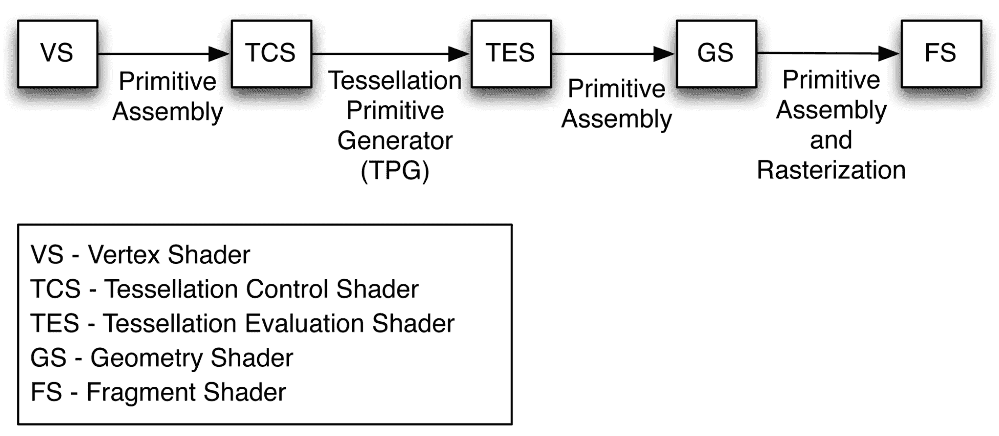

着色器管道的镶嵌部分包括两个阶段：**镶嵌控制着色器**（**TCS**）和**镶嵌评估着色器**（**TES**）。几何着色器位于镶嵌阶段之后，片段着色器之前。镶嵌着色器和几何着色器是可选的；然而，当着色器程序包含镶嵌或几何着色器时，必须包括顶点着色器。

除了顶点着色器之外的所有着色器都是可选的。当使用几何着色器时，没有要求你必须包括镶嵌着色器，反之亦然。

# 几何着色器

**几何着色器**（**GS**）设计为对每个原语执行一次。它能够访问原语的所有顶点，以及与每个顶点相关联的任何输入变量的值。换句话说，如果前一个阶段（如顶点着色器）提供了一个输出变量，几何着色器可以访问原语中所有顶点的该变量的值。因此，几何着色器内的输入变量始终是数组。

几何着色器可以输出零个、一个或多个原语。这些原语不必与几何着色器接收到的原语种类相同。

然而，GS 只能输出一种原语类型。例如，一个 GS 可以接收一个三角形，并输出多个线段作为线带，或者 GS 可以接收一个三角形，并输出零个或多个三角形作为三角形带。

这使得 GS 能够以许多不同的方式行动。GS 可能负责基于某些标准（如基于遮挡的可见性）裁剪（移除）几何形状。它可能生成额外的几何形状以增强正在渲染的对象的形状。GS 可以简单地计算有关原语的一些额外信息并将原语传递不变，或者 GS 可以生成与输入几何形状完全不同的原语。

GS 的功能集中在两个内置函数上：`EmitVertex` 和 `EndPrimitive`。这两个函数允许 GS 将多个顶点和原语发送到管道。GS 定义特定顶点的输出变量，然后调用`EmitVertex`。之后，GS 可以继续重新定义下一个顶点的输出变量，再次调用`EmitVertex`，依此类推。在发出原语的所有顶点后，GS 可以调用`EndPrimitive`来让 OpenGL 系统知道原语的所有顶点都已发出。当 GS 完成执行时，`EndPrimitive`函数会隐式调用。如果 GS 根本不调用`EmitVertex`，则输入原语实际上被丢弃（它不会被渲染）。

在以下食谱中，我们将检查几个几何着色器的示例。在*使用几何着色器的点精灵*食谱中，我们将看到一个输入原语类型与输出类型完全不同的例子。在*在着色网格上绘制线框*食谱中，我们将传递未改变的几何形状，但也会产生一些有关原语的信息，以帮助绘制线框线。在*使用几何着色器绘制轮廓线*食谱中，我们将看到一个 GS 传递输入原语，但同时也生成额外的原语。

# 纹理填充着色器

当纹理填充着色器处于活动状态时，我们只能渲染一种原语：补丁 (`GL_PATCHES`)。在纹理填充着色器活动时渲染任何其他类型的原语（如三角形或线条）是错误的。**补丁原语**是一个任意**块**的几何形状（或任何信息），它完全由程序员定义。它除了在 TCS 和 TES 中的解释之外，没有其他几何解释。补丁原语内的顶点数也是可配置的。每个补丁的最大顶点数取决于实现，可以通过以下命令查询：

```cpp
glGetIntegerv(GL_MAX_PATCH_VERTICES, &maxVerts);
```

我们可以使用以下函数定义每个补丁的顶点数：

```cpp
glPatchParameteri( GL_PATCH_VERTICES, numPatchVerts ); 
```

这种应用非常常见的情况是，当补丁原语由一组控制点组成，这些控制点定义了一个插值表面或曲线（如贝塞尔曲线或表面）。然而，没有理由说明补丁原语内的信息不能用于其他目的。

补丁原语实际上永远不会被渲染；相反，它被用作 TCS 和 TES 的附加信息。真正进入管道进一步处理的原语是由**镶嵌原语生成器**（**TPG**）创建的，它位于 TCS 和 TES 之间。将镶嵌原语生成器想象为一个可配置的引擎，它根据一组标准镶嵌算法生成原语。TCS 和 TES 可以访问整个输入补丁，但它们有根本不同的职责。TCS 负责：

+   设置 TPG

+   定义 TPG 如何生成原语（生成多少以及使用什么算法）

+   生成每个顶点的输出属性。

TES 负责确定由 TPG 生成的原语中每个顶点的位置（以及任何其他信息）。例如，TCS 可能会告诉 TPG 生成由 100 个线段组成的线段条，TES 负责确定这 100 个线段中每个顶点的位置。TES 可能会利用整个补丁原语中的信息来完成这项工作。

TCS 在每个补丁的每个顶点处执行一次，但可以访问其相关补丁的所有顶点。它可以计算有关补丁的附加信息，并通过输出变量将其传递给 TES。然而，TCS 最重要的任务是告诉 TPG 应该生成多少原语。它通过定义通过`gl_TessLevelInner`和`gl_TessLevelOuter`数组进行镶嵌级别的设置来完成此操作。这些数组定义了 TPG 生成的镶嵌的粒度。

TPG 根据特定的算法（四边形、等值线或三角形）生成原语。每种算法以略微不同的方式生成原语，我们将在本章的食谱中看到等值线和四边形的示例。生成的原语每个顶点都与参数空间中的一个位置（u, v, w）相关联。这个位置的这个坐标是一个可以从零到一的数字。这个坐标可以用来评估顶点的位置，通常是通过插值补丁原语顶点来完成。

原语生成算法以略微不同的方式生成顶点（以及相关的参数坐标）。四边形和等值线的镶嵌算法仅使用前两个参数坐标：*u*和*v*。以下图示说明了由四个顶点组成的输入和输出补丁的过程。在图中，TPG 使用四边形镶嵌算法，内嵌和外嵌镶嵌级别设置为四：

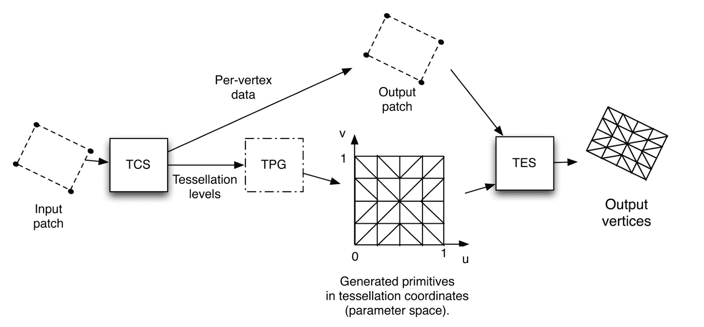

输入补丁中的顶点数不必与输出补丁中的顶点数相同，尽管在本章的所有示例中情况都是如此。

TES（镶嵌着色器）对于 TPG 生成的每个参数空间顶点执行一次。有些奇怪的是，TES 实际上是定义 TPG 使用的算法的着色器。它是通过其输入布局限定符来做到这一点的。如前所述，其主要责任是确定顶点的位置（可能还有其他信息，如法向量纹理坐标）。通常，TES 使用 TPG 提供的参数坐标（u,v）以及所有输入补丁顶点的位置来完成这一任务。例如，当绘制曲线时，补丁可能由四个顶点组成，这些顶点是曲线的控制点。然后 TPG 会生成 101 个顶点来创建一个线带（如果镶嵌级别设置为 100），每个顶点可能有一个在零和一之间适当范围的 *u* 坐标。然后 TES 将使用那个 *u* 坐标以及四个补丁顶点的位置来确定与着色器执行相关的顶点的位置。

如果这一切看起来很复杂，可以从 *曲线镶嵌* 菜单开始，然后逐步学习以下菜单。

在 *曲线镶嵌* 菜单中，我们将通过一个基本示例来了解如何使用镶嵌着色器绘制具有四个控制点的贝塞尔曲线。在 *2D 四边形镶嵌* 菜单中，我们将通过渲染一个简单的四边形并可视化由 TPG 产生的三角形来理解四边形镶嵌算法的工作原理。在 *3D 表面镶嵌* 菜单中，我们将使用四边形镶嵌来渲染 3D 贝塞尔表面。最后，在 *基于深度的镶嵌* 菜单中，我们将看到镶嵌着色器如何使实现**细节级别**（**LOD**）算法变得容易。

# 使用几何着色器的点精灵

**点精灵**是简单的四边形（通常是纹理映射的），它们被对齐，使得它们始终面向相机。它们在 3D（参考第九章，*在着色器中使用噪声*）或 2D 游戏中对粒子系统非常有用。点精灵由 OpenGL 应用程序指定为单点原语，通过`GL_POINTS`渲染模式。这简化了过程，因为四边形本身及其纹理坐标是自动确定的。应用程序的 OpenGL 端可以有效地将它们视为点原语，避免计算四边形顶点的位置。

以下图像显示了一组点精灵。每个精灵都被渲染为一个点原语。四边形和纹理坐标在几何着色器中自动生成并面向相机：

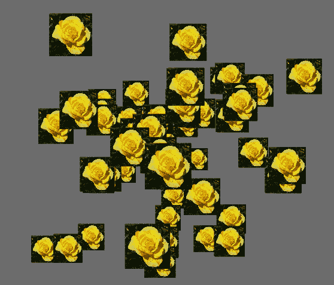

OpenGL 已经在其`GL_POINTS`渲染模式中内置了对点精灵的支持。当使用此模式渲染点原语时，点被渲染为屏幕空间正方形，其直径（边长）由`glPointSize`函数定义。此外，OpenGL 将为正方形的片段自动生成纹理坐标。这些坐标在每个方向（水平和垂直）上从零到一，可以通过片段着色器中的`gl_PointCoord`内置变量访问。

有多种方法可以微调 OpenGL 中点精灵的渲染。可以使用`glPointParameter`函数定义自动生成的纹理坐标的原点。同一组函数也可以用来调整 OpenGL 在启用多采样时定义点 alpha 值的方式。

内置的点精灵支持不允许程序员旋转屏幕空间正方形，或定义它们为不同的形状，例如矩形或三角形。然而，可以通过创造性地使用纹理和纹理坐标的变换来实现类似的效果。例如，我们可以使用旋转矩阵变换纹理坐标，以创建旋转物体的外观，尽管几何形状本身并没有实际旋转。此外，点精灵的大小是屏幕空间大小。换句话说，如果我们要获得透视效果（精灵随着距离的增加而变小），点的大小必须与点精灵的深度调整一致。

如果这些（以及可能的其他）问题使得默认的点精灵支持过于受限，我们可以使用几何着色器来生成我们的点精灵。实际上，这种技术是使用几何着色器生成不同于接收到的不同类型原语的一个很好的例子。这里的基本思想是，几何着色器将接收点原语（在相机坐标系中）并将输出一个以点为中心且面向相机的四边形。几何着色器还将自动为四边形生成纹理坐标。

如果需要，我们可以生成其他形状，例如六边形，或者我们可以在它们从几何着色器输出之前旋转四边形。可能性是无限的。

在直接进入代码之前，让我们先看看一些数学知识。在几何着色器中，我们需要生成一个以点为中心且与相机坐标系（眼睛坐标系）对齐的四边形的顶点。

给定相机坐标系中的点位置（**P**），我们可以通过简单地沿与相机坐标系 x-y 平面平行的平面平移**P**来生成四边形的顶点，如图所示：

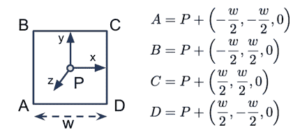

几何着色器将接收点位置（相机坐标），并以带有纹理坐标的三角形带形式输出四边形。然后片段着色器将仅将纹理应用到四边形上。

# 准备工作

对于这个例子，我们需要渲染多个点原语。位置可以通过属性位置`0`发送。对于这个例子，不需要提供法线向量或纹理坐标。

在着色器中定义了以下统一变量，并在 OpenGL 程序中需要设置：

+   `Size2`：这应该是精灵正方形宽度的一半

+   `SpriteTex`：这是包含点精灵纹理的纹理单元

如同往常，标准变换矩阵的统一变量也在着色器中定义，并在 OpenGL 程序中需要设置。

# 如何实现...

要创建一个可以用来将点原语渲染为四边形的着色器程序，请按照以下步骤操作：

1.  顶点着色器将位置转换为相机坐标并分配给输出变量`gl_Position`。请注意，我们还没有将其转换为裁剪坐标：

```cpp
layout (location = 0) in vec3 VertexPosition;
uniform mat4 ModelViewMatrix;

void main(){
    gl_Position = ModelViewMatrix * vec4(VertexPosition,1.0);
}
```

1.  几何着色器以三角形带的形式发出两个三角形。我们使用`gl_in`变量从顶点着色器（相机坐标）访问位置：

```cpp
layout( points ) in; 
layout( triangle_strip, max_vertices = 4 ) out; 

uniform float Size2;   // Half the width of the quad 

uniform mat4 ProjectionMatrix; 

out vec2 TexCoord; 

void main() {
    mat4 m = ProjectionMatrix;  // Reassign for brevity 

    gl_Position = m * (vec4(-Size2,-Size2,0.0,0.0) +  
                       gl_in[0].gl_Position); 
    TexCoord = vec2(0.0,0.0); 
    EmitVertex(); 

    gl_Position = m * (vec4(Size2,-Size2,0.0,0.0) +  
                       gl_in[0].gl_Position); 
    TexCoord = vec2(1.0,0.0); 
    EmitVertex(); 

    gl_Position = m * (vec4(-Size2,Size2,0.0,0.0) +  
                       gl_in[0].gl_Position); 
    TexCoord = vec2(0.0,1.0); 
    EmitVertex(); 

    gl_Position = m * (vec4(Size2,Size2,0.0,0.0) +  
                       gl_in[0].gl_Position); 
    TexCoord = vec2(1.0,1.0); 
    EmitVertex(); 

    EndPrimitive(); 
} 
```

1.  片段着色器应用纹理：

```cpp
in vec2 TexCoord;  // From the geometry shader 

uniform sampler2D SpriteTex; 

layout( location = 0 ) out vec4 FragColor; 

void main() {
    FragColor = texture(SpriteTex, TexCoord); 
} 
```

1.  在 OpenGL 渲染函数中，渲染一组点原语。

# 它是如何工作的...

顶点着色器几乎是最简单的。它通过乘以模型视图矩阵将点的位置转换为相机坐标，并将结果分配给内置输出变量`gl_Position`。

在几何着色器中，我们首先定义这个几何着色器期望接收的原语类型。第一个布局语句指示这个几何着色器将接收点原语：

```cpp
layout( points ) in; 
```

下一个布局语句指示了由这个几何着色器产生的原语类型，以及将输出的最大顶点数：

```cpp
layout( triangle_strip, max_vertices = 4 ) out; 
```

在这种情况下，我们希望为每个接收到的点生成一个四边形，因此我们指出输出将是一个最多包含四个顶点的三角形带。

输入原语通过内置输入变量`gl_in`可用给几何着色器。请注意，它是一个结构体的数组。你可能想知道为什么这是一个数组，因为点原语仅由一个位置定义。

嗯，一般来说，几何着色器可以接收三角形、线或点（以及可能的相邻信息）。因此，可用的值数量可能不止一个。如果输入是三角形，几何着色器将能够访问三个输入值（与每个顶点相关联）。实际上，当使用`triangles_adjacency`时，它可以访问多达六个值（关于这一点将在后面的菜谱中详细介绍）。

`gl_in`变量是一个结构体数组。每个结构体包含以下字段：`gl_Position`、`gl_PointSize`和`gl_ClipDistance[]`。在这个例子中，我们只对`gl_Position`感兴趣。然而，其他字段可以在顶点着色器中设置，以向几何着色器提供额外信息。

在几何着色器的`main`函数中，我们以下这种方式生成四边形（作为一个三角形带）。对于三角形带的每个顶点，我们执行以下步骤：

1.  计算顶点的属性（在这种情况下是位置和纹理坐标），并将它们的值分配给适当的输出变量（`gl_Position`和`TexCoord`）。请注意，位置也由投影矩阵变换。我们这样做是因为`gl_Position`变量必须以裁剪坐标的形式提供给管道的后续阶段。

1.  通过调用内置的`EmitVertex()`函数来发射顶点（将其发送到管道）。

一旦我们为输出原语发射了所有顶点，我们就调用`EndPrimitive()`来最终化原语并将其发送出去。

在这种情况下，严格来说没有必要调用`EndPrimitive()`，因为当几何着色器完成后会隐式调用它。然而，就像关闭文件一样，这是一个好的实践。

片段着色器也非常简单。它只是使用几何着色器提供的（插值）纹理坐标将纹理应用到片段上。

# 还有更多...

这个例子相当直接，旨在作为几何着色器的一个温和的介绍。我们可以通过允许四边形旋转或以不同的方向定位来扩展这个例子。我们还可以使用纹理在片段着色器中丢弃片段，以创建任意形状的点精灵。几何着色器的力量为提供了大量的可能性！

# 参见

+   示例代码中的`chapter07/scenepointsprite.cpp`文件

# 在着色网格上绘制线框

之前的方法展示了如何使用几何着色器产生与接收到的原语不同的原语种类。几何着色器也可以用来向后续阶段提供额外信息。它们非常适合这样做，因为它们可以一次性访问原语的所有顶点，并且可以根据整个原语而不是单个顶点进行计算。

这个例子涉及一个不修改三角形的几何着色器。它基本上以不变的方式传递原语。然而，它计算了三角形的一些额外信息，这些信息将被片段着色器用来突出显示多边形的边缘。这里的基想法是直接在着色网格上绘制每个多边形的边缘。

以下图像展示了这种技术的示例。通过在几何着色器内部计算的信息，网格边在着色表面之上被绘制出来：

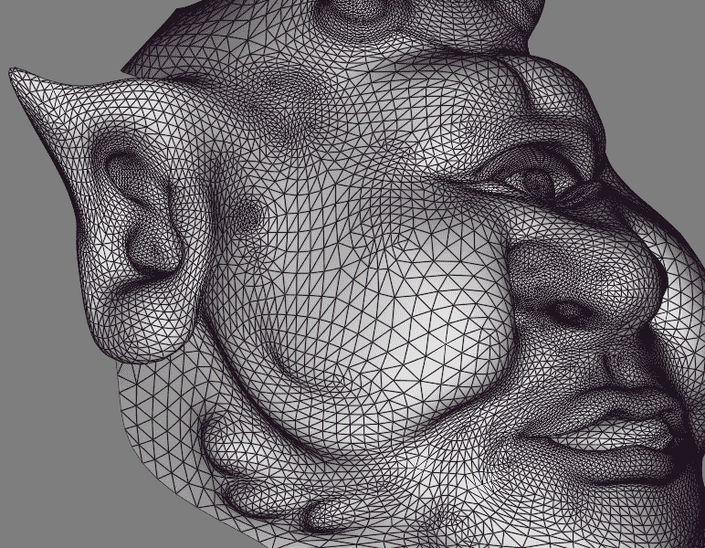

在阴影表面之上生成线框结构有许多技术。这项技术源自于 2007 年 NVIDIA 发布的一篇白皮书。我们利用几何着色器在一次遍历中生成线框和阴影表面。我们还对生成的网格线提供了一些简单的抗锯齿处理，效果相当不错（参考前面的图像）。

要在阴影网格上渲染线框，我们将计算每个片段到最近三角形边缘的距离。当片段距离边缘一定距离内时，它将被着色并与边缘颜色混合。否则，片段将正常着色。

要计算片段到边缘的距离，我们使用以下技术。在几何着色器中，我们计算每个顶点到对边（也称为 **三角形高度**）的最小距离。在以下图中，所需的距离是 **ha**、**hb** 和 **hc**：

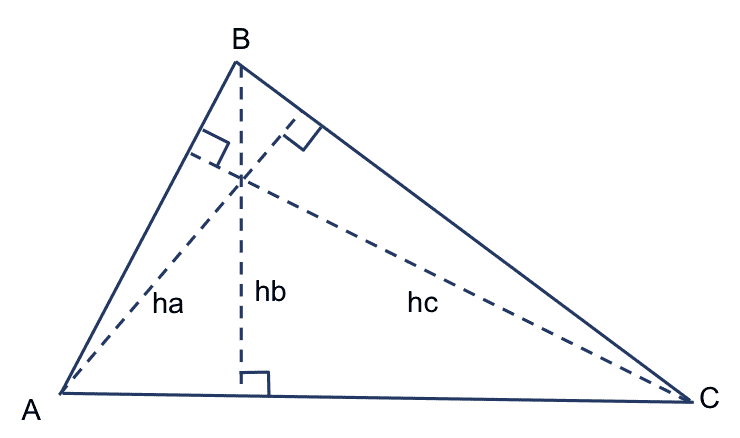

我们可以使用三角形的内角来计算这些高度，这些内角可以通过余弦定理确定。例如，要找到 **ha**，我们使用顶点 **C** 处的内角（**β**）：


其他高度可以以类似的方式计算。（注意，**β** 可能大于 90 度，在这种情况下，我们希望得到 180-**β**的正弦值。然而，180-**β**的正弦值与**β**的正弦值相同。）一旦我们计算了这些三角形高度，我们就可以在几何着色器中创建一个输出向量（一个 *边距* 向量）以在三角形上插值。这个向量的分量代表从片段到三角形每个边缘的距离。

*x* 分量表示从边缘 **a** 的距离，*y* 分量是距离边缘 **b** 的距离，而 *z* 分量是距离边缘 **c** 的距离。如果我们在这三个顶点处为这些分量分配正确的值，硬件将自动为我们插值它们，以在每个片段处提供适当的距离。在顶点 **A** 处，这个向量的值应该是（**ha**，0，0），因为顶点 **A** 距离边缘 **a** 为 **ha**，并且直接位于边缘 **b** 和 **c** 上。同样，顶点 **B** 的值是（0，**hb**，0），顶点 **C** 的值是（0，0，**hc**）。当这三个值在三角形上插值时，我们应该得到从片段到三个边缘的距离。我们将在屏幕空间中计算所有这些。也就是说，在计算高度之前，我们将在几何着色器中将顶点转换到屏幕空间。

由于我们在屏幕空间中工作，没有必要（并且这是不正确的）以透视正确的方式插值值。因此，我们需要小心地告诉硬件以线性方式插值。在片段着色器中，我们只需要找到三个距离中的最小值，如果这个距离小于线宽，我们就将片段颜色与线条颜色混合。然而，我们还想在这个过程中应用一点抗锯齿。为此，我们将使用 GLSL 的`smoothstep`函数来淡出线条的边缘。我们将在线条边缘的两像素范围内缩放线条的强度。距离真实边缘一像素或更近的像素将获得 100%的线条颜色，而距离边缘一像素或更远的像素将获得 0%的线条颜色。在两者之间，我们将使用`smoothstep`函数创建平滑过渡。当然，线条的边缘本身是一个可配置的距离（我们将称之为`Line.Width`），从多边形的边缘开始。

# 准备工作

对于此示例，需要典型的设置。顶点位置和法线应分别提供在属性零和一，你需要为你的着色模型提供适当的参数。像往常一样，标准矩阵被定义为统一变量，应在 OpenGL 应用程序中设置。然而，请注意，这次我们还需要视口矩阵（`ViewportMatrix`统一变量）以便将其转换为屏幕空间。有一些与网格线相关的统一变量需要设置：

+   `Line.Width`: 这应该是网格线的宽度的一半

+   `Line.Color`: 这是网格线的颜色

# 如何操作...

要创建一个利用几何着色器在着色表面之上生成线框的着色器程序，请按照以下步骤操作：

1.  使用以下代码作为顶点着色器：

```cpp
layout (location = 0 ) in vec3 VertexPosition; 
layout (location = 1 ) in vec3 VertexNormal; 

out vec3 VNormal; 
out vec3 VPosition; 

uniform mat4 ModelViewMatrix; 
uniform mat3 NormalMatrix; 
uniform mat4 ProjectionMatrix; 
uniform mat4 MVP; 

void main() {
    VNormal = normalize( NormalMatrix * VertexNormal); 
    VPosition = vec3(ModelViewMatrix *  
                     vec4(VertexPosition,1.0)); 
    gl_Position = MVP * vec4(VertexPosition,1.0); 
} 
```

1.  使用以下代码作为几何着色器：

```cpp
layout( triangles ) in; 
layout( triangle_strip, max_vertices = 3 ) out; 

out vec3 GNormal; 
out vec3 GPosition; 
noperspective out vec3 GEdgeDistance; 

in vec3 VNormal[]; 
in vec3 VPosition[]; 

uniform mat4 ViewportMatrix;  // Viewport matrix 

void main() {
    // Transform each vertex into viewport space 
    vec3 p0 = vec3(ViewportMatrix * (gl_in[0].gl_Position /  
                             gl_in[0].gl_Position.w)); 
    vec3 p1 = vec3(ViewportMatrix * (gl_in[1].gl_Position /  
                             gl_in[1].gl_Position.w)); 
    vec3 p2 = vec3(ViewportMatrix * (gl_in[2].gl_Position /  
                            gl_in[2].gl_Position.w)); 

    // Find the altitudes (ha, hb and hc) 
    float a = length(p1 - p2); 
    float b = length(p2 - p0); 
    float c = length(p1 - p0); 
    float alpha = acos( (b*b + c*c - a*a) / (2.0*b*c) ); 
    float beta = acos( (a*a + c*c - b*b) / (2.0*a*c) ); 
    float ha = abs( c * sin( beta ) ); 
    float hb = abs( c * sin( alpha ) ); 
    float hc = abs( b * sin( alpha ) ); 

    // Send the triangle along with the edge distances 
    GEdgeDistance = vec3( ha, 0, 0 ); 
    GNormal = VNormal[0]; 
    GPosition = VPosition[0]; 
    gl_Position = gl_in[0].gl_Position; 
    EmitVertex(); 

    GEdgeDistance = vec3( 0, hb, 0 ); 
    GNormal = VNormal[1]; 
    GPosition = VPosition[1]; 
    gl_Position = gl_in[1].gl_Position; 
    EmitVertex(); 

    GEdgeDistance = vec3( 0, 0, hc ); 
    GNormal = VNormal[2]; 
    GPosition = VPosition[2]; 
    gl_Position = gl_in[2].gl_Position; 
    EmitVertex(); 

    EndPrimitive(); 
} 
```

1.  使用以下代码作为片段着色器：

```cpp
// *** Insert appropriate uniforms for the Blinn-Phong model *** 

// The mesh line settings 
uniform struct LineInfo { 
  float Width; 
  vec4 Color; 
} Line; 

in vec3 GPosition; 
in vec3 GNormal; 
noperspective in vec3 GEdgeDistance; 

layout( location = 0 ) out vec4 FragColor; 
vec3 blinnPhong( vec3 pos, vec3 norm ) {
   // ...
}

void main() { 
    // The shaded surface color. 
    vec4 color=vec4(blinnPhong(GPosition, GNormal), 1.0); 

    // Find the smallest distance 
    float d = min( GEdgeDistance.x, GEdgeDistance.y ); 
    d = min( d, GEdgeDistance.z ); 

    // Determine the mix factor with the line color 
    float mixVal = smoothstep( Line.Width - 1, 
                               Line.Width + 1, d ); 

    // Mix the surface color with the line color 
    FragColor = mix( Line.Color, color, mixVal ); 
} 
```

# 它是如何工作的...

顶点着色器相当简单。它将法线和位置转换为相机坐标后，传递给几何着色器。内置的`gl_Position`变量获取剪辑坐标中的位置。我们将在几何着色器中使用这个值来确定屏幕空间坐标。在几何着色器中，我们首先定义此着色器的输入和输出原语类型：

```cpp
layout( triangles ) in; 
layout( triangle_strip, max_vertices = 3 ) out; 
```

我们实际上并没有改变三角形的几何形状，因此输入和输出类型基本上是相同的。我们将输出与输入接收到的完全相同的三角形。几何着色器的输出变量是`GNormal`、`GPosition`和`GEdgeDistance`。前两个只是通过不变传递的正常值和位置值。第三个是存储到三角形每条边的距离的向量（如前所述）。注意，它使用`noperspective`修饰符定义：

```cpp
noperspective out vec3 GEdgeDistance;
```

`noperspective`修饰符表示这些值将进行线性插值，而不是默认的透视正确插值。如前所述，这些距离是在屏幕空间中，因此以非线性方式插值是不正确的。在`main`函数中，我们首先通过乘以视口矩阵将三角形的三个顶点的位置从裁剪坐标转换为屏幕空间坐标。（注意，由于裁剪坐标是齐次的，可能需要除以*w*坐标，以便将其转换回真正的笛卡尔坐标。）

接下来，我们使用余弦定理计算三个高度——`ha`、`hb`和`hc`。一旦我们得到了这三个高度，我们就为第一个顶点适当地设置`GEdgeDistance`，保持`GNormal`、`GPosition`和`gl_Position`不变，并通过调用`EmitVertex()`来发射第一个顶点。这完成了顶点的处理，并发射了顶点位置以及所有每个顶点的输出变量。然后我们以类似的方式处理三角形的另外两个顶点，通过调用`EndPrimitive()`来完成多边形的处理。在片段着色器中，我们首先评估基本的着色模型，并将结果颜色存储在`color`中。在这个管道阶段，`GEdgeDistance`变量的三个分量应该包含从该片段到三角形三个边的距离。我们感兴趣的是最小距离，因此我们找到这三个分量的最小值，并将其存储在`d`变量中。然后使用`smoothstep`函数来确定混合线颜色与着色颜色的比例（`mixVal`）：

```cpp
float mixVal = smoothstep( Line.Width - 1, 
                           Line.Width + 1, d ); 
```

如果距离小于`Line.Width - 1`，则`smoothstep`将返回`0`的值，如果大于`Line.Width + 1`，则返回`1`。对于`d`值在两者之间的情况，我们将得到平滑的过渡。这给我们一个当在内部时为`0`的值，当在外部时为`1`的值，并且在边缘周围的两个像素区域内，我们将得到 0 到 1 之间的平滑变化。因此，我们可以使用这个结果直接与线颜色混合。最后，通过使用`mixVal`作为插值参数，通过混合着色颜色与线颜色来确定片段颜色。

# 还有更多...

这种技术产生的结果非常漂亮，并且相对较少的缺点。然而，它确实有一些与屏幕空间中大的三角形（延伸到视图体积之外）相关的问题。如果*w*坐标很小或为零，视口空间中的位置可以接近无穷大，产生一些难看的伪影。这发生在顶点在或接近相机空间的*x*-*y*平面时。

然而，这是一个很好的例子，说明了几何着色器可以用于除了修改实际几何以外的任务。在这种情况下，我们只是使用几何着色器来计算在管道中发送原始数据时的额外信息。这个着色器可以插入并应用于任何网格，而无需对应用程序的 OpenGL 部分进行任何修改。它在调试网格问题或实现网格建模程序时非常有用。实现此效果的其他常见技术通常涉及通过应用多边形偏移（通过`glPolygonOffset`函数）以避免**z-fighting**，在轮廓线和下面的着色表面之间发生。这种技术并不总是有效的，因为修改后的深度值可能并不总是正确，或者如期望的那样，并且可能很难找到多边形偏移值的最佳点。有关技术的良好概述，请参阅 T Akenine-Moller、E Haines 和 N Hoffman 所著的《实时渲染》第三版中的*第 11.4.2 节*。

# 参见...

+   示例代码中的`chapter07/sceneshadewire.cpp`文件。

+   这种技术最初发表在 2007 年 NVIDIA 的一份白皮书中（*Solid Wireframe*，*NVIDIA Whitepaper WP-03014-001_v01*，可在[developer.nvidia.com](http://developer.nvidia.com)找到）。该白皮书被列为 Direct3D 的示例，但当然，我们在这里提供的是 OpenGL 的实现。

+   在*第八章*中，*阴影*的*使用阴影体积和几何着色器创建阴影*菜谱[43239816-a842-483f-9eca-284f919d0bd6.xhtml]。

# 使用几何着色器绘制轮廓线

当需要卡通或手绘效果时，我们通常想在模型的边缘以及脊或褶皱（轮廓线）周围绘制黑色轮廓。在这个菜谱中，我们将讨论一种使用几何着色器来实现这一点的技术，以生成轮廓线的额外几何形状。几何着色器将通过生成与构成对象轮廓的边缘对齐的小而瘦的四边形来近似这些线条。以下图像显示了由几何着色器生成的黑色轮廓线的 ogre 网格。

这些线由与某些网格边缘对齐的小四边形组成：

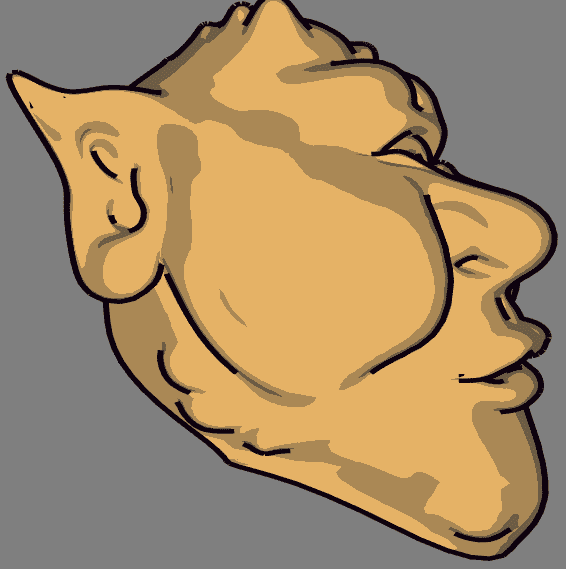

本食谱中展示的技术基于 Philip Rideout 在博客文章中发布的技术：[prideout.net/blog/?p=54](http://prideout.net/blog/?p=54)。他的实现使用两个遍历（基础几何和轮廓），并包括许多优化，如抗锯齿和自定义深度测试（使用 g 缓冲区）。为了保持简单，因为我们的主要目标是展示几何着色器的功能，我们将使用单遍历实现该技术，不使用抗锯齿或自定义深度测试。如果您有兴趣添加这些附加功能，请参阅 Philip 出色的博客文章。几何着色器最重要的特性之一是它允许我们提供除正在渲染的基本形状之外的其他顶点信息。当 OpenGL 中引入几何着色器时，还引入了几个额外的原始形状渲染模式。这些**相邻模式**允许将额外的顶点数据与每个原始形状关联。通常，这些附加信息与网格中附近的原始形状相关，但这不是必需的（如果需要，我们可以实际上将附加信息用于其他目的）。以下列表包括相邻模式及其简要描述：

+   `GL_LINES_ADJACENCY`：此模式定义了带有相邻顶点的线条（每条线段四个顶点）

+   `GL_LINE_STRIP_ADJACENCY`：此模式定义了一个带有相邻顶点的线带（对于*n*条线，提供了*n+3*个顶点）

+   `GL_TRIANGLES_ADJACENCY`：此模式定义了三角形以及相邻三角形的顶点（每个基本形状六个顶点）

+   `GL_TRIANGLE_STRIP_ADJACENCY`：此模式定义了一个三角形带以及相邻三角形的顶点（对于*n*个三角形，提供了*2(n+2)*个顶点）

关于这些模式的详细信息，请查看官方 OpenGL 文档。在本食谱中，我们将使用`GL_TRIANGLES_ADJACENCY`模式来提供关于我们的网格中相邻三角形的详细信息。使用此模式，我们为每个基本形状提供六个顶点。以下图示说明了这些顶点的位置：

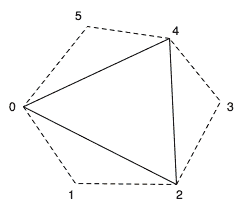

在前面的图中，实线代表三角形本身，虚线代表相邻的三角形。第一个、第三个和第五个顶点（**0**、**2**和**4**）构成了三角形本身。第二个、第四个和第六个是构成相邻三角形的顶点。

网格数据通常不以这种形式提供，因此我们需要预处理我们的网格以包含额外的顶点信息。通常，这仅意味着将元素索引数组扩展两倍。位置、法线和纹理坐标数组可以保持不变。

当一个网格带有相邻信息渲染时，几何着色器可以访问与特定三角形相关联的所有六个顶点。然后我们可以使用相邻三角形来确定三角形边是否是物体轮廓的一部分。基本假设是，如果一个三角形面向前方且相应的相邻三角形不面向前方，则边是轮廓边缘。

我们可以在几何着色器中通过计算三角形法向量（使用叉积）来确定三角形是否面向前方。如果我们正在眼坐标（或裁剪坐标）内工作，法向量的*Z*坐标对于面向前方的三角形将是正的。因此，我们只需要计算法向量的*Z*坐标，这应该可以节省几个周期。对于一个顶点为*A*、*B*和*C*的三角形，法向量的*Z*坐标由以下方程给出：

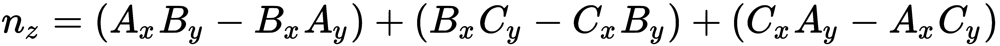

一旦我们确定哪些是轮廓边缘，几何着色器将生成与轮廓边缘对齐的额外瘦四边形。这些四边形合在一起将构成所需的暗线（参考前面的图）。在生成所有轮廓四边形后，几何着色器将输出原始三角形。

为了在单次遍历中渲染网格，并对基础网格进行适当的着色，而对轮廓线不进行着色，我们将使用一个额外的输出变量。这个变量将让片段着色器知道我们是在渲染基础网格还是在渲染轮廓边缘。

# 准备工作

设置你的网格数据，以便包含相邻信息。正如刚才提到的，这可能需要扩展元素索引数组以包含附加信息。这可以通过遍历你的网格并寻找共享边缘来实现。由于空间限制，我们不会在这里详细介绍，但之前提到的博客文章中提供了一些关于如何实现这一点的信息。此外，本例的源代码包含了一种简单（尽管效率不高）的技术。本例中重要的统一变量如下：

+   `EdgeWidth`：这是轮廓边缘在裁剪（归一化设备）坐标中的宽度

+   `PctExtend`：这是扩展四边形超出边缘的百分比

+   `LineColor`：这是轮廓边缘线的颜色

如同往常，还有适当的着色模型统一变量和标准矩阵。

# 如何做到这一点...

要创建一个利用几何着色器渲染轮廓边缘的着色器程序，请按照以下步骤操作：

1.  使用以下代码进行顶点着色器：

```cpp
layout (location = 0 ) in vec3 VertexPosition; 
layout (location = 1 ) in vec3 VertexNormal; 

out vec3 VNormal; 
out vec3 VPosition; 

uniform mat4 ModelViewMatrix; 
uniform mat3 NormalMatrix; 
uniform mat4 ProjectionMatrix; 
uniform mat4 MVP; 
void main() {
    VNormal = normalize( NormalMatrix * VertexNormal); 
    VPosition = vec3(ModelViewMatrix *  
                     vec4(VertexPosition,1.0)); 
    gl_Position = MVP * vec4(VertexPosition,1.0); 
} 
```

1.  使用以下代码进行几何着色器：

```cpp
layout( triangles_adjacency ) in; 
layout( triangle_strip, max_vertices = 15 ) out; 

out vec3 GNormal; 
out vec3 GPosition; 

// Which output primitives are silhouette edges 
flat out bool GIsEdge; 

in vec3 VNormal[];   // Normal in camera coords. 
in vec3 VPosition[]; // Position in camera coords. 

uniform float EdgeWidth;  // Width of sil. edge in clip cds. 
uniform float PctExtend;  // Percentage to extend quad 

bool isFrontFacing( vec3 a, vec3 b, vec3 c ) {
    return ((a.x * b.y - b.x * a.y) +  
            (b.x * c.y - c.x * b.y) + 
            (c.x * a.y - a.x * c.y)) > 0; 
} 
void emitEdgeQuad( vec3 e0, vec3 e1 ) {
    vec2 ext = PctExtend * (e1.xy - e0.xy); 
    vec2 v = normalize(e1.xy - e0.xy); 
    vec2 n = vec2(-v.y, v.x) * EdgeWidth; 

    // Emit the quad 
    GIsEdge = true;   // This is part of the sil. edge 

    gl_Position = vec4( e0.xy - ext, e0.z, 1.0 );  
    EmitVertex(); 
    gl_Position = vec4( e0.xy - n - ext, e0.z, 1.0 );  
    EmitVertex(); 
    gl_Position = vec4( e1.xy + ext, e1.z, 1.0 );  
    EmitVertex(); 
    gl_Position = vec4( e1.xy - n + ext, e1.z, 1.0 ); 
    EmitVertex(); 

    EndPrimitive(); 
} 

void main() {
    vec3 p0 = gl_in[0].gl_Position.xyz /  
              gl_in[0].gl_Position.w; 
    vec3 p1 = gl_in[1].gl_Position.xyz /  
              gl_in[1].gl_Position.w; 
    vec3 p2 = gl_in[2].gl_Position.xyz /  
              gl_in[2].gl_Position.w; 
    vec3 p3 = gl_in[3].gl_Position.xyz /  
              gl_in[3].gl_Position.w; 
    vec3 p4 = gl_in[4].gl_Position.xyz /  
              gl_in[4].gl_Position.w; 
    vec3 p5 = gl_in[5].gl_Position.xyz /  
              gl_in[5].gl_Position.w; 

    if( isFrontFacing(p0, p2, p4) ) { 
        if( ! isFrontFacing(p0,p1,p2) )  
                    emitEdgeQuad(p0,p2); 
        if( ! isFrontFacing(p2,p3,p4) )  
                    emitEdgeQuad(p2,p4); 
        if( ! isFrontFacing(p4,p5,p0) )  
                    emitEdgeQuad(p4,p0); 
    } 

    // Output the original triangle 
    GIsEdge = false; // Triangle is not part of an edge. 

    GNormal = VNormal[0]; 
    GPosition = VPosition[0]; 
    gl_Position = gl_in[0].gl_Position; 
    EmitVertex(); 
    GNormal = VNormal[2]; 
    GPosition = VPosition[2]; 
    gl_Position = gl_in[2].gl_Position; 
    EmitVertex();
    GNormal = VNormal[4]; 
    GPosition = VPosition[4]; 
    gl_Position = gl_in[4].gl_Position; 
    EmitVertex(); 

    EndPrimitive(); 
}
```

1.  使用以下代码进行片段着色器：

```cpp
//*** Light and material uniforms... **** 

uniform vec4 LineColor;  // The sil. edge color 

in vec3 GPosition;  // Position in camera coords 
in vec3 GNormal;    // Normal in camera coords. 

flat in bool GIsEdge; // Whether or not we're drawing an edge 

layout( location = 0 ) out vec4 FragColor; 

vec3 toonShade( ) {
   // *** toon shading algorithm from Chapter 4 *** 
} 

void main() {
    // If we're drawing an edge, use constant color,  
    // otherwise, shade the poly. 
    if( GIsEdge ) { 
        FragColor = LineColor; 
    } else { 
        FragColor = vec4( toonShade(), 1.0 ); 
    }
} 
```

# 它是如何工作的...

顶点着色器是一个简单的 *passthrough* 着色器。它将顶点位置和法线转换为相机坐标，并通过 `VPosition` 和 `VNormal` 将它们发送出去。这些将在片段着色器中进行着色，并将由几何着色器传递（或忽略）。位置也通过模型视图投影矩阵转换成裁剪坐标（或归一化设备坐标），然后分配给内置的 `gl_Position`。

几何着色器首先使用布局指令定义输入和输出原语类型：

```cpp
layout( triangles_adjacency ) in; 
layout( triangle_strip, max_vertices = 15 ) out;
```

这表示输入原语类型是具有相邻信息的三角形，输出类型是三角形带。此几何着色器将生成一个三角形（原始三角形）和最多一个与每条边对应的四边形。这对应于最多可以生成的 15 个顶点，我们在输出布局指令中指示了最大值。

`GIsEdge` 输出变量用于指示片段着色器该多边形是否为边四边形。片段着色器将使用此值来确定是否着色该多边形。无需插值此值，因为它是一个布尔值，插值并不完全有意义，所以我们使用 `flat` 限定符。

`main` 函数中的前几行取六个顶点（在裁剪坐标中）的位置，并将其除以第四个坐标，以便将其从齐次表示转换为真正的笛卡尔值。如果我们使用透视投影，这是必要的，但对于正交投影则不是必要的。

接下来，我们确定由点 `0`、`2` 和 `4` 定义的三角形是否为正面三角形。`isFrontFacing` 函数返回由其三个参数定义的三角形是否为正面三角形，使用之前描述的方程。如果主三角形是正面三角形，则只有在相邻三角形不是正面三角形时，我们才会发出轮廓边四边形。

`emitEdgeQuad` 函数生成一个与由 `e0` 和 `e1` 点定义的边对齐的四边形。它首先计算 `ext`，这是从 `e0` 到 `e1` 的向量，并按 `PctExtend` 缩放（为了稍微延长边四边形）。我们延长边四边形是为了覆盖四边形之间可能出现的间隙（我们将在 *还有更多...* 中进一步讨论）。

注意，我们在这里省略了 *z* 坐标。因为点是在裁剪坐标中定义的，我们打算生成一个与 x-y 平面（面向相机）对齐的四边形，所以我们想通过在 x-y 平面内平移来计算顶点的位置。因此，我们现在可以忽略 *z* 坐标。我们将在每个顶点的最终位置中使用其值不变。

接下来，变量 `v` 被赋值为从 `e0` 到 `e1` 的归一化向量。变量 `n` 获得一个垂直于 `v` 的向量（在二维中，这可以通过交换 *x* 和 *y* 坐标并取新 *x* 坐标的相反数来实现）。这只是在二维中的逆时针 90 度旋转。我们通过 `EdgeWidth` 缩放 `n` 向量，因为我们希望向量的长度与四边形的宽度相同。`ext` 和 `n` 向量将用于确定四边形的顶点，如下面的图所示：

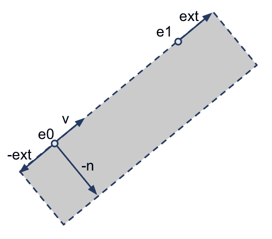

四边形的四个角由 **e0 - ext**、**e0 - n - ext**、**e1 + ext** 和 **e1 - n + ext** 给出。下两个顶点的 *z* 坐标与 **e0** 的 *z* 坐标相同，上两个顶点的 *z* 坐标与 **e1** 的 *z* 坐标相同。

然后我们通过将 `GIsEdge` 设置为 `true` 来完成 `emitEdgeQuad` 函数，以便让片段着色器知道我们正在渲染轮廓边缘，然后发出四边形的四个顶点。函数通过调用 `EndPrimitive` 来终止四边形三角形带的处理。

在 `main` 函数中，在生成轮廓边缘之后，我们继续发出原始三角形，保持不变。顶点 `0`、`2` 和 `4` 的 `VNormal`、`VPosition` 和 `gl_Position` 传递给片段着色器时没有任何修改。每个顶点通过调用 `EmitVertex` 发出，并通过 `EndPrimitive` 完成原语。

在片段着色器中，我们要么着色片段（使用卡通着色算法），要么简单地给片段一个恒定颜色。`GIsEdge` 输入变量将指示选择哪个选项。如果 `GIsEdge` 是 `true`，那么我们正在渲染轮廓边缘，因此片段被赋予线条颜色。否则，我们正在渲染网格多边形，因此我们使用第四章中描述的卡通着色技术来着色片段，即 *光照和着色*。

# 还有更多...

前述技术的一个问题是，由于连续边缘四边形之间的间隙，可能会出现 **羽化** 现象：

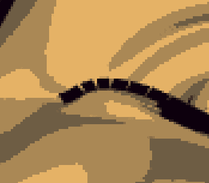

前面的图显示了轮廓边缘的羽化。多边形之间的间隙可以用三角形填充，但在我们的例子中，我们只是简单地扩展每个四边形的长度来填充间隙。当然，如果四边形扩展得太远，这可能会引起伪影，但在实践中，我的经验是它们并没有非常分散注意力。

第二个问题与深度测试有关。如果一个边缘多边形扩展到网格的另一个区域，它可能会因为深度测试而被裁剪。以下是一个例子：

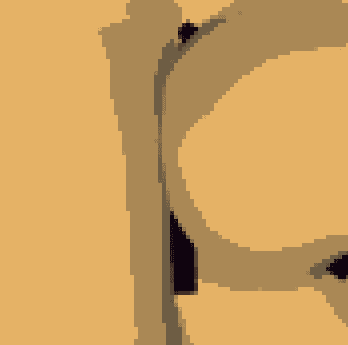

边缘多边形应垂直延伸到前一个图像的中间，但由于它位于附近的网格部分之后而被裁剪。可以通过在渲染轮廓边缘时使用自定义深度测试来解决此问题。有关此技术的详细信息，请参阅前面提到的 Philip Rideout 的博客文章。在渲染边缘时关闭深度测试也可能可行，但要小心不要渲染模型另一侧的任何边缘。

# 参见

+   示例代码中的`chapter07/scenesilhouette.cpp`文件

+   关于使用几何着色器进行毛皮和鳍的白皮书：[`developer.download.nvidia.com/whitepapers/2007/SDK10/FurShellsAndFins.pdf`](http://developer.download.nvidia.com/whitepapers/2007/SDK10/FurShellsAndFins.pdf)

+   在第八章中创建阴影体积和几何着色器阴影的配方，*阴影*，第八章

+   在第四章中创建卡通阴影效果的配方，*光照与阴影*，第四章

# 曲线镶嵌

在本配方中，我们将通过绘制**立方贝塞尔曲线**来查看镶嵌着色器的基础。贝塞尔曲线是由四个控制点定义的参数曲线。控制点定义了曲线的整体形状。四个点中的第一个和最后一个定义了曲线的开始和结束，中间的点引导曲线的形状，但不必直接位于曲线本身上。曲线是通过使用一组**混合函数**插值四个控制点来定义的。混合函数定义了每个控制点对曲线给定位置的贡献程度。对于贝塞尔曲线，混合函数被称为**伯恩斯坦多项式**：

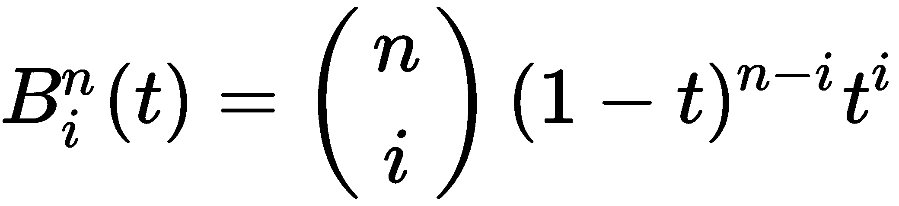

在前一个方程中，第一项是二项式系数函数（如下所示），**n** 是多项式的次数，**i** 是多项式的编号，**t** 是参数参数：

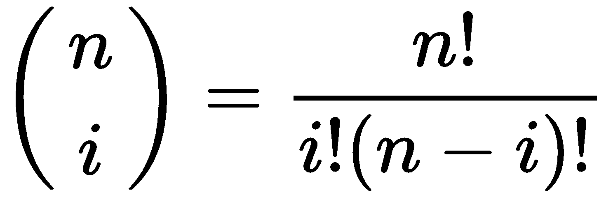

贝塞尔曲线的一般参数形式是伯恩斯坦多项式与控制点（**P[i]**）的乘积之和：

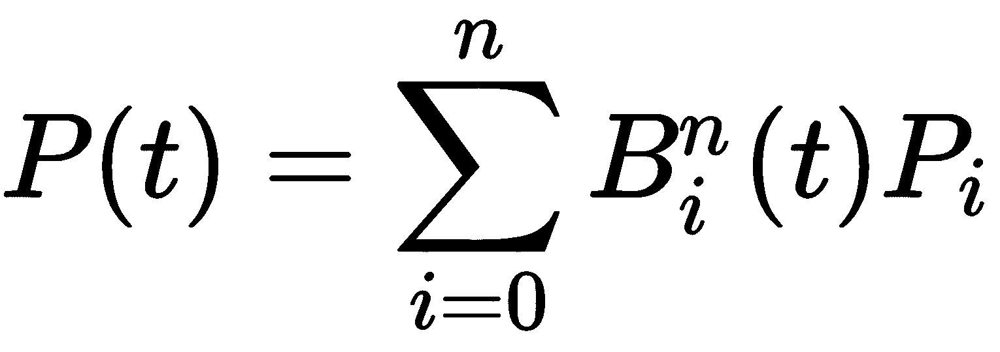

在本例中，我们将绘制一个立方贝塞尔曲线，这涉及到四个控制点（*n = 3*）：

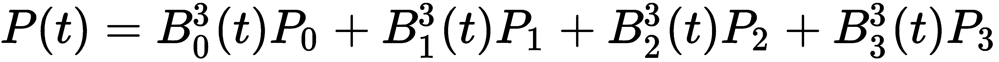

立方贝塞尔多项式如下：

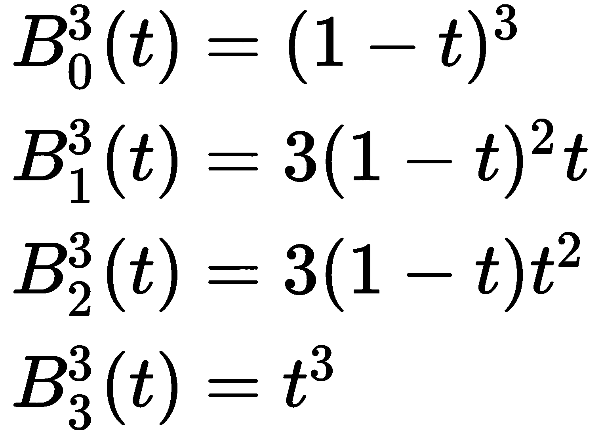

如本章引言所述，OpenGL 中的镶嵌功能涉及两个着色器阶段。它们是镶嵌控制着色器（TCS）和镶嵌评估着色器（TES）。在这个例子中，我们将在 TCS 中定义我们的贝塞尔曲线的线段数量（通过定义外镶嵌级别），并在 TES 中评估每个特定顶点位置处的贝塞尔曲线。以下图像显示了本例三个不同镶嵌级别的输出。左图使用三个线段（级别 3），中间使用级别 5，右图使用镶嵌级别 30。小方块是控制点：

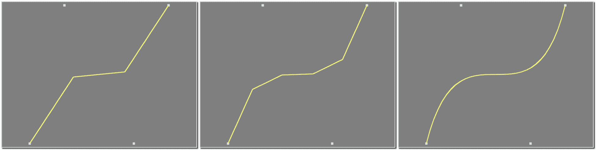

贝塞尔曲线的控制点作为由四个顶点组成的补丁原语发送到管线中。补丁原语是程序员定义的原语类型。基本上，它是一组可以用于程序员选择的任何事物的顶点集。TCS 对补丁内的每个顶点执行一次，TES 根据 TPG 生成的顶点数量，以变量次数执行。镶嵌阶段的最终输出是一组原语。在我们的例子中，它将是一条线段。

TCS 的一部分工作是定义镶嵌级别。非常粗略地说，镶嵌级别与将要生成的顶点数量相关。在我们的例子中，TCS 将生成一条线段，所以镶嵌级别是线段中的线段数量。为这条线段生成的每个顶点都将与一个在零到一之间变化的镶嵌坐标相关联。我们将称之为 *u* 坐标，它将对应于前面贝塞尔曲线方程中的参数 *t*。

我们到目前为止所看到的内容并不是整个故事。实际上，TCS 将触发生成一组称为等值线的线段。这个等值线集中的每个顶点都将有一个 *u* 和一个 *v* 坐标。*u* 坐标将在给定的等值线上从零变到一，而 *v* 对于每个等值线将是常数。*u* 和 *v* 的不同值与两个单独的镶嵌级别相关联，所谓的 *外* 级别。然而，对于这个例子，我们只会生成一条线段，所以第二个镶嵌级别（对于 *v*）将始终为 1。

在 TES 中，主要任务是确定与此次着色器执行相关的顶点的位置。我们可以访问与顶点相关的 *u* 和 *v* 坐标，我们还可以（只读）访问补丁中所有顶点。然后我们可以通过使用参数方程，以 *u* 作为参数坐标（前面方程中的 *t*），来确定顶点的适当位置。

# 准备工作

以下是为本例重要的统一变量：

+   `NumSegments`：这是要生成的线段数量。

+   `NumStrips`：这是要生成的等值线的数量。对于这个例子，这个值应该设置为`1`。

+   `LineColor`：这是结果线条的颜色。

在主 OpenGL 应用程序中设置统一变量。总共有四个着色器需要编译和链接。它们是顶点、片段、细分控制以及细分评估着色器。

# 如何做到这一点...

要创建一个从四个控制点组成的补丁生成贝塞尔曲线的着色器程序，请按照以下步骤操作：

1.  使用以下代码作为顶点着色器。请注意，我们将顶点位置原封不动地发送到 TCS：

```cpp
layout (location = 0 ) in vec2 VertexPosition; 

void main() {
    gl_Position = vec4(VertexPosition, 0.0, 1.0); 
} 
```

1.  使用以下代码作为细分控制着色器：

```cpp
layout( vertices=4 ) out; 

uniform int NumSegments; 
uniform int NumStrips; 

void main() {
    // Pass along the vertex position unmodified 
    gl_out[gl_InvocationID].gl_Position =  
              gl_in[gl_InvocationID].gl_Position; 
    // Define the tessellation levels 
    gl_TessLevelOuter[0] = float(NumStrips); 
    gl_TessLevelOuter[1] = float(NumSegments); 
} 
```

1.  使用以下代码作为细分评估着色器：

```cpp
layout( isolines ) in; 
uniform mat4 MVP;  // projection * view * model 

void main() {
    // The tessellation u coordinate 
    float u = gl_TessCoord.x; 

    // The patch vertices (control points) 
    vec3 p0 = gl_in[0].gl_Position.xyz; 
    vec3 p1 = gl_in[1].gl_Position.xyz; 
    vec3 p2 = gl_in[2].gl_Position.xyz; 
    vec3 p3 = gl_in[3].gl_Position.xyz; 

    float u1 = (1.0 - u); 
    float u2 = u * u; 

    // Bernstein polynomials evaluated at u 
    float b3 = u2 * u; 
    float b2 = 3.0 * u2 * u1; 
    float b1 = 3.0 * u * u1 * u1; 
    float b0 = u1 * u1 * u1; 

    // Cubic Bezier interpolation 
    vec3 p = p0 * b0 + p1 * b1 + p2 * b2 + p3 * b3; 

    gl_Position = MVP * vec4(p, 1.0); 

} 
```

1.  使用以下代码作为片段着色器：

```cpp
uniform vec4 LineColor; 

layout ( location = 0 ) out vec4 FragColor; 

void main() {
    FragColor = LineColor; 
} 
```

1.  在 OpenGL 应用程序中定义每个补丁的顶点数是很重要的。您可以使用`glPatchParameter`函数来完成此操作：

```cpp
glPatchParameteri( GL_PATCH_VERTICES, 4); 
```

1.  在 OpenGL 应用程序的`render`函数中将四个控制点作为补丁原语渲染：

```cpp
glDrawArrays(GL_PATCHES, 0, 4); 
```

# 它是如何工作的...

顶点着色器只是一个传递着色器。它将顶点位置原封不动地传递到下一个阶段。

细分控制着色器首先定义输出补丁中的顶点数：

```cpp
layout (vertices = 4) out; 
```

注意，这不同于由细分过程产生的顶点数量。在这种情况下，补丁是我们的四个控制点，所以我们使用`4`这个值。

TCS 中的主方法将输入位置（补丁顶点的位置）原封不动地传递到输出位置。`gl_out`和`gl_in`数组包含与补丁中每个顶点相关的输入和输出信息。请注意，我们在这些数组中分配和读取`gl_InvocationID`。`gl_InvocationID`变量定义了 TCS 负责的输出补丁顶点。TCS 可以访问`gl_in`数组中的所有内容，但应该只写入对应于`gl_InvocationID`的`gl_out`中的位置。其他索引将由 TCS 的其他调用写入。

接下来，TCS 通过将值分配给`gl_TessLevelOuter`数组来设置细分级别。请注意，`gl_TessLevelOuter`的值是浮点数而不是整数。它们将被四舍五入到最接近的整数，并由 OpenGL 系统自动夹断。

数组的第一个元素定义了将生成的等值线的数量。每条等值线对于`v`的值都是恒定的。在这个例子中，`gl_TessLevelOuter[0]`的值应该为`1`，因为我们只想创建一条曲线。第二个定义了将在线条中产生的线段数量。条纹中的每个顶点都将有一个从零到一的参数`u`坐标的值。

在 TES 中，我们首先使用`layout`声明来定义输入原语类型：

```cpp
layout (isolines) in; 
```

这表示细分原语生成器执行的细分类型。其他可能性包括 `quads` 和 `triangles`。

在 TES 的 `main` 函数中，`gl_TessCoord` 变量包含此调用中细分图的 `u` 和 `v` 坐标。由于我们只在一维上进行细分，我们只需要 `u` 坐标，它对应于 `gl_TessCoord` 的 *x* 坐标。

下一步是访问四个控制点的位置（我们补丁原语中的所有点）。这些位置在 `gl_in` 数组中可用。

立方贝塞尔多项式在 `u` 处评估，并存储在 `b0`、`b1`、`b2` 和 `b3` 中。接下来，我们使用贝塞尔曲线方程计算插值位置。最终位置转换为裁剪坐标，并分配给 `gl_Position` 输出变量。

片段着色器简单地应用 `LineColor` 到片段上。

# 还有更多...

关于细分着色器还有很多可以说的，但这个例子旨在提供一个简单的介绍，所以我们将留到后面的食谱中。接下来，我们将探讨二维表面上的细分。

# 参见

+   示例代码中的 `chapter07/scenebezcurve.cpp` 文件

# 细分 2D 四边形

理解 OpenGL 的硬件细分的一个最好的方法是通过可视化 2D 四边形的细分。当使用线性插值时，产生的三角形与细分原语生成的细分坐标（u,v）直接相关。绘制几个具有不同内部和外部细分级别的四边形，并研究产生的三角形，这可以非常有帮助。我们将在本食谱中做 exactly that。

当使用四边形细分时，细分原语生成器根据六个参数将 (u,v) 参数空间细分为多个细分。这些是 `u` 和 `v` 的内部细分级别（内部级别 0 和内部级别 1），以及沿着两个边的外部细分级别（外部级别 0 到 3）。这些决定了参数空间边沿和内部的细分数量。让我们分别看看这些：

+   **外层级别 0 (OL0)**: 这是沿着 *v* 方向的细分数量，其中 *u = 0*

+   **外层级别 1 (OL1)**: 这是沿着 *u* 方向的细分数量，其中 *v = 0*

+   **外层级别 2 (OL2)**: 这是沿着 *v* 方向的细分数量，其中 *u = 1*

+   **外层级别 3 (OL3)**: 这是沿着 *u* 方向的细分数量，其中 **v = 1**

+   **内部级别 0 (IL0)**: 这是对于所有内部 *v* 值沿着 *u* 方向的细分数量

+   **内部级别 1 (IL1)**: 这是对于所有内部 *u* 值沿着 *v* 方向的细分数量

以下图表表示细分级别与受影响的参数空间区域之间的关系。外层级别定义了边缘上的细分次数，内层级别定义了内部的细分次数：

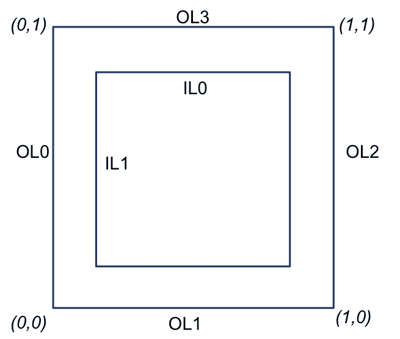

之前描述的六个细分级别可以通过`gl_TessLevelOuter`和`gl_TessLevelInner`数组进行配置。例如，`gl_TessLevelInner[0]`对应于**IL0**，`gl_TessLevelOuter[2]`对应于**OL2**，依此类推。

如果我们绘制一个由单个四边形（四个顶点）组成的补丁原语，并使用线性插值，生成的三角形可以帮助我们理解 OpenGL 如何进行四边形细分。以下图表显示了不同细分级别的结果：

![]

当我们使用线性插值时，产生的三角形代表参数（u, v）空间的视觉表示。*x*轴对应于*u*坐标，*y*轴对应于*v*坐标。三角形的顶点是细分原语生成的(u,v)坐标。细分次数可以在三角形的网格中清楚地看到。例如，当外层级别设置为**2**，内层级别设置为**8**时，可以看到外边缘有两个细分，但在四边形内部，u 和 v 被细分为八个区间。

在深入代码之前，让我们讨论线性插值。如果四边形的四个角如图所示，那么四边形内的任何点都可以通过相对于**u**和**v**参数进行线性插值来确定：

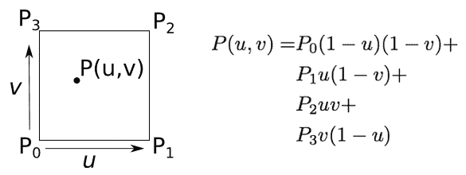

我们将让细分原语生成具有适当参数坐标的一组顶点，我们将通过使用前面的方程式插值四边形的角来确定相应的位置。

# 准备工作

外部和内部细分级别将由`Inner`和`Outer`统一变量确定。为了显示三角形，我们将使用几何着色器。

设置你的 OpenGL 应用程序以渲染一个由四个顶点组成的补丁原语，顺时针方向，如图中所示。

# 如何做到这一点...

要创建一个着色器程序，该程序将使用四个顶点的补丁进行四边形细分来生成一组三角形，请按照以下步骤操作：

1.  使用以下代码作为顶点着色器：

```cpp
layout (location = 0 ) in vec2 VertexPosition; 

void main() {
    gl_Position = vec4(VertexPosition, 0.0, 1.0); 
}
```

1.  使用以下代码作为细分控制着色器：

```cpp
layout( vertices=4 ) out; 

uniform int Outer; 
uniform int Inner; 
void main() {
    // Pass along the vertex position unmodified 
    gl_out[gl_InvocationID].gl_Position =  
               gl_in[gl_InvocationID].gl_Position; 

    gl_TessLevelOuter[0] = float(Outer); 
    gl_TessLevelOuter[1] = float(Outer); 
    gl_TessLevelOuter[2] = float(Outer); 
    gl_TessLevelOuter[3] = float(Outer); 

    gl_TessLevelInner[0] = float(Inner); 
    gl_TessLevelInner[1] = float(Inner); 
}
```

1.  使用以下代码作为细分评估着色器：

```cpp
layout( quads, equal_spacing, ccw ) in; 

uniform mat4 MVP; 

void main() {
    float u = gl_TessCoord.x; 
    float v = gl_TessCoord.y; 

    vec4 p0 = gl_in[0].gl_Position; 
    vec4 p1 = gl_in[1].gl_Position; 
    vec4 p2 = gl_in[2].gl_Position; 
    vec4 p3 = gl_in[3].gl_Position; 

    // Linear interpolation 
    gl_Position = 
        p0 * (1-u) * (1-v) + 
        p1 * u * (1-v) + 
        p3 * v * (1-u) + 
        p2 * u * v; 

    // Transform to clip coordinates 
    gl_Position = MVP * gl_Position; 
} 
```

1.  使用来自*在着色网格上绘制线框*菜谱的几何着色器

1.  使用以下代码作为片段着色器：

```cpp
uniform float LineWidth; 
uniform vec4 LineColor; 
uniform vec4 QuadColor; 

noperspective in vec3 GEdgeDistance;  // From geom. shader 

layout ( location = 0 ) out vec4 FragColor; 

float edgeMix() {
   // ** insert code here to determine how much of the edge 
   // color to include (see recipe "Drawing a wireframe on 
   // top of a shaded mesh").  ** 
} 

void main() {
    float mixVal = edgeMix(); 

    FragColor = mix( QuadColor, LineColor, mixVal );
} 
```

1.  在你的主 OpenGL 程序的`render`函数中，定义补丁内的顶点数：

```cpp
glPatchParameteri(GL_PATCH_VERTICES, 4); 
```

1.  以逆时针顺序渲染补丁为四个 2D 顶点

# 它是如何工作的...

顶点着色器将位置原封不动地传递给 TCS。

TCS 使用布局指令定义了补丁中的顶点数：

```cpp
layout (vertices=4) out; 
```

在`main`函数中，它将顶点的位置原封不动地传递下去，并设置内部和外部素片化级别。所有四个外部素片化级别都设置为`Outer`的值，两个内部素片化级别都设置为`Inner`。

在素片评估着色器中，我们使用输入布局指令定义素片化模式和其它素片化参数：

```cpp
layout ( quads, equal_spacing, ccw ) in; 
```

`quads`参数指示着素片生成器应该使用四边形素片化来对参数空间进行素片化。`equal_spacing`参数表示素片化应该执行，使得所有细分部分具有相等的长度。最后一个参数`ccw`表示素片应该以逆时针方向生成。

TES 中的`main`函数首先通过访问`gl_TessCoord`变量来检索此顶点的参数坐标。然后我们继续从`gl_in`数组中读取补丁中的四个顶点的位置。我们将它们存储在临时变量中，以便在插值计算中使用。

内置的`gl_Position`输出变量随后使用前面的方程式获取插值点的值。最后，我们通过乘以模型视图投影矩阵将位置转换为裁剪坐标。

在片段着色器中，我们给所有片段一个颜色，这个颜色可能混合了线条颜色，以便突出边缘。

# 参见

+   示例代码中的`chapter07/scenequadtess.cpp`文件

+   *在着色网格上绘制线框图*的配方

# 素片化 3D 表面

作为素片化 3D 表面的一个例子，让我们再次渲染（是的，又是）*茶壶多面体*。结果证明，茶壶的数据集实际上被定义为 4 x 4 个控制点的集合，适合进行三次贝塞尔插值。因此，绘制茶壶实际上归结为绘制一组三次贝塞尔曲面。

当然，这听起来像是素片着色器的完美工作！我们将渲染每个 16 个顶点的补丁作为补丁原语，使用四边形素片化来细分参数空间，并在素片评估着色器中实现贝塞尔插值。

以下图像显示了所需输出的一个示例。左边的茶壶使用了内部和外部素片化级别 2，中间的使用了级别 4，右边的茶壶使用了素片化级别 16。素片评估着色器计算贝塞尔曲面插值：

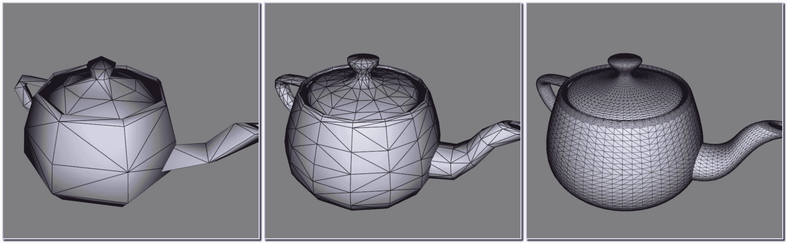

首先，让我们看看立方贝塞尔曲面插值是如何工作的。如果我们的曲面由一组 16 个控制点（以 4 x 4 网格排列）*P[ij]*定义，其中*i*和*j*的范围从 0 到 3，则参数化贝塞尔曲面由以下方程给出：

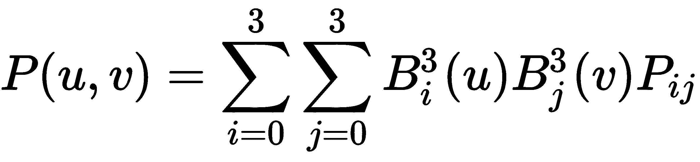

前述方程中的*B*实例是立方伯恩斯坦多项式（参考先前的配方，*Tessellating a 2D quad*）。

我们还需要计算每个插值位置的法向量。为此，我们必须计算前述方程的偏导数的叉积：


贝塞尔曲面的偏导数简化为伯恩斯坦多项式的偏导数：

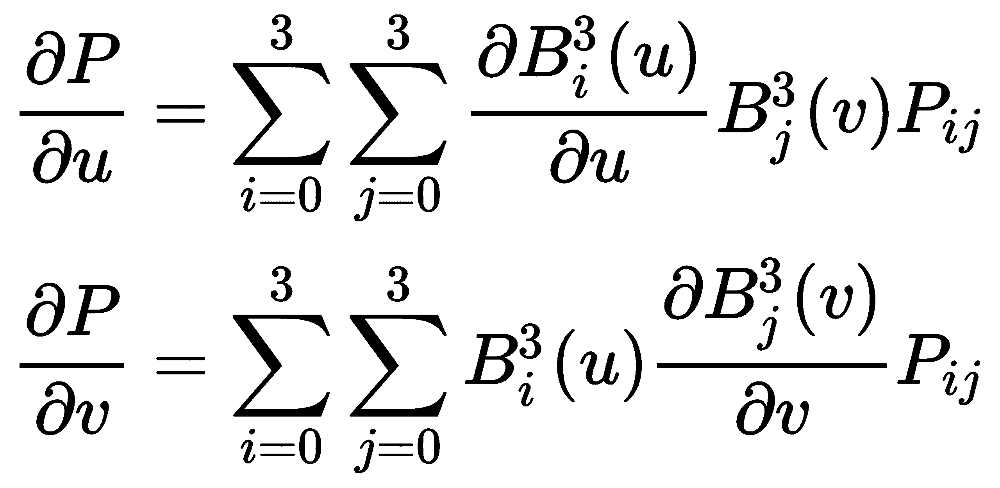

我们将在 TES 内计算偏导数并计算叉积以确定每个细分顶点的曲面法线。

# 准备工作

设置你的着色器，使用一个顶点着色器，它简单地传递顶点位置而不进行任何修改（你可以使用与*Tessellating a 2D quad*配方中使用的相同的顶点着色器）。创建一个片段着色器，实现你选择的着色模型。片段着色器应该接收`TENormal`和`TEPosition`输入变量，它们将是相机坐标中的法线和位置。

`TessLevel`统一变量应赋予所需细分级别的值。所有内部和外部级别都将设置为该值。

# 如何操作...

要创建一个从 16 个控制点输入的贝塞尔补丁的程序，请按照以下步骤操作：

1.  使用*Tessellating a 2D quad*配方中的顶点着色器。

1.  使用以下代码进行细分控制着色器：

```cpp
layout( vertices=16 ) out; 

uniform int TessLevel; 

void main() {
    // Pass along the vertex position unmodified 
    gl_out[gl_InvocationID].gl_Position =  
                 gl_in[gl_InvocationID].gl_Position; 

    gl_TessLevelOuter[0] = float(TessLevel); 
    gl_TessLevelOuter[1] = float(TessLevel); 
    gl_TessLevelOuter[2] = float(TessLevel); 
    gl_TessLevelOuter[3] = float(TessLevel); 

    gl_TessLevelInner[0] = float(TessLevel); 
    gl_TessLevelInner[1] = float(TessLevel); 
}
```

1.  使用以下代码进行细分评估着色器：

```cpp
layout( quads ) in; 
out vec3 TENormal;   // Vertex normal in camera coords. 
out vec4 TEPosition; // Vertex position in camera coords 

uniform mat4 MVP; 
uniform mat4 ModelViewMatrix; 
uniform mat3 NormalMatrix; 

void basisFunctions(out float[4] b, out float[4] db, float t) {
    float t1 = (1.0 - t); 
    float t12 = t1 * t1; 

    // Bernstein polynomials 
    b[0] = t12 * t1; 
    b[1] = 3.0 * t12 * t; 
    b[2] = 3.0 * t1 * t * t; 
    b[3] = t * t * t; 

    // Derivatives 
    db[0] = -3.0 * t1 * t1; 
    db[1] = -6.0 * t * t1 + 3.0 * t12; 
    db[2] = -3.0 * t * t + 6.0 * t * t1; 
    db[3] = 3.0 * t * t; 
} 

void main() {
    float u = gl_TessCoord.x; 
    float v = gl_TessCoord.y; 

    // The sixteen control points 
    vec4 p00 = gl_in[0].gl_Position; 
    vec4 p01 = gl_in[1].gl_Position; 
    vec4 p02 = gl_in[2].gl_Position; 
    vec4 p03 = gl_in[3].gl_Position; 
    vec4 p10 = gl_in[4].gl_Position; 
    vec4 p11 = gl_in[5].gl_Position; 
    vec4 p12 = gl_in[6].gl_Position; 
    vec4 p13 = gl_in[7].gl_Position; 
    vec4 p20 = gl_in[8].gl_Position; 
    vec4 p21 = gl_in[9].gl_Position; 
    vec4 p22 = gl_in[10].gl_Position; 
    vec4 p23 = gl_in[11].gl_Position; 
    vec4 p30 = gl_in[12].gl_Position; 
    vec4 p31 = gl_in[13].gl_Position; 
    vec4 p32 = gl_in[14].gl_Position; 
    vec4 p33 = gl_in[15].gl_Position; 
    // Compute basis functions 
    float bu[4], bv[4];   // Basis functions for u and v 
    float dbu[4], dbv[4]; // Derivitives for u and v 
    basisFunctions(bu, dbu, u); 
    basisFunctions(bv, dbv, v); 

    // Bezier interpolation 
    TEPosition = 
     p00*bu[0]*bv[0] + p01*bu[0]*bv[1] + p02*bu[0]*bv[2] +  
     p03*bu[0]*bv[3] + 
     p10*bu[1]*bv[0] + p11*bu[1]*bv[1] + p12*bu[1]*bv[2] +  
     p13*bu[1]*bv[3] + 
     p20*bu[2]*bv[0] + p21*bu[2]*bv[1] + p22*bu[2]*bv[2] +  
     p23*bu[2]*bv[3] + 
     p30*bu[3]*bv[0] + p31*bu[3]*bv[1] + p32*bu[3]*bv[2] +  
     p33*bu[3]*bv[3]; 

    // The partial derivatives 
    vec4 du = 
     p00*dbu[0]*bv[0]+p01*dbu[0]*bv[1]+p02*dbu[0]*bv[2]+  
     p03*dbu[0]*bv[3]+ 
     p10*dbu[1]*bv[0]+p11*dbu[1]*bv[1]+p12*dbu[1]*bv[2]+  
     p13*dbu[1]*bv[3]+ 
     p20*dbu[2]*bv[0]+p21*dbu[2]*bv[1]+p22*dbu[2]*bv[2]+  
     p23*dbu[2]*bv[3]+ 
     p30*dbu[3]*bv[0]+p31*dbu[3]*bv[1]+p32*dbu[3]*bv[2]+  
     p33*dbu[3]*bv[3]; 

    vec4 dv = 
     p00*bu[0]*dbv[0]+p01*bu[0]*dbv[1]+p02*bu[0]*dbv[2]+  
     p03*bu[0]*dbv[3]+ 
     p10*bu[1]*dbv[0]+p11*bu[1]*dbv[1]+p12*bu[1]*dbv[2]+  
     p13*bu[1]*dbv[3]+ 
     p20*bu[2]*dbv[0]+p21*bu[2]*dbv[1]+p22*bu[2]*dbv[2]+  
     p23*bu[2]*dbv[3]+ 
     p30*bu[3]*dbv[0]+p31*bu[3]*dbv[1]+p32*bu[3]*dbv[2]+  
     p33*bu[3]*dbv[3]; 

    // The normal is the cross product of the partials 
    vec3 n = normalize( cross(du.xyz, dv.xyz) ); 

    // Transform to clip coordinates 
    gl_Position = MVP * TEPosition; 

    // Convert to camera coordinates 
    TEPosition = ModelViewMatrix * TEPosition; 
    TENormal = normalize(NormalMatrix * n); 
}
```

1.  在片段着色器中实现你喜欢的着色模型，利用 TES 的输出变量。

1.  将贝塞尔控制点渲染为 16 顶点的补丁原语。别忘了在 OpenGL 应用程序中设置每个补丁的顶点数：

```cpp
glPatchParameteri(GL_PATCH_VERTICES, 16); 
```

# 它是如何工作的...

细分控制着色器首先使用布局指令定义补丁中的顶点数：

```cpp
layout( vertices=16 ) out; 
```

然后，它简单地设置细分级别为`TessLevel`的值。它传递顶点位置，不进行任何修改。

细分评估着色器首先使用布局指令来指示要使用的细分类型。由于我们正在细分一个 4 x 4 的贝塞尔曲面补丁，四边形细分最为合理。

`basisFunctions`函数评估给定`t`参数值的伯恩斯坦多项式及其导数。结果返回在`b`和`db`输出参数中。

在`main`函数中，我们首先将镶嵌坐标分配给`u`和`v`变量，并将所有 16 个补丁顶点重新分配给具有较短名称的变量（以缩短稍后出现的代码）。

然后我们调用`basisFunctions`来计算伯恩斯坦多项式及其在`u`和`v`处的导数，并将结果存储在`bu`、`dbu`、`bv`和`dbv`中。

下一步是评估前面方程中关于位置（`TEPosition`）、关于`u`的偏导数（`du`）和关于`v`的偏导数（`dv`）的总和。我们通过计算`du`和`dv`的叉积来计算法向量。

最后，我们将位置（`TEPosition`）转换为裁剪坐标，并将结果分配给

`gl_Position`。我们还在将其传递到片段着色器之前将其转换为摄像机坐标。

通过乘以`NormalMatrix`，将法向量转换为摄像机坐标，并将结果归一化，通过`TENormal`传递到片段着色器。

# 参见

+   示例代码中的`chapter07/scenetessteapot.cpp`文件

+   *2D 四边形的镶嵌*配方

# 基于深度的镶嵌

镶嵌着色器最伟大的事情之一就是实现**细节级别**（**LOD**）算法的简单性。LOD 是计算机图形学中的一个通用术语，指的是根据观察者（或其他因素）与对象之间的距离增加/减少对象几何复杂性的过程。当对象远离摄像机时，需要更少的几何细节来表示形状，因为对象的总体尺寸变得更小。然而，当对象靠近摄像机时，对象在屏幕上占据的面积越来越大，需要更多的几何细节来保持所需的外观（平滑度或其他几何失真）。

以下图像显示了使用基于摄像机距离的镶嵌级别渲染的几个茶壶。每个茶壶在 OpenGL 端使用完全相同的代码进行渲染。TCS 自动根据深度变化镶嵌级别：

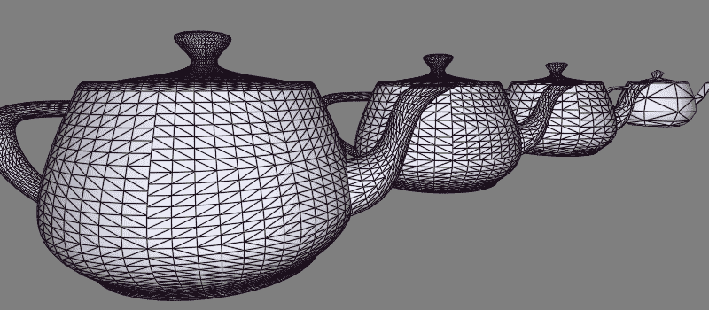

当使用镶嵌着色器时，镶嵌级别决定了对象的几何复杂性。由于镶嵌级别可以在镶嵌控制着色器中设置，因此根据与摄像机的距离变化镶嵌级别是一件简单的事情。

在本例中，我们将线性地（相对于距离）在最小级别和最大级别之间变化细分级别。我们将计算**相机到距离**作为相机坐标中**z**坐标的绝对值（当然，这并不是真正的距离，但应该适用于本例的目的）。然后根据该值计算细分级别。我们还将定义两个额外的值（作为统一变量）：`MinDepth`和`MaxDepth`。距离相机比`MinDepth`更近的对象将获得最大的细分级别，而距离相机比`MaxDepth`更远的所有对象将获得最小的细分级别。介于两者之间的对象的细分级别将进行线性插值。

# 准备工作

此程序几乎与“**对 3D 表面进行细分**”菜谱中的程序相同。唯一的区别在于 TCS。我们将移除`TessLevel`统一变量，并添加一些新的变量，如下所述：

+   `MinTessLevel`：这是期望的最低细分级别

+   `MaxTessLevel`：这是期望的最高细分级别

+   `MinDepth`：这是从相机到最小**距离**，此时细分级别最大

+   `MaxDepth`：这是从相机到最大**距离**，此时细分级别最小

按照在“**对 3D 表面进行细分**”菜谱中指示的，将您的对象渲染为 16 顶点补丁原语。

# 如何操作...

要创建一个根据深度变化细分级别的着色器程序，请按照以下步骤操作：

1.  使用来自“**对 3D 表面进行细分**”菜谱的顶点着色器和细分评估着色器。

1.  使用以下代码进行细分控制着色器：

```cpp
layout( vertices=16 ) out; 

uniform int MinTessLevel; 
uniform int MaxTessLevel; 
uniform float MaxDepth; 
uniform float MinDepth; 

uniform mat4 ModelViewMatrix; 

void main() {
    // Position in camera coordinates 
    vec4 p = ModelViewMatrix *  
                   gl_in[gl_InvocationID].gl_Position; 

    // "Distance" from camera scaled between 0 and 1 
    float depth = clamp( (abs(p.z) - MinDepth) /  
                         (MaxDepth - MinDepth), 0.0, 1.0 ); 

    // Interpolate between min/max tess levels 
    float tessLevel =  
          mix(MaxTessLevel, MinTessLevel, depth); 

    gl_TessLevelOuter[0] = float(tessLevel); 
    gl_TessLevelOuter[1] = float(tessLevel); 
    gl_TessLevelOuter[2] = float(tessLevel); 
    gl_TessLevelOuter[3] = float(tessLevel); 

    gl_TessLevelInner[0] = float(tessLevel); 
    gl_TessLevelInner[1] = float(tessLevel); 

    gl_out[gl_InvocationID].gl_Position =  
                  gl_in[gl_InvocationID].gl_Position; 
} 
```

1.  与先前的菜谱一样，在片段着色器中实现您喜欢的着色模型。

# 它是如何工作的...

TCS 将位置转换为相机坐标，并将结果存储在`p`变量中。然后**z**坐标的绝对值被缩放并夹紧，以确保结果在零和一之间。如果**z**坐标等于`MaxDepth`，则深度值将为`1.0`；如果等于`MinDepth`，则深度将为`0.0`。如果**z**在`MinDepth`和`MaxDepth`之间，则深度将获得介于零和一之间的值。如果**z**超出该范围，它将被`clamp`函数夹紧到`0.0`或`1.0`。

然后使用`mix`函数根据`depth`值在`MaxTessLevel`和`MinTessLevel`之间进行线性插值。结果（`tessLevel`）用于设置内部和外部细分级别。

# 还有更多...

这个例子有一个稍微微妙的地方。回想一下，TCS（三角形细分计算）在补丁中的每个输出顶点处执行一次。因此，如果我们正在渲染三次贝塞尔曲面，这个 TCS 将为每个补丁执行 16 次。每次执行时，`depth`的值都会略有不同，因为它基于顶点的*z*坐标进行评估。你可能想知道，16 种可能的不同细分级别中哪一种会被使用？在参数空间中插值细分级别是没有意义的。这是怎么回事？

`gl_TessLevelInner`和`gl_TessLevelOuter`输出数组是每个补丁的输出变量。这意味着每个补丁只使用一个值，类似于平面限定符对片段着色器输入变量的作用。OpenGL 规范似乎表明，TCS 的每次调用中的任何值都可能最终被使用。

我们还应该注意，如果共享边的补丁的细分级别不同，那么可能会出现裂缝或其他视觉伪影。因此，我们应该确保相邻的补丁使用相同的细分级别。

# 参见

+   示例代码中的`chapter07/scenetessteapotdepth.cpp`文件

+   DirectX 11 地形细分：[`developer.download.nvidia.com/assets/gamedev/files/sdk/11/TerrainTessellation_WhitePaper.pdf`](http://developer.download.nvidia.com/assets/gamedev/files/sdk/11/TerrainTessellation_WhitePaper.pdf)

+   *细分 3D 曲面*菜谱
