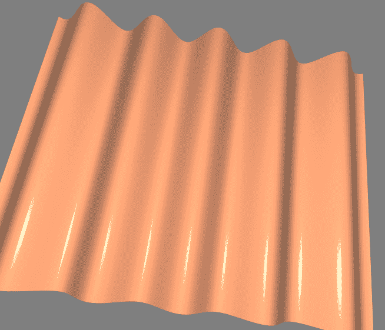
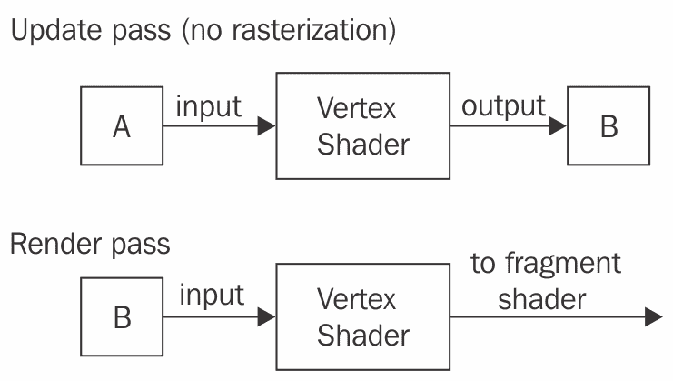
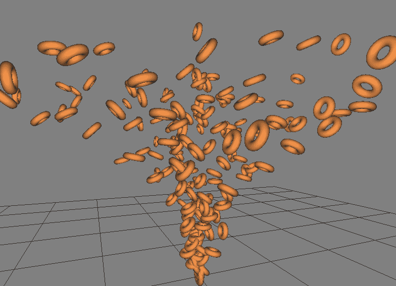
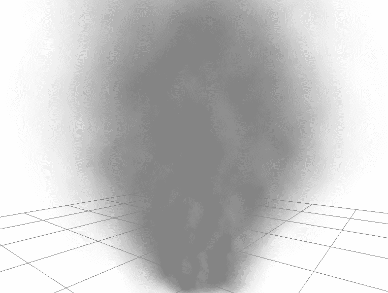

# 粒子系统与动画

在本章中，我们将涵盖以下配方：

+   使用顶点位移动画表面

+   创建粒子喷泉

+   使用变换反馈创建粒子系统

+   使用实例网格创建粒子系统

+   使用粒子模拟火焰

+   使用粒子模拟烟雾

# 简介

着色器为我们提供了利用现代图形处理器提供的巨大并行性的能力。由于它们能够变换顶点位置，因此可以直接在着色器内部实现动画。如果动画算法可以在着色器内部适当地并行化执行，这可以提高效率。

如果着色器要帮助动画，它不仅必须计算位置，而且通常还必须输出更新后的位置以供下一帧使用。着色器最初并不是设计用来写入任意缓冲区的（当然，除了帧缓冲区）。然而，随着最近版本的推出，OpenGL 已经提供了一系列技术来实现这一功能，包括着色器存储缓冲区对象和图像加载/存储。截至 OpenGL 3.0，我们还可以将顶点或几何着色器输出变量的值发送到任意缓冲区（或缓冲区）。这个功能被称为**变换反馈**，对于粒子系统特别有用。

在本章中，我们将探讨几个着色器内动画的示例，主要关注粒子系统。第一个示例，通过顶点位移进行动画，通过基于时间依赖函数变换对象的顶点位置来演示动画。在*创建粒子喷泉*配方中，我们将创建一个在恒定加速度下的简单粒子系统。在*使用变换反馈创建粒子系统*配方中，有一个示例说明了如何在粒子系统中使用 OpenGL 的变换反馈功能。*使用实例粒子创建粒子系统*配方展示了如何使用实例渲染来动画化许多复杂对象。

最后两个配方演示了一些用于模拟复杂、真实现象（如烟雾和火焰）的粒子系统。

# 使用顶点位移动画表面

利用着色器进行动画的一个简单方法是在顶点着色器内部根据某个时间依赖函数变换顶点。OpenGL 应用程序提供静态几何体，顶点着色器使用当前时间（作为统一变量提供）修改几何体。这将从 CPU 将顶点位置的计算移动到 GPU，并利用图形驱动程序提供的任何并行性。

在这个例子中，我们将通过根据正弦波转换划分四边形的顶点来创建一个波动的表面。我们将通过管道发送一组三角形，这些三角形构成了*x*-*z*平面上的一个平坦表面。在顶点着色器中，我们将根据时间依赖的正弦函数转换每个顶点的*y*坐标，并计算变换顶点的法向量。以下图像显示了期望的结果（你必须想象波浪是从左到右穿过表面的）：



或者，我们可以使用噪声纹理根据随机函数动画顶点（构成表面的顶点）。（有关噪声纹理的详细信息，请参阅第九章[5e6b75a0-9f0c-4798-bc37-b5d34b53ef4a.xhtml]，*在着色器中使用噪声*。）

在我们深入代码之前，让我们看看我们将需要的数学知识。

我们将根据当前时间和建模的*x*坐标将表面的*y*坐标作为函数进行转换。为此，我们将使用基本的平面波动方程，如下面的图示所示：


**A**是波的振幅（波峰的高度），lambda（**λ**）是波长（相邻波峰之间的距离），**v**是波的速度。前面的图示展示了当*t = 0*且波长等于一时波的例子。我们将通过 uniform 变量配置这些系数。

为了以适当的着色渲染表面，我们还需要变换位置的法向量。我们可以通过前一个函数的（偏）导数来计算法向量。结果是以下方程：


当然，在我们在着色模型中使用它之前，这个向量应该是归一化的。

# 准备工作

将你的 OpenGL 应用程序设置成在*x*-*z*平面上渲染一个平坦的、划分成多边形的表面。如果你使用大量的三角形，结果会看起来更好。同时，使用你喜欢的任何方法跟踪动画时间。通过 uniform 变量`Time`将当前时间传递给顶点着色器。

另外一些重要的 uniform 变量是先前波动方程的系数：

+   `K`：它是波数（*2π/λ*）

+   `Velocity`：它是波的速度

+   `Amp`：它是波的振幅

设置你的程序以提供适当的 uniform 变量以供你选择的着色模型使用。

# 如何操作...

在顶点着色器中，我们转换顶点的*y*坐标：

```cpp
layout (location = 0) in vec3 VertexPosition; 

out vec4 Position; 
out vec3 Normal; 

uniform float Time;  // The animation time 

// Wave parameters 
uniform float K;        // Wavenumber 
uniform float Velocity; // Wave's velocity 
uniform float Amp;      // Wave's amplitude 

uniform mat4 ModelViewMatrix; 
uniform mat3 NormalMatrix; 
uniform mat4 MVP; 

void main() {
  vec4 pos = vec4(VertexPosition,1.0); 

  // Translate the y coordinate 
  float u = K * (pos.x - Velocity * Time); 
  pos.y = Amp * sin( u ); 

  // Compute the normal vector 
  vec3 n = vec3(0.0); 
  n.xy = normalize(vec2(-K * Amp *cos( u ), 1.0)); 

  // Send position and normal (in camera cords) to frag. 
  Position = ModelViewMatrix * pos; 
  Normal = NormalMatrix * n; 

  // The position in clip coordinates 
  gl_Position = MVP * pos; 
} 
```

创建一个片段着色器，它根据`Position`和`Normal`变量以及你选择的任何着色模型计算片段颜色。

# 它是如何工作的...

顶点着色器获取顶点的位置并使用之前讨论的波动方程更新*y*坐标。在第一个三个语句之后，变量`pos`只是`VertexPosition`输入变量的一个副本，带有修改后的*y*坐标。

我们然后使用前一个方程计算法线向量，将结果归一化，并将其存储在`n`变量中。由于波实际上是二维波（它不依赖于*z*），法线向量的*z*分量将为零。

最后，我们在将位置转换为相机坐标后，将新的位置和法线传递给片段着色器。像往常一样，我们也将位置传递到内置的`gl_Position`变量中，以裁剪坐标形式。

# 更多内容...

在顶点着色器中修改顶点位置是一种简单的方法，可以将一些计算从 CPU 卸载到 GPU 上。这还消除了在修改位置时需要在 GPU 内存和主内存之间传输顶点缓冲区的可能需求。

主要缺点是更新的位置在 CPU 端不可用。例如，它们可能需要用于额外的处理（如碰撞检测）。然而，有几种方法可以将这些数据返回到 CPU。一种技术可能是巧妙地使用 FBO 来从片段着色器接收更新的位置。在后面的菜谱中，我们将探讨另一种利用较新的 OpenGL 功能**变换反馈**的技术。

# 参见

+   示例代码中的`chapter10/scenewave.cpp`

# 创建粒子喷泉

在计算机图形学中，粒子系统是一组用于模拟各种**模糊**系统（如烟雾、液体喷雾、火焰、爆炸或其他类似现象）的对象。每个粒子被认为是一个具有位置但没有大小的点对象。它们可以渲染为点精灵（使用`GL_POINTS`原语模式），或者作为对齐的相机四边形或三角形。每个粒子都有一个生命周期：它诞生，根据一组规则进行动画处理，然后死亡。粒子随后可以被复活并再次经历整个过程。在这个例子中，粒子不会与其他粒子交互，但某些系统，如流体模拟，需要粒子进行交互。一种常见的技术是将粒子渲染为一个单独的、纹理化的、面向相机的四边形，具有透明度。

在粒子的生命周期内，它会根据一组规则进行动画处理。这些规则包括定义受恒定加速度（如重力场）影响的粒子运动的基运动方程。此外，我们可能还会考虑风、摩擦或其他因素。粒子在其生命周期内也可能改变形状或透明度。一旦粒子达到一定年龄（或位置），它就被认为是*死亡*的，可以被*回收*并再次使用。

在这个例子中，我们将实现一个相对简单的粒子系统，其外观类似于喷泉。为了简单起见，这个例子中的粒子将不会**回收**。一旦它们达到生命周期的终点，我们将以完全透明的方式绘制它们，使它们实际上不可见。这给了喷泉一个有限的生命周期，就像它只有有限的材料供应一样。在后面的菜谱中，我们将看到一些回收粒子的方法来改进这个系统。

下面的图像显示了一系列图像——来自这个简单粒子系统输出的几个连续帧：


为了动画粒子，我们将使用恒定加速度下物体的标准运动学方程：


之前的方程式描述了时间*t*时粒子的位置。*P[0]*是初始位置，*v[0]*是初始速度，*a*是加速度。

我们将定义所有粒子的初始位置为原点（0,0,0）。初始速度将在一个值范围内随机确定。每个粒子将在一个略微不同的时间被创建，因此我们之前方程式中使用的时间将相对于粒子的起始时间。

由于所有粒子的初始位置相同，我们不需要将其作为输入属性提供给着色器。相反，我们只需提供另外两个顶点属性：初始速度和起始时间（粒子的**出生时间**）。在粒子出生时间之前，我们将将其完全透明地渲染。在其生命周期内，粒子的位置将使用之前的方程式，其中*t*的值相对于粒子的起始时间（`Time - StartTime`）。

为了渲染我们的粒子，我们将使用一种称为**实例化**的技术，并结合一个简单的技巧来生成屏幕对齐的四边形。使用这种技术，我们实际上不需要为四边形本身提供任何顶点缓冲区！相反，我们将只为每个粒子调用六次顶点着色器来生成两个三角形（一个四边形）。在顶点着色器中，我们将计算顶点的位置，作为粒子位置的偏移量。如果我们这样做在屏幕空间中，我们可以轻松地创建一个屏幕对齐的四边形。我们需要提供包含粒子初始速度和**出生时间**的输入属性。

这种技术利用顶点着色器来完成所有粒子的动画工作。与在 CPU 上计算位置相比，我们获得了巨大的效率提升。GPU 可以并行执行顶点着色器，并一次性处理多个粒子。

这种技术的核心涉及使用`glDrawArraysInstanced`函数。这个函数与熟悉的`glDrawArrays`类似，但它不是只绘制一次，而是重复绘制。`glDrawArrays`会一次遍历顶点缓冲区，而`glDrawArraysInstanced`会根据指定的次数进行遍历。此外，在遍历缓冲区的同时，我们还可以配置何时移动到缓冲区的下一个元素（如何快速遍历）。通常，我们会在每次调用顶点着色器时移动到下一个元素（本质上每个顶点一次）。然而，在实例绘制中，我们并不总是希望这样。我们可能希望有多个（有时是数百个）调用以获得相同的输入值。

例如，我们粒子系统中的每个粒子都有六个顶点（两个三角形）。对于这六个顶点中的每一个，我们希望它们具有相同的速度、（粒子）位置和其他每个粒子的参数。实现这一点的关键是`glVertexAttribDivisor`函数，它使得指定给定属性索引提升频率成为可能。`0`的除数值表示索引在每个顶点处提升一次。大于零的值（*n > 0*）表示在绘制形状的 n 个实例之后索引提升一次。

例如，假设我们有两个属性（A 和 B），我们将属性 A 的除数设置为零，将属性 B 的除数设置为 1。然后，我们执行以下操作：

```cpp
glDrawArraysInstanced( GL_TRIANGLES, 0, 3, 3);
```

前三个参数与`glDrawArrays`相同。第四个参数是实例数。因此，这个调用将绘制三个三角形原型的实例（总共九个顶点），属性 A 和 B 的值将来自此处显示的相应缓冲区中的索引：

| **属性** | **顶点索引** |
| --- | --- |
| A | 0,1,2,0,1,2,0,1,2 |
| B | 0,0,0,1,1,1,2,2,2 |

注意，将属性 B 的顶点属性除数设置为 1 会导致索引在每个实例处提升一次，而不是在每个顶点处提升一次。实际上，在这个配方中，我们将所有属性的除数都设置为 1！我们将计算每个粒子的顶点位置，作为粒子位置的偏移量。

你可能会想知道，如果所有粒子的顶点属性值都相同，如何在顶点着色器中区分一个顶点与另一个顶点，以确定所需的偏移量。解决方案是通过内置变量`gl_VertexID`。更多内容将在后面介绍。

我们将渲染每个粒子为一个纹理点四边形，由两个三角形组成。我们将随着粒子的年龄线性增加粒子的透明度，使粒子在动画过程中看起来逐渐消失。

# 准备工作

我们将创建两个缓冲区（或一个单一的交错缓冲区）来存储我们的输入属性。第一个缓冲区将存储每个粒子的初始速度。我们将从可能的向量范围内随机选择值。为了创建前一个图像中的粒子锥体，我们将从锥体内的向量集中随机选择。我们将通过应用旋转矩阵（`emitterBasis`）将锥体向某个方向倾斜。以下代码是这样做的一种方法：

```cpp
glm::mat3 emitterBasis = ...; // Rotation matrix 
auto nParticles = 10000;
glGenBuffers(1, &initVel);
glBindBuffer(GL_ARRAY_BUFFER, initVel);
glBufferData(GL_ARRAY_BUFFER, 
    nParticles * sizeof(float) * 3, nullptr, GL_STATIC_DRAW);

glm::vec3 v(0);
float velocity, theta, phi; 
std::vector<GLfloat> data(nParticles * 3); 
for( uint32_t i = 0; i < nParticles; i++ ) { 
  // Pick the direction of the velocity 
  theta = glm::mix(0.0f, glm::pi<float>() / 20.0f, randFloat()); 
  phi = glm::mix(0.0f, glm::two_pi<float>(), randFloat()); 

  v.x = sinf(theta) * cosf(phi); 
  v.y = cosf(theta); 
  v.z = sinf(theta) * sinf(phi); 

  // Scale to set the magnitude of the velocity (speed) 
  velocity = glm::mix(1.25f,1.5f,randFloat()); 
  v = glm::normalize(emitterBasis * v) * velocity; 

  data[3*i]   = v.x; 
  data[3*i+1] = v.y; 
  data[3*i+2] = v.z; 
} 
glBindBuffer(GL_ARRAY_BUFFER, initVel); 
glBufferSubData(GL_ARRAY_BUFFER, 0,  
                nParticles * 3 * sizeof(float), data.data()); 
```

在前面的代码中，`randFloat`函数返回一个介于零和一之间的随机值。我们通过使用 GLM 的`mix`函数（GLM 的`mix`函数与相应的 GLSL 函数作用相同——它在第一个两个参数的值之间执行线性插值）在可能值的范围内选择随机数。在这里，我们选择一个介于零和一之间的随机`float`值，并使用该值在范围的端点之间进行插值。

要从我们的锥体中选择向量，我们使用球坐标。`theta`的值决定了锥体中心和向量之间的角度。`phi`的值定义了给定`theta`值时围绕`y`轴的可能方向。关于球坐标的更多信息，请拿起你最喜欢的数学书。

选择一个方向后，向量会被缩放到 1.25 和 1.5 之间的幅度。这似乎是达到预期效果的良好范围。速度向量的幅度是粒子的整体速度，我们可以调整这个范围以获得更广泛的速度或更快/更慢的粒子。

循环中的最后三行将向量分配到向量`data`的适当位置。循环之后，我们将数据复制到由`initVel`引用的缓冲区中。设置此缓冲区以提供顶点属性零的数据。

在第二个缓冲区中，我们将存储每个粒子的起始时间。这将为每个顶点（粒子）提供仅一个浮点数。在这个例子中，我们将以固定的速率连续创建每个粒子。以下代码将设置一个缓冲区，其中每个粒子在之前的粒子之后固定秒数被创建：

```cpp
glGenBuffers(1, &startTime);
glBindBuffer(GL_ARRAY_BUFFER, startTime);
glBufferData(GL_ARRAY_BUFFER, nParticles * sizeof(float), 
   nullptr, GL_STATIC_DRAW);

float rate = particleLifetime / nParticles;  
for( uint32_t i = 0; i < nParticles; i++ ) { 
  data[i] = rate * i;
} 
glBindBuffer(GL_ARRAY_BUFFER, startTime); 
glBufferSubData(GL_ARRAY_BUFFER, 0, nParticles * sizeof(float), data.data()); 
```

此代码简单地创建了一个以零开始并按`rate`递增的浮点数数组。然后，该数组被复制到由`startTime`引用的缓冲区中。设置此缓冲区作为顶点属性一的输入。

在继续之前，我们将两个属性的分母都设置为 1。这确保了粒子的所有顶点都将获得相同的属性值：

```cpp
glVertexAttribDivisor(0,1);
glVertexAttribDivisor(1,1);
```

在绑定**顶点数组对象**（**VAO**）时执行前面的命令。分母信息存储在 VAO 中。请参阅示例代码以获取详细信息。

顶点着色器有几个统一变量，用于控制模拟。在 OpenGL 程序中设置以下统一变量：

+   `ParticleTex`：粒子的纹理

+   `Time`：动画开始以来经过的时间量

+   `重力`：代表前一个方程中加速度一半的矢量

+   `ParticleLifetime`：定义粒子在被创建后存活的时间

+   `ParticleSize`：粒子的尺寸

+   `EmitterPos`：粒子发射器的位置

由于我们希望粒子部分透明，我们使用以下语句启用 alpha 混合：

```cpp
glEnable(GL_BLEND); 
glBlendFunc(GL_SRC_ALPHA, GL_ONE_MINUS_SRC_ALPHA); 
```

# 如何做到这一点...

在顶点着色器代码中，我们通过在相机坐标中偏移粒子位置来*创建*粒子。注意使用`gl_VertexID`来识别四边形的顶点：

```cpp
layout (location = 0) in vec3 VertexInitVel;    // Particle initial velocity
layout (location = 1) in float VertexBirthTime; // Particle birth time

out float Transp;  // Transparency of the particle
out vec2 TexCoord; // Texture coordinate

uniform float Time; // Animation time
uniform vec3 Gravity; // Gravity vector in world coords
uniform float ParticleLifetime; // Max particle lifetime
uniform float ParticleSize; // Particle size
uniform vec3 EmitterPos;    // Emitter position in world coordinates

// Transformation matrices
uniform mat4 MV, Proj;

// Offsets to the position in camera coordinates for each vertex of the
// particle's quad
const vec3 offsets[] = vec3[](
    vec3(-0.5,-0.5,0), vec3(0.5,-0.5,0), vec3(0.5,0.5,0),
    vec3(-0.5,-0.5,0), vec3(0.5,0.5,0), vec3(-0.5,0.5,0) );
// Texture coordinates for each vertex of the particle's quad
const vec2 texCoords[] = vec2[](
     vec2(0,0), vec2(1,0), vec2(1,1), 
     vec2(0,0), vec2(1,1), vec2(0,1)); 

void main() {
    vec3 cameraPos; // Position in camera coordinates
    float t = Time - VertexBirthTime;
    if( t >= 0 && t < ParticleLifetime ) {
        vec3 pos = EmitterPos + VertexInitVel * t + Gravity * t * t;
        cameraPos = (MV * vec4(pos,1)).xyz + (offsets[gl_VertexID] * 
        ParticleSize);
        Transp = mix( 1, 0, t / ParticleLifetime );
    } else {
        // Particle doesn't "exist", draw fully transparent
        cameraPos = vec3(0);
        Transp = 0.0;
    }

    TexCoord = texCoords[gl_VertexID];
    gl_Position = Proj * vec4(cameraPos, 1);
} 
```

在片段着色器中，我们只是应用纹理并缩放粒子的 alpha 值：

```cpp
in float Transp; 
in vec2 TexCoord;
uniform sampler2D ParticleTex; 

layout ( location = 0 ) out vec4 FragColor; 

void main() {
  FragColor = texture(ParticleTex, TexCoord); 
  FragColor.a *= Transp;
} 
```

为了渲染我们的粒子，我们使用`glDepthMask`使深度缓冲区只读，并对每个粒子使用六个顶点发出`glDrawArraysInstanced`调用：

```cpp
glDepthMask(GL_FALSE);
glBindVertexArray(particles);
glDrawArraysInstanced(GL_TRIANGLES, 0, 6, nParticles);
glBindVertexArray(0);
glDepthMask(GL_TRUE);
```

# 它是如何工作的...

顶点着色器接收粒子的初始速度（`VertexInitVel`）和起始时间（`VertexBirthTime`）作为其两个输入属性。`Time`变量存储自动画开始以来经过的时间量。`Transp`输出变量是粒子的整体透明度。

在顶点着色器的主函数中，我们首先确定粒子的年龄（`t`），即当前模拟时间减去粒子的出生时间。下面的`if`语句确定粒子是否已经存活。如果粒子的年龄大于零，则粒子是存活的，否则，粒子尚未*出生*。在后一种情况下，位置被设置为相机的原点，粒子被完全透明地渲染。如果粒子的年龄大于其寿命，我们也会做同样的事情。

如果粒子是存活的，则使用之前描述的动力学方程来确定粒子的位置（`pos`）。`cameraPos`顶点位置是通过使用`offsets`数组偏移粒子的位置来确定的。我们将位置转换到相机坐标（使用`MV`），并使用`gl_VertexID`作为索引添加当前顶点的偏移。

`gl_VertexID`是 GLSL 中的一个内置变量，它承担当前实例顶点的索引。在这种情况下，由于我们每个粒子使用六个顶点，`gl_VertexID`将在 0 到 5 之间。

通过在相机坐标中应用偏移，我们获得了粒子系统中通常期望的质量。粒子的四边形将始终面向相机。这种称为**板面渲染**的效果，使粒子看起来是实心形状而不是仅仅的平面四边形。

我们通过`ParticleSize`缩放偏移值来设置粒子的大小。透明度是通过根据粒子的年龄进行线性插值来确定的：

```cpp
Transp = mix( 1, 0, t / ParticleLifetime );
```

当粒子出生时它是完全不透明的，并且随着它的老化线性地变得透明。`Transp`的值在出生时为`1.0`，在粒子寿命结束时为`0.0`。

在片段着色器中，我们使用纹理查找的结果来给片段上色。在完成之前，我们将最终颜色的 alpha 值乘以变量`Transp`，以便根据粒子的年龄（在顶点着色器中确定）来调整粒子的整体透明度。

# 更多...

这个例子旨在为基于 GPU 的粒子系统提供一个相当温和的介绍。有许多事情可以做以增强该系统的功能和灵活性。例如，我们可以改变粒子在其生命周期中的旋转，以产生不同的效果。

该配方中技术的最大缺点之一是粒子无法轻易回收。当一个粒子死亡时，它只是简单地以透明的方式渲染。如果能重用每个死亡的粒子来创建一个看似连续的粒子流那就太好了。此外，如果粒子能够适当地响应变化的加速度或系统的修改（例如，风或源头的移动）将非常有用。然而，由于我们正在着色器中执行模拟，因此我们受到写入内存方式的限制，所以我们无法做到这一点。我们需要根据当前涉及的力逐步更新位置（即模拟）。

为了实现前面的目标，我们需要一种方法将顶点着色器的输出（粒子的更新位置）反馈到下一帧顶点着色器的输入中。当然，如果我们不在着色器内进行模拟，这将很简单，因为我们可以在渲染之前直接更新原型的位置。然而，由于我们在顶点着色器内执行工作，我们在写入内存的方式上受到限制。

在下面的配方中，我们将看到一个如何使用 OpenGL 中称为**变换反馈**的功能来实现上述功能的例子。我们可以指定某些输出变量被发送到缓冲区，这些缓冲区可以在后续的渲染过程中作为输入读取。

# 参见

+   示例代码中的`chapter10/scene_particles.cpp`文件

+   *使用顶点位移动画表面*的配方

+   *使用变换反馈创建粒子系统*的配方

# 使用变换反馈创建粒子系统

变换反馈提供了一种将顶点（或几何）着色器的输出捕获到缓冲区的方法，以便在后续的传递中使用。最初在 OpenGL 3.0 版本中引入，这个特性特别适合粒子系统，因为除此之外，它还使我们能够进行离散模拟。我们可以在顶点着色器内更新粒子的位置，并在后续的传递（或相同的传递）中渲染该更新位置。然后，更新的位置可以像输入一样用于下一帧动画。

在这个例子中，我们将实现与上一个配方（*创建粒子喷泉*）相同的粒子系统，这次我们将使用变换反馈。我们不会使用描述粒子在整个时间内的运动的方程，而是将逐步更新粒子位置，根据渲染每个帧时涉及的力来求解运动方程。

常用的技术是使用欧拉法，该方法基于较早时间点的位置、速度和加速度来近似时间`t`的位置和速度：


在前一个方程中，下标代表时间步长（或动画帧），*P*表示粒子位置，*v*表示粒子速度。这些方程将帧*n + 1*的位置和速度描述为前一个帧（*n*）中位置和速度的函数。变量*h*代表时间步长大小，即帧之间经过的时间量。项*a[n]*代表瞬时加速度。对于我们的模拟，这将是一个常数，但在一般情况下，它可能是一个取决于环境（风、碰撞、粒子间相互作用等）的值。

欧拉法实际上是数值积分牛顿运动方程。这是实现这一目标的最简单技术之一。然而，它是一种一阶技术，这意味着它可能会引入相当大的误差。更精确的技术包括**Verlet 积分**和**Runge-Kutta 积分**。由于我们的粒子模拟旨在看起来很好，且物理精度不是特别重要，因此欧拉法应该足够了。

为了使我们的模拟工作，我们将使用一种有时被称为**缓冲区乒乓**的技术。我们维护两组顶点缓冲区，并在每一帧交换它们的使用。例如，我们使用缓冲区**A**提供位置和速度作为顶点着色器的输入。顶点着色器使用欧拉法更新位置和速度，并通过变换反馈将结果发送到缓冲区**B**。然后，在第二次遍历中，我们使用缓冲区**B**渲染粒子：



在下一个动画帧中，我们重复相同的过程，交换两个缓冲区。

通常，变换反馈允许我们定义一组要写入指定缓冲区（或缓冲区集）的着色器输出变量。涉及几个步骤，但基本思路如下。在着色器程序链接之前，我们使用 `glTransformFeedbackVaryings` 函数定义缓冲区与着色器输出变量之间的关系。在渲染过程中，我们启动一个变换反馈过程。我们将适当的缓冲区绑定到变换反馈绑定点。（如果需要，我们可以禁用光栅化，这样就不会渲染粒子。）我们使用 `glBeginTransformFeedback` 函数启用变换反馈，然后绘制点原语。顶点着色器的输出将存储在适当的缓冲区中。然后我们通过调用 `glEndTransformFeedback` 禁用变换反馈。

# 准备工作

创建并分配三对缓冲区。第一对用于粒子位置，第二对用于粒子速度，第三对用于每个粒子的 *年龄*。为了清晰起见，我们将每对中的第一个缓冲区称为 A 缓冲区，第二个称为 B 缓冲区。

创建两个顶点数组。第一个顶点数组应将 A 位置缓冲区与第一个顶点属性（属性索引 0）链接，A 速度缓冲区与顶点属性一链接，以及 A 年龄缓冲区与顶点属性二链接。

第二个顶点数组应使用 B 缓冲区以相同的方式设置。两个顶点数组的句柄将通过名为 `particleArray` 的 `GLuint` 数组访问。

使用适当的初始值初始化 A 缓冲区。例如，所有位置可以设置为原点，速度和起始时间可以像在先前的 *创建粒子喷泉* 菜谱中描述的那样初始化。初始速度缓冲区可以简单地是速度缓冲区的副本。

当使用变换反馈时，我们通过将缓冲区绑定到 `GL_TRANSFORM_FEEDBACK_BUFFER` 目标下的索引绑定点来定义将接收顶点着色器输出数据的缓冲区。索引对应于由 `glTransformFeedbackVaryings` 定义的顶点着色器输出变量的索引。

为了简化问题，我们将使用变换反馈对象。使用以下代码为每套缓冲区设置两个变换反馈对象：

```cpp
GLuint feedback[2];  // Transform feedback objects 
GLuint posBuf[2];    // Position buffers (A and B) 
GLuint velBuf[2];    // Velocity buffers (A and B) 
GLuint age[2];       // Age buffers (A and B) 

// Create and allocate buffers A and B for posBuf, velBuf, and age

// Fill in the first age buffer
std::vector<GLfloat> tempData(nParticles);
float rate = particleLifetime / nParticles;
for( int i = 0; i < nParticles; i++ ) {
    tempData[i] = rate * (i - nParticles);
}
glBindBuffer(GL_ARRAY_BUFFER, age[0]);
glBufferSubData(GL_ARRAY_BUFFER, 0, nParticles * sizeof(float),
 tempData.data()); 
// Setup the feedback objects 
glGenTransformFeedbacks(2, feedback); 

// Transform feedback 0 
glBindTransformFeedback(GL_TRANSFORM_FEEDBACK, feedback[0]); 
glBindBufferBase(GL_TRANSFORM_FEEDBACK_BUFFER,0,posBuf[0]); 
glBindBufferBase(GL_TRANSFORM_FEEDBACK_BUFFER,1,velBuf[0]); 
glBindBufferBase(GL_TRANSFORM_FEEDBACK_BUFFER,2,age[0]); 

// Transform feedback 1 
glBindTransformFeedback(GL_TRANSFORM_FEEDBACK, feedback[1]); 
glBindBufferBase(GL_TRANSFORM_FEEDBACK_BUFFER,0,posBuf[1]); 
glBindBufferBase(GL_TRANSFORM_FEEDBACK_BUFFER,1,velBuf[1]); 
glBindBufferBase(GL_TRANSFORM_FEEDBACK_BUFFER,2,age[1]);
```

与顶点数组对象类似，变换反馈对象存储到`GL_TRANSFORM_FEEDBACK_BUFFER`绑定点的缓冲区绑定，以便可以在稍后快速重置。在之前的代码中，我们创建了两个变换反馈对象，并将它们的句柄存储在名为`feedback`的数组中。对于第一个对象，我们将`posBuf[0]`绑定到索引`0`，`velBuf[0]`绑定到索引`1`，`startTime[0]`绑定到索引`2`的绑定点（缓冲区集 A）。这些绑定通过`glTransformFeedbackVaryings`（或通过布局限定符；参见以下*更多内容...*部分）与着色器输出变量连接。每个的最后一个参数是缓冲区的句柄。对于第二个对象，我们使用缓冲区集 B 执行相同操作。一旦设置好，我们就可以通过绑定到一个或另一个变换反馈对象来定义接收顶点着色器输出的缓冲区集。

年龄缓冲区的初始值都是负值。绝对值表示粒子“出生”之前的时间长度。当粒子的年龄达到零时，粒子就会出生。

我们还需要一种方式来指定每个粒子的初始速度。一个简单的解决方案是使用随机速度的纹理，并在需要随机值时查询该纹理。我们将使用内置的`gl_VertexID`变量来访问每个粒子纹理中的唯一位置。创建一个浮点值的一维纹理，并用随机初始速度填充它（此处省略代码，但可在示例代码中找到）。

重要的统一变量如下：

+   `粒子纹理`: 应用于点精灵的纹理

+   `随机纹理`: 包含随机初始速度的纹理

+   `时间`: 模拟时间

+   `DeltaT`: 定义动画帧之间的经过时间

+   `加速度`: 加速度

+   `粒子寿命`: 粒子存在的时间长度，在此之后它将被回收

+   `发射器`: 粒子发射器在世界坐标中的位置

+   `发射器基`: 用于指向发射器的旋转矩阵

+   `粒子大小`: 粒子的大小

# 如何做到这一点...

在顶点着色器中，我们有支持两次遍历的代码：更新遍历，其中更新粒子的位置、年龄和速度，以及渲染遍历，其中绘制粒子：

```cpp
const float PI = 3.14159265359;
layout (location = 0) in vec3 VertexPosition;
layout (location = 1) in vec3 VertexVelocity;
layout (location = 2) in float VertexAge;

// Render pass
uniform int Pass;

// Output to transform feedback buffers (pass 1)
out vec3 Position;
out vec3 Velocity;
out float Age;

// Out to fragment shader (pass 2)
out float Transp; // Transparency
out vec2 TexCoord; // Texture coordinate 

// Uniform variables here... (omitted)

vec3 randomInitialVelocity() {
  // Access the texture containing random velocities using gl_VertexID...
}

void update() {
  if( VertexAge < 0 || VertexAge > ParticleLifetime ) {
    // Recycle particle (or particle isn't born yet)
    Position = Emitter;
    Velocity = randomInitialVelocity();
    if( VertexAge < 0 ) Age = VertexAge + DeltaT;
    else Age = (VertexAge - ParticleLifetime) + DeltaT;
 } else {
    // The particle is alive, update.
    Position = VertexPosition + VertexVelocity * DeltaT;
    Velocity = VertexVelocity + Accel * DeltaT;
    Age = VertexAge + DeltaT;
  }
}

void render() {
  Transp = 0.0;
  vec3 posCam = vec3(0.0);
  if(VertexAge >= 0.0) {
    posCam = (MV * vec4(VertexPosition,1)).xyz + offsets[gl_VertexID] * 
    ParticleSize;
    Transp = clamp(1.0 - VertexAge / ParticleLifetime, 0, 1);
  }
  TexCoord = texCoords[gl_VertexID];
  gl_Position = Proj * vec4(posCam,1);
}

void main() {
 if( Pass == 1 ) update();
 else render();
}

```

片段着色器代码简单且与上一个示例相同。

在编译着色器程序后，但在链接之前，使用以下代码设置顶点着色器输出变量与输出缓冲区之间的连接：

```cpp
const char * outputNames[] = { "Position", "Velocity", "Age" };
glTransformFeedbackVaryings(progHandle, 3, outputNames, GL_SEPARATE_ATTRIBS);
```

在 OpenGL 渲染函数中，我们将使用两次遍历。第一次遍历将粒子位置发送到顶点着色器进行更新，并使用变换反馈捕获结果。顶点着色器的输入将来自缓冲区 A，输出将存储在缓冲区 B 中。在此遍历期间，我们将启用`GL_RASTERIZER_DISCARD`，以便实际上不会将任何内容渲染到帧缓冲区：

```cpp
// Update pass
prog.setUniform("Pass", 1);

glEnable(GL_RASTERIZER_DISCARD);
glBindTransformFeedback(GL_TRANSFORM_FEEDBACK, feedback[drawBuf]);
glBeginTransformFeedback(GL_POINTS);

glBindVertexArray(particleArray[1-drawBuf]);
glVertexAttribDivisor(0,0);
glVertexAttribDivisor(1,0);
glVertexAttribDivisor(2,0);
glDrawArrays(GL_POINTS, 0, nParticles);
glBindVertexArray(0);

glEndTransformFeedback();
glDisable(GL_RASTERIZER_DISCARD);
```

注意，我们将所有粒子缓冲区的除数设置为零，并在这里使用 `glDrawArrays`。这里不需要使用实例化，因为我们实际上并没有渲染粒子。

在第二次传递中，我们使用第一次传递收集到的输出，使用 `glDrawArraysInstanced` 渲染粒子：

```cpp
// Render pass
prog.setUniform("Pass", 2);

glDepthMask(GL_FALSE);
glBindVertexArray(particleArray[drawBuf]);
glVertexAttribDivisor(0,1);
glVertexAttribDivisor(1,1);
glVertexAttribDivisor(2,1);
glDrawArraysInstanced(GL_TRIANGLES, 0, 6, nParticles);
glBindVertexArray(0);
glDepthMask(GL_TRUE);
```

最后，我们交换缓冲区：

```cpp
drawBuf = 1 - drawBuf; 
```

# 它是如何工作的...

这里有很多东西需要整理。让我们从顶点着色器开始。

顶点着色器分为两个主要函数（`update` 和 `render`）。`update` 函数在第一次传递期间使用，并使用欧拉方法更新粒子的位置和速度。`render` 函数在第二次传递期间使用。它根据粒子的年龄计算透明度，并将位置和透明度传递到片段着色器。

顶点着色器有三个输出变量，在第一次传递期间使用：`Position`、`Velocity` 和 `Age`。它们用于写入反馈缓冲区。

`update` 函数使用欧拉方法更新粒子的位置和速度，除非粒子尚未存活，或者已经过了它的生命周期。如果粒子的年龄大于粒子的生命周期，我们通过将位置重置为发射器位置、通过减去 `ParticleLifetime` 更新粒子的年龄，并将速度设置为一个新的随机速度（由 `randomInitialVelocity` 函数确定）来回收粒子。注意，如果粒子尚未第一次出生（年龄小于零），我们也会做同样的事情，只是通过 `DeltaT` 更新年龄。

`render` 函数相当直接。它通过在相机坐标中偏移粒子的位置来绘制四边形，这与之前的食谱非常相似。`VertexAge` 变量用于确定粒子的透明度，并将结果分配给 `Transp` 输出变量。它将顶点位置转换为裁剪坐标，并将结果放入内置的 `gl_Position` 输出变量中。

片段着色器仅在第二次传递期间使用。在第一次传递期间被禁用。它根据 `ParticleTex` 纹理和从顶点着色器（`Transp`）传递的透明度来着色片段。

下一个代码段放置在链接着色程序之前，并负责设置着色器输出变量与反馈缓冲区（绑定到`GL_TRANSFORM_FEEDBACK_BUFFER`绑定点的索引）之间的对应关系。`glTransformFeedbackVaryings`函数接受三个参数。第一个是着色程序对象的句柄。第二个是提供的输出变量名称的数量。第三个是输出变量名称的数组。此列表中名称的顺序对应于反馈缓冲区的索引。在这种情况下，`Position`对应于索引零，`Velocity`对应于索引一，`Age`对应于索引二。检查创建我们的反馈缓冲区对象的先前代码（`glBindBufferBase`调用）以验证这一点。

可以使用`glTransformFeedbackVaryings`将数据发送到交错缓冲区（而不是为每个变量分别使用单独的缓冲区）。请查看 OpenGL 文档以获取详细信息。

下面的代码段描述了如何在主 OpenGL 程序中实现渲染函数。在这个例子中，有两个重要的 GLuint 数组：`feedback`和`particleArray`。它们各自的大小为两个，包含两个反馈缓冲区对象的句柄以及两个顶点数组对象。`drawBuf`变量只是一个整数，用于在两组缓冲区之间交替。在任何给定帧中，`drawBuf`将是零或一。

第一遍的代码将`Pass`统一变量设置为`1`，以在顶点着色器内启用更新功能。接下来的调用`glEnable(GL_RASTERIZER_DISCARD)`关闭光栅化，以确保在此遍历期间不进行渲染。调用`glBindTransformFeedback`选择与`drawBuf`变量对应的缓冲区集作为变换反馈输出的目标。

在绘制点（从而触发我们的顶点着色器）之前，我们调用`glBeginTransformFeedback`来启用变换反馈。参数是管道中将发送的原始类型。在这种情况下，我们使用`GL_POINTS`，尽管我们实际上会绘制三角形，因为我们实际上并没有绘制任何原始图形。这个遍历只是用来更新粒子，所以没有必要为每个粒子调用着色器超过一次。这也表明为什么我们需要在这个遍历中将我们的属性除数设置为零。在这个遍历中，我们不使用实例化，所以我们只想为每个粒子调用一次顶点着色器。我们通过调用`glDrawArrays`来实现这一点。

顶点着色器的输出将发送到绑定到`GL_TRANSFORM_FEEDBACK_BUFFER`绑定点的缓冲区，直到调用`glEndTransformFeedback`。在这种情况下，我们绑定了对应于`1 - drawBuf`的顶点数组（如果`drawBuf`是 0，我们使用 1，反之亦然）。

在更新遍历的末尾，我们通过`glEnable(GL_RASTERIZER_DISCARD)`重新启用光栅化，并继续到渲染遍历。

渲染过程很简单；我们只需将`Pass`设置为`2`，并从对应于`drawBuf`的顶点数组中绘制粒子。该顶点数组对象包含在上一过程中写入的缓冲区集合。

在这里，我们使用实例化的方式与前面菜谱中描述的相同，因此将所有属性的除数都设置回一。

最后，在渲染过程结束时，通过将`drawBuf`设置为`1 - drawBuf`来交换我们的缓冲区。

# 还有更多...

使用变换反馈是捕获顶点着色器输出的有效方法。然而，有一些利用 OpenGL 中引入的最近功能的方法。例如，可以使用图像加载/存储或着色器存储缓冲区对象。这些是可写缓冲区，可以提供给着色器。而不是使用变换反馈，顶点着色器可以直接将其结果写入缓冲区。这可能使您能够在单个过程中完成所有操作。我们在第十一章中使用计算着色器 Chapter 11，*使用计算着色器*中使用了这些，因此请在那里查找它们的使用示例。

# 使用布局限定符

OpenGL 4.4 引入了布局限定符，这使得在着色器中直接指定着色器输出变量与反馈缓冲区之间的关系成为可能，而不是使用`glTransformFeedbackVaryings`。可以为每个要用于变换反馈的输出变量指定`xfb_buffer`、`xfb_stride`和`xfb_offset`布局限定符。

# 查询变换反馈结果

在变换反馈过程中确定写入了多少原语通常很有用。例如，如果几何着色器处于活动状态，写入的原语数量可能不同于通过管道发送的原语数量。

OpenGL 提供了一种使用查询对象查询此信息的方法。要这样做，首先创建一个查询对象：

```cpp
GLuint query; 
glGenQueries(1, &query); 
```

然后，在开始变换反馈过程之前，使用以下命令开始计数过程：

```cpp
glBeginQuery(GL_TRANSFORM_FEEDBACK_PRIMITIVES_WRITTEN, query); 
```

在变换反馈过程结束后，调用`glEndQuery`停止计数：

```cpp
glEndQuery(GL_TRANSFORM_FEEDBACK_PRIMITIVES_WRITTEN); 
```

然后，我们可以使用以下代码获取原语的数量：

```cpp
GLuintprimWritten; 
glGetQueryObjectuiv(query, GL_QUERY_RESULT, &primWritten); 
printf("Primitives written: %dn", primWritten); 
```

# 参见

+   示例代码中的`chapter10/sceneparticlesinstanced.cpp`文件

+   *创建粒子喷泉*菜谱

# 使用实例网格创建粒子系统

为了给粒子系统中的每个粒子提供更多的几何细节，我们可以绘制整个网格而不是单个四边形。实例渲染是绘制特定对象多个副本的一种方便且高效的方式。OpenGL 通过`glDrawArraysInstanced`和`glDrawElementsInstanced`函数提供了对实例渲染的支持。

在本例中，我们将修改前一个菜谱中引入的粒子系统。我们不会绘制单个四边形，而是在每个粒子的位置渲染一个更复杂的对象。以下图像显示了每个粒子被渲染为着色环面的示例：



在之前的配方中，我们介绍了实例渲染的基础知识，所以在阅读这一部分之前，您可能需要回顾一下。为了绘制完整的网格，我们将使用相同的基本技术，但进行一些小的修改。

我们还将添加另一个属性来控制每个粒子的旋转，以便每个粒子可以独立地以随机的旋转速度旋转。

# 准备工作

我们将按照*使用变换反馈创建粒子系统*配方中描述的方式启动粒子系统。我们只会对基本系统进行一些修改。

与之前的三对缓冲区不同，这次我们将使用四个。我们需要为粒子的位置、速度、年龄和旋转设置缓冲区。旋转缓冲区将使用`vec2`类型存储旋转速度和旋转角度。*x*分量是旋转速度，*y*分量是角度。所有形状都将围绕同一轴旋转。如果需要，您可以扩展以支持每粒子的旋转轴。

按照之前的配方设置其他缓冲区。

由于我们正在绘制完整的网格，我们需要为网格的每个顶点的位置和法线设置属性。这些属性将具有除数为零，而每粒子的属性将具有除数为一。在更新过程中，我们将忽略网格顶点和法线属性，专注于每粒子的属性。在渲染过程中，我们将使用所有属性。

总结一下，我们需要六个属性：

+   **属性 0 和 1**：网格顶点位置和网格顶点法线（除数 = 0）

+   **属性 3-6**：每粒子的属性——粒子位置、速度、年龄和旋转（渲染时*除数 = 1*，更新时*除数 = 0*）

如果需要，属性 2 可以用于纹理坐标。

我们需要为每粒子的属性成对设置缓冲区，但我们需要为我们的网格数据只设置一个缓冲区，因此我们将共享网格缓冲区与两个顶点数组对象。有关详细信息，请参阅示例代码。

# 如何实现...

顶点着色器属性包括每粒子的值和网格值：

```cpp
// Mesh attributes
layout (location = 0) in vec3 VertexPosition;
layout (location = 1) in vec3 VertexNormal;

// Per-particle attributes
layout (location = 3) in vec3 ParticlePosition;
layout (location = 4) in vec3 ParticleVelocity;
layout (location = 5) in float ParticleAge;
layout (location = 6) in vec2 ParticleRotation;
```

我们包括变换反馈的输出变量，用于更新传递期间，以及用于渲染传递期间的片段着色器：

```cpp
// To transform feedback
out vec3 Position;
out vec3 Velocity;
out float Age;
out vec2 Rotation;

// To fragment shader
out vec3 fPosition;
out vec3 fNormal;
```

`update`函数（顶点着色器）与之前配方中使用的类似，但是在这里我们还会更新粒子的旋转：

```cpp
void update() {
    if( ParticleAge < 0 || ParticleAge > ParticleLifetime ) {
        // The particle is past it's lifetime, recycle.
        Position = Emitter;
        Velocity = randomInitialVelocity();
        Rotation = vec2( 0.0, randomInitialRotationalVelocity() );
        if( ParticleAge < 0 ) Age = ParticleAge + DeltaT;
        else Age = (ParticleAge - ParticleLifetime) + DeltaT;
    } else {
        // The particle is alive, update.
        Position = ParticlePosition + ParticleVelocity * DeltaT;
        Velocity = ParticleVelocity + Accel * DeltaT;
        Rotation.x = mod( ParticleRotation.x + ParticleRotation.y 
        * DeltaT, 2.0 * PI );
        Rotation.y = ParticleRotation.y;
        Age = ParticleAge + DeltaT;
    }
}
```

`render`函数（在顶点着色器中）使用由粒子的旋转和位置属性构建的矩阵应用旋转和变换：

```cpp
void render() {
    float cs = cos(ParticleRotation.x);
    float sn = sin(ParticleRotation.x);
    mat4 rotationAndTranslation = mat4(
        1, 0, 0, 0,
        0, cs, sn, 0,
        0, -sn, cs, 0,
        ParticlePosition.x, ParticlePosition.y, ParticlePosition.z, 1
    );
    mat4 m = MV * rotationAndTranslation;
    fPosition = (m * vec4(VertexPosition, 1)).xyz;
    fNormal = (m * vec4(VertexNormal, 0)).xyz;
    gl_Position = Proj * vec4(fPosition, 1.0);
}
```

片段着色器应用如 Blinn-Phong 之类的着色模型。代码在此省略。

当调用变换反馈传递（更新传递）时，我们禁用网格属性，并将粒子属性的除数设置为零。我们使用`glDrawArrays`为每个粒子调用顶点着色器：

```cpp
glEnable(GL_RASTERIZER_DISCARD);
glBindTransformFeedback(GL_TRANSFORM_FEEDBACK, feedback[drawBuf]);
glBeginTransformFeedback(GL_POINTS);
glBindVertexArray(particleArray[1-drawBuf]);
glDisableVertexAttribArray(0);
glDisableVertexAttribArray(1);
glVertexAttribDivisor(3,0);
glVertexAttribDivisor(4,0);
glVertexAttribDivisor(5,0);
glVertexAttribDivisor(6,0);
glDrawArrays(GL_POINTS, 0, nParticles);
glBindVertexArray(0);
glEndTransformFeedback();
glDisable(GL_RASTERIZER_DISCARD);; 
```

要绘制粒子，我们重新启用网格属性，将每个粒子的属性除数设置为 `1`，并使用 `glDrawElementsInstanced` 绘制 `nParticles` 次的环面：

```cpp
glBindVertexArray(particleArray[drawBuf]);
glEnableVertexAttribArray(0);
glEnableVertexAttribArray(1);
glVertexAttribDivisor(3,1);
glVertexAttribDivisor(4,1);
glVertexAttribDivisor(5,1);
glVertexAttribDivisor(6,1);
glDrawElementsInstanced(GL_TRIANGLES, torus.getNumVerts(), 
   GL_UNSIGNED_INT, 0, nParticles);
```

# 它是如何工作的...

回想一下，传递给顶点着色器的第一个两个输入属性不是实例化的，这意味着它们在每个顶点（以及每个实例）上都会更新（并重复）。最后四个（属性 3-6）是实例化属性，并且只在每个实例上更新。因此，效果是网格实例的所有顶点都通过相同的矩阵变换，确保它作为一个单独的粒子起作用。

# 还有更多...

OpenGL 为顶点着色器提供了一个内置变量，名为 `gl_InstanceID`。这只是一个计数器，并为每个渲染的实例具有不同的值。第一个实例将具有 ID 为零，第二个将具有 ID 为一，依此类推。这可以作为为每个实例索引适当纹理数据的方法。另一种可能性是使用实例的 ID 作为生成该实例一些随机数据的方法。例如，我们可以使用实例 ID（或某些散列）作为伪随机数生成例程的种子，为每个实例获取唯一的随机流。

# 参见

+   示例代码中的 `chapter10/sceneparticlesinstanced.cpp` 文件

+   *创建粒子喷泉* 菜单

+   *使用变换反馈创建粒子系统* 菜单

# 使用粒子模拟火焰

要创建一个大致模拟火焰的效果，我们只需要对我们的基本粒子系统进行一些修改。由于火焰是一种仅略微受重力影响的物质，我们不必担心向下的重力加速度。实际上，我们将使用轻微的向上加速度，使粒子在火焰顶部附近扩散。我们还将扩散粒子的初始位置，以便火焰的底部不是一个单独的点。当然，我们需要使用具有与火焰相关的红色和橙色颜色的粒子纹理。

以下图像显示了正在运行的粒子系统的示例：


用于粒子的纹理看起来像是火焰颜色的轻微 *污点*。它在这里没有显示，因为它在印刷中不太明显。

# 准备工作

从本章前面提供的 *使用变换反馈创建粒子系统* 菜单开始：

1.  将统一变量 `Accel` 设置为一个小向上的值，例如 (0.0, 0.1, 0.0)。

1.  将 `ParticleLifetime` 统一变量设置为大约 `3` 秒。

1.  创建并加载一个具有火焰颜色纹理的粒子。将其绑定到第一个纹理通道，并将统一变量 `ParticleTex` 设置为 `0`。

1.  使用大约 `0.5` 的粒子大小。这是本菜谱中使用的纹理的好大小，但您可能需要根据粒子的数量和纹理使用不同的尺寸。

# 如何做...

我们将使用填充随机值的纹理（每个颗粒两个值）。第一个值将用于生成初始速度，第二个值用于生成初始位置。对于初始位置，我们不是使用发射器的位置为所有颗粒，而是使用随机的 x 位置进行偏移。在生成初始速度时，我们将 *x* 和 *z* 分量设置为零，并从随机纹理中获取 *y* 分量。

这与所选加速度相结合，使得每个颗粒只在 *y*（垂直）方向上移动：

```cpp
vec3 randomInitialVelocity() {
    float velocity = mix(0.1, 0.5, texelFetch(RandomTex, 2 * 
    gl_VertexID, 0).r );
    return EmitterBasis * vec3(0, velocity, 0);
}

vec3 randomInitialPosition() {
    float offset = mix(-2.0, 2.0, texelFetch(RandomTex, 2 *
    gl_VertexID + 1, 0).r);
    return Emitter + vec3(offset, 0, 0);
} 
```

在片段着色器中，我们根据颗粒的年龄与黑色按比例混合颜色。这给出了火焰上升时变成烟雾的效果：

```cpp
FragColor = texture(ParticleTex, TexCoord);
// Mix with black as it gets older, to simulate a bit of smoke
FragColor = vec4(mix( vec3(0,0,0), FragColor.xyz, Transp ), FragColor.a);
FragColor.a *= Transp;
```

# 它是如何工作的...

我们将所有颗粒的初始位置的 *x* 坐标随机分布在 -2.0 和 2.0 之间，并将初始速度的 *y* 坐标设置为 0.1 和 0.5 之间。由于加速度只有 *y* 分量，颗粒将只在 y 方向上沿直线移动。位置的位置的 *x* 或 *z* 分量应始终保持在零。这样，当回收颗粒时，我们只需将 *y* 坐标重置为零，就可以重新启动颗粒到其初始位置。

# 还有更多...

当然，如果你想要一个在不同方向上移动的火焰，可能被风吹动，你需要使用不同的加速度值。

# 参见

+   示例代码中的 `chapter10/scenefire.cpp` 文件

+   使用变换反馈创建粒子系统的配方

# 使用颗粒模拟烟雾

烟雾由许多小颗粒组成，这些颗粒从源头飘散，并在移动过程中扩散开来。我们可以通过使用小的向上加速度（或恒定速度）来模拟浮力效果，但模拟每个小烟雾颗粒的扩散可能过于昂贵。相反，我们可以通过使模拟的颗粒随时间改变大小（增长）来模拟许多小颗粒的扩散。

下图显示了结果的一个示例：



每个颗粒的纹理是一种非常淡的灰色或黑色颜色的 *污点*。

要使颗粒随时间增长，我们只需增加我们的四边形的尺寸。

# 准备工作

从 *使用变换反馈创建粒子系统* 的配方中提供的基粒子系统开始：

1.  将统一变量 `Accel` 设置为一个小向上的值，如（0.0，0.1，0.0）。

1.  将 `ParticleLifetime` 统一变量设置为大约 `10` 秒。

1.  创建并加载一个看起来像浅灰色污点的颗粒纹理。将其绑定到纹理单元零，并将统一变量 `ParticleTex` 设置为 `0`。

1.  将 `MinParticleSize` 和 `MaxParticleSize` 统一变量分别设置为 `0.1` 和 `2.5`。

# 如何操作...

1.  在顶点着色器中，添加以下统一变量：

```cpp
uniform float MinParticleSize = 0.1; 
uniform float MaxParticleSize = 2.5; 
```

1.  此外，在顶点着色器中，在`render`函数中，我们将根据粒子的年龄更新粒子的大小：

```cpp
void render() {
    Transp = 0.0;
    vec3 posCam = vec3(0.0);
    if( VertexAge >= 0.0 ) {
        float agePct = VertexAge / ParticleLifetime;
        Transp = clamp(1.0 - agePct, 0, 1);
        posCam =
            (MV * vec4(VertexPosition,1)).xyz +
            offsets[gl_VertexID] *
            mix(MinParticleSize, MaxParticleSize, agePct);
    }
    TexCoord = texCoords[gl_VertexID];
    gl_Position = Proj * vec4(posCam,1);
} 
```

# 它是如何工作的...

`render`函数根据粒子的年龄，将粒子偏移量按`MinParticleSize`和`MaxParticleSize`之间的一个值进行缩放。这导致粒子的大小随着它们在系统中的演变而增长。

# 参见

+   示例代码中的`chapter10/scenesmoke.cpp`文件

+   *使用变换反馈创建粒子系统*的配方
