# 使用计算着色器

在本章中，我们将介绍以下食谱：

+   使用计算着色器实现粒子模拟

+   使用计算着色器创建分形纹理

+   使用计算着色器进行布料模拟

+   使用计算着色器实现边缘检测滤波器

# 简介

**计算着色器**是在 OpenGL 4.3 版本中引入的。计算着色器是一个可以用于任意计算的着色器阶段。它提供了利用 GPU 及其固有的并行性来执行通用计算任务的能力，这些任务可能之前是在 CPU 上串行实现的。计算着色器对于与渲染无直接关系的任务最有用，例如物理模拟。

虽然 OpenCL 和 CUDA 等 API 已经可用于在 GPU 上执行通用计算，但它们与 OpenGL 完全独立。计算着色器直接集成在 OpenGL 中，因此更适合与图形渲染更紧密相关的通用计算任务。

计算着色器在相同的意义上不是传统着色器阶段，如片段着色器或顶点着色器。它不会在响应渲染命令时执行。实际上，当计算着色器与顶点、片段或其他着色器阶段链接时，在执行绘图命令时它是无反应的。执行计算着色器的唯一方法是使用 OpenGL 的`glDispatchCompute`或`glDispatchComputeIndirect`命令。

计算着色器没有任何直接的用户定义输入，也没有任何输出。着色器通过使用图像访问函数（如图像加载/存储操作）直接从内存中获取其工作，或者通过着色器存储缓冲区对象。同样，它通过写入相同或其他的对象来提供其结果。计算着色器的唯一非用户定义输入是一组变量，这些变量决定了着色器调用在其执行空间中的位置。

计算着色器的调用次数完全由用户定义。它与渲染的顶点或片段的数量没有任何关联。我们通过定义工作组的数量以及每个工作组内的调用次数来指定调用次数。

# 计算空间和工作组

计算着色器的调用次数由用户定义的计算空间控制。这个空间被划分为多个工作组。然后，每个工作组被分解为多个调用。我们将这个概念视为全局计算空间（所有着色器调用）和局部工作组空间（特定工作组内的调用）。计算空间可以定义为一维、二维或三维空间。

技术上，它始终被定义为三维空间，但任何三个维度都可以定义为大小为 1（1），这实际上消除了该维度。

例如，一个具有五个工作组和每个工作组三次调用的单维计算空间可以表示为以下图示。较粗的线条代表工作组，较细的线条代表每个工作组内的调用：


在这种情况下，我们有 *5 * 3 = 15* 着色器调用。灰色着色的调用在工作组 **2** 中，并且在该工作组内是调用 **1**（调用从 **0** 开始索引）。我们也可以通过从零开始索引总调用数来用全局索引 7 引用该调用。全局索引确定了一个调用在全局计算空间中的位置，而不仅仅是工作组内。

它是通过将工作组数量（**2**）与每个工作组的调用索引数（**3**）相乘，再加上局部调用索引（**1**），即 *2 * 3 + 1 = 7* 得出的。**全局索引**简单地是全局计算空间中每个调用的索引，从左侧的零开始计数。

以下图示展示了二维计算空间的表示，其中空间被划分为 20 个工作组，*x* 方向上有 4 个，*y* 方向上有 5 个。然后每个工作组被划分为九次调用，*x* 方向上三次，*y* 方向上三次：

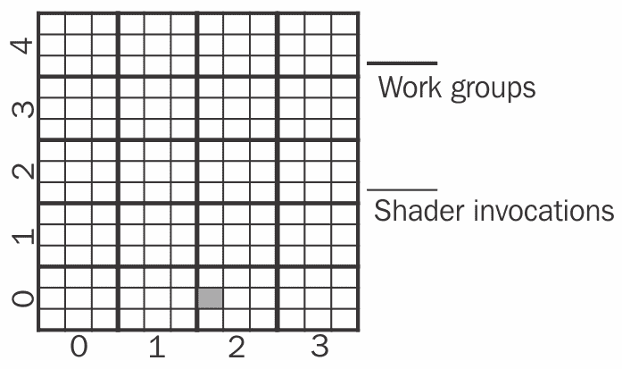

被灰色着色的单元格代表工作组（2, 0）内的调用（0, 1）。在这个例子中，计算着色器调用的总数是 *20 * 9 = 180*。这个着色调用的全局索引是（6, 1）。与一维情况一样，我们可以将这个索引视为一个全局计算空间（没有工作组），并且可以通过每个工作组的调用数乘以工作组索引，再加上局部调用索引来计算（对于每个维度）。对于 *x* 维度，这将等于 *3 * 2 + 0 = 6*，而对于 *y* 维度则是 *3 * 0 + 1 = 1*。

同样的想法可以简单地扩展到三维计算空间。一般来说，我们根据要处理的数据选择维度。例如，如果我正在处理粒子物理学的物理，我可能只有一个粒子列表要处理，因此单维计算空间可能是有意义的。另一方面，如果我正在处理布料模拟，数据将具有网格结构，因此二维计算空间是合适的。

工作组总数和局部着色器调用的数量是有限制的。这些可以通过使用`GL_MAX_COMPUTE_WORK_GROUP_COUNT`、`GL_MAX_COMPUTE_WORK_GROUP_SIZE`和`GL_MAX_COMPUTE_WORK_GROUP_INVOCATIONS`参数（通过`glGetInteger*`查询）来获取。

工作组的执行顺序以及因此的单独着色器调用的顺序是不确定的，系统可以以任何顺序执行它们。因此，我们不应该依赖于工作组的任何特定顺序。特定工作组内的局部调用将并行执行（如果可能）。因此，调用之间的任何通信都应该非常小心。工作组内的调用可以通过共享局部数据通信，但调用（通常）不应与其他工作组的调用通信，除非考虑到涉及的各种陷阱，如死锁和数据竞争。实际上，这些问题也可能出现在工作组内的局部共享数据中，因此必须小心避免这些问题。一般来说，出于效率的考虑，最好只在工作组内尝试通信。与任何类型的并行编程一样，“这里可能有龙。”

OpenGL 提供了一些原子操作和内存屏障，可以帮助调用之间的通信。我们将在接下来的食谱中看到一些示例。

# 执行计算着色器

当我们执行计算着色器时，我们定义计算空间。工作组的数量由`glDispatchCompute`的参数确定。例如，为了使用二维计算空间执行计算着色器，其中*x*维度有`4`个工作组，*y*维度有`5`个工作组（与前面的图匹配），我们将使用以下调用：

```cpp
glDispatchCompute( 4, 5, 1 ); 
```

在 OpenGL 方面，每个工作组中局部调用的数量没有指定。相反，它由计算着色器本身中的布局指定符指定。例如，在这里，我们指定每个工作组有九个局部调用，*x*方向上`3`个，*y*方向上`3`个：

```cpp
layout (local_size_x = 3, local_size_y = 3) in; 
```

在*z*维度的大小可以省略（默认为`1`）。

当计算着色器的特定调用正在执行时，它通常需要确定自己在全局计算空间中的位置。GLSL 提供了一些内置输入变量来帮助实现这一点。其中大部分列在下面的表格中：

| **变量** | **类型** | **含义** |
| --- | --- | --- |
| `gl_WorkGroupSize` | `uvec3` | 每个维度中每个工作组的调用数——与布局指定符中定义的相同。 |
| `gl_NumWorkGroups` | `uvec3` | 每个维度中工作组的总数。 |
| `gl_WorkGroupID` | `uvec3` | 对于这个着色器调用，当前工作组的索引。 |
| `gl_LocalInvocationID` | `uvec3` | 当前调用在当前工作组中的索引。 |
| `gl_GlobalInvocationID` | `uvec3` | 当前调用在全局计算空间中的索引。 |

前一个表格中的最后一个变量，`gl_GlobalInvocationID`，是按照以下方式计算的（每个操作都是分量级的）：

```cpp
gl_WorkGroupID * gl_WorkGroupSize + gl_LocalInvocationID 
```

这有助于我们在全局计算空间中定位当前调用（参考前面的示例）。

GLSL 还定义了 `gl_LocalInvocationIndex`，它是 `gl_LocalInvocationID` 的扁平化形式。当在线性缓冲区中提供多维数据时，它可能会有所帮助，但在随后的任何示例中都没有使用。

# 使用计算着色器实现粒子模拟

在这个菜谱中，我们将实现一个简单的粒子模拟。我们将让计算着色器处理物理计算并直接更新粒子位置。然后，我们只需将粒子渲染为点。如果没有计算着色器，我们就需要在 CPU 上通过遍历粒子数组并按顺序更新每个位置来更新位置，或者利用变换反馈，如第九章“使用噪声在着色器中”中 *创建使用变换反馈的粒子系统* 菜谱所示。

使用顶点着色器进行此类动画有时是不直观的，需要做一些额外的工作（如变换反馈设置）。有了计算着色器，我们可以在 GPU 上并行处理粒子物理，并定制我们的计算空间，以从 GPU 中获得最大的“性价比”。

下图显示了我们的粒子模拟运行，使用了百万个粒子。每个粒子被渲染为一个 1 x 1 的点。粒子部分透明，粒子吸引子被渲染为小的 5 x 5 正方形（几乎看不见）：

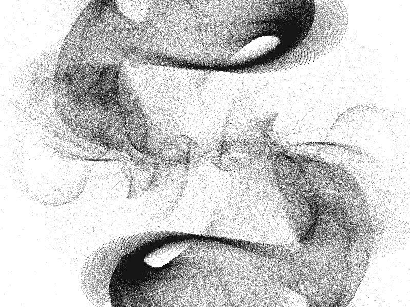

这些模拟可以创建出美丽、抽象的图形，制作起来也非常有趣。

对于我们的模拟，我们将定义一组吸引子（在这个例子中有两个，但你可以创建更多），我将它们称为**黑洞**。它们将是唯一影响我们粒子的对象，并且它们将对每个粒子施加与粒子与黑洞之间距离成反比的力。更正式地说，每个粒子的力将由以下方程确定：

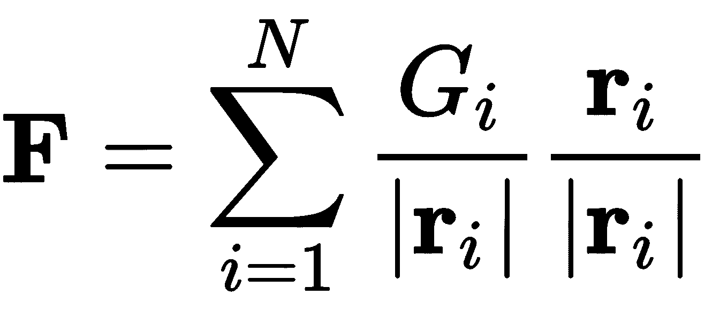

*N* 是黑洞（吸引子）的数量，*r[i]* 是第 *i* 个吸引子与粒子之间的向量（由吸引子的位置减去粒子的位置确定），*G[i]* 是第 *i* 个吸引子的强度。

要实现模拟，我们计算每个粒子的力，然后通过积分牛顿运动方程来更新位置。对于积分运动方程，存在许多经过充分研究的数值技术。对于这个模拟，简单的欧拉方法就足够了。使用欧拉方法，时间 *t + Δt* 时粒子的位置由以下方程给出：

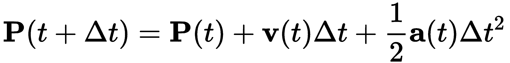

*P* 是粒子的位置，*v* 是速度，*a* 是加速度。同样，更新的速度由以下方程确定：

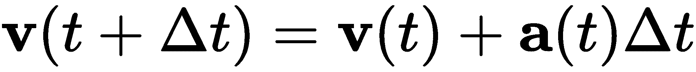

这些方程是从关于时间*t*的位置函数的泰勒展开中推导出来的。结果取决于时间步长的大小（*Δt*），当时间步长非常小的时候更准确。

加速度与粒子上的力成正比，因此通过计算粒子上的力（使用前面的方程），我们本质上得到了加速度的值。为了模拟粒子的运动，我们跟踪其位置和速度，确定粒子由于黑洞而产生的力，然后使用方程更新位置和速度。

我们将使用计算着色器来实现这里的物理。由于我们只是处理粒子列表，我们将使用一维计算空间，并且每个工作组大约有 1,000 个粒子。计算着色器的每次调用将负责更新单个粒子的位置。

我们将使用着色器存储缓冲区对象来跟踪位置和速度，并且在渲染粒子本身时，我们可以直接从位置缓冲区渲染。

# 准备工作

在 OpenGL 方面，我们需要一个粒子位置的缓冲区和速度的缓冲区。创建一个包含粒子初始位置的缓冲区和一个初始速度为零的缓冲区。为了避免数据布局问题，本例中将使用四个分量的位置和速度。例如，要创建位置缓冲区，我们可能做如下操作：

```cpp
vector<GLfloat> initPos; 

... // Set initial positions 

GLuint bufSize = totalParticles * 4 * sizeof(GLfloat); 

GLuint posBuf; 
glGenBuffers(1, &posBuf); 
glBindBufferBase(GL_SHADER_STORAGE_BUFFER, 0, posBuf); 
glBufferData(GL_SHADER_STORAGE_BUFFER, bufSize, &initPos[0], 
               GL_DYNAMIC_DRAW); 
```

对于速度数据，使用类似的过程，但将其绑定到`GL_SHADER_STORAGE_BUFFER`绑定位置的索引一：

```cpp
glBindBufferBase(GL_SHADER_STORAGE_BUFFER, 1, velBuf); 
```

为顶点位置设置一个使用与数据源相同的顶点缓冲区的顶点数组对象。

要渲染点，设置一个仅产生纯色的顶点和片段着色器对。启用混合并设置标准混合函数。

# 如何实现...

执行以下步骤：

1.  我们将使用计算着色器来更新粒子的位置：

```cpp
layout( local_size_x = 1000 ) in; 

uniform float Gravity1 = 1000.0; 
uniform vec3 BlackHolePos1; 
uniform float Gravity2 = 1000.0; 
uniform vec3 BlackHolePos2; 

uniform float ParticleInvMass = 1.0 / 0.1; 
uniform float DeltaT = 0.0005; 

layout(std430, binding=0) buffer Pos { 
  vec4 Position[]; 
}; 
layout(std430, binding=1) buffer Vel { 
  vec4 Velocity[]; 
}; 

void main() { 
  uint idx = gl_GlobalInvocationID.x; 

  vec3 p = Position[idx].xyz; 
  vec3 v = Velocity[idx].xyz; 

  // Force from black hole #1 
  vec3 d = BlackHolePos1 - p; 
  vec3 force = (Gravity1 / length(d)) * normalize(d); 

  // Force from black hole #2 
  d = BlackHolePos2 - p; 
  force += (Gravity2 / length(d)) * normalize(d); 

  // Apply simple Euler integrator 
  vec3 a = force * ParticleInvMass; 
  Position[idx] = vec4( 
        p + v * DeltaT + 0.5 * a * DeltaT * DeltaT, 1.0); 
  Velocity[idx] = vec4( v + a * DeltaT, 0.0); 
} 
```

1.  在渲染例程中，调用计算着色器来更新粒子位置：

```cpp
glDispatchCompute(totalParticles / 1000, 1, 1); 
```

1.  然后，确保通过调用内存屏障来将所有数据写入缓冲区：

```cpp
glMemoryBarrier( GL_SHADER_STORAGE_BARRIER_BIT ); 
```

1.  最后，使用位置缓冲区中的数据渲染粒子。

# 工作原理...

计算着色器首先使用布局指定符定义每个工作组的调用次数：

```cpp
layout( local_size_x = 1000 ) in; 
```

这指定了在*x*维度上每个工作组的`1000`次调用。你可以选择一个对你所运行的硬件最有意义的值。只需确保适当地调整工作组的数量。每个维度的默认大小为 1，因此我们不需要指定*y*和*z*方向的大小。

然后，我们有一组定义模拟参数的均匀变量。`Gravity1` 和 `Gravity2` 是两个黑洞的强度（在先前的方程中为 `G`），而 `BlackHolePos1` 和 `BlackHolePos2` 是它们的位置。`ParticleInvMass` 是每个粒子质量的倒数，用于将力转换为加速度。最后，`DeltaT` 是时间步长的大小，用于在欧拉法中积分运动方程。

接下来声明位置和速度的缓冲区。注意，这里的绑定值与我们初始化缓冲区时在 OpenGL 端使用的值匹配。

在主函数中，我们首先确定这个调用负责的粒子的索引。由于我们正在处理粒子的线性列表，并且粒子的数量

粒子的数量与着色器调用的数量相同，我们想要的是全局调用范围内的索引。这个索引可以通过内置

`gl_GlobalInvocationID.x` 输入变量。我们在这里使用全局索引，因为我们需要的索引是在整个缓冲区内的索引，而不是工作组内的索引，后者只会引用整个数组的一部分。

接下来，我们从它们的缓冲区中检索位置和速度，并计算每个黑洞产生的力，将总和存储在 `force` 变量中。然后，我们将力转换为加速度，并使用欧拉法更新粒子的位置和速度。我们写入之前读取的相同位置。由于调用不共享数据，这是安全的。

在渲染例程中，我们调用计算着色器（在“如何做...”部分的步骤 *2*），定义每个维度的每个工作组的数量。在计算着色器中，我们指定了工作组大小为 `1000`。由于我们希望每个粒子有一个调用，我们将粒子总数除以 `1000` 以确定工作组的数量。

最后，在步骤 *3* 中，在渲染粒子之前，我们需要调用一个内存屏障来确保所有计算着色器的写入都已完全执行。

# 参见

+   示例代码中的 `chapter11/sceneparticles.cpp` 文件。

+   参考第九章 使用噪声在着色器中，了解其他粒子模拟。这些中的大多数都使用变换反馈实现，但也可以使用计算着色器实现。

# 使用计算着色器创建分形纹理

曼德布罗集基于以下复数多项式的迭代：

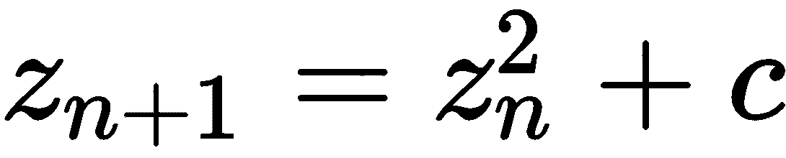

*z*和*c*是复数。从值*z = 0 + 0i*开始，我们重复应用迭代，直到达到最大迭代次数或*z*的值超过指定的最大值。对于给定的*c*值，如果迭代保持稳定（*z*的值不增加超过最大值），则该点是曼德布罗特集内部，我们用黑色着色与*c*相对应的位置。否则，我们根据值超过最大值所需的迭代次数来着色该点。

在以下图像中，曼德布罗特集的图像被作为纹理应用到立方体上：

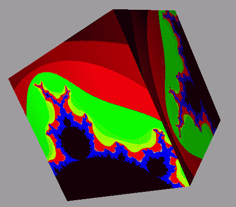

我们将使用计算着色器来评估曼德布罗特集。由于这是一种基于图像的技术，我们将使用一个二维计算空间，每个像素有一个计算着色器调用。每个调用可以独立工作，并且不需要与其他调用共享任何数据。

# 准备工作

创建一个纹理来存储我们的分形计算结果。该图像应使用`glBindImageTexture`绑定到图像纹理单元`0`：

```cpp
GLuint imgTex; 
glGenTextures(1, &imgTex); 
glActiveTexture(GL_TEXTURE0); 
glBindTexture(GL_TEXTURE_2D, imgTex); 
glTexStorage2D(GL_TEXTURE_2D, 1, GL_RGBA8, 256, 256);  
glBindImageTexture(0, imgTex, 0, GL_FALSE, 0, GL_READ_WRITE,  
                   GL_RGBA8); 
```

# 如何做到这一点...

执行以下步骤：

1.  在计算着色器中，我们首先定义每个工作组的着色器调用次数：

```cpp
layout( local_size_x = 32, local_size_y = 32 ) in; 
```

1.  然后，我们声明输出图像以及其他一些统一变量：

```cpp
layout( binding = 0, rgba8) uniform image2D ColorImg; 
#define MAX_ITERATIONS 100 
uniform vec4 CompWindow; 
uniform uint Width = 256; 
uniform uint Height = 256; 
```

1.  我们定义一个函数来计算复平面上给定位置的迭代次数：

```cpp
uint mandelbrot( vec2 c ) { 
  vec2 z = vec2(0.0,0.0); 
  uint i = 0; 
  while(i < MAX_ITERATIONS && (z.x*z.x + z.y*z.y) < 4.0) { 
    z = vec2( z.x*z.x-z.y*z.y+c.x, 2 * z.x*z.y + c.y );  
    i++; 
  } 
  return i; 
} 
```

1.  在主函数中，我们首先计算复空间中像素的大小：

```cpp
void main() { 
  float dx = (CompWindow.z - CompWindow.x) / Width;  
  float dy = (CompWindow.w - CompWindow.y) / Height;
```

1.  然后，我们确定这次调用的`c`值：

```cpp
  vec2 c = vec2(  
      dx * gl_GlobalInvocationID.x + CompWindow.x, 
      dy * gl_GlobalInvocationID.y + CompWindow.y); 
```

1.  接下来，我们调用`mandelbrot`函数并根据迭代次数确定颜色：

```cpp
  uint i = mandelbrot(c);  
  vec4 color = vec4(0.0,0.5,0.5,1); 
  if( i < MAX_ITERATIONS ) { 
    if( i < 5 )  
         color = vec4(float(i)/5.0,0,0,1); 
    else if( i < 10 )  
         color = vec4((float(i)-5.0)/5.0,1,0,1); 
    else if( i < 15 )  
         color = vec4(1,0,(float(i)-10.0)/5.0,1); 
    else color = vec4(0,0,1,0); 
  } 
  else 
    color = vec4(0,0,0,1); 
```

1.  接着，我们将颜色写入输出图像：

```cpp
  imageStore(ColorImg,  
             ivec2(gl_GlobalInvocationID.xy), color);  
} 
```

1.  在 OpenGL 程序的渲染函数中，我们针对每个 texel 执行计算着色器，并调用`glMemoryBarrier`：

```cpp
glDispatchCompute(256/32, 256/32, 1); 
glMemoryBarrier( GL_SHADER_IMAGE_ACCESS_BARRIER_BIT ); 
```

1.  然后，我们渲染场景，将纹理应用到适当的对象上。

# 它是如何工作的...

在步骤 2 中，`ColorImg`统一变量是输出图像。它被定义为位于图像纹理单元`0`（通过`binding`布局选项）。此外，请注意格式是`rgb8`，这必须与创建纹理时在`glTexStorage2D`调用中使用的格式相同。

`MAX_ITERATIONS`是前面提到的复多项式的最大迭代次数。`CompWindow`是我们正在工作的复空间区域。窗口的左下角的前两个组件`CompWindow.xy`是窗口的实部和虚部，而`CompWindow.zw`是右上角。`Width`和`Height`定义了纹理图像的大小。

`mandelbrot`函数（步骤 3）接受一个值*c*作为参数，并重复迭代复函数，直到达到最大迭代次数或`z`的绝对值大于`2`。注意，在这里，我们避免计算平方根，只是比较绝对值的平方与`4`。该函数返回总的迭代次数。

在主函数（第 4 步）中，我们首先计算复窗口内像素的大小（`dx`，`dy`）。这仅仅是窗口大小除以每个维度的 texel 数量。

计算着色器调用负责位于`gl_GlobalInvocationID.xy`的 texel。接下来，我们计算与该 texel 对应的复平面上的点。对于*x*位置（实轴），我们取该方向上 texel 的大小（`dx`）乘以`gl_GlobalInvocationID.x`（这给出了窗口左侧边缘的距离），再加上窗口左侧边缘的位置（`CompWindow.x`）。对于 y 位置（虚轴）也进行类似的计算。

在第 6 步中，我们使用刚刚确定的`c`值调用`mandelbrot`函数，并根据返回的迭代次数确定颜色。

在第 7 步，我们使用`imageStore`将颜色应用到输出图像的`gl_GlobalInvocationID.xy`位置。

在 OpenGL 渲染函数（第 8 步）中，我们使用足够的调用次数来分配计算着色器，使得每个 texel 有一个调用。`glMemoryBarrier`调用确保在继续之前所有对输出图像的写入都已完成。

# 还有更多...

在计算着色器出现之前，我们可能会选择使用片段着色器来完成这项工作。然而，计算着色器为我们提供了更多的灵活性，以定义如何在 GPU 上分配工作。我们还可以通过避免为单个纹理的完整 FBO 开销来提高内存效率。

# 参见

+   示例代码中的`chapter11/scenemandelbrot.cpp`文件

# 使用计算着色器进行布料模拟

计算着色器非常适合利用 GPU 进行物理模拟。布料模拟是一个很好的例子。在这个菜谱中，我们将使用计算着色器实现一个基于粒子-弹簧的简单布料模拟。以下是一张布料通过五个钉子悬挂的模拟图像（您需要想象它在动画化）：

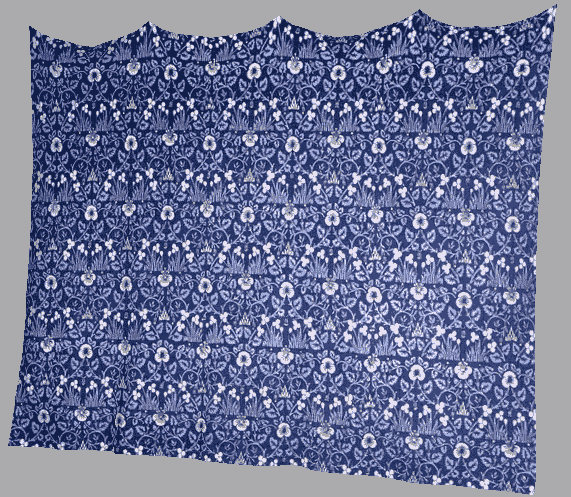

表示布料的一种常见方式是使用粒子-弹簧晶格。布料由一个二维的点质量网格组成，每个点质量通过理想化的弹簧与其八个相邻的质量连接。以下图表示了一个点质量（中心）与其相邻质量连接的情况。线条代表弹簧。深色线条是水平/垂直弹簧，虚线是斜向弹簧：

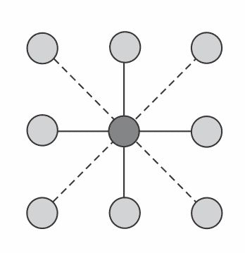

一个粒子的总力是连接到它的八个弹簧产生的力的总和。单个弹簧的力由以下方程给出：

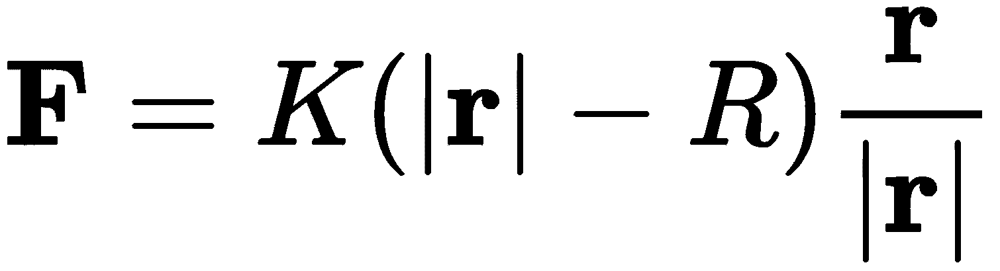

*K* 是弹簧的刚度，*R* 是弹簧的静止长度（弹簧施加零力的长度），而 *r* 是相邻粒子与粒子之间的矢量（相邻粒子的位置减去粒子的位置）。

与之前的配方类似，过程仅仅是计算每个粒子的总力，然后使用我们喜欢的积分方法积分牛顿运动方程。再次强调，我们将使用欧拉法来演示这个例子。有关欧拉法的详细信息，请参阅之前的*使用计算着色器实现粒子模拟*配方。

这个粒子-弹簧晶格显然是一个二维结构，因此将其映射到二维计算空间是有意义的。我们将定义矩形工作组，并为每个粒子使用一个着色器调用。每个调用需要读取其八个邻居的位置，计算粒子的力，并更新粒子的位置和速度。

注意，在这种情况下，每个调用都需要读取相邻粒子的位置。这些相邻粒子将由其他着色器调用更新。由于我们不能依赖于着色器调用的任何执行顺序，我们不能直接读写同一个缓冲区。如果我们这样做，我们就无法确定我们是在读取邻居的原始位置还是它们更新的位置。为了避免这个问题，我们将使用成对的缓冲区。对于每个模拟步骤，一个缓冲区将指定为读取，另一个为写入，然后我们将在下一步中交换它们，并重复此过程。

通过仔细使用局部共享内存，可能能够读写同一个缓冲区；然而，仍然存在工作组边缘的粒子问题。它们的邻居位置由另一个工作组管理，再次，我们面临相同的问题。

这个模拟对数值噪声非常敏感，因此我们需要使用一个非常小的积分时间步长。大约 `0.000005` 的值效果很好。此外，当我们将阻尼力应用于模拟空气阻力时，模拟看起来会更好。模拟空气阻力的一种好方法是添加一个与速度成正比且方向相反的力，如下面的方程所示：


*D* 是阻尼力的强度，而 *v* 是粒子的速度。

# 准备工作

首先为粒子位置和速度设置两个缓冲区。我们将它们绑定到 `GL_SHADER_STORAGE_BUFFER` 索引绑定点，索引 `0` 和 `1` 用于位置缓冲区，`2` 和 `3` 用于速度缓冲区。这些缓冲区中的数据布局很重要。我们将以行主序的顺序从格子的左下角开始布局粒子位置/速度，一直延伸到右上角。

我们还将设置一个顶点数组对象，用于使用粒子位置作为三角形顶点绘制布料。我们可能还需要缓冲区来存储法向量和纹理坐标。为了简洁，我将省略这些内容，但本书的示例代码中包含了它们。

# 如何做...

执行以下步骤：

1.  在计算着色器中，我们首先定义每个工作组中的调用次数：

```cpp
layout( local_size_x = 10, local_size_y = 10 ) in; 
```

1.  然后，我们定义一组用于模拟参数的统一变量：

```cpp
uniform vec3 Gravity = vec3(0,-10,0); 
uniform float ParticleMass = 0.1; 
uniform float ParticleInvMass = 1.0 / 0.1; 
uniform float SpringK = 2000.0; 
uniform float RestLengthHoriz; 
uniform float RestLengthVert; 
uniform float RestLengthDiag; 
uniform float DeltaT = 0.000005; 
uniform float DampingConst = 0.1; 
```

1.  接下来，声明位置和速度的着色器存储缓冲区对：

```cpp
layout(std430, binding=0) buffer PosIn { 
  vec4 PositionIn[]; 
}; 
layout(std430, binding=1) buffer PosOut { 
  vec4 PositionOut[]; 
}; 
layout(std430, binding=2) buffer VelIn { 
  vec4 VelocityIn[]; 
}; 
layout(std430, binding=3) buffer VelOut { 
  vec4 VelocityOut[]; 
}; 
```

1.  在主函数中，我们获取此调用负责的粒子的位置：

    负责：

```cpp
void main() { 
  uvec3 nParticles = gl_NumWorkGroups * gl_WorkGroupSize; 
  uint idx = gl_GlobalInvocationID.y * nParticles.x +  
             gl_GlobalInvocationID.x; 

  vec3 p = vec3(PositionIn[idx]); 
  vec3 v = vec3(VelocityIn[idx]), r; 
```

1.  使用重力产生的力初始化我们的力：

```cpp
  vec3 force = Gravity * ParticleMass; 
```

1.  在此之前的粒子上添加力：

```cpp
  if( gl_GlobalInvocationID.y < nParticles.y - 1 ) { 
    r = PositionIn[idx + nParticles.x].xyz - p; 
    force += normalize(r)*SpringK*(length(r) -  
                                 RestLengthVert); 
  }  
```

1.  对以下粒子以及左侧和右侧的粒子重复前面的步骤。然后，添加来自左上方的粒子的力：

```cpp
  if( gl_GlobalInvocationID.x > 0 &&  
      gl_GlobalInvocationID.y < nParticles.y - 1 ) { 
    r = PositionIn[idx + nParticles.x - 1].xyz - p; 
    force += normalize(r)*SpringK*(length(r) -  
                                 RestLengthDiag); 
  } 
```

1.  对其他三个对角连接的粒子重复前面的步骤。然后，添加阻尼力：

```cpp
  force += -DampingConst * v;
```

1.  接下来，我们使用欧拉方法积分运动方程：

```cpp
  vec3 a = force * ParticleInvMass; 
  PositionOut[idx] = vec4( 
      p + v * DeltaT + 0.5 * a * DeltaT * DeltaT, 1.0); 
  VelocityOut[idx] = vec4( v + a * DeltaT, 0.0); 
```

1.  最后，我们将一些顶点固定，以便它们不会移动：

```cpp
  if( gl_GlobalInvocationID.y == nParticles.y - 1 &&  
      (gl_GlobalInvocationID.x == 0 ||  
       gl_GlobalInvocationID.x == nParticles.x / 4 || 
       gl_GlobalInvocationID.x == nParticles.x * 2 / 4 || 
       gl_GlobalInvocationID.x == nParticles.x * 3 / 4 || 
       gl_GlobalInvocationID.x == nParticles.x - 1)) { 
    PositionOut[idx] = vec4(p, 1.0); 
    VelocityOut[idx] = vec4(0,0,0,0); 
  } 
} 
```

1.  在 OpenGL 渲染函数中，我们调用计算着色器，以便每个工作组负责 100 个粒子。由于时间步长非常小，我们需要多次执行此过程（`1000` 次），每次交换输入和输出缓冲区：

```cpp
for( int i = 0; i < 1000; i++ ) { 
  glDispatchCompute(nParticles.x/10, nParticles.y/10, 1); 
  glMemoryBarrier( GL_SHADER_STORAGE_BARRIER_BIT ); 

  // Swap buffers 
  readBuf = 1 - readBuf; 

  glBindBufferBase(GL_SHADER_STORAGE_BUFFER,0, 
                    posBufs[readBuf]); 
  glBindBufferBase(GL_SHADER_STORAGE_BUFFER,1, 
                   posBufs[1-readBuf]); 
  glBindBufferBase(GL_SHADER_STORAGE_BUFFER,2, 
                   velBufs[readBuf]); 
  glBindBufferBase(GL_SHADER_STORAGE_BUFFER,3, 
                   velBufs[1-readBuf]); 
} 
```

1.  最后，我们使用位置缓冲区中的位置数据渲染布料。

# 它是如何工作的...

我们在每个工作组中使用 `100` 个调用，每个维度 `10` 个。计算着色器中的第一个语句定义了每个工作组中的调用次数：

```cpp
layout( local_size_x = 10, local_size_y = 10 ) in; 
```

下面的统一变量定义了力方程中的常数以及每个水平、垂直和对角弹簧的长度。时间步长大小是 `DeltaT`。接下来声明位置和速度缓冲区。我们定义位置缓冲区在绑定索引 `0` 和 `1`，速度缓冲区在索引 `2` 和 `3`。

在主函数（步骤 4）中，我们首先确定每个维度的粒子数量。这将与工作组的数量乘以工作组大小相同。接下来，我们确定此调用负责的粒子的索引。由于粒子在缓冲区中按行主序组织，我们通过 *y* 方向的全局调用 ID 乘以 *x* 维度的粒子数量，再加上 *x* 方向的全局调用 ID 来计算索引。

在步骤 5 中，我们使用重力，`Gravity` 乘以粒子的质量（`ParticleMass`）来初始化我们的力。请注意，在这里乘以质量实际上并不是必需的，因为所有粒子都有相同的质量。我们只需预先将质量乘入重力常数。

在步骤 6 和 7 中，我们添加了由虚拟弹簧连接的每个相邻粒子对当前粒子的力。对于每根弹簧，我们添加由该弹簧产生的力。然而，我们首先需要检查我们是否位于晶格的边缘。如果是，可能没有相邻的粒子（参见以下图示）。

例如，在上面的代码中，当计算前面弹簧/粒子的力时，我们验证`gl_GlobalInvocationID.y`是否小于*y*维度中粒子数量的减一。如果是这样，那么必须有一个粒子位于这个粒子上方。否则，当前粒子位于晶格的顶部边缘，上方没有相邻的粒子。（本质上，`gl_GlobalInvocationID`包含了粒子在整体晶格中的位置。）我们可以对其他三个水平/垂直方向进行类似的测试。当计算对角连接的粒子的力时，我们需要检查我们是否不在水平和垂直边缘上。例如，在上面的代码中，我们正在寻找位于上方和左方的粒子，因此我们检查`gl_GlobalInvocationID.x`是否大于零（不在左边边缘），以及`gl_GlobalInvocationID.y`是否小于 y 方向中粒子数量的减一（不在顶部边缘）：

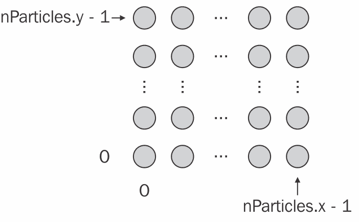

一旦我们验证了相邻粒子的存在，我们就计算连接到该粒子的弹簧产生的力，并将其添加到总力中。我们在缓冲区中按行主序组织粒子。因此，要访问相邻粒子的位置，我们取当前粒子的索引，并添加/减去*x*方向中粒子数量以垂直移动，以及/或添加/减去一个以水平移动。

在步骤 8 中，我们通过将速度乘以阻尼系数`DampingConst`来添加模拟空气阻力的阻尼力，并将其添加到总力中。这里的负号确保力与速度方向相反。

在步骤 9 中，我们应用欧拉方法根据力更新位置和速度。我们将力乘以粒子质量的倒数以获得加速度，然后将欧拉积分的结果存储到输出缓冲区中相应的位置。

最后，在步骤 10 中，如果粒子位于布料顶部的五个固定位置之一，我们重置粒子的位置。

在 OpenGL 渲染函数（步骤 11）中，我们多次调用计算着色器，每次调用后切换输入/输出缓冲区。在调用`glDispatchCompute`之后，我们发出`glMemoryBarrier`调用以确保在交换缓冲区之前所有着色器写入都已完成。一旦完成，我们就使用着色器存储缓冲区中的位置渲染布料。

# 还有更多...

对于渲染，拥有法向量是有用的。一个选项是创建另一个计算着色器，在位置更新后重新计算法向量。例如，我们可能执行前面的计算着色器 1,000 次，然后一次调度其他计算着色器来更新法向量，接着渲染布料。

此外，我们可能通过在工作组内使用局部共享数据来获得更好的性能。在前面的实现中，每个粒子的位置最多被读取八次。每次读取在执行时间上可能都是昂贵的。从更接近 GPU 的内存读取会更快。实现这一点的办法是一次性将数据读入局部共享内存，然后从共享内存中进行后续读取。在下一个配方中，我们将看到一个如何这样做的例子。以类似的方式更新这个配方将是直接的。

# 参见

+   示例代码中的 `chapter11/scenecloth.cpp` 文件

+   *使用计算着色器实现边缘检测滤波器* 的配方

# 使用计算着色器实现边缘检测滤波器

在第六章的 *应用边缘检测滤波器* 配方中，我们看到了如何使用片段着色器实现边缘检测的例子。片段着色器非常适合许多图像处理操作，因为我们可以通过渲染一个填充屏幕的四边形来触发每个像素的片段着色器执行。由于图像处理滤波器通常应用于渲染结果，我们可以将渲染输出到纹理中，然后对每个屏幕像素（通过渲染一个四边形）调用片段着色器，每个片段着色器的调用负责处理单个像素。每次调用可能需要从（渲染的）图像纹理的几个位置读取，并且一个纹理元素可能被不同的调用多次读取。

这在很多情况下都很好用，但片段着色器并不是为图像处理设计的。使用计算着色器，我们可以对着色器调用的分布有更精细的控制，并且我们可以利用局部共享内存来在数据读取上获得更多的效率。

在这个例子中，我们将使用计算着色器重新实现边缘检测滤波器。我们将利用局部（工作组）共享内存来获得额外的速度。由于这种局部内存更接近 GPU，内存访问比直接从着色器存储缓冲区（或纹理）读取要快。

与前面的配方一样，我们将使用 Sobel 算子来实现这个功能，它由两个 3 x 3 的滤波内核组成，如下所示：

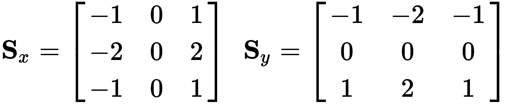

关于 Sobel 算子的详细信息，请参阅第六章，*图像处理和屏幕空间技术*。这里的关键点是，为了计算给定像素的结果，我们需要读取八个相邻像素的值。这意味着每个像素的值需要被提取多达八次（当处理该像素的邻居时）。为了获得一些额外的速度，我们将所需数据复制到本地共享内存中，这样在工作组内，我们可以从共享内存中读取而不是从着色器存储缓冲区中提取。

工作组共享内存通常比纹理或着色器存储内存更快访问。

在本例中，我们将为每个像素使用一个计算着色器调用，并且使用 25 x 25 的 2D 工作组大小。在计算 Sobel 算子之前，我们将相应的像素值复制到工作组的本地共享内存中。对于每个像素，为了计算滤波器，我们需要读取八个相邻像素的值。为了处理工作组边缘的像素，我们需要在我们的本地内存中包含一个额外的像素条，超出工作组的边缘。因此，对于 25 x 25 的工作组大小，我们需要 27 x 27 的存储大小。

# 准备工作

首先，设置渲染到**帧缓冲对象**（**FBO**）并附加一个颜色纹理；我们将把原始预过滤图像渲染到这个纹理上。创建第二个纹理以接收边缘检测滤波器的输出。将这个纹理绑定到单元`0`。我们将使用这个作为计算着色器的输出。使用`glBindImageTexture`将 FBO 纹理绑定到图像纹理单元`0`，并将第二个纹理绑定到图像纹理单元`1`。

接下来，设置一个用于直接渲染到 FBO 以及渲染全屏纹理的顶点/片段着色器对。

# 如何实现...

执行以下步骤：

1.  在计算着色器中，像往常一样，我们首先定义每个工作组的着色器调用次数：

```cpp
layout (local_size_x = 25, local_size_y = 25) in; 
```

1.  接下来，我们声明用于输入和输出图像以及边缘检测阈值的统一变量。输入图像是从 FBO 渲染的图像，输出图像将是边缘检测滤波器的结果：

```cpp
uniform float EdgeThreshold = 0.1; 
layout(binding=0, rgba8) uniform image2D InputImg; 
layout(binding=1, rgba8) uniform image2D OutputImg; 
```

1.  然后，我们声明我们的工作组共享内存，它是一个大小为 27 x 27 的数组：

```cpp
shared float 
     localData[gl_WorkGroupSize.x+2][gl_WorkGroupSize.y+2]; 
```

1.  我们还定义了一个用于计算像素亮度的函数，称为`luminance`。由于相同的函数在几个先前的菜谱中使用，这里不需要重复。

1.  接下来，我们定义一个函数，该函数将 Sobel 滤波器应用于与这个着色器调用对应的像素。它直接从本地共享数据中读取：

```cpp
void applyFilter() 
{ 
  uvec2 p = gl_LocalInvocationID.xy + uvec2(1,1); 

  float sx = localData[p.x-1][p.y-1] +  
            2*localData[p.x-1][p.y] + 
            localData[p.x-1][p.y+1] - 
           (localData[p.x+1][p.y-1] +  
            2 * localData[p.x+1][p.y] +  
            localData[p.x+1][p.y+1]); 
  float sy = localData[p.x-1][p.y+1] +  
             2*localData[p.x][p.y+1] +  
             localData[p.x+1][p.y+1] -  
            (localData[p.x-1][p.y-1] +  
             2 * localData[p.x][p.y-1] +  
             localData[p.x+1][p.y-1]); 
  float g = sx * sx + sy * sy; 

  if( g > EdgeThreshold ) 
    imageStore(OutputImg,  
       ivec2(gl_GlobalInvocationID.xy), vec4(1.0)); 
  else 
    imageStore(OutputImg,  
       ivec2(gl_GlobalInvocationID.xy), vec4(0,0,0,1)); 
} 
```

1.  在主函数中，我们首先将此像素的亮度复制到共享内存数组中：

```cpp
void main() 
{ 
  localData 
   [gl_LocalInvocationID.x+1][gl_LocalInvocationID.y+1] =  
   luminance(imageLoad(InputImg,  
             ivec2(gl_GlobalInvocationID.xy)).rgb); 
```

1.  如果我们在工作组的边缘，我们需要将一个或多个额外的像素复制到共享内存数组中，以便填充边缘周围的像素。因此，我们需要确定我们是否在工作组的边缘（通过检查 `gl_LocalInvocationID`），然后确定我们负责复制的像素。这并不复杂，但由于我们还需要确定外部像素是否实际存在，所以相当复杂且冗长。例如，如果此工作组位于全局图像的边缘，则一些边缘像素不存在（位于图像之外）。由于其长度，我不会在这里包含那段代码。有关完整详情，请从 GitHub 网站获取此书的代码。

1.  一旦我们复制了此着色器调用负责的数据，我们需要等待其他调用执行相同的操作，因此在这里我们调用一个屏障。然后，我们调用我们的 `applyFilter` 函数来计算过滤器并将结果写入输出图像：

```cpp
  barrier(); 

  // Apply the filter using local memory 
  applyFilter(); 
}
```

1.  在 OpenGL 渲染函数中，我们首先将场景渲染到 FBO，然后调度计算着色器，并等待它完成对输出图像的所有写入操作：

```cpp
glDispatchCompute(width/25, height/25, 1); 
glMemoryBarrier(GL_SHADER_IMAGE_ACCESS_BARRIER_BIT); 
```

1.  最后，我们通过全屏四边形将输出图像渲染到屏幕上。

# 它是如何工作的...

在步骤 1 中，我们指定每个工作组 625 次着色器调用，每个维度 25 次。根据代码运行的系统，这可能需要更改以更好地匹配可用的硬件。

常量 `image2D` 变量（步骤 2）是输入和输出图像。注意布局限定符中指示的绑定位置。这些对应于 `glBindImageTexture` 调用中指定的图像单元。输入图像应包含渲染的场景，对应于绑定到 FBO 的图像纹理。输出图像将接收过滤器的结果。请注意使用 `rgb8` 作为格式。这必须与使用 `glTexStorage2D` 创建图像时使用的格式相同。

`localData` 数组在步骤 3 中声明为具有共享限定符。这是我们工作组的本地共享内存。其大小为 27 x 27，以便包括一个额外的条带，边缘宽度为 1 像素。我们在这里存储工作组中所有像素的亮度，以及宽度为 1 的周围像素条的亮度。

`applyFilter` 函数（步骤 5）是计算 Sobel 算子，使用的是 `localData` 中的数据。这相当直接，除了由于边缘额外的条带而需要应用的一个偏移量。负责此调用的像素的亮度位于：

```cpp
p = gl_LocalInvocationID.xy + uvec2(1,1); 
```

如果没有额外的像素条带，我们就可以直接使用 `gl_LocalInvocationID`，但在这里我们需要在每个维度上添加一个偏移量为一的值。

接下来的几个语句只是计算 Sobel 算子，并确定梯度的幅度，存储在`g`中。这是通过读取八个附近像素的亮度，从共享数组`localData`中读取来完成的。

在`applyFilter`函数的末尾，我们将结果写入`OutputImg`。这要么是(1,1,1,1)，要么是(0,0,0,1)，具体取决于`g`是否超过阈值。注意，在这里，我们使用`gl_GlobalInvocationID`作为输出图像中的位置。全局 ID 适用于确定全局图像中的位置，而局部 ID 告诉我们我们在局部工作组中的位置，更适合访问局部共享数组。

在主函数（步骤 6）中，我们计算与此次调用对应的像素（在`gl_GlobalInvocationID`）的亮度，并将其存储在本地共享内存（`localData`）中，位置为`gl_LocalInvocationID + 1`。同样，`+ 1`是由于边缘像素的额外空间。

下一步（步骤 7）是复制边缘像素。我们只有在此次调用位于工作组边缘时才这样做。此外，我们还需要确定边缘像素实际上是否存在。有关详细信息，请参阅本书附带的代码。

在步骤 8 中，我们调用 GLSL 屏障函数。这同步了工作组内所有着色器调用到代码的这个点，确保所有对局部共享数据的写入都已完成。如果不调用屏障函数，则无法保证所有着色器调用都会完成对`localData`的写入，因此数据可能是不完整的。移除此调用并观察结果是有趣的（也是富有教育意义的）。

最后，我们调用`applyFilter`来计算 Sobel 算子并将其写入输出图像。

在 OpenGL 渲染函数中，我们调度计算着色器，以便有足够的工作组来覆盖图像。由于工作组大小为 25 x 25，我们在*x*维度上调用`width/25`个工作组，在*y*维度上调用`height/25`个工作组。结果是输入/输出图像中的每个像素都有一个着色器调用。

# 还有更多...

这是一个使用局部共享内存的简单示例。它仅因我们需要处理额外的行/列像素而略显复杂。然而，一般来说，局部共享数据可以用于工作组内调用之间的任何类型的通信。在这种情况下，数据不是用于通信，而是通过减少从图像的全局读取次数来提高效率。 

注意，共享内存的大小（有时是严格的）有限。我们可以使用`GL_MAX_COMPUTE_SHARED_MEMORY_SIZE`（通过`glGetInteger*`）来查询当前硬件上可用的最大大小。OpenGL 规范要求的最小大小是 32 KB。

# 参见

+   示例代码中的`chapter11/sceneedge.cpp`文件

+   在第六章的*应用边缘检测过滤器*菜谱中，*图像处理和屏幕空间技术*
