# 操作数组

数组是任何编程语言的重要结构。为了将相似类型的数据放在一起，我们需要数组。数组在需要随机访问元素的应用中被大量使用。当您需要排序元素、在集合中查找所需数据或查找两个集合之间的公共或唯一数据时，数组也是一个主要的选择。数组分配了连续的内存位置，并且是排序和搜索数据集合的非常流行的结构，因为可以通过简单地指定其下标或索引位置来访问数组的任何元素。本章将涵盖包括常见数组操作的菜谱。

在本章中，我们将学习如何使用数组制作以下菜谱：

+   在一维数组中插入一个元素

+   乘以两个矩阵

+   查找两个数组中的公共元素

+   查找两个集合或数组之间的差异

+   查找数组中的唯一元素

+   查找矩阵是否为稀疏

+   将两个有序数组合并为一个

让我们从第一个菜谱开始！

# 在数组中插入一个元素

在这个菜谱中，我们将学习如何在数组中插入一个元素。您可以定义数组的长度，也可以指定新值要插入的位置。程序将在值插入后显示数组。

# 如何做到这一点…

1. 假设有一个名为 **p** 的数组，包含五个元素，如下所示：


图 1.1

现在，假设你想在第三个位置输入一个值，比如 **99**。我们将编写一个 C 程序，它将给出以下输出：


图 1.2

以下是插入数组中元素的步骤：

1.  定义一个名为 `max` 的宏并将其初始化为 `100` 的值：

```cpp
#define max 100
```

1.  定义一个大小为最大元素数量的数组 `p`：

```cpp
int p[max]
```

1.  当提示输入数组长度时，输入的长度将被分配给变量 `n`：

```cpp
printf("Enter length of array:");
scanf("%d",&n);
```

1.  将执行一个 `for` 循环，提示您输入数组的元素：

```cpp
for(i=0;i<=n-1;i++ )
    scanf("%d",&p[i]);
```

1.  指定新值需要插入的数组中的位置：

```cpp
printf("\nEnter position where to insert:");
scanf("%d",&k);
```

1.  因为 C 语言中的数组是从零开始的，所以输入的位置会减去 1：

```cpp
k--;
```

1.  为了在指定的索引位置为新元素创建空间，所有元素都会向下移动一个位置：

```cpp
for(j=n-1;j>=k;j--)
    p[j+1]=p[j];
```

1.  输入将插入到空缺索引位置的新值：

```cpp
printf("\nEnter the value to insert:");
scanf("%d",&p[k]);
```

这里是用于在数组中插入元素的 `insertintoarray.c` 程序：

```cpp
#include<stdio.h>
#define max 100
void main()
{
    int p[max], n,i,k,j;
    printf("Enter length of array:");
    scanf("%d",&n);
    printf("Enter %d elements of array\n",n);
    for(i=0;i<=n-1;i++ )
        scanf("%d",&p[i]);
    printf("\nThe array is:\n");
    for(i = 0;i<=n-1;i++)
        printf("%d\n",p[i]);
    printf("\nEnter position where to insert:");
    scanf("%d",&k);
    k--;/*The position is always one value higher than the subscript, so it is decremented by one*/             
    for(j=n-1;j>=k;j--)
        p[j+1]=p[j];
    /* Shifting all the elements of the array one position down from the location of insertion */
    printf("\nEnter the value to insert:");
    scanf("%d",&p[k]);
    printf("\nArray after insertion of element: \n");
    for(i=0;i<=n;i++)
        printf("%d\n",p[i]);
}

```

现在，让我们深入了解代码，以更好地理解它。

# 它是如何工作的...

因为我们需要指定数组的长度，所以我们首先定义一个名为 `max` 的宏并将其初始化为 100 的值。我之所以将 `max` 的值定义为 100，是因为我假设我不会在数组中输入超过 100 个值，但可以设置为所需的任何值。定义了一个大小为 `max` 个元素的数组 `p`。你将被提示指定数组的长度。让我们将数组的长度指定为 5。我们将把值 `5` 赋给变量 `n`。使用 `for` 循环，你将被要求输入数组的元素。

假设你输入的数组值如之前给出的 *图 1.1* 所示：


在前面的图中，数字 0、1、2 等被称为索引或下标，用于从数组中分配和检索值。接下来，你将被要求指定新值需要插入到数组中的位置。假设，你输入 `3`，它被分配给变量 `k`。这意味着你想要在数组的 3 号位置插入一个新值。

因为 C 语言中的数组是从 0 开始计数的，所以位置 3 表示你想要在索引位置 2 插入一个新的值，即 **p[2]**。因此，在 `k` 中输入的位置会减去 1。

为了在索引位置 **p[2]** 为新元素腾出空间，所有元素都将向下移动一个位置。这意味着 **p[4]** 位置的元素将被移动到索引位置 **p[5]**，**p[3]** 位置的元素将被移动到 **p[4]**，而 **p[2]** 位置的元素将被移动到 **p[3]**，如下所示：


图 1.3

一旦目标索引位置的元素安全地复制到下一个位置，你将被要求输入新的值。假设你输入的新值为 `99`；该值将被插入到索引位置 **p[2]**，如之前给出的 *图 1.2* 所示：


让我们使用 GCC 编译 `insertintoarray.c` 程序，如下所示：

```cpp
D:\CBook>gcc insertintoarray.c -o insertintoarray
```

现在，让我们运行生成的可执行文件 `insertintoarray.exe`，以查看程序输出：

```cpp
D:\CBook>./insertintoarray
Enter length of array:5
Enter 5 elements of array
10
20
30
40
50

The array is:
10
20
30
40
50

Enter target position to insert:3
Enter the value to insert:99
Array after insertion of element:
10
20
99
30
40
50
```

哇！我们已经成功地在数组中插入了一个元素。

# 还有更多...

如果我们想要从数组中删除一个元素怎么办？程序流程是简单的反向；换句话说，数组底部的所有元素将被复制一个位置，以替换被删除的元素。

假设数组 **p** 有以下五个元素 (*图 1.1*)：

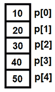

假设，我们想要从数组中删除第三个元素，换句话说，就是位于 **p[2]** 的元素。为此，**p[3]** 位置的元素将被复制到 **p[2]**，**p[4]** 位置的元素将被复制到 **p[3]**，而最后一个元素，在这里是位于 **p[4]** 的，将保持不变：


图 1.4

用于删除数组的 `deletefromarray.c` 程序如下：

```cpp
#include<stdio.h>
void main()
{
    int p[100],i,n,a;
    printf("Enter the length of the array: ");
    scanf("%d",&n);
    printf("Enter %d elements of the array \n",n);
    for(i=0;i<=n-1;i++)
        scanf("%d",&p[i]);
    printf("\nThe array is:\n");\
    for(i=0;i<=n-1;i++)
        printf("%d\n",p[i]);
    printf("Enter the position/location to delete: ");
    scanf("%d",&a);
    a--;
    for(i=a;i<=n-2;i++)
    {
        p[i]=p[i+1];
        /* All values from the bottom of the array are shifted up till 
        the location of the element to be deleted */
    }
    p[n-1]=0;
    /* The vacant position created at the bottom of the array is set to 
    0 */
    printf("Array after deleting the element is\n");
    for(i=0;i<= n-2;i++)
        printf("%d\n",p[i]);
}
```

现在，让我们继续下一个菜谱！

# 乘以两个矩阵

乘以两个矩阵的前提是第一个矩阵的列数必须等于第二个矩阵的行数。

# 如何做到这一点…

1.  创建两个矩阵，每个矩阵的顺序为 **2 x 3** 和 **3 x 4**。

1.  在我们编写矩阵乘法程序之前，我们需要了解矩阵乘法是如何手动执行的。为了做到这一点，让我们假设要相乘的两个矩阵具有以下元素：

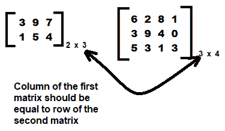

图 1.5

1.  结果矩阵的顺序将是 **2 x 4**，也就是说，结果矩阵将具有与第一个矩阵相同的行数和与第二个矩阵相同的列数：


图 1.6

实质上，**2 x 4** 顺序的结果矩阵将具有以下元素：


图 1.7

1.  结果矩阵中**第一行第一列**的元素使用以下公式计算：

<q>求和（第一个矩阵第一行的第一个元素 × 第二个矩阵第一列的第一个元素），（第一行第二个元素... × 第一列第二个元素...），（以此类推...）</q>

例如，假设两个矩阵的元素如图 *图 1.5* 所示。结果矩阵的第一行第一列的元素将按以下方式计算：

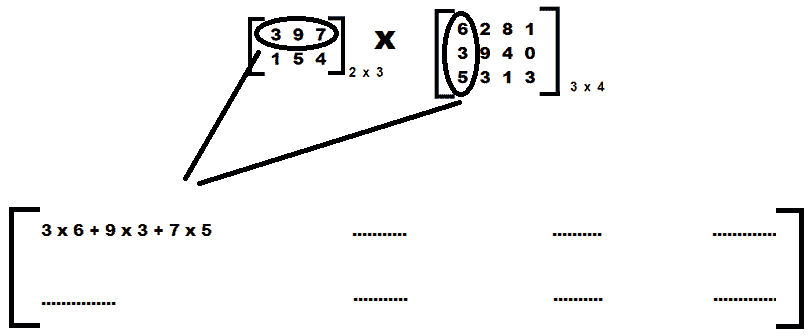

图 1.8

1.  因此，结果矩阵中**第一行第一列**的元素如下：

**(3×6)+(9×3)+(7×5)**

**=18 + 27 + 35**

**=80**

*图 1.9* 解释了结果矩阵中其余元素的计算方法：


图 1.9

两个矩阵相乘的 `matrixmulti.c` 程序如下：

```cpp
#include  <stdio.h>
int main()
{
  int matA[2][3], matB[3][4], matR[2][4];
  int i,j,k;
  printf("Enter elements of the first matrix of order 2 x 3 \n");
  for(i=0;i<2;i++)
  {
    for(j=0;j<3;j++)
    {
      scanf("%d",&matA[i][j]);
    }
  }
  printf("Enter elements of the second matrix of order 3 x 4 \n");
  for(i=0;i<3;i++)
  {
    for(j=0;j<4;j++)
    {
      scanf("%d",&matB[i][j]);
    }
  }
  for(i=0;i<2;i++)
  {
    for(j=0;j<4;j++)
    {
      matR[i][j]=0;
      for(k=0;k<3;k++)
      {
        matR[i][j]=matR[i][j]+matA[i][k]*matB[k][j];
      }
    }
  }
  printf("\nFirst Matrix is \n");
  for(i=0;i<2;i++)
  {
    for(j=0;j<3;j++)
    {
      printf("%d\t",matA[i][j]);
    }
    printf("\n");
  }
  printf("\nSecond Matrix is \n");
  for(i=0;i<3;i++)
  {
    for(j=0;j<4;j++)
    {
      printf("%d\t",matB[i][j]);
    }
    printf("\n");
  }
  printf("\nMatrix multiplication is \n");
  for(i=0;i<2;i++)
  {
    for(j=0;j<4;j++)
    {
      printf("%d\t",matR[i][j]);
    }
    printf("\n");
  }
  return 0;
}
```

现在，让我们深入幕后，更好地理解代码。

# 它是如何工作的...

使用以下语句定义了两个矩阵 `matA` 和 `matB`，它们的顺序分别为 2 x 3 和 3 x 4：

```cpp
int matA[2][3], matB[3][4]
```

您将被要求使用嵌套的 `for` 循环输入两个矩阵的元素。矩阵中的元素以行主序输入，换句话说，首先输入第一行的所有元素，然后是第二行的所有元素，依此类推。

在嵌套循环中，`for i` 和 `for j`，外循环 `for i` 代表行，内循环 `for j` 代表列。

在输入矩阵 `matA` 和 `matB` 的元素时，输入的两个矩阵中的值将被分配到二维数组的相应索引位置，如下所示：


图 1.10

实际计算矩阵乘法的嵌套循环如下：

```cpp
  for(i=0;i<2;i++)
  {
    for(j=0;j<4;j++)
    {
      matR[i][j]=0;
      for(k=0;k<3;k++)
      {
        matR[i][j]=matR[i][j]+matA[i][k]*matB[k][j];
      }
    }
  }
```

变量 `i` 代表结果矩阵的行，`j` 代表结果矩阵的列，`k` 代表公共因子。这里的 <q>公共因子</q> 指的是第一个矩阵的列和第二个矩阵的行。

回想一下，矩阵乘法的先决条件是第一个矩阵的列数应该与第二个矩阵的行数相同。因为相应的元素在乘法后需要相加，所以元素在相加之前必须初始化为 `0`。

以下语句初始化结果矩阵的元素：

```cpp
      matR[i][j]=0;
```

嵌套循环中的 `for k` 循环有助于选择第一个矩阵的行元素，并将它们与第二个矩阵的列元素相乘：

```cpp
matR[i][j]=matR[i][j]+matA[i][k]*matB[k][j];
```

让我们使用 GCC 编译 `matrixmulti.c` 程序，如下所示：

```cpp
D:\CBook>gcc matrixmulti.c -o matrixmulti
```

让我们运行生成的可执行文件 `matrixmulti.exe`，以查看程序的输出：

```cpp
D:\CBook\Chapters\1Arrays>./matrixmulti

Enter elements of the first matrix of order 2 x 3
3
9
7
1
5
4

Enter elements of the second matrix of order 3 x 4
6 2 8 1
3 9 4 0
5 3 1 3

First Matrix is
3 9 7 
1 5 4

Second Matrix is
6 2 8 1
3 9 4 0
5 3 1 3

Matrix multiplication is
80 108 67 24
41 59 32 13
```

哇！我们已经成功地将两个矩阵相乘了。

# 还有更多...

当你输入矩阵的元素时，你可能注意到有两种方法可以做到这一点。

1.  第一种方法是你在输入每个元素后按 *Enter*：

```cpp
3
9
7
1
5
4
```

这些值将自动按照行主序分配到矩阵中，换句话说，`3` 将分配给 `matA[0][0]`，`9` 将分配给 `matA[0][1]`，依此类推。

1.  在矩阵中输入元素的第二种方法是：

```cpp
6 2 8 1
3 9 4 0
5 3 1 3
```

在这里，`6` 将分配给 `matB[0][0]`，`2` 将分配给 `matB[0][1]`，依此类推。

现在，让我们继续下一个菜谱！

# 在两个数组中找到公共元素

在两个数组中找到公共元素类似于找到两个集合的交集。让我们学习如何做到这一点。

# 如何做到这一点...

1.  定义两个特定大小的数组，并将你选择的元素分配给这两个数组。假设我们创建了两个名为 **p** 和 **q** 的数组，它们都有四个元素：

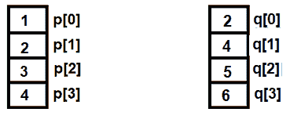

图 1.11

1.  定义另一个数组。让我们称它为数组 **r**，用于存储两个数组之间的公共元素。

1.  如果数组 **p** 中的一个元素存在于数组 **q** 中，它将被添加到数组 **r** 中。例如，如果数组 **p** 中第一个位置的元素，即 **p[0]**，不在数组 **q** 中，它将被丢弃，下一个元素，即 **p[1]**，将被选中进行比较。

1.  如果数组 **p** 中的 **p[0]** 元素在数组 **q** 中任何位置找到，它将被添加到数组 **r** 中，如下所示：

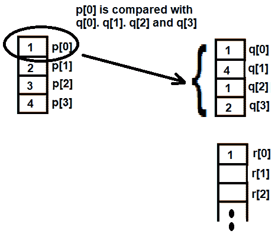

图 1.12

1.  这个过程会与其他数组 **q** 的元素重复。也就是说，**p[1]** 与 **q[0]**、**q[1]**、**q[2]** 和 **q[3]** 进行比较。如果 **p[1]** 在数组 **q** 中找不到，那么在直接将其插入数组 **r** 之前，它会与数组 **r** 中现有的元素进行比较，以避免重复元素。

1.  因为数组 `p` 中的元素 **p[1]** 出现在数组 **q** 中，并且尚未存在于数组 **r** 中，所以它按照以下方式添加到数组 **r** 中：


图 1.13

建立两个数组之间公共元素的 `commoninarray.c` 程序如下：

```cpp
#include<stdio.h>
#define max 100

int ifexists(int z[], int u, int v)
{
    int i;
    if (u==0) return 0;
    for (i=0; i<=u;i++)
        if (z[i]==v) return (1);
    return (0);
}
void main()
{
    int p[max], q[max], r[max];
    int m,n;
    int i,j,k;
    k=0;
    printf("Enter the length of the first array:");
    scanf("%d",&m);
    printf("Enter %d elements of the first array\n",m);
    for(i=0;i<m;i++ )
        scanf("%d",&p[i]);
    printf("\nEnter the length of the second array:");
    scanf("%d",&n);
    printf("Enter %d elements of the second array\n",n);
    for(i=0;i<n;i++ )
        scanf("%d",&q[i]);
    k=0;
    for (i=0;i<m;i++)
    {
        for (j=0;j<n;j++)
        {
           if (p[i]==q[j])
           {
               if(!ifexists(r,k,p[i]))
               {
                   r[k]=p[i];
                   k++;
               }
            }
        }
    }
    if(k>0)
    {
        printf("\nThe common elements in the two arrays are:\n");
        for(i = 0;i<k;i++)
            printf("%d\n",r[i]);
    }
    else
        printf("There are no common elements in the two arrays\n");
}
```

现在，让我们深入了解代码，以更好地理解它。

# 它是如何工作的...

定义了一个大小为 `100` 的宏 `max`。定义了一个函数 `ifexists()`，该函数简单地返回 `true (1)` 或 `false (0)`。如果提供的值存在于指定的数组中，则函数返回 `true`，如果不存在，则返回 `false`。

定义了两个大小为 `max`（换句话说，100 个元素）的数组，分别称为 `p` 和 `q`。您将被提示指定数组 `p` 的长度，然后输入该数组的元素。之后，您将被要求指定数组 `q` 的长度，然后输入数组 `q` 的元素。

然后，选择数组 `p` 中的第一个元素 `p[0]`，并使用 `for` 循环将其与数组 `q` 的所有元素进行比较。如果 `p[0]` 在数组 `q` 中找到，则将 `p[0]` 添加到结果数组 `r` 中。

比较完 `p[0]` 后，将选择数组 `p` 的第二个元素 `p[1]` 并将其与数组 `q` 的所有元素进行比较。这个过程会一直重复，直到数组 `p` 的所有元素都与数组 `q` 的所有元素进行比较。

如果数组 `p` 的任何元素在数组 `q` 中找到，则在将其添加到结果数组 `r` 之前，该元素会通过 `ifexists()` 函数运行以确保该元素尚未存在于数组 `r` 中。这是因为我们不希望在数组 `r` 中有重复的元素。

最后，所有在数组 `r` 中的元素，即两个数组的公共元素，都会显示在屏幕上。

让我们使用 GCC 按以下方式编译 `commoninarray.c` 程序：

```cpp
D:\CBook>gcc commoninarray.c -o commoninarray
```

现在，让我们运行生成的可执行文件 `commoninarray.exe`，以查看程序输出：

```cpp
D:\CBook>./commoninarray
Enter the length of the first array:5
Enter 5 elements in the first array
1
2
3
4
5

Enter the length of the second array:4
Enter 4 elements in the second array
7
8
9
0

There are no common elements in the two arrays
```

由于之前输入的两个数组之间没有公共元素，所以我们不能完全说我们已经真正测试了程序。让我们再次运行程序，这次我们将输入具有共同元素的数组元素。

```cpp
D:\CBook>./commoninarray
Enter the length of the first array:4
Enter 4 elements in the first array
1
2
3
4

Enter the length of the second array:4
Enter 4 elements in the second array
1
4
1
2

The common elements in the two arrays are:
1
2
4
```

哇！我们已经成功识别出两个数组之间的公共元素。

# 查找两个集合或数组之间的差异

当我们谈论两个集合或数组之间的差异时，我们指的是第一个数组中不出现在第二个数组中的所有元素。本质上，第一个数组中不属于第二个数组的所有元素被称为两个集合的差异。例如，集合 `p` 和 `q` 的差异将表示为 `p – q`。

例如，如果数组 `p` 有元素 `{1, 2, 3, 4}`，而数组 `q` 有元素 `{2, 4, 5, 6}`，那么两个数组的差异 `p - q` 将是 `{1,3}`。让我们看看这是如何实现的。

# 如何做到这一点...

1.  定义两个数组，例如 `p` 和 `q`，并分配你选择的元素给这两个数组。

1.  定义一个额外的数组，例如 `r`，用于存储代表两个数组之间差异的元素。

1.  从数组 `p` 中取一个元素，并与数组 `q` 的所有元素进行比较。

1.  如果数组 `p` 的元素存在于数组 `q` 中，则舍弃该元素，取数组 `p` 的下一个元素，并从步骤 3 重新开始。

1.  如果数组 `p` 的元素不在数组 `q` 中，则将该元素添加到数组 `r` 中。在将该元素添加到数组 `r` 之前，请确保它尚未存在于数组 `r` 中。

1.  重复步骤 3 到 5，直到比较完数组 `p` 的所有元素。

1.  在数组 `r` 中显示所有元素，因为这些元素代表了数组 `p` 和 `q` 之间的差异。

建立两个数组之间差异的 `differencearray.c` 程序如下：

```cpp
#include<stdio.h>
#define max 100

int ifexists(int z[], int u, int v)
{
    int i;
    if (u==0) return 0;
    for (i=0; i<=u;i++)
        if (z[i]==v) return (1);
    return (0);
}

void main()
{
    int p[max], q[max], r[max];
    int m,n;
    int i,j,k;
    printf("Enter length of first array:");
    scanf("%d",&m);
    printf("Enter %d elements of first array\n",m);
    for(i=0;i<m;i++ )
        scanf("%d",&p[i]);
    printf("\nEnter length of second array:");
    scanf("%d",&n);
    printf("Enter %d elements of second array\n",n);
    for(i=0;i<n;i++ )                                                                                    scanf("%d",&q[i]);
    k=0;
    for (i=0;i<m;i++)               
    {                                
        for (j=0;j<n;j++)                                
        {
            if (p[i]==q[j])
            {                                                                                                                                    break;                                                   
            }
        }
        if(j==n)
        {
            if(!ifexists(r,k,p[i]))                                               
            {
                r[k]=p[i];
                k++;
            }
        }
    }
    printf("\nThe difference of the two array is:\n");
    for(i = 0;i<k;i++)
        printf("%d\n",r[i]);
}
```

现在，让我们深入了解代码，以便更好地理解它。

# 它是如何工作的...

我们定义了两个数组，分别称为 **p** 和 **q**。我们不想固定这些数组的长度，因此应该定义一个名为 `max` 的宏，其值为 `100`，并将两个数组 **p** 和 **q** 设置为 `max` 的大小。

此后，你将被提示指定第一个数组的大小并输入第一个数组 **p** 的元素。同样，你将被要求指定第二个数组 **q** 的长度，然后输入第二个数组的元素。

假设你已指定两个数组的长度为 4，并已输入以下元素：


图 1.14

我们需要一次从第一个数组中取一个元素，并与第二个数组的所有元素进行比较。如果数组 **p** 中的元素不在数组 **q** 中，它将被分配到我们创建的第三个数组，即数组 **r**。

数组 **r** 将用于存储定义两个数组之间差异的元素。如图 *图 1.15* 所示，数组 **p** 的第一个元素，即 **p[0]**，将与数组 **q** 的所有元素进行比较，即与 **q[0]**、**q[1]**、**q[2]** 和 **q[3]**。

因为位于 `**p[0]**` 的元素，即 `**1**`，没有出现在数组 `**q**` 中，所以它将被添加到数组 **r** 中，表示两个数组之间的第一个差异元素：

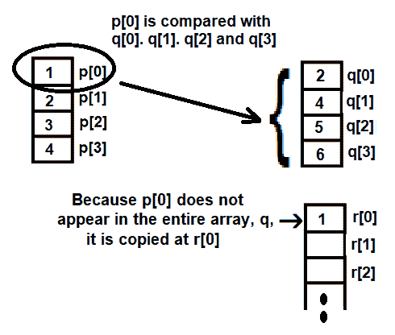

图 1.15

因为位于 `**p[1]**` 的元素，即 `**2**`，出现在数组 `**q**` 中，所以它被舍弃，然后取数组 `**p**` 中的下一个元素，即 `**p[2]**`，并与数组 `**q**` 中的所有元素进行比较。

由于位于 `**p[2]**` 的元素没有出现在数组 `**q**` 中，它将被添加到数组 **r** 的下一个可用位置，即 **r[1]**（如下 *图 1.16* 所示）：

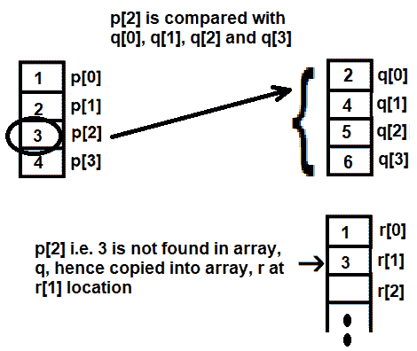

图 1.16

继续执行此过程，直到数组 **p** 的所有元素都与数组 **q** 的所有元素进行比较。最后，我们将得到数组 **r**，其元素显示了我们的两个数组 **p** 和 **q** 之间的差异。

让我们使用 GCC 编译我们的程序，`differencearray.c`，如下所示：

```cpp
D:\CBook>gcc differencearray.c -o differencearray
```

现在，让我们运行生成的可执行文件，`differencearray`，以查看程序的输出：

```cpp
D:\CBook>./differencearray
Enter length of first array:4
Enter 4 elements of first array
1
2
3
4
Enter length of second array:4
Enter 4 elements of second array
2
4
5
6
The difference of the two array is:
1
3
```

哇！我们已经成功找到了两个数组之间的差异。现在，让我们继续下一个菜谱！

# 在数组中查找唯一元素

在这个菜谱中，我们将学习如何查找数组中的唯一元素，以便数组中的重复元素只显示一次。

# 如何做到这一点…

1.  定义两个大小一定的数组 **p** 和 **q**，并将元素仅分配给数组 **p**。我们将数组 **q** 留空。

1.  这些将分别是我们的源数组和目标数组。目标数组将包含源数组的唯一元素。

1.  之后，源数组中的每个元素都将与目标数组中现有的元素进行比较。

1.  如果源数组中的元素存在于目标数组中，则该元素将被丢弃，并从源数组中取出下一个元素进行比较。

1.  如果源数组元素不在目标数组中，它将被复制到目标数组中。

1.  假设数组 **p** 包含以下重复元素：


图 1.17

1.  我们将首先将源数组 **p** 的第一个元素复制到目标数组 **q** 中，换句话说，**p[0]** 复制到数组 **q[0]**，如下所示：


图 1.18

1.  接下来，比较 **p** 的第二个数组元素，换句话说，**p[1]**，与数组 **q** 中所有现有的元素。也就是说，**p[1]** 与数组 **q** 进行比较，以检查它是否已经存在于数组 **q** 中，如下所示：

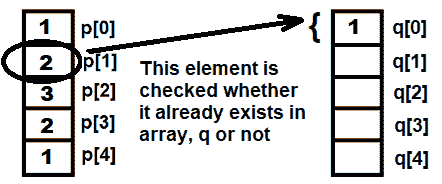

图 1.19

1.  因为 **p[1]** 不存在于数组 **q** 中，所以它被复制到 **q[1]**，如图 *1.20* 所示：

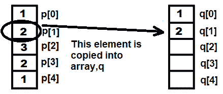

图 1.20

1.  此过程会重复进行，直到数组 **p** 的所有元素都与数组 **q** 进行比较。最后，我们将得到数组 **q**，它将包含数组 **p** 的唯一元素。

这是用于在第一个数组中查找唯一元素的 `uniqueelements.c` 程序：

```cpp
#include<stdio.h>
#define max 100

int ifexists(int z[], int u, int v)
{
    int i;
    for (i=0; i<u;i++)
        if (z[i]==v) return (1);
    return (0);
}

void main()
{
    int p[max], q[max];
    int m;
    int i,k;
    k=0;
    printf("Enter length of the array:");
    scanf("%d",&m);
    printf("Enter %d elements of the array\n",m);
    for(i=0;i<m;i++ )
        scanf("%d",&p[i]);
    q[0]=p[0];
    k=1;
    for (i=1;i<m;i++)
    {
        if(!ifexists(q,k,p[i]))
        {
            q[k]=p[i];
            k++;
        }
    }
    printf("\nThe unique elements in the array are:\n");
    for(i = 0;i<k;i++)
        printf("%d\n",q[i]);
}
```

现在，让我们深入了解代码，以更好地理解它。

# 它是如何工作的...

我们将定义一个大小为 `100` 的宏 `max`。定义两个大小为 `max` 的数组 `p` 和 `q`。数组 `p` 将包含原始元素，而数组 `q` 将包含数组 `p` 的唯一元素。您将被提示输入数组的长度，然后使用 `for` 循环，将数组元素接受并分配给数组 `p`。

以下语句将数组`p`的第一个元素赋值给空白数组`q`的第一个索引位置，我们将该数组命名为`q`：

```cpp
q[0]=p[0]
```

再次使用`for`循环逐个访问数组`p`的其余元素。首先，数组`p`的第一个元素，即`p[0]`，被复制到数组`q`的`q[0]`位置。

接下来，比较第二个数组`p`的元素`p[1]`与数组`q`中所有现有的元素。也就是说，`p[1]`被检查是否已经存在于数组`q`中。

因为数组`q`中只有一个元素，所以`p[1]`与`q[0]`进行比较。由于`p[1]`不在数组`q`中，它被复制到`q[1]`。

这个过程会重复进行，直到数组`p`中的所有元素都被检查和比较。数组`p`访问到的每个元素都会通过`ifexists()`函数来检查它们是否已经存在于数组`q`中。

如果数组`p`中的元素已经在数组`q`中，函数将返回`1`。在这种情况下，数组`p`中的元素将被丢弃，下一个数组元素将被选中进行比较。

如果`ifexists()`函数返回`0`，确认数组`p`中的元素不在数组`q`中，则数组`p`的元素将被添加到数组`q`的下一个可用索引/下标位置。

当检查并比较数组`p`的所有元素后，数组`q`将只包含数组`p`的唯一元素。

让我们使用 GCC 编译`uniqueelements.c`程序，如下所示：

```cpp
D:\CBook>gcc uniqueelements.c -o uniqueelements
```

现在，让我们运行生成的可执行文件`uniqueelements.exe`，以查看程序的输出：

```cpp
D:\CBook>./uniqueelements
Enter the length of the array:5
Enter 5 elements in the array
1
2
3
2
1

The unique elements in the array are:
1
2
3
```

哇！我们已经成功识别了数组中的唯一元素。现在，让我们继续下一个菜谱！

# 判断矩阵是否为稀疏

当一个矩阵的零值多于非零值时（非零值多时为密集矩阵），它被认为是稀疏矩阵。在这个菜谱中，我们将学习如何判断指定的矩阵是否为稀疏。

# 如何做到这一点…

1.  首先，指定矩阵的阶数。然后，您将被提示输入矩阵中的元素。假设您指定了矩阵的阶数为 4 x 4。在输入矩阵元素后，它可能看起来像这样：


图 1.21

1.  一旦输入了矩阵的元素，就计算其中的零的数量。为此，初始化一个计数器为**0**。使用嵌套循环，扫描矩阵中的每个元素，并在找到任何零元素时，将计数器的值增加 1。

1.  此后，使用以下公式来确定矩阵是否为稀疏。

*如果计数器 > [(行数 x 列数) / 2] = 稀疏矩阵*

1.  根据前面公式的结果，屏幕上会显示以下消息之一：

```cpp
The given matrix is a sparse matrix
```

或者

```cpp
The given matrix is not a sparse matrix
```

用于确定矩阵是否为稀疏的`sparsematrix.c`程序如下：

```cpp
#include <stdio.h>
#define max 100

/*A sparse matrix has more zero elements than nonzero elements */
void main ()
{
    static int arr[max][max];
    int i,j,r,c;
    int ctr=0;
    printf("How many rows and columns are in this matrix? ");
    scanf("%d %d", &r, &c);
    printf("Enter the elements in the matrix :\n");
    for(i=0;i<r;i++)
    {
        for(j=0;j<c;j++)
        {
            scanf("%d",&arr[i][j]);
            if (arr[i][j]==0)
                ++ctr;
        }
    }
    if (ctr>((r*c)/2))
        printf ("The given matrix is a sparse matrix. \n");
    else
        printf ("The given matrix is not a sparse matrix.\n");
    printf ("There are %d number of zeros in the matrix.\n",ctr);
}
```

现在，让我们深入了解代码，以更好地理解它。

# 它是如何工作的...

因为我们不想固定矩阵的大小，我们将定义一个名为 `max` 的宏，其值为 100。定义了一个矩阵，或称为二维数组 **arr**，其阶数为 max x max。你将被提示输入矩阵的阶数，你可以输入任何 100 以内的值。

假设你已经指定了矩阵的阶数为 4 x 4。你将被提示输入矩阵的元素。矩阵中输入的值将按照行主序排列。输入元素后，矩阵 **arr** 应该看起来像 *图 1.22*，如下所示：

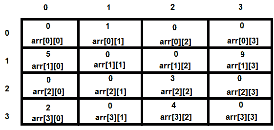

图 1.22

创建了一个名为 `ctr` 的计数器，并将其初始化为 `0`。使用嵌套循环，检查矩阵 `arr` 的每个元素，如果发现任何元素是 0，则将 `ctr` 的值增加。之后，使用 `if else` 语句检查零值的数量是否多于非零值。如果零值的数量多于非零值，则将在屏幕上显示以下消息：

```cpp
The given matrix is a sparse matrix
```

然而，如果没有满足这些条件，屏幕上将会显示以下消息：

```cpp
The given matrix is not a sparse matrix
```

让我们使用 GCC 编译 `sparsematrix.c` 程序，如下所示：

```cpp
D:\CBook>gcc sparsematrix.c -o sparsematrix
```

让我们运行生成的可执行文件，`sparsematrix.exe`，以查看程序的输出：

```cpp
D:\CBook>./sparsematrix
How many rows and columns are in this matrix? 4 4
Enter the elements in the matrix :
0 1 0 0
5 0 0 9
0 0 3 0
2 0 4 0
The given matrix is a sparse matrix.
There are 10 zeros in the matrix.
```

好的。让我们再次运行程序，以查看非零值数量更多时的输出：

```cpp
D:\CBook>./sparsematrix
How many rows and columns are in this matrix? 4 4
Enter the elements in the matrix:
1 0 3 4
0 0 2 9
8 6 5 1
0 7 0 4
The given matrix is not a sparse matrix.
There are 5 zeros in the matrix.
```

哇！我们已经成功识别了一个稀疏矩阵和一个非稀疏矩阵。

# 还有更多...

那么，如何找到一个单位矩阵，换句话说，判断用户输入的矩阵是否为单位矩阵呢？让我告诉你——如果一个矩阵是一个方阵，且主对角线上的所有元素都是 1，而其他所有元素都是 0，那么这个矩阵就是一个单位矩阵。一个 **3 x 3** 阶的单位矩阵可能如下所示：

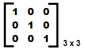

图 1.23

在前面的图中，你可以看到矩阵的主对角线元素是 1，其余元素都是 0。主对角线元素的索引或下标位置将是 `arr[0][0]`、`arr[1][1]` 和 `arr[2][2]`，因此按照以下步骤来检查矩阵是否是单位矩阵：

+   检查行和列的索引位置是否相同，换句话说，如果行号是 0，列号也是 0，那么在该索引位置 [0][0]，矩阵元素必须是 `1`。同样，如果行号是 1，列号也是 1，即在 [1][1] 索引位置，矩阵元素必须是 `1`。

+   验证矩阵在其他所有索引位置上的元素都是 `0`。

如果满足上述两个条件，则该矩阵是单位矩阵，否则不是。

以下是一个 `identitymatrix.c` 程序，用于判断输入的矩阵是否为单位矩阵：

```cpp
    #include <stdio.h>
#define max 100
/* All the elements of the principal diagonal of the  Identity matrix  are ones and rest all are zero elements  */
void main ()
{
    static int arr[max][max];
    int i,j,r,c, bool;
    printf("How many rows and columns are in this matrix ? ");
    scanf("%d %d", &r, &c);
    if (r !=c)
    {
        printf("An identity matrix is a square matrix\n");
        printf("Because this matrix is not a square matrix, so it is not an 
           identity matrix\n");
    }
    else
    {
        printf("Enter elements in the matrix :\n");
        for(i=0;i<r;i++)
        {
            for(j=0;j<c;j++)
            {
                scanf("%d",&arr[i][j]);
            }
        }
        printf("\nThe entered matrix is \n");
        for(i=0;i<r;i++)
        {
            for(j=0;j<c;j++)
            {
                printf("%d\t",arr[i][j]);
            }
            printf("\n");
        }
        bool=1;
        for(i=0;i<r;i++)
        {
            for(j=0;j<c;j++)
            {
                if(i==j)
                {
                    if(arr[i][j] !=1)
                    {
                        bool=0;
                        break;
                    }
                }
                else
                {
                    if(arr[i][j] !=0)
                    {
                        bool=0;
                        break;
                    }
                }
            }
        }
        if(bool)
            printf("\nMatrix is an identity matrix\n");                             
        else 
            printf("\nMatrix is not an identity matrix\n");                
    }
}
```

让我们使用 GCC 编译 `identitymatrix.c` 程序，如下所示：

```cpp
D:\CBook>gcc identitymatrix.c -o identitymatrix
```

没有生成错误。这意味着程序编译完美，生成了一个可执行文件。让我们运行生成的可执行文件。首先，我们将输入一个非方阵：

```cpp
D:\CBook>./identitymatrix
How many rows and columns are in this matrix ? 3 4
An identity matrix is a square matrix 
Because this matrix is not a square matrix, so it is not an identity matrix
```

现在，让我们再次运行程序；这次，我们将输入一个方阵

```cpp
D:\CBook>./identitymatrix 
How many rows and columns are in this matrix ? 3 3 
Enter elements in the matrix : 
1 0 1 
1 1 0 
0 0 1 

The entered matrix is 
1       0       1 
1       1       0 
0       0       1 

Matrix is not an identity matrix
```

因为前面矩阵中的非对角线元素是 `1`，它不是一个单位矩阵。让我们再次运行程序：

```cpp
D:\CBook>./identitymatrix 
How many rows and columns are in this matrix ? 3 3
Enter elements in the matrix :
1 0 0
0 1 0
0 0 1
The entered matrix is
1       0       0
0       1       0
0       0       1
Matrix is an identity matrix
```

现在，让我们继续下一个菜谱！

# 将两个排序数组合并成一个数组

在这个菜谱中，我们将学习如何合并两个排序数组，以便生成的合并数组也是排序的。

# 如何做...

1.  假设有两个长度一定的数组 **p** 和 **q**。两个数组的长度可以不同。它们都包含一些排序元素，如图 *1.24* 所示：


图 1.24

1.  从前面两个数组的排序元素中创建的合并数组将被称为数组 **r**。将使用三个下标或索引位置来指向三个数组中的相应元素。

1.  下标 `i` 将用于指向数组 `p` 的索引位置。下标 `j` 将用于指向数组 `q` 的索引位置，下标 `k` 将用于指向数组 `r` 的索引位置。一开始，所有三个下标都将初始化为 `0`。

1.  将应用以下三个公式来获取合并的排序数组：

    1.  将比较 `p[i]` 中的元素与 `q[j]` 中的元素。如果 `p[i]` 小于 `q[j]`，则将 `p[i]` 分配给数组 `r`，并增加数组 `p` 和 `r` 的索引，以便选择数组 `p` 的下一个元素进行比较，如下所示：

```cpp
r[k]=p[i];
i++;
k++
```

1.  如果 `q[j]` 小于 `p[i]`，则将 `q[j]` 分配给数组 `r`，并增加数组 `q` 和 `r` 的索引，以便选择数组 `q` 的下一个元素进行比较，如下所示：

```cpp
r[k]=q[j];
i++;
k++
```

1.  如果 `p[i]` 等于 `q[j]`，则两个元素都分配给数组 `r`。`p[i]` 被添加到 `r[k]`。`i` 和 `k` 索引的值增加。`q[j]` 也被添加到 `r[k]`，`q` 和 `r` 数组的索引增加。请参考以下代码片段：

```cpp
r[k]=p[i];
i++;
k++
r[k]=q[j];
i++;
k++
```

1.  这个过程将重复进行，直到任一数组结束。如果任一数组结束，另一个数组的剩余元素将简单地追加到数组 `r` 中。

合并两个排序数组 `mergetwosortedarrays.c` 程序如下：

```cpp
#include<stdio.h>
#define max 100

void main()
{
    int p[max], q[max], r[max];
    int m,n;
    int i,j,k;
    printf("Enter length of first array:");
    scanf("%d",&m);
    printf("Enter %d elements of the first array in sorted order     
    \n",m);
    for(i=0;i<m;i++)
        scanf("%d",&p[i]);
    printf("\nEnter length of second array:");
    scanf("%d",&n);
    printf("Enter %d elements of the second array in sorted 
    order\n",n);
    for(i=0;i<n;i++ )
        scanf("%d",&q[i]);
    i=j=k=0;
    while ((i<m) && (j <n))
    {
        if(p[i] < q[j])
        {
            r[k]=p[i];
            i++;
            k++;
        }
        else
        {
            if(q[j]< p[i])
            {
                r[k]=q[j];
                k++;
                j++;
            }
            else
            {
                r[k]=p[i];
                k++;
                i++;
                r[k]=q[j];
                k++;
                j++;
            }
        }
    }
    while(i<m)
    {
        r[k]=p[i];
        k++;
        i++;
    }
    while(j<n)
    {
        r[k]=q[j];
        k++;
        j++;
    }
    printf("\nThe combined sorted array is:\n");
    for(i = 0;i<k;i++)
        printf("%d\n",r[i]);
}
```

现在，让我们深入了解代码，以更好地理解它。

# 它是如何工作的...

定义了一个大小为 `100` 的宏 `max`。定义了三个大小为 `max` 的数组，`p`、`q` 和 `r`。你首先将被要求输入第一个数组 `p` 的大小，然后输入数组 `p` 的排序元素。这个过程将重复用于第二个数组 `q`。

三个索引 `i`、`j` 和 `k` 被定义并初始化为 `0`。这三个索引将分别指向三个数组 `p`、`q` 和 `r` 的元素。

数组 **p** 和 **q** 的第一个元素，换句话说，**p[0]** 和 **q[0]**，将被比较，较小的值将被分配到数组 **r**。

因为 `**q[0]**` 小于 `**p[0]**`，所以 `**q[0]**` 被添加到数组 `**r**`，并且 `**q**` 和 `**r**` 数组的索引将增加以进行下一次比较，如下所示：

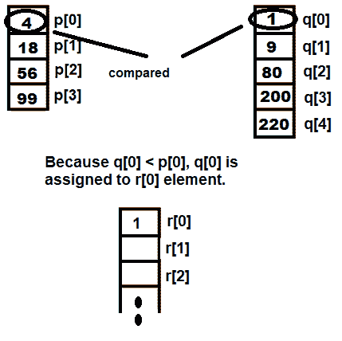

图 1.25

接下来，将比较 `**p[0]**` 与 `**q[1]**`。因为 `**p[0]**` 小于 `**q[1]**`，所以 `**p[0]**` 的值将被分配到数组 `**r**` 的 `**r[1]**` 位置：

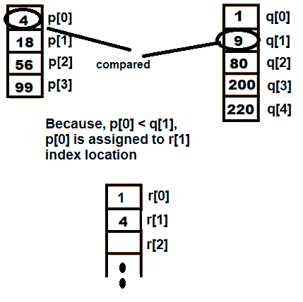

图 1.26

然后，将比较 `**p[1]**` 与 `**q[1]**`。因为 `**q[1]**` 小于 `**p[1]**`，所以 `**q[1]**` 将被分配到数组 `**r**`，并且 `**q**` 和 `**r**` 数组的索引将增加以进行下一次比较（参见图下所示）：

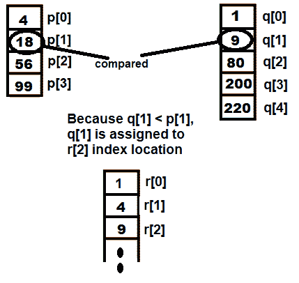

图 1.27

让我们使用 GCC 编译 `mergetwosortedarrays.c` 程序，如下所示：

```cpp
D:\CBook>gcc mergetwosortedarrays.c -o mergetwosortedarrays
```

现在，让我们运行生成的可执行文件 `mergetwosortedarrays.exe`，以查看程序的输出：

```cpp
D:\CBook>./mergetwosortedarrays
Enter length of first array:4
Enter 4 elements of the first array in sorted order
4
18
56
99

Enter length of second array:5
Enter 5 elements of the second array in sorted order
1
9
80
200
220

The combined sorted array is:
1
4
9
18
56
80
99
200
220
```

哇！我们已经成功地将两个排序后的数组合并成了一个。
