# 探索函数

无论何时你需要创建一个大型应用程序，将其划分为可管理的块，称为**函数**，都是一个明智的决定。函数是代表可以独立执行的任务的小模块。函数内部编写的代码可以被多次调用，这有助于避免重复的语句。

函数有助于任何应用程序的团队合作、调试和扩展。当你想要向应用程序添加更多功能时，只需向其中添加几个函数即可。在调用函数时，调用函数可能会传递某些参数，称为**实际参数**；这些参数随后被分配给函数的参数。参数也被称为形式参数。

以下食谱将帮助您了解如何使用函数使复杂的应用程序更容易管理和使用。通常，一个函数只能返回一个值。但在这章中，我们将学习一种从函数中返回多个值的技术。我们还将学习如何在函数中应用递归。

在本章中，我们将介绍以下关于字符串的食谱：

+   判断一个数是否是阿姆斯特朗数

+   返回数组的最大和最小值

+   使用递归寻找最大公约数

+   将二进制数转换为十六进制数

+   判断一个数是否是回文数

由于我将在本章的食谱中使用栈结构，让我们快速介绍一下栈。

# 什么是栈？

栈是一种可以用数组以及链表实现的构造。它是一种桶，你输入的值将被添加到底部。你添加到栈中的下一个项目将位于之前添加的项目之上。将值添加到栈中的过程称为`push`操作，从栈中获取值的过程称为`pop`操作。可以添加或取出值的栈的位置由一个称为**top**的指针指向。当栈为空时，**top**指针的值是**-1**：

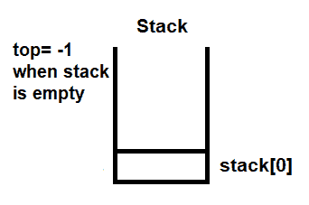

图 3.1

当执行`push`操作时，**top**的值增加**1**，以便它能够指向可以推入值的栈中的位置：

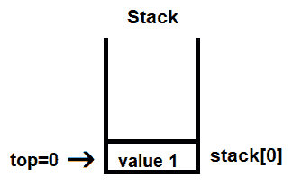

图 3.2

现在，下一个将被推入的值将位于值 1 之上。更确切地说，**top**指针的值将增加**1**，使其值为 1，下一个值将被推入**stack[1]**位置，如下所示：

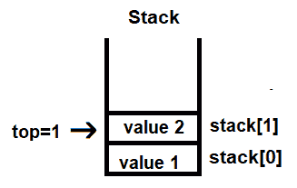

图 3.3

因此，你可以看到栈是一种**后进先出**（**LIFO**）结构；也就是说，最后推入的值位于顶部。

现在，当我们执行`pop`操作时，顶部的值，即值**2**，将首先被弹出，然后是值**1**的弹出。基本上，在`pop`操作中，由**top**指针指向的值被取出，然后**top**的值递减 1，以便它可以指向下一个要弹出的值。

现在，我们已经理解了栈，让我们从第一个菜谱开始。

# 查找数字是否为阿姆斯特朗数

阿姆斯特朗数是一个三位整数，它是其各个数字的立方和。这仅仅意味着如果`xyz = x³+y³+z³`，它就是一个阿姆斯特朗数。例如，153 是一个阿姆斯特朗数，因为`1³+5³+3³ = 153`。

类似地，如果一个由四个数字组成的数字的各个数字的四次幂之和等于该数字，那么这个数字就是一个阿姆斯特朗数。例如，`pqrs = p⁴+q⁴+r⁴+s⁴`。

# 如何做到这一点…

1.  输入一个数字以分配给`n`变量：

```cpp
printf("Enter a number ");
scanf("%d",&n);
```

1.  调用`findarmstrong`函数。分配给`n`的值将传递给此函数：

```cpp
findarmstrong(n)
```

1.  在函数中，传递的参数 n 被分配给`numb`参数。执行一个`while`循环来分离`numb`参数中的所有数字：

```cpp
while(numb >0)
```

1.  在`while`循环中，对分配给`numb`变量的数字应用模 10（`%10`）运算符。模运算符将一个数字除以另一个数字并返回余数：

```cpp
remainder=numb%10;
```

1.  将余数推入栈：

```cpp
push(remainder);
```

1.  通过将`numb`变量除以`10`来移除`numb`变量中的最后一位数字：

```cpp
numb=numb/10;
```

1.  重复步骤 4 到 6，直到`numb`变量中的数字变为 0。此外，创建一个`count`计数器来计算数字中的数字数量。将计数器初始化为`0`，它将在`while`循环期间递增：

```cpp
count++;
```

1.  从栈中弹出所有数字并提升到给定的幂。要弹出栈中的所有数字，执行一个`while`循环，该循环将执行，直到`top`大于或等于`0`，即直到栈为空：

```cpp
while(top >=0)
```

1.  在`while`循环内部，从栈中弹出一个数字并将其提升到`count`的幂，其中`count`是所选数字中数字的数量。然后，将所有数字加到`value`上：

```cpp
j=pop();
value=value+pow(j,count);
```

1.  将`value`变量中的数字与`numb`变量中的数字进行比较，并编写代码以在比较的数字匹配时返回值`1`：

```cpp
if(value==numb)return 1;
```

如果`numb`和`value`变量中的数字相同，返回布尔值`1`，这意味着该数字是一个阿姆斯特朗数。

这里是用于找出指定数字是否为阿姆斯特朗数的`armstrong.c`程序：

```cpp
/* Finding whether the entered number is an Armstrong number */
# include <stdio.h>
# include <math.h>

#define max 10

int top=-1;
int stack[max];
void push(int);
int pop();
int findarmstrong(int );
void main()
{
   int n;
   printf("Enter a number ");
   scanf("%d",&n);
   if (findarmstrong(n))
      printf("%d is an armstrong number",n);
   else printf("%d is not an armstrong number", n);
}
int findarmstrong(int numb)
{
   int j, remainder, temp,count,value;
   temp=numb;
   count=0;
   while(numb >0)
   {
      remainder=numb%10;
      push(remainder);
      count++;
      numb=numb/10;
   }
   numb=temp;
   value=0;
   while(top >=0)
   {
      j=pop();
      value=value+pow(j,count);
   }
   if(value==numb)return 1;
   else return 0;
}
void push(int m)
{
   top++;
   stack[top]=m;
}
int pop()
{
   int j;
   if(top==-1)return(top);
   else
   {
      j=stack[top];
      top--;
      return(j);
   }
}
```

现在，让我们看看幕后。

# 它是如何工作的…

首先，我们将应用模**10**运算符来分离我们的数字。假设我们输入的数字是**153**，你可以看到**153**被除以**10**，余下的**3**被推入栈中：

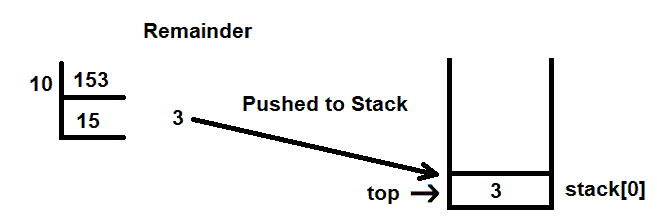

图 3.4

栈中的值将被推入由 **top** 指示的索引位置。最初，**top** 的值是 -1。这是因为在进行 `push` 操作之前，**top** 的值增加了 1，而数组是基于零的，也就是说，数组的第一个元素放置在 0 索引位置。因此，**top** 的值必须初始化为 -1。如前所述，在推入之前，**top** 的值增加 1，即 **top** 的值将变为 **0**，余数 **3** 被推入 **stack[0]**。

在栈中，`top` 的值增加 1 以指示栈中将要推入值的位置。

我们将再次应用模 **10** 运算符到 **15** 的商上。我们将得到的余数是 **5**，它将被推入栈中。同样，在推入栈之前，**top** 的值，原本是 0，被增加到 1。在 **stack[1]**，余数被推入：

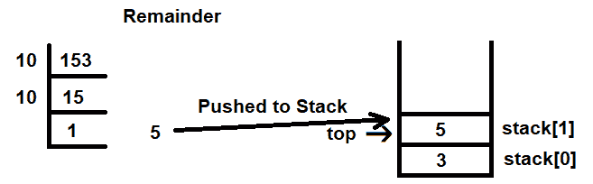

图 3.5

对于 **1** 的商，我们将再次应用模 **10** 运算符。但是因为 1 不能被 **10** 整除，所以 **1** 本身将被视为余数并推入栈中。**top** 的值将再次增加 1，**1** 将被推入 **stack[2]**：

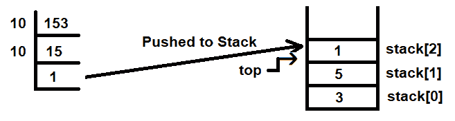

图 3.6

一旦所有数字都被分离并放置在栈中，我们将逐个弹出它们。然后，我们将每个数字提升到等于数字个数的幂。因为数字 **153** 由三个数字组成，每个数字都被提升到 **3** 的幂。

当从栈中弹出值时，由 **top** 指针指示的值将被弹出。**top** 的值是 **2**，因此 **stack[2]** 中的值，即 **1**，被弹出并提升到 **3** 的幂，如下所示：

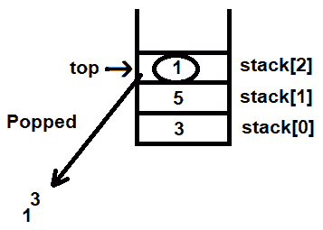

图 3.7

弹出操作后，**top** 的值将减少到 1，以指示下一个要弹出的位置。接下来，**stack[1]** 中的值将被弹出并提升到 **3** 的幂。然后我们将这个值添加到之前弹出的值中：

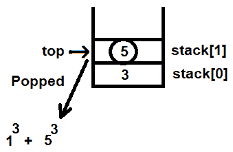

图 3.8

弹出操作后，**top** 的值减少 1，现在其值为 **0**。因此，**stack[0]** 中的值被弹出并提升到 **3** 的幂。这个结果被添加到我们之前的计算中：

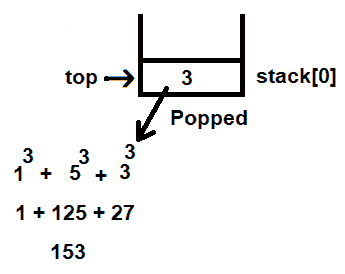

图 3.9

计算 **1³ + 5³ + 3³** 后的结果是 **153**，这与原始数字相同。这证明了 **153** 是一个阿姆斯特朗数。

让我们使用 GCC 编译 `armstrong.c` 程序，如下所示：

```cpp
D:\CBook>gcc armstrong.c -o armstrong 
```

让我们检查 `127` 是否是阿姆斯特朗数：

```cpp
D:\CBook>./armstrong
Enter a number 127
127 is not an armstrong number
```

让我们检查 `153` 是否是阿姆斯特朗数：

```cpp
D:\CBook>./armstrong
Enter a number 153
153 is an armstrong number
```

让我们检查 `1634` 是否是阿姆斯特朗数：

```cpp
D:\CBook>./armstrong
Enter a number 1634
1634 is an armstrong number
```

哇！我们已经成功创建了一个函数，用于判断指定的数字是否是阿姆斯特朗数。

现在，让我们继续下一个菜谱！

# 在数组中返回最大和最小值

C 函数不能返回超过一个值。但如果你想让函数返回超过一个值怎么办？解决方案是将要返回的值存储在数组中，并让函数返回该数组。

在这个菜谱中，我们将创建一个函数返回两个值，即最大值和最小值，并将它们存储在另一个数组中。之后，包含最大值和最小值的数组将从函数返回。

# 如何做到这一点…

1.  需要找出最大和最小值的数组的尺寸不是固定的，因此我们将定义一个名为`max`的宏，其大小为`100`：

```cpp
#define max 100
```

1.  我们将定义一个最大大小为`100`个元素的`arr`数组：

```cpp
int arr[max];
```

1.  你将被提示指定数组中的元素数量；你输入的长度将被分配给`n`变量：

```cpp
printf("How many values? ");
scanf("%d",&n);
```

1.  执行一个`for`循环`n`次，以接受`arr`数组的`n`个值：

```cpp
for(i=0;i<n;i++)                                
    scanf("%d",&arr[i]);
```

1.  调用`maxmin`函数，将`arr`数组和它的长度`n`传递给它。`maxmin`函数将返回的数组将被分配给整数指针`*p`：

```cpp
p=maxmin(arr,n);
```

1.  当你查看函数定义时，`int *maxmin(int ar[], int v){ }`，传递给`maxmin`函数的`arr`和`n`参数分别被分配给`ar`和`v`参数。在`maxmin`函数中，定义一个包含两个元素的`mm`数组：

```cpp
static int mm[2];
```

1.  为了与数组中的其余元素进行比较，`ar`数组的第一元素被存储在`mm[0]`和`mm[1]`中。执行一个从`1`值到数组长度末尾的循环，并在循环中应用以下两个公式：

+   我们将使用`mm[0]`来存储`arr`数组的最低值。`mm[0]`中的值将与数组中的其余元素进行比较。如果`mm[0]`中的值大于数组中的任何元素，我们将较小的元素分配给`mm[0]`：

```cpp
if(mm[0] > ar[i])
    mm[0]=ar[i];
```

+   我们将使用`mm[1]`来存储`arr`数组的最高值。如果发现`mm[1]`中的值小于数组中的其余元素，我们将较大的数组元素分配给`mm[1]`：

```cpp
if(mm[1]< ar[i])
    mm[1]= ar[i];
```

1.  执行`for`循环后，`mm`数组将包含`arr`数组的最大和最小值，分别位于`mm[0]`和`mm[1]`。我们将返回这个`mm`数组到`main`函数，其中`*p`指针被设置为指向返回的数组`mm`：

```cpp
return mm;
```

1.  `*p`指针将首先指向第一个索引位置的内存地址，即`mm[0]`。然后，显示该内存地址的内容，即数组的最低值。之后，将`*p`指针的值增加 1，使其指向数组中下一个元素的内存地址，即`mm[1]`位置：

```cpp
printf("Minimum value is %d\n",*p++);
```

1.  **mm[1]** 索引位置包含数组的最大值。最后，通过 `*p` 指针指向的最大值显示在屏幕上：

```cpp
printf("Maximum value is %d\n",*p);
```

`returnarray.c` 程序解释了如何从一个函数中返回一个数组。基本上，该程序返回数组的最大值和最小值：

```cpp
/* Find out the maximum and minimum values using a function returning an array */
# include <stdio.h>
#define max 100
int *maxmin(int ar[], int v);
void main()
{
    int  arr[max];
    int n,i, *p;
    printf("How many values? ");
    scanf("%d",&n);
    printf("Enter %d values\n", n);
    for(i=0;i<n;i++)
        scanf("%d",&arr[i]);
    p=maxmin(arr,n);
    printf("Minimum value is %d\n",*p++);
    printf("Maximum value is %d\n",*p);
}
int *maxmin(int ar[], int v)
{
    int i;
    static int mm[2];
    mm[0]=ar[0];
    mm[1]=ar[0];
    for (i=1;i<v;i++)
    {
        if(mm[0] > ar[i])
            mm[0]=ar[i];
        if(mm[1]< ar[i])
            mm[1]= ar[i];
    }
    return mm;
}
```

现在，让我们深入了解。

# 它是如何工作的...

在这个过程中，我们将使用两个数组。第一个数组将包含需要找到最大值和最小值的值。第二个数组将用于存储第一个数组的最大值和最小值。

让我们将第一个数组称为 **arr** 并定义它包含五个元素，其值如下：

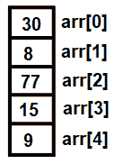

图 3.10

让我们将第二个数组称为 **mm**。**mm** 数组的第一个位置，即 **mm[0]**，将用于存储最小值，第二个位置，即 **mm[1]**，将用于存储 **arr** 数组的最大值。为了能够比较 **mm** 数组的元素与 **arr** 数组的元素，将 **arr** 数组的第一个元素 **arr[0]** 复制到 **mm[0]** 和 **mm[1]**：

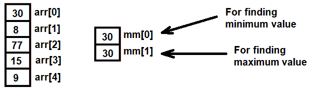

图 3.11

现在，我们将比较 **arr** 数组的其余元素与 **mm[0]** 和 **mm[1]**。为了保持 **mm[0]** 中的最小值，任何小于 **mm[0]** 值的元素将被分配给 **mm[0]**。大于 **mm[0]** 的值将被简单地忽略。例如，**arr[1]** 中的值小于 **mm[0]**，即 8 < 30。因此，较小的值将被分配给 **mm[0]**：

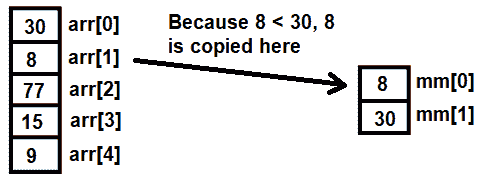

图 3.12

我们将对 **mm[1]** 中的元素应用反向逻辑。因为我们想要 **arr** 数组的最大值在 **mm[1]** 中，所以任何找到的比 **mm[1]** 值大的元素将被分配给 **mm[1]**。所有较小的值将被简单地忽略。

我们将继续使用 **arr** 数组中的下一个元素，即 **arr[2]**。因为 77 > 8，所以当与 **mm[0]** 比较时将被忽略。但 77 > 30，所以它将被分配给 **mm[1]**：

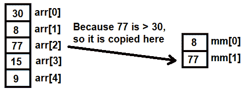

图 3.13

我们将重复此过程，与 **arr** 数组的其余元素。一旦 **arr** 数组的所有元素都与 **mm** 数组的元素进行比较，我们将在 **mm[0]** 和 **mm[1]** 中分别得到最小值和最大值：

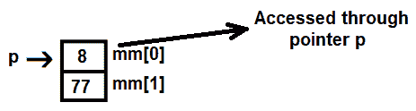

图 3.14

让我们使用 GCC 编译 `returnarray.c` 程序，如下所示：

```cpp
D:\CBook>gcc returnarray.c -o returnarray
```

这是程序的输出：

```cpp
D:\CBook>./returnarray
How many values? 5
Enter 5 values
30
8
77
15
9
Minimum value is 8
Maximum value is 77
```

哇！我们已经成功地在数组中返回了最大值和最小值。

现在，让我们继续下一个菜谱！

# 使用递归查找最大公约数

在这个方法中，我们将使用递归函数来找到两个或多个整数的**最大公约数**（**GCD**），也称为最大公因数。GCD 是能够整除每个整数的最大正整数。例如，8 和 12 的最大公约数是 4，9 和 18 的最大公约数是 9。

# 如何做到这一点…

`int gcd(int x, int y)`递归函数使用以下三个规则来找到两个整数 x 和 y 的最大公约数：

+   如果 y=0，则`x`和`y`的最大公约数是`x`。

+   如果 x mod y 为 0，则 x 和 y 的最大公约数是 y。

+   否则，x 和 y 的最大公约数是`gcd(y, (x mod y))`。

按照以下步骤递归地找到两个整数的最大公约数（GCD）：

1.  你将被提示输入两个整数。将输入的整数分配给两个变量，`u`和`v`：

```cpp
printf("Enter two numbers: ");
scanf("%d %d",&x,&y);
```

1.  调用`gcd`函数并将`x`和`y`值传递给它。`x`和`y`值将被分别分配给`a`和`b`参数。将`gcd`函数返回的 GCD 值分配给`g`变量：

```cpp
g=gcd(x,y);
```

1.  在`gcd`函数中，执行`a % b`。`%`（模）运算符将数字除以并返回余数：

```cpp
m=a%b;
```

1.  如果余数非零，则再次调用`gcd`函数，但这次参数将是`gcd(b,a % b)`，即`gcd(b,m)`，其中 m 代表模运算：

```cpp
gcd(b,m);
```

1.  如果这又得到一个非零余数，即如果`b % m`是非零的，则使用上一次执行中获得的新值重复`gcd`函数：

```cpp
gcd(b,m);
```

1.  如果`b % m`的结果为零，则`b`是提供的参数的最大公约数，并将其返回到`main`函数：

```cpp
return(b);
```

1.  返回给`main`函数的结果`b`被分配给`g`变量，然后显示在屏幕上：

```cpp
printf("Greatest Common Divisor of %d and %d is %d",x,y,g);
```

`gcd.c`程序解释了如何通过递归函数计算两个整数的最大公约数：

```cpp
#include <stdio.h>
int gcd(int p, int q);
void main()
{
    int x,y,g;
    printf("Enter two numbers: ");
    scanf("%d %d",&x,&y);
    g=gcd(x,y);
    printf("Greatest Common Divisor of %d and %d is %d",x,y,g);
}
int gcd(int a, int b)
{
    int m;
    m=a%b;
    if(m==0)
        return(b);
    else
        gcd(b,m);
}
```

现在，让我们看看幕后。

# 它是如何工作的...

假设我们想要找到两个整数**18**和**24**的最大公约数。为此，我们将调用`gcd(x,y)`函数，在这种情况下是`gcd(18,24)`。因为**24**，即 y，不为零，所以规则 1 不适用。接下来，我们将使用规则 2 检查`18%24`（`x % y`）是否等于**0**。因为**18**不能被**24**整除，所以**18**将是余数：

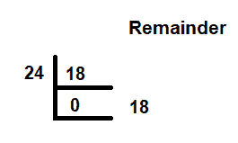

图 3.15

由于规则 2 的参数也没有满足，我们将使用规则 3。我们将使用`gcd(b,m)`参数调用`gcd`函数，即`gcd(24,18%24)`。现在，m 代表模运算。在这个阶段，我们将再次应用规则 2 并收集余数：

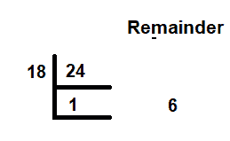

图 3.16

因为`24%18`的结果是一个非零值，我们将再次调用`gcd`函数，使用`gcd(b, m)`参数，现在`gcd(18, 24%18)`，因为我们从上一次执行中留下了**18**和**6**。我们将再次应用规则 2 到这次执行。当**18**除以**6**时，余数是**0**：

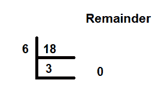

图 3.17

在这个阶段，我们最终满足了规则之一的要求，即规则 2。如果你还记得，规则 2 说的是如果 x mod y 为**0**，则最大公约数是 y。因为**18** mod **6**的结果是**0**，所以**18**和**24**的最大公约数是**6**。

让我们使用 GCC 编译`gcd.c`程序，如下所示：

```cpp
D:\CBook>gcc gcd.c -o gcd
```

这是程序的输出：

```cpp
D:\CBook>./gcd
Enter two numbers: 18 24
Greatest Common Divisor of 18 and 24 is 6
D:\CBook>./gcd
Enter two numbers: 9 27
Greatest Common Divisor of 9 and 27 is 9
```

哇！我们已经成功使用递归找到了最大公约数（GCD）。

现在，让我们继续下一个菜谱！

# 将二进制数转换为十六进制数

在这个菜谱中，我们将学习如何将二进制数转换为十六进制数。二进制数由两个位组成，0 和 1。要将二进制数转换为十六进制数，我们首先需要将二进制数转换为十进制数，然后将得到的十进制数转换为十六进制。

# 如何做到这一点…

1.  输入一个二进制数并将其赋值给变量`b`：

```cpp
printf("Enter a number in binary number ");
scanf("%d",&b);
```

1.  调用`intodecimal`函数将二进制数转换为十进制数，并将变量`b`作为参数传递给它。将`intodecimal`函数返回的十进制数赋值给变量`d`：

```cpp
d=intodecimal(b);
```

1.  观察到`intodecimal`的定义`int intodecimal(int bin) { }`，我们可以看到`b`参数被分配给`intodecimal`函数的`bin`参数。

1.  将所有二进制位分开，并将它们乘以 2 的幂，幂的值等于它们在二进制数中的位置。将结果相加以得到十进制等效值。为了分离每个二进制位，我们需要执行一个`while`循环，直到二进制数大于 0：

```cpp
while(bin >0)
```

1.  在`while`循环中，对二进制数应用模 10 运算符并将余数推入栈中：

```cpp
remainder=bin%10;
push(remainder);
```

1.  执行另一个`while`循环以获取栈中所有二进制位的十进制数。`while`循环将执行，直到栈为空（即，直到`top`的值大于或等于 0）：

```cpp
while(top >=0)
```

1.  在`while`循环中，弹出栈中的所有二进制位，并将每个位乘以 2 的`top`次幂。将结果相加以得到输入二进制数的十进制等效值：

```cpp
j=pop();
deci=deci+j*pow(2,exp);
```

1.  调用`intohexa`函数并将二进制数和十进制数传递给它以获取十六进制数：

```cpp
void intohexa(int bin, int deci)
```

1.  在`intohexa`函数中对十进制数应用模 16 运算符以获取其十六进制数。将得到的余数推入栈中。再次对商应用模 16 并重复此过程，直到商小于 16：

```cpp
remainder=deci%16;
push(remainder);
```

1.  弹出推入栈中以显示十六进制数的余数：

```cpp
j=pop();
```

如果从栈中弹出的余数小于 10，则直接显示。否则，将其转换为以下表中提到的等效字母，并将结果字母显示出来：

| **十进制** | **十六进制** |
| --- | --- |
| 10 | A |
| 11 | B |
| 12 | C |
| 13 | D |
| 14 | E |
| 15 | F |

```cpp
if(j<10)printf("%d",j);
else printf("%c",prnhexa(j));
```

`binarytohexa.c`程序解释了如何将二进制数转换为十六进制数：

```cpp
//Converting binary to hex
# include <stdio.h>
#include  <math.h>
#define max 10
int top=-1;
int stack[max];
void push();
int pop();
char prnhexa(int);
int intodecimal(int);
void intohexa(int, int);
void main()
{
    int b,d;
    printf("Enter a number in binary number ");
    scanf("%d",&b);
    d=intodecimal(b);
    printf("The decimal of binary number %d is %d\n", b, d);
    intohexa(b,d);
}
int intodecimal(int bin)
{
    int deci, remainder,exp,j;
    while(bin >0)
    {
        remainder=bin%10;
        push(remainder);
        bin=bin/10;
    }
    deci=0;
    exp=top;
    while(top >=0)
    {
        j=pop();
        deci=deci+j*pow(2,exp);
        exp--;
    }
    return (deci);
}
void intohexa(int bin, int deci)
{
    int remainder,j;
    while(deci >0)
    {
        remainder=deci%16;
        push(remainder);
        deci=deci/16;
    }
    printf("The hexa decimal format of binary number %d is ",bin);
    while(top >=0)
    {
        j=pop();
        if(j<10)printf("%d",j);
        else printf("%c",prnhexa(j));
    }
}
void push(int m)
{
    top++;
    stack[top]=m;
}
int pop()
{
    int j;
    if(top==-1)return(top);
    j=stack[top];
    top--;
    return(j);
}
char prnhexa(int v)
{
    switch(v)
    {
        case 10: return ('A');
                 break;
        case 11: return ('B');
                 break;
        case 12: return ('C');
                 break;
        case 13: return ('D');
                 break;
        case 14: return ('E');
                 break;
        case 15: return ('F');
                 break;
    }
}
```

现在，让我们看看幕后。

# 它是如何工作的...

第一步是将二进制数转换为十进制数。为此，我们将分离所有二进制数字，并将每个数字乘以二进制数中其位置的**2**的次方。然后，我们将应用 mod **10**运算符，以便将二进制数分离成单独的数字。每次对二进制数应用 mod **10**时，其最后一位数字就会被分离并推入栈中。

假设我们需要将二进制数转换为十六进制格式的是**110001**。我们将对此二进制数应用 mod **10**运算符。mod 运算符将除以数字并返回余数。在应用 mod **10**运算符时，最后一个二进制数字——换句话说，最右边的数字将被作为余数返回（这与所有除以**10**的情况相同）。

操作被推入由**top**指针指示的栈位置。**top**的初始值是-1。在推入栈之前，**top**的值增加 1。因此，**top**的值增加到 0，作为余数出现的二进制数字（在这种情况下，是 1）被推入**stack[0]**（见*图 3.18*），并且**11000**作为商返回：

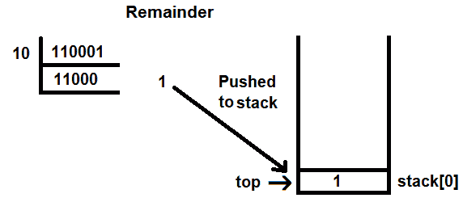

图 3.18

我们将再次应用 mod **10**运算符到商上，以分离当前二进制数的最后一位数字。这次，mod **10**运算符将返回**0**作为余数，**1100**作为商。余数再次推入栈中。如前所述，在应用`push`操作之前，**top**的值会增加。由于**top**的值是**0**，它增加到**1**，我们的新余数**0**被推入**stack[1]**：

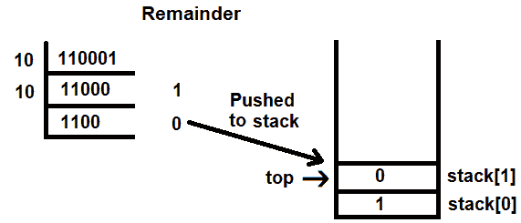

图 3.19

我们将重复此过程，直到将二进制数的所有数字分离并推入栈中，如下所示：

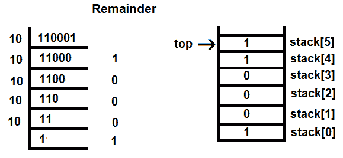

图 3.20

一旦完成，下一步就是逐个弹出数字，并将每个数字乘以**2**的**top**次方。例如，**2**的**top**次方意味着**2**将提升到从二进制数字被弹出位置开始的索引值。从栈中弹出的值将从**top**指示的位置弹出。

**top**的当前值是**5**，因此**stack[5]**中的元素将被弹出，并乘以**2**的**5**次方，如下所示：

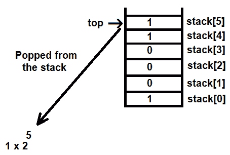

图 3.21

从栈中弹出一个值后，**top** 的值减少 1，以指向下一个要弹出的元素。这个过程会一直重复，直到所有数字都被弹出并乘以 **2** 的 **top** 位置值的幂。*图 3.19* 展示了如何从栈中弹出所有二进制位并乘以 **2** 的 **top** 次幂：

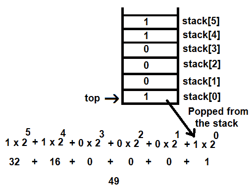

图 3.22

我们得到的结果是用户输入的二进制数的十进制等价数。

现在，要将十进制数转换为十六进制格式，我们将它除以 16。我们需要继续除以数字，直到商小于 `16`。除法的余数以 LIFO 顺序显示。如果余数小于 10，则直接显示；否则，显示其等效字母。如果你得到 10 到 15 之间的余数，可以使用前面的表格找到等效字母。

在下面的图中，你可以看到十进制数 **49** 被除以 **16**。余数以 LIFO 顺序显示，以显示十六进制，因此 31 是二进制数 **110001** 的十六进制表示。由于余数都小于 10，你不需要应用前面的表格：

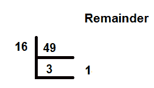

图 3.23

让我们使用 GCC 编译 `binaryintohexa.c` 程序，如下所示：

```cpp
D:\CBook>gcc binaryintohexa.c -o binaryintohexa
```

这里是程序的另一个输出：

```cpp
D:\CBook>./binaryintohexa
Enter a number in binary number 110001
The decimal of binary number 110001 is 49
The hexa decimal format of binary number 110001 is 31
```

这里是程序的另一个输出：

```cpp
D:\CBook>./binaryintohexa
Enter a number in binary number 11100
The decimal of binary number 11100 is 28
The hexa decimal format of binary number 11100 is 1C
```

哇！我们已经成功将二进制数转换为十六进制数。

现在，让我们继续下一个菜谱！

# 查找一个数字是否是回文数

回文数是指正向和反向读取时都相同的数。例如，123 不是回文数，但 737 是。要判断一个数是否是回文数，我们需要将其分解成单独的数字，并将原始数的个位转换为百位，百位转换为个位。

例如，一个 `pqr` 数字如果 `pqr=rqp`，则被称为**回文** **数**。只有当以下条件成立时，`pqr` 才会等于 `rqp`：

*p x 100 + q x 10 + r = r x 100 + q x 10 + p*

换句话说，我们将个位上的数字乘以 10²，将其转换为百位，并将百位上的数字通过乘以 1\ 转换为个位。如果结果与原始数字匹配，则它是回文数。

# 如何操作...

1.  输入一个数字以分配给 `n` 变量：

```cpp
printf("Enter a number ");
scanf("%d",&n);
```

1.  调用 `findpalindrome` 函数并将 `n` 变量中的数字作为参数传递给它：

```cpp
findpalindrome(n)
```

1.  `n` 参数被分配给 `findpalindrome` 函数中的 `numb` 参数。我们需要分离数字的每一位；为此，我们将执行一个 `while` 循环，直到 `numb` 变量的值大于 `0`：

```cpp
while(numb >0)
```

1.  在 `while` 循环中，我们将对数字应用模 10。应用模 `10` 运算符后，我们将得到余数，这基本上是数字的最后一位：

```cpp
remainder=numb%10;
```

1.  将那个余数推入栈中：

```cpp
push(remainder);
```

1.  因为数字的最后一位被分离出来，我们需要从现有的数字中移除最后一位。这是通过将数字除以 10 并截断分数来完成的。`while` 循环将在数字被单独分成各个数字并将所有数字推入栈中时终止：

```cpp
numb=numb/10;
```

1.  栈顶的数字将是原数的百位，而栈底的数字将是原数的个位。回想一下，我们需要将原数的百位转换为个位，反之亦然。逐个弹出栈中的所有数字，并将每个数字乘以 `10` 的幂。对于第一个弹出的数字，幂将是 0。每次弹出值时，幂都会增加。在乘以相应的 `10` 幂之后，数字被添加到一个单独的变量中，该变量称为 `value`：

```cpp
j=pop();
value=value+j*pow(10,count);
count++;
```

1.  如果 `numb` 和 `value` 变量中的数字匹配，这意味着数字是一个回文数。如果数字是回文数，`findpalindrome` 函数将返回值 `1`，否则它将返回值 `0`：

```cpp
if(numb==value) return (1);
else return (0);
```

`findpalindrome.c` 程序确定输入的数字是否是回文数：

```cpp
//Find out whether the entered number is a palindrome or not
# include <stdio.h>
#include <math.h>
#define max 10
int top=-1;
int stack[max];
void push();
int pop();
int findpalindrome(int);
void main()
{
    int n;
    printf("Enter a number ");
    scanf("%d",&n);   
    if(findpalindrome(n))
        printf("%d is a palindrome number",n);
    else
        printf("%d is not a palindrome number", n);
}
int findpalindrome(int numb)
{
    int j, value, remainder, temp,count;
    temp=numb;
    while(numb >0)
    {
        remainder=numb%10;
        push(remainder);
        numb=numb/10;
    }
    numb=temp;
    count=0;
    value=0;
    while(top >=0)
    {
        j=pop();
        value=value+j*pow(10,count);
        count++;
    }
    if(numb==value) return (1);
    else return (0);
}
void push(int m)
{
    top++;
    stack[top]=m;
}
int pop()
{
    int j;
    if(top==-1)return(top);
    else
    {
        j=stack[top];
        top--;
        return(j);
   }
}
```

现在，让我们看看幕后。

# 它是如何工作的...

假设我们输入的数字是 **737**。现在，我们想知道 **737** 是否是回文数。我们将从对 **737** 应用模 **10** 操作符开始。应用后，我们将收到余数 **7** 和商数 **73**。余数 **7** 将被推入栈中。然而，在推入栈之前，**top** 指针的值增加 1。**top** 的初始值是 -1；它增加到 **0**，余数 **7** 被推入 **stack[0]**（见 *图 3.21*）。

模 **10** 操作符返回数字的最后一位作为余数。应用模 **10** 操作符后得到的商数是移除最后一位后的原始数字。也就是说，在将 **737** 应用模 **10** 操作符时，我们将得到的商数是 **73**：

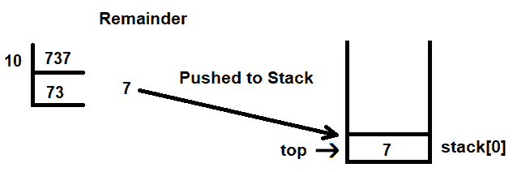

图 3.24

对于商数 **73**，我们将再次应用模 **10** 操作符。余数将是最后一位数字，即 **3**，而商数将是 **7**。**top** 的值增加 1，使其变为 1，余数被推入 **stack[1]**。对于商数 **7**，我们再次应用模 **10** 操作符。因为 **7** 不能被 **10** 整除，所以 **7** 本身被返回并推入栈中。在 `push` 操作之前，**top** 的值再次增加 1，使其变为 **2**。**7** 的值将被推入 **stack[2]**：

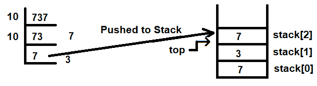

图 3.25

在将数字分解成单个数字后，我们需要逐个弹出栈中的每个数字，并将每个数字乘以**10**的幂次。对于栈顶的数字，幂次为**0**，每次弹出操作后增加 1。要从栈中弹出的数字将由栈顶指针指示。**top**的值为**2**，因此**stack[2]**上的数字被弹出，并乘以**10**的**0**次幂：

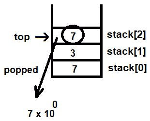

图 3.26

每次弹出操作后，**top**的值减少 1，幂次的值增加 1。下一个将被弹出的数字是**stack[1]**上的数字。也就是说，**3**将被弹出，并乘以**10**的**1**次幂。之后，**top**的值将减少 1，即**top**的值变为**0**，幂次的值增加 1，即幂次的值从**1**增加到**2**。**stack[0]**上的数字将被弹出，并乘以**10**的**2**次幂：

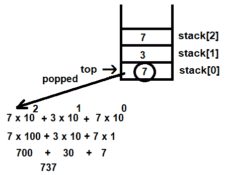

图 3.27

所有乘以**10**的相应幂次的数字相加。因为计算结果与原始数字相同，**737**是一个回文数。

让我们使用 GCC 编译`findpalindrome.c`程序，如下所示：

```cpp
D:\CBook>gcc findpalindrome.c -o findpalindrome
```

让我们检查`123`是否是一个回文数：

```cpp
D:\CBook>./findpalindrome
Enter a number 123
123 is not a palindrome number
```

让我们检查`737`是否是一个回文数：

```cpp
 D:\CBook>./findpalindrome
Enter a number 737
737 is a palindrome number
```

哇！我们已经成功确定了数字是否是回文数。
