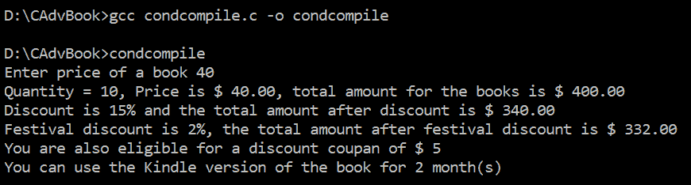
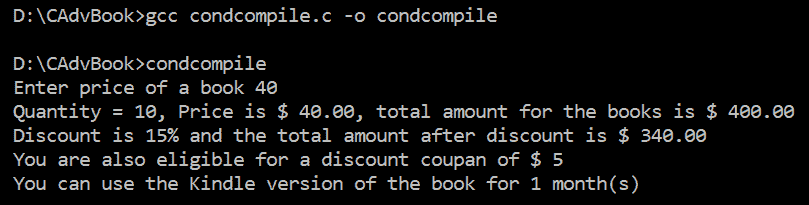
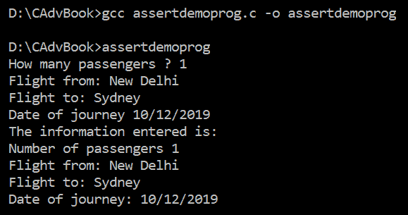
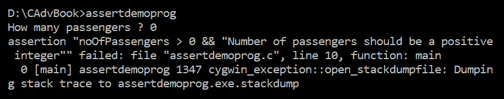
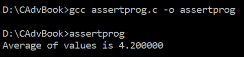
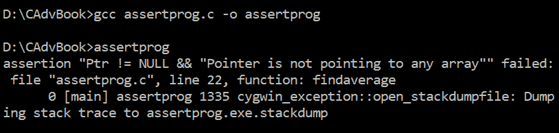
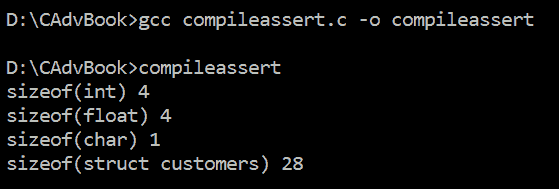
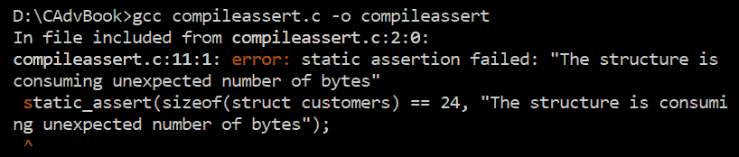
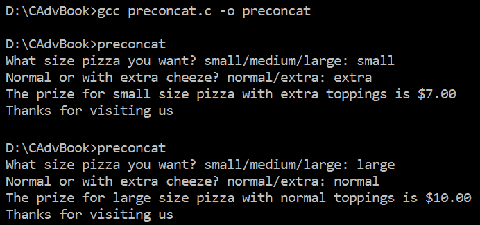

# 预处理和编译

有几个预处理器语句可以帮助您确定哪些源代码需要编译，哪些需要排除编译。也就是说，可以应用条件，并且只有当指定的条件为真时，所需的语句才会被编译。这些指令可以嵌套以实现更精确的分支。有大量的预处理器语句，如`#if`、`#ifdef`、`#ifndef`、`#else`、`#elif`和`#endif`，可以用来将语句收集到我们希望在指定条件为真时编译的块中。

使用宏的一些优点如下：

+   当宏的值或代码被宏名替换时，程序的执行速度会提高。因此，编译器调用或调用函数所涉及的时间被节省了。

+   宏可以缩短程序的长度。

使用宏的主要缺点是，在程序编译之前，程序的大小会增加，因为所有宏都被它们的代码替换。在本章中，我们将学习如何使用预处理器指令应用条件编译。

我们还将学习如何通过使用断言来实现程序中的验证。断言是对程序中不同关键语句进行验证的一种检查方式。如果这些断言或表达式未验证或返回 false，则显示错误并终止程序。与通常的错误处理相比，主要区别在于断言可以在运行时禁用。

如果在`#include <assert.h>`指令附近定义了`#define NDEBUG`宏，它将禁用断言函数。

除了正常的断言外，还有一些被称为静态或编译时断言的断言，它们用于在编译时捕获错误。这些断言可以用于进行编译时验证。

此外，我们还将通过比萨店示例学习如何使用字符串化和标记粘贴运算符。

在本章中，我们将学习如何制作以下菜谱：

+   使用指令进行条件编译

+   应用断言进行验证

+   使用断言确保指针不是指向`NULL`

+   使用编译时断言提前捕获错误

+   应用字符串化和标记粘贴运算符

让我们从第一个菜谱开始。

# 使用指令进行条件编译

在这个菜谱中，我们将学习如何应用条件编译。我们将定义某些宏，然后通过应用`#if`、`#ifdef`、`#ifndef`、`#else`、`#elif`、`#endif`和`#undef`预处理器指令，我们将指导编译器编译所需的代码。以书店为例，假设用户被要求输入书籍的价格。程序将根据代表用户购买书籍的数量或数量的`Qty`宏应用不同的折扣、节日优惠、折扣券和 Kindle 选项。程序还定义了其他宏，以确定不同的适用优惠。

# 如何操作...

按照以下步骤使用预处理器指令进行条件编译：

1.  定义一个`Qty`宏并为其分配一个初始值：

```cpp
#define Qty 10
```

1.  用户将被提示输入书籍的价格：

```cpp
printf("Enter price of a book ");
scanf("%f", &price);
```

1.  使用`Qty*price`公式计算书籍的总数：

```cpp
totalAmount=Qty*price; 
```

1.  基于`Qty`宏，使用`#if`、`#elif`、`#else`和`#endif`指令来确定总金额的折扣。

1.  一旦确定了折扣百分比，就会计算折扣后的金额，并将其分配给`afterDisc`变量：

```cpp
afterDisc=totalAmount - (totalAmount*discount)/100; 
```

1.  节日折扣也是基于`FestivalOffer`宏计算的。也就是说，使用`#ifdef`、`#else`和`#endif`指令来确认是否已定义`FestivalOffer`宏，并相应地计算客户在扣除节日折扣后需要支付的金额：

```cpp
#ifdef FestivalOffer
 afterFDisc=afterDisc-(totalAmount*FestivalOffer)/100;
 #else
 afterFDisc=afterDisc;
 #endif
```

1.  使用`#if defined`指令来确认程序中是否定义了`DiscountCoupon`宏。相应地，用户会被告知他们是否有资格获得折扣券：

```cpp
#if defined (DiscountCoupon)
 printf("You are also eligible for a discount coupon of $ %d\n", DiscountCoupon);
 #endif
```

1.  预处理器指令`#ifndef`和`#endif`用于确定是否已定义`Kindle`宏。如果`Kindle`宏尚未定义，则将其定义并设置其值。相应地，用户会被告知他们将有资格获得`Kindle`版书籍的多少个月：

```cpp
#ifndef Kindle
 #define Kindle 1
 #endif
 printf("You can use the Kindle version of the book for %d 
         month(s)\n", Kindle);
```

使用预处理器指令进行条件编译的程序如下所示：

```cpp
// condcompile.c
#include <stdio.h>
#define Qty 10
#define FestivalOffer 2
#define DiscountCoupon 5
#define Kindle 2

int main() 
{ 
    int discount;
    float price, totalAmount, afterDisc, afterFDisc; 
    printf("Enter price of a book "); 
    scanf("%f", &price); 
    #if Qty >= 10 
        discount=15; 
    #elif Qty >=5 
        discount=10; 
    #else 
        discount=5; 
    #endif 
    totalAmount=Qty*price; 
    afterDisc=totalAmount - (totalAmount*discount)/100; 
    #ifdef FestivalOffer 
        afterFDisc=afterDisc-(totalAmount*FestivalOffer)/100; 
    #else 
        afterFDisc=afterDisc; 
    #endif 
    printf("Quantity = %d, Price is $ %.2f, total amount for the 
            books is $ %.2f\n", Qty, price, totalAmount); 
    printf("Discount is %d%% and the total amount after 
            discount is $ %.2f\n", discount, afterDisc); 
    #ifdef FestivalOffer 
        printf("Festival discount is %d%%, the total amount 
                after festival discount is $ %.2f\n", 
                FestivalOffer, afterFDisc); 
    #endif 
    #if defined (DiscountCoupon) 
        printf("You are also eligible for a discount 
                coupon of $ %d\n", DiscountCoupon); 
    #endif 
    #ifndef Kindle 
        #define Kindle 1 
    #endif 
    printf("You can use the Kindle version of the book 
           for %d month(s)\n", Kindle); 
    return 0; 
}
```

现在，让我们深入了解幕后，以便更好地理解代码。

# 它是如何工作的...

定义了四个宏，分别称为`Qty`、`FestivalOffer`、`DiscountCoupon`和`Kindle`，它们的值分别为`10`、`2`、`5`和`2`。用户被提示输入书籍的价格。用户输入的值被分配给变量`price`。然后使用`#if`、`#elif`、`#else`和`#endif`条件指令根据`Qty`宏的值确定应用于书籍的折扣金额。因为当前`Qty`宏的值为`10`，通过预处理器指令将折扣变量的值设置为`15`。`discount`变量的值可以随时通过更改`Qty`宏的值来更改。通过将`Qty`的值乘以价格来计算书籍的总数，并将结果值分配给`totalAmount`变量。因为用户根据`Qty`值获得某种折扣，所以计算扣除折扣后的金额，并将结果值分配给`afterDisc`变量。

再次，由于`FestivalOffer`宏被定义，使用了`#ifdef`、`#else`和`#endif`预处理器指令来计算在扣除 2%节日折扣后客户需要支付的金额。我们总是可以通过注释掉`#define FestivalOffer`语句来取消宏的定义；在这种情况下，将不会向客户提供节日折扣。

总金额以及扣除折扣后的金额都会在屏幕上显示。如果应用了节日优惠，扣除节日优惠后的金额也会在屏幕上显示。

使用`#if defined`指令来确认`DiscountCoupon`宏是否被定义。因为目前程序中`DiscountCoupon`宏被定义，并赋值为`5`，会显示一条消息告知他们还有资格获得额外的 5 美元折扣券。如果您想避免提供任何折扣券，可以总是注释掉`DiscountCoupon`宏。书籍的 Kindle 版本至少需要提供给客户一个月。因为程序中定义了`Kindle`宏，并赋值为`2`，屏幕上会显示一条消息告知用户他们可以使用书籍的 Kindle 版本 2 个月。然而，如果您注释掉`Kindle`宏，如果程序中没有定义`Kindle`宏，`#ifndef`和`#endif`预处理器指令将用于将`Kindle`宏的值设置为`1`。因此，如果程序中没有定义`Kindle`宏，会显示一条消息告知用户他们可以使用书籍的 Kindle 版本 1 个月。

程序使用 GCC 编译，如下截图所示。因为没有在编译过程中出现错误，这意味着`condcompile.c`程序已成功编译成`.exe`文件：`condcompile.exe`。在执行文件时，用户将被提示输入书籍的价格，并根据定义的宏，将显示总金额和折扣金额，如下截图所示：



图 4.1

接下来，保持`Qty`宏的值为`10`，并尝试注释掉以下两个宏：

```cpp
#define FestivalOffer 2 
#define Kindle 2
```

前面的程序将显示以下输出：



图 4.2

您可以在输出中看到，由于`Qty`宏的值仍然是`10`，客户将继续获得前面截图所示的 15%折扣。此外，节日折扣根本未给予客户。因为`DiscountCoupon`宏仍然被定义，客户将继续获得 5 美元的折扣券，Kindle 版本的价格降低到 1 个月。

如我们之前提到的，`#undef`指令移除了当前宏的定义。以下代码片段使用定义的宏，并在使用后将其取消定义：

```cpp
#include <stdio.h>
#define qty 10 

int main()
{
     #ifdef qty
         amount =qty * rate; 
         #undef qty
     #endif 
 return 0;
}
```

您可以看到`qty`宏被使用，并在使用后未定义。现在，让我们继续到下一个配方！

# 应用断言进行验证

在本配方中，我们将学习如何使用断言实现验证。程序将要求用户输入从一地飞往另一地的乘客信息。使用断言，我们可以确保输入的乘客数量是正数。如果输入的乘客数量为零或负数，程序将终止。

# 如何操作...

按照以下步骤使用断言创建验证检查。如果乘客数量的值为零或负数，则该配方将不允许程序运行：

1.  用户被提示输入飞行乘客的数量：

```cpp
printf("How many passengers ? ");
scanf("%d",&noOfPassengers);
```

1.  定义了一个`assert`实例以确保乘客数量的值不应为`0`或负数。如果用户为乘客数量输入了`0`或负数值，将显示错误消息，显示行号，并且程序将终止：

```cpp
assert(noOfPassengers > 0 && "Number of passengers should 
           be a positive integer"); 
```

1.  如果输入的乘客数量值为正数，用户将被要求提供其他信息，例如航班从哪里出发，航班飞往哪里，以及旅行的日期：

```cpp
 printf("Flight from: ");
 while((c= getchar()) != '\n' && c != EOF);
 gets(fl_from);
 printf("Flight to: ");
 gets(fl_to);
 printf("Date of journey ");
 scanf("%s", dateofJourney);
```

1.  乘客输入的信息随后显示在屏幕上：

```cpp
 printf("Number of passengers %d\n", noOfPassengers);
 printf("Flight from: %s\n", fl_from);
 printf("Flight to: %s\n", fl_to);
 printf("Date of journey: %s\n", dateofJourney);
```

使用断言实现验证检查的程序如下代码片段所示：

```cpp
// assertdemoprog.c
#include <stdio.h> 
#include <assert.h> 

int main(void) 
{ 
    int c, noOfPassengers; 
    char fl_from[30], fl_to[30], dateofJourney[12]; 
    printf("How many passengers ? "); 
    scanf("%d",&noOfPassengers); 
    assert(noOfPassengers > 0 && "Number of passengers should 
                                  be a positive integer"); 
    printf("Flight from: "); 
    while((c= getchar()) != '\n' && c != EOF); 
        gets(fl_from); 
        printf("Flight to: "); 
        gets(fl_to); 
        printf("Date of journey "); 
        scanf("%s", dateofJourney); 
        printf("The information entered is:\n"); 
        printf("Number of passengers %d\n", noOfPassengers); 
        printf("Flight from: %s\n", fl_from); 
        printf("Flight to: %s\n", fl_to);
        printf("Date of journey: %s\n", dateofJourney); 
        return 0; 
}
```

现在，让我们深入了解代码，以更好地理解它。

# 它是如何工作的...

程序提示用户输入特定日期从一地飞往另一地的乘客信息。为了确保乘客数量的值不是零或负数，使用了断言。`assert`表达式验证分配给`noOfPassengers`变量的值。它检查`noOfPassengers`变量的值是否大于`0`。如果是，程序将继续执行其余的语句；否则，将文件名和行号发送到标准错误，并终止程序。

如果断言语句得到验证，即`noOfPassengers`分配的值大于 0，那么将要求用户输入乘客的其他详细信息，例如航班从哪里出发，航班飞往哪里，以及旅行的日期。然后，输入的信息将显示在屏幕上。

程序使用 GCC 编译，如下面的截图所示。因为没有在编译过程中出现错误，这意味着`assertdemoprog.c`程序已成功编译成`.exe`文件：`assertdemoprog.exe`。在执行文件时，将提示用户输入乘客数量。如果输入的乘客数量是正数，程序将完美运行，如下面的截图所示：



图 4.3

在第二次执行程序时，如果`noOfPassengers`变量的输入值是负数或零，将显示一个错误，显示程序名称和行号，并终止程序。指定的错误信息“`Number of passengers should be a positive integer`”将被显示：



图 4.4

哇！我们已经成功应用断言来验证我们的数据。

# 使用断言确保指针不是指向 NULL

让我们在断言上再做一个练习。让我们应用断言以确保指针不是指向`NULL`，而是指向要访问的内存地址。本质上，在这个练习中，我们将学习计算一些数字的平均值，这些数字存储在数组中，而数组元素是通过指针访问的。

# 如何做…

通过使用断言，遵循以下步骤以确保指针不是`NULL`并且指向一个内存地址：

1.  定义一个包含要计算平均值的整数数组的数组：

```cpp
int arr[]={3,9,1,6,2};
```

1.  设置一个指针指向数组：

```cpp
ptr=arr; 
```

1.  定义一个用于计算数组元素平均值的函数。将数组的指针和数组中值的数量都传递给这个函数：

```cpp
average=findaverage(ptr, count); 
```

1.  在函数中，定义一个`assert`表达式以确保指针不是`NULL`。如果指针是`NULL`，程序将显示错误并终止：

```cpp
assert(Ptr != NULL && "Pointer is not pointing to any array"); 
```

1.  如果指针不是`NULL`，则将通过指针访问数组元素，并计算它们的平均值并在屏幕上显示：

```cpp
for(i=0;i<Count;i++)
 {
   sum+=*Ptr;
   Ptr++;
 }
Average=(float)sum/Count;
```

实现验证以确保指针不是`NULL`且指向内存地址的程序如下所示：

```cpp
// assertprog.c
#include <stdio.h> 
#include <assert.h> 

float findaverage(int *Ptr, int Count); 

int main() 
{ 
    int arr[]={3,9,1,6,2};
    float average; 
    int *ptr=NULL,count; 
    ptr=arr; 
    count=5; 
    average=findaverage(ptr, count); 
    printf("Average of values is %f\n", average); 
    return(0); 
} 

float findaverage(int *Ptr, int Count)
{
    int sum,i;
    float Average; 
    assert(Ptr != NULL && "Pointer is not pointing to any array"); 
    sum=0; 
    for(i=0;i<Count;i++) 
    { 
        sum+=*Ptr; 
        Ptr++; 
    } 
    Average=(float)sum/Count; 
    return(Average); 
}
```

现在，让我们深入了解代码以更好地理解它。

# 它是如何工作的...

在这个程序中，通过数组计算了几个整数的平均值。也就是说，将需要计算平均值的整数数量分配给一个数组，并使用一个整数指针来访问数组元素。定义了一个名为`findaverage`的函数，将整数指针和数字的数量传递给它。在函数中，使用断言确保指针不是`NULL`。如果指针不是`NULL`，则通过指针访问数组元素并执行加法。在数字加法之后，计算平均值。然后，将计算出的平均值返回到`main`函数，在屏幕上显示平均值。如果指针没有指向数组而是指向`NULL`，程序将显示错误并终止。

程序使用 GCC 编译，如下面的截图所示。因为在编译过程中没有出现错误，这意味着`assertprog.c`程序已成功编译成`.exe`文件：`assertprog.exe`。因为执行文件时指针指向数组，所以我们得到数组中指定的数值的平均值，如下面的截图所示：



图 4.5

接下来，注释掉以下行，其中指针指向数组：

```cpp
ptr=arr;
```

`ptr`指针现在正指向`NULL`。因此，在运行程序时，它将显示一个错误，如下面的截图所示：



图 4.6

哇！我们已经成功使用断言确保我们的指针没有指向`NULL`。

现在，让我们继续下一个菜谱！

# 使用编译时断言提前捕获错误

在这个菜谱中，我们将使用断言在编译时检测错误。本质上，我们将创建一个结构，并创建一个编译时断言，确保结构的大小是某些特定的字节。如果结构的大小不等于指定的值，程序将终止。这个约束将有助于确定存储容量，也有助于记录的简单维护，即删除和更新。

# 如何做到这一点...

按照以下步骤创建编译时`assert`表达式，以确保用户定义的结构是特定字节数：

1.  定义一个包含几个成员的结构：

```cpp
struct customers
 {
 int orderid;
 char customer_name[20];
 float amount;
 };
```

1.  定义一个编译时断言，对结构体的大小施加约束。只有当断言得到验证时，即结构体的大小与 `assert` 表达式中提到的字节数完全相等时，程序才会编译：

```cpp
static_assert(sizeof(struct customers) == 28, "The structure is consuming unexpected number of bytes"); 
```

1.  在程序的主体中，你可以编写任何可执行代码。只有当 `assert` 表达式得到验证时，这段代码才会编译并执行：

```cpp
static_assert(sizeof(struct customers) == 28, "The structure is consuming unexpected number of bytes"); 
```

实现编译时验证以确保结构体大小正好等于特定字节数的程序如下所示：

```cpp
// compileassert.c
#include <stdio.h> 
#include <assert.h> 

struct customers 
{ 
    int orderid;
    char customer_name[20]; 
    float amount; 
}; 

static_assert(sizeof(struct customers) == 28, "The structure is consuming unexpected number of bytes"); 

int main(void) 
{ 
    printf("sizeof(int) %d\n",sizeof(int)); 
    printf("sizeof(float) %d\n",sizeof(float)); 
    printf("sizeof(char) %d\n",sizeof(char)); 
    printf("sizeof(struct customers) %d\n",sizeof(struct customers)); 
    return 0; 
}
```

现在，让我们深入了解代码，以更好地理解它。

# 它是如何工作的...

结构体通过名称 `customers` 定义，它包含几个成员。结构体的成员具有不同的数据类型。定义了一个编译时断言，对 `customers` 结构体的大小施加了 28 字节的精确约束。这意味着如果结构体的大小小于或大于 28 字节，程序将无法编译。`main` 函数简单地显示不同数据类型的大小，例如 `int`、`float` 和 `char`。程序还显示了完整的 `customers` 结构体的大小。

程序使用 GCC 编译，如下面的截图所示。因为 `customers` 结构体的大小与编译时断言中指定的完全相同，所以程序编译完美，`compileassert.c` 程序成功编译成 `.exe` 文件：`compileassert.exe`。在执行文件后，我们得到以下输出，显示了不同数据类型和 `customers` 结构体的大小，如下面的截图所示：



图 4.7

在修改 `assert` 函数中的值之后，即如果结构体的大小与编译时断言中提到的值不匹配，我们将得到以下编译错误：



图 4.8

哇！我们已经成功实现了编译时断言，以便能够尽早捕捉到系统中的错误。现在，让我们继续下一个菜谱！

# 应用字符串化和标记粘贴运算符

字符串化或哈希符号 (`#`) 可以在宏定义中使用，将宏参数转换为字符串常量。你可以想象参数被双引号包围并返回。它也被称为标记连接运算符。

标记粘贴运算符 (`##`) 在宏定义中使用时将两个参数组合在一起。也就是说，每个 `##` 运算符两侧的参数被连接成一个单独的字符串。更精确地说，它对两个参数执行字符串连接，以形成一个新字符串。

在这个菜谱中，我们将学习如何在计算中应用字符串化和标记粘贴运算符。用户被要求指定一定的披萨大小和他们的所需配料，相应地，披萨的价格将被显示。

# 如何做到这一点...

按照以下步骤创建一个使用`stringize`和`token-pasting`运算符的配方：

1.  使用`token-pasting`运算符定义一个名为`pizzaprice`的宏：

```cpp
#define pizzaprice(a, b) a##b 
```

1.  使用字符串化运算符定义一个名为`convertIntoStr`的宏：

```cpp
#define convertIntoStr(str) #str 
```

1.  定义一些变量，例如`smallnormal`、`mediumnormal`、`largenormal`和`smallextra`，它们代表不同大小和配料的披萨价格：

```cpp
float smallnormal=5;
 float mediumnormal=7;
 float largenormal=10;
 float smallextra=7;
 float mediumextra=9;
 float largeextra=12;
 char pizzasize[30];
 char topping[20];
```

1.  询问用户输入客户想要的披萨大小，输入的大小被分配给`pizzasize`变量：

```cpp
printf("What size pizza you want? small/medium/large: ");
scanf("%s", pizzasize);
```

1.  然后，询问用户是否希望披萨有普通奶酪或加奶酪，用户输入的选择被分配给`topping`变量：

```cpp
printf("Normal or with extra cheese? normal/extra: ");
 scanf("%s",topping);
```

1.  接下来，根据`topping`变量的值进行分支：

```cpp
if(strcmp(topping, "normal")==0)
 {...........
}
 if(strcmp(topping, "extra")==0)
 {......................
}
```

1.  此外，输入到`pizzasize`变量中的大小与检查比，以确定披萨大小是小型、中型还是大型，并相应地传递参数到`pizzaprice`宏：

```cpp
if(strcmp(pizzasize, "small")==0)
 .........
 else
 if(strcmp(pizzasize, "medium")==0)
..............
else
.....................
```

1.  `pizzaprice`宏将`pizzasize`和`topping`参数连接起来，并将它们扩展为连接变量：

```cpp
pizzaprice(small, extra));
```

在这里，`small`可以根据用户选择的大小替换为`medium`或`large`。此外，如果用户想要普通奶酪披萨，`extra`可以替换为`normal`。

1.  将连接变量的值显示为指定披萨和所需配料的定价：

```cpp
printf("The prize for %s size pizza with %s toppings is $%.2f \n", pizzasize, topping, pizzaprice(small, extra));
```

应用`stringize`和`token-pasting`运算符的程序如下所示：

```cpp
// preconcat.c
#include <stdio.h> 
#include <string.h> 

#define pizzaprice(a, b) a##b 
#define convertIntoStr(str) #str 

int main() 
{ 
    float smallnormal=5; 
    float mediumnormal=7; 
    float largenormal=10; 
    float smallextra=7; 
    float mediumextra=9; 
    float largeextra=12; 
    char pizzasize[30]; 
    char topping[20]; 

    printf("What size pizza you want? small/medium/large: "); 
    scanf("%s", pizzasize); 
    printf("Normal or with extra cheese? normal/extra: "); 
    scanf("%s",topping); 
    if(strcmp(topping, "normal")==0) 
    { 
        if(strcmp(pizzasize, "small")==0)
            printf("The prize for %s size pizza with %s toppings is 
                    $%.2f \n", pizzasize, topping, 
                    pizzaprice(small, normal));
         else 
             if(strcmp(pizzasize, "medium")==0)
                  printf("The prize for %s size pizza with %s 
                          toppings is $%.2f \n", pizzasize, topping, 
                          pizzaprice(medium, normal)); 
              else
                  printf("The prize for %s size pizza with %s 
                          toppings is $%.2f \n", pizzasize, topping, 
                          pizzaprice(large, normal)); 
    }
    if(strcmp(topping, "extra")==0) 
    { 
        if(strcmp(pizzasize, "small")==0)
            printf("The prize for %s size pizza with %s toppings 
                    is $%.2f \n", pizzasize, topping, 
                    pizzaprice(small, extra)); 
        else 
            if(strcmp(pizzasize, "medium")==0) 
                printf("The prize for %s size pizza with %s toppings 
                        is $%.2f \n", pizzasize, topping, 
                        pizzaprice(medium, extra));
            else 
                printf("The prize for %s size pizza with %s toppings 
                        is $%.2f \n", pizzasize, topping, 
                        pizzaprice(large, extra)); 
    }
    printf(convertIntoStr(Thanks for visiting us)); 
    return 0; 
}
```

现在，让我们深入了解代码，以便更好地理解它。

# 它是如何工作的...

使用`token-pasting`运算符定义一个名为`pizzaprice`的宏。此宏将两个`a`和`b`参数连接成一个字符串。此外，使用`stringize`运算符定义一个名为`convertIntoStr`的宏，该宏将`str`参数转换为字符串。定义了多个变量，例如`smallnormal`、`mediumnormal`、`largenormal`和`smallextra`。这些变量分别代表小型普通披萨的价格、中型普通披萨的价格、大型普通披萨的价格和加奶酪的小型披萨的价格。`normal`后缀表示这是含有常规奶酪量的披萨价格。`extra`后缀表示这个变量代表加奶酪披萨的价格。

提示用户输入客户订购的披萨大小。输入的大小被分配给`pizzasize`变量。之后，询问用户是否希望披萨有普通奶酪或加奶酪，输入的选择被分配给`topping`变量。

接下来，根据 `topping` 变量的值进行分支。如果配料是正常的，则将 `pizzasize` 中的字符串进行比较，以检查披萨大小是小型、中型还是大型，并相应地传递参数给 `pizzaprice` 宏。例如，如果用户输入小型作为披萨大小，配料为额外，则 `pizzaprice` 宏将使用两个参数（小型和额外）被调用。`pizzaprice` 宏作为一个标记粘贴操作符，将小型和额外字符串连接到 `smallextra`，因此 `smallextra` 变量的值将显示为带有额外奶酪配料的中小型披萨的价格。

`pizzasize` 和 `topping` 变量被合并成一个连接字符串，因此将访问相应变量的值。最后，调用 `convertIntoStr` 宏，该宏包含一个字符串化操作符，在账单末尾显示一个 `Thanks for visiting us` 字符串。

程序使用 GCC 编译，如下面的截图所示。由于编译过程中没有出现错误，`preconcat.c` 程序成功编译成 `.exe` 文件：`preconcat.exe`。执行该文件时，用户将被要求输入所需的披萨大小和配料，相应地，程序将显示披萨的价格，如下面的截图所示：



图 4.9

哇！我们已经成功应用了字符串化和标记粘贴操作符，并创建了自定义披萨订单。
